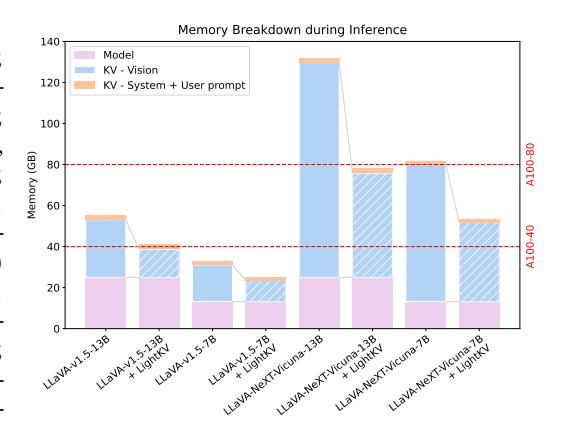
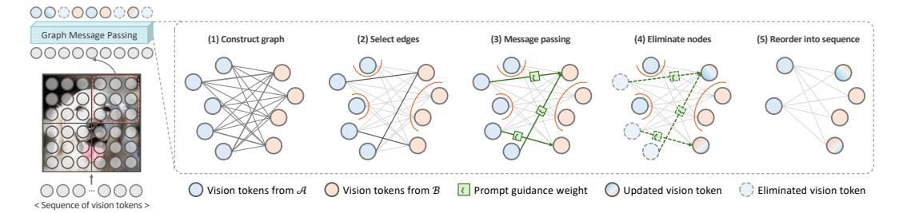
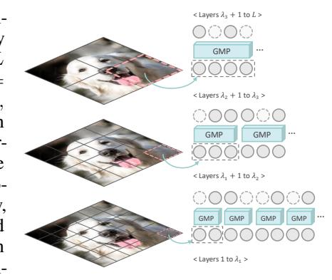
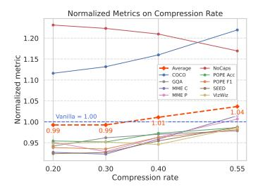
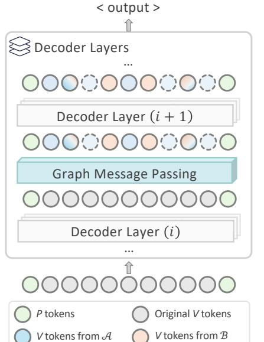
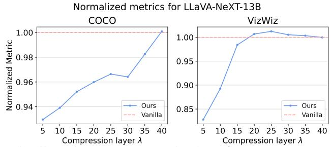
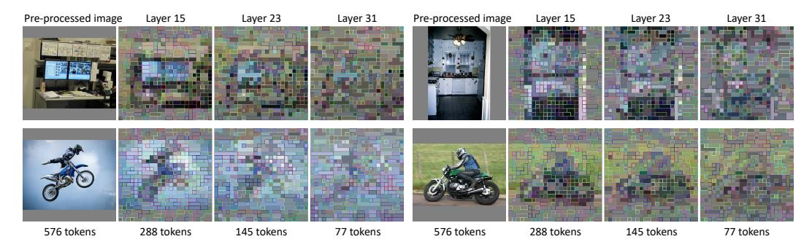

# MAKE YOUR LVLM KV CACHE MORE LIGHTWEIGHT

### Anonymous authors

002

004

010

011

012

013

014

015

016

017

018

019

021

023

025 026

027

030

031

032

033

037

040

041

042

043

044

045

046

047

048

049

052

Paper under double-blind review

### **ABSTRACT**

Key-Value (KV) cache has become a *de facto* component of modern Large Vision-Language Models (LVLMs) for inference. While it enhances decoding efficiency in Large Language Models (LLMs), its direct adoption in LVLMs introduces substantial GPU memory overhead due to the large number of vision tokens processed during the prefill stage. To tackle this problem, we propose LightKV, a novel approach that reduces KV cache size by exploiting the redundancy among vision-token embeddings. Guided by text prompts, LightKV employs cross-modality message passing to aggregate informative messages across vision tokens and progressively compress them during prefill. This prompt-aware guidance distinguishes our method from prior vision-only compression strategies. We evaluate LightKV on eight open-source LVLMs across eight public benchmarks, such as MME and SeedBench. Experimental results demonstrate that with only 50% of the original vision tokens, LightKV (i) halves KV cache size, (ii) reduces computation by up to 40%, and (iii) preserves general-purpose performance while significantly outperforming existing baselines.

### 1 Introduction

Benefiting from the rapid advancements in Large Language Models (LLMs) (Vicuna Team, 2023; OpenAI, 2024; Meta, 2024), Large Vision-Language Models (LVLMs) (Alayrac et al., 2022; Li et al., 2023b; Dai et al., 2023; Bai et al., 2023; Liu et al., 2023a; 2024b;c; Lu et al., 2024; Chen et al., 2024d;c; Wang et al., 2025; Chen et al., 2025) have recently garnered extensive attention. For example, LLaVA (Liu et al., 2023a) and DeepSeek-VL (Lu et al., 2024) have achieved impressive performance on a multitude of generalpurpose multi-modal benchmarks (Fu et al., 2024; Yu et al., 2024; Li et al., 2023c). Despite their potential, the efficiency of LVLMs remains a significant bottleneck for researchers and practitioners in resource-constrained environments.

Key-Value (**KV**) cache (Pope et al., 2023; Kwon et al., 2023) serves as a fundamental technique in optimizing the inference efficiency of mainstream LLMs and LVLMs. However, though the infer-

Figure 1: Breakdown of memory consumption in LLaVA models during the prefill stage shows the substantial reduction in KV cache usage with LightKV. Note that LLaVA-NeXT uses  $4\times$  the *vision tokens* as LLaVA-v1.5, resulting in a sharp increase in the memory consumption.

ence speed is improved without compromising model performance, the GPU memory consumed becomes more substantial. This limitation is especially severe with longer sequences generated (Yang et al., 2024; Liu et al., 2024a; Li et al., 2024d). To alleviate this issue, some training-based methods, such as MQA (Hu et al., 2025) and GQA (Ainslie et al., 2023), introduce the sharing of keys and values across attention heads. The overall KV cache size is accordingly reduced. These approaches, however, suffer from the requirement of heavy model retraining. In contrast, methods such as H2O (Zhang et al., 2023b), MiniCache (Liu et al., 2024a), and ElasticCache (Liu et al., 2024d) focus on pruning tokens within the KV cache *during inference* after the prefill stage. These methods offer greater flexibility and can be seamlessly applied to existing decoder-only models with minimal degradation in performance. *Given this, we primarily focus on token reduction during inference time*.

**059**

**061**

**072 073 074**

**079**

**094**

Unlike LLMs, reducing the cost of memory-bound KV cache is challenging in LVLMs due to the following two factors: (i) Tokens in LVLMs are heterogeneous, representing both image patches and text. Determining which tokens should be pruned thus becomes more difficult; (ii) The number of tokens computed during the *prefill stage* is significantly larger than that in LLMs. Each image or video frame in LVLMs is embedded into hundreds to thousands of tokens upfront (e.g. 576 in LLaVA-1.5 [\(Liu et al., 2023a\)](#page-12-1) and 7,290 in LLaVA-OneVision [\(Li et al., 2024a\)](#page-11-3)), a considerable amount compared to the context lengths of LLMs (see Fig. [1\)](#page-0-0) [\(Meta, 2024;](#page-12-0) [Jiang et al., 2023;](#page-11-4) [Vicuna](#page-13-0) [Team, 2023\)](#page-13-0). As a result, current LVLMs are limited by significantly heavier GPU memory usage than their LLM counterparts during the prefill stage. A few recent studies have proposed addressing the first challenge on token heterogeneity [\(Chen et al., 2024a;](#page-9-3) [Li et al., 2024c\)](#page-11-5). However, existing research on solving the second remains largely sparse.

In this paper, we propose LightKV, a novel method for optimizing KV cache storage in LVLMs during the prefill stage without retraining. To this end, we leverage cross-modal prompt guidance for the compression of vision tokens. Our method follows a three-step design. *First*, we conceptually map each vision token to a graph node, constructing a bipartite graph with edges representing a feature divergence (FD) metric between the connected nodes. Nonetheless, computing FD in a pairwise manner is still expensive, especially with a large number of vision tokens. To alleviate this problem, *second*, we split the vision tokens into subwindows based on their original spatial locations. This allows us to reduce the complexity of computing FD and aggregating information across tokens, thus improving efficiency. *Third*, our method does not follow existing studies [\(Chen et al., 2024b\)](#page-9-4) to perform vision token reduction independently, as the text prompts offer more informative signals for vision token importance. Consequently, we propose to leverage on-the-fly attention scores from text prompts for informed token updates. As found in our experiments, though this approach has been largely ignored by the existing literature, it delivers superior results than state-of-the-art baselines.

We apply LightKV to eight state-of-the-art LVLM models: LLaVA-v1.5-13B, LLaVA-v1.5-7B [\(Liu](#page-12-1) [et al., 2023a\)](#page-12-1), LLaVA-NeXT-13B, LLaVA-NeXT-7B [\(Liu et al., 2024b\)](#page-12-2), InternVL2-8B [\(Chen](#page-10-2) [et al., 2024c\)](#page-10-2), EVE-7B-v1, EVE-7B-v1-HD [\(Diao et al., 2025\)](#page-10-5), Qwen2.5-VL [\(Bai et al., 2025\)](#page-9-5) and conduct extensive experiments across eight benchmarks: COCO Caption [\(Lin et al., 2014\)](#page-12-9), GQA [\(Hudson & Manning, 2019\)](#page-11-6), MME [\(Fu et al., 2024\)](#page-10-4), NoCaps [\(Agrawal et al., 2019\)](#page-9-6), POPE [\(Li](#page-12-5) [et al., 2023c\)](#page-12-5), SeedBench [\(Li et al., 2024b\)](#page-11-7), ScienceQA [\(Lu et al., 2022\)](#page-12-10), and VizWiz [\(Gurari et al.,](#page-11-8) [2018\)](#page-11-8). Our results demonstrate that LightKV can reduce the KV memory of vision tokens by 50% while maintaining, sometimes even surpassing, the vanilla LVLM performance. Furthermore, when constrained with the same token length generation budget, the inference overhead (in FLOPs) is significantly improved by 40%.

In summary, LightKV reduces the KV cache footprint in LVLMs by compressing vision tokens during the *prefill* stage under the guidance of text prompts. This prompt-aware design distinguishes it from existing SOTA vision-only methods, delivering (i) greater efficiency and (2) superior benchmark performance. Importantly, LightKV is entirely *training-free* and can be seamlessly applied to a wide range of LVLMs, including both vision encoder–based and encoder-free models.

## 2 RELATED WORK

Large vision-language models Following the success of large language models (LLMs) in the language domain [\(Vicuna Team, 2023;](#page-13-0) [OpenAI, 2024;](#page-13-1) [Meta, 2024\)](#page-12-0), large vision-language models (LVLMs) have showcased pervasive progress on various multimodal tasks [\(Team, 2024b;](#page-13-5)[a;](#page-13-6) [Driess](#page-10-6) [et al., 2023\)](#page-10-6). Current LVLMs primarily fall into the following three directions: (i) Fusion-based methods directly include vision information into the LLM decoders using cross-attention [\(Alayrac](#page-9-0) [et al., 2022;](#page-9-0) [Awadalla et al., 2023;](#page-9-7) [Li et al., 2023a;](#page-11-9) [Gong et al., 2023\)](#page-11-10). (ii) Query-based LVLMs extract vision information with learnable query tokens, which are then concatenated with text tokens [\(Li et al.,](#page-11-0) [2023b;](#page-11-0) [Dai et al., 2023;](#page-10-0) [Zhu et al., 2024;](#page-14-2) [Li et al., 2024c;](#page-11-5) [Zhang et al., 2023a\)](#page-14-3). (iii) Projection-based methods, instead, directly map the encoded tokens from a vision encoder into the text space [\(Liu et al.,](#page-12-1) [2023a;](#page-12-1) [2024b;](#page-12-2)[c;](#page-12-3) [Li et al., 2024a;](#page-11-3) [Bai et al., 2023;](#page-9-1) [Huang et al., 2023;](#page-11-11) [Diao et al., 2025\)](#page-10-5). However, despite their simplicity and effectiveness, the projection of vision tokens leads to a substantial increase in memory footprint.

KV cache optimization KV cache has been widely used in LLMs and LVLMs to improve their inference efficiency [\(Dao et al., 2022;](#page-10-7) [Pope et al., 2023;](#page-13-3) [Kwon et al., 2023;](#page-11-1) [Lee et al., 2024\)](#page-11-12). The core idea is to store the key and value tokens to reduce future redundant computations. However, in situations with long contexts, keeping the KV cache imposes an increased burden on GPU memory. Existing approaches addressing this can be roughly categorized into two groups: (i) KV-sharing-based and (ii) token-reduction-based. Specifically, methods from the (i) improve the multi-headed attention mechanism to achieve efficiency. For instance, MQA [\(Hu et al., 2025\)](#page-11-2) and GQA [\(Ainslie et al., 2023\)](#page-9-2) propose the sharing of keys and values across attention heads [\(Vaswani et al., 2017\)](#page-13-7), reducing the amount of KV needed to be cached. In contrast, methods from the (ii) reduce KV cache size by pruning or merging tokens based either on minimal importance [\(Zhang et al., 2023b;](#page-14-1) [Li et al., 2024d;](#page-12-7) [Cai et al., 2024\)](#page-9-8) or attention consistency across layers [\(Liu et al., 2023b;](#page-12-11) [2024d;](#page-12-8) [Yang et al., 2024\)](#page-13-4). Beyond LLMs, some initial efforts have been devoted to optimizing the KV cache for LVLMs. In particular, LLaVolta [\(Chen et al., 2024a\)](#page-9-3), IVTP [\(Huang et al., 2024\)](#page-11-13) and FastV [\(Chen et al., 2024b\)](#page-9-4) propose pruning vision tokens at the decoder layers of the LLM backbone. The first two require model retraining; FastV, though training-free, prunes vision tokens without cross-modality guidance, yielding inconsistent results across models and benchmarks. In contrast, LightKV leverages guidance from text tokens to deliver more consistent and superior performance.

Vision token compression Tokens in vision transformers (ViTs) [\(Dosovitskiy et al., 2021\)](#page-10-8) often exhibit high redundancy [\(Bolya et al., 2023;](#page-9-9) [Pan et al., 2022;](#page-13-8) [Chen et al., 2024b\)](#page-9-4). To address this, some approaches train modules to identify and discard less important tokens [\(Rao et al., 2021;](#page-13-9) [Bonnaerens & Dambre, 2023;](#page-9-10) [Yin et al., 2022;](#page-14-4) [Fayyaz et al., 2022;](#page-10-9) [Wei et al., 2023;](#page-13-10) [Chen et al.,](#page-10-10) [2023;](#page-10-10) [Zhang et al., 2024;](#page-14-5) [Mao et al., 2025\)](#page-12-12). Some other typical methods first group tokens based on similarity or distance [\(Bolya et al., 2023;](#page-9-9) [Tran et al., 2024;](#page-13-11) [Kim et al., 2024;](#page-11-14) [Alvar et al., 2025\)](#page-9-11) or image segmentation [\(Xu et al., 2022;](#page-13-12) [Lu et al., 2023\)](#page-12-13) and then prune or merge the tokens with the maximum similarity. These methods either (i) require the training of additional module(s), or (ii) do not support the vision-language joint reasoning as in LVLMs.

## 3 METHOD

**114 115**

## 3.1 PRELIMINARIES

Recent LLMs often operate in an autoregressive fashion: given a sequence of p text prompt tokens [x1, . . . , xp] (including both system prompt and user prompt), and t − p previously generated tokens [xp+1, . . . , xt], an LLM with parameters Θ predicts the next token xt+1 with:

$$x_{t+1} \sim \mathbb{P}_{\Theta}(x_{t+1} \mid \underbrace{x_1, \dots, x_p}_{\text{Prompt tokens}}, \underbrace{x_{p+1}, \dots, x_t}_{\text{Generated tokens}}).$$
 (1)

The above process is often implemented in two stages: prefill and generation [\(Golden et al.,](#page-10-11) [2024\)](#page-10-11). During *prefill*, the model tokenizes all p prompt tokens and computes the queries Qp = [q1, q2, . . . , qp], similarly for keys Kp and values Vp [\(Vaswani et al., 2017\)](#page-13-7). In contrast, during *generation*, when a new token arrives, the model first obtains the query qt+1, key kt+1, and value vt+1 vectors. It then computes the attention matrix by applying qt+1 to the full set of keys Kt+1:

$$\mathbf{A} = \operatorname{softmax} \left( \mathbf{q}_{t+1} \ K_{t+1}^{\top} / \sqrt{d_k} \right), \tag{2}$$

where dk represents the embedding dimension. In practice, the attention output would be a concatenation of matrices A = [A1, . . . , AH] from H independent attention heads.

KV cache From the above, we observe that the autoregressive nature of LLMs allows for the previously computed *keys* Kt and *values* Vt to be reused in future time steps during generation. This operation reduces the computational overhead by preventing the recomputation of key and value tokens [\(Xu et al., 2025\)](#page-13-13). However, an increased consumption of GPU memory is usually induced by the growing size of the KV cache. This is often manifested as: (i) generating lengthy sequences and (ii) caching many contexts during prefill. In this work, we primarily focus on improving the second.

Figure 2: Method overview of intra-window token compression. Step 1: Construct a bipartite graph by splitting the vision tokens into sets A (blue) and B (orange), weigh each edge by an FD metric, as defined in Eq. [5.](#page-3-0) Step 2: Select edges with the smallest ⌊ρv/2⌋ FD values and delete the rest. Unconnected nodes are left unchanged. Step 3: Pass messages from nodes in A to nodes in B weighted by its attention ξ, as defined in Eq. [7.](#page-4-0) Aggregate messages and update nodes in B. Step 4: Eliminate now-redundant nodes from A. Step 5: Reorder the remaining nodes into a sequence of vision tokens, serving as input to the next decoder layer.

LVLMs LVLMs build on LLMs by extending their architecture to process visual information. A common paradigm in LVLMs is to first map the split image patches into tokens using ViTbased encoders [\(Dosovitskiy et al., 2021;](#page-10-8) [Radford et al., 2021;](#page-13-14) [Bao et al., 2022\)](#page-9-12), which are then concatenated with the prompt tokens to form the input sequence. In general, LVLMs generate tokens by conditioning on both text prompt tokens and vision tokens:

$$x_{t+1} \sim \mathbb{P}_{\Theta}\left(x_{t+1} \mid \underbrace{x_1, \dots, x_p}_{\text{Prompt tokens}}, \underbrace{x_{p+1}, \dots, x_{p+v}}_{\text{Vision tokens}}, \underbrace{x_{p+v+1}, \dots, x_t}_{\text{Generated tokens}}\right). \tag{3}$$

We denote Xv as the sequence of v vision tokens in Eq. [3.](#page-3-1) Similar to LLMs, KV cache is a key component in speeding up inference in LVLMs. In this paper, we focus primarily on compressing vision tokens for two reasons: (i) as shown in Fig. [1,](#page-0-0) vision tokens greatly outnumber text prompt tokens; (ii) preliminary studies showed that reducing text tokens causes harsh performance degradation.

### 3.2 LIGHTKV

**169**

**184**

**186 187**

**204**

As illustrated in Fig. [2,](#page-3-2) the pipeline of LightKV functions as follows: At each specified decoder layer during the prefill stage, given a sequence of vision tokens, we first reconstruct their grid structure as in the original image. These tokens are then partitioned into w × w small, non-overlapping windows, each containing an equal number of tokens. Within each window, we perform graph message passing to compress vision tokens, simultaneously reducing both KV size and the length of the vision input to the next decoder layer (as detailed in Sec. [3.2.1\)](#page-3-3). A similar operation is repeated in later decoder layers with larger window sizes to achieve inter-window compression (further elaborated in Sec. [3.2.2\)](#page-4-1).

## 3.2.1 INTRA-WINDOW TOKEN COMPRESSION

To address redundancy in vision tokens, we utilize graph message passing to aggregate information with low FD (defined below in Eq. [5\)](#page-3-0), and then eliminate redundant nodes in *each* window ω. Note that the message passing and update procedure is performed independently for each window.

Graph construction We limit and refer the vision tokens in a window to a bipartite graph. For notational simplicity, we slightly abuse x as the embedding of a vision node. Step 1: In each window, we first map each token x to a graph node, with X = {x|x ∈ Xv}. Next, we split the set of nodes into two subsets XA and XB (colored blue and orange respectively in Fig. [2\)](#page-3-2) of near-equal cardinality, and construct a bipartite graph from the two sets with edges E:

$$\mathcal{E} = \mathcal{X}_{\mathcal{A}} \times \mathcal{X}_{\mathcal{B}} = \{ (\mathbf{x}_{\alpha}, \mathbf{x}_{\beta}) \mid \forall \mathbf{x}_{\alpha} \in \mathcal{X}_{\mathcal{A}}, \forall \mathbf{x}_{\beta} \in \mathcal{X}_{\mathcal{B}} \},$$
(4)

where × denotes set cross product. We modify the feature divergence (FD) in [\(Tran et al., 2024;](#page-13-11) [Wang et al., 2024\)](#page-13-15) to weigh each edge in the graph:

$$FD(\alpha, \beta) = 1 - \frac{\langle \mathbf{x}_{\alpha}, \mathbf{x}_{\beta} \rangle}{||\mathbf{x}_{\alpha}|| \ ||\mathbf{x}_{\beta}||},$$
(5)

where  $\langle \cdot, \cdot \rangle$  denotes the inner product and  $||\cdot||$  is the  $L^2$ -norm. Step 2: We define the adjacency matrix  $M \in \{0,1\}^{|\mathcal{X}_{\mathcal{A}}| \times |\mathcal{X}_{\mathcal{B}}|}$  where:

$$M_{\alpha,\beta} = \begin{cases} 1, & \text{if } (\alpha,\beta) \in \mathcal{T}\rho, \\ 0, & \text{otherwise,} \end{cases}$$
 (6)

to select  $\lfloor \rho v/2 \rfloor$  pairs of  $(\alpha, \beta)$  with the smallest values of  $FD(\alpha, \beta)$  as  $\mathcal{T}_{\rho}$ , where  $\rho$  is the chosen compression ratio. Edges not in  $\mathcal{T}_{\rho}$  are temporarily removed and the remaining unconnected nodes  $\mathcal{X}_{\mathcal{R}} = \{\mathbf{x}_r | \nexists \beta \text{ s.t.}(r, \beta) \in \mathcal{T}_{\rho}\}$  are left unchanged.

**Token message passing** In LVLMs, the heterogeneity of tokens introduces a challenge in evaluating the importance of each vision token, and prior works often disregard this by compressing tokens uniformly without accounting for their relative significance. Instead, LightKV reuses the attention weights from the LLM decoder to estimate token importance, which are *readily available during* the prefill stage without additional computation, as computed in Eq. 2. This serves as a signal to preserve the visual features that are most important to the prompt, and is used as guidance in the message-aggregation process. **Step 3**: Given  $\mathbf{A} \in \mathbb{R}^{H \times (p+v) \times (p+v)}$  is the H-headed attention matrix before the attention mask, for a vision token with index i, we accumulate its attention from prompts:

$$\xi_i = \sum_{h=1}^{H} \sum_{j \in \mathcal{J}} \mathbf{A}[h, i, j], \tag{7}$$

where  $\mathcal{J}$  is the set of indices for the p prompt tokens. Next, we gather the attention for each window  $\omega$  into vectors  $\boldsymbol{\xi}_{\mathcal{A}} \in \mathbb{R}^{|\mathcal{X}_{\mathcal{A}}|}$  and  $\boldsymbol{\xi}_{\mathcal{B}} \in \mathbb{R}^{|\mathcal{X}_{\mathcal{B}}|}$  with the same partitions as  $\mathcal{X}_{\mathcal{A}}$  and  $\mathcal{X}_{\mathcal{B}}$ . We update  $X_{\mathcal{B}}$  by accumulating messages from its adjacent tokens:

$$X_{\mathcal{B}} = \underbrace{\left(\boldsymbol{\xi}_{\mathcal{B}} + \boldsymbol{M}^{\top} \boldsymbol{\xi}_{\mathcal{A}}\right)^{-1}}_{\text{(iii) Normalize by sum of attentions}} \left(\underbrace{X_{\mathcal{B}} \odot \boldsymbol{\xi}_{\mathcal{B}}}_{\text{(i) Prompt-guidance for } \mathcal{B}} + \boldsymbol{M}^{\top} \underbrace{\left(X_{\mathcal{A}} \odot \boldsymbol{\xi}_{\mathcal{A}}\right)}_{\text{(i) Prompt-guidance for } \mathcal{A}}\right), \quad (8)$$

where  $\odot$  is the Hadamard product. This can be broken down into three parts: (i) Messages from each token  $\mathbf{x}_i$  are first weighed by its attention  $\xi_i$ . (ii) Next, sessages from the tokens in  $\mathcal{X}_{\mathcal{A}}$  are passed to those in  $\mathcal{X}_{\mathcal{B}}$  through the edges defined in M, updating tokens in  $\mathcal{X}_{\mathcal{B}}$ . The chosen direction is arbitrary but symmetrical. (iii) Finally, tokens in  $\mathcal{X}_{\mathcal{B}}$  are normalized to remain scale-invariant.

Importantly, our aggregation operation utilizes the attention  $\xi$  as guidance, ensuring the preservation of visual information that is most relevant to the prompt and the generation of the final response. **Step 4**: After the update, the now-redundant nodes in  $\mathcal{X}_{\mathcal{A}} \setminus \mathcal{X}_{\mathcal{R}}$  are deleted. **Step 5**: Finally, the unchanged tokens  $\mathcal{X}_{\mathcal{R}}$  and the updated  $\mathcal{X}_{\mathcal{B}}$  are concatenated to form the final sequence of tokens for window  $\omega$ .

**Complexity** In contrast to computing fully pairwise FD among  $v_{\omega} = v/(w \times w)$  vision tokens—which requires  $\frac{1}{2}v_{\omega}(v_{\omega}-1)$  time complexity, the bipartite matching strategy improves computational efficiency by reducing this number by half to  $\sim \frac{1}{4}(v_{\omega})^2$ .

**Difference from ToMe** LightKV adopts a bipartite matching approach, similar to ToMe (Bolya et al., 2023), to reduce the cost of pairwise calculations. However, ToMe and subsequent methods assume all tokens are equally important, merging them without differentiation. In contrast, LightKV uses cross-modality attention to guide message passing and aggregation, preserving the most relevant information during compression, yielding superior results (see Sec. 4).

### 3.2.2 Inter-window token compression

Window partitioning As discussed above, we split the entire set of vision tokens into window partitions in a non-overlapping manner. Specifically, each window  $\omega$  contains  $v_{\omega} = v/(w \times w)$  vision tokens. This reduces the total number of operations involved in computing FD measures from the original  $\frac{1}{2}v(v-1)$  to  $\frac{1}{2}\frac{v}{w^2}(\frac{v}{w^2}-1)\times w^2\to \frac{1}{2}v(\frac{v}{w^2}-1)$ . Moreover, since spatially adjacent patches typically share semantic similarities, our window-based method confines message aggregation to within a small locality, preserving the positional information of tokens in the original image (Song et al., 2024; Norouzi et al., 2024). A global message passing strategy might inadvertently aggregate information from tokens representing unrelated entities, compromising locality and semantic coherence (Xu et al., 2022; Pan et al., 2022).

Hierarchical structure We adopt a hierarchical compression strategy to improve efficiency, as inspired by Swin-Transformer (Liu et al., 2021). In an LVLM with L layers, we perform s < L compression iterations. Let  $\Lambda =$  $[\lambda_1, \dots, \lambda_s], \ \mathcal{W} = [w_1^2, \dots, w_s^2], \ \mathcal{P} = [\rho_1, \dots, \rho_s],$ where  $\lambda_i$  is the index of the decoder layer where vision tokens are compressed,  $w_i^2$  is the number of window partitions used at iteration i with  $w_i > w_{i+1}$ , and  $\rho_i$  is the compression ratio. After each decoder layer  $\lambda_i$ , the tokens are divided into  $w_i^2$  windows. Within each window, vision-token messages are aggregated and compressed with ratio  $\rho_i$ , and only a fraction  $(1 - \rho_i)$  of the vision tokens remains in subsequent layers. After each compression iteration, the number of windows is decreased (smaller w) to allow for message passing across greater spatial distances, as depicted in Fig. 3.

Figure 3: After each compression step, w is reduced to allow message passing across greater spatial distances.

#### 3.3 COMPLEXITY ANALYSIS

Without any compression, the prefill stage processes in total  $v \times L$  vision tokens1. With compression, the number of vision tokens processed during pre-fill now reduces to:

$$v \times \left\{ \lambda_1 + \sum_{i=2}^{s} \left( (\lambda_i - \lambda_{i-1}) \prod_{j=1}^{i-1} (1 - \rho_j) \right) + (L - \lambda_s) \prod_{j=1}^{s} (1 - \rho_j) \right\} < v \times L.$$
 (9)

For an LVLM with L=40 decoder layers, choosing  $\Lambda=[10,20,30]$  and  $\mathcal{P}=[0.5,0.5,0.5]$  reduces the vision token count to 46.9% of the baseline. This is further elaborated in Sec. D.3.

### 4 EXPERIMENTS

#### 4.1 Experimental settings

**LVLM base models** We evaluated the efficiency and performance of LightKV by applying it to eight open-source LVLMs: LLaVA-v1.5-13B, LLaVA-v1.5-7B, LLaVA-NeXT-13B, LLaVA-NeXT-7B, InternVL2-8B, EVE-7B-v1, EVE-7B-v1-HD, and Qwen2.5-VL-7B-Instruct. LLaVA-v1.5 encodes 576 vision tokens per image, while LLaVA-NeXT uses 2,144. In contrast, InternVL2 and Qwen2.5-VL adopt dynamic vision encoding, with token counts determined by image resolution. It is worth noting that, unlike other models, which employ a dedicated image encoder, EVE is vision encoder-free. These methods are labeled as *Vanilla* in our results.

**Datasets** We utilized eight publicly available large-scale benchmarks for evaluation: COCO Caption (Lin et al., 2014), GQA (Hudson & Manning, 2019), MME (Fu et al., 2024), NoCaps (Agrawal et al., 2019), POPE (Li et al., 2023c), SeedBench (Li et al., 2024b), ScienceQA (Lu et al., 2022), and VizWiz (Gurari et al., 2018). These benchmarks cover a wide range of tasks, from general, everyday image understanding to fine-grained image reasoning. MME, POPE, SeedBench Lite, and ScienceQA are limited to single-choice answers, while COCO Caption, GQA, NoCaps, and VizWiz involve open-ended responses comprising long sentences.

**Compared baselines** We adapted two existing techniques from other related domains: ToMe (Bolya et al., 2023) (labeled *ToMe* (*C*)) and *ElasticCache* (Liu et al., 2024d). For comparison, we implemented two random-eviction baselines: *Rand* and *ImgRand*. *Rand* and *ElasticCache* prune both text and vision tokens, whereas *ImgRand* and ToMe reduce vision tokens only. It is important to note that the previously mentioned methods perform token reduction *after* the prefill stage. Additionally, for token reduction *during* prefill, we implemented ToMe (labeled *ToMe* (*P*)) and four recent SOTA strategies: *FastV* (Chen et al., 2024b), *PiToMe* (Tran et al., 2024), *ToFu* (Kim et al., 2024) and *HiRED*2 (Arif et al., 2025).

&lt;sup>1We omit the double estimation of key and value cache for simplicity.

&lt;sup>2Uses the same model but with HuggingFace optimizations; efficiency metrics are omitted for fairness.

Table 1: Results of LightKV on LLaVA models at 55% compression of vision tokens in the KV cache. **Avg** % denotes the average of all performance metrics normalized against the vanilla model. Methods in each category are then sorted from lowest to highest Avg score.

|                | Method           | FLOPS \      | Mem↓         | TTFT↓          |              |                    | ME               | . NoCaps     | PO           |              | SEED | VizWiz       | Avg %                 |
|----------------|------------------|--------------|--------------|----------------|--------------|--------------------|------------------|--------------|--------------|--------------|------|--------------|-----------------------|
|                |                  | (Tera)       | (GB)         | (sec)          |              | С                  | P                |              | Acc          | F1           |      |              |                       |
|                | Vanilla          | 19.4         | 0.55         | 0.111          | 1.16         | 295.4              | 1532.0           | 1.09         | 0.87         | 0.86         | 0.69 | 0.57         | 100.00                |
|                | Elastic          | 19.3         | 0.31         | 0.568          | 0.96         | Post pres 295.4 | 1534.5           | 0.87         | 0.43         | 0.96         | OOM  | 0.14         | 68.54                 |
| 3B             | Rand             | 19.0         | 0.31         | 0.118          | 0.48         | 295.4              | 1532.9           | 0.46         | 0.46         | 0.89         | 0.70 | 0.14         | 70.53                 |
| $\Xi$          | ImgRand          | 19.0         | 0.31         | 0.117          | 0.46         | 295.4              | 1532.9           | 0.86         | 0.40         | 0.91         | 0.70 | 0.19         | 85.09                 |
| 1:5            | ToMe (C)         | 19.0         | 0.33         | 0.117          | 1.00         | 295.4              | 1532.9           | 0.92         | 0.79         | 0.88         | 0.70 | 0.18         | 87.10                 |
| LLaVA-v1.5-13B | TOIVIC (C)       | 17.0         | 0.55         | 0.123          |              | uring pr           |                  | 0.72         | 0.77         | 0.00         | 0.70 | 0.10         | 07.10                 |
| aZ/            | ToFu             | 12.6         | 0.37         | 0.081          | 1.14         | 292.1              | 1535.7           | 1.08         | 0.86         | 0.86         | 0.38 | 0.55         | 93.36                 |
| H              | PiToMe           | 12.6         | 0.37         | 0.082          | 1.14         | 297.5              | 1529.0           | 1.07         | 0.87         | 0.85         | 0.38 | 0.55         | 93.42                 |
| _              | ToMe (P)         | 12.6         | 0.37         | 0.081          | 1.16         | 297.5              | 1529.9           | 1.07         | 0.87         | 0.86         | 0.39 | 0.55         | 93.96                 |
|                | LightKV          | 12.6         | 0.37         | 0.084          | 1.15         | 302.1              | 1543.8           | 1.08         | 0.87         | 0.86         | 0.69 | 0.56         | 99.94                 |
|                | FastV            | 12.4         | 0.36         | 0.077          | 1.16         | 308.9              | 1546.6           | 1.09         | 0.86         | 0.85         | 0.68 | 0.57         | 100.22                |
|                | Vanilla          | 10.2         | 0.35         | 0.064          | 1.10         | 355.7              | 1509.6           | 1.05         | 0.87         | 0.86         | 0.66 | 0.54         | 100.00                |
|                |                  | •            |              |                |              | Post prei          |                  |              |              |              |      |              | '                     |
|                | Elastic          | 10.2         | 0.20         | 0.428          | 0.41         | 350.4              | 1508.9           | 0.30         | 0.30         | 0.93         | OOM  | 0.09         | 52.95                 |
| ₽,             | Rand             | 9.9          | 0.21         | 0.070          | 0.13         | 350.4              | 1508.9           | 0.10         | 0.74         | 0.87         | 0.66 | 0.11         | 65.80                 |
| ιų             | ToMe (C)         | 10.0         | 0.20         | 0.075          | 0.13         | 350.4              | 1508.9           | 0.09         | 0.87         | 0.86         | 0.66 | 0.18         | 69.02                 |
| LLaVA-v1.5-7B  | ImgRand          | 9.9          | 0.20         | 0.070          | 0.22         | 350.4              | 1508.9           | 0.16         | 0.86         | 0.86         | 0.66 | 0.16         | 70.27                 |
| ¥              | II:DED           |              |              |                |              | uring pr           |                  | 1.00         | 0.05         | 0.00         | 0.66 | 0.50         | 06.45                 |
| Ē              | HiRED            | -            | -            | -              | 1.03         | 335.0              | 1452.0           | 1.00         | 0.85         | 0.83         | 0.66 | 0.53         | 96.45                 |
| $\Box$         | ToFu             | 6.6          | 0.23         | 0.051          | 1.09         | 340.0              | 1482.3           | 1.02         | 0.86         | 0.85         | 0.66 | 0.52         | 97.98                 |
|                | ToMe (P)         | 6.6          | 0.23         | 0.054          | 1.09         | 319.6              | 1490.5           | 1.01         | 0.87         | 0.86         | 0.66 | 0.52         | 97.52                 |
|                | PiToMe           | 6.6          | 0.23         | 0.053          | 1.08         | 341.0              | 1498.5           | 1.02         | 0.86         | 0.85         | 0.65 | 0.51         | 97.63                 |
|                | FastV LightKV | 5.3          | 0.22 0.23 | 0.047 0.051 | 1.10 1.11 | 351.1 357.5     | 1513.7 1519.8 | 1.04 1.03 | 0.85 0.87 | 0.83 0.86 | 0.66 | 0.54 0.53 | 99.03 <b>99.79</b> |
|                |                  |              |              |                |              |                    |                  |              |              |              |      |              |                       |
|                | Vanilla          | 65.0         | 1.75         | 0.386          | 1.02         | 318.9 Post prei | 1575.1           | 0.88         | 0.88         | 0.86         | 0.69 | 0.64         | 100.00                |
|                | Elastic          | I.           | _            | - 1            | OOM          | OOM                | OOM              | OOM          | OOM          | OOM          | OOM  | OOM          | 0.00                  |
| 3.             | Rand             | 60.8         | 0.91         | 0.396          | 0.06         | 318.9              | 1575.1           | 0.04         | 0.82         | 0.86         | 0.69 | 0.08         | 64.51                 |
| Ξ              | ToMe (C)         | 61.3         | 0.93         | 0.330          | 0.07         | 318.9              | 1575.1           | 0.04         | 0.82         | 0.86         | 0.69 | 0.08         | 65.48                 |
| ×              | ImgRand          | 60.8         | 0.93         | 0.392          | 0.07         | 318.9              | 1575.1           | 0.05         | 0.87         | 0.86         | 0.69 | 0.08         | 65.50                 |
| LLaVA-NeXT-13B | mgrand           | 00.0         | 0.71         | 0.572          |              | uring pr           |                  | 0.03         | 0.07         | 0.00         | 0.07 | 0.00         | 05.50                 |
| ×              | ToMe (P)         | 37.3         | 1.05         | 0.268          | 0.97         | 308.5              | 1551.0           | 0.84         | 0.87         | 0.86         | 0.34 | 0.60         | 90.96                 |
| Ę              | ToFu             | 37.3         | 1.05         | 0.268          | 0.97         | 305.0              | 1539.5           | 0.83         | 0.88         | 0.87         | 0.36 | 0.60         | 91.31                 |
| $\Box$         | PiToMe           | 37.3         | 1.05         | 0.270          | 0.98         | 311.9              | 1558.2           | 0.86         | 0.87         | 0.86         | 0.34 | 0.60         | 91.56                 |
|                | FastV            | 36.1         | 1.04         | 0.259          | 0.91         | 311.1              | 1477.5           | 0.81         | 0.82         | 0.78         | 0.68 | 0.61         | 93.80                 |
|                | LightKV          | 37.3         | 1.05         | 0.271          | 0.96         | 326.1              | 1576.5           | 0.83         | 0.87         | 0.86         | 0.69 | 0.61         | 98.12                 |
|                | Vanilla          | 34.8         | 1.12         | 0.225          | 1.00         | 330.0              | 1528.2           | 0.88         | 0.88         | 0.86         | 0.68 | 0.61         | 100.00                |
|                |                  | 1            |              |                |              | Post prei          |                  |              |              |              |      |              |                       |
| 2              | Elastic          | 34.7         | 0.58         | 1.675          | 0.02         | 332.1              | 1519.3           | 0.01         | 0.18         | 0.90         | OOM  | 0.08         | 42.67                 |
| 7.             | Rand             | 32.2         | 0.58         | 0.234          | 0.02         | 322.5              | 1523.2           | 0.01         | 0.65         | 0.87         | 0.68 | 0.08         | 61.08                 |
| ×              | ImgRand          | 32.2         | 0.58         | 0.234          | 0.02         | 322.5              | 1523.2           | 0.02         | 0.85         | 0.87         | 0.68 | 0.08         | 64.06                 |
| Š              | ToMe (C)         | 32.5         | 0.60         | 0.251          | 0.03         | 322.5              | 1523.2           | 0.02         | 0.87         | 0.86         | 0.68 | 0.08         | 64.33                 |
| LLaVA-NeXT-7B  | E437             | 10.5         | 0.65         | 0.140          |              | uring pr           |                  | 0.70         | 0.01         | 0.77         | 0.60 | 0.50         | 00.27                 |
| ē              | FastV            | 18.5         | 0.65         | 0.148          | 0.88         | 265.4              | 1341.3           | 0.78         | 0.81         | 0.77         | 0.69 | 0.58         | 90.37                 |
| I              | HiRED            | 21.1         | 0.67         | 0.155          | 0.73         | 297.9              | 1398.9           | 0.67         | 0.88         | 0.87         | 0.66 | 0.58         | 90.68                 |
|                | ToMe (P)         | 21.1         | 0.67         | 0.155          | 0.93         | 292.9              | 1419.0           | 0.78         | 0.88         | 0.87         | 0.65 | 0.57         | 94.18                 |
|                | ToFu             | 20.0         | 0.67         | 0.155          | 0.93         | 295.4              | 1427.2           | 0.78         | 0.88         | 0.87         | 0.66 | 0.57         | 94.52                 |
|                | PiToMe           | 20.0 22.3 | 0.67         | 0.157          | 0.94         | 292.1              | 1415.5           | 0.79 0.83 | 0.88         | 0.87         | 0.65 | 0.58         | 94.58                 |
|                | LightKV          | 22.3         | 0.67         | 0.159          | 0.98         | 338.6              | 1517.3           | 0.83         | 0.88         | 0.86         | 0.69 | 0.58         | 98.85                 |

Implementation details In our experiments, we retain the default parameters of the LVLM backbones and use greedy decoding for reproducibility. For FastV, we adopt the reported optimal setting of K=2 and vary only R to control the KV cache pruning ratio. For other methods, we adapted them to work with the LVLM backbones to the best of our abilities. To ensure consistency, we fix the configuration of LightKV's compression layers  $\Lambda$ , compression ratios  $\mathcal{P}$ , and window sizes  $\mathcal{W}$  across all benchmarks for each LVLM model. We utilized lmms-eval (Zhang et al., 2025) for all benchmark evaluations. We profiled the time-to-first-token (TTFT) and the generation latency for 100 tokens by averaging results over 10 runs on an NVIDIA A100 GPU.

### 4.2 Main results

We compare the performance of LightKV with other SOTA methods on LLaVA models (Table 1), InternVL (Table 2), EVE (Table 3) and Qwen2.5-VL (Fig. 4 and Table 7 in the appendix). For each LVLM model, we selected the optimal configurations of  $\Lambda$  and  $\mathcal W$  based on performance on COCO and MME, and applied these hyperparameters to the remaining benchmarks. We also profiled efficiency metrics, including FLOPS, KV cache memory (from prompt, vision, and generated tokens),

Table 2: Results of LightKV on InternVL2-8B at two compression rates of vision tokens in KV cache. "Avg %" denotes the average of all metrics normalized against the vanilla model. Methods in each category are then sorted from lowest to highest Avg score.

| Method    | FLOPS ↓ | Mem ↓ | TTFT ↓ | COCO       | GQA                  | M         | ME       | PO   | PE   | . SQA  | VizWiz | Avg %  |
|-----------|---------|-------|--------|------------|----------------------|-----------|----------|------|------|--------|--------|--------|
| 111011101 | (Tera)  | (GB)  | (sec)  | 0000       | ٠.,                  | C         | P        | Acc  | F1   | . 54.1 |        | 11,9 % |
| Vanilla   | 35.7    | 0.24  | 0.470  | 0.90       | 0.63                 | 587.5     | 1623.8   | 0.88 | 0.87 | 0.97   | 0.61   | 100.00 |
|           | •       |       | Dur    | ing prefil | ll, 60%              | vision co | mpressio | n    |      |        |        |        |
| FastV     | 24.8    | 0.15  | 0.520  | 0.80       | 0.50                 | 569.6     | 1610.9   | 0.47 | 0.87 | 0.49   | 0.53   | 81.90  |
| ToFu      | 24.0    | 0.15  | 0.520  | 0.81       | 0.62                 | 502.1     | 1575.5   | 0.87 | 0.86 | 0.94   | 0.60   | 95.49  |
| PiToMe    | 24.0    | 0.15  | 0.519  | 0.99       | 0.60                 | 461.8     | 1545.3   | 0.87 | 0.86 | 0.90   | 0.60   | 95.99  |
| ToMe (P)  | 24.0    | 0.15  | 0.523  | 0.87       | 0.62                 | 551.4     | 1621.8   | 0.87 | 0.86 | 0.95   | 0.60   | 97.86  |
| LightKV   | 24.0    | 0.15  | 0.519  | 0.91       | 0.63                 | 590.0     | 1623.8   | 0.88 | 0.87 | 0.97   | 0.61   | 100.19 |
|           | •       |       | Dur    | ing prefil | ll, 55% , | vision co | mpressio | n    |      |        |        |        |
| FastV     | 22.9    | 0.14  | 0.517  | 0.68       | 0.47                 | 582.1     | 1611.1   | 0.56 | 0.85 | 0.46   | 0.48   | 79.49  |
| PiToMe    | 22.9    | 0.14  | 0.518  | 1.00       | 0.61                 | 442.9     | 1575.5   | 0.87 | 0.86 | 0.90   | 0.57   | 95.54  |
| ToMe (P)  | 22.9    | 0.14  | 0.519  | 0.81       | 0.62                 | 503.9     | 1570.0   | 0.87 | 0.86 | 0.95   | 0.60   | 95.62  |
| ToFu      | 22.9    | 0.14  | 0.519  | 0.75       | 0.62                 | 541.8     | 1619.1   | 0.87 | 0.85 | 0.95   | 0.60   | 95.82  |
| LightKV   | 22.9    | 0.14  | 0.515  | 0.88       | 0.62                 | 590.0     | 1623.8   | 0.88 | 0.87 | 0.97   | 0.61   | 99.58  |

and time to first token (TTFT) when generating 100 tokens (standard deviation reported in the appendix). Our key findings are summarized as follows:

- Tables 1, 2, 3 and 7 show that LightKV consistently preserves the performance of the base LVLMs across most benchmarks. In some cases, our method even surpasses the performance of vanilla LVLMs without compression.
- Compared to methods applied *during the prefill stage*, LightKV either outperforms or achieves highly competitive results. Specifically, it ranks first in 3 out of 4 LLaVA models and second in the remaining one, while other baselines exhibit inconsistent rankings with major degradations in performance. When efficiency is considered alongside performance, baseline methods are largely inferior—showing poorer memory usage and less effective FLOP reduction.
- At even more aggressive compression ratios (e.g. 20% and 30%), LightKV is capable of retaining 99% average performance across multiple benchmarks on Qwen2.5-VL (Fig. 4 and Table 7). This further highlights the robustness of our method.
- LightKV is compatible with not only vision encoder-based LVLMs, but also with encoder-free models such as EVE, which seek to reduce the strong inductive bias in the vision encoders. As shown in Table 3, our approach substantially outperforms FastV at the same compression rate, better preserving the LVLM's original capabilities.
- Post-prefill approaches substantially degrade performance on open-ended tasks e.g. COCO and NoCaps. Additionally, they yield minimal improvements in computational efficiency, since the prefill stage remains the dominant bottleneck in LVLMs. In contrast, LightKV operates on the prefill stage within the decoder layers. This results in significantly lower computational cost and memory footprint, while achieving stronger performance across a series of benchmarks.

Table 3: Results of LightKV on EVE-7B-v1 models at 55% compression of vision tokens in the KV cache.

| Method    | COCO | M     | ME     | NoCaps    | PO   | PE   | VizWiz | Avg %  |  |  |  |
|-----------|------|-------|--------|-----------|------|------|--------|--------|--|--|--|
|           |      | C     | P      |           | Acc  | F1   |        |        |  |  |  |
| EVE-7B-v1 |      |       |        |           |      |      |        |        |  |  |  |
| Vanilla   | 0.96 | 269.2 | 1230.8 | 0.94      | 0.84 | 0.83 | 0.46   | 100.00 |  |  |  |
| FastV     | 0.85 | 259.3 | 1144.5 | 0.78      | 0.80 | 0.77 | 0.44   | 92.07  |  |  |  |
| LightKV   | 1.00 | 269.3 | 1203.1 | 0.93      | 0.84 | 0.83 | 0.43   | 99.20  |  |  |  |
|           |      |       | EVE    | -7B-v1-HD | )    |      |        |        |  |  |  |
| Vanilla   | 1.05 | 304.6 | 1314.1 | 1.02      | 0.86 | 0.85 | 0.56   | 100.00 |  |  |  |
| FastV     | 0.97 | 290.3 | 1238.6 | 0.93      | 0.83 | 0.82 | 0.55   | 94.90  |  |  |  |
| LightKV   | 0.97 | 291.4 | 1308.9 | 0.94      | 0.86 | 0.85 | 0.54   | 96.61  |  |  |  |

Figure 4: Effect of varying compression rates on Qwen2.5-VL.

### 4.3 Additional experiments

**Latency profiling** Table 4 illustrates the reduction in time to first token latency achieved by LightKV. Since our approach requires explicit attention matrices for token reduction, it is incompatible with

433

434

435

436

437

438

439 440

441

442

443

444

445

446

447

448

449 450

451

452

453

454

455 456

457

458

467 468

469

470

471

472

473

474

475 476

477

478

479

480

481

482

483 484 485 I/O-optimized mechanisms like FlashAttention (Dao et al., 2022). To overcome this, we selectively switch to eager computation in the small subset ( $s \ll L$ ) of layers where compression is applied, while retaining the optimized attention implementation for the majority. The marginal overhead introduced is effectively offset by the increased throughput gained from processing fewer vision tokens in the downstream layers. See Sec. E.3 for a more detailed analysis of both TTFT and the generation latency of 100 tokens with their corresponding standard deviations.

Table 4: Time to first token (ms)  $\pm$ Std. Dev. on LLaVA 13B models.

| Method  | LLaVA-v1.5     | LLaVA-NeXT     |
|---------|----------------|----------------|
| Vanilla | $111 \pm 0.91$ | $386 \pm 2.22$ |
| LightKV | $84 \pm 0.72$  | $271 \pm 0.79$ |

**Influence of hierarchical compression** We conducted experiments with the same configuration of  $\Lambda$  while varying the window sizes, as presented in Table 5. Across different compression layers  $\lambda$ , the results show a similar general trend: there is more pronounced degradation with a global compression strategy w = 1, likely due to the inadvertent destruction of spatial locality (Xu et al., 2022; Pan et al., 2022; Song et al., 2024; Norouzi et al., 2024). However, with larger values of w, similar degradation occurs. This is attributed to the small number of tokens within each window, resulting in the compression of mismatched tokens with high FD scores. Furthermore, we summarize the FLOPs and KV cache memory usage for different inference configurations in Table 6. The results indicate that larger window sizes in the early layers lead to higher efficiency improvements.

**Influence of compression layers** We investigate the impact of varying layers for token compression, as illustrated in Fig. 6 in the appendix. Trends between the compression layer and model performance reveal that compressing in the shallow layers has a more substantial impact on performance. This effect is particularly pronounced in VizWiz, where LVLMs must refrain from answering (e.g., when the ground truth is "unanswerable"). Compression in the deeper layers yields performance nearly identical to the base LVLM models, but offers little reduction in memory usage.

Table 5: Effect of varying window sizes w at various compression layers on InternVL-8B.

| Method    | w | COCO | GQA  | M     | ME             | POPE |      | . SQA | VizWiz |
|-----------|---|------|------|-------|----------------|------|------|-------|--------|
|           | ' |      | - (  | С     | P              | Acc  | F1   |       |        |
| Vanilla   | - | 0.90 | 0.63 | 587.5 | 1623.8         | 0.88 | 0.87 | 0.97  | 0.61   |
|           |   |      |      |       | $\lambda = 3$  |      |      |       |        |
|           | 1 | 0.80 | 0.62 | 547.5 | 1602.5         | 0.87 | 0.86 | 0.95  | 0.60   |
| >         | 2 | 0.83 | 0.59 | 555.0 | 1621.1         | 0.87 | 0.86 | 0.96  | 0.60   |
| LightKV   | 4 | 0.90 | 0.60 | 546.8 | 1594.8         | 0.87 | 0.85 | 0.95  | 0.60   |
| <u>19</u> |   |      |      |       | $\lambda$ = 14 |      |      |       |        |
| Ï         | 1 | 0.89 | 0.62 | 577.1 | 1615.8         | 0.87 | 0.86 | 0.97  | 0.61   |
|           | 2 | 0.90 | 0.62 | 577.1 | 1620.3         | 0.87 | 0.86 | 0.97  | 0.61   |
|           | 4 | 0.92 | 0.62 | 577.9 | 1617.5         | 0.88 | 0.86 | 0.97  | 0.61   |

Table 6: Profiling results by varying compression layers  $\Lambda$  and window sizes W on LLaVA 13B models.

|         |          |               | LLaVA- | 1.5-13B | LLaVA-N | NeXT-13B |
|---------|----------|---------------|--------|---------|---------|----------|
| Method  | Λ        | $\mathcal{W}$ | FLOPS  | Mem     | FLOPS   | Mem      |
| Vanilla | -        | -             | 19.4   | 0.55    | 65.0    | 1.75     |
| >       | 15,23,31 | 4,2,1         | 12.6   | 0.37    | 37.3    | 1.05     |
| 축       | 13,23,31 | 6,4,2         | 12.6   | 0.37    | 37.3    | 1.05     |
| LightKV | 17.24.31 | 4,2,1         | 13.1   | 0.38    | 39.0    | 1.09     |
| I       | 17,24,31 | 6,4,2         | 13.1   | 0.38    | 39.0    | 1.09     |

### CONCLUSION

In this paper, we present LightKV, a novel training-free approach for optimizing KV cache storage in general LVLMs. It leverages text-prompt-guided graph message passing and aggregation to informatively compress vision tokens during the *prefill* stage of inference. Our method is designed to be: (i) memory-efficient: by progressively and dynamically compressing vision nodes through a hierarchical multi-stage process; and (ii) compute-efficient: by employing window-based graph partitioning and bipartite matching to accelerate message aggregation. The experimental results demonstrate that our approach: (a) largely preserves the general-purpose performance of the base LVLM across multiple benchmarks, and (b) outperforms existing baselines in KV cache efficiency.

**Limitations** We acknowledge two limitations of this work: (i) LightKV leverages a bipartite graph matching algorithm, which splits vision tokens into two disjoint sets, then finds optimal pairings between nodes across the sets. This limits the compression rate to a maximum of 50% per step, thus requiring multiple iterations to achieve higher overall reduction. (ii) Furthermore, our method requires explicitly computing attention matrices for cross-modality guidance during a few compression steps, similar to other efficient methods (Chen et al., 2024b; Liu et al., 2023a), which are less compatible with FlashAttention (Dao et al., 2022).

# REFERENCES

**509**

**529 530**

- Harsh Agrawal, Karan Desai, Yufei Wang, Xinlei Chen, Rishabh Jain, Mark Johnson, Dhruv Batra, Devi Parikh, Stefan Lee, and Peter Anderson. Nocaps: Novel object captioning at scale. In *CVPR*, pp. 8948–8957, 2019.
- Joshua Ainslie, James Lee-Thorp, Michiel de Jong, Yury Zemlyanskiy, Federico Lebrón, and Sumit Sanghai. Gqa: Training generalized multi-query transformer models from multi-head checkpoints. *arXiv preprint arXiv:2305.13245*, 2023. doi: 10.48550/arXiv.2305.13245.
- Jean-Baptiste Alayrac, Jeff Donahue, Pauline Luc, Antoine Miech, Iain Barr, Yana Hasson, Karel Lenc, Arthur Mensch, Katherine Millican, Malcolm Reynolds, Roman Ring, Eliza Rutherford, Serkan Cabi, Tengda Han, Zhitao Gong, Sina Samangooei, Marianne Monteiro, Jacob L. Menick, Sebastian Borgeaud, Andy Brock, Aida Nematzadeh, Sahand Sharifzadeh, Mikołaj Binkowski, ´ Ricardo Barreira, Oriol Vinyals, Andrew Zisserman, and Karén Simonyan. Flamingo: A visual language model for few-shot learning. In *NeurIPS*, pp. 23716–23736, 2022.
- Saeed Ranjbar Alvar, Gursimran Singh, Mohammad Akbari, and Yong Zhang. Divprune: Diversitybased visual token pruning for large multimodal models. In *CVPR*, 2025. doi: 10.48550/arXiv. 2503.02175.
- Kazi Hasan Ibn Arif, JinYi Yoon, Dimitrios S. Nikolopoulos, Hans Vandierendonck, Deepu John, and Bo Ji. Hired: Attention-guided token dropping for efficient inference of high-resolution vision-language models. In *AAAI*, volume 39 of *AAAI'25/IAAI'25/EAAI'25*, pp. 1773–1781, 2025. ISBN 978-1-57735-897-8. doi: 10.1609/aaai.v39i2.32171.
- Anas Awadalla, Irena Gao, Josh Gardner, Jack Hessel, Yusuf Hanafy, Wanrong Zhu, Kalyani Marathe, Yonatan Bitton, Samir Gadre, Shiori Sagawa, Jenia Jitsev, Simon Kornblith, Pang Wei Koh, Gabriel Ilharco, Mitchell Wortsman, and Ludwig Schmidt. Openflamingo: An open-source framework for training large autoregressive vision-language models. *arXiv preprint arXiv:2308.01390*, 2023. doi: 10.48550/arXiv.2308.01390.
- Jinze Bai, Shuai Bai, Shusheng Yang, Shijie Wang, Sinan Tan, Peng Wang, Junyang Lin, Chang Zhou, and Jingren Zhou. Qwen-vl: A versatile vision-language model for understanding, localization, text reading, and beyond. *arXiv preprint arXiv:2308.12966*, 2023.
- Shuai Bai, Keqin Chen, Xuejing Liu, Jialin Wang, Wenbin Ge, Sibo Song, Kai Dang, Peng Wang, Shijie Wang, Jun Tang, Humen Zhong, Yuanzhi Zhu, Mingkun Yang, Zhaohai Li, Jianqiang Wan, Pengfei Wang, Wei Ding, Zheren Fu, Yiheng Xu, Jiabo Ye, Xi Zhang, Tianbao Xie, Zesen Cheng, Hang Zhang, Zhibo Yang, Haiyang Xu, and Junyang Lin. Qwen2.5-vl technical report. *arXiv preprint arXiv:2502.13923*, 2025. doi: 10.48550/arXiv.2502.13923.
- Hangbo Bao, Li Dong, Songhao Piao, and Furu Wei. Beit: Bert pre-training of image transformers. In *ICLR*, 2022.
- Daniel Bolya, Cheng-Yang Fu, Xiaoliang Dai, Peizhao Zhang, Christoph Feichtenhofer, and Judy Hoffman. Token merging: Your vit but faster. In *ICLR*, 2023.
- Maxim Bonnaerens and Joni Dambre. Learned thresholds token merging and pruning for vision transformers. *TMLR*, (2835-8856), 2023.
- Zefan Cai, Yichi Zhang, Bofei Gao, Yuliang Liu, Tianyu Liu, Keming Lu, Wayne Xiong, Yue Dong, Baobao Chang, Junjie Hu, and Wen Xiao. Pyramidkv: Dynamic kv cache compression based on pyramidal information funneling. *arXiv preprint arXiv:2406.02069*, 2024.
- Jieneng Chen, Luoxin Ye, Ju He, Zhao-Yang Wang, Daniel Khashabi, and Alan Yuille. Efficient large multi-modal models via visual context compression. In *NeurIPS*, pp. 73986–74007, 2024a.
- Liang Chen, Haozhe Zhao, Tianyu Liu, Shuai Bai, Junyang Lin, Chang Zhou, and Baobao Chang. An image is worth 1/2 tokens after layer 2: Plug-and-play inference acceleration for large visionlanguage models. In Aleš Leonardis, Elisa Ricci, Stefan Roth, Olga Russakovsky, Torsten Sattler, and Gül Varol (eds.), *ECCV*, pp. 19–35, 2024b. ISBN 978-3-031-73004-7. doi: 10.1007/ 978-3-031-73004-7\_2.

**558 559 560**

**564**

**579**

Mengzhao Chen, Wenqi Shao, Peng Xu, Mingbao Lin, Kaipeng Zhang, Fei Chao, Rongrong Ji, Yu Qiao, and Ping Luo. Diffrate : Differentiable compression rate for efficient vision transformers. In *ICCV*, pp. 17118–17128, 2023. doi: 10.1109/ICCV51070.2023.01574.

- Zhe Chen, Weiyun Wang, Hao Tian, Shenglong Ye, Zhangwei Gao, Erfei Cui, Wenwen Tong, Kongzhi Hu, Jiapeng Luo, Zheng Ma, Ji Ma, Jiaqi Wang, Xiaoyi Dong, Hang Yan, Hewei Guo, Conghui He, Botian Shi, Zhenjiang Jin, Chao Xu, Bin Wang, Xingjian Wei, Wei Li, Wenjian Zhang, Bo Zhang, Pinlong Cai, Licheng Wen, Xiangchao Yan, Min Dou, Lewei Lu, Xizhou Zhu, Tong Lu, Dahua Lin, Yu Qiao, Jifeng Dai, and Wenhai Wang. How far are we to gpt-4v? closing the gap to commercial multimodal models with open-source suites. *arXiv preprint arXiv:2404.16821*, 2024c. doi: 10.48550/arXiv.2404.16821.
- Zhe Chen, Jiannan Wu, Wenhai Wang, Weijie Su, Guo Chen, Sen Xing, Muyan Zhong, Qinglong Zhang, Xizhou Zhu, Lewei Lu, Bin Li, Ping Luo, Tong Lu, Yu Qiao, and Jifeng Dai. Intern vl: Scaling up vision foundation models and aligning for generic visual-linguistic tasks. In *CVPR*, pp. 24185–24198, 2024d. doi: 10.1109/CVPR52733.2024.02283.
- Zhe Chen, Weiyun Wang, Yue Cao, Yangzhou Liu, Zhangwei Gao, Erfei Cui, Jinguo Zhu, Shenglong Ye, Hao Tian, Zhaoyang Liu, Lixin Gu, Xuehui Wang, Qingyun Li, Yimin Ren, Zixuan Chen, Jiapeng Luo, Jiahao Wang, Tan Jiang, Bo Wang, Conghui He, Botian Shi, Xingcheng Zhang, Han Lv, Yi Wang, Wenqi Shao, Pei Chu, Zhongying Tu, Tong He, Zhiyong Wu, Huipeng Deng, Jiaye Ge, Kai Chen, Kaipeng Zhang, Limin Wang, Min Dou, Lewei Lu, Xizhou Zhu, Tong Lu, Dahua Lin, Yu Qiao, Jifeng Dai, and Wenhai Wang. Expanding performance boundaries of open-source multimodal models with model, data, and test-time scaling. *arXiv preprint arXiv:2412.05271*, 2025. doi: 10.48550/arXiv.2412.05271.
- Wenliang Dai, Junnan Li, Dongxu Li, Anthony Tiong, Junqi Zhao, Weisheng Wang, Boyang Li, Pascale N. Fung, and Steven Hoi. Instructblip: Towards general-purpose vision-language models with instruction tuning. In *NeurIPS*, pp. 49250–49267, 2023.
- Tri Dao, Dan Fu, Stefano Ermon, Atri Rudra, and Christopher Ré. Flashattention: Fast and memoryefficient exact attention with io-awareness. In *NeurIPS*, pp. 16344–16359, 2022.
- Haiwen Diao, Yufeng Cui, Xiaotong Li, Yueze Wang, Huchuan Lu, and Xinlong Wang. Unveiling encoder-free vision-language models. In *NeurIPS*, volume 37, pp. 52545–52567, 2025. ISBN 979-8-3313-1438-5.
- Alexey Dosovitskiy, Lucas Beyer, Alexander Kolesnikov, Dirk Weissenborn, Xiaohua Zhai, Thomas Unterthiner, Mostafa Dehghani, Matthias Minderer, Georg Heigold, Sylvain Gelly, Jakob Uszkoreit, and Neil Houlsby. An image is worth 16x16 words: Transformers for image recognition at scale. In *ICLR*, 2021.
- Danny Driess, Fei Xia, Mehdi S. M. Sajjadi, Corey Lynch, Aakanksha Chowdhery, Brian Ichter, Ayzaan Wahid, Jonathan Tompson, Quan Vuong, Tianhe Yu, Wenlong Huang, Yevgen Chebotar, Pierre Sermanet, Daniel Duckworth, Sergey Levine, Vincent Vanhoucke, Karol Hausman, Marc Toussaint, Klaus Greff, Andy Zeng, Igor Mordatch, and Pete Florence. Palm-e: An embodied multimodal language model. *arXiv preprint arXiv:2303.03378*, 2023.
- Mohsen Fayyaz, Soroush Abbasi Koohpayegani, Farnoush Rezaei Jafari, Sunando Sengupta, Hamid Reza Vaezi Joze, Eric Sommerlade, Hamed Pirsiavash, and Jürgen Gall. Adaptive token sampling for efficient vision transformers. In *ECCV*, pp. 396–414, 2022. ISBN 978-3-031-20082-3. doi: 10.1007/978-3-031-20083-0\_24.
- Chaoyou Fu, Peixian Chen, Yunhang Shen, Yulei Qin, Mengdan Zhang, Xu Lin, Jinrui Yang, Xiawu Zheng, Ke Li, Xing Sun, Yunsheng Wu, and Rongrong Ji. Mme: A comprehensive evaluation benchmark for multimodal large language models. *arXiv preprint arXiv:2306.13394*, 2024. doi: 10.48550/arXiv.2306.13394.
- Alicia Golden, Samuel Hsia, Fei Sun, Bilge Acun, Basil Hosmer, Yejin Lee, Zachary DeVito, Jeff Johnson, Gu-Yeon Wei, David Brooks, and Carole-Jean Wu. Generative ai beyond llms: System implications of multi-modal generation. In *ISPASS*, pp. 257–267, 2024. doi: 10.1109/ ISPASS61541.2024.00032.

**604 605 606**

**617**

**619**

**634**

**636**

**638 639 640**

- Tao Gong, Chengqi Lyu, Shilong Zhang, Yudong Wang, Miao Zheng, Qian Zhao, Kuikun Liu, Wenwei Zhang, Ping Luo, and Kai Chen. Multimodal-gpt: A vision and language model for dialogue with humans. *arXiv preprint arXiv:2305.04790*, 2023.
  - Danna Gurari, Qing Li, Abigale J. Stangl, Anhong Guo, Chi Lin, Kristen Grauman, Jiebo Luo, and Jeffrey P. Bigham. Vizwiz grand challenge: Answering visual questions from blind people. In *CVPR*, pp. 3608–3617, 2018.
  - Wenbo Hu, Zi-Yi Dou, Liunian Li, Amita Kamath, Nanyun Peng, and Kai-Wei Chang. Matryoshka query transformer for large vision-language models. In *NeurIPS*, volume 37, pp. 50168–50188, 2025.
  - Kai Huang, Hao Zou, Ye Xi, BoChen Wang, Zhen Xie, and Liang Yu. Ivtp: Instruction-guided visual token pruning for large vision-language models. In *ECCV*, pp. 214–230, 2024.
  - Shaohan Huang, Li Dong, Wenhui Wang, Yaru Hao, Saksham Singhal, Shuming Ma, Tengchao Lv, Lei Cui, Owais Khan Mohammed, Barun Patra, Qiang Liu, Kriti Aggarwal, Zewen Chi, Nils Bjorck, Vishrav Chaudhary, Subhojit Som, Xia Song, and Furu Wei. Language is not all you need: Aligning perception with language models. In *NeurIPS*, pp. 72096–72109, 2023.
  - Drew A. Hudson and Christopher D. Manning. Gqa: A new dataset for real-world visual reasoning and compositional question answering. In *CVPR*, pp. 6693–6702, 2019. doi: 10.1109/CVPR.2019. 00686.
  - Albert Q. Jiang, Alexandre Sablayrolles, Arthur Mensch, Chris Bamford, Devendra Singh Chaplot, Diego de las Casas, Florian Bressand, Gianna Lengyel, Guillaume Lample, Lucile Saulnier, Lélio Renard Lavaud, Marie-Anne Lachaux, Pierre Stock, Teven Le Scao, Thibaut Lavril, Thomas Wang, Timothée Lacroix, and William El Sayed. Mistral 7b. *arXiv preprint arXiv:2310.06825*, 2023. doi: 10.48550/arXiv.2310.06825.
  - Minchul Kim, Shangqian Gao, Yen-Chang Hsu, Yilin Shen, and Hongxia Jin. Token fusion: Bridging the gap between token pruning and token merging. In *WACV*, pp. 1372–1381, Waikoloa, HI, USA, 2024. ISBN 979-8-3503-1892-0. doi: 10.1109/WACV57701.2024.00141.
  - Woosuk Kwon, Zhuohan Li, Siyuan Zhuang, Ying Sheng, Lianmin Zheng, Cody Hao Yu, Joseph Gonzalez, Hao Zhang, and Ion Stoica. Efficient memory management for large language model serving with pagedattention. In *SOSP*, pp. 611–626, 2023. ISBN 979-8-4007-0229-7. doi: 10.1145/3600006.3613165.
  - Wonbeom Lee, Jungi Lee, Junghwan Seo, and Jaewoong Sim. Infinigen: Efficient generative inference of large language models with dynamic kv cache management. In *OSDI*, pp. 155–172, 2024. ISBN 978-1-939133-40-3.
  - Bo Li, Peiyuan Zhang, Jingkang Yang, Yuanhan Zhang, Fanyi Pu, and Ziwei Liu. Otterhd: A high-resolution multi-modality model. *arXiv preprint arXiv:2311.04219*, 2023a. doi: 10.48550/ arXiv.2311.04219.
  - Bo Li, Yuanhan Zhang, Dong Guo, Renrui Zhang, Feng Li, Hao Zhang, Kaichen Zhang, Peiyuan Zhang, Yanwei Li, Ziwei Liu, and Chunyuan Li. Llava-onevision: Easy visual task transfer. *arXiv preprint arXiv:2408.03326*, 2024a. doi: 10.48550/arXiv.2408.03326.
  - Bohao Li, Yuying Ge, Yixiao Ge, Guangzhi Wang, Rui Wang, Ruimao Zhang, and Ying Shan. Seed-bench: Benchmarking multimodal large language models. In *CVPR*, pp. 13299–13308, 2024b. doi: 10.1109/CVPR52733.2024.01263.
- **641 642 643** Junnan Li, Dongxu Li, Silvio Savarese, and Steven Hoi. Blip-2: Bootstrapping language-image pre-training with frozen image encoders and large language models. In *ICML*, pp. 19730–19742, 2023b.
- **645 646 647** Yanwei Li, Chengyao Wang, and Jiaya Jia. Llama-vid: An image is worth 2 tokens in large language models. In Aleš Leonardis, Elisa Ricci, Stefan Roth, Olga Russakovsky, Torsten Sattler, and Gül Varol (eds.), *ECCV*, pp. 323–340, 2024c. ISBN 978-3-031-72952-2. doi: 10.1007/978-3-031-72952-2\_19.

**654**

**656**

**684 685**

- Yifan Li, Yifan Du, Kun Zhou, Jinpeng Wang, Xin Zhao, and Ji-Rong Wen. Evaluating object hallucination in large vision-language models. In Houda Bouamor, Juan Pino, and Kalika Bali (eds.), *EMNLP*, pp. 292–305, 2023c. doi: 10.18653/v1/2023.emnlp-main.20.
- Yuhong Li, Yingbing Huang, Bowen Yang, Bharat Venkitesh, Acyr Locatelli, Hanchen Ye, Tianle Cai, Patrick Lewis, and Deming Chen. Snapkv: Llm knows what you are looking for before generation. In *NeurIPS*, pp. 22947–22970, 2024d.
- Tsung-Yi Lin, Michael Maire, Serge Belongie, James Hays, Pietro Perona, Deva Ramanan, Piotr Dollár, and C. Lawrence Zitnick. Microsoft coco: Common objects in context. In David Fleet, Tomas Pajdla, Bernt Schiele, and Tinne Tuytelaars (eds.), *ECCV*, pp. 740–755, Cham, 2014. ISBN 978-3-319-10602-1. doi: 10.1007/978-3-319-10602-1\_48.
- Akide Liu, Jing Liu, Zizheng Pan, Yefei He, Gholamreza Haffari, and Bohan Zhuang. Minicache: Kv cache compression in depth dimension for large language models. In *NeurIPS*, pp. 139997–140031, 2024a.
- Haotian Liu, Chunyuan Li, Qingyang Wu, and Yong Jae Lee. Visual instruction tuning. In *NeurIPS*, pp. 34892–34916, 2023a.
- Haotian Liu, Chunyuan Li, Yuheng Li, and Yong Jae Lee. Improved baselines with visual instruction tuning. *arXiv preprint arXiv:2310.03744*, 2024b. doi: 10.48550/arXiv.2310.03744.
- Haotian Liu, Chunyuan Li, Yuheng Li, Bo Li, Yuanhan Zhang, Sheng Shen, and Yong Jae Lee. Llava-next: Improved reasoning, ocr, and world knowledge. https://llava-vl.github.io/blog/2024- 01-30-llava-next/, 2024c.
- Ze Liu, Yutong Lin, Yue Cao, Han Hu, Yixuan Wei, Zheng Zhang, Stephen Lin, and Baining Guo. Swin transformer: Hierarchical vision transformer using shifted windows. In *ICCV*, pp. 10012–10022, 2021.
- Zichang Liu, Aditya Desai, Fangshuo Liao, Weitao Wang, Victor Xie, Zhaozhuo Xu, Anastasios Kyrillidis, and Anshumali Shrivastava. Scissorhands: Exploiting the persistence of importance hypothesis for llm kv cache compression at test time. In *NeurIPS*, pp. 52342–52364, 2023b.
- Zuyan Liu, Benlin Liu, Jiahui Wang, Yuhao Dong, Guangyi Chen, Yongming Rao, Ranjay Krishna, and Jiwen Lu. Efficient inference of vision instruction-following models with elastic cache. In Aleš Leonardis, Elisa Ricci, Stefan Roth, Olga Russakovsky, Torsten Sattler, and Gül Varol (eds.), *ECCV*, pp. 54–69, 2024d. ISBN 978-3-031-72643-9. doi: 10.1007/978-3-031-72643-9\_4.
- Chenyang Lu, Daan de Geus, and Gijs Dubbelman. Content-aware token sharing for efficient semantic segmentation with vision transformers. In *CVPR*, pp. 23631–23640, 2023. doi: 10.1109/ CVPR52729.2023.02263.
- Haoyu Lu, Wen Liu, Bo Zhang, Bingxuan Wang, Kai Dong, Bo Liu, Jingxiang Sun, Tongzheng Ren, Zhuoshu Li, Hao Yang, Yaofeng Sun, Chengqi Deng, Hanwei Xu, Zhenda Xie, and Chong Ruan. Deepseek-vl: Towards real-world vision-language understanding. *arXiv preprint arXiv:2403.05525*, 2024. doi: 10.48550/arXiv.2403.05525.
- Pan Lu, Swaroop Mishra, Tony Xia, Liang Qiu, Kai-Wei Chang, Song-Chun Zhu, Oyvind Tafjord, Peter Clark, and Ashwin Kalyan. Learn to explain: Multimodal reasoning via thought chains for science question answering. In *NeurIPS*, pp. 2507–2521, 2022.
- Junzhu Mao, Yang Shen, Jinyang Guo, Yazhou Yao, Xiansheng Hua, and Hengtao Shen. Prune and merge: Efficient token compression for vision transformer with spatial information preserved. *TMM*, pp. 1–14, 2025. ISSN 1941-0077. doi: 10.1109/TMM.2025.3535405.
- Meta. The llama 3 herd of models. *arXiv preprint arXiv:2407.21783v3*, 2024. doi: 10.48550/arXiv. 2407.21783.
- Narges Norouzi, Svetlana Orlova, Daan De Geus, and Gijs Dubbelman. Algm: Adaptive local-thenglobal token merging for efficient semantic segmentation with plain vision transformers. In *CVPR*, pp. 15773–15782, 2024. doi: 10.1109/CVPR52733.2024.01493.

**709**

**724**

- **702 703** OpenAI. Gpt-4 technical report. *arXiv preprint arXiv:2303.08774*, 2024. doi: 10.48550/arXiv.2303. 08774.
  - Zizheng Pan, Bohan Zhuang, Haoyu He, Jing Liu, and Jianfei Cai. Less is more: Pay less attention in vision transformers. In *AAAI*, volume 36, pp. 2035–2043, 2022. doi: 10.1609/aaai.v36i2.20099.
    - Reiner Pope, Sholto Douglas, Aakanksha Chowdhery, Jacob Devlin, James Bradbury, Anselm Levskaya, Jonathan Heek, Kefan Xiao, Shivani Agrawal, and Jeff Dean. Efficiently scaling transformer inference. In *MLSys*, pp. 606–624, 2023.
    - Alec Radford, Jong Wook Kim, Chris Hallacy, Aditya Ramesh, Gabriel Goh, Sandhini Agarwal, Girish Sastry, Amanda Askell, Pamela Mishkin, Jack Clark, Gretchen Krueger, and Ilya Sutskever. Learning transferable visual models from natural language supervision. In *ICML*, pp. 8748–8763, 2021.
    - Yongming Rao, Wenliang Zhao, Benlin Liu, Jiwen Lu, Jie Zhou, and Cho-Jui Hsieh. Dynamicvit: Efficient vision transformers with dynamic token sparsification. In *NeurIPS*, volume 34, pp. 13937–13949, 2021.
    - Woomin Song, Seunghyuk Oh, Sangwoo Mo, Jaehyung Kim, Sukmin Yun, Jung-Woo Ha, and Jinwoo Shin. Hierarchical context merging: Better long context understanding for pre-trained llms. In *ICLR*, 2024.
    - Gemini Team. Gemini 1.5: Unlocking multimodal understanding across millions of tokens of context. *arXiv preprint arXiv:2403.05530*, 2024a. doi: 10.48550/arXiv.2403.05530.
    - Gemini Team. Gemini: A family of highly capable multimodal models. *arXiv preprint arXiv:2312.11805*, 2024b. doi: 10.48550/arXiv.2312.11805.
    - Hoai-Chau Tran, Duy M. Nguyen, TrungTin Nguyen, Ngan Le, Pengtao Xie, Daniel Sonntag, James Zou, Binh T. Nguyen, and Mathias Niepert. Accelerating transformers with spectrum-preserving token merging. In *NeurIPS*, pp. 30772–30810, 2024.
    - Ashish Vaswani, Noam Shazeer, Niki Parmar, Jakob Uszkoreit, Llion Jones, Aidan N Gomez, Ł ukasz Kaiser, and Illia Polosukhin. Attention is all you need. In *NeurIPS*, volume 30, pp. 6000–6010, 2017.
    - Vicuna Team. Vicuna: An open-source chatbot impressing gpt-4 with 90% chatgpt quality. https://lmsys.org/blog/2023-03-30-vicuna, 2023.
    - Shuoyuan Wang, Yixuan Li, and Hongxin Wei. Understanding and mitigating miscalibration in prompt tuning for vision-language models. *arXiv preprint arXiv:2410.02681*, 2024. doi: 10.48550/ arXiv.2410.02681.
    - Weiyun Wang, Zhe Chen, Wenhai Wang, Yue Cao, Yangzhou Liu, Zhangwei Gao, Jinguo Zhu, Xizhou Zhu, Lewei Lu, Yu Qiao, and Jifeng Dai. Enhancing the reasoning ability of multimodal large language models via mixed preference optimization. *arXiv preprint arXiv:2411.10442*, 2025. doi: 10.48550/arXiv.2411.10442.
    - Siyuan Wei, Tianzhu Ye, Shen Zhang, Yao Tang, and Jiajun Liang. Joint token pruning and squeezing towards more aggressive compression of vision transformers. In *CVPR*, pp. 2092–2101, 2023. doi: 10.1109/CVPR52729.2023.00208.
    - Daliang Xu, Hao Zhang, Liming Yang, Ruiqi Liu, Gang Huang, Mengwei Xu, and Xuanzhe Liu. Fast on-device llm inference with npus. In *ASPLOS*, ASPLOS '25, pp. 445–462, 2025. ISBN 979-8-4007-0698-1. doi: 10.1145/3669940.3707239.
    - Jiarui Xu, Shalini De Mello, Sifei Liu, Wonmin Byeon, Thomas Breuel, Jan Kautz, and Xiaolong Wang. Groupvit: Semantic segmentation emerges from text supervision. In *CVPR*, pp. 18113– 18123, 2022. ISBN 978-1-6654-6946-3. doi: 10.1109/CVPR52688.2022.01760.
    - Dongjie Yang, Xiaodong Han, Yan Gao, Yao Hu, Shilin Zhang, and Hai Zhao. Pyramidinfer: Pyramid kv cache compression for high-throughput llm inference. In Lun-Wei Ku, Andre Martins, and Vivek Srikumar (eds.), *ACL Findings*, pp. 3258–3270, 2024. doi: 10.18653/v1/2024.findings-acl.195.

- Hongxu Yin, Arash Vahdat, Jose M. Alvarez, Arun Mallya, Jan Kautz, and Pavlo Molchanov. A-vit: Adaptive tokens for efficient vision transformer. In *CVPR*, pp. 10809–10818, 2022.
  - Weihao Yu, Zhengyuan Yang, Linjie Li, Jianfeng Wang, Kevin Lin, Zicheng Liu, Xinchao Wang, and Lijuan Wang. Mm-vet: Evaluating large multimodal models for integrated capabilities. In *ICML*, volume 235, pp. 57730–57754, 2024.
  - Hang Zhang, Xin Li, and Lidong Bing. Video-llama: An instruction-tuned audio-visual language model for video understanding. In Yansong Feng and Els Lefever (eds.), *EMNLP*, pp. 543–553, 2023a. doi: 10.18653/v1/2023.emnlp-demo.49.
  - Kaichen Zhang, Bo Li, Peiyuan Zhang, Fanyi Pu, Joshua Adrian Cahyono, Kairui Hu, Shuai Liu, Yuanhan Zhang, Jingkang Yang, Chunyuan Li, and Ziwei Liu. Lmms-eval: Reality check on the evaluation of large multimodal models. *arXiv preprint arXiv:2407.12772*, 2025. doi: 10.48550/arXiv.2407.12772.
  - Shaolei Zhang, Qingkai Fang, Zhe Yang, and Yang Feng. Llava-mini: Efficient image and video large multimodal models with one vision token. In *ICLR*, 2024.
  - Zhenyu Zhang, Ying Sheng, Tianyi Zhou, Tianlong Chen, Lianmin Zheng, Ruisi Cai, Zhao Song, Yuandong Tian, Christopher Re, Clark Barrett, Zhangyang Wang, and Beidi Chen. H2o: Heavyhitter oracle for efficient generative inference of large language models. In *NeurIPS*, pp. 34661– 34710, 2023b.
  - Deyao Zhu, Jun Chen, Xiaoqian Shen, Xiang Li, and Mohamed Elhoseiny. Minigpt-4: Enhancing vision-language understanding with advanced large language models. In *ICLR*, 2024.

## APPENDIX

**811 812 813**

**810**

## A DECLARATION OF THE USE OF LLMS

**814 815**

The use of LLMs was limited to language editing and formatting support; the intellectual contributions, analysis, results, and conclusions presented in this work remain entirely those of the authors.

**817**

# B ETHICS STATEMENT

**819**

The authors have reviewed and conformed with ICLR Code of Ethics [https://iclr.cc/](https://iclr.cc/public/CodeOfEthics) [public/CodeOfEthics](https://iclr.cc/public/CodeOfEthics).

**820 821**

# C REPRODUCIBILITY STATEMENT

**823 824**

**822**

We introduced details of our method in Sec. [3.](#page-2-1) We are committed to releasing the code upon the acceptance of this paper, with sufficient details for reproducibility.

**825 826 827**

# D METHOD

**829 830**

## D.1 METHOD OVERVIEW

**834**

Eliminated *V* tokens

Updated *V* tokens

**845 846 847**

**848 849**

**854 855 856**

**858 859**

**860 861**

**863**

D.2 ADJACENCY MATRIX

achieve the overall compression ratio.

memory used by KV cache.

In Section 3.2, we defined for our bipartite graph the adjacency matrix M ∈ {0, 1} |XA|×|XB| , whose rows correspond to nodes in XA and columns to nodes in XB. However, as the two subsets need not

Figure 5: LightKV dynamically compresses vision tokens between two consecutive LVLM decoder layers. The key and value tokens are compressed simultaneously for latter layers, reducing the

As illustrated in Fig. [5,](#page-15-0) we insert graph message passing-based compression between two selected decoder layers in the LVLM, simultaneously reducing the KV cache size and the number of vision tokens processed by downstream layers. Compression is performed 3 times in our experiments to

contain the same number of nodes, M is generally rectangular. Conventionally, for a standard graph, the adjacency matrix is square with side length equal to the total number of nodes. The analogous square adjacency matrix for our bipartite graph is

$$\begin{pmatrix} 0 & M \\ M^{\top} & 0 \end{pmatrix}, \tag{10}$$

where the upper-left and lower-right blocks are zero by definition. Throughout our paper, we work directly with M, as this rectangular form is sufficient for message passing between the two partitions.

#### D.3 COMPLEXITY ANALYSIS

In section 3.3, we claimed that the total number of vision tokens processed during pre-fill reduces to:

$$N \times \left\{ \underbrace{\lambda_1 + \sum_{i=2}^k \left( (\lambda_i - \lambda_{i-1}) \prod_{j=1}^{i-1} (1 - \rho_j) \right)}_{(2)} + \underbrace{(L - \lambda_k) \prod_{j=1}^k (1 - \rho_j)}_{(3)} \right\}. \tag{11}$$

We consider the number of vision tokens in each layer independently, then the total number of vision tokens processed in L decoder layers in a vanilla LVLM is simply  $N \times L$ . However, the number of vision tokens reduces at every accumulation layer  $\lambda_i$  (note that message passing and accumulation occur after each decoder layer  $\lambda_i$ ). Let  $N_i = N \times \prod_{j=1}^{i-1} (1-\rho_j)$  be the number of remaining vision tokens after i-1 accumulation steps. Between each pair of accumulation layers  $\lambda_{i-1}$  and  $\lambda_i$ , the number of vision tokens processed is  $N_i \times (\lambda_i - \lambda_{i-1})$ . Therefore, Eq. 11 can be broken down into:

- 1. Percentage of vision tokens processed before the first accumulation step,
- 2. Percentage of vision tokens processed between the first and the last accumulation step,
- 3. Percentage of vision tokens processed after the last accumulation step.

#### E ADDITIONAL RESULTS

#### E.1 ADDITIONAL BACKBONES

**QwenVL** We also evaluated LightKV on Qwen2.5-VL-7B-Instruct (Bai et al., 2025) across multiple compression ratios. The results in Table 7 demonstrate that LightKV yields substantial improvements compared to baseline approaches, preserving accuracy more effectively and delivering stronger overall performance under compression. Notably, as presented in Table 8, at more aggressive compression ratios, LightKV still delivers near-identical performance to the vanilla model.

Table 7: Results of LightKV on Qwen2.5-VL-7B-Instruct model at 55% compression of vision tokens in the KV cache. **Avg** % denotes the average of all performance metrics normalized against the vanilla model. Methods in each category are then sorted from lowest to highest Avg score.

| Method  | COCO  | GOA   | MME    |         | NoCaps | POPE  |       | SEED  | VizWiz | Avg %  |
|---------|-------|-------|--------|---------|--------|-------|-------|-------|--------|--------|
|         |       | - (   | C      | P       |        | Acc   | F1    |       |        |        |
| Vanilla | 0.319 | 0.604 | 638.21 | 1695.25 | 0.372  | 0.875 | 0.862 | 0.790 | 0.704  | 100.00 |
| FastV   | 0.339 | 0.587 | 625.35 | 1687.78 | 0.386  | 0.869 | 0.853 | 0.744 | 0.698  | 98.77  |
| ToMe    | 0.329 | 0.591 | 640.71 | 1687.75 | 0.425  | 0.862 | 0.782 | 0.782 | 0.683  | 100.04 |
| PiToMe  | 0.389 | 0.584 | 624.64 | 1671.09 | 0.433  | 0.860 | 0.842 | 0.774 | 0.691  | 100.24 |
| ToFu    | 0.383 | 0.587 | 657.86 | 1683.05 | 0.418  | 0.857 | 0.839 | 0.788 | 0.696  | 100.75 |
| LightKV | 0.389 | 0.591 | 647.50 | 1706.38 | 0.435  | 0.863 | 0.846 | 0.780 | 0.694  | 101.37 |

#### E.2 ADDITIONAL ABLATION STUDIES

**Influence of window sizes** The choice of W is closely related to the number of vision tokens used by the LVLM. A larger initial window size is appropriate when the model encodes images at high resolution, e.g., LLaVA-NeXT encodes an image into 2,144 tokens. In contrast, a smaller value

Table 8: Results of LightKV on Qwen2.5-VL-7B-Instruct model at various compression of vision tokens in the KV cache. **Avg** % denotes the average of all performance metrics normalized against the vanilla model.

| Rate    | ate COCO |       |        | MME     |        | PO    | POPE  |       | VizWiz | Avg %  |
|---------|----------|-------|--------|---------|--------|-------|-------|-------|--------|--------|
|         |          | GQA   | С      | P       | NoCaps | Acc   | F1    | SEED  |        |        |
| Vanilla | 0.319    | 0.604 | 638.21 | 1695.25 | 0.372  | 0.875 | 0.862 | 0.790 | 0.704  | 100.00 |
| 55%     | 0.389    | 0.591 | 647.50 | 1706.38 | 0.435  | 0.863 | 0.846 | 0.780 | 0.694  | 101.37 |
| 40%     | 0.370    | 0.586 | 611.78 | 1632.64 | 0.450  | 0.851 | 0.830 | 0.754 | 0.666  | 101.01 |
| 30%     | 0.361    | 0.581 | 588.93 | 1574.34 | 0.455  | 0.833 | 0.806 | 0.732 | 0.670  | 98.89  |
| 20%     | 0.356    | 0.569 | 591.78 | 1612.83 | 0.458  | 0.835 | 0.809 | 0.730 | 0.667  | 99.24  |

of is more favorable when there are fewer vision tokens, e.g., LLaVA-v1.5, which uses 576 vision tokens per image. In our experiments, we used W = [6,4,2] for LLaVA-NeXT and W = [4,2,1] for LLaVA-v1.5. We found that using a large window size with fewer vision tokens overly restricts token matching, often resulting in mismatches. As shown in Table 9 below, larger windows yield better overall performance.

Table 9: Effect of W on LLaVA-13B models.

| Method            | coco | DocVQA | GQA  | M      | ME       | NoCaps | PO   | PE   | SQA  | SEED | VizWiz | Avg %  |
|-------------------|------|--------|------|--------|----------|--------|------|------|------|------|--------|--------|
|                   |      |        |      | C      | P        |        | Acc  | F1   |      |      |        |        |
|                   |      |        |      | LLa    | VA-v1.5- | 13B    |      |      |      |      |        |        |
| Vanilla           | 1.16 | 0.23   | 0.63 | 295.36 | 1532.0   | 1.09   | 0.87 | 0.86 | 0.73 | 0.69 | 0.57   | 100.00 |
| LightKV W=[4,2,1] | 1.15 | 0.22   | 0.62 | 302.14 | 1543.8   | 1.08   | 0.87 | 0.86 | 0.72 | 0.69 | 0.56   | 99.18  |
| LightKV W=[6,4,2] | 1.16 | 0.22   | 0.63 | 301.79 | 1541.1   | 1.08   | 0.87 | 0.86 | 0.72 | 0.69 | 0.56   | 99.01  |
|                   |      |        |      | LLa    | VA-NeXT  | -13B   |      |      |      |      |        |        |
| Vanilla           | 1.02 | 0.71   | 0.65 | 318.93 | 1575.1   | 0.88   | 0.88 | 0.86 | 0.73 | 0.69 | 0.64   | 100.00 |
| LightKV W=[4,2,1] | 0.96 | 0.53   | 0.43 | 311.43 | 1576.3   | 0.83   | 0.87 | 0.86 | 0.59 | 0.69 | 0.61   | 101.39 |
| LightKV W=[6,4,2] | 0.96 | 0.51   | 0.43 | 326.07 | 1576.5   | 0.83   | 0.87 | 0.86 | 0.59 | 0.69 | 0.61   | 102.19 |

**Influence of compression layers** We investigate the impact of varying layers for token compression, as illustrated in Fig. 6. Trends between the compression layer and model performance reveal that compressing in the shallow layers has a more substantial impact on performance. This effect is particularly pronounced in VizWiz, where LVLMs must refrain from answering (e.g., when the ground truth is "unanswerable"). Compression in the deeper layers yields performance nearly identical to the base LVLM models, but offers little reduction in memory usage.

Figure 6: Effect of varying compression layer  $\lambda$  on LLaVA-NeXT-13B.

### E.3 ADDITIONAL LATENCY PROFILES

We evaluate model responsiveness using two latency metrics: time-to-first-token (TTFT) and generation latency for 100 tokens. As shown in Table 10, TTFT highlights the overhead of the pre-filling stage and directly reflects user-perceived responsiveness, while generation latency characterizes decoding efficiency. Together, these results provide a comprehensive view of both initial response delay and sustained throughput.

Table 10: Latency comparison across LLaVA models. TTFT = Time to First Token. Gen latency = generation latency per output.

| Method   | TTFT (ms)       | Gen latency (s)  | TTFT (ms)       | Gen latency (s)  |  |  |  |
|----------|-----------------|------------------|-----------------|------------------|--|--|--|
|          | LLaVA           | A-v1.5-13B       | LLaVA-v1.5-7B   |                  |  |  |  |
| Vanilla  | $111 \pm 0.905$ | $3.85 \pm 0.017$ | $64 \pm 0.889$  | $3.00 \pm 0.012$ |  |  |  |
| FastV    | $77 \pm 0.788$  | $2.52 \pm 0.001$ | $47 \pm 0.381$  | $1.70 \pm 0.013$ |  |  |  |
| PiToMe   | $82 \pm 0.818$  | $2.85 \pm 0.002$ | $53 \pm 0.171$  | $2.14 \pm 0.022$ |  |  |  |
| ToFu     | $81 \pm 0.622$  | $2.86 \pm 0.001$ | $51 \pm 0.677$  | $2.13 \pm 0.004$ |  |  |  |
| ToMe (P) | $81 \pm 0.889$  | $2.86 \pm 0.003$ | $54 \pm 0.641$  | $2.10 \pm 0.011$ |  |  |  |
| LightKV  | $84 \pm 0.715$  | $2.87 \pm 0.005$ | $51 \pm 0.801$  | $2.11 \pm 0.009$ |  |  |  |
|          | LLaVA           | -NeXT-13B        | LLaVA-NeXT-7B   |                  |  |  |  |
| Vanilla  | $386 \pm 2.224$ | $4.17 \pm 0.027$ | $225 \pm 1.552$ | $3.20 \pm 0.026$ |  |  |  |
| FastV    | $259 \pm 1.759$ | $2.94 \pm 0.006$ | $148 \pm 1.110$ | $1.83 \pm 0.021$ |  |  |  |
| PiToMe   | $270 \pm 0.776$ | $3.29 \pm 0.003$ | $157 \pm 0.602$ | $2.26 \pm 0.025$ |  |  |  |
| ToFu     | $268 \pm 1.317$ | $3.28 \pm 0.003$ | $155 \pm 0.607$ | $2.24 \pm 0.011$ |  |  |  |
| ToMe (P) | $268 \pm 2.023$ | $3.28 \pm 0.004$ | $155 \pm 0.820$ | $2.23 \pm 0.028$ |  |  |  |
| LightKV  | $271 \pm 0.788$ | $3.31 \pm 0.003$ | $159 \pm 1.000$ | $2.24 \pm 0.006$ |  |  |  |

#### E.4 VISUALIZATION

We provide visualization cases for vision token compression of COCO images in Fig. 7 for a 3-stage compression on LLaVA-v1.5-13B, reducing the number of tokens from  $576 \rightarrow 288 \rightarrow 145 \rightarrow 77$ . Unlike conventional vision encoders, vision tokens in LVLMs incorporate prompt information. As a result, visually similar patches may differ significantly in the embedding space, making it plausible to aggregate non-adjacent patches. To this end, our intra-window strategy imposes constraints on this aggregation process to maintain spatial coherence during compression.

Figure 7: Visualization of a 3-stage vision token compression, halving tokens at each stage and achieving 55% KV cache reduction. Distant patches may be compressed into a single token.