# LLM-NPU: Towards Efficient Foundation Model Inference on Low-Power Neural Processing Units

Arnab Raha1, Souvik Kundu2, Sharath Nittur Sridhar2, Shamik Kundu1, Soumendu Kumar Ghosh1, Alessandro Palla1, Arghadip Das3, Darren Crews1, and Deepak A. Mathaikutty1

1NPU IP, Intel Corporation, USA
2Intel Labs, USA
3Purdue University, USA

Abstract—Neural processing units (NPUs) have become essential in modern client and edge platforms, offering unparalleled efficiency by delivering high throughput at low power. This is critical to improve the TOPS/W of the NPU, leading to longer battery life. While NPUs were initially designed to efficiently execute computer vision (CV) workloads such as CNNs, the rising demand to run transformer-based large language models (LLMs) locally now calls for significant architectural and software adaptation. This paper presents LLM-NPU, a comprehensive software-hardware co-optimization framework that enables scalable, power-efficient LLM deployment on NPUs under tight compute and memory budgets. We present software solutions such as vertical and horizontal operator fusion, quantization-aware weight compression, hybrid key-value (KV) quantization, eviction strategies, and static-shape inference that target memory bottlenecks and compute inefficiencies in LLM execution. On the hardware side, we explore domain-specialized NPU enhancements, including processing-in-memory architectures, extended input channel accumulation, structured sparsity acceleration, GEMM engine optimizations, mixed precision, microscaling format support, and fusion-aware execution pipelines. These co-designed innovations can collectively improve the energy, throughput, and latency of NPUs for LLM workloads.

Keywords—Energy-efficient inference, on-device AI, weight quantization, KV optimization, operator fusion, processing-in-memory, structured sparsity.

# I. INTRODUCTION

The quest for efficient and low-power hardware accelerators has been propelled by the emerging need to run large foundation models, including large language models (LLMs), locally under extreme power and memory constraints. Towards that goal, the *neural processing unit* (NPU) has emerged as a promising architecture due to its state-of-the-art operations per watt performance metric [1]. Current commercial NPUs can support up to 48 TOPS in advanced personal computer processors that can run AI models (AIPC) [2].

NPUs consume less power than integrated GPUs, making them a valuable class of accelerators for on-device LLM inference on AI-enabled PCs. Their energy efficiency allows battery-powered devices to operate much longer when running LLM workloads. However, deploying LLMs on NPUs is challenging due to the significant memory and computational demands of inference, which are difficult to meet on resource-constrained edge NPUs.

To mitigate these gaps, we present LLM-NPU, a stream of software and hardware optimizations for LLMs. Software optimizations include tiling and fusion methods for improving memory reuse and compiler techniques to enable memory-efficient static shape LLM inference. We also discuss

⋄Authors have equal contribution.

\*Corresponding Authors: Arnab Raha, Souvik Kundu ({arnab.raha, souvikk.kundu}@intel.com).

hardware-specific solutions, such as low-precision group quantization with architecture-aware grouping and dimensioning, as well as cache eviction strategies to handle long sequence processing under limited memory constraints.

On the hardware front, we delineate a set of domainspecialized NPU enhancements tailored for LLM inference. These include processing-in-memory (PiM) architectures that minimize off-chip data transfers and improve energy proportionality and extended input channel accumulation paths designed to support deep transformer stacks with high-rank tensors. Structured sparsity acceleration using 2:4 block patterns is illustrated to enable efficient zero-skipping and storage compression. Optimizations to the GEMM engine are also highlighted, along with further elaboration of architectural value for mixed-precision compute units, enabling runtime adaptability to tensor-specific precision needs. Finally, fusionaware datapaths are presented, showing tightly integrated pipelines to execute operations like SoftMax and reshape operations inline, thus reducing intermediate buffering to improve end-to-end efficiency.

We present a detailed accuracy and hardware performance analysis with popular LLMs, including LLaMA3 [3] and Qwen2.5 [4] on LongBench [5], and LM harness [6] to demonstrate the combined efficacy of our optimizations. For example, with joint KV cache optimization, we can yield up to  $\sim 6 \times$  compression of the same without costing an accuracy drop. The rest of this paper is arranged as follows. Sections II and III summarize the related work and NPU architecture overview, respectively. We present the details of software and hardware innovations for efficient LLM inference in Section IV and V, respectively. We present the detailed accuracy analysis with hardware evaluations in Section VI and finally conclude in VII.

#### II. RELATED WORKS

Low-Power Hardware for Foundation Models. Recent advancements for on-device LLM acceleration have emphasized the need for specialized NPU architectures to minimize memory bottlenecks and energy costs. EdgeLLM [7] proposes a CPU-FPGA heterogeneous accelerator that employs mixprecision processing and structured weight sparsity to achieve high throughput and energy efficiency for LLMs on edge devices. Similarly, ATOMUS [8] presents a latency-optimized System-on-Chip (SoC) with hierarchical neural engines and task-aware scheduling, achieving significant speedups on large transformer models like T5-3B. While NITRO [9] enables dynamic autoregressive token generation for LLMs on Intel NPUs, it primarily focuses on software-level orchestration without addressing deeper architectural co-design or fusion-

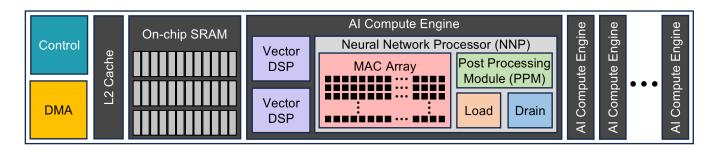

Fig. 1: High-level overview of NPU architecture.

aware execution. Furthermore, Xu *et al.* [10] presents an efficient LLM inference system leveraging on-device NPUs to significantly reduce prefill latency and energy consumption through prompt and model reconstruction at multiple levels. These directions collectively highlight the architectural shift toward tightly integrated, dataflow-optimized NPUs tailored for transformer models.

Model and Compiler Optimizations. To deploy large models efficiently on resource-limited hardware, researchers have presented various model optimizations, including model weight pruning [11], [12], token pruning [13], and weight/activation quantization [14]–[16]. Apart from model optimizations, various compiler-level optimizations such as operator fusion and tiling operations [17] have translated to efficient data reuse and reduced memory operations. Most of these methods were developed in the context of GPU hardware, and thus, their optimal usage for NPU is not straightforward. Additionally, NPU architecture has other limitations requiring novel software solutions to run efficient LLM inference.

# III. PRELIMINARIES: NPU ARCHITECTURE OVERVIEW

The NPU is a domain-specific accelerator optimized for executing deep learning workloads. Designed to deliver high inference throughput under strict power constraints, the NPU architecture comprises of three primary subsystems: control, compute, and data movement, as illustrated in Figure 1. The data movement subsystem is orchestrated by a direct memory access (DMA) engine and on-chip SRAM cache (hardware or software-managed), which together facilitate high-bandwidth, low-latency transfers between system DRAM and on-chip memory (e.g., SRAM). Typically, weights reside in off-chip DRAM, while activations and intermediate tensors are buffered in SRAM to maximize locality and reduce access overhead. The compute subsystem consists of a scalable array of AI Compute Engines. Each engine integrates a fixedfunction neural network processor (NNP) [18] with a dense MAC array for matrix multiplications and convolutions, a postprocessing module (PPM) for scaling, activation, and quantization, as well as dedicated Load and Drain units for memory staging and result formatting. In addition, programmable Vector DSPs within each engine handle fine-grained elementwise operations, including non-linear functions (e.g., GeLU, Swish) and transformer-specific layers such as SoftMax, LayerNorm, and other vector operations. These tightly integrated modules enable fused execution and minimize intermediate data movement. The control subsystem handles runtime task scheduling, synchronization, and power management. It coordinates execution across multiple compute engines, monitors memory flow, and ensures efficient workload distribution to maintain high utilization and low latency across diverse ML workloads.

# IV. LLM-NPU SOFTWARE OPTIMIZATIONS

We focus on cross-layer techniques that address memory bottlenecks, reduce redundant computation across tokens, and enhance hardware utilization through dynamic shape handling

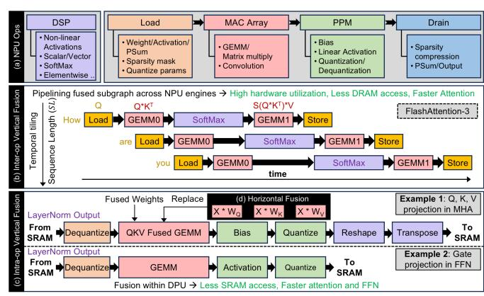

Fig. 2: Fusion strategies for LLM execution: (a) Supported ops across NPU blocks; (b) Fused attention pipeline [19]; (c) Vertical and (d) horizontal fusion in attention/FFN within NNP. NNP to DSP transfer directly/via SRAM based on architecture.

and control-flow aware execution, spanning both prefill and decode stages.

# *A. Fusion and Tiling Strategies*

LLM inference presents unique challenges due to complex operator sequences- particularly non-linear transformations including SoftMax and LayerNorm, and memory-intensive components like attention, where storage and bandwidth demands scale quadratically with sequence length. *Tiling* and *operator fusion* are well-established graph or kernel-based optimizations [20]–[22] that help address these inefficiencies by restructuring computation graphs to improve data locality, maximize on-chip memory reuse by reducing memory transfers, and increase compute throughput. Two complementary classes of fusion strategies are widely adopted across diverse hardware platforms: NPU [2], [23]–[25], GPU, and CPU to enable high-performance LLM inference.

Tiling. In LLMs, spatial and temporal tiling strategies are employed by modern NPU compilers to partition large attention and feed-forward (FFN) layers along dimensions such as sequence length, head, and embedding dim. to fit within limited on-chip memory. These tiling choices, guided by the layer shape and hardware constraints, often require partial replication or slicing of Q, K, V , and intermediate activations across tiles, with the goal of reducing data movement overhead and maximizing compute utilization.

Vertical Fusion (VF). Combined with tiling, this strategy reduces off-chip memory accesses by fusing dependent operations. As illustrated in Figure 2b, *Inter-operator VF* is commonly applied to LLM attention computation, where operations such as matrix multiplications (QKT ), masking, SoftMax, and V projection are fused to align with on-chip memory constraints. FlashAttention [20] achieves this by partitioning Q, K, and V into SRAM-friendly tiles, preventing materialization of the full N × N attention matrix and enabling pipelined execution of data movement, higher throughput GEMM (mapped to MAC array) with lower throughput SoftMax (mapped to DSP), as shown in FlashAttention-3 and variants [19], [21], [26]. *Intra-operator VF* (Figure 2c) builds on similar principles by pipelining sequences such as dequantization, GEMM, activation, and re-quantization to maximize register reuse and reduce on-chip memory traffic.

Horizontal Fusion (HF). Horizontal fusion merges operations across independent branches with shared input activations or weights, such as Q/K/V projections in attention, and gate and up-projection in FFN block, into single macro-operations (Figure 2d). This increases arithmetic intensity, reduces kernel overhead, and better utilizes accelerator resources.

# *B. Weight Compression*

LLMs often contain billions of parameters, making the full precision (FP32/FP16/BF16) models challenging to deploy efficiently on modern NPUs, due to high memory footprint and compute costs. Weight quantization significantly reduces model size by converting high-precision weights to lowerprecision formats (e.g., INT8, INT4, INT2). To reduce ondevice memory footprint, memory access latency, and prefill/decoding latency in LLMs, post-training techniques—such as per-channel and per-group symmetric/asymmetric quantization—are commonly employed using calibration with representative inputs. Recent works [14] adopt multi-objective layer-wise optimization to minimize quantization error while maintaining model accuracy. Compiler backends then lower the quantized models to NPU-executable form, inserting quantize/dequantize operations and selecting optimized mixed/lowprecision kernels [19]. Fusion of quantized operator sequences further reduces memory traffic and improves execution efficiency. Hardware-aware implementations may also organize quantized weights channel-wise to exploit architectural features (described in Section V-G), enabling high-throughput, low-latency LLM inference.

Moreover, N:M sparsity for weights has remained a practical optimization [12]. We thus present a joint post-training weight compression method combining the benefits of both worlds, leveraging the 2:4 (or 4:8) sparsity with low-precision weights. In Section V we further discuss the corresponding hardware support for the N:M sparsity.

# *C. KV caching and KV compression*

KV Caching. Repetitive recomputation of the KV during the decode phase can significantly affect the throughput. Thus, instead of recomputation, KV caching has become a standard method for throughput-efficient LLM inference. We thus follow this caching method for the previously computed and prefill KV. However, for the quadratic autoregressive models [27], [28], the KV cache grows linearly with the sequence length, further intensifying the memory bottleneck of the decode stage. To limit the memory and bandwidth demand of the KV cache, we present two classes of solutions, namely, the KV cache *quantization* and *eviction*.

KV Cache Quantization. Based on the outlier distribution of the KV tensor, we present *per-channel grouping* for the K and *per-token grouping* of the V tensor in the cache. Due to the hybrid nature of the grouping dimension across K and V, its called *hybrid group quantization* [15]. The elements within a group follow uniform quantization with a shared FP16 scaling and zero point. To maintain high generation quality at low KV precision, we keep the most recent tokens in FP16. This helps us maintain high performance at low precision and reduces the frequent quantization overhead unless the number of FP16 recent tokens reaches a pre-defined block size of N. Apart from hybrid grouping, we also observe good accuracy merit with *Per-token grouping*, for each token or sequence group, we take g channels and create a group with a size of 1 × g.

Empirically, we observe that the hybrid group of KV and the per-token grouping of KV yield significantly better accuracy than the per-channel grouping for both tensors.

KV Eviction. Only quantization may not be sufficient to address the growing KV issue, specifically for sequence length ≥ 4K. Various training-free methods like [29] [30] [13] have been proposed to handle this. However, many often fail to yield good accuracy at high eviction for complex retrieval or reasoning tasks [15]. Thus, inspired by the recent success of [13], we adopt a KV eviction strategy based on a chunk of the most recent prefill tokens, namely the observation window (OW). In principle, it relies on the fact that each attention head/layer targets specific prompt attention features during generation, which can be identified from an observation window at the end of the prompts.

# *D. LLM Static Shape Inference*

LLMs generally generate variable-length sequences with dynamic input/output shapes. In contrast, modern NPU accelerators favor static-shaped tensors for efficient memory allocation, just-in-time (JIT) optimizations (e.g., torch.compile), and reduced runtime overhead. This mismatch limits LLM inference performance on edge and client devices. To address this, the NPU compiler leverages graph- and runtime-level lossless optimizations that convert dynamic LLMs into staticshape equivalents and runs static-shape inference pipeline (Algorithm 1). First, input IDs, attention mask, and position IDs of the prefill model are *right-padded* to prompt length (SLP ). This allows the prefill model to accept prompts up to a maximum of SLP and generates a static KV cache of length SLP [31]. Masking ensures computation is confined to valid tokens in both prefill and decode phases. In the decode model, mask and KV cache are right-padded to response length (SLR) to support token generation up to the same length.

During the prefill phase, statically allocated self- and/or cross-attention KV caches are initialized. In the decode phase, only the KV vectors for the most recent token, indexed by position ID (posdecode), are computed, avoiding full-buffer recomputation as is standard in transformer KV caching. The NPU compiler optimization, KV zero-copy update, improves this process by eliminating the need to write entire KV cache of size SLR in SRAM/DRAM. Instead, it enables the CPU to insert the newly computed K/V vectors directly into their target locations (using posdecode) into shared memory buffers in DRAM using zero-copy interfaces. Layout-aware storage formats for KV cache further eliminate costly transposes during attention computation. This fully static approach with memory-efficient KV cache eliminates dynamic memory ops and reduces memory write traffic, latency, and energy consumption, enabling highly efficient, accelerator-friendly execution with minimal overhead and preserved accuracy.

# *E. Speculative Decoding on Static-Shape NPUs*

Apart from these software optimizations, we support model operation-level optimizations, including speculative decoding. Specifically, speculative decoding [32] converts sequential generation to parallel generation with the help of a draftverifier generation strategy. Here, the draft model is generally a lightweight, small model generating tokens sequentially [33], while the large verifier model verifies the generated tokens in parallel, improving the per-token generation latency. In our design, the draft model generally runs on the NPU

# **Algorithm 1:** Static Shape Inference for LLM Decoder with Optimized KV Cache

using a static-shape pipeline, while the verifier model executes asynchronously on CPU or GPU, thereby leveraging multiple compute IPs on the platform [2]. This hybrid approach combines NPU-accelerated speculative generation with dynamic verification, enabling efficient, scalable LLM inference at the edge with tight compute and memory budgets.

# V. LLM-NPU HARDWARE FEATURES

We focus on the transition toward domain-specialized designs that prioritize throughput, minimize latency, and enhance energy efficiency across inference and training workloads.

### A. Systolic to Compute-in/near-memory Transition

Systolic arrays have long been a staple in deep learning accelerators, leveraging spatial reuse and synchronized MAC pipelines to deliver high arithmetic intensity. However, as LLMs grow in scale and complexity, they introduce challenges, such as sparse attention, variable-length sequences, and irregular memory accesses, that limit systolic utilization and exacerbate data movement overheads. The physical decoupling of compute and memory in such architectures often leads to increased latency and energy consumption, especially when frequent transfers of weights and activations are required. This traditional separation is illustrated in Figure 3a, and further emphasized in Figure 3b.

To address these limitations, a range of memory-centric compute paradigms has gained traction, including processingin-memory (PiM) [34], compute-near-cache (CnC) [35], and compute-in-memory (CiM) architectures spanning both digital [36] and analog [37] implementations. As depicted in Figure 3c, These approaches aim to co-locate logical compute elements closer to memories at different hierarchies—thereby reducing off-array data movement. By operating near or within the memory fabric, these designs exploit high-bandwidth local access to data, which is particularly beneficial for LLMs dominated by matrix-vector and matrix-matrix operations. Such architectures enable flexible dataflow strategies, supporting both weight- and activation-stationary modes. While activation-stationary flows are useful in convolutional settings, many transformer workloads benefit from weight-stationary mappings that keep model weights persistent in memory while streaming in activations, amortizing load costs across tokens and layers. Digital near/in-memory compute designs [21], [36], [38] have demonstrated up to  $3\times-5\times$  energy efficiency and 2× latency improvements in LLM inference compared to conventional NPUs. As models grow, integrating compute closer to memory offers a scalable path forward for energyefficient, high-throughput AI acceleration.

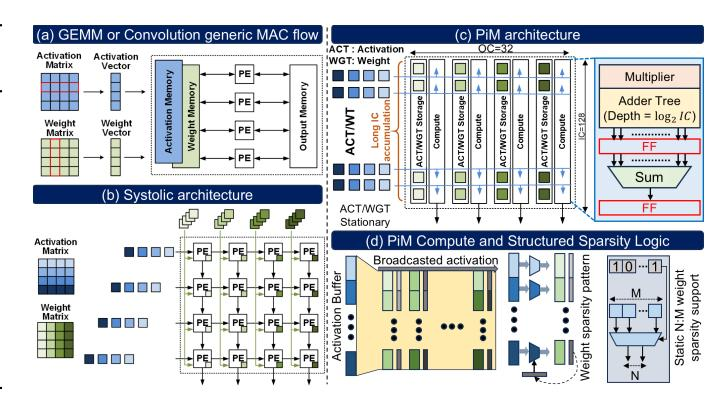

Fig. 3: Systolic array vs PiM design architectural comparison.

#### B. Extended Input Channel (IC) Accumulation

The decode phase of LLM inference, especially during autoregressive generation, is heavily memory-bound due to the large dimensionality of context embeddings and growing activation map sizes. This bottleneck intensifies in later transformer layers, where multi-head attention and MLP blocks operate over high-rank tensors with hundreds or thousands of ICs. Traditional MAC arrays, optimized for low-latency tile-based GEMMs, struggle with long IC accumulation due to shallow on-chip buffers, resulting in frequent partial sum offloads to DRAM or shared scratchpads. These off-chip transfers introduce latency, energy overheads, and pipeline stalls, limiting compute bandwidth utilization.

PiM architectures address this by supporting extended IC accumulation depth via local register folding or peripherylatched partial sums, enabling sustained accumulation over large channel windows before flushing results. This approach improves arithmetic intensity, reduces DRAM traffic, and enhances temporal data locality, which is key for transformer feed-forward and attention layers operating on wide embedding vectors. Such designs avoid intermediate evictions and maintain in-situ computation for long sequences or high head widths. Studies like [39] report  $1.5 \times -2 \times$  throughput gains and 2× energy savings per token with deeper IC accumulation in PiM arrays. These gains scale with model and sequence size, making IC-depth-optimized PiM essential for efficient LLM acceleration. Additionally, deeper accumulation reduces switching activity on buses and interfaces, improving energy proportionality and aligning with architectural trends that tightly integrate compute, storage, and accumulation in localized domains.

# C. Sparsity Acceleration and Compression

Transformer-based models, including large-scale LLMs, have the potential to be induced with significant weight sparsity, particularly in attention and feedforward layers [40]. Exploiting this sparsity is crucial for improving energy efficiency and throughput, but unstructured sparsity introduces irregular memory access patterns and high control complexity. Structured sparsity formats, applied primarily to weights, such as the 2:4 fine-grained scheme, where each four-element block contains exactly two non-zeros, mitigate these issues through regular, compiler-enforceable patterns. This regularity enables predictable scheduling, reduces indexing overhead, and simplifies hardware design by avoiding content-addressable memories and complex gating logic. Zero-skipping pipelines and mask-aware dispatch units selectively route non-zero operands,

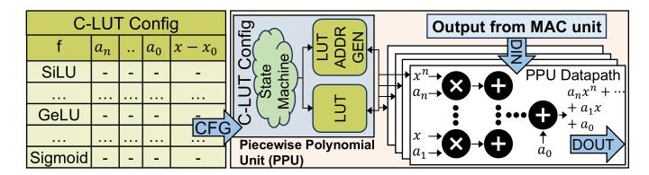

Fig. 4: Efficient execution of various non-linear activations.

thereby avoiding wasted computation and improving overall throughput. The format also enables compact compression schemes, thereby reducing memory bandwidth demands during matrix fetches.

Compared to unstructured sparsity, which requires complex gather/scatter logic and wide MUX networks, structured weight sparsity enables much simpler control logic, as shown in Figure 3d. For example, sparsity decoding can be implemented using fixed-function units like 4-to-2 selector trees, significantly lowering area, power, and routing complexity. Static sparsity maps also allow compile-time scheduling, reducing runtime logic and enabling prefetch alignment and warp-wide coalescing. As demonstrated in recent research [12], [41], 2:4 sparsity can deliver up to 2× theoretical throughput gains with minimal accuracy loss when models are properly pruned and fine-tuned. For LLMs, where sparsity is increasingly integrated into training and quantization pipelines, support for structured weight sparsity is not merely an optimization but a foundational requirement for scalable, energy-efficient inference.

# *D. GEMM Engine Optimization*

LLM workloads differ fundamentally from CNNs, shifting computation from convolution-heavy 7D tensor operations to dense, batched 3D/4D GEMMs. The core compute pattern in transformers centers on GEMM operations of the form [B, M, K] × [B, K, N] → [B, M, N], where B is batch or head count, M and N are sequence and embedding sizes, and K is the shared reduction axis. This shift demands NPUs optimized for high-throughput, low-latency GEMM, rather than convolution-specific datapaths with im2col, dilation, or reuse buffers. Streamlined systolic or register-tiled MAC arrays improve PE utilization and reduce control overhead. Modern LLM NPUs adopt flexible tiling, quantization-aware partitioning (*e.g.*, INT8/FP8), and batched GEMM support, often fused with load-compute-store pipelines using doublebuffered SRAMs to overlap memory fetch and execution. Transformers also require support for non-square matrices and variable K, particularly for attention. PiM-based GEMM engines are ideal for such workloads, enabling static weight placement, minimal data movement, and high operand reuse. Tailored GEMM pipelines with wide MAC lanes and attentionaware memory layouts have shown 30–40% performance gains in LLM layers [42]. These gains scale with model width and batch size, reinforcing the need for GEMM-specialized NPUs.

# *E. Operator and Dataflow-Level Fusion*

Fusion-aware design is critical in NPUs for LLMs, where operations such as dequantization, GEMM, bias addition, activation, quantization, reshape, and transpose can be executed in a tightly integrated pipeline. Rather than separating these steps across modules or memory transfers, fusion-aware datapaths enable operand reuse within the accelerator. As shown in Figure 2a, modern NPUs consist of four stages:

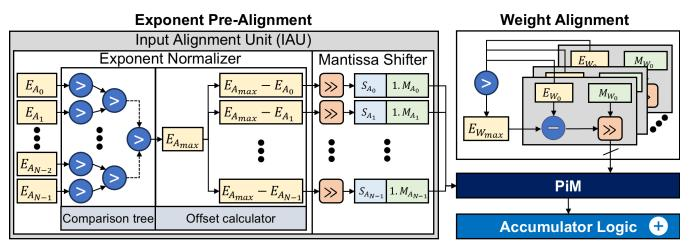

Fig. 5: FP-PiM and INT-PiM operation on a common PiM macro (digital/analog) illustrating FP pre-alignment only. Block size matches with MX group sizes.

Load, MAC Array, PPM, and Drain. The Load unit performs dequantization of weights and activations and handles structured sparsity; the MAC Array handles GEMM and convolution operations; the PPM applies bias, scale, linear/partiallinear activation functions, and quantization; and the Drain applies sparse compression on the output. DSP units enable SoftMax, LayerNorm, non-linear (trancendental) activations, transpose, and other vector operations in LLMs. This modular pipeline supports all forms of vertical and horizontal fusion across multiple NPU engines as explained in Section IV-A, thereby improving energy efficiency and reducing latency, especially for long sequences and deep transformer stacks. A key challenge in fused execution is the SoftMax operation in attention mechanisms, which involves compute-intensive exponential and division steps and requires high numerical precision. While activations may be quantized to INT8 or lower, SoftMax often demands FP16 or higher to maintain accuracy, necessitating mixed-precision support. In some NPU designs, parts of SoftMax are fused within the NNP using LUT-based exponentiation, normalization, and parallel reduction units for max/sum [21]. This integration allows tight coupling with GEMM and activation logic, minimizing on-chip memory accesses. Fusion-aware architectures, as shown in [43], reduce latency by up to 25%, and dedicated SoftMax hardware units, such as those in [44], achieve up to 5× speedup over software implementations.

# *F. Programmable Activation Functions*

A common strategy to efficiently support activation functions in LLM workloads—such as GeLU, SiLU, and Sigmoid—is to use a programmable piecewise polynomial unit (PPU) [45]. As illustrated in Figure 4, this unit employs polynomial approximation techniques to evaluate nonlinear functions with minimal reliance on DSP-intensive hardware. A configurable lookup table (C-LUT) stores precomputed coefficients an, . . . , a0 along with segment boundaries, enabling runtime evaluation using expressions of the form f(x) ≈ anx n + · · · + a1x + a0. The typical design includes a state machine, LUT address generator, and coefficient memory that work together to identify the appropriate polynomial segment for a given input. The result is computed through a multiplyaccumulate (MAC) datapath within the PPU, often positioned directly along the output path of the primary MAC unit. This integration enables in-place activation computation, reducing latency and eliminating the need for intermediate buffering. The C-LUT's programmability allows the system to support new or custom activation functions without requiring changes to the hardware. At the same time, tunable polynomial degree balances approximation accuracy and resource efficiency.

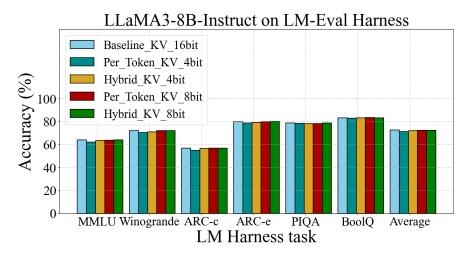

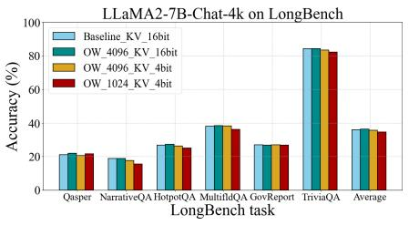

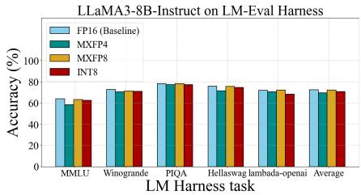

- (a) KV cache quantization
- (b) Joint KV cache optimization
- (c) Weight only quantization

Fig. 6: Performance of different optimizations on standard benchmarks.

TABLE I: N:M sparsity accuracy on LM Harness Tasks.

| Model                     | Sparsity | FT? | MMLU  | Winogr. | ARC-c | ARC-e | PIQA  | BoolQ | Avg.  |
|---------------------------|----------|-----|-------|---------|-------|-------|-------|-------|-------|
| LLaMA3- 8B Instruct | N/A      | N/A | 63.82 | 72.06   | 56.83 | 79.76 | 78.67 | 83.15 | 72.38 |
|                           | 2:4      | No  | 39.07 | 65.35   | 37.29 | 59.47 | 70.89 | 69.57 | 56.94 |
|                           | 2:4      | Yes | 41.90 | 66.14   | 40.27 | 61.41 | 73.01 | 71.35 | 59.01 |
|                           | 4:8      | No  | 46.96 | 67.64   | 40.96 | 65.28 | 73.39 | 77.19 | 61.90 |
|                           | 4:8      | Yes | 48.42 | 68.27   | 42.49 | 67.26 | 73.94 | 76.48 | 62.81 |
| Qwen2.5- 3B            | N/A      | N/A | 65.29 | 69.22   | 48.12 | 72.90 | 77.75 | 77.06 | 68.39 |
|                           | 2:4      | No  | 35.00 | 62.04   | 35.24 | 60.40 | 71.65 | 73.76 | 56.34 |
|                           | 2:4      | Yes | 35.54 | 62.04   | 35.92 | 60.73 | 71.82 | 74.34 | 56.73 |
|                           | 4:8      | No  | 47.86 | 64.64   | 38.82 | 63.01 | 72.47 | 77.03 | 60.64 |
|                           | 4:8      | Yes | 48.17 | 65.11   | 38.91 | 62.92 | 72.52 | 77.06 | 60.78 |

#### G. Multi-Precision and MX Format Support in Hardware

To balance power efficiency and numerical accuracy, LLMtargeted NPUs increasingly support a broad spectrum of numeric formats, including FP16, FP8, INT8, and configurable MX/NV variants such as MXFP8, MXINT8, and MXFP4. These formats allow dynamic tuning of exponent and mantissa widths to match precision needs per tensor. While INT8 and FP8 are often native compute types, ultralow-precision formats like INT4, INT2, and FP4—including NF4, SF4, and MXFP4 [46]–[48]—are primarily used for memory compression and up-converted to higher-precision types (e.g., FP8/INT8) at runtime. Group-wise quantization with group sizes from 8 to 128 elements is standard, with pergroup scale factors encoded in compact forms such as E8M0, FP16, or BF16. Efficient support for these formats requires mixed-precision ALUs (e.g., FP16-FP8, FP8-INT4), runtime format conversion, and flexible quantization units typically orchestrated in the PPM. Arithmetic is often approximated using reduced-width adder trees, strength-reduced shifters, or LUTs, enabling low-cost implementations of multipliers and quantizers. Accumulation is frequently performed in FP16 instead of FP32 to reduce power and area further.

FP computation within integer-style arrays can be achieved via exponent-aware reinterpretation, allowing reuse of INT MAC units for low-precision FP formats. Both pre- and post-alignment strategies are viable here, each offering tradeoffs: pre-aligned schemes reduce logic complexity and favor energy efficiency, while post-aligned variants yield better numerical accuracy at higher hardware cost, as illustrated in Figure 5. MXFP8 has demonstrated 2–3× inference speedups with minimal accuracy loss [49], and techniques like GPTQ [50] further enhance quantization efficacy within the existing PPM pipeline. Additionally, hardware support for ReduceMean and ReduceMax enables efficient runtime scale estimation for dynamic quantization.

#### VI. EXPERIMENTAL RESULTS

#### A. Models and Datasets

We primarily evaluate on two distinct families of LLM architectures with varying parameter counts, namely: LLaMA [51] [3] and Qwen-2.5 [4]. Both models are built on decoder-

only transformer architectures that leverage grouped query attention (GQA) for optimized scalability. However, Qwen-2.5 distinguishes itself through advanced pre-training and refined post-training techniques, enhancing its overall performance and adaptability. We conduct a comprehensive evaluation of the different optimization strategies to assess performance on standard benchmarks, focusing on natural language understanding, question answering, and reasoning capabilities. For this evaluation, we selected the following benchmarks from LM Harness [6]: MMLU, Winogrande, ARC-c, ARC-e, PIQA, BoolQ, HellaSwag, and lambada-openai. For MMLU, we present results based on a 5-shot evaluation, whereas for the remaining tasks, we provide zero-shot performance. Furthermore, we demonstrate results on the LongBench [5] and RULER [52] datasets to assess performance in longcontext scenarios, specifically evaluating the effectiveness of OW-based eviction and joint KV Cache optimization. Specifically, we selected six tasks from the LongBench and RULER datasets to assess performance.

#### B. Results: Accuracy Analysis

N:M Sparsity. This section examines the impact of different N:M sparsity variations on model accuracy. Specifically, we employ 2:4 and 4:8 sparsity configurations in our experiments and prune all model layers. Following model pruning, we utilize the Alpaca dataset [53] for LoRA-based recovery fine-tuning for 20 iterations. Table I presents both zero-shot accuracy and post-fine-tuning accuracy across various tasks from the LM Harness. Our findings indicate that increasing the N:M ratio from 2:4 to 4:8 consistently enhances accuracy across all datasets. Notably, 4:8 sparsity achieves up to a 5% improvement on average, without additional fine-tuning. Furthermore, with just few fine-tuning iterations, we can recover up to 3% accuracy on average.

KV Cache Optimization. Figure 6a presents the evaluation results with LLaMA-3-8B-Instruct [3] on standard tasks from the LM Harness, comparing per-token and hybrid groupwise KV Cache quantization across various tasks. In these experiments, weights are not quantized and are maintained in FP16. The results indicate that the hybrid grouping approach outperforms per-token grouping for both 4-bit and 8-bit quantization. The difference in performance is particularly notable for 4-bit scenarios, where the hybrid approach outperforms per-token grouping by 1.2%

Furthermore, Figure 6b illustrates the joint KV cache optimization results with LLaMA-2-7B-Chat-4K [51], incorporating OW-based KV eviction along with KV quantization on multiple tasks from LongBench. These findings demonstrate that eviction complements KV quantization, leading to minimal accuracy loss across various tasks, even with 4-bit KV.

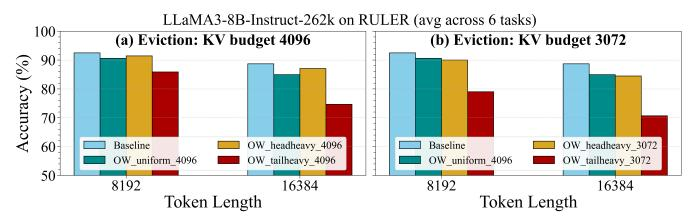

Fig. 7: Heterogeneous token budget for KV eviction. TABLE II: KV eviction speedup in LLaMA3.1-8B.

| KV Budget         | 32   | 256  | 512  | 1024 | 2048 | 4096 |
|-------------------|------|------|------|------|------|------|
| TPOT Speed-up (%) | 32.2 | 29.8 | 28.6 | 23.5 | 12.5 | 0    |

Interestingly, in some instances, KV eviction slightly surpasses the baseline performance, potentially due to the regularizing effect of token dropping, which may enhance accuracy.

Ablation on Heterogeneous Eviction. We explore two scenarios: *head-heavy*: the first 16 layers of the LLaMA-3-8B-Instruct are assigned a higher token budget while the last 16 layers are allocated a lower budget; and *tail-heavy*: this allocation order is the reverse of head-heavy, with initial layers being assigned a low KV budget. In Figure 7a and Figure 7b, we use the RULER [52] dataset, with average token budgets of 4096 and 3072 respectively, across input sequence lengths of 8K and 16K. In both scenarios, the head-heavy budget assignment significantly outperforms the tail-heavy case, suggesting that the initial layers are less sensitive to KV eviction than the latter. Additionally, the results in Figure 7 indicate that the head-heavy assignment results in a minimal drop in accuracy compared to uniform budget assignment, even with a 25% lower average budget. This highlights the merit of heterogeneous KV eviction with a focus on more KV retention at the initial layers.

Weight only Quantization. Figure 6c illustrates the effect of various weight-only quantization data types on the accuracy of LLaMA-3-8B-Instruct [3]. Specifically, we present the accuracy metrics for MXFP4, MXFP8, INT8, and FP16 data types on selected benchmarks from the LM Harness. The average accuracy results for MXFP4 and MXFP8 data types show a slight decrease compared to the FP16 baseline, even without employing sophisticated calibration methods. MXFP8 surpasses INT8 by approximately 1.3% on average across tasks, highlighting a notable advantage of micro-scaling formats over conventional data types.

# *C. Results: Hardware Performance Analysis*

We now evaluate the effectiveness of various optimizations of prefill time-to-first-token (TTFT) and decode time-peroutput-token (TPOT), respectively. Additionally, we present the normalized system energy cost on an AIPC to run an LLM inference. The experiments were conducted on Intel® Core™ Ultra Series 2 flagship Lunar Lake (LNL) [54] platform (32GB RAM, 268V). We used OpenVINO's benchmarking (llm\_bench) tool for inference and HWINFO [55] to measure energy consumption. The impact on fusion and N:M sparsity was estimated using the VPU-EM tool [56].

Fusion. To evaluate the effectiveness of vertical fusion, we conducted performance tests on Intel Core Ultra 2. The combination of *temporal* and *inter-operator* fusion provides 17%, 48%, and 31% speed-up for using LLaMA3.1-8B, Phi3.5-mini, and Qwen2-1.5B prefill stages, respectively, in TTFT.

Weight Compression. Figure 8a illustrates the impact

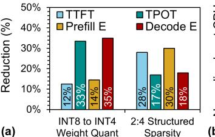

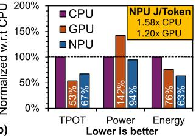

Fig. 8: (a) Reduction in prefill and decode latency and SoC energy due to weight quantization (LLaMA3-8B) and structured sparsity (LLaMA2-7B) (b) Comparison of LLaMA2-7B decode latency, total SoC power, and SoC energy across CPU, GPU, and NPU inference.

of weight compression techniques. Specifically, per-channel weight quantization from INT8 to INT4 in LLaMA3-8B resulted in a 12% reduction in TTFT and a 33% reduction in TPOT. This optimization led to a 14% decrease in SoC energy consumption during the prefill stage and a 35% reduction during the decode stage. The pronounced impact on TPOT is attributed to the memory-bound nature of the decode phase, where lower precision effectively reduces memory traffic. Conversely, 2:4 structured sparsity applied to LLaMA2- 7B achieved a 48% reduction in prefill latency and a 49% reduction in decode latency at the inference pipeline level. These improvements translated to a 28% reduction in TTFT and a 17% reduction in TPOT at the SoC level. Furthermore, we observed enhancements in effective TOPS per Watt (eTOPS/W) at the NPU level, with improvements of 1.69× and 1.23×, respectively. These gains contributed to a 30% reduction in SoC energy consumption during the prefill stage and an 18% reduction during the decode stage.

KV Optimization. We present the performance results for both lossy and lossless KV cache optimizations applied to LLaMA3.1-8B, utilizing per-channel quantized INT4 weights and FP16 activations/KV. Table II details the impact of *KV eviction* (lossy). The baseline prefill KV size is 4096, with normalized TPOT speed-up values provided relative to this baseline. It is important to note that, due to the NPU's support for only static-shaped LLMs, the KV budget was constrained to the maximum prompt length SLP , while the maximum response length SLR was fixed at 32. No additional optimizations were applied for this measurement. *KV Zero-Copy Update* (lossless) delivers a 47% TPOT speed-up under the same model configuration with fixed SLP /SLR = 1024/32. This performance gain stems from eliminating redundant SRAMto-DRAM traffic and avoiding intermediate copy operations between CPU and NPU allocated memory spaces.

Performance of CPU, GPU, NPU. Figure 8b provides a comparative analysis of CPU, GPU, and NPU performance for the LLaMA2-7B model (INT4 weights, FP16 act/KV), with SLP /SLR = 128/128. Regarding TPOT, the GPU demonstrates a 53% reduction compared to the CPU, while the NPU achieves a 67% reduction. Although the GPU offers higher raw performance due to its higher peak TOPS [57], this comes at the expense of increased power consumption. In contrast, the NPU achieves a Joules/token efficiency that is 1.58× better than the CPU and 1.2× better than the GPU.

# VII. CONCLUSIONS AND FUTURE WORKS

This paper delineates a holistic blueprint for next-generation NPUs that can natively support the evolving algorithmic and optimization trends of large foundation models. Looking ahead, several hardware opportunities remain ripe for exploration. For example, native support for sparse attention kernels—especially those combining block-sparse and unstructured patterns would unlock further compute savings for long-sequence processing. Additionally, optimal hardware and software support for emerging models, including linear and hybrid attention mechanisms, alongside ultra-low precision tensor compute, would provide developers with greater flexibility. Ternary datatypes, which restrict values to just three discrete states, offer compelling opportunities for compression, bandwidth reduction, and energy-efficient compute. Also, 3D interconnects between compute and memory to reduce data movement presents a promising future research.

# REFERENCES

- [1] A. Raha *et al.*, "FlexNPU: A dataflow-aware flexible deep learning accelerator for energy-efficient edge devices," *Frontiers in High Performance Computing*, vol. 3, 2025.
- [2] Intel, "2024 Intel Tech Tour: LNL AI Hardware Accelerators intel.com," https://tinyurl.com/3rv85ns9, 2024, accessed: June 1, 2025.
- [3] A. Grattafiori *et al.*, "The Llama 3 herd of models," *arXiv preprint arXiv:2407.21783*, 2024.
- [4] A. Yang *et al.*, "Qwen3 technical report," *arXiv preprint arXiv:2505.09388*, 2025.
- [5] Y. Bai *et al.*, "LongBench: A bilingual, multitask benchmark for long context understanding," *arXiv preprint arXiv:2308.14508*, 2023.
- [6] L. Gao *et al.*, "The language model evaluation harness," 07 2024. [Online]. Available: https://zenodo.org/records/12608602
- [7] M. Huang *et al.*, "EdgeLLM: A highly efficient CPU-FPGA heterogeneous edge accelerator for large language models," *IEEE TCAS I*, 2025.
- [8] C.-H. Yu *et al.*, "2.4 ATOMUS: A 5nm 32TFLOPS/128TOPS ML system-on-chip for latency critical applications," in *Proc. ISSCC*, vol. 67. IEEE, 2024, pp. 42–44.
- [9] A. Fei *et al.*, "NITRO: LLM inference on Intel laptop NPUs," *arXiv preprint arXiv:2412.11053*, 2024.
- [10] D. Xu *et al.*, "Fast on-device LLM inference with NPUs," in *Proc. ASPLOS*, vol. 1, 2025, pp. 445–462.
- [11] L. Yin *et al.*, "Junk DNA hypothesis: Pruning small pre-trained weights irreversibly and monotonically impairs "difficult" downstream tasks in llms,"," in *Proc. ICML*, vol. 235, 2024, pp. 57 053–57 068.
- [12] A. Ramachandran *et al.*, "Accelerating LLM inference with flexible N: M sparsity via a fully digital compute-in-memory accelerator," *arXiv preprint arXiv:2504.14365*, 2025.
- [13] Y. Li *et al.*, "SnapKV: LLM knows what you are looking for before generation," *Proc. NeurIPS*, vol. 37, pp. 22 947–22 970, 2024.
- [14] H. You *et al.*, "ShiftAddLLM: Accelerating pretrained LLMs via posttraining multiplication-less reparameterization," *Proc. NeurIPS*, vol. 37, pp. 24 822–24 848, 2024.
- [15] H. Kang *et al.*, "GEAR: An efficient error reduction framework for KV cache compression in LLM inference," in *Proc. NeurIPS*, vol. 262, 2024, pp. 305–321.
- [16] J. Lin *et al.*, "AWQ: Activation-aware weight quantization for on-device LLM compression and acceleration," *Proc. MLSys*, vol. 6, pp. 87–100, 2024.
- [17] C. Zhang *et al.*, "Optimizing FPGA-based accelerator design for deep convolutional neural networks," in *Proc. FPGA*, 2015, pp. 161–170.
- [18] A. Raha *et al.*, "Efficient hardware acceleration of emerging neural networks for embedded machine learning: An industry perspective," in *Embedded Machine Learning for Cyber-Physical, IoT, and Edge Computing: Hardware Architectures*. Springer, 2023, pp. 121–172.
- [19] J. Shah *et al.*, "Flashattention-3: Fast and accurate attention with asynchrony and low-precision," *Proc. NeurIPS*, vol. 37, pp. 68 658– 68 685, 2024.
- [20] T. Dao *et al.*, "Flashattention: Fast and memory-efficient exact attention with io-awareness," *Proc. NeurIPS*, vol. 35, pp. 16 344–16 359, 2022.
- [21] M. Salmani *et al.*, "LLM inference acceleration via efficient operation fusion," *arXiv preprint arXiv:2502.17728*, 2025.
- [22] ONNX runtime developers, "ONNX runtime," https://onnxruntime.ai/, 2021, version: x.y.z.
- [23] A. Rico *et al.*, "AMD XDNA™ NPU in Ryzen™ AI processors," *IEEE Micro*, 2024.
- [24] J.-W. Jang *et al.*, "Sparsity-aware and re-configurable NPU architecture for Samsung flagship mobile SoC," in *Proc. ISCA*, 2021, pp. 15–28.

- [25] C.-H. Lin *et al.*, "7.1 A 3.4-to-13.3 TOPS/W 3.6 TOPS dual-core deeplearning accelerator for versatile AI applications in 7nm 5G smartphone SoC," in *Proc. ISSCC*, 2020, pp. 134–136.
- [26] H. Lin *et al.*, "Fastattention: Extend flashattention2 to NPUs and lowresource GPUs," *arXiv preprint arXiv:2410.16663*, 2024.
- [27] S. Azizi *et al.*, "MambaExtend: A training-free approach to improve long context extension of Mamba," in *Proc. ICLR*, 2025.
- [28] Z. Ye *et al.*, "LAMB: A training-free method to enhance the long-context understanding of SSMs via attention-guided token filtering," in *Proc. ACL*, 2025.
- [29] Z. Zhang *et al.*, "H2O: Heavy-hitter oracle for efficient generative inference of large language models," *Proc. NeurIPS*, vol. 36, pp. 34 661– 34 710, 2023.
- [30] J. Tang *et al.*, "QUEST: Query-aware sparsity for efficient long-context LLM inference," in *Proc. ICML*, vol. 235, 2024, pp. 47 901–47 911.
- [31] T. Wolf *et al.*, "Huggingface's transformers: State-of-the-art natural language processing," *arXiv preprint arXiv:1910.03771*, 2019.
- [32] Y. Leviathan *et al.*, "Fast inference from transformers via speculative decoding," in *Proc. ICML*, vol. 202, 2023, pp. 19 274–19 286.
- [33] S. Park *et al.*, "LANTERN++: Enhanced relaxed speculative decoding with static tree drafting for visual auto-regressive models," *ICLR W*, 2025.
- [34] J. Gomez-Luna ´ *et al.*, "Benchmarking memory-centric computing systems: Analysis of real processing-in-memory hardware," in *Proc. IGSC*, 2021, pp. 1–7.
- [35] Z. Wang *et al.*, "Near-stream computing: General and transparent nearcache acceleration," in *Proc. HPCA*, 2022, pp. 331–345.
- [36] P. A. Hager *et al.*, "11.3 Metis AIPU: A 12nm 15TOPS/W 209.6 TOPS SoC for cost-and energy-efficient inference at the edge," in *Proc. ISSCC*, vol. 67, 2024, pp. 212–214.
- [37] W. Zhang *et al.*, "ASiM: Improving transparency of SRAM-based analog compute-in-memory research with an open-source simulation framework," *arXiv preprint arXiv:2411.11022*, 2024.
- [38] Y.-D. Chih *et al.*, "16.4 An 89TOPS/W and 16.3 TOPS/mm 2 alldigital SRAM-based full-precision compute-in memory macro in 22nm for machine-learning edge applications," in *Proc. ISSCC*, vol. 64, 2021, pp. 252–254.
- [39] X. Si *et al.*, "A twin-8T SRAM computation-in-memory unit-macro for multibit CNN-based AI edge processors," *IEEE JSSC*, vol. 55, no. 1, pp. 189–202, 2019.
- [40] H. Zheng *et al.*, "Learn to be efficient: Build structured sparsity in large language models," *Proc. NeurIPS*, vol. 37, pp. 101 969–101 991, 2024.
- [41] J. Pool, "Accelerating sparsity in the NVIDIA ampere architecture," *GTC 2020*, 2020.
- [42] H. Xu *et al.*, "Optimized spatial architecture mapping flow for transformer accelerators," *arXiv preprint arXiv:2410.07407*, 2024.
- [43] H. He *et al.*, "Transcending runtime-memory tradeoffs in checkpointing by being fusion aware," *Proc. MLSys*, vol. 5, pp. 414–427, 2023.
- [44] G. C. Cardarilli *et al.*, "A pseudo-softmax function for hardware-based high speed image classification," *Scientific reports*, vol. 11, no. 1, p. 15307, 2021.
- [45] X. Hou *et al.*, "Faster lookup table evaluation with application to secure LLM inference," *Cryptology ePrint Archive*, 2024.
- [46] B. D. Rouhani *et al.*, "Microscaling data formats for deep learning," *arXiv preprint arXiv:2310.10537*, 2023.
- [47] T. Dettmers *et al.*, "QLoRA: Efficient finetuning of quantized LLMs," *Proc. NeurIPS*, vol. 36, pp. 10 088–10 115, 2023.
- [48] J. Dotzel *et al.*, "Learning from students: Applying t-distributions to explore accurate and efficient formats for LLMs," in *Proc. ICML*, vol. 235, 2024, pp. 11 573–11 591.
- [49] Qualcomm, "Qualcomm cloud AI 100 accelerates large language model inference 2x using microscaling (Mx) formats," Jan. 2024, accessed: ˜ June 1, 2025. [Online]. Available: https://tinyurl.com/ycx8vy54
- [50] E. Frantar *et al.*, "GPTQ: Accurate post-training quantization for generative pre-trained transformers," *arXiv preprint arXiv:2210.17323*, 2022.
- [51] H. Touvron *et al.*, "Llama 2: Open foundation and fine-tuned chat models," *arXiv preprint arXiv:2307.09288*, 2023.
- [52] C.-P. Hsieh *et al.*, "RULER: What's the real context size of your longcontext language models?" *arXiv preprint arXiv:2404.06654*, 2024.
- [53] R. Taori *et al.*, "Stanford Alpaca: An instruction-following LLaMA model," https://github.com/tatsu-lab/stanford alpaca, 2023.
- [54] Intel, "Intel® Core™ Ultra (Series 2) Product Brief ," https://tinyurl.co m/58e56wry, 2025, accessed: June 1, 2025.
- [55] REALiX / Martin Malik, "HWiNFO: Freeware system monitoring, profiling, and diagnostics software," https://www.hwinfo.com, 2025.
- [56] C. Qi *et al.*, "VPU-EM: An event-based modeling framework to evaluate NPU performance and power efficiency at scale," *arXiv preprint arXiv:2303.10271*, 2023.
- [57] Intel, "Intel® Core™ Ultra 7 Processor 268V," https://tinyurl.com/3bza b7cr, 2024, accessed: June 1, 2025.