# SecNPU: Securing LLM Inference on NPU

Xuanyao Peng\*†‡, Yinghao Yang\*‡⊠, Shangjie Pan\*‡§, Junjie Huang†, Yujun Liang†,

Hang Lu\*‡§, Fengwei Zhang†⊠, and Xiaowei Li\*‡§

\*SKLP, Institute of Computing Technology, Chinese Academy of Sciences, Beijing, China,

†Department of Computer Science and Engineering, Southern University of Science and Technology, Shenzhen, China,

‡University of Chinese Academy of Sciences, Beijing, China

§Zhongguancun Laboratory, Beijing, China,

yangyinghao[@]ict.ac.cn zhangfw[@]sustech.edu.cn

Abstract—In the era of prevalent large language models (LLMs). efficient LLM inference systems deployed on the neural processing units (NPUs) have gained widespread adoption. During NPUbased LLM inference, both user privacy inputs and proprietary model parameters require stringent protection. While traditional trusted execution environments (TEEs) can be applied to NPU inference processes, we identify that they introduce challenging security-related overheads, including communication for security metadata management and secure startup costs. This paper proposes SecNPU, a CPU-decoupled and LLM-inference-optimized NPU TEE. SecNPU effectively eliminates communication overhead caused by coupled security metadata and leverages the characteristics of LLM inference to conceal security initialization latency. Experimental evaluations demonstrate that our design achieves 1.51× overall secure inference speedup and 1.61× secure boot performance improvement, requiring merely 1.63% additional area and 6.6% more power.

Index Terms—Trusted execution environment, accelerator security, neural processing unit, large language model

#### I. Introduction

In the era of large language models (LLMs), a growing number of devices are deploying LLM-based AI applications, including personal assistants [1], programming copilots [2], and healthcare consultation systems [3]. The widespread deployment of LLMs necessitates robust protection for both model parameters [4] and user inputs [5] during inference. This protection is critical because model parameters, which require substantial financial investment to train, constitute proprietary assets of model providers. Additionally, input data contains users' sensitive personal information that must be protected against unauthorized disclosure. Trusted execution environments (TEEs), leveraging their hardware-software codesign and lightweight security mechanisms, have emerged as a mainstream technology for protecting LLM applications. For example, Amazon used TEE to provide users with secure LLM services with AWS Nitro Enclaves [6]; Ant Group built a secure LLM training framework based on TEE [7].

Neural Processing Units (NPUs) are well-suited for efficient LLM inference, owing to their optimized control units and substantial computational resources. A significant body of LLM acceleration research has focused on NPU-based solutions [8]–[11] These systems face security challenges when utilizing a

¶ This work was done while Xuanyao Peng is a visiting student at COMPASS Lab. Yinghao Yang and Fengwei Zhang are the corresponding authors.

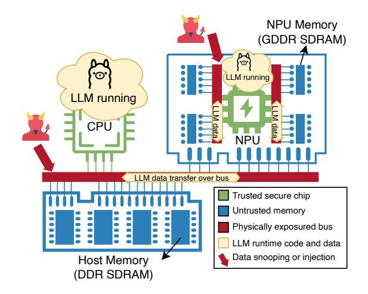

Fig. 1. The security vulnerabilities of the current CPU and NPU collaborated LLM inference system. Attackers may sniff confidential data or inject malicious data on the bus, resulting in the theft or tampering of data in memory.

discrete NPU connected to the CPU via an exposed physical bus interface such as PCIe. As shown in Fig. 1, in NPU-equipped computing systems, CPU, host memory, and NPU interact via a shared data bus, through which LLM data must transit for the NPU. This architecture exposes two critical vulnerabilities: (1) bus-transmitted data and (2) NPU-resident LLM parameters are both susceptible to attacks. The NPU-based trusted execution environment (NPU TEE) [12]–[15] targets these vulnerabilities by memory encryption and integrity protection. However, security mechanisms introduce cryptographic/verification overhead - a particularly acute challenge for LLM inference given its massive parameters and computing power demands. This performance-security tradeoff inevitably poses challenges in designing NPU TEE for LLM inference.

Existing research on NPU TEE architectures can be broadly categorized into two approaches: *CPU-centric* and *CPU-coupled*. CPU-centric [12] denotes that all security protections and verification capabilities are provided by the CPU, while the NPU is solely responsible for specific acceleration tasks. CPU-coupled [13]–[15] refers to either offloading certain security tasks (e.g., confidentiality protection functions) from the CPU to the NPU, or the NPU depending on the CPU to send security commands for control. The NPU and CPU collaboratively provide security capabilities during LLM inference. However, the CPU-centric and CPU-coupled architectures suffer from

two major limitations. First, during LLM inference, since the NPU lacks independent capability for security verification, it needs to delegate some memory security checks to the CPU side, which introduces significant communication overhead. Second, during LLM initialization, as the LLM application needs to start up on the CPU side, the CPU-coupled architecture leads to redundant secure initialization overhead after data is transferred to the NPU side.

For secure and efficient execution of LLM applications on CPU-NPU heterogeneous systems, the NPU TEE design must address the following key requirements: First, during LLM inference, the NPU should possess an independent and efficient memory protection mechanism, decoupled from the CPU and tailored to the characteristics of LLM's calculation. Second, during LLM initialization, ensuring secure model startup while maintaining acceptable user response times is critical. It is essential to mitigate the secure initialization overhead caused by the CPU-coupled architecture. This is particularly important in scenarios where the startup time constitutes a non-negligible portion of the total inference time.

In this paper, we propose SecNPU, a novel CPU-decoupled NPU TEE, featuring a meticulously designed unified security metadata framework and an efficient secure startup mechanism for LLMs with near-zero overhead. First, SecNPU introduces a unified security metadata framework employing hardware-managed physical address translation tables and parallelized cryptographic engines to eliminate CPU dependency while maintaining strict memory protection. Second, the system presents a phase-optimized secure startup mechanism that strategically leverages LLM inference characteristics, achieving near-zero overhead for secure LLM startup by hiding metadata transfer latency during the prefetch-phase computation. The contributions of this paper are summarized as follows:

- We propose a novel CPU-decoupled NPU TEE architecture that introduces a unified security metadata mechanism. We establish synchronized physical address mapping between NPU and CPU domains while maintaining consistent memory protection granularity across both computing units, significantly eliminating the overhead of regenerating security metadata during CPU-to-NPU data transfers in LLM inference.
- We develop a near-zero-overhead secure startup mechanism for LLMs. We utilize idle memory bandwidth during the prefill phase to transmit security metadata while deferring verification operations. By masking the security initialization overhead, negligible latency will be introduced in the model startup.
- We implement the complete NPU TEE prototype based on RTL design and evaluate its performance using a cycle-accurate NPU simulator. We highlight the following results: (1) achieving 1.51× and 1.22× performance improvement in secure inference compared to CPU-centric and CPU-coupled designs, respectively. (2) achieving a 1.61× speedup in secure startup compared to CPU-coupled implementations. (3) introducing only 1.63% additional area in the total NPU design and a 6.6% power

Fig. 2. The secure LLM inference on CPU-coupled NPU TEE. The upper diagram illustrates *secure startup*, depicting the process of generating the first token while ensuring the secure initialization and population of intermediate results (KV cache). The lower diagram demonstrates *secure decoding*, representing the subsequent token generation process. Different models contain varying numbers of Transformer blocks, where × N denotes a non-specific model with N blocks.

consumption increase.

#### II. THREAT MODEL AND MOTIVATION

#### A. Threat Model

Our system defines a trusted computing base (TCB) comprising the CPU, NPU, and on-chip memory. However, we do not trust the off-chip memory (such as DDR or GDDR memory) or the physical exposure bus, as attackers may target the bus to intercept or tamper with data transmitted between the CPU and NPU, as illustrated in Fig. 1. Furthermore, we assume the operating system may be compromised by attackers, meaning that data transfer operations could be initiated by attackers.

Our attack model does not consider various side-channel attacks [16], [17], which are orthogonal to our work. We also do not consider denial-of-service (DoS) attacks, as we do not trust the host operating system, which determines the scheduling of tasks and could potentially be hijacked by malicious software. Our threat model aligns with the assumptions established in prior works [12]–[15].

#### B. LLM Inference with TEE

The inference architecture of LLMs is built upon the decode-only Transformer [18], and its most salient feature involves large-scale matrix multiplications. To accelerate these operations, we utilize NPUs, widely adopted accelerators for LLM inference in existing research [9], [10], [19]. As illustrated in Fig. 2, securing LLM inference on NPU can be divided into two phases: *secure startup* and *secure decoding*.

**LLM's secure startup:** As shown in the upper image of Fig. 2, the system establishes a shared secret key between CPU and NPU, then transmits user inputs encrypted by the key to the NPU-side memory while updating its security metadata — a process we refer to as *secure initialization*. The *prefill phase* then commences to generate the intermediate results (KV Cache [20]) and first output token, where the system processes

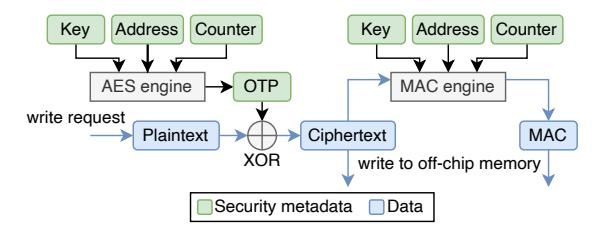

Fig. 3. The CPU/NPU generates write requests with memory protection. An AES engine ensures data confidentiality, while a MAC engine guarantees data integrity through the use of security metadata.

the user inputs in parallel to generate the initial output token. The *secure initialization* and *prefill phase* compose the model's *secure startup*, which can be measured by Time To First Token (TTFT) [21] as the performance metric.

**LLM's secure decoding:** After model startup, the NPU TEE continuously maintains runtime security metadata during the decode phase, as illustrated in the lower portion of Fig. 2. At each token generation iteration, the NPU TEE ensures the integrity and confidentiality of both model parameters and user inputs against potential theft or tampering attacks.

The NPU TEE employs memory protection techniques to ensure the confidentiality and integrity of data in memory. Most NPU TEEs [12]-[14], [22] employ hardware-accelerated AES-GCM encryption adopted from CPU TEE [23], [24] for all write-back operations, as illustrated in Fig. 3. During off-chip data write, the AES-GCM encryption engine generates a onetime pad (OTP) by utilizing three critical security metadata: (1) the on-chip Key, (2) the target memory Address, and (3) an auto-incrementing Counter. This OTP is then XORed with plaintext data to perform cryptographic encryption. Then, the ciphertext subsequently passes through a message authentication code (MAC) engine, which produces and appends a MAC value to ensure tamper-proof storage of the data. This process can be formally described by the equation: OTP = $AES_{Key}(PA||VN), Ciphertext = Plaintext \oplus OTP$  and  $MAC = HASH_{Key}(Ciphertext||PA||VN)$ , where || means directly concatenating and  $\oplus$  represents XOR.

The management of security metadata (including *Keys*, *Addresses*, *Counters*, and *MACs*) introduces non-negligible overhead, presenting a challenging issue that has been extensively discussed in prior research [12]–[15], [25]. However, in existing solutions, the NPU TEE relies on the security metadata managed by the CPU, and the CPU and NPU operate with different physical address spaces and memory access granularities. This dependency results in two significant drawbacks: (1) non-trivial communication overhead during secure decoding, and (2) metadata regeneration overhead during secure startup. We will detail these two drawbacks in the following two subsections.

# C. Excessive Communication Overhead in CPU-dependent Architectures

We collectively refer to the aforementioned CPU-centric and CPU-coupled approaches as CPU-dependent schemes. The evaluation results demonstrate that CPU-dependent operations for security metadata incur approximately 40% communication overhead during secure decoding, as shown in Fig. 4(a).

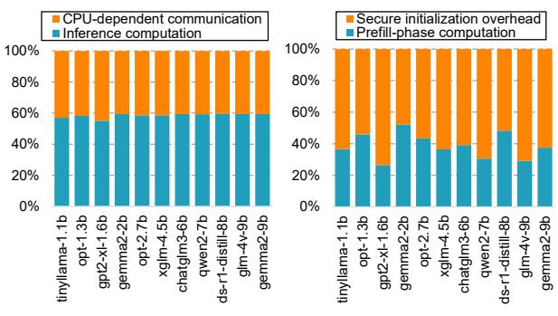

(a) Secure decoding time breakdown.

(b) Secure startup breakdown.

Fig. 4. Overhead of secure LLM inference. We respectively discussed the security overhead of secure decoding and secure startup in (a) and (b). In secure decoding (a), the CPU-dependent architecture resulted in communication overhead, while in secure startup (b), secure initialization accounted for the majority of the cost.

Moreover, for LLMs of varying sizes, the overhead caused by CPU communication persists and remains proportionally constant. Minimizing communication-induced overhead is crucial for achieving overall performance improvements.

#### D. Intractable Secure Startup Bottleneck

When users employ LLMs for word translation or text summarization, the number of tokens generated by the LLM is typically small. In such scenarios, secure startup constitutes a significant portion of the overall inference task, making its optimization particularly critical. As illustrated in Fig. 2 and Fig. 4(b), the secure startup includes secure initialization overhead and prefill phase computation, and the secure initialization takes up 60%-75% of the startup, which is the bottleneck. However, due to CPU-dependent security metadata, secure initialization cannot be eliminated through direct overlapping. Fortunately, there exists an opportunity to overlap secure initialization with prefill-phase inference when using optimized security metadata.

In conclusion, secure inference for LLMs must address two critical bottlenecks: (1) the CPU-dependent communication overhead during secure decoding, and (2) the prolonged startup latency caused by secure initialization. These inefficiencies significantly degrade the performance of secure LLM inference. To mitigate them, we need to design novel and efficient NPU TEE with CPU-decoupled and LLM-oriented optimization. We will detail our design in Section III.

#### III. SECNPU

#### A. Overview

We introduce SecNPU, a novel CPU-decoupled NPU TEE. Our design primarily targets two goals: (1) to decouple the NPU's security guarantee from the CPU and (2) to establish near-zero-overhead secure startup for LLM applications. Finally, SecNPU enables secure and efficient LLM inference on NPU.

As illustrated in Fig. 5, SecNPU incorporates security components to safeguard LLM inference. The system augments the NPU with a unified address mapping unit, parallel AES-GCM encryption engines, and parallel MAC engines. The unified address mapping unit records the NPU-CPU physical

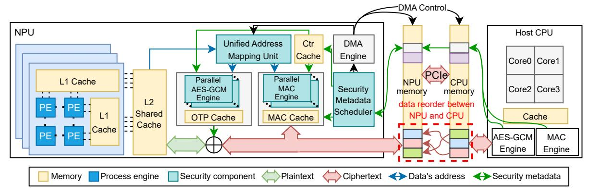

Fig. 5. SecNPU's overall architecture. The system's security is enhanced with the security components, which provide a unified security metadata, parallel security engines, and a security metadata scheduler for near-zero-overhead secure startup. The red dashed box indicates that after the data is transferred from the CPU to the NPU, the address of the data (one of the security metadata) has changed.

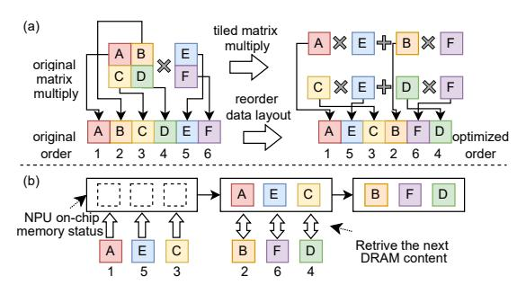

Fig. 6. Reorder caused by machine learning compiler. (a) shows the specific reorder process. (b) shows the optimized prefetches after reordering.

address relationships of the reordered data indicated by the red dashed box in Fig. 5. The parallel AES-GCM and MAC engines are optimized for the NPU's memory access granularity, enhancing runtime confidentiality protection and integrity verification performance. These security components unify security metadata across CPU and NPU, enabling CPU-decoupled security guarantee on the NPU. Additionally, SecNPU also introduces a security metadata scheduler that leverages characteristics of LLM inference to schedule unified security metadata through the direct memory access (DMA) engine, achieving near-zero-overhead secure startup.

### B. Unified Security Metadata

In traditional NPU TEEs [12], [13], [15], the CPU and NPU employ coupled security metadata. This means the security metadata is generated based on the CPU's physical address and memory access granularity, and the NPU's security functions fully or partially rely on CPU-side hardware. The differing address space and memory access granularity between the CPU and NPU cause security metadata (including AES's OTP and MAC, as discussed in Section II-B) generated by the CPU to be invalid for the NPU, leading to redundant metadata regeneration after the data is transferred from the CPU to NPU. Therefore, we need to unify the physical address and memory protection granularity between the NPU and CPU.

1) Unifying the physical address between the NPU and CPU: As for the discrete NPU, which targets high-performance matrix operations, the physical memory space of the NPU is different

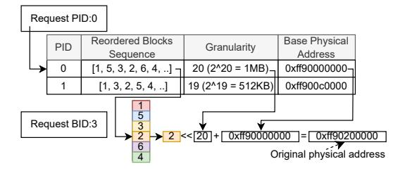

Fig. 7. Mapping Tuple Table. This table establishes the physical address mapping relationship between the NPU and CPU.

from the CPU, which uses a dedicated memory like GDDR [19]. This is because NPU requires a large amount of continuous physical memory space to store inputs and model parameters in a continuous pattern for a better prefetch success rate. When running machine learning applications, the low-level machine learning compiler may rearrange the model parameters sent to the NPU to maximize the utilization of the NPU's computing power. Consequently, once the transmission is completed, the relative physical address of the data will change, as shown in the dashed red box of Fig. 5.

For instance, when computing a block matrix multiplication:

$$\begin{bmatrix} A & B \\ C & D \end{bmatrix} \times \begin{bmatrix} E \\ F \end{bmatrix} = \begin{bmatrix} A \times E + B \times F \\ C \times E + D \times F \end{bmatrix} \tag{1}$$

The natural memory layout of the input data on the CPU is A-B-C-D-E-F, as shown in Fig. 6(a).

In this case, if the NPU can only hold three tiled matrices on the chip, the fastest calculation will be done in order as 1. fetching A, E and C; 2. computing  $A \times E$ ,  $C \times E$ ; 3. fetching B, F and D; 4. computing  $B \times F$ ,  $D \times F$ ; 5. combining results. This is for the least memory swap between on-chip memory and DRAM, and the data is re-ordered into A-E-C-B-F-D for continuous prefetch, as shown in Fig. 6(b).

As explained in Section II-B, OTP is calculated by  $OTP = AES_{Key}(PA||VN)$ , and MAC is calculated by  $MAC = HASH_{Key}(Ciphertext||PA||VN)$ . The security metadata, including MAC and OTP, tightly relies on the physical address of the protected data, so the regeneration of the security metadata is inevitable in CPU-coupled TEE.

SecNPU employs an adjustable physical address mapping table on the NPU hardware (the unified address mapping unit in

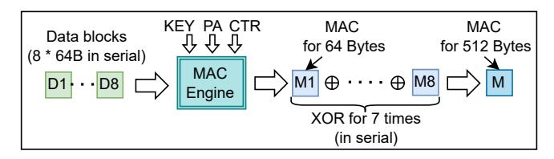

Fig. 8. The serial software MAC mechanism on the CPU. Since we need to generate a MAC for 512-byte data, we must process eight 64-byte data blocks sequentially.

Fig. 5 to unify the physical address of the NPU and CPU. Based on our observation, the CPU-NPU physical address mapping in LLM application scenarios requires only coarse, adjustable granularity with fewer entries. This contrasts with virtual memory mapping, which typically exhibits finer granularity and multi-level organization due to discrete memory utilization in general programs. The address mapping process between NPU and CPU requires the determination of only three key parameters: (1) the reordered sequence array which is optimized for data access, (2) the configurable granularity size that aligns with the NPU's tile-based memory access pattern, and (3) the original base physical address of the first block.

The three critical parameters, which include data sequence, access granularity, and base physical address, are organized into a structured triple format  $\langle S, G, A \rangle$ , constituting the foundational unit of the address mapping table. Within this framework, the LLM application's process identifier (PID) operates as a deterministic index, enabling O(1) lookup latency for table entry retrieval. The mapping table maintains compactness due to the coarse-grained addressing scheme (e.g., 1 MB block per entry).

As illustrated in Fig. 7, the exemplary triple  $\langle [1, 5, 3, 2, 6, 4], 20, 0xff90000000 \rangle$  from the first entry represents: (1) [1, 5, 3, 2, 6, 4] - The reordered memory layout in NPU memory space (2) 20 - The granularity value (where  $2^{20} = 1MB$ ), which aligns with the NPU's tile-based memory access pattern (3) 0xff90000000 - The base physical address of the first block in CPU memory space. To demonstrate the mapping process, consider retrieving the 3rd block in the process with PID 0, as shown in Fig. 7. We use PID 0 to find the table entry, and use the block identifier (BID) 3 to find the block number in the sequence. Subsequently, we determine that the original block number is 2, with a granularity of 20 (corresponding to 1 MB). Given the original base address of 0xff900000000, we calculate the physical address in the CPU as follows: 0xff90000000000000000000000000000000000

The physical address mapping table maps the physical address between CPU and NPU, eliminating the need for regenerating security metadata after CPU-to-NPU data transmission.

2) Unifying the Memory Protection Granularity between the NPU and CPU: Traditional CPU memory protection mechanisms always use the CPU's cache line block size (typically 64 Bytes) as their protection granularity. As mentioned, the NPU always accesses memory at a larger granularity, like 512 Bytes at once or 1 MB in a DMA stream to fill the on-chip buffer. So the CPU-coupled TEE fails to efficiently handle the NPU's memory protection at larger memory access

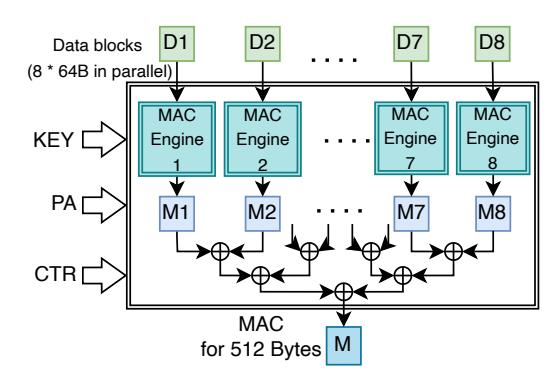

Fig. 9. Parallel hardware MAC mechanism on NPU. We generate the MAC for 512-byte data in parallel, requiring only a few additional XOR operations.

granularity. Although some recent works claim to use larger granularity (such as tensor [13] granularity) to manage MAC, they still reuse the CPU's hardware verification engine while the NPU is computing matrices, which will cause the CPU-NPU communication overhead. Given the substantial memory bandwidth requirements of LLM computation, reducing this security metadata communication overhead is essential.

We implemented a CPU-decoupled memory protection and verification mechanism that adopts the NPU's native memory access granularity as the unified protection standard across both CPU and NPU. Since the CPU's hardware is difficult to change, we decided to design a software method to handle the security metadata initialization on the CPU side. At initialization, NPU and CPU engage in a key negotiation protocol to synchronize their AES cryptographic keys, guaranteeing key establishment without exposure. Then, the larger data chunks are divided into blocks according to the CPU's memory access granularity and processed by the CPU software, as shown in Fig. 8. This implies that the CPU computes individual blocks' MACs independently and combines the results via software XOR to generate the final MAC suitable for the NPU. Due to the CPU being only responsible for initialization, the software MAC computing does not reduce runtime performance. Moreover, the initialization overhead can be efficiently hidden using the near-zero-overhead startup mechanism described in Section III-C.

On the NPU side, we designed a parallel hardware MAC verification engine on the NPU, as shown in Fig. 9, that achieves significantly lower latency and higher throughput performance compared to conventional serial execution approaches. Our NPU-based MAC engine integrates 8 parallel 64-byte computation units, enabling simultaneous security metadata processing for 512-byte data blocks. By adding a few XOR operations, it accomplishes MAC generation and verification with 8-way parallelism. The AES engine's parallel granularity is aligned with the MAC engine, ensuring seamless data processing. The security engine's degree of parallelism is optimized to maximize computational efficiency. For security metadata verification at larger granularities, the hardware supports configurable computation of MACs over  $(512 \times n)$ -byte data blocks through n iterative operations.

SecNPU implements a CPU-decoupled security design by unifying the address space and memory protection granularity

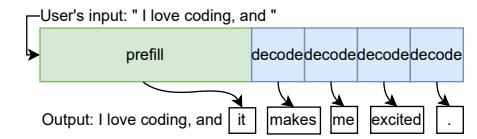

Fig. 10. The original inference process of LLM. The prefill phase generates the first token, and the decode phase generates the subsequent tokens.

between the CPU and NPU sides. This approach eliminates both the overhead associated with regenerating security metadata due to physical address changes and the communication costs incurred by CPU-coupled security check operations during runtime. Thereby, SecNPU architecturally decreases the security overhead while maintaining robust protection guarantees.

## *C. Near-Zero-Overhead Secure LLM Startup*

The overhead of secure startup for LLM applications encompasses two key components: generating the security metadata and transferring the metadata across the CPU and NPU, as illustrated in Fig. [4.](#page-2-1) In scenarios where users request translation of individual words or brief content summarization, the startup time constitutes a significant portion of the total inference duration. Therefore, we design a near-zero-overhead secure startup mechanism to mitigate the overhead associated with the security metadata generation and data transmission.

In current inference systems, the parameters of LLM are directly loaded into the computer's memory and then transferred to the NPU side to start the computation. Our optimization goal is to achieve a negligible overhead compared to the traditional startup without a security mechanism.

Our key observation is that the inference process of large language models comprises two distinct phases: prefill and decode, as shown in Fig. [10.](#page-5-1) The prefill phase is the initialization stage of the inference system when processing the input sequence. It generates all intermediate results (i.e., Key-Value cache [\[20\]](#page-7-18)) through a complete forward computation, providing an initial state for subsequent autoregressive token generation in the decode phase. The decode phase is where the system exploits intermediate states from the prefill phase and generates tokens step by step in an autoregressive manner.

During the prefill phase, the inference system is computeintensive [\[21\]](#page-7-19), as it needs to compute a large number of intermediate results without any cache values for reference. In contrast, the decode phase is memory-intensive [\[21\]](#page-7-19), as it frequently accesses and updates the intermediate variable (Key-Value cache) during the inference process. *This results in the prefill phase occupying significantly less memory bandwidth than the decode phase.*

Based on these characteristics, we propose a security metadata transmission strategy. Upon receiving user input prompts, the NPU immediately initiates computation on the input tokens. Concurrently, the security metadata scheduler orchestrates the transfer of unified security metadata from the CPU to NPU memory via DMA operations, as illustrated in Fig. [5.](#page-3-0) Since the memory bandwidth is underutilized during the prefill phase, the backend metadata transfer does not interfere

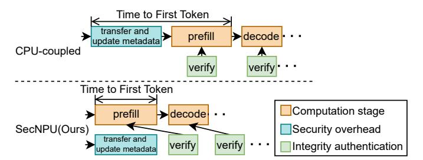

Fig. 11. The secure inference process. We mask the security overhead by overlapping the security metadata transmission with the prefill stage computation. The CPU-coupled scheme cannot achieve overlap due to its security metadata coupled with CPU.

TABLE I NPU SIMULATOR CONFIGURATION.

| Parameter         | Value                           |
|-------------------|---------------------------------|
| Frequency         | 700 MHz                         |
| PE Array          | 256 × 256                       |
| Scratchpad memory | 24 MB                           |
| DRAM bandwidth    | GDDR5 (20 GB/s with 4 channels) |
| AES/MAC latency   | 40 cycles                       |

with prefill computations. Following the prefill phase, the decode phase performs synchronous verification of both the initialized data and intermediate variables generated during prefill, as shown in Fig. [11.](#page-5-2) The CPU-coupled architecture cannot overlap the generation and transfer of security metadata with prefill-phase computations, as metadata generation must occur after data is transferred to the NPU — a constraint imposed by its coupled physical address. Compared to the CPU-coupled approach, our method eliminates the overhead of security metadata generation by adopting a unified security metadata scheme, as described in Section [III-B.](#page-3-3) Additionally, it masks the transmission cost of security metadata by overlapping the prefill-phase computation with security metadata transfer.

SecNPU leverages the compute-intensive nature of the prefillphase inference, using idle memory bandwidth to transfer security metadata. Thereby, SecNPU eliminates secure initialization overhead and achieves near-zero-overhead secure startup.

# IV. EVALUATION

# *A. Methodology*

- *1) Simulator:* We implemented our design on a cycleaccurate NPU simulator, SCALE-Sim [\[26\]](#page-7-25), developed jointly by researchers from the Georgia Institute of Technology and ARM Research. This simulator offers flexible configuration of systolic array specifications and on-chip dual-buffered SRAM memory capacity. We configured the simulator to emulate Google's TPUv1 architecture accelerator as our reference design, as shown in Table [I,](#page-5-3) and integrated our enhanced security features module onto this baseline configuration.
- *2) Workloads:* We selected 10 open-source LLMs as our benchmark, spanning parameter size scales from 1.1B to 9B, including: TinyLlama 1.1B (tinyllama-1.1b), OPT 1.3B (opt-1.3b), GPT2 XL (gpt2-xl-1.6b), Gemma 2 2B (gemma2-2b), OPT 2.7B (opt-2.7b), XGLM 4.5B (xglm-4.5b), ChatGLM3 6B (chatglm-6b), DeepSeek R1 Distill Llama 8B (ds-r1-distill-8b), GLM 4V 9B (glm-4v-9b), and Gemma 2 9B (gemma2-9b).

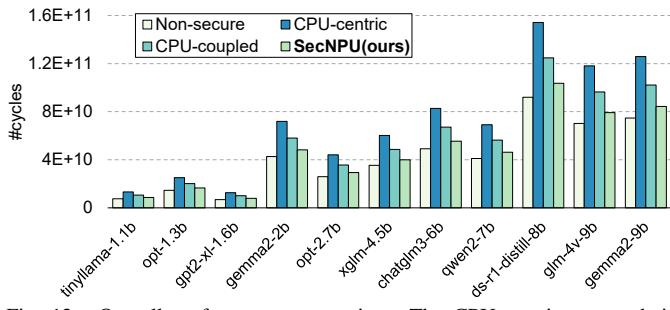

Fig. 12. Overall performance comparison. The CPU-centric approach is represented by TNPU [12], while the CPU-coupled method corresponds to TensorTEE [13], which represents the SOTA. SecNPU demonstrates significant performance advantages over these approaches (lower is better).

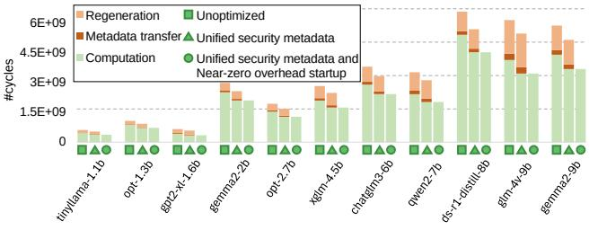

Fig. 13. Hardware ablation study of SecNPU. The  $\square$  on the x-axis means the original unoptimized solution. The  $\triangle$  means adding the unified security metadata mechanism, and the  $\circ$  means adding both the unified security metadata and the near-zero-overhead secure startup mechanisms. A lower cycle count indicates better performance.

We compare 4 types of configurations in our experiments: 1) Non-secure: This configuration refers to the original NPU system without any security enhancement. It is used as a reference. 2) CPU-centric: In this configuration, the NPU sends all security verification requests to the CPU side, like TNPU [12]. 3) CPU-coupled: The CPU-coupled configuration is deployed by the state-of-the-art (SOTA) NPU TEE [13], which only sends integrity verification requests to the CPU side. 4) SecNPU (ours): This configuration decouples the security guarantee for NPU from the CPU, and leverages LLM's runtime characteristics to mask startup overhead to achieve efficient LLM inference while not reducing security preservation.

### B. Experiment Results

1) Performance: We compare the accelerator's LLM inference time (using the NPU's execution cycles as a unit) for four different protection mechanisms mentioned above. Fig. 12 compares the overall inference time between different mechanisms with LLMs of various sizes. The CPU-centric [12] and CPU-coupled [13] separately introduce 70.9% and 38.0% overhead for whole average inference cycles. Due to differences in model architecture, the smaller models may exhibit longer inference times compared to larger ones in simulation. For instance, ds-r1-distill-8b demonstrates a slower inference speed than glm-4v-9b. Nevertheless, this discrepancy does not compromise our optimizations in performance. Our approach achieves an average speed of 1.51× compared to the CPU-centric design and 1.22× compared to CPU-coupled systems, while introducing only a 13.3% overhead relative to non-secure implementations.

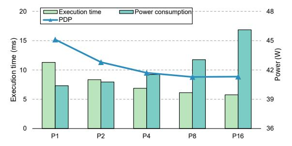

Fig. 14. Optimal parallelism analysis for the security engine with minimal Power Delay Product (PDP).

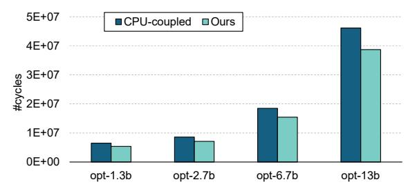

Fig. 15. Performance over different model sizes.

- 2) Ablation Study: Using the CPU-coupled scheme as our unoptimized baseline, we quantitatively evaluated the latency reduction achieved through (1) unified security metadata(usm) implementation and (2) near-zero-overhead startup(nzos) optimization. This evaluation primarily focuses on scenarios requiring minimal token outputs, such as text summarization and word translation, where secure initialization accounts for a significant portion of the overall computational overhead. As illustrated in Fig. 13, our experimental results demonstrate: 1) The introduction of unified security metadata achieves an average 1.14× speedup, primarily by eliminating redundant communication with the CPU. 2) The near-zero-overhead startup mechanism delivered an additional 1.33× speedup on average through parallelized security initialization and computation pipelining. In summary, compared to the CPUcoupled approach, our secure startup solution achieves an average  $1.61 \times$  speedup.
- 3) Design Space Exploration: We investigated the impact of varying degrees of parallelism in security engines, as illustrated in Fig. 9, using the power-delay product (PDP) as the metric to determine the optimal configuration. Our analysis reveals that the PDP reaches its minimum at a parallelism degree of 8. When increasing parallelism to 16, the results slightly deviate from the optimal value, accompanied by an excessive increase in power consumption, as shown in Fig. 14. Consequently, we select a parallelism degree of 8 for the security engines as the optimal design choice, which increases power consumption by 6.6% while providing the best PDP.
- 4) Sensitivity Analysis: We systematically evaluated the scaling behavior of our optimization across varying model sizes in Fig. 15, employing the open-source OPT model series as benchmark workloads. Using the SOTA CPU-coupled scheme [13] as our baseline, experimental results demonstrate our approach achieves a consistent 1.20× speedup in inference time across all model scales.

*5) Hardware Cost:* We implemented an RTL prototype of the system to evaluate its hardware area overhead. The design incorporates a 32KB MAC cache, 32KB OTP cache, and 32KB counter cache, along with an 8-way parallel hardware encryption and integrity verification module. ASIC synthesis using 28nm technology demonstrates that our implementation introduces only 1.63% additional area overhead on the TPUv1.

# V. CONCLUSION

This paper presents SecNPU, a novel NPU TEE architecture featuring CPU-decoupled memory protection and near-zerooverhead secure startup. The proposed system significantly reduces security communication overhead between the NPU and CPU during computation while enabling fast and secure initialization of model inference. Experimental results demonstrate that SecNPU achieves significant performance improvements over baseline systems, delivering 1.51× faster secure inference and 1.61× faster secure startup. Furthermore, SecNPU maintains consistent optimization effectiveness across models of varying scales.

## ACKNOWLEDGMENT

We would like to thank the anonymous reviewers and COMPASS members for their insightful comments. This work was supported in part by the National Natural Science Foundation of China under Grant No.62172387, No.62372218, and No.U24A6009; in part by the Open Research Fund of the State Key Laboratory of Blockchain and Data Security, Zhejiang University.

## REFERENCES

- [1] Y. Li, H. Wen, W. Wang, X. Li, Y. Yuan, G. Liu, J. Liu, W. Xu, X. Wang, Y. Sun, *et al.*, "Personal llm agents: Insights and survey about the capability, efficiency and security," *arXiv preprint arXiv:2401.05459*, 2024.
- [2] Z. Zhang, C. Chen, B. Liu, C. Liao, Z. Gong, H. Yu, J. Li, and R. Wang, "Unifying the perspectives of nlp and software engineering: A survey on language models for code," *arXiv preprint arXiv:2311.07989*, 2023.
- [3] B. Yang, S. Jiang, L. Xu, K. Liu, H. Li, G. Xing, H. Chen, X. Jiang, and Z. Yan, "Drhouse: An llm-empowered diagnostic reasoning system through harnessing outcomes from sensor data and expert knowledge," *Proceedings of the ACM on Interactive, Mobile, Wearable and Ubiquitous Technologies*, vol. 8, no. 4, pp. 1–29, 2024.
- [4] A. S. Rakin, M. H. I. Chowdhuryy, F. Yao, and D. Fan, "Deepsteal: Advanced model extractions leveraging efficient weight stealing in memories," in *2022 IEEE symposium on security and privacy (SP)*, pp. 1157–1174, IEEE, 2022.
- [5] M. Fredrikson, S. Jha, and T. Ristenpart, "Model inversion attacks that exploit confidence information and basic countermeasures," in *Proceedings of the 22nd ACM SIGSAC conference on computer and communications security*, pp. 1322–1333, 2015.
- [6] AWS Team, "Large language model inference over confidential data using AWS nitro enclaves." [https://aws.amazon.com/cn/blogs/machine-l](https://aws.amazon.com/cn/blogs/machine-learning/large-language-model-inference-over-confidential-data-using-aws-nitro-enclaves/) [earning/large-language-model-inference-over-confidential-data-using-a](https://aws.amazon.com/cn/blogs/machine-learning/large-language-model-inference-over-confidential-data-using-aws-nitro-enclaves/) [ws-nitro-enclaves/,](https://aws.amazon.com/cn/blogs/machine-learning/large-language-model-inference-over-confidential-data-using-aws-nitro-enclaves/) 2024. Accessed: May 8, 2025.
- [7] W. Huang, Y. Wang, A. Cheng, A. Zhou, C. Yu, and L. Wang, "A fast, performant, secure distributed training framework for llm," in *ICASSP 2024-2024 IEEE International Conference on Acoustics, Speech and Signal Processing (ICASSP)*, pp. 4800–4804, IEEE, 2024.
- [8] G. Heo, S. Lee, J. Cho, H. Choi, S. Lee, H. Ham, G. Kim, D. Mahajan, and J. Park, "Neupims: Npu-pim heterogeneous acceleration for batched llm inferencing," in *Proceedings of the 29th ACM International Conference on Architectural Support for Programming Languages and Operating Systems, Volume 3*, pp. 722–737, 2024.

- [9] D. Xu, H. Zhang, L. Yang, R. Liu, G. Huang, M. Xu, and X. Liu, "Fast on-device llm inference with npus," in *Proceedings of the 30th ACM International Conference on Architectural Support for Programming Languages and Operating Systems, Volume 1*, pp. 445–462, 2025.
- [10] M. Seo, X. T. Nguyen, S. J. Hwang, Y. Kwon, G. Kim, C. Park, I. Kim, J. Park, J. Kim, W. Shin, *et al.*, "Ianus: Integrated accelerator based on npu-pim unified memory system," in *Proceedings of the 29th ACM International Conference on Architectural Support for Programming Languages and Operating Systems, Volume 3*, pp. 545–560, 2024.
- [11] H. Lin, X. Yu, K. Zhao, L. Hou, Z. Zhan, S. Kamenev, H. Bao, T. Hu, M. Wang, Q. Chang, *et al.*, "Fastattention: Extend flashattention2 to npus and low-resource gpus," *arXiv preprint arXiv:2410.16663*, 2024.
- [12] S. Lee, J. Kim, S. Na, J. Park, and J. Huh, "Tnpu: Supporting trusted execution with tree-less integrity protection for neural processing unit," in *2022 IEEE International Symposium on High-Performance Computer Architecture (HPCA)*, pp. 229–243, IEEE, 2022.
- [13] H. Han, X. Zheng, Y. Wen, Y. Hao, E. Feng, L. Liang, J. Mu, X. Li, T. Ma, P. Jin, *et al.*, "Tensortee: Unifying heterogeneous tee granularity for efficient secure collaborative tensor computing," in *Proceedings of the 29th ACM International Conference on Architectural Support for Programming Languages and Operating Systems, Volume 4*, pp. 282–297, 2024.
- [14] W. Hua, M. Umar, Z. Zhang, and G. E. Suh, "Guardnn: secure accelerator architecture for privacy-preserving deep learning," in *Proceedings of the 59th ACM/IEEE Design Automation Conference*, pp. 349–354, 2022.
- [15] N. Shrivastava and S. R. Sarangi, "Securator: A fast and secure neural processing unit," in *2023 IEEE International Symposium on High-Performance Computer Architecture (HPCA)*, pp. 1127–1139, IEEE, 2023.
- [16] G. Kadam, D. Zhang, and A. Jog, "Rcoal: mitigating gpu timing attack via subwarp-based randomized coalescing techniques," in *2018 IEEE international symposium on high performance computer architecture (HPCA)*, pp. 156–167, IEEE, 2018.
- [17] Z. Wang and R. B. Lee, "A novel cache architecture with enhanced performance and security," in *2008 41st IEEE/ACM International Symposium on Microarchitecture*, pp. 83–93, IEEE, 2008.
- [18] A. Vaswani, N. Shazeer, N. Parmar, J. Uszkoreit, L. Jones, A. N. Gomez, Ł. Kaiser, and I. Polosukhin, "Attention is all you need," *Advances in neural information processing systems*, vol. 30, 2017.
- [19] N. P. Jouppi, C. Young, N. Patil, D. Patterson, G. Agrawal, R. Bajwa, S. Bates, S. Bhatia, N. Boden, A. Borchers, *et al.*, "In-datacenter performance analysis of a tensor processing unit," in *Proceedings of the 44th annual international symposium on computer architecture*, pp. 1–12, 2017.
- [20] Y. Liu, H. Li, Y. Cheng, S. Ray, Y. Huang, Q. Zhang, K. Du, J. Yao, S. Lu, G. Ananthanarayanan, *et al.*, "Cachegen: Kv cache compression and streaming for fast large language model serving," in *Proceedings of the ACM SIGCOMM 2024 Conference*, pp. 38–56, 2024.
- [21] Y. Zhong, S. Liu, J. Chen, J. Hu, Y. Zhu, X. Liu, X. Jin, and H. Zhang, "{DistServe}: Disaggregating prefill and decoding for goodput-optimized large language model serving," in *18th USENIX Symposium on Operating Systems Design and Implementation (OSDI 24)*, pp. 193–210, 2024.
- [22] S. Lee, S. Na, J. Kim, J. Park, and J. Huh, "Tunable memory protection for secure neural processing units," in *2022 IEEE 40th International Conference on Computer Design (ICCD)*, pp. 105–108, IEEE, 2022.
- [23] G. E. Suh, D. Clarke, B. Gasend, M. Van Dijk, and S. Devadas, "Efficient memory integrity verification and encryption for secure processors," in *Proceedings. 36th Annual IEEE/ACM International Symposium on Microarchitecture, 2003. MICRO-36.*, pp. 339–350, IEEE, 2003.
- [24] B. Rogers, S. Chhabra, M. Prvulovic, and Y. Solihin, "Using address independent seed encryption and bonsai merkle trees to make secure processors os-and performance-friendly," in *40th Annual IEEE/ACM International Symposium on Microarchitecture (MICRO 2007)*, pp. 183– 196, IEEE, 2007.
- [25] W. Hua, M. Umar, Z. Zhang, and G. E. Suh, "Mgx: Near-zero overhead memory protection for data-intensive accelerators," in *Proceedings of the 49th Annual International Symposium on Computer Architecture*, pp. 726–741, 2022.
- [26] A. Samajdar, Y. Zhu, P. Whatmough, M. Mattina, and T. Krishna, "Scalesim: Systolic cnn accelerator simulator," *arXiv preprint arXiv:1811.02883*, 2018.