# **Elastic On-Device LLM Service**

Wangsong Yin1, Rongjie Yi2, Daliang Xu2, Gang Huang1,

Mengwei Xu2,3#, Xuanzhe Liu1#

1Peking University, Beijing, China

2Beijing University of Posts and Telecommunications, Beijing, China

3Beiyou Shenzhen Institute, Shenzhen, China

yws@stu.pku.edu.cn

{hg,liuxuanzhe}@pku.edu.cn

{mwx,xudaliang}@bupt.edu.cn

#### **Abstract**

On-device Large Language Models (LLMs) are transforming mobile AI, catalyzing applications like UI automation without privacy concerns. Nowadays the common practice is to deploy a single yet powerful LLM as a general task solver for multiple requests. We identify a key system challenge in this paradigm: current LLMs lack the elasticity to serve requests that have diversified Service-Level Objectives (SLOs) on inference latency. To tackle this, we present ElastiLM, an on-device LLM service that elasticizes both the model and the prompt dimension of a full LLM. It incorporates (1) a one-shot neuron-reordering method, which leverages the intrinsic permutation consistency in transformer models to generate high-quality elasticized sub-models with minimal runtime switching overhead; (2) a dual-head tiny language model, which efficiently and effectively refines the prompt and orchestrates the elastification between model and prompt. We implement such an elastic on-device LLM service on multiple COTS smartphones, and evaluate ElastiLM on both standalone NLP/mobile-agent datasets and end-to-end synthesized traces. On diverse SLOs, ElastiLM outperforms 7 strong baselines in (absolute) accuracy by up to 14.83% and 10.45% on average, with <1% TTFT switching overhead, onpar memory consumption and <100 offline GPU hours.

\*Corresponding author.

Permission to make digital or hard copies of all or part of this work for personal or classroom use is granted without fee provided that copies are not made or distributed for profit or commercial advantage and that copies bear this notice and the full citation on the first page. Copyrights for components of this work owned by others than the author(s) must be honored. Abstracting with credit is permitted. To copy otherwise, or republish, to post on servers or to redistribute to lists, requires prior specific permission and/or a fee. Request permissions from permissions@acm.org. ACM MOBICOM '25, November 4–8, 2025, Hong Kong, China

@ 2025 Copyright held by the owner/author(s). Publication rights licensed to ACM.

ACM ISBN 979-8-4007-1129-9/2025/11 https://doi.org/10.1145/3680207.3765259

### **CCS Concepts**

• Computer systems organization → Embedded and cyber-physical systems; • Computing methodologies → Natural language generation.

### **Keywords**

On-Device Large Language Models, Elastic Service, Service-Level Objectives

#### 1 Introduction

Large Language Models (LLMs) are ushering in a transformative era for mobile AI. A multitude of killer apps are built on top of LLMs, encompassing mobile UI automation [73], API-calling [22, 79], and screen content comprehension [14]. For instance, one can easily place an order by simply saying "Order a pizza now from Pizza Hut" in smartphone.

With ever-growing privacy concerns, deploying LLMs on local devices [1, 48, 55, 85] is attracting attentions increasingly. For instance, mobile GUI agent [45] handles users' requests by accessing the device screen information, which may contain highly private photos or chat history. To this end, Google has developed Android AICore [1], a built-in on-device LLM in Android OS that has been used by apps like GBoard smart reply and Pixel voice recorder.

On-device LLM needs elasticity. LLM can handle ubiquitous language tasks, at the cost of large parameter size, making it neither "necessary" nor "practical" to deploy separated LLMs on a device. Instead, on-device LLM is often *shared* across tasks and apps, e.g., LLM-as-a-Service in OS [1]. However, a single static LLM cannot meet the diversified Service-Level Objective (SLO) demanded by different LLM tasks. Consequently, on-device LLM needs elasticity. Demand of elasticity is further exaggerated and complicated since LLM inference consists of two distinct stages: prefill (prompt processing speed) and decode (token generation speed), whose latencies are measured by Time-To-First-Token (TTFT) and Time-Per-Output-Token (TPOT), respectively. For instance, a chatbot [8] must behave both low TTFT and low TPOT to match human reading speed; a UI-automation agent [73, 88]

typically requires a low TTFT and an acceptable TPOT, as TPOT can be overlapped with UI manipulations; a screenevent recorder [14] running in background only needs a tolerable TTFT/TPOT. Even in a single app, the SLOs maybe also diversified due to the resource/task variation. Failing to meet an SLO leads to serious consequences: a significant degradation of user experience, or failure in the interactions between LLM agents and the environments/tools [3, 22, 88].

Ideally, a request is sent to the elastic LLM with its prompt as well as the SLO expected, and the LLM needs to provide the highest text generation quality without failing the SLO. Fundamentally differing from prior work that elasticize CNNs in pre-LLM era [27, 28, 30, 74], a key opportunity in our system model is that, both model and input (prompts) dimensions of the LLM can be elasticized. Through multi-scale LLM pruning technique [47, 62, 78], one can get a crucial subset of weights that running at different speed; similarly, through scoring the importance of each input token [38, 52, 56], one can prune the prompt into different lengths on demand. In both ways, LLM accuracy is sacrificed for faster text generation in a flexible manner. Our pilot experiments in §2.2 explore how each dimension of elasticity impacts the LLM inference latency: TTFT (often more time consuming and requires higher elasticity) is proportional to both the prompt length and the model size; TPOT is mainly proportional to the model size with the help of KV cache [42].

**Challenges.** However, elasticizing an on-device LLM faces the following unique challenges.

- •Costly runtime switching between elasticized models. An elastic LLM service has to frequently switch between the sub-models at request level, yet traditional model elastification methods (e.g. structural pruning) often ignore this switching overhead [20, 43, 47, 74]. For instance, generated by SoTA structural pruning [47], a sub-model of LLaMA-7B with 20% parameters takes 8.2s to switch to 30% on Redmi K60 Champion. The root cause is that, to utilize the deeply optimized on-device NN inference libraries and hardware throughput, the interleaved and overlapping sub-models' weights must be re-layouted to contiguous format in memory before inference (or each sub-model must be maintained an unacceptable standalone copy in memory). This switching overhead is billed to TTFT since the switching can only be performed right after the LLM receiving a request.
- Sensitive prompt-model orchestration strategy. There exist multiple elastic strategies to meet an SLO, yet their output text quality could differ significantly. Exemplified with a real prompt from ARC\_E dataset in Figure 5, although both elastic strategies (50%/20% prompt/model pruning vs. 20%/50% prompt/model pruning) can meet the SLO, only the first strategy leads to a correct generated answer. Another instance is that with randomized strategy, the top5 API selection of Octopus dataset exhibits a 15.2% accuracy loss to the oracle

strategy on an SLO with 50% TTFT and 80% TPOT of the full LLaMA-7B model. How to orchestrate the two dimensions of elastification to maximize the LLM output quality at request level has not been touched in prior study.

**Our solution: ElastiLM.** We present ElastiLM, a system for elasticizing on-device LLMs. It tackles the above challenges through the following novel techniques.

One-shot reordering of permutation consistent units (§3.2). This technique performs pruning on a fine granularity of permutation consistent units in Transformers. Identified by ElastiLM, these units can be offline arbitrarily layouted in a block (e.g., Attention or MLP) while guarantee the equivalent input/output as original block, thereby fundamentally avoiding the runtime switching overhead. Specifically, such a unit is an entire attention head (i.e., columns in  $W_O/W_K/W_V$ and rows in  $W_O$  with the same indices), or an entire MLP neuron (i.e., a column in  $W_{up}$  and a row in  $W_{down}$ ). In the one-shot reordering, ElastiLM first profiles the importance of the units through an eXplainable-AI (XAI) [35, 59, 64] guided method, which measures unit importance via gradients. Then, ElastiLM reorders the units in memory based on their importance, making each contiguous memory segment (starting from base address to a memory pointer) a sub-model. After reordering by importance, the pruning always extends from the periphery inward, thus requiring no online reordering. The profiling and reordering are all done offline, incurring no online overhead. The online switching of sub-models is zero-cost by only moving the pointer. ElastiLM further incorporates other optimizations such as LoRA recovery and anchor layers locking to improve the sub-models quality.

Dual-head Tiny Language Model (TLM) for promptmodel elastification orchestration (§3.3). Different from prior work [38, 56] that only focus on identifying important tokens, ElastiLM designs a dual-head TLM as an endto-end solution for determining an optimal prompt-model elastification strategy. Specifically, the TLM features two heads, namely score-head and decision-head. During inference, the score-head estimates the token importance, while the decision-head chooses the proper prompt- and modelelastification ratios (mapped to the real latency by a oneshot profiling on various SoCs). At offline, the decision-head learns from the prompts and groundtruth of a generic corpora. As a self-induced labelling process, all possible strategies of a prompt with its SLOs are traversed to get the inference result, and an optimal strategy is recorded as the label. Both the training and inference of TLM are cost-effective with careful optimizations like reusing the compact Mobile-Bert and bottom layers sharing.

**Evaluation.** We have fully implemented ElastiLM on 3 COTS smartphones and 5 base/instruction-tuned LLMs with 3B-7B parameters. The datasets encompass fundamental

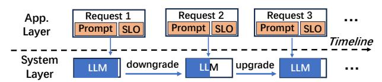

Figure 1: The system model. The service can be upgraded/downgraded at runtime to adapt to various SLOs.

language tasks ARC\_E/OBQA/PIQA/SCIQ [\[23,](#page-13-11) [40,](#page-13-12) [51,](#page-14-8) [83\]](#page-15-4), mobile UI automation tasks LlamaTouch [\[88\]](#page-15-2), and mobile system API-calling tasks Octopus [\[22\]](#page-13-0). Evaluation shows that ElastiLM achieves up to 14.83% and on average 10.45% higher absolute accuracy on end-to-end traces, and up to 40% on standalone datasets, when meeting all request SLOs. Within 2% absolute accuracy loss, ElastiLM can speed up TTFT by up to 5× and TPOT by up to 2×. The runtime memory consumption is also on-par with non-elastic LLM service. The entire elastification of ElastiLM only takes 68.3 GPU hours (within \$100 GPU renting cost [\[7\]](#page-12-5)) when elastictizing LLaMA-7B for MI14 smartphone, being affordable for most LLM service developers.

Contributions are listed as follows:

- We highlight the strong motivation and key challenges of elastic on-device LLM service.
- We present ElastiLM, a system that fully exploits the space of model and prompt elastification through two novel techniques/designs, one-shot reordering of permutation consistent units and dual-head tiny language model.
- We conduct comprehensive experiments on ElastiLM that demonstrate its superior performance over competitive baselines.

# 2 Background and Motivations

# 2.1 Elastic on-device LLM service

On-device LLM needs elasticity. As listed in Table [1,](#page-2-1) a chatbot must behave both low TTFT and TPOT in order to match human reading speed. A UI-automation agent requires a relatively low TTFT to generate the first action and an acceptable TPOT, since the following latency can be overlapped with the manipulation of UI elements and thus transparent to users. Besides, these mobile-agents typically only decode few tokens compared to the prompt length, making a lower TTFT more important. Failing to provide satisfactory latency for a request leads to serious consequences: a significant degradation in user experience, or failure in the interactions between LLM agents and the environment/tools.

How to satisfy the heterogeneous demands of different LLM requests, while not degrade the LLM output quality

| Mobile LLM App.                       | Service-Level Objective    |
|---------------------------------------|----------------------------|
| Chatbot [8]                           | Readable TTFT/TPOT         |
| Always-on Voice Assistant [6, 15]     | Very-Low TTFT, medium TPOT |
| Background Screen-Event Recorder [14] | Tolerable TTFT/TPOT        |
| Smart Message Reply [5]               | Low TTFT, low TPOT         |
| API-Calling Agent [22]                | Low TTFT, acceptable TPOT  |
| UI-Automation Agent [73, 88]          | Low TTFT, acceptable TPOT  |

Table 1: SLOs of various mobile LLM applications.

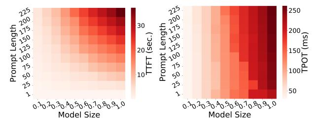

(a) Prefill latency. (b) Decode latency.

Figure 2: LLM inference latency w.r.t. prompt length and model size. Measured on LLaMA-7B, Redmi K60 Champion (Snapdragon 8Gen2).

significantly? One plausible solution is to deploy a dedicatedsized LLM for each SLO[1](#page-2-2) . This is unfriendly (and even infeasible) to both the LLM service developers and users. On one hand, costly GPU resources are required for pretraining multiple LLMs; on the other hand, memory consumption rises dramatically in order to manage these LLMs — running counter to the motivation behind a single LLM service.

The system model. Thereby, we propose our system model. As illustrated in Figure [1,](#page-2-3) at system layer, there is one running LLM that serves requests from the application layer (e.g., apps/agents). Each request consists of a prompt (a text sequence as LLM input) and an SLO (inference latency constraint). This single LLM can rapidly upgrade/downgrade itself to a more bulky/swift one at runtime to adapt to a specific SLO.

# 2.2 Opportunities and challenges

Observation#1: LLM inference latency is influenced by two dimensions — prompt and model. An LLM inference workload can be divided into two dimensions: prompt (activations) and model (weights). We conduct a measurement of LLaMA-7B inference on Redmi K60 Champion smartphone equipped with Snapdragon 8Gen2 SoC. We use 4 threads (big cores). The "model size" here represents a sub-model of LLaMA-7B [\[70\]](#page-14-9) (e.g., 0.1 means 10% parameters). In Figure [2,](#page-2-4) we observe that both the two dimensions can influence LLM inference latency. TTFT is influenced by both prompt length

1 In cloud datacenters, a tighter SLO can be achieved by scaling up hardware resources, e.g., number of GPUs/TPUs. However, hardware resource of mobile devices is limited and not scalable.

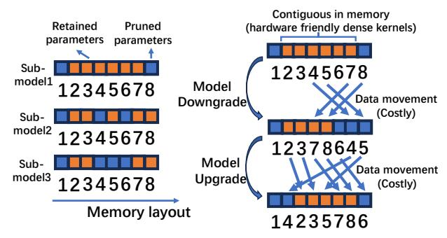

**(a) Pruned sub-models. (b) Model upgrade/downgrade.**  Figure 3: Elastic LLM does not translate to Elastic LLM service. Non-negligible request-level overhead of data movement is still suffered when directly employing model pruning.

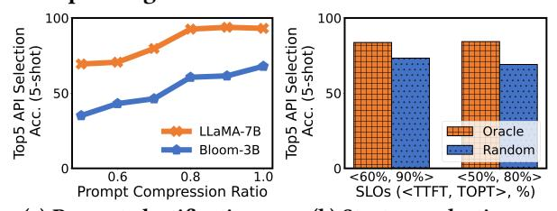

(a) Prompt elastification. (b) Strategy selection. Figure 4: Prompts of on-device LLM service are also elasticizable. Yet the ratio needs careful (and contentaware) selection to achieve an optimal orchestration with model elastification.

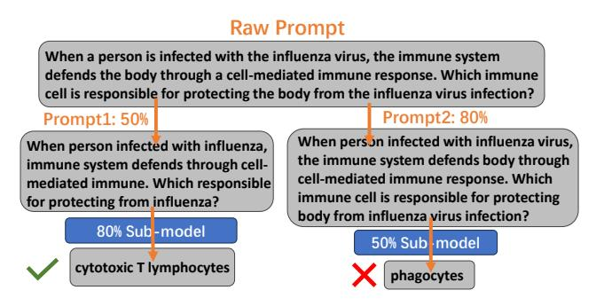

Figure 5: Sensitive prompt-model orchestration. We use a prompt of **ARC\_E** dataset and the elasticized LLaMA-7B as an exemplification. The SLO is 40% TTFT of the full LLM.

and model size; TPOT is mainly determined by model size[2](#page-3-1) We have the following proportional relationships:

$$TTFT \propto PromptLength \times ModelSize,$$
  
 $TPOT \propto Modelsize,$  (1)

.

Notably, as shown Figure [2,](#page-2-4) TTFT is much longer than TPOT (e.g, seconds v.s. milliseconds), which necessitates a more aggressive elastification of TTFT.

Observation#2: LLMs are elasticizable; yet elastic LLM does not necessarily translate to elastic LLM service. DNNs are known to be elasticizable: they can provide various compute-accuracy tradeoffs by a subset of their parameters (known as pruning [\[28,](#page-13-4) [47\]](#page-13-6)). For instance, Sheared-LLaMA [\[78\]](#page-15-3) demonstrates that pruning off 60% parameters of a 7B-size LLM can still retain 74% of original accuracy on ARC\_E dataset [\[23\]](#page-13-11). LLMPruner [\[47\]](#page-13-6) further shows that with lightweight Parameter-Efficient Fine-Tuning (PEFT) methods, the accuracy loss incurred by pruning could be recovered. Since pruning (and PEFT) generates sub-models that share the same superset of parameters, there is no overhead of extra memory or pre-training that mentioned in §[2.1.](#page-2-5)

Yet, the challenge is that, since the model upgrades/downgrades itself to adapt to various requests' SLOs, switching between these sub-models is not overhead-free. As shown in Figure [3a](#page-3-2), although sub-models share the same superset of parameters, they are no longer contiguous in memory. One may change the deeply optimized dense kernels of on-device NN libraries (e.g., MNN [\[39\]](#page-13-13) or mllm [\[11\]](#page-12-9)) to handcrafted sparse kernels. However, these kernels typically undergo degraded performance without fully exploiting the parallelism of processors (e.g., mobile GPUs/NPUs or multi-core CPUs). Another compromising method is to perform a movement of parameter data for each model switching, as shown in Figure [3b](#page-3-2). Although the switching overhead is mitigated from iteration/operator level to request level, it is still nonnegligible. For instance, movement of LLaMA-7B's a matrix (4096×4096) takes 139 ms on Redmi K60 Champion smartphone in the worst case, and consequently the entire model suffers time overhead at seconds level.

Observation#3: Prompts of on-device LLM service are also elasticizable. Intuitively, as a natural language sequence, a prompt could still preserve essential semantic information when refined to a shorter one. Especially, the prompts of LLM service callers tend to be verbosely designed in order to maximize the LLM's instruction following [\[54,](#page-14-10) [92\]](#page-15-5) and incontext learning [\[25,](#page-13-14) [75\]](#page-14-11) abilities. In other words, the prompt dimension can also be elasticized just like the model dimension. We showcase employing a commonly used prompt compression method LLMLingua2 [\[56\]](#page-14-5) for Octopus [\[22\]](#page-13-0) dataset, which contains traces of an on-device API-calling agent. LLMLingua2 identifies and preserves most semantically significant tokens by a dedicated language model. We report top5 function match accuracy of Octopus. As shown in Figure [4a,](#page-3-3) the accuracy shows a well-performing tradeoff curve when gradually compressing the prompt.

However, the challenge is the sensitive prompt-model orchestration. An intuitive example is that, if a request sets

2Only when the prompt is extremely long (e.g. over 10K tokens), the attention operator will dominate inference, and TPOT will then be influenced by prompt length.

its SLO as 40% TTFT and 80% TPOT3, we cannot know which strategy is golden a priori — a 50% prompt with an 80% model? an 80% prompt with a 50% model? or others?4 Prompts with various content naturally require distinct and customized strategies. In Figure 4b and Figure 5, we demonstrate that a strategy without careful design (e.g., random) may lead to a significant degradation on accuracy. We use LLaMA-7B elasticized by our method (elaborated in §3.2) on Octopus dataset. The prompt is elasticized by LLMLingua2.

### 3 ElastiLM Design

### 3.1 Overview

**Design goal.** ElastiLM aims to provide LLM service that adapts to a specific Service Level Objective (SLO) of resource constraint per request (prompt), while maximizing the service quality (i.e., LLM generation accuracy).

**SLO definition.** In this paper, we define SLO of LLM service as a tuple  $<\zeta_{TTFT},\zeta_{TPOT}>$ , where  $\zeta$  is the compression ratio to full LLM latency. The SLOs that an LLM service should serve is pre-defined by the service developers.

Workflow. As shown in Figure 6, ElastilM features a two-stage workflow. At cloud offline stage, on one hand, the model is elasticized to various levels of sub-models that share the memory and can be cost-effectively switched (§3.2). On the other hand, we on-cloud fine-tune a TLM for prompt elastification (§3.3). At device online stage, the elasticized LLM and fine-tuned TLM are deployed on mobile devices as a service. For each LLM service request, the prompt and the corresponding SLO are fed into the fine-tuned TLM. The TLM then outputs a compressed prompt and selects a sub-model with proper size. Finally, an LLM inference that satisfies the given SLO is performed atop the sub-model and the compressed prompt.

#### 3.2 Model elastification

**Permutation consistent units of Transformer models.** We explore a mathematically provable characteristic of Transformer models — permutation consistency.

Property 1. Units of a neuron network are called permutation consistent units if they can be reordered between each other in a block without affecting the block's input/output.

This property indicates that a dense operator kernel can equivalently process these units in arbitrary order without any runtime data re-layout. The rationale behind it is that the Reduce operator (e.g., sum/min/max) satisfies the commutative and associative laws. A basic block that contains such

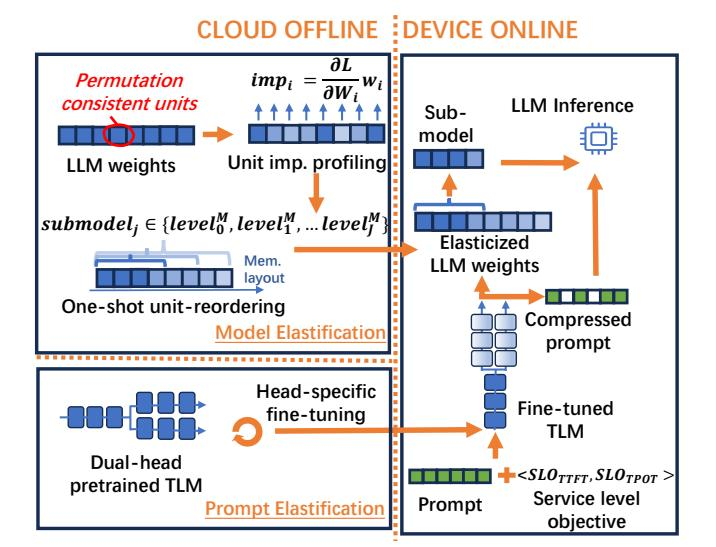

Figure 6: Workflow of ElastiLM.

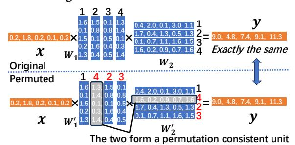

Figure 7: Illustration of permutation consistency.

units is  $y = xW_1W_2$  in Figure 7. Its permutation consistent unit is a column of  $W_1$  together with the corresponding row of  $W_2$ . If we permute the weights as shown in Figure 7, the intermediate activation  $xW_1'$  will be permuted in response. Nevertheless,  $W_2'$  is also permuted in the same order, so the multiplication of MatMul operator can still be performed correctly. Since the following addition of MatMul operator is a Reduce operator, the calculated  $xW_1'W_2'$  is exactly the same as  $xW_1W_2$ . Notably, different from prior work [91] that also leverages the Reduce operator to permute DNNs, Elastilm's key insight is to identify such a joint unit in two-layer blocks that are ubiquitous in Transformers. Permutation of this unit can be made completely offline, while [91] still needs online reordering the input with a single operator level abstraction.

Property 2. Attention heads and MLP neurons of Transformer models are permutation consistent units.

As shown in Figure 8, there are two types of permutation consistent units in the main weights of a Transformer layer, i.e., attention heads and MLP neurons, and they are independent to each other. Specifically, the contiguous columns/rows with the same indices in  $W_Q$ ,  $W_K$ ,  $W_V$  and  $W_O$  (i.e., an

&lt;sup>3See our formal definition of SLO in §3.1.

&lt;sup>4According to formula 1, there are multiple combinations of prompt and model that can meet the exemplified SLO.

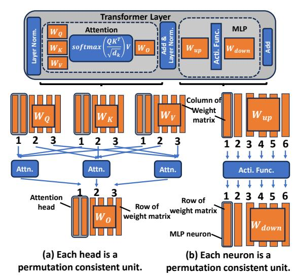

Figure 8: Permutation consistent units in Transformer.

attention head) constitute a permutation consistent unit; a column/row with the same index in  $W_{up}$  and  $W_{down}$  (i.e., an MLP neuron) also constitute a permutation consistent unit. The derivation process is similar to the example in Property 1, Figure 7 — the last operator of attention and MLP blocks is Reduce. Property 2 holds true for mainstream Transformer-based language models with variants like RoPE5 [61], biased QKV [19], GQA [26] or gated MLP [70].

Our method: one-shot unit-reordering. Based on Property 1 and Property 2, we propose a novel model elastification method as shown in Figure 9. Its key idea is to "atomize" the Transformer into the units shown in Figure 8, and then group them to construct a series of sub-models that each is contiguous in memory. To illustrate, basically, in Figure 7 each column in  $W_1$  and the row with same index in  $W_2$  will be assigned with an importance score offline. Then the columns/rows are reordered in  $W_1/W_2$  to make a submodel contiguous. At online,  $W_1'$  and  $W_2'$  only need to slice a submatrix (e.g., with indices 1,4 out of  $W_1'/W_2'$ ) out of the original one by a zero-cost movement of memory pointer. Detailed later.

• Offline. Specifically, Elastilm first profiles importance of each unit offline (detailed later). Since these units are permutation consistent, Elastilm freely reorders them by their importance in descending order (if importance is the higher the better), starting from the base address of the weight tensor. Notably, the reordering is only performed intra-block, e.g., reordering the unit of attention heads in the same attention block. Then, Elastilm groups these units into sub-models. For example, in Figure 9, sub-model in levelM3 contains units with indices (not address) "1 5 8 2", and sub-model in levelM1 contains "1 5 8 2 3 4 7". The sub-model sizes and numbers

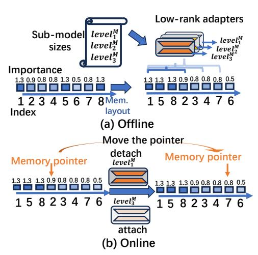

Figure 9: ElastiLM offline profiles and reorders permutation consistent units in one-shot; it online switches (i.e., upgrade/downgrade) sub-models by cost-effectively attaching/detaching the corresponding adapters and moving the memory pointer.

 $\{level_1^M, \cdots, level_J^M\}$  are pre-defined by the developers. In practice, we set this to a fine enough granularity (a global ratio of 20% to 100% in a step size of 10%, by default). Such a ratio is evenly shared by all Transformer layers that need elastification. After that, low-rank adapters [34] are attached to each sub-model to recover potential generation quality loss (if there is any) of these sub-models. We elaborate such a recovery process in the following parts. So far, the LLM weights have been elasticized into a series of high-quality sub-models that run in various speed. We demonstrate the quality of generated sub-models in Figure 10a.

• Online. In Figure 9b, the upgrading of model is performed in the following steps: ElastilM first detaches the corresponding adapter from sub-model  $level_1^M$ , which has served the last request. Then, it moves the ending memory pointer of the weights tensor from the address of unit with index "2" to "7". After that, ElastilM attaches another adapter to sub-model  $level_3^M$ , and the upgrading is finished. Such a process is very cost-effective on mobile devices — it does not involve any data movement compared to traditional pruning methods, and can still utilize deeply-optimized dense kernels provided by NN libraries. For instance, upgrading  $W_Q$  to  $4096 \times 4096$  size only takes 2 ms on Redmi K60 Champion smartphone, while a naive pruning method must undergo a 140ms data movement.

Profiling unit importance through explainable-AI. Parameters of neuron networks are known to feature diverse importance. For instance, a weight element with higher magnitude may contribute more to NN capability [31, 36, 44]. Inspired by the concept of eXplainable-AI (XAI) [35, 59, 64], Elastilm profiles unit importance with a more accurate

 $^5\mathrm{RoPE}$  only introduces position information in sequence axis and intra-head axis.

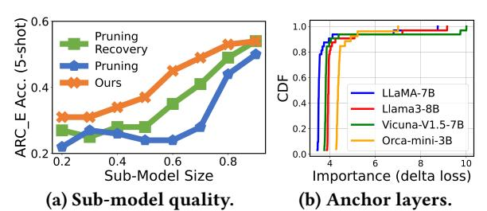

Figure 10: (a) ElastiLM generates sub-models that with consistently higher quality than pruning and pruning+recovery [47]. (b) A small portion of layers. i.e., "anchor layers", is much more important than others.

method, i.e., by the next-token prediction loss function L on a calibration corpus C. The intuition behind XAI is that, if a unit is more important, it should make L larger on C when been removed. Specifically, we define importance of unit i as  $imp_i = |L - L_{W_i=0}|$ . By Maclaurin series [65], we get

$$imp_i = |L - L_{W_i=0}| = |\frac{\partial L}{\partial W_i} W_i + o(||W_i||^2)|.$$
 (2)

Since the second term is a higher-order infinitesimal, ElastiLM then takes  $\left|\frac{\partial L}{\partial W_i}W_i\right|$  as a estimation of unit importance. By default, C is set to a sub-set of bookcorpus [93], which is a general-purpose language-modeling dataset.

Besides, interestingly, we find that several layers are much more important than other layers. We call these layers "anchor layers". We measure the importance of a layer by the increase of loss function when a layer is removed. As shown in Figure 10b, the importance of layers exhibits a power-law distribution (80/20 rule), which means about 20% layers are anchor layers. As a result, we lock these layers from elastification. For example, if we need a 50%-size sub-model of a 32 layers LLM, we retain 37.5% permutation consistent units for each non-anchor layer (26 layers in total).

**Task-agnostic low-rank recovery of sub-models.** We add Low-Rank Adapters (LoRAs) [34] to the frozen  $W_{Q/K/V/O}$  and  $W_{up/down}$  of each sub-model to recover them from potential accuracy loss. A LoRA is two low-rank matrices  $A \in \mathcal{R}^{n \times r}$  and  $B \in \mathcal{R}^{r \times m}$  that trained as a side branch of main weights. Elastilm's default setting of r is 8, an empirically common practice in LoRA-based tunings. LoRA weights are only 0.1%–0.5% of the entire LLM weights, and thus such a method only introduces <5% extra memory overhead even under Elastilm's fine-grained sub-model settings. The switching overhead is also minimized since the attaching/detaching operations are all low-rank MatMul and element-wise MatAdd.

Different from traditional language models that need tuning on specific downstream tasks (e.g., Bert [24], T5 [58]), LLM commonly serves as a generic task solver. Thereby, ElastiLM's sub-model recovery is *task-agnostic*. LoRAs are trained with next-token prediction loss that identical to

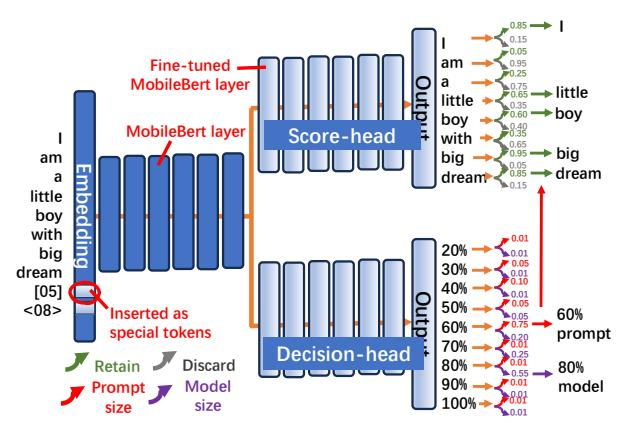

Figure 11: The dual-head TLM.

the pre-training process. Thanks to LoRA's preservation of the LLM backbone's capability, a general, high-quality and moderate-size corpus can handle this recovery well. By default, each sub-model is recovered on about 50M tokens of Alpaca-cleaned [2, 67] dataset. We also discuss the impact of recovery data in §5.5.

**Remarks** ElastiLM's model elastification generates finegrained, high-quality sub-models with both acceptable offline overhead and negligible online overhead.

### 3.3 Prompt elastification

Dual-head TLM. ElastiLM tackles the challenges mentioned in §2.2 by a dual-head Tiny Language Model (TLM). As shown in Figure 11, the TLM is a variant of mobilefriendly pre-trained language model MobileBert [63], a compact model with only 20% parameters of BERT\_base [24] yet just 0.7% accuracy loss on GLUE benchmark [71]. We make the following modifications. Firstly, the SLO of the current request is marked in natural language and inserted into the embedding layer of MobileBert as special tokens. For instance, "[05]" represents the prefill SLO is 50% TTFT; "<08>" is 80% TPOT. These special tokens are initialized to word vectors that orthogonal to each other. Secondly, the TLM is designed with two separate heads, named score-head and decision-head. The score-head treats each token of the prompt as a two-class classification problem, where each token can be classified into "discard" or "retain". The decisionhead treats the entire sequence of prompt with SLO as two multi-class classification problems. Each possible model elastification level (i.e., the sub-model size, discussed in §3.2) is a class of one problem; possible prompt elastification levels are classes of the other problem. Akin to model elastification, the prompt is also pre-defined to multiple fine-grained levels  $\{level_1^P, \cdots, level_K^P\}$  by the developers. By default, we set it in alignment with model elastification levels. Besides, the

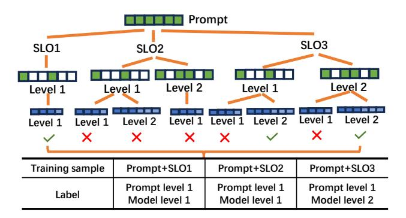

Figure 12: Illustration of the self-induced labelling process of decision-head training data collection.

two heads share the same bottom layers (12 out of 24 layers by default) based on the rationale that bottom layers of DNNs are mainly responsible for capturing basic instead of task-specific information. In doing so, the overhead of TLM inference/training is further minimized.

TLM inference. At decision-head, Elastilm takes the class with the max probability as its decision. For example, in Figure 11, the decision-head selects a 60% prompt and 80% model. At score-head, Elastilm ranks the prompt tokens by the probability of "retain", then selects top ones according to decision-head. For example, in Figure 11, the scores are ranked by the green probabilities. Notably, if the TLM outputs a decision that cannot meet the SLO (which is nearly yet not impossible due to the black-box property of DNNs), Elastilm will execute a runtime check and the decision will fall back to a random one that stringently meet the SLO. After inference, we get a compressed prompt and a selected sub-model.

The inference overhead is acceptable. Its total parameters are about 40M, which means 2 orders of magnitude less memory footprint than the LLM service. Regarding to latency, the TLM can still perform an on-device inference within 5% of the original LLM's TTFT even if the LLM's prompt is compressed while TLM's not.

**TLM training.** The TLM is initialized from the pre-trained weights of MobileBert; each head is further fine-tuned individually. We keep the pre-trained embedding layer and bottom layers frozen. When training one head, the other head is also frozen.

• Score-head. We first use MeetingBank [10] dataset to finetune the score-head. The dataset contains about 50M tokens of corpus that each token is labelled "discard" or "retain" by GPT-4 [17]. Note that the training of score-head is independent to the decision-head and the LLM. Figure 13a shows the effectiveness of score-head with LLaMA-7B and Octopus dataset. Our method achieves on-par prompt refining ability compared to LLMLingua2.

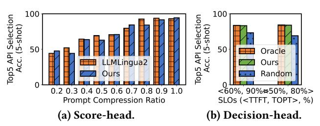

Figure 13: Effectiveness of dual-head TLM.

• Decision-head. After training score-head, we train decisionhead with the assistance of both the elasticized LLM and the score-head. The intuition is that we can traverse the decision space and learn the optimal one offline. Specifically, the training data is collected by a self-induced labelling process. In Figure 12, we provide an illustrative example. For each prompt and SLO (pre-defined by developer, see §3.1), we enumerate all its possible decisions, and label it with the most lightweight one under which the LLM can output correct answer. If all possible decisions fail, the decision is assigned to a default one (e.g., random). By default, ElastiLM collects training samples from a comprehensive benchmark MMLU-Pro [72], which contains 17 domains of question-answer pairs. In Figure 13b, the decision head demonstrates significantly higher quality than random decision, and approaches oracle. We also discuss the impact of TLM training data in §5.5.

**Remarks** ElastiLM's prompt elastification efficiently and effectively elasticizes prompt and orchestrates model- and prompt-dimension of elastic LLM service.

### 4 Implementation

Offline stage. We build the elasticized LLM and the TLM on top of Pytorch [57]. We modify the modeling.py of Huggingface Transformers7 [76] library to identify the permutation consistent units and profile their importance. In doing so, ElastiLM can easily be made forward-compatible with LLMs released in the future. The offline elastification is performed on a cloud server equipped with 8 NVIDIA A40 GPUs.

On-device stage. We build an LLM service on top of mllm8 [11], which is a lightweight yet powerful on-device LLM inference library written in pure C++ and assembly language. We pack the LLM inference program as a standalone binary file and run it as an independent process. The apps interact with it through interfaces like bindLLMService() and callLLM(). To facilitate the upgrade/downgrade of elasticized sub-models without incurring inference-time performance degradation, the Linear is replaced by ElasticLinear.

&lt;sup>6The developers pre-execute a one-shot profiling on a testing device within 1 hour under the guidance of Formula 1 and leverage the profiled data to judge whether a decision can meet a SLO.

&lt;sup>7Commit hash c31473ed4492fdf26aec4173451f31590021862f

&lt;sup>8Commit hash ed766fae54d9f1bf2b6b25018e6cc434ce223303

| Name                            | SoC              | RAM  |
|---------------------------------|------------------|------|
| Redmi K60 Champion Edition [12] | Snapdragon 8gen2 | 19GB |
| Mi 14 [16]                      | Snapdragon 8gen3 | 22GB |
| Redmi K70 Pro [13]              | Snapdragon 8gen3 | 24GB |

Table 2: Devices we use in our experiments.

Specifically, we wrap the original dense kernel with an additional memory pointer that specifies the addresses of submodel weights. We optimize the low-rank MatMul and MatAdd of LoRA with ARM NEON [4]. The LLM service runs on Commercial Off-The-Shelf (COTS) smartphones.

#### 5 Evaluation

### 5.1 Experimental settings

**Testbed.** We conduct experiments on the following testbeds. On cloud, we use a server with a 64-core CPU (750GB RAM) and 8 A40 GPUs (45GB HBM each). On device, we test ElastiLM across COTS smartphones listed in Table 2.

**Models.** We test the following LLMs. (1) *Two base LLMs:* LLaMA-7B [70] and Llama3-8B [26]. (2) *Two instruction-tuned LLMs:* Vicuna-V1.5-7B [90] and Llama3-instruct-8B [26]. (3) *One sub-7b LLM:* Orca-mini-3B [53].

**SLOs.** We randomly set 6 SLOs based on a stepwise sensitivity hierarchy as shown in Table 3. We also enumerate more varying SLOs in Figure 18d for a real-world discussion. Rewind is a content comprehension app, which requires relaxed SLO; GMail is a natural language summary and reasoning task, which requires relatively relaxed SLO; Octopus and Shortcuts are on-device agent tasks, which need moderate SLO as they involve interactions with the environment; Gboard and XiaoAi are AI assistants, which need real-time response, i.e., a relatively tight SLO.

**Workload.** We evaluate ElastiLM on both standalone datasets and end-to-end synthesized traces.

- Datasets. We select 6 representative datasets/benchmarks: ARC\_E [23], OBQA [51], Octopus [22], PIQA [83], SCIQ [40] and LlamaTouch [88]. We report option select accuracy of ARC\_E, PIQA, SCIQ and OBQA, top-5 function (without parameters) selection accuracy of Octopus, and app invocation accuracy of LlamaTouch. Each entry is augmented by incontext learning in 5-shots. ARC\_E, PIQA, SCIQ and OBQA are natural language comprehension and common-sense reasoning tasks that are ubiquitous on mobile devices; Octopus is an on-device API-calling benchmark that follows the natural language instruction of users and selects the most suitable functions; LlamaTouch is a realistic and complicated on-device UI-automation agent benchmark that manipulates mobile apps following user instructions.
- End-to-end traces. We further synthesize end-to-end traces on top of the above datasets. In Table 3, we list 6 conceived apps in response to the pre-defined SLOs. The requests and

| Apps    | SLO          | Dataset | Apps      | SLO        | Dataset |
|---------|--------------|---------|-----------|------------|---------|
| Rewind  | <100%, 100%> | OBQA    | Shortcuts | <40%, 70%> | LTouch  |
| GMail   | <80%, 90%>   | ARC_E   | Gboard    | <20%, 60%> | PIQA    |
| Octopus | <60%, 80%>   | Octopus | XiaoAi    | <20%, 50%> | SCIQ    |

Table 3: Apps, SLOs and datasets for trace synthesis.

groundtruths of an app are synthesized from a dataset in similar domain, since there is no public available user data in the wild. Specifically, we collect 600 entries of requests in total for a trace. To comprehensively evaluate Elastilm, we emulate the distribution skewness of requests by  $Num(i) = \frac{600 \times e^{\alpha i}}{\sum_{k=1}^{k=6} e^{\alpha k}}$ , where Num(i) is an app's # of request, i is the SLO level (the lower, the tighter), and  $\alpha$  is a controlling factor. The larger the value of  $\alpha$ , the greater the proportion of more relaxed SLOs in the trace. When  $\alpha=0$ , all SLOs are evenly distributed in the trace. We synthesize multiple traces with various distributions. For each trace, we randomly shuffle the requests and set the arrival timestamp by a Poisson distribution.

**ElastiLM configurations.** The training/fine-tuning/calibration data, elastification levels and TLM configuration are the same as those described in §3.

Baselines. We compare ElastiLM to the following alternatives. (1) Directly employing pre-trained from scratch LLMs (PFS) for diverse SLOs is a strong yet plausible baseline. Due to the unaffordable GPU resource consumption, we select the off-the-shelf OPT [89] family. As far as we know, it provides the richest variants with fewer than 7B parameters (5 models from 125M to 6.7B). (2) LLMPruner [47] (LPruner) is a State-of-The-Art (SoTA) parameter pruning method for elastification. (3) Layer-wise elastification [9] (LE) prunes parameters at layer level. (4) LLMLingua2 [56] + Contextual sparsity [46] (LG2+CS) compresses prompts at prefill stage, and dynamically activates MLP neurons for each token at decode stage. (5) Other strong pruning baselines: LaCo [84], ShortGPT [49] and AttnDrop [32].

### 5.2 End-to-end performance

We first evaluate end-to-end performance on traces in §5.1. **Accuracy.** We report the request-response accuracy when all requests' SLOs are met in a trace. We compare the correctness of the LLM's answer to groundtruth. We set three levels of trace skewness:  $\alpha=0$  (even),  $\alpha=0.25$  (towards relaxed) and  $\alpha=-0.25$  (towards tight). Each trace is executed on three diverse COTS devices listed in Table 2. The results are averaged across these three devices and shown in Figure 14.

ElastiLM significantly outperforms the baselines by 6.60%–14.83% (10.45% on average) in absolute accuracy. Compared to PFS, ElastiLM further involves prompt elastification and does not introduce costly switching overhead. Besides, PFS does not fully make use of the room below a given SLO. Another potential reason is that ElastiLM derives sub-models

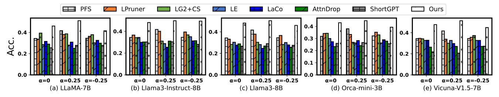

Figure 14: End-to-end request-response accuracy on the traces. controls the SLO distribution.

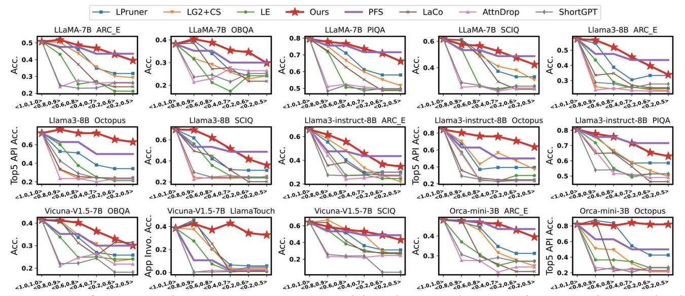

Figure 15: Performance under one SLO on an entire standalone dataset without considering switching overhead.

from a bulky one, which may feature stronger emergent ability than the SLMs pretrained from scratch. Compared to LPruner, ElastiLM involves prompt elastification, and minimizes switching overhead. Uniqueness to LG2+CS. Firstly, the heavy SLM of LLMLingua2 must compress the prompt very aggresively to meet a tight TTFT SLO since contextual sparsity shows limited acceleration on prefill stage due to the low locality. Secondly, the sparsity ratio is also compromised due to non-relu [\[18,](#page-12-19) [70\]](#page-14-9) activation functions, non-elastictizable attention [\[46\]](#page-13-21) and degraded performance of sparse kernels. In contrast, ElastiLM's model elastification identifies and leverages the permutation consistency in Transformer models and works for both prefill and decoding, and its prompt elastification considers and tackles the unique challenge of promptmodel orchestration. Compared to LE/LaCo/ShortGPT/AttnDrop, ElastiLM shows steady performance gain. This is due to that these methods only elasticizes the model in layer level. In contrast, ElastiLM's unit-level fine-grained pruning traverses a much larger space. Also, LaCo will generate sub-models that cannot fully share the weights between each other, resulting in extra switching overhead.

Figure 16: Online overhead.

Memory consumption. We discuss peak memory consumption in Figure [16a.](#page-9-1) Without loss of representativeness. we report LLaMA-7B in the trace with = 0 on Redmi K60 Champion. ElastiLM consumes on-par memory compared to the baselines (15–17GB). Notably, directly deploying all the dedicated size LLMs in memory is impractical. As marked as PFS(Ideal)/LaCo(Ideal) in Figure [16a,](#page-9-1) it consumes 29.3GB/76.3GB memory in total, which is OOM on all the COTS devices in Table [2.](#page-8-0)

Switching overhead. With the same setting, we report the breakdown latency of switching between different model elastification levels (i.e., sub-models) in Figure [16b.](#page-9-1) Switching

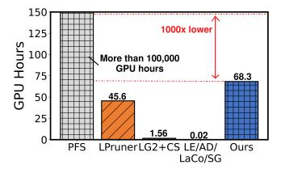

| Corpus             | # of   | GPU   |
|--------------------|--------|-------|
| Source             | Tokens | Hours |
| Bookcorpus         | 6.4K   | 0.03  |
| Alpaca- cleaned | 50M    | 40.4  |
| Meetingbank        | 50M    | 1.7   |
| MMLU-Pro           | 340K   | 26.3  |

(a) GPU hours. (b) Breakdown.

Figure 17: Offline overhead of **ElastiLM**.

time is actually part of TTFT, and a too long switching time will preempt the room of model/prompt capacity, leading to a lower accuracy. PFS (Swap) and LPruner incur unacceptable time overhead that up to 8.3/6.2 seconds per request. This is mainly attributed to the costly swapping and in-memory data movement. ElastiLM only takes 0.31 second to switch to a new submodel. Such a number is lower than 1% of average TTFT of LLM service, thus being completely acceptable. The end-to-end experiments with switching overhead considered in Figure [14](#page-9-0) also show that the switching time of ElastiLM is an acceptable tradeoff for LLM service.

Remarks ElastiLM is the most high-quality and feasible solution for end-to-end on-device elastic LLM service.

# 5.3 Performance on standalone datasets

With a specific SLO, we further report the performance on an entire standalone dataset to show ElastiLM's superiority. The switching overhead is dismissed as there is no upgrade/ downgrade. The results are obtained on cloud server with SLO statistics on Mi 14 smartphone, and are shown in Figure [15.](#page-9-2) We have the following observations. ElastiLM significantly outperforms all its baselines by up to 40% on accuracy. Specifically, on all the SLOs, ElastiLM always provides a much higher accuracy than the baselines (LE/LG2+CS/LPruner) that derive sub-models from the original one. Compared to PFS, ElastiLM provides a higher accuracy on 77.8% of all SLOs. The reasons are as discussed before. Please also note that PFS and LaCo are costly in terms of switching and memory at runtime. Performance gains are minimal in some high-SLO scenarios, this is due to a slight pruning (i.e., high SLO) will not significantly differentiate ElastiLM from the pruning baselines. However, only ElastiLM can work for all the varying SLOs for apps, since there will not always be high-SLO scenarios, and switching overhead (Figure [16b\)](#page-9-1) will also be considered when serving multiple apps.

# 5.4 Offline stage overhead

We further analysis the offline overhead in Figure [17.](#page-10-1) We measure the elastification of LLaMA-7B for MI14 on our A40 cloud server. Compared to PFS that trains a dedicated LLM for each SLO, ElastiLM derives elasticized LLMs from the original LLaMA-7B. Thereby, as shown in Figure [17a,](#page-10-1) the entire offline stage of ElastiLM only consumes 68.3 GPU hours (translates to about \$100 GPU renting price [\[7\]](#page-12-5)), making it affordable for most developers. Compared to other baselines that also derive elasticized LLMs from the original one, ElastiLM takes 21.7–68.2 more GPU hours, which is acceptable since the offline stage is performed once for all. Note that in the above sections, we have demonstrated that ElastiLM delivers an elastic LLM service with much higher quality than these baselines.

In Figure [17b,](#page-10-1) we provide a detailed breakdown of ElastiLM's offline stage. The model recovery (§[3.2\)](#page-4-0) and self-induced labelling (§[3.3\)](#page-6-0) dominate the offline stage, taking 40.4/26.3 hours. The reason the latter requires tremendous time is due to the lower GPU utilization caused by interactions with the score-head and sub-models.

# 5.5 Sensitivity analysis

Data sensitivity. As shown in Figure [18a,](#page-11-0) the data scale of elastification exhibits a marginal effect. Regarding to model recovery, we further collect training data from LaMini [\[77\]](#page-14-22) dataset that akin to Alpaca-cleaned. The final accuracy only increases 0.2%/0.4% when the recovery corpus is 10×/20× larger. Regarding to unit importance profiling and decision training data, we expand them from Bookcorpus and MMLU [\[33\]](#page-13-24), respectively. We also observe the similar marginal effect. Since Meetingbank is currently the largest corpus for token importance scoring to the best of our knowledge, we leave expanding it as a further work. In a nutshell, ElastiLM's data scale achieves a strong and sweet spot for high-quality elastification.

Configuration sensitivity. We have the following conclusions in Figure [18b.](#page-11-0) (1) 40M parameters are already a sweet configuration of TLM scale. A larger TLM's gain on scoring and decision-making accuracy quickly gets eliminated by the overhead. (2) 12 shared bottom layers are reasonable for TLM, since more will lead to a smaller capacity of the heads, and less will incur a higher inference/training overhead. (3) A step size of 10% for model and prompt elastification is finegrained enough for serving the diversified SLOs. Shrinking it to 5% makes almost no difference.

Ablation study. We show the effectiveness of ElastiLM's key designs in Figure [18c.](#page-11-0) We report the accuracy under a given resource SLO. Specifically, we respectively remove the key designs from our full system. Each removal of key design shows a clear performance degradation. The most significant loss comes from removing the reordering technique, showing over 10% accuracy loss. The reason is mainly due to that the reordering preserves the most important permutation consistent units. The score-head shows the least degradation, yet it is still obvious (about 5%). In a nutshell, the design of neuron-reordering, LoRA recovery and each head of the TLM are all non-trivial.

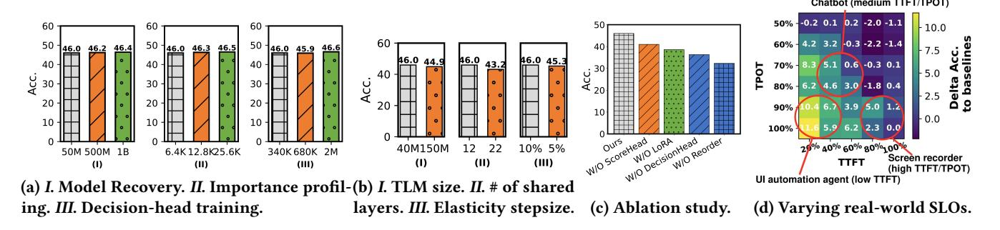

Figure 18: Sensitivity analysis and ablation study. (a)/(b)/(c): LLaMA-7B, on trace with  $\alpha$ =0; (d): LLaMA-7B, ARC\_E.

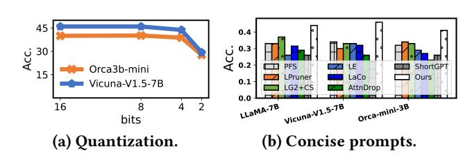

Figure 19: Model quantization and prompt conciseness.

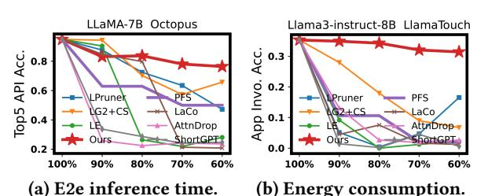

(a) E2e inference time. (b) Energy consumption. Figure 20: Generalization to other kinds of SLOs.

Varying real-world SLOs. In Figure 18d we report the delta accuracy of Elastilm compared to its strongest baseline PFS (without considering switching overhead) on ARC\_E LLaMA-7B. Elastilm is close to or much better than PFS on all SLOs, especially those are more common on mobile LLM tasks (e.g., chatbot, UI automation agent or screen recorder).

**Quantization.** Quantization is a widely-used technique for deploying LLMs on mobile devices. Here we employ a linear and weights only method on the  $\alpha=0$  trace in Figure 19a. ElastilM can deliver LLM service with almost lossless accuracy under 8bits integers, and acceptable (3% lower absolute accuracy) under 4bits.

**Concise prompts.** We further emulate the scenario where the prompts have been consciously streamlined by the LL-MaaS callers. We use LLMLingua2 to filter out about 15% verbose tokens in the prompt. The results (on trace with  $\alpha$ =0) in Figure 19b show that ElastiLM can still significantly outperform its baselines.

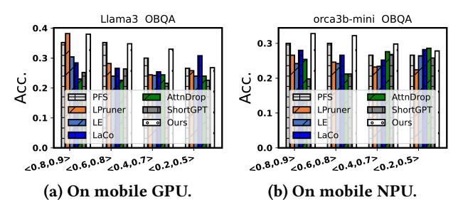

Figure 21: "What if" experiment on mobile accelerators that cannot seamlessly run ElastiLM and its baselines currently. LG2+CS is omitted due to its sparse compute.

#### 5.6 Discussion

Generalization to other SLOs. Although in this paper we identify LLM inference latency as the SLO of requests, the SLO can also been easily generalized to other metrics with our proposed method. Here we define another two SLOs: end-to-end request inference time  $SLO_{time}$  (i.e., prefill + decode stage) and inference energy consumption  $SLO_{energy}$ , each of which is with a step size of 10%. The results are obtained on Mi 14 smartphone. As shown in Figure 20, ElastilM consistently outperforms its baselines on these new SLOs. the rationale is that these SLOs are all a specific kind of resource requirement and can be break down into prompt- and modellevel elastifications. We believe that ElastilM can serve various metrics of SLOs for diverse apps' requirements.

Apps with competing demands. In regular on-device LLM service model, there is no concurrent requests since the device only has one user. However, in some extreme scenarios, other apps might have competing demands. ElastiLM will make it transparent to developers/apps. For instance, the LLM service may introduce upper-layer scheduling mechanisms like batching [86] to handle concurrency.

On mobile SoC accelerators. To the best of our knowledge currently (Aug., 2024) none of mobile DSAs can seamlessly run prefill and decode of ElastiLM and all its baselines due to legacy SDK/hardware issues like dynamic shape, graph building or non-sparse kernels. Thus, we conduct a "what

if" experiment by mapping the theoretical compute/memory load to the profiled latency on these processors. We use MNN [\[39\]](#page-13-13) and mllm-NPU [\[81\]](#page-15-12) for GPU/NPU profiling on Mi 14, respectively. The results are shown in Figure [21.](#page-11-3) ElastiLM can still significantly outperform the baselines. We believe that ElastiLM will become more friendly and practical to practitioners with the maturity of accelerators.

# 6 Related Work

Elastic neuron networks. Elastic neuron networks can change their capacity at runtime to dynamically adapt to various resource/accuracy constraints. Early exit networks [\[66,](#page-14-23) [69\]](#page-14-24) only perform inference on bottom layers since they are empirically more critical. Yet, early exit is not suitable for elastic LLM service. On one hand, due to LLMs' autoregressive inference nature, a skipped layer's KV cache may be accessed later. On the other hand, using layers as the granularity for trade-offs is not fine-grained enough. Parameter sharing networks [\[27,](#page-13-3) [30,](#page-13-5) [74\]](#page-14-2) generate memory-efficient sub-models that shares parameters with each other. For instance, NestDNN [\[27\]](#page-13-3) and LegoDNN [\[30\]](#page-13-5) create sub-models of CNNs via offline re-pretraining, which is costly for foundation models. Adaptivenet [\[74\]](#page-14-2) employs a CNN-oriented supernet, which provides diverse accuracy-latency tradeoffs yet needs extensive pre-training and memory resources. Activation sparsity [\[21,](#page-13-25) [41,](#page-13-26) [46,](#page-13-21) [60\]](#page-14-25) elasticitizes DNNs via sparsifying weights according to the NN inputs. An accuracylatency trade-off can be achieved by setting the proportion of activated weights. However, the prefill stage cannot be elastictized due to the low locality.

Efficient on-device LLM inference. Tremendous work [\[11,](#page-12-9) [39,](#page-13-13) [68,](#page-14-26) [82\]](#page-15-13) shed light on resource-efficiently deploying LLMs on mobile devices. For instance, MLC-LLM [\[68\]](#page-14-26) is an NNcompiler with operator- and kernel- level optimizations for mobile devices. MNN [\[39\]](#page-13-13) and mllm [\[11\]](#page-12-9) are on-device inference libraries for LLMs. PowerinferV2 [\[82\]](#page-15-13) addresses the memory issue of mobile devices by introducing swapping and activation sparsity to LLM inference. Targeting at elastic LLM service, ElastiLM is orthogonal to these work.

Foundation models as a service. As a general task solver, or so-called "AGI", a single foundation model is deployed as a service to process heterogeneous tasks [\[29,](#page-13-27) [85,](#page-15-1) [87\]](#page-15-14). For instance, AIOS [\[29\]](#page-13-27) is a system where a single LLM runs as the "brain" to serve all apps on the device. ElastiLM makes it more practical on resource-constrained mobile devices.

Model collaboration. ElastiLM employs a dual-head tiny language model to elasticize the prompt of the LLM. Using a small model to collaborate with the big model is common in ML systems. For instance, speculative decoding [\[50,](#page-14-27) [80\]](#page-15-15) accelerates the decode stage with a draft SLM. However, the prefill stage cannot be accelerated since it is typically

compute-bound. LLMlingua [\[37\]](#page-13-28) uses an SLM to refine the LLM prompt, which has several untackled issues for elastic LLM service as discussed in this paper.

# 7 Conclusion

This work has proposed ElastiLM, an elastic on-device LLM service that serves apps with diverse SLOs. ElastiLM incorporates two novel designs, i.e., one-shot reordering of permutation consistent units and dual-head tiny language model to fully unleash the potential of model- and promptelastification. ElastiLM significantly outperforms competitive baselines by up to 14.83% and 10.45% on average in accuracy.

# 8 Acknowledgment

This work was supported by the National Natural Science Foundation of China under Grant 6232520. Mengwei Xu was supported in part by the Shenzhen Science and Technology Program with Grant No. JCYJ20241202124021028.

# References

- [1] 2024. AICore. [https://developer.android.com/ml/aicore.](https://developer.android.com/ml/aicore)
- [2] 2024. alpaca cleaned. [https://huggingface.co/datasets/yahma/alpaca](https://huggingface.co/datasets/yahma/alpaca-cleaned)[cleaned.](https://huggingface.co/datasets/yahma/alpaca-cleaned)
- [3] 2024. Apple Intelligence. [https://www.apple.com/apple-intelligence/.](https://www.apple.com/apple-intelligence/)
- [4] 2024. ARM NEON. [https://developer.arm.com/Architectures/Neon.](https://developer.arm.com/Architectures/Neon)
- [5] 2024. Gboard Smart Reply. [https://developers.google.com/ml-kit/](https://developers.google.com/ml-kit/language/smart-reply) [language/smart-reply.](https://developers.google.com/ml-kit/language/smart-reply)
- [6] 2024. Hey Siri: An On-device DNN-powered Voice Trigger for Apple's Personal Assistant. [https://machinelearning.apple.com/research/hey](https://machinelearning.apple.com/research/hey-siri)[siri.](https://machinelearning.apple.com/research/hey-siri)
- [7] 2024. Huggingface GPU pricing. [https://huggingface.co/pricing.](https://huggingface.co/pricing)
- [8] 2024. Llama.cpp. [https://github.com/ggerganov/llama.cpp.](https://github.com/ggerganov/llama.cpp)
- [9] 2024. LLM layer pruning. [https://github.com/horseee/LLM-](https://github.com/horseee/LLM-Pruner/blob/cbe488944ed772f342e99d3d0efbab9df6520c21/hf_prune.py#L219)[Pruner/blob/cbe488944ed772f342e99d3d0efbab9df6520c21/hf\\_prune.](https://github.com/horseee/LLM-Pruner/blob/cbe488944ed772f342e99d3d0efbab9df6520c21/hf_prune.py#L219) [py#L219.](https://github.com/horseee/LLM-Pruner/blob/cbe488944ed772f342e99d3d0efbab9df6520c21/hf_prune.py#L219)
- [10] 2024. MeetingBank compressed. [https://huggingface.co/datasets/](https://huggingface.co/datasets/microsoft/MeetingBank-LLMCompressed) [microsoft/MeetingBank-LLMCompressed.](https://huggingface.co/datasets/microsoft/MeetingBank-LLMCompressed)
- [11] 2024. mllm. [https://github.com/UbiquitousLearning/mllm.](https://github.com/UbiquitousLearning/mllm)
- [12] 2024. redmi-k60-champion-edition. [https://www.giztop.com/redmi](https://www.giztop.com/redmi-k60-champion-edition.html)[k60-champion-edition.html.](https://www.giztop.com/redmi-k60-champion-edition.html)
- [13] 2024. Redmi K70 Pro. [https://www.mi.com/redmi-k70-pro.](https://www.mi.com/redmi-k70-pro)
- [14] 2024. rewind. [https://www.rewind.ai/.](https://www.rewind.ai/)
- [15] 2024. XiaoAi smart assistant. [https://xiaoai.mi.com/.](https://xiaoai.mi.com/)
- [16] 2024. xiaomi-14. [https://www.mi.com/global/product/xiaomi-14/.](https://www.mi.com/global/product/xiaomi-14/)
- [17] OpenAI: Josh Achiam, Steven Adler, Sandhini Agarwal, Lama Ahmad, Ilge Akkaya, et al. 2023. GPT-4 Technical Report. arXiv[:2303.08774](https://arxiv.org/abs/2303.08774) [cs.CL]
- [18] Abien Fred Agarap. 2019. Deep Learning using Rectified Linear Units (ReLU). arXiv[:1803.08375](https://arxiv.org/abs/1803.08375) [cs.NE]<https://arxiv.org/abs/1803.08375>
- [19] Jinze Bai, Shuai Bai, Yunfei Chu, Zeyu Cui, Kai Dang, Xiaodong Deng, Yang Fan, et al. 2023. Qwen Technical Report. arXiv preprint arXiv:2309.16609 (2023).
- [20] Han Cai, Chuang Gan, Tianzhe Wang, Zhekai Zhang, and Song Han. 2020. Once-for-All: Train One Network and Specialize it for Efficient Deployment. arXiv[:1908.09791](https://arxiv.org/abs/1908.09791) [cs.LG] [https://arxiv.org/abs/1908.](https://arxiv.org/abs/1908.09791) [09791](https://arxiv.org/abs/1908.09791)

- [21] Shijie Cao, Lingxiao Ma, Wencong Xiao, Chen Zhang, Yunxin Liu, Lintao Zhang, Lanshun Nie, and Zhi Yang. 2019. SeerNet: Predicting Convolutional Neural Network Feature-Map Sparsity Through Low-Bit Quantization. In 2019 IEEE/CVF Conference on Computer Vision and Pattern Recognition (CVPR). 11208–11217. [https://doi.org/10.](https://doi.org/10.1109/CVPR.2019.01147) [1109/CVPR.2019.01147](https://doi.org/10.1109/CVPR.2019.01147)
- [22] Wei Chen and Zhiyuan Li. 2024. Octopus v2: On-device language model for super agent. arXiv[:2404.01744](https://arxiv.org/abs/2404.01744) [cs.CL]
- [23] Peter Clark, Isaac Cowhey, Oren Etzioni, Tushar Khot, Ashish Sabharwal, Carissa Schoenick, and Oyvind Tafjord. 2018. Think you have Solved Question Answering? Try ARC, the AI2 Reasoning Challenge. arXiv:1803.05457v1 (2018).
- [24] Jacob Devlin, Ming-Wei Chang, Kenton Lee, and Kristina Toutanova. 2019. BERT: Pre-training of Deep Bidirectional Transformers for Language Understanding. arXiv[:1810.04805](https://arxiv.org/abs/1810.04805) [cs.CL] [https://arxiv.org/](https://arxiv.org/abs/1810.04805) [abs/1810.04805](https://arxiv.org/abs/1810.04805)
- [25] Qingxiu Dong, Lei Li, Damai Dai, Ce Zheng, Jingyuan Ma, Rui Li, Heming Xia, Jingjing Xu, Zhiyong Wu, Baobao Chang, Xu Sun, Lei Li, and Zhifang Sui. 2024. A Survey on In-context Learning. arXiv[:2301.00234](https://arxiv.org/abs/2301.00234) [cs.CL]<https://arxiv.org/abs/2301.00234>
- [26] Abhimanyu Dubey, Abhinav Jauhri, et al. 2024. The Llama 3 Herd of Models. arXiv[:2407.21783](https://arxiv.org/abs/2407.21783) [cs.AI]<https://arxiv.org/abs/2407.21783>
- [27] Biyi Fang, Xiao Zeng, and Mi Zhang. 2018. NestDNN: Resource-Aware Multi-Tenant On-Device Deep Learning for Continuous Mobile Vision. In Proceedings of the 24th Annual International Conference on Mobile Computing and Networking (MobiCom '18). ACM. [https:](https://doi.org/10.1145/3241539.3241559) [//doi.org/10.1145/3241539.3241559](https://doi.org/10.1145/3241539.3241559)
- [28] Gongfan Fang, Xinyin Ma, Mingli Song, Michael Bi Mi, and Xinchao Wang. 2023. Depgraph: Towards any structural pruning. In Proceedings of the IEEE/CVF Conference on Computer Vision and Pattern Recognition. 16091–16101.
- [29] Yingqiang Ge, Yujie Ren, Wenyue Hua, Shuyuan Xu, Juntao Tan, and Yongfeng Zhang. 2023. LLM as OS, Agents as Apps: Envisioning AIOS, Agents and the AIOS-Agent Ecosystem. arXiv[:2312.03815](https://arxiv.org/abs/2312.03815) [cs.OS] <https://arxiv.org/abs/2312.03815>
- [30] Rui Han, Qinglong Zhang, Chi Harold Liu, Guoren Wang, Jian Tang, and Lydia Y. Chen. 2021. LegoDNN: block-grained scaling of deep neural networks for mobile vision. In Proceedings of the 27th Annual International Conference on Mobile Computing and Networking (ACM MobiCom '21). ACM.<https://doi.org/10.1145/3447993.3483249>
- [31] Song Han, Jeff Pool, John Tran, and William J. Dally. 2015. Learning both Weights and Connections for Efficient Neural Networks. arXiv[:1506.02626](https://arxiv.org/abs/1506.02626) [cs.NE]<https://arxiv.org/abs/1506.02626>
- [32] Shwai He, Guoheng Sun, Zheyu Shen, and Ang Li. 2024. What Matters in Transformers? Not All Attention is Needed. arXiv[:2406.15786](https://arxiv.org/abs/2406.15786) [cs.LG]<https://arxiv.org/abs/2406.15786>
- [33] Dan Hendrycks, Collin Burns, Steven Basart, Andy Zou, Mantas Mazeika, Dawn Song, and Jacob Steinhardt. 2021. Measuring Massive Multitask Language Understanding. Proceedings of the International Conference on Learning Representations (ICLR) (2021).
- [34] Edward J. Hu, Yelong Shen, Phillip Wallis, Zeyuan Allen-Zhu, Yuanzhi Li, Shean Wang, Lu Wang, and Weizhu Chen. 2021. LoRA: Low-Rank Adaptation of Large Language Models. arXiv[:2106.09685](https://arxiv.org/abs/2106.09685) [cs.CL] <https://arxiv.org/abs/2106.09685>
- [35] Kai Huang, Boyuan Yang, and Wei Gao. 2023. ElasticTrainer: Speeding Up On-Device Training with Runtime Elastic Tensor Selection. In Proceedings of the 21st Annual International Conference on Mobile Systems, Applications and Services. 56–69.
- [36] Steven A. Janowsky. 1989. Pruning versus clipping in neural networks. Phys. Rev. A 39 (Jun 1989), 6600–6603. Issue 12. [https://doi.org/10.](https://doi.org/10.1103/PhysRevA.39.6600) [1103/PhysRevA.39.6600](https://doi.org/10.1103/PhysRevA.39.6600)

- [37] Huiqiang Jiang, Qianhui Wu, Chin-Yew Lin, Yuqing Yang, and Lili Qiu. 2023. LLMLingua: Compressing Prompts for Accelerated Inference of Large Language Models. arXiv[:2310.05736](https://arxiv.org/abs/2310.05736) [cs.CL] [https://arxiv.org/](https://arxiv.org/abs/2310.05736) [abs/2310.05736](https://arxiv.org/abs/2310.05736)
- [38] Huiqiang Jiang, Qianhui Wu, Xufang Luo, Dongsheng Li, Chin-Yew Lin, Yuqing Yang, and Lili Qiu. 2024. LongLLMLingua: Accelerating and Enhancing LLMs in Long Context Scenarios via Prompt Compression. In Proceedings of the 62nd Annual Meeting of the Association for Computational Linguistics (Volume 1: Long Papers), Lun-Wei Ku, Andre Martins, and Vivek Srikumar (Eds.). Association for Computational Linguistics, Bangkok, Thailand, 1658–1677. <https://aclanthology.org/2024.acl-long.91>
- [39] Xiaotang Jiang, Huan Wang, Yiliu Chen, Ziqi Wu, Lichuan Wang, Bin Zou, Yafeng Yang, Zongyang Cui, Yu Cai, Tianhang Yu, Chengfei Lv, and Zhihua Wu. 2020. MNN: A Universal and Efficient Inference Engine. In MLSys.
- [40] Matt Gardner Johannes Welbl, Nelson F. Liu. 2017. Crowdsourcing Multiple Choice Science Questions. arXiv:1707.06209v1.
- [41] Rui Kong, Yuanchun Li, Yizhen Yuan, and Linghe Kong. 2023. ConvReLU++: Reference-based Lossless Acceleration of Conv-ReLU Operations on Mobile CPU (MobiSys '23). Association for Computing Machinery, New York, NY, USA, 503–515. [https://doi.org/10.1145/](https://doi.org/10.1145/3581791.3596831) [3581791.3596831](https://doi.org/10.1145/3581791.3596831)
- [42] Woosuk Kwon, Zhuohan Li, Siyuan Zhuang, Ying Sheng, Lianmin Zheng, Cody Hao Yu, Joseph E. Gonzalez, Hao Zhang, and Ion Stoica. 2023. Efficient Memory Management for Large Language Model Serving with PagedAttention. arXiv[:2309.06180](https://arxiv.org/abs/2309.06180) [cs.LG] [https:](https://arxiv.org/abs/2309.06180) [//arxiv.org/abs/2309.06180](https://arxiv.org/abs/2309.06180)
- [43] Ang Li, Jingwei Sun, Pengcheng Li, Yu Pu, Hai Li, and Yiran Chen. 2021. Hermes: an efficient federated learning framework for heterogeneous mobile clients. In Proceedings of the 27th Annual International Conference on Mobile Computing and Networking (New Orleans, Louisiana) (MobiCom '21). Association for Computing Machinery, New York, NY, USA, 420–437.<https://doi.org/10.1145/3447993.3483278>
- [44] Hao Li, Asim Kadav, Igor Durdanovic, Hanan Samet, and Hans Peter Graf. 2017. Pruning Filters for Efficient ConvNets. arXiv[:1608.08710](https://arxiv.org/abs/1608.08710) [cs.CV]<https://arxiv.org/abs/1608.08710>
- [45] Yuanchun Li, Hao Wen, Weijun Wang, Xiangyu Li, Yizhen Yuan, Guohong Liu, Jiacheng Liu, Wenxing Xu, Xiang Wang, Yi Sun, Rui Kong, Yile Wang, Hanfei Geng, Jian Luan, Xuefeng Jin, Zilong Ye, Guanjing Xiong, Fan Zhang, Xiang Li, Mengwei Xu, Zhijun Li, Peng Li, Yang Liu, Ya-Qin Zhang, and Yunxin Liu. 2024. Personal LLM Agents: Insights and Survey about the Capability, Efficiency and Security. arXiv preprint arXiv:2401.05459 (2024).
- [46] Zichang Liu, Jue Wang, Tri Dao, Tianyi Zhou, Binhang Yuan, Zhao Song, Anshumali Shrivastava, Ce Zhang, Yuandong Tian, Christopher Re, and Beidi Chen. 2023. Deja Vu: Contextual Sparsity for Efficient LLMs at Inference Time. In Proceedings of the 40th International Conference on Machine Learning (Proceedings of Machine Learning Research, Vol. 202), Andreas Krause, Emma Brunskill, Kyunghyun Cho, Barbara Engelhardt, Sivan Sabato, and Jonathan Scarlett (Eds.). PMLR, 22137–22176. <https://proceedings.mlr.press/v202/liu23am.html>
- [47] Xinyin Ma, Gongfan Fang, and Xinchao Wang. 2023. LLM-Pruner: On the Structural Pruning of Large Language Models. In Advances in Neural Information Processing Systems.
- [48] Kai Mei, Zelong Li, Shuyuan Xu, Ruosong Ye, Yingqiang Ge, and Yongfeng Zhang. 2024. AIOS: LLM Agent Operating System. arXiv[:2403.16971](https://arxiv.org/abs/2403.16971) [cs.OS]<https://arxiv.org/abs/2403.16971>
- [49] Xin Men, Mingyu Xu, Qingyu Zhang, Bingning Wang, Hongyu Lin, Yaojie Lu, Xianpei Han, and Weipeng Chen. 2024. ShortGPT: Layers in Large Language Models are More Redundant Than You Expect.

- arXiv[:2403.03853](https://arxiv.org/abs/2403.03853) [cs.CL]<https://arxiv.org/abs/2403.03853>
- [50] Xupeng Miao, Gabriele Oliaro, Zhihao Zhang, Xinhao Cheng, Zeyu Wang, Zhengxin Zhang, Rae Ying Yee Wong, Alan Zhu, Lijie Yang, Xiaoxiang Shi, Chunan Shi, Zhuoming Chen, Daiyaan Arfeen, Reyna Abhyankar, and Zhihao Jia. 2024. SpecInfer: Accelerating Large Language Model Serving with Tree-based Speculative Inference and Verification. In Proceedings of the 29th ACM International Conference on Architectural Support for Programming Languages and Operating Systems, Volume 3 (ASPLOS '24). ACM. [https://doi.org/10.1145/](https://doi.org/10.1145/3620666.3651335) [3620666.3651335](https://doi.org/10.1145/3620666.3651335)
- [51] Todor Mihaylov, Peter Clark, Tushar Khot, and Ashish Sabharwal. 2018. Can a Suit of Armor Conduct Electricity? A New Dataset for Open Book Question Answering. In EMNLP.
- [52] Ali Modarressi, Hosein Mohebbi, and Mohammad Taher Pilehvar. 2022. AdapLeR: Speeding up Inference by Adaptive Length Reduction. In Proceedings of the 60th Annual Meeting of the Association for Computational Linguistics (Volume 1: Long Papers), Smaranda Muresan, Preslav Nakov, and Aline Villavicencio (Eds.). Association for Computational Linguistics, Dublin, Ireland, 1–15. [https:](https://doi.org/10.18653/v1/2022.acl-long.1) [//doi.org/10.18653/v1/2022.acl-long.1](https://doi.org/10.18653/v1/2022.acl-long.1)
- [53] Subhabrata Mukherjee, Arindam Mitra, Ganesh Jawahar, Sahaj Agarwal, Hamid Palangi, and Ahmed Awadallah. 2023. Orca: Progressive Learning from Complex Explanation Traces of GPT-4. arXiv[:2306.02707](https://arxiv.org/abs/2306.02707) [cs.CL]
- [54] Long Ouyang, Jeff Wu, Xu Jiang, Diogo Almeida, Carroll L. Wainwright, Pamela Mishkin, Chong Zhang, Sandhini Agarwal, Katarina Slama, Alex Ray, John Schulman, Jacob Hilton, Fraser Kelton, Luke Miller, Maddie Simens, Amanda Askell, Peter Welinder, Paul Christiano, Jan Leike, and Ryan Lowe. 2022. Training language models to follow instructions with human feedback. arXiv[:2203.02155](https://arxiv.org/abs/2203.02155) [cs.CL] [https:](https://arxiv.org/abs/2203.02155) [//arxiv.org/abs/2203.02155](https://arxiv.org/abs/2203.02155)
- [55] Charles Packer, Sarah Wooders, Kevin Lin, Vivian Fang, Shishir G. Patil, Ion Stoica, and Joseph E. Gonzalez. 2024. MemGPT: Towards LLMs as Operating Systems. arXiv[:2310.08560](https://arxiv.org/abs/2310.08560) [cs.AI] [https://arxiv.](https://arxiv.org/abs/2310.08560) [org/abs/2310.08560](https://arxiv.org/abs/2310.08560)
- [56] Zhuoshi Pan, Qianhui Wu, Huiqiang Jiang, Menglin Xia, Xufang Luo, Jue Zhang, Qingwei Lin, Victor Ruhle, Yuqing Yang, Chin-Yew Lin, H. Vicky Zhao, Lili Qiu, and Dongmei Zhang. 2024. LLMLingua-2: Data Distillation for Efficient and Faithful Task-Agnostic Prompt Compression. ArXiv preprint abs/2403.12968 (2024). [https://arxiv.](https://arxiv.org/abs/2403.12968) [org/abs/2403.12968](https://arxiv.org/abs/2403.12968)
- [57] Adam Paszke, Sam Gross, Francisco Massa, et al. 2019. PyTorch: An Imperative Style, High-Performance Deep Learning Library. arXiv[:1912.01703](https://arxiv.org/abs/1912.01703) [cs.LG]<https://arxiv.org/abs/1912.01703>
- [58] Colin Raffel, Noam Shazeer, Adam Roberts, Katherine Lee, Sharan Narang, Michael Matena, Yanqi Zhou, Wei Li, and Peter J. Liu. 2023. Exploring the Limits of Transfer Learning with a Unified Text-to-Text Transformer. arXiv[:1910.10683](https://arxiv.org/abs/1910.10683) [cs.LG] [https://arxiv.org/abs/1910.](https://arxiv.org/abs/1910.10683) [10683](https://arxiv.org/abs/1910.10683)
- [59] Ramprasaath R. Selvaraju, Michael Cogswell, Abhishek Das, Ramakrishna Vedantam, Devi Parikh, and Dhruv Batra. 2019. Grad-CAM: Visual Explanations from Deep Networks via Gradient-Based Localization. International Journal of Computer Vision 128, 2 (Oct. 2019), 336–359.<https://doi.org/10.1007/s11263-019-01228-7>
- [60] Yixin Song, Zeyu Mi, Haotong Xie, and Haibo Chen. 2023. PowerInfer: Fast Large Language Model Serving with a Consumer-grade GPU. arXiv[:2312.12456](https://arxiv.org/abs/2312.12456) [cs.LG]
- [61] Jianlin Su, Yu Lu, Shengfeng Pan, Ahmed Murtadha, Bo Wen, and Yunfeng Liu. 2023. RoFormer: Enhanced Transformer with Rotary Position Embedding. arXiv[:2104.09864](https://arxiv.org/abs/2104.09864) [cs.CL] [https://arxiv.org/abs/](https://arxiv.org/abs/2104.09864) [2104.09864](https://arxiv.org/abs/2104.09864)

- [62] Mingjie Sun, Zhuang Liu, Anna Bair, and J. Zico Kolter. 2024. A Simple and Effective Pruning Approach for Large Language Models. arXiv[:2306.11695](https://arxiv.org/abs/2306.11695) [cs.CL]<https://arxiv.org/abs/2306.11695>
- [63] Zhiqing Sun, Hongkun Yu, Xiaodan Song, Renjie Liu, Yiming Yang, and Denny Zhou. 2020. MobileBERT: a Compact Task-Agnostic BERT for Resource-Limited Devices. arXiv[:2004.02984](https://arxiv.org/abs/2004.02984) [cs.CL] [https://arxiv.](https://arxiv.org/abs/2004.02984) [org/abs/2004.02984](https://arxiv.org/abs/2004.02984)
- [64] Mukund Sundararajan, Ankur Taly, and Qiqi Yan. 2017. Axiomatic Attribution for Deep Networks. arXiv[:1703.01365](https://arxiv.org/abs/1703.01365) [cs.LG] [https:](https://arxiv.org/abs/1703.01365) [//arxiv.org/abs/1703.01365](https://arxiv.org/abs/1703.01365)
- [65] Earl William Swokowski. 1979. Calculus with analytic geometry. Taylor & Francis.
- [66] Thierry Tambe, Coleman Hooper, Lillian Pentecost, Tianyu Jia, En-Yu Yang, Marco Donato, Victor Sanh, Paul N. Whatmough, Alexander M. Rush, David Brooks, and Gu-Yeon Wei. 2021. EdgeBERT: Sentence-Level Energy Optimizations for Latency-Aware Multi-Task NLP Inference. arXiv[:2011.14203](https://arxiv.org/abs/2011.14203) [cs.AR]<https://arxiv.org/abs/2011.14203>
- [67] Rohan Taori, Ishaan Gulrajani, Tianyi Zhang, Yann Dubois, Xuechen Li, Carlos Guestrin, Percy Liang, and Tatsunori B. Hashimoto. 2023. Stanford Alpaca: An Instruction-following LLaMA model. [https://](https://github.com/tatsu-lab/stanford_alpaca) [github.com/tatsu-lab/stanford\\_alpaca.](https://github.com/tatsu-lab/stanford_alpaca)
- [68] MLC team. 2023. MLC-LLM.<https://github.com/mlc-ai/mlc-llm>
- [69] Surat Teerapittayanon, Bradley McDanel, and H. T. Kung. 2017. BranchyNet: Fast Inference via Early Exiting from Deep Neural Networks. arXiv[:1709.01686](https://arxiv.org/abs/1709.01686) [cs.NE]<https://arxiv.org/abs/1709.01686>
- [70] Hugo Touvron, Thibaut Lavril, Gautier Izacard, Xavier Martinet, Marie-Anne Lachaux, Timothée Lacroix, Baptiste Rozière, Naman Goyal, Eric Hambro, Faisal Azhar, Aurelien Rodriguez, Armand Joulin, Edouard Grave, and Guillaume Lample. 2023. LLaMA: Open and Efficient Foundation Language Models. arXiv[:2302.13971](https://arxiv.org/abs/2302.13971) [cs.CL] [https://arxiv.](https://arxiv.org/abs/2302.13971) [org/abs/2302.13971](https://arxiv.org/abs/2302.13971)
- [71] Alex Wang, Amanpreet Singh, Julian Michael, Felix Hill, Omer Levy, and Samuel R. Bowman. 2019. GLUE: A Multi-Task Benchmark and Analysis Platform for Natural Language Understanding. arXiv[:1804.07461](https://arxiv.org/abs/1804.07461) [cs.CL]<https://arxiv.org/abs/1804.07461>
- [72] Yubo Wang, Xueguang Ma, et al. 2024. MMLU-Pro: A More Robust and Challenging Multi-Task Language Understanding Benchmark. arXiv[:2406.01574](https://arxiv.org/abs/2406.01574) [cs.CL]<https://arxiv.org/abs/2406.01574>
- [73] Hao Wen, Yuanchun Li, Guohong Liu, Shanhui Zhao, Tao Yu, Toby Jia-Jun Li, Shiqi Jiang, Yunhao Liu, Yaqin Zhang, and Yunxin Liu. 2024. AutoDroid: LLM-powered Task Automation in Android. In Proceedings of the 30th Annual International Conference on Mobile Computing and Networking (Washington D.C., DC, USA) (ACM MobiCom '24). Association for Computing Machinery, New York, NY, USA, 543–557. <https://doi.org/10.1145/3636534.3649379>
- [74] Hao Wen, Yuanchun Li, Zunshuai Zhang, Shiqi Jiang, Xiaozhou Ye, Ye Ouyang, Ya-Qin Zhang, and Yunxin Liu. 2023. AdaptiveNet: Postdeployment Neural Architecture Adaptation for Diverse Edge Environments. arXiv[:2303.07129](https://arxiv.org/abs/2303.07129) [cs.LG]<https://arxiv.org/abs/2303.07129>
- [75] Noam Wies, Yoav Levine, and Amnon Shashua. 2023. The Learnability of In-Context Learning. arXiv[:2303.07895](https://arxiv.org/abs/2303.07895) [cs.CL] [https://arxiv.org/](https://arxiv.org/abs/2303.07895) [abs/2303.07895](https://arxiv.org/abs/2303.07895)
- [76] Thomas Wolf, Lysandre Debut, Victor Sanh, Julien Chaumond, Clement Delangue, et al. 2020. Transformers: State-of-the-Art Natural Language Processing. In Proceedings of the 2020 Conference on Empirical Methods in Natural Language Processing: System Demonstrations. Association for Computational Linguistics, Online, 38–45.<https://www.aclweb.org/anthology/2020.emnlp-demos.6>
- [77] Minghao Wu, Abdul Waheed, Chiyu Zhang, Muhammad Abdul-Mageed, and Alham Fikri Aji. 2023. LaMini-LM: A Diverse Herd of Distilled Models from Large-Scale Instructions. CoRR abs/2304.14402 (2023). arXiv[:2304.14402 https://arxiv.org/abs/2304.14402](https://arxiv.org/abs/2304.14402)

- [78] Mengzhou Xia, Tianyu Gao, Zhiyuan Zeng, and Danqi Chen. 2024. Sheared LLaMA: Accelerating Language Model Pre-training via Structured Pruning. arXiv[:2310.06694](https://arxiv.org/abs/2310.06694) [cs.CL] [https://arxiv.org/abs/2310.](https://arxiv.org/abs/2310.06694) [06694](https://arxiv.org/abs/2310.06694)
- [79] Weikai Xie, Li Zhang, Shihe Wang, Rongjie Yi, and Mengwei Xu. 2024. DroidCall: A Dataset for LLM-powered Android Intent Invocation. arXiv preprint arXiv:2412.00402 (2024).
- [80] Daliang Xu, Wangsong Yin, Xin Jin, Ying Zhang, Shiyun Wei, Mengwei Xu, and Xuanzhe Liu. 2023. LLMCad: Fast and Scalable On-device Large Language Model Inference. arXiv[:2309.04255](https://arxiv.org/abs/2309.04255) [cs.NI] [https:](https://arxiv.org/abs/2309.04255) [//arxiv.org/abs/2309.04255](https://arxiv.org/abs/2309.04255)
- [81] Daliang Xu, Hao Zhang, Liming Yang, Ruiqi Liu, Gang Huang, Mengwei Xu, and Xuanzhe Liu. 2024. Empowering 1000 tokens/second on-device LLM prefilling with mllm-NPU. arXiv[:2407.05858](https://arxiv.org/abs/2407.05858) [cs.AI] <https://arxiv.org/abs/2407.05858>
- [82] Zhenliang Xue, Yixin Song, Zeyu Mi, Le Chen, Yubin Xia, and Haibo Chen. 2024. PowerInfer-2: Fast Large Language Model Inference on a Smartphone. arXiv[:2406.06282](https://arxiv.org/abs/2406.06282) [cs.LG] [https://arxiv.org/abs/2406.](https://arxiv.org/abs/2406.06282) [06282](https://arxiv.org/abs/2406.06282)
- [83] Sohee Yang, Jonghyeon Kim, Joel Jang, Seonghyeon Ye, Hyunji Lee, and Minjoon Seo. 2024. Improving Probability-based Prompt Selection Through Unified Evaluation and Analysis. arXiv[:2305.14877](https://arxiv.org/abs/2305.14877) [cs.CL] <https://arxiv.org/abs/2305.14877>
- [84] Yifei Yang, Zouying Cao, and Hai Zhao. 2024. Laco: Large language model pruning via layer collapse. arXiv preprint arXiv:2402.11187 (2024).
- [85] Wangsong Yin, Mengwei Xu, Yuanchun Li, and Xuanzhe Liu. 2024. LLM as a System Service on Mobile Devices. arXiv[:2403.11805](https://arxiv.org/abs/2403.11805) [cs.OS] <https://arxiv.org/abs/2403.11805>
- [86] Gyeong-In Yu, Joo Seong Jeong, Geon-Woo Kim, Soojeong Kim, and Byung-Gon Chun. 2022. Orca: A Distributed Serving System for Transformer-Based Generative Models. In 16th USENIX Symposium on Operating Systems Design and Implementation (OSDI 22). USENIX Association, Carlsbad, CA, 521–538. [https://www.usenix.](https://www.usenix.org/conference/osdi22/presentation/yu) [org/conference/osdi22/presentation/yu](https://www.usenix.org/conference/osdi22/presentation/yu)
- [87] Jinliang Yuan, Chen Yang, Dongqi Cai, Shihe Wang, Xin Yuan, Zeling Zhang, Xiang Li, Dingge Zhang, Hanzi Mei, Xianqing Jia, Shangguang Wang, and Mengwei Xu. 2024. Mobile Foundation Model as Firmware. In Proceedings of the 30th Annual International Conference on Mobile Computing and Networking (Washington D.C., DC, USA) (ACM MobiCom '24). Association for Computing Machinery, New York, NY, USA, 279–295.<https://doi.org/10.1145/3636534.3649361>
- [88] Li Zhang, Shihe Wang, Xianqing Jia, Zhihan Zheng, Yunhe Yan, Longxi Gao, Yuanchun Li, and Mengwei Xu. 2024. LlamaTouch: A Faithful and Scalable Testbed for Mobile UI Task Automation. arXiv[:2404.16054](https://arxiv.org/abs/2404.16054) [cs.HC]<https://arxiv.org/abs/2404.16054>
- [89] Susan Zhang, Stephen Roller, et al. 2022. OPT: Open Pre-trained Transformer Language Models. arXiv[:2205.01068](https://arxiv.org/abs/2205.01068) [cs.CL] [https://arxiv.](https://arxiv.org/abs/2205.01068) [org/abs/2205.01068](https://arxiv.org/abs/2205.01068)
- [90] Lianmin Zheng, Wei-Lin Chiang, Ying Sheng, Siyuan Zhuang, Zhanghao Wu, Yonghao Zhuang, Zi Lin, Zhuohan Li, Dacheng Li, Eric. P Xing, Hao Zhang, Joseph E. Gonzalez, and Ion Stoica. 2023. Judging LLM-asa-judge with MT-Bench and Chatbot Arena. arXiv[:2306.05685](https://arxiv.org/abs/2306.05685) [cs.CL]
- [91] Ningxin Zheng, Huiqiang Jiang, Quanlu Zhang, Zhenhua Han, Lingxiao Ma, Yuqing Yang, Fan Yang, Chengruidong Zhang, Lili Qiu, Mao Yang, and Lidong Zhou. 2023. PIT: Optimization of Dynamic Sparse Deep Learning Models via Permutation Invariant Transformation. In Proceedings of the 29th Symposium on Operating Systems Principles (Koblenz, Germany) (SOSP '23). Association for Computing Machinery, New York, NY, USA, 331–347.<https://doi.org/10.1145/3600006.3613139>
- [92] Jeffrey Zhou, Tianjian Lu, Swaroop Mishra, Siddhartha Brahma, Sujoy Basu, Yi Luan, Denny Zhou, and Le Hou. 2023. Instruction-Following

- Evaluation for Large Language Models. arXiv[:2311.07911](https://arxiv.org/abs/2311.07911) [cs.CL] <https://arxiv.org/abs/2311.07911>
- [93] Yukun Zhu, Ryan Kiros, Rich Zemel, Ruslan Salakhutdinov, Raquel Urtasun, Antonio Torralba, and Sanja Fidler. 2015. Aligning Books and Movies: Towards Story-Like Visual Explanations by Watching Movies and Reading Books. In The IEEE International Conference on Computer Vision (ICCV).