# GRATING: Low-Latency and Memory-Efficient Semantic Selection on Device

Shanghai Jiao Tong University Shanghai Jiao Tong University Huawei

Jiahao Zhou Chengliang Lin Dingji Li jiahaozhou@sjtu.edu.cn lin040430@sjtu.edu.cn lidingji1997@hotmail.com

Mingkai Dong Haibo Chen mingkaidong@sjtu.edu.cn haibochen@sjtu.edu.cn

# Shanghai Jiao Tong University Shanghai Jiao Tong University

# Abstract

Semantic top- selection with cross-encoder rerankers underpins of on-device AI services, such as retrieval-augmented generation, agent memory, and personalized recommendation. However, its latency and memory demands dominate end-to-end budgets on edge hardware. Revisiting the objective of top- selection, we reveal that only relative rankings matter, not exact per-candidate scores. We further observe sequence-level sparsity: relative rankings stabilize early in intermediate layers, allowing pruning opportunities prior to completing full inference.

Building on this insight, we propose monolithic forwarding and develop a training-free inference system, GRATING. By maintaining a global view of all candidates, it reduces latency through progressive cluster pruning. It also bounds peak memory usage by strategically overlapping I/O with computation via dual-layer sliding window and chunked execution. We evaluate GRATING against state-of-the-art baselines on rerankers from 0.6 B to 8 B parameters across Apple M2 and RTX 5070. GRATING consistently reduces latency by up to 89.0% and peak memory by up to 94.9% in microbenchmarks, without any loss in precision. Across three real-world on-device AI applications, GRATING lowers latency by 11.6%– 51.0% and peak memory by 18.6%–77.8%, demonstrating substantial improvements in efficiency and deployability.

# 1 Introduction

Semantic selection—the process of identifying the most semantically relevant top- items from a candidate pool serves as a core component in a wide range of on-device artificial intelligent (AI) services, such as retrieval-augmented generation (RAG) [\[31,](#page-13-0) [32,](#page-13-1) [47,](#page-13-2) [50\]](#page-13-3), AI agent memory [\[13,](#page-12-0) [26,](#page-12-1) [48,](#page-13-4) [54\]](#page-13-5), and personalized recommendation [\[9,](#page-12-2) [17\]](#page-12-3). For example, in a typical semantic file search scenario illustrated in [Figure 1,](#page-0-0) keyword retrieval and embedding retrieval select ten candidates respectively from a large corpus; a reranker then semantically selects the final top- items to feed downstream components such as a large language model (LLM), a UI agent, or the user. The precision of this top- selection

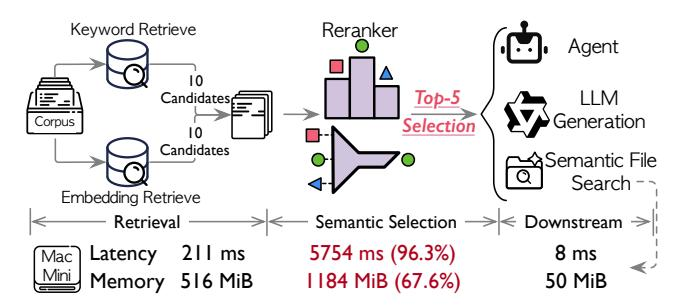

Figure 1. Typical on-device top- selection pipeline and perstage cost. Per-stage latency and peak memory under a representative on-device semantic file search is reported.

directly governs downstream task quality and helps mitigate hallucinations [\[31\]](#page-13-0).

To meet the stringent precision requirements,cross-encoder rerankers [\[3,](#page-12-4) [5,](#page-12-5) [6,](#page-12-6) [56\]](#page-13-6) have emerged as the state-of-the-art technique for semantic selection [\[2,](#page-12-7) [14,](#page-12-8) [21\]](#page-12-9). Cross-encoder rerankers are transformers that process a query-candidate pair as a single, combined input and output their relevance score. Jointly processing the query-candidate pair enables a deep, token-level analysis of their relevance through attention mechanism [\[44\]](#page-13-7), delivering substantial precision gains of 15% – 25% [\[18,](#page-12-10) [43\]](#page-13-8) over traditional bi-encoders [\[49\]](#page-13-9) that process query and candidate separately. However, this superior precision comes at a prohibitive resource cost for on-device deployment. For example, selecting top-5 from 20 candidates with a 0.6 B cross-encoder reranker incurs 5,754 ms latency and 1,184 MB peak memory consumption on a Mac Mini, despite the reranker model being quantized to 4 bits. The reranker alone contributes 96.3% of the latency and 67.6% of the memory footprint in the overall semantic file search pipeline, pushing the resource usage beyond typical mobile OS budgets (e.g., HarmonyOS guidance [\[1\]](#page-12-11)) and severely harming user experience.

Unfortunately, solving the high latency and large memory consumption of on-device rerankers is challenging. Decodingcentric optimizations [\[29,](#page-12-12) [42,](#page-13-10) [52,](#page-13-11) [55\]](#page-13-12) provide limited benefit for rerankers, which are prefill-only. Methods based on tokenlevel sparsity [\[20,](#page-12-13) [30,](#page-13-13) [34\]](#page-13-14) are primarily designed for very long contexts (e.g., tens of thousands of tokens) and offer little

advantage for the short, information-dense inputs typical of rerankers (e.g., up to 512 tokens). Other approaches, such as *model compression* [35] or early exit [51], require retraining and task-specific tuning, complicating the deployment. Consequently, rerankers' high latency and resource demands severely limit the efficiency and applicability of on-device AI services.

In this paper, we revisit the core objective of semantic top-K selection: instead of computing absolute scores for all candidates, it suffices to identify the top-K items via relative rankings. By inspecting intermediate scores of all candidates across layers (Figure 2), we observe **sequence-level sparsity**: stable relative rankings emerge early in intermediate layers, allowing many candidates to be pruned before full computation.

Leveraging this insight, we propose **monolithic forwarding**, a novel inference paradigm for cross-encoder rerankers. It processes all candidates as a single, monolithic batch, maintaining a global view throughout computation, rather than splitting them into isolated batches as in conventional systems. 1 This design offers opportunities to reduce inference latency via layer-wise pruning and lower memory footprint by on-demand weight loading.

However, realizing the potential of monolithic forwarding is hindered by two fundamental challenges. First, *identifying stable relative rankings across varying distributions*. Pruning requires confidence that candidate rankings have become evident, i.e., that score gaps are sufficiently large to prevent future reversals. Yet, score distributions vary substantially across different candidate pools, making fixed thresholds unreliable. For example, a 0.2 gap may guarantee ranking stability in sparse distributions but still indicate uncertainty in dense ones. Second, *memory explosion from monolithic batch consolidation*. While consolidating all candidates into a single batch enables on-demand weight loading, it also proportionally increases intermediate tensor sizes. This can dramatically raise peak memory usage and even cause out-of-memory failures.

To address the first challenge, we propose *progressive cluster pruning*, guided by an observation: candidates progressively form statistically distinct clusters, independent of their absolute score gaps. This enables a dynamic, three-way routing strategy: dropping hopeless candidates, accepting the winners, and continuing computation only on the remaining uncertain candidates. To tackle the second challenge, we introduce *chunked execution*, which partition candidates into chunks that fully utilize compute resources while keeping intermediate tensors within memory limits. For workloads with a large number of candidates, intermediate tensors can also be dynamically offloaded to storage, enabling stricter memory control and scalable execution. Beyond optimizing

intermediate tensors, we also reduce memory usage with two complementary techniques: *dual-layer sliding windows* to lower the memory footprint of layer weights, and *embedding table caching* to reduce the memory consumption of the embedding layer.

We implement and integrate all these techniques in Grating atop HuggingFace Transformers [24] and evaluate various reranking models across platforms equipped with an RTX 5070 Laptop GPU and an Apple M2 SoC. We evaluate Grating in microbenchmarks and three real-world on-device AI applications, comparing against HuggingFace Transformers [24] as the baseline. Our microbenchmark results show that Grating consistently reduces latency by up to 89.0% while lowering peak memory by up to 94.9%. In real-world applications, Grating delivers latency reductions of 11.6% – 51.0% and peak memory savings of 18.6% – 77.8%. This significant improvements in both latency and memory substantially advance the practicality for on-device AI applications.

In summary, this paper makes the following contributions:

- We identify top-K selection as a critical performance bottleneck in on-device AI applications and systematically analyze why existing optimizations fail for this workload.
- We reveal two underexploited opportunities: sequencelevel sparsity and I/O-computation overlap, and demonstrate the unique challenges of leveraging them for top-*K* selection workloads.
- We design and implement GRATING, a training-free system that introduces progressive cluster pruning and chunked execution for practical cross-encoder deployment on edge devices.
- Extensive experiments demonstrate that GRATING achieves up to 89.0% latency reduction and 94.9% memory reduction while maintaining precision across diverse benchmarks and device configurations.

#### 2 Background and Motivation

#### 2.1 The Bi-Encoder vs. Cross-Encoder Trade-off

Semantic top-*K* selection, or simply top-*K* selection, is a foundational component in modern on-device AI services, such as retrieval-augmented generation (RAG) [31, 32, 47, 50], AI agent memory [13, 26, 48, 54], and personalized recommendation [9, 17]. The reranking stage of this process is critical, as its precision directly dictates the quality of information provided to the user or consumed by a large language model.

Two primary architectures dominate the reranking landscape: *bi-encoders* and *cross-encoders*. Bi-encoders encode the query and each candidate document into separate, fixedsize embeddings, and then rank candidates using similarity scores between these embeddings [27, 57]. While efficient, this architectural separation imposes a fundamental precision ceiling: because query and candidate representations are generated independently, the model cannot capture the fine-grained, token-level interactions that are critical for

 $^{1}\mathrm{Vanilla}$  systems often split inputs into multiple batches to balance computation and memory.

precise relevance estimation [43, 49]. Late-interaction models such as ColBERT attempt to bridge this gap [28], but they incur significant storage overhead by requiring pertoken embeddings [46] and are not generally adopted for instruction-following or reasoning-intensive tasks [49].

In contrast, cross-encoders have emerged as the gold standard for reranking precision [2, 14, 21]. They concatenate the query and a candidate into a single input sequence, enabling deep token-level attention across both texts within every transformer layer. This joint encoding allows the model to capture subtle semantic nuances and dependencies that biencoders inherently miss, yielding substantial and consistent gains in retrieval performance [18, 43]. For on-device applications where output quality is critical, the superior precision of cross-encoders makes them indispensable.

#### 2.2 The Prohibitive On-Device Cost

Despite their superior precision, cross-encoders face fundamental challenges on edge devices: their inference requires a full, compute-intensive forward pass for each query-candidate pair, a workload fundamentally misaligned with resource-constrained environments.

**Compute-bound Latency.** A cross-encoder's latency is dominated by matrix multiplications in its transformer blocks. For an input sequence of length L (query + candidate) and a hidden dimension D, the complexity of self-attention and the feed-forward network (FFN) scales as  $O(L^2 \cdot D)$  and  $O(L \cdot D^2)$ , respectively. Because this expensive computation must be executed independently for each of the N candidates, the total latency scales linearly with N. On edge devices with limited floating-point compute capabilities, this linear scaling results in delays that significantly degrade the user experience.

**Memory Footprint.** Cross-encoders' memory demands present an equally formidable challenge, comprising two main components:

- Model Weights. Even small sized rerankers (e.g., 0.6 B parameters) require hundreds of megabytes of storage. Loading these weights into the limited DRAM or VRAM of a mobile device consumes a substantial portion of the system's memory budget.
- Intermediate Tensors. During inference, another memory issue comes from transient intermediate tensors (e.g., for query, key, value projections, attention scores, and FFN outputs). The peak memory consumption from these tensors scales with the number of candidates being processed in a batch, and can easily exceed the memory budget of an application.

# 2.3 Mismatch with Existing LLM Optimizations

While recent advances in LLM inference have introduced numerous optimization techniques, a systematic analysis reveals that they are poorly aligned with the unique workload characteristics of on-device cross-encoder reranking. **Decoding-centric Optimizations.** A large body of research focuses on the autoregressive *decoding* phase of LLMs. Techniques such as speculative decoding and advanced KV-cache management are designed to accelerate the memory-bound, token-by-token generation process [10, 29, 42, 52]. Cross-encoder reranking, however, is a *prefill-only* workload: it performs a single, compute-bound forward pass to produce a score for each query-candidate pair. As there is no decoding phase, these optimizations are largely inapplicable.

Long-context Optimizations. Another major line of research focuses on efficient processing of extremely long input sequences. These methods often exploit token-level sparsity, such as sparse attention or dynamic token pruning, under the assumption that long contexts contain substantial informational redundancy [20, 30]. In contrast, reranking inputs are short and information-dense, typically consisting of a concise query and a highly relevant document chunk. In this setting, token sparsity offers negligible benefit and may even compromise the fine-grained relevance judgments that cross-encoders are designed to capture.

**Training-based Compression.** Techniques such as model pruning, quantization-aware training (QAT), and early exit can reduce inference costs, but they require expensive retraining or fine-tuning to preserve model precision [12, 35, 41, 51]. The associated cost and complexity pose a substantial barrier to rapid and reliable on-device deployment.

**Post-training Quantization.** While 4-bit weight quantization is a common baseline optimization [19, 33], achieving practical speedups through more aggressive sub-4-bit quantization on prefill workloads remains an open challenge. Beyond precision degradation, most edge devices also lack the specialized hardware and kernel support required for high-throughput sub-4-bit matrix multiplication, limiting real-world performance gains [38, 40].

Taken together, these analyses reveal a clear research gap: a training-free, workload-specific optimization paradigm is required to make high-precision cross-encoder reranking feasible on edge devices.

#### 3 Grating Overview

In this section, we introduce GRATING, a training-free inference system for cross-encoder rerankers on edge devices.

#### 3.1 Key Observations

Our approach stems from reconsidering the fundamental objective of top-*K* selection: *identifying relative rankings among candidates, rather than computing precise absolute scores.* This insight motivates us to examine how candidate scores evolve across transformer layers from a global perspective.

Figure 2 illustrates this evolution in a typical reranking task. We observe that candidates progressively diverge into statistically distinct clusters according to their scores as they pass through layers. Crucially, the relative rankings within these clusters stabilize early in intermediate layers, before the

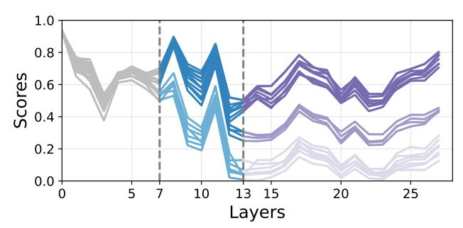

Figure 2. Score evolution across transformer layers reveals sequence-level sparsity. Each line presents the score evolution of a candidate. Candidates progressively diverge into distinct clusters as they pass through layers, and relative rankings stabilize early in intermediate layers (e.g., layers 7 and 13).

final layer computes absolute scores. This **sequence-level sparsity** suggests that candidates whose relative rankings become evident in intermediate layers can be safely pruned without sacrificing precision. This is fundamentally different from token-level sparsity that drops individual tokens.

Moreover, unlike autoregressive generation that processes tokens iteratively, rerankers perform a single forward pass with all tokens of a candidate. Such prefill-only nature of rerankers creates substantial arithmetic intensity, providing opportunities for aggressive memory optimization.

#### 3.2 Monolithic Forwarding

Motivated by these insights, we propose **monolithic forwarding**, a novel execution paradigm for cross-encoder rerankers. Instead of processing candidates in isolated batches as conventional systems do, monolithic forwarding consolidates all candidates into a single, unified batch that progresses through layers together.

This paradigm unlocks two critical opportunities. First, maintaining a global view of all candidates throughout execution enables dynamic pruning based on relative rankings at each layer. We thus can eliminate candidates that have no chance of reaching the top-K, reducing computation as the forward pass proceeds. Second, the large, consolidated batch creates substantial computation windows at each layer, sufficient to completely overlap I/O latency of loading the next layer's weights from disk. This allows us to keep only two layers in memory, reducing the memory footprint of model weights.

#### 3.3 Technical Challenges

While monolithic forwarding offers compelling benefits, realizing its potential requires addressing two core challenges.

Identifying stable rankings across distributions. Pruning decisions require confidence that relative rankings have stabilized. However, score distributions vary substantially across different queries and candidate pools. A fixed threshold that works for one distribution may be too aggressive or conservative for another. For instance, a 0.2 score gap might

indicate stable rankings in sparse distributions but represent ongoing flux in dense ones. Therefore, we need a distributionagnostic method to identify when relative rankings between candidates become reliable enough for pruning.

Memory explosion from batch consolidation. Consolidating all candidates amplifies intermediate tensor sizes proportionally. For 60 candidates with 512-token sequences on a 0.6 B model, intermediate tensors per layer increase peak memory by 473 MB (see Figure 16), which can cause out-of-memory issues on devices with strict memory constraints. This tension between the batch size needed for I/O overlap and the memory constraints of edge platforms must be carefully balanced.

#### 3.4 System Overview of GRATING

GRATING addresses these challenges through several complementary techniques as illustrated in Figure 3.

Before steping forward to layer i + 1, GRATING leverages **progressive cluster pruning** (§4.1) to tackle the ranking stability challenge. It first applies a clustering-based analysis to layer i's output scores using statistical properties of intercluster separation rather than absolute score gaps, to determine whether a stable relative ranking has emerged. After determining whether a stable relative ranking has emerged, it routes candidates to *accept*, *drop*, or *continue*.

Once layer i + 1 starts to execute, GRATING utilizes **duallayer sliding window** (§4.2) to minimize the memory footprint of model weights [23]. It immediately releases the weights of layer i from memory and starts prefetching the weights of layer i + 2 from storage.

During the execution of layer i+1, GRATING adopts **chunked execution** (§4.3) to solve the memory explosion challenge. It partitions the monolithic batch into smaller chunks and executes them sequentially within each layer, significantly reducing peak memory usage by only keeping one chunk's intermediate tensors in memory. Simultaneously, it provides sufficient computation window to overlap I/O of loading layer i+2's weights. For extreme memory constraints, GRATING further supports dynamic offloading of hidden states.

Additionally, Grating complements these techniques with **embedding table caching** (§4.4) that exploits token distribution sparsity before layer 0, which substantially lowers the memory consumption of the embedding layer (Figure 16).

## 4 Detailed Design

#### 4.1 Progressive Cluster Pruning

To solve the challenge of identifying the evident rankings across varying distribution, we propose a technique named progressing cluster pruning to reduce the latency while preserving the precision. Our key observation is candidate intermediate scores progressively diverge into statistically distinct clusters, which is irrelevant to the absolute score gaps

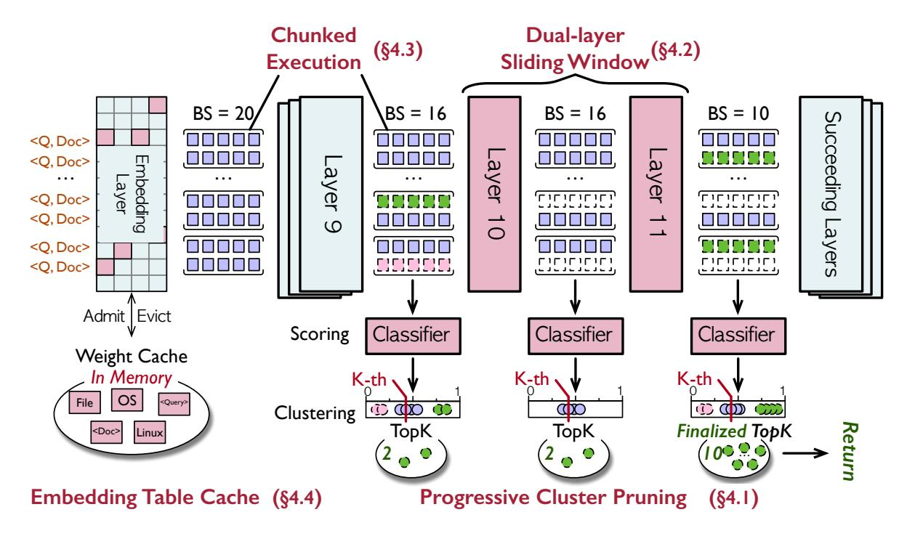

Figure 3. GRATING overview with a working example.

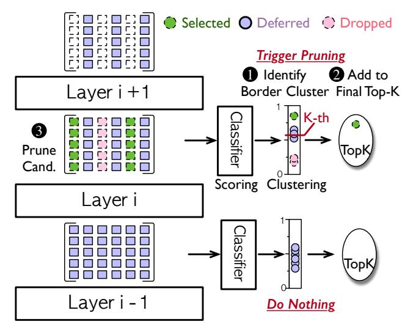

**Figure 4. Progressive cluster pruning.** Once the score dispersion exceeds the threshold during the layer progressing, we partition candidates into selected, deferred, and dropped clusters. Only the deferred candidates are retained and others are pruned.

between candidates. This crucial observation enables us to determine the final fate of most candidates — whether they are in or out of the top-*K* set — long before their exact scores are finalized.

Figure 4 illustrates the progressive cluster pruning. To realizing this insight, we first identify if the stable relative ranking occurs in a layer. In details, we employ the transformer classifier to calculate the current scores of candidates. We compute the coefficient of variation (CV) [15] of scores

to quantify their dispersion. For layer i-1, the CV does not exceed a predefined threshold (referred to as the dispersion threshold), we consider a stable relative ranking has not yet emerged. We do nothing and continue the forwarding of layer i. For layer i, the CV exceeds the dispersion threshold, we consider a stable relative ranking emerges and triggering the core clustering and pruning logic.

At the beginning, we perform K-means [22] algorithm to partition candidates into clusters. The pruning logic operates at a cluster granularity. The process pivots on identifying the boundary cluster, which contains the K-th ranked candidate. This boundary acts as a clear demarcation line, allowing us to classify all candidates into three groups: selected, deferred, and dropped. Selected candidates are those in clusters with scores higher than the boundary cluster's. The selected candidates are safely included in the final top-K set and their computation ceases. Conversely, dropped candidates are those in lower-scoring clusters. The dropped candidates are pruned, as they have no chance of reaching the top-*K*. Consequently, only a small subset of candidates within the boundary cluster are deferred for continued processing in subsequent layers. Progressive cluster pruning allows the model to cease computation for the vast majority of candidates when relative ranking emerging, and the forward pass terminates completely if the number of deferred candidates is equal to the remaining top-K slots to be filled.

It's worth mentioning that the dispersion threshold provides direct and intuitive control over the precision-latency trade-off. A lower threshold enables more aggressive early

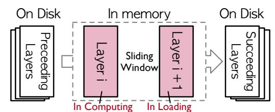

**Figure 5. Dual-layer sliding window.** Throughout the inference, we only reserve two memory buffers for model weights. When layer i resident in one buffer is computing, the next layer i+1 is prefetched from storage into the other buffer to overlap I/O. When layer i finishes, its buffer is released and reused to prefetch layer i+2, advancing a dual-layer sliding window.

exits, maximizing performance at a potential precision cost, whereas a higher value preserves precision by being more conservative. Crucially, our system allows users to either manually tune this threshold or simply specify a minimum precision target. In the latter mode, our system automatically calibrates the threshold to the lowest possible value that meets the constraint, thereby maximizing performance under the given requirement.

In summary, progressive cluster pruning effectively reduces the latency while maintains precision, and we provide the system ability to navigate the precision-latency spectrum.

#### 4.2 Dual-layer Sliding Window

To reduce the memory footprint of model weights and overlap the I/O latency of weight loading, we introduce a dual-layer sliding window technique. This technique maintains at most two layers' weights in memory — the current layer in computing and the next layer in prefetching — and overlaps weight prefetching with computation to hide the I/O latency.

The core technique are depicted in Figure 5. While forwarding the layer i, we concurrently prefetch the weights for layer i+1 from disk into a dedicated memory buffer. Thanks to the key idea of monolithic batching, upon the completion of layer i's computation, the layer i+1 has already been loaded into memory and ready to forwarding. At this time, the weights of layer i are obsolete and immediately released from its memory buffer. This vacated buffer is then recycled for the prefetching of layer i+2. Now, the sliding window advances: we compute layer i+1 while prefetching layer i+2. Throughout, only two pre-allocated memory buffers are needed to hold weights in a sliding-window manner, significantly reducing the memory footprint. Therefore, we perfectly overlap the computation of the current layer with the I/O of the next layer and hence incur no latency penalty.

In summary, the dual-layer sliding window minimizes the memory footprint of model weights with no latency penalty.

#### 4.3 Chunked Execution

To solve the challenge of the memory explosion of the intermediate tensor caused by the monolithic batch, we propose

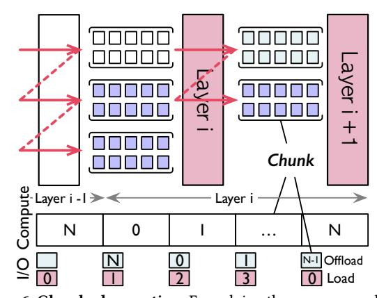

**Figure 6. Chunked execution.** For solving the memory explosion, we partition the monolithic batch into smaller chunks and execute their forwarding sequentially. To enable scalability with massive candidates, we support dynamic offloading of hidden states. chunked execution. Our key observation is that I/O overlapping only depends on the total computation time of a layer, not necessitating executing all computations simultaneously. Thus, we split the monolithic batch into chunks, maintaining I/O overlap while keeping only one chunk's intermediate

tensors in memory, reducing peak memory usage.

As shown in Figure 6, the layer's forward pass is executed sequentially on these chunks. Through this approach, we only need to allocate memory for the intermediate tensors of a single chunk and the hidden states of all chunks. This maintains minimal memory footprint compared to processing the monolithic batch at one. Notably, to fully exploit hardware computational capabilities, the chunk size has a lower bound. We dynamically determine the optimal chunk size considering device compute capability, model size, and input sequence length.

While chunked execution effectively manages intermediate tensors, the aggregated hidden states can become a memory bottleneck when candidate number scales. To address this, we support dynamic offloading of the hidden states. In the lower part of Figure 6, while computing the current chunk, we concurrently offload the completed hidden states from the previous chunk and prefetch the hidden states needed for the next chunk. This approach ensure at most three chunks reside in memory: one being computed, one being offloading, and one being prefetched. By bounding the memory footprint required for hidden states, we enable the scalability with massive candidates.

#### 4.4 Embedding Table Caching

After the dual-layer sliding window and chunked execution significantly reducing the memory footprint of transformer layers, the embedding layer becomes the new dominant memory bottleneck. For further optimization, we propose embedding table cache exploits the sparsity of the embedding layer.

Consider our optimized Qwen3-Reranker-0.6B, the active layers consume only 60 MB while the embedding table requires 296 MB, accounting for over 83% of the total memory

Figure 7. Embedding table caching. Based on the high sparsity of the embedding layer, we employ a small LRU cache to store a subset of the weights of the embedding layer. It significantly reduces the memory footprint with only a negligible latency.

footprint. To address this, we observed that the activation of the embedding layer weights is highly sparse. For the same 0.6 B model with a vocabulary of 151,669 tokens, a typical reranking task involving 20 documents with 512 sequence length accesses 10,240 unique tokens at most, merely 6.75% of the vocabulary. It indicates the activation of embedding layer is highly sparse and inspires our embedding table caching.

[Figure 7](#page-6-0) illustrates our design. The core component is a small LRU cache residing in memory, which stores a subset of the embedding weights. During inference, we first collect the set of unique input tokens and lookup the cache for the activated weights of embedding layers. For any cache miss, the system triggered a synchronous read operation to fetch the missing weights from the disk and load them into cache. In practice, we set the cache size to only 10% of the vocabulary size, which significantly reduces memory consumption while maintaining high hit rates due to the skewed token distribution in natural language [\[58\]](#page-13-23). Besides, the cache miss incurs negligible latency due to the small data volume of the sparse activated weights and the effective LRU cache (see the ablation study in [§6.4\)](#page-11-1).

In summary, embedding table caching technique employs a small, in-memory LRU cache to hold only the active weights of embedding table, drastically reducing the memory footprint of the full embedding table.

#### 4.5 A Working Example

[Figure 3](#page-4-0) illustrates our system's end-to-end workflow using a typical re-ranking task as an example: identifying the top 10 most relevant documents from 20 candidates. Before forwarding, we consolidate all candidates into one monolithic batch. The forwarding begins at the embedding Layer, where input tokens are converted into hidden states. To manage memory, we maintain a fixed-size cache for embedding weights. We identify unique input tokens not present in the cache, load them synchronously from disk, and evict existing entries using an LRU policy if the cache capacity is exceeded.

Subsequently, the hidden states are partitioned into chunks and processed through Transformer layers sequentially, where our system keeps a dual-layer sliding window across Transformer layers. We partition one monolithic batch with 20

candidates into ten chunks with two candidates and do the forwarding sequentially for each layer. During the forwarding of one layer, a dedicated I/O process begins prefetching the weights of the next layer from the disk in parallel. Upon the completion of the forward pass of a layer, its weights are immediately released from the memory. Assuming we have just completed forwarding of layer 9, we first immediately deallocate its weights from the memory and the weights of layer 10 has already been loaded into memory for the subsequent forwarding.

Critically, before forwarding each Transformer layer, we perform a cluster-based pruning check to prune candidates whose final ranks are already evident. Continuing our example, before executing layer 10, we compute provisional scores for all 20 active candidates with the classifier layer. Their CV exceeds a predefined threshold, indicating significant score divergence and triggering a KMeans clustering to partition candidates into multiple clusters. To classify the clusters, we first identify the pivotal cluster containing the K-th ranked candidate (the 10th in this case). The clusters with a mean score higher than that of the pivotal cluster are selected clusters. Two candidates within these clusters are selected into the final top-10 and exit subsequent forwarding. Conversely, those clusters with a lower mean score are the dropped clusters and all two candidates are dropped. In this instance, the process identifies two selected and two dropped candidates. Consequently, we prune these four and proceed to layer 10 with only the remaining 16 deferred candidates.

After layer 10 completes, the CV of these 16 candidates falls below the threshold, so no pruning occurs, and all proceed to layer 11. After executing layer 11, however, the score CV once again surpasses the threshold, triggering another clustering. This time, a terminal condition is met: the number of candidates in the final deferred cluster, when added to the number of already included candidates, precisely equals the target = 10. The system therefore terminates inference immediately, returning the combined set as the final result.

# 5 Implementation

We implement GRATING in ~12 k lines of Python and ~1.7 k lines of C. Our implementation builds on HuggingFace Transformers v4.52.4 [\[24\]](#page-12-14) and HuggingFace Accelerate v1.6.0 [\[23\]](#page-12-20).

To achieve high-performance, parallel I/O, we incorporate the following implementation optimizations. First, to bypass Python's Global Interpreter Lock (GIL) [\[7,](#page-12-23) [16\]](#page-12-24) and thus parallelize computation and I/O operations, we spawn a computation process and an I/O process. The two processes communicate with low latency via a shared memory buffer managed by Pytorch Multiprocessing [\[39\]](#page-13-24). Second, to saturate disk bandwidth, the I/O process leverages Libuv [\[8\]](#page-12-25) to perform high-throughput asynchronous disk I/O. Finally, we enable the CUDA Multi-Process Service (MPS) [\[37\]](#page-13-25) to facilitate efficient GPU sharing between two processes, minimizing the context-switching overhead.

Table 1. The evaluated models.

| Name                           | Model Size | Architecture |  |
|--------------------------------|------------|--------------|--|
| Qwen3-Reranker-0.6B            | 0.6 B      | Decoder-only |  |
| Qwen3-Reranker-4B              | 4 B        | Decoder-only |  |
| Qwen3-Reranker-8B              | 8 B        | Decoder-only |  |
| Bge-Reranker-v2-MiniCPM 2B Dec |            | Decoder-only |  |
| Bge-Reranker-v2-M3             | 0.5 B      | Encoder-only |  |

#### 6 Evaluation

The goal of evaluation is to answer three key questions:

- Latency Reduction. Can GRATING significantly reduce latency while preserving model precision?
- **Memory Efficiency.** Can GRATING substantially lower memory footprint without introducing latency overhead?
- Ablation Study. What is the individual contribution of each of the three proposed techniques to the overall performance improvement?

#### 6.1 Experiment Setup

*Hardware configuration.* Experiments are conducted on two distinct platforms, representing both unified and non-unified memory architectures:

- NVIDIA Platform. A laptop with an Intel(R) Ultra9-275HX processor, 32 GiB memory, NVIDIA RTX 5070 Laptop GPU with 8 GiB memory, and 1 TiB PCIe 4.0 SSD.
- **Apple Platform.** A Mac Mini with an Apple M2 SoC, 16 GiB unified memory, and 256 GiB PCIe 4.0 SSD.

**Compared systems.** We compare GRATING with these baselines in evaluation.

- GRATING. Our proposed system, which integrates all techniques: progressive cluster pruning, dual-layer sliding window, chunked execution, and embedding table caching.
- **HF.** The vanilla HuggingFace Transformers [24] with Pytorch backend. This baseline represents the standard, in-memory inference performance.
- **HF Offload.** The vanilla HuggingFace Transformers [24] with the HuggingFace Accelerate [23] library's disk offloading feature. All transformer layers are offloaded into disk and loaded right before execution.
- **HF Quant.** The state-of-the-art quantization method. We quantize the model in W4A16 with GPTQ [19].
- **GRATING Quant.** The state-of-the-art quantization method. We integrate our techniques with quantization techniques, which are orthogonal.

*Models.* As presented in Table 1, we evaluated a wide range of state-of-the-art models. These models vary in size from 0.6 B to 8 B and feature diverse architectures, from encoder-only (e.g., Bge-Reranker-v2-M3) to decoder-only (e.g., the Qwen3-Reranker series).

*Workloads.* We evaluate the compared systems in both microbenchmarks and real-world evaluations. In the microbenchmarks, we evaluate compared systems on the dataset

Table 2. The description of real-world workloads.

| Workload       | Description                                                   |  |
|----------------|---------------------------------------------------------------|--|
|                | An on-device smart assistant that personalizes its model      |  |
| RAG            | with user data. It combines vector and keyword searches,      |  |
|                | using a reranker to select the optimal final result.          |  |
| Agent          | An on-device agent leverages a reranker in its agent mem-     |  |
| Memory [54]    | ory to cache actions, reducing costly model generations.      |  |
|                | For on-device deployment of LLM handling extended con-        |  |
| LLM Long       | texts, a top- $K$ selection mechanism is employed to identify |  |
| Context        | the most related contextual segments, conforming to the       |  |
| Selection [25] | model's finite context window limitations.                    |  |
|                |                                                               |  |

of Wikipedia [4] and HotpotQA [53]. In real-world evaluations, we evaluate our system in three real-world scenarios, including RAG, Agent Memory, and LLM long context selection. The detailed descriptions are shown in Table 2.

*Metrics.* Our evaluation focuses on the following metrics:

- Latency. We measure the inference latency of the reranking models.
- Precision. We employ Precision@K to evaluate the model precision. Precision@K measures the ratio between the number of relevant items contained in the top-K results and K. When the ground truth is less than K, we take the ratio between the number of relevant items contained in the top-K and the number of ground truth.
- **Memory footprint.** We focus both the mean and the peak memory footprint of the model in inference.

#### 6.2 Microbenchmarks

In microbenchmarks, we extensively evaluate the latency, precision, and memory footprint of compared systems.

**Latency and precision.** Figure 8 illustrates the latency and precision for all compared systems across various Precision@K ( $K \in \{1, 5, 10\}$ ) out of 20 candidates. Each subplot corresponds to a specific model and top-K configuration, presenting latency (the left y-axis) and precision (the right y-axis) on two hardware platforms. Within each subplot, bars represent latency: purple for the NVIDIA platform and pink for the Apple platform. The number atop each bar indicates the speedup relative to the HF Offload baseline. The line plot shows the resulting precision in Precision@K. As precision is platform-independent, both platforms share a single data point on the line. For our systems (GRATING and GRATING Quant), we evaluate their performance under low and high dispersion thresholds (mentioned in §4.1) to demonstrate the configurability of dispersion threshold.

Overall, our systems substantially reduce latency while maintaining precision comparable to the baseline. Grating consistently achieves the lowest latency with high precision, followed closely by Grating Quant, which provides the next-best performance. This result strongly validates the effectiveness of our design. Furthermore, the results highlight a clear trade-off configurable via the dispersion threshold:

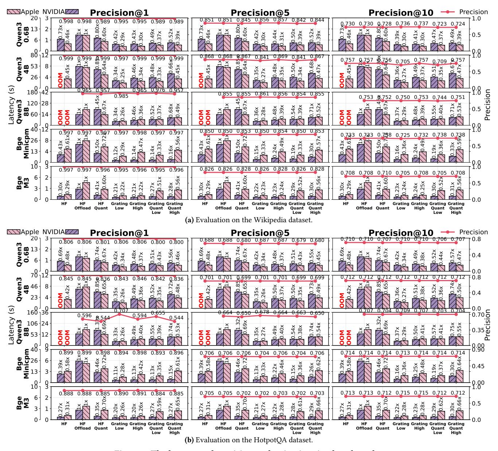

Figure 8. The latency and precision evaluation in microbenchmarks.

increasing the threshold from Low to High improves precision at the cost of a smaller latency reduction. Quantitatively, our system's benefits are significant. For the most significant case, the Bge-Minicpm model on the HotpotQA dataset at Precision@1, Grating reduces latency by 72%compared to HF and 89% compared to HF Offload, with no loss in precision. Even in the most challenging scenario, the Qwen3-8B model on HotpotQA at Precision@10, Grating still reduces latency by 50% while matching the baseline's precision. Finally, for larger models such as Qwen3-4B/8B, the HF baseline fails to run on our hardware platforms due to its large memory footprint. In contrast, our system enables low-latency inference for these powerful models, further underscoring its practical

utility and effectiveness. For the Qwen3-8B model on HotpotQA, the Grating with Low threshold setting abnormally increase precision significantly compared to the HF baselines. We attribute this to the overfitting of the Qwen3-8B model [56]; our low-threshold Grating provides a regularizing effect by bypassing the later layers, thereby enhancing its generalization.

In summary, extensively latency microbenchmarks demonstrate our system achieves substantial latency reductions (up to 89%) while preserving precision. This effectiveness holds across a range of models and hardware platforms. Crucially, our system enables low-latency inference on large models that are otherwise infeasible to run.

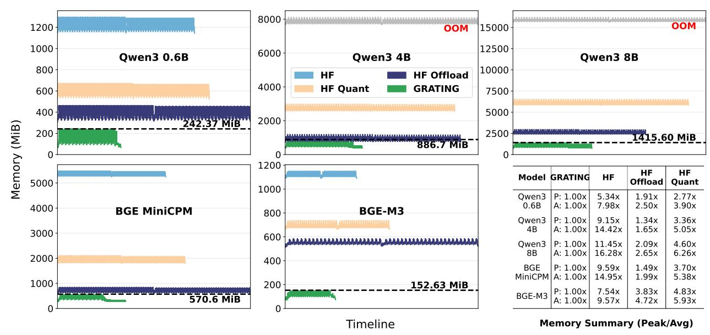

Figure 9. The memory footprint in microbenchmarks.

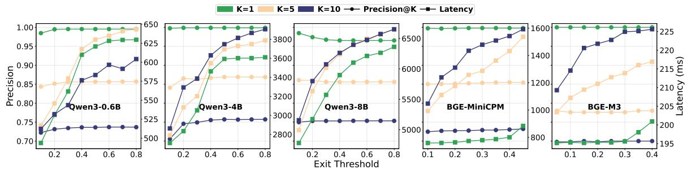

Figure 10. Tuning the latency and precision trade-off.

*Memory Footprint.* Figure 9 illustrates the inference memory footprint overtime of the compared systems across five different models. The benchmark was conducted on the NVIDIA platform with ranking top-10 out of 20 input candidates with an average sequence length of 500. The results on the Apple platform are similar to those on the NVIDIA platform, we do not elaborate further.

In each subfigure, the x-axis represents the timeline and the y-axis shows memory usage. Each line terminates upon inference completion, thus its length indicates the inference latency. We annotate the peak memory of GRATING in each subfigure and present the peak and average memory statistics in the table at the bottom right. To demonstrates the memory footprint of HF on Qwen3-4B and Qwen3-8B that cannot run in the NVIDIA platform due to the OOM error, we measure them on an NVIDIA A800 GPU. Therefore, the lengths of their corresponding lines do not represent valid latencies. Besides, we omit the curve for GRATING Quant because it nearly overlaps with that of GRATING, enhancing visual clarity.

Overall, our system achieves the lowest memory footprint among all baselines while simultaneously delivering the lowest latency. This result demonstrates that our technique enables models to run faster with substantially less memory, a dual benefit not offered by competing approaches. In contrast, other memory-saving baselines like HF Offload and HF Quant trade latency for lower memory. Quantitatively, our system reduces peak memory by  $5.34\times-11.45\times$  compared to HF,  $1.34\times-3.83\times$  compared to HF Offload, and  $2.77\times-4.83\times$  compared to Quant. This substantial memory saving is particularly critical for resource-constrained edge devices, as it alleviates memory pressure and enables robust co-location of multiple applications.

In summary, our system substantially reduces both memory footprint and inference latency. This unique combination of memory efficiency and high performance is crucial for resource-constrained edge devices.

Tuning the latency-precision trade-off. Figure 10 demonstrates our system's ability to navigate the latency-precision spectrum by tuning the dispersion threshold. We evaluate this capability on five models under precision@1/5/10. As a general trend, increasing the threshold improves precision at the cost of higher latency. This result validates that our system can be configured to operate at different points on the latency-precision spectrum to meet diverse application

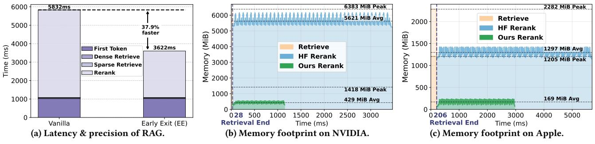

Figure 11. The latency, precision, and memory footprint of RAG.

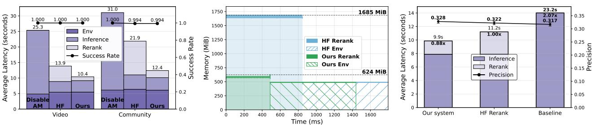

Figure 12. Latency & precision of AM.

Figure 13. Memory footprint of AM.

Figure 14. Latency & precision of LCS.

requirements. Notably, Qwen3-8B exhibits an inverse trend, achieving peak precision at the lowest threshold. We attribute this to the overfitting of this model [56]; the pruning acts as a form of regularization, mitigating this effect.

#### 6.3 Real-world Evaluations

Retrieval-Augmented Generation (RAG). We evaluate our system on the RAG-based personal assistant scenario. During an offline indexing phase, user's personal data is converted into vector embeddings by the embedding model and stored in the vector database. When a user query arrives, we perform a hybrid search using both dense retrieval (i.e., vector search) and sparse retrieval (i.e., keyword search) to find the top-10 relevant documents, respectively. Then, a reranking model consolidates the results and selects the top-10 documents, which are then sent to an LLM for generation.

We employ the DiskANN-based Milvus [36, 45] as our vector database, the Qwen3-Embedding-0.6B for embedding. For reranking, we employ Qwen3-Reranker-0.6B on the Apple platform and Bge-Minicpm on the NVIDIA platform. For generation, we deploy a Qwen3-32B model on a server with two NVIDIA A800 GPU.

Figure 11(a) compares the latency and precision of HF and GRATING. Our system achieves significant performance gains, reducing latency by 51% an NVIDIA platform and 31% on Apple platform, respectively. Crucially, these improvements come with almost no loss in model precision. Figure 11(b) and Figure 11(c) shows the memory footprint of HF and GRATING. Our system also substantially lowers peak memory by up to 77.8% and average memory by 92.3%. This large reduction in average memory stems from the aggressive memory optimization of the reranking phase, which dominates the overall execution time.

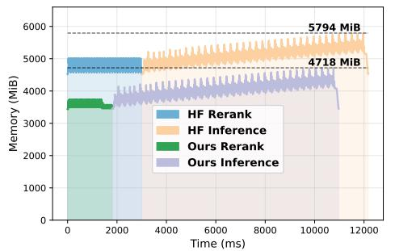

Figure 15. Memory footprint of LCS.

Agent Memory (AM). We evaluate our system in an agent memory application [54]. This application optimizes GUI-based agent by caching past successful action trajectories to bypass expensive and redundant Vision-Languange Model (VLM) inference. The core of the agent memory lies in selecting the most semantic relevant trajectories, which is performed by a reranker. We employ Qwen3-Reranker-0.6B reranker and evaluate our system in the NVIDIA platform, the VLM is serving on two NVIDIA A800 server. The test results on the Apple platform are similar to those on the NVIDIA platform, so we will not elaborate further.

As shown in Figure 12, we evaluate the task completion latency and the task succession rate in two different workloads. Our system significant reduce the latency by 25.2% in the video workload and 43.4% in the community scenario, respectively. Crucially, these improvements come with no loss in the task success rate. Figure 13 shows the memory footprint in the period of a single click action performing by the agent. Compared to HF, GRATING reduces the peak memory usage by 63.0%. Such substantial savings are particularly valuable on resource-constrained edge devices, where

lower memory usage directly increases the keeplive rate of applications and improves the users' experience.

LLM Long Context Selection (LCS). LLM long context selection aims to select the most relevant information in an ultra long context, thereby accelerating inference. In this real-world scenario, we employ a Qwen3-Reranker-0.6B reranker to select the most relevant information and then feed them to a quantized Qwen3-4B-Instruct for generation. The evaluation are conducted on the NVIDIA platform with the LongBench2 [11] benchmark. We compare the latency and precision of three systems: GRATING, HF Reranker, and No Reranker.

Figure 14 reports the end-to-end latency and precision. Generally, Grating achieves a latency reduction of 12% compared to HF Reranker and 57.3% compared to No Reranker, with even marginally precision increasing. For precision, the two systems with reranker surpass the No Reranker, which is distracted by the irrelevant information. Besides, the slight precision gain observed in Grating over HF Reranker fall within normal variation. Figure 15 compares the memory footprint of HF Reranker and Grating in one generation. Grating reduces peak memory by about 1 GiB compared to the HF Reranker.

In summary, GRATING consistently outperforms the baselines in latency and memory footprint.

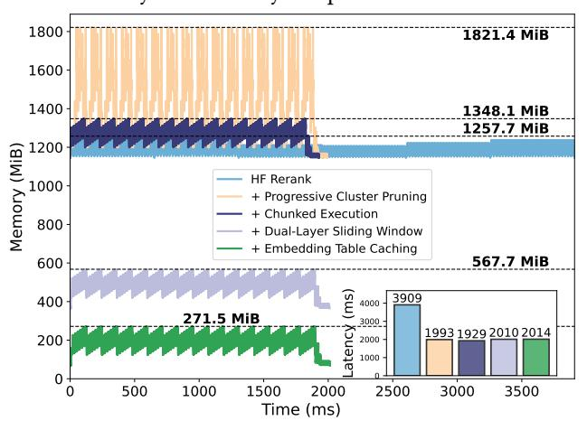

Figure 16. Memory & latency ablation of three techniques.

## 6.4 Ablation Study

We conduct an ablation study to show the contributions of our four proposed techniques by applying them incrementally. We measure the latency and memory footprint running the Qwen3-Reranker-0.6B on the NVIDIA platform to rank 60 candidates with an average length of 500.

Figure 16 illustrates how memory footprint and latency change as each technique is applied incrementally. Starting from the baseline, we fist apply progressive cluster pruning. It reduces the latency by 49.0%, but increasing the peak memory by 44.8% due to the monolithic batch. Then, we apply the chunked execution to reduce this memory overhead to 7.2%.

The remaining overhead stems from storing hidden states for all chunks, a requirement for the monolithic forwarding scheme. Next, we apply the pipelined scrolling loading, significantly reduces memory usage by 57.8%. This optimization incurs a modest 81 ms latency overhead because the reduced computation time from pruning no long fully hides the I/O latency. Finally, embedding table caching eliminates the last dominant memory bottleneck, reducing the peak memory usage to 271 MiB with a negligible 4 ms latency overhead. When combined, GRATING achieves a 78.4% reduction in peak memory and a 48.5% reduction in latency compared to the baseline, demonstrating the effectiveness of our techniques when working in concert.

These results validate that each technique successfully achieves its intended optimization goal, and their integration yields a system optimized for both memory and latency.

#### 7 Discussion

Flexibility for diverse application needs. Grating's design provides the flexibility to cater to diverse application requirements. In most scenarios, such as selecting documents for a RAG pipeline, the primary goal is to identify the top-K candidates regardless of their precise internal ranking. For such cases, the pruning both winners and hopeless candidates can maximize latency reduction as demonstrated in our evaluation. Furthermore, Grating is equally capable of handling applications where the exact rank order or the final scores are critical. Grating supports this by only pruning the hopeless candidates while allowing the top contenders to undergo full inference. This adaptability allows developers to tune the system for their specific latency budget and application-level quality requirements.

Generality beyond evaluated models. While our evaluation focused on a representative set of state-of-the-art rerankers, we have also observed the core insight of sequence-level sparsity is a general characteristic of cross-encoder architectures. The hierarchical nature of transformers, where earlier layers capture broader contextual features and later layers refine nuanced semantic relationships, naturally leads to the progressive emergence of stable relative rankings. Our preliminary experiments with other cross-encoder models, including LLM as rerankers (e.g., Qwen3-4B-Instruct), confirm this pattern. This suggests that the principles behind Grating are not limited to specialized reranker models but can likely be extended to a broader class of transformer-based models performing semantic selection tasks.

Orthogonality with related works. GRATING is designed as a training-free inference system, making its optimizations orthogonal to and compatible with a wide array of model compression techniques. As demonstrated by our "GRATING Quant" evaluation, its benefits seamlessly compound with post-training quantization methods [19, 33]. Moreover, our approach can be readily applied to models that have already

undergone training-based compression [\[12,](#page-12-18) [35,](#page-13-15) [41\]](#page-13-19). This orthogonality allows GRATING to be integrated with existing and future model compression advancements to further push the efficiency frontier of on-device AI.

# 8 Conclusion

We introduce GRATING, a training-free inference system that re-frames reranking to focus on relative rankings, enabling a highly efficient monolithic forwarding architecture. Our system uses progressive cluster pruning and a series of memory optimizations to significantly reduce latency by up to 89% and peak memory by up to 11.45×, substantially advancing on-device semantic selection.

# References

- [1] [n. d.]. Memory Usage, Huawei HarmonyOS Developer. [https://developer.huawei.com/consumer/cn/doc/harmonyos](https://developer.huawei.com/consumer/cn/doc/harmonyos-guides/performance-memory-usage)[guides/performance-memory-usage](https://developer.huawei.com/consumer/cn/doc/harmonyos-guides/performance-memory-usage) [Online; accessed 2025-09-18].
- [2] [n. d.]. Rerank | Boost Enterprise Search and Retrieval | Cohere. [https:](https://cohere.com/rerank) [//cohere.com/rerank](https://cohere.com/rerank).
- [3] [n. d.]. Reranking for Vertex AI RAG Engine | Generative AI on Vertex AI | Google Cloud. [https://cloud.google.com/vertex-ai/generative](https://cloud.google.com/vertex-ai/generative-ai/docs/rag-engine/retrieval-and-ranking)[ai/docs/rag-engine/retrieval-and-ranking](https://cloud.google.com/vertex-ai/generative-ai/docs/rag-engine/retrieval-and-ranking) [Online; accessed 2025-09- 12].
- [4] 2023. ellamind/wikipedia-2023-11-retrieval-multilingual-corpus · Datasets at Hugging Face. [https://huggingface.co/datasets/ellamind/](https://huggingface.co/datasets/ellamind/wikipedia-2023-11-retrieval-multilingual-corpus) [wikipedia-2023-11-retrieval-multilingual-corpus](https://huggingface.co/datasets/ellamind/wikipedia-2023-11-retrieval-multilingual-corpus)
- [5] 2024. BAAI/bge-reranker-v2-gemma · Hugging Face. [https://](https://huggingface.co/BAAI/bge-reranker-v2-gemma) [huggingface.co/BAAI/bge-reranker-v2-gemma](https://huggingface.co/BAAI/bge-reranker-v2-gemma).
- [6] 2024. BAAI/bge-reranker-v2-minicpm-layerwise · Hugging Face. [https:]( https://huggingface.co/BAAI/bge-reranker-v2-minicpm-layerwise ) [//huggingface.co/BAAI/bge-reranker-v2-minicpm-layerwise]( https://huggingface.co/BAAI/bge-reranker-v2-minicpm-layerwise ).
- [7] 2025. Global Interpreter Lock - Python Wiki. [https://wiki.python.org/](https://wiki.python.org/moin/GlobalInterpreterLock) [moin/GlobalInterpreterLock](https://wiki.python.org/moin/GlobalInterpreterLock)
- [8] 2025. libuv/libuv: Cross-platform asynchronous I/O. [https://github.](https://github.com/libuv/libuv) [com/libuv/libuv](https://github.com/libuv/libuv)
- [9] 2025. Magic Cue on Pixel 10 Series Phones: smart, contextual assistance across apps, emails & more. [https://store.google.com/intl/en/ideas/]( https://store.google.com/intl/en/ideas/articles/magic-cue/) [articles/magic-cue/]( https://store.google.com/intl/en/ideas/articles/magic-cue/).
- [10] Amey Agrawal, Nitin Kedia, Ashish Panwar, Jayashree Mohan, Nipun Kwatra, Bhargav S. Gulavani, Alexey Tumanov, and Ramachandran Ramjee. 2025. Taming throughput-latency tradeoff in LLM inference with sarathi-serve. In Proceedings of the 18th USENIX Conference on Operating Systems Design and Implementation (Santa Clara, CA, USA) (OSDI'24). USENIX Association, USA, Article 7, 18 pages.
- [11] Yushi Bai, Shangqing Tu, Jiajie Zhang, Hao Peng, Xiaozhi Wang, Xin Lv, Shulin Cao, Jiazheng Xu, Lei Hou, Yuxiao Dong, Jie Tang, and Juanzi Li. 2024. LongBench v2: Towards Deeper Understanding and Reasoning on Realistic Long-context Multitasks. arXiv preprint arXiv:2412.15204 (2024).
- [12] Mengzhao Chen, Wenqi Shao, Peng Xu, Jiahao Wang, Peng Gao, Kaipeng Zhang, Yu Qiao, and Ping Luo. 2024. EfficientQAT: Efficient Quantization-Aware Training for Large Language Models. arXiv preprint arXiv:2407.11062 (2024).
- [13] Prateek Chhikara, Dev Khant, Saket Aryan, Taranjeet Singh, and Deshraj Yadav. 2025. Mem0: Building Production-Ready AI Agents with Scalable Long-Term Memory. arXiv[:2504.19413](https://arxiv.org/abs/2504.19413) [cs.CL] [https:](https://arxiv.org/abs/2504.19413) [//arxiv.org/abs/2504.19413](https://arxiv.org/abs/2504.19413)
- [14] Cohere. 2024. Introducing Rerank 3 on Microsoft Azure AI | Cohere blog. [https://cohere.com/blog/introducing-rerank-3-on-microsoft]( https://cohere.com/blog/introducing-rerank-3-on-microsoft-azure-ai )[azure-ai]( https://cohere.com/blog/introducing-rerank-3-on-microsoft-azure-ai ).
- [15] Wikipedia contributors. 2025. Coefficient of variation. [https://en.](https://en.wikipedia.org/wiki/Coefficient_of_variation) [wikipedia.org/wiki/Coefficient\\_of\\_variation](https://en.wikipedia.org/wiki/Coefficient_of_variation)

- [16] Wikipedia contributors. 2025. Global interpreter lock. [https://en.](https://en.wikipedia.org/wiki/Global_interpreter_lock) [wikipedia.org/wiki/Global\\_interpreter\\_lock](https://en.wikipedia.org/wiki/Global_interpreter_lock)
- [17] Mike Darling. 2025. 4 ways Pixel's Magic Cue can help you save time. [https://blog.google/products/pixel/google-pixel-magic-cue-ai]( https://blog.google/products/pixel/google-pixel-magic-cue-ai-feature/ )[feature/]( https://blog.google/products/pixel/google-pixel-magic-cue-ai-feature/ ).
- [18] Gabriel de Souza P. Moreira, Ronay Ak, Benedikt Schifferer, Mengyao Xu, Radek Osmulski, and Even Oldridge. 2024. Enhancing Q&A Text Retrieval with Ranking Models: Benchmarking, fine-tuning and deploying Rerankers for RAG. arXiv[:2409.07691](https://arxiv.org/abs/2409.07691) [cs.IR] [https:](https://arxiv.org/abs/2409.07691) [//arxiv.org/abs/2409.07691](https://arxiv.org/abs/2409.07691)
- [19] Elias Frantar, Saleh Ashkboos, Torsten Hoefler, and Dan Alistarh. 2023. GPTQ: Accurate Post-Training Quantization for Generative Pre-trained Transformers. <https://arxiv.org/abs/2210.17323>. arXiv[:2210.17323](https://arxiv.org/abs/2210.17323) [cs.LG]
- [20] Qichen Fu, Minsik Cho, Thomas Merth, Sachin Mehta, Mohammad Rastegari, and Mahyar Najibi. 2024. LazyLLM: Dynamic Token Pruning for Efficient Long Context LLM Inference. arXiv[:2407.14057](https://arxiv.org/abs/2407.14057) [cs.CL] <https://arxiv.org/abs/2407.14057>
- [21] Michael Glass, Gaetano Rossiello, Md Faisal Mahbub Chowdhury, Ankita Naik, Pengshan Cai, and Alfio Gliozzo. 2022. Re2G: Retrieve, Rerank, Generate. In Proceedings of the 2022 Conference of the North American Chapter of the Association for Computational Linguistics: Human Language Technologies, Marine Carpuat, Marie-Catherine de Marneffe, and Ivan Vladimir Meza Ruiz (Eds.). Association for Computational Linguistics, Seattle, United States, 2701–2715. <https://doi.org/10.18653/v1/2022.naacl-main.194>
- [22] John A Hartigan and Manchek A Wong. 1979. Algorithm AS 136: A k-means clustering algorithm. Journal of the royal statistical society. series c (applied statistics) 28, 1 (1979), 100–108.
- [23] HuggingFace. 2025. Accelerate: A simple way to launch, train, and use PyTorch models on almost any device and distributed configuration, automatic mixed precision (including fp8), and easy-to-configure FSDP and DeepSpeed support. <https://github.com/huggingface/accelerate>
- [24] HuggingFace. 2025. Transformers: the model-definition framework for state-of-the-art machine learning models in text, vision, audio, and multimodal models, for both inference and training. [https:](https://github.com/huggingface/transformers) [//github.com/huggingface/transformers](https://github.com/huggingface/transformers)
- [25] Huiqiang Jiang, Qianhui Wu, Xufang Luo, Dongsheng Li, Chin-Yew Lin, Yuqing Yang, and Lili Qiu. 2024. LongLLMLingua: Accelerating and Enhancing LLMs in Long Context Scenarios via Prompt Compression. In Proceedings of the 62nd Annual Meeting of the Association for Computational Linguistics (Volume 1: Long Papers), Lun-Wei Ku, Andre Martins, and Vivek Srikumar (Eds.). Association for Computational Linguistics, Bangkok, Thailand, 1658–1677. [https://doi.org/10.18653/v1/2024.acl](https://doi.org/10.18653/v1/2024.acl-long.91)[long.91](https://doi.org/10.18653/v1/2024.acl-long.91)
- [26] Jiazheng Kang, Mingming Ji, Zhe Zhao, and Ting Bai. 2025. Memory OS of AI Agent. arXiv[:2506.06326](https://arxiv.org/abs/2506.06326) [cs.AI] <https://arxiv.org/abs/2506.06326>
- [27] Vladimir Karpukhin, Barlas Oguz, Sewon Min, Patrick Lewis, Ledell Wu, Sergey Edunov, Danqi Chen, and Wen-tau Yih. 2020. Dense Passage Retrieval for Open-Domain Question Answering. In Proceedings of the 2020 Conference on Empirical Methods in Natural Language Processing (EMNLP), Bonnie Webber, Trevor Cohn, Yulan He, and Yang Liu (Eds.). Association for Computational Linguistics, Online, 6769–6781. <https://doi.org/10.18653/v1/2020.emnlp-main.550>
- [28] Omar Khattab and Matei Zaharia. 2020. ColBERT: Efficient and Effective Passage Search via Contextualized Late Interaction over BERT. In Proceedings of the 43rd International ACM SIGIR Conference on Research and Development in Information Retrieval. 39–48. <https://dl.acm.org/doi/10.1145/3397271.3401075>
- [29] Woosuk Kwon, Zhuohan Li, Siyuan Zhuang, Ying Sheng, Lianmin Zheng, Cody Hao Yu, Joseph Gonzalez, Hao Zhang, and Ion Stoica. 2023. Efficient Memory Management for Large Language Model Serving with PagedAttention. In Proceedings of the 29th Symposium

- on Operating Systems Principles (Koblenz, Germany) (SOSP '23). Association for Computing Machinery, New York, NY, USA, 611–626. <https://doi.org/10.1145/3600006.3613165>
- [30] Xunhao Lai, Jianqiao Lu, Yao Luo, Yiyuan Ma, and Xun Zhou. 2025. FlexPrefill: A Context-Aware Sparse Attention Mechanism for Efficient Long-Sequence Inference. In The Thirteenth International Conference on Learning Representations. <https://openreview.net/forum?id=OfjIlbelrT>
- [31] Patrick Lewis, Ethan Perez, Aleksandra Piktus, Fabio Petroni, Vladimir Karpukhin, Naman Goyal, Heinrich Küttler, Mike Lewis, Wen-tau Yih, Tim Rocktäschel, Sebastian Riedel, and Douwe Kiela. 2020. Retrievalaugmented generation for knowledge-intensive NLP tasks. In Proceedings of the 34th International Conference on Neural Information Processing Systems (Vancouver, BC, Canada) (NIPS '20). Curran Associates Inc., Red Hook, NY, USA, Article 793, 16 pages.
- [32] Jiaxing Li, Chi Xu, Lianchen Jia, Feng Wang, Cong Zhang, and Jiangchuan Liu. 2025. EACO-RAG: Towards Distributed Tiered LLM Deployment using Edge-Assisted and Collaborative RAG with Adaptive Knowledge Update. arXiv[:2410.20299](https://arxiv.org/abs/2410.20299) [cs.DC] [https://arxiv.org/](https://arxiv.org/abs/2410.20299) [abs/2410.20299](https://arxiv.org/abs/2410.20299)
- [33] Ji Lin, Jiaming Tang, Haotian Tang, Shang Yang, Wei-Ming Chen, Wei-Chen Wang, Guangxuan Xiao, Xingyu Dang, Chuang Gan, and Song Han. 2024. AWQ: Activation-aware Weight Quantization for LLM Compression and Acceleration. <https://arxiv.org/abs/2306.00978>. arXiv[:2306.00978](https://arxiv.org/abs/2306.00978) [cs.CL]
- [34] Lingkun Long, Rubing Yang, Yushi Huang, Desheng Hui, Ao Zhou, and Jianlei Yang. 2025. SlimInfer: Accelerating Long-Context LLM Inference via Dynamic Token Pruning. arXiv[:2508.06447](https://arxiv.org/abs/2508.06447) [cs.CL] <https://arxiv.org/abs/2508.06447>
- [35] Xinyin Ma, Gongfan Fang, and Xinchao Wang. 2023. LLM-Pruner: On the Structural Pruning of Large Language Models. In Thirtyseventh Conference on Neural Information Processing Systems. [https:](https://openreview.net/forum?id=J8Ajf9WfXP) [//openreview.net/forum?id=J8Ajf9WfXP](https://openreview.net/forum?id=J8Ajf9WfXP)
- [36] Milvus. 2024. Milvus | The High-Performance Vector Database built for Scale. <https://milvus.io/>.
- [37] NVIDIA. 2025. NVIDIA Multi-Process Service. [https://docs.nvidia.](https://docs.nvidia.com/deploy/mps/index.html) [com/deploy/mps/index.html](https://docs.nvidia.com/deploy/mps/index.html)
- [38] Authors of BitNet b1.58. 2025. BitNet b1.58: 1.58-bit Large Language Models. arXiv[:2504.12285](https://arxiv.org/abs/2504.12285) [cs.CL] <https://arxiv.org/abs/2504.12285>
- [39] PyTorch. 2025. Multiprocessing package - torch.multiprocessing. [https:](https://docs.pytorch.org/docs/2.8/multiprocessing.html) [//docs.pytorch.org/docs/2.8/multiprocessing.html](https://docs.pytorch.org/docs/2.8/multiprocessing.html)
- [40] Yuwei Ren, Yuhui Ding, Lijun Wu, Shujian Huang, Lei Li, and Qun Liu. 2024. BitNet a4.8: 1-bit Weight 4-bit Activation LLMs. arXiv[:2411.04965](https://arxiv.org/abs/2411.04965) [cs.CL] <https://arxiv.org/abs/2411.04965>
- [41] Victor Sanh, Lysandre Debut, Julien Chaumond, and Thomas Wolf. 2019. DistilBERT, a distilled version of BERT: smaller, faster, cheaper and lighter. arXiv[:1910.01108](https://arxiv.org/abs/1910.01108) [cs.CL] <https://arxiv.org/abs/1910.01108>
- [42] Yixin Song, Zeyu Mi, Haotong Xie, and Haibo Chen. 2024. PowerInfer: Fast Large Language Model Serving with a Consumer-grade GPU. arXiv[:2312.12456](https://arxiv.org/abs/2312.12456) [cs.LG] <https://arxiv.org/abs/2312.12456>
- [43] Nandan Thakur, Nils Reimers, Andreas Rücklé, Abhishek Srivastava, and Iryna Gurevych. 2021. BEIR: A Heterogeneous Benchmark for Zero-shot Evaluation of Information Retrieval Models. In Thirtyfifth Conference on Neural Information Processing Systems Datasets and Benchmarks Track (Round 2). [https://openreview.net/forum?id=](https://openreview.net/forum?id=wCu6T5xFjeJ) [wCu6T5xFjeJ](https://openreview.net/forum?id=wCu6T5xFjeJ)
- [44] Ashish Vaswani, Noam Shazeer, Niki Parmar, Jakob Uszkoreit, Llion Jones, Aidan N. Gomez, Łukasz Kaiser, and Illia Polosukhin. 2017. Attention is all you need. In Proceedings of the 31st International Conference on Neural Information Processing Systems (Long Beach, California, USA) (NIPS'17). Curran Associates Inc., Red Hook, NY, USA, 6000–6010.
- [45] Jianguo Wang, Xiaomeng Yi, Rentong Guo, Hai Jin, Peng Xu, Shengjun Li, Xiangyu Wang, Xiangzhou Guo, Chengming Li, Xiaohai Xu, Kun Yu, Yuxing Yuan, Yinghao Zou, Jiquan Long, Yudong Cai, Zhenxiang

- Li, Zhifeng Zhang, Yihua Mo, Jun Gu, Ruiyi Jiang, Yi Wei, and Charles Xie. 2021. Milvus: A Purpose-Built Vector Data Management System. In Proceedings of the 2021 International Conference on Management of Data (Virtual Event, China) (SIGMOD '21). Association for Computing Machinery, New York, NY, USA, 2614–2627. [https://doi.org/10.1145/](https://doi.org/10.1145/3448016.3457550) [3448016.3457550](https://doi.org/10.1145/3448016.3457550)
- [46] Yichuan Wang, Shu Liu, Zhifei Li, Yongji Wu, Ziming Mao, Yilong Zhao, Xiao Yan, Zhiying Xu, Yang Zhou, Ion Stoica, Sewon Min, Matei Zaharia, and Joseph E. Gonzalez. 2025. LEANN: A Low-Storage Vector Index. arXiv[:2506.08276](https://arxiv.org/abs/2506.08276) [cs.DB] <https://arxiv.org/abs/2506.08276>
- [47] Zijie J. Wang and Duen Horng Chau. 2024. MeMemo: On-device Retrieval Augmentation for Private and Personalized Text Generation. In Proceedings of the 47th International ACM SIGIR Conference on Research and Development in Information Retrieval (Washington DC, USA) (SI-GIR '24). Association for Computing Machinery, New York, NY, USA, 2765–2770. <https://doi.org/10.1145/3626772.3657662>
- [48] Zora Zhiruo Wang, Jiayuan Mao, Daniel Fried, and Graham Neubig. 2025. Agent Workflow Memory. In Forty-second International Conference on Machine Learning. [https://openreview.net/forum?id=](https://openreview.net/forum?id=NTAhi2JEEE) [NTAhi2JEEE](https://openreview.net/forum?id=NTAhi2JEEE)
- [49] Orion Weller, Michael Boratko, Iftekhar Naim, and Jinhyuk Lee. 2025. On the Theoretical Limitations of Embedding-Based Retrieval. arXiv[:2508.21038](https://arxiv.org/abs/2508.21038) [cs.IR] <https://arxiv.org/abs/2508.21038>
- [50] Menglin Xia, Xuchao Zhang, Camille Couturier, Guoqing Zheng, Saravan Rajmohan, and Victor Rühle. 2024. Hybrid-RACA: Hybrid Retrieval-Augmented Composition Assistance for Real-time Text Prediction. In Proceedings of the 2024 Conference on Empirical Methods in Natural Language Processing: Industry Track, Franck Dernoncourt, Daniel Preoţiuc-Pietro, and Anastasia Shimorina (Eds.). Association for Computational Linguistics, Miami, Florida, US, 120–131. <https://doi.org/10.18653/v1/2024.emnlp-industry.11>
- [51] Ji Xin, Raphael Tang, Jaejun Lee, Yaoliang Yu, and Jimmy Lin. 2020. DeeBERT: Dynamic Early Exiting for Accelerating BERT Inference. arXiv[:2004.12993](https://arxiv.org/abs/2004.12993) [cs.CL] <https://arxiv.org/abs/2004.12993>
- [52] Zhenliang Xue, Yixin Song, Zeyu Mi, Xinrui Zheng, Yubin Xia, and Haibo Chen. 2024. PowerInfer-2: Fast Large Language Model Inference on a Smartphone. arXiv[:2406.06282](https://arxiv.org/abs/2406.06282) [cs.LG] [https://arxiv.org/abs/2406.](https://arxiv.org/abs/2406.06282) [06282](https://arxiv.org/abs/2406.06282)
- [53] Zhilin Yang, Peng Qi, Saizheng Zhang, Yoshua Bengio, William W. Cohen, Ruslan Salakhutdinov, and Christopher D. Manning. 2018. HotpotQA: A Dataset for Diverse, Explainable Multi-H op Question Answering. arXiv[:1809.09600](https://arxiv.org/abs/1809.09600) [cs.CL] <https://arxiv.org/abs/1809.09600>
- [54] Cheng Zhang, Erhu Feng, Xi Zhao, Yisheng Zhao, Wangbo Gong, Jiahui Sun, Dong Du, Zhichao Hua, Yubin Xia, and Haibo Chen. 2025. MobiAgent: A Systematic Framework for Customizable Mobile Agents. arXiv[:2509.00531](https://arxiv.org/abs/2509.00531) [cs.MA] <https://arxiv.org/abs/2509.00531>
- [55] Yanqi Zhang, Yuwei Hu, Runyuan Zhao, John C. S. Lui, and Haibo Chen. 2024. Unifying KV Cache Compression for Large Language Models with LeanKV. CoRR abs/2412.03131 (2024). [https://doi.org/10.](https://doi.org/10.48550/arXiv.2412.03131) [48550/arXiv.2412.03131](https://doi.org/10.48550/arXiv.2412.03131)
- [56] Yanzhao Zhang, Mingxin Li, Dingkun Long, Xin Zhang, Huan Lin, Baosong Yang, Pengjun Xie, An Yang, Dayiheng Liu, Junyang Lin, Fei Huang, and Jingren Zhou. 2025. Qwen3 Embedding: Advancing Text Embedding and Reranking Through Foundation Models. [https:](https://arxiv.org/abs/2506.05176) [//arxiv.org/abs/2506.05176](https://arxiv.org/abs/2506.05176). arXiv[:2506.05176](https://arxiv.org/abs/2506.05176) [cs.CL]
- [57] Wayne Xin Zhao, Jing Liu, Ruiyang Ren, and Ji-Rong Wen. 2024. Dense Text Retrieval Based on Pretrained Language Models: A Survey. ACM Trans. Inf. Syst. 42, 4, Article 89 (Feb. 2024), 60 pages. [https://doi.org/](https://doi.org/10.1145/3637870) [10.1145/3637870](https://doi.org/10.1145/3637870)
- [58] George Kingsley Zipf. 1949. Human behavior and the principle of least effort. (1949).