# Understanding Large Language Models in Your Pockets: Performance Study on COTS Mobile Devices

Jie Xiao1 , Qianyi Huang1 , Xu Chen1 , Chen Tian2 1Sun Yat-Sen University 2Nanjing University

*Abstract*—As large language models (LLMs) increasingly integrate into every aspect of our work and daily lives, there are growing concerns about user privacy, which push the trend toward local deployment of these models. There are a number of lightweight LLMs (e.g., Gemini Nano, LLAMA2 7B) that can run locally on smartphones, providing users with greater control over their personal data. As a rapidly emerging application, we are concerned about their performance on commercialoff-the-shelf mobile devices. To fully understand the current landscape of LLM deployment on mobile platforms, we conduct a comprehensive measurement study on mobile devices. While user experience is the primary concern for end-users, developers focus more on the underlying implementations. Therefore, we evaluate both user-centric metrics—such as token throughput, latency, and battery consumption—and developer-critical factors, including resource utilization, OS strategies, and inference engines. We also provide comprehensive comparisons across the mobile system-on-chips (SoCs) from major vendors, highlighting their performance differences in handling LLM workloads, which may help developers identify and address bottlenecks for mobile LLM applications. We hope that this study can provide insights for both the development of on-device LLMs and the design for future mobile system architecture.

*Index Terms*—Large Language Models, Measurement, On device

## I. INTRODUCTION

O VER the past two years, Large Language Models (LLMs) have demonstrated exceptional performance across a wide range of domains. Their advanced capabilities in understanding human language and generating text have made them indispensable in various applications, including dialogue systems, machine translation, and text generation. Several companies have begun integrating LLMs as system services (e.g., Apple Intelligence [\[1\]](#page-14-0), Copilot+ PC [\[2\]](#page-14-1)), where these models assist users in organizing daily routines, summarizing emails and messages, and even generating automated replies. However, while LLMs serve as powerful and appealing personal assistants, these models continuously monitor and analyze users' activities, which leads to serious privacy concerns [\[3\]](#page-14-2).

To address the privacy concerns, local deployment of LLMs is becoming attractive, as it allows these models to perform inference directly on the device and no personal data are sent to cloud servers. In this way, users have greater control of their personal data. While LLMs, such as ChatGPT [\[4\]](#page-14-3) and Claude [\[5\]](#page-14-4), are typically deployed on the cloud, local deployment are becoming feasible for two reasons. On one hand, a series of lightweight LLMs (e.g., Llama2-7B [\[6\]](#page-14-5) and Mistral-7B [\[7\]](#page-14-6)) have been introduced. These models, with billions of parameters, are significantly smaller in size compared to cloudbased models, which typically have hundreds of billions of parameters. Despite their reduced size, these lightweight LLMs maintain a high level of expressiveness in both commonsense reasoning and domain-specific knowledge, and thus can fully satisfy the basic needs of mobile users. On the other hand, state-of-the-art mobile SoCs demonstrate significant improvement in computing capability and memory capacity. More importantly, a variety of specialized AI accelerators are integrated into the mobile processors, such as Graphics Processing Units (GPUs) and Neural Processing Units (NPUs). These hardware improvements make it possible to implement complex AI functions on mobile devices.

As a rapidly emerging application, LLMs differ significantly from traditional mobile applications in terms of computational complexity and memory demands. Therefore, we are particularly concerned with their performance on commercial offthe-shelf (COTS) mobile devices, as well as the performance fluctuations caused by mobile operating systems and hardware architecture compatibility. Several studies have taken the first steps to explore the current state of mobile LLM [\[8\]](#page-14-7) [\[9\]](#page-14-8) [\[10\]](#page-14-9). They have conducted preliminary assessments of model deployment and inference performance through the development of specialized benchmark suites. However, they mainly focus on performance metrics such as token throughput and latency, without looking into the underlying hardware dynamics and system configurations, such as CPU/GPU utilization, operating frequencies, etc. Besides, there is a lack of analysis about how these hardware and system-level factors affect on-device LLM inference. This is essential for developers to identify and address bottleneck for mobile LLM applications.

In this paper, we aim to reveal the current state and potential of mobile hardware for supporting on-device LLMs by deploying LLMs across a diverse range of mobile devices. We select multiple high-tier SoCs from different vendors that represent currently available resources and development trends in mobile hardware. We analyze the differences in SoCs from major vendors and ultimately select SoCs represented by Qualcomm, HiSilicon, MediaTek and Apple to perform local LLM inference. We deploy a 7B model with 4-bit quantization on mobile devices with llama.cpp [\[11\]](#page-14-10) and MLC LLM [\[12\]](#page-14-11), which are the two popular mobile LLM inference engines. During inference, we collect comprehensive metrics with specific profilers including Snapdragon Profiler [\[13\]](#page-14-12), Arm Streamline [\[14\]](#page-14-13) and Xcode [\[15\]](#page-14-14) to make sure that all the data accurately reflect the hardware performance. We investigate how the hardware specifications, including big.LITTLE cores [\[16\]](#page-14-15) and memory bandwidth, affect the inference performance, which is essential to help the development of future mobile SoCs to accelerate LLMs.

Considering the diversity of mobile hardware and rapid iteration of capability, current research exhibits a notable gap in both comprehensive understanding and detailed evaluation of LLM deployment on mobile devices. In order to show the usability of on-device inference and provide developers with valuable insights, we have summarized the following key questions:

- Q1. Hardware Requirements: What are the key hardware requirements (e.g., computation capability, RAM size) to support LLMs on mobile devices?
- Q2. Resource Configuration: What is the optimal runtime resource configuration, including system policies (DVFS and thermal throttling), the number of parallel threads, core affinity settings, and others? Moreover, how does the optimal configuration differ when inference runs exclusively versus concurrently with other tasks? Furthermore, how can this configuration be adapted to different devices?
- Q3. Software-Hardware Alignment: Do the implementations and optimizations of inference frameworks align with generalpurpose processors (CPUs) or specialized accelerators (GPUs) from various vendors? How much do software implementations limit the utilization of hardware capabilities, such as computation throughput or memory bandwidth?

From our study, we have the summarized corresponding observations to the above questions:

# Response to Q1:

- *CPU performance*: The iOS device shows a clear advantage, particularly in the prefill stage. In the decode stage, while the Apple M1 reaches about 10 tokens/s, non-iOS devices with Armv8-A CPUs (e.g., Cortex-A76 and A77) only achieve 2–4 tokens/s. In contrast, Armv9-A CPUs (e.g., Cortex-X4), equipped with specialized instructions such as smmla and sdot, deliver substantial gains and can reach throughput comparable to iOS devices.
- *Performance of hardware accelerators*: As for accelerators, Specialized AI accelerators, such as the Hexagon NPU, demonstrate remarkable prefill speed, achieving a 10-fold increase compared to CPU and GPU on the same SoC. For decoding on GPU, due to the memorybound nature of the decode stage, accelerating generation remains challenging.
- *RAM requirement*: The memory (RAM) requirement to support LLMs depends on the model size and the quantization bit-width. A 4-bit quantized 7B-parameter model typically requires at least 4 GB of RAM to store the model weights and maintain a minimal context (eg. KV cache).

• *Battery support*: For inference on modern high-tier mobile devices (e.g., Huawei Matepad12.6 Pro), the power consumption is around 8mAh per round. Typical smartphone batteries have a capacity of 4000mAh to 6000mAh, they can support hundreds of rounds of inference.

### Response to Q2:

- *DVFS Strategy*: The DVFS strategy could be more aggressive. As inference on mobile devices is typically intermittent, it is acceptable to increase the CPU frequency to speed up for single-round inference, as users are particularly sensitive to the first token generation latency. In contrast, GPUs on non-Apple devices tend to operate at a relatively fixed frequency (not the maximum). Therefore, there is still room for further acceleration when performing inference on GPUs.
- *Computing Thread*: Given the "big.LITTLE" architecture of mobile CPUs, in most cases, setting the number of threads equal to the number of big cores (prime and performance cores) can achieve the optimal performance. Adding more cores (efficiency cores) may degrade the performance. When running in parallel with other tasks, the optimal configuration should vary dynamically, depending on both the real-time workload size and the nature of the co-running tasks.

# Response to Q3:

- *Instruction speedup*: Specialized machine instructions, such as smmla and sdot in Arm architecture, can significantly improve the performance. By carefully rearranging the weight matrix, these instructions can yield up to a 4× speed improvement.
- *Low GPU utilization on non-Apple SoC*: While LLMs are typically considered to be resource-intensive, the current implementation does not fully explore the potential of most mobile processors. It only utilizes 5% − 20% of the arithmetic units on mobile GPUs in the prefill stage.
- *Gap between Adreno and Mali GPUs*: Due to unaligned software implementations, processors with superior hardware specifications may not necessarily exhibit better performance (e.g., Mali-G720 Immortalis MP12 vs Adreno 750). In addition, the Adreno GPUs consistently outperform the Mali GPUs in overall performance.
- *Memory bottleneck:* Due to the memory-bound nature of decoding, the decode speed does not vary significantly across top-tier devices. In contrast, during the prefill stage, suboptimal data layouts and memory access patterns can substantially reduce computational efficiency.

We summarize our contributions as follows:

- 1) We present a comprehensive measurement study of LLM inference on mobile platforms. We present not only metrics relevant to user experience, but also hardware and system characteristics that are critical to developers.
- 2) We provide a thorough analysis of how hardware attributes and system dynamics impact on-device LLM performance and highlights potential bottlenecks in mobile LLM applications.

3) Based on our measurement results, we propose several potential directions to accelerate on-device LLM inference.

## II. RELATED WORKS

### *A. Light-Weight LLMs*

The number of LLMs has increased significantly in recent years. Numerous studies have explored the potential performance limits of these models by leveraging scaling laws [\[17\]](#page-15-0) to increase their size. However, given the severe constraints of mobile platforms, it is crucial to compress these models to ensure that they are lightweight enough for deployment on edge devices. Current methods for compressing large models usually fall into the categories of pruning [\[18\]](#page-15-1) [\[19\]](#page-15-2), distillation [\[20\]](#page-15-3), quantization [\[21\]](#page-15-4) [\[22\]](#page-15-5), and low-order decomposition [\[23\]](#page-15-6). Quantization is a widely used resourceefficient technique for compressing LLMs, reducing their memory and bandwidth requirements. The nature of quantization is a mapping from floating-point numbers to integers, especially the 4-bit integer quantization for mobile LLMs, which is recognized as the optimal compromise between model size and accuracy [\[9\]](#page-14-8). For example, based on the second-order information for weight updating, GPTQ [\[21\]](#page-15-4) employs layer-wise quantization to minimize the increase in global loss. K-quant [\[24\]](#page-15-7) is a group-quantization method that divides the weight matrix into multiple 16 × 8 blocks, performing min-max quantization within each block. Due to outliers and dequantization overhead, most of the quantization algorithms focus on weight quantization only. However, by treating outliers carefully and implementing effective kernels, SmoothQuant [\[25\]](#page-15-8) and OdesseyLLM [\[26\]](#page-15-9) have tried weightactivation co-quantization to further lower the costs of LLM inference.

To optimize hardware resource utilization and accelerate inference, operator fusion and key-value cache are commonly used for on-device LLMs. Operator fusion [\[26\]](#page-15-9) significantly improves computational efficiency by reducing the number of operations and eliminating the need to copy intermediate results between operations. Besides, as the inference process of generative LLM is autoregressive, implementing kv-cache can significantly reduce the computational cost by reusing key and value vectors across different positions. Although this increases memory requirements, the amount of cache space used is manageable due to single-batch inference and the relatively short context length typical of mobile applications. In addition, to address the quadratic cost of attention, MQA [\[27\]](#page-15-10) and flashattention [\[28\]](#page-15-11) have optimized existing algorithms to accelerate inference by minimizing the computational overhead involved in attention calculations.

The researchers have attempted to develop lightweight LLM models with less than 10 billion parameters and optimized them with these resource-efficient algorithms, which facilitate local LLM deployment. For example, Meta's Llama 2 7B and Llama 3 8B models [\[29\]](#page-15-12), after instruction fine-tuning, show effectiveness across various tasks. Built upon a similar block structure as Llama-2 but more lightweight, phi-3 models [\[30\]](#page-15-13) introduced by Microsoft including phi-3-mini with 3.8B parameter and phi-3-small with 7B parameter achieves a quality that seems on-par with GPT-3.5. Moreover, Google's Gemini Nano [\[31\]](#page-15-14), specifically designed for mobile devices, comes in 1.8B and 3.25B sizes, which have been integrated into Pixel 8 Pro and can perform text summarization and provide intelligent responses locally.

#### *B. On-device Deployment of LLMs*

Traditional machine learning (ML) and deep learning (DL) models have established a rich and mature ecosystem for mobile platforms. For example, TFLite, a DL inference engine designed for mobile devices, offers a wide range of highly optimized operators. Additionally, some vendors such as Qualcomm have developed hardware-specific DL libraries, which enhance the efficiency of model deployment and inference. However, unlike convolutional models, which typically have only a few hundred MB of parameters, LLMs feature orders of magnitude more parameters, more complex architectures, and higher computational demands. This complexity necessitates the development of specialized engines or operators specifically designed for efficient LLM inference.

There are some inference frameworks widely used including llama.cpp [\[11\]](#page-14-10), MLC LLM [\[12\]](#page-14-11), mnn-llm [\[32\]](#page-15-15), mllm [\[33\]](#page-15-16), etc. Among them,llama.cpp and mnn-llm are mainly optimized for LLM inference on CPUs, while MLC LLM leverages the computational capabilities of GPUs. Despite the availability of dedicated AI accelerators such as NPUs, APUs, and TPUs in the latest generation of mobile SoCs [\[34\]](#page-15-17), developing for these accelerators presents challenges due to the typically closedsource nature of vendor-specific SDKs. Currently, only mllm and PowerInfer-2 [\[35\]](#page-15-18) claim to support Qualcomm NPUs for accelerating LLM inference on mobile devices. The development of LLM solutions for AI accelerators with dedicated architectures is still an ongoing challenge for developers.

In addition to those open-source LLM inference engines, mobile SoC vendors and manufacturers have also realized the importance of on-device LLM inference. Qualcomm, the vendor of Snapdragon SoCs, asserts that it can accelerate Llama-2 7B using the NPU on Snapdragon 8 Gen3 [\[36\]](#page-15-19). Similarly, MediaTek has announced optimizations for Llama 2 Generative AI applications using its APU on the Dimensity 9300 plus [\[37\]](#page-15-20). However, both solutions remain closed-source and have yet to be validated through real-world applications.

#### *C. Existing Measurement Studies*

Several studies have focused on the measurement and evaluation of mobile-optimized LLMs. [\[8\]](#page-14-7) and [\[9\]](#page-14-8) both develop comprehensive benchmark suites to gain insights into various performance metrics, including latency, memory footprint, and throughput, as well as the impact of model size and quantization precision on accuracy. [\[8\]](#page-14-7) considers a range of edge devices, from smartphones to Nvidia Jetson. In addition to throughput, it also investigates device power consumption over time. [\[9\]](#page-14-8) primarily compares the performance of 22 lightweight models, offering a detailed analysis on model structure and operators.

However, none of these studies provide in-depth analysis about the impact of mobile hardware during inference, such as

| Device                            | SoC                | CPU                     | GPU                          | Avail./Total RAM | Type      | OS            | Release |
|-----------------------------------|--------------------|-------------------------|------------------------------|------------------|-----------|---------------|---------|
| Xiaomi14 Pro                      | Snapdragon 8 Gen3  | Cortex-X4/A720/720/A520 | Adreno 750                   | 12GB/16GB        | top-tier  | HyperOS       | 2023.10 |
| Xiaomi Pad6 Pro                   | Snapdragon 8+ Gen1 | Cortex-X2/710/510       | Adreno 730                   | 12GB/16GB        | high-tier | Android13     | 2022.05 |
| Huawei Matepad11 Pro              | Snapdragon 870     | Cortex-A77/A77/A55      | Adreno 650                   | 5.5GB/8GB        | mid-tier  | Harmony 4     | 2021.01 |
| Vivo Pad3 Pro                     | Dimensity 9300     | Cortex-X4/X4/A720       | Mali-G720 Immortalis MP12 | 10GB/16GB        | top-tier  | Android 14    | 2023.11 |
| Huawei Matepad12.6 Pro            | Kirin 9000E        | Cortex-A77/A77/A55      | Mali-G78 MP22                | 8.5GB/12GB       | high-tier | Harmony 4     | 2020.10 |
| Huawei Nova7                      | Kirin 985          | Cortex-A76/A76/A55      | Mali-G77 MP8                 | 4GB/8GB          | mid-tier  | Harmony 4     | 2020.04 |
| iPad Pro 11-inch (3rd generation) | Apple M1           | Unknown (8-Core)        | Unknown (8-Core)             | 5.5GB/8GB        | top-tier  | iPadOS 18.2.1 | 2021.04 |

TABLE I: Testing devices and their hardware specifications

accelerator utilization, memory bandwidth, and the influence of DVFS on both CPU and GPU, heat buildup during multiple runs, parallel execution with other tasks. Although [9] touches on the impact of SoCs, it only examines the macro differences of SoCs from a single vendor. In contrast, our approach involves testing several SoCs from multiple vendors to gain a comprehensive understanding of how mainstream mobile processors support LLMs. This will help us identify hardware bottlenecks and potential future upgrades necessary for optimizing LLM performance on mobile devices.

#### III. EXPERIMENTAL SETUP AND METHODOLOGY

#### A. Experimental Setup

Testing Devices. Table I shows the devices used in our measurement. There are 7 mobile devices from four SoC vendors: Snapdragon, MediaTek, Hisilicon and Apple. All CPUs feature eight Arm Cortex cores but differ in implementation details such as big.LITTLE configurations and cache sizes. It is noteworthy that for non-iOS devices, Snapdragon 8 Gen3 and Dimensity 9300 represent the most advanced SoCs available on mobile devices. We also test devices ranging from hightier to mid-tier to capture a broad spectrum of hardware heterogeneity. Specifically, the top-tier devices represent the current upper bound for on-device LLM inference; high-tier devices capture the gains from recent hardware improvements, and mid-tier devices test the feasibility of running highaccuracy models on mainstream phones. In terms of GPU, the vast majority of mobile GPUs are from Adreno (Qualcomm), Mali (Arm). Thus, we designate Snapdragon SoCs as representatives of Adreno GPUs and the rest as representatives of Mali GPUs. For iOS device, the iPad selected is equipped with a laptop-level SoC. Because iOS imposes strict per-app memory limits, lower-tier Apple devices cannot feasibly host our target LLM, so we only include a top-tier device.

**Testing Model.** We select Llama-2 7B as a representative model for mobile-compatible LLMs. Although most mobile devices have RAM capacities ranging from 8GB to 16GB, the minimum effective available memory is around 4GB due to the substantial portion occupied by the operating system. Consequently, we determine that the 7B model size is the upper limit that most mobile hardware can support. Additionally, we employ the 4-bit quantization scheme, which is widely used and provides an optimal balance between model size and accuracy.

**Frameworks and Engines.** In this paper, we would like to reveal the performance of LLM on a variety of different accelerators. To achieve this, we select two representative

frameworks: llama.cpp for CPU deployments, and MLC LLM for general GPU deployments, to assess the inference capabilities of general accelerators. Additionally, llama.cpp supports GPU for specific SoCs, such as certain Snapdragon SoCs and Apple SoCs. For novel AI accelerators (e.g., NPU), due to the lack of available frameworks, rather than conducting our own device deployments, we refer to existing studies for results of mllm [38] and PowerInfer-2 [35], which are only available for Qualcomm NPUs. These references will be discussed in subsequent sections.

- llama.cpp [11] is a pure C language project based on the GGUF machine learning tensor library. The model weights are quantized into lower accuracy by K-quant method and stored as binary files in GGUF format. After compiling the code into a specific back-end executable file, users can try different models for inference and only need to download the corresponding model weight. There is no need to rely on other environments.
- MLC LLM [12] is a high-performance LLM deployment engine built on the TVM machine learning compiler, MLC LLM is designed to harness the power of mobile GPUs. Leveraging TVM, MLC LLM can automatically generate and optimize operators for a specific model and backend. These operators are then loaded and executed via the TVM Runtime. For Android-based GPUs, MLC LLM utilizes the OpenCL backend to ensure efficient execution.

Prompts and Outputs. To evaluate LLM performance in real-world scenarios, we use two types of prompts: a short prompt with 64 tokens and a long prompt with 512 tokens. The short prompt simulates typical user queries, such as asking for the meaning of a phrase, while the long prompt is designed for scenarios requiring more context, such as summarizing a news article. For generation, llama.cpp has fixed output lengths of 128 tokens for 64-token prompts and 256 tokens for 512-token prompts. In contrast, MLC LLM supports variable output lengths, allowing for generation up to 512 tokens.

Measurement toolkits. In order to collect fine-grained hardware metrics such as real-time CPU frequency, utilization, and memory bandwidth on non-Apple devices, we choose Perfetto [39], Snapdragon Profiler [13] and Arm streamline [14] as our primary tools for monitoring hardware dynamics during inference. Perfetto offers comprehensive system-wide performance traces from Android devices, including data from the kernel scheduler, userspace instrumentation, and other sources. For CPU monitoring, Perfetto captures frequency, utilization, and event scheduling for each CPU core. Snapdragon Profiler and Arm Streamline are vendor-specific profilers used to

Fig. 1: Measurement workflow.

track GPU behavior, including arithmetic and load/store unit utilization. Specifically, Snapdragon Profiler provides detailed timelines of OpenCL kernel executions, which is valuable for operator-level analysis. As for the Apple device, we use Xcode [\[15\]](#page-14-14) to monitor the memory allocation, real-time bandwidth and GPU utilization.

Evaluation Metrics. We collect results from two main aspects. First, we gather performance metrics that are of interest to users, including prefill and decoding speed, memory footprints, and battery consumption. These results are present in Section [IV.](#page-4-0) Second, we analyze hardware dynamics, focusing on real-time processor utilization and working frequency, impact of Dynamic Voltage and Frequency Scaling (DVFS), heat accumulation and operator implementation, which developers are concerned about. These results are present in Section [V.](#page-7-0) They provide clues for the performance metrics and can help us identify potential hardware and operating system bottlenecks during inference.

## *B. Workflow and Methodology*

**C Libraries**

Compile

Workflow. Figure [1](#page-4-1) shows the overall workflow how we deploy and evaluate models on mobile devices. The entire workflow is divided into four steps:

- Step 1: Compile the model into a specific model library or binary executable file that comprises the inference logic.
- Step 2: Transfer the library or executable file, model weights, and other necessary files to the test device and complete the deployment.
- Step 3: Run the executable file or launch the application via ADB [\[40\]](#page-15-23) and monitor hardware metrics with profilers [\[39\]](#page-15-22) [\[14\]](#page-14-13) [\[13\]](#page-14-12) [\[15\]](#page-14-14) during inference.
- Step 4: Collect results such as inference latency, CPU frequency fluctuations, and other key metrics.

For llama.cpp, we build the model library and compile the source code into an executable file on each device individually, using CMake and the Android NDK. All the compile options are kept the same by default. When necessary, we adjust the compile options to enable specialized instructions to ensure optimal performance (Section [V-A2\)](#page-8-0). Since it relies on basic C libraries, no additional environment setup is required. After transferring model weights in GGUF format to the device, inference can be performed easily using the ADB commandline tool. For MLC LLM, there is a native application which TVM runtime and necessary libraries are packed in. The APK can be installed on the device, allowing interaction with the LLM through a graphical interface. MLC LLM cross-compiles the LLM models for the mobile platform, and the runtime version (including tvm and java) is the same on all devices.

Measurement Methodology. To ensure accurate results, we perform two rounds of tests. In each round, a test is repeated five times, with an interval of 10 seconds between each test. After the first round, the device reboots and rests for 10 minutes to avoid overheating. This approach minimizes interference from other processes and reduces the impact of DVFS. The results are then averaged to provide a reliable measure of performance.

#### IV. PERFORMANCE: USERS' PERSPECTIVES

In this section, we present performance metrics that affect user experience, including token throughput, memory footprint, and energy consumption. We specifically compare the key performance metrics across different types of processors, including CPUs, GPUs, and specialized AI accelerators (NPUs).

#### *A. Token Throughput and Memory Footprints*

*1) Performance on CPUs:* Figure [2](#page-5-0) shows the performance of CPUs, including prefill speed and decoding speed with llama.cpp. Overall, there has been a consistent improvement in both prefill and decoding speeds with new-generation processors. The Apple M1, as a laptop-tier SoC, demonstrates the highest performance. The Dimensity 9300, which ranks first among non-Apple SoCs, shows about a 10% performance gap compared with the Apple M1 in the decode stage, but delivers only 65% of the Apple M1's throughput in the prefill stage. The Snapdragon 8 Gen 3 (Xiaomi 14 Pro) ranks third among all tested devices, showing 80% throughput of the Dimensity 9300. Comparing Snapdragon SoCs across different tiers, each successive generation shows approximately a 50% improvement in prefill speed, while decode speed improves even more significantly, ranging from 80% to 110%. We note that Snapdragon 870 (Huawei Matepad11 Pro) and Kirin 9000E (Huawei Matepad12.6 Pro) consist of the same cores, and the performance gap may result from higher CPU frequency on Kirin 9000E. Notably, a significant performance gap persists between Kirin SoCs and those from Snapdragon and MediaTek in terms of supporting LLMs.

Our results highlight a notable performance disparity in LLM inference across mobile CPUs. Specifically, top-tier SoCs like the Apple M1 or the Dimensity 9300 demonstrate significantly better LLM support compared to mid-tier SoCs. This suggests that for optimal LLM performance, developers should focus on leveraging the most advanced processors available. Furthermore, top-tier SoCs support advanced machine instructions that can significantly boost performance. We will examine this potential in detail in Section [V-A2.](#page-8-0)

We further evaluate the performance with two scenarios: one involving a prompt of 64 tokens with a generation of 128 tokens, and the other involving a prompt of 512 tokens with a generation of 256 tokens. The larger input matrix in the

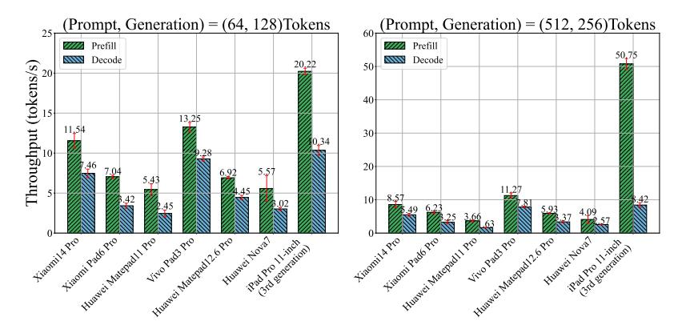

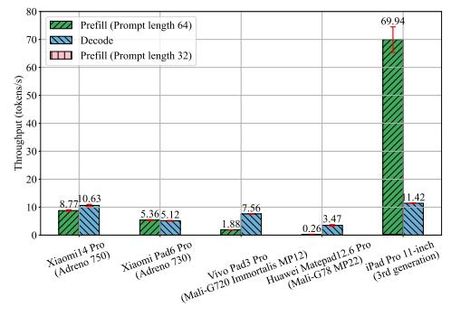

Fig. 2: Inference Performance (llama.cpp)

Fig. 3: Inference Performance (MLC LLM).

latter case implies greater computational intensity and memory resource demands. Figure 2 illustrates that inference speed decreases as the token length increases. The results may be attributed to the impact of DVFS. With longer prompts and generation tasks, the increased load causes the CPU frequency to throttle more aggressively. Across all tested devices, the performance degradation for both prefill and decoding is relatively consistent, ranging between 10% and 20%. An exception is that the prefill speed achieves a  $2.5\times$  improvement on the Apple M1, suggesting that matrix parallel computation on CPUs still has room for further optimization.

In addition to latency, memory footprint is a also crucial metric. On all six devices, memory usage remains consistently around 3.8GB and shows minimal variation during inference once the model weights are loaded into main memory from external storage. This consistency is due to the fact that llama.cpp applies for a fixed-size memory block during initialization, which remains constant once allocation is complete. The allocated memory is then segmented into various components for different variables, including model weights, KV-cache, buffers, context and etc.

Implication 1: LLMs running on mobile CPUs exhibit only slightly additional memory requirements beyond the model weights. Specifically, for a 4-bit quantized lightweight LLM with 7B parameters, the maximum memory usage is no more than 4GB. Moreover, the parameters of many popular lightweight LLMs range from 1B to 5B, which further reduces memory requirement. Thus, as long as a mobile device has more than 4GB available RAM, it is sufficient to run these models locally.

2) Performance on GPUs: Unlike CPUs, which are all from Arm, GPUs across vendors may have different architectures. Thus, it is challenging for developers to optimize for different GPUs. Figure 3 illustrates the end-to-end latency of MLC LLM across five high-tier GPUs from Arm Mali, Qualcomm Snapdragon, and Apple. It should be noted that Huawei MatePad 11 Pro and Huawei Nova 7 exhibit frequent crashes when running MLC LLM, which prevents the collection of reliable measurement results. Consequently, these two devices are excluded from the comparison. Among the tested GPUs, Mali GPUs, particularly the Mali-G78, exhibit significantly slow prefill speeds. Consequently, we only consider the per-

formance with 64-token prompts. For the Mali-G78, due to its extremely poor prefill performance, we only present results for 32-token prompts as a reference.

Although the decode speed of the Apple M1 is comparable to that of the Adreno 750, its prefill speed is nearly  $7 \times$  higher. This result highlights the huge performance gap between Apple SoCs and non-Apple SoCs. The Adreno GPU consistently outperforms the Mali GPU in overall performance. Notably, Mali GPUs show nearly unusable prefill performance. When comparing products from the similar tier, the Adreno 750 delivers  $1.4 \times$  faster decoding speed than the Mali-G720. Similarly, the Adreno 730 achieves  $1.5 \times$  faster decoding speed compared to the Mali-G78. Although Mali GPUs have poor prefill performance, Mali-G720 still achieves 1.5× speedup in decoding than older-generation Adreno 730. To look into this phenomenon, we will provide a detailed analysis in Section V-B. Memory usage across the GPUs is nearly identical at around 4.2GB, with a slight increase to 4.4GB observed on the Vivo Pad3 Pro.

Implication 2: For non-Apple GPUs, despite their theoretical advantages for large language models (LLMs) due to their parallel floating-point computing capabilities, do not exhibit a clear advantage in practice. Counterintuitively, MLC LLM on GPUs performs worse in prefill speed compared to Llama.cpp on CPUs. The reason could be that optimizing LLMs on mobile GPUs is more complex than on CPUs due to the diversity of GPU architectures.

3) Performance on Specialized AI Accelerators: Specialized AI accelerators have recently been integrated into mobile SoCs, such as the Snapdragon Hexagon NPU, Kirin NPU, and MediaTek APU. However, these accelerators face several challenges, including limited support for dynamic shapes and floating-point operations, which complicates use for LLM inference [35]. The Hexagon NPU, being the only mobile NPU with an open instruction set architecture, has garnered significant research interest. Successful deployments of mobile LLM models on the Snapdragon 8 Gen 3 have been reported. We collect the throughput reported in [38](mllm) and PowerInfer-2 [35], and compare with the performance on CPU and GPU.

MLLM and PowerInfer-2 achieve roughly an order-of-magnitude improvement in prefill speed over CPU, with MLLM reaching 106 tokens/s for a 64-token prompt (versus

TABLE II: Energy Consumption

| Device                                 | Power Drain | Prefill (token/s) | Decode    |
|----------------------------------------|-------------|-------------------|-----------|
| (Prompt, Generation) = (64, 128)Tokens | (mAh/round) |                   | (token/s) |
| Vivo Pad3 Pro                          | 4.54        | 10.63             | 8.22      |
| Huawei Matepad12.6 Pro                 | 8.28        | 6.67              | 4.34      |

10.9 tokens/s on CPU) and PowerInfer-2 achieving 88 tokens/s for a 512-token prompt (versus 8 tokens/s on CPU). Given the memory-bound nature of the decode stage, a hybrid inference scheme—using the NPU for prefill and the CPU or GPU for decode—may be a suitable approach for future optimization.

*Implication 3:* Although manufacturers provide limited support for NPUs, early trials with the Hexagon NPU have shown a substantial advantage in inference tasks. In order to drive this forward, more efforts should be devoted to adapting models and algorithms to specialized AI accelerators.

#### B. Battery Consumption

While the end-to-end latency of LLM inference on mobile CPUs shows promising potential, power consumption is also a key factor in determining the feasibility of these models for local, always-on user access.

Table II compares the power consumption and inference speed between the Vivo Pad3 Pro and Huawei MatePad 12.6 Pro. To obtain the power consumption, we read the data provided by the OS settings, which record and display the power consumption of a certain application. Old-generation devices are excluded from this comparison due to significant differences in battery capacity and power-saving policies compared to new-generation hardware. We conduct 20 consecutive rounds of inference on the CPU using 6 threads to balance performance and energy consumption, with a prefill length of 64 and a generation length of 128. Compared with the Kirin 9000E (Huawei Matepad12.6 Pro), the Dimensity 9300 (Vivo Pad3 Pro) exhibits a 1.6× speedup in prefill and a  $1.9 \times$  speedup in decoding, while consuming only 55% of the power. These results suggest that top-tier SoCs are capable of delivering substantial energy savings alongside improved performance.

In recent years, most smartphones have been equipped with battery capacities ranging from 4000mAh to 6000mAh. At a power consumption rate of 9mAh per inference round, a device could theoretically support over 400 rounds of inference. This result aligns with the findings in [8], reinforcing the feasibility of LLM inference on mobile devices. However, a significant rise in device temperature during inference suggests that LLM inference is a power-intensive task. We recorded an increase from 42.6°C to 66.8°C during a single inference on Huawei Matepad12.6 Pro. Thus, optimizing the power efficiency of LLMs on mobile devices is crucial for sustainable and long-term deployment.

## C. Parallel with Background Tasks (non-AI tasks)

In real-world scenarios, users often run inference alongside other processes, which can create a gap between peak and actual performance. To gain a deeper understanding of performance under typical conditions, we expand our evaluation

#### (a) Throughput in Prefill Stage

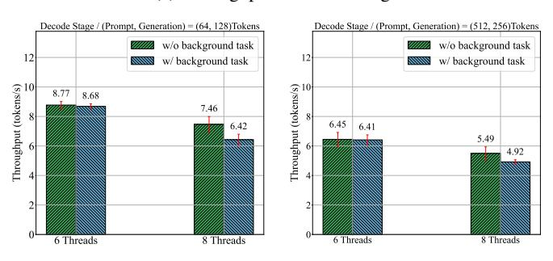

(b) Throughput in Decode Stage

Fig. 4: Performance of Llama-2-7B with Background Task (Music App) on Xiaomi14 Pro.

of LLM inference by incorporating concurrent background workloads.

The experimental configuration remains unchanged from the one described in Section III-B, with the exception that a music application is launched after rebooting the device and kept running in the background during the inference process. All data are collected on the Xiaomi 14 Pro using llama.cpp. Given that the additional CPU utilization introduced by the music application is below 10%, we limit the number of parallel threads to 6 and 8 when running llama.cpp.

In Figure 4, for the prefill stage, background tasks cause only a minor performance drop, with differences remaining below 5%. A similar effect is observed during the decode stage when inference is executed with 6 threads. However, when all CPU cores are utilized (*i.e.*, 8 threads), decode throughput degrades more significantly under background load, with performance losses exceeding 10%. Notably, while the background music application leaves CPU utilization largely unaffected, it reduces available RAM by several hundred megabytes, which likely contributes to the observed slowdown. These results suggest that inference performance will degrade further as the number or intensity of concurrent background tasks increases.

#### D. Parallel with AI Tasks

In addition to small workloads, there are scenarios where LLM inference must be executed alongside tasks that heavily consume compute or memory resources. For example, some image processing neural network models are deployed on mobile devices. It is important to evaluate whether the performance remains usable when these tasks run concurrently.

The experimental configuration is the same as in Section III-B except that a YOLO-based application is launched

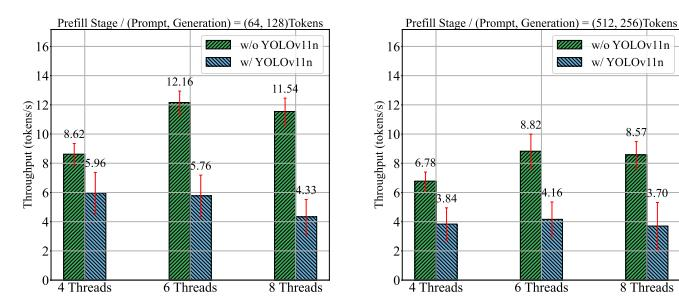

## (a) Throughput in Prefill Stage

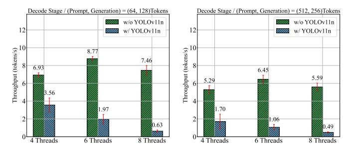

(b) Throughput in Decode Stage

Fig. 5: Performance of Llama-2-7B with AI Task(YOLOv11n) on Xiaomi14 Pro.

after rebooting the device and kept running in the foreground during inference. During LLM inference, the YOLO-based application activates the camera and executes the YOLOv11n model for object detection. All experiments are conducted on the Xiaomi 14 Pro with llama.cpp.

Figure 5 shows that when executed concurrently with other AI tasks, inference performance declines progressively as the number of parallel threads in the LLM inference process increases. Without additional parallel tasks, the best performance is achieved at 6 threads, where CPU utilization reaches approximately 680%. However, when the YOLO-based application is running (introducing an additional  $\sim 300\%$  CPU utilization), the optimal configuration shifts to 4 threads, which yields the smallest relative degradation. Moreover, performance degradation in the decode stage becomes significantly more pronounced than in the prefill stage. The most critical case occurs at 8 threads: prefill throughput drops by nearly 60%, while decode throughput collapses by more than 90%. In practice, this indicates that during the decode stage, inference with 8 threads (equal to the number of CPU cores) becomes essentially unusable when YOLOv11n runs concurrently.

During execution with YOLOv11n, the battery temperature rose from 28°C to 47°C over five inference runs, which is substantially higher compared to LLM-only execution. This induces severe thermal throttling, forcing the prime core to operate at an extremely low frequency. Consequently, optimizing processor frequency to balance performance and energy consumption is crucial for concurrent execution.

*Implication 4:* With YOLOv11n consuming over 300% of CPU resources, the highest inference performance is observed with fewer parallel threads. This suggests that the optimal

thread count for practical scenarios is not fixed but instead depends on real-time CPU utilization. For AI workloads that demand substantial CPU capacity, parallel execution with LLMs presents significant challenges.

Implication 5: As the number of threads executing inference increases, the throughput of the decode stage experiences a pronounced decline, indicating that the memory bottleneck is the primary limitation when LLM inference is executed concurrently with other AI workloads. Under such multi-task scenarios, intensified memory read/write pressure and bandwidth contention significantly degrade inference performance, in some cases reducing it to the point of near unusability.

### V. PERFORMANCE: DEVELOPERS' PERSPECTIVES

In this section, we present results that developers care about, focusing on CPU/GPU utilization, DVFS and scheduling strategies. We also investigate the impact of different inference frameworks. We hope that these results can help developers identify bottlenecks in LLM inference and ultimately lead to improvements in system performance.

#### A. CPU Utilization for LLM inference

While upgrading hardware can enhance LLM local inference performance, it is also crucial to assess whether we are fully utilizing the capabilities of existing hardware. To address this, we use specialized profilers to monitor and capture dynamic utilization of the CPU and GPU during inference. This allows us to explore the potential of current hardware and identify opportunities for further accelerating LLM inference.

1) Multi-threads on CPU Cores: Most popular mobile SoCs utilize the "big.LITTLE" architecture for their CPUs, which balances performance with power efficiency. This configuration typically includes multiple cores organized into two distinct clusters: "big" (prime and performance cores) and "little" (efficiency cores), as illustrated in Table 3. The detailed CPU Specifications of Apple M1 are not publicly disclosed; it is known to comprise 4 performance cores and 4 efficiency cores. While it is commonly assumed that high-load tasks are best handled by the "big" cores for optimal performance, our tests reveal that the ideal core configuration can vary across the two stages of LLM inference.

We evaluate three core configurations: using only big cores, a combination of big and little cores, and all available cores. To enable parallel inference across multiple CPU cores, we adjust the number of running threads. Since inference threads are prioritized to run on big cores, the number of running threads implies which cores are active. For instance, on the Snapdragon 8 Gen 3 (which has six big cores), six threads correspond to all big cores, while on the Snapdragon 8+ Gen 1 (which has only four big cores), the same configuration includes all big cores and two little cores.

Figure 6 illustrates how these core configurations impact inference speed across the four tested devices. During the prefill stage, prompt processing speed is primarily driven by the big cores. The contribution of the little cores to acceleration depends on the performance gap between the big

| SoC         | Snapdragon 8 Gen 3                                                                                 | Dimensity 9300                                    | Snapdragon 8+ Gen 1                          | Kirin 9000E              |
|-------------|----------------------------------------------------------------------------------------------------|---------------------------------------------------|----------------------------------------------|--------------------------|
| Prime       | 1 × Cortex-X4 (3.3GHz)                                                                             | $1 \times \text{Cortex-X4} (3.25\text{GHz})$      | $1 \times \text{Cortex-X2 } (3.2\text{GHz})$ | 1 × Cortex-A77 (3.13GHz) |
| Performance | $2 \times \text{Cortex-A720 } (3.15\text{GHz})$ $3 \times \text{Cortex-A720 } (2.96\text{GHz})$ | 3× Cortex-A720 (2.85GHz) 4× Cortex-A720 (2GHz) | 3× Cortex-A710 (2.75GHz)                     | 3× Cortex-A77 (2.54GHz)  |
| Efficiency  | 2 × Cortex-A520 (2.27GHz)                                                                          | -                                                 | 4× Cortex-A510 (2GHz)                        | 4× Cortex-A55 (2.05GHz)  |

TABLE III: CPU Specifications

Fig. 6: Throughput with multi-threads.

and little cores. On devices with limited computational power, additional efficiency cores can help accelerate inference. For instance, utilizing all cores delivers the best performance on the Kirin 9000E. However, for devices with more powerful big cores, adding little cores can actually reduce performance. For example, on the Snapdragon 8 Gen 3, incorporating two little cores results in a slowdown in inference speed. This highlights the importance of optimizing core configurations based on each device's specific CPU capabilities to maximize efficiency. Interestingly, the Dimensity 9300 benefits from using all cores because of its All-Big-Core architecture [41]. On the Apple M1, we observe that even a single performance core achieves a prefill speed comparable to that of 8 threads. Increasing the thread count does not improve CPU utilization; instead, it may introduce excessive context switching, where threads are frequently interrupted, leaving substantial idle intervals on CPUs and reducing CPU utilization.

In the decoding phase, adding more little cores typically leads to a decline in performance. For instance, both the Kirin 9000E (Huawei Matepad12.6 Pro) and Snapdragon 8+ Gen 1 (Xiaomi Pad6 Pro) achieve their peak decoding speeds with four active big cores. This indicates that the maximum decoding speed on a device is largely dictated by the performance of the big cores. Unlike the prefill stage, decoding is more heavily constrained by memory bandwidth. This is evident in the fact that adding more big cores results in a smaller performance improvement compared to prefill, while incorporating little cores leads to a more noticeable performance drop.

**Implication** 6: To achieve optimal inference performance on multi-core CPUs, the decision to activate a core for inference should depend on its computational capacity relative to other cores. In general, the primary cores and performance cores

Fig. 7: Inference with INT8 Matrix Multiplication

contribute most to overall performance, while the efficiency cores have a negligible or even negative impact due to their limited computing resources. One potential method is distributing the workload to each core based on its compute capability and memory access overhead.

*Implication 7:* Since the prefill stage is compute-bound and the decoding stage is memory-bound, the core activation strategy should be adapted for each stage. Although scaling to more cores improves theoretical computation capacity, it risks introducing more synchronization and memory overhead. Take Kirin 9000E and Snapdragon 8+ Gen 1 as examples, the efficiency cores provide slight improvement during prefill, but degrade performance in decoding.

2) Speedup with Special Machine Instructions: CPUs are generally more efficient at handling integer (INT) operations compared to floating-point (Float) computations. This performance advantage in INT operations stems from two key factors: first, CPUs typically offer higher instruction throughput for INT operations than for floating-point ones. Second, for matrix multiplication tasks, many CPUs support specialized INT8 instructions, which further accelerate these computations.

To further explore the potential of Arm CPUs, we test the Llama-2-7B model on top-tier SoCs and recompiled llama.cpp directly on the device with the i8mm flag to enable INT8 matrix multiplication instructions. This ensures that the machine code consists of *smmla* [42] and *sdot* [43]. The *sdot* instruction accelerates vector computations by processing multiple INT8 dot products simultaneously, making it well-suited for matrix-vector multiplication during the decoding. In contrast, the *smmla* instruction handles block matrix multiplication and delivers twice the multiply-accumulate efficiency of *sdot*, making it ideal for accelerating matrix operations in the prefill

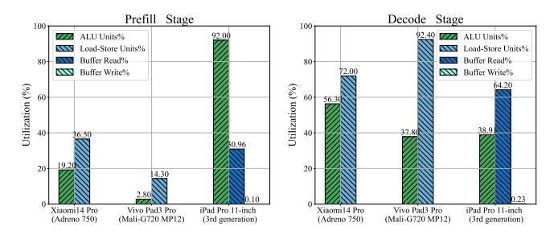

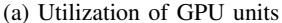

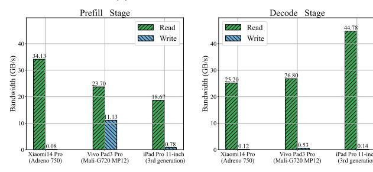

(b) Memory Bandwidth

Fig. 8: GPU Utilization

stage.

We note that Arm developers have proposed the prearrangement of weights in blocks to avoid pseudo-scalar operations and fully exploit the parallel capabilities of specialized instructions [44]. In the original weight layout, only a single column of weights is processed at a time, and it requires multiple dot product operations. The optimized layout, however, distributes the weight columns across multiple computational lanes, enabling parallel processing of several weight columns in a single instruction. This approach not only increases throughput but also reduces memory access by sharing input data within lanes, further enhancing inference efficiency.

*Implication* 8: Software developers must consider the instruction set of the target platform and optimize the code. It can involve rewriting kernel functions, adjusting the memory layout, and tailoring the computation operations, which contributes to improving performance using specialized hardware instructions. On the other hand, hardware developers should focus on designing more efficient instructions to enhance the parallelism of matrix computations and improve memory utilization.

#### B. GPU Utilization for LLM inference

We note an intriguing exception regarding performance on Mali GPUs. The Mali-G720 Immortalis MP12, found in the Dimensity 9300 (Vivo Pad3 Pro), has better hardware parameters but has poorer performance than Adreno 750 in Snapdragon SoC (Xiaomi14 Pro). We measure the maximum throughput for FP16 operations on devices using clpeak [45], which is a benchmarking tool intended for calculating GPU performance by executing different OpenCL kernels. The actual maximum memory bandwidth is also obtained using clpeak and presented with the theoretical maximum bandwidth in Table IV. From Table IV, we can see that the Mali-G720

TABLE IV: GPU specifications and corresponding achievable performance

| GPU Name                  | FP16 (GFLOPS) | Est./Theoretical Max Memory Bandwidth (GB/s) |
|---------------------------|------------------|-------------------------------------------------|
| Mali-G78 MP22             | 2065             | 26/-                                            |
| Mali-G720 Immortalis MP12 | 6456             | 48/77                                           |
| Adreno 730                | 3086             | 39/-                                            |
| Adreno 750                | 4314             | 63/77                                           |

Fig. 9: Prefill Throughput under various chunk lengths

MP12 exhibits 1.5 times the throughput of the Adreno 750 in float16 operations. However, Figure 3 shows that its prefill speed is 4.6 times slower.

The possible reason for this discrepancy comes from the GPU utilization. Figure 8 presents the average utilization and memory bandwidth during inference on Mali-G720, Adreno 750, and iPad Pro. It should be clarified that, on Apple devices, Load-Store utilization is reported separately as buffer reads and buffer writes, whereas on non-Apple devices we refer to the aggregate Load-Store utilization. The results reveal that MLC LLM fails to effectively utilize ALU units on both Mali and Adreno GPUs, with inefficiency being particularly severe on Mali.

During the compute-bound prefill stage, the Mali-G720's arithmetic unit utilization averages less than 3%. The Adreno 750 performs better, but only reaches around 20%. By contrast, the Apple M1 achieves up to 92%. In the memory-bound decoding stage, the Mali-G720 shows a severe memory bottleneck for the nearly saturated Load-Store units utilization. Taken together, these findings highlight that generic operator implementations are mismatched with the Mali GPU, leaving compute resources underused in the prefill stage and memory resources overwhelmed in the decode stage.

1) Understand the underuse of non-Apple GPUs: To further investigate the causes of GPU underutilization and explore optimization opportunities, we conduct additional experiments and analyze a broader set of metrics on the Adreno 750 and Mali-G720. The results consistently highlight that the primary factors contributing to underutilization are the inefficient memory access pattern and the lack of operator optimizations tailored to specific GPU architectures.

During the prefill stage on the Adreno 750, cache profiling reveals L2 miss rates exceeding 40%, indicating frequent cache failures and heavy reliance on system memory. Prolonged L2 stalls from memory transfers substantially reduce ALU activity. On the Mali-G720, a similar problem arises: over

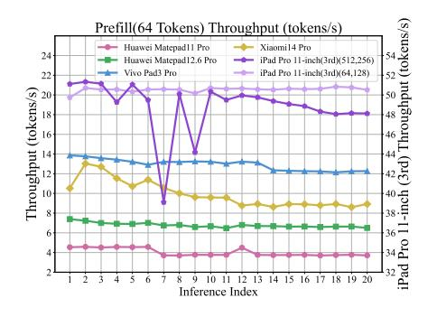

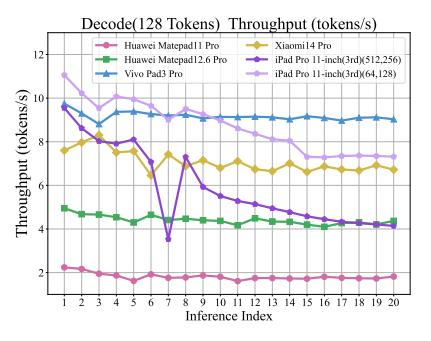

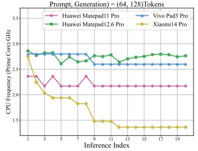

Fig. 10: Throughput under continuous inference (CPU)

Fig. 11: Prime Core Frequency

80% of Load-Store units reads are partial-width, resulting in numerous short memory accesses that underutilize cache capacity [46]. Moreover, the rate of all registers warp reaches nearly 100%, which halves the peak thread occupancy of the shader core and makes shader performance particularly sensitive to cache misses and memory stalls [47]. Taken together, the findings demonstrate that, although the prefill stage is inherently compute-intensive, suboptimal memory access patterns constitute the primary performance bottleneck in existing implementations.

As for the decode stage, the memory-bound nature of operators (i.e., matrix-vector multiplication) leads to frequent memory accesses for matrix operands. On the Adreno 750, this is reflected by an L2 cache miss rate approaching 100%. The issue is even more pronounced on the Mali-G720, where the average load-store unit utilization exceeds 90%, with nearly all read operations being partial-width. Moreover, more than 60% of external memory accesses exhibit high latency (over 256 cycles), suggesting that the memory system is struggling to keep up with the requested data volume [48]. These findings suggest that optimizing data access patterns to reduce partial-width reads and alleviating bandwidth pressure are critical to mitigating memory bottlenecks in the decode stage.

2) GPU Optimization Practices: Qualcomm's optimized version of MLC LLM demonstrates that careful data layout design can substantially enhance GPU efficiency [49]. By reorganizing the input matrix into  $32 \times 16$  tiles with contiguous memory addresses, the implementation achieves improved memory coalescing. Profiling further shows that cache misses in L1 and L2 occur only at limited points (e.g., within the first 2 ms of a 10 ms execution). As a result, the prefill speed reaches over 50 tokens/s, representing a six-fold improvement over the general version on the same device. This case shows that optimizing memory access patterns alone can yield substantial prefill performance gains.

Additionally, the absence of customized operator implementations further limits GPU utilization. In MLC-LLM, all operators are cross-compiled uniformly for mobile devices, resulting in identical parameter configurations for both Adreno and Mali GPUs. However, since these GPUs differ in core counts, cache capacities, and memory bandwidth, parameters of OpenCL kernels such as global work size should be tuned and optimized individually through empirical testing.

To verify the impact of kernel parameter, we evaluate

different prefill chunk sizes using llama.cpp on the Xiaomi 14 Pro. Specifically, the OpenCL kernels in llama.cpp use a fixed local work size [50], while the global block size is determined by the prefill chunk size. Large blocks typically cause memory contention, whereas small blocks underutilize compute units. Figure 9 illustrates the impact of chunk size on throughput for different prompt lengths. On the Xiaomi 14 Pro, prompts longer than 256 tokens achieve peak performance at a chunk size of 256, while shorter prompts perform best when the chunk size matches the prompt length. These optimal values, however, may vary across devices, suggesting that pretesting or profiling is necessary to determine device-specific configurations.

Implication 9: General-purpose LLM implementations on mobile GPUs do not fully harness the parallelism capabilities of these devices. The results highlight a significant performance gap between different GPU architectures (e.g., Mali vs. Adreno)—for instance, Adreno GPU may achieve 5× throughput than Mali GPU (which has higher computation capacity) for the same workload. To unlock the full potential of mobile GPUs, customized implementations are essential.

*Implication 10:* The primary performance bottleneck on GPUs arises from suboptimal data layouts and memory access patterns. Even in the compute-bound prefill stage, frequent external memory accesses cause significant ALU idle time. Optimizations such as restructuring data layouts or applying memory coalescing can improve cache utilization, while rebalancing thread workloads and minimizing register usage can further enhance computational efficiency.

#### C. Impact of DVFS and Thermal Throttling

1) Impact of DVFS on CPU: In Section IV-A1, we observed performance degradation as the length of the prompt and generation increased. This issue relates to the system's ability to handle long contexts and maintain consistent inference performance across multiple rounds of dialogue. We analyze real-time variations in CPU frequency and utilization during 20 continuous inference tests on four devices with warm up, covering different operating systems (Android, HyperOS, HarmonyOS, iPadOS) and vendors (MediaTek, Qualcomm, Hisilicon, Apple). Given the significant performance advantage of the Apple device, we performed additional testing using longer prompts and outputs.

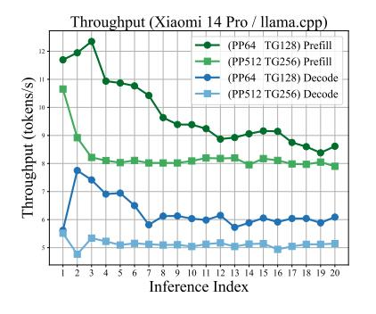

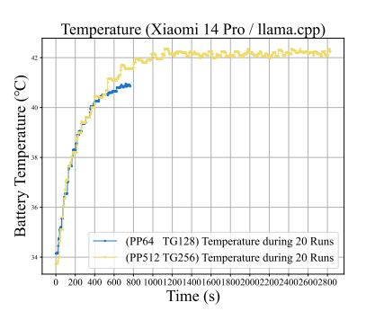

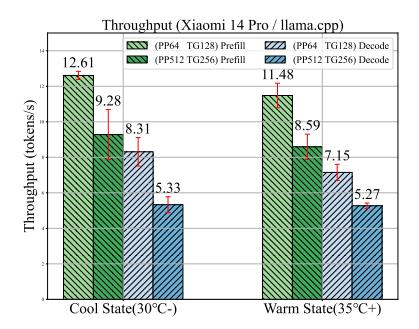

Fig. 12: Throughput under continuous inference

Fig. 13: Performance Sensitivity to Starting Temperature

Figure 10 illustrates a general decline in performance as the rounds of inference increase. Although the inference throughput for both prompt lengths is similar, the iPad exhibits a more pronounced performance drop in long-prompt tests compared to short-prompt tests. Moreover, in short-prompt tests, unlike the stable prefill speed, the decode speed on the iPad decreases during the early stages and eventually falls from the best to a level comparable with the second-highest among the other devices. Additionally, on Xiaomi 14 Pro, throughput for both prefill and decode initially rises, then decreases, and finally stabilizes at a relatively steady level, accompanied by minor oscillations around the equilibrium. In contrast, Dimensity 9300 (Vivo Pad3 Pro) and Kirin 9000E (Huawei Matepad12.6 Pro) exhibit only minor latency fluctuations, with a maximum decrease of approximately 10%. This trend aligns with the data presented in Figure 2, which shows that Xiaomi 14 Pro experiences a more significant performance drop as prompt length increases.

Figure 11 shows the frequency variation on the prime CPU core at different rounds of inference. CPU frequency is inaccessible on the iPad, resulting in a lack of corresponding measurement data. The results reveal that Snapdragon SoCs (e.g., Huawei Matepad11 Pro, Xiaomi14 Pro) exhibit a more aggressive DVFS policy. During subsequent stages of the inference, both prime and performance cores on Snapdragon 8 Gen 3 experience a rapid reduction in frequency. By the 9th inference round, the frequency is nearly halved compared to its initial value. To investigate the factors influencing DVFS policy, we further compare two Huawei tablets equipped with identical CPU cores but different SoCs—one powered by Snapdragon (Snapdragon 870 on Huawei Matepad11 Pro) and the other by Kirin (Kirin 9000E on Huawei Matepad12.6 Pro). The results indicate that the vendor plays a significant role in shaping the DVFS policy. For instance, the Snapdragon 870 typically keeps the prime core frequency lower than the Kirin 9000, although they have the same maximum frequency.

Implication 11: CPU frequency critically affects inference performance. The default DVFS strategy tends to be conservative, taking factors such as thermal throttling and battery life into consideration. While this strategy is suited for successive multi-round inferences, the more common case on mobile devices involves intermittent single-round inference (with larger than 30s interval). Therefore, developers may consider increasing the CPU frequency—or even overclock-

ing—for initial inference to reduce response latency.

2) Impact of CPU Thermal Throttling: As discussed in Section V-C1, only a few consecutive inference runs are sufficient to trigger CPU frequency reduction due to thermal throttling. To further examine the impact of heat accumulation over time, we extend the experiments on Xiaomi 14 and analyze (1) temperature and performance variation during sustained Inference and (2) the impact of initial device temperature on performance.

Impact of Heat Accumulation on Sustained Inference: Figure 12 illustrates performance variations of different workloads over 20 consecutive inference runs and the corresponding thermal buildup. Both curves exhibit an initial rapid temperature rise followed by stabilization. During the first 500 seconds, the trends are nearly identical, starting from about 34°C and climbing above 40°C. In the stable stage, the rate of temperature rise slows, whereas the long-prompt tests are still faster than the short-prompt tests, leading to a higher equilibrium near 42°C. After about 1000 seconds, the temperature of long-prompt tests fully stabilizes, with minor oscillations around equilibrium likely reflecting stricter thermal regulation.

The performance variation closely follows the temperature trend. During the initial heating stage, throughput fluctuates noticeably. For long-prompt tests, since each inference run takes longer, performance becomes consistent after only 2–3 runs. In contrast, short-prompt tests stabilize much later, requiring nearly 10 runs. Across both prefill and decode stages, the performance gap between the two tests is initially narrow, then widens as the system heats up, and finally narrows again and stabilizes at a steady difference of about 1 token/s.

Performance Sensitivity to Starting Temperature: To evaluate performance sensitivity to starting temperature, experiments are conducted under two conditions: a cool-down state (below 30°C) and a warm-up state (above 35°C). These conditions are achieved by first running additional tasks to heat the device and then cooling it for varying durations until the target temperature is reached. All other experimental configurations are largely consistent with Section III-B.

Figure 13 shows that overall performance decreases at higher temperatures, with smaller workloads being more sensitive. Although temperature initially rises at a similar rate across different prompt lengths, long-prompt tests require more time per run, causing the CPU frequency to drop rapidly within the first one or two rounds of interference.

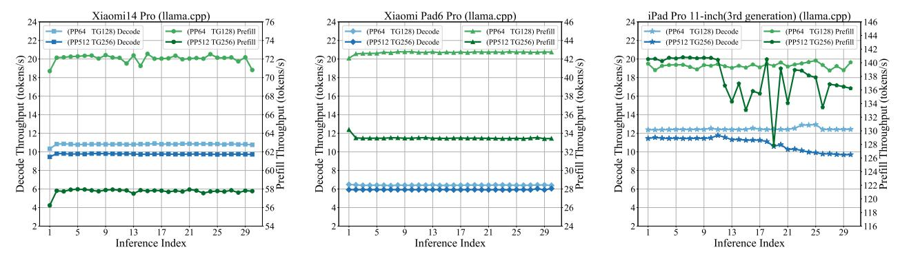

Fig. 14: Throughput under continuous inference (GPU)

Consequently, the effect of the initial temperature for longprompt tests is largely limited to these early rounds, whereas for short-prompt tests, all five consecutive runs occur during the temperature rise stage, allowing lower starting temperatures to delay CPU throttling and sustain higher performance throughout.

3) Impact of DVFS on GPU: We further evaluate the impact of DVFS on GPUs, using llama.cpp since continuous inference with MLC LLM often crashes. Due to framework limitation, only Xiaomi and Apple devices are tested and the results are illustrated in Figure 14. Leveraging faster GPU inference with llama.cpp, experiments are extended to 30 runs with larger workloads (512-token prompts, 256-token outputs). GPU frequency data are available only on the rooted Xiaomi Pad 6 Pro, while iPad reports thermal states via Xcode.

Adreno GPU under Android: The results show that inference speed on both the Xiaomi 14 Pro and Xiaomi Pad 6 Pro remains relatively stable throughout the tests. GPU frequency on Xiaomi Pad 6 Pro is generally fixed at 815 MHz during inference. However, in the first run of some tests, it briefly spikes to 862 MHz before quickly returning to 815 MHz, where it remains stable for subsequent runs. This initial fluctuation is likely caused by the DVFS policy.

Apple GPU under iOS: Unlike the stable performance observed on Adreno GPUs under Android, the iPad exhibits noticeable fluctuations throughout the inference process. For short-prompt tests, the performance degradation is minor and appears near the end of the run. However, for long-prompt tests, the degradation occurs earlier and becomes more pronounced. These results are consistent with the thermal state reported: during most of the 30 inference runs, the device remains in the "nominal" state (within normal thermal limits), but towards the end of long-prompt inferences, the state may shift to "serious", indicating elevated heat conditions.

Implication 12: Compared with the CPU, whose frequency fluctuates frequently, the GPU maintains a relatively stable frequency during inference, yielding more consistent performance. This stability likely benefits from the GPU's higher computational efficiency and lower power consumption. These observations suggest that offloading LLM inference to GPUs is a practical and effective strategy for preserving stable real-time responsiveness on mobile devices.

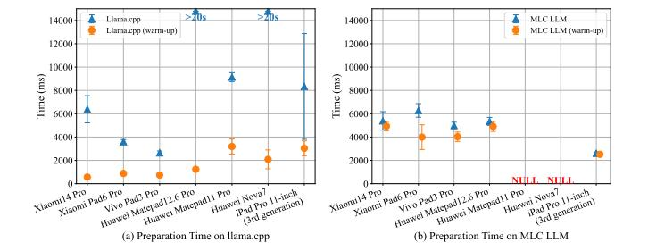

Fig. 15: Time for model preparation

*Implication 13:* Mobile GPUs may not fully utilize their theoretical computational capacity. For example, the Xiaomi Pad 6 Pro GPU supports 13 frequency levels ranging from 220 MHz to 900 MHz, yet its default operating frequency is 815 MHz, the third-highest level.

*Implication 14:* The end-to-end inference speed suggests that Apple's DVFS strategy for the GPU is more conservative than that of Adreno GPUs on Android. Although the Apple GPU offers higher computational capability, it is more prone to performance degradation under sustained workloads due to stricter frequency-scaling policies.

## D. Model Preparation Latency

In Section V-C1, we have studied the inference performance with warm-up. However, in real-world applications, users may trigger the model sporadically, leading to scenarios where the model must perform a cold start without a warm-up, known as the cold start. Thus, the time required to generate the first token becomes critical to user experience. The process of generating the first token involves several stages: loading model weights from external storage into memory, preparing memory for variables, and executing prefill and decoding. In this section, we focus on the preparation procedure before prefill and evaluate the latency across various devices. We perform tests on seven devices and measure the time spent on preparation with and without warm-up. If the device is tested without warm-up, we reboot it to refresh RAM and cache. Results are present in Figure 15.

For the llama.cpp running on CPUs, we compare the time before prefill of the first token in both cold-start and warmup scenarios. The Xiaomi 14 Pro performs the fastest after warm-up, while its preparation time for cold start is nearly ten times slower than for warm-up. The Vivo Pad 3 Pro delivers the best overall performance for both warm-up and cold start. Additionally, the Apple device exhibits significant fluctuations during cold start, and its warm-up latency is noticeably slower than that of other top-tier devices.

We recognize that the warm-up process significantly reduces preparation time for llama.cpp, primarily due to the use of *mmap*, which allows the inference process to directly access model weight files from external memory. The *mmap* function accelerates loading by eliminating the need to copy data between user and kernel space. Additionally, the mapping remains valid for other processes accessing the same file, meaning that after a warm-up, the model weights are already loaded into memory. This allows subsequent inference processes to use the preloaded weights, thereby reducing latency.

From Figure [15,](#page-12-1) we observe that all Huawei devices exhibit unusually long preparation times during cold starts. On Huawei devices with Kirin SoCs, the delays are even more pronounced, with the worst loading times exceeding 20 seconds. Huawei Matepad 11 Pro, despite using a Snapdragon SoC, also experiences extended delays. We identify the underlying causes for these exceptions are related to the *mmap* function in Harmony OS. Through timestamp analysis, we identify that the primary cause is the execution of the *mmap* function. On the Huawei Matepad 12.6 Pro, *mmap* execution takes up to 20 seconds, whereas after warm-up, this time is drastically reduced to 1.2 seconds. This suggests that the delay arises from the memory mapping process rather than loading from UFS.

In contrast, for MLC LLM running on GPUs, no significant improvement is observed with warm-up, with loading times remaining approximately nine times longer on Adreno GPUs and five times longer on Mali GPUs compared to llama.cpp (with warm-up). An exception is that the Apple GPU performs slightly better than the CPU when using llama.cpp (with warm-up). This is probably due to the difference between the system memory architectures. For non-Apple devices, although the CPU and GPU on mobile devices share the same physical DRAM, they operate in separate memory spaces and cannot directly access each other's data [\[51\]](#page-15-34). As a result, model weights must be copied from the CPU memory space to the GPU memory space , introducing additional latency. Specifically, MLC LLM uses OpenCL kernels to transfer data between the CPU and GPU via buffers, which results in the delay. In contrast, a major advantage of Apple devices lies in their unified memory architecture [\[52\]](#page-15-35), which enables shared access between CPU and GPU and thereby achieves much lower transfer latency.

# VI. OPPORTUNITIES FOR IMPROVING MOBILE LLM PERFORMANCE

Building on the results present in the previous sections, this section highlights several key aspects that developers can leverage to significantly enhance mobile LLM performance.

Hardware Instructions A key aspect of SoC evolution is the continuous enhancement of instruction sets. New machine instructions often increase operand width, resulting in higher throughput. To fully harness the potential of hardware, developers must consider the characteristics of model operators and take advantage of hardware-accelerated instructions. This may also involve adjusting computational precision, such as quantizing activations to 8-bit to utilize instructions like *smmla*. In Section [V-A2,](#page-8-0) we have discussed the improvement brought by SVE instructions. For next-generation CPUs based on the Armv9 architecture, advanced vector instructions like SVE2 [\[53\]](#page-15-36), which enables longer computation vectors, are supported. Furthermore, Arm's SME instructions [\[54\]](#page-15-37), specifically designed for matrix multiplication, present additional optimization opportunities. Staying current with these advancements is crucial for developers seeking to maximize inference speed on mobile platforms.

Dynamic Resource Allocation Parallel execution of large language models (LLMs) alongside other tasks remains a significant challenge. Optimal resource allocation is inherently dynamic, influenced by real-time workloads and system thermal conditions. A practical approach is to pre-define multiple operating modes that can adapt to varying workloads, such as adjusting the number of threads or offloading computations to idle processors.

Faster First Generation The time required for generating the first token includes model preparation, prefilling and one round of decoding. Since the majority of model preparation involves I/O operations (loading model weights into memory), storing some of the weights in RAM can help reduce preparation time. As for prefill and decode, the CPU can run at a higher frequency when a new inference process starts, ensuring the fastest response.

Enhancing Memory Access Efficiency To address GPU underutilization, optimization efforts should primarily target memory access efficiency. Potential strategies include restructuring data layouts to improve locality, applying memory coalescing to reduce cache misses, and minimizing reliance on external memory. Furthermore, for long-context inference, partitioning large matrices into smaller chunks can effectively alleviate memory pressure and enhance execution efficiency.

Customized Operators and Kernel Parameter Tuning Customized operator implementations are essential for fully exploiting GPU capabilities and achieving performance breakthroughs. Owing to the significant architectural differences across GPUs, generic operator implementations often fall short in delivering optimal acceleration. Fine-grained parameter tuning of kernel functions, such as adjusting the work size, offers a promising optimization path. For example, an excessively large global work size may introduce severe memory contention, while an overly small size can result in underutilization of compute units and additional overhead.

Dynamic GPU Frequency The computing capability of the GPU is not fully utilized, as its operating frequency is generally fixed at a value lower than the maximum during inference. While this strategy helps maintain stable performance with moderate energy consumption, incorporating dynamic frequency adjustment could achieve a more adaptive balance between performance and energy efficiency.

Hybrid Inference to Enhance User Experience Although CPU performance appears sufficient, as shown in Section [V-C2,](#page-11-1) running inference solely on CPUs leads to rapid temperature increases. Given the strong performance of the NPU and GPU during the prefill stage, a hybrid inference approach—utilizing the NPU or GPU for prefill and the CPU for decoding—is expected to enhance efficiency while delaying temperature rise and improving the overall user experience.

# VII. DISCUSSION

Large Lanuage Models. There are many lightweight LLMs, with parameters ranging from 1B to 13B, that can fit in memory on most high-end mobile devices. Additionally, strategies have been developed to run larger models by offloading part of the model weights to external storage. In this paper, rather than focusing on performance differences across models, we concentrate on the hardware capabilities to identify bottlenecks that limit LLM performance and thoroughly understand how much untapped potential remains.

Most existing generative AI models are transformer-based, where the primary operations are matrix-matrix or matrixvector multiplications. While different models may vary in terms of matrix size or the number of transformer blocks, the core operations remain highly resource-demanding matrix computations. Understanding the hardware's capacity to handle these operations is key to optimizing LLM performance on mobile devices.

Quantization and Model Accuracy. An important aspect of evaluating a model's capability is the accuracy of the responses generated by the LLM. However, for on-device LLM inference, the factors influencing model accuracy are primarily subject to the model architecture and the quantization of its weights. Based on this fact, MobileAIBench [\[10\]](#page-14-9) provides a comprehensive benchmark for analyzing accuracy across various NLP tasks under different quantization schemes for both LLMs and large multimodal models (LMMs). Since our primary focus is on hardware-related performance metrics, we have chosen the most widely used quantization scheme, which offers the best balance between speed and accuracy. While lower-bit quantization algorithms may enhance inference speed, we excluded them from this study due to their significant impact on accuracy.

Multimodality Models. Driven by the growing demand for advanced AI assistants, the deployment of large multimodal models (LMMs) on mobile devices is an inevitable trend. However, we excluded LMMs from our study for two main reasons. First, current LMMs may not yet be ready for mobile deployment. For example, MobileAIBench reports that testing Llava-Phi-2 [\[55\]](#page-15-38) on the iPhone 14 resulted in a first token generation of 66.47 seconds. It remains unclear whether this poor performance is due to hardware constraints or inefficient operator implementation. Second, since LLMs and LMMs share significant similarities in both model architecture and operator implementations, the insights gained from on-device LLM tests can likely be generalized to large multimodal models.

#### VIII. CONCLUDING REMARKS

In this paper, we present a comprehensive measurement study of LLM inference on mobile platforms, offering insights into both user-experience metrics (such as token throughput and energy consumption) and critical hardware and system characteristics (including CPU/GPU utilization, DVFS, and file mapping latency). Our analysis reveals how hardware capabilities and system dynamics impact on-device LLM performance and highlights potential bottlenecks affecting mobile LLM applications. Additionally, we propose potential directions for enhancing on-device LLM inference performance, including customizing operators by tuning kernel parameters to match various GPUs, optimizing data layout to improve memory efficiency, and searching for more adaptive DVFS policies to balance performance and energy. We hope that this study can provide insights for both the development of on-device LLMs and the design for future mobile system architecture.

#### REFERENCES

- [1] A. Inc., "Apple Intelligence," [https://developer.apple.com/](https://developer.apple.com/apple-intelligence/) [apple-intelligence/,](https://developer.apple.com/apple-intelligence/) 2024, accessed: 2024-09-06.
- [2] Y. Mehdi, "Introducing Copilot+ PCs," [https://blogs.microsoft.com/blog/](https://blogs.microsoft.com/blog/2024/05/20/introducing-copilot-pcs/) [2024/05/20/introducing-copilot-pcs/,](https://blogs.microsoft.com/blog/2024/05/20/introducing-copilot-pcs/) 2024, accessed: 2024-09-06.
- [3] F. He, T. Zhu, D. Ye, B. Liu, W. Zhou, and P. S. Yu, "The emerged security and privacy of llm agent: A survey with case studies," *arXiv preprint arXiv:2407.19354*, 2024.
- [4] O. AI, "Chatgpt," [https://openai.com/chatgpt/,](https://openai.com/chatgpt/) 2022, accessed: 2024-09- 06.
- [5] Anthropic, "Claude," [https://claude.ai/,](https://claude.ai/) 2023, accessed: 2024-09-06.
- [6] H. Touvron, L. Martin, K. Stone, P. Albert, A. Almahairi, Y. Babaei, N. Bashlykov, S. Batra, P. Bhargava, S. Bhosale *et al.*, "Llama 2: Open foundation and fine-tuned chat models," *arXiv preprint arXiv:2307.09288*, 2023.
- [7] A. Q. Jiang, A. Sablayrolles, A. Mensch, C. Bamford, D. S. Chaplot, D. d. l. Casas, F. Bressand, G. Lengyel, G. Lample, L. Saulnier *et al.*, "Mistral 7b," *arXiv preprint arXiv:2310.06825*, 2023.
- [8] S. Laskaridis, K. Katevas, L. Minto, and H. Haddadi, "Melting point: Mobile evaluation of language transformers," in *Proceedings of the 30th Annual International Conference on Mobile Computing and Networking*, 2024, pp. 890–907.
- [9] X. Li, Z. Lu, D. Cai, X. Ma, and M. Xu, "Large language models on mobile devices: Measurements, analysis, and insights," in *Proceedings of the Workshop on Edge and Mobile Foundation Models*, 2024, pp. 1–6.
- [10] R. Murthy, L. Yang, J. Tan, T. M. Awalgaonkar, Y. Zhou, S. Heinecke, S. Desai, J. Wu, R. Xu, S. Tan *et al.*, "Mobileaibench: Benchmarking llms and lmms for on-device use cases," *arXiv preprint arXiv:2406.10290*, 2024.
- [11] G. Gerganov, "llama.cpp: Llm inference in c/c++," [https://github.com/](https://github.com/ggerganov/llama.cpp) [ggerganov/llama.cpp,](https://github.com/ggerganov/llama.cpp) 2023, accessed: 2024-09-06.
- [12] M. team, "MLC-LLM," 2023, accessed: 2024-09-06. [Online]. Available:<https://github.com/mlc-ai/mlc-llm>
- [13] Qualcomm, "Snapdragon profiler," 2023, accessed: 2024-09- 06. [Online]. Available: [https://www.qualcomm.com/developer/misc/](https://www.qualcomm.com/developer/misc/snapdragon-profiler) [snapdragon-profiler](https://www.qualcomm.com/developer/misc/snapdragon-profiler)
- [14] Arm, "Arm streamline," 2024, accessed: 2024-09-06. [Online]. Available: [https://developer.arm.com/Tools%20and%20Software/Streamline%](https://developer.arm.com/Tools%20and%20Software/Streamline%20Performance%20Analyzer#Technical-Specifications) [20Performance%20Analyzer#Technical-Specifications](https://developer.arm.com/Tools%20and%20Software/Streamline%20Performance%20Analyzer#Technical-Specifications)
- [15] Apple, "Xcode," [https://developer.apple.com/xcode/,](https://developer.apple.com/xcode/) 2025, accessed: 2025-08-18.
- [16] "big.little technology: The future of mobile," Arm, Tech. Rep., 2013. [Online]. Available: [https://armkeil.blob.core.windows.net/developer/](https://armkeil.blob.core.windows.net/developer/Files/pdf/white-paper/big-little-technology-the-future-of-mobile.pdf) [Files/pdf/white-paper/big-little-technology-the-future-of-mobile.pdf](https://armkeil.blob.core.windows.net/developer/Files/pdf/white-paper/big-little-technology-the-future-of-mobile.pdf)

- [17] J. Kaplan, S. McCandlish, T. Henighan, T. B. Brown, B. Chess, R. Child, S. Gray, A. Radford, J. Wu, and D. Amodei, "Scaling laws for neural language models," *arXiv preprint arXiv:2001.08361*, 2020.
- [18] X. Ma, G. Fang, and X. Wang, "Llm-pruner: On the structural pruning of large language models," *Advances in neural information processing systems*, vol. 36, pp. 21 702–21 720, 2023.
- [19] M. Xia, T. Gao, Z. Zeng, and D. Chen, "Sheared llama: Accelerating language model pre-training via structured pruning," in *12th International Conference on Learning Representations, ICLR 2024*, 2024.
- [20] I. Timiryasov and J.-L. Tastet, "Baby llama: knowledge distillation from an ensemble of teachers trained on a small dataset with no performance penalty," in *Proceedings of the BabyLM Challenge at the 27th Conference on Computational Natural Language Learning*, 2023, pp. 279–289.
- [21] E. Frantar, S. Ashkboos, T. Hoefler, and D. Alistarh, "Gptq: Accurate post-training quantization for generative pre-trained transformers," *arXiv preprint arXiv:2210.17323*, 2022.
- [22] J. Lin, J. Tang, H. Tang, S. Yang, W.-M. Chen, W.-C. Wang, G. Xiao, X. Dang, C. Gan, and S. Han, "Awq: Activation-aware weight quantization for on-device llm compression and acceleration," *Proceedings of machine learning and systems*, vol. 6, pp. 87–100, 2024.
- [23] M. Xu, Y. L. Xu, and D. P. Mandic, "Tensorgpt: Efficient compression of the embedding layer in llms based on the tensor-train decomposition," *arXiv preprint arXiv:2307.00526*, 2023.
- [24] G. Gerganov, "k-quants," [https://github.com/ggerganov/llama.cpp/pull/](https://github.com/ggerganov/llama.cpp/pull/1684) [1684,](https://github.com/ggerganov/llama.cpp/pull/1684) 2024, accessed: 2024-09-06.
- [25] G. Xiao, J. Lin, M. Seznec, H. Wu, J. Demouth, and S. Han, "Smoothquant: Accurate and efficient post-training quantization for large language models," in *International Conference on Machine Learning*. PMLR, 2023, pp. 38 087–38 099.
- [26] Q. Li, R. Meng, Y. Li, B. Zhang, L. Li, Y. Lu, X. Chu, Y. Sun, and Y. Xie, "A speed odyssey for deployable quantization of llms," *arXiv preprint arXiv:2311.09550*, 2023.
- [27] N. Shazeer, "Fast transformer decoding: One write-head is all you need," *arXiv preprint arXiv:1911.02150*, 2019.
- [28] T. Dao, D. Fu, S. Ermon, A. Rudra, and C. Re, "Flashattention: Fast and ´ memory-efficient exact attention with io-awareness," *Advances in Neural Information Processing Systems*, vol. 35, pp. 16 344–16 359, 2022.
- [29] A. Dubey, A. Jauhri, A. Pandey, A. Kadian, A. Al-Dahle, A. Letman, A. Mathur, A. Schelten, A. Yang, A. Fan *et al.*, "The llama 3 herd of models," *arXiv preprint arXiv:2407.21783*, 2024.
- [30] Microsoft, "Phi open models," [https://azure.microsoft.com/en-us/](https://azure.microsoft.com/en-us/products/phi-3) [products/phi-3,](https://azure.microsoft.com/en-us/products/phi-3) 2024, accessed: 2024-09-06.
- [31] Google, "Gemini," [https://gemini.google.com/,](https://gemini.google.com/) 2023, accessed: 2024-09- 06.
- [32] Alibaba, "Mnn-llm," [https://github.com/alibaba/MNN,](https://github.com/alibaba/MNN) 2023, accessed: 2024-09-06.
- [33] R. Yi, X. Li, Q. Qiu, Z. Lu, H. Zhang, D. Xu, L. Yang, W. Xie, C. Wang, and M. Xu, "mllm: fast and lightweight multimodal llm inference engine for mobile and edge devices," 2023. [Online]. Available:<https://github.com/UbiquitousLearning/mllm>
- [34] A. Ignatov, R. Timofte, A. Kulik, S. Yang, K. Wang, F. Baum, M. Wu, L. Xu, and L. Van Gool, "Ai benchmark: All about deep learning on smartphones in 2019," in *2019 IEEE/CVF International Conference on Computer Vision Workshop (ICCVW)*. IEEE, 2019, pp. 3617–3635.
- [35] Z. Xue, Y. Song, Z. Mi, L. Chen, Y. Xia, and H. Chen, "Powerinfer-2: Fast large language model inference on a smartphone," *arXiv preprint arXiv:2406.06282*, 2024.
- [36] Qualcomm, "Unlocking on-device generative ai with an npu and heterogeneous computing," [Unlocking-on-device-generative-AI-with-an-NPU](https://www.qualcomm.com/content/dam/qcomm-martech/dm-assets/documents/Unlocking-on-device-generative-AI-with-an-NPU-and-heterogeneous-computing.pdf)[and-heterogeneous-computing.pdf,](https://www.qualcomm.com/content/dam/qcomm-martech/dm-assets/documents/Unlocking-on-device-generative-AI-with-an-NPU-and-heterogeneous-computing.pdf) 2024, accessed: 2025-09-01.
- [37] mediatek, "Mediatek-dimensity-9300-plus," [https://www.mediatek.cn/](https://www.mediatek.cn/products/smartphones-2/mediatek-dimensity-9300-plus) [products/smartphones-2/mediatek-dimensity-9300-plus,](https://www.mediatek.cn/products/smartphones-2/mediatek-dimensity-9300-plus) 2024, accessed: 2024-12-09.
- [38] D. Xu, H. Zhang, L. Yang, R. Liu, G. Huang, M. Xu, and X. Liu, "Fast on-device llm inference with npus," in *Proceedings of the 30th ACM International Conference on Architectural Support for Programming Languages and Operating Systems, Volume 1*, 2025, pp. 445–462.
- [39] Google, "Perfetto: System profiling, app tracing and trace analysis," 2024, accessed: 2024-09-06. [Online]. Available:<https://perfetto.dev/>
- [40] Google, "Android debug bridge (adb)," 2024, accessed: 2024-09-06. [Online]. Available:<https://developer.android.com/tools/adb>
- [41] mediatek, "Dimensity 9300 all big cores whitepaper," [https://mediatek-marketing.files.svdcdn.com/production/documents/](https://mediatek-marketing.files.svdcdn.com/production/documents/Dimensity-9300-All-Big-Cores_Whitepaper-CHS-Final.pdf?dm=1714371806) Dimensity-9300-All-Big-Cores [Whitepaper-CHS-Final.pdf?dm=](https://mediatek-marketing.files.svdcdn.com/production/documents/Dimensity-9300-All-Big-Cores_Whitepaper-CHS-Final.pdf?dm=1714371806) [1714371806,](https://mediatek-marketing.files.svdcdn.com/production/documents/Dimensity-9300-All-Big-Cores_Whitepaper-CHS-Final.pdf?dm=1714371806) 2024, accessed: 2024-09-06.

- [42] Arm, "Smmla. signed most significant word multiply with accumulation." [https://developer.arm.com/documentation/dui0473/](https://developer.arm.com/documentation/dui0473/m/arm-and-thumb-instructions/smmla) [m/arm-and-thumb-instructions/smmla,](https://developer.arm.com/documentation/dui0473/m/arm-and-thumb-instructions/smmla) 2024, accessed: 2024-09-06.
- [43] Arm, "Sdot (vector). dot product signed arithmetic (vector)." [https://developer.arm.com/documentation/100069/0609/](https://developer.arm.com/documentation/100069/0609/A64-SIMD-Vector-Instructions/SDOT--vector-) [A64-SIMD-Vector-Instructions/SDOT--vector-,](https://developer.arm.com/documentation/100069/0609/A64-SIMD-Vector-Instructions/SDOT--vector-) 2024, accessed: 2024-09-06.
- [44] D. Gope, "Optimizing large language model (llm) inference for arm cpus," [https://cms.tinyml.org/wp-content/uploads/talks2023/GenAI](https://cms.tinyml.org/wp-content/uploads/talks2023/GenAI_Forum_Dibakar_Gope_240327.pdf) Forum Dibakar Gope [240327.pdf,](https://cms.tinyml.org/wp-content/uploads/talks2023/GenAI_Forum_Dibakar_Gope_240327.pdf) 2024, accessed: 2024-09-06.
- [45] krrishnarra, "clpeak. a tool which profiles opencl devices to find their peak capacities." [https://github.com/krrishnarraj/clpeak,](https://github.com/krrishnarraj/clpeak) 2024, accessed: 2024-09-06.
- [46] Arm, "Arm immortalis-g720 and arm mali-g720 performance counters reference guide." [https://developer.arm.com/documentation/108081/](https://developer.arm.com/documentation/108081/0106/Shader-core-load-store-unit?lang=en) [0106/Shader-core-load-store-unit?lang=en,](https://developer.arm.com/documentation/108081/0106/Shader-core-load-store-unit?lang=en) 2025, accessed: 2025-08-30.
- [47] Arm, "Arm immortalis-g720 and arm mali-g720 performance counters reference guide." [https://developer.arm.com/documentation/108081/](https://developer.arm.com/documentation/108081/0106/Shader-core-functional-units?lang=en) [0106/Shader-core-functional-units?lang=en,](https://developer.arm.com/documentation/108081/0106/Shader-core-functional-units?lang=en) 2025, accessed: 2025-08- 30.
- [48] Arm, "Arm immortalis-g720 and arm mali-g720 performance counters reference guide." [https://developer.arm.com/documentation/108081/](https://developer.arm.com/documentation/108081/0106/GPU-activity?lang=en) [0106/GPU-activity?lang=en,](https://developer.arm.com/documentation/108081/0106/GPU-activity?lang=en) 2025, accessed: 2025-08-30.
- [49] Qualcomm, "Harnessing qualcomm adreno gpu for generative ai: Open-source approach," 2025, accessed: 2025-09-01. [Online]. Available: [https://www.qualcomm.com/developer/blog/2025/02/](https://www.qualcomm.com/developer/blog/2025/02/harnessing-qualcomm-adreno-gpu-generative-ai-open-source-approach) [harnessing-qualcomm-adreno-gpu-generative-ai-open-source-approach](https://www.qualcomm.com/developer/blog/2025/02/harnessing-qualcomm-adreno-gpu-generative-ai-open-source-approach)
- [50] Arm, "Determining the local work-group size," [https://developer.arm.com/documentation/100614/0313/](https://developer.arm.com/documentation/100614/0313/execution-stages-of-an-opencl-application/executing-the-kernel/determining-the-local-work-group-size) [execution-stages-of-an-opencl-application/executing-the-kernel/](https://developer.arm.com/documentation/100614/0313/execution-stages-of-an-opencl-application/executing-the-kernel/determining-the-local-work-group-size) [determining-the-local-work-group-size,](https://developer.arm.com/documentation/100614/0313/execution-stages-of-an-opencl-application/executing-the-kernel/determining-the-local-work-group-size) 2025, accessed: 2025-09- 01.
- [51] Q. Zhang, X. Li, X. Che, X. Ma, A. Zhou, M. Xu, S. Wang, Y. Ma, and X. Liu, "A comprehensive benchmark of deep learning libraries on mobile devices," in *Proceedings of the ACM Web Conference 2022*, 2022, pp. 3298–3307.
- [52] Apple, "Apple unleashes m1," [https://www.apple.com/newsroom/2020/](https://www.apple.com/newsroom/2020/11/apple-unleashes-m1/) [11/apple-unleashes-m1/,](https://www.apple.com/newsroom/2020/11/apple-unleashes-m1/) 2020, accessed: 2025-08-31.
- [53] Arm, "Sve2 architecture fundamentals," [https://developer.arm.com/](https://developer.arm.com/documentation/102340/0100/SVE2-architecture-fundamentals) [documentation/102340/0100/SVE2-architecture-fundamentals,](https://developer.arm.com/documentation/102340/0100/SVE2-architecture-fundamentals) 2024, accessed: 2024-09-06.
- [54] Arm, "Sme and sme2. the scalable matrix extension (sme)." [https://developer.arm.com/documentation/109246/0100/SME-Overview/](https://developer.arm.com/documentation/109246/0100/SME-Overview/SME-and-SME2) [SME-and-SME2,](https://developer.arm.com/documentation/109246/0100/SME-Overview/SME-and-SME2) 2024, accessed: 2024-09-06.
- [55] Y. Zhu, M. Zhu, N. Liu, Z. Xu, and Y. Peng, "Llava-phi: Efficient multi-modal assistant with small language model," in *Proceedings of the 1st International Workshop on Efficient Multimedia Computing under Limited*, 2024, pp. 18–22.