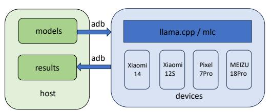
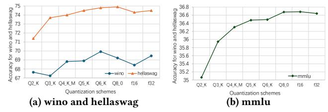
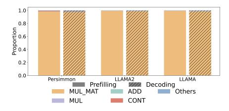
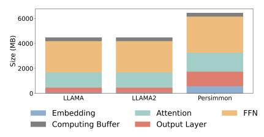
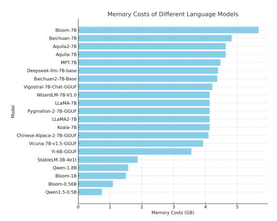
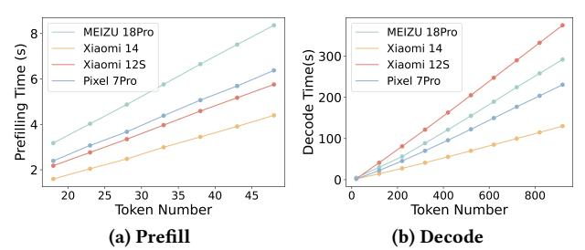
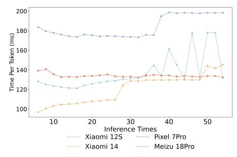
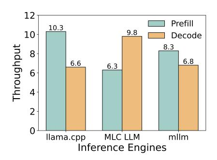
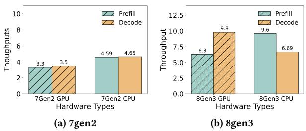

# Large Language Models on Mobile Devices: Measurements, Analysis, and Insights

Xiang Li†, Zhenyan Lu†, Dongqi Cai, Xiao Ma, Mengwei Xu Beijing University of Posts and Telecommunications (BUPT), China

# ABSTRACT

Deploying large language models (LLMs) inference into mobile devices is cost-efficient for companies, and well addresses the privacy concern of users. However, the limited computation capacity and memory constraints of mobile devices hinder their practical deployment. Prior work strives to expand model size for better accuracy performance, while there is a lack of systematic understanding of "small" sub-10 billion LLMs that are already feasible for current commodity devices. To better reveal the current landscape of LLMs on mobile devices, we conducted a comprehensive measurement study, deploying 22 models across 4 mobile devices. Our measurements focus on accuracy, inference latency, and memory footprint across various input lengths, devices, and execution engines. The observations from the measurements point us toward promising directions for efficient LLM deployment on mobile devices.

# CCS CONCEPTS

• Computing methodologies → Machine learning.

# KEYWORDS

Large Language Model, Mobile Devices, Measurement Study

#### ACM Reference Format:

Xiang Li†, Zhenyan Lu†, Dongqi Cai, Xiao Ma, Mengwei Xu. 2024. Large Language Models on Mobile Devices: Measurements, Analysis, and Insights. In Workshop on Edge and Mobile Foundation Models (EdgeFM '24), June 3–7, 2024, Minato-ku, Tokyo, Japan. ACM, New York, NY, USA, [6](#page-5-0) pages. <https://doi.org/10.1145/3662006.3662059>

# 1 INTRODUCTION

Large language models (LLMs) have opened a new door for how machine learning techniques can better facilitate humans in various aspects, empowering novel applications such as ChatGPT [\[45\]](#page-5-1) and intelligent personal agent [\[25\]](#page-5-2). These advancements come with increased hardware resource requirements due to growing model sizes [\[8,](#page-4-0) [37\]](#page-5-3). Contrary to the one-pass training cost, inference cost is ongoing post-service after the release of machine learning service, contributing to a significant portion of total cloud expenses [\[17\]](#page-4-1). For instance, from 2019 to 2021, Google's data center reported that 60% of electricity consumption is attributed to handling machine

†Xiang and Zhenyan contributed equally to this research.

Permission to make digital or hard copies of all or part of this work for personal or classroom use is granted without fee provided that copies are not made or distributed for profit or commercial advantage and that copies bear this notice and the full citation on the first page. Copyrights for components of this work owned by others than the author(s) must be honored. Abstracting with credit is permitted. To copy otherwise, or republish, to post on servers or to redistribute to lists, requires prior specific permission and/or a fee. Request permissions from permissions@acm.org.

EdgeFM '24, June 3–7, 2024, Minato-ku, Tokyo, Japan

© 2024 Copyright held by the owner/author(s). Publication rights licensed to ACM. ACM ISBN 979-8-4007-0663-9/24/06

<https://doi.org/10.1145/3662006.3662059>

learning inference requests [\[29\]](#page-5-4). Besides the extremely high resource cost, privacy concerns pose another critical challenge for cloud-based LLMs inferences [\[31\]](#page-5-5). Utilizing complex encryption will further exaggerate the cloud inference workloads [\[14,](#page-4-2) [22\]](#page-4-3). Conducting inference directly on edge devices can significantly reduce the cost of cloud services and fundamentally solve the privacy concern, as the user's data do not need to be sent to the cloud for processing [\[43\]](#page-5-6).

However, due to insufficient computing capacity and memory budgets, most mobile devices could not complete the concise inference operations at the desired speed [\[39\]](#page-5-7). A feasible solution is using smaller LLM versions or model quantization. While being smallsized (<10B) compared to the state-of-the-art LLMs, such "tiny" language models have demonstrated remarkable performance to solve most common sense questions and mobile-specific tasks [\[4,](#page-4-4) [41\]](#page-5-8). After quantization [\[27,](#page-5-9) [38\]](#page-5-10), these models can be fully loaded to mobile memory for execution. Though the light-weight LLMs have been theoretically and algorithmic researched [\[40,](#page-5-11) [42\]](#page-5-12), there is no systematic understanding of their performance on current commodity mobile devices.

For the first time, we conduct a comprehensive measurement of LLM inference on mobile devices. We first build a full-fledged benchmark suite based on llama.cpp [\[21\]](#page-4-5), the most popular inference engine for LLMs on mobile devices. The benchmark includes 22 models ranging from 0.5B to 7B and reports on all-sided inference performance including accuracy under various quantization methods, latency and their breakdown, memory footprint, and the impact of different input lengths. Our experiments span four distinct mobile devices to explore the influence of System-on-Chips (SoC) evolution on inference performance. Additionally, we compare three different inference engines to analyze their strengths and weaknesses.

Our experimental results shed light on future optimizations to efficiently deploy LLMs on mobile devices. For example, we discover that the DVFS mechanism has a significant impact on the performance of LLM inference on mobile devices. In addition, we observe that memory usage remains constant across different input lengths due to the naive memory allocation strategy of LLM engines, which can be improved by allocating memory dynamically. From the perspective of hardware developers, we note that advancements in SoCs only enhance the prefill phase rather than the decode phase. Furthermore, we find that current mobile inference engines gain minimal (or even negative) benefits from utilizing the GPU. The above findings open a huge space for future optimizations. The code and results are publicly available at:https://github.com/UbiquitousLearning/TinyLLMLeaderB oard.

Figure 1: Measurement toolkit.

### 2 PRELIMINARY KNOWLEDGE

#### 2.1 LLM Inference Workflow

Most LLMs are derived from the Transformer architecture proposed in 2017 [36]. Their inference is divided into two phases: prefilling and decoding [9]. During the prefill phase, the input prompt is processed to generate a key-value cache (KV-Cache), where multiple tokens in the prompt can be computed in parallel. The decode phase, also known as the self-regressive phase, generates one token at a time, incorporating it to the KV-Cache. Simultaneously, this token is used in predicting the next token.

#### 2.2 LLM on Mobile Devices

To efficiently deploy LLMs on mobile devices, academia and industry paid attention to three aspects: model structure, inference engines, and hardware processors. In terms of model structure, many LLMs designed for mobile devices or quantified to a suitable size have been released, such as LLaMA 7B, and Gemma 2B [20, 33]. Regarding inference engines, llama.cpp, MLC, and mllm are notable to make better use of mobile hardware and reduce latency [21, 28, 32]. llama.cpp, the earliest inference engine capable of executing on local devices, supports CPU and GPU on Android devices. MLC-LLM, with TVM as its backend, facilitates GPU on both Android and iOS devices. mllm, designed specifically for mobile devices, supports CPU and NPU on Android devices. In the domain of hardware processors, SoCs specifically tailored for LLM are created. For instance, the recently released Qualcomm's Snapdragon 8gen3 achieves LLM inference speeds of 20 tokens per second [30]. Phones equipped with 8gen3 SoC, such as Xiaomi 14 and Google Pixel, have already been capable of performing real-time LLM inference locally [7, 28].

#### 3 MEASUREMENTS

We conduct all-side LLM inference measurements on commercial mobile devices. First, we detail the benchmark settings, i.e. the workflow we build, the models, devices and metrics we measure. Subsequently, we analyze the performance of the models in terms of accuracy, latency, and memory footprint. We also explore the effects of different factors, such as the prompt and token length, the SoC generation, and the choice of inference engine.

#### 3.1 Implementation and setup

We develop a benchmark framework for evaluating large models on mobile devices as Figure 1 shows. A server acts as a host storing model parameters and test results. This framework involves a server that stores model parameters and test results, with multiple mobile phones functioning as the devices executing tests. Model parameters are downloaded to the server, and the inference engine is deployed to each device. The testing process is as follows: model

| Device Name | Specifications             | Release Time |
|-------------|----------------------------|--------------|
| Xiaomi 14   | Snapdragon 8Gen3, 16G RAM  | Oct. 2023    |
| Pixel 7Pro  | GoogleTensor G2,12G RAM    | Oct. 2022    |
| Xiaomi 12S  | Snapdragon 8Gen1+ ,12G RAM | Jul. 2022    |
| MEIZU 18Pro | Snapdragon 888,8G RAM      | Mar. 2021    |

Table 1: Testing devices.

parameters on the host are transferred from the server to the device. The inference framework deployed on the device is started with specified inference parameters for testing. The test results are sent back to the server. All interactions between the host and devices are facilitated through adb.

| Model Name            | Variants | Model Name                  | Variants           |
|-----------------------|----------|-----------------------------|--------------------|
| LLaMA [33]            | 7B       | Falcon [11]                 | 7B                 |
| LLaMA 2 [34]          | 7B       | Chinese LLaMA / Alpaca [15] | 7B                 |
| Vigogne (French) [24] | 7B       | Vicuna [4]                  | 7B                 |
| Koala [2]             | 7B       | Pygmalion/Metharme [3]      | 7B                 |
| WizardLM [5]          | 7B       | Baichuan [1]                | 7B                 |
| Baichuan 2 [1]        | 7B       | Persimmon [19]              | 8B                 |
| MPT [16]              | 7B       | Bloom [13]                  | 7B, 0.5B, 1.1B     |
| Yi models [10]        | 1.6B     | StableLM-3b-4e1t [35]       | 3B                 |
| Deepseek LLM [18]     | 7B       | Qwen 1.5 [12]               | 0.5B, 1.8B, 4B, 7B |
| Qwen [12]             | 1.8B,7B  |                             |                    |

**Table 2: Model Specifications** 

Table 1 describes devices used in our measurement. We used four smartphones with different SoCs and tested the results of CPU and GPU respectively. In subsequent performance analysis, we compared not only different generations of SoCs but also CPU and GPU.

Table 2 shows the models we measured. Our measurements cover 18 different models, including those designed for English and Chinese, as well as models optimized for specific dialogue scenarios. The parameter size of these models varies from 1.3B to 7B, and we have statistically analyzed their memory size. At the same time, we also analyzed their latency and the computation time required for each operator.

The default inference engine is llama.cpp [21]. We set a standard prompt length of 3 and a token generation length of 50 unless specified otherwise. Tests are conducted at 10-second intervals to mitigate potential thermal throttling issues.

#### 3.2 Inference Performance

As illustrated in Figure 2, we evaluate the accuracy and latency of 18 models after 4-bit quantization on four different smartphones. We calculate accuracy as the average across three datasets in Table 3 and latency as the average across the four smartphones. The accuracy for most models hovers between 55-60%, with latency around 200ms per token. Smaller-scale models exhibit lower latency, and in most

| Dataset        | Size | Description                                 |
|----------------|------|---------------------------------------------|
| Winogrande [6] | 44k  | Pronoun resolution problems based on Wino-  |
|                |      | grad Schema Challenge.                      |
| HellaSwag [44] | 70k  | Given an event description and a machine    |
|                |      | must select the most likely followup.       |
| MMLU [23]      | 116k | Choice questions used to examine the knowl- |
|                |      | edge learned by the model.                  |

Table 3: Benchmark Datasets

Figure 2: Accuracy and Latency of Models with different size

Figure 3: Accuracy of LLaMA 2 with Different Quantization Schemes. Qn\_K (and Qn\_K\_M) represents the quantization of a model to n bits using a medium (M) number of parameters with the k-quants method. Qn\_0 denotes the symmetric quantization of a model to n bits.

cases, also demonstrate lower accuracy. For example, Bloom 0.5B is 10.5 × faster than Bloom 7B, but the accuracy is 1.37% lower. Notable exceptions are QWen 1.8B and StableLM 3B, they outperform some larger-scale models in accuracy, with StableLM's accuracy even exceeding that of most 7B models. These findings suggest that a model's accuracy is influenced not only by the scale of the model but also by the optimization of the model itself.

In our study on model quantization, we examine 8 quantization bit-width on LLaMA 2 to investigate their impact on model accuracy across three distinct datasets. The quantization schemes ranged from aggressive quantization strategies that significantly reduced the model size (Q2\_K) to more conservative approaches that aimed to retain as much of the original model performance as possible (f16). As illustrated in Figure [3,](#page-2-1) a reduction in model size after quantization is inversely correlated with model accuracy. Among the quantization methods, the 4-bit approach emerges as the optimal compromise between model size and accuracy, resulting in a mere 0.6% average accuracy loss while achieving an 8× reduction in model size. In contrast, the 2-bit quantization compared to 4-bit method offers a further 2× reduction in size but incurs a 4× increase in accuracy loss.

# 3.3 Inference Latency Breakdown

Now we break the total execution time down to understand the components contributing to latency from the perspective of model structure and operators. As shown in Figure [4a,](#page-3-0) LLMs typically consist of five layers: embedding layer, RMSNorm layer, attention layer, Feed-Forward Network(FFN) layer, and output layer. For LLaMA and LLaMA 2, attention layer and FFN layer occupy almost all the time, accounting for 30% and 60% of total time respectively. Output layer consumes about 5% of the time, while the time taken by the other layers is negligible.

The primary reason is that matrix multiplication(mmul) operations consume the majority of the execution time so the number and size of mmul operations decide time cost by each layer as shown in Figure [4b.](#page-3-0) LLaMA, for example, features 32 transformer blocks with extensive mmul operations in attention computations and the FFN layer, where the number of operations is similar but the matrix size is 2.67 times larger than in attention computations, leading the FFN layer to require twice the time of the attention layer.

For Persimmon, execution time primarily involves the attention, FFN, and output layers. The attention layer's time decreases with smaller mmul matrix sizes, whereas the output layer's time increases. Additionally, decode phase takes more time in output layer than prefill phase because decoding is executed auto-regressively.

# 3.4 Memory Footprint and Breakdown

The evaluation of memory footprint is in Figure [5.](#page-3-1) Most models have 7B parameters and the memory footprint is about 4GB. For modern mobile devices, it will take half or one-third of memory on the fly. A detailed breakdown analysis reveals the memory footprint distribution across different layers.

In Figure [4c,](#page-3-0) computing buffer refers to the intermediate variables at runtime, including KV cache and computing tensors. The computing buffer size is related to the dimension of token embedding, the number of layers and the max sequence of context. For LLaMA, LLaMA 2 and Permission, the computing buffer size amounts to 342.5MB. The remaining memory footprint is attributed to the weights of each layer of the model, which are loaded into memory from the disk during initialization. The three layers that occupy the most proportion are the same as those that take up 90% of time, namely FFN, Attention, and output layer. Interestingly, as shown in Figure [5,](#page-3-1) we find that not all the models with the same size have the same memory footprint. For example, the memory footprint of Bloom-7B is 1.27 × larger than that of MPT-7B. This discrepancy underscores that identical model sizes do not necessarily equate to the same memory consumption, highlighting the efficiency differences in model architecture and optimization.

# 3.5 Impact of Input Length

During the prefill phase, the input prompt can be processed in parallel, while the token generation process in the decode phase is sequential. In this section, we will discuss the impact of the length of the prompt and the generated tokens on latency and memory usage.

The latency of the prefill and decode phase grows linearly with the prompt or token length. We test LLaMA using llama.cpp on four devices: Meizu 18Pro, Pixel 7Pro, Xiaomi 14, and Xiaomi 12S. As shown in Figure [6a,](#page-3-2) latency in the prefill phase is 1.5 times greater for a token length of 50 compared to 10. Interestingly, we find that continuous inference may sharply increase the temperature, which can have a significant impact on performance due to the power consumption control, such as Dynamic voltage and frequency scaling (DVFS) or thermal throttling. As shown in Figure [7,](#page-3-3) during continuous testing, all four devices exhibited performance fluctuations. Initially, Xiaomi 12S, Pixel 7

(a) Latency (b) Operations (c) Memory footprint Figure 4: Inference Breakdown

Figure 5: Memory Footprint Leaderboard

Figure 6: Latency under different token lengths.

Figure 7: Latency under different token lengths with power consumption fluctuation

Pro, and Meizu 18 Pro demonstrated performance improvements, likely due to the workload-aware DVFS [\[26\]](#page-5-21) increasing the CPU frequency and voltage. However, Xiaomi 12S, Xiaomi 14, and Meizu 18 Pro later experienced significant performance declines due to thermal throttling. However, this scenario does not occur in the

Figure 8: The comparison of Snapdragon Chipsets

decode phase in Figure [6b,](#page-3-2) as decoding's workload is insufficient to cause notable power consumption or temperature changes. Due to sequentially token generation, the time to generate 1000 tokens is about 10 × that of generating 100 tokens.

Memory usage does not change with different prompt or token lengths. There is no significant variation in memory usage through different inference processes according to our experiments. The memory usage of Baichuan remains at 4.83GB during runtime when the prompt length increases from 10 to 50, or the length of generated tokens increases from 1 to 1000. The same phenomenon also occurs on LLaMA-7B. This consistency in memory usage could be traced back to the memory allocation strategy. In the existing inference framework, memory is allocated once as a large pool at the initialization stage. However, the actual memory required for inference varies at different stages. As introduced in the [§2,](#page-1-4) the memory demand during the decode phase is smaller than that during the prefill phase. This emphasizes the significance of implementing dynamic memory allocation in the inference framework to more efficiently manage memory resources according to varying demands.

# 3.6 Impact of Different SoCs

The development of System on a Chip (SoC) generations effectively improves inference efficiency. In Figure [8,](#page-3-4) we compare the inference efficiency of LLaMA 2 across four Snapdragon SoCs: Snapdragon 7Gen2, Snapdragon 888, Snapdragon 8Gen1+, and Snapdragon 8Gen3. The Snapdragon 8 Series represents the high-end SoC and serves as Qualcomm's current flagship, while the Snapdragon 7Gen2 is positioned towards the mid-range level. Therefore, Snapdragon 7Gen2 infers slower than other SoCs, despite being produced after Snapdragon 8Gen1+. Snapdragon 7Gen2 has a similar throughput of 4.69 tokens per ms as Snapdragon 888 and even prefills slower 1.24× than Snapdragon 888. For the Snapdragon

Figure 9: The comparison of different inference engines

Figure 10: The comparison of GPU and CPU

8 Series, the number of prompts processed per second increases with each SoC generation. Compared to the Snapdragon 888, the Snapdragon 8Gen3 and Snapdragon 8Gen1+ have improved the prefilling throughput by 81% and 45% respectively. However, the efficiency gains in the decode phase for the Snapdragon 8Gen3 and Snapdragon 8Gen1+ are less marked, improving by only 43% and 34%, respectively. The performance difference between the Snapdragon 8Gen3 and Snapdragon 8Gen1+ is relatively minor, at 7%.

# 3.7 Impact of Different Inference Engines

We further explore the impact of inference engines on inference efficiency in Figure [9.](#page-4-24) For llama.cpp and mllm, we test them with LLaMA 2 on CPU. Considering that MLC does not support CPU currently, we test it on GPU instead. For prefill phase, llama.cpp displayed superior optimization, achieving performance 1.63 × faster than MLC. This result goes against the common sense that GPUs possess superior parallel computing capabilities, which is precisely what the prefill stage requires. The findings also suggest that MLC may not be harnessing the full potential of GPU performance in this aspect. Thus, we conduct a more detailed analysis between GPU and CPU to find the reason.

The improvement of inference efficiency on GPU is not significant compared to CPU. In Figure [10,](#page-4-25) there are different generations of CPUs and GPUs. The GPU of 8Gen3 generates more tokens per second in the decode phase than the CPU of 8Gen3. However, in other cases, the performance of the CPU is better than that of the GPU. This may be due to the fact that GPUs on mobile devices were originally not designed for general-purpose computing, but for rendering computations. On the other hand, it introduces extra data transfer costs.

# 4 CONCLUSIONS AND FUTURE WORK

In this work, we conducted a comprehensive measurement study of LLM inference on mobile devices. We developed a benchmark suite for LLMs with sizes ranging from 0.5B to 7B parameters and measured the accuracy, latency, and memory footprint of 22 models on four different mobile devices. Our measurements provide insights into the current landscape of LLMs on mobile devices and guide us to several promising directions toward efficient LLM deployment on mobile devices. For example, potential energy consumption issues and the optimization of different processing units might be essential to make mobile LLM feasible and ubiquitous.

# REFERENCES

- [1] [n. d.]. Baichuan Models. [https://huggingface.co/baichuan-inc.](https://huggingface.co/baichuan-inc)
- [2] [n. d.]. Koala: A Dialogue Model for Academic Research. [https://bair.berkeley.](https://bair.berkeley.edu/blog/2023/04/03/koala/) [edu/blog/2023/04/03/koala/.](https://bair.berkeley.edu/blog/2023/04/03/koala/)
- [3] [n. d.]. Pygmalion/Metharme 7B Model. [https://huggingface.co/PygmalionAI/](https://huggingface.co/PygmalionAI/pygmalion-7b) [pygmalion-7b.](https://huggingface.co/PygmalionAI/pygmalion-7b)
- [4] [n. d.]. Vicuna: An Open-Source Chatbot Impressing GPT-4 with 90% ChatGPT Quality. [https://lmsys.org/blog/2023-03-30-vicuna/.](https://lmsys.org/blog/2023-03-30-vicuna/)
- [5] [n. d.]. WizardLM Model. [https://github.com/nlpxucan/WizardLM.](https://github.com/nlpxucan/WizardLM)
- [6] 2019. WinoGrande: An Adversarial Winograd Schema Challenge at Scale.
- [7] n.d.. Android AICore. urlhttps://developer.android.com/ml/aicore. Accessed: 2024-04-06.
- [8] Armen Aghajanyan, Lili Yu, Alexis Conneau, Wei-Ning Hsu, Karen Hambardzumyan, et al. 2023. Scaling Laws for Generative Mixed-Modal Language Models. arXiv[:2301.03728](https://arxiv.org/abs/2301.03728) [cs.CL]
- [9] Amey Agrawal, Ashish Panwar, Jayashree Mohan, Nipun Kwatra, Bhargav S. Gulavani, et al. 2023. SARATHI: Efficient LLM Inference by Piggybacking Decodes with Chunked Prefills. arXiv[:2308.16369](https://arxiv.org/abs/2308.16369) [cs.LG]
- [10] 01. AI, :, Alex Young, Bei Chen, Chao Li, et al. 2024. Yi: Open Foundation Models by 01.AI. arXiv[:2403.04652](https://arxiv.org/abs/2403.04652) [cs.CL]
- [11] Ebtesam Almazrouei, Hamza Alobeidli, Abdulaziz Alshamsi, Alessandro Cappelli, Ruxandra Cojocaru, et al. 2023. Falcon-40B: an open large language model with state-of-the-art performance. (2023).
- [12] Jinze Bai, Shuai Bai, Yunfei Chu, Zeyu Cui, Kai Dang, et al. 2023. Qwen Technical Report. arXiv preprint arXiv:2309.16609 (2023).
- [13] BigScience and Hugging Face. 2022. Introducing The World's Largest Open Multilingual Language Model: BLOOM. urlhttps://bigscience.huggingface.co/blog/bloom. Accessed: 2024-04-07.
- [14] Tianyu Chen, Hangbo Bao, Shaohan Huang, Li Dong, Binxing Jiao, et al. 2022. The-x: Privacy-preserving transformer inference with homomorphic encryption. arXiv preprint arXiv:2206.00216 (2022).
- [15] Yiming Cui, Ziqing Yang, and Xin Yao. 2023. Efficient and Effective Text Encoding for Chinese LLaMA and Alpaca. arXiv preprint arXiv:2304.08177 (2023). [https:](https://arxiv.org/abs/2304.08177) [//arxiv.org/abs/2304.08177](https://arxiv.org/abs/2304.08177)
- [16] Databricks. 2023. Introducing MPT-7B: A New Standard for Open-Source, Commercially Usable LLMs. urlhttps://www.databricks.com/blog/mpt-7b. Accessed: 2024-04-06.
- [17] Alex de Vries. 2023. The growing energy footprint of artificial intelligence. Joule 7, 10 (2023), 2191–2194.
- [18] DeepSeek-AI, :, Xiao Bi, Deli Chen, Guanting Chen, et al. 2024. DeepSeek LLM: Scaling Open-Source Language Models with Longtermism. arXiv[:2401.02954](https://arxiv.org/abs/2401.02954) [cs.CL]
- [19] Erich Elsen, Augustus Odena, Maxwell Nye, Sağnak Taşırlar, Tri Dao, et al. 2023. Releasing Persimmon-8B.<https://www.adept.ai/blog/persimmon-8b>
- [20] Thomas Mesnard Gemma Team, Cassidy Hardin, Robert Dadashi, Surya Bhupatiraju, Laurent Sifre, et al. 2024. Gemma. (2024). [https://doi.org/10.34740/](https://doi.org/10.34740/KAGGLE/M/3301) [KAGGLE/M/3301](https://doi.org/10.34740/KAGGLE/M/3301)
- [21] Georgi Gerganov. 2023. llama.cpp. urlhttps://github.com/ggerganov/llama.cpp.
- [22] Ran Gilad-Bachrach, Nathan Dowlin, Kim Laine, Kristin Lauter, Michael Naehrig, et al. 2016. CryptoNets: Applying Neural Networks to Encrypted Data with High Throughput and Accuracy. In Proceedings of The 33rd International Conference on Machine Learning (Proceedings of Machine Learning Research, Vol. 48), Maria Florina Balcan and Kilian Q. Weinberger (Eds.). PMLR, New York, New York, USA, 201–210.<https://proceedings.mlr.press/v48/gilad-bachrach16.html>
- [23] Dan Hendrycks, Collin Burns, Steven Basart, Andy Zou, Mantas Mazeika, et al. 2021. Measuring Massive Multitask Language Understanding. arXiv[:2009.03300](https://arxiv.org/abs/2009.03300) [cs.CY]
- [24] Bofeng Huang. 2023. Vigogne: French Instruction-following and Chat Models. [https://github.com/bofenghuang/vigogne.](https://github.com/bofenghuang/vigogne)

- [25] Yuanchun Li, Hao Wen, Weijun Wang, Xiangyu Li, Yizhen Yuan, et al. 2024. Personal LLM Agents: Insights and Survey about the Capability, Efficiency and Security. arXiv preprint arXiv:2401.05459 (2024).
- [26] Chengdong Lin, Kun Wang, Zhenjiang Li, and Yu Pu. 2023. A Workload-Aware DVFS Robust to Concurrent Tasks for Mobile Devices. Association for Computing Machinery, New York, NY, USA.<https://doi.org/10.1145/3570361.3592524>
- [27] Ji Lin, Jiaming Tang, Haotian Tang, Shang Yang, Xingyu Dang, et al. 2023. AWQ: Activation-aware Weight Quantization for LLM Compression and Acceleration. arXiv[:2306.00978](https://arxiv.org/abs/2306.00978) [cs.CL]
- [28] mllm team. 2024. mllm.<https://github.com/UbiquitousLearning/mllm>
- [29] David Patterson, Joseph Gonzalez, Urs Hölzle, Quoc Le, Chen Liang, et al. 2022. The Carbon Footprint of Machine Learning Training Will Plateau, Then Shrink. Computer 55, 7 (2022), 18–28.<https://doi.org/10.1109/MC.2022.3148714>
- [30] Qualcomm Technologies, Inc. 2023. Snapdragon 8 Gen 3 Mobile Platform Product Brief. urlhttps://docs.qualcomm.com/bundle/publicresource/87-71408- 1\_REV\_C\_Snapdragon\_8\_gen\_3\_Mobile\_Platform\_Product\_Brief.pdf. Accessed: 2024-04-06.
- [31] Robin Staab, Mark Vero, Mislav Balunović, and Martin Vechev. 2023. Beyond memorization: Violating privacy via inference with large language models. arXiv preprint arXiv:2310.07298 (2023).
- [32] MLC team. 2023. MLC-LLM.<https://github.com/mlc-ai/mlc-llm>
- [33] Hugo Touvron, Thibaut Lavril, Gautier Izacard, Xavier Martinet, Marie-Anne Lachaux, et al. 2023. LLaMA: Open and Efficient Foundation Language Models. arXiv[:2302.13971](https://arxiv.org/abs/2302.13971) [cs.CL]
- [34] Hugo Touvron, Louis Martin, Kevin Stone, Peter Albert, Amjad Almahairi, et al. 2023. Llama 2: Open Foundation and Fine-Tuned Chat Models. arXiv[:2307.09288](https://arxiv.org/abs/2307.09288) [cs.CL]
- [35] Jonathan Tow, Marco Bellagente, Dakota Mahan, and Carlos Riquelme. [n. d.]. StableLM 3B 4E1T.<https://huggingface.co/stabilityai/stablelm-3b-4e1t>

- [36] Ashish Vaswani, Noam Shazeer, Niki Parmar, Jakob Uszkoreit, Llion Jones, et al. 2023. Attention Is All You Need. arXiv[:1706.03762](https://arxiv.org/abs/1706.03762) [cs.CL]
- [37] Jason Wei, Yi Tay, Rishi Bommasani, Colin Raffel, Barret Zoph, et al. 2022. Emergent Abilities of Large Language Models. arXiv[:2206.07682](https://arxiv.org/abs/2206.07682) [cs.CL]
- [38] Guangxuan Xiao, Ji Lin, Mickael Seznec, Hao Wu, Julien Demouth, et al. 2023. SmoothQuant: Accurate and Efficient Post-Training Quantization for Large Language Models. In Proceedings of the 40th International Conference on Machine Learning (Proceedings of Machine Learning Research, Vol. 202), Andreas Krause, Emma Brunskill, Kyunghyun Cho, Barbara Engelhardt, Sivan Sabato, and Jonathan Scarlett (Eds.). PMLR, 38087–38099. [https://proceedings.mlr.press/](https://proceedings.mlr.press/v202/xiao23c.html) [v202/xiao23c.html](https://proceedings.mlr.press/v202/xiao23c.html)
- [39] Daliang Xu, Wangsong Yin, Xin Jin, Ying Zhang, Shiyun Wei, et al. 2023. Llmcad: Fast and scalable on-device large language model inference. arXiv preprint arXiv:2309.04255 (2023).
- [40] Mengwei Xu, Wangsong Yin, Dongqi Cai, Rongjie Yi, Daliang Xu, et al. 2024. A survey of resource-efficient llm and multimodal foundation models. arXiv preprint arXiv:2401.08092 (2024).
- [41] Aiyuan Yang, Bin Xiao, Bingning Wang, Borong Zhang, Ce Bian, et al. 2023. Baichuan 2: Open Large-scale Language Models. arXiv[:2309.10305](https://arxiv.org/abs/2309.10305) [cs.CL]
- [42] Wangsong Yin, Mengwei Xu, Yuanchun Li, and Xuanzhe Liu. 2024. LLM as a System Service on Mobile Devices. arXiv preprint arXiv:2403.11805 (2024).
- [43] Jinliang Yuan, Chen Yang, Dongqi Cai, Shihe Wang, Xin Yuan, et al. 2024. Mobile Foundation Model as Firmware. (2024).
- [44] Rowan Zellers, Ari Holtzman, Yonatan Bisk, Ali Farhadi, and Yejin Choi. 2019. HellaSwag: Can a Machine Really Finish Your Sentence?. In Proceedings of the 57th Annual Meeting of the Association for Computational Linguistics.
- [45] Zejun Zhang, Li Zhang, Xin Yuan, Anlan Zhang, Mengwei Xu, et al. 2024. A First Look at GPT Apps: Landscape and Vulnerability. arXiv preprint arXiv:2402.15105 (2024).