# Ripple: Accelerating LLM Inference on Smartphones with Correlation-Aware Neuron Management

Tuowei Wang<sup>∗</sup> Tsinghua University Beijing, China

Zixu Hao Tsinghua University Beijing, China

Youyou Lu Tsinghua University Beijing, China

Ruwen Fan<sup>∗</sup> Tsinghua University Beijing, China

Kun Li Microsoft Research Beijing, China

Yaoxue Zhang Tsinghua University Beijing, China

Minxing Huang Tianjin University Tianjin, China

Ting Cao Microsoft Research Beijing, China

Ju Ren† Tsinghua University Beijing, China

# Abstract

Large Language Models (LLMs) have achieved remarkable success across various domains, yet deploying them on mobile devices remains an arduous challenge due to their extensive computational and memory demands. While lightweight LLMs have been developed to fit mobile environments, they suffer from degraded model accuracy. In contrast, sparsitybased techniques minimize DRAM usage by selectively transferring only relevant neurons to DRAM while retaining the full model in external storage, such as flash. However, such approaches are critically limited by numerous I/O operations, particularly on smartphones with severe IOPS constraints.

In this paper, we propose Ripple, a novel approach that accelerates LLM inference on smartphones by optimizing neuron placement in flash memory. Ripple leverages the concept of Neuron Co-Activation, where neurons frequently activated together are linked to facilitate continuous read access and optimize data transfer efficiency. Our approach incorporates a two-stage solution: an offline stage that reorganizes neuron placement based on co-activation patterns, and an online stage that employs tailored data access and caching strategies to align well with hardware characteristics. Evaluations conducted on a variety of smartphones and LLMs demonstrate that Ripple achieves up to 5.93× improvements in I/O latency compared to the state-of-the-art. As the first solution to optimize storage placement under sparsity, Ripple explores a new optimization space at the intersection of sparsity-driven algorithm and storage-level system co-design in LLM inference.

# 1 Introduction

Large Language Models (LLMs) have demonstrated exceptional performance across a wide range of applications [\[15,](#page-11-0) [30,](#page-12-0) [44,](#page-12-1) [45,](#page-12-2) [52,](#page-12-3) [64\]](#page-12-4). Comprising millions or even billions of parameters [\[5,](#page-11-1) [8,](#page-11-2) [14,](#page-11-3) [28,](#page-12-5) [54,](#page-12-6) [56,](#page-12-7) [76\]](#page-13-0), these models demand

substantial computational and memory resources, typically available only in state-of-the-art data centers. Nonetheless, there is an increasing demand for deploying LLMs on resourceconstrained devices, such as smartphones [\[33,](#page-12-8) [55,](#page-12-9) [61,](#page-12-10) [62,](#page-12-11) [71,](#page-13-1) [74\]](#page-13-2). On one hand, stringent privacy regulations necessitate local data processing to protect user information. On the other hand, LLMs on smartphones facilitate customization based on user habits, enabling enhanced personalization.

Given the limited DRAM capacity of devices, LLMs on smartphones are typically constrained to models specially designed for mobile deployment [\[1,](#page-11-4) [54,](#page-12-6) [72\]](#page-13-3). Although these models are lightweight, the reduction in parameters inevitably leads to a compromise in their capabilities [\[29\]](#page-12-12). As an alternative, many recent works [\[4,](#page-11-5) [37,](#page-12-13) [40,](#page-12-14) [50,](#page-12-15) [69,](#page-13-4) [81\]](#page-13-5) explore the exploitation of inherent sparsity within LLMs to address memory limitations. Specially, rather than pruning model parameters, these methods selectively activate a subset of model parameters based on the input while maintaining the original performance. By transferring only the activated parameters to DRAM for computation, larger and more powerful LLMs can be stored in external flash memory, effectively surpassing DRAM limitations of smartphones.

However, the efficiency of this LLM inference paradigm is significantly hindered by I/O overheads. Since different inference requests generally activate distinct sets of model parameters, frequent I/O operations are generated to swap parameters between DRAM and flash memory. As shown in

<span id="page-0-0"></span>Table 1. Breakdown of average inference latency per token when offloading 50% model parameters to flash memory.

| Model      | Compute | Load     | Total    | Load Ratio |
|------------|---------|----------|----------|------------|
| OPT-350M   | 34 ms   | 87 ms    | 121 ms   | 71.9%      |
| OPT-1.3B   | 84 ms   | 273 ms   | 357 ms   | 76.5%      |
| OPT-6.7B   | 387 ms  | 1883 ms  | 2270 ms  | 82.9%      |
| Llama2-7B  | 450 ms  | 10982 ms | 11432 ms | 96.1%      |
| Mistral-7B | 355 ms  | 15126 ms | 15481 ms | 97.7%      |

<sup>∗</sup>Both authors contributed equally to this research.

<sup>†</sup>Corresponding author: Ju Ren [\(renju@tsinghua.edu.cn\)](mailto:renju@tsinghua.edu.cn.com).

<span id="page-1-0"></span>

Figure 1. Bandwidth utilization on smartphones is heavily constrained by IOPS. Ripple alleviates this bottleneck and boosts bandwidth with neuron co-activation linking.

Table [1,](#page-0-0) even when only half of the model parameters reside in flash memory, 71.9%-97.7% of the inference latency arises from I/O operations. More critically, the scattered activation of model parameters induces numerous small-grained read accesses, limiting transfer efficiency due to constraints in Input/Output Operations Per Second (IOPS) [\[38\]](#page-12-16). As depicted in Figure [1,](#page-1-0) this IOPS bottleneck severely restricts on-device bandwidth utilization across various LLMs.

Building on these insights, this paper proposes Ripple, a novel approach to accelerating LLM inference on smartphones through I/O optimizations. While previous works [\[37,](#page-12-13) [50\]](#page-12-15) primarily focus on computation efficiency under activation sparsity, they tend to exacerbate the existing I/O overhead bottlenecks. Fewer studies [\[4,](#page-11-5) [69\]](#page-13-4) explore mitigating I/O overhead through enhanced caching strategies to minimize data loading. However, without directly improving bandwidth utilization, overall efficiency remains suboptimal. Orthogonal to these methods, Ripple addresses the primary bottleneck in LLM inference by maximizing bandwidth utilization via the effective reduction of I/O operations.

The design of Ripple is rooted in Neuron Co-Activation, a property prevalent in activation sparsity yet underexplored in current works. Specially, neurons in LLMs exhibit strong correlations in their activation patterns. When processing real-world datasets, the activation of an individual neuron is consistently linked to the activation of a stable group of others. Given the efficiency of continuous reads, which enable the retrieval of larger data blocks with a single request, Ripple introduces a key insight: Why not establish links between neurons that are frequently co-activated in flash memory, facilitating continuous read access to reduce IOPS?

However, this is not a low-hanging fruit, as both neuron co-activation patterns and storage hardware characteristics exhibit inherent complexity, complicating their effective alignment. Our comprehensive analysis identifies that three critical technical challenges must be tackled:

- (1) Extensive Search Space. The vast number of neurons in LLMs leads to an exponentially large space of possible neuron linking combinations. Identifying the optimized neuron linking that maximizes global benefits is exceedingly difficult and infeasible through brute-force enumeration alone.
- (2) Random Activation Variation. Owing to varying model inputs, the activation of model parameters exhibits intrinsic randomness. Although optimized placement strategies can spatially co-locate activated neurons, access to these neurons remains hindered by discontinuities caused by randomness. (3) Misaligned Cache Strategy. Storing frequently acti-
- vated neurons in memory is critical for minimizing transfer workload. However, storing neurons individually leads to fragmentation in their placement within flash memory, potentially disrupting continuous access.

To this end, Ripple employs a two-stage solution that performs hierarchical optimizations both offline and online. (1) In the Offline Phase, Ripple clusters neurons exhibiting high co-activation correlation and reorganizes their placement in flash memory. To address Challenge (1), we abstract the problem into a complete graph, reformulating it as the discovery of the globally optimal Hamiltonian Path. By leveraging graph-theoretic techniques, we propose a greedy algorithm that efficiently searches for optimized placement based on observed neuron co-activation patterns.

(2) In the Online Phase, Ripple performs fine-grained refinements based on optimized neuron placement, further enhancing access continuity. To tackle Challenge (2), we devise an IOPS-friendly access collapse technique. By strategically incorporating additional neurons between two separate neuron links, we improve read access continuity with negligible overhead. In response to Challenge (3), we design a linking-aligned in-memory caching policy. Rather than individually caching the hottest neurons, we account for their interlinking relationships, ensuring efficient access patterns.

We evaluate Ripple on three smartphones with distinct hardware configurations, benchmarking a diverse range of LLMs varying in structures and scales. The results demonstrate that Ripple significantly boosts on-device bandwidth, achieving improvements of up to 4.32×. Moreover, this bandwidth optimization yields substantial reductions in I/O latency during inference, offering speedups of up to 5.93× when compared to state-of-the-art solutions.

To the best of our knowledge, Ripple is the first to accelerate LLM inference on smartphones by enhancing I/O bandwidth through optimized neuron placement in flash memory. Ripple effectively bridges the performance gap between flash memory and DRAM, enabling LLM inference to exceed DRAM limitations on smartphones. Our contributions can be summarized as follows:

• We identify the primary bottleneck in LLM inference on smartphones as IOPS, attributing it to the inherent

<span id="page-2-0"></span>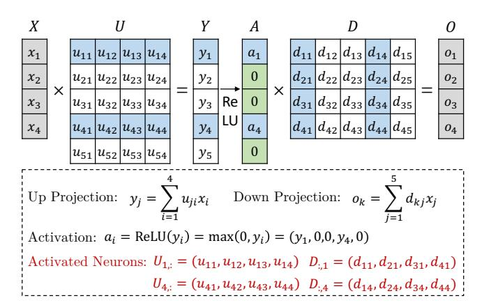

**Figure 2.** Activation sparsity introduced by ReLU. All non-activated (uncolored) model parameters can be excluded from computation without impacting the model outputs.

misalignment between scattered activation patterns and storage hardware characteristics.

- We notably exploit neuron co-activation to mitigate the IOPS bottleneck, pioneering the optimization of neuron placement in flash memory for enhancing bandwidth efficiency on smartphones.
- We conduct extensive evaluations on various representative LLMs and hardware, achieving substantial improvements over state-of-the-art solutions.

## 2 Background and Motivation

## 2.1 Activation Sparsity in LLM Inference

Numerous studies [34, 41, 49, 51, 77] have shown that LLMs exhibit considerable *Activation Sparsity*, allowing a substantial portion of activations can be disregarded without impacting the final outputs. This characteristic greatly reduces resource consumption, as only a subset of parameters participates in the computation. Importantly, since no parameters are pruned, the full capacity of the LLMs remains intact.

Although prevalent across transformer-based LLMs [37, 59], this activation sparsity is particularly pronounced when the ReLU-family [2, 47, 78] functions are employed. As depicted in Figure 2, the ReLU function zeros out all negative values in activations A, leading to the exclusion of the corresponding neurons (e.g., rows of the up-projection matrix U and columns of the down-projection matrix D) from the computation without any loss. Consequently, recent research efforts [41, 49–51, 69] explore replacing activation functions with ReLU across popular LLMs, achieving high sparsity while maintaining comparable model performance.

Compared to data centers, this property becomes even more critical when deploying LLMs on resource-constrained devices like smartphones. On one hand, smartphones typically offer limited DRAM capacity, ranging from 10GB to 20GB. On the other hand, a substantial portion of this DRAM

<span id="page-2-1"></span>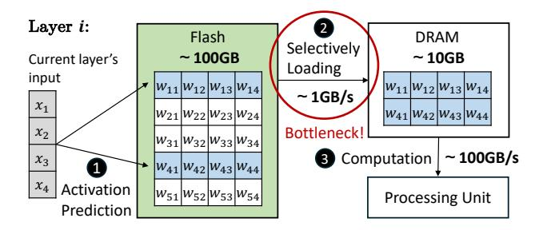

**Figure 3.** A three-step procedure for deploying LLMs on smartphones while leveraging activation sparsity. Instead of memory limitations, the communication between external storage and memory becomes the new bottleneck.

is allocated by the operating system and other active applications, leaving even less available for any single application. In contrast, merely storing an LLM with 7 billion parameters in half precision requires at least 14GB of DRAM.

Figure 3 presents a typical procedure for deploying LLMs on smartphones with activation sparsity [4, 69]. Rather than relying solely on limited DRAM, larger flash memory can be used to store model parameters. The process begins by effectively predicting the activated neurons using a neural-network-based predictor. Next, the activated neurons are selectively loaded into DRAM for final computation. This approach enables the execution of models that surpass the available DRAM size. However, the I/O bandwidth between flash memory and DRAM emerges as the new bottleneck.

### 2.2 Universal Flash Storage on Smartphones

Mobile devices, such as smartphones, predominantly utilize Universal Flash Storage (UFS) [27] as the storage protocol. By leveraging NAND flash, UFS offers significantly larger storage capacity than the space available in DRAM, with scalability reaching terabyte (TB) levels. Furthermore, the introduction of the command queue in UFS markedly improves the efficiency of data transfer between flash and DRAM. In the latest version (UFS 4.0), the sustained read speed per lane can reach up to 2.9 GB/s. This combination of extensive storage capacity and relatively high read speed forms the foundation for the execution of LLMs on mobile devices.

However, unlike server-side external storage (such as NVMe), UFS on smartphones typically features a shallow command queue, supporting only 32 entries. This limitation significantly restricts the IOPS for flash reads and can even hinder full utilization of the available bandwidth. As depicted in Figure 4, the read bandwidth increases with the continuous I/O sizes, since continuous reads can be issued by a single read operation. Specially, when the continuous I/O size is less than 24KB, the bandwidth scales almost linearly with the I/O size, indicating that these reads are primarily IOPS-bound. Consequently, the key to fully exploiting UFS bandwidth lies in maximizing the continuity of read accesses.

<span id="page-3-0"></span>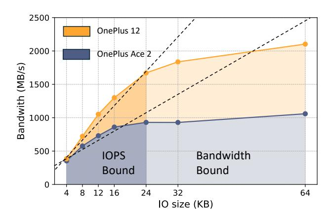

Figure 4. Bandwidth at varying continuous I/O sizes. The near-linear relationship indicates that the bottleneck lies in IOPS, rather than the bandwidth capacity.

#### 2.3 Analysis: IOPS as the Bottleneck

By storing the full model parameters in flash and selectively transferring only the activated parameters to DRAM for computation, mobile devices can accommodate larger and more powerful models while maintaining the resource demands of running smaller models. However, this approach is severely constrained by the data transfer overhead. As shown in Table [1,](#page-0-0) I/O operations between flash and DRAM account for the majority of the inference latency. Consequently, the efficiency of I/O operations emerges as the pivotal determinant of the smooth execution of this process.

The root cause of this I/O overhead lies in the dynamic nature of activation sparsity, where the specific subset of neurons that is activated changes with the inputs. As a result, each inference request necessitates loading a unique set of neurons from flash into DRAM, leading to considerable data transfer overhead. More critically, overlapping these data transfers with computation proves challenging, as the prediction of activated neurons is contingent on the inputs from the current or adjacent layers. The amount of computation available is insufficient to hide the substantial I/O latency.

To address this, prior work predominantly seeks to mitigate the volume of data loaded through optimized data management techniques. However, due to the minimal overlap in activated neurons across different inference requests, the efficiency remains suboptimal. Our findings reveal that the bottleneck in I/O operations stems not from the volume of data transferred but from the low effective bandwidth utilization. We evaluate the inference latency of OPT-350M with different activation sparsity ratios, as depicted in Figure [5.](#page-3-1) Despite the reduced data transfer, the inference latency with activation sparsity approaches, or even surpasses, that of dense models. This is because the scattered nature of neuron activation in conventional model-structure-based neuron placement results in numerous small-grained read accesses.

<span id="page-3-1"></span>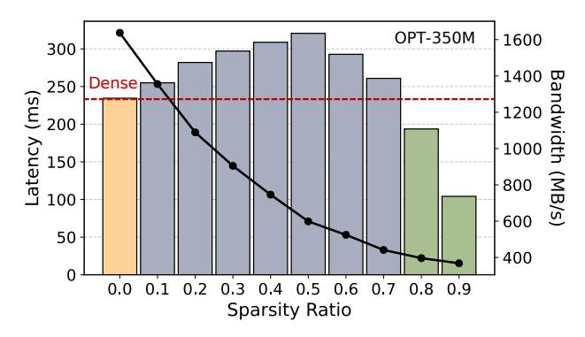

Figure 5. Inference latency and achieved bandwidth of data loading from flash under varying activation sparsity ratios.

<span id="page-3-2"></span>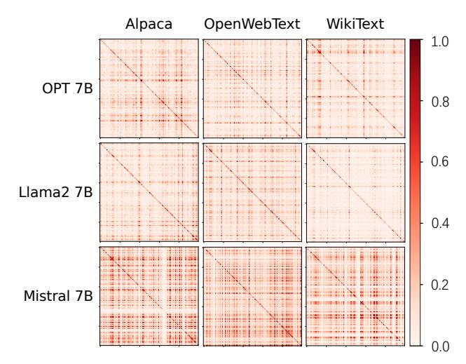

Figure 6. Visualization of neuron co-activation across various LLMs and datasets. Brighter colors denote high values.

This causes the device to become heavily IOPS-bound, preventing the full exploitation of the available bandwidth.

Drawing from these observations, we derive a crucial insight: the conventional neuron placement, guided by model structure, is misaligned with the dynamic activation sparsity utilized in on-device LLM inference. As a result, the key to addressing the I/O bottleneck lies in ensuring that read accesses to flash are as continuous as possible, thereby pushing the bandwidth towards full exploitation.

# 3 Ripple Overview

We propose Ripple, an efficient approach for accelerating LLM inference on smartphones through advanced I/O optimizations. While previous studies primarily focus on the efficiency of either computation or memory management, Ripple tackles the I/O bottleneck by directly improving the neuron transfer bandwidth between flash and DRAM.

<span id="page-4-0"></span>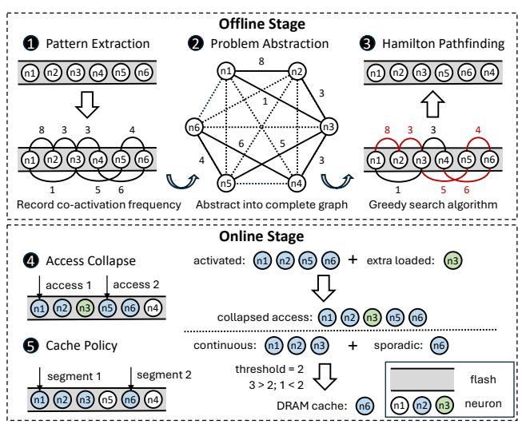

Figure 7. Overview of RIPPLE.

The design of RIPPLE is rooted in *Neuron Co-Activation*, a fundamental property inherent in LLM activation sparsity. As illustrated in Figure 6, neurons within LLMs exhibit strongly correlated activation patterns across various model structures and datasets. Although similar observations have been validated in prior studies [4, 69], this property remains largely underexplored due to its intrinsic complexity. By employing both algorithmic and system-level optimizations, RIPPLE is the first to leverage neuron co-activation for optimizing neuron placement in flash, effectively mitigating the I/O bottleneck during LLM inference on smartphones. Figure 7 presents an overview of RIPPLE.

Offline Correlation-Aware Clustering (§ 4). RIPPLE begins with the identification of an optimized neuron placement in flash by clustering co-activated neurons. Specially, the process consists of three steps. **O Pattern Extraction.** We develop distinct strategies to extract co-activation patterns in transformer-based LLMs efficiently. These extracted patterns quantify the strength of co-activation correlations among neurons, forming the foundation for subsequent neuron rearrangement. **2** Problem Abstraction. We model the process of identifying optimal neuron placement as a graph representation. Leveraging this abstraction, we reformulate the problem into a Hamiltonian Pathfinding task, enabling a more efficient solution through graph-theoretic techniques. **3** Hamilton Pathfinding. Given the NP-hard nature of the optimized problem, we devise a heuristic algorithm that employs a greedy approach. We prove strictly that our algorithm can search for the locally optimal solution with the time complexity of  $O(n^2 \log n)$ .

Online Continuity-Centric Processing (§ 5). To efficiently align with the optimized neuron placement, RIPPLE adopts customized data access and DRAM management techniques, Specially designed to facilitate more continuous read access.

• Access Collapse. Despite optimized neuron placement,

the inherent randomness in neuron activation leads to persistent discontinuous read access. To address this, we propose strategically merging nearby discontinuous read accesses by loading additional neurons between them. This merging approach, with minimal overhead, substantially reduces IOPS, thereby enhancing overall bandwidth efficiency. **6** Cache Policy. Retaining the most frequently activated neurons in DRAM effectively reduces repeated neuron transfers. However, this approach alone risks disrupting the continuity of optimized neuron placement in flash. To mitigate this, we propose caching neurons in DRAM at the granularity of neuron segments, rather than individual neurons. This strategy helps prevent fragmentation within the flash, ultimately enhancing overall bandwidth efficiency.

## <span id="page-4-1"></span>4 Offline Correlation-Aware Clustering

#### 4.1 Step 1: Parameter-Efficient Pattern Extraction

LLMs [8, 28, 56, 76] are typically based on transformer architectures, with two primary components: Multi-Head Attention (MHA) block and Feed Forward Network (FFN) block. To enhance inference efficiency, an increasing number of LLMs are adopting the Group Query Attention [3] mechanism, which significantly minimizes the parameter overhead of the MHA block. As a result, in RIPPLE, we focus primarily on offloading the parameters of the FFN block to flash memory, while prefetching all parameters within the MHA block. Nonetheless, this approach can similarly be exploited to optimize the offloading of the MHA block itself.

To extract the neuron co-activation patterns, we initially utilize an *Adjacency Matrix* to record the activation frequencies of neurons within LLMs. This step is performed only once, prior to inference, utilizing a dataset associated with the upcoming tasks. By interpreting frequency f as a probability, we compute the probability of the activation of neuron  $n_i$ , denoted as P(i), and the probability of the co-activation of neuron  $n_i$  and  $n_i$ , denoted as P(ij), as follows:

$$P(i) = \frac{f(n_i)}{\sum_{k=1}^{N} f(n_k)}$$
 (1)

$$P(ij) = \frac{f(n_i, n_j)}{\sum_{k=1}^{N} \sum_{l=1}^{N} f(n_k, n_l)}$$
(2)

Here, N denotes the number of neurons in a weight matrix. When performing statistics, Ripple accounts for the binding relationships between neurons across different weight matrices within the same FFN block. For instance, in OPT [76], the columns of up projection matrix are bound to the corresponding rows of down projection matrix, as their activations rely on whether the same intermediate values are zero or not. A similar binding relationship exists among the gate, up, and down projection matrices in Llama2 [56].

<span id="page-5-0"></span>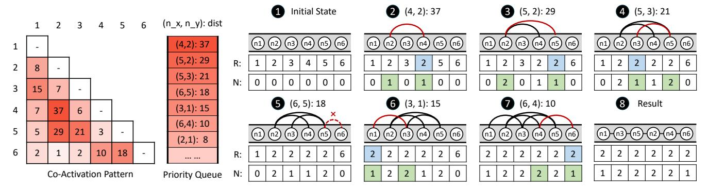

**Figure 8.** An example of neuron placement search algorithm. Based on co-activation patterns, the correlation of all neuron pairs is ranked. These pairs are then sequentially retrieved, finally constructing a linking that incorporates all neurons.

#### 4.2 Step 2: Graph-Based Problem Abstraction

Following the extraction of the neuron co-activation patterns, the subsequent step involves determining an optimized neuron placement within the flash. To enable more continuous read access, neurons that frequently co-activate should ideally be positioned in close proximity. Given the immense number of potential neuron placements, a brute-force enumeration approach is infeasible. Innovatively, we reformulate this problem as a graph representation, allowing for a more efficient solution leveraging graph-theoretic techniques.

**Graph Abstraction.** We abstract the neuron co-activation relationships into a *Complete Graph*. In this graph, each node represents a neuron, and each edge captures the co-activation between a pair of neurons. Specially, the value assigned to each edge reflects the strength of their co-activation correlation, referred to as the *Distance Between Two Neurons*. We prove that the optimal definition of the distance between neuron  $n_i$  and neuron  $n_j$  is given as follows:

<span id="page-5-1"></span>
$$\operatorname{dist}(n_i, n_j) \coloneqq 1 - P(ij) \tag{3}$$

*Proof.* The objective of RIPPLE is to minimize the expected number of I/O operations during a single inference request. Initially, consider that all neurons are activated individually. Therefore, the expected number of I/O operations,  $N_{indiv}$ , can be expressed as:

$$\hat{N}_{indiv} = \sum_{i=1}^{N} P(i) \tag{4}$$

Next, we account for the co-activation of neurons. When neurons  $n_i$  and  $n_j$  are co-activated, both can be accessed with a single I/O operation. Therefore, the expected number of I/O operations,  $N_{coact}$ , is given by:

$$\hat{N}_{coact} = \sum_{i=1}^{N} P(i) - \sum_{i=1}^{N} \sum_{j=1}^{N} P(ij)$$
 (5)

Given that the first term remains constant, minimizing  $N_{coact}$  is equivalent to maximizing the second term,  $\sum_{i=1}^{N} \sum_{j=1}^{N} P(ij)$ . By defining the distance between neuron  $n_i$  and neuron  $n_i$ 

as 1 - P(ij), this problem can be formulated as identifying the shortest Hamiltonian path [48] in a complete graph.

Hamilton Pathfinding. The Hamiltonian path ensures that all neurons stored within the flash are involved, while minimizing the path length maximizes the likelihood of clustering co-activated neurons together. We prove that this problem can be further reduced to the classical Traveling Salesman Problem (TSP) [31] as follows:

**Lemma 4.1.** The global shortest Hamiltonian path problem (i.e., finding the shortest path between any pair of nodes) can be reduced to the TSP in polynomial time.

*Proof.* Define Problem A as: Find the shortest Hamiltonian path in a complete graph from node x to node y, denoted as f(x, y). By iterating over all possible node pairs x and y, it is evident that the global shortest Hamiltonian path problem can be reduced to solving Problem A for all node pairs. This can be achieved in  $O(n^2)$  time using dynamic programming, where n is the number of nodes in the graph.

On the other hand, the TSP is defined as: Find the shortest Hamiltonian cycle in a complete graph starting and ending at a node x, denoted as g(x). The relationship between Problem A and the TSP can be established as follows:

$$g(x) = \min_{\substack{i=1\\i \neq x}}^{n} f(x, i) + \operatorname{dist}(x, i)$$
 (6)

This expression shows that Problem A can be further reduced to the TSP in O(n) time by minimizing over n-1 possible nodes. Therefore, the global shortest Hamiltonian path problem can be reduced to the TSP in polynomial time.

#### 4.3 Step 3: Heuristic-Driven Greedy Algorithm

Although the problem can be reduced into the classical TSP, which is known to be NP-hard [57], finding an optimal solution in polynomial time is generally infeasible. We propose a heuristic algorithm that searches for the optimal neuron placement greedily, as shown in Figure 8

#### <span id="page-6-1"></span>Algorithm 1 Neuron Placement Search Algorithm

```
1: Input: Neuron set N, Distance function dist(n_i, n_j)
 2: Output: Optimized neuron placement \mathcal{P}
 3: function GreedySearch(N)
         Initialize NbrCnt[n] \leftarrow 0 for all n \in \mathcal{N}
 4:
         Initialize disjoint sets S(n) for all n \in \mathcal{N}
 5:
         Initialize priority queue Q \leftarrow \emptyset
 6:
 7:
         for each pair (n_i, n_j) \in \mathcal{N} \times \mathcal{N}, n_i \neq n_j do
 8:
              Q.\text{push}((n_i, n_j), \text{dist}(n_i, n_j))
         while Q \neq \emptyset do
 9:
10:
              (n_x, n_y) \leftarrow Q.pop()
              if NbrCnt[n_x] = 2 or NbrCnt[n_y] = 2 then
11:
                   continue > Skip if either neuron is inside a link
12:
              root_x \leftarrow Find(n_x), root_y \leftarrow Find(n_y)
13:
              if root_x \neq root_y then
14:
                   NbrCnt[n_X]++
15:
                   NbrCnt[n_y]++
16:
                   Union(root_x, root_y)
17:
                   Link(n_x, n_y)
                                                   ▶ Update neuron linkings
18:
         \mathcal{P} \leftarrow []
19:
         ▶ Set current neuron to starting point
20:
         c \leftarrow \text{Select first neuron from } \{n \in \mathcal{N} \mid \text{NbrCnt}[n] = 1\}
21:
         while c \neq s and NbrCnt[c] \neq 1 do
                                      ▶ Add c to the optimized placement
22:
              \mathcal{P}.append(c)
              c \leftarrow \text{NextNeuron}(c) \triangleright \text{Move to next neuron linked to } c
23:
24:
```

**Algorithm Details.** The core idea of the algorithm is to initially treat each neuron as an individual link. By iteratively merging the nearest links in a greedy manner, new links are formed until a single link encompassing all neurons remains. To achieve this, analogous to the *Distance Between Two Neurons* as defined in Equation 3, we define the *Distance Between Two Neuron Links*,  $l_i$  and  $l_i$ , as follows:

<span id="page-6-2"></span>
$$\operatorname{dist}(l_i, l_j) := \min\{\operatorname{dist}(l_i(h), l_j(h)), \operatorname{dist}(l_i(h), l_j(t)), \\ \operatorname{dist}(l_i(t), l_j(h)), \operatorname{dist}(l_i(t), l_j(t))\}$$

$$(7)$$

Here,  $l_i(h)$  and  $l_i(t)$  denote the head and tail neurons of a neuron link  $l_i$ , respectively. And  $dist(l_i(h), l_j(h))$  represents the distance between these two neurons.

Algorithm 1 outlines the process in pseudocode. The algorithm begins by taking a set of neurons  $\mathcal N$  and a distance function  $\operatorname{dist}(l_i,l_j)$ , as defined in Equation 7 (Line 1). Initially, each neuron in  $\mathcal N$  is treated as an individual link (Line 2). The algorithm then proceeds iteratively, searching for the nearest pair of links to merge. For each pair of links, the distance is computed using  $\operatorname{dist}(l_i,l_j)$  (Line 7), and the pair with the smallest distance is selected for merging (Lines 8-10). This process repeats until only a single link remains, which contains all the neurons (Lines 3-11). The final merged link is then returned as the output of the algorithm (Line 12).

**Complexity Analysis.** Our implementation leverages the union-find and priority queue data structures to optimize

<span id="page-6-3"></span>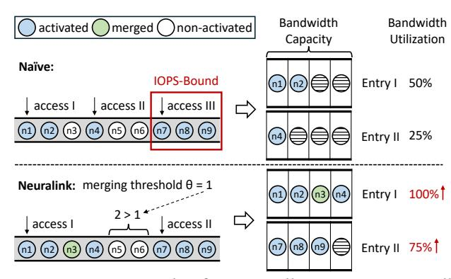

**Figure 9.** An example of access collapse. By strategically combining nearby neurons, RIPPLE improves overall efficiency by maximizing bandwidth utilization.

the time complexity of the algorithm. The union-find structure efficiently manages the connections between elements, ensuring that elements belonging to the same set are part of the same link. Both the insertion and search operations in the union-find structure have a time complexity of O(1). Meanwhile, the priority queue is employed to identify the nearest neuron link, with a time complexity of  $O(n^2 \log n)$ . The  $n^2$  factor arises from the pairwise enumeration of neuron links  $l_i$  and  $l_j$ . Consequently, the overall time complexity of the algorithm is  $O(n^2 \log n)$ .

# <span id="page-6-0"></span>5 Online Continuity-Centric Processing

Through offline correlation-aware clustering, neurons that are frequently co-activated are strategically placed contiguously in flash memory. However, the dynamic and intricate nature of neuron co-activation complicates static neuron placement, making it inadequate to entirely alleviate IOPS limitations. To fully exploit the flash and DRAM resources to serve neuron read requests, we design specific online serving techniques, aiming to address the two primary categories of these challenges, manifesting in data access and caching.

The first challenge arises from **Random Activation Variation**. Due to the stochastic nature of neuron activation, it is infeasible to consistently follow the extracted co-activation patterns. Although neurons that are frequently co-activated are placed in close positions, minor variances induced by randomness can still lead to discontinuous read access.

The second challenge stems from **Misaligned Cache Strategy**. Conventional cache mechanisms often fail to adapt to co-activation scenarios. Simply caching hot neurons lost the information on neuron placement, breaking the continuity of neurons in flash, which is against our optimizations for I/O operations reduction. However, directly continuously caching all co-activated neurons may take up too much cache space, wasting cache efficiency.

#### 5.1 IOPS-Friendly Access Collapse

In Ripple, we introduce an innovative online technique that strategically combines nearby read accesses. The fundamental insight driving this approach is that while co-activated neurons cannot always be placed contiguously, they are likely to be positioned in close proximity following offline correlation-aware clustering. As illustrated in Figure [9,](#page-6-3) consider a scenario where neurons n1, n2, n3, and n4 are stored contiguously, but occasionally only n1, n2, and n4 are activated, necessitating two distinct read operations. However, when IOPS is limited, the inclusion of more neurons per read operation yields superior overall performance. Capitalizing on this observation, when two disjoint but proximate neuron groups are co-activated, we speculatively read the intervening neurons. This strategy effectively coalesces the two separate neuron groups into a single, contiguous read access, thereby substantially enhancing overall efficiency.

The execution of this IOPS-friendly access collapse is governed by two key factors during runtime. (1) Extra bandwidth cost. Introducing additional neurons for merging involves a trade-off between increasing the data transfer size and decreasing IO operations, aiming to enhance bandwidth utilization. We employ a threshold-based approach: if the number of neurons between two neuron groups falls below a predefined threshold, collapse is performed; otherwise, skipped. This threshold is dynamically adjusted during runtime to balance the overhead and efficiency gains. (2) Storage Bottleneck. While merging can reduce IO operations, it only improves bandwidth efficiency if the storage is IOPS-bound rather than bandwidth-bound. To handle this, we implement an online bottleneck detector that periodically checks whether the achieved bandwidth has reached the hardware's maximum capacity. If the bandwidth is fully utilized, the system defaults to the original read strategy.

## 5.2 Linking-aligned Cache Policy

It is natural to store the neurons that are most frequently activated in DRAM to reduce the redundant data transfer between flash and DRAM. However, directly applying the existing cache policy is inefficient, since all these policies are performed at the level of neuron individuals, which ignores the co-activation pattern and neuron placement in flash. Therefore, we added a layer of access management to the existing cache to achieve linkage with Access Collapse and further improve system efficiency. For example, neurons A, B, C, and D are stored together and often co-activate together, but if B is hotter than others, B has a higher probability of being cached, which may cause discontinuous read operations. A further idea is that cache the neurons stored continuously in the flash together to reduce the occurrence of the above situation, but this will take up lots of cache space at once, which is not worth the loss.

In Ripple, activated neurons are divided into two categories, sporadic neurons and continuous segments. Sporadic neurons, as its name, refer to those neurons being co-activated with few surrounding neurons. Continuous segments consist of a series of neurons that are activated together in succession. For sporadic neurons, Ripple cache them as usual. But Ripple cache these continuous segments with a lower probability than sporadic neurons. This is mainly because, first of all, caching continuous segments requires more memory resources and brings more limited benefits. If some neurons in these continuous segments are evicted and some remain in the cache, this will lead to discontinuous reads on the flash. Although the waste of IOPS is alleviated by Access Collapse, DRAM resources are wasted. Our cache policy also cooperates well with the state-of-the-art cache design. Since we only control the caching admitting policy, yet leave the other unchanged.

# 6 Evaluation

#### 6.1 Evaluation Setup

Hardware. We conduct evaluations across a diverse set of smartphones, as detailed in Table [2.](#page-8-0) This broad spectrum underscores the wide applicability and robustness of Ripple across different hardware platforms.

Models. We choose models from three widely adopted LLM families [\[28,](#page-12-5) [56,](#page-12-7) [76\]](#page-13-0) for evaluation, as outlined in Table [3.](#page-8-1) For Llama2 and Mistral, we utilize their ReLU variants [\[49,](#page-12-19) [51\]](#page-12-20), which offer an effective balance between sparsity and performance. These LLMs exhibit diverse model architectures, parameter sizes, and sparsity ratios, thereby offering comprehensive benchmarks on Ripple.

Datasets. We evaluate Ripple using three real-world datasets, each representing a diverse set of content and linguistic structures. Alpaca [\[53\]](#page-12-27) offers task-specific instruction data, Open-WebText [\[21\]](#page-11-8) captures web-scale information, and Wiki-Text [\[39\]](#page-12-28) provides formal, encyclopedic content. For each dataset, we collect 1,000 sentences to extract the neuron co-activation patterns during the offline stage.

Baselines. We benchmark Ripple with two state-of-the-art LLM inference frameworks for smartphone deployment. The first, Llama.cpp [\[19\]](#page-11-9), is the most widely used LLM inference framework and currently the fastest, supporting offloading of model parameters to flash storage. The second baseline is LLM in a Flash (LLMFlash) [\[4\]](#page-11-5), the representation of current methods on on-device LLM inference. Although it is not open-source, we port it into Llama.cpp by integrating its key I/O optimizations, such as row-column bundling. While our evaluation primarily focuses on I/O efficiency between flash and DRAM, we integrate a high-performance cache, S3-FIFO [\[70\]](#page-13-8) into all baselines and maintain a DRAM cache ratio of 0.1 during the comparison.

Metrics. Latency remains the most critical concern in mobile scenarios. Consequently, our primary performance metric

Table 2. Smartphone hardware configurations.

<span id="page-8-0"></span>

| Device        | SoC                 | DRAM | Flash | Storage |
|---------------|---------------------|------|-------|---------|
| OnePlus 12    | Snapdragon 8 Gen 3  | 24GB | 1TB   | UFS4.0  |
| OnePlus Ace 3 | Snapdragon 8 Gen 2  | 16GB | 512GB | UFS4.0  |
| OnePlus Ace 2 | Snapdragon 8+ Gen 1 | 16GB | 512GB | UFS3.1  |

**Table 3.** Model configurations.

<span id="page-8-1"></span>

| Model <sup>+</sup> | # Params | # Layers | # Neurons | Neuron Dim | Sparsity |
|--------------------|----------|----------|-----------|------------|----------|
| OPT                | 350M     | 24       | 8192      | 1024       | 9.49%    |
| OPT                | 1.3B     | 24       | 16384     | 2048       | 4.09%    |
| OPT                | 6.7B     | 32       | 32768     | 4096       | 3.28%    |
| Llama2             | 7B       | 32       | 33024     | 4096       | 13.88%   |
| Mistral            | 7B       | 32       | 43008     | 4096       | 60.52%   |

<sup>+</sup> Neurons per FFN block, with 2 linear layers in OPTs and 3 in others.

is the I/O latency during inference, which constitutes the majority of the overall end-to-end latency. For a more granular analysis, we also consider metrics such as IOPS and Bandwidth. Notably, bandwidth here refers to the effective bandwidth, which only considers the activated neurons. We normalize the metrics values when large discrepancies occur for clarity. All metrics are averaged over 100 token generations and repeated across 10 trials.

#### 6.2 Overall Performance

Latency. As depicted in Figure 10(a), we evaluate the I/O latency per token and the corresponding speedup of RIPPLE on OnePlus 12. The results indicate that RIPPLE effectively mitigates the I/O bottleneck during LLM inference on smartphones, yielding speedups of up to 5.93× over Llama.cpp and 3.23× over LLMFlash. For OPT models, which exhibit high sparsity, RIPPLE achieves an average speedup of 2.23× over LLMFlash across all model sizes and datasets. For denser models like Llama2-7B and Mistral-7B, optimizing I/O operations becomes much more challenging. However, with IOPS-oriented techniques, RIPPLE still achieves speedups of 13.8% and 10.2% over LLMFlash.

**Effective Bandwidth.** As shown in Figure 10(b). Consistent with the observed latency results, RIPPLE demonstrates a marked enhancement in bandwidth, achieving improvements of up to 4.32× and 2.13× over both two baselines, respectively. These gains primarily come from a substantial reduction in I/O operations due to more continuous access. By alleviating the device from IOPS constraints, the overall bandwidth utilization is boosted.

## 6.3 Performance Breakdown

Figure 11 presents a detailed performance analysis of RIPPLE. The evaluation is conducted on two LLM families, OPT and Llama2, with OPT model sizes ranging from 350M to 6.7B. Using the strongest baseline, LLMFlash, as the start point, the results demonstrate that the offline and online

<span id="page-8-2"></span>**Table 4.** Time cost of the offline search algorithm across different datasets and models (in seconds).

| Dataset     | OPT-350N | OPT-1.3B | OPT-6.7B | Llama2-7B | Mistral-7B |
|-------------|----------|----------|----------|-----------|------------|
| Alpaca      | 5.47     | 19.59    | 97.96    | 57.12     | 104.95     |
| OpenWebText | 5.32     | 19.74    | 98.26    | 56.36     | 103.04     |
| WikiText    | 5.59     | 21.63    | 104.04   | 56.23     | 104.76     |

stages of Ripple yield average performance improvements of  $1.30\times$  and  $1.26\times$ , respectively, underscoring the effectiveness of both stages. By closely integrating both stages, Ripple achieves cumulative speedups of  $1.68\times$  on average across all five models.

#### 6.4 Offline Ablation Study

Continuous Access. The core insight of RIPPLE lies in optimizing bandwidth utilization by significantly maximizing continuous read access to flash. As depicted in Figure 12, we evaluate the lengths of read accesses in both RIPPLE and LLMFlash. Prior to optimization, the read access lengths remain below 10 neurons, with averages of 1.05 and 1.10 across the two models. In contrast, RIPPLE exhibits a marked improvement, with read access length increasing by 213% and 160%, respectively. Remarkably, the maximum continuous read access length reaches up to 620 in OPT and 344 in Llama. This considerable improvement in continuous read access facilitates full utilization of available bandwidth.

**Overhead Analysis.** We measure the time cost of executing the offline search algorithm in Ripple. Since the time complexity is primarily determined by the number of activated neurons, we perform evaluations across various datasets and model sizes. To expedite the search process, we implement parallel computation by exploiting the independence of different model layers. Table 4 indicates that all search processes complete within a few minutes, even for the largest 13B model. With the theoretical time complexity is  $O(n^2 \log n)$ , the growth of time cost is modest. Given that this search process is required only once, the overhead is negligible compared to the subsequent inference process.

#### 6.5 Online Ablation Study

Access Collapse. Figure 13 shows the effectiveness of Access Collapse. For both OPT-6.7B and Llama2-7B, the effective bandwidth for neuron transfer increases due to the optimized trade-off between data volume and IO operations. In the OPT-6.7B and Llama2-7B models, the Access Collapse strategy brings an effective bandwidth improvement of 1.21× and 1.09× respectively. This optimization successfully shifts the bottleneck from IOPS to bandwidth on smartphones, resulting in enhanced overall performance.

**Cache Ratio.** We compare the baseline with different cache ratios to show the memory savings of RIPPLE. Figure 14 presents the latency comparison when caching various ratios of neurons in DRAM. The results indicate that, although

<span id="page-9-0"></span>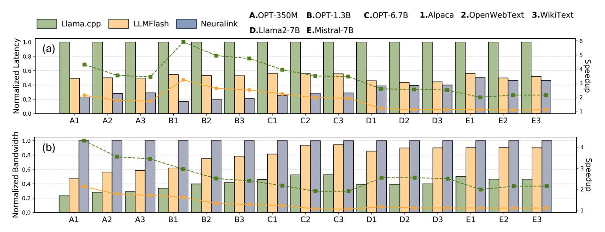

Figure 10. Overall Performance (latency and bandwidth) of RIPPLE across various LLMs and datasets on OnePlus 12.

<span id="page-9-1"></span>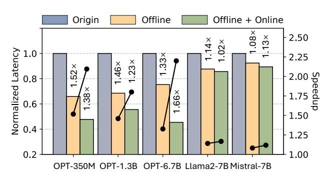

Figure 11. Performance breakdown on OnePlus 12.

focus primarily on I/O optimization from flash, RIPPLE remains highly efficient when interfacing with caching systems, achieving DRAM caching space savings of up to  $1.50 \times$  and  $1.36 \times$  on two models, respectively.

#### 6.6 Sensitivity Analysis

In this section, we examine the sensitivity of Ripple to several key factors, including inputs, hardware and precision. Sensitivity on Inputs. In the offline stage, Ripple optimizes neuron placements in flash based on co-activation patterns extracted from the preprocessed dataset. Figure 15 illustrates the I/O performance of Ripple when inference inputs are sourced from a different dataset. The results reveal that the neuron placements determined offline remain effective when inputs are biased. This suggests that neuron co-activation patterns may be an intrinsic property of the model itself, with input variations exerting limited influence.

**Sensitivity on Hardware.** Figure 16 shows the I/O performance of RIPPLE on smartphones with varying hardware configurations. Compared to the OnePlus 12 (OP 12), the OnePlus Ace3 (OP Ace3) share the same storage but features a less powerful SoC, while the OnePlus Ace2 (OP Ace2) has

<span id="page-9-2"></span>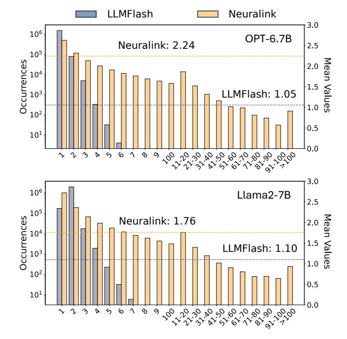

**Figure 12.** Continuous access length in RIPPLE and LLM-Flash. A length of 1 corresponds to a neuron bundle, comprising two neurons in OPT and three neurons in Llama2.

both weaker UFS storage and SoC. The results show that the performance of OP 12 and OP Ace3 is comparable, indicating that storage is a more critical factor than the SoC. In contrast, OP Ace2 exhibits roughly half the performance of the other two, aligning with the hardware bandwidth limitations, as shown in Figure 4.

**Sensitivity on Precision.** For each model, the neuron dimension is fixed, and lower precision results in a smaller neuron size. Figure 17 presents the per-token latency across varying floating-point precision. The result demonstrates

<span id="page-10-0"></span>

Figure 13. Data transfer volume, IOPS, and bandwidth of activated neurons before and after applying access merging.

<span id="page-10-1"></span>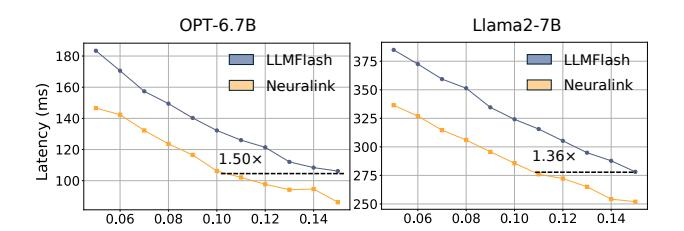

Figure 14. Per-token latency on varying DRAM cache ratios.

<span id="page-10-2"></span>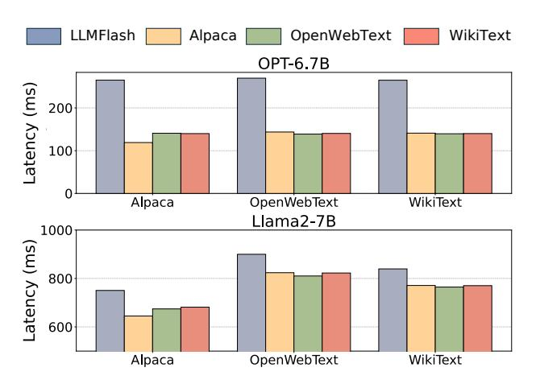

Figure 15. I/O performance of Ripple during inference requests from various datasets (columns), using optimized neuron placements generated from a specific dataset (x-axis).

<span id="page-10-3"></span>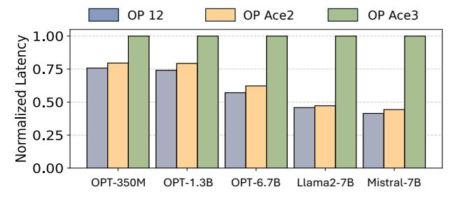

Figure 16. Per-token latency on varying smartphones.

that Ripple scales efficiently with data format precision, maintaining consistent performance across three models.

<span id="page-10-4"></span>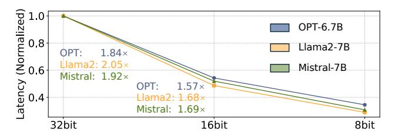

Figure 17. Per-token latency on varying model precision.

Although lower precision amplifies the extent of scattered read access, Ripple still achieves an average speedup of 1.65× from 16bit to 8bit.

# 7 Related Works

Model Parameter Reduction. To alleviate the memory and computational burdens of LLM execution, substantial efforts have focused on the reduction of model parameters, with two principal approaches emerging. The first, Model Pruning [\[35,](#page-12-29) [36\]](#page-12-30), seeks to reduce the number of model parameters while ensuring minimal performance degradation. Several works [\[23,](#page-11-10) [24,](#page-11-11) [26,](#page-12-31) [32,](#page-12-32) [75\]](#page-13-9) have explored static pruning, where parameters are pruned offline, prior to inference. In contrast, dynamic sparsity methods [\[7,](#page-11-12) [12,](#page-11-13) [22,](#page-11-14) [25,](#page-11-15) [46,](#page-12-33) [67\]](#page-13-10) determines which parameters to prune during runtime, enabling seamless integration with training or inference. Different from these pruning techniques, Ripple exploits the Activation Sparsity inherent in LLMs, retaining all model parameters but enhancing resource efficiency by selectively activating only a subset. This approach preserves the model's generalization ability, particularly critical in the context of LLMs.

Another one is Model Quantization [\[11,](#page-11-16) [20\]](#page-11-17), which reduces the precision of model parameters by optimizing the utilization of available bits to encode model information more efficiently. Numerous studies have driven precision progressively lower, with efforts ranging from 8-bit [\[13,](#page-11-18) [66\]](#page-13-11) to 4-bit [\[16,](#page-11-19) [73\]](#page-13-12), 2-bit [\[10\]](#page-11-20), and even 1-bit [\[58,](#page-12-34) [68\]](#page-13-13). However, as precision decreases, the resulting data access patterns become increasingly fine-grained, leading to more scattered access. This, in turn, heightens the significance of Ripple. Sparse Computation Optimization. Sparse linear algebra often falls short in performance compared to its dense counterparts, primarily due to its inherent irregular computation patterns and scattered memory accesses. Many works has focused on optimizing computation under sparsity patterns. Several compiler-based techniques, such as SparTA [\[80\]](#page-13-14) and SparseRT [\[60\]](#page-12-35), are tailored for static sparsity patterns, while others, including Sputnik [\[17\]](#page-11-21),cuSPARSE [\[42\]](#page-12-36),PiT [\[79\]](#page-13-15),Flash-LLM [\[65\]](#page-13-16), provide support for more general sparsity patterns. Recently, an increasing number of hardware solutions [\[6,](#page-11-22) [9,](#page-11-23) [18,](#page-11-24) [63\]](#page-12-37) have been specially designed to accelerate sparsity computations, including NVIDIA's Sparse Tensor

Core [\[43\]](#page-12-38). Although these advancements significantly enhance the sparse computation efficiency, the I/O bottleneck in on-device LLM inference has become increasingly pronounced. Complementary to these efforts, Ripple addresses this I/O bottleneck with neuron co-activation linking.

Activation Sparsity Application. Many recent works have begun leveraging activation sparsity to reduce the resource demands of LLM inference. For instance, Deja Vu [\[37\]](#page-12-13) pioneered a predictor-based approach for sparsity-based LLM inference, greatly reducing inference latency. Building upon this, Powerinfer [\[50\]](#page-12-15) exploits this property to enable LLM execution on consumer-grade GPUs by offloading model parameters to CPU. Particularly in mobile scenarios, LLM in a Flash [\[4\]](#page-11-5) first proposes using flash on smartphones for model offloading. Powerinfer2 [\[69\]](#page-13-4) extends this approach further, serving a 47B LLM on a smartphone. However, these methods primarily concentrate on optimizing DRAM management and overlapping computation with data transfers, achieving only limited bandwidth improvements. Ripple complements these efforts by directly enhancing the neuron transfer bandwidth, an optimization that can integrate with existing techniques to accelerate LLM inference on smartphones.

# 8 Conclusion

We propose Ripple, an efficient approach to accelerating LLM inference on smartphones through I/O optimizations. Leveraging neuron co-activation, Ripple notably reorganizes neuron placement within flash to facilitate more continuous read access, shifting the primary performance bottleneck from IOPS to bandwidth. This work unveils a novel optimization space at the intersection of sparsity-driven algorithm and storage-level system co-design in LLM inference.

# References

- <span id="page-11-4"></span>[1] Marah Abdin, Sam Ade Jacobs, Ammar Ahmad Awan, Jyoti Aneja, Ahmed Awadallah, Hany Awadalla, Nguyen Bach, Amit Bahree, Arash Bakhtiari, Harkirat Behl, et al. Phi-3 technical report: A highly capable language model locally on your phone. arXiv preprint arXiv:2404.14219, 2024.
- <span id="page-11-6"></span>[2] AF Agarap. Deep learning using rectified linear units (relu). arXiv preprint arXiv:1803.08375, 2018.
- <span id="page-11-7"></span>[3] Joshua Ainslie, James Lee-Thorp, Michiel de Jong, Yury Zemlyanskiy, Federico Lebrón, and Sumit Sanghai. Gqa: Training generalized multiquery transformer models from multi-head checkpoints. arXiv preprint arXiv:2305.13245, 2023.
- <span id="page-11-5"></span>[4] Keivan Alizadeh, Iman Mirzadeh, Dmitry Belenko, Karen Khatamifard, Minsik Cho, Carlo C Del Mundo, Mohammad Rastegari, and Mehrdad Farajtabar. Llm in a flash: Efficient large language model inference with limited memory. arXiv preprint arXiv:2312.11514, 2023.
- <span id="page-11-1"></span>[5] Rohan Anil, Andrew M Dai, Orhan Firat, Melvin Johnson, Dmitry Lepikhin, Alexandre Passos, Siamak Shakeri, Emanuel Taropa, Paige Bailey, Zhifeng Chen, et al. Palm 2 technical report. arXiv preprint arXiv:2305.10403, 2023.
- <span id="page-11-22"></span>[6] Nathan Bell and Michael Garland. Efficient sparse matrix-vector multiplication on cuda. Technical report, Nvidia Technical Report NVR-2008-004, Nvidia Corporation, 2008.

- <span id="page-11-12"></span>[7] Emmanuel Bengio, Pierre-Luc Bacon, Joelle Pineau, and Doina Precup. Conditional computation in neural networks for faster models. arXiv preprint arXiv:1511.06297, 2015.
- <span id="page-11-2"></span>[8] Tom Brown, Benjamin Mann, Nick Ryder, Melanie Subbiah, Jared D Kaplan, Prafulla Dhariwal, Arvind Neelakantan, Pranav Shyam, Girish Sastry, Amanda Askell, et al. Language models are few-shot learners. Advances in neural information processing systems, 33:1877–1901, 2020.
- <span id="page-11-23"></span>[9] Aydin Buluç, Jeremy T Fineman, Matteo Frigo, John R Gilbert, and Charles E Leiserson. Parallel sparse matrix-vector and matrixtranspose-vector multiplication using compressed sparse blocks. In Proceedings of the twenty-first annual symposium on Parallelism in algorithms and architectures, pages 233–244, 2009.
- <span id="page-11-20"></span>[10] Jerry Chee, Yaohui Cai, Volodymyr Kuleshov, and Christopher M De Sa. Quip: 2-bit quantization of large language models with guarantees. Advances in Neural Information Processing Systems, 36, 2024.
- <span id="page-11-16"></span>[11] Yu Cheng, Duo Wang, Pan Zhou, and Tao Zhang. A survey of model compression and acceleration for deep neural networks. arXiv preprint arXiv:1710.09282, 2017.
- <span id="page-11-13"></span>[12] Andrew Davis and Itamar Arel. Low-rank approximations for conditional feedforward computation in deep neural networks. arXiv preprint arXiv:1312.4461, 2013.
- <span id="page-11-18"></span>[13] Tim Dettmers, Mike Lewis, Younes Belkada, and Luke Zettlemoyer. Gpt3. int8 (): 8-bit matrix multiplication for transformers at scale. Advances in Neural Information Processing Systems, 35:30318–30332, 2022.
- <span id="page-11-3"></span>[14] Jacob Devlin. Bert: Pre-training of deep bidirectional transformers for language understanding. arXiv preprint arXiv:1810.04805, 2018.
- <span id="page-11-0"></span>[15] Mohammad Fraiwan and Natheer Khasawneh. A review of chatgpt applications in education, marketing, software engineering, and healthcare: Benefits, drawbacks, and research directions. arXiv preprint arXiv:2305.00237, 2023.
- <span id="page-11-19"></span>[16] Elias Frantar, Saleh Ashkboos, Torsten Hoefler, and Dan Alistarh. Gptq: Accurate post-training quantization for generative pre-trained transformers. arXiv preprint arXiv:2210.17323, 2022.
- <span id="page-11-21"></span>[17] Trevor Gale, Matei Zaharia, Cliff Young, and Erich Elsen. Sparse GPU kernels for deep learning. In Proceedings of the International Conference for High Performance Computing, Networking, Storage and Analysis, SC 2020, 2020.
- <span id="page-11-24"></span>[18] Trevor Gale, Matei Zaharia, Cliff Young, and Erich Elsen. Sparse gpu kernels for deep learning. In SC20: International Conference for High Performance Computing, Networking, Storage and Analysis, pages 1–14. IEEE, 2020.
- <span id="page-11-9"></span>[19] Georgi Gerganov. ggerganov/llama.cpp: Port of facebook's llama model in c/c++. <https://github.com/ggerganov/llama.cpp>, 2024.
- <span id="page-11-17"></span>[20] Amir Gholami, Sehoon Kim, Zhen Dong, Zhewei Yao, Michael W Mahoney, and Kurt Keutzer. A survey of quantization methods for efficient neural network inference. In Low-Power Computer Vision, pages 291–326. Chapman and Hall/CRC, 2022.
- <span id="page-11-8"></span>[21] Aaron Gokaslan, Vanya Cohen, Ellie Pavlick, and Stefanie Tellex. Openwebtext corpus. [http://Skylion007.github.io/](http://Skylion007.github.io/OpenWebTextCorpus) [OpenWebTextCorpus](http://Skylion007.github.io/OpenWebTextCorpus), 2019.
- <span id="page-11-14"></span>[22] Yiwen Guo, Anbang Yao, and Yurong Chen. Dynamic network surgery for efficient dnns. Advances in neural information processing systems, 29, 2016.
- <span id="page-11-10"></span>[23] Song Han, Huizi Mao, and William J Dally. Deep compression: Compressing deep neural networks with pruning, trained quantization and huffman coding. arXiv preprint arXiv:1510.00149, 2015.
- <span id="page-11-11"></span>[24] Stephen Hanson and Lorien Pratt. Comparing biases for minimal network construction with back-propagation. Advances in neural information processing systems, 1, 1988.
- <span id="page-11-15"></span>[25] Yang He, Guoliang Kang, Xuanyi Dong, Yanwei Fu, and Yi Yang. Soft filter pruning for accelerating deep convolutional neural networks. arXiv preprint arXiv:1808.06866, 2018.

- <span id="page-12-31"></span>[26] Zehao Huang and Naiyan Wang. Data-driven sparse structure selection for deep neural networks. In Proceedings of the European conference on computer vision (ECCV), pages 304–320, 2018.
- <span id="page-12-23"></span>[27] JEDEC. Jedec announces publication of universal flash storage (ufs) standard. <https://www.jedec.org>, February 2021. Accessed: 2024-10-02.
- <span id="page-12-5"></span>[28] Albert Q Jiang, Alexandre Sablayrolles, Arthur Mensch, Chris Bamford, Devendra Singh Chaplot, Diego de las Casas, Florian Bressand, Gianna Lengyel, Guillaume Lample, Lucile Saulnier, et al. Mistral 7b. arXiv preprint arXiv:2310.06825, 2023.
- <span id="page-12-12"></span>[29] Jared Kaplan, Sam McCandlish, Tom Henighan, Tom B Brown, Benjamin Chess, Rewon Child, Scott Gray, Alec Radford, Jeffrey Wu, and Dario Amodei. Scaling laws for neural language models. arXiv preprint arXiv:2001.08361, 2020.
- <span id="page-12-0"></span>[30] Tiffany H Kung, Morgan Cheatham, Arielle Medenilla, Czarina Sillos, Lorie De Leon, Camille Elepaño, Maria Madriaga, Rimel Aggabao, Giezel Diaz-Candido, James Maningo, et al. Performance of chatgpt on usmle: potential for ai-assisted medical education using large language models. PLoS digital health, 2(2):e0000198, 2023.
- <span id="page-12-25"></span>[31] Gilbert Laporte. The traveling salesman problem: An overview of exact and approximate algorithms. European Journal of Operational Research, 59(2):231–247, 1992.
- <span id="page-12-32"></span>[32] Vadim Lebedev and Victor Lempitsky. Fast convnets using group-wise brain damage. In Proceedings of the IEEE conference on computer vision and pattern recognition, pages 2554–2564, 2016.
- <span id="page-12-8"></span>[33] Yuanchun Li, Hao Wen, Weijun Wang, Xiangyu Li, Yizhen Yuan, Guohong Liu, Jiacheng Liu, Wenxing Xu, Xiang Wang, Yi Sun, et al. Personal llm agents: Insights and survey about the capability, efficiency and security. arXiv preprint arXiv:2401.05459, 2024.
- <span id="page-12-17"></span>[34] Zonglin Li, Chong You, Srinadh Bhojanapalli, Daliang Li, Ankit Singh Rawat, Sashank J Reddi, Ke Ye, Felix Chern, Felix Yu, Ruiqi Guo, et al. The lazy neuron phenomenon: On emergence of activation sparsity in transformers. arXiv preprint arXiv:2210.06313, 2022.
- <span id="page-12-29"></span>[35] Tailin Liang, John Glossner, Lei Wang, Shaobo Shi, and Xiaotong Zhang. Pruning and quantization for deep neural network acceleration: A survey. Neurocomputing, 461:370–403, 2021.
- <span id="page-12-30"></span>[36] Jiayi Liu, Samarth Tripathi, Unmesh Kurup, and Mohak Shah. Pruning algorithms to accelerate convolutional neural networks for edge applications: A survey. arXiv preprint arXiv:2005.04275, 2020.
- <span id="page-12-13"></span>[37] Zichang Liu, Jue Wang, Tri Dao, Tianyi Zhou, Binhang Yuan, Zhao Song, Anshumali Shrivastava, Ce Zhang, Yuandong Tian, Christopher Re, et al. Deja vu: Contextual sparsity for efficient llms at inference time. In International Conference on Machine Learning, pages 22137– 22176. PMLR, 2023.
- <span id="page-12-16"></span>[38] Scott Lowe. Calculate iops in a storage array. TechRepublic, verkkosivu, Saatavissa (viitattu 27.02. 2020): https://www. techrepublic. com/blog/theenterprise-cloud/calculate-iops-in-a-storage-array, 2010.
- <span id="page-12-28"></span>[39] Stephen Merity, Caiming Xiong, James Bradbury, and Richard Socher. Pointer sentinel mixture models, 2016.
- <span id="page-12-14"></span>[40] Xupeng Miao, Gabriele Oliaro, Zhihao Zhang, Xinhao Cheng, Hongyi Jin, Tianqi Chen, and Zhihao Jia. Towards efficient generative large language model serving: A survey from algorithms to systems. arXiv preprint arXiv:2312.15234, 2023.
- <span id="page-12-18"></span>[41] Iman Mirzadeh, Keivan Alizadeh, Sachin Mehta, Carlo C Del Mundo, Oncel Tuzel, Golnoosh Samei, Mohammad Rastegari, and Mehrdad Farajtabar. Relu strikes back: Exploiting activation sparsity in large language models. arXiv preprint arXiv:2310.04564, 2023.
- <span id="page-12-36"></span>[42] Maxim Naumov, L Chien, Philippe Vandermersch, and Ujval Kapasi. Cusparse library. In GPU Technology Conference, 2010.
- <span id="page-12-38"></span>[43] NVIDIA. Accelerating inference with sparsity using the nvidia ampere architecture and nvidia tensorrt, 2021. Accessed: 2024-10-18.
- <span id="page-12-1"></span>[44] OpenAI. ChatGPT: Get instant answers, find creative inspiration, learn something new. <https://openai.com/chatgpt>, 2022.
- <span id="page-12-2"></span>[45] OpenAI. GPT-4 Technical Report. Technical report, 2023.

- <span id="page-12-33"></span>[46] Victor Sanh, Thomas Wolf, and Alexander Rush. Movement pruning: Adaptive sparsity by fine-tuning. Advances in Neural Information Processing Systems, 33:20378–20389, 2020.
- <span id="page-12-22"></span>[47] Noam Shazeer. Glu variants improve transformer. arXiv preprint arXiv:2002.05202, 2020.
- <span id="page-12-24"></span>[48] Michael Sipser. Introduction to the theory of computation. ACM Sigact News, 27(1):27–29, 1996.
- <span id="page-12-19"></span>[49] Chenyang Song, Xu Han, Zhengyan Zhang, Shengding Hu, Xiyu Shi, Kuai Li, Chen Chen, Zhiyuan Liu, Guangli Li, Tao Yang, et al. Prosparse: Introducing and enhancing intrinsic activation sparsity within large language models. arXiv preprint arXiv:2402.13516, 2024.
- <span id="page-12-15"></span>[50] Yixin Song, Zeyu Mi, Haotong Xie, and Haibo Chen. Powerinfer: Fast large language model serving with a consumer-grade gpu. arXiv preprint arXiv:2312.12456, 2023.
- <span id="page-12-20"></span>[51] Yixin Song, Haotong Xie, Zhengyan Zhang, Bo Wen, Li Ma, Zeyu Mi, and Haibo Chen. Turbo sparse: Achieving llm sota performance with minimal activated parameters. arXiv preprint arXiv:2406.05955, 2024.
- <span id="page-12-3"></span>[52] Jiahong Su and Weipeng Yang. Unlocking the power of chatgpt: A framework for applying generative ai in education. ECNU Review of Education, 6(3):355–366, 2023.
- <span id="page-12-27"></span>[53] Rohan Taori, Ishaan Gulrajani, Tianyi Zhang, Yann Dubois, Xuechen Li, Carlos Guestrin, Percy Liang, and Tatsunori B. Hashimoto. Stanford alpaca: An instruction-following llama model. [https://github.com/](https://github.com/tatsu-lab/stanford_alpaca) [tatsu-lab/stanford\\_alpaca](https://github.com/tatsu-lab/stanford_alpaca), 2023.
- <span id="page-12-6"></span>[54] Gemini Team, Rohan Anil, Sebastian Borgeaud, Yonghui Wu, Jean-Baptiste Alayrac, Jiahui Yu, Radu Soricut, Johan Schalkwyk, Andrew M Dai, Anja Hauth, et al. Gemini: a family of highly capable multimodal models. arXiv preprint arXiv:2312.11805, 2023.
- <span id="page-12-9"></span>[55] Gemini Team, Rohan Anil, Sebastian Borgeaud, Yonghui Wu, Jean-Baptiste Alayrac, Jiahui Yu, Radu Soricut, Johan Schalkwyk, Andrew M Dai, Anja Hauth, et al. Gemini: a family of highly capable multimodal models. arXiv preprint arXiv:2312.11805, 2023.
- <span id="page-12-7"></span>[56] Hugo Touvron, Louis Martin, Kevin Stone, Peter Albert, Amjad Almahairi, Yasmine Babaei, Nikolay Bashlykov, Soumya Batra, Prajjwal Bhargava, Shruti Bhosale, et al. Llama 2: Open foundation and finetuned chat models. arXiv preprint arXiv:2307.09288, 2023.
- <span id="page-12-26"></span>[57] Jan Van Leeuwen. Handbook of theoretical computer science (vol. A) algorithms and complexity. Mit Press, 1991.
- <span id="page-12-34"></span>[58] Hongyu Wang, Shuming Ma, Li Dong, Shaohan Huang, Huaijie Wang, Lingxiao Ma, Fan Yang, Ruiping Wang, Yi Wu, and Furu Wei. Bitnet: Scaling 1-bit transformers for large language models. arXiv preprint arXiv:2310.11453, 2023.
- <span id="page-12-21"></span>[59] Hongyu Wang, Shuming Ma, Ruiping Wang, and Furu Wei. Q-sparse: All large language models can be fully sparsely-activated. arXiv preprint arXiv:2407.10969, 2024.
- <span id="page-12-35"></span>[60] Ziheng Wang. Sparsert: Accelerating unstructured sparsity on gpus for deep learning inference. In Proceedings of the ACM international conference on parallel architectures and compilation techniques, pages 31–42, 2020.
- <span id="page-12-10"></span>[61] Hao Wen, Yuanchun Li, Guohong Liu, Shanhui Zhao, Tao Yu, Toby Jia-Jun Li, Shiqi Jiang, Yunhao Liu, Yaqin Zhang, and Yunxin Liu. Empowering llm to use smartphone for intelligent task automation. arXiv preprint arXiv:2308.15272, 2023.
- <span id="page-12-11"></span>[62] Hao Wen, Yuanchun Li, Guohong Liu, Shanhui Zhao, Tao Yu, Toby Jia-Jun Li, Shiqi Jiang, Yunhao Liu, Yaqin Zhang, and Yunxin Liu. Autodroid: Llm-powered task automation in android. In Proceedings of the 30th Annual International Conference on Mobile Computing and Networking, pages 543–557, 2024.
- <span id="page-12-37"></span>[63] Samuel Williams, Leonid Oliker, Richard Vuduc, John Shalf, Katherine Yelick, and James Demmel. Optimization of sparse matrix-vector multiplication on emerging multicore platforms. In Proceedings of the 2007 ACM/IEEE Conference on Supercomputing, pages 1–12, 2007.
- <span id="page-12-4"></span>[64] Shijie Wu, Ozan Irsoy, Steven Lu, Vadim Dabravolski, Mark Dredze, Sebastian Gehrmann, Prabhanjan Kambadur, David Rosenberg, and

- Gideon Mann. Bloomberggpt: A large language model for finance. arXiv preprint arXiv:2303.17564, 2023.
- <span id="page-13-16"></span>[65] Haojun Xia, Zhen Zheng, Yuchao Li, Donglin Zhuang, Zhongzhu Zhou, Xiafei Qiu, Yong Li, Wei Lin, and Shuaiwen Leon Song. Flash-llm: Enabling cost-effective and highly-efficient large generative model inference with unstructured sparsity. arXiv preprint arXiv:2309.10285, 2023.
- <span id="page-13-11"></span>[66] Guangxuan Xiao, Ji Lin, Mickael Seznec, Hao Wu, Julien Demouth, and Song Han. Smoothquant: Accurate and efficient post-training quantization for large language models. In International Conference on Machine Learning, pages 38087–38099. PMLR, 2023.
- <span id="page-13-10"></span>[67] Dongkuan Xu, Ian EH Yen, Jinxi Zhao, and Zhibin Xiao. Rethinking network pruning–under the pre-train and fine-tune paradigm. arXiv preprint arXiv:2104.08682, 2021.
- <span id="page-13-13"></span>[68] Yuzhuang Xu, Xu Han, Zonghan Yang, Shuo Wang, Qingfu Zhu, Zhiyuan Liu, Weidong Liu, and Wanxiang Che. Onebit: Towards extremely low-bit large language models. arXiv preprint arXiv:2402.11295, 2024.
- <span id="page-13-4"></span>[69] Zhenliang Xue, Yixin Song, Zeyu Mi, Le Chen, Yubin Xia, and Haibo Chen. Powerinfer-2: Fast large language model inference on a smartphone. arXiv preprint arXiv:2406.06282, 2024.
- <span id="page-13-8"></span>[70] Juncheng Yang, Yazhuo Zhang, Ziyue Qiu, Yao Yue, and Rashmi Vinayak. Fifo queues are all you need for cache eviction. In Proceedings of the 29th Symposium on Operating Systems Principles, pages 130–149, 2023.
- <span id="page-13-1"></span>[71] Yifan Yao, Jinhao Duan, Kaidi Xu, Yuanfang Cai, Zhibo Sun, and Yue Zhang. A survey on large language model (llm) security and privacy: The good, the bad, and the ugly. High-Confidence Computing, page 100211, 2024.
- <span id="page-13-3"></span>[72] Yuan Yao, Tianyu Yu, Ao Zhang, Chongyi Wang, Junbo Cui, Hongji Zhu, Tianchi Cai, Haoyu Li, Weilin Zhao, Zhihui He, et al. Minicpm-v: A gpt-4v level mllm on your phone. arXiv preprint arXiv:2408.01800, 2024.
- <span id="page-13-12"></span>[73] Zhewei Yao, Reza Yazdani Aminabadi, Minjia Zhang, Xiaoxia Wu, Conglong Li, and Yuxiong He. Zeroquant: Efficient and affordable post-training quantization for large-scale transformers. Advances in Neural Information Processing Systems, 35:27168–27183, 2022.
- <span id="page-13-2"></span>[74] Wangsong Yin, Mengwei Xu, Yuanchun Li, and Xuanzhe Liu. Llm as a system service on mobile devices. arXiv preprint arXiv:2403.11805, 2024.
- <span id="page-13-9"></span>[75] Ming Yuan and Yi Lin. Model selection and estimation in regression with grouped variables. Journal of the Royal Statistical Society Series B: Statistical Methodology, 68(1):49–67, 2006.
- <span id="page-13-0"></span>[76] Susan Zhang, Stephen Roller, Naman Goyal, Mikel Artetxe, Moya Chen, Shuohui Chen, Christopher Dewan, Mona Diab, Xian Li, Xi Victoria Lin, et al. Opt: Open pre-trained transformer language models. arXiv preprint arXiv:2205.01068, 2022.
- <span id="page-13-6"></span>[77] Zhengyan Zhang, Yankai Lin, Zhiyuan Liu, Peng Li, Maosong Sun, and Jie Zhou. Moefication: Transformer feed-forward layers are mixtures of experts. arXiv preprint arXiv:2110.01786, 2021.
- <span id="page-13-7"></span>[78] Zhengyan Zhang, Yixin Song, Guanghui Yu, Xu Han, Yankai Lin, Chaojun Xiao, Chenyang Song, Zhiyuan Liu, Zeyu Mi, and Maosong Sun. Relu<sup>2</sup> wins: Discovering efficient activation functions for sparse llms. arXiv preprint arXiv:2402.03804, 2024.
- <span id="page-13-15"></span>[79] Ningxin Zheng, Huiqiang Jiang, Quanlu Zhang, Zhenhua Han, Lingxiao Ma, Yuqing Yang, Fan Yang, Chengruidong Zhang, Lili Qiu, Mao Yang, et al. Pit: Optimization of dynamic sparse deep learning models via permutation invariant transformation. In Proceedings of the 29th Symposium on Operating Systems Principles, pages 331–347, 2023.
- <span id="page-13-14"></span>[80] Ningxin Zheng, Bin Lin, Quanlu Zhang, Lingxiao Ma, Yuqing Yang, Fan Yang, Yang Wang, Mao Yang, and Lidong Zhou. SparTA: Deep-Learning Model sparsity via Tensor-with-Sparsity-Attribute. In 16th USENIX Symposium on Operating Systems Design and Implementation (OSDI 22), pages 213–232, 2022.

<span id="page-13-5"></span>[81] Hao Zhou, Chengming Hu, Ye Yuan, Yufei Cui, Yili Jin, Can Chen, Haolun Wu, Dun Yuan, Li Jiang, Di Wu, et al. Large language model (llm) for telecommunications: A comprehensive survey on principles, key techniques, and opportunities. arXiv preprint arXiv:2405.10825, 2024.