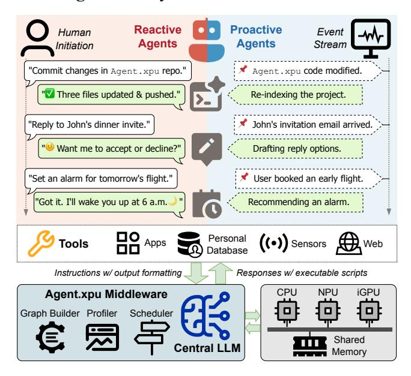
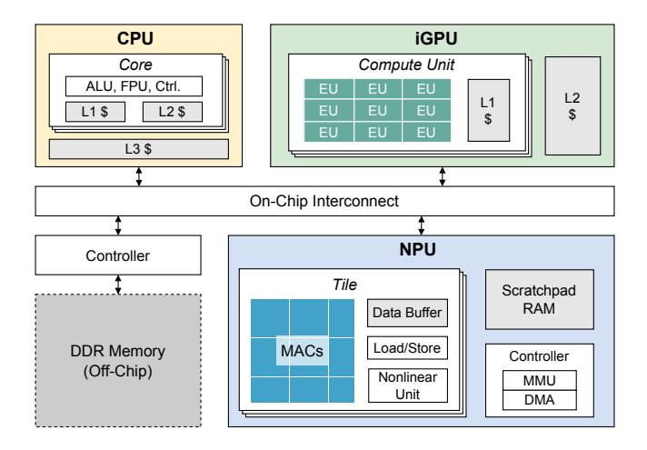
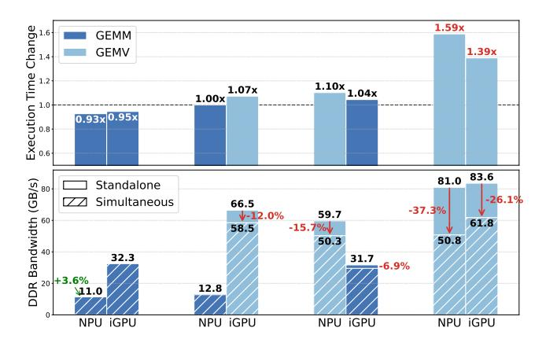
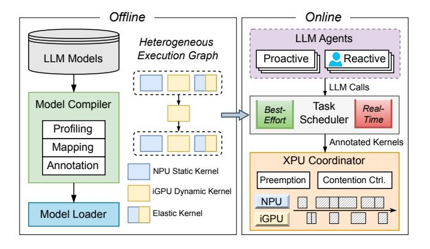
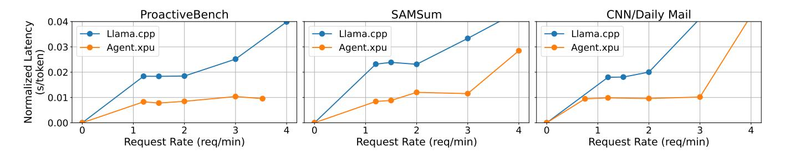
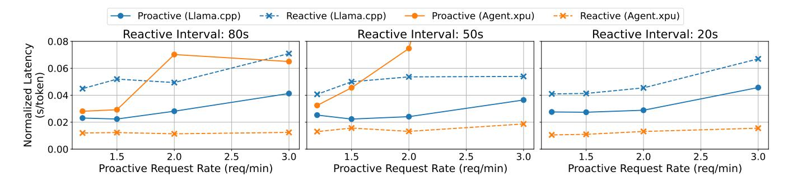

# Agent.xpu: Efficient Scheduling of Agentic LLM Workloads on Heterogeneous SoC

Xinming Wei<sup>∗</sup> Jiahao Zhang<sup>∗</sup> Haoran Li Jiayu Chen Rui Qu Maoliang Li Xiang Chen Guojie Luo

School of Computer Science, Peking University

# Abstract

The proliferation of agentic Large Language Models (LLMs) on personal devices introduces a new class of workloads characterized by a dichotomy of objectives. Reactive tasks, initiated by users, demand immediate, low-latency responses, while proactive tasks operate invisibly and prioritize throughput. Existing on-device LLM engines, designed for isolated inferences, fail to efficiently manage these concurrent and conflicting requests on consumer-grade heterogeneous SoCs with CPU, integrated GPU, and NPU.

This paper introduces Agent.xpu, an efficient serving system for agentic LLM workloads on memory-unified heterogeneous SoCs. With dedicated offline profiling, Agent.xpu first constructs a heterogeneous execution graph, which fuses and chunks model kernels for affinity-guided, elastic accelerator mapping with predictive kernel annotation. At runtime, its online scheduler enables fine-grained, kernel-level preemption to guarantee the responsiveness of reactive tasks. To maximize SoC utilization, it adopts slack-aware kernel backfill to opportunistically append proactive tasks, and mitigates NPU-iGPU contention via bandwidth-aware dispatch. Evaluation on an Intel Core Ultra SoC shows that Agent.xpu achieves 4.6× lower latency for reactive tasks and sustains 1.6×-6.8× higher throughput for proactive tasks compared to state-of-the-art inference engines.

# 1 Introduction

LLMs have catalyzed a paradigm shift in intelligent personal assistants [\[12\]](#page-12-0), enabling systems to autonomously reason, plan, and interact with external tools through agentic frameworks [\[41,](#page-12-1) [69,](#page-13-0) [76\]](#page-14-0). For example, given a user instruction "make a daily exercise plan based on my fitness last year", the LLM of a mobile agent [\[39,](#page-12-2) [68,](#page-13-1) [71,](#page-13-2) [80\]](#page-14-1) will retrieve relevant health data and generate personalized suggestions. With rising privacy concerns and latency requirements, local LLM deployment on mobile or desktop devices has gained traction [\[74,](#page-14-2) [77,](#page-14-3) [79\]](#page-14-4). Agentic applications further underscore on-device LLM since they frequently manipulate personal data and demand prompt response [\[41\]](#page-12-1). Beyond that, agents escalate LLM calls compared to traditional chatbots [\[19,](#page-12-3) [81\]](#page-14-5) and their wide adoption can overwhelm current cloud-based

<span id="page-0-0"></span>

Figure 1. Three-Layer Personal LLM Agent System. Agent.xpu with LLM backbone bridges the agent application layer and hetero-SoC hardware layer, orchestrating both real-time reactive queries and best-effort proactive tasks.

LLM services. Therefore, local deployment is efficient and secure for agentic LLM workloads.

As the foundation of on-device AI, modern system-onchip (SoCs) tend to integrate heterogeneous accelerators, including CPU, integrated GPU (iGPU), and neural processing units (NPU). The growing demand for on-device LLM at AI PCs or cellphones has spurred intense competition among hardware vendors, with mainstream products including Intel Core Ultra [\[26\]](#page-12-4), AMD Ryzen AI [\[56\]](#page-13-3), Apple Silicon [\[10\]](#page-11-0), and Qualcomm Snapdragon [\[32\]](#page-12-5). Software ecosystems complement SoC infrastructure, exemplified by Apple Intelligence [\[31\]](#page-12-6) and Microsoft Copilot [\[49\]](#page-13-4). Meanwhile, emerging lightweight LLMs (e.g., Llama-3.2-3B [\[47\]](#page-13-5), Phi-4-mini-3.8B [\[48\]](#page-13-6)) alleviate inference cost on resource-constrained SoC platforms. Acting as controllers instead of knowledge bases, they can outperform GPT-4 [\[2,](#page-11-1) [44\]](#page-13-7) in specific agentic tasks after finetuning [\[18\]](#page-12-7).

However, the gap between real-world personal assistant and on-device LLM is still widening. On one hand, existing

1

<sup>\*</sup>Equal contribution.

on-device inference optimizations [\[5,](#page-11-2) [73,](#page-13-8) [75\]](#page-14-6) focus on isolated inference tasks, overlooking the dynamic and concurrent nature of agentic LLM calls. On the other hand, recent works on agentic workflow optimization [\[43,](#page-12-8) [45,](#page-13-9) [66\]](#page-13-10) target multi-tenant LLM serving with task semantics, regardless of the distinct workloads of personal LLM agents on personal devices. Before introducing our framework, we identify the typical patterns of agentic workloads, together with the gap between personal agentic applications and heterogeneous SoC (hetero-SoC) systems.

Agentic LLM Workloads. As shown in Fig. [1,](#page-0-0) we summarize two patterns of workload from typical personal agents [\[12\]](#page-12-0). 1 Proactive workload, where daemon-like agents listen to predetermined event signals and act on them accordingly without human intervention [\[13,](#page-12-9) [38,](#page-12-10) [44\]](#page-13-7). Proactive agents are ambient, digesting event streams in the background without hard deadlines. 2 Reactive workload, on the contrary, is triggered by user conversation and expects timely response. Taking LLM-powered coding as an example, proactive agents monitor code changes, silently performing project parsing, cache construction, or code completion, while reactive agents respond to user prompts on demand, providing explanations, suggestions, or fixes based on the current context. As the central coordinator, the LLM parses natural language queries and crafts outputs that integrate its internal knowledge with tool-interaction commands.

Agent-SoC Gaps. The efficient execution of these mixed workloads is challenged by several fundamental gaps (§[2.4\)](#page-2-0), which we confirm and quantify in our hetero-SoC analysis ([§3\)](#page-3-0). First, there is a mismatch between the dynamic nature of LLMs and the hardware rigidity of accelerators. NPUs excel at static, pre-compiled computation graphs but struggle with the variable sequence lengths inherent to LLM inference, while more flexible iGPUs suffer from lower energy efficiency and distraction from graphics tasks. Second, constrained memory resources and bandwidth contention on shared-memory SoCs create a critical bottleneck that degrades performance, especially when latency-sensitive and throughput-oriented tasks run concurrently. Third, current hetero-SoC runtimes provide deficient abstractions for agentic workloads, lacking native support for the fine-grained preemption, priority scheduling, and dynamic batching necessary to efficiently co-locate reactive and proactive tasks. Agent.xpu Framework. To bridge these gaps, we propose Agent.xpu to efficiently schedule agentic LLM workloads on hetero-SoCs. It is also the first on-device LLM engine for concurrent inference serving. As shown in Fig. [1,](#page-0-0) Agent.xpu is designed from the ground up to understand and orchestrate the distinct proactive and reactive tasks, mapping them intelligently onto the underlying hardware to balance latency, throughput, and energy efficiency. It addresses the identified gaps through a combination of offline, profiling-driven compilation and online, adaptive scheduling. Implemented on

Intel Core Ultra SoCs with Llama-3.2-3B model, Agent.xpu

reduces reactive task latency by 4.6× over state-of-the-art baselines while sustaining high proactive throughput, and brings up to 6.8× throughput improvement for proactiveonly tasks. Our contributions are:

- We systematically analyze the unique characteristics of agentic LLM workloads and perform an in-depth empirical study (§[3\)](#page-3-0) that quantifies operator-XPU affinity, memory contention, batching effects, and proactive-reactive interference on modern hetero-SoC.
- We propose heterogeneous execution graph (HEG) ([§5\)](#page-5-0), a hetero-centric compute abstraction for elastic XPU mapping. It enables a principled, heterogeneous disaggregation of prefill and decode stages across the NPU and iGPU to leverage accelerator strengths and mitigate interference.
- We design an online scheduler ([§6\)](#page-7-0) that combines finegrained, kernel-level preemption for reactive responsiveness with a slack-aware backfill mechanism for proactive work conserving. Its built-in XPU coordinator fulfills adaptive kernel dispatch to avoid bandwidth contention, reduce pipeline bubbles, and maximize system throughput.
- We present a full-system implementation of Agent.xpu ([§7\)](#page-9-0) and evaluate it on a commercial SoC with popular ondevice LLMs ([§8\)](#page-10-0), Our hetero-driven approach significantly outperforms existing on-device LLM engines in single- and mixed-workload scenarios.

# 2 Background and Motivation

We first provide the preliminaries, including the typical architecture of hetero-SoCs (§[2.1\)](#page-1-0), the landscape of LLM inference from cloud-based serving to on-device deployment ([§2.2\)](#page-2-1), and an overview of personal LLM agent systems (§[2.3\)](#page-2-2). Then we describe the gaps between hetero-SoC and agent serving ([§2.4\)](#page-2-0), which motivate Agent.xpu design.

### <span id="page-1-0"></span>2.1 Heterogeneous SoC

Heterogeneous SoCs have been pivotal for efficient LLM deployment on personal devices. Spanning across mobile, laptop, and edge platforms, these SoCs share a similar architecture as shown in Fig. [2.](#page-2-3) Its memory hierarchy differs significantly from larger heterogeneous systems with discrete accelerators; CPU, iGPU, and NPU share the system physical memory, which avoids data transfer between host memory and devices. Similar to discrete GPUs, iGPUs consist of SIMT compute units. But they are not equipped with dedicated VRAM; they use a portion of system memory instead. NPUs are purpose-built for tensor operations with comparable parallelism and superior energy efficiency in contrast with iGPUs. The building block of most NPUs is spatial processing element (PE) array, and each PE executes a multiply-and-add operation per clock cycle. NPUs also share system memory and have limited on-chip scratchpad SRAM. The leading on-SoC NPUs such as Intel Lunar Lake [\[4\]](#page-11-3), AMD XDNA 2 [\[6\]](#page-11-4), and Qualcomm Hexagon Gen 4 [\[46\]](#page-13-11) achieve

<span id="page-2-3"></span>

Figure 2. Shared-Memory Hetero-SoC. iGPU builds upon thread-level execution unit (EU), while NPU adopts multiplyaccumulate (MAC) array for efficient tensor operations.

45∼50 INT8 TOPS, enabling them to offload demanding tasks from iGPUs. By colocating these components on a single die, heterogeneous SoCs minimize latency and power overheads while enabling workload-specific optimization.

### <span id="page-2-1"></span>2.2 LLM Inference: From Cloud to Personal Devices

LLM Inference Primer. LLM inference refers to the computational process through which pretrained language models generate outputs in response to input prompts. LLM inference based on the predominant decoder-only Transformer architecture includes two stages: prefill and decode. The prefill phase processes input prompt into intermediate token states and generates the first response token. The following auto-regressive decode phase produces the next token one at a time based on the current token sequence. The intermediate token states, known as KV cache [\[54\]](#page-13-12), is saved and updated after prefill and each decode step to avoid re-computations. The end-to-end latency of LLM inference can be divided into 1) time to first token (TTFT), the prefill duration, and 2) time per output token (TPOT) times the number of generated tokens except the first one during the decode phase.

LLM Serving. Cloud-based LLM inference is dedicated to serve user queries at high throughput while meeting servinglevel objectives (SLOs). Established techniques include kernel optimization [\[11,](#page-12-11) [72\]](#page-13-13), continuous batching [\[37,](#page-12-12) [78\]](#page-14-7) with chunked prefill [\[3\]](#page-11-5), prefill-decode disaggregation [\[52,](#page-13-14) [88\]](#page-14-8), KV cache reuse [\[1,](#page-11-6) [64,](#page-13-15) [86\]](#page-14-9) or defragmentation [\[37\]](#page-12-12), and improved tensor or pipeline parallelism [\[42,](#page-12-13) [61\]](#page-13-16). For resourceconstrained conditions where GPU memory is limited, existing solutions propose CPU memory/disk offloading by leveraging weight locality [\[63\]](#page-13-17) or I/O-aware scheduling [\[59\]](#page-13-18). On-Device LLM. With growing demand for privacy, responsiveness, and power efficiency, a series of industrial on-device LLM inference engines have been developed, such

as Microsoft ONNX-Runtime [\[16\]](#page-12-14), Intel OpenVINO [\[9\]](#page-11-7), Qualcomm QNN [\[17\]](#page-12-15), Apple Core ML [\[14\]](#page-12-16), Google LiteRT [\[15\]](#page-12-17), and Llama.cpp [\[21\]](#page-12-18). They streamline the out-of-the-box LLM deployment on CPU, GPU, or NPU from specific vendors. Besides, MLLM-NPU [\[73\]](#page-13-8) improves NPU prefill with prompt chunking and CPU offloading of accuracy-sensitive outliers. PowerInfer-2 [\[75\]](#page-14-6) decomposes matrix operations into neural clusters and processes clusters with dense (sparse) activations with NPU (CPU). HeteroLLM [\[5\]](#page-11-2) enables NPU-GPU heterogeneous execution with tensor partition. However, these approaches rely heavily on model activation sparsity or INT4 quantization, which potentially compromises inference accuracy. Other recent progresses [\[58,](#page-13-19) [65\]](#page-13-20) alleviate the bottleneck of memory bandwidth in on-device LLM inference with advanced DRAM/flash technology. Overall, these approaches are designed mainly to optimize the end-to-end latency of monolithic inferences, while future on-device agentic applications require extensive support for concurrency, state dependency, and real-time interactivity.

### <span id="page-2-2"></span>2.3 Personal LLM Agent System

In this work, we focus on personal LLM agents deeply coupled with personal data, personal devices, and personal applications [\[41\]](#page-12-1). Like the OS kernel, the LLM engine is the core of a personal LLM agent system, handling the reasoning [\[55,](#page-13-21) [70\]](#page-13-22), planning [\[30,](#page-12-19) [62\]](#page-13-23), and self-reflection [\[60,](#page-13-24) [82\]](#page-14-10) tasks. Besides LLM calls, agentic workflows tend to be intercepted by human interactions or tool using, which constitute the external interrupts in LLM agent systems. Personal LLM agents automate tasks by API-based code generation [\[24,](#page-12-20) [50,](#page-13-25) [57\]](#page-13-26) or UI-based action translation [\[28,](#page-12-21) [40,](#page-12-22) [71\]](#page-13-2). LLM agent orchestration frameworks, such as LangChain [\[7\]](#page-11-8), LlamaIndex [\[8\]](#page-11-9), and AutoGen [\[67\]](#page-13-27), provide convenient ways to build composable agentic workflows with customizable tool invocation, agent controlling, and event handling. Multiagent collaboration [\[27,](#page-12-23) [67\]](#page-13-27) further enhances the performance on complex tasks.

## <span id="page-2-0"></span>2.4 Gaps between Hetero-SoC and Agent Serving

• Mismatch between model dynamism and hardware rigidity. Modern LLMs handle arbitrarily-sized user input sequences via dynamic-shape operators along the sequence dimension. However, mainstream NPUs are designed for efficient predefined NN operations with static shapes. Since NPUs rely on expensive compilation of static computational graphs to preallocate resources and optimize dataflows (e.g., tiling tensor operations onto fixed-size MAC arrays), it is infeasible to apply cold start compilation for a runtime inference. Conversely, while more programmable iGPUs support dynamic kernels, they suffer from lower energy efficiency and conflict with graphics rendering workloads (e.g., UI composition and video play-back), making full-iGPU approaches impractical for personal devices. We delve into op-level NPU/iGPU characteristics in [§3.1.](#page-3-1) Consequently, NPU-iGPU collaboration

emerges as the most viable path, despite unresolved challenges in workload partitioning and accelerator interference discussed later.

- Constrained memory resources and bandwidth contention. Unlike data center servers, personal SoCs face stringent constraints on both memory capacity and bandwidth. NPUs and iGPUs typically operate with limited on-chip SRAM, and rely heavily on external DRAM, which is both shared and bandwidth-constrained. This limits kernel size, context length, and batch dimensions-critical for serving throughput. Moreover, simultaneous DDR access from both NPU and iGPU creates *contention* that slow down concurrent requests. This bottleneck is exacerbated when processing mixed agentic workloads: when proactive tasks in memory-bound decode stage strain DDR bandwidth, latency-sensitive reactive requests will delay on any accelerator. We further analyze memory bottlenecks in 3.1. Without intelligent memoryaware scheduling, DDR saturation directly degrades tail latency and system responsiveness.
- Deficient runtime abstraction for agentic workloads. Most hetero-SoC runtimes are optimized for stateless, offline workloads, and lack essential abstractions for agent-oriented LLM serving. First, support for dynamic batching across agentic LLM requests is often missing, leading to suboptimal hardware utilization. Second, hetero-SoCs lack software and hardware assistance for fine-grained preemption and priority scheduling, making it difficult to isolate high-priority workloads from background inferences. Third, with limited hardware-level control, software schedulers lack visibility into accelerator states (e.g., NPU buffer occupancy) and struggle to orchestrate compute across accelerators dynamically, leading to load imbalance and underutilization. These gaps fundamentally undermine efficient coexistence of personal agents on resource-constrained SoCs. We investigate the runtime characteristics of hetero-SoCs in §3.2.

## <span id="page-3-0"></span>3 Hetero-SoC Analysis

We conduct comprehensive hetero-SoC analysis to guide the design of Agent.xpu profiler, mapper, and scheduler. Our op-level analysis (§ 3.1) examines the compute and memory requirements of representative LLM ops, while the task-level analysis (§ 3.2) inspects the runtime attributes when handling end-to-end agentic LLM calls.

## <span id="page-3-1"></span>3.1 Op-Level Analysis

In common LLMs, dense matrix multiplication (GEMM) in linear layers and multi-head attention (MHA) dominate the amount of computation and the total inference time. Other non-linear or element-wise tensor ops are trivial and can be easily fused with linear ops, thanks to the specialized non-linear or vector units in modern NPU/iGPUs. We categorize LLM ops by their *scope*: most LLM ops operate at *token-level* and can be stacked for a sequence, with the only

exception MHA¹ that calculates *sequence-level* correlations and disallows token-wise decomposition. Accordingly, MHA enforces dynamic-shape kernels, while GEMM can leverage static kernels via chunking. Both the op type and sequence length can impact the compute intensity and memory traffic. We profile GEMM and MHA with varying sequence lengths on a PC with Intel Core Ultra 7 Processor 258V [33], a typical hetero-SoC with 32GB on-package LPDDR5X-8533 DRAM. The power and memory access analysis are based on Intel Vtune Profiler [34].

**Op-XPU Affinity.** We illustrate the affinity of GEMM and MHA on NPU/iGPU with roofline analysis. We formulate GEMM as  $Y_{k\times M} = X_{k\times D} \cdot W_{D\times M}$ , where W denotes the weight matrix, and *X*, *Y* are activations. *k* is the sequence length. We evaluate group query attention (GQA), a memory-efficient variant of MHA, with head dimension 128 and 32 Q heads, 8 K/V heads. To account for the NPU's JIT compilation overhead of dynamic attention kernels in actual inferences, we incorporate an amortized compilation cost<sup>2</sup> into the kernel execution time. In contrast, GEMM NPU kernels can be precompiled with specific chunk sizes. We measure the throughput (TFLOPS) and energy efficiency (TFLOPS/W) of each op, relative to arithmetic intensity (AI, TFLOPs/Byte). We can conclude from the results shown in that: 1) For GEMM, NPU manifests superior efficiency when taking both performance and energy into account, despite iGPU outperforms NPU at long input lengths<sup>3</sup>. 2) MHA poses a significant performance bottleneck for the NPU, whereas the iGPU handles it more smoothly with dynamism support.

Memory Access Pattern and Contention. When executing kernels with data read/write from/to the host memory, discrete GPUs with dedicated VRAM adopts bulk transfer and decoupled compute, where data blocks are explicitly transferred between host DRAM and device VRAM prior to or after kernel execution. Conversely, we observe that NPU and iGPU with limited local SRAM and DMA controller rely on streaming access and coupled compute to consume data progressively during kernel execution. The distinctive memory access pattern of hetero-SoC underscores the significance of 1) data locality and reuse, which is improved by op grouping and kernel fusion (§ 5.2), and 2) NPU-iGPU contention management, which is discussed as below.

To assess the impact of memory contention, we compare DDR bandwidth and kernel execution time in two scenarios: when NPU and iGPU kernels are run independently,

<span id="page-3-2"></span><sup>&</sup>lt;sup>1</sup>In this paper, we distinguish between QKV linear and the subsequent multi-head attention, and refer to MHA as the latter.

<span id="page-3-3"></span><sup>&</sup>lt;sup>2</sup>To derive the amortized NPU kernel compilation cost, we divide the compilation time by 16, a minimal # of layers in common LLMs.

<span id="page-3-4"></span><sup>&</sup>lt;sup>3</sup>Our evaluated desktop iGPU exhibits high peak performance, which may not hold on mobile iGPUs [5]. For generality, we do not rely on this performance advantage when designing Agent.xpu techniques.

<span id="page-4-2"></span>

**Figure 3. Memory Contention Analysis.** Changes of execution time (upper) and DDR bandwidth (lower) from standalone NPU/iGPU kernel running to simultaneous co-execution. Memory-bound GEMV kernels are more sensitive to NPU/iGPU parallelism than compute-bound GEMM.

and when they are co-executed<sup>4</sup>. Bandwidth reflects the kernel's intrinsic AI, subject to accelerator parallelism and available memory bandwidth. As shown in Fig. 3, we study GEMM and GEMV ops<sup>5</sup> prevalent at prefill and decode times, respectively. In all four scenarios, parallel execution provides higher throughput than standalone. Co-execution of compute-bound GEMM kernels is latency-friendly, while the latency of memory-intensive GEMV is undermined when overlapped with another kernel, especially that with similarly high bandwidth requirement. Drawn from our analysis, NPU or iGPU kernels should be adaptively scheduled based on their memory access heaviness to avoid contention.

#### <span id="page-4-0"></span>3.2 Task-Level Analysis

Beyond op-level profiling, we examine the task-level behavior of concurrent LLM agent invocations on hetero-SoCs. Unlike isolated LLM inferences, real-world agentic workloads manage both latency-critical and throughput-oriented LLM requests, where prefill or decode jobs from different requests may overlap. These overlapped executions exacerbate the contention of limited resources of hetero-SoCs and deteriorates system performance.

Batching Effects on Hetero-SoC. Batching multiple LLM calls can intuitively improve the overall system throughput. Nevertheless, the per-request latency becomes more sensitive to the heaviness of batched or colocated jobs on resource-constraint SoCs. We analyze the latency of 1) batching multiple prefill tasks, 2) batching multiple decode tasks, and 3) batching one prefill with multiple decode tasks, on a single accelerator. We find that a prefill job can almost

<span id="page-4-4"></span>

**Figure 4. Proactive-Reactive Co-Scheduling.** Given a proactive task  $T_P$  and a reactive task  $T_R$ , (a)(b)(c) target single XPU, while (d) leverages two hetero-XPUs primarily for prefill and decode, respectively. (d) achieves lowest reactive task latency (orange crossbar) and highest system throughput.

saturate an NPU or iGPU since the latency increases proportionally with the batch size, while the decode batch has relatively stable execution time. On both NPU and iGPU, the latency degradation of decode tasks batched with one prefill is much more severe than the prefill task. This inspires us to leverage the inherent heterogeneity and memory sharing of SoCs to eliminate the prefill-decode interference.

Proactive-Reactive Interference. Agentic LLM systems often interleave proactive and reactive tasks. To meet the conflicting latency or throughput expectations of different tasks, we need to efficiently co-schedule these LLM workloads. As shown in Fig. 4, we illustrate the interference between proactive and reactive tasks with four co-scheduling schemes. Scheme (a)(b)(c) are typical solutions on homogeneous compute instance (single XPU here). In (a), the proactive task is instantly preempted by a newly-arrived reactive task without saving the prefill context. It provides fast user-responsiveness with significant throughput loss, since the reactive task runs solely on the XPU while proactive ones suffer from idleness and recomputations. Scheme **(b)** leverages the multitasking support (e.g., multi-stream, virtualization) of advanced XPUs to allow independent reactive and proactive tasks to time-share the XPU. This slows down each task and wastes memory resources due to duplicated intermediate buffers. Scheme (c) adopts standard continuous batching [37, 78] where each request is scheduled at iteration level. The scheme is prone to the inequality of prefill and decode stages when batching them together. In this example, the reactive request cannot join the batch until

<span id="page-4-1"></span> $<sup>^4\</sup>mathrm{To}$  ensure fair comparison and eliminate bias from differing standalone execution times, NPU and iGPU kernels are launched repeatedly and concurrently within a fixed time window in all co-execution experiments.

<span id="page-4-3"></span> $<sup>^{5}(</sup>k, M, D) = (4096, 4096, 4096)$  for GEMM; (1, 4096, 4096) for GEMV.

<span id="page-5-1"></span>

Figure 5. Agent.xpu System Design.

the long proactive prefill finishes, and the proactive decode is delayed by the reactive prefill. (a)(b)(c) co-locate hybrid workloads or stages with distinct objectives or runtime patterns on a single XPU, which inevitably introduces resource inefficiencies.

Targeting hetero-SoCs, our work (d) dynamically dispatches prefill or decode jobs to different XPUs. We propose an efficient kernel-level preemption to reduce context switching overhead. For low latency of reactive workloads, their prefill computations are partially offloaded to decode XPU. For system throughput, the proactive workloads can adaptively pad the reactive one with its latency preserved (e.g., co-executed prefill+decode, batched decodes) based on our contention and batching profiling. In this way, we ensure both real-time objectives and proactive work conserving.

# 4 Agent.xpu Overview

Agent.xpu is a higher-level serving engine for the concurrent LLM calls of on-device personal agents, rather than standalone single-batch LLM inferences. Agent.xpu focuses on the following primary objectives: 1) prioritizing the endto-end latency of LLM requests of reactive agents for user experience, 2) improving the overall throughput of background LLM calls from proactive agents, and 3) optimizing the utilization of limited compute resources in heterogeneous SoCs to strive for performance and energy efficiency.

Workload Settings.Given the uniqueness of personal agents, we assume at most one human-initiated, reactive LLM request at a time, while multiple event-driven, proactive requests may overlap with it. The LLM inferences are independent of other agentic sub-tasks, e.g., the interplay with human or external tools.

System Assumptions. Agent.xpu targets a single LLM core and operates non-clairvoyantly, aware only of task priority (proactive or reactive) when issued. It is agnostic to agentic workflow structure or task arrival times. We assume non-LLM tasks like human interaction or tool using do not contend for NPU, while iGPU usage is bounded in Agent.xpu to preserve graphics availability.

System Design. Fig. [5](#page-5-1) depicts the overall system design of Agent.xpu, which consists of offline model compilation and warmup (§[5\)](#page-5-0), and online workload-aware scheduling (§[6\)](#page-7-0). Guide by profiling, the offline model preparation maps a given LLM model to NPU or iGPU kernels to form a heterogeneous execution graph (HEG), and then annotates each kernel with performance or power estimations to direct the online scheduling. The specification of elastic kernel backend is deferred until runtime. When launching the Agent.xpu engine, the model weights and the HEG with optimized kernels are loaded into the shared memory. During online scheduling, Agent.xpu maintains best-effort and real-time task queues to buffer proactive and reactive LLM requests, respectively. Each task is decomposed and transformed to fit in the HEG. The XPU coordinator performs busy polling on task queues and dispatches original or batched kernels to the NPU or iGPU. Under the Agent.xpu scheduling strategy, the real-time kernels efficiently preempt best-effort ones for the optimal response time, while the coordinator opportunistically co-schedules or batches suitable best-effort kernels from the waiting queue with the running real-time kernels. This slack-aware kernel backfill approach maximizes system throughput while preserving real-time guarantees. The XPU coordinator implements the strategy to the underlying SoC by dynamic kernel allocation (to NPU/iGPU), kernel batching, and contention-aware, bubble-reducing kernel reordering.

# <span id="page-5-0"></span>5 Heterogeneous Execution Graph

To capture the execution of LLM workloads on heterogeneous SoCs, we propose the HEG that incorporates both LLM structure and hardware-specific information. Conventional statically compiled computational graphs are inadequate in this scenario, due to the dynamic nature of LLM inference (e.g., variable input length, uncertain generation steps) and the interplay between XPUs. This section is composed of the following parts: [§5.1](#page-5-2) discusses the potential granularity and design space of mapping LLMs to XPUs. §[5.2](#page-6-0) depicts the concrete mapping strategies. [§5.3](#page-7-1) supplements the generated kernels with estimated performance and power characteristics to augment the subsequent online scheduling.

## <span id="page-5-2"></span>5.1 Mapping Granularity and Space

In our HEG setting, mapping chooses the optimized placement of ops or layers onto NPU/iGPU. Previous works [\[83,](#page-14-11) [84,](#page-14-12) [87\]](#page-14-13) about DNN mapping on heterogeneous accelerators are not tailored for LLM networks or on-device platforms. To coordinate both the computation and memory bandwidth in resource-constrained SoCs, we need to scrutinize 1) the

mapping granularity – the size and complexity of the computational units (kernels) considered for independent mapping, and 2) the mapping space constrained by op-XPU affinity, specifying XPU selections and chunking options.

Op-Group-Based Mapping. We consider the following three candidate mapping schemes with varied granularity. Request-level mapping assigns the whole graph corresponding to a single inference request to NPU or iGPU. However, this coarse-grained mapping overlooks the op-XPU affinity and causes under-utilization of heterogeneous resources. Subop-level mapping decomposes an op into finer-grained computations and binds them to different XPUs. In our practice, a single op in LLM can hardly saturate NPU or iGPU, and the overhead introduced by data transfer is non-trivial. Accordingly, we perform op-group-based mapping, where consecutive ops are grouped and assigned to a given XPU, forming a hardware-specific kernel. In this way, we fully utilize the compute resources by directing each op-group to suitable XPU backend, and the memory bandwidth by reducing inter-XPU data transfer.

Mapping Constraints and Design Space. We can prune the mapping space by op affinity with heterogeneous accelerators. We have shown that NPUs can only deal with static kernels to avoid runtime compilation, while GPUs are more flexible and support kernels with dynamic input/output dimensions. Token-level ops can generate either static kernels with fixed-length chunking, or dynamic kernels with arbitrary sequence length. MHA, nevertheless, acts on varied sequence length and requires iGPU for dynamic shape support. Op groups bound with NPU cannot contain dynamic ops. To achieve compute efficiency, we need to chunk tokenlevel ops along the sequence dimension, and the chunk size becomes a XPU-related design parameter.

## <span id="page-6-0"></span>5.2 Profiling-Guided Mapping Exploration with Agentic Workload Prior

Given the prerequisites for heterogeneous mapping, Agent.xpu can swiftly find a placement based on SoC profiling results and intuitions from the underlying agentic workloads. Thanks to the simplicity of LLM workflow and the NPU/iGPU binary mapping, the exploration does not require hard labor or complex solving. Our mapping scheme observes the following principles.

Compute-Communicate Balance. The mapping schemes in existing on-device LLM inference solutions [\[5,](#page-11-2) [73\]](#page-13-8) are compute-centric, where compute-intensive matrix multiplication ops are intended for NPUs, and NPU-unfriendly nonlinear ops like LayerNorm or SwiGLU are offloaded to CPUs or iGPUs. This mapping strategy ignores the communication cost of intermediate activations between consecutive heterogeneous kernels, and the improvement of compute can be cancelled out by such cost. We note that nonlinear computations take up a small portion of inference time, and cutting-edge NPUs are equipped with specialized nonlinear

units. Via dedicated profiling, Agent.xpu opts to fuse linear and adjacent nonlinear ops to maximize the data reuse in the XPU local memory and reduce DDR accesses. Fused kernels that are mapped to single XPU also enable intra-kernel dataflow optimizations with device compilers.

Elastic Chunked Kernel. After op grouping and fusion, we derive both token-level and sequence-level kernels. The latter cannot be futher decomposed and are dedicated for iGPUs with dynamic shape support. The former, however, are mutable in terms of input length or XPU binding. Unlike previous solutions [\[5,](#page-11-2) [73\]](#page-13-8) with deterministic NPU/iGPU mapping, we propose elastic chunked kernel where the backend is determined later by the runtime XPU coordinator. Such elasticity enables better flexibility to satisfy varied scheduling objectives. Furthermore, kernel chunking alleviates the pressure of limited on-device memory, since the kernel complexity, reflected by the size of intra-kernel dataflow scheduling information, grows exponentially with the input length along the sequence dimension. Chunking thus keeps the active XPU kernels memory-efficient. The chunk size is derived by kernel-wise profiling, and we choose the turning point where the kernel just saturates the NPU or iGPU. Eventually, each token-level kernel is bound to elastic kernel for NPU/iGPU execution with corresponding chunk size, together with dynamic iGPU kernel, to allow for arbitrary prompt length or batch size.

Hetero-Disaggregated Prefill and Decode. To meet the throughput and latency requirements when responding to agentic LLM calls, we tendentiously dispatch most prefill jobs to NPU, and run the decode jobs solely on iGPU. To this end, the elastic token-level kernels will be eagerly specified as NPU kernels in the prefill graph, and decode-time ones as iGPU. The sequence-level kernels (i.e., self-attention), and the dynamic token-level kernels for the prompt margin in prefill, are performed on iGPU. Such heterogeneous disaggregation mapping is driven by multiple factors. First, the heterogeneous compute resources can be reasonably allocated. The NPU is more capable of massive tensor multiplications in prefill with high efficiency and low power, while the iGPU undertakes the lighter self-attention and decode tasks for decreased iGPU utilization. The dynamic shape support of iGPUs also enables the flexible batching of decode tasks internally or with the dynamic iGPU part of prefill tasks. Second, the prefill-decode interference can be minimized to improve the latency of decode jobs. Unlike cloud-based disaggregation [\[52,](#page-13-14) [88\]](#page-14-8) which requires expensive KV cache transfer between prefill and decode instances, SoC platforms enable seamless KV cache sharing between NPU and iGPU with the unified physical memory. Overall, prefill-decode disaggregation fully leverages the SoC resources and improves the handling of agentic LLM workloads than colocated inference where prefill and decode requests are batched together.

## <span id="page-7-1"></span>5.3 Per-Kernel Predictive Annotation

After the mapping of HEG, Agent.xpu annotates each kernel with performance and power estimations to instruct the runtime scheduler. Such predictability is feasible considering the characteristics of LLM kernels and XPUs. Given a input prompt length, we discover that: 1) LLM kernels are mostly idempotent, comprising dense linear algebra computations with fixed result and complexity (OPs). 2) in our practice, the latency and power of executing a NPU or iGPU kernel independently are almost deterministic with little variance in multiple runs. 3) Our profiling shows that NPUiGPU interference during simultaneous kernel running can be qualitatively analyzed based on the memory pressure. The metrics in predictive annotation are listed as below, and all these metrics are w.r.t the prompt length .

- Standalone execution time: We can delineate the latency of independently running NPU/iGPU kernels w.r.t . Given kernel-wise roofline models derived from profiling, we can precisely estimate the execution time for an arbitrary .
- Memory bandwidth utilization: We quantize the memory intensity of a NPU/iGPU kernel as memory bandwidth utilization, i.e., the portion of actual memory I/Os in the maximum bandwidth. This metric guides concurrent NPU/iGPU kernel scheduling to avoid memory contention.
- Memory footprint: We denote the memory usage of a running kernel as memory footprint, including the weight data, activation buffer, and device-specific instructions. Since SoC platforms are memory-constrained, the scheduler can dynamically load or offload kernels to fit in the limited memory.
- Power consumption: We have observed that the dynamic power when executing a kernel on a specific XPU is stable, and thus the power consumption can be estimated as the product of power and predicted runtime.

# <span id="page-7-0"></span>6 Online Workload-Aware Scheduling

The online scheduler in Agent.xpu orchestrates the execution of heterogeneous kernels derived from the HEG, dynamically adapting to the arrival patterns and priorities of agentic workloads. Unlike traditional LLM serving systems that optimize for throughput alone, our scheduler must balance the conflicting objectives of minimizing reactive task latency while maximizing proactive task throughput on resourceconstrained SoCs. This section presents our scheduling architecture ([§6.1\)](#page-7-2), kernel-level preemption mechanism (§[6.2\)](#page-7-3), slack-aware kernel backfill strategy (§[6.3\)](#page-8-0), and memoryaware contention management ([§6.4\)](#page-8-1).

### <span id="page-7-2"></span>6.1 Scheduling Guidelines and Components

Dual-Queue Architecture. Agent.xpu employs a dual-queue architecture to segregate workloads by priority. The real-time queue buffers reactive LLM requests that demand immediate response, while the best-effort queue accumulates proactive

requests that can tolerate higher latency. This separation enables differentiated scheduling policies without complex priority inversions. Each incoming LLM request is tagged with its priority upon arrival and enqueued accordingly.

Task Decomposition and Dispatch. Upon dequeuing, each LLM task undergoes decomposition into a sequence of kernels based on the pre-compiled HEG. Generally, the chunked token-level kernels at prefill time are assigned to the NPU, while other kernels, including dynamic-shape prefill kernels and all decode kernels are assigned to the iGPU. This disaggregation avoids NPU-iGPU memory contention and improves energy efficiency since decode computations have low iGPU utilization. Nevertheless, the kernel dispatch is adaptive, subjective to current workloads. For example, the dispatcher can either send prefill kernels of a reactive task to both NPU and iGPU to increase parallelism, or launch starved proactive prefill on iGPUs given long reactive prefill. These task transformation steps preserve data dependencies while exposing parallelism opportunities across heterogeneous accelerators.

XPU Coordinator. The central XPU coordinator implements a busy-polling loop that continuously monitors both queues and orchestrates kernel dispatch. The coordinator maintains several critical data structures: 1) Active kernel table: Tracks currently executing kernels on each accelerator. 2) Memory pressure estimator: Aggregates bandwidth utilization across active kernels. 3) Preemption context buffer: Stores pointers to intermediate buffers for preempted kernels. 4) Backfill candidate pool: Maintains ready-to-execute best-effort kernels.

### <span id="page-7-3"></span>6.2 Fine-Grained Kernel-Level Preemption

To ensure reactive task responsiveness, Agent.xpu implements a novel kernel-level preemption mechanism that minimizes context switching overhead while preserving computation progress.

Preemption Granularity. Unlike iteration-level preemption that discards entire computations or defers incoming request, our approach operates at kernel boundaries within the HEG. When a reactive task arrives during proactive execution, the coordinator allows the current kernel to complete (avoiding mid-kernel interruption). Our proper chunking strategy restricts each prefill kernel's execution time to less than 100 ms, which minimizes the preemption latency. Then the coordinator checkpoints the proactive task's state including partial KV cache and layer progress. The checkpointing operation has no extra overhead, since intermediate results have been located in DDR after kernel execution, without explicit transferring. The reactive kernels are then instantly scheduled to the prefill or decode pipelines, depending on the latency requirements or power budget. Compared with iteration-level or layer-level preemption, this fine-grained

mechanism exploits the natural boundaries in LLM computation; each kernel produces well-defined intermediate activations that serve as efficient checkpoints.

Context Management. The scheduler maintains the meta information and the context of each preempted request. The meta information includes the input prompt, the arrival time, and the prefill or decode progess. If the preempted request is midway in prefill, the estimated time to completion (ETC) can be derived given prompt length and kernel annotations. For requests proceeded to decode, their ETC cannot be tracked unless they follow some output template. The ETC will guide our resumption strategy discussed later. The preemption context is encapsulated in the following data structure:

```
struct ReqContext {
  int layer_id;  // model progress
  float16_t** kv_cache_ptr;  // attention states by layer
  /* output of predecessor kernels */
  std::vector<float16_t*> activation_buffer;
  /* topological-sorted unexecuted kernels */
  std::vector<Kernel*> remaining_kernels;
};
```

where layer\_id indicates the inference progress through the model, layer-wise kv\_cache\_ptr references accumulated attention states, activation\_buffer stores the last layer's output, and remaining\_kernels lists unexecuted operations. Specifically, the activation\_buffer contains all necessary intermediate results attached with executed predecessors of remaining\_kernels. The unified memory architecture of SoCs eliminates costly data movement during context switches—pointers remain valid across NPU/iGPU transitions.

Resumption Strategy. We consider the scenario when preempted proactive tasks resume execution: the reactive task finishes prefill, while the original proactive decode can automatically batch with reactive prefill offloaded to the iGPU. Preempted proactive tasks resume prefill execution based on a dynamic priority that considers both the progress and the elapsed time since preemption. To avoid starvation, the proactive task with pending time over a specific threshold will be resumed first. The priority of other tasks will be determined by their ETC: the task with lower ETC are preferred since they can enter the decode pipeline earlier, which increases the overall throughput of decode pipeline on iGPU. Upon resumption, the request context can be recalled with no extra overhead.

#### <span id="page-8-0"></span>6.3 Slack-Aware Kernel Backfill

To maximize system utilization without compromising reactive performance, Agent.xpu employs slack-aware backfill that opportunistically co-schedules best-effort kernels alongside real-time workloads.

**Slack Identification.** The scheduler identifies three types of execution slack in reactive workloads: 1) *Structural slack*: Inherent parallelism between NPU and iGPU operations.

One of NPU or iGPU may be idle when the other is running kernels. 2) Compute Slack: Underutilized compute resources during memory-bound kernels, common in iGPU decode kernels. Batching is the most straightforward approach to improve throughput. 3) Memory slack: Underutilized bandwidth during compute-bound kernels. The recipe is to utilize the structural slack, scheduling kernels on the other XPU. Intra- and Inter-XPU Backfill. Based on the identified slack, proactive kernels can backfill reactive ones on either the same XPU or the other XPU pipeline. 1) Intra-XPU backfill exploits the underutilized compute throughput of memorybound kernels via adaptive batching. This applies to tokenlevel decode kernels on iGPU, and the attention kernels have to be executed one-by-one. At the boundary of each decode iteration, the pending proactive decode requests join the batch without disturbing reactive latency. 2) Inter-XPU backfill utilize the structural and memory slack by eliminating bubbles of NPU or iGPU pipelines. For example, the proactive prefill on NPU can work in parallel with reactive decode

In general, the candidate proactive kernels must satisfy several constraints: 1) *Duration constraint*: Completion within the reactive kernel's execution window. 2) *Memory constraint*: Combined bandwidth utilization below a threshold. 3) *Affinity constraint*: Targeting the non-conflicting accelerator when possible. Our scheduling prioritizes candidates by power efficiency (TFLOPS/Watt) to optimize energy consumption while maintaining performance objectives. For adaptive batching, when multiple decode operations qualify for backfill, the scheduler dynamically forms batches up to size  $B_{max}$ ; the batch size decision marks the upper bound for negligible marginal latency increase from batching, as characterized in our profiling (§ 3.2).

## <span id="page-8-1"></span>6.4 Contention Mitigation

on iGPU.

Given the shared memory architecture and limited bandwidth of SoCs, careful orchestration of concurrent kernels is crucial to avoid destructive interference.

**Bandwidth Pressure Estimation.** The coordinator maintains a real-time estimate of memory pressure:

$$P_{mem}(t) = \sum_{k \in \Delta \text{-time}} \frac{BW_k(t; \phi)}{BW_{peak}}$$

where  $BW_k(t;\phi)$  denotes the instantaneous bandwidth consumption of kernel k, and  $\phi$  comprises runtime properties (e.g., sequence length, batch size, the underlying XPU). Based on memory pressure, the scheduler implements a three-tier dispatch policy: 1) Low pressure ( $P_{mem} < 0.4$ ): Aggressive coscheduling of NPU and iGPU kernels. 2) Medium pressure ( $0.4 \le P_{mem} < 0.7$ ): Selective pairing based on kernel memory intensity. 3) High pressure ( $P_{mem} \ge 0.7$ ): Sequential execution with priority to reactive kernels.

### <span id="page-9-1"></span>Algorithm 1 Memory-Aware Kernel Dispatch

```
1: procedure DISPATCHKERNEL(K, XPU<sub>target</sub>)
        P_{current} \leftarrow \text{GetMemoryPressure}
2:
        \Delta P \leftarrow \text{EstimatePressureIncrease}(K)
3:
        if P_{current} + \Delta P > \tau_{high} then
 4:
            WaitForSlot(XPU_{target})
5:
        else if K.priority = REACTIVE then
 6:
            LAUNCHIMMEDIATE(K, XPU_{target})
 7:
 8:
        else
9:
            if CanCoSchedule(K, ActiveKernels) then
                LAUNCH(K, XPU_{target})
10:
            else
11:
                EnqueueDeferred(K)
12:
            end if
13:
        end if
14:
        UPDATEMEMORYPRESSURE
15:
16: end procedure
```

Kernel Reordering. Given the DAGs of each active tasks, the scheduler performs global and localized kernel reordering to minimize memory contention. Algorithm 1 illustrates our memory-aware dispatch logic. The key insight is to prevent memory bandwidth saturation proactively rather than reacting to performance degradation. Overall, memory-intensive kernels (e.g., GEMV during decode) are separated temporally without NPU-iGPU overlapping. Compute-intensive kernels (e.g., large GEMMs during prefill) are preferentially overlapped. Producer-consumer pairs are kept adjacent to maximize cache locality.

#### 6.5 Practical Considerations

**Starvation Prevention.** While reactive tasks receive priority, the scheduler implements aging mechanisms to prevent indefinite postponement of proactive tasks. Proactive tasks that exceed a threshold age are promoted to prevent starvation. Instead of pausing reactive execution, the scheduler reallocates the iGPU to proactive prefill, and keeps reactive prefill solely on NPU. The decode of proactive and reactive tasks can be seamlessly batched without incurring performance penalties.

**Dynamic Load Balancing.** The elastic kernel design enables runtime migration between NPU and iGPU based on current accelerator utilization, memory pressure differential, and queued workload characteristics. For instance, when the NPU is saturated with prefill operations but the iGPU has spare capacity, elastic token-level kernels can be redirected to the iGPU despite the original mapping preference.

Memory Management and Disk Swapping. To fully utilize the constrained memory resources on hetero-SoC, we implement a kernel-level garbage collector, which tracks each kernel's lifecycle and reclaims the memory (including internal buffers and accelerator-specific instructions) of inactive kernels. Targeting personal agents on personal

devices, our proposed methods and evaluations assume moderate workload density without exceeding available RAM. In case of memory insufficiency, we can selectively offload KV cache and/or model weights to flash storage, instead of blind swapping controlled by OS. Such offloading techniques are orthogonal to this work and can augment our system with reference to existing solutions [59] in the future.

Interaction with Interception. Prefix caching [86] is a common technique in LLM interceptions (e.g., multi-turn dialogue), where the KV cache of historical context remains in memory for later reuse. Agent.xpu provides a basic inmemory option for each request. A more comprehensive approach is to budget the overhead among discard (then recompute), keep, or offload to slower memory [1] based on the underlying system, which can be seamlessly integrated into Agent.xpu.

**Synchronization Cost Minimization.** The scheduling implementation must be lightweight to avoid becoming a bottleneck. We achieve low scheduling latency through lock-free queue implementations using atomic operations and precomputed scheduling tables for common scenarios. Based on the kernel runtime annotation and estimation, we can optimize work dispatch to minimize the idleness waiting for NPU-iGPU barriers.

Error Handling and Recovery. The scheduler incorporates resilience mechanisms, including timeout detection for hung kernels with automatic recovery, memory overflow prevention through conservative footprint estimation, and graceful degradation under extreme load by shedding lowest-priority tasks.

## <span id="page-9-0"></span>7 Implementation

Agent.xpu is a personal LLM agent system, with a frontend for digesting agentic LLM requests and a inference engine on hetero-SoC. Agent.xpu core is written in 7.5K lines of C++ and 2.8K lines of Python code. Its frontend uses a custom JSON interface and communicates via Unix Domain Sockets (UDS) on Linux for simplicity and efficiency. The LLM inference engine provides complete abstraction for tensor, compute graph, model architecture, etc., without any third-party dependencies (e.g., PyTorch [51], GGML [20]). Targeting shared-memory hetero-SoCs, it utilize a unified memory space. To accommodate heterogeneous accelerators from different SoC platforms, Agent.xpu defines base representation for each LLM op, calling corresponding XPUspecific kernels via callback function pointer at runtime. This work focuses on Intel Core Ultra SoC [26] and implements NPU/iGPU kernels with OpenVINO 2025.2 [9]. Agent.xpu relies on two-tier asynchronous interfaces for request and kernel scheduling. The task scheduler uses Boost. Asio [36] for request processing and task queue in a server-client manner. The XPU coordinator relies on hardware-specific coroutine mechanisms for NPU/iGPU kernel parallelism, and in

this work we adopt start\_async/wait APIs provided by OpenVINO. Our design of offline execution graph and online scheduler can seamlessly adapt to new LLM models, agentic workflows, and SoC platforms.

# <span id="page-10-0"></span>8 Evaluation

## 8.1 Experimental Setup

Model and Device Configuration. As the core of personal agent system, we use Llama-3.2-3B-Instruct model [\[23\]](#page-12-28) for evaluation. We adopt round-to-nearest W8A16 quantization to the model with almost no accuracy loss [\[29\]](#page-12-29). All experiments are conducted on a Minisforum UH125 Pro AI PC, equipped with an Intel Core Ultra 5 125H processor and 32GB DDR5-5600 DRAM. The OS is Ubuntu 24.04. The processor contains Intel Arc iGPU (18 peak TOPS) and Intel AI Boost NPU (11.5 peak TOPS). We restrict the utilization of iGPU for improved power efficiency and graphics redundancy in actual personal devices.

Agentic Workloads. To mimic realistic personal agent behaviour, we select a mix of proactive and reactive scenarios, spanning scheduled tasks, ongoing dialogues, and knowledgeintensive interactions. For proactive tasks, we include 1) ProactiveBench [\[44\]](#page-13-7) with real user events like keyboard input, clipboard changes, and browser activity for user profiling, 2) SAMSum [\[22\]](#page-12-30), which simulates daily group chat exchanges for the agent to draft candidate replies, and 3) CN-N/Daily Mail [\[25\]](#page-12-31), where the agent proactively summarizes news articles. In contrast, our reactive workload employs 1) LMSys-chat-1M [\[85\]](#page-14-14), a broad corpus of one-on-one conversational exchanges, 2) MTRAG [\[35\]](#page-12-32), a human-generated multi-turn RAG benchmark spanning 110 conversations (averaging 7.7 turns and totaling 842 QA tasks), and 3) Berkeley Function Call Leaderboard [\[53\]](#page-13-29), which accepts user instructions and produces structured API calls. To simulate realistic timing dynamics, we assign timestamps to all tasks: the arrival times of proactive requests follow Poisson distribution with different request rates, while reactive events are spaced via an exponential distribution to model natural user-driven query behavior: raising the next question after comprehending the response of the last one.

Baselines. We choose state-of-the-art, industrial on-device LLM inference engines as our baselines. To process agentic requests, we substitute Agent.xpu backend with these engines, and reuse the agent interface frontend. Since these engines do not support preemptive or priority-based scheduling, the agent frontend does not differentiate reactive or proactive requests on these engines; it simply notifies them about the arrival of each request and leaves the scheduling decision to their internal schedulers.

• Llama.cpp [\[21\]](#page-12-18) is a versatile on-device LLM inference engine highly optimized for latency on consumer-grade multicore CPUs. We use its CPU version on the same Intel SoC platform. Since it has no batching support and relies on

CPU multitasking, we limit the maximum concurrency degree to avoid memory overflow.

Metrics. We focus on the performance and the energy efficiency of the personal agent system. The major objectives of performance are: 1) improving the responsiveness of reactive requests, and 2) maximizing the throughput of proactive requests. Specifically, given different workload densities, we measure the normalized latency of reactive or proactive requests, i.e., the mean of each request's TTFT divided by its input length. Lower normalized latency under closer reactive request interval or higher proactive request rate means better reactive timeliness or proactive throughput. We consider both peak power (W) and normalize energy consumption (J/token) for energy efficiency.

## 8.2 End-to-End Results

Proactive-Only Workloads. We first evaluate the performance of Agent.xpu under three proactive workloads, as shown in Fig. [6.](#page-11-10) Without reactive requests, Agent.xpu works under proactive mode, where system throughput is the only objective. Compared with Llama.cpp, Agent.xpu can sustain 1.6×-6.8× higher request rate while maintaining similar or latencies. Note that Agent.xpu maintains low utilization (<30%) of iGPU, while Llama.cpp occupies all CPU threads. Agent.xpu achieves high throughput by efficient NPU-iGPU collaboration, which optimizes the utilization of compute and bandwidth resources on hetero-SoC.

Proactive-Reactive Co-Existence. With the intervention of reactive requests, it is challenging to guarantee the timeliness of reactive requests while responding to frequent proactive jobs. Fig. [7](#page-11-11) exhibits the per-request latencies under varying reactive request interval and proactive request rate. Both reactive and proactive requests are synthesized by randomly sampling from their corresponding datasets and organizing with the workload-specific distributions. Agent.xpu achieves an average 4.6× lower reactive latency, compared with Llama.cpp, at the expense of decreased proactive throughput. We can observe that the reactive latency of Agent.xpu remains constant with the growth of proactive request rate, while that of Llama.cpp deteriorates under higher proactive frequencies, thanks to the dedicated preemption mechanisms in Agent.xpu. Our coming improvements will focus on better work conserving to preserve the proactive throughput.

# 9 Conclusion

The rise of personal LLM agents necessitates efficient ondevice execution, yet the dynamic interplay of proactive and reactive workloads poses unsolved challenges for heterogeneous SoCs. Agent.xpu addresses this by co-designing workload-aware scheduling with hardware heterogeneity. Its HEG abstraction enables elastic kernel mapping and prefilldecode disaggregation, while the online scheduler dynamically balances reactive latency and proactive throughput

<span id="page-11-10"></span>

Figure 6. Proactive-Only Results. Three proactive agentic workloads with Llama-3.2-3B.

<span id="page-11-11"></span>

Figure 7. Proactive-Reactive Mixed Results. Both workloads co-exist with three reactive request intervals.

via kernel-level preemption, backfill, and contention-aware dispatch. Our evaluation shows that careful orchestration of NPU and iGPU resources can unlock fluid, personalized AI experiences entirely on-device. We believe Agent.xpu lays the groundwork for future edge AI platforms that must juggle multiple concurrent, stateful LLM tasks under tight resource constraints.

## References

- <span id="page-11-6"></span> Reyna Abhyankar, Zijian He, Vikranth Srivatsa, Hao Zhang, and Yiying Zhang. 2024. InferCept: Efficient Intercept Support for Augmented Large Language Model Inference. In *International Conference on Ma*chine Learning. JMLR.org, Vienna, Austria, 81–95.
- <span id="page-11-1"></span>[2] Josh Achiam, Steven Adler, Sandhini Agarwal, Lama Ahmad, Ilge Akkaya, Florencia Leoni Aleman, Diogo Almeida, Janko Altenschmidt, Sam Altman, Shyamal Anadkat, et al. 2023. GPT-4 technical report. arXiv preprint arXiv:2303.08774.
- <span id="page-11-5"></span>[3] Amey Agrawal, Nitin Kedia, Ashish Panwar, Jayashree Mohan, Nipun Kwatra, Bhargav Gulavani, Alexey Tumanov, and Ramachandran Ramjee. 2024. Taming Throughput-Latency tradeoff in LLM inference with Sarathi-Serve. In 18th USENIX Symposium on Operating Systems Design and Implementation (OSDI 24). USENIX Association, Santa Clara, CA, USA, 117–134.
- <span id="page-11-3"></span>[4] Nadav Bonen, Arik Gihon, Leon Polishuk, Yoni Aizik, Yulia Okunev, Tsvika Kurts, and Nithiyanandan Bashyam. 2025. Lunar Lake an Intel mobile processor: SoC Architecture Overview (2024). *IEEE Micro* (2025), 1–7.
- <span id="page-11-2"></span>[5] Le Chen, Dahu Feng, Erhu Feng, Rong Zhao, Yingrui Wang, Yubin Xia, Haibo Chen, and Pinjie Xu. 2025. HeteroLLM: Accelerating Large Language Model Inference on Mobile SoCs platform with Heterogeneous AI Accelerators. arXiv preprint arXiv:2501.14794.
- <span id="page-11-4"></span>[6] Brad Cohen, Mahesh Subramony, and Mike Clark. 2024. Next Generation "Zen 5" Core. In *IEEE Hot Chips 36 Symposium (HCS)*. IEEE, Stanford, CA, USA, 1–27.
- <span id="page-11-8"></span>[7] LangChain contributors. 2023. LangChain: A composable framework to build with LLMs. https://www.langchain.com
- <span id="page-11-9"></span>[8] LlamaIndex contributors. 2023. LlamaIndex: Build AI Knowledge Assistants over your enterprise data. https://www.llamaindex.ai
- <span id="page-11-7"></span>[9] OpenVINO contributors. 2022. OpenVINO Toolkit. https://github.com/openvinotoolkit/openvino
- <span id="page-11-0"></span>[10] Wikipedia contributors. 2025. Apple silicon. https://en.wikipedia.org/ w/index.php?title=Apple\_silicon&oldid=1282328599

- <span id="page-12-11"></span>[11] Tri Dao, Dan Fu, Stefano Ermon, Atri Rudra, and Christopher Ré. 2022. FlashAttention: Fast and memory-efficient exact attention with IO-awareness. Advances in neural information processing systems 35 (2022), 16344–16359.
- <span id="page-12-0"></span>[12] Allan de Barcelos Silva, Marcio Miguel Gomes, Cristiano André Da Costa, Rodrigo da Rosa Righi, Jorge Luis Victoria Barbosa, Gustavo Pessin, Geert De Doncker, and Gustavo Federizzi. 2020. Intelligent personal assistants: A systematic literature review. Expert Systems with Applications 147 (2020), 113193.
- <span id="page-12-9"></span>[13] Yang Deng, Lizi Liao, Zhonghua Zheng, Grace Hui Yang, and Tat-Seng Chua. 2024. Towards human-centered proactive conversational agents. In Proceedings of the 47th International ACM SIGIR Conference on Research and Development in Information Retrieval. ACM, Washington DC USA, 807–818.
- <span id="page-12-16"></span>[14] Core ML developers. 2023. Core ML - Integrate machine learning models into your app. [https://developer.apple.com/documentation/](https://developer.apple.com/documentation/coreml/) [coreml/](https://developer.apple.com/documentation/coreml/)
- <span id="page-12-17"></span>[15] LiteRT developers. 2025. Google LiteRT Overview. [https://ai.google.](https://ai.google.dev/edge/litert) [dev/edge/litert](https://ai.google.dev/edge/litert)
- <span id="page-12-14"></span>[16] ONNX Runtime developers. 2021. ONNX Runtime. [https://](https://onnxruntime.ai/) [onnxruntime.ai/](https://onnxruntime.ai/).
- <span id="page-12-15"></span>[17] QNN developers. 2025. Qualcomm AI Engine Direct (QNN). [https://docs.qualcomm.com/bundle/publicresource/topics/80-63442-](https://docs.qualcomm.com/bundle/publicresource/topics/80-63442-50/overview.html) [50/overview.html](https://docs.qualcomm.com/bundle/publicresource/topics/80-63442-50/overview.html)
- <span id="page-12-7"></span>[18] Lutfi Erdogan, Nicholas Lee, Siddharth Jha, Sehoon Kim, Ryan Tabrizi, Suhong Moon, Coleman Hooper, Gopala Anumanchipalli, Kurt Keutzer, and Amir Gholami. 2024. TinyAgent: Function Calling at the Edge. In Proceedings of the 2024 Conference on Empirical Methods in Natural Language Processing: System Demonstrations. ACL, Miami, Florida, USA, 80–88.
- <span id="page-12-3"></span>[19] Shubham Gandhi, Manasi Patwardhan, Lovekesh Vig, and Gautam Shroff. 2024. BudgetMLAgent: A cost-effective LLM multi-agent system for automating machine learning tasks. In Proceedings of the 4th International Conference on AI-ML Systems. ACM, Baton Rouge, LA, USA, 1–9.
- <span id="page-12-26"></span>[20] Georgi Gerganov. 2023. GGML tensor library for machine learning. <https://github.com/ggml-org/ggml>
- <span id="page-12-18"></span>[21] Georgi Gerganov. 2023. llama.cpp - Inference of Meta's LLaMA model (and others) in pure C/C++. <https://github.com/ggml-org/llama.cpp>
- <span id="page-12-30"></span>[22] Bogdan Gliwa, Iwona Mochol, Maciej Biesek, and Aleksander Wawer. 2019. SAMSum Corpus: A Human-annotated Dialogue Dataset for Abstractive Summarization. In Proceedings of the 2nd Workshop on New Frontiers in Summarization. Association for Computational Linguistics, Hong Kong, China, 70–79. doi:[10.18653/v1/d19-5409](https://doi.org/10.18653/v1/d19-5409)
- <span id="page-12-28"></span>[23] Aaron Grattafiori, Abhimanyu Dubey, Abhinav Jauhri, Abhinav Pandey, Abhishek Kadian, Ahmad Al-Dahle, Aiesha Letman, Akhil Mathur, Alan Schelten, Alex Vaughan, et al. 2024. The Llama 3 herd of models. arXiv[:2407.21783](https://arxiv.org/abs/2407.21783) [cs.AI]
- <span id="page-12-20"></span>[24] Shibo Hao, Tianyang Liu, Zhen Wang, and Zhiting Hu. 2023. ToolkenGPT: Augmenting frozen language models with massive tools via tool embeddings. Advances in neural information processing systems 36 (2023), 45870–45894.
- <span id="page-12-31"></span>[25] Karl Moritz Hermann, Tomáš Kočiský, Edward Grefenstette, Lasse Espeholt, Will Kay, Mustafa Suleyman, and Phil Blunsom. 2015. Teaching Machines to Read and Comprehend. arXiv[:1506.03340](https://arxiv.org/abs/1506.03340) [cs.CL] <https://arxiv.org/abs/1506.03340>
- <span id="page-12-4"></span>[26] Michelle Johnston Holthaus. 2023. Intel Core Ultra Processors. AI Everywhere 2023. [https://newsroom.intel.com/client-computing/](https://newsroom.intel.com/client-computing/core-ultra-client-computing-news-1) [core-ultra-client-computing-news-1](https://newsroom.intel.com/client-computing/core-ultra-client-computing-news-1)
- <span id="page-12-23"></span>[27] Sirui Hong, Mingchen Zhuge, Jonathan Chen, Xiawu Zheng, Yuheng Cheng, Jinlin Wang, Ceyao Zhang, Zili Wang, Steven Ka Shing Yau, Zijuan Lin, Liyang Zhou, Chenyu Ran, Lingfeng Xiao, Chenglin Wu, and Jürgen Schmidhuber. 2024. MetaGPT: Meta Programming for A Multi-Agent Collaborative Framework. In International Conference

- on Learning Representations (ICLR). openreview.net, Vienna, Austria, 29 pages.
- <span id="page-12-21"></span>[28] Wenyi Hong, Weihan Wang, Qingsong Lv, Jiazheng Xu, Wenmeng Yu, Junhui Ji, Yan Wang, Zihan Wang, Yuxiao Dong, Ming Ding, et al. 2024. CogAgent: A visual language model for GUI agents. In Proceedings of the IEEE/CVF Conference on Computer Vision and Pattern Recognition. IEEE, Seattle, WA, USA, 14281–14290.
- <span id="page-12-29"></span>[29] Wei Huang, Xingyu Zheng, Xudong Ma, Haotong Qin, Chengtao Lv, Hong Chen, Jie Luo, Xiaojuan Qi, Xianglong Liu, and Michele Magno. 2024. An empirical study of LLaMA3 quantization: from LLMs to MLLMs. Visual Intelligence 2, 1 (Dec. 2024), 36:1–36:13. doi:[10.1007/](https://doi.org/10.1007/s44267-024-00070-x) [s44267-024-00070-x](https://doi.org/10.1007/s44267-024-00070-x)
- <span id="page-12-19"></span>[30] Xu Huang, Weiwen Liu, Xiaolong Chen, Xingmei Wang, Hao Wang, Defu Lian, Yasheng Wang, Ruiming Tang, and Enhong Chen. 2024. Understanding the planning of LLM agents: A survey. arXiv[:2402.02716](https://arxiv.org/abs/2402.02716) [cs.AI]
- <span id="page-12-6"></span>[31] Apple Inc. 2025. Apple Intelligence. [https://www.apple.com/apple](https://www.apple.com/apple-intelligence)[intelligence](https://www.apple.com/apple-intelligence)
- <span id="page-12-5"></span>[32] Qualcomm Inc. 2024. Qualcomm Snapdragon. [https://www.qualcomm.](https://www.qualcomm.com/snapdragon) [com/snapdragon](https://www.qualcomm.com/snapdragon)
- <span id="page-12-24"></span>[33] Intel. 2024. Intel® Core™ Ultra 7 Processor 258V. [https://www.intel.](https://www.intel.com/content/www/us/en/products/sku/240957/intel-core-ultra-7-processor-258v-12m-cache-up-to-4-80-ghz/specifications.html) [com/content/www/us/en/products/sku/240957/intel-core-ultra-7](https://www.intel.com/content/www/us/en/products/sku/240957/intel-core-ultra-7-processor-258v-12m-cache-up-to-4-80-ghz/specifications.html) [processor-258v-12m-cache-up-to-4-80-ghz/specifications.html](https://www.intel.com/content/www/us/en/products/sku/240957/intel-core-ultra-7-processor-258v-12m-cache-up-to-4-80-ghz/specifications.html)
- <span id="page-12-25"></span>[34] Intel. 2025. Intel® VTune™ Profiler. [https://www.intel.com/content/](https://www.intel.com/content/www/us/en/developer/tools/oneapi/vtune-profiler.html#gs.i6xhgk) [www/us/en/developer/tools/oneapi/vtune-profiler.html#gs.i6xhgk](https://www.intel.com/content/www/us/en/developer/tools/oneapi/vtune-profiler.html#gs.i6xhgk)
- <span id="page-12-32"></span>[35] Yannis Katsis, Sara Rosenthal, Kshitij Fadnis, Chulaka Gunasekara, Young-Suk Lee, Lucian Popa, Vraj Shah, Huaiyu Zhu, Danish Contractor, and Marina Danilevsky. 2025. MTRAG: A Multi-Turn Conversational Benchmark for Evaluating Retrieval-Augmented Generation Systems. arXiv[:2501.03468](https://arxiv.org/abs/2501.03468) [cs.CL] <https://arxiv.org/abs/2501.03468>
- <span id="page-12-27"></span>[36] Christopher M. Kohlhoff. 2003–2025. Boost.Asio: A C++ Library for Network and Low-level I/O Programming. Boost C++ Libraries. [https:](https://www.boost.org/doc/libs/release/doc/html/boost_asio.html) [//www.boost.org/doc/libs/release/doc/html/boost\\_asio.html](https://www.boost.org/doc/libs/release/doc/html/boost_asio.html) Distributed under the Boost Software License, Version 1.0.
- <span id="page-12-12"></span>[37] Woosuk Kwon, Zhuohan Li, Siyuan Zhuang, Ying Sheng, Lianmin Zheng, Cody Hao Yu, Joseph Gonzalez, Hao Zhang, and Ion Stoica. 2023. Efficient memory management for large language model serving with pagedattention. In Proceedings of the 29th Symposium on Operating Systems Principles. ACM, Koblenz Germany, 611–626.
- <span id="page-12-10"></span>[38] LangChain. 2025. Introducing ambient agents. [https://blog.langchain.](https://blog.langchain.dev/introducing-ambient-agents/) [dev/introducing-ambient-agents/](https://blog.langchain.dev/introducing-ambient-agents/)
- <span id="page-12-2"></span>[39] Sunjae Lee, Junyoung Choi, Jungjae Lee, Munim Hasan Wasi, Hojun Choi, Steve Ko, Sangeun Oh, and Insik Shin. 2024. MobileGPT: Augmenting LLM with human-like app memory for mobile task automation. In Proceedings of the 30th Annual International Conference on Mobile Computing and Networking. ACM, Washington D.C., DC, USA, 1119–1133.
- <span id="page-12-22"></span>[40] Yang Li, Jiacong He, Xin Zhou, Yuan Zhang, and Jason Baldridge. 2020. Mapping Natural Language Instructions to Mobile UI Action Sequences. In Proceedings of the 58th Annual Meeting of the Association for Computational Linguistics. ACL, Online, 8198–8210.
- <span id="page-12-1"></span>[41] Yuanchun Li, Hao Wen, Weijun Wang, Xiangyu Li, Yizhen Yuan, Guohong Liu, Jiacheng Liu, Wenxing Xu, Xiang Wang, Yi Sun, et al. 2024. Personal LLM agents: Insights and survey about the capability, efficiency and security. arXiv[:2401.05459](https://arxiv.org/abs/2401.05459) [cs.HC]
- <span id="page-12-13"></span>[42] Zhuohan Li, Lianmin Zheng, Yinmin Zhong, Vincent Liu, Ying Sheng, Xin Jin, Yanping Huang, Zhifeng Chen, Hao Zhang, Joseph E Gonzalez, et al. 2023. AlpaServe: Statistical multiplexing with model parallelism for deep learning serving. In 17th USENIX Symposium on Operating Systems Design and Implementation (OSDI 23). USENIX Association, Boston, MA, 663–679.
- <span id="page-12-8"></span>[43] Chaofan Lin, Zhenhua Han, Chengruidong Zhang, Yuqing Yang, Fan Yang, Chen Chen, and Lili Qiu. 2024. Parrot: Efficient Serving of LLMbased Applications with Semantic Variable. In 18th USENIX Symposium

- on Operating Systems Design and Implementation (OSDI 24). USENIX Association, Santa Clara, CA, USA, 929–945.
- <span id="page-13-7"></span>[44] Yaxi Lu, Shenzhi Yang, Cheng Qian, Guirong Chen, Qinyu Luo, Yesai Wu, Huadong Wang, Xin Cong, Zhong Zhang, Yankai Lin, et al. 2024. Proactive Agent: Shifting LLM Agents from Reactive Responses to Active Assistance. arXiv[:arXiv:2410.12361](https://arxiv.org/abs/arXiv:2410.12361) [cs.AI]
- <span id="page-13-9"></span>[45] Michael Luo, Xiaoxiang Shi, Colin Cai, Tianjun Zhang, Justin Wong, Yichuan Wang, Chi Wang, Yanping Huang, Zhifeng Chen, Joseph E Gonzalez, et al. 2025. Autellix: An Efficient Serving Engine for LLM Agents as General Programs. arXiv[:2502.13965](https://arxiv.org/abs/2502.13965) [cs.LG]
- <span id="page-13-11"></span>[46] Eric Mahurin. 2023. Qualocmm® Hexagon™ NPU. In Hot Chips Symposium (HCS). IEEE, Palo Alto, CA, USA, 1–19.
- <span id="page-13-5"></span>[47] Meta. 2024. Llama 3.2. [https://ai.meta.com/blog/llama-3-2-connect-](https://ai.meta.com/blog/llama-3-2-connect-2024-vision-edge-mobile-devices/)[2024-vision-edge-mobile-devices/](https://ai.meta.com/blog/llama-3-2-connect-2024-vision-edge-mobile-devices/)
- <span id="page-13-6"></span>[48] Microsoft. 2024. Phi-4-mini-instruct. [https://github.com/marketplace/](https://github.com/marketplace/models/azureml/Phi-4-mini-instruct) [models/azureml/Phi-4-mini-instruct](https://github.com/marketplace/models/azureml/Phi-4-mini-instruct)
- <span id="page-13-4"></span>[49] Microsoft. 2025. Microsoft Copilot for PC. [https://www.microsoft.](https://www.microsoft.com/en-us/microsoft-copilot) [com/en-us/microsoft-copilot](https://www.microsoft.com/en-us/microsoft-copilot)
- <span id="page-13-25"></span>[50] Reiichiro Nakano, Jacob Hilton, Suchir Balaji, Jeff Wu, Long Ouyang, Christina Kim, Christopher Hesse, Shantanu Jain, Vineet Kosaraju, William Saunders, et al. 2021. WebGPT: Browser-assisted questionanswering with human feedback. arXiv[:2112.09332](https://arxiv.org/abs/2112.09332) [cs.CL]
- <span id="page-13-28"></span>[51] Adam Paszke, Sam Gross, Francisco Massa, Adam Lerer, James Bradbury, Gregory Chanan, Trevor Killeen, Zeming Lin, Natalia Gimelshein, Luca Antiga, et al. 2019. PyTorch: An Imperative Style, High-Performance Deep Learning Library. Advances in Neural Information Processing Systems 32 (2019).
- <span id="page-13-14"></span>[52] Pratyush Patel, Esha Choukse, Chaojie Zhang, Aashaka Shah, Íñigo Goiri, Saeed Maleki, and Ricardo Bianchini. 2024. Splitwise: Efficient generative LLM inference using phase splitting. In 2024 ACM/IEEE 51st Annual International Symposium on Computer Architecture (ISCA). IEEE, Buenos Aires, Argentina, 118–132.
- <span id="page-13-29"></span>[53] Shishir G. Patil, Tianjun Zhang, Xin Wang, and Joseph E. Gonzalez. 2023. Gorilla: Large Language Model Connected with Massive APIs. arXiv[:2305.15334](https://arxiv.org/abs/2305.15334) [cs.CL]
- <span id="page-13-12"></span>[54] Reiner Pope, Sholto Douglas, Aakanksha Chowdhery, Jacob Devlin, James Bradbury, Jonathan Heek, Kefan Xiao, Shivani Agrawal, and Jeff Dean. 2023. Efficiently scaling transformer inference. Proceedings of Machine Learning and Systems 5 (2023), 606–624.
- <span id="page-13-21"></span>[55] Ofir Press, Muru Zhang, Sewon Min, Ludwig Schmidt, Noah A Smith, and Mike Lewis. 2023. Measuring and Narrowing the Compositionality Gap in Language Models. In Findings of the Association for Computational Linguistics: EMNLP 2023. ACL, Singapore, 5687–5711.
- <span id="page-13-3"></span>[56] Alejandro Rico, Satyaprakash Pareek, Javier Cabezas, David Clarke, Baris Ozgul, Francisco Barat, Yao Fu, Stephan Münz, Dylan Stuart, Patrick Schlangen, Pedro Duarte, Sneha Date, Indrani Paul, Jian Weng, Sonal Santan, Vinod Kathail, Ashish Sirasao, and Juanjo Noguera. 2024. AMD XDNA NPU in Ryzen AI Processors. IEEE Micro 44, 6 (2024), 73–82.
- <span id="page-13-26"></span>[57] Timo Schick, Jane Dwivedi-Yu, Roberto Dessì, Roberta Raileanu, Maria Lomeli, Eric Hambro, Luke Zettlemoyer, Nicola Cancedda, and Thomas Scialom. 2023. Toolformer: Language models can teach themselves to use tools. Advances in Neural Information Processing Systems 36 (2023), 68539–68551.
- <span id="page-13-19"></span>[58] Seong Hoon Seo, Junghoon Kim, Donghyun Lee, Seonah Yoo, Seokwon Moon, Yeonhong Park, and Jae W Lee. 2025. FACIL: Flexible DRAM Address Mapping for SoC-PIM Cooperative On-device LLM Inference. In 2025 IEEE International Symposium on High Performance Computer Architecture (HPCA). IEEE, Las Vegas, NV, USA, 1720–1733.
- <span id="page-13-18"></span>[59] Ying Sheng, Lianmin Zheng, Binhang Yuan, Zhuohan Li, Max Ryabinin, Beidi Chen, Percy Liang, Christopher Ré, Ion Stoica, and Ce Zhang. 2023. FlexGen: High-throughput generative inference of large language models with a single GPU. In International Conference on Machine Learning. PMLR, Honolulu, HI, USA, 31094–31116.

- <span id="page-13-24"></span>[60] Noah Shinn, Federico Cassano, Ashwin Gopinath, Karthik Narasimhan, and Shunyu Yao. 2023. Reflexion: Language agents with verbal reinforcement learning. Advances in Neural Information Processing Systems 36 (2023), 8634–8652.
- <span id="page-13-16"></span>[61] Mohammad Shoeybi, Mostofa Patwary, Raul Puri, Patrick LeGresley, Jared Casper, and Bryan Catanzaro. 2019. Megatron-LM: Training multi-billion parameter language models using model parallelism. arXiv[:1909.08053](https://arxiv.org/abs/1909.08053) [cs.CL]
- <span id="page-13-23"></span>[62] Chan Hee Song, Jiaman Wu, Clayton Washington, Brian M Sadler, Wei-Lun Chao, and Yu Su. 2023. LLM-planner: Few-shot grounded planning for embodied agents with large language models. In Proceedings of the IEEE/CVF international conference on computer vision. IEEE, Paris, France, 2998–3009.
- <span id="page-13-17"></span>[63] Yixin Song, Zeyu Mi, Haotong Xie, and Haibo Chen. 2024. PowerInfer: Fast large language model serving with a consumer-grade GPU. In Proceedings of the ACM SIGOPS 30th Symposium on Operating Systems Principles. ACM, Austin, TX, USA, 590–606.
- <span id="page-13-15"></span>[64] Vikranth Srivatsa, Zijian He, Reyna Abhyankar, Dongming Li, and Yiying Zhang. 2025. Preble: Efficient Distributed Prompt Scheduling for LLM Serving. In The Thirteenth International Conference on Learning Representations. openreview.net, Singapore, 26 pages.
- <span id="page-13-20"></span>[65] Weiyi Sun, Mingyu Gao, Zhaoshi Li, Aoyang Zhang, Iris Ying Chou, Jianfeng Zhu, Shaojun Wei, and Leibo Liu. 2025. Lincoln: Real-Time 50˜100B LLM Inference on Consumer Devices with LPDDR-Interfaced, Compute-Enabled Flash Memory. In 2025 IEEE International Symposium on High Performance Computer Architecture (HPCA). IEEE, Las Vegas, NV, USA, 1734–1750.
- <span id="page-13-10"></span>[66] Xin Tan, Yimin Jiang, Yitao Yang, and Hong Xu. 2025. Towards End-to-End Optimization of LLM-based Applications with Ayo. In Proceedings of the 30th ACM International Conference on Architectural Support for Programming Languages and Operating Systems, Volume 2. ACM, Rotterdam, Netherlands, 1302–1316.
- <span id="page-13-27"></span>[67] Chi Wang, Gagan Bansal, Eric Zhu, Beibin Li, Jian Li, Xiaoyun Zhang, Ahmed Awadallah, Ryen White, Doug Burger, Robin Moeur, Victor Dibia, Adam Fourney, Pial Choudhury, Saleema Amershi, Ricky Loynd, Hamed Khanpour, and Ece Kamar. 2023. AutoGen: Enabling Next-Gen LLM Applications via Multi-Agent Conversation Framework. Technical Report.
- <span id="page-13-1"></span>[68] Junyang Wang, Haiyang Xu, Haitao Jia, Xi Zhang, Ming Yan, Weizhou Shen, Ji Zhang, Fei Huang, and Jitao Sang. 2025. Mobile-Agent-v2: Mobile Device Operation Assistant with Effective Navigation via Multi-Agent Collaboration. Advances in Neural Information Processing Systems 37 (2025), 2686–2710.
- <span id="page-13-0"></span>[69] Lei Wang, Chen Ma, Xueyang Feng, Zeyu Zhang, Hao Yang, Jingsen Zhang, Zhiyuan Chen, Jiakai Tang, Xu Chen, Yankai Lin, et al. 2024. A survey on large language model based autonomous agents. Frontiers of Computer Science 18, 6 (2024), 186345.
- <span id="page-13-22"></span>[70] Jason Wei, Xuezhi Wang, Dale Schuurmans, Maarten Bosma, Fei Xia, Ed Chi, Quoc V Le, Denny Zhou, et al. 2022. Chain-of-thought prompting elicits reasoning in large language models. Advances in neural information processing systems 35 (2022), 24824–24837.
- <span id="page-13-2"></span>[71] Hao Wen, Yuanchun Li, Guohong Liu, Shanhui Zhao, Tao Yu, Toby Jia-Jun Li, Shiqi Jiang, Yunhao Liu, Yaqin Zhang, and Yunxin Liu. 2024. AutoDroid: LLM-powered task automation in Android. In Proceedings of the 30th Annual International Conference on Mobile Computing and Networking. ACM, Washington D.C., DC, USA, 543–557.
- <span id="page-13-13"></span>[72] Guangxuan Xiao, Ji Lin, Mickael Seznec, Hao Wu, Julien Demouth, and Song Han. 2023. SmoothQuant: Accurate and efficient post-training quantization for large language models. In International Conference on Machine Learning. PMLR, JMLR.org, Honolulu, HI, USA, 38087–38099.
- <span id="page-13-8"></span>[73] Daliang Xu, Hao Zhang, Liming Yang, Ruiqi Liu, Gang Huang, Mengwei Xu, and Xuanzhe Liu. 2025. Fast On-device LLM Inference with NPUs. In Proceedings of the 30th ACM International Conference on Architectural Support for Programming Languages and Operating Systems,

- Volume 1. ACM, Rotterdam, Netherlands, 445–462.
- <span id="page-14-2"></span>[74] Jiajun Xu, Zhiyuan Li, Wei Chen, Qun Wang, Xin Gao, Qi Cai, and Ziyuan Ling. 2024. On-device language models: A comprehensive review. arXiv[:2409.00088](https://arxiv.org/abs/2409.00088) [cs.CL]
- <span id="page-14-6"></span>[75] Zhenliang Xue, Yixin Song, Zeyu Mi, Xinrui Zheng, Yubin Xia, and Haibo Chen. 2024. PowerInfer-2: Fast large language model inference on a smartphone. arXiv[:2406.06282](https://arxiv.org/abs/2406.06282) [cs.LG]
- <span id="page-14-0"></span>[76] Ke Yang, Jiateng Liu, John Wu, Chaoqi Yang, Yi R Fung, Sha Li, Zixuan Huang, Xu Cao, Xingyao Wang, Yiquan Wang, et al. 2024. If LLM is the wizard, then code is the wand: A survey on how code empowers large language models to serve as intelligent agents. arXiv[:2401.00812](https://arxiv.org/abs/2401.00812) [cs.CL]
- <span id="page-14-3"></span>[77] Wangsong Yin, Mengwei Xu, Yuanchun Li, and Xuanzhe Liu. 2024. LLM as a system service on mobile devices. arXiv[:2403.11805](https://arxiv.org/abs/2403.11805) [cs.OS]
- <span id="page-14-7"></span>[78] Gyeong-In Yu, Joo Seong Jeong, Geon-Woo Kim, Soojeong Kim, and Byung-Gon Chun. 2022. Orca: A distributed serving system for Transformer-based generative models. In 16th USENIX Symposium on Operating Systems Design and Implementation (OSDI 22). USENIX Association, Carlsbad, CA, USA, 521–538.
- <span id="page-14-4"></span>[79] Jinliang Yuan, Chen Yang, Dongqi Cai, Shihe Wang, Xin Yuan, Zeling Zhang, Xiang Li, Dingge Zhang, Hanzi Mei, Xianqing Jia, et al. 2024. Mobile foundation model as firmware. In Proceedings of the 30th Annual International Conference on Mobile Computing and Networking. ACM, Washington D.C., DC, USA, 279–295.
- <span id="page-14-1"></span>[80] Chi Zhang, Zhao Yang, Jiaxuan Liu, Yanda Li, Yucheng Han, Xin Chen, Zebiao Huang, Bin Fu, and Gang Yu. 2025. AppAgent: Multimodal Agents as Smartphone Users. In Proceedings of the 2025 CHI Conference on Human Factors in Computing Systems. ACM, Yokohama, Japan, Article 70, 20 pages.
- <span id="page-14-5"></span>[81] Jieyu Zhang, Ranjay Krishna, Ahmed Hassan Awadallah, and Chi Wang. 2024. EcoAssistant: Using LLM Assistants More Affordably and Accurately. In ICLR 2024 Workshop on Large Language Model (LLM) Agents. openreview.net, Vienna, Austria, 22 pages.
- <span id="page-14-10"></span>[82] Wenqi Zhang, Ke Tang, Hai Wu, Mengna Wang, Yongliang Shen, Guiyang Hou, Zeqi Tan, Peng Li, Yueting Zhuang, and Weiming Lu. 2024. Agent-Pro: Learning to Evolve via Policy-Level Reflection and Optimization. In Proceedings of the 62nd Annual Meeting of the Association for Computational Linguistics (Volume 1: Long Papers). ACL, Bangkok, Thailand, 5348–5375.
- <span id="page-14-11"></span>[83] Xinyi Zhang, Cong Hao, Peipei Zhou, Alex Jones, and Jingtong Hu. 2022. H2H: heterogeneous model to heterogeneous system mapping with computation and communication awareness. In ACM/IEEE Design Automation Conference (DAC). ACM, San Francisco, CA, USA, 601– 606.
- <span id="page-14-12"></span>[84] Jie Zhao, Siyuan Feng, Xiaoqiang Dan, Fei Liu, Chengke Wang, Sheng Yuan, Wenyuan Lv, and Qikai Xie. 2023. Effectively scheduling computational graphs of deep neural networks toward their domain-specific accelerators. In 17th USENIX Symposium on Operating Systems Design and Implementation (OSDI 23). USENIX Association, Boston, MA, USA, 719–737.
- <span id="page-14-14"></span>[85] Lianmin Zheng, Wei-Lin Chiang, Ying Sheng, Tianle Li, Siyuan Zhuang, Zhanghao Wu, Yonghao Zhuang, Zhuohan Li, Zi Lin, Eric. P Xing, Joseph E. Gonzalez, Ion Stoica, and Hao Zhang. 2023. LMSYS-Chat-1M: A Large-Scale Real-World LLM Conversation Dataset. arXiv[:2309.11998](https://arxiv.org/abs/2309.11998) [cs.CL]
- <span id="page-14-9"></span>[86] Lianmin Zheng, Liangsheng Yin, Zhiqiang Xie, Chuyue Livia Sun, Jeff Huang, Cody Hao Yu, Shiyi Cao, Christos Kozyrakis, Ion Stoica, Joseph E Gonzalez, et al. 2024. SGLang: Efficient execution of structured language model programs. Advances in Neural Information Processing Systems 37 (2024), 62557–62583.
- <span id="page-14-13"></span>[87] Size Zheng, Siyuan Chen, and Yun Liang. 2023. Memory and computation coordinated mapping of DNNs onto complex heterogeneous SoC. In ACM/IEEE Design Automation Conference (DAC). IEEE, San Francisco, CA, USA, 1–6.

<span id="page-14-8"></span>[88] Yinmin Zhong, Shengyu Liu, Junda Chen, Jianbo Hu, Yibo Zhu, Xuanzhe Liu, Xin Jin, and Hao Zhang. 2024. DistServe: Disaggregating prefill and decoding for goodput-optimized large language model serving. In 18th USENIX Symposium on Operating Systems Design and Implementation (OSDI 24). USENIX Association, Santa Clara, CA, USA, 193–210.