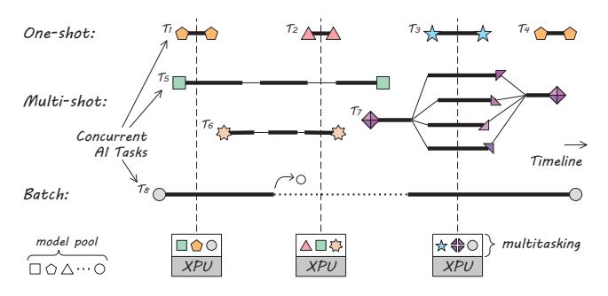
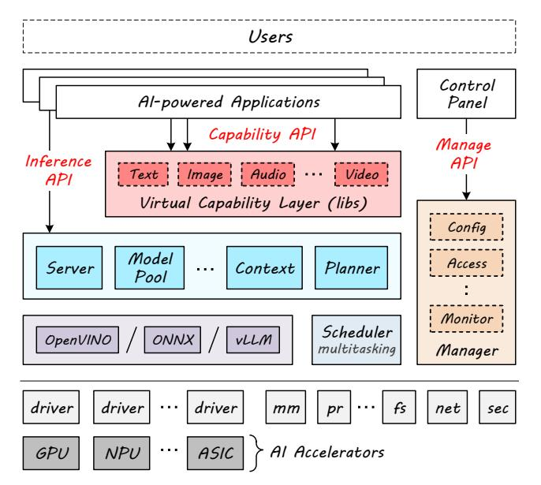

# A System-level Abstraction and Service for Flourishing AI-powered Applications

Jinrong Yang, Zimeng Wang, Rong Chen† , Haibo Chen Institute of Parallel and Distributed Systems, Shanghai Jiao Tong University

## Abstract

Modern devices increasingly employ local AI accelerators such as GPUs, NPUs, and ASICs to meet growing demands for AI capabilities. However, the current ad-hoc and siloed approach to enabling AI poses two fundamental challenges. Developers have to handle unnecessary implementation details when integrating AI into individual applications. Moreover, the siloed approach hinders efficient resource management when running multiple AI-powered tasks simultaneously.

This paper presents a system-level abstraction and service for AI-powered applications. We introduce a virtual capability layer with a unified API that efficiently powers various applications with AI technology, promoting a capability-centric approach. Furthermore, the unified AI service enables more efficient and collaborative resource management across concurrent AI tasks. Our prototype, X*Serv*, demonstrates how this approach simplifies application development and optimizes resource utilization, paving the way for more efficient and scalable AI-powered applications.

### ACM Reference Format:

J. Yang, Z. Wang, R. Chen, and H. Chen. 2025. A System-level Abstraction and Service for Flourishing AI-powered Applications. In *16th ACM SIGOPS Asia-Pacific Workshop on Systems (APSys '25), October 12–13, 2025, Seoul, Republic of Korea.* ACM, New York, NY, USA, [9](#page-8-0) pages. <https://doi.org/10.1145/3725783.3764406>

## 1 Introduction

AI accelerators (abbreviated as XPUs)—such as GPUs, NPUs, and ASICs—are increasingly common in modern edge devices. Operating systems often treat these accelerators as PCIe devices, with proprietary drivers, libraries, and frameworks provided by hardware vendors [\[30,](#page-7-0) [49,](#page-7-1) [50,](#page-7-2) [52\]](#page-7-3). *AI-powered applications* leverage this computing power to enable *AI capabilities* such as background removal and noise reduction for online meeting software. However, for most AI-powered application developers, understanding the details of AI hardware

Permission to make digital or hard copies of all or part of this work for personal or classroom use is granted without fee provided that copies are not made or distributed for profit or commercial advantage and that copies bear this notice and the full citation on the first page. Copyrights for components of this work owned by others than the author(s) must be honored. Abstracting with credit is permitted. To copy otherwise, or republish, to post on servers or to redistribute to lists, requires prior specific permission and/or a fee. Request permissions from permissions@acm.org.

*APSys '25, Seoul, Republic of Korea*

© 2025 Copyright held by the owner/author(s). Publication rights licensed to Association for Computing Machinery..

ACM ISBN 979-8-4007-1572-3/2025/10

<https://doi.org/10.1145/3725783.3764406>

and software stacks is difficult and unnecessary. Enabling AI capabilities should be as simple as calling a function [\[56\]](#page-7-4). Meanwhile, the demands for AI capabilities are growing at a pace that far exceeds the advancement of hardware. With more AI-powered applications running concurrently on devices, the current practice of building applications in a siloed approach prevents efficient resource management.

These problems stem from two primary sources. First, there is a misalignment in AI technology abstraction. As leveraging AI capabilities has spread from specialized to general developers, the current ad-hoc approach poses significant challenges in development and deployment [\[8,](#page-6-0) [34\]](#page-7-5). While some efforts provide system-level AI capabilities [\[23,](#page-6-1) [24,](#page-6-2) [39\]](#page-7-6), these SDKs lack extensibility and are limited to built-in models and capabilities. Second, applications interact exclusively with hardware resources, lacking a unified service for efficient and collaborative resource management. This severely limits resource sharing and utilization, particularly as concurrent AI tasks become increasingly common [\[18,](#page-6-3) [31\]](#page-7-7).

To address these challenges, we propose a new system-level abstraction and service designed for building AI-powered applications. Our AI service provides a capability-centric interface that simplifies application development and improves resource utilization. It allows for the integration of AI capabilities into various applications while hiding the complexities of the underlying AI hardware and software stacks. Furthermore, the unified service enables efficient and collaborative optimization for resource management across concurrent AI tasks. Consequently, developers can focus on building individual AI-powered applications without being burdened by unnecessary implementation details.

## 2 Background and Motivation

The rapid advancement of AI technology has led to a surge in AI integration across numerous applications. This poses fundamental challenges for the current way of leveraging AI.

### 2.1 The Growing Popularity of AI Tasks

Flourishing AI-powered applications. The rise of AI-powered applications is evident, with a search for "AI powered" on GitHub yielding over 30,000 open-source projects. This highlights the widespread adoption of AI capabilities across diverse usage patterns [\[4,](#page-6-4) [53\]](#page-7-8). These applications fall into two main categories: AI-native and AI-enhanced.

AI-native applications have core functionalities that inherently depend on AI, such as chatbots [\[2,](#page-6-5) [45\]](#page-7-9) and AI agents [\[35\]](#page-7-10). These applications typically use proprietary AI models, with their design and development centered on delivering distinctive and powerful AI-driven features.

†Rong Chen is the corresponding author.

Figure 1. *An example of concurrent AI tasks.*

AI-enhanced applications, in contrast, integrate AI capabilities into traditional software to improve existing functions. For example, screenshot tools [\[12\]](#page-6-6) may add text recognition and summarization, while photo albums can offer intelligent search and categorization. These applications typically use general AI capabilities like face tracking, handwriting recognition, and facial recognition [\[55\]](#page-7-11). For these applications, developers prefer using existing models and frameworks. This prevalent use of general, often model-agnostic, functionalities demonstrates a strong developer demand for handy and streamlined AI integration methods.

Emergence of concurrent AI tasks. The proliferation of AIpowered applications is shifting execution from standalone to concurrent modes. We categorize the execution patterns of AI tasks into three types: one-shot, multi-shot, and batch tasks.

*One-shot AI tasks* refer to inference requests that complete an individual task, typically with unpredictable arrival time and model usage (1−4 in Figure [1\)](#page-1-0), such as applying a beauty filter when taking a photo [\[32\]](#page-7-12) or generating an automatic comment for a pull request. These tasks are characterized by their latency sensitivity, bursty traffic patterns, short execution times, and diverse functionality and model types [\[26\]](#page-6-7). Inference might be triggered only once every few seconds, minutes, or even hours, with each execution taking just milliseconds. However, all models must remain in memory for low response latency [\[64,](#page-8-1) [68\]](#page-8-2), causing significant memory waste when dozens of idle tasks occupy resources.

*Multi-shot AI tasks* involve logical sessions with multiple inference requests, which are the primary focus of current AI system research. These tasks appear in two forms: serial multi-shot tasks (5−6), which process sequential inference rounds [\[16,](#page-6-8) [65\]](#page-8-3) such as image generation workflows and chat completion services; and parallel multi-shot tasks (7), which distribute execution across multiple paths as seen in multimodal inference for speech assistants and non-textual understanding with multi-agents [\[42,](#page-7-13) [62\]](#page-8-4). These tasks demand state-aware scheduling with session affinity to preserve context consistency and efficiently manage task lifecycles.

*Batch AI tasks* represent time-insensitive, long-running processes (8), such as summarizing local documents or Windows Recall [\[38\]](#page-7-14) processing historical screenshots in the

background. The key challenge in multitasking is avoiding foreground interference and minimizing resource usage. For memory management, offloading techniques can free up space for foreground tasks, and elastic memory configuration allows quick memory transfer when needed [\[57\]](#page-7-15). Meanwhile, these tasks require parallel execution with minimal interference and fast preemption for accelerator responsiveness [\[13,](#page-6-9) [63\]](#page-8-5).

## 2.2 Challenges in Leveraging AI Capabilities

Application developers face significant challenges when leveraging AI capabilities, primarily due to the complexity and diversity of underlying AI hardware and software stacks. This challenge extends beyond human developers to AI agents.

Complicated details for human developers. Unlike CPU programs, where ABIs and compilers abstract most hardware differences, XPUs lack similar generality. While AI serving frameworks like ONNX Runtime [\[36\]](#page-7-16) and PyTorch [\[47\]](#page-7-17) provide backends to adapt to different XPUs, they still rely on hardware-specific inference engines and struggle with version compatibility issues [\[37\]](#page-7-18). Developers have to navigate different inference engines across different XPUs during both development and deployment. Traditional inference engines, with their ad-hoc interfaces that focus only on model execution, fail to abstract the entire model usage lifecycle.

Developers are currently burdened with tasks including model discovery, format conversion, data processing, and mastering different XPU runtimes and frameworks. Each of these steps is error-prone and significantly increases development complexity. Common errors in AI-powered applications frequently arise from model conversion, framework integration, and data processing issues [\[8\]](#page-6-0). Using AI capabilities should be as straightforward as using networks and file systems—accessible through simple, high-level interfaces. An OS abstraction layer would effectively separate these complex implementation details from application development, shielding developers from the underlying complexity.

We argue that AI-powered application development should focus on capabilities provided by AI technology rather than specific models and XPUs. The usage of Large Language Models (LLMs) exemplifies this capability-focused approach, and we envision AI capabilities becoming just as accessible. Consider translation software enhanced by LLMs—it simply needs chat completion capabilities [\[22\]](#page-6-10). This can be implemented by calling a standardized interface (e.g., Ollama Chat API [\[44\]](#page-7-19)) with just a few lines of code. Developers merely call the capability interface without worrying about model selection, data formatting, or request processing. When superior models become available, they can be integrated seamlessly.

Better support for AI agents. AI agents are crucial for AIpowered application development, functioning independently as they perceive, decide, and act [\[60\]](#page-8-6). They use various tools, including AI capabilities like visual understanding and speech recognition, to perceive environments [\[33\]](#page-7-20). Humans naturally

learn through analogy, like inferring a monitor button controls power after learning a light switch controls lights. To enable AI agents to learn, tools need standardized descriptions.

The most popular way for AI to use tools currently is the Model Context Protocol (MCP) [\[3\]](#page-6-11), where each tool writes its own "manual" as a part of input for LLM inference. This approach of passing knowledge to large models in the context is also called in-context learning [\[10\]](#page-6-12). Controlling tools through in-context learning has strong generality—any tool can be used with its instructions without tool-specific training.

However, in-context learning places significant demands on context length and model intelligence. A simple inference request may use only a dozen tokens, but several MCP tools can require thousands of additional tokens [\[14\]](#page-6-13). The growth of context leads to a significant increase in computation, severely affecting response time. Meanwhile, MCP tool performance varies dramatically across models, with many widely-used models performing poorly [\[40\]](#page-7-21). In-context learning cannot guarantee that the model will select appropriate tools for use, nor can it ensure correct learning of tool usage methods.

The main drawback of MCP inference is that different MCP tools with the same functionality lack standardized usage patterns [\[15\]](#page-6-14). By reasonably defining common usage patterns and having tools adapt to these capabilities, models can pre-learn tool usage during training and also improve their ability to generalize across different tools.

### 2.3 Challenges in Managing Hardware Resources

With the proliferation of AI-powered applications, hardware resource demands are growing faster than hardware development itself. This creates a widening gap between application requirements and available resources. Individual models face resource constraints that demand efficient utilization. Meanwhile, concurrent AI tasks introduce additional challenges of resource sharing and competition.

Insufficient resources for individual models. Models are growing from traditional DNN models with millions of parameters to MoE models with hundreds of billions, creating substantial storage and memory pressure. Memory's hierarchical structure like GPU memory, CPU memory, and SSD storage offers progressively larger capacity but lower performance. Large model inference can utilize these layers to break GPU memory limitations, leveraging memory access locality for optimization, using CPU memory for LLM inference [\[1,](#page-6-15) [27\]](#page-6-16) and moving the KV cache to SSD [\[17,](#page-6-17) [25,](#page-6-18) [46\]](#page-7-22).

Computational resource consumption also increases with model size, requiring consideration of combined utilization of computational resources. In consumer devices, heterogeneous computing resources such as CPU, GPU, and NPU are becoming increasingly common [\[5,](#page-6-19) [48\]](#page-7-23), and the demand for using heterogeneous computing power for model inference is also growing. Many works explore CPU-GPU and GPU-NPU collaboration, utilizing heterogeneous computing resources based on workload affinity [\[7,](#page-6-20) [20,](#page-6-21) [41,](#page-7-24) [54\]](#page-7-25).

However, current optimizations target specific inference frameworks and hardware configurations. These fragmented optimizations require a system-level framework for integration, providing unified support for various AI capabilities. A unified service is essential to coordinate these diverse optimization techniques and provide a cohesive use of resources for different AI models.

Resource competition for concurrent AI tasks. As model resource consumption increases, resource competition becomes more frequent in concurrent scenarios, making scheduling of limited resources even more critical. Resources contain memory, computational, and I/O.

Memory competition can cause out-of-memory, preventing the normal execution of AI tasks. Applications prefer to keep their models resident in memory, enabling rapid response to inference requests and avoiding the time overhead of reloading. However, most event-driven and periodic tasks are idle most of the time, creating memory waste [\[64\]](#page-8-1). The most direct approach is to have models occupy memory resources on-demand based on computational resource usage, but this requires fast model checkpoint and restore [\[58\]](#page-7-26). Similar to operating system virtual memory, memory resource oversubscription should be as transparent as possible to applications [\[59\]](#page-8-7), minimizing modifications to applications.

Uncoordinated computational resource competition leads to imbalanced resource utilization and inability to meet inference latency requirements. Without proper scheduling, some tasks may monopolize computing resources while others experience significant delays, resulting in poor overall system performance and user experience [\[21,](#page-6-22) [51\]](#page-7-27). In the SoCs of Android phones, there are cases where GPU or NPU inference performance is weaker than that of the CPU [\[66\]](#page-8-8). Applications cannot directly perceive the differences between various hardware, making it difficult to make optimal hardware choices [\[20\]](#page-6-21). Task scheduling for heterogeneous hardware is also a research focus. To better schedule tasks on computational resources [\[51\]](#page-7-27), frameworks, runtimes, drivers, and accelerators need to work collaboratively.

I/O resource competition arises during model loading and swapping. Poor I/O resource scheduling can lead to inference stalls, wasting both memory and computational resources [\[59\]](#page-8-7). Most current scheduling approaches focus narrowly on computation and trigger I/O tasks reactively, instead of coordinating I/O and computational scheduling together.

## 3 System-level Abstraction and Service

We propose a new system-level abstraction and service for both AI-native and AI-enhanced applications to better adapt to the development of future applications. To address the usage difficulties identified above, we propose an abstraction of AI Capabilities that both simplifies AI usage and provides extensibility to accommodate the rapid development of AI. For the existing resource management issues, we manage

Figure 2. Architecture of system-level AI service.

them through a unified AI Service, increasing sharing and reducing competition.

#### 3.1 Design Overview

Figure 2 illustrates the architecture of the system-level AI service. The service provides a set of APIs for developers of AI-powered applications while supporting various AI accelerators (XPUs). It also interacts with other system services, such as the file system, to manage models and historical data.

The APIs are composed of three categories: Infer API, Capability API, and Manage API. The Infer API supports traditional workflows, providing commands for loading models and executing inference directly. The Capability API enables function-call-style invocation of AI functionalities, abstracting away the complexity of model selection and usage. The Manage API provides administrative interfaces for service configuration, permission control, and monitoring ability through control panels.

The virtual capability layer (VCL) serves as an abstraction layer that provides a unified interface for AI capabilities. Models can register their implemented capabilities with VCL, enabling system-wide AI capability updates and extensions. Beneath VCL lies the core of the unified AI service, which handles model management, context handling, and request planning. This orchestrator component generates inference requests and forwards them to the scheduler and inference engine for execution. The inference engine operates in conjunction with AI accelerators and their drivers, collaborating with the scheduler to achieve efficient resource management.

#### 3.2 Capability Abstraction and API

The key aspect in API design is to balance stability and extensibility. Stability ensures that widely used APIs are not arbitrarily modified. This guarantees that applications can

continue to function reliably over the long term. Extensibility allows the service to adapt to the rapidly evolving AI capabilities, enabling applications to utilize new AI features.

For common and stable AI capabilities, such as chat completion and speech recognition, applications should be able to use them easily. For experimental and unstable AI capabilities, model-specific AI capabilities should be allowed. These can be provided by the models or registered by the applications.

**Limitations of existing abstractions.** To clearly illustrate why current operating system abstractions are insufficient, we will analyze two prominent existing abstractions below.

The *Linux file abstraction*, primarily designed for storage operations, shows significant limitations when applied to nonstorage tasks. For networking, developers have to implement workarounds like *epoll* [43] to manage streaming data effectively. AI tasks present an even greater challenge as they are fundamentally computational rather than storage-oriented. Forcing AI operations into the file abstraction would create a substantial semantic mismatch, leading to inefficiencies.

The *ioctl interface*, another mechanism in Linux, is also ill-suited. Its primary purpose is to facilitate user-space to kernel-space transitions, enabling applications to control devices via drivers. AI tasks, in contrast, typically require interaction with other user-space inference frameworks. Therefore, ioctl's model of kernel-mediated device control is inappropriate for managing computational AI tasks or facilitating inter-process communication between user-space components.

A new design. Drawing an analogy from the VFS, which unifies disparate file systems, we propose the VCL. VCL abstracts AI capabilities from diverse models. Similar to VFS's support for network file systems, VCL can also register remote model capabilities, unifying access to local and remote AI resources. Local AI capabilities within VCL are categorized into three types: Common, Exclusive, and Custom.

<u>Common Capability</u> represents general and stable functionalities. They should be invoked through a defined consensus, like LLM capabilities, which allows developers to use them without model-specific considerations. Models should implement these capabilities as much as possible upon release.

Exclusive Capability denotes functionalities provided by specific models that have not yet achieved a common usage standard, such as a unique background music generation capability. To use such a feature, applications must select the specific model and invoke it by adhering to its declared API. Customized Capability provides extensibility for AI functionalities. Beyond pre-defined Common and Exclusive Capabilities, sometimes applications require bespoke logic for tasks like pre-processing, post-processing, or complex execution flows. Applications can implement these Custom Capabilities for specific models and register them with VCL.

Through the Capability API, applications can interact with AI in a capability-centric paradigm. Existing systems like

Windows Copilot Runtime [\[39\]](#page-7-6), Apple Intelligence [\[24\]](#page-6-2), HarmonyOS AI Kit [\[23\]](#page-6-1), and Sky Computing [\[6\]](#page-6-23) have introduced these similar abstractions. However, they are fixed and lack the flexibility to keep pace with the rapid evolution of AI. For applications preferring direct model interaction over capability-based access, VCL also offers the Infer API. It allows applications to use models traditionally, bypassing the abstraction layer but still leveraging the system-level resource management and scheduling provided by the AI service.

Beyond specifying AI capabilities, this abstraction layer also supports passing task characteristics and requirements as hints, providing additional application-layer semantics for resource management and scheduling. For example, image understanding tasks in photo album applications are batch tasks with no return time requirements, while real-time image background removal tasks in video editing applications are single-turn tasks requiring rapid response. In concurrent scenarios, passing semantics to the orchestrator enables efficient resource utilization and appropriate scheduling decisions.

### 3.3 Unified AI Service

To provide unified management of multi-tier memory, computational, and I/O resources and adapt to concurrent AI tasks scenarios under heterogeneous hardware, we propose a unified AI service for resource management.

Task execution and resource-aware scheduling. The orchestrator operates between VCL and the inference engine, receiving AI tasks along with their execution characteristics and requirements from the upper layer. It schedules and processes tasks based on resource utilization and hints from tasks, forming inference requests that are then passed to the inference engine for execution.

The model pool manages model memory resource usage, dynamically loading and unloading models based on task requirements. It can also utilize CPU memory and SSD for offloaded inference according to memory usage constraints, managing both memory and I/O resources. The request planner combines current task requirements with loaded models to select appropriate models for implementing the required AI capabilities, maximizing resource reuse and selecting the suitable device for execution. The context handler manages the state that needs to be preserved for stateful tasks, such as KV cache in LLM inference. For context like KV cache, it can make tradeoffs between memory and computational resource usage, and can also use lower-tier memory to store context and save memory resources.

Inference request execution and multitasking. All inference requests are passed to the execution engine (e.g., Open-VINO [\[37\]](#page-7-18)) for processing on XPUs. Most current XPUs and their drivers—including GPUs, NPUs and ASICs—are designed for standalone execution and must work with the scheduler module (e.g., XSched [\[51\]](#page-7-27)) to effectively support multitasking.

For computational resources, existing multi-task execution approaches use time-slicing or MPS methods. These mechanisms struggle to guarantee response latency and reduce the interference. Through modifications to drivers and engines, hardware characteristics can be maximally utilized to implement preemptive scheduling of AI accelerators, enabling rapid preemption for foreground one-shot task responsiveness while executing batch tasks in the background. Fine-grained partitioning of computing units in spatial sharing can reduce interference between tasks. For memory resource multi-task support, existing solutions implement virtual memory extension through page faults. The scheduler can further optimize memory resource switching and coordinate scheduling with computational resources.

Cross platform compatibility. To ensure cross-platform compatibility for heterogeneous AI accelerators, the AI service utilizes vendor-provided inference frameworks to unify the use of diverse hardware at the model level. An integrated engine must simply support model loading, inference, and unloading to achieve hardware compatibility on its platform.

Model distribution is crucial for making models accessible across diverse platforms. It involves weights, network architecture, and the inherent capabilities they define. Distribution can utilize standardized formats like ONNX, analogous to source code requiring user compilation. Alternatively, models can be provided as pre-compiled, hardware-optimized binaries, enabling immediate out-of-the-box deployment.

## 4 Proof of Concept

Implementation. We implemented a proof of concept of our AI service design on Linux and tested it on both an Intel Core Ultra laptop and an NVIDIA GPU server. This prototype, X*Serv*, demonstrates how a system-level service for AI-powered applications can simplify development and improve resource utilization.

In the VCL, we currently support AI capabilities such as object detection, chat completion, speech recognition, image generation, image understanding, and background removal. Table [1](#page-5-0) shows the input and output of each capability and the lines of code (LOC) required for capability implementation. The AI service provides a Capability API for developers to access these capabilities.

The scheduler utilizes multi-priority queues to establish a basic priority scheduling mechanism. The inference engine supports the OpenVINO framework [\[37\]](#page-7-18) for inference using Intel GPUs and NPUs, as well as the ONNX Runtime framework [\[36\]](#page-7-16) for inference using NVIDIA GPUs. The model pool interacts with the filesystem to load model-related files, while the context handler utilizes local storage to maintain historical context for stateful tasks like chat capabilities.

API. For the Infer API, we provide *load\_model*, *unload\_ model*, and *infer* interfaces. For the Capability API, *generate* is used to invoke AI capabilities, requiring the capability

Table 1. *Virtual capability layer description.*

| Capability          | Input  | Output    | Impl. (LOC) |
|---------------------|--------|-----------|-------------|
| Object detection    | Image  | type, pos | 118         |
| Chat completion     | Prompt | text      | 211         |
| Speech recognition  | Audio  | text      | 935         |
| Image generation    | Prompt | image     | 752         |
| Image understanding | Image  | text      | 436         |
| Background removal  | Image  | image     | 30          |

name and related arguments. For the Manage API, we provide *install\_model* and *uninstall\_model* for managing models, *get\_capability* and *register\_capability* for retrieving and registering model capabilities, as well as other interfaces for managing clients and history.

Application development. To verify that the AI service can simplify application development, we implemented three AIenhanced applications: A shell with chat completion capabilities to support intelligent completion. An instant messaging (IM) application with chat completion and image generation capabilities to support conversation summarization and emoji generation. An online meeting client with chat completion, speech recognition, and image understanding capabilities to support meeting content summarization.

With the Capability API, adding these features required only a few lines of code for each project. Table [2](#page-5-1) shows the lines of code required for using AI capabilities in application development. The AI service significantly reduces the complexity of integrating AI capabilities into applications.

Resource management. To optimize computing resource utilization, we implemented a system-level priority scheduling based on XSched [\[51\]](#page-7-27). In desktop environments, user attention differs between foreground and background applications. We leverage a GNOME shell extension to monitor the window focus. Based on this, the AI service dynamically increases the priority of AI tasks tied to the focused application to ensure faster responsiveness. Without priority scheduling, concurrent GPU execution of chat completion and image generation yielded a chat completion throughput of 5.58 tokens/s. Enabling priority scheduling, with chat completion as the foreground task, increased this throughput to 8.05 tokens/s.

Furthermore, dynamic load-aware task scheduling across accelerators mitigates load imbalances. Our AI service analyzes task compatibility with available accelerators and dispatches tasks to the least loaded one. As an illustration, when applications exclusively selected the GPU for inference, the background removal frame rate in an online meeting client was 23.79 FPS. Conversely, dynamic device selection by the AI service, facilitating NPU utilization, boosted the background removal frame rate to 48.19 FPS.

The AI service also demonstrates significant resource efficiency. Consolidating chat completion for just three applications through the service, instead of using individual embedded LLMs, saved over 20 GB of disk space. Concurrent

Table 2. *AI-powered applications description.*

| APP     | AI Capability       | LOC | Description                  |
|---------|---------------------|-----|------------------------------|
| Shell   | Chat completion     |     | 5 Intelligent completion cmd |
| Meeting | Chat completion     |     | 3 Summarize meeting content  |
|         | Speech recognition  |     | 1 Transcribe meeting audio   |
|         | Image understanding |     | 4 Understand shared screen   |
|         | Background removal  |     | 1 Process camera video       |
| IM      | Chat completion     |     | 3 Summarize chat content     |
|         | Image generation    |     | 2 Generate emojis            |

execution of these applications further reduced runtime memory consumption by approximately 10 GB.

## 5 Open Questions and Discussion

The design of the system-level abstraction and service raises several important issues for future consideration.

Capability implementation. Currently, there are numerous models available, and most models do not provide VCL implementations. To address this challenge, one approach is to require model publishers to provide them. Alternatively, LLMs can be employed to read and analyze model documentation and usage examples, automatically generating VCL implementations for models [\[11,](#page-6-24) [29\]](#page-7-29). Such automated code generation can rapidly create VCL implementations, reducing the additional workload for model publishers.

Performance optimization. A system-level AI service, despite adding complexity, enables significant performance optimizations through unified management. This allows for system-wide strategies like co-scheduling diverse hardware and fine-grained memory control, offering shared benefits such as faster model loading or improved response times [\[28,](#page-6-25) [61\]](#page-8-9). However, realizing these optimizations presents architectural challenges, as they require coordinated support from drivers and hardware. A key challenge lies in establishing unified abstractions across diverse XPUs that enable frameworks to leverage these capabilities effectively [\[51\]](#page-7-27).

Security and privacy. Beyond usability and performance, security deserves careful consideration. Some applications need to protect their model weights from leakage after registering with VCL. Multi-task inference provides isolation through context, while a unified AI service lacks this mechanism, potentially allowing malicious requests to access data from other requests [\[67\]](#page-8-10). Integrating security hardware such as TEE for heterogeneous confidential computing is a way to protect sensitive data within the unified AI service [\[9,](#page-6-26) [19\]](#page-6-27).

## Acknowledgments

We thank anonymous reviewers for their valuable feedback. We also thank the members of IPADS at SJTU for their interest, insights, feedback, and support. This work is supported in part by the NSF of China grant (No. 62272291) and the Fundamental Research Funds for the Central Universities.

# References

- [1] Keivan Alizadeh, Seyed Iman Mirzadeh, Dmitry Belenko, S. Khatamifard, Minsik Cho, Carlo C Del Mundo, Mohammad Rastegari, and Mehrdad Farajtabar. 2024. LLM in a flash: Efficient Large Language Model Inference with Limited Memory. In *Proceedings of the 62nd Annual Meeting of the Association for Computational Linguistics (Volume 1: Long Papers)*, Lun-Wei Ku, Andre Martins, and Vivek Srikumar (Eds.). Association for Computational Linguistics, Bangkok, Thailand, 12562–12584. [doi:10.18653/v1/2024.acl-long.678](https://doi.org/10.18653/v1/2024.acl-long.678)
- [2] Anthropic. 2025. Claude. [https://claude.ai.](https://claude.ai)
- [3] Anthropic. 2025. Introducing the Model Context Protocol. [https:](https://www.anthropic.com/news/model-context-protocol) [//www.anthropic.com/news/model-context-protocol.](https://www.anthropic.com/news/model-context-protocol)
- [4] J. Bieniek, M. Rahouti, and D. C. Verma. 2024. Generative AI in Multimodal User Interfaces: Trends, Challenges, and Cross-Platform Adaptability. *arXiv preprint arXiv:2411.10234* (2024).
- [5] Nadav Bonen, Arik Gihon, Leon Polishuk, Yoni Aizik, Yulia Okunev, Tsvika Kurts, and Nithiyanandan Bashyam. 2025. Lunar Lake an Intel Mobile Processor: SoC Architecture Overview (2024). *IEEE Micro* 45, 3 (2025), 15–21. [doi:10.1109/MM.2025.3558407](https://doi.org/10.1109/MM.2025.3558407)
- [6] Sarah E. Chasins, Alvin Wan Kok Cheung, Natacha Crooks, Ali Ghodsi, Ken Goldberg, Joseph Gonzalez, Joseph M Hellerstein, Michael I. Jordan, Anthony D. Joseph, Michael W. Mahoney, Aditya G. Parameswaran, David A. Patterson, Raluca A. Popa, Koushik Sen, Scott Shenker, Dawn Xiaodong Song, and Ion Stoica. 2022. The Sky Above The Clouds. *arXiv preprint arXiv:2205.07147* (2022).
- [7] Le Chen, Dahu Feng, Erhu Feng, Rong Zhao, Yingrui Wang, Yubin Xia, Haibo Chen, and Pinjie Xu. 2025. HeteroLLM: Accelerating Large Language Model Inference on Mobile SoCs platform with Heterogeneous AI Accelerators. *arXiv preprint arXiv:2501.14794* (2025).
- [8] Zhenpeng Chen, Huihan Yao, Yiling Lou, Yanbin Cao, Yuanqiang Liu, Haoyu Wang, and Xuanzhe Liu. 2021. An Empirical Study on Deployment Faults of Deep Learning Based Mobile Applications. In *2021 IEEE/ACM 43rd International Conference on Software Engineering (ICSE)*. 674–685. [doi:10.1109/ICSE43902.2021.00068](https://doi.org/10.1109/ICSE43902.2021.00068)
- [9] Ben Dong and Qian Wang. 2025. Evaluating the Performance of the DeepSeek Model in Confidential Computing Environment. *arXiv preprint arXiv:2502.11347* (2025).
- [10] Qingxiu Dong, Lei Li, Damai Dai, Ce Zheng, Jingyuan Ma, Rui Li, Heming Xia, Jingjing Xu, Zhiyong Wu, Baobao Chang, Xu Sun, Lei Li, and Zhifang Sui. 2024. A Survey on In-context Learning. In *Proceedings of the 2024 Conference on Empirical Methods in Natural Language Processing*, Yaser Al-Onaizan, Mohit Bansal, and Yun-Nung Chen (Eds.). Association for Computational Linguistics, Miami, Florida, USA, 1107–1128. [doi:10.18653/v1/2024.emnlp-main.64](https://doi.org/10.18653/v1/2024.emnlp-main.64)
- [11] Yihong Dong, Xue Jiang, Zhi Jin, and Ge Li. 2024. Self-Collaboration Code Generation via ChatGPT. *ACM Trans. Softw. Eng. Methodol.* 33, 7, Article 189 (Sept. 2024), 38 pages. [doi:10.1145/3672459](https://doi.org/10.1145/3672459)
- [12] Dynobo. 2025. NormCap, OCR powered screen-capture tool to capture information instead of images. [https://dynobo.github.io/normcap.](https://dynobo.github.io/normcap)
- [13] Ruwen Fan, Tingxu Ren, Minhui Xie, Shiwei Gao, Jiwu Shu, and Youyou Lu. 2025. GPREEMPT: GPU Preemptive Scheduling Made General and Efficient. In *2025 USENIX Annual Technical Conference (USENIX ATC 25)*. 263–272.
- [14] Shiqing Fan, Xichen Ding, Liang Zhang, and Linjian Mo. 2025. MCP-ToolBench++: A Large Scale AI Agent Model Context Protocol MCP Tool Use Benchmark. *arXiv preprint arXiv:2508.07575* (2025).
- [15] Erhu Feng, Wenbo Zhou, Zibin Liu, Le Chen, Yunpeng Dong, Cheng Zhang, Yisheng Zhao, Dong Du, Zhi-Hua Zhou, Yubin Xia, and Haibo Chen. 2025. Get Experience from Practice: LLM Agents with Record & Replay. *arXiv preprint arXiv:2505.17716* (2025).
- [16] Yao Fu, Leyang Xue, Yeqi Huang, Andrei-Octavian Brabete, Dmitrii Ustiugov, Yuvraj Patel, and Luo Mai. 2024. ServerlessLLM: Low-Latency Serverless Inference for Large Language Models. In *18th USENIX Symposium on Operating Systems Design and Implementation*

- *(OSDI 24)*. 135–153.
- [17] Shiwei Gao, Youmin Chen, and Jiwu Shu. 2025. Fast State Restoration in LLM Serving with HCache. In *Proceedings of the Twentieth European Conference on Computer Systems* (Rotterdam, Netherlands) *(EuroSys '25)*. Association for Computing Machinery, New York, NY, USA, 128–143. [doi:10.1145/3689031.3696072](https://doi.org/10.1145/3689031.3696072)
- [18] Liwei Guo, Wonkyo Choe, and Felix Xiaozhu Lin. 2023. STI: Turbocharge NLP Inference at the Edge via Elastic Pipelining. In *Proceedings of the 28th ACM International Conference on Architectural Support for Programming Languages and Operating Systems, Volume 2* (Vancouver, BC, Canada) *(ASPLOS 2023)*. Association for Computing Machinery, New York, NY, USA, 791–803. [doi:10.1145/3575693.3575698](https://doi.org/10.1145/3575693.3575698)
- [19] Husheng Han, Xinyao Zheng, Yuanbo Wen, Yifan Hao, Erhu Feng, Ling Liang, Jianan Mu, Xiaqing Li, Tianyun Ma, Pengwei Jin, Xinkai Song, Zidong Du, Qi Guo, and Xing Hu. 2025. TensorTEE: Unifying Heterogeneous TEE Granularity for Efficient Secure Collaborative Tensor Computing. In *Proceedings of the 29th ACM International Conference on Architectural Support for Programming Languages and Operating Systems, Volume 4* (Hilton La Jolla Torrey Pines, La Jolla, CA, USA) *(ASPLOS '24)*. Association for Computing Machinery, New York, NY, USA, 282–297. [doi:10.1145/3622781.3674168](https://doi.org/10.1145/3622781.3674168)
- [20] Mingcong Han, Weihang Shen, Rong Chen, Binyu Zang, and Haibo Chen. 2025. Holistic Heterogeneous Scheduling for Autonomous Applications using Fine-grained, Multi-XPU Abstraction. *arXiv preprint arXiv:2508.09503* (2025).
- [21] Mingcong Han, Hanze Zhang, Rong Chen, and Haibo Chen. 2022. Microsecond-scale Preemption for Concurrent GPU-accelerated DNN Inferences. In *16th USENIX Symposium on Operating Systems Design and Implementation (OSDI 22)*. USENIX Association, Carlsbad, CA, 539–558. <https://www.usenix.org/conference/osdi22/presentation/han>
- [22] Amr Hendy, Mohamed Abdelrehim, Amr Sharaf, Vikas Raunak, Mohamed Gabr, Hitokazu Matsushita, Young Jin Kim, Mohamed Afify, and Hany Hassan Awadalla. 2023. How Good Are GPT Models at Machine Translation? A Comprehensive Evaluation. *arXiv preprint arXiv:2302.09210* (2023).
- [23] Huawei. 2025. Core Speech Kit-AI. [https://developer.huawei.com/](https://developer.huawei.com/consumer/en/doc/harmonyos-references-V5/core-speech-api-V5) [consumer/en/doc/harmonyos-references-V5/core-speech-api-V5.](https://developer.huawei.com/consumer/en/doc/harmonyos-references-V5/core-speech-api-V5)
- [24] Apple Inc. 2025. Apple Intelligence for Developers. [https://developer.](https://developer.apple.com/apple-intelligence) [apple.com/apple-intelligence.](https://developer.apple.com/apple-intelligence)
- [25] Jinwoo Jeong and Jeongseob Ahn. 2025. Accelerating LLM Serving for Multi-turn Dialogues with Efficient Resource Management. In *Proceedings of the 30th ACM International Conference on Architectural Support for Programming Languages and Operating Systems, Volume 2* (Rotterdam, Netherlands) *(ASPLOS '25)*. Association for Computing Machinery, New York, NY, USA, 1–15. [doi:10.1145/3676641.3716245](https://doi.org/10.1145/3676641.3716245)
- [26] Mingoo Ji, Saehanseul Yi, Changjin Koo, Sol Ahn, Dongjoo Seo, Nikil Dutt, and Jong-Chan Kim. 2022. Demand Layering for Real-Time DNN Inference with Minimized Memory Usage. In *2022 IEEE Real-Time Systems Symposium (RTSS)*. 291–304. [doi:10.1109/RTSS55097.](https://doi.org/10.1109/RTSS55097.2022.00033) [2022.00033](https://doi.org/10.1109/RTSS55097.2022.00033)
- [27] Hyungyo Kim, Nachuan Wang, Qirong Xia, Jinghan Huang, Amir Yazdanbakhsh, and Nam Sung Kim. 2025. LIA: A Single-GPU LLM Inference Acceleration with Cooperative AMX-Enabled CPU-GPU Computation and CXL Offloading. In *Proceedings of the 52nd Annual International Symposium on Computer Architecture (ISCA '25)*. Association for Computing Machinery, New York, NY, USA, 544–558. [doi:10.1145/3695053.3731092](https://doi.org/10.1145/3695053.3731092)
- [28] Hyungyo Kim, Nachuan Wang, Qirong Xia, Jinghan Huang, Amir Yazdanbakhsh, and Nam Sung Kim. 2025. LIA: A Single-GPU LLM Inference Acceleration with Cooperative AMX-Enabled CPU-GPU Computation and CXL Offloading. In *Proceedings of the 52nd Annual International Symposium on Computer Architecture (ISCA '25)*. Association for Computing Machinery, New York, NY, USA, 544–558.

#### [doi:10.1145/3695053.3731092](https://doi.org/10.1145/3695053.3731092)

- [29] Patrick Tser Jern Kon, Jiachen Liu, Yiming Qiu, Weijun Fan, Ting He, Lei Lin, Haoran Zhang, Owen M. Park, George S. Elengikal, Yuxin Kang, Ang Chen, Mosharaf Chowdhury, Myungjin Lee, and Xinyu Wang. 2024. IaC-eval: A Code Generation Benchmark for Cloud Infrastructure-as-Code Programs. In *Advances in Neural Information Processing Systems*, A. Globerson, L. Mackey, D. Belgrave, A. Fan, U. Paquet, J. Tomczak, and C. Zhang (Eds.), Vol. 37. Curran Associates, Inc., 134488–134506.
- [30] Dario Korolija, Timothy Roscoe, and Gustavo Alonso. 2020. Do OS abstractions make sense on FPGAs?. In *14th USENIX Symposium on Operating Systems Design and Implementation (OSDI 20)*. USENIX Association, 991–1010. [https://www.usenix.org/conference/osdi20/](https://www.usenix.org/conference/osdi20/presentation/roscoe) [presentation/roscoe](https://www.usenix.org/conference/osdi20/presentation/roscoe)
- [31] Stefanos Laskaridis, Kleomenis Katevas, Lorenzo Minto, and Hamed Haddadi. 2024. MELTing Point: Mobile Evaluation of Language Transformers. In *Proceedings of the 30th Annual International Conference on Mobile Computing and Networking* (Washington D.C., DC, USA) *(ACM MobiCom '24)*. Association for Computing Machinery, New York, NY, USA, 890–907. [doi:10.1145/3636534.3690668](https://doi.org/10.1145/3636534.3690668)
- [32] Chongyi Li, Chunle Guo, Linghao Han, Jun Jiang, Ming-Ming Cheng, Jinwei Gu, and Chen Change Loy. 2022. Low-Light Image and Video Enhancement Using Deep Learning: A Survey. *IEEE Transactions on Pattern Analysis and Machine Intelligence* 44, 12 (2022), 9396–9416. [doi:10.1109/TPAMI.2021.3126387](https://doi.org/10.1109/TPAMI.2021.3126387)
- [33] Guohao Li, Hasan Hammoud, Hani Itani, Dmitrii Khizbullin, and Bernard Ghanem. 2023. CAMEL: Communicative Agents for "Mind" Exploration of Large Language Model Society. In *Advances in Neural Information Processing Systems*, A. Oh, T. Naumann, A. Globerson, K. Saenko, M. Hardt, and S. Levine (Eds.), Vol. 36. Curran Associates, Inc., 51991–52008.
- [34] Chengfei Lv, Chaoyue Niu, Renjie Gu, Xiaotang Jiang, Zhaode Wang, Bin Liu, Ziqi Wu, Qiulin Yao, Congyu Huang, Panos Huang, Tao Huang, Hui Shu, Jinde Song, Bin Zou, Peng Lan, Guohuan Xu, Fei Wu, Shaojie Tang, Fan Wu, and Guihai Chen. 2022. Walle: An End-to-End, General-Purpose, and Large-Scale Production System for Device-Cloud Collaborative Machine Learning. In *16th USENIX Symposium on Operating Systems Design and Implementation (OSDI 22)*. USENIX Association, Carlsbad, CA, 249–265. [https://www.usenix.org/conference/](https://www.usenix.org/conference/osdi22/presentation/lv) [osdi22/presentation/lv](https://www.usenix.org/conference/osdi22/presentation/lv)
- [35] Microsoft. 2025. Copilot and AI Agents. [https://www.microsoft.com/](https://www.microsoft.com/en-us/microsoft-copilot/copilot-101/copilot-ai-agents) [en-us/microsoft-copilot/copilot-101/copilot-ai-agents.](https://www.microsoft.com/en-us/microsoft-copilot/copilot-101/copilot-ai-agents)
- [36] Microsoft. 2025. ONNX Runtime. [https://onnxruntime.ai/docs.](https://onnxruntime.ai/docs)
- [37] Microsoft. 2025. OpenVINO Execution Provider. [https://onnxruntime.](https://onnxruntime.ai/docs/execution-providers/OpenVINO-ExecutionProvider.html) [ai/docs/execution-providers/OpenVINO-ExecutionProvider.html.](https://onnxruntime.ai/docs/execution-providers/OpenVINO-ExecutionProvider.html)
- [38] Microsoft. 2025. Recall Overview. [https://learn.microsoft.com/en](https://learn.microsoft.com/en-us/windows/ai/recall)[us/windows/ai/recall.](https://learn.microsoft.com/en-us/windows/ai/recall)
- [39] Microsoft. 2025. Windows Copilot Runtime Overview. [https://learn.](https://learn.microsoft.com/en-us/windows/ai/overview) [microsoft.com/en-us/windows/ai/overview.](https://learn.microsoft.com/en-us/windows/ai/overview)
- [40] Guozhao Mo, Wenliang Zhong, Jiawei Chen, Xuanang Chen, Yaojie Lu, Hongyu Lin, Ben He, Xianpei Han, and Le Sun. 2025. LiveMCP-Bench: Can Agents Navigate an Ocean of MCP Tools? *arXiv preprint arXiv:2508.01780* (2025).
- [41] Seungjae Moon, Junseo Cha, Hyunjun Park, and Joo-Young Kim. 2025. Hybe: GPU-NPU Hybrid System for Efficient LLM Inference with Million-Token Context Window. In *Proceedings of the 52nd Annual International Symposium on Computer Architecture (ISCA '25)*. Association for Computing Machinery, New York, NY, USA, 808–820. [doi:10.1145/3695053.3731051](https://doi.org/10.1145/3695053.3731051)
- [42] Motahare Mounesan, Xiaojie Zhang, and Saptarshi Debroy. 2025. Infer-EDGE: Dynamic DNN Inference Optimization in 'Just-in-time' Edge-AI Implementations. *arXiv preprint arXiv:2501.18842* (2025).
- [43] E. Nahum, T. Barzilai, and D.D. Kandlur. 2002. Performance issues in WWW servers. *IEEE/ACM Transactions on Networking* 10, 1 (2002), 2–11. [doi:10.1109/90.986497](https://doi.org/10.1109/90.986497)

- [44] Ollama. 2025. API Reference. [https://ollama.readthedocs.io/en/api/](https://ollama.readthedocs.io/en/api/#generate-a-chat-completion) [#generate-a-chat-completion.](https://ollama.readthedocs.io/en/api/#generate-a-chat-completion)
- [45] OpenAI. 2025. ChatGPT. [https://chatgpt.com.](https://chatgpt.com)
- [46] Xiurui Pan, Endian Li, Qiao Li, Shengwen Liang, Yizhou Shan, Ke Zhou, Yingwei Luo, Xiaolin Wang, and Jie Zhang. 2025. InstAttention: In-Storage Attention Offloading for Cost-Effective Long-Context LLM Inference. In *2025 IEEE International Symposium on High Performance Computer Architecture (HPCA)*. 1510–1525. [doi:10.1109/HPCA61900.2025.00113](https://doi.org/10.1109/HPCA61900.2025.00113)
- [47] PyTorch Foundation. 2025. PyTorch. [https://pytorch.org.](https://pytorch.org)
- [48] Alejandro Rico, Satyaprakash Pareek, Javier Cabezas, David Clarke, Baris Ozgul, Francisco Barat, Yao Fu, Stephan Münz, Dylan Stuart, Patrick Schlangen, Pedro Duarte, Sneha Date, Indrani Paul, Jian Weng, Sonal Santan, Vinod Kathail, Ashish Sirasao, and Juanjo Noguera. 2024. AMD XDNA NPU in Ryzen AI Processors. *IEEE Micro* 44, 6 (2024), 73–82. [doi:10.1109/MM.2024.3423692](https://doi.org/10.1109/MM.2024.3423692)
- [49] Christopher J. Rossbach, Jon Currey, Mark Silberstein, Baishakhi Ray, and Emmett Witchel. 2011. PTask: operating system abstractions to manage GPUs as compute devices. In *Proceedings of the Twenty-Third ACM Symposium on Operating Systems Principles* (Cascais, Portugal) *(SOSP '11)*. Association for Computing Machinery, New York, NY, USA, 233–248. [doi:10.1145/2043556.2043579](https://doi.org/10.1145/2043556.2043579)
- [50] Christopher J. Rossbach, Jon Currey, and Emmett Witchel. 2011. Operating Systems Must Support GPU Abstractions. In *13th Workshop on Hot Topics in Operating Systems (HotOS XIII)*. USENIX Association, Napa, CA. [https://www.usenix.org/conference/hotosxiii/operating](https://www.usenix.org/conference/hotosxiii/operating-systems-must-support-gpu-abstractions)[systems-must-support-gpu-abstractions](https://www.usenix.org/conference/hotosxiii/operating-systems-must-support-gpu-abstractions)
- [51] Weihang Shen, Mingcong Han, Jialong Liu, Rong Chen, and Haibo Chen. 2025. XSched: Preemptive Scheduling for Diverse XPUs. In *19th USENIX Symposium on Operating Systems Design and Implementation (OSDI 25)*. 671–692.
- [52] Mark Silberstein, Sangman Kim, Seonggu Huh, Xinya Zhang, Yige Hu, Amir Wated, and Emmett Witchel. 2016. GPUnet: Networking Abstractions for GPU Programs. *ACM Trans. Comput. Syst.* 34, 3, Article 9 (Sept. 2016), 31 pages. [doi:10.1145/2963098](https://doi.org/10.1145/2963098)
- [53] Jason Ching Yuen Siu, Jieshan Chen, Yujin Huang, Zhenchang Xing, and Chunyang Chen. 2023. Towards Real Smart Apps: Investigating Human-AI Interactions in Smartphone On-Device AI Apps. *arXiv preprint arXiv:2307.00756* (2023).
- [54] Yixin Song, Zeyu Mi, Haotong Xie, and Haibo Chen. 2024. PowerInfer: Fast Large Language Model Serving with a Consumer-grade GPU. In *Proceedings of the ACM SIGOPS 30th Symposium on Operating Systems Principles* (Austin, TX, USA) *(SOSP '24)*. Association for Computing Machinery, New York, NY, USA, 590–606. [doi:10.1145/](https://doi.org/10.1145/3694715.3695964) [3694715.3695964](https://doi.org/10.1145/3694715.3695964)
- [55] Zhichuang Sun, Ruimin Sun, Long Lu, and Alan Mislove. 2021. Mind Your Weight(s): A Large-scale Study on Insufficient Machine Learning Model Protection in Mobile Apps. In *30th USENIX Security Symposium (USENIX Security 21)*. USENIX Association, 1955–1972. [https://www.](https://www.usenix.org/conference/usenixsecurity21/presentation/sun-zhichuang) [usenix.org/conference/usenixsecurity21/presentation/sun-zhichuang](https://www.usenix.org/conference/usenixsecurity21/presentation/sun-zhichuang)
- [56] Chengcheng Wan, Shicheng Liu, Henry Hoffmann, Michael Maire, and Shan Lu. 2021. Are Machine Learning Cloud APIs Used Correctly?. In *2021 IEEE/ACM 43rd International Conference on Software Engineering (ICSE)*. 125–137. [doi:10.1109/ICSE43902.2021.00024](https://doi.org/10.1109/ICSE43902.2021.00024)
- [57] Jiali Wang, Yankui Wang, Mingcong Han, and Rong Chen. 2025. Colocating ML Inference and Training with Fast GPU Memory Handover. In *2025 USENIX Annual Technical Conference (USENIX ATC 25)*. 1657–1675.
- [58] Xingda Wei, Zhuobin Huang, Tianle Sun, Yingyi Hao, Rong Chen, Mingcong Han, Jinyu Gu, and Haibo Chen. 2025. PhoenixOS: Concurrent OS-level GPU Checkpoint and Restore with Validated Speculation. In *Proceedings of the 31th Symposium on Operating Systems Principles (SOSP '25)*. Association for Computing Machinery, New York, NY, USA.

- [59] Johannes Weiner, Niket Agarwal, Dan Schatzberg, Leon Yang, Hao Wang, Blaise Sanouillet, Bikash Sharma, Tejun Heo, Mayank Jain, Chunqiang Tang, and Dimitrios Skarlatos. 2022. TMO: transparent memory offloading in datacenters. In *Proceedings of the 27th ACM International Conference on Architectural Support for Programming Languages and Operating Systems* (Lausanne, Switzerland) *(ASPLOS '22)*. Association for Computing Machinery, New York, NY, USA, 609–621. [doi:10.1145/3503222.3507731](https://doi.org/10.1145/3503222.3507731)
- [60] Zhiheng Xi, Wenxiang Chen, Xin Guo, Wei He, Yiwen Ding, Boyang Hong, Ming Zhang, Junzhe Wang, Senjie Jin, Enyu Zhou, Rui Zheng, Xiaoran Fan, Xiao Wang, Limao Xiong, Yuhao Zhou, Weiran Wang, Changhao Jiang, Yicheng Zou, Xiangyang Liu, Zhangyue Yin, Shihan Dou, Rongxiang Weng, Wensen Cheng, Qi Zhang, Wenjuan Qin, Yongyan Zheng, Xipeng Qiu, Xuanjing Huang, and Tao Gui. 2023. The Rise and Potential of Large Language Model Based Agents: A Survey. *arXiv preprint arXiv:2309.07864* (2023).
- [61] Daliang Xu, Hao Zhang, Liming Yang, Ruiqi Liu, Gang Huang, Mengwei Xu, and Xuanzhe Liu. 2025. Fast On-device LLM Inference with NPUs. In *Proceedings of the 30th ACM International Conference on Architectural Support for Programming Languages and Operating Systems, Volume 1* (Rotterdam, Netherlands) *(ASPLOS '25)*. Association for Computing Machinery, New York, NY, USA, 445–462. [doi:10.1145/3669940.3707239](https://doi.org/10.1145/3669940.3707239)
- [62] Wenchao Xu, Jinyu Chen, Peirong Zheng, Xiaoquan Yi, Tianyi Tian, Wenhui Zhu, Quan Wan, Haozhao Wang, Yunfeng Fan, Qinliang Su, and Xuemin Shen. 2024. Deploying Foundation Model Powered Agent Services: A Survey. *arXiv preprint arXiv:2412.13437* (2024).
- [63] Yuan Yao, Yujiao Hu, Yi Dang, Wei Tao, Kai Hu, Qiming Huang, Zhe Peng, Gang Yang, and Xingshe Zhou. 2025. Workload-Aware Performance Model Based Soft Preemptive Real-Time Scheduling for Neural

- Processing Units. *IEEE Transactions on Parallel and Distributed Systems* 36, 6 (2025), 1058–1070. [doi:10.1109/TPDS.2025.3553922](https://doi.org/10.1109/TPDS.2025.3553922)
- [64] Rongjie Yi, Ting Cao, Ao Zhou, Xiao Ma, Shangguang Wang, and Mengwei Xu. 2023. Boosting DNN Cold Inference on Edge Devices. In *Proceedings of the 21st Annual International Conference on Mobile Systems, Applications and Services* (Helsinki, Finland) *(MobiSys '23)*. Association for Computing Machinery, New York, NY, USA, 516–529. [doi:10.1145/3581791.3596842](https://doi.org/10.1145/3581791.3596842)
- [65] Gyeong-In Yu, Joo Seong Jeong, Geon-Woo Kim, Soojeong Kim, and Byung-Gon Chun. 2022. Orca: A Distributed Serving System for Transformer-Based Generative Models. In *16th USENIX Symposium on Operating Systems Design and Implementation (OSDI 22)*. 521–538.
- [66] Qiyang Zhang, Xiang Li, Xiangying Che, Xiao Ma, Ao Zhou, Mengwei Xu, Shangguang Wang, Yun Ma, and Xuanzhe Liu. 2022. A Comprehensive Benchmark of Deep Learning Libraries on Mobile Devices. In *Proceedings of the ACM Web Conference 2022* (Virtual Event, Lyon, France) *(WWW '22)*. Association for Computing Machinery, New York, NY, USA, 3298–3307. [doi:10.1145/3485447.3512148](https://doi.org/10.1145/3485447.3512148)
- [67] Shulai Zhang, Ao Xu, Quan Chen, Han Zhao, Weihao Cui, Zhen Wang, Yan Li, Limin Xiao, and Minyi Guo. 2025. Efficient Performance-Aware GPU Sharing with Compatibility and Isolation through Kernel Space Interception. In *2025 USENIX Annual Technical Conference (USENIX ATC 25)*. 1003–1019.
- [68] Kongyange Zhao, Zhi Zhou, Lei Jiao, Shen Cai, Fei Xu, and Xu Chen. 2024. Taming Serverless Cold Start of Cloud Model Inference With Edge Computing. *IEEE Transactions on Mobile Computing* 23, 8 (2024), 8111–8128. [doi:10.1109/TMC.2023.3348165](https://doi.org/10.1109/TMC.2023.3348165)