## Fast On-device LLM Inference with NPUs

Daliang Xu
Key Lab of HCST (PKU), MOE; SCS,
Peking University, China
xudaliang@pku.edu.cn

Ruiqi Liu Key Lab of HCST (PKU), MOE; SCS, Peking University, China rich@stu.pku.edu.cn Hao Zhang Beijing University of Posts and Telecommunications, China hao\_zhang@bupt.edu.cn

Gang Huang
Key Lab of HCST (PKU), MOE; SCS,
Peking University, China
National Key Laboratory of Data
Space Technology and System, China
hg@pku.edu.cn

Xuanzhe Liu\*
Key Lab of HCST (PKU), MOE; SCS,
Peking University, China
liuxuanzhe@pku.edu.cn

Liming Yang
Key Lab of HCST (PKU), MOE; SCS,
Peking University, China
yangliming2018@pku.edu.cn

Mengwei Xu\*
Beijing University of Posts and
Telecommunications, China
mwx@bupt.edu.cn

#### **Abstract**

On-device inference for Large Language Models (LLMs), driven by increasing privacy concerns and advancements of mobile-sized models, has gained significant interest. However, even mobile-sized LLMs (e.g., Gemma-2B) encounter unacceptably high inference latency, often bottlenecked by the prefill stage in tasks like screen UI understanding.

We present 11m.npu, the first LLM inference system utilizing on-device Neural Processing Unit (NPU) offloading to reduce prefill latency. 11m.npu enhances NPU offloading efficiency by re-constructing the prompt and model in three levels: (1) At prompt level, it divides variable-length prompts into multiple fixed-sized chunks while maintaining data dependencies; (2) At tensor level, it identifies and extracts significant outliers to run on the CPU/GPU in parallel with minimal overhead; (3) At block level, it schedules Transformer blocks in an out-of-order manner to the CPU/GPU and NPU based on their hardware affinity and sensitivity to accuracy. Compared to competitive baselines, 11m.npu achieves 22.4× faster prefill speed and 30.7× energy savings

Permission to make digital or hard copies of all or part of this work for personal or classroom use is granted without fee provided that copies are not made or distributed for profit or commercial advantage and that copies bear this notice and the full citation on the first page. Copyrights for components of this work owned by others than the author(s) must be honored. Abstracting with credit is permitted. To copy otherwise, or republish, to post on servers or to redistribute to lists, requires prior specific permission and/or a fee. Request permissions from permissions@acm.org. ASPLOS '25, March 30–April 3, 2025, Rotterdam, Netherlands.

@ 2025 Copyright held by the owner/author(s). Publication rights licensed to ACM.

ACM ISBN 979-8-4007-0698-1/25/03...\$15.00 https://doi.org/10.1145/3669940.3707239

on average, and up to 32.8× speedup in an end-to-end real-world application. For the first time, 11m. npu achieves more than 1,000 tokens/sec prefilling for a billion-sized model.

CCS Concepts: • Human-centered computing  $\rightarrow$  Ubiquitous and mobile computing; • Computer systems organization  $\rightarrow$  Heterogeneous (hybrid) systems; • Computing methodologies  $\rightarrow$  Natural language processing.

Keywords: Mobile computing, large language model, NPU

#### **ACM Reference Format:**

Daliang Xu, Hao Zhang, Liming Yang, Ruiqi Liu, Gang Huang, Mengwei Xu\*, and Xuanzhe Liu\*. 2025. Fast On-device LLM Inference with NPUs. In *Proceedings of the 30th ACM International Conference on Architectural Support for Programming Languages and Operating Systems, Volume 1 (ASPLOS '25), March 30–April 3, 2025, Rotterdam, Netherlands.* ACM, New York, NY, USA, 18 pages. https://doi.org/10.1145/3669940.3707239

#### 1 Introduction

With rising privacy concerns [5], there is growing interest in running Large Language Models (LLMs) locally on mobile devices, known as *on-device LLMs* [99, 100, 102], e.g, Apple Intelligence [2] and Android AI Core [1]. Meanwhile, the advancement of mobile-sized language models (1B–10B parameters), such as Qwen2-1.5B and Phi3-3.7B, has demonstrated their ability to perform comparably to significantly larger models like GPT-3, despite having a reduced parameter count [24, 26, 27, 60]. This progress makes the deployment of on-device language models feasible. Without giving away private data, on-device LLM inference catalyzes novel mobile applications [90], such as UI task automation [55] (e.g., translating users' language commands into UI operations such as "forward the unread emails to Alice") and automated message reply [20].

 $^* Corresponding \ authors.$ 

However, the high inference latency remains as a significant obstacle to practical on-device LLMs. To accomplish a UI task, LLM needs to ingest the screen view hierarchy (typically 600-800 tokens [\[22,](#page-15-7) [82\]](#page-17-5)) to generate corresponding UI operations step by step [\[81\]](#page-17-6). As will be shown in §[2.1,](#page-2-0) each such step takes 8.1 seconds for Qwen1.5-1.8B [\[27\]](#page-15-5), and thereby more than 40 seconds to finish a 5-step UI task. Similarly, the Gemma-2B model requires 26.7 seconds to automatically reply to an email by mimicking the user's tone based on historical email data (with 1500 tokens). Diving into those tasks, we find out that the prompt processing (prefill stage) often dominates the end-to-end inference latency, e.g., 94.4%– 98.8% for UI automation tasks. This is because on-device LLM tasks often involve long-context understanding for handle personalized tasks. Unfortunately, existing research efforts primarily focus on accelerating the text generation speed (decoding stage), such as activation sparsity [\[74,](#page-16-2) [94\]](#page-17-7) and speculative decoding [\[50,](#page-16-3) [61,](#page-16-4) [95\]](#page-17-8). Therefore, this work mainly targets improving the prefill speed of on-device LLMs.

LLM prefilling is compute-bounded [\[69,](#page-16-5) [83,](#page-17-9) [106\]](#page-17-10); yet, mobile CPU and GPU have limited parallel computing capacity [\[40,](#page-15-8) [97\]](#page-17-11). Instead, we are motivated by a key opportunity that Neural Processing Units (NPUs) are ubiquitously available in modern mobile devices, e.g., Qualcomm Hexagon NPU and Google Edge TPU. These mobile NPUs are efficient at integer vector operations, delivering computing capability up to 73 TOPS [\[17\]](#page-15-9). On CNNs, their improvements over mobile CPU/GPUs are demonstrated to be up to 18×/4×, respectively [\[86\]](#page-17-12). Mobile NPUs are also more energy-efficient, and have less workloads contention as compared to CPU/GPU.

Surprisingly, with such promised advantages, there exists no systems supporting LLM inference on COTS mobile NPUs. Indeed, our preliminary efforts show that directly employing mobile NPUs for LLM inference does not offer performance benefits due to the following challenges.

- Costly preparation for variable-length prompts. Mobile NPUs typically support only inference on static shapes, while LLM prompt length is dynamic (with a max context length). Re-preparing and optimizing the LLM execution graph on NPUs for each different-sized prompt is costly on mobile devices (e.g., 11 seconds for the Gemma-2B model). On the other hand, simply padding the LLM request to the same max context length wastes precious computing resources.
- Mismatch between LLM quantization algorithms and mobile NPU design. Due to the presence of outlier activations [\[33,](#page-15-10) [84\]](#page-17-13), state-of-the-art LLM quantization methods often use per-group quantization to maintain high accuracy. It partitions original activations and weights tensors into multiple groups with independent quantization scales to avoid the impacts of outliers on others. However, our investigation shows that mobile NPUs cannot perform per-group MatMul directly (Table [2\)](#page-3-0). Instead, they must split the Mat-Mul into multiple group-sized sub-tensor MatMuls and then reduce the sub-tensor intermediate results using a float sum

operation. This process hampers NPU efficiency and incurs up to 10.7× performance overhead.

• Floating point (FP) operations cannot be eliminated. Mobile NPUs generally provide significant integer-based Mat-Mul acceleration but are weak at FP operations. However, LLMs can be hardly quantized into integer-only execution with minimal accuracy loss. Existing quantized LLMs still rely on float operators like LayerNorm and Attention. Scheduling those FP operators out of NPU easily increases the inference critical path.

This work presents llm.npu, the first LLM inference system with efficient on-device NPU offloading. The primary design goal of llm.npu is to reduce the prefill latency and energy consumption. It targets the mainstream decoder-only transformer architecture of LLMs (e.g., LlaMA, GPT, etc). The key idea is to maximize prefill execution on mobile NPUs to accelerate integer computation while keeping essential float operations on the CPU/GPU to maintain accuracy. To overcome the aforementioned challenges and enhance NPU offloading efficiency, llm.npu re-constructs the prompt and model at three levels: (1) At prompt level: llm.npu divides variable-length prompts into multiple fixed-sized chunks while maintaining data dependencies; (2) At tensor level: llm.npu identifies and extracts significant outliers to run on the CPU/GPU; (3) At block level: llm.npu schedules Transformer blocks to the CPU/GPU and NPU based on their hardware affinity and sensitivity to accuracy. The corresponding novel techniques are detailed as follows:

- Chunk-sharing graphs (§[3.2\)](#page-5-0) llm.npu splits variablelength prompts into fixed-sized "chunks" with pre-built subgraphs, reducing graph preparation time. Each variable-length prompt is then executed on those graphs with chunk-level causal dependency. This approach leverages the insight that the token generation depends only on preceding tokens in the decoder-only LLMs. However, loading multiple pre-built chunk graphs simultaneously incurs significant memory overhead, e.g., 2–4× more than the LLM weights. To address this, llm.npu further identifies operators that are irrelevant to prompt size (e.g., FFN) and shares them across each chunk execution, reducing the memory overhead by up to 4×.
- Shadow outlier execution (§[3.3\)](#page-6-0) addresses the activation outlier problem without compromising NPU efficiency. Without changing per-tensor MatMul on NPU, llm.npu extracts the activation outlier channels into a compact tensor and executes it on the CPU/GPU in parallel, since outliers are very sparse (0.1%–0.3% of total channels). This design further raises issues of increased memory footprint due to duplicating MatMul weights in CPU memory and synchronization overhead between CPU/GPU and NPU. Therefore, based on the observation that outliers are more likely to appear at a small set of channel positions, llm.npu optimizes memory usage by only keeping those "hot channels" weights in memory, and retrieves others from disk on demand. llm.npu

also prunes unimportant outliers at layer-level by measuring outliers' importance to reduce the synchronization overhead.

• Out-of-order subgraph execution (§[3.4\)](#page-7-0) llm.npu is guided by a key insight that multiple subgraphs can be scheduled in an out-of-order manner, without strictly following the chunk sequence in the original prompt. This significantly enlarges the scheduling space of llm.npu to minimize the execution bubbles brought by CPU/GPU float operation. Given that finding the optimal out-of-order execution order is an NP-hard problem, llm.npu employs a microsecond-level online scheduling algorithm. This algorithm is based on the observation that the workload of the NPU is heavier and constitutes the critical path. Therefore, when selecting which subgraph to execute, llm.npu prioritizes those subgraphs having a more significant impact on reducing NPU stalls, rather than focusing solely on the execution latency of the subgraph. Notably, llm.npu's scheduling algorithm does not maximize parallel processing capability. Instead, llm.npu aims to maximize the utilization of NPUs while minimizing the impact of CPU/GPU workloads.

Implementation and evaluations. We have implemented llm.npu on top of MLLM [\[23\]](#page-15-11) and QNN [\[25\]](#page-15-12), with 10K lines of C/C++ and assembly code. We evaluated llm.npu with five mobile-sized LLMs (Qwen1.5-1.8B [\[27\]](#page-15-5), Gemma-2B [\[9\]](#page-15-13), phi2-2.7B [\[16\]](#page-15-14), LlaMA-2-7B [\[11\]](#page-15-15), and Mistrial-7B [\[14\]](#page-15-16)), four LLM benchmarks, and two mobile devices (Xiaomi 14 and Redmi K60 Pro). We compared llm.npu with five competitive baselines, including three industrial open-source engines (llama.cpp [\[59\]](#page-16-6), TFLite [\[57\]](#page-16-7), MNN [\[49\]](#page-16-8)) and two state-ofthe-art research prototypes (MLC-LLM [\[75\]](#page-16-9) and PowerInferv2 [\[94\]](#page-17-7)). The experiments show that llm.npu significantly and consistently outperforms all baselines in terms of prefill latency and energy consumption while preserving inference accuracy (<1% loss compared to FP16). It is 7.3×–18.4× faster than baselines on CPU, and 1.3×–43.6× on GPU with a prompt length of 1024. It also achieves a 1.9×–59.5× energy reduction. To our best knowledge, llm.npu is the first system that achieves >1000 tokens/sec of prefill speed on COTS mobile devices for billion-sized LLMs. In end-to-end realworld applications, llm.npu reduces the inference latency (prefill+decode) by 1.4×–32.8× compared to the baselines.

Contributions are summarized as follows:

- We thoroughly investigate the challenges and opportunities of accelerating LLM prefilling with mobile NPUs.
- We present the first LLM inference engine with efficient mobile NPU offloading, featuring three novel techniques: chunk-sharing graph, shadow outlier execution, and outof-order subgraph execution.
- We perform comprehensive experiments on llm.npu that demonstrate its superior performance over competitive baselines. The code of llm.npu is available at [https://](https://github.com/UbiquitousLearning/mllm) [github.com/UbiquitousLearning/mllm](https://github.com/UbiquitousLearning/mllm).

## 2 Background

## 2.1 On-device LLM Inference Analysis

On-device LLMs are increasingly used in cutting-edge scenarios such as Apple Intelligence [\[2\]](#page-15-1), UI automation [\[81\]](#page-17-6), and automated email reply [\[20\]](#page-15-6), due to the enhanced privacy protections. To empower these applications, many lightweight LLMs have been developed, as summarized in Table [1.](#page-3-1) For instance, the Qwen1.5-1.8B model on the llama.cpp exhibits delays of 8.1 seconds for one-step UI automation, 21.7 seconds for automated email replies, and 8.4 seconds for chat summary on average using mobile CPUs, as evaluated on the DroidTask [\[22,](#page-15-7) [82\]](#page-17-5), LongBench datasets [\[28\]](#page-15-17) and Persona-Chat [\[48\]](#page-16-10), which is impractical for real-world deployment. However, their inference latency remains a significant challenge.

To explore this issue in detail, we break down the inference procedure discussed above. The results are summarized in Figure [1.](#page-3-2) Surprisingly, we find that compared to the decoding phase that has been extensively studied, the prefill stage is often the bottleneck in typical mobile applications. For example, the prefill stage constitutes 88.3%–98.8% of the total latency on a mobile CPU for UI task automation, chat summaries, and context-aware generation tasks. Even when using mobile GPUs, the prefill phase remains predominant, accounting for 54.2% to 91.7% of the total latency. As the prompt length increases, the prefill stage's proportion of the total inference time also rises.

Several factors contribute to this situation: (1) Mobile CPUs/GPUs lack the parallelism capabilities of cloud GPUs [\[40,](#page-15-8) [97\]](#page-17-11), being primarily designed for handling application logic or rendering tasks. (2) Mobile LLM tasks often require long prompts for personalized, context-aware generation. For instance, automated email reply often requires extensive user data in prompt, such as historical emails, schedules, and location information, amounting to 1,168–1,835 tokens in the LongBench dataset [\[28\]](#page-15-17). Similarly, on-device LLMs engaged in UI automation must process a substantial volume of UI annotation tokens (XML or HTML) and user commands, ranging from 505–827 tokens in the DroidTask dataset [\[22,](#page-15-7) [82\]](#page-17-5). Yet, the output lengths for these applications are typically short, averaging 7.9 tokens for the LongBench dataset and 3.5 tokens for the DroidTask dataset. In the context of chat summaries, such as the Persona-Chat dataset [\[48\]](#page-16-10), the prompt and output lengths are relatively balanced, with input sizes between 488–584 tokens and an average output of 44 tokens. (3) Mobile LLMs now support long context windows. For instance, recent models like Qwen2-1.5B can accommodate context windows of up to 32K tokens, as illustrated in Table [1.](#page-3-1)

## 2.2 Opportunity: Mobile NPUs

To optimize prefill latency, llm.npu leverages a key opportunity: modern mobile SoCs ubiquitously include mobile

**Table 1.** The max context length for mobile-sized LLMs.

| Model          | Max Context | Year    | Model          | Max Context | Year    |
|----------------|-------------|---------|----------------|-------------|---------|
| Opt-1.3B       | 2K          | 2022.5  | TinyLLaMA-1.1B | 2K          | 2023.9  |
| StableLLM-3B   | 4K          | 2023.10 | phi-2-2.7B     | 2K          | 2023.12 |
| Gemma-2B       | 8K          | 2024.2  | Qwen1.5-1.8B   | 32K         | 2024.2  |
| Phi3-mini-3.8B | 128K        | 2024.5  | Qwen2-1.5B     | 32K         | 2024.6  |

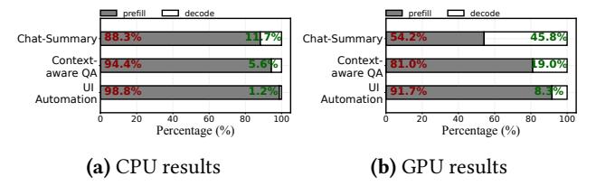

**Figure 1.** Breakdown of end-to-end inference latency for UI automation, context-aware QA, and chat summaries. CPU evaluation uses llama.cpp as the on-device inference engine, while GPU evaluation uses TFLite as the simulation engine.

**Table 2.** Specifications of well-known mobile NPUs provided by mainstream vendors.

| Vendor   | Latest NPU            | SDK              | Open | Group | INT8 Perf. |
|----------|-----------------------|------------------|------|-------|------------|
| Qualcomm | Hexagon NPU [17]      | QNN [25]         | ×    | ×     | 73 TOPS    |
| Google   | Edge TPU [19]         | Edge TPU API [8] | ×    | ×     | 4 TOPS     |
| MediaTek | MediaTek APU 790 [12] | NeuroPilot [15]  | ×    | N/A   | 60 TOPS    |
| Huawei   | Ascend NPU [7]        | HiAI [10]        | ×    | ×     | 16 TOPS    |

&quot;Open": Open-source?; "Group": Support per-group quantization MatMul? "N/A": No available documents for public; "INT8 Perf.": Int8 performance.

neural processing units (NPUs) that are well-suited for integer operations, such as INT8-based matrix multiplication. Table 2 summarizes the specifications of well-known mobile NPUs provided by mainstream vendors. For example, Qualcomm's mobile SoCs feature Hexagon NPUs, achieving up to 73 trillion INT8 operations per second. According to AI-Benchmark [18], the Hexagon NPU in the Xiaomi 14 can infer the MobileNet-V2 model in just 0.6 ms, 23× faster than a mobile CPU and 3.2× faster than a mobile GPU.

Mobile NPU architecture. Mobile NPUs deliver significant performance benefits by single instruction multiple data (SIMD) architecture. For instance, Hexagon NPUs support 1024-bit INT8 vector arithmetic, allowing multiple SIMD instructions to execute in parallel. However, their floating-point computation capabilities are relatively weak compared to mobile GPUs. With clock frequencies between 500 and 750 MHz, mobile NPUs are more energy-efficient than mobile CPUs and GPUs. Additionally, unlike cloud GPUs that have separate physical memory, mobile NPUs are integrated within mobile SoCs, sharing the same physical memory with mobile CPUs, eliminating the need for memory copying during NPU execution.

**Micro benchmark comparison.** To evaluate the performance of INT8 MatMul on mobile NPUs, we conducted preliminary experiments on the Redmi K70 Pro using MatMul sizes commonly used in mobile LLMs, as summarized in

**Table 3.** Execution latency (ms) for various MatMul sizes on Redmi K70 Pro.

| Matrix A | Matrix B   | NPU INT8 | CPU INT8    | GPU FP16    | NPU FP16    |
|----------|------------|----------|-------------|-------------|-------------|
| 64*2048  | 2048*2048  | 0.9      | 4.2 (4.6×)  | 1.7 (1.9×)  | 252 (193×)  |
| 64*2048  | 2048*8192  | 1.5      | 6.8 (4.5×)  | 4.8 (3.2×)  | 986 (657×)  |
| 64*2048  | 2048*11008 | 2.0      | 11.6 (5.8×) | 6.9 (3.5×)  | 1207 (603×) |
| 32*4096  | 4096*4096  | 1.7      | 7.5 (4.4×)  | 3.1 (1.8×)  | 1054 (620×) |
| 32*4096  | 4096*8192  | 2.9      | 13.1 (4.5×) | 7.7 (2.6×)  | 2009 (692×) |
| 32*4096  | 4096*11008 | 4.1      | 19.6 (4.8×) | 10.4 (2.5×) | 3112 (759×) |

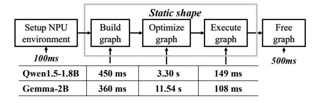

**Figure 2.** The workflow of executing DNNs on mobile NPUs, with latencies for each procedure on QNN [25].

Table 3. INT8 MatMul on mobile NPUs achieved a 4.5–5.8× speedup compared to CPU INT8 and a 1.8–3.5× improvement over GPU FP16. The performance gains increase with larger computational workloads. However, performing FP16 MatMul on the mobile NPU resulted in performance up to 159× slower than CPU INT8. These results align with the INT8 SIMD architecture of mobile NPUs, confirming that mobile NPUs are best suited for accelerating INT8 matrix multiplication.

DNN execution workflow on mobile NPUs. Executing DNNs on mobile NPUs involves configuring the NPU environment, creating the compute graph, optimizing the graph, executing the graph, and freeing the graph, as shown in Figure 2. Typically, creating and optimizing the compute graph are most time-consuming, where the former includes translating models into the NPU-required intermediate representation, and memory allocation, that takes 300–500ms, while the latter includes optimization for adjusting memory layout, execution order, and operator fusion, taking many seconds. In addition, the closed-source nature of NPU SDKs limits further adaptation for LLMs.

#### 2.3 Gaps between LLMs and Mobile NPUs

Given its inherent advantages, we are surprised to find that none of existing DNN engines support LLM acceleration on mobile NPUs. We then dig into the underlying reasons and find a huge gap between existing mobile NPUs design and LLM inference pipeline.

• LLM prefill phase relies on variable-length prompts, leading to excessive time spent on building and compiling the NPU graph. As illustrated in Figure 2, before the compute graph can be executed on the mobile NPU, it must be built and optimized, a process taking tens of seconds. For instance, building the graph for the Gemma 2B

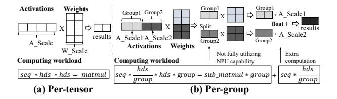

**Figure 3.** Per-tensor quantization MatMul and per-group quantization MatMul. *seq*, *hds*, *group* represent sequence length, hidden size, and group number, respectively.

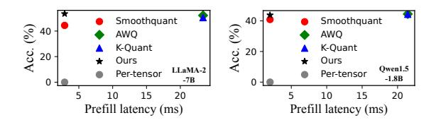

**Figure 4.** The prefill latency and accuracy on HelloSwag datasets among different quantization algorithms atop Xiaomi 14 using Qualcomm QNN framework.

model using QNN framework takes 360 ms, and graph optimization requires 11.54 seconds. Unlike CNN models, which are built and optimized once and can be executed multiple times with the same input shape, the LLM prefill phase must handle variable-length prompts, necessitating rebuilding and re-optimization of compute graphs for each inference. Consequently, using mobile NPUs in this scenario offers no performance benefit and is often slower than using a CPU.

- The existence of activation outliers makes LLM difficult to quantize at whole-tensor level, yet a more finegrained group-level quantization hampers NPU efficiency. Our preliminary experiments, shown in Figure 4, indicate that two popular quantization algorithms (K-Quant [59] and AWO [56]) incur significant inference overhead by  $8.1 \times 10.7\times$ , as compared to per-tensor quantization (Figure 3(a)). This is because algorithms like K-Quant and AWQ use finegrained per-group quantization (Figure 3(b)) to maintain high accuracy. These algorithms divide activations and weights into multiple groups, each with an independent quantization scale. On NPUs, this approach requires dividing the MatMul operation into several sub-tensor MatMuls, which fails to fully leverage the capabilities of mobile NPUs. Additionally, it necessitates aggregating intermediate results with floatingpoint additions, resulting in extra floating-point computations. The exception is SmoothQuant [84], which uses pertensor quantization but suffers from significant accuracy loss, such as a 3.9% and 8.4% drop on the HelloSwag dataset for the LlaMA-2-7B and Qwen1.5-1.8B model, respectively.
- On-device LLM inference relies on floating-point operations, conflicting with the NPU's design for INT8 acceleration. Figure 5 illustrates a typical workflow for

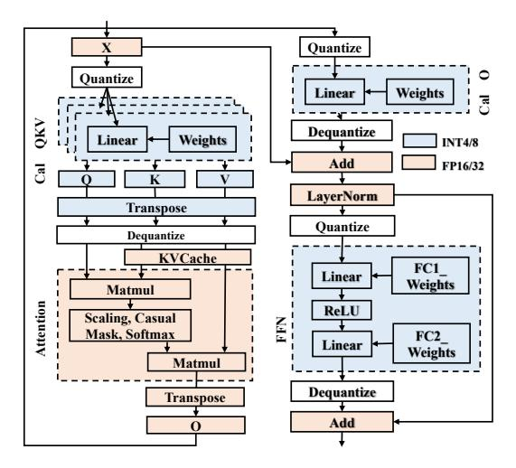

**Figure 5.** The workflow of quantized on-device LLM inference. Operations shown in blue are computed using INT4/INT8 formats, while those in orange are computed using float data formats.

**Table 4.** The operator data formats in the state-of-the-art quantization inference approaches. Each module in the first row is illustrated in Figure 5.

| Quantization     | Type       | Acc. | Cal QKV | Atten. | Cal O | Norm. | FFN  |
|------------------|------------|------|---------|--------|-------|-------|------|
| K-Quant [59]     | Per-Group  | Low  | INT8    | FP16   | INT8  | FP16  | INT8 |
| GPTQ [35]        | Per-Group  | High | FP16    | FP16   | FP16  | FP16  | FP16 |
| AWQ [56]         | Per-Group  | High | FP16    | FP16   | FP16  | FP16  | FP16 |
| SmoothQuant [84] | Per-tensor | Low  | INT8    | FP16   | INT8  | FP16  | INT8 |

"Atten.":Attention; "Norm.": Normalization.

quantized inference. To ensure inference accuracy, only linear layers (highlighted in blue) perform matrix multiplication in the INT8/INT4 data format. For these layers, the activation x is quantized to INT8/INT4 before performing the dot product with weights. Other operations, such as Attention and LayerNorm (highlighted in orange), are computed in floating-point format. Table 4 further summarize the operator data formats in state-of-the-art quantization inference algorithms. All of them depend on float Attention and normalization operations. Given that float operations dramatically degrade performance on mobile NPUs, these operations cannot be efficiently executed on the NPU with significant overhead.

## 3 11m.npu Design

#### 3.1 Overview of llm.npu

**Design goal.** 11m. npu aims to reduce prefill latency and energy consumption for mobile-sized LLMs through on-device NPU offloading. It supports various mobile-sized LLMs on devices and can be integrated as part of LLM-as-a-System-Service in mobile OS or mobile application services [99, 102]. **Workflow.** Figure 6 illustrates the workflow of 11m. npu. The key idea of 11m. npu is to maximize its execution on mobile NPU for integer operation acceleration; while keep

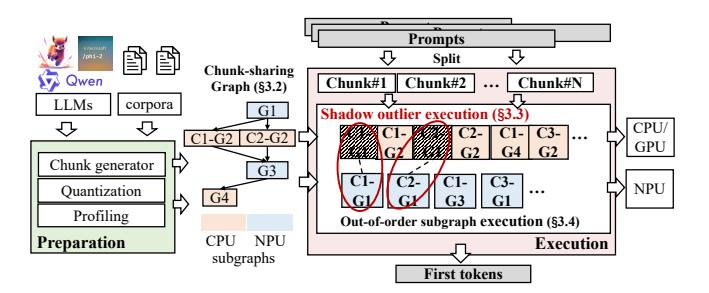

Figure 6. The workflow of 11m.npu.

necessary floating point operations on CPU/GPU to not compromise accuracy. To enable more efficient NPU offloading, 11m. npu re-constructs the prompt and model in following ways: (1) At *prompt level*: variable-length prompt is reduced into multiple fixed-sized chunks with data dependency preserved; (2) At *block level*: Transformer block is scheduled into CPU/GPU and NPU based on their hardware infinity and accuracy sensitivity; (3) At *tensor level*: important outliers are identified and extracted to run on CPU/GPU.

- Preparation stage. 11m. npu first uses an enhanced pertensor quantization algorithm to quantize LLMs into W8A8 format. The quantization algorithm differs from existing ones as it filters out most unimportant activation outliers and extracts the rest of them into independent, lightweight operators that are complementary to the original one. 11m. npu also generates fixed-length chunk-sharing graphs (§3.2) to efficiently handle variable-length prompts.
- Execution stage. When receiving a prompt, 11m. npu divides it into fixed-sized chunks and processes them causally. These chunk graphs will be split into subgraphs scheduled onto the CPU/GPU and NPU according to their data formats for efficient execution. To preserve accuracy, certain INT8-based linear layers undergo sparse float outlier shadow execution on the CPU/GPU in parallel to compensate for quantization errors from outliers (§3.3). To enhance execution efficiency, 11m. npu judiciously schedules the chunks in out-of-order manner (§3.4).

#### 3.2 Chunk-sharing graph execution

To tackle the dynamic prompt length challenge, an intuitive solution is to set a fixed length compute graph ahead and use padding [3, 67, 77]. However, this method lacks flexibility and excessive padding wastes compute resources.

**Chunk-wise prefill.** To enhance flexibility and minimize padding for variable-length prompts, we recognize that processing a long prompt in a LLM is equivalent to processing several split sub-prompts, or "chunks", causally. This is feasible because popular LLMs use a decoder-only architecture, where the result of the *i*-th token depends only on the preceding tokens. To that end, 11m. npu first pre-builds and preoptimizes fixed-length chunk-based NPU compute graph at the preparation stage. During inference, 11m. npu splits long

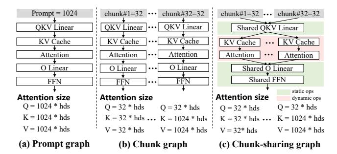

**Figure 7.** The illustration of prompt graph, chunk graph and chunk-sharing graph. The chunk length is 32.

prompts into several chunks and processes them using these pre-built chunk graphs, as illustrated in Figure 7(b).

However, solely using chunk graphs is not scalable, as 11m. npu would need to store numerous distinct chunk graphs in memory, significantly increasing memory overhead. This is because different chunk graphs have attention operators of varying sizes. For instance, considering a prompt length of 1024 and a chunk length of 32, the QKV dimension sizes of the attention operators for the first chunk are all 32\*hds, while for the last chunk they are 32\*hds, 1024\*hds, and 1024\*hds respectively, as shown in Figure 7(b).

Chunk-sharing graph. 11m. npu introduces a chunksharing graph, shown in Figure 7(c), based on the insight that LLM operators fall into two distinct categories: (1) static operators (in green), such as Linear and LayerNorm, which depend only on the chunk length and can be shared across different chunks; and (2) dynamic operators (in red), such as Attention, which depend on both chunk length and chunk sequence and cannot be shared among different chunks. Consequently, 11m. npu divides the LLM into several subgraphs based on the shareability of operators. The shared subgraphs are built and optimized once, whereas non-shared subgraphs are constructed individually for different chunks. During the prefill phase, activations from different chunks pass through the same static operator subgraphs while dynamically selecting the appropriate dimension-specific dynamic operators. This method significantly reduces memory overhead and enhances scalability, as most dynamic operators, like Attention, do not contain weights, requiring only activation buffers.

Our experiments show that 120 out of 144 subgraphs can be shared in Qwen1.5-1.8B models, reducing memory consumption by up to 75% (7.2GB) for a prompt length as 1024 and a chunk length as 256.

We also conducted extensive experiments on selecting a proper chunk length. The results of two popular LLMs (Qwen1.5-1.8B and Gemma-2B) on Xiaomi 14 device is illustrated in Figure 8. Based on the observations, 11m.npu empirically chooses a chunk length of 256 for Xiaomi 14 device, which effectively utilizes the capabilities of mobile

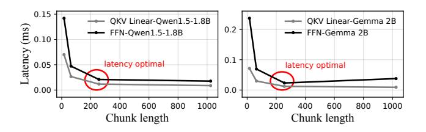

**Figure 8.** The per-token latency of QKV Linears and FFN under different chunk lengths.

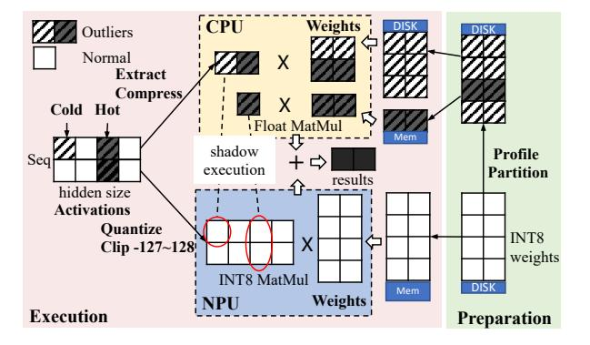

**Figure 9.** The workflow of shadow outlier execution.

NPUs while reducing intra-chunk padding. In practice, such profiling needs to be performed across different NPUs.

#### 3.3 Shadow outlier execution

To enable NPU-friendly, per-tensor activation quantization without compromising LLM accuracy, 1lm.npu adopts a novel approach termed *shadow outlier execution*. As shown in Figure 9, 1lm.npu extracts the activation channels with outliers at runtime into a more compact tensor, executes it on CPU, and merges it back to the outcome of original operator on NPU. This procedure can be formulated as follows:

$$\frac{x}{s} \odot w = \left\{ \min \left[ \max \left( \frac{x}{s}, -127 \right), 128 \right] + \left\lfloor \frac{x}{s} / 128 \right\rfloor \times 128 \right\} \odot w$$

$$= \min \left[ \max \left( \frac{x}{s}, -127 \right), 128 \right] \odot w \quad \text{on NPU}$$

$$+ extract \left( \left\lfloor \frac{x}{s} / 128 \right\rfloor \times 128 \right) \odot w \quad \text{on CPU}$$

$$(1)$$

where  $x, w, s, \odot$ , and *extract* represent the original float activation, INT8 weights, the quantization scale factor, the MatMul operation, and the function of extracting activation outliers into a more compact tensor, respectively. Specifically, the MatMul  $\frac{x}{s} \odot w$  can be equivalently divided into the sum of two parts according to the associative law: (1) *Mobile NPU for MatMul within the scale.* 11m. npu first quantizes and rounds x to the range of -127 to 128 based on the scale factor s. It then obtains intermediate results by performing a standard W8A8 per-tensor MatMul with weights w. (2) *Mobile CPUs/GPUs for MatMul beyond the scale.* 11m. npu calculates the partial values exceeding s. Since these outliers are rare, 11m. npu

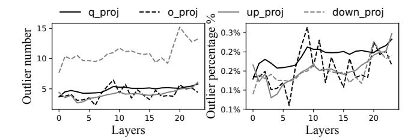

Figure 10. The average number and percentage of outlier channels per layer on Qwen1.5-1.8B model using the wikitext dataset under 2048 inference. Less than 0.3% channels have outliers during one inference.

extracts these values from the tensor, compresses them into a dense tensor, and performs a MatMul with weights *w*.

Since outliers are very sparse (around 5–15 channels, accounting for only 0.1%–0.3% of total channels, as shown in Figure 10), the shadow execution on CPU is much faster than the execution of original tensor on NPU, and its execution time can be totally hidden by overlapping. To further minimize the overhead of this extra process, 11m. npu determines an outlier threshold (i.e., *s* in Equation 1) by profiling a large corpora at offline, thereby can identify the outliers by simply comparing the activation numbers to this threshold. The design of shadow outlier execution is compatible with any per-tensor quantization algorithms, and the current prototype of 11m. npu is based on the simple max-min symmetry quantization [47].

While the shadow outlier execution seems to have well balanced the NPU affinity and LLM accuracy, two more crucial issues need to be addressed to make it practical. First, though mobile SoC uses a unified memory chip for heterogeneous processors, they use separated memory space. To enable shadow execution of activation outliers, 11m. npu has to keep another copy of each MatMul weights on CPU's memory space. This increases the memory footprint by almost 2 times. Second, while the execution of outlier is fast even on CPU, the synchronization of the reduced sum between CPU and NPU still takes non-trivial overhead, e.g., 29.7% end-to-end latency and 20.1% energy consumption on Qwen1.5-1.8B.

Most outliers tend to appear in a small set of channel positions. We observe that, while outliers appear in a wide range of channel positions during processing a long prompt (e.g., 78%), such appearance is highly skewed – few channels dominate the appearance of outliers. For instance, as shown in Figure 11, less than 3% of channels contribute to the majority of outliers (over 80%) across various inputs on Qwen1.5-1.8B and LlaMA-2-7B models. Therefore, for shadow outlier execution, 11m.npu only keeps the tensor weights that need to be used by those "hot channels" in CPU memory space, and retrieve the rest of them from disk if outliers on those positions are extracted (which is rare) at

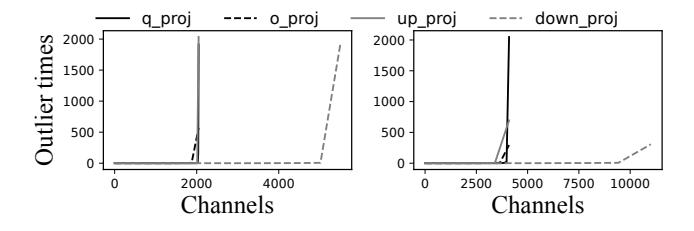

Figure 11. The outlier times per channel on Qwen1.5-1.8B model using the wikitext dataset under 2048 inference. Less than 3% channels contribute over 80% outliers.

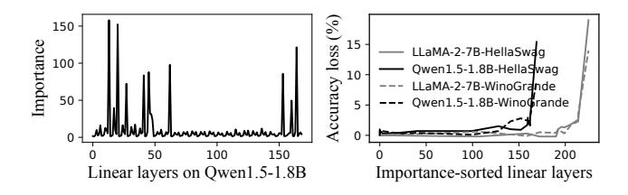

**Figure 12.** Left: Outlier importance of different layers in Qwen1.5-1.8B model. Right: Relationship between accuracy and pruned layers on HellaSwag and Winograde datasets.

runtime. Note that the weights retrieval can be also overlapped with the NPU execution of the original MatMul. This approach reduces the memory overhead of shadow execution by 34.3% with negligible latency.

Most outliers can be pruned without impacts on ac**curacy.** Surprisingly, we observe that the activation outliers on most MatMul operators are unimportant to the LLM accuracy and can be simply removed. Here, the importance of an outlier is measured as the ratio between the largest outlier and the quantization scale (s in Equation 1). The larger ratio indicates a more dispersed activation distribution, resulting in more significant quantization errors. 11m. npu profiles these outlier importance using large corpora data at offline stage, (Figure 12), and prunes most of unimportant layers' outliers. Typically, we observed layers near the inputs and outputs have a higher importance. This is because layers close to inputs are easily influenced by the tokens disparity, exhibiting greater fluctuations, while layers approaching to outputs easily accumulate the errors from the shallow layers. Based on the observation, 11m. npu prunes the outliers of top 85% most unimportant layers through offline profiling, so that the CPU-NPU synchronization is eliminated.

#### 3.4 Out-of-order subgraph execution

As elaborated in (§2.3), LLM quantization algorithms cannot fully eliminate floating point operations, llm.npu thereby divides its execution flow into NPU and CPU/GPU collaboratively. Typically, LayerNorm, Attention, as well as the shadow outlier computation are placed on the CPU/GPU;

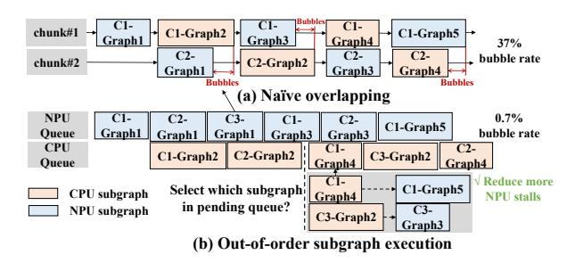

Figure 13. Out-of-order subgraph execution.

while the other linear layers are processed on the NPU. However, we found simply overlapping their execution is inefficient, resulting in large execution bubbles (37% bubble rate in critical path), as illustrated in Figure 13(a).

**Out-of-order execution.** To reduce these execution bubbles, 11m. npu is guided by a key insight that, after being partitioned at both chunk and subgraphs levels, the LLM subgraphs can be scheduled in an out-of-order manner. More specifically, any input-ready subgraph can be executed without strictly following the chunk sequence. For instance, the first subgraph of the third chunk (C3-Graph1) can be executed during the bubble period when C2-Graph1 finishes.

To preserve correctness, 11m. npu considers two types of dependency: (1) *Cross-chunk dependency*. Operators like Attention rely on data from previous chunks. This means the i-th chunk j-th subgraph  $G_{i,j}$  depends on the j-1-th subgraph of the  $0,1,\ldots,i-1$  chunks:

$$G_{i,j} \leftarrow G_{0,j-1}, G_{1,j-1}, \dots, G_{i,j-1}$$
 (2)

(2) *Intra-chunk dependency*. Operators like LayerNorm, Linear, and Quantize rely only on previous subgraphs within the same chunk. Therefore, the i-th chunk's j-th subgraph  $G_{i,j}$  depends on the j-1-th subgraph of the same chunk:

$$G_{i,j} \leftarrow G_{i,j-1} \tag{3}$$

As mobile processors are weak at parallelism and preemption [40, 86, 97], to ensure efficiency, a processor is capable of executing only one subgraph at any given time.:

$$\sum_{i=0}^{N} \sum_{j=0}^{M} P_{i,j,t} = 1, \forall t$$
 (4)

where  $P_{i,j,t} = 1$  indicates that subgraph  $G_{i,j}$  is running on processor P at time t, and N and M represent the maximum number of chunks and subgraphs, respectively. 11m. npu aims to find an execution order minimizing the total execution time of all subgraphs under these constraints. Unfortunately, this scheduling problem can be reduced to a classical NP-Hard Traveling Salesman Problem [44]. Moreover, because the number of chunks varies with user prompts, an optimal scheduling strategy cannot be generated offline.

Instead, 11m.npu utilizes an online heuristic algorithm. The key idea is to focus not on the execution time of the

subgraph g, but on how executing g contributes to reducing NPU stalls, motivated by the observation that during the prefill phase, NPU execution time often dominates inference latency, being the critical path. For instance, with a prompt length of 256 using the Qwen1.5-1.8B model, NPU execution takes 315ms, about twice that of the CPU.

Specifically, we define a subgraph g's contribution to reduce NPU stalls as follows: If subgraph g is to be executed on the CPU/GPU, let S be the set of new subgraphs that can be executed after g is completed. S will be executed on the NPU. A longer execution time of S is beneficial for reducing NPU stalls. Thus, g's contribution is defined as the total execution time of S. Conversely, if g is executed on the NPU, a shorter execution time of S is beneficial, with the negative value of S's execution time as g's contribution, formulated as:

$$C = \begin{cases} \sum T_i, \forall i \in S \text{ if } g \text{ is on the CPU/GPU} \\ -\sum T_i, \forall i \in S \text{ if } g \text{ is on the NPU} \end{cases}$$
 (5)

where T is the subgraph execution time. 11m. npu always chooses the subgraph with the largest C, meaning the subgraph g with S having the longest execution time on the NPU or the shortest execution time on the CPU/GPU.

In a nut shell, 11m. npu profiles all the subgraph execution time and their dependency offline at the preparation stage. During the prefill stage, it calculates all the pending subgraphs C value and selects one with maximum C to run, with microsecond-level performance overhead.

## 4 Implementation and Evaluation

We have fully implemented 11m. npu for Qualcomm Hexagon NPUs, comprising 10K lines of code in C/C++ and assembly language. We choose Qualcomm SoCs as the target platform for its popularity on mobile devices and powerful NPU capacity. Qualcomm Hexagon is also the only mobile NPU with an open instruction set architecture. 11m. npu is built on the MLLM [23], one state-of-the-art mobile LLM engines, and ONN framework [25], the Qualcomm Neural Processing SDK. It supports standard LLM formats exported from Hugging Face [21]. To facilitate LLM execution, we implemented specific operators like KVCache, SiLU, RMSNorm, ROPE, and etc, in addition to what have been supported by QNN. To reduce context switching overhead between CPUs/GPUs and NPUs, 11m. npu leverages shared buffers to synchronize intermediate results from different processors. For end-to-end inference, 11m. npu is compatible with any decoding engine and utilizes the MLLM CPU backend for decoding stage as easy implementation, with a default chunk length of 256. The default pruning rate for outlier layers is 85%. 11m. npu does not consider resource detection and contention in the current implementation.

The prototype further incorporates two optimizations. (1) Our extensive experiments show that mobile NPUs ofte favor tensor sizes (e.g., equal "height" and "width") in CNN architectures. For example, a linear layer with weights of

2048×2048 produces the same results for inputs of 1024×1×2048 and 32×32×2048, but using 32×32×2048 reduces execution latency by 1.62×. Therefore, 11m. npu profiles all possible equivalent shapes for linear layers during the preparation stage and selects the most efficient one. (2) Mobile NPUs typically access limited memory regions (e.g., 4GB for Hexagon NPU), which can be smaller than the size of LLM weights. To maximize prefill acceleration within this limited memory, 11m. npu prioritizes executing computationally intensive tasks, such as FFN, on the NPU to enhance efficiency.

#### 4.1 Experiment setups

**Hardware setup.** We test 11m. npu on two smartphones with different Qualcomm SoCs: Redmi K70 Pro (Snapdragon 8gen3, 24GB memory) and Redmi K60 Pro (Snapdragon 8gen2, 16GB memory). All devices run Android OS 13.

Models and datasets. We conducted tests using a variety of typical mobile-sized LLMs: Owen1.5-1.8B [27], Gemma-2B [9], Phi2-2.7B [16], LLaMA2-Chat-7B [11], and Mistral-7B [14]. To evaluate 11m. npu's quantization accuracy, we employed widely recognized LLM benchmarks, including LAMBADA [68], HellaSwag [103], WinoGrande [4], Open-BookQA [62] and MMLU [43]. For inference speed experiments, we selected retrieval-based datasets from Longbench, 2wikimqa and TriviaQA [28], for simulating context-aware generate tasks like automated email reply. Additionally, we assessed 11m.npu in screen question-answering and mapping instruction to UI action scenarios using DroidTask datasets [22] to simulate agent-based UI automation tasks. **Baselines.** We mainly compare 11m. npu with 5 baselines, including 3 widely used mobile LLM engines (TFLite [57], MNN [49], and 11ama.cpp [59]). Those engines support only mobile CPU and GPU; 2 advanced baselines are MLC-LLM [75], an LLM compiler for on-device GPUs, and PowerInfer-v2, which also utilizes mobile NPUs to accelerate prefilling [94]. Since PowerInfer-v2 is not open-sourced, we use the reported data from its paper. To be noted, those baselines often support only a subset of 5 LLMs we evaluated.

Metrics. We mainly measure LLM inference accuracy, prefill latency, prefill energy consumption, prefill memory consumption and end-to-end inference latency. The energy consumption is obtained through /sys /class/power\_supply in Android OS by profiling every 100ms. All experiments are repeated three times and we report the average numbers.

#### 4.2 Prefill performance.

We evaluate the 11m.npu's prefill performance (speed and energy consumption) at prompt lengths of 64, 256 and 1024 tokens on two devices, as shwon in Figure 14 and 15. Despite outlier variations across datasets, the overall impact on prefill performance is minimal, so we report results from the Long-Bench dataset. The results show that 11m.npu consistently outperforms all baselines across both metrics, with benefits becoming more pronounced as prompt length increases.

Figure 14. Prefill speed under different prompt lengths on different devices (datasets: Longbench-2wiki-Multi-doc QA).

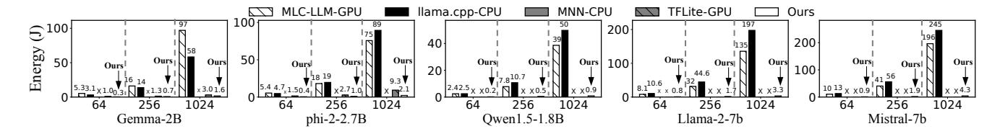

Figure 15. Energy consumption under different prompt lengths on Redmi K60 Pro (datasets: Longbench-2wiki-Multi-doc QA).

Prefill speed. For prompt length of 1024 tokens, 11m. npu can reduce prefill latency by 18.17–38.4×, 7.3×, 32.5–43.6×, and 1.27–2.34× on Redmi K70 Pro compared with llama.cpp-CPU, MNN-CPU, MLC-GPU, TFLite-GPU, respectively. On the Redmi K60 Pro, these improvements are 21.3–41.3×, 7.43×, 37.2–69.3×, and 1.3–2.6×, respectively. These speedups are due to 11m. npu's use of three innovative techniques that fully leverage mobile NPUs, including *shadow outlier execution*, high-efficiency per-tensor MatMul, and *out-of-order subgraph execution*. Compared with PowerInfer-V2-NPU, a baseline also using NPU for prefilling, 11m. npu can achieve 3.28–5.32× and 3.4–5.6× speedup on two devices, respectively, by employing NPU-friendly INT8 linear computation and fine-grained subgraph scheduling (§3.4).

For prompt length of 64 tokens, the prefill speed of 11m. npu is  $14.86-7.10\times$ ,  $1.69\times$ ,  $10.91-17.32\times$ ,  $1.48\times$ , and  $1.81-2.51\times$  faster than llama.cpp-CPU, MNN-CPU, MLC-GPU, TFLite-GPU, and PowerInfer-V2-NPU respectively, with speedups averaging  $10.5\times$ ,  $4.31\times$ ,  $2.68\times$ ,  $1.02\times$ , and  $1.96\times$  lower than those for 1024-token prompts. This is because a shorter prompt can lead to a padding problem and limit 11m. npu's out-of-order execution scheduling efficiency.

**Prefill energy consumption.** Energy consumption was evaluated on the Redmi K60 Pro, the only rootable device. PowerInfer-V2 was excluded due to the lack of energy consumption data and open-source code. For 1024-token prompts, 11m. npu reduces energy consumption by 35.63–59.52×, 35.21–59.25×, and 1.85–4.32× compared to llama.cpp-CPU, MLC-GPU, and TFLite-GPU, respectively. For 64-token prompts, the savings are 10.38–14.12×, 10.38–17.79×, and 3.22–3.67×,

respectively. These savings are due to the high energy efficiency of mobile NPUs and 11m. npu's three novel techniques for maximizing NPU performance. Typically, during the LLM prefill stage, all CPU cores are fully utilized, consuming the highest power; NPUs operate at 500-750 MHz, consuming the least power.

#### 4.3 End-to-end performance

We evaluate the real-world performance of 11m. npu against baseline systems using three workloads: UI automation on DroidTask datasets, context-aware automated email replies on LongBench datasets, chat summaries on Persona-Chat datasets. Table 5 presents the prompt and output lengths of the three datasets, along with their corresponding prefill, decode, and end-to-end inference latency results. End-to-end speedups in Table 5 are the geometric mean of each sample. Our key observation is that 11m.npu always achieves the lowest inference latency across all three datasets.

For LongBench datasets, 11m. npu shows significant speed improvements: 23.0–46.2× over llama.cpp-CPU, 16.5–36.4× over MLC-LLM-GPU, 4.08–4.19× over MNN-CPU, 3.51–3.73× over PowerInfer-V2-NPU, and 1.27–2.03× over TFLite-GPU. This impressive performance is primarily due to 11m. npu's superior efficiency during the prefill stage. The speedup against TFLite-GPU is lower since 11m. npu currently relies on a CPU backend for decoding with no optimization, while TFLite utilizes GPU. Notably, 11m. npu is compatible with any decoding engine, which means once TFLite is opensourced, 11m. npu can integrate it as the decoding backend, potentially enhancing performance further.

**Table 5.** End-to-end latency comparison using real mobile applications execution on Redmi K70 Pro. Each cell is organized in the following format: end-to-end latency (prefill latency, decode latency). Unit: seconds.

| LLM                | Datasets                                                                                                                                                                    | MLC                     | LCPP                  | MNN                   | PI                    | TFLite              | Ours                 | Speedup   |  |
|--------------------|-----------------------------------------------------------------------------------------------------------------------------------------------------------------------------|-------------------------|-----------------------|-----------------------|-----------------------|---------------------|----------------------|-----------|--|
| Qwen1.5-1.8B       |                                                                                                                                                                             | 45.6 (45.43, 0.17)   | 26.7 (26.43, 0.24) | 10.6 (10.01, 0.59)    | -                     | -                   | 1.7 (1.49, 0.24)  | 6.2-26.8× |  |
|                    | Longbench: 2wiki-Multi-doc QA                                                                                                                                               | 78.4                    | 34.6                  | (10.01, 0.37)         |                       | 2.6                 | 1.9                  |           |  |
| Gemma-2B           | prompt length: 1451–1672 tokens output length: 2–4 tokens                                                                                                                | (78.03, 0.32)           | (34.31, 0.25)         | -                     | -                     | (2.40, 0.19)        | (1.68, 0.25)         | 1.4-41.3× |  |
| Phi-2-2.7B         | output length: 2–4 tokens                                                                                                                                                   | 87                      | 53.3                  | 13                    | _                     | 6.3                 | 3.1                  | 2.0-28.1× |  |
|                    |                                                                                                                                                                             | (86.70, 0.28)           | (53.00, 0.34)         | (11.98, 1.05)         |                       | (6.06, 0.28)        | (2.79, 0.34)         | 2.0 20.1  |  |
| LlaMA-2-7B         |                                                                                                                                                                             | 184.7 (184.20, 0.45) | 146 (145.25, 0.70)    | 22.4 (22.35, 0.05) | 19.8 (19.04, 0.78) | -                   | 5.3 (4.62, 0.70)  | 3.7-34.8× |  |
| 30 . 1 -1          | -                                                                                                                                                                           | 254.2                   | 200.2                 | (22.33, 0.03)         | 20                    |                     | 5.5                  |           |  |
| Mistral-7b         |                                                                                                                                                                             | (253.45, 0.72)          | (199.37, 0.87)        |                       | (19.22, 0.78)         | -                   | (4.61, 0.87)         | 3.6-46.2× |  |
| Geo-mean (speedup) |                                                                                                                                                                             | 34.7×                   | 21.8×                 | 4.8×                  | 3.7×                  | 1.7×                | -                    |           |  |
| Qwen1.5-1.8B       |                                                                                                                                                                             | 46                      | 27                    | 11.2                  | _                     | _                   | 2.0                  | 5.6-23.0× |  |
| QWCIII.J-1.0D      | Longbench: TriviaQA                                                                                                                                                         | (45.68)                 | (26.57, 0.47)         | (10.07, 1.15)         |                       |                     | (1.49, 0.47)         | 3.0-23.0  |  |
| Gemma-2B           | prompt length: 1511–1787 tokens                                                                                                                                             | 81.8 (81.25, 0.26)   | 36.2 (35.72, 0.43) | -                     | -                     | 2.8 (2.50, 0.32) | 2.2 (1.75, 0.43)  | 1.3-37.2× |  |
|                    | output length: 5–11 tokens)                                                                                                                                                 | 91.4                    | 56.3                  | 14.7                  |                       | 6.8                 | 3.6                  |           |  |
| Phi-2-2.7B         |                                                                                                                                                                             | (90.94, 0.50)           | (55.60, 0.68)         | (12.57, 2.11)         | -                     | (6.36, 0.40)        | (2.94, 0.68)         | 1.9-25.4× |  |
| II MA 0.7D         | -                                                                                                                                                                           | 197.3                   | 156.2                 | 23.8                  | 21.8                  | , , ,               | 6.2                  | 0.5.04.0  |  |
| LlaMA-2-7B         |                                                                                                                                                                             | (196.43, 0.83)          | (154.90, 1.28)        | (20.83, 3.00)         | (20.31, 1.34)         | -                   | (4.93, 1.28)         | 3.5-31.8× |  |
| Mistral-7b         |                                                                                                                                                                             | 266.2                   | 210                   | _                     | 21.5                  | _                   | 6.4                  | 3.4-41.6× |  |
|                    |                                                                                                                                                                             | (264.93, 1.31)          | (208.41, 1.57)        |                       | (20.10, 0.41)         |                     | (4.82, 1.57)         | J.4-41.0^ |  |
| Geo-mean (sp       | peedup)                                                                                                                                                                     | 31.0×                   | 19.6×                 | 4.4×                  | 3.4×                  | 1.6×                | -                    |           |  |
| Owen1.5-1.8B       |                                                                                                                                                                             | 21                      | 10.4                  | 3.9                   | _                     | _                   | 1.4                  | 2.80-15×  |  |
| 2                  | DroidTask: clock                                                                                                                                                            | (20.84, 0.14)           | (10.16, 0.25)         | (3.25, 0.61)          |                       |                     | (1.16, 0.25)         |           |  |
| Gemma-2B           | prompt length: 656–827 tokens                                                                                                                                               | 39.4 (39.11, 0.25)   | 16.5 (16.25, 0.21) | -                     | -                     | 2.5 (2.30, 0.18) | 1.2 (0.97, 0.23)  | 2.1-32.8× |  |
|                    | output length: 1–5 tokens)                                                                                                                                                  | 46.6                    | 25                    | 7.4                   |                       | 4.2                 | 3.1                  |           |  |
| Phi-2-2.7B         |                                                                                                                                                                             | (46.40, 0.24)           | (24.62, 0.34)         | (6.34, 1.06)          | =                     | (3.98, 0.2)         | (2.72, 0.34)         | 1.4-15.0× |  |
| 71.144.0 FD        | -                                                                                                                                                                           | 87.7                    | 60.4                  | 10.6                  | 11.1                  | (===,==,            | 4.8                  |           |  |
| LlaMA-2-7B         |                                                                                                                                                                             | (87.38, 0.33)           | (59.83, 0.63)         | (8.58, 2.11)          | (10.74, 0.37)         | _                   | (4.28, 0.53)         | 2.2-18.3× |  |
| Mistral-7b         | 1                                                                                                                                                                           | 122.3                   | 68.6                  |                       | 12                    |                     | 4.9                  | 2.4-25.0× |  |
|                    |                                                                                                                                                                             | (121.82, 0.51)          | (67.91, 0.65)         |                       | (11.64, 0.37)         |                     | (4.26, 0.65)         | 2.4-23.0  |  |
| Geo-mean (sp       | peedup)                                                                                                                                                                     | 20.2×                   | 10.8×                 | 2.4×                  | 2.4×                  | 1.7×                | -                    |           |  |
| Qwen1.5-1.8B       |                                                                                                                                                                             | 16.2 (16.05, 0.14)   | 8.1 (7.83, 0.25)   | 3.1 (2.5, 0.61)    | -                     | -                   | 1.1 (0.90, 0.25)  | 2.8-14.7× |  |
|                    | DroidTask: clock                                                                                                                                                            | 29.4                    | 12.3                  | (2.3, 0.61)           |                       | 1.9                 | 0.90, 0.23)          |           |  |
| Gemma-2B           | prompt length: 505–645 tokens                                                                                                                                               | (29.14, 0.52)           | (12.11, 0.20)         | -                     | -                     | (1.71, 0.18)        | (0.72, 0.23)         | 2.1-32.7× |  |
|                    | output length: 3–5 tokens                                                                                                                                                   | 35.4                    | 19                    | 5.9                   |                       | 3.2                 | 2.4                  |           |  |
| Phi-2-2.7B         |                                                                                                                                                                             | (35.15, 0.23)           | (18.65, 0.34)         | (4.80, 1.05)          | =                     | (3.01, 1.2)         | (2.07, 0.34)         | 1.3-14.8× |  |
| LlaMA-2-7B         |                                                                                                                                                                             | 63.7                    | 43.9                  | 7.7                   | 8.2                   |                     | 3.6                  | 2.1-17.7× |  |
| LiaiviA-2-7D       |                                                                                                                                                                             | (63.38, 0.33)           | (43.40, 0.52)         | (5.06. 1.64)          | (7.79, 0.37)          |                     | (3.10, 0.52)         | 2.1-17.7  |  |
| Mistral-7b         |                                                                                                                                                                             | 90.1                    | 50.6                  | _                     | 8.9                   | _                   | 3.8                  | 2.3-23.7× |  |
|                    |                                                                                                                                                                             | (89.60, 0.51)           | (49.95, 0.65)         |                       | (8.56, 0.37)          |                     | (3.13, 0.65)         |           |  |
| Geo-mean (sp       | peedup)                                                                                                                                                                     | 19.7×                   | 10.5×                 | 2.5×                  | 2.3×                  | 1.7×                |                      |           |  |
| Qwen1.5-1.8B       |                                                                                                                                                                             | 18.74 (16.54, 2.20)  | 11.86 (8.07, 3.79) | 11.87 (2.58, 9.29) | -                     | -                   | 6.72 (2.92, 3.80) | 1.8-2.8×  |  |
|                    | Persona-Chat                                                                                                                                                                | 30.9                    | 14.3                  | (2.30, 7.27)          |                       | 4.3                 | 4.2                  |           |  |
| Gemma-2B           | prompt length: 488–584 tokens                                                                                                                                               | (27.05, 3.82)           | (11.24, 3.02)         | -                     | -                     | (1.59, 2.67)        | (0.67, 3.48)         | 1.02-7.4× |  |
| DI: 0.0 = D        | output length: 35–57 tokens                                                                                                                                                 | 36.1                    | 22.5                  | 20.6                  |                       | 5.9                 | 5.1                  |           |  |
| Phi-2-2.7B         |                                                                                                                                                                             | (32.51, 3.57)           | (15.24, 3.22)         | (4.43, 16.19)         | -                     | (2.79, 3.06)        | (1.91, 3.22)         | 1.2-7.1×  |  |
| IloMA 2.7D         | 1                                                                                                                                                                           | 64.2                    | 48.7                  | 45.5                  | 13.0                  |                     | 11.2                 | 1957      |  |
| LlaMA-2-7B         |                                                                                                                                                                             | (58.96, 5.20)           | (40.37, 8.30)         | (7.15, 38.23)         | (7.25, 5.77)          |                     | (2.88, 8.30)         | 1.2-5.7×  |  |
| Mistral-7b         |                                                                                                                                                                             | 90.5                    | 56.3                  | -                     | 13.7                  | -                   | 13.2                 | 1.04-6.9× |  |
|                    |                                                                                                                                                                             | (82.54, 8.0)            | (46.02, 10.28)        |                       | (7.89, 5.76)          |                     | (2.88, 10.28)        |           |  |
| Geo-mean (sp       | Geo-mean (speedup) $10.5 \times$ $3.5 \times$ $3.1 \times$ $1.1 \times$ $1.1 \times$ $-$ *LCPP and PI in the first row represent llama.cpp and PowerInfer-V2, respectively. |                         |                       |                       |                       |                     |                      |           |  |

\*LCPP and PI in the first row represent llama.cpp and PowerInfer-V2, respectively.

For the DroidTask datasets, 11m. npu reduces end-to-end inference latency by 7.9–12.5× compared to llama.cpp-CPU,

15.0–32.8× compared to MLC-LLM-GPU, 2.38–2.45× compared to MNN-CPU, 2.27–2.44× compared to PowerInfer-V2-NPU, and 1.35–2.38× compared to TFLite-GPU. The performance gains are slightly smaller for DroidTask datasets due to shorter prompts in UI automation versus email writing.

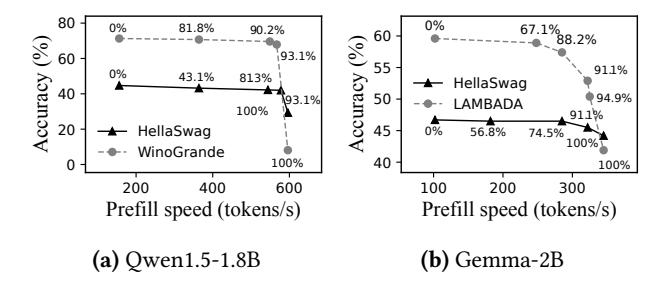

**Figure 16.** Generation speed and accuracy across various outlier pruning rates. The text positioned above or below the plots represents the corresponding pruning rates.

For the Persona-Chat datasets, 11m.npu reduces end-to-end inference latency by an average of 3.5× compared to llama.cpp-CPU, 10.5× compared to MLC-LLM-GPU, 3.1× compared to MNN-CPU, 1.1 times compared to PowerInfer-V2-NPU, and 1.1× compared to TFLite-GPU. The primary reason for the reduced performance improvement relative to other datasets is the larger number of output tokens generated by this dataset. Since 11m.npu currently supports only CPU-based decoding, this slower decoding backend results in increased end-to-end latency. This issue can be mitigated by utilizing a mobile GPU as the decoding backend (see Section 4.6 for details).

#### 4.4 Inference accuracy

Overall accuracy. We investigate the inference accuracy of 11m. npu on 5 LLM benchmarks: LAMBADA [68], MMLU [43], WinoGrande [4], OpenBookQA [62] and HellaSwag [103]. For comparison, we evaluated 4 alternatives: FP16 (non-quantization), K-Quant [59] (used in 11ama.cpp), SmoothQuant (state-of-the-art per-tensor method) [84], and LLM.Int8() (state-of-the-art float outlier handling method) [33]. 11m. npu achieves negligible accuracy loss, and significantly outperforms the other quantization algorithms, as shown in Table 6.

Specifically, 11m. npu is, on average, only 1% less accurate than FP16, and it shows an accuracy improvement of up to 32.9% over SmoothQuant and up to 70.9% over K-Quant. This improvement over SmoothQuant, which uses static profiling to smooth outliers to normal values, is due to 11m. npu's dynamic handling of outlier positions with CPU float precision. 11m. npu addresses outliers at the element level, providing higher precision than K-Quant that uses group-level quantization scales. Furthermore, 11m. npu achieves comparable accuracy (0.1% average loss) to LLM.Int8(), as both handle outliers with float precision. But 11m. npu better utilizes NPU-specific computational features, maintaining high accuracy and NPU efficiency.

Trade-offs between accuracy and performance. 11m. npu balances generation accuracy and speed by adjusting outlier pruning rates, with higher pruning rates leading to

**Table 6.** LLM capability accuracy on 11m.npu and baselines. "SQ": SmoothQuant; "Int8()": LLM.Int8(); "Degrad.": accuracy degradation compared to FP16.

| LAMBADA      | FP16  | SQ     | INT8() | K-Quant | Ours  | Ours Degrad. |
|--------------|-------|--------|--------|---------|-------|--------------|
| Qwen1.5-1.8B | 71.1% | 65.6%  | 71.0%  | 62.7%   | 71.7% | +0.6%        |
| Gemma2-2B    | 59.6% | 45.8%  | 59.2%  | 56.9%   | 59.4% | -0.2%        |
| Phi-2-2.7B   | 72.2% | 66.1%  | 71.7%  | 59.3%   | 67.5% | -4.7%        |
| LlaMA-2-7B   | 87.5% | 71.9%  | 88.0%  | 15.6%   | 86.3% | -1.2%        |
| Mistral-7b   | 84.8% | 51.2%  | 85.3%  | 23.9%   | 84.1% | -0.7%        |
| Avg. Degrad. | -     | -14.9% | 0%     | -31.3%  | -1.2% |              |
| HellaSwag    | FP16  | SQ     | INT8() | K-Quant | Ours  | Ours Degrad. |
| Qwen1.5-1.8B | 43.8% | 40.9%  | 43.5%  | 44.3%   | 43.8% | 0%           |
| Gemma2-2B    | 46.5% | 43.8%  | 46.1%  | 45.4%   | 47.3% | +0.8%        |
| Phi-2-2.7B   | 48.2% | 46.2%  | 47.7%  | 47.6%   | 46.9% | -1.3%        |
| LlaMA-2-7B   | 52.8% | 44.4%  | 53.1%  | 50.5%   | 53.5% | +0.7%        |
| Mistral-7b   | 57.4% | 44.9%  | 57.9%  | 57.0%   | 57.0% | -0.4%        |
| Avg. Degrad. | -     | -5.7%  | -0.1%  | -0.8%   | -0.0% |              |
| WinoGrande   | FP16  | sq     | INT8() | K-Quant | ours  | Ours Degrad. |
| Qwen1.5-1.8B | 58.3% | 51.0%  | 58.2%  | 59.0%   | 59.3% | +1.0%        |
| Gemma2-2B    | 58.3% | 54.8%  | 59.0%  | 58.5%   | 59.5% | +1.2%        |
| Phi-2-2.7B   | 72.2% | 68.9%  | 72.4%  | 72.5%   | 70.2% | -2.0%        |
| LlaMA-2-7B   | 65.2% | 56.9%  | 66.2%  | 67.4%   | 65.1% | -0.1%        |
| Mistral-7b   | 73.5% | 59.1%  | 73.3%  | 73.5%   | 73.1% | -0.4%        |
| Avg. Degrad. | -     | -7.4%  | +0.3%  | +0.7%   | -0.1% |              |
| OpenBookQA   | FP16  | SQ     | INT8() | K-Quant | ours  | Ours Degrad. |
| Qwen1.5-1.8B | 28.8% | 23.0%  | 28.5%  | 28.0%   | 26.6% | -2.2%        |
| Gemma2-2B    | 33.7% | 28.0%  | 34.2%  | 33.0%   | 38.4% | +4.7%        |
| Phi-2-2.7B   | 41.0% | 35.9%  | 40.2%  | 39.5%   | 37.7% | -3.3%        |
| LlaMA-2-7B   | 32.7% | 25.0%  | 32.0%  | 31.5%   | 31.1% | -1.6%        |
| Mistral-7b   | 39.4% | 25.6%  | 39.3%  | 37.9%   | 39.3% | -0.1%        |
| Avg. Degrad. | -     | -7.6%  | -0.3%  | -1.1%   | -0.5% |              |
| MMLU         | FP16  | SQ     | INT8() | K-Quant | ours  | Ours Degrad. |
| Qwen1.5-1.8B | 29.7% | 27.9%  | 29.1%  | 29.8%   | 30.8% | +1.1%        |
| Gemma2-2B    | 35.7% | 32.1%  | 35.1%  | 35.1%   | 36.4% | +0.7%        |
| Phi-2-2.7B   | 35.4% | 35.3%  | 35.6%  | 35.7%   | 36.7% | +1.3%        |
| LlaMA-2-7B   | 37.8% | 29.2%  | 38.1%  | 34.4%   | 36.9% | -0.9%        |
| Mistral-7b   | 42.1% | 30.9%  | 41.4%  | 42.3%   | 41.0% | -1.1%        |
| Avg. Degrad. | -     | -5.1%  | -0.3%  | -0.7%   | +0.2% |              |

faster generation but lower quality. To comprehensively show how outlier pruning rates influence generate accuracy and speed, we conducted experiments using Qwen1.5-1.8B and Gemma-2B on the Redmi K70 Pro with the HellaSwag [103] and LAMBADA [68] datasets. The results are shown in Figure 16.

When no outliers are pruned (pruning rate = 0%), 11m. npu achieves the highest accuracy, albeit with the slowest generation speed. Specifically, the Qwen1.5-1.8B model can attain an accuracy of 71.3% on the Lambada dataset, with a corresponding generation speed of 156 tokens per second. Conversely, the Gemma-2B model demonstrates an accuracy of 59.6% and a generation speed of 102 tokens per second. Upon pruning 80% of outliers, the Qwen1.5-1.8B model's accuracy decreases to 42.2%, while its generation speed increases to 544 tokens per second. Similarly, the Gemma-2B model's accuracy declines to 57.4%, yet its generation speed rises to 285

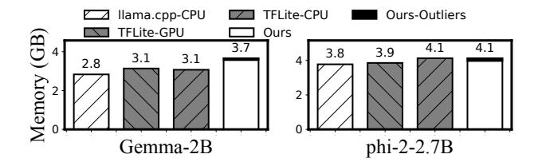

**Figure 17.** Memory consumption of different baselines (prompt length=512).

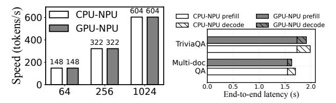

(a) Prefill speed under different (b) End-to-end latency on the prompt length

Longbench dataset

**Figure 18.** Prefill speed and end-to-end latency comparison between CPU-NPU coordination and GPU-NPU coordination.

tokens per second. When all outliers are pruned, generation accuracy reaches its lowest point, while generation speed is at its highest. Specifically, the Qwen1.5-1.8B model demonstrates an accuracy of merely 8.1% with a generation speed of 596 tokens/s; the Gemma-2B model reports an accuracy of 41.9% alongside a generation speed of 345 tokens/s.

#### 4.5 Memory consumption

We compare 11m. npu with INT8 weight baselines, as mobile NPUs only support INT8 weight computations. Memory consumption results on the Redmi K60 Pro, using a 512-token prompt, are presented in Figure 17. 11m. npu consumes up to  $1.32 \times$  more memory than llama.cpp and TFLite. The overhead is due to the MLLM and QNN frameworks, which allocate independent activation buffers for each operator to enhance speed. The tiny additional memory overhead introduced by 11m. npu is its  $\S 3.3$  shadow outlier execution technique (in black), which loads tiny float weights into memory, accounting for only 0.6%-1% of the total memory.

#### 4.6 GPU-NPU coordination analysis

11m. npu is compatible with mobile GPUs; however, we have currently implemented only the CPU-NPU version due to easy implementation. To illustrate the potential advantages of employing a mobile GPU, we simulate GPU-NPU coscheduling, assuming TFLite serves as the GPU backend. The evaluation is conducted using the Gemma-2B model across varying prompt lengths and the Longbench dataset, specifically on the Redmi K70 Pro, as shown in Figure 18. Our observations indicate that while GPU-NPU coordination

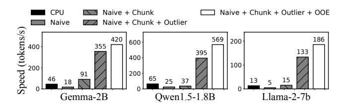

Figure 19. Ablation study of llm. npu (prompt length=512).

# does not enhance the prefilling speed, it effectively reduces the end-to-end latency.

As illustrated in Figure 18(a), the prefill speed achieved through GPU-NPU coordination is equivalent to that of CPU-NPU coordination. This phenomenon occurs because, within the design of 11m. npu, the computational demands placed on mobile CPUs and GPUs are significantly lower than those on the NPU (details in Section 3.4). Consequently, the computational latency of mobile CPUs and GPUs can be effectively hidden by the NPU computation, indicating that the choice of a mobile CPU or mobile GPU is not essential. On the other hand, GPU-NPU coordination can decrease end-to-end latency by 80–90 ms compared to CPU-NPU coordination. This improvement is attributed to the faster decoding speed of GPUs relative to CPUs.

#### 4.7 Ablation study.

We conduct a comprehensive breakdown analysis of the benefits brought by each of llm.npu 's techniques using the Qwen1.5-1.8B, Gemma-2B, and LlaMA2-7B models, as shown in Figure 19. The leftmost bar represents the prefill speed on the CPU using llama.cpp. The second bar shows a naive implementation on mobile NPUs, followed by the incorporation of our three techniques, with the rightmost bar representing llm.npu. The three techniques are represented by *chunk* (§ 3.2), *outlier* (§ 3.3), and *OOE* (§ 3.4), respectively. We observe that llm.npu's three techniques make a significant contribution to the overall improvement.

Firstly, directly offloading LLM prefilling workloads to mobile NPUs results in 2.55–2.68× delays, due to the substantial gap between LLMs and mobile NPUs, as detailed in §2.3. Additionally, *chunk-sharing graph* improves prefill speed by 1.46–5.09× by reducing graph building and optimization delays. The Gemma-2B model achieves the highest speedup, as it requires more time to build and optimize. Furthermore, *shadow outlier execution* reduces prefill latency by 3.91–8.68×, allowing per-tensor MatMul operations to fully utilize NPUs with minimal CPU/GPU overhead. Lastly, the *out-of-order subgraph execution* reduces prefill latency by 18%–44% by reducing execution bubbles within the NPU.

#### 5 Discussion and Future Work

**Advantages of NPUs over GPUs.** Typically, both mobile GPUs and NPUs serve as hardware accelerators for on-device

DNN inference [\[53,](#page-16-17) [86\]](#page-17-12). However, as mobile GPUs are already extensively used for graphic rendering on devices, relying on them for LLM inference can cause significant resource contention. In contrast, mobile NPUs, which are dedicated exclusively to deep learning tasks, have relatively lighter workloads, leaving ample time to run LLM inference. Besides, as elaborated in Section [2.2,](#page-2-1) mobile NPUs provide greater computational capacity, enhanced energy efficiency, and increased availability compared to mobile GPUs, making them more suitable for on-device LLM inference.

**llm.npu**'s technique stability. Despite the recent trend towards supporting FP16 in advanced NPUs [\[6,](#page-15-31) [13,](#page-15-32) [17\]](#page-15-9), llm.npu remains essential for NPU-based prefilling acceleration for two reasons: (1) Integer operations are expected to maintain dominance in mobile NPU-side LLM inference due to their superior computation performance, memory efficiency, and energy savings, while CPU/GPUs serve as supplementary units for enhancing accuracy. Therefore, llm.npu's three INT8-related techniques, which include co-scheduling across CPU/GPU and NPU to achieve high accuracy and efficiency, will continue to have a significant impact in this domain. (2) llm.npu is capable of empowering legacy devices with on-device LLM capabilities, democratizing access to LLMs. Future hardware design implications. llm.npu's performance could be further enhanced with the following hardware optimizations: (1) Dynamic shape-aware optimization: Hardware capable of dynamically reconfiguring to accommodate varying input and output shapes would markedly improve the acceleration of LLM inference. (2) Increased data cache size: Mobile NPUs generally enhance inference performance by loading an entire layer's weights into the data cache. Increasing the NPU cache size to align with LLM weight sizes is crucial for optimal performance. (3) Mixedprecision operands in computing units: Mobile NPUs typically support only uniform precision operands, necessitating additional data format conversions to perform FP16 \* INT8 operations. This overhead can be eliminated by enabling support for mixed-precision operands in computing units. **llm.npu** with mobile GPUs. Our current implementation relies solely on mobile CPUs for floating-point operators and the decoding phase due to ease of implementation. However, the design of llm.npu is compatible with both mobile CPUs and GPUs. We plan to incorporate GPU-NPU coordination in future developments. The primary engineering efforts in integrating mobile GPUs into llm.npu involve configuring the GPU backend and implementing the necessary operators. With mobile GPUs, llm.npu can significantly reduce end-toend inference latency, as elaborated in Section [4.6.](#page-12-0)

## 6 Related work

On-device LLM optimization. To reduce the substantial memory consumption of on-device LLM inference, various compression techniques have been proposed, including quantization and knowledge distillation [\[30,](#page-15-33) [35,](#page-15-25) [38,](#page-15-34) [46,](#page-15-35) [58,](#page-16-18) [65,](#page-16-19) [70,](#page-16-20) [80,](#page-17-15) [88,](#page-17-16) [91,](#page-17-17) [92,](#page-17-18) [96,](#page-17-19) [98,](#page-17-20) [101\]](#page-17-21). To minimize on-device LLM computation, researchers have introduced token pruning [\[29,](#page-15-36) [31,](#page-15-37) [51,](#page-16-21) [72,](#page-16-22) [79\]](#page-17-22), which prunes unnecessary tokens during the inference process. Speculative decoding, a method that accelerates token generation by offloading tasks to a smaller LLM, has been widely adopted in open-source frameworks [\[3,](#page-15-26) [59\]](#page-16-6) and extensively researched [\[32,](#page-15-38) [36,](#page-15-39) [42,](#page-15-40) [50,](#page-16-3) [61,](#page-16-4) [87,](#page-17-23) [95\]](#page-17-8). As a system optimization, llm.npu is orthogonal and compatible with these algorithm-level optimizations.

On-chip offloading for ML. This has been thoroughly studied to enable faster DNN inference by leveraging heterogeneous mobile processors like GPUs and NPUs [\[37,](#page-15-41) [39,](#page-15-42) [41,](#page-15-43) [45,](#page-15-44) [52–](#page-16-23)[54,](#page-16-24) [63,](#page-16-25) [66,](#page-16-26) [85,](#page-17-24) [86,](#page-17-12) [89,](#page-17-25) [93,](#page-17-26) [94,](#page-17-7) [104,](#page-17-27) [105\]](#page-17-28). MobiSR [\[54\]](#page-16-24) utilizes mobile NPUs to speed up super-resolution computation. However, these methods do not address LLM-specific features and are unsuitable for on-device LLM scenarios. The most relevant work is PowerInfer-V2 [\[94\]](#page-17-7), which also utilizes mobile NPUs for the prefilling. But, it does not comprehensively analyze the challenges of on-device NPU offloading for LLM prefilling or incorporate techniques to fully harness NPU capability. Our experiments demonstrate that our approach is up to 5.32× more efficient in the prefill stage. llm.npu is inspired by these efforts and is the first LLM inference framework with efficient on-device NPU offloading. Mobile NPU execution optimization. With the growing importance of mobile NPUs in smartphones, significant efforts have been made to optimize their execution efficiency [\[34,](#page-15-45) [64,](#page-16-27) [71,](#page-16-28) [73,](#page-16-29) [76,](#page-16-30) [78\]](#page-16-31). Pitchfork [\[73\]](#page-16-29) defines a portable fixed-point intermediate representation to optimize fixed-point execution efficiency. Isaria [\[76\]](#page-16-30) proposes a framework for automatically generating vectorizing compilers for DSP architectures, creating efficient operator codes for mobile NPUs. As a system framework, llm.npu is orthogonal and can leverage them to generate more efficient operator libraries as execution backend, further boosting performance.

## 7 Conclusions

This paper has proposed llm.npu, the first LLM inference system utilizing on-device NPU offloading to reduce prefill latency and energy consumption. llm.npu has incorporated novel techniques: chunk-sharing graph, shadow outlier execution and out-of-order subgraph execution to enhance NPU offloading efficiency. Extensive experiments have demonstrated llm.npu to show its superior performance benefits, e.g, up to 43.6× speedup and 59.5× energy savings.

## 8 Acknowledgement

This work was supported by the National Natural Science Foundation of China under grant number 62325201 and sponsored by the Huawei University Joint Research Program.

## A Artifact Appendix

#### A.1 Abstract

The artificial evaluations primarily present the prefill performance results detailed in Section 4.2 and the inference accuracy evaluation results discussed in Section 4.4. These results can be found in the performance\_results and accuracy\_results directories in our GitHub repository[1](#page-14-0) . To conduct these evaluations, please refer to the README.md file in the repository. Each evaluation directory in the repository contains detailed instructions for installing and executing evaluations for llm.npu and all baseline methods. This includes guidance on environment setup, LLM and dataset downloads, source code compilation and execution, and clarity on results. We recommend performing the accuracy evaluation first, followed by the prefill performance test. For optimal results, use a Redmi K70 Pro 24G for on-device LLM inference and an NVIDIA A100 40G GPU server for testing, as these setups have been validated by the authors. Most experiments utilize Qwen1.5-1.8B as a representative example to demonstrate the functionality and evaluation results of llm.npu. Users have the flexibility to tailor their own LLM models by adjusting the code, if needed. Once this artifact evaluation is accepted, we will archive the evaluation results.

#### A.2 Artifact check-list (meta-information)

- Compilation: Support compilation from users.
- Binary: Compiled binaries are available.
- Model: Qwen1.5-1.8B-Chat is used as demonstration model. Gemma-2B, Phi-2-2.7B, LLaMA-2-7B, and Mistral-7B are also supported.
- Dataset: HellaSwag [\[103\]](#page-17-14) and LAMBADA [\[68\]](#page-16-15) are used as demonstration datasets. OpenBookQA [\[62\]](#page-16-16), Wino-Grande [\[4\]](#page-15-29), and MMLU [\[43\]](#page-15-30) are also supported.
- Server Hardware: NVIDIA-A100 40G
- Device Hardware: Redmi K70 Pro 24G
- Execution: C++, Python and bash scripts
- Metrics: inference accuracy and prefill speed
- Output: log in terminal
- Experiments: Section 4.2 and Section 4.4
- How much disk space required (approximately)?: 200GB
- How much time is needed to prepare workflow (approximately)?: 5 hours
- How much time is needed to complete experiments (approximately)?: 2 hours
- Publicly available?: Yes
- Code licenses (if publicly available)?: MIT
- Data licenses (if publicly available)?: MIT
- Workflow automation framework used?: mllm [\[23\]](#page-15-11)
- Archived (provide DOI)?: [https://doi.org/10.5281/zenodo](https://doi.org/10.5281/zenodo.14392760). [14392760](https://doi.org/10.5281/zenodo.14392760).

#### A.3 Description

A.3.1 How to access. Our artificial evaluation is publicly accessible at

#### <https://doi.org/10.5281/zenodo.14392760>.

A.3.2 Hardware dependencies. For the accuracy results discussed in Section 4.4, reviewers will require access to a GPU server equipped with an NVIDIA A100 40GB GPU, x86 CPU cores, and preferably over 200GB of CPU memory. The server should operate on Ubuntu 20.04 OS.

To assess the performance results in Section 4.2, reviewers will need a Redmi K70 Pro with 24GB of memory.

- A.3.3 Software dependencies. For the accuracy results outlined in Section 4.4, the server should have CUDA 12.5 installed and a Conda virtual environment with Python version 3.8 or higher.
- A.3.4 Datasets. The datasets used for accuracy results include HellaSwag [\[103\]](#page-17-14), LAMBADA, OpenBookQA [\[62\]](#page-16-16), WinoGrande [\[4\]](#page-15-29), and MMLU [\[43\]](#page-15-30). All datasets can be automatically downloaded using our code from Hugging Face [\[21\]](#page-15-28).
- A.3.5 Models. We demonstrate llm.npu's functionality on devices using Qwen1.5-1.8B. Users may also perform additional evaluations by integrating customized models like Gemma-2B, Phi-2-2.7B, LLaMA-2-7B, and Mistral-7B.

#### A.4 Installation

To obtain the accuracy results discussed in Section 4.4, users should begin by using Conda to install the Python virtual environment specified in accuracy\_results/environment.yml. This environment includes all the necessary dependencies to reproduce the accuracy results of llm.npu. When evaluating the baseline methods, particularly SmoothQuant [\[84\]](#page-17-13), users need to install the SmoothQuant environment as detailed in accuracy\_results/baselines/README.md.

For the performance results outlined in Section 4.2, users are advised to refer to and follow the installation instructions provided in each respective README.md file within the performance\_results directory.

## A.5 Experiment workflow

Initially, users should perform the accuracy results evaluation (accuracy\_results) to generate the quantized model necessary for on-device inference with llm.npu (accuracy\_results/ llm.npu/examples/act\_scales\_try/llmnpu\_get\_int8\_weights \_finalmodel \_int8bias\_ns.py). Subsequently, using the generated model, users should proceed with the performance results evaluation (performance\_results).

#### A.6 Evaluation and expected results

We offer two primary types of evaluation results: accuracy evaluation results for Section 4.4 and prefill performance evaluation results for Section 4.2. These results contribute to the data reported in Table 6 and illustrated in Figure 14.

## A.7 Methodology

Availability, Functional, and Reproducibility

1<https://doi.org/10.5281/zenodo.14392760>

## References

- [1] AI Core. <https://developer.android.com/ai/aicore>. Accessed: [2023.7].
- [2] Apple Intelligence. <https://www.apple.com/apple-intelligence/>. Accessed: [2023.7].
- [3] Gboard - the Google Keyboard - Apps on Google Play play.google.com. <https://github.com/NVIDIA/FasterTransformer>. [Accessed 22-Oct-2023].
- [4] Winogrande: An adversarial winograd schema challenge at scale. 2019.
- [5] General data protection regulation. <https://gdpr-info.eu/>, 2021.
- [6] AMD Strix Point (Ryzen 300). [https://www.sellcell.com/blog/how](https://www.sellcell.com/blog/how-often-do-people-upgrade-their-phone-2023-statistics)[often-do-people-upgrade-their-phone-2023-statistics](https://www.sellcell.com/blog/how-often-do-people-upgrade-their-phone-2023-statistics), 2023.
- [7] Ascend NPU. [https://www.hisilicon.com/en/products/Kirin/Kirin](https://www.hisilicon.com/en/products/Kirin/Kirin-flagship-chips/Kirin-9000)[flagship-chips/Kirin-9000](https://www.hisilicon.com/en/products/Kirin/Kirin-flagship-chips/Kirin-9000), 2023.
- [8] Edge TPU API. [https://coral.ai/docs/edgetpu/inference/#general](https://coral.ai/docs/edgetpu/inference/#general-purpose-operating-systems)[purpose-operating-systems](https://coral.ai/docs/edgetpu/inference/#general-purpose-operating-systems), 2023.
- [9] Gemma-2B. <https://huggingface.co/google/gemma-2b>, 2023.
- [10] HiAI Engine. [https://developer.huawei.com/consumer/cn/doc/hiai-](https://developer.huawei.com/consumer/cn/doc/hiai-References/overview-0000001053824513)[References/overview-0000001053824513](https://developer.huawei.com/consumer/cn/doc/hiai-References/overview-0000001053824513), 2023.
- [11] Llama-2-7b. <https://huggingface.co/meta-llama/Llama-2-7b-chat-hf>, 2023.
- [12] MediaTek APU 790. [https://corp.mediatek.com/news-events/press](https://corp.mediatek.com/news-events/press-releases/mediateks-new-all-big-core-design-for-flagship-dimensity-9300-chipset-maximizes-smartphone-performance-and-efficiency)[releases/mediateks-new-all-big-core-design-for-flagship](https://corp.mediatek.com/news-events/press-releases/mediateks-new-all-big-core-design-for-flagship-dimensity-9300-chipset-maximizes-smartphone-performance-and-efficiency)[dimensity-9300-chipset-maximizes-smartphone-performance](https://corp.mediatek.com/news-events/press-releases/mediateks-new-all-big-core-design-for-flagship-dimensity-9300-chipset-maximizes-smartphone-performance-and-efficiency)[and-efficiency](https://corp.mediatek.com/news-events/press-releases/mediateks-new-all-big-core-design-for-flagship-dimensity-9300-chipset-maximizes-smartphone-performance-and-efficiency), 2023.
- [13] Meteor Lake. [https://www.sellcell.com/blog/how-often-do-people](https://www.sellcell.com/blog/how-often-do-people-upgrade-their-phone-2023-statistics)[upgrade-their-phone-2023-statistics](https://www.sellcell.com/blog/how-often-do-people-upgrade-their-phone-2023-statistics), 2023.
- [14] Mistral-7B. [https://huggingface.co/mistralai/Mistral-7B-Instruct](https://huggingface.co/mistralai/Mistral-7B-Instruct-v0.3)[v0.3](https://huggingface.co/mistralai/Mistral-7B-Instruct-v0.3), 2023.
- [15] Neuro Pilot. <https://neuropilot.mediatek.com/>, 2023.
- [16] Phi-2. <https://https://huggingface.co/microsoft/phi-2>, 2023.
- [17] Snapdragon 8gen3 soc. [https://www.qualcomm.com/products/](https://www.qualcomm.com/products/mobile/snapdragon/smartphones/snapdragon-8-series-mobile-platforms/snapdragon-8-gen-3-mobile-platform) [mobile/snapdragon/smartphones/snapdragon-8-series-mobile](https://www.qualcomm.com/products/mobile/snapdragon/smartphones/snapdragon-8-series-mobile-platforms/snapdragon-8-gen-3-mobile-platform)[platforms/snapdragon-8-gen-3-mobile-platform](https://www.qualcomm.com/products/mobile/snapdragon/smartphones/snapdragon-8-series-mobile-platforms/snapdragon-8-gen-3-mobile-platform), 2023.
- [18] Ai benchmark. [https://ai-benchmark.com/ranking\\_detailed.html](https://ai-benchmark.com/ranking_detailed.html), 2024.
- [19] Edgetpu. <https://cloud.google.com/edge-tpu>, 2024.
- [20] Gpt-based email writer. [https://hix.ai/ai-email-writer-email](https://hix.ai/ai-email-writer-email-generator)[generator](https://hix.ai/ai-email-writer-email-generator), 2024.
- [21] Hugging face. <https://huggingface.co/>, 2024.
- [22] Llamatouch. <https://github.com/LlamaTouch/LlamaTouch>, 2024.
- [23] Mllm. <https://github.com/UbiquitousLearning/mllm>, 2024.
- [24] Mmlu leader board. [https://paperswithcode.com/sota/multi-task](https://paperswithcode.com/sota/multi-task-language-understanding-on-mmlu)[language-understanding-on-mmlu](https://paperswithcode.com/sota/multi-task-language-understanding-on-mmlu), 2024.
- [25] Qnn. [https://www.qualcomm.com/developer/software/qualcomm](https://www.qualcomm.com/developer/software/qualcomm-ai-engine-direct-sdk)[ai-engine-direct-sdk](https://www.qualcomm.com/developer/software/qualcomm-ai-engine-direct-sdk), 2024.
- [26] Marah Abdin, Sam Ade Jacobs, Ammar Ahmad Awan, Jyoti Aneja, Ahmed Awadallah, Hany Awadalla, Nguyen Bach, Amit Bahree, Arash Bakhtiari, Harkirat Behl, et al. Phi-3 technical report: A highly capable language model locally on your phone. arXiv preprint arXiv:2404.14219, 2024.
- [27] Jinze Bai, Shuai Bai, Yunfei Chu, Zeyu Cui, Kai Dang, Xiaodong Deng, Yang Fan, Wenbin Ge, Yu Han, Fei Huang, Binyuan Hui, Luo Ji, Mei Li, Junyang Lin, Runji Lin, Dayiheng Liu, Gao Liu, Chengqiang Lu, Keming Lu, Jianxin Ma, Rui Men, Xingzhang Ren, Xuancheng Ren, Chuanqi Tan, Sinan Tan, Jianhong Tu, Peng Wang, Shijie Wang, Wei Wang, Shengguang Wu, Benfeng Xu, Jin Xu, An Yang, Hao Yang, Jian Yang, Shusheng Yang, Yang Yao, Bowen Yu, Hongyi Yuan, Zheng Yuan, Jianwei Zhang, Xingxuan Zhang, Yichang Zhang, Zhenru Zhang, Chang Zhou, Jingren Zhou, Xiaohuan Zhou, and Tianhang Zhu. Qwen technical report. arXiv preprint arXiv:2309.16609, 2023.
- [28] Yushi Bai, Xin Lv, Jiajie Zhang, Hongchang Lyu, Jiankai Tang, Zhidian Huang, Zhengxiao Du, Xiao Liu, Aohan Zeng, Lei Hou, et al. Longbench: A bilingual, multitask benchmark for long context understanding. arXiv preprint arXiv:2308.14508, 2023.

- [29] Daniel Bolya, Cheng-Yang Fu, Xiaoliang Dai, Peizhao Zhang, Christoph Feichtenhofer, and Judy Hoffman. Token merging: Your vit but faster. arXiv preprint arXiv:2210.09461, 2022.
- [30] Dongqi Cai, Yaozong Wu, Shangguang Wang, Felix Xiaozhu Lin, and Mengwei Xu. Efficient federated learning for modern nlp. In Proceedings of the 29th Annual International Conference on Mobile Computing and Networking, pages 1–16, 2023.
- [31] Han Cai, Ji Lin, Yujun Lin, Zhijian Liu, Haotian Tang, Hanrui Wang, Ligeng Zhu, and Song Han. Enable deep learning on mobile devices: Methods, systems, and applications. ACM Transactions on Design Automation of Electronic Systems (TODAES), 27(3):1–50, 2022.
- [32] Tianle Cai, Yuhong Li, Zhengyang Geng, Hongwu Peng, Jason D Lee, Deming Chen, and Tri Dao. Medusa: Simple llm inference acceleration framework with multiple decoding heads. arXiv preprint arXiv:2401.10774, 2024.
- [33] Tim Dettmers, Mike Lewis, Younes Belkada, and Luke Zettlemoyer. Gpt3. int8 (): 8-bit matrix multiplication for transformers at scale. Advances in Neural Information Processing Systems, 35:30318–30332, 2022.
- [34] Franz Franchetti and Markus Püschel. Generating simd vectorized permutations. In International Conference on Compiler Construction, pages 116–131. Springer, 2008.
- [35] Elias Frantar, Saleh Ashkboos, Torsten Hoefler, and Dan Alistarh. Gptq: Accurate post-training quantization for generative pre-trained transformers. arXiv preprint arXiv:2210.17323, 2022.
- [36] Yichao Fu, Peter Bailis, Ion Stoica, and Hao Zhang. Break the sequential dependency of llm inference using lookahead decoding. arXiv preprint arXiv:2402.02057, 2024.
- [37] Petko Georgiev, Nicholas D Lane, Kiran K Rachuri, and Cecilia Mascolo. Dsp. ear: Leveraging co-processor support for continuous audio sensing on smartphones. In Proceedings of the 12th ACM Conference on Embedded Network Sensor Systems, pages 295–309, 2014.
- [38] Hui Guan, Shaoshan Liu, Xiaolong Ma, Wei Niu, Bin Ren, Xipeng Shen, Yanzhi Wang, and Pu Zhao. Cocopie: Enabling real-time ai on off-the-shelf mobile devices via compression-compilation co-design. Communications of the ACM, 64(6):62–68, 2021.
- [39] Donghee Ha, Mooseop Kim, KyeongDeok Moon, and Chi Yoon Jeong. Accelerating on-device learning with layer-wise processor selection method on unified memory. IEEE Sensors, 21(7):2364, 2021.
- [40] Lixiang Han, Zimu Zhou, and Zhenjiang Li. Pantheon: Preemptible multi-dnn inference on mobile edge gpus. In Proceedings of the 22nd Annual International Conference on Mobile Systems, Applications and Services, pages 465–478, 2024.
- [41] Myeonggyun Han, Jihoon Hyun, Seongbeom Park, Jinsu Park, and Woongki Baek. Mosaic: Heterogeneity-, communication-, and constraint-aware model slicing and execution for accurate and efficient inference. In 2019 28th International Conference on Parallel Architectures and Compilation Techniques, pages 165–177. IEEE, 2019.
- [42] Zhenyu He, Zexuan Zhong, Tianle Cai, Jason D Lee, and Di He. Rest: Retrieval-based speculative decoding. arXiv preprint arXiv:2311.08252, 2023.
- [43] Dan Hendrycks, Collin Burns, Steven Basart, Andy Zou, Mantas Mazeika, Dawn Song, and Jacob Steinhardt. Measuring massive multitask language understanding. Proceedings of the International Conference on Learning Representations (ICLR), 2021.
- [44] Karla L Hoffman, Manfred Padberg, Giovanni Rinaldi, et al. Traveling salesman problem. Encyclopedia of operations research and management science, 1:1573–1578, 2013.
- [45] Kuan-Chieh Hsu and Hung-Wei Tseng. Simultaneous and heterogenous multithreading. In Proceedings of the 56th Annual IEEE/ACM International Symposium on Microarchitecture, pages 137–152, 2023.
- [46] Loc N Huynh, Youngki Lee, and Rajesh Krishna Balan. Deepmon: Mobile gpu-based deep learning framework for continuous vision applications. In Proceedings of the 15th Annual International Conference

- on Mobile Systems, Applications, and Services, pages 82–95, 2017.
- [47] Benoit Jacob, Skirmantas Kligys, Bo Chen, Menglong Zhu, Matthew Tang, Andrew Howard, Hartwig Adam, and Dmitry Kalenichenko. Quantization and training of neural networks for efficient integerarithmetic-only inference. In Proceedings of the IEEE conference on computer vision and pattern recognition, pages 2704–2713, 2018.
- [48] Pegah Jandaghi, XiangHai Sheng, Xinyi Bai, Jay Pujara, and Hakim Sidahmed. Faithful persona-based conversational dataset generation with large language models, 2023.
- [49] Xiaotang Jiang, Huan Wang, Yiliu Chen, Ziqi Wu, Lichuan Wang, Bin Zou, Yafeng Yang, Zongyang Cui, Yu Cai, Tianhang Yu, et al. Mnn: A universal and efficient inference engine. arXiv preprint arXiv:2002.12418, 2020.
- [50] Sehoon Kim, Karttikeya Mangalam, Jitendra Malik, Michael W Mahoney, Amir Gholami, and Kurt Keutzer. Big little transformer decoder. arXiv preprint arXiv:2302.07863, 2023.
- [51] Sehoon Kim, Sheng Shen, David Thorsley, Amir Gholami, Woosuk Kwon, Joseph Hassoun, and Kurt Keutzer. Learned token pruning for transformers. In Proceedings of the 28th ACM SIGKDD Conference on Knowledge Discovery and Data Mining, pages 784–794, 2022.
- [52] Youngsok Kim, Joonsung Kim, Dongju Chae, Daehyun Kim, and Jangwoo Kim. layer: Low latency on-device inference using cooperative single-layer acceleration and processor-friendly quantization. In Proceedings of the Fourteenth EuroSys Conference 2019, pages 1–15, 2019.
- [53] Nicholas D Lane, Sourav Bhattacharya, Petko Georgiev, Claudio Forlivesi, Lei Jiao, Lorena Qendro, and Fahim Kawsar. Deepx: A software accelerator for low-power deep learning inference on mobile devices. In 2016 15th ACM/IEEE International Conference on Information Processing in Sensor Networks, pages 1–12. IEEE, 2016.
- [54] Royson Lee, Stylianos I Venieris, Lukasz Dudziak, Sourav Bhattacharya, and Nicholas D Lane. Mobisr: Efficient on-device superresolution through heterogeneous mobile processors. In The 25th Annual International Conference on Mobile Computing and Networking, pages 1–16, 2019.
- [55] Yuanchun Li, Hao Wen, Weijun Wang, Xiangyu Li, Yizhen Yuan, Guohong Liu, Jiacheng Liu, Wenxing Xu, Xiang Wang, Yi Sun, et al. Personal llm agents: Insights and survey about the capability, efficiency and security. arXiv preprint arXiv:2401.05459, 2024.
- [56] Ji Lin, Jiaming Tang, Haotian Tang, Shang Yang, Xingyu Dang, and Song Han. Awq: Activation-aware weight quantization for llm compression and acceleration. arXiv preprint arXiv:2306.00978, 2023.
- [57] TensorFlow Lite. Deploy machine learning models on mobile and iot devices, 2019.
- [58] Yi Liu, Yun Ma, Xusheng Xiao, Tao Xie, and Xuanzhe Liu. Legodroid: flexible android app decomposition and instant installation. Sci. China Inf. Sci., 66(4), 2023.
- [59] llama.cpp. Port of Facebook's LLaMA model in C/C++ Resources. <https://github.com/ggerganov/llama.cpp>, Year of publication. Accessed: [2023.7].
- [60] Zhenyan Lu, Xiang Li, Dongqi Cai, Rongjie Yi, Fangming Liu, Xiwen Zhang, Nicholas D Lane, and Mengwei Xu. Small language models: Survey, measurements, and insights. arXiv preprint arXiv:2409.15790, 2024.
- [61] Xupeng Miao, Gabriele Oliaro, Zhihao Zhang, Xinhao Cheng, Zeyu Wang, Rae Ying Yee Wong, Zhuoming Chen, Daiyaan Arfeen, Reyna Abhyankar, and Zhihao Jia. Specinfer: Accelerating generative llm serving with speculative inference and token tree verification. arXiv preprint arXiv:2305.09781, 2023.
- [62] Todor Mihaylov, Peter Clark, Tushar Khot, and Ashish Sabharwal. Can a suit of armor conduct electricity? a new dataset for open book question answering. In EMNLP, 2018.
- [63] Wei Niu, Gagan Agrawal, and Bin Ren. Sod2: Statically optimizing dynamic deep neural network. arXiv preprint arXiv:2403.00176, 2024.

- [64] Wei Niu, Jiexiong Guan, Xipeng Shen, Yanzhi Wang, Gagan Agrawal, and Bin Ren. Gcd 2: A globally optimizing compiler for mapping dnns to mobile dsps. In 2022 55th IEEE/ACM International Symposium on Microarchitecture (MICRO), pages 512–529. IEEE, 2022.
- [65] Wei Niu, Xiaolong Ma, Sheng Lin, Shihao Wang, Xuehai Qian, Xue Lin, Yanzhi Wang, and Bin Ren. Patdnn: Achieving real-time dnn execution on mobile devices with pattern-based weight pruning. In Proceedings of the Twenty-Fifth International Conference on Architectural Support for Programming Languages and Operating Systems, pages 907–922, 2020.
- [66] Wei Niu, Md Musfiqur Rahman Sanim, Zhihao Shu, Jiexiong Guan, Xipeng Shen, Miao Yin, Gagan Agrawal, and Bin Ren. Smartmem: Layout transformation elimination and adaptation for efficient dnn execution on mobile. In Proceedings of the 29th ACM International Conference on Architectural Support for Programming Languages and Operating Systems, Volume 3, pages 916–931, 2024.
- [67] Christopher Olston, Noah Fiedel, Kiril Gorovoy, Jeremiah Harmsen, Li Lao, Fangwei Li, Vinu Rajashekhar, Sukriti Ramesh, and Jordan Soyke. Tensorflow-serving: Flexible, high-performance ml serving. arXiv preprint arXiv:1712.06139, 2017.
- [68] Denis Paperno, Germán Kruszewski, Angeliki Lazaridou, Ngoc Quan Pham, Raffaella Bernardi, Sandro Pezzelle, Marco Baroni, Gemma Boleda, and Raquel Fernandez. The LAMBADA dataset: Word prediction requiring a broad discourse context. In Proceedings of the 54th Annual Meeting of the Association for Computational Linguistics (Volume 1: Long Papers), pages 1525–1534, Berlin, Germany, August 2016. Association for Computational Linguistics.
- [69] Pratyush Patel, Esha Choukse, Chaojie Zhang, Íñigo Goiri, Aashaka Shah, Saeed Maleki, and Ricardo Bianchini. Splitwise: Efficient generative llm inference using phase splitting. arXiv preprint arXiv:2311.18677, 2023.
- [70] Reiner Pope, Sholto Douglas, Aakanksha Chowdhery, Jacob Devlin, James Bradbury, Jonathan Heek, Kefan Xiao, Shivani Agrawal, and Jeff Dean. Efficiently scaling transformer inference. Proceedings of Machine Learning and Systems, 5, 2023.
- [71] Jonathan Ragan-Kelley, Connelly Barnes, Andrew Adams, Sylvain Paris, Frédo Durand, and Saman Amarasinghe. Halide: a language and compiler for optimizing parallelism, locality, and recomputation in image processing pipelines. Acm Sigplan Notices, 48(6):519–530, 2013.
- [72] Yongming Rao, Wenliang Zhao, Benlin Liu, Jiwen Lu, Jie Zhou, and Cho-Jui Hsieh. Dynamicvit: Efficient vision transformers with dynamic token sparsification. Advances in neural information processing systems, 34:13937–13949, 2021.
- [73] Alexander J Root, Maaz Bin Safeer Ahmad, Dillon Sharlet, Andrew Adams, Shoaib Kamil, and Jonathan Ragan-Kelley. Fast instruction selection for fast digital signal processing. In Proceedings of the 28th ACM International Conference on Architectural Support for Programming Languages and Operating Systems, Volume 4, pages 125–137, 2023.
- [74] Yixin Song, Zeyu Mi, Haotong Xie, and Haibo Chen. Powerinfer: Fast large language model serving with a consumer-grade gpu. arXiv preprint arXiv:2312.12456, 2023.
- [75] MLC team. MLC-LLM. <https://github.com/mlc-ai/mlc-llm>, 2023.
- [76] Samuel Thomas and James Bornholt. Automatic generation of vectorizing compilers for customizable digital signal processors. 2024.
- [77] Philippe Tillet, Hsiang-Tsung Kung, and David Cox. Triton: an intermediate language and compiler for tiled neural network computations. In Proceedings of the 3rd ACM SIGPLAN International Workshop on Machine Learning and Programming Languages, pages 10–19, 2019.
- [78] Sander Vocke, Henk Corporaal, Roel Jordans, Rosilde Corvino, and Rick Nas. Extending halide to improve software development for imaging dsps. ACM Transactions on Architecture and Code Optimization (TACO), 14(3):1–25, 2017.

- [79] Hanrui Wang, Zhekai Zhang, and Song Han. Spatten: Efficient sparse attention architecture with cascade token and head pruning. In 2021 IEEE International Symposium on High-Performance Computer Architecture (HPCA), pages 97–110. IEEE, 2021.
- [80] Wenhui Wang, Furu Wei, Li Dong, Hangbo Bao, Nan Yang, and Ming Zhou. Minilm: Deep self-attention distillation for task-agnostic compression of pre-trained transformers. Advances in Neural Information Processing Systems, 33:5776–5788, 2020.
- [81] Hao Wen, Yuanchun Li, Guohong Liu, Shanhui Zhao, Tao Yu, Toby Jia-Jun Li, Shiqi Jiang, Yunhao Liu, Yaqin Zhang, and Yunxin Liu. Empowering llm to use smartphone for intelligent task automation. arXiv preprint arXiv:2308.15272, 2023.
- [82] Hao Wen, Yuanchun Li, Guohong Liu, Shanhui Zhao, Tao Yu, Toby Jia-Jun Li, Shiqi Jiang, Yunhao Liu, Yaqin Zhang, and Yunxin Liu. Autodroid: Llm-powered task automation in android. In Proceedings of the 30th Annual International Conference on Mobile Computing and Networking, pages 543–557, 2024.
- [83] Bingyang Wu, Shengyu Liu, Yinmin Zhong, Peng Sun, Xuanzhe Liu, and Xin Jin. Loongserve: Efficiently serving long-context large language models with elastic sequence parallelism. arXiv preprint arXiv:2404.09526, 2024.
- [84] Guangxuan Xiao, Ji Lin, Mickael Seznec, Hao Wu, Julien Demouth, and Song Han. Smoothquant: Accurate and efficient post-training quantization for large language models. In International Conference on Machine Learning, pages 38087–38099. PMLR, 2023.
- [85] Daliang Xu, Qing Li, Mengwei Xu, Kang Huang, Gang Huang, Shangguang Wang, Xin Jin, Yun Ma, and Xuanzhe Liu. Niagara: Scheduling dnn inference services on heterogeneous edge processors. In International Conference on Service-Oriented Computing, pages 67–85. Springer, 2023.
- [86] Daliang Xu, Mengwei Xu, Qipeng Wang, Shangguang Wang, Yun Ma, Kang Huang, Gang Huang, Xin Jin, and Xuanzhe Liu. Mandheling: Mixed-precision on-device dnn training with dsp offloading. In Proceedings of the 28th Annual International Conference on Mobile Computing And Networking, pages 214–227, 2022.
- [87] Daliang Xu, Wangsong Yin, Xin Jin, Ying Zhang, Shiyun Wei, Mengwei Xu, and Xuanzhe Liu. Llmcad: Fast and scalable on-device large language model inference. arXiv preprint arXiv:2309.04255, 2023.
- [88] Daliang Xu, Hao Zhang, Liming Yang, Ruiqi Liu, Mengwei Xu, and Xuanzhe Liu. Wip: Efficient llm prefilling with mobile npu. In Proceedings of the Workshop on Edge and Mobile Foundation Models, EdgeFM '24, page 33–35, New York, NY, USA, 2024. Association for Computing Machinery.
- [89] Mengwei Xu, Dongqi Cai, Yaozong Wu, Xiang Li, and Shangguang Wang. {FwdLLM}: Efficient federated finetuning of large language models with perturbed inferences. In 2024 USENIX Annual Technical Conference (USENIX ATC 24), pages 579–596, 2024.
- [90] Mengwei Xu, Jiawei Liu, Yuanqiang Liu, Felix Xiaozhu Lin, Yunxin Liu, and Xuanzhe Liu. A first look at deep learning apps on smartphones. In The World Wide Web Conference, pages 2125–2136, 2019.
- [91] Mengwei Xu, Wangsong Yin, Dongqi Cai, Rongjie Yi, Daliang Xu, Qipeng Wang, Bingyang Wu, Yihao Zhao, Chen Yang, Shihe Wang, et al. A survey of resource-efficient llm and multimodal foundation models. arXiv preprint arXiv:2401.08092, 2024.
- [92] Mengwei Xu, Mengze Zhu, Yunxin Liu, Felix Xiaozhu Lin, and Xuanzhe Liu. Deepcache: Principled cache for mobile deep vision. In

- Proceedings of the 24th annual international conference on mobile computing and networking, pages 129–144, 2018.
- [93] Liu Xuanzhe, Yihao Zhao, Shufan Liu, Xiang Li, Xin Zhu, Yibo Liu, and Xin Jin. Muxflow: Efficient gpu sharing in production-level clusters with more than 10,000 gpus. SCIENCE CHINA Information Sciences, pages –, 2024.
- [94] Zhenliang Xue, Yixin Song, Zeyu Mi, Le Chen, Yubin Xia, and Haibo Chen. Powerinfer-2: Fast large language model inference on a smartphone. arXiv preprint arXiv:2406.06282, 2024.
- [95] Seongjun Yang, Gibbeum Lee, Jaewoong Cho, Dimitris Papailiopoulos, and Kangwook Lee. Predictive pipelined decoding: A compute-latency trade-off for exact llm decoding. arXiv preprint arXiv:2307.05908, 2023.
- [96] Zhewei Yao, Reza Yazdani Aminabadi, Minjia Zhang, Xiaoxia Wu, Conglong Li, and Yuxiong He. Zeroquant: Efficient and affordable post-training quantization for large-scale transformers. Advances in Neural Information Processing Systems, 35:27168–27183, 2022.
- [97] Juheon Yi and Youngki Lee. Heimdall: mobile gpu coordination platform for augmented reality applications. In Proceedings of the 26th Annual International Conference on Mobile Computing and Networking, pages 1–14, 2020.
- [98] Rongjie Yi, Liwei Guo, Shiyun Wei, Ao Zhou, Shangguang Wang, and Mengwei Xu. Edgemoe: Fast on-device inference of moe-based large language models. arXiv preprint arXiv:2308.14352, 2023.
- [99] Wangsong Yin, Mengwei Xu, Yuanchun Li, and Xuanzhe Liu. Llm as a system service on mobile devices. arXiv preprint arXiv:2403.11805, 2024.
- [100] Wangsong Yin, Rongjie Yi, Daliang Xu, Gang Huang, Mengwei Xu, and Xuanzhe Liu. Elms: Elasticized large language models on mobile devices. arXiv preprint arXiv:2409.09071, 2024.
- [101] Zhao You, Shulin Feng, Dan Su, and Dong Yu. Speechmoe2: Mixtureof-experts model with improved routing. In ICASSP 2022-2022 IEEE International Conference on Acoustics, Speech and Signal Processing (ICASSP), pages 7217–7221. IEEE, 2022.
- [102] Jinliang Yuan, Chen Yang, Dongqi Cai, Shihe Wang, Xin Yuan, Zeling Zhang, Xiang Li, Dingge Zhang, Hanzi Mei, Xianqing Jia, et al. Mobile foundation model as firmware. In Proceedings of the 30th Annual International Conference on Mobile Computing and Networking, pages 279–295, 2024.
- [103] Rowan Zellers, Ari Holtzman, Yonatan Bisk, Ali Farhadi, and Yejin Choi. Hellaswag: Can a machine really finish your sentence? In Proceedings of the 57th Annual Meeting of the Association for Computational Linguistics, 2019.
- [104] Qunsong Zeng, Yuqing Du, Kaibin Huang, and Kin K Leung. Energyefficient resource management for federated edge learning with cpugpu heterogeneous computing. IEEE Transactions on Wireless Communications, 20(12):7947–7962, 2021.
- [105] Jinrui Zhang, Deyu Zhang, Xiaohui Xu, Fucheng Jia, Yunxin Liu, Xuanzhe Liu, Ju Ren, and Yaoxue Zhang. Mobipose: Real-time multiperson pose estimation on mobile devices. In Proceedings of the 18th Conference on Embedded Networked Sensor Systems, pages 136–149, 2020.
- [106] Yinmin Zhong, Shengyu Liu, Junda Chen, Jianbo Hu, Yibo Zhu, Xuanzhe Liu, Xin Jin, and Hao Zhang. Distserve: Disaggregating prefill and decoding for goodput-optimized large language model serving. arXiv preprint arXiv:2401.09670, 2024.