# EdgeLLM: Fast On-Device LLM Inference With Speculative Decoding

Daliang Xu®, Wangsong Yin®, Hao Zhang®, Xin Jin®, Senior Member, IEEE, Ying Zhang®, Shiyun Wei, Mengwei Xu®, Member, IEEE, and Xuanzhe Liu®, Senior Member, IEEE

Abstract—Generative tasks, such as text generation and question answering, are essential for mobile applications. Given their inherent privacy sensitivity, executing them on devices is demanded. Nowadays, the execution of these generative tasks heavily relies on the Large Language Models (LLMs). However, the scarce device memory severely hinders the scalability of these models. We present EdgeLLM, an efficient on-device LLM inference system for models whose sizes exceed the device's memory capacity. EdgeLLM is built atop speculative decoding, which delegates most tokens to a smaller, memory-resident (draft) LLM. EdgeLLM integrates three novel techniques: (1) Instead of generating a fixed width and depth token tree, EdgeLLM proposes compute-efficient branch navigation and verification to pace the progress of different branches according to their accepted probability to prevent the wasteful allocation of computing resources to the wrong branch and to verify them all at once efficiently. (2) It uses a self-adaptive fallback strategy that promptly initiates the verification process when the smaller LLM generates an incorrect token. (3) To not block the generation, EdgeLLM proposes speculatively generating tokens during large LLM verification with the compute-IO pipeline. Through extensive experiments, EdgeLLM exhibits impressive token generation speed which is up to  $9.3 \times$  faster than existing engines.

Index Terms—Mobile computing, large language models, speculative decoding.

### I. INTRODUCTION

EXT generation tasks like question answering and translation play a crucial role in mobile applications, e.g., browsers, input methods, and private assistants [1], [2], [3]. The de-facto approach to such task is transformer-based [4] large language models such as GPT-3 [5] and LLaMA [6]. Recent

Received 21 March 2024; revised 13 November 2024; accepted 21 November 2024. Date of publication 23 December 2024; date of current version 6 March 2025. This work was supported in part by the National Natural Science Foundation of China under Grant 62325201 and Grant 62172008, and in part by the National Natural Science Fund for the Excellent Young Scientists Fund Program (Overseas). Recommended for acceptance by H. Shen. (*Corresponding author: Ying Zhang.*)

Daliang Xu, Wangsong Yin, Xin Jin, Ying Zhang, and Xuanzhe Liu are with the Key Laboratory of High Confidence Software Technologies, Ministry of Education, Peking University, Beijing 100871, China, and also with the School of Computer Science, Peking University, Beijing 100871, China (e-mail: xudaliang@pku.edu.cn; yws@stu.pku.edu.cn; xinjinpku@pku.edu.cn; zhang.ying@pku.edu.cn; liuxuanzhe@pku.edu.cn).

Hao Zhang and Mengwei Xu are with the State Key Laboratory of Networking and Switching Technology, Beijing University of Posts and Telecommunications, Beijing 100876, China (e-mail: hao\_zhang@bupt.edu.cn; mwx@bupt.edu.cn).

Shiyun Wei is with Zhongguancun Laboratory, Beijing 100086, China (e-mail: weishiyun@pku.edu.cn).

Digital Object Identifier 10.1109/TMC.2024.3513457

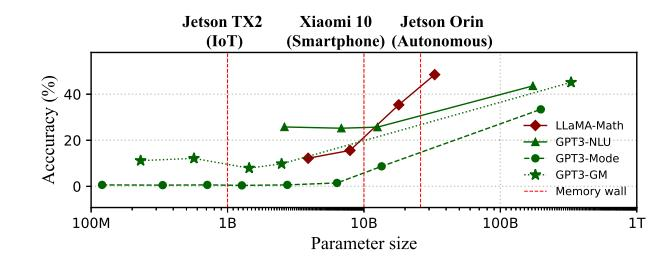

(b) Generation latency of LLMs across various devices.

Fig. 1. The memory wall hinders LLM's "scaling law" on mobile devices. \*-Math, \*-NLU, \*-Mode, and \*-GM denote LLMs' emergent abilities: math reasoning, multi-task comprehension, mode arithmetic, and learning meaningful representations. The red dashed line shows the maximum inference parameter size using only device memory, e.g., 10B for Xiaomi 10.

research in the machine learning community has demonstrated LLM's exceptional scaling ability: increasing the LLMs parameter size can consistently bring accuracy improvement and even emergent ability [6], [7]. This is confirmed by our experiment results on many variants for GPT3 (230M~175B) and LLaMA (7B~33B) models, in Fig. 1(a), elaborated in Section II-B.

Meanwhile, such generation tasks often heavily rely on users' private data, thereby necessitating on-device local inference [8], [9], [10], [11]. However, our preliminary experiments in Fig. 1(b) reveal that the scaling ability is challenged on mobile devices (details in Section II-B). Specifically, when LLMs are too large to be fit into device memory, state-of-the-art mobile DNN engines like MNN [12] and llama.cpp [13] need to repetitively load model weights from disk to memory. It results in 59–224× lengthened inference latency. Such *memory wall* severely hinders LLM's scaling ability. Users have to choose between real-time generation and emergent ability. For instance, 10B parameters represent the minimum size required for LLaMA to possess arithmetic reasoning capabilities, yet it also represents the maximum parameter size for achieving real-time inference on smartphones (e.g., Xiaomi 10).

1536-1233 © 2024 IEEE. All rights reserved, including rights for text and data mining, and training of artificial intelligence and similar technologies. Personal use is permitted, but republication/redistribution requires IEEE permission. See https://www.ieee.org/publications/rights/index.html for more information.

This work presents EdgeLLM, an efficient on-device LLM inference system for models whose sizes exceed the device's memory capacity (namely target LLM). Instead of focusing on reducing memory usage directly through methods such as LLM compression [14], [15], [16], [17] or context sparsity [18], [19], [20], which often entail unavoidable loss in accuracy, EdgeLLM is built atop *speculative decoding* [21], [22]. It delegates most tokens to a smaller, memory-resident LLM (namely draft LLM), which can often generate easy tokens correctly (e.g., determiners, pronouns, and punctuation marks) [21], [22], [23] under memory budget, breaking the memory wall at most of the time and preserve the scalability better; A larger (target) LLM acts as a verifier, leveraging its output as the ground truth to inspect and rectify any errors introduced to draft LLM (elaborated in Section II-C), ensuring no compromise in accuracy. Besides, EdgeLLM further reduces the invocations of target LLM by asking the draft LLM to generate a token tree (by accepting many possible tokens for each inference). As such, each accepted token generates a new token branch in the tree (details in Section III-A).

Despite these advantages, applying speculative decoding for on-device LLM introduces three distinctive challenges: (1) Token branch generation: Increasing token tree width can account for more candidate tokens that would be the correct results to reduce the draft LLM generation error probability, thus lowering the verification needs for target LLMs and reducing end-to-end inference time. However, this approach increases the draft LLM computational workload, leading to higher generation delays on resource-constrained mobile devices. EdgeLLM must balance accuracy with speed in draft LLM generation. (2) Verification timing: Guaranteeing the correctness of generated tokens through verification is essential but time-consuming (e.g., several seconds on Jetson TX2). Ideally, a verification only occurs when the draft LLM generates the first incorrect token: an early verification is a waste of time (since the verification outcome will be good), while a late verification also delays the generation of correct tokens. However, such an ideal design is not practically achievable since we only detect the incorrect token after verification. Thus, accurately "predicting" the draft LLM's accuracy to judiciously schedule verification remains a significant challenge for EdgeLLM. (3) I/O versus compute asymmetry: During verification, the draft LLM must hold its generation because the consequent generation relies on the verification outcome. This causes an I/O bottleneck and processor underutilization, as the layer-by-layer weight I/O is significantly slower than the inference of target LLM, rendering layer-level computation-load pipelining ineffective.

Our design. EdgeLLM designs three novel techniques:

(1) Compute-efficient branch generation and verification (Section III-B). EdgeLLM maximizes accepted tokens in draft LLMs on resource-constrained mobile devices by generating a width-adaptive token tree, using token and branch confidence, and branch length. A branch decoder is further proposed to efficiently generate multiple branches within width-adaptive token trees. Furthermore, EdgeLLM examines and rectifies all errors within a token tree in a batch manner, at the cost of a single iteration.

- (2) Self-adaptive fallback strategy (Section III-C) is devised to initiate the verification process promptly when the draft LLM generates an incorrect token. Notably, "fallback" is referred to as the timing that the draft LLM needs verification. It is inspired by two key insights: (1) The confidence of multiple candidate branches should be considered jointly to assess the token tree's accuracy, determining whether to trigger a fallback. (2) Historical data pertaining to the accuracy of verified tokens can be harnessed to assess the draft LLM's generation capability, adjusting the fallback threshold.
- (3) Provisional generation pipeline (Section III-D). EdgeLLM breaks the cross-token dependency and enhances parallelism by proposing provisional generation, i.e., continuing generating tokens through the draft LLM during the verification process. This is founded on the insight that sometimes the verification process may not detect errors, rendering the guess-generated tokens usable.

Implementation and evaluation: We have fully implemented EdgeLLM on top of two SOTA LLM engines: PyTorch [24] and llama.cpp [13]. The system was extensively evaluated across four platforms, two IoT devices (Jetson TX2 and Jetson Orin NX) and two smartphones (Xiaomi 10 and Xiaomi 11), with six widely utilized LLMs (GPT2 [25], T5 [26], mT5 [27], Bart [28], Vicuna, and LLaMa2 [6]) and seven datasets (CNN/Daily [29], Wikitext [30], iwlt2017 [31], wmt14/22 [32], SQuAD [33], parrot, and TruthfulQA [34]). We also compared EdgeLLM with six state-of-the-art competitive baselines [13], [21], [23], [24], [35], [36], encompassing two computing-loading pipeline frameworks and three speculative decoding frameworks. Our results unequivocally demonstrate EdgeLLM's superior performance. When compared to the state-of-the-art LLM engines, EdgeLLM can reduce average per-token generation time by  $2.9-9.3\times$  and  $3.5-4.7\times$  on IoT devices and smartphones, respectively, without comprising accuracy. For > 10B-sized LLMs like LLaMA2-13B that were previously unbearable on smartphones, EdgeLLM generates more than one token per second. Furthermore, compared with competitive baselines, EdgeLLM can achieve up to  $5.6 \times$  speedup and noticeable higher accuracy.

The major contributions of this work are as follows:

- We thoroughly explore the opportunities and challenges of executing LLMs on mobile devices.
- We propose EdgeLLM, the first-of-its-kind system to bring larger and more powerful LLMs to mobile devices built atop speculative decoding. It incorporates three novel techniques: compute-efficient branch navigation and verification, self-adaptive fallback strategy, and provisional generation pipeline. These advancements enable EdgeLLM to effectively mitigate the memory wall problem.
- We prototype EdgeLLM and evaluate it with representative LLMs and commodity mobile devices. The results demonstrate its superior performance over existing methods.

### II. BACKGROUND AND MOTIVATION

## A. Decoder-Based Generative LLMs

*On-device generative ML tasks*: Generative tasks involve creating new content like text sequences and images [37], [38], [39],

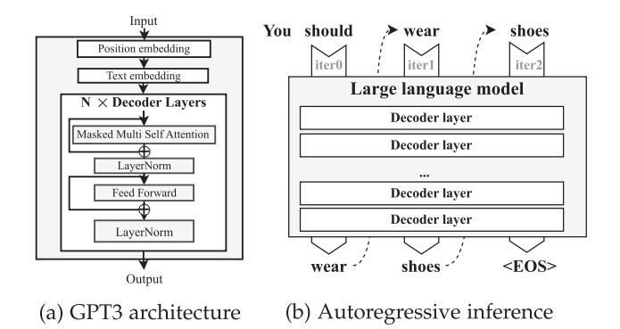

Fig. 2. The architecture of decoder-only language model (GPT3) and the overview of LLM inference pattern: autoregressive.

such as language modeling, machine translation, summarization, and question answering. These tasks focus on generating novel, meaningful, and coherent outputs and are more complex and impactful than traditional classification tasks [40]. Common on-device applications include Google Gboard [2], Siri [3], iTranslate [41], and Google Translate [1]. To ensure data privacy and service availability, these models are ideally deployed on devices for local inference. Decoder-based LLM architecture: Decoder-based large language model (LLM), including both decoder-only and encoder-decoder architectures, is the de-facto approach for generative tasks, such as GPT-3 [5], LLaMA [6], and PhoneLM [42]. As shown in Fig. 2(a), a typical decoderbased LLM consists of a text embedding, a position embedding, and many sequentially stacked decoder layers, where each decoder layer includes masked self-attention, LayerNorm, and Linear operations. For those encoder-decoder LLMs such as T5 [26] and mT5 [27], encoder layers are incorporated before the decoder to enhance semantic understanding capabilities.

Autoregressive inference: Generative LLMs employ an autoregressive inference procedure that generates one token at a time and takes that token as input to generate the next one. For instance, Fig. 2(b) illustrates a three-autoregressive-iteration inference procedure. In the 1st iteration, the model takes all existing tokens ("You should") as input and generates the output "wear." In the next iteration, the newly generated "wear" will be fed into the model, which then predicts "shoes." This process continues until the model generates the end-of-sequence token (< EOS >), indicating the end of the generation procedure. The nature of autoregressive inference introduces unique challenges for optimizing on-device LLM as will be described later.

## B. On-Device LLM is Memory-Bounded

In this section, we perform pilot experiments to reveal the performance issue of on-device LLM inference. We summarize our key findings below.

Scaling up parameter size brings accuracy improvement: Transformer-based LLM architecture is highly flexible and scalable by simply adjusting the encoder/decoder layers, sequence length, and other hyperparameters. Consequently, popular LLM is often developed with a series of model variants, such as T5-Small/Base/Large [26] and LLaMA-7B/13B/33B/65B [6]. Increasing parameter size enhances model abilities, as shown in

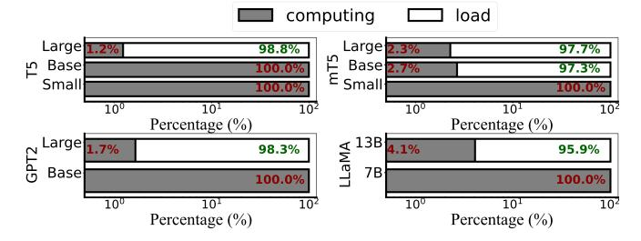

Fig. 3. Inference delay breakdown of different LLM variants in one autoregressive iteration. T5, mT5, and GPT2 are evaluated on Jetson Orin using PyTorch, while LLaMA is evaluated on Xiaomi 10 using llama.cpp. All of them use wikitext dataset [30].

Fig. 1(a). Our experiments with GPT3 (230 M to 175B parameters) on Big-Bench (mode arithmetic ability) [43], grounded conceptual mappingss [44], and MMLU datasets (massive multitask language understanding ability) [45], and with LLaMA (7B to 65B parameters) on GS8K datasets (math reasoning ability) [46] using PyTorch on NVIDIA A100 confirm this. Typically, over 10B parameters (e.g., LLaMA-13B) are needed for arithmetic reasoning, and over 30B parameters (e.g., GPT3-175B) for multi-task comprehension. This phenomenon is well known as *scaling law* [47], [48], [49], [50].

On-device LLM scalability hinders the memory wall: Our experiments on Jetson TX2 (4 GB memory), Xiaomi 10 (8 GB memory), and Jetson Orin (16 GB memory) using T5 and LLaMA models show a rapid decline in inference speed when memory consumption exceeds the budget, as shown in Fig. 1(b). Notably, the memory budget is defined as the total available memory after accounting for the operating system usage, which is 2.1 GB for Jetson TX2, 6.0 GB for Xiaomi 10, and 14.4 GB for Jetson Orin. IoT devices like Jetson TX2 without INT4/INT8 GPU support use FP16 for inference, limiting the parameter size to 1B. Smartphones and autonomous devices use INT4 quantization, allowing for 10B and 30B parameters, respectively. PyTorch-GPU is used for Jetson devices and llama.cpp-CPU for smartphones. Inference latency for Xiaomi 10 increases by  $116 \times$  with a 4.7 \times model size increase; for Jetson Orin, latency increases by  $337 \times$  when parameter size exceeds 30B.

To understand the factors influencing inference speed, we conducted a breakdown analysis, as shown in Fig. 3. T5, mT5, and GPT2 models were evaluated on Jetson Orin using PyTorch, while LLaMA was evaluated on Xiaomi 10 using llama.cpp, all using the wikitext dataset [30]. It clearly shows that when the model inference demands a memory size unaffordable on edge devices, loading parameters from disk to memory (i.e., disk I/O) soon becomes the bottleneck of the inference time (95.9–98.8%). This situation attributes to the fact that the state-of-the-art device-side LLM engines, such as MNN [12] and llama.cpp [13], resort to the *swapping* technique which dynamically releases the inferred weights memory and loads weights to be inferred from the disk when memory constraints are exceeded.

The autoregressive nature makes traditional memory optimizations barely effective for generative LLM: Memory optimization for model inference has been extensively researched [36], [51], [52], [53], with methods like batching [51], compute-I/O pipeline [36], and smart swapping [52], [53].

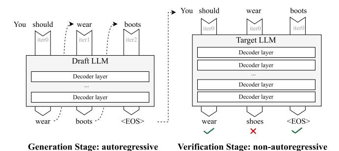

Fig. 4. The typical workflow of speculative decoding.

However, these methods are less effective for on-device LLMs because: (1) Autoregressive inference requires sequential token generation, preventing parallelization/batching. (2) I/O time is significantly larger than computing time, limiting the benefits of overlapping. Algorithmic approaches like quantization [\[14\],](#page-15-0) [\[54\],](#page-16-0) [\[55\],](#page-16-0) [\[56\]](#page-16-0) can reduce memory usage (e.g., FP16 to INT4/INT8 [\[14\]\)](#page-15-0), but low-bit precision (4/8 bits) is insufficient to maintain model capability [\[14\],](#page-15-0)[\[55\],\[57\].](#page-16-0) This work proposes a system-level approach compatible with quantization.

# *C. Speculative Decoding*

This work focuses on speculative decoding, which involves two distinct-sized models [\[21\],](#page-15-0) [\[22\],](#page-15-0) [\[35\].](#page-15-0) In this approach, the smaller (draft) LLM functions as a token generator, while the larger (target) LLM acts as a verifier, using its output as the ground truth to inspect and rectify any errors introduced during the token generation process. The typical workflow of speculative decoding is illustrated in Fig. 4. Unlike the conventional autoregressive decoding (Fig. [2\(b\)\)](#page-2-0), where the target LLM independently generates tokens sequentially, the speculative decoding offloads the generation workloads to the draft LLM. The target LLM then focuses solely on verifying the output of the draft LLM. Specifically, the target LLM utilizes the whole text generated by the draft LLM as input, i.e., "You should wear boots" in the example. After one inference, the target LLM can obtain all the outputs (the next token) for each token in the text simultaneously, e.g., "wear" for "You should", and "shoes" for "wear". EdgeLLM utilizes the target LLM outputs as the ground truth to verify and correct the draft LLM wrong outputs. For example, the "boot" generated by the draft LLM is wrong and should be corrected to "shoes" based on the target LLM outputs. Such a procedure is called "non-autoregressive verification".

Speculative decoding is based on two key rationales:

• *Draft LLMs can exhibit close performance to the large one, especially for the easier data points [\[58\],](#page-16-0) [\[59\]:](#page-16-0)* To clarify our findings, we define the correctness of a draft LLM as the instance where it generates the same token as the target LLM. Our empirical experiments on PyTorch using four datasets have confirmed such an assumption, as shown in Table I. In our experiments, all incorrect tokens generated by the draft LLMs are identified. Incorrect tokens generated by the draft LLMs are corrected and re-fed into the system to enhance its performance. The accuracy is quantified based on the proportion of tokens the draft

TABLE I THE PROBABILITY OF CORRECT TOKENS DRAFT LLM CAN GENERATE WITH THE TARGET LLM VERIFICATION

| Dataset         | Task        | Draft LLM  | Target LLM | Correctness |
|-----------------|-------------|------------|------------|-------------|
| IWSLT2017 de-en | Translation | mT5-Small  | mT5-Large  | 81.6%       |
| CNN/Daily       | Summary     | - LLaMA-2- | LLaMA-2-   | 90.7%       |
| Squad           | · OA        | Chat-7B    | Chat-13B   | 89.9%       |
| Truthful_QA     | QA          | Chat-7D    | Chat-13D   | 87.1%       |

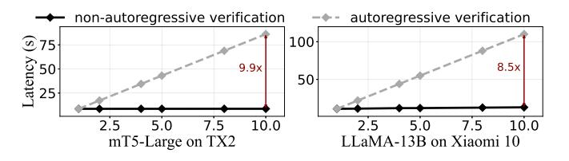

Fig. 5. The latency of verification with input sequence increasing. *Y* -axis: latency; *X*-axis: the length of input sequence.

LLM could generate correctly with input adjustments based on the target LLM's output. Our findings indicate that mT5-Small correctly generates more than 80% tokens as mT5-Large does in the IWSLT2017 de-en translation dataset [\[31\].](#page-15-0) Moreover, for LLaMA-2 LLMs, the draft LLM exhibits an impressive 90.7% accuracy rate in generating tokens comparable to those of the target LLM.

• *The verification stage is non-autoregressive, allowing the target LLM to examine token sequences in parallel by visiting its parameters only once, resulting in enhanced computational efficiency and improved processor utilization, leading to significant performance gains [\[21\],](#page-15-0) [\[22\].](#page-15-0)* Such a non-autoregressive verification (NAV) procedure can increase the computing-memory ratio and improve processor utilization, with multiple times performance enhancements. Our pilot experiments in Fig. 5 on LLaMA-13B and mT5-Large models using Xiaomi10 and TX2 show that NAV significantly reduces verification time for mT5-Large and LLaMA-13B models by 8.5–9.9× at 10 tokens, attributed to NAV's single weight swapping versus AV's multiple swappings per token, reducing I/O overhead. Thus, speculative decoding can amplify end-to-end generation speed without compromising accuracy.

Despite these advantages, applying speculative decoding for on-device LLM still encounters inefficient issues. Preliminary experiments on Jetson TX2 and Xiaomi 10 using mT5 and LLaMA2 models show that per-token generation takes an average of 1.8 seconds and 6.1 seconds, respectively, even with speculative decoding.

# III. DESIGN

## *A. Overview*

EdgeLLM is built on two LLMs: a target LLM that is accurate but heavy (cannot fit to device memory) like LLaMA-13B; and a draft LLM that is less accurate but lightweight like mT5-small. The design goal of EdgeLLM is to generate texts with the speed of the draft LLM *without compromising the accuracy* of the target LLM.

Fig. 6. The workflow of EdgeLLM.

Workflow Fig. 6 illustrates the workflow of EdgeLLM. Essentially, EdgeLLM is a generation and verification framework using the draft LLM as a generator, and the target LLM as a verifier.

- Generation stage: EdgeLLM feeds the input text to the draft LLM and generates an width-adaptive token tree (Section III-B). After each iteration generation, EdgeLLM determines whether the target LLM is involved in performing the verification based on the tree-cumulative confidence (details in Section III-C).
- Verification stage: EdgeLLM verifies a token tree within one-shot inference with the target LLM by branch verification (Section III-B). Meanwhile, to exploit the underutilized hardware resources, EdgeLLM further proposes provisional generation (Section III-D), which continues generating tokens through the draft model during the verification process. Once an error is detected, EdgeLLM will roll back the token tree and rectify it; Otherwise, EdgeLLM can directly use the results by provisional generation and continue normal token tree generation.

EdgeLLM repeats the above generation and verification process until it encounters "< EOS >", the end token.

*Key techniques & benefits:* Fig. 7 provides an illustrative example to exemplify the key techniques and their benefits.

- Compute-efficient branch navigation and verification generates a width-adaptive token tree, which has varied width and depth, as shown in Fig. 7(1). It is based on the key insight that if a branch exhibits a high probability, it should be explored more by extending its length. Compared with the conventional token tree, where the width is fixed, and all branches have the same depth, this can save computing resources and reduce generation latency. Besides, the token tree can be verified within one-shot inference with the target LLM, as shown in Fig. 7(2), reducing verification delay.
- Self-adaptive fallback strategy determines verification timing by (1) jointly considering the confidence of multiple branches within the token tree and (2) dynamically adjusting the fallback threshold based on the historical verified token accuracy.
- Provisional generation pipeline breaks the cross-token dependency and continues generating tokens using the draft

model during the verification process, as shown in Fig. 7③. This approach can save token tree generation time, based on the insight that sometimes the verification detects no error, so the speculatively generated tokens could be used afterward.

#### B. Compute-Efficient Branch Navigation and Verification

This subsection is mainly to discuss how the branches are generated and verified in EdgeLLM.

Slow token tree generation on devices: Fig. 9(a) gives results on token tree generation latency on mobile devices and cloud GPUs using the LLaMA model. The device platform is Jetson Orin, while the cloud GPU is NVIDIA A100. Although we use batching to optimize the multiple-branch generation, the delay for token tree generation on Jetson Orin increased by  $9.1 \times$  from width=1 to width=10. However, such generation latency with width=10 on cloud GPUs like NVIDIA A100 was only  $1.3 \times$ . This situation arises because mobile devices have limited computing capacity, and generating one branch token results in full utilization of all processors. Thus, even if batching is used, multiple-branch generation still offers significant delay and provides a negligible performance speedup compared with a multiple-iteration single-branch generation  $(1.1 \times)$ .

Compute-efficient branch navigation: To tackle this challenge, EdgeLLM generates a more resource-efficient token tree, width-adaptive token tree, which has varied width and depth, as shown in Fig. 7①. EdgeLLM generates the width-adaptive token tree using a single-branch generation approach since the number of generated branches varies in different iterations, making it impossible to use batching to accelerate multiple-branch generation. To achieve this and generate useful branches, EdgeLLM needs to answer two crucial questions:

- Branches compete for computing resources (e.g., GPU) to generate subsequent tokens by running the draft LLM. At a certain timestamp, which branch shall receive computing resources to lengthen its token sequence? The decision is crucial as generating tokens to the wrong branch (as verified by the target LLM later) wastes computing resources and delays the generation of true tokens.
- Generating tokens from different branches requires switching between branch contexts. How to generate tokens from different branches efficiently? The design is crucial as EdgeLLM needs to frequently switch between up to tens of branches.

In response, EdgeLLM incorporates two novel techniques:

ullet Confidence-based branch pacer: To properly pace the progress of different branches, EdgeLLM relies on the fact that a branch with a higher probability is more likely to be the correct result and should have a longer sequence length. This means that the i-th branch length  $L_i$  should be proportional to its probability  $C_i$ , which can be formulated as:

$$L_i = C_i * M \tag{1}$$

where M represents the total number of tokens in the tree. Here, EdgeLLM models the probability with the cumulative

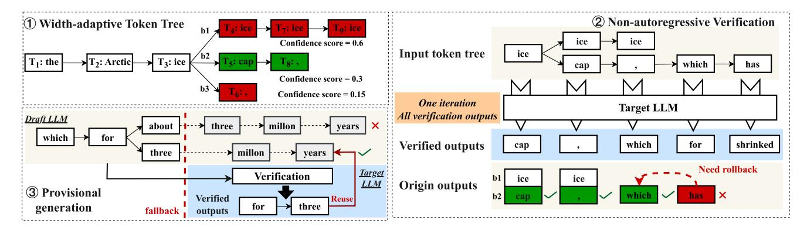

Fig. 7. An illustrative example of EdgeLLM. The ground truth is "the Arctic ice cap, which for about".

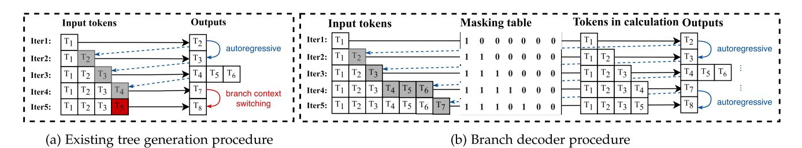

Fig. 8. Examples of tree generation procedure in state-of-the-art LLM engines and the branch decoder procedure of EdgeLLM based on the case of Fig. 7().

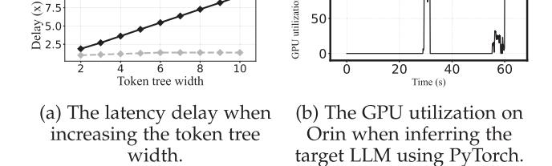

Fig. 9. Measurement results of LLaMA models on Jetson Orin.

**NVIDIA A100** 

confidence scores given by the draft LLM for each token generated. EdgeLLM's goal is to generate a token tree satisfying (1) (referred to as a "confidence-optimized" token tree).

To achieve this goal, EdgeLLM first defines D as the distance of a token tree to the confidence-optimized token tree to assess a token tree quality, formulated as:

$$D = \max_{0 \le i \le N-1} M * C_i - T_i^B \tag{2}$$

where N is the number of branches and  $T_i^B$  is i-th branch current length. Specifically,  $M*C_i$  is the expected length for i-th branch based on (1), and  $M*C_i-T_i^B$  indicates how many tokens are short of the expected length. D is the maximum value short of the expected length among all the branches. If a token tree has a larger D, it indicates a greater deviation from the confidence-optimized token tree. EdgeLLM's pacer consistently selects the branch that generates a new token to minimize D,

aiming to closely approximate the confidence-optimized token tree

• Branch decoder: We commence our study by conducting an exhaustive analysis of the fundamental reasons behind the substantial performance overhead incurred by branch context switching. Fig. 8(a) provides an illustration of the implementation of branch context switching within state-of-the-art LLM engines, such as PyTorch, using the scenario depicted in Fig. 7(1) as a case study.

In this illustration, iterations 1–4 take the previous output token as the new input, following the regular autoregressive inference pattern. However, generating token "8" in iteration 5 necessitates a branch switch from b1 to b2 (in Fig. 7(1)). Stateof-the-art LLM engines must deviate from the autoregressive rule and modify the iteration 5 input as token 5, which is the output of iteration 3; Autoregressive manner requires token 7 should be the input in iteration 5. To achieve this branch context switching, state-of-the-art LLM engines need to involve the following steps: (1) Remove token  $T_4$  from the input sequence. (2) Store branch b1's metadata, including token  $T_4$ 's Key-Value cache [51], [57], [60] and position ids [4], for potential future use, such as switching back to branch b1. (3) Remove branch b1's metadata. (4) Load branch b2's metadata. This step is typically necessary; however, it is not required in iteration 5, as b2 is a new branch without existing metadata in this iteration. (5) Utilize the sub-optimal output  $T_5$  from iteration 3 as the input for iteration 5. The above procedure needs lots of maintaining operations and CPU-GPU interactions. Our preliminary experiments on Jetson TX2 using the mT5-Small model demonstrate that the branch

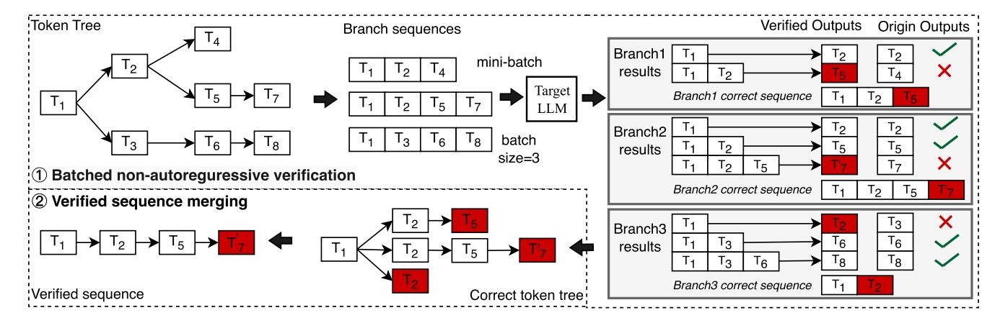

Fig. 10. The illustration of branch verification.

context switching incurs a 25% performance overhead on token generation.

To mitigate this overhead, EdgeLLM incorporates *masking* technique [4]. This technique is employed to ensure that the predictions for position i depend only on the known outputs at positions less than i in decoder-based LLMs. The masking technique relies on a masking table (an example in Fig. 8(b)).  $Masking_{i,j}$  represents whether the j-th token will taken into account for calculation in the i-th iteration. Specifically, one indicates participation in the computation, while zero indicates non-participation.

Using the masking technique, the branch decoder retains the autoregressive procedure without branch context switching, except for modifying its masking table to support the isolation of effects from different branches, as demonstrated in Fig. 8(b). This approach significantly reduces the performance overhead associated with branch context switching. In each iteration, EdgeLLM treats newly generated tokens as input, just as in regular generations. The only additional step required is for the branch decoder to assign a value of one to the previous positions on the same branch within the masking table. This procedure involves only an element-wise multiplication of the activation and masking table, resulting in negligible overhead.

To clearly illustrate this procedure, we use token  $T_8$  generation as an example, as shown in Fig. 8(b). When generating token "8" for branch b2 in iteration 5, the input remains  $T_7$ , the output of iteration 4. However, only positions "1, 2, 3, and 5" in the masking table are set to one, while all other positions are set to zero, ensuring that tokens "4", "6", and "7" are excluded from the calculation. This enables EdgeLLM to generate token "8" without other branches' influence. Throughout this process, no branch context switching is required. Branch verification and rectification EdgeLLM integrates non-autoregressive verification (NAV) and expands its capabilities to accommodate multi-branch verification, as shown in Fig. 10. Our fundamental observation lies in the distinction from the draft LLM generation processes, wherein the entire processors are consistently engaged. In contrast, during verification, over 95% of the time is spent on parameter loading. This presents an avenue for batch multi-branch verification and enables the overlapping

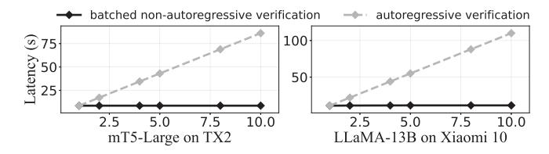

Fig. 11. The latency of batched non-autoregressive-verification with different batch sizes. Y-axis: latency; X-axis: batch size.

of verification computations with parameter loading. Our pilot experiments in Fig. 11 on LLaMA-13B and mT5-Large models using Xiaomi 10 and TX2 have confirmed this claim and show that batched multi-branch verification does not increase the verification time. This approach includes two crucial steps:

- Batched non-autoregressive verification: As shown in Fig. 10(1), to support multi-branch verification, EdgeLLM first divides the token tree into several branch sequences and combines them to a mini-batch as the input of the target LLM. Notably, the batched non-autoregressive verification computing can be overlapped with parameter loading to improve efficiency. After non-autoregressive verification, EdgeLLM can obtain the correct results of every position in each branch sequence. Compared with the origin branch sequences, EdgeLLM can detect all errors of a token tree, e.g.,  $T_7'$  in branch2 results. A correct sequence of a branch is the sub-sequence leading up to the first error position, plus the rectified token, to avoid error propagation. For example, correct sequence of branch1 ends at  $T_2$ , plus  $T_5$ , i.e., tokens "1, 2 and 5". To be noted, given that the NAV is I/O-bounded, increasing batch size (e.g., <10) has a negligible effect on verification time as the latency is hidden in loading parameters. Typically, our evaluation on SQuAD using mt5-large and LLaMA2-13B shows that the verification process is triggered after the draft LLM generates an average of 12-15 tokens.
- Verified sequences merging: Utilizing the correct verified sequences, EdgeLLM constructs a correct token tree, as shown in Fig. 10(2). Its leaf node within this tree represents either the rectified token or the last correct token from the

original branch sequence. EdgeLLM consolidates nodes sharing identical tokens into a single node, thereby generating the accurate *verified sequence*.

If the verified sequence has a rectified token, e.g.,  $T_7'$ , EdgeLLM will roll back the token tree to the error position, fix the error, and use it as the new input for future generations.

### C. Self-Adaptive Fallback Strategy

Large disparity in speed between generation (draft) and verification (target) LLMs: Different from cloud GPUs, where two LLMs can be hosted simultaneously, the target LLM utilized cannot be held on the device. To that end, the performance gap between the draft LLM and the target LLM is significantly larger on mobile devices compared to cloud GPUs, resulting in hundreds of times difference. This discrepancy in performance, as demonstrated in Fig. 1(a), underscores the need for an optimized verification timing strategy to minimize unnecessary verification steps.

To tackle this issue, this strategy is devised to initiate the verification process promptly when the draft LLM generates an incorrect token. In the context of EdgeLLM, generating an incorrect token implies that all candidate branches within the token tree contain generation errors. Notably, the timing that the draft LLM needs verification is referred to as "fallback". To achieve this goal, EdgeLLM needs to answer two crucial questions:

- Selection of Decision Metric: The decision metric should effectively evaluate the probability of errors within the token tree.
- Threshold Values for Different Tasks: Recognizing that
  a universal threshold may not be suitable for all tasks,
  EdgeLLM must establish appropriate threshold values tailored to specific tasks.

To tackle these issues, EdgeLLM introduces two innovative techniques:

• Tree-cumulative confidence  $(T_c)$ . We propose tree-cumulative confidence as the decision variable for initiating fallback. Unlike prior studies [21], [35] that rely on a single token confidence or token sequence length,  $T_c$  provides a comprehensive assessment of the global uncertainty. It captures errors more accurately due to the autoregressive nature of token generation.

The formulation tree-cumulative confidence is as  $T_c = \max_{i=1}^N C_i$ , where N represents the number of branches in a token tree, and  $C_i$  denotes the cumulative confidence of the i-th branch. We select the maximum cumulative confidence over minimum/average confidence. This decision is based on the premise that the most confident branch is more likely to yield the correct result after verification. Consequently, if the most confident branch proves to be incorrect, it is also more probable that the other candidate branches are incorrect. Therefore, maximum cumulative confidence can effectively reflect the accuracy of the entire token tree rather than just its own.

ullet Self-adaptive threshold (lpha) is utilized to determine when the target LLM shall verify. It signifies the minimum cumulative confidence that EdgeLLM permits for the draft LLM to sustain its generation process. Upon  $T_c$  descent below this threshold,

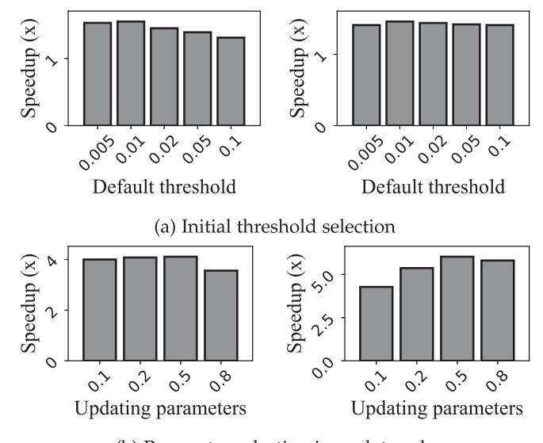

(b) Parameter selection in update rule

Fig. 12. Comparison of different initial thresholds and updating parameters (0.5 in (3)) in self-adaptive fallback strategy. The Left is evaluated on the mt5 model using IWSLT2017-de-e datasets, while the right is using SQuAD\_v2 datasets. Y-axis: EdgeLLM's speedup; X-axis: different initial thresholds or different updating parameters.

EdgeLLM invokes the target LLM to rectify the generated text. Consequently, a higher  $\alpha$  correlates with the increased target LLM invocation times.

EdgeLLM operates on the principle that the draft LLM, which generates outputs closely resembling those of the target LLM, should be trusted more. Thus, it should have a lower verification frequency by setting a lower threshold. To assess the output similarity, EdgeLLM relies on historical data regarding the accuracy of verified tokens.

Users can either select an initial  $\alpha$  value or utilize the default value (0.01) empirically selected by the system. Our preliminary experiments on the Jetson TX2, utilizing the mt5 model with IWSLT2017-de-en and SQuAD\_v2 datasets (as shown in Fig. 12(a)), demonstrate that an initial  $\alpha$  value of 0.01 performs better than other values, though the benefits are marginal. The choice of 0.01 is advantageous as it enables the draft LLM to generate a relatively long token tree, thereby reducing verification times. Additionally, EdgeLLM dynamically adjusts the threshold based on historical verification accuracy data, making the initial threshold less critical to EdgeLLM's overall performance. After verification, EdgeLLM updates the *self-adaptive threshold* ( $\alpha$ ) using the following rule:

$$\alpha_{i+1} = \begin{cases} \alpha_i * 0.5 & if \ N_{correct} == N_{all} \\ \frac{N_{all} - N_{correct}}{N_{all}} & if \ N_{correct} < N_{all} \end{cases}$$
(3)

where  $N_{correct}$  and  $N_{all}$  are the number of correct tokens and total tokens in the most matching branch during one verification. Notably, EdgeLLM uses  $N_{correct}$  and  $N_{all}$  (accuracy data from the most matching branch) rather than averaging the accuracy data across all branches to represent the token tree's accuracy for updating  $\alpha$ . This approach is chosen because other branches

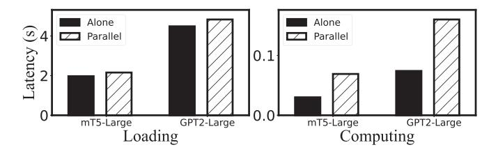

Fig. 13. The loading and computing time of the target LLM execution with the draft LLM parallelization.

typically generate more erroneous tokens compared to the most matching branch. Including these other branches would introduce additional noise into the updates of α.

Specifically, when the verification process detects no error, EdgeLLM lowers α by multiplying the current value by 0.5 based on our empirical observations on the Jetson TX2 using the mt5 model with IWSLT2017-de-en and SQuAD\_v2, as shown in Fig. [12\(b\).](#page-7-0) Typically, choosing 0.5 can achieve an up to 1.4x speedup. An updating parameter below 0.5 allows the draft LLM to generate too many tokens, resulting in excessive verification delays and numerous non-accepted tokens. Conversely, an updating parameter above 0.5 restricts token generation too much, limiting the draft LLM's effectiveness and failing to reduce verification time. In contrast, if verification identifies errors, the threshold is increased by dividing α by the average cumulative confidence of all tokens subsequent to the incorrectly generated one. The rationale behind the use of an exponential function is that the *tree-cumulative confidence* is the product of every token's confidence, accumulating exponentially.

In summary, after each token generation by the draft LLM, EdgeLLM computes the cumulative confidence of the entire token tree T*c*. If T*c* falls below α, a fallback is initiated, and the target model begins the batch verification of the token tree (details in Section [III-B\)](#page-4-0). After batch verification, the most matching branch is identified, and α is updated based on the historical generation accuracy of this branch.

## *D. Provisional Generation Pipeline*

*Substantial processor idleness during verification:* During the verification process by the target LLM, existing LLM engines resort to dynamic loading and weight inference techniques, leading to cyclical GPU utilization (Fig. [9\(b\)\)](#page-5-0) and significant idle periods, with over 95% of the verification time spent on parameter loading (Fig. [3\)](#page-2-0).

*Provisional generation:* To harvest the free cycles, EdgeLLM proposes *provisional generation* technique by allowing the draft LLM to continue generating tokens during the verification process. This approach is based on the insight that sometimes the verification detects no error, so the speculatively generated tokens could be used afterward.

*The impacts of provisional generation on target LLM:* Our preliminary experiments in Fig. 13 on TX2 using mT5-Large and GPT2-Large models show that paralleling the draft and the target LLM execution increases the target LLM computing and loading time by 2.2–2.3× and 1.05–1.09×, respectively. The

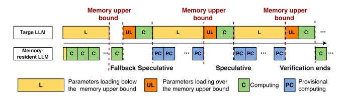

Fig. 14. EdgeLLM's provisional generation.

computing delay is attributed to the GPU cores contention, while the loading delay is because of the memory contention, which is unexpected since draft LLM generation is a compute-bound workload, paralleled well with target LLM parameters loading, a memory-bound workload, with no performance overhead. Diving into the reason, the draft LLM continually allocates memory regions for speculatively generated tokens, while the target LLM dynamically allocates memory regions for loading parameters. Typically, negligible effects are exerted on each other unless the memory usage is over 90%. However, it is common for memory usage to exceed 90% or even reach 95% in the provisional generation scenario, attributed to the fact that existing state-of-the-art LLM engines are designed for loading as many parameters as possible from disk to memory to reduce inference time.

*Computing-loading pipeline:* To tackle the above issues, EdgeLLM delicately plans the parallel execution, as shown in Fig. 14. The main principle is that normal verification process cannot be influenced by the provisional execution. Thus, there is a memory upper bound by profiling or user defining to avoid two LLMs memory contention, and the two LLMs computing cannot be executed in parallel.

After feeding the input sequence, the parameters of both the draft and the target LLMs are loaded to the memory. Once the draft LLM loading finishes, it begins to generate tokens, and the target LLM parameters loading (in yellow) will stop before the memory upper bound is exceeded to avoid influencing normal draft LLM generation. When the fallback condition is met, the rest of the parameters for the target model (in orange) will be loaded into the memory, and then the computing of the target LLM begins. The provisional execution (in blue) will not run unless the verification process is loading parameters below the memory budget (in yellow), avoiding processors and memory contention.

## IV. EVALUATION

## *A. Implementation and Setups*

We have fully implemented EdgeLLM with 4.5 k SLoC (3.5 K in Python and 1 K in C++). The prototype is a standalone framework supporting LLMs exported from TensorFlow [\[61\]](#page-16-0) and PyTorch [\[24\].](#page-15-0) EdgeLLM leverages llama.cpp [\[13\]](#page-15-0) (one of the most lightweight on-device LLM engines) as the smartphone backend and PyTorch [\[24\]](#page-15-0) as the IoT device backend. The reason for using different platforms for different devices is that PyTorch cannot run on smartphones and llama.cpp cannot run on IoT devices like the Jetson TX2.

TABLE II PLATFORMS USED IN THE EXPERIMENTS

| Platform   | Processor                             | Software     | Mem. |  |
|------------|---------------------------------------|--------------|------|--|
| Jetson TX2 | 4x Cortex-A57                         | Torch-1.10   | 8G   |  |
| Jetson 172 | Maxwell 128 CUDA cores                | Ubuntu 18.04 | 86   |  |
| Jetson     | Ampere 1024 CUDA cores                | Torch-2.0    | 8G   |  |
| Orin NX    | + 32 Tensor Cores                     | Ubuntu 18.04 | 90   |  |
| Xiaomi 10  | 1x 2.84GHz A77+3x 2.4GHz Cortex A77   | Android 10   | 8G   |  |
| Alaonii 10 | +4x 1.8GHz Cortex A55                 | llama.cpp    | 86   |  |
| Xiaomi     | 1x 3.0 GHz X2+ 3x 2.5 GHz Cortex A710 | Android 10   | 8G   |  |
| 11         | + 1.8GHz 4x Cortex-A510               | llama.cpp    | 86   |  |

TABLE III TASKS, MODELS, DATASETS, AND THEIR CORRESPONDING TESTED DEVICES USED IN THE EXPERIMENTS

| Devices       | Tasks   | Draft LLMs                | Target LLMs             | Speed Gap | Datasets                              |
|---------------|---------|---------------------------|----------------------------|--------------|---------------------------------------|
| T             | Т       | mT5-small (0.3B)          | mT5-Large (1.2B)           | 230x         | IWLST17-de-en [31]                    |
| Jetson TX2    | -       | Bart-base                 | Bart-Large                 |              | WMT14-de-en [32]                      |
|               | QA      | mT5-small (0.3B)          | mT5-Large (1.2B)           | 230x         | SQuAD_v2 [33]                         |
| Jetson        | -       | T5-small (0.06B)          | T5-large (0.73B)           | 263x         | SQuAD_v2                              |
| Orin NX       | LM      | GPT2 (0.14B)              | GPT2-Large (0.8)           | 214x         | Wikitext [30]                         |
|               | S       | T5-small (0.06B)          | T5-large (0.73B)           | 263x         | CNN/Daily [29]                        |
| Xiaomi 10     | Т       | Vicuna-7B (INT4)       | Vicuna-13B (INT4)       | 59x          | Parrot WMT22-de-en WMT22-zh-en  |
| Xiaomi Pro | QA S | LLaMA2-Chat- 7B (INT4) | LLaMa2-Chat- 13B (INT4) | 59x          | SQuAD TruthfulQA [34] CNN/Daily |

*Hardware setup:* We test the performance of EdgeLLM on four devices: 2 smartphones (Xiaomi 10 and Xiaomi 12) and 2 IoT devices (Jetson TX2, and Jetson Orin), as summarized in Table II. We run LLMs on Jetson GPUs (under 2 GB memory budget) and smartphone CPUs (whole 8 GB memory), since the existing LLM engines [\[13\],](#page-15-0) [\[24\],](#page-15-0) [\[62\]](#page-16-0) have unmatured support for smartphone GPU/NPU. Nevertheless, EdgeLLM's design is orthogonal to hardware types. This is because the hardware merely serves as the platform for running the draft LLM and the target LLM for EdgeLLM. EdgeLLM does not modify hardware architecture or rely on any hardware-specific features to provide performance benefits.

*Models and datasets:* We test with a range of typical LLM models with various generative task datasets across different devices, as summarized in Table III. On the IoT devices, we evaluateEdgeLLM on two translation tasks, two question-answering tasks, one language modeling task, and one summarization task with mT5, T5, GPT2, and Bart models. All the models are finetuned by ourselves as [\[35\]](#page-15-0) does. For smartphone devices, we use Vicuna-1.5 and LLaMA2 models with three translation tasks, one question-answering task, and one summarization. All the models are downloaded from the hugging face repository [\[63\]](#page-16-0) and have been quantized by AutoGPTQ [\[15\]](#page-15-0)into the 4-bit format for saving memory and improving inference speed.

*Baselines:* We mainly compare EdgeLLM with 6 state-of-theart baselines which can be divided into two categories:

• 4 *Single-LLM baselines.* (1) Standard (Std) always utilizes the target LLM to generate outputs, with PyTorch for IoT and llama.cpp for smartphones. (2) Draft always utilizes the draft LLM to generate outputs without any verification, same settings as Std. (3) Standard pipeline (SPL): It executes a layer-wise pipeline, overlapping I/O and computation, as used by existing SOTA LLM inference engines. (4) Speedy Transformer Inference (STI) [\[36\]](#page-15-0): An edge NLP

TABLE IV SUMMARY OF THE GENERATION ACCURACY OF EdgeLLM AND THE BASELINE ON TESTED DEVICES

| Models                | Datasets         | Draft | SPL | STI  | SP  | BLD  | SI  | Ours |
|-----------------------|------------------|-------|-----|------|-----|------|-----|------|
| mT5-Large             | T: IWLST17-de-en | 82.5  | 100 | 92.1 | 100 | 96.1 | 100 | 100  |
|                       | QA: SQuAD        | 18.9  | 100 | 81.4 | 100 | 52.9 | 100 | 100  |
| TE Large              | S: CNN/Daily     | 5.4   | 100 | 76.5 | 100 | 5.5  | 100 | 100  |
| T5-Large              | QA: SQuAD        | 42.5  | 100 | 86.2 | 100 | 51.4 | 100 | 100  |
| Bart-Large            | T: WMT14-de-en   | 79.4  | 100 | 93.7 | 100 | 96.5 | 100 | 100  |
| GPT2-Large            | LM: Wikitext     | 6.2   | 100 | 83.9 | 100 | 12.9 | 100 | 100  |
| Vicuna-13B (INT4)  | T: Parrot        | 33.1  | 100 | 86.7 | 100 | 89.7 | 100 | 100  |
|                       | T: WMT22-de-en   | 10.5  | 100 | 87.2 | 100 | 90.2 | 100 | 100  |
|                       | T: WMT22-zh-en   | 8.1   | 100 | 88.1 | 100 | 80.4 | 100 | 100  |
| LLaMA2-Chat (INT4) | S: CNN/Daily     | 5.0   | 100 | 81.0 | 100 | 7.96 | 100 | 100  |
|                       | QA: SQuAD        | 5.5   | 100 | 83.2 | 100 | 3.4  | 100 | 100  |
|                       | QA: Truthful_QA  | 5.1   | 100 | 85.4 | 100 | 4.7  | 100 | 100  |

inference framework with quantization parameter shards and fine-grained computing-loading pipeline.

• 3 *Speculative decoding baselines.* (1) Speculative Decoding (SP) [\[35\]:](#page-15-0) The original speculative decoding method. (2) Big Little Transformer Decoder (BLD) [\[35\]:](#page-15-0) An algorithm of determining verification timing and rollback mechanism for speculative decoding. (3)SpecInfer (SI) [\[23\]:](#page-15-0) Enhancing SP by combining various boost-tuned small language models to jointly generate the draft outputs.

*Metrics and configurations:* We mainly report generation accuracy and the per-token generation time. For clarity, EdgeLLM's goal is to align the draft LLM outputs to the target LLM. Thus, we regard the text produced by the target LLM as the ground truth, and *the accuracy in this paper is not the accuracy for the dataset labels but defined as the similarity between the generated text by different baselines and the target LLM generation outputs using the Rouge-L score.*

# *B. Generation Accuracy*

We first comprehensively investigate the generation accuracy of EdgeLLM with various well-known and challenging datasets, spanning a range of tasks, including translation (IWLST17-deen, WMT14-de-en, WMT22-de-en, WMT22-zh-en), summarization (CNN/Daily), question answering (SQuAD v2, TruthfulQA). The generation accuracy (detailed accuracy definition in metrics) results are illustrated in Table IV. Our key observation is that EdgeLLM*does not comprise accuracy across all datasets.*

Compared to Draft, EdgeLLM achieves an accuracy improvement ranging from 17.5% to 94.6%. This significant enhancement is due to the verification by the target LLM, which prevents the draft LLM from generating incorrect tokens that can propagate errors throughout the entire sentence, thereby markedly decreasing accuracy. EdgeLLM can achieve a 6.3%– 23.5%, 3.5–95.0% accuracy improvement compared to the STI and BLD baselines on IoT devices, respectively. Such numbers for smartphones are 13.3%–19.0%, 96.6%–9.8%, respectively. The reason behind the accuracy improvement is that EdgeLLM utilizes the target LLM as a verifier to rectify the wrong draft LLM outputs to the target LLM; however, both STI and BLD improve generation speed by sacrificing generation accuracy

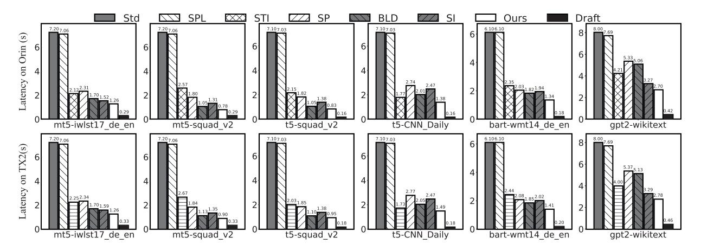

Fig. 15. Average per-token generation latency of EdgeLLM and baselines under different tasks on IoT devices. Y-axis: average per-token generation latency; X-axis: model-dataset.

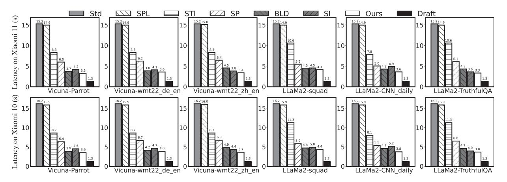

Fig. 16. Average per-token inference latency of EdgeLLM and baselines under different tasks on smartphones. Y-axis: average per-token generation latency; X-axis: model-dataset.

using dynamic quantization or reducing the wrong generation rectification. Besides, EdgeLLM achieves the same accuracy as SPL, the standard target LLM generation approach. This situation arises because EdgeLLM asks the target LLM to rectify all errors generated by the draft LLM, same as SP and SI.

#### C. Generation Speed

Overall performance: We first comprehensively investigate the generation performance of EdgeLLM on four tested devices. The generation accuracy and per-token generation time results are illustrated in Table IV, Figs. 15 and 16, respectively. Our key observation is that EdgeLLMconsistently and remarkably outperforms other baselines on per-token generation time without comprising accuracy across all tested devices.

• Generation time of EdgeLLM versus Single-LLM baselines. Compared with Std, EdgeLLM achieves a 2.9-9.3× and 3.47–4.67× speedup in per-token average generation time on IoT and smartphone devices, respectively, without compromising accuracy. Specifically, EdgeLLM can generate question-answering

outcomes on Xiaomi 11 at a fastest speed of 0.86 s/token. This achievement enables real-time token generation with over 10 B LLM on COTS devices for the first time. This is attributed to the fact that EdgeLLM can delegate most of the token generations to the draft LLM and ensure correctness by non-autoregressive verification.

When compared with more competitive baselines like SPL and STI, EdgeLLM reduce per-token average generation time 2.9-9.3× and 1.83–2.45×, respectively. Those benefits are attributed to the fact employing draft LLMs for text generation consistently outpaces any pipeline or quantization approaches of target LLMs on the mobile device, where draft LLM can yield an over hundredfold speed improvement compared to the target LLM. Besides, it can also improve generation accuracy by 11.1–19.0 percentage point, compared to STI. This benefits from our tree non-autoregressive verification which can examine and correct all errors by the draft LLM efficiently.

EdgeLLM's generation speed is 2.7 times slower than Draft on smartphones and 4.4 times slower on IoT devices. However, considering the substantial performance improvements EdgeLLM offers—particularly in summarization (95.0%)

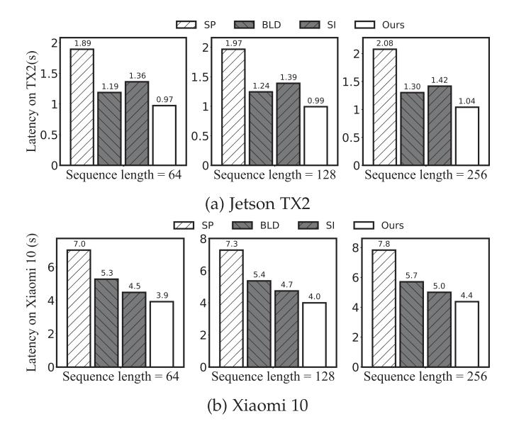

Fig. 17. The generation speed across varying lengths of generated sequences. *Y* -axis: Per-token generation latency on specific hardware; *X*-axis: Sequence length.

accuracy improvement) and QA (94.5% accuracy improvement) tasks—the slower speed is acceptable and practical for users.

• *Generation time of* EdgeLLM*versus Speculative decoding baselines.* Compared with BLD, EdgeLLM can achieve a 4.5–94.5 and 9.8–96.7 percentage point generation accuracy improvement with a 1.1-1.4× and 1.1–1.3× speedup in pertoken average generation time on IoT and smartphone devices, respectively. That is because, unlike BLD which speeds up the generation process by reducing the number of corrections (sacrificing accuracy), our self-adaptive fallback strategy aims to minimize verification times while ensuring verification for each token. Such an approach enhances generation speed without sacrificing accuracy. Notably, EdgeLLM achieves higher accuracy improvement on summary tasks where a single token generation error will hugely influence the whole text quality. Furthermore, provisional generation enables draft LLM to generate texts earlier without waiting for the verification results when no errors are detected by the verification process, further reducing generation latency.

Similarly, EdgeLLM can reduce per-token average generation time by 1.93–2.00× and 1.34–1.77× on IoT and smartphone devices, respectively. That is because, unlike SP uses token sequence length, our self-adaptive fallback strategy can accurately find when the draft LLM generates errors and can reduce verification frequency.

Compared with SI baseline, EdgeLLM can achieve a latency speedup by up to 1.42 × and 1.66× on smartphones and IoT devices, respectively. This improvement is attributed to the following factors: (1) Although both SI and EdgeLLM utilize token trees to enhance the capabilities of the draft LLM, EdgeLLM overcomes the inefficiencies of generating token trees on mobile devices, i.e., struggling with parallel branch generation due to the lack of effective batching. By introducing *resource-efficient branch decoding and branch navigation*, EdgeLLM generates token trees with branches of varying lengths and widths based on their confidence levels, thereby avoiding the generation of redundant branches. This method reduces token tree generation delay by 2.1–3.4×. (2) In terms of verification timing, EdgeLLM employs *tree-cumulative confidence* as a decision variable, which considers the overall token tree information that SI overlooks. Additionally, EdgeLLM adaptively adjusts the threshold based on the draft LLM's historical accuracy, ensuring that verification is initiated at the most opportune moment to prevent the propagation of erroneous tokens. This approach reduces 32.3% useless verification. (3) EdgeLLM addresses the unique challenge faced by mobile devices during the verification process, where target LLM parameters need to be dynamically loaded from disk to memory, causing significant processor idleness. EdgeLLM mitigates this issue by breaking the cross-token dependency between generation and verification. This allows the draft LLM to continue token generation in parallel with the verification process. If no errors are detected during verification, the provisionally generated tokens are used directly, thereby reducing the draft LLM generation latency. This technique can hide up to 34.5% of the draft LLM generation delay.

*Generation speed under different lengths:* We then evaluate the efficacy of our proposed method in generating different length sequences. We conducted experiments on two devices, the TX2 and Xiaomi 10, measuring the latency required to generate the 64th, 128th, and 256th correct tokens, as shown in Fig. 17. Our experiment results demonstrate that *although* EdgeLLM*exhibits a slightly lower acceleration ratio compared to the average generation latency, it consistently achieves the highest speed in sequence generation.*

Compared with SP, BLD, SI, EdgeLLM can still reduce the time required to generate the 256th correct token generation time by 1.28–1.86×, 1.10–1.36×, and 1.19–1.29× on Xiaomi 10, respectively. The observed minor decline in performance improvement can be attributed to the implementation of the draft LLM in EdgeLLM, which employs masked branch attention to assess the impact of the current input token across the entire token tree. This approach introduces a slight increase in computational demand. However, considering that the verification swapping process of the target LLM represents the primary bottleneck in EdgeLLM (accounting for more than 100× the computation overhead), the additional computation introduced by the draft LLM's branch attention has a minimal impact on inference latency, contributing to less than 3% of the total.

# *D. Memory Sensitivity Analysis*

This subsection is to investigate our approach to memory footprint. We further conduct experiments on mT5 and T5 models on Jetson TX2 and LLaMA2 on Xiaomi 10, respectively, under different memory budgets (e.g., from 4 to 8 GB on Xiaomi 10). We do not compare EdgeLLM with single LLM baselines as these require the full model's memory allocation, which is not feasible for our comparative analysis. The generation speeds of different baselines are shown in Fig. [18.](#page-12-0) EdgeLLM consistently exhibits that *it achieves the fastest generation speed among all*

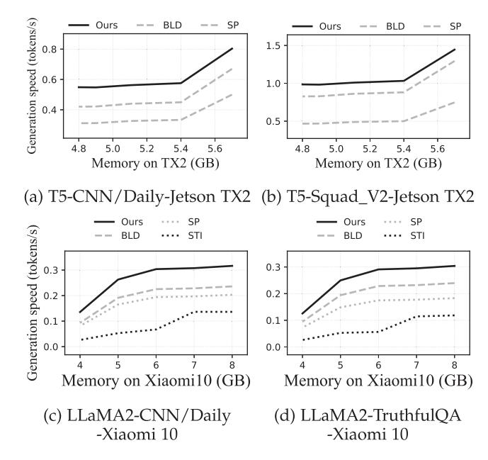

Fig. 18. Generation speed under different memory budgets. Y-axis: Generation speed (tokens/s); X-axis: Memory budget on specific hardware (GB).

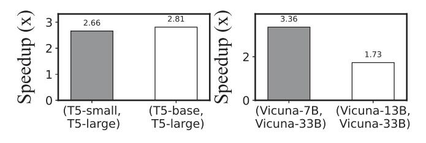

Fig. 19. Per-token generation speedup with different sizes draft and target combinations. *Y*-axis: per-token generation speedup; *X*-axis: draft and target LLM combination.

baselines under different memory budgets, and its benefits are more prominent as the memory budget decreases.

EdgeLLM reduces generation time under 6 GB memory budget on Jetson TX2 by  $1.76\times$  and  $1.12\times$  on average for SP and BLD, respectively; while the speedups for 4GB memory budget are  $1.91\times$  and  $1.25\times$ , correspondingly, which are  $1.08\times$  and  $2.1\times$  larger than that under 6GB on average. Similarly, EdgeLLM achieves a generation time speedup under the 4 GB memory budget on Xiaomi 10 by  $1.55\times$ ,  $1.34\times$ , and  $4.39\times$  on average for SP, BLD, and STI, respectively. That is because when the memory budget is stricter, the inference speed gap between the draft and target LLM is more significant, and delegating tokens to the draft LLM can gain more benefits.

## E. Energy Consumption Analysis

We then evaluate the energy consumption of EdgeLLM with mT5 and T5 models on IoT devices and Vicuana and LLaMa2 models on smartphones. As shown in Table V, compared with Std, SPL, SP, and BLD, EdgeLLM reduces per-token energy consumption by 4.35–7.96, 4.34–7.92, 1.56–3.33, and 1.05–2.15× on Jetson Orin NX, EdgeLLM achieves an energy consumption reduction by 3.22–3.59, 3.18–3.56, 1.24–1.66, 1.07–1.31 and 2.01–2.56,× correspondingly on Xiaomi 11, plus STI. This is because EdgeLLM's two techniques can delegate as

TABLE V
THE SUMMARY OF THE ENERGY CONSUMPTION (J) OF DIFFERENT MODELS ACROSS DIFFERENT DEVICES

| Models-tasks-datasets                  | Std  | SPL  | STI  | SP   | BLD  | Ours        |
|----------------------------------------|------|------|------|------|------|-------------|
| mT5-translation IWLST17-DE->EN      | 36.9 | 36.2 | 11.5 | 12.0 | 7.7  | 7.7 (4.8×)  |
| T5-summary CNN/Daily                | 36.4 | 36.0 | 9.0  | 7.6  | 10.3 | 8.4 (4.3×)  |
| T5-QA SQuAD                         | 36.9 | 36.5 | 10.5 | 15.4 | 9.9  | 4.6 (8.0×)  |
| LLaMa2-summarization CNN/Daily mail | 56.2 | 55.1 | 27.9 | 21.5 | 18.6 | 17.3 (3.2×) |
| LLaMa2-QA TruthfulQA                | 56.2 | 55.1 | 28.1 | 23.9 | 18.3 | 14.3 (3.9×) |
| Vicuna-translation WMT22-DE-EN      | 56.2 | 55.1 | 20.7 | 20.4 | 20.3 | 15.5 (3.6×) |

many tokens as possible to the draft LLM while not sacrificing accuracy.

Compared with the latency speedup, EdgeLLM's energy consumption is relatively lower. This situation arises because our provisional generation parallels the draft and the target LLM execution together, resulting in more energy consumption.

#### F. Ratio Analysis of Draft and Target LLM Sizes

In this section, we employed the T5 and Vicuna model variants to evaluate the impact of varying ratios between draft and target LLM sizes on performance. The experimental results depicted in Fig. 19 indicate that selecting the largest model that fits into memory as the draft LLM generally yields the most significant performance improvement.

Compared to the (T5-small, T5-large) combination, the (T5base, T5-large) combination achieves a  $1.05 \times$  speedup. This is because when the draft LLMs (T5-small and T5-large) can both fit into memory, using larger model variants produces outputs more similar to the target LLM, reducing the number of verifications required and thus decreasing the total inference latency. Although larger draft LLMs have slower generation speeds, the savings in verification overhead make this difference negligible. On the other hand, the (Vicuna-7B, Vicuna-33B) combination is 1.93× faster than the (Vicuna-13B, Vicuna-33B) combination. This is because when Vicuna-13B is used as the draft LLM, it cannot fully reside in memory, resulting in generation and verification speeds becoming similar, i.e., the draft LLM is only  $1.7 \times$  faster than the target LLM. Therefore, delegating the generation workload to Vicuna-13B does not yield significant benefits.

## G. Inference Process Analysis

Breakdown analysis: We conduct a comprehensive experiment to analyze the latency of each component in the EdgeLLM inference process, including the draft LLM generation latency (G), target LLM verification latency (V), and provisional generation latency (P). The experiments are performed using the mT5 and GPT2 models on a Jetson TX2, and the LLaMa-2 model on a Xiaomi 10 device. Detailed results are presented in Fig. 20.

The draft LLM generation latencies for the mT5-small, GPT2-Base, and LLaMa-2-7B models are 0.33 s, 0.46 s, and 1.3 s,

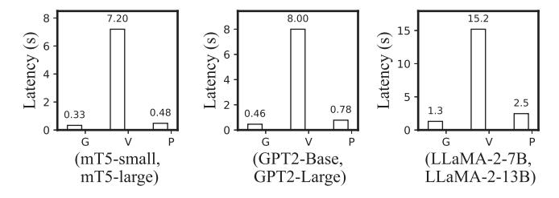

Fig. 20. Latency of draft LLM generation (G), target LLM verification (V), and provisional generation (P). *Y* -axis: execution latency; *X*-axis: draft and target LLM combination.

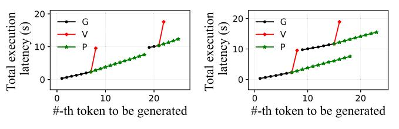

Fig. 21. EdgeLLM's real inference execution trace. "G": draft LLM generation; "V": target LLM verification; "P": provisional generation. *Y* -axis: total execution latency (timeline); *X*-axis: #-th token to be generated.

respectively. In contrast, the target LLM verification latencies are 7.2 s, 8.0 s, and 15.2 s, which are 11.7–21.8× longer than the draft LLM generation times. Provisional generation latencies for the mT5, GPT2, and LLaMa-2 models are 0.48 s, 0.78 s, and 2.5 s, respectively, making this process 1.45–1.92× slower than draft LLM generation. The slower provisional generation is due to its role as a secondary measure designed to hide verification latency. When provisional generation is running in parallel with verification and competing for resources, priority is given to the verification process to ensure its speed is not compromised (as detailed in Section [III-D\)](#page-8-0).

*Inference trace analysis:* We further illustrate EdgeLLM's latency changes when verification kicks in by demonstrating the real execution traces of the mT5 model performing a translation task on the Jetson TX2. This includes two specific scenarios: verification detects no errors and verification detects errors. The results are shown in the Fig. 21.

In this scenario, the draft LLM initially generates text at a rate of 0.33 s per token until the fallback condition is triggered. Upon satisfying this condition, EdgeLLM initiates a verification process (red line) and begins provisional generation (green line). The verification process introduces a latency of 7.2 s, while provisional generation proceeds at an average of 0.48 s per token. Notably, EdgeLLM always displays the provisional outputs to the user, albeit with potentially incorrect results.

After verification, if no errors are detected, EdgeLLM will retain these provisional outputs and continue generation with the draft LLM, as shown in Fig. 21(a). In this case, users can obtain accurate results from the provisional generation with an experience comparable to the initial draft LLM generation (only 1.92× slower). Conversely, if errors are identified during verification, EdgeLLM will discard the provisional outputs and use the draft LLM to re-generate content based on the rectified

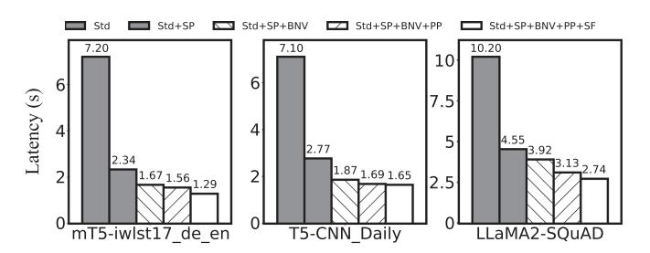

Fig. 22. Ablation study of EdgeLLM. *Y* -axis: Per-token generation latency; *X*-axis: model-dataset.

verification results, as shown in Fig. 21(b). In this instance, users must endure a longer wait time until the verification process is completed.

Our evaluation of the LLaMA2-Chat model on CNN/ Daily [\[29\]](#page-15-0) and TruthfulQA [\[34\]](#page-15-0) datasets indicates that approximately 52.8%–76.3% of verification processes identify errors in draft LLM generation outputs, resulting in prolonged verification delays for users. In other words, on average, a prolonged wait occurs every 1.31–1.89 verifications (corresponding to the generation of 7.0–10.5 tokens by the draft LLM). Additionally, more complex tasks, such as TruthfulQA [\[34\],](#page-15-0) tend to experience a higher frequency of these prolonged verifications, as the draft LLM is more prone to errors in challenging tasks, rendering the provisional generation tokens unusable after verification.

## *H. Ablation Study*

*Overall techniques:* We further conduct a breakdown analysis of the benefit brought by each of EdgeLLM's techniques. The experiments are performed with the mT5 and T5 models on TX2 and LLaMa2 on Xiaomi 10. The results are illustrated in Fig. 22. The leftmost bar is the same as baseline Std, and the second one is the SP, while the rightmost one is EdgeLLM. The three crucial techniques *compute-efficient branch navigation and verification* in Section [III-B,](#page-4-0)*self-adaptive fallback strategy*Section [III-C](#page-7-0) and the *provisional generation* in Section [III-D](#page-8-0) are represented by BNV, SF and PP correspondingly.

We observe that *all techniques make a non-trivial contribution to the improvement.* First, *BNV* can achieve an 1.4–2.1× speedup for mT5, T5 and LLaMA2 models, respectively. This situation arises because it generates a width-adaptive token tree without branch context switching overhead, saving computing resources and reducing generation latency. Besides, the token tree can be verified within one-shot inference with the target LLM, reducing verification delay. Second, *PP* can reduce per-token generation time by up to 1.51×. That is because EdgeLLM can directly use the provisional results when the verification detects no error, especially true for the LLaMA2 model, breaking the cross-token dependency between the generation and verification. Therefore, it can effectively hide draft LLM generation latency under target LLM verification I/O operations. Lastly, *SF* achieves a 1.08– 1.20× speedup. This is achieved by leveraging tree-cumulative confidence to assess error probabilities and dynamically adjust verification timings in response to variations in task complexity, providing a more accurate verification timing than prior works

relying on a single token confidence or token sequence length. It reduces delay from useless verification.

# V. DISCUSSION

*Applicability to encoder-decoder architectures:* EdgeLLM can be applied to encoder-decoder architecture language models, but only to the generation phase utilizing the decoder. This implies that EdgeLLM does not attempt to align the encoder outputs of the draft LLM and the target LLM. Instead, they have independent encoder vectors that are fed into the decoder. During the generation phase, the execution process is same as that of decoder-only models. We have evaluated EdgeLLM with typical encoder-decoder architecture language models, such as mT5, T5, and Bart, in our experiments (Section [IV-C\)](#page-10-0), demonstrating its effectiveness, e.g., up to 5.9× speedup.

*Increasing latency of combining generation and verification:* To ensure the high generation speed, the draft LLM will always reside in memory; the remaining space under the memory budget will be allocated to the target LLM. Therefore, for the target LLM, the available memory space will be reduced, which will result in a verification latency for the target LLM that is greater than the latency of inferring-only the target LLM. For instance, the mt5-large (target LLM) latency using the combination of the mt5-small (draft LLM) and mt5-large on Jetson TX2 is 1.5× slower than that of the target LLM-only inference. However, considering the reduction in the number of inferences required for the target LLM due to speculative decoding, EdgeLLM still achieves significant gains.

*Stuttering analysis of verification procedure:* Speculative decoding-based approaches, such as SpecInfer (SI) [\[23\],](#page-15-0) often increase latency when verification is initiated, matching the delay of target LLM-only inference. This leads to a 116-fold increase in waiting time during the generation stage on devices like the Xiaomi 14 using LLaMA models. However, EdgeLLM addresses this issue with a *provisional generation pipeline*, allowing the draft LLM to generate text during verification, albeit with potentially incorrect results. This ensures continuous output to users, avoiding long waits, though at a slightly reduced speed due to resource competition between generation and verification processes (details in Section [III-D\)](#page-8-0). Our evaluation on the Jetson TX2 using mT5 models shows a generation speed degradation of 2.1–3.7×. Once verification is complete, EdgeLLM outputs the corrected results. If no errors are found, EdgeLLM continues generation based on the provisional results; otherwise, it rolls back the output and resumes normal draft LLM generation from the corrected position.

*Evaluation with different domains* Our results indicate that EdgeLLM exhibits slight variations in speedup across different datasets, which are primarily influenced by the datasets' difficulty levels.We conducted evaluations using a variety of datasets spanning different domains, including CNN/Daily (summarization), Wikitext (language modeling), SQuAD (question answering), and others. Typically, EdgeLLM achieves greater acceleration in translation tasks (5.71x for iwlst17 on the mt5 model). This is attributed to the relative simplicity of translation tasks, which depend less on contextual information, reducing the likelihood of error propagation across sentences. To that end, the similarity between outputs from different parameter size model variants is high, needing less the target LLM rectification. In contrast, EdgeLLM shows slightly reduced performance in summarization tasks (5.14x for CNN/Daily Mail on the t5 model). This situation arises because summarization tasks often require more contextual information, necessitating increased reliance on the target LLM's verification to ensure output accuracy.

# VI. RELATED WORK

*Speculative-decoding-based work:* Recently, speculative decoding (SP), which can accelerate token generation without sacrificing accuracy, has been widely adopted in open-source frameworks [\[13\],](#page-15-0) [\[62\]](#page-16-0) and has garnered considerable attention from the academic community. Big little decoder [\[35\]](#page-15-0) propose an algorithm to trade-off generation accuracy and rollback times to speed the SP process, while SpecInfer [\[23\]](#page-15-0) enhances SP by combining various boost-tuned small language models to jointly generate the draft outputs. Besides, there have even been approaches only using a single model to speed up SP. For instance, Predictive Pipelined Decoding [\[64\]](#page-16-0) utilizes an early exit technique to generate different sizes draft LLM, while REST [\[65\]](#page-16-0) proposes retrieval-based speculative decoding where the draft is retrieved from the database.

*Mobile ML optimization:* Machine learning optimization approaches, such as *model compression* [\[14\],](#page-15-0) [\[55\],](#page-16-0) [\[66\],](#page-16-0) [\[67\],](#page-16-0) [\[68\],](#page-16-0) reducing the model size by quantization and knowledge distillation, *caching* [\[69\],](#page-16-0) [\[70\],](#page-16-0) [\[71\],](#page-16-0) reducing computation by reusing existing results, and *token pruning* [\[54\],](#page-16-0) [\[72\],](#page-16-0) [\[73\],](#page-16-0) reducing computation by pruning useless tokens, have been extensively researched to reduce the generation latency. A few recent study focuses on resource-efficient on-device LLM algorithms and systems [\[74\],](#page-16-0) [\[75\],](#page-16-0) [\[76\],](#page-16-0) [\[77\],](#page-16-0) [\[78\].](#page-16-0) EdgeLLM is orthogonal to and compatible with those algorithm-level optimizations. That is because EdgeLLM primarily focuses on how to accelerate the on-device LLM inference when the parameter size exceeds the memory budget without altering the model itself or compromising accuracy rather than reducing the memory footprint. In contrast, model compression and sparse attention is dedicated to reducing the LLM's memory footprint. A compressed model can further leverage EdgeLLM to speed up its inference process or be used as an efficient draft LLM.

Besides, some researchers focus on generating text in a nonautoregressive manner[\[79\],\[80\].](#page-16-0) However, these works can only apply to <1B models and have accuracy degradation problems, not the mainstream research direction.

*Pipeline optimization for ML:* Pipeline optimization has been extensively used to accelerate ML [\[36\],](#page-15-0) [\[81\],](#page-16-0) [\[82\],](#page-16-0) [\[83\],](#page-16-0) [\[84\].](#page-16-0) Most of them, such as PipeDream [\[82\],](#page-16-0) are utilized to scale out ML to multiple machines by pipelining forward/backward computation with activation/gradients synchronization to minimize bubbles of I/O and network communication. Still, there are some studies focusing on single-machine/task optimization. For instance, PipeSwitch [\[81\]](#page-16-0) introduced pipelining model transmission over the PCIe and task execution in the GPU to reduce context switching performance overhead. STI [\[36\]](#page-15-0) pipelined model shards loading with its computation to reduce inference latency. EdgeLLM is inspired by these efforts and proposes an efficient *provisional generation pipeline* to address the challenge of I/O blocking and limited parallelism.

# VII. CONCLUSION

This work has proposed EdgeLLM, the first system to bring larger and more powerful LLMs to mobile devices. It breaks the memory wall and delivers LLM's scaling ability to mobile devices It incorporates three novel techniques, including compute-efficient branch navigation, self-adaptive fallback strategy, and provisional generation pipeline that can exploit the waste hardware resources during the verification process. Our experiments have demonstrated that when compared to the state-of-the-art LLM engines, EdgeLLM can reduce average per-token generation time by 2.9–9.3× and 3.5–4.7× on IoT devices and smartphones, without comprising accuracy.

# REFERENCES

- [1] Google Translate Apps on Google Play play.google.com, 2023. Accessed: Jul. 22, 2023. [Online]. Available: [https://play.google.com/store/](https://play.google.com/store/apps/details{?}id=com.google.android.apps.translate&hl=en_US) [apps/details?id=com.google.android.apps.translate&hl=en\\_US](https://play.google.com/store/apps/details{?}id=com.google.android.apps.translate&hl=en_US)
- [2] Gboard the Google Keyboard Apps on Google Play play. google.com, 2023. Accessed: Jul. 22, 2023. [Online]. Available: [https://play.google.com/store/apps/details?id=com.google.android.](https://play.google.com/store/apps/details{?}id=com.google.android.inputmethod.latin&hl=en) [inputmethod.latin&hl=en](https://play.google.com/store/apps/details{?}id=com.google.android.inputmethod.latin&hl=en)
- [3] Siri apple.com, 2023. Accessed: Jul. 22, 2023. [Online]. Available: <https://www.apple.com/siri/>
- [4] A. Vaswani et al., "Attention is all you need," in *Proc. Int. Conf. Neural Inf. Process. Syst.*, 2017, pp. 5998–6008.
- [5] T. Brown et al., "Language models are few-shot learners," in *Proc. Int. Conf. Neural Inf. Process. Syst.*, 2020, pp. 1877–1901.
- [6] H. Touvron et al., "LLaMA: Open and efficient foundation language models," 2023, arXiv: *2302.13971*.
- [7] J. Wei et al., "Emergent abilities of large language models," 2022, arXiv: *2206.07682*.
- [8] M. Xu, F. Qian, Q. Mei, K. Huang, and X. Liu, "DeepType: On-device deep learning for input personalization service with minimal privacy concern"" *Proc. ACM Interactive Mobile Wearable Ubiquitous Technol.*, vol. 2, no. 4, pp. 1–26, 2018.
- [9] D. Cai, S. Wang, Y. Wu, F. X. Lin, and M. Xu, "Federated few-shot learning for mobile NLP," in *Proc. 29th Annu. Int. Conf. Mobile Comput. Netw.*, 2023, pp. 1–17.
- [10] J. Yuan et al., "Mobile foundation model as firmware," in *Proc. 30th Annu. Int. Conf. Mobile Comput. Netw.*, 2024, pp. 279–295.
- [11] W. Yin, M. Xu, Y. Li, and X. Liu, "LLM as a system service on mobile devices," 2024, arXiv: *2403.11805*.
- [12] MNN, 2020. Accessed: Jul. 2023. [Online]. Available: [https://github.com/](https://github.com/alibaba/MNN) [alibaba/MNN](https://github.com/alibaba/MNN)
- [13] Llama.cpp, "Port of Facebook's LLaMA model in C/C++ Resources," 2023. Accessed: Jul. 2023. [Online]. Available: [https://github.com/](https://github.com/ggerganov/llama.cpp) [ggerganov/llama.cpp](https://github.com/ggerganov/llama.cpp)
- [14] E. Frantar, S. Ashkboos, T. Hoefler, and D. Alistarh, "GPTQ: Accurate post-training quantization for generative pre-trained transformers," 2022, arXiv: *2210.17323*.
- [15] AutoGPTQ, 2023. Accessed: Jul. 2023. [Online]. Available[: https://github.](https://github.com/PanQiWei/AutoGPTQ) [com/PanQiWei/AutoGPTQ](https://github.com/PanQiWei/AutoGPTQ)
- [16] G. Xiao, J. Lin,M. Seznec, H.Wu, J. Demouth, and S. Han, "SmoothQuant: Accurate and efficient post-training quantization for large language models," in *Proc. Int. Conf. Mach. Learn.*, 2023, pp. 38087–38099.
- [17] Z. Lu et al., "Small language models: Survey, measurements, and insights," 2024, arXiv: *2409.15790*.
- [18] Z. Liu et al., "Deja Vu: Contextual sparsity for efficient LLMs at inference time," in *Proc. Int. Conf. Mach. Learn.*, 2023, pp. 22137–22176.
- [19] K. Alizadeh et al., "LLM in a flash: Efficient large language model inference with limited memory," 2023, arXiv: *2312.11514*.

- [20] Y. Song, Z. Mi, H. Xie, and H. Chen, "PowerInfer: Fast large language model serving with a consumer-grade GPU," 2023, arXiv: *2312.12456*.
- [21] Y. Leviathan, M. Kalman, and Y. Matias, "Fast inference from transformers via speculative decoding," in *Proc. Int. Conf. Mach. Learn.*, 2023, pp. 19274–19286.
- [22] C. Chen, S. Borgeaud, G. Irving, J.-B. Lespiau, L. Sifre, and J. Jumper, "Accelerating large language model decoding with speculative sampling," 2023, arXiv: *2302.01318*.
- [23] X. Miao et al., "SpecInfer: Accelerating generative LLM serving with speculative inference and token tree verification," 2023, arXiv: *2305.09781*.
- [24] PyTorch, 2014. Accessed: Jul. 2023. [Online]. Available: [https://pytorch.](https://pytorch.org/) [org/](https://pytorch.org/)
- [25] A. Radford et al., "Language models are unsupervised multitask learners," *OpenAI Blog*, vol. 1, no. 8, 2019, Art. no. 9.
- [26] C. Raffel et al., "Exploring the limits of transfer learning with a unified text-to-text transformer"" *J. Mach. Learn. Res.*, vol. 21, no. 1, pp. 5485–5551, 2020.
- [27] L. Xue et al., "mT5: A massively multilingual pre-trained text-to-text transformer," 2020, arXiv: *2010.11934*.
- [28] M. Lewis et al., "BART: Denoising sequence-to-sequence pre-training for natural language generation, translation, and comprehension," 2019, arXiv: *1910.13461*. [Online]. Available:<http://arxiv.org/abs/1910.13461>
- [29] A. See, P. J. Liu, and C. D. Manning, "Get to the point: Summarization with pointer-generator networks," in *Proc. 55th Annu. Meeting Assoc. Comput. Linguistics*, Vancouver, Canada, 2017, pp. 1073–1083. [Online]. Available:<https://www.aclweb.org/anthology/P17--1099>
- [30] S. Merity, C. Xiong, J. Bradbury, and R. Socher, "Pointer sentinel mixture models," 2016, *arXiv: 1609.07843*.
- [31] M. Cettolo et al., "Overview of the IWSLT 2017 evaluation campaign," in *Proc. 14th Int. Conf. Spoken Lang. Transl.*, Tokyo, Japan, 2017, pp. 2–14. [Online]. Available:<https://aclanthology.org/2017.iwslt-1.1>
- [32] O. Bojar et al., "Findings of the 2014 workshop on statistical machine translation," in *Proc. 9th Workshop Stat. Mach. Transl.*, Baltimore, MD, USA, 2014, pp. 12–58. [Online]. Available: [http://www.aclweb.org/anthology/](http://www.aclweb.org/anthology/W/W14/W14--3302) [W/W14/W14--3302](http://www.aclweb.org/anthology/W/W14/W14--3302)
- [33] P. Rajpurkar, J. Zhang, K. Lopyrev, and P. Liang, "SQuAD: 100,000+ Questions for machine comprehension of text," 2016, arXiv: *1606.05250*.
- [34] S. Lin, J. Hilton, and O. Evans, "TruthfulQA: Measuring how models mimic human falsehoods," 2021, arXiv: *2109.07958*.
- [35] S. Kim, K. Mangalam, J. Malik, M. W. Mahoney, A. Gholami, and K. Keutzer, "Big little transformer decoder," 2023, arXiv: *2302.07863*.
- [36] L. Guo, W. Choe, and F. X. Lin, "STI: Turbocharge NLP inference at the edge via elastic pipelining," in *Proc. 28th ACM Int. Conf. Architectural Support Program. Lang. Operating Syst.*, 2023, pp. 791–803.
- [37] R. Rombach, A. Blattmann, D. Lorenz, P. Esser, and B. Ommer, "High-resolution image synthesis with latent diffusion models," in *Proc. IEEE/CVF Conf. Comput. Vis. Pattern Recognit.*, 2022, pp. 10684–10695.
- [38] S. Reed, Z. Akata, X. Yan, L. Logeswaran, B. Schiele, and H. Lee, "Generative adversarial text to image synthesis," in *Proc. Int. Conf. Mach. Learn.*, 2016, pp. 1060–1069.
- [39] D. Bau et al., "Semantic photo manipulation with a generative image prior," 2020, arXiv: *2005.07727*.
- [40] F. Team, "Generative AI: Advantages, disadvantages, limitations, and challenges — fact.technology," 2023. Accessed: Jul. 22, 2023. [Online]. Available: [https://fact.technology/learn/generative-ai-advantages](https://fact.technology/learn/generative-ai-advantages-limitations-and-challenges/)[limitations-and-challenges/](https://fact.technology/learn/generative-ai-advantages-limitations-and-challenges/)
- [41] vLLM, 2024. Accessed: Jul. 22, 2023. [Online]. Available: [https://vllm. ai/](https://vllm. ignorespaces ai/)
- [42] R. Yi et al., "PhoneLM: An efficient and capable small language model family through principled pre-training," 2024, arXiv: *2411.05046*.
- [43] A. Srivastava et al., "Beyond the imitation game: Quantifying and extrapolating the capabilities of language models," 2022, arXiv: *2206.04615*.
- [44] R. Patel and E. Pavlick, "Mapping language models to grounded conceptual spaces," in *Proc. Int. Conf. Learn. Representations*, 2021.
- [45] D. Hendrycks et al., "Measuring massive multitask language understanding," 2020, arXiv: *2009.03300*.
- [46] K. Cobbe et al., "Training verifiers to solve math word problems," 2021, arXiv: *2110.14168*.
- [47] J. Kaplan et al., "Scaling laws for neural language models," 2020, arXiv: *2001.08361*.
- [48] A. Aghajanyan et al., "Scaling laws for generative mixed-modal language models," 2023, arXiv: *2301.03728*.
- [49] A. Clark et al., "Unified scaling laws for routed language models," in *Proc. Int. Conf. Mach. Learn.*, 2022, pp. 4057–4086.

- [50] I. M. Alabdulmohsin, B. Neyshabur, and X. Zhai, "Revisiting neural scaling laws in language and vision," in*Proc. Int. Conf. Neural Inf. Process. Syst.*, 2022, pp. 22300–22312.
- [51] G.-I. Yu, J. S. Jeong, G.-W. Kim, S. Kim, and B.-G. Chun, "ORCA: A distributed serving system for transformer-based generative models," in *Proc. 16th USENIX Symp. Operating Syst. Des. Implementation*, 2022, pp. 521–538.
- [52] C.-C. Huang, G. Jin, and J. Li, "SwapAdvisor: Pushing deep learning beyond the GPU memory limit via smart swapping," in *Proc. 25th Int. Conf. Architectural Support Program. Lang. Operating Syst.*, 2020, pp. 1341–1355.
- [53] C. Meng, M. Sun, J. Yang, M. Qiu, and Y. Gu, "Training deeper models by GPU memory optimization on tensorflow," in *Proc. ML Syst. Workshop NIPS*, 2017, vol. 7.
- [54] H. Wang, Z. Zhang, and S. Han, "SpAtten: Efficient sparse attention architecture with cascade token and head pruning," in *Proc. 2021 IEEE Int. Symp. High Perform. Comput. Architecture*, 2021, pp. 97–110.
- [55] Z. Yao, R. Y. Aminabadi, M. Zhang, X. Wu, C. Li, and Y. He, "ZeroQuant: Efficient and affordable post-training quantization for largescale transformers," in *Proc. Int. Conf. Neural Inf. Process. Syst.*, 2022, pp. 27168–27183.
- [56] E. J. Hu et al., "LoRA: Low-rank adaptation of large language models," 2021, arXiv: *2106.09685*.
- [57] S. Kim et al., "Full stack optimization of transformer inference: A survey," 2023, arXiv: *2302.14017*.
- [58] R. Han, Q. Zhang, C. H. Liu, G.Wang, J. Tang, and L. Y. Chen, "LegoDNN: Block-grained scaling of deep neural networks for mobile vision," in *Proc. 27th Annu. Int. Conf. Mobile Comput. Netw.*, 2021, pp. 406–419.
- [59] B. Fang, X. Zeng, and M. Zhang, "NestDNN: Resource-aware multi-tenant on-device deep learning for continuous mobile vision," in *Proc. 24th Annu. Int. Conf. Mobile Comput. Netw.*, 2018, pp. 115–127.
- [60] vLLM, 2024. Accessed: Jul. 2023. [Online]. Available:<https://vllm.ai/>
- [61] TensorFlow, 2014. Accessed: Jul. 2023. [Online]. Available: [https://www.](https://www.tensorflow.org/) [tensorflow.org/](https://www.tensorflow.org/)
- [62] Gboard the Google Keyboard Apps on Google Play— play.google.com, (n.d.). Accessed: Oct. 22, 2023. [Online]. Available: [https://github.com/](https://github.com/NVIDIA/FasterTransformer) [NVIDIA/FasterTransformer](https://github.com/NVIDIA/FasterTransformer)
- [63] TheBloke Huggingface model repo, 2023. Accessed: Jul. 2023. [Online]. Available:<https://huggingface.co/TheBloke>
- [64] S. Yang, G. Lee, J. Cho, D. Papailiopoulos, and K. Lee, "Predictive pipelined decoding: A compute-latency trade-off for exact LLM decoding," 2023, arXiv: *2307.05908*.
- [65] Z. He, Z. Zhong, T. Cai, J. D. Lee, and D. He, "REST: Retrieval-based speculative decoding," 2023, arXiv: *2311.08252*.
- [66] H. Guan et al., "CoCoPIE: Enabling real-time AI on off-the-shelf mobile devices via compression-compilation co-design""*Commun. ACM*, vol. 64, no. 6, pp. 62–68, 2021.
- [67] W. Niu et al., "PatDNN: Achieving real-time DNN execution on mobile devices with pattern-based weight pruning," in *Proc. 25th Int. Conf. Architectural Support Program. Lang. Operating Syst.*, 2020, pp. 907–922.
- [68] W. Wang, F. Wei, L. Dong, H. Bao, N. Yang, and M. Zhou, "MiniLM: Deep self-attention distillation for task-agnostic compression of pretrained transformers," in *Proc. Int. Conf. Neural Inf. Process. Syst.*, 2020, pp. 5776–5788.
- [69] M. Xu,M. Zhu, Y. Liu, F. X. Lin, and X. Liu, "DeepCache: Principled cache for mobile deep vision," in *Proc. 24th Annu. Int. Conf. Mobile Comput. Netw.*, 2018, pp. 129–144.
- [70] X. Wang, Y. Han, V. C. Leung, D. Niyato, X. Yan, and X. Chen, "Convergence of edge computing and deep learning: A comprehensive survey," *IEEE Commun. Surveys Tuts.*, vol. 22, no. 2, pp. 869–904, Second Quarter 2020.
- [71] W. Zhang et al., "Elf: Accelerate high-resolution mobile deep vision with content-aware parallel offloading," in *Proc. 27th Annu. Int. Conf. Mobile Comput. Netw.*, 2021, pp. 201–214.
- [72] H. Cai et al., "Enable deep learning on mobile devices: Methods, systems, and applications"" *ACM Trans. Des. Automat. Electron. Syst.*, vol. 27, no. 3, pp. 1–50, 2022.
- [73] S. Kim et al., "Learned token pruning for transformers," in *Proc. 28th ACM SIGKDD Conf. Knowl. Discov. Data Mining*, 2022, pp. 784–794.
- [74] D. Xu et al., "Empowering 1000 tokens/second on-device LLM prefilling with MLLM-NPU," 2024, arXiv: *2407.05858*.
- [75] M. Xu et al., "A survey of resource-efficient LLM and multimodal foundation models," 2024, arXiv: *2401.08092*.

- [76] R. Yi, L. Guo, S. Wei, A. Zhou, S. Wang, and M. Xu, "EdgeMoE: Fast on-device inference of MoE-based large language models," 2023, arXiv: *2308.14352*.
- [77] M. Xu, D. Cai, Y. Wu, X. Li, and S. Wang, "FwdLLM: Efficient federated finetuning of large language models with perturbed inferences," in *Proc. USENIX Annu. Tech. Conf.*, 2024, pp. 579–596.
- [78] W. Yin, R. Yi, D. Xu, G. Huang, M. Xu, and X. Liu, "ELMS: Elasticized large language models on mobile devices," 2024, arXiv: *2409.09071*.
- [79] J. Kasai, N. Pappas, H. Peng, J. Cross, and N. A. Smith, "Deep encoder, shallow decoder: Reevaluating non-autoregressive machine translation," 2020, arXiv: *2006.10369*.
- [80] X. Kong, A. Renduchintala, J. Cross, Y. Tang, J. Gu, and X. Li, "Multilingual neural machine translation with deep encoder and multiple shallow decoders," 2022, arXiv: *2206.02079*.
- [81] Z. Bai, Z. Zhang, Y. Zhu, and X. Jin, "PipeSwitch: Fast pipelined context switching for deep learning applications," in *Proc. 14th USENIX Symp. Operating Syst. Des. Implementation*, 2020, pp. 499–514.
- [82] D. Narayanan et al., "PipeDream: Generalized pipeline parallelism for DNN training," in *Proc. 27th ACM Symp. Operating Syst. Princ.*, 2019, pp. 1–15.
- [83] S. Wang et al., "Overlap communication with dependent computation via decomposition in large deep learning models," in*Proc. 28th ACM Int. Conf. Architectural Support Program. Lang. Operating Syst.*, 2022, pp. 93–106.
- [84] Z. Zhou, X. Wei, J. Zhang, and G. Sun, "PetS: A unified framework for parameter-efficient transformers serving," in *Proc. 2022 USENIX Annu. Tech. Conf.*, 2022, pp. 489–504.

**Daliang Xu** is currently working toward the PhD degree with the School of Computer Science, Peking University, Beijing, China. His research interests lie in mobile computing and software engineering.

**Wangsong Yin** is currently working toward the master degree with the School of Computer Science (National Pilot Software Engineering School), Beijing University of Posts and Telecommunications, Beijing, China. His research interest focuses on mobile computing and machine learning system.

**Hao Zhang** is currently working toward the master degree with the School of Computer Science (National Pilot Software Engineering School), Beijing University of Posts and Telecommunications, Beijing, China. His research interests focus on mobile computing and machine learning system.

**Xin Jin** (Senior Member, IEEE) received the PhD degree from Princeton University, in 2016. He is currently an associate professor (with Tenure) with the School of Computer Science, Peking University. His research interests include computer systems, networking, and cloud computing. He received USENIX FAST Best Paper Award (2019) and USENIX NSDI Best Paper Award (2018).

**Ying Zhang** is an associate professor with the National Engineering Research Center of Software Engineering, Peking University, Beijing, China. His research interests mainly fall in Big Data and the interoperabilities of systems. Most of his recent efforts have been published at conferences including OOPSLA, ICWS, and in journals including *Journal of Software*, *Journal of Information Security and Applications*. He is a member of the ACM and CCF.

**Mengwei Xu** (Member, IEEE) is an associate professor with the Computer Science Department, Beijing University of Posts and Telecommunications. His research interests cover the broad areas of mobile computing, edge computing, artificial intelligence, and system software.

**Shiyun Wei** is an engineer with the Zhongguangcun Laboratory. Her research interests include program analysis and software engineering.

**Xuanzhe Liu** (Senior Member, IEEE) is a full professor with the School of Computer Science , Peking University, Beijing, China. His recent research interests mainly fall in distributed machine learning systems at scale. Most of his recent efforts have been published at prestigious conferences including SOSP, OSDI, SIGCOMM, NSDI, MobiCom, MobiSys, etc. He is a distinguished member of the ACM and CCF.