# LLMCad: Fast and Scalable On-device Large Language Model Inference

Daliang Xu♦, Wangsong Yin♦, Xin Jin♦, Ying Zhang♦, Shiyun Wei★, Mengwei Xu♦, Xuanzhe Liu♦

♦Key Lab of High Confidence Software Technologies (Peking University), Beijing, China

★Zhongguancun Laboratory, Beijing, China.

State Key Laboratory of Networking and Switching Technology (BUPT), Beijing, China {xudaliang,hg,xinjinpku,zhang.ying,weishiyun,liuxuanzhe}@pku.edu.cn yws@stu.pku.edu.cn mwx@bupt.edu.cn

#### **ABSTRACT**

Generative tasks, such as text generation and question answering, hold a crucial position in the realm of mobile applications. Due to their sensitivity to privacy concerns, there is a growing demand for their execution directly on mobile devices. Currently, the execution of these generative tasks heavily depends on Large Language Models (LLMs). Nevertheless, the limited memory capacity of these devices presents a formidable challenge to the scalability of such models.

In our research, we introduce LLMCad, an innovative ondevice inference engine specifically designed for efficient generative Natural Language Processing (NLP) tasks. The core idea behind LLMCad revolves around model collaboration: a compact LLM, residing in memory, takes charge of generating the most straightforward tokens, while a highprecision LLM steps in to validate these tokens and rectify any identified errors. LLMCad incorporates three novel techniques: (1) Instead of generating candidate tokens in a sequential manner, LLMCad employs the smaller LLM to construct a token tree, encompassing a wider range of plausible token pathways. Subsequently, the larger LLM can efficiently validate all of these pathways simultaneously. (2) It employs a self-adjusting fallback strategy, swiftly initiating the verification process whenever the smaller LLM generates an erroneous token. (3) To ensure a continuous flow of token generation, LLMCad speculatively generates tokens during the verification process by implementing a compute-IO pipeline. Through an extensive series of experiments, LLMCad showcases an impressive token generation speed, achieving rates up to 9.3× faster than existing inference engines.

#### 1 INTRODUCTION

Generative tasks like text generation, question answering, and translation play a crucial role on mobile devices, as numerous applications rely on them to deliver key functionalities. For instance, input method application like Google

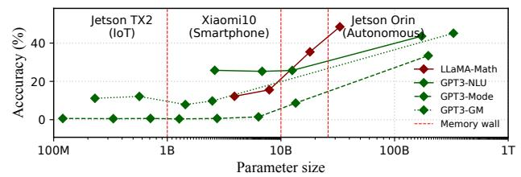

(a) Emergent abilities across various LLMs.

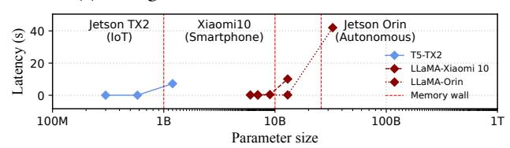

(b) Generation latency of LLMs across various devices.

Figure 1: The memory wall hinders LLM's "scaling law" on mobile devices. \*-Math, \*-NLU, \*-Mode, and \*-GM denote LLMs' emergent abilities: math reasoning, multitask comprehension, mode arithmetic, and learning meaningful representations.

GBoard heavily leverages its text generation capabilities, while private assistant like Apple Siri uses it for question answering. Such tasks are often privacy-sensitive and heavily rely on users' private data, thereby necessitating on-device local inference.

Large language models (LLMs), especially those built atop transformer decoder [65] such as GPT-3 [17] and LLaMA [64], have become the de-facto approach to solve NLP generative tasks. Recent research in the machine learning community has demonstrated that scaling up such LLMs parameter size brings accuracy improvement and emergent ability [17, 64, 71, 71, 72], as shown in Figure 1(a). In general, an LLM necessitates more than 1B parameters to learn meaningful representations [51], over 10B parameters to exhibit certain arithmetic reasoning abilities [22], and more than 30B

1

parameters to achieve multi-task comprehension capabilities [\[30\]](#page-13-1). This phenomenon is well-recognized in the machine learning community as the scaling law [\[11,](#page-12-2) [12,](#page-12-3) [21,](#page-12-4) [34\]](#page-13-2).

Key challenge: memory wall. However, our preliminary experiments in Figure [1\(](#page-0-0)b) reveal that the scaling ability is challenged on mobile devices. Specifically, when LLMs are too large to be fit into device memory, mobile DNN engines like MNN [\[4\]](#page-12-5)a nd llama.cpp [\[45\]](#page-13-3) need to repetitively release and load model weights. It results in 59–224× lengthened inference latency. Such memory wall severely hinders the scaling law. Users have to choose between real-time generation and emergent ability. For instance, 10B parameters represent the minimum size required for LLaMA to possess arithmetic reasoning capabilities, yet it also represents the maximum parameter size for achieving real-time inference on smartphones (e.g., Xiaomi 10).

**LLMCad**: breaking memory wall through model collaboration. In this paper, we propose LLMCad, the first efficient inference engine for on-device generative NLP tasks. LLMCad delivers LLM's scaling ability to mobile devices with a tolerable generation speed through model collaboration. The main idea is to delegate most tokens to a smaller real-time LLM that can be totally hosted in device memory (namely memory-resident LLM). The design is based on a key observation that, while a smaller LLM is inadequate to deliver satisfactory end-to-end sentences, they can correctly generate most easy tokens (e.g., determiners, pronouns, and punctuations). Furthermore, LLMs are often trained with a series of model variants, e.g. T5-Small/Base/Large [\[55\]](#page-13-4) and LLaMa-7B/13B/33B [\[64\]](#page-14-1), and its smaller counterpart (e.g., LLaMa-7B and T5-small, dubbed memory-resident model in this paper) can often be hosted in memory easily [\[17,](#page-12-0) [55,](#page-13-4) [64,](#page-14-1) [75\]](#page-14-4).

LLMCad employs a unique form of model collaboration, namely "generate-then-verify" [\[20,](#page-12-6) [41\]](#page-13-5). In this approach, the memory-resident LLM serves as a token generator, while a target LLM acts as a verifier, using its output as the ground truth to inspect and rectify any errors introduced during the token generation process. This approach provides two significant advantages: (1) No compromising accuracy. Each token is verified by the target model, therefore its accuracy is guaranteed. This is crucial as a wrong token could propagate its error to the subquent tokens due to the autoregressive nature. (2) Fast verification. As will be detailed in §[2.3,](#page-4-0) the verification of tokens can be accomplished within oneshot inference o f the target model, therefore much faster than using it to generate tokens sequentially.

Despite these advantages, applying model collaboration for on-device LLM introduces three distinctive challenges:

• Overlooked correct tokens with sub-optimal confidence. Typically, state-of-the-art LLM engines and studies always use the token with the highest probability as the output. Nevertheless, our observation has revealed that some of generation errors by the memory-resident LLM can be rectified by the sub-optimal tokens. Figure [4](#page-5-0) gives a realworld example of such phenomenon. Given the significant performance overhead associated with on-device verification, LLMCad must capitalize on these often-overlooked tokens to reduce the frequency of verification.

- Verification timing. Another crucial aspect is determining when to initiate the verification process. On-device verification is time-consuming, e.g., taking 7.1s on Jetson TX2. Too early or too late verification just wastes computing mobile devices scarce resources by invalid verification (i.e., no errors detected) or useless tokens. Prior works have typically relied either a single token or token sequence length, which may not accurately pinpoint the optimal verification timing.
- IO vs. compute asymmetry. With a LLM cascade, the large LLM execution blocks the small model inference due to the cross-token dependency, and the processor is underutilized as the I/O bottlenecks during weights loading. Such a situation severely hampers the inference speed as the target model needs to be invoked unavoidably to guarantee correct tokens generation.

In response, LLMCad desgins three novel techniques:

- (1) Token tree generation and verification (§[3.2\)](#page-5-1). Instead of generating and verifying a linear token sequence, LLMCad employs a different approach by constructing and validating a "token tree." This token tree permits each token to have multiple potential succeeding tokens. To accomplish this efficiently, LLMCad employs three novel modules: (1) Confidence-based branch pacer paces the progress of different branches to prevent the wasteful allocation of computing resources to the wrong branch; (2) Tree decoder generates tokens from various branches without incurring the overhead of context switching between them; (3) Non -autoregressive token tree verifier examines and rectifies all errors within a token tree in a batch manner, at the cost of a single iteration.
- (2) Self-adaptive fallback strategy (§[3.3\)](#page-7-0). This strategy is devised to initiate the verification process promptly when the memory-resident LLM generates an incorrect token. It is inspired by two key observations: (1) Typically, each token generated by the memory-resident LLM introduces some "uncertainty" (imperfect confidence score). LLMCad uses a more accurate metric referred to as cumulative uncertainty within the token tree compared. Compared to prior works, this metric better reflects the error probability associated with memory-resident LLM generation, especially considering the accumulative nature of autoregressive models. (2) Historical data pertaining to the accuracy of verified tokens

is harnessed to assess the memory-resident LLM's generation capability. A stronger generation ability necessitates a lower frequency of verification.

(3) Speculative generation pipeline (§[3.4\)](#page-7-1). To break the cross-token dependency and enhance parallelism, we propose speculative generation, i.e., continuing generating tokens through the memory-resident LLM during the verification process, This is founded on the insight that sometimes the verification process may not detect errors, rendering the speculatively generated tokens usable. However, simultaneous speculative generation with verification directly can lead to processor and memory contentions. To further tackle this issue, LLMCad incorporates a fine-grained pipeline, ensuring that the speculative generation only runs when loading target LLM parameters below the memory upper bound to void interfering with the regular verification process.

Implementation and evaluation. We have fully implemented LLMCad on top of two SOTA LLM engines: Py-Torch [\[5\]](#page-12-7) and llama.cpp [\[45\]](#page-13-3). Extensive evaluation of the system was conducted across four platforms: two IoT devices (Jetson TX2 and Jetson Orin NX) and two smartphones (Xiaomi 10 and Xiaomi 11). This evaluation encompassed six widely utilized LLMs (GPT2 [\[54\]](#page-13-6), T5 [\[55\]](#page-13-4), mT5 [\[75\]](#page-14-4), Bart [\[42\]](#page-13-7), Vicuna, and LLaMa2 [\[64\]](#page-14-1)) and seven datasets (CN-N/Daily [\[61\]](#page-14-5), Wikitext [\[47\]](#page-13-8), iwlt2017 [\[19\]](#page-12-8), wmt14/22 [\[15\]](#page-12-9), SQuAD [\[56\]](#page-13-9), parrot, and TruthfulQA [\[44\]](#page-13-10)). We also compared LLMCad with five state-of-the-art competitive baselines [\[5,](#page-12-7) [27,](#page-13-11) [37,](#page-13-12) [41,](#page-13-5) [45\]](#page-13-3), encompassing two computing-loading pipeline frameworks and two "generator and verifier" LLM collaboration frameworks. Our results unequivocally demonstrate LLMCad's superior performance. When compared to the state-of-the-art LLM engines, LLMCad can reduce average per-token generation time by 2.9–9.3× and 3.5–4.7× on IoT devices and smartphones, respectively, without comprising accuracy. For >10B-sized LLMs like LLaMA2-13B that are previously unbearable on smartphones, LLMCad generates more than one token per second. Furthermore, compared with competitive baselines, LLMCad can achieve up to 5.6× speedup and noticeable higher accuracy.

The major contributions of this work are as follows:

- We thoroughly explore the opportunities and challenges of inferring LLMs on the device.
- We propose LLMCad, the first efficient inference engine for on-device generative NLP tasks. To speedup the generation procedure, LLMCad uses "generator and verifier" LLM collaboration and incorporates three novel techniques: tree generation and verification, self-adaptive fallback strategy, and speculative generation pipeline. These advancements enable LLMCad to effectively mitigate the memory wall problem.

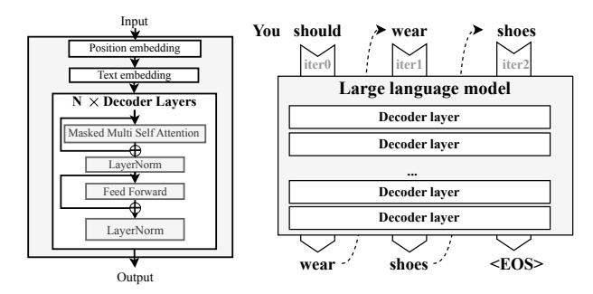

(a) GPT3 architecture

(b) Autoregressive inference

Figure 2: The architecture of decoder-only language model (GPT3) and the overview of LLM inference pattern: autoregressive.

• We prototype LLMCad and evaluate it with representative LLMs and commodity mobile devices. The results demonstrate its superior performance over existing methods.

## 2 BACKGROUND AND MOTIVATION

## 2.1 Decoder-based Generative LLMs

On-device generative ML tasks. Generative tasks are those involving automatic generation or synthesis of new contents like text sequences and image pixels [\[14,](#page-12-10) [58,](#page-14-6) [59\]](#page-14-7). Typical generative tasks in the NLP domain (focus of this work) include language modeling, machine translation, summarization, and question answering. The key focus is to provide novel, meaningful, and coherent content output. As compared to traditional classification tasks such as topic classification and image classification, generative tasks are often more challenging but also more profound to human lives [\[63\]](#page-14-8).

Generative ML tasks have been widely served for mobile users, such as language modeling for Google Gboard [\[1\]](#page-12-11), question answering for Siri [\[6\]](#page-12-12), and translation services like iTranslate [\[3\]](#page-12-13) and Google Translate [\[2\]](#page-12-14), etc. To guarantee user data privacy (e.g., text corpus) and service availability, the models are better to be deployed on devices directly for local inference.

Decoder-based LLM architecture. Decoder-based large language model (LLM), including both decoder-only and encoder-decoder architectures, is the de-facto approach for generative tasks, such as GPT-3 [\[17\]](#page-12-0), LLaMa [\[64\]](#page-14-1), and GLM-130B [\[23,](#page-12-15) [79\]](#page-14-9). As shown in Figure [2\(](#page-2-0)a), a typical decoderbased LLM consists of a text embedding, a position embedding, and many sequentially stacked decoder layers, where each decoder layer includes masked self-attention, Layer-Norm, and Linear operations. For those encoder-decoder LLMs such as T5 [\[55\]](#page-13-4) and mT5 [\[75\]](#page-14-4), encoder layers are incorporated before the decoder to enhance semantic understanding capabilities.

**Autoregressive inference.** Generative LLMs employ an *autoregressive* inference procedure that generates one token at a time and takes that token as input to generate the next one. For instance, Figure 2(b) illustrates a three-autoregressive-iteration inference procedure. In the 1st iteration, the model takes all existing tokens ("You should") as input and generates the output "wear." In the next iteration, the newly generated "wear" will be fed into the model, which then predicts "shoes." This process continues until the model generates the end-of-sequence token (< EOS >), indicating the end of the generation procedure. The nature of autoregressive inference introduces unique challenges for optimizing on-device LLM as will be described later.

## 2.2 On-device LLM is Memory-bounded

In this section, we perform pilot experiments to reveal the performance issue of on-device LLM inference. The experiments are performed on typical LLMs (GPT2, T5, and LLaMa), datasets (SQuAD and TriviaQA), and mobile devices (Jetson TX2 and Xiaomi 10) using state-of-the-art DL engines (Py-Torch [5] and llama.cpp [45]. We summarize our key findings below.

Scaling up parameter size brings accuracy improvement. Transformer-based LLM architecture is highly flexible and scalable by simply adjusting the encoder/decoder layers, sequence length, and other hyper-parameters. Consequently, popular LLM is often developed with a series of model variants, such as T5-Small/Base/Large [55] and LLaMa-7B/13B/33B/65B [64]. With the parameter size scaling up, the model exhibits stronger abilities. As shown in Table 1, T5-Large outperformed T5-Small by a significant margin, achieving a 7.6% improvement in accuracy on the SQuAD dataset. Similarly, LLaMa-13B demonstrated a 6.6% higher QA accuracy on TriviaQA than LLaMa-7B. Indeed, such a phenomenon is well known in ML community as scaling law [11, 12, 21, 34].

On-device LLM scalability hinders on the memory wall. However, as shown in Table 1, the inference speed declines rapidly when the memory consumption exceeds the memory budget. For instance, on the TX2 device, the inference latency increases by 189–224× with only 5.8–12.2× increase in model size. To gain a deeper understanding of the factors influencing inference speed, we conducted a breakdown analysis, as shown in Figure 3. It clearly shows that, when the model inference demands a memory size unaffordable on edge devices, loading parameters from disk to memory (i.e., disk I/O) soon becomes the bottleneck of the inference time (95.9–98.8%). This situation attributes to the fact that the state-of-the-art device-side LLM engines, such

| (a) On TriviaQA with Xiaomi10 |                         |                  |               |                           |  |  |  |
|-------------------------------|-------------------------|------------------|---------------|---------------------------|--|--|--|
|                               | # of Params (B)         | Accuracy         | PeakMem. (GB) | Infer. Time (ms)          |  |  |  |
| LLaMa-7B (4bits)              | 7                       | 50.0             | 4.1           | 275 (1x)                  |  |  |  |
| LLaMa-13B (4bits)             | 13                      | 56.6             | 9.8           | 10118 (37x)               |  |  |  |
| LLaMa-33B (4bits)             | 33                      | 65.1             | 20.8          | 22017 (87x)               |  |  |  |
| (b) On SQuAD with TX2         |                         |                  |               |                           |  |  |  |
| GPT2                          | # of Params (B) 0.14 | Accuracy 49.8 | PeakMem. (GB) | Infer. Time (ms)          |  |  |  |
|                               |                         |                  |               | 27.64.(1 x )   |  |  |  |
| GPT2-Large                    | 0.14                    | 53.7             | 0.5 3.1    | 37.64 (1x) 8065 (214x) |  |  |  |
|                               |                         |                  |               | · ,                       |  |  |  |
|                               |                         |                  |               | · ,                       |  |  |  |

87.0

79.1

85.4

86.7

39

0.2

0.8

2.8

7214 (230x)

27 (1x)

37 (1.4x) 7098 (263x)

1.2

0.06

0.22

0.73

mT5-Large

T5-Small

T5-Base

T5-Large

Table 1: The parameter size, accuracy, peak memory usage, and inference latency of LLM variants in one autoregressive iteration. (a) experiments are performed on PyTorch while (b) experiments are performed on llama.cpp.

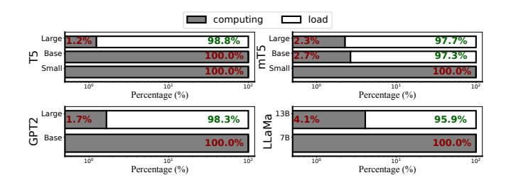

Figure 3: Inference delay breakdown of different LLM variants in one autoregressive iteration.

as MNN [4] and llama.cpp [45], resort to the *swapping* technique which dynamically releases the inferred weights memory and loads weights to be inferred from the disk when memory constraints are exceeded.

The autoregressive nature makes traditional memory optimizations barely effective for generative LLM. It is worth noting that memory optimization for model inference has been a well-researched topic in recent years [27, 32, 46, 78]. Various system-level methods have been explored, such as batching [78], compute-I/O pipeline [27], and smart swapping [32, 46]. However, these works can hardly apply to on-device LLM, because: (1) Parallelization/batching is not available as autoregressive inference requires generating tokens sequentially; (2) Overlapping can gain limited benefits since I/O time is over a hundredfold larger than computing. Additionally, algorithmic approaches like quantization [25, 31, 66, 76] can bring a few times memory reduction (e.g., FP16→INT4 [25]), their efficiency is limited as low-bit precision (e.g., 2 bits) has been demonstrated to be insufficient to retain model capability [25, 36, 76]. Note that

the proposal of this work is at system level and is compatible with quantization.

# 2.3 Opportunities and Challenges of LLM collaboration

This work focuses on model collaboration approach [\[40,](#page-13-18) [60,](#page-14-13) [70\]](#page-14-14), which leverages multiple models with accuracy-cost tradeoff to speed up inference. In the case of generative NLP tasks, we delegate most computations (i.e., tokens) to a smaller model that entirely fits into the memory budget. The key rationale is that smaller models can exhibit close performance to the large one, especially for the easier data points [\[24,](#page-13-19) [29\]](#page-13-20). Our empirical experiments have confirmed such an assumption: in the iwslt2017 de-en translation dataset [\[19\]](#page-12-8), mT5-Small correctly generates more than 80% tokens as mT5-Large does. Figure [4](#page-5-0) gives one concrete example of translating a sentence by the smaller model and larger LLM, and the corresponding ground truth. It shows that most of the tokens (in green) generated by the small model are correct.

However, employing model collaboration for LLMs faces one critical challenge: Wrong token delegation could be fatal. Traditional model cascade either relies on internal [\[60\]](#page-14-13) or external knowledge [\[40,](#page-13-18) [70\]](#page-14-14) to select a portion of data (often the easier ones) to be processed by the smaller model. In such circumstance, the accuracy cannot be guaranteed. For generative NLP tasks, however, a wrongly generated token by the small model could propagate the error to the subsequent ones and finally cause catastrophic results due to its autoregressive nature [\[53,](#page-13-21) [55,](#page-13-4) [65\]](#page-14-0). For example, in Figure [4,](#page-5-0) the second "ice" in red is incorrect, resulting in additional two "ice" generations and wrong translation information in the subsequent tokens. Note that generative NLP tasks are often accuracy-sensitive, e.g., translation and Q/A, as a wrongly generated result could misinform users and result in unexpected behaviors.

To tackle this issue, LLMCad employs a unique form of model collaboration, namely "generate-then-verify" [\[20,](#page-12-6) [41\]](#page-13-5). In this approach, the memory-resident LLM serves as a token generator, while a target LLM acts as a verifier, using its output as the ground truth to inspect and rectify any errors introduced during the token generation process. By doing that, LLMCad can prevent from propagating its error to the subquent tokens due to the autoregressive nature.and ensure no compromising accuracy.

## 3 DESIGN

# 3.1 Overview

LLMCad is built on two LLMs: a target model that is accurate but heavy (cannot fit to device memory) like mT5-large; and a memory-resident model that is less accurate but lightweight like mT5-small. The design goal of LLMCad is to generate texts with the speed of memory-resident model without compromising the accuracy of target (larger) model.

Simplified workflow and an illustrative example Figure [5](#page-5-2) illustrates the workflow of LLMCad. Figure [6](#page-6-0) also provides an illustrative example based on the case of Figure [4](#page-5-0) to exemplify the workflow. Essentially, LLMCad is a generation and verification framework using the memory-resident LLM as a generator, and the target LLM as a verifier.

First, LLMCad feeds the input text to the memory-resident model and generates a token tree. A token tree is the intermediate result generated by the memory-resident model (details in tree generation §[3.2\)](#page-5-1). Unlike a token sequence where each token has only a single succeeding token, a token in a token tree can have multiple candidate succeeding tokens, as shown in Figure [6](#page-6-0)○1 . Each of the candidate tokens represents a candidate token sequence (referred to as a branch). This is based on the observation that sometimes the "sub-optimal" tokens generated by the memory-resident LLM is the true output of the target LLM, e.g., the alternative token "cap". In practice, any candidate token with a confidence higher than a threshold (e.g., 30%) generates a branch.

Each token generated by the memory-resident LLM introduces some "uncertainy" (imperfect confidence score). Once such uncertainty accumulates to a level in the output sentence, the target LLM is used to verify all the generated branches since last verification, as shown in Figure [6](#page-6-0)○2 . Notably, the verification of tokens can be done within oneshot inference with target LLM, therefore much faster than using it to generate one token by times. such verification process is therefore termed "non-autoregressive". Once an error is detected, LLMCad will rollback the token tree and rectify the it. The details of the verification and rollback strategy is discussed in §[3.2.](#page-5-1)

The verification process involves target LLM inference, therefore is I/O-bound as previously shown in §[2.3.](#page-4-0) LLMCad further proposes Speculative generation to exploit the underutilized hardware resources by generating tokens speculatively (§[3.4\)](#page-7-1), i.e., continuing generating tokens through the memory-resident model during verification process, as shown in Figure [6](#page-6-0)○3 dashed boxes on the left side of the red dash line. This approach is based on the insight that sometimes the verification detects no error so the speculatively generated tokens could be used afterwards. Therefore, it can effectively hide execution latency under the I/O, e.g., the second branch in Figure [6](#page-6-0)○3 .

LLMCad repeat the above generation and verification process until it encounters "<EOS>", the end token.

Smaller: Last year, I showed these two slides to illustrate that the Arctic ice ice ice ice, which has shrinked for nearly three million years, is 40 percent

2-nd highest confidence token

... that the Arctic ice cap, which has shrinked for ...

Larger: Last year, I showed these two slides to illustrate that the Arctic ice cap, which for about three million years has shrunk by 40 percent.

Last year I showed these two slides to illustrate that the arctic ice cap, which for most of the last three million years has shrunk by 40 percent.

Figure 4: A translation generation example from mt5-small and mt5-large models as well as its ground truth label. Green: correct parts of small model generation; Red: error propagation parts of small model generation; Blue: the sub-optimal token which is the correct answer. Noticeably, on the iwslt2017 de-en translation dataset [19], the mT5-small model correctly generates nearly 69.3% of tokens, while the number for the mT5-large model is 73.1%.

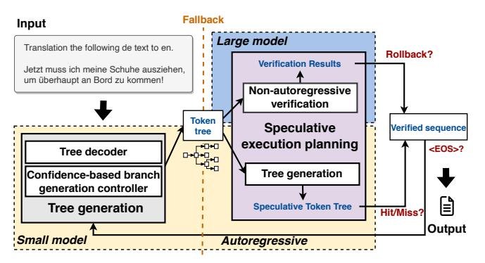

Figure 5: The workflow of LLMCad.

#### 3.2 Token tree generation and verification

This subsection is mainly to discuss how the token tree is generated and verified in LLMCad.

**Token tree generation** To generate useful token trees, LLMCad needs to answer two crucial questions:

- Branches compete for computing resource (e.g., GPU) to generate subsequent tokens by running memory-resident model. At a timestamp, which branch shall receive the resource to lengthen its token sequence? The decision is crucial as generating tokens to a wrong branch (as verified by the target model later) wastes computing resource and delays the generation of true tokens.
- Generating tokens from different branches requires switching between branch contexts. How to generate token from different branches efficiently? The design is crucial as LLMCad needs to frequently switch between up to tens of branches.

In response, LLMCad incorporates two novel techniques:

• Confidence-based branch pacer. To properly pace the progress of different branches, LLMCad relies on the fact that branch with a higher probability is more likely to be the correct result and should have a longer sequence length. Here, LLMCad models the probability with the cumulative confidence scores given by the memory-resident for each token generated. To control the branch length dynamically, LLMCad uses max-min fairness [28].

Assuming that there are N branches and M tokens, and the i-th branch includes  $T_i^B$  tokens, i-th branch cumulative confidence  $C_i$  is the product of every token's confidence. Thus, the branch length problem can be done by solving the

following problem.

$$f(x) = M * \frac{C_x}{\sum_{i=0}^{N} C_i} - T_x^B$$
 (1)

$$Obj = \min_{x=0}^{N} f(x) \tag{2}$$

Under the max-min fairness, LLMCad tries to allocate more hardware resources to the branch which is more likely to be the ground truth.

• Tree decoder. We commence our study by conducting an exhaustive analysis of the fundamental reasons behind the substantial performance overhead incurred by branch context switching (e.g., 25% overhead for mT5 models on Jetson TX2). In Figure 7(a), we provide an illustration of the implementation of branch context switching within state-of-the-art LLM engines, such as PyTorch, using the scenario depicted in Figure 6(1) as a case study. In this illustration, iterations 1-4 take the previous output token as the new input. However, generating token "7" in iteration 5 necessitates branch switch from b1 to b2, which involves the removal of token  $T_4$ , the omission of the new token  $T_6$ , and the utilization of the sub-optimal output  $T_5$  from iteration 3 as input. Consequently, LLMCad must deviate from the autoregressive rule and modify each iteration input with a substantial amount of metadata (e.g., Key-Value cache [7, 36, 78] and position ids [65]) maintaining operations and CPU-GPU interactions.

To tackle this issue, LLMCad incorporates *masking* technique [65]. This technique is employed to ensure that the predictions for position i depends only on the known outputs at positions less than i in decoder-based LLMs. The masking technique relies on a table where all the positions with value of one will be taken into account for calculation.

Crucially, the tree decoder retains the autoregressive procedure while only modifying its masking table to support the isolation of effects from different branches, as demonstrated in Figure 7(b). During each iteration, LLMCad treats the new generated token as input, just as in regular generation. However, it assigns a value of one only to the previous positions on the same branch. For example, when generating token "7" for branch b2 in iteration 5, the input remains  $T_6$ , the output of iteration 4, but only the positions "1, 2, 3, and 5" are set to one; all other positions are set to zero. This approach ensures

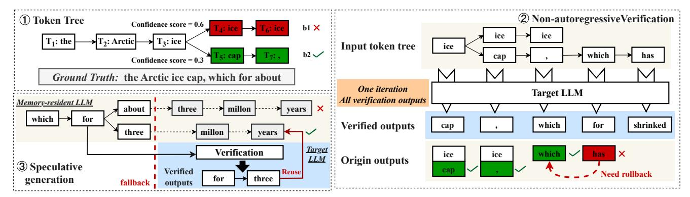

Figure 6: An illustrative example of LLMCad.

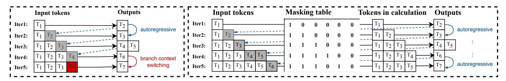

(a) Existing tree generation procedure

(b) Tree decoder procedure

Figure 7: Examples of tree generation procedure in state-of-the-art LLM engines and the tree decoder procedure of LLMCad based on the case of Figure 6①.

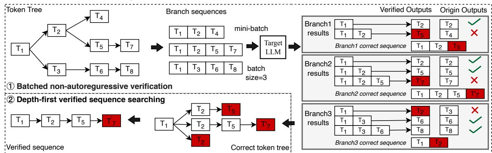

Figure 8: The illustration of token tree verification.

that tokens "4 and 6" do not affect the calculation, enabling LLMCad to generate token "7" without being influenced.

**Token tree verification and rectification** To achieve the goal of not sacrificing accuracy, LLMCad has to verify every token generated by the memory-resident LLM. An intuitive approach is to use the target LLM to run verification after each token generation by the memory-resident LLM. However, such an approach (called *autoregressive verification (AV)*) is even slower than generating every token by the target model directly, since AV does not reduce the target LLM inference times but even uses memory-resident LLM.

To tackle this issue, LLMCad is based on two opportunities: (1) The target LLM can examine a sequence of tokens

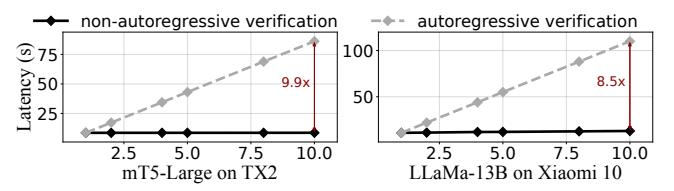

Figure 9: The latency of verification with input sequencing increasing.

in parallel by visiting its parameters only once (called *non-autoregressive verification (NAV)*) and the verification results are the same as examining them sequentially [20, 41]. (2) The NAV process is way faster than AV. Our pilot experiments in Figure 9 on LLaMa-13B and mT5-Large models using Xiaomi10 and TX2 shows that NAV outperforms AV in

examining time across 2–10 input tokens, with its benefits more pronounced as token count increases. NAV significantly reduces verification time for mT5-Large and LLaMa-13B models by  $8.5-9.9\times$  at 10 tokens, attributed to NAV's single weight swapping versus AV's multiple swappings per token, reducing I/O overhead.

To sum up, NAV can parallel verifying multiple tokens correctly at the cost of only one target LLM inference. LLMCad incorporates NAV and extends it to support token tree verification, as shown in Figure 8, including two crucial steps:

- Batched non-autoregressive verification. As shown in Figure 8①, to support token tree verification, LLMCad first divides the token tree into several branch sequences and combines them to a mini-batch as the input of the target LLM. After NAV, LLMCad can obtain the correct results of every position in each branch sequence. Compared with the origin branch sequences, LLMCad can detect all errors of a token tree, e.g.,  $T_7$  in branch2 results. A branch correct sequence is the sub-sequence leading up to the first error position, plus the rectified token, to avoid error propagation. For example, branch1 correct sequence stops at the  $T_2$ , plus the  $T_5$ , i.e., tokens "1, 2 and 5". To be noted, given that the NAV is I/O-bounded, increasing batch size (e.g., <10) has a negligible effects on verification time.
- Depth-first verified sequence searching. Based on the correct sequences, LLMCad can build a correct token tree, as shown in Figure 8(2). Its leaf node is either first rectified token or the origin branch sequence last token. LLMCad leverages depth-first searching algorithm to find the longest correct path in the correct token tree as the verified sequence.

If the verified sequence has a rectified token, e.g.,  $T'_7$ , LLMCad will rollback the token tree to the error position, fix the error, and use it as the new input for future generation.

#### 3.3 Self-adaptive fallback strategy

This strategy is devised to initiate the verification process promptly when the memory-resident LLM generates an incorrect token. To achieve this goal, LLMCad needs to answer two crucial questions:

- **Selection of Decision Metric.** The decision metric should effectively evaluate the probability of errors within the token tree.
- Threshold Values for Different Tasks. Recognizing that a universal threshold may not be suitable for all tasks, LLMCad must establish appropriate threshold values tailored to specific tasks.

To tackle these issues, LLMCad introduces two innovative techniques:

• Tree-cumulative confidence  $(T_c)$ . We propose using tree-cumulative confidence as the decision variable for initiating fallback. Unlike prior studies [37, 41] that rely on a single

token confidence or token sequence length,  $T_c$  provides a comprehensive assessment of global uncertainty. It captures errors more accurately due to the autoregressive nature of token generation.

The formulation *tree-cumulative confidence* is as  $T_c = \max_{i=1}^{N_c} C_i$ , where  $N_c$  represents the number of branches in a token tree, and  $C_i$  denotes the cumulative confidence of the i-th branch. We select the maximum cumulative confidence over minimum/average confidence because the most confident branch is more likely to yield the correct result after verification, and the verification process can only identity errors when the most confident branch is wrong.

• self-adaptive threshold ( $\alpha$ ) is utilized to determine when target LLM shall verify. It operates on the principle that the memory-resident LLM, which generates outputs closely resembling those of the target LLM, should be trusted more, i.e., a lower verification frequency by setting a lower threshold. To assess the outputs similarity, LLMCad relies on historical data regarding the accuracy of verified tokens.

Users can either select an initial  $\alpha$  value or utilize the default value (0.01) provided by the system. After verification, LLMCad updates the *self-adaptive threshold* ( $\alpha$ ) using the following rule:

$$\alpha_{i+1} = \begin{cases} \alpha_i * 0.5 & if \ N_{correct} == N_{all} \\ \frac{N_{all} - N_{correct}}{N_{all}} & if \ N_{correct} < N_{all} \end{cases}$$
(3)

where  $N_{correct}$  and  $N_{all}$  are the number of total tokens and correct tokens in the most matching branch during one verification. Specifically, when the verification process detects no error, LLMCad lowers  $\alpha$  by multiplying the current value by 0.5, the cumulative confidence of 3-5 tokens in empirical observations. In contrast, if verification identifies errors, the threshold is increased by dividing  $\alpha$  by the average cumulative confidence of all tokens subsequent to the incorrectly generated one. The rationale behind the use of an exponential function is that the tree-cumulative confidence is the product of every token's confidence, accumulating exponentially.

In summary, after each token generation by the memory-resident LLM, LLMCad calculates  $T_c$ . If  $T_c$  falls below  $\alpha$ , a fallback occurs, and the target model begins verification. After verification,  $\alpha$  is updated based on the latest generation accuracy history.

#### 3.4 Speculative Generation Pipeline

As elaborated in §2.3, the GPU utilization undergoes cyclical upswings attributed to the fact that SOTA LLM engines resort to the *swapping* technique. To harvest the free cycles, LLMCad proposes *speculative generation* technique by allowing the memory-resident LLM to continue generating tokens during verification process. This approach is based on the

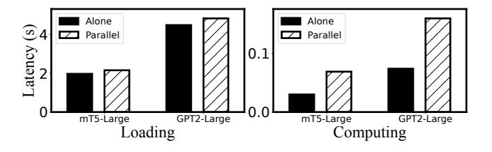

Figure 10: The loading and computing time of the target model execution with the memory-resident model parallelization.

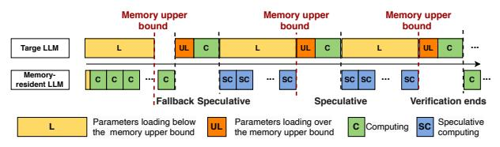

Figure 11: LLMCad's speculative generation.

insight that sometimes the verification detects no error so the speculatively generated tokens could be used afterwards. The impacts of speculative generation on target LLM. Our preliminary experiments on TX2 using mT5-Large and GPT2-Large models shows that paralleling the memoryresident and target LLM execution increases the the target LLM computing and loading time by 2.2-2.3× and 1.05-1.09×, respectively. The computing delay is attributed to the GPU cores contention, while the loading delay is unexpected which is because of the memory contention. Specifically, the memory-resident LLM continually allocates memory regions for speculatively generated tokens, while the target LLM dynamically allocates memory regions for loading parameters. Typically, negligible effects are exerted on each other unless the memory usage is over 90%. However, it is common for memory usage to exceed 90% or even reach 95% in the speculative generation scenario, attributed to the fact that existing state-of-the-art LLMs engines are designed for loading as many parameters as possible from disk to the memory to reduce inference time.

Computing-loading pipeline. To tackle the above issue, LLMCad delicately plans the parallel execution, as shown in Figure 11. The main principle is that normal verification process cannot be influenced by the speculative execution. Thus, there is a memory upper bound by profiling or user defining to avoid two LLMs memory contention, and the two LLMs computing cannot be executed in parallel.

After feeding the input sequence, the parameters of both the memory-resident and the target LLMs are loaded to the memory. Once the memory-resident LLM loading finishes, it begins to generate tokens, and the target LLM parameters loading (in yellow) will stop before the memory upper bound is exceeded to avoid influencing normal memory-resident LLM generation. When the fallback condition is met, the

| Platform   | Processor                             | Software     | Mem. |  |
|------------|---------------------------------------|--------------|------|--|
| T. TIVO    | 4x Cortex-A57                         | Torch-1.10   |      |  |
| Jetson TX2 | Maxwell 128 CUDA cores                | Ubuntu 18.04 | 8G   |  |
| Jetson     | Ampere 1024 CUDA cores                | Torch-2.0    |      |  |
| Orin NX    | + 32 Tensor Cores                     | Ubuntu 18.04 | 8G   |  |
| Xiaomi 10  | 1x 2.84GHz A77+3x 2.4GHz Cortex A77   | Android 10   | 8G   |  |
| Xiaomi 10  | +4x 1.8GHz Cortex A55                 | llama.cpp    | 8G   |  |
| Xiaomi     | 1x 3.0 GHz X2+ 3x 2.5 GHz Cortex A710 | Android 10   | 8G   |  |
| 11         | + 1.8GHz 4x Cortex-A510               | llama.cpp    | ٥G   |  |

| Table 2: Platforms used in the experiments. |         |                           |                            |              |                                       |  |  |
|---------------------------------------------|---------|---------------------------|----------------------------|--------------|---------------------------------------|--|--|
| Devices                                     | Tasks   | Memory- resident LLMs  | Target LLMs             | Speed Gap | Datasets                              |  |  |
|                                             | Т       | mT5-small (0.3B)          | mT5-Large (1.2B)           | 230x         | IWLST17-de-en [19]                    |  |  |
| Jetson TX2                                  | •       | Bart-base                 | Bart-Large                 |              | WMT14-de-en [15]                      |  |  |
|                                             | OA      | mT5-small (0.3B)          | mT5-Large (1.2B)           | 230x         | SQuAD_v2 [56]                         |  |  |
| Jetson                                      | Q11     | T5-small (0.06B)          | T5-large (0.73B)           | 263x         | SQuAD_v2                              |  |  |
| Orin NX                                     | LM      | GPT2 (0.14B)              | GPT2-Large (0.8)           | 214x         | Wikitext [47]                         |  |  |
|                                             | S       | T5-small (0.06B)          | T5-large (0.73B)           | 263x         | CNN/Daily [61]                        |  |  |
| Xiaomi 10                                   | Т       | Vicuna-7B (INT4)       | Vicuna-13B (INT4)       | 59x          | Parrot WMT22-de-en WMT22-zh-en  |  |  |
| Xiaomi Pro                               | QA S | LLaMa2-Chat- 7B (INT4) | LLaMa2-Chat- 13B (INT4) | 59x          | SQuAD TruthfulQA [44] CNN/Daily |  |  |
|                                             | 0       |                           |                            |              | Civity Daily                          |  |  |

T, S, QA, and LM represent the generative tasks of translation, summary, question-answering, and language modeling.

Table 3: Tasks, models, datasets, and their corresponding tested devices used in the experiments.

rest of parameters for the target model (in orange) will be loaded into the memory, and then the computing of the target LLM begins. The speculative execution (in blue) will not run unless the verification process is loading parameters below the memory budget (in yellow), avoiding processors and memory contention.

#### 4 EVALUATION

#### 4.1 Implementation and Setups

We have fully implemented LLMCad with 4.5k SLoC (Python: 3,500 and C/C++: 1,000). The prototype is a standalone framework supporting LLMs exported from TensorFlow [8] and PyTorch [5]. LLMCad leverages llama.cpp [45] (one of the most lightweight on-device LLM engine) as the smartphone backend and PyTorch [5] as the IoT device backend.

Hardware setup. We test the performance of LLMCad on four devices: 2 smartphones (Xiaomi 10 and Xiaomi 12) and 2 IoT devices (Jetson TX2, and Jetson Orin), as summarized in Table 2. We run LLMs on Jetson GPUs and smartphone CPUs, since the existing LLM engines [refs] have unmature support for smartphone GPU/NPU. Nevertheless, LLMCad's design is orthogonal to hardware types.

Models and datasets. We test with a range of typical LLM models with various generative tasks datasets across different devices, as summarized in Table 3. On the IoT devices, we evaluate LLMCad on two translation tasks, two question answering tasks, one language modeling task, and one summarization tasks with mT5, T5, GPT2, and Bart models. All the models are fine-tuned by ourselves as [37] does. For smartphone devices, we use Vicuna-1.5 and LLaMA2 models

with three translation tasks, one question answering task and , and one summarization. All the models are downloaded from hugging face repository [\[9\]](#page-12-18) and have been quantized by AutoGPTQ [\[10\]](#page-12-19) into 4-bit format for saving memory and improving inference speed.

Baselines. We mainly compare LLMCad with 5 state-of-theart baselines which can be divided into two categories:

- 3x Single-LLM baselines. (1) Standard (Std) always utilizes the target LLM to generate outputs, with PyTorch for IoT and llama.cpp for smartphones. (2) Standard pipeline (StdPL): It executes a layer-wise pipeline, overlapping I/O and computation, as used by existing SOTA LLM inference engines. (3) Speedy Transformer Inference (STI) [\[27\]](#page-13-11): An edge NLP inference framework with quantization parameter shards and fine-grained computing-loading pipeline.
- 2x LLM collaboration baselines. (1) Speculative Decoding (SP) [\[37\]](#page-13-12): A state-of-the-art framework also uses "generator and verifier" LLM collaboration. (2) Big Little Transformer Decoder (BLD) [\[37\]](#page-13-12): An algorithm of determining verification timing and rollback mechanism for "generator and verifier" LLM collaboration.

Metrics and configurations. We mainly report generation accuracy and the per-token generation time. For clarity, LLMCad's goal is to align the memory-resident LLM outputs to the target LLM. Thus, we regard the text produced by the target LLM as the ground truth and calculate the Rouge-L score [\[43\]](#page-13-23), a similarity between two sequences based on the longest common subsequence, as the generation accuracy.

## 4.2 Generation Speed

Overall performance. We first comprehensively investigate the generation performance of LLMCad on four tested devices. The generation accuracy and per-token generation time results are illustrated in Table [4,](#page-10-0) Figure [12](#page-10-1) and Figure [13,](#page-10-2) respectively. Our key observation is that **LLMCad** consistently and remarkably outperforms other baselines on per-token generation time without comprising accuracy across all tested devices.

• Generation time of LLMCad v.s. Single-LLM baselines. Compared with Std, LLMCad achieves a 2.9-9.3× and 3.47– 4.67× speedup in per-token average generation time on IoT and smartphone devices, respectively, without compromising accuracy. Specifically, LLMCad can generating questionanswering outcomes on Xiaomi 11 at a fastest speed of 0.86 s/token. This achievement enables real-time token generation with over-10B LLM on COTS device for the first time. This is attributed to the fact that LLMCad can delegate most of token generations to the memory-resident LLM and ensure correctness by non-autoregressive verification.

When compared with more competitive baselines like StdPL and STI, LLMCad reduce per-token average generation time 2.9-9.3× and 1.83–2.45×, respectively. Those benefits are attributed to the fact employing memory-resident LLMs for text generation consistently outpaces any pipeline or quantization approaches of target LLMs on the mobile device, where memory-resident LLM can yield a over hundredfold speed improvement compared to the target LLM. Besides, it can also improve generation accuracy by 11.1–19.0 percentage point, compared to STI. This benefits from our tree non-autoregressive verification which can examine and correct all errors by the memory-resident LLM efficiently.

• Generation time of LLMCad v.s. LLM collaboration baselines. Compared with BLD, LLMCad can achieves a 4.5–94.5 and 9.8–96.7 percentage point generation accuracy improvement with a 1.1-1.4× and 1.1–1.3× speedup in per-token average generation time on IoT and smartphone devices, respectively. That is because, unlike BLD which speeds up the generation process by reducing the number of correction (sacrificing accuracy), our self-adaptive fallback strategy aims to minimize verification times while ensuring verification for each token. Such an approach enhances generation speed without sacrificing accuracy. Furthermore, speculative execution enables memory-resident LLM to generate texts earlier without waiting the verification results when no errors are detected by the verification process, further reducing generation latency.

Similarly, LLMCad can reduce per-token average generation time by 1.93–2.00× and 1.34–1.77× on IoT and smartphone devices, respectively. That is because, unlike SP uses token sequence length, our self-adaptive fallback strategy can accurate finds when the memory-resident LLM generate errors and can reduce verification frequency.

## 4.3 Memory Sensitivity Analysis

This subsection is to investigate the impact of different memory budgets on our approach. We further conduct experiments on mT5 and T5 models on TX2 and LLaMa2 on Xiaomi 10 respectively under different memory budgets (e.g., from 4GB to 8GB on Xiaomi 10). The speedup of different baselines are shown in Figure [14.](#page-11-0) **LLMCad** consistently exhibits the highest speedup among all baselines from 8GB to 4GB and its benefits are more prominent with the decreasing memory budget.

LLMCad reduces generation time under 6GB memory budget on Jetson TX2 by 5.54×, 1.76× and 1.12× on average for StdPL, SP and BLD, respectively; while the speedups for 4GB memory budget are 6.12×, 1.91× and 1.25×, correspondingly, which are 1.29×, 1.08× and 2.1× larger than that under 6GB on average. Similarly, LLMCad achieve a generation time speedup under 4GB memory budget on xiaomi 10 by 4.72× and 1.34× on average for StdPL and BLD, respectively. That is because when the memory budget is stricter, the inference

| Models     | Datasets         | StdPL | SP  | BLD  | Ours |
|------------|------------------|-------|-----|------|------|
| Tr. I      | T: IWLST17-de-en | 100   | 100 | 96.1 | 100  |
| mT5-Large  | QA: SQuAD        | 100   | 100 | 52.9 | 100  |
| T5-Large   | S: CNN/Daily     | 100   | 100 | 5.5  | 100  |
|            | QA: SQuAD        | 100   | 100 | 51.4 | 100  |
| Bart-Large | T: WMT14-de-en   | 100   | 100 | 96.5 | 100  |
| GPT2-Large | LM: Wikitext     | 100   | 100 | 12.9 | 100  |

| Models      | Datasets        | StdPL | STI  | SP  | BLD  | Ours |
|-------------|-----------------|-------|------|-----|------|------|
| Vicuna-13B  | T: Parrot       | 100   | 86.7 | 100 | 89.7 | 100  |
| (INT4)      | T: WMT22-de-en  | 100   | 87.2 | 100 | 90.2 | 100  |
| (11/14)     | T: WMT22-zh-en  | 100   | 88.1 | 100 | 80.4 | 100  |
| LLaMa2-Chat | S: CNN/Daily    | 100   | 81.0 | 100 | 7.96 | 100  |
| (INT4)      | QA: SQuAD       | 100   | 83.2 | 100 | 3.4  | 100  |
| (IIN 14)    | QA: Truthful_QA | 100   | 85.4 | 100 | 4.7  | 100  |

(a) IoT devices
(b) Smartphones
Table 4: The summary of the generation accuracy of LLMCad and the baseline on tested devices. T:\*, S:\*, QA:\*, and LM:\* represent the generative tasks of translation, summary, question-answering, and language modeling.

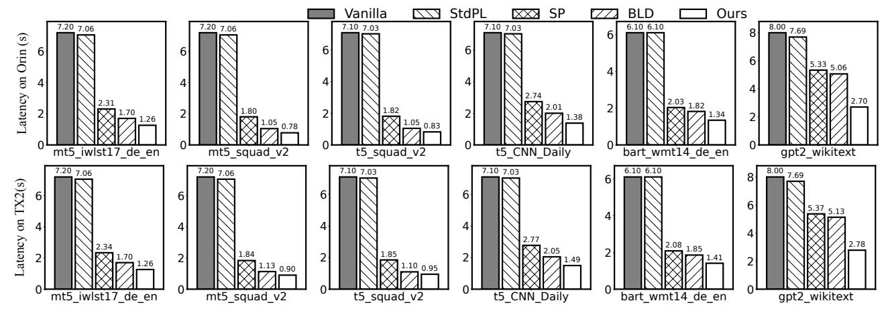

Figure 12: Average per-token generation latency of LLMCad and the baselines under different tasks on IoT devices.

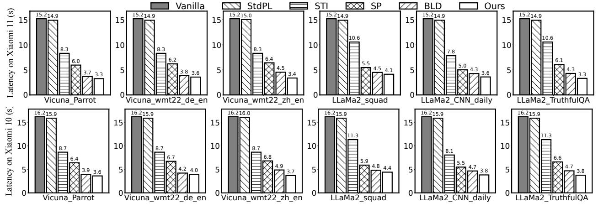

Figure 13: Average per-token inference latency of LLMCad and the baselines under different tasks on smartphones.

| Models-tasks-datasets             | Vanilla | StdPL | SP   | BLD  | Ours       |
|-----------------------------------|---------|-------|------|------|------------|
| mT5-translation IWLST17-DE->EN | 36.9    | 36.2  | 12.0 | 7.7  | 7.7 (4.8×) |
| T5-summary CNN/Daily           | 36.4    | 36.0  | 7.6  | 10.3 | 8.4 (4.3×) |
| T5-QA SQuAD                    | 36.9    | 36.5  | 15.4 | 9.9  | 4.6 (8.0×) |

(a) Jetson Orin NX

| Models-tasks-datasets                  | Vanilla | StdPL | STI  | SP   | BLD  | Ours        |
|----------------------------------------|---------|-------|------|------|------|-------------|
| LLaMa2-summarization CNN/Daily mail | 56.2    | 55.1  | 27.9 | 21.5 | 18.6 | 17.3 (3.2×) |
| LLaMa2-QA TruthfulQA                | 56.2    | 55.1  | 28.1 | 23.9 | 18.3 | 14.3 (3.9×) |
| Vicuna-translation WMT22-DE-EN      | 56.2    | 55.1  | 20.7 | 20.4 | 20.3 | 15.5 (3.6×) |

(b) Xiaomi 11

Table 5: The summary of the energy consumption (J) of different models across different devices.

Figure 14: The speedup of different baselines under different memory budgets.

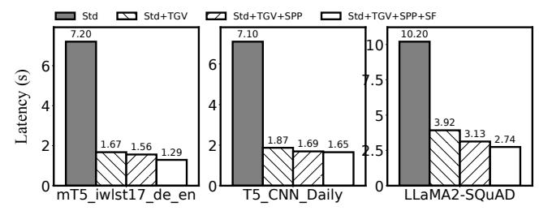

Figure 15: Ablation study of LLMCad.

speed gap between the memory-resident and target LLM is more significant, and delegating tokens to the memory-resident LLM can gain more benefits.

### 4.4 Energy Consumption Analysis

We then evaluate the energy consumption of LLMCad with mT5 and T5 models on IoT devices and Vicuana and LLaMa2 model on smartphones. As shown in Table 5, compared with Std, StdPL, SP and BLD, LLMCad reduces per-token energy consumption by 4.35–7.96, 4.34–7.92, 1.56–3.33, and 1.05–2.15× on Jetson Orin NX, LLMCad achieves a energy consumption reduction by 3.22–3.59, 3.18–3.56, 1.24–1.66, 1.07–1.31 and 2.01–2.56,× correspondingly on Xiaomi 11, plus STI. This is because LLMCad's two techniques can delegate as many tokens as possible to memory-resident LLM while not sacrificing accuracy.

Compared with the latency speedup, LLMCad's energy consumption is relatively lower. This situation arises because our speculative generation parallels the memory-resident and target LLM execution together, resulting in more energy consumption.

#### 4.5 Ablation Study

Overall techniques. We further conduct a breakdown analysis of the benefit brought by each of LLMCad's techniques. The experiments are performed with the mT5 and T5 models on TX2 and LLaMa2 on Xiaomi 10. The results are illustrated in Figure 15. The leftmost bar is the same as baseline Vanilla, while the leftmost one is LLMCad. The three crucial technique token tree generation and verification in §3.2, self-adaptive fallback strategy§3.3 and the speculate generation in §3.4 are represented by TGV, SF and SPP correspondingly.

We observe that all techniques make a non-trivial contribution to the improvement. First, tree non-autoregressive generationa and verification can delegete most token generations to the memory-resident LLM, leading to an 2.6-4.3 speedup for mT5, T5 and LLaMa2 models, respectively. The more benefits for mT5 model on IWLST translation dataset are because the mT5-Small model can generate more correct tokens than other two models so that more tokens can be delegated to the memory-resident LLM. Besides, speculative execution can reduce per-token generation time by up to 1.51×. That is because LLMCad can directly use the speculative results when the verification detects no error, especially true for LLaMA2 model. Lastly, Self-adaptive fallback strategy achieves a 1.08-1.20× speedup. This is achieved by leveraging tree-cumulative confidence to assess error probabilities and dynamically adjust verification timings in response to variations in task complexity.

#### 5 RELATED WORK

Model collaboration is a common optimization technique utilized to reduce inference latency [40, 70]. Its key idea is to delegate most of the workloads to lightweight models to reduce inference latency while maintaining relatively high accuracy. Tabi [70] is a multi-level inference engine that serves queries using various small models according to the queries difficulties. MobiSR [40] and NestDNN [24] employ the similar idea but depending on either resolutions or available resources. Other "early exit" works [60, 62, 73, 81], which propose adaptive exit timing relying on input data difficulties can also be regarded as a collaboration. However, they either focus on CNN/encoder-based model architectures or must modify and retrain the model, hardly fitting into on-device LLM inference. The most closely related works are speculative decoding [20, 37, 41, 48], which also employs smaller LLMs for text generation and larger LLMs for text verification. LLMCad is motivated by these works and is the first inference engine for on-device generative NLP tasks, considering mobile devices unique challenges like the memory-bound situation.

**Mobile ML optimization.** Machine learning optimization approaches, such as *model compression* [25, 26, 33, 50, 52, 68,

[76,](#page-14-12) [77\]](#page-14-19), reducing the model size by quantization and knowledge distillation, caching [\[69,](#page-14-20) [74,](#page-14-21) [80\]](#page-14-22), reducing computation by reusing existing results, and token pruning [\[16,](#page-12-20) [18,](#page-12-21) [38,](#page-13-29) [57,](#page-13-30) [66\]](#page-14-11), reducing computation by pruning useless tokens, have been extensively researched to reduce the generation latency. LLMCad is orthogonal to and compatible with those algorithm-level optimizations.

Besides, some of researchers focus on generate text in a non-autoregressive manner [\[35,](#page-13-31) [39\]](#page-13-32). However, these works can only apply to <1B models and have accuracy degradation problems, not the mainstream research direction.

Pipeline optimization for ML. Pipeline optimization has been extensively used to accelerate ML [\[13,](#page-12-22) [27,](#page-13-11) [49,](#page-13-33) [67,](#page-14-23) [82\]](#page-14-24). Most of them, such as PipeDream [\[49\]](#page-13-33), are utilized to scale out ML to multiple machines by pipelining forward/backward computation with activation/gradients synchronization to minimize bubbles of I/O and network communication. Still, there are some studies focusing on single machine/task optimization. For instance, PipeSwitch [\[13\]](#page-12-22) introduce pipelining model transmission over the PCIe and task execution in the GPU to reduce context switching performance overhead; while STI [\[27\]](#page-13-11) pipelines model shards loading with its computation to reduce inference latency. LLMCad is inspired by these efforts and propose an efficient speculative generation pipeline to address the challenge of I/O blocking and limited parallelism.

## 6 CONCLUSIONS

This work has proposed LLMCad, the first efficient inference engine for on-device generative NLP tasks. It breaks the memory wall and deliver LLM's scaling ability to mobile devices It incorporates three novel techniques, including: token tree generation and verification, Self-adaptive fallback strategy and speculative generation pipeline that can exploit the waste hardware resources during the verification process. Our experiments have demonstrated that when compared to the state-of-the-art LLM engines, LLMCad can reduce average per-token generation time by 2.9–9.3× and 3.5–4.7× on IoT devices and smartphones, without comprising accuracy.

## REFERENCES

- [1] Gboard - the Google Keyboard - Apps on Google Play play.google.com. [https://play.google.com/store/apps/details?id=com.](https://play.google.com/store/apps/details?id=com.google.android.inputmethod.latin&hl=en) [google.android.inputmethod.latin&hl=en.](https://play.google.com/store/apps/details?id=com.google.android.inputmethod.latin&hl=en) [Accessed 22-Jul-2023].
- [2] Google Translate - Apps on Google Play — play.google.com. [https://play.google.com/store/apps/details?id=com.google.android.](https://play.google.com/store/apps/details?id=com.google.android.apps.translate&hl=en_US) [apps.translate&hl=en\\_US.](https://play.google.com/store/apps/details?id=com.google.android.apps.translate&hl=en_US) [Accessed 22-Jul-2023].
- [3] iTranslate — itranslate.com. [https://itranslate.com/.](https://itranslate.com/) [Accessed 22-Jul-2023].
- [4] MNN. [https://github.com/alibaba/MNN.](https://github.com/alibaba/MNN) Accessed: [2023.7].
- [5] PyTorch. [https://pytorch.org/.](https://pytorch.org/) Accessed: [2023.7].
- [6] Siri — apple.com. [https://www.apple.com/siri/.](https://www.apple.com/siri/) [Accessed 22-Jul-2023].
- [7] TensorFlow. [https://vllm.ai/.](https://vllm.ai/) Accessed: [2023.7].

- [8] TensorFlow. [https://www.tensorflow.org/.](https://www.tensorflow.org/) Accessed: [2023.7].
- [9] TensorFlow. [https://huggingface.co/TheBloke.](https://huggingface.co/TheBloke) Accessed: [2023.7].
- [10] TensorFlow. [https://github.com/PanQiWei/AutoGPTQ.](https://github.com/PanQiWei/AutoGPTQ) Accessed: [2023.7].
- [11] Armen Aghajanyan, Lili Yu, Alexis Conneau, Wei-Ning Hsu, Karen Hambardzumyan, Susan Zhang, Stephen Roller, Naman Goyal, Omer Levy, and Luke Zettlemoyer. Scaling laws for generative mixed-modal language models. arXiv preprint arXiv:2301.03728, 2023.
- [12] Ibrahim M Alabdulmohsin, Behnam Neyshabur, and Xiaohua Zhai. Revisiting neural scaling laws in language and vision. Advances in Neural Information Processing Systems, 35:22300–22312, 2022.
- [13] Zhihao Bai, Zhen Zhang, Yibo Zhu, and Xin Jin. {PipeSwitch}: Fast pipelined context switching for deep learning applications. In 14th USENIX Symposium on Operating Systems Design and Implementation (OSDI 20), pages 499–514, 2020.
- [14] David Bau, Hendrik Strobelt, William Peebles, Jonas Wulff, Bolei Zhou, Jun-Yan Zhu, and Antonio Torralba. Semantic photo manipulation with a generative image prior. arXiv preprint arXiv:2005.07727, 2020.
- [15] Ondrej Bojar, Christian Buck, Christian Federmann, Barry Haddow, Philipp Koehn, Johannes Leveling, Christof Monz, Pavel Pecina, Matt Post, Herve Saint-Amand, Radu Soricut, Lucia Specia, and Ale s Tamchyna. Findings of the 2014 workshop on statistical machine translation. In Proceedings of the Ninth Workshop on Statistical Machine Translation, pages 12–58, Baltimore, Maryland, USA, June 2014. Association for Computational Linguistics.
- [16] Daniel Bolya, Cheng-Yang Fu, Xiaoliang Dai, Peizhao Zhang, Christoph Feichtenhofer, and Judy Hoffman. Token merging: Your vit but faster. arXiv preprint arXiv:2210.09461, 2022.
- [17] Tom Brown, Benjamin Mann, Nick Ryder, Melanie Subbiah, Jared D Kaplan, Prafulla Dhariwal, Arvind Neelakantan, Pranav Shyam, Girish Sastry, Amanda Askell, et al. Language models are few-shot learners. Advances in neural information processing systems, 33:1877– 1901, 2020.
- [18] Han Cai, Ji Lin, Yujun Lin, Zhijian Liu, Haotian Tang, Hanrui Wang, Ligeng Zhu, and Song Han. Enable deep learning on mobile devices: Methods, systems, and applications. ACM Transactions on Design Automation of Electronic Systems (TODAES), 27(3):1–50, 2022.
- [19] Mauro Cettolo, Marcello Federico, Luisa Bentivogli, Jan Niehues, Sebastian Stüker, Katsuhito Sudoh, Koichiro Yoshino, and Christian Federmann. Overview of the IWSLT 2017 evaluation campaign. In Proceedings of the 14th International Conference on Spoken Language Translation, pages 2–14, Tokyo, Japan, December 14-15 2017. International Workshop on Spoken Language Translation.
- [20] Charlie Chen, Sebastian Borgeaud, Geoffrey Irving, Jean-Baptiste Lespiau, Laurent Sifre, and John Jumper. Accelerating large language model decoding with speculative sampling. arXiv preprint arXiv:2302.01318, 2023.
- [21] Aidan Clark, Diego De Las Casas, Aurelia Guy, Arthur Mensch, Michela Paganini, Jordan Hoffmann, Bogdan Damoc, Blake Hechtman, Trevor Cai, Sebastian Borgeaud, et al. Unified scaling laws for routed language models. In International Conference on Machine Learning, pages 4057–4086. PMLR, 2022.
- [22] Karl Cobbe, Vineet Kosaraju, Mohammad Bavarian, Mark Chen, Heewoo Jun, Lukasz Kaiser, Matthias Plappert, Jerry Tworek, Jacob Hilton, Reiichiro Nakano, et al. Training verifiers to solve math word problems. arXiv preprint arXiv:2110.14168, 2021.
- [23] Zhengxiao Du, Yujie Qian, Xiao Liu, Ming Ding, Jiezhong Qiu, Zhilin Yang, and Jie Tang. Glm: General language model pretraining with autoregressive blank infilling. In Proceedings of the 60th Annual Meeting of the Association for Computational Linguistics (Volume 1: Long Papers), pages 320–335, 2022.

- [24] Biyi Fang, Xiao Zeng, and Mi Zhang. Nestdnn: Resource-aware multitenant on-device deep learning for continuous mobile vision. In Proceedings of the 24th Annual International Conference on Mobile Computing and Networking, pages 115–127, 2018.
- [25] Elias Frantar, Saleh Ashkboos, Torsten Hoefler, and Dan Alistarh. Gptq: Accurate post-training quantization for generative pre-trained transformers. arXiv preprint arXiv:2210.17323, 2022.
- [26] Hui Guan, Shaoshan Liu, Xiaolong Ma, Wei Niu, Bin Ren, Xipeng Shen, Yanzhi Wang, and Pu Zhao. Cocopie: Enabling real-time ai on off-the-shelf mobile devices via compression-compilation co-design. Communications of the ACM, 64(6):62–68, 2021.
- [27] Liwei Guo, Wonkyo Choe, and Felix Xiaozhu Lin. Sti: Turbocharge nlp inference at the edge via elastic pipelining. In Proceedings of the 28th ACM International Conference on Architectural Support for Programming Languages and Operating Systems, Volume 2, pages 791–803, 2023.
- [28] Ellen L. Hahne. Round-robin scheduling for max-min fairness in data networks. IEEE Journal on Selected Areas in communications, 9(7):1024–1039, 1991.
- [29] Rui Han, Qinglong Zhang, Chi Harold Liu, Guoren Wang, Jian Tang, and Lydia Y Chen. Legodnn: block-grained scaling of deep neural networks for mobile vision. In Proceedings of the 27th Annual International Conference on Mobile Computing and Networking, pages 406–419, 2021.
- [30] Dan Hendrycks, Collin Burns, Steven Basart, Andy Zou, Mantas Mazeika, Dawn Song, and Jacob Steinhardt. Measuring massive multitask language understanding. arXiv preprint arXiv:2009.03300, 2020.
- [31] Edward J Hu, Yelong Shen, Phillip Wallis, Zeyuan Allen-Zhu, Yuanzhi Li, Shean Wang, Lu Wang, and Weizhu Chen. Lora: Low-rank adaptation of large language models. arXiv preprint arXiv:2106.09685, 2021.
- [32] Chien-Chin Huang, Gu Jin, and Jinyang Li. Swapadvisor: Pushing deep learning beyond the gpu memory limit via smart swapping. In Proceedings of the Twenty-Fifth International Conference on Architectural Support for Programming Languages and Operating Systems, pages 1341–1355, 2020.
- [33] Loc N Huynh, Youngki Lee, and Rajesh Krishna Balan. Deepmon: Mobile gpu-based deep learning framework for continuous vision applications. In Proceedings of the 15th Annual International Conference on Mobile Systems, Applications, and Services, pages 82–95, 2017.
- [34] Jared Kaplan, Sam McCandlish, Tom Henighan, Tom B Brown, Benjamin Chess, Rewon Child, Scott Gray, Alec Radford, Jeffrey Wu, and Dario Amodei. Scaling laws for neural language models. arXiv preprint arXiv:2001.08361, 2020.
- [35] Jungo Kasai, Nikolaos Pappas, Hao Peng, James Cross, and Noah A Smith. Deep encoder, shallow decoder: Reevaluating nonautoregressive machine translation. arXiv preprint arXiv:2006.10369, 2020.
- [36] Sehoon Kim, Coleman Hooper, Thanakul Wattanawong, Minwoo Kang, Ruohan Yan, Hasan Genc, Grace Dinh, Qijing Huang, Kurt Keutzer, Michael W Mahoney, et al. Full stack optimization of transformer inference: a survey. arXiv preprint arXiv:2302.14017, 2023.
- [37] Sehoon Kim, Karttikeya Mangalam, Jitendra Malik, Michael W Mahoney, Amir Gholami, and Kurt Keutzer. Big little transformer decoder. arXiv preprint arXiv:2302.07863, 2023.
- [38] Sehoon Kim, Sheng Shen, David Thorsley, Amir Gholami, Woosuk Kwon, Joseph Hassoun, and Kurt Keutzer. Learned token pruning for transformers. In Proceedings of the 28th ACM SIGKDD Conference on Knowledge Discovery and Data Mining, pages 784–794, 2022.
- [39] Xiang Kong, Adithya Renduchintala, James Cross, Yuqing Tang, Jiatao Gu, and Xian Li. Multilingual neural machine translation with deep encoder and multiple shallow decoders. arXiv preprint arXiv:2206.02079, 2022.

- [40] Royson Lee, Stylianos I Venieris, Lukasz Dudziak, Sourav Bhattacharya, and Nicholas D Lane. Mobisr: Efficient on-device super-resolution through heterogeneous mobile processors. In The 25th annual international conference on mobile computing and networking, pages 1–16, 2019.
- [41] Yaniv Leviathan, Matan Kalman, and Yossi Matias. Fast inference from transformers via speculative decoding. In International Conference on Machine Learning, pages 19274–19286. PMLR, 2023.
- [42] Mike Lewis, Yinhan Liu, Naman Goyal, Marjan Ghazvininejad, Abdelrahman Mohamed, Omer Levy, Veselin Stoyanov, and Luke Zettlemoyer. BART: denoising sequence-to-sequence pre-training for natural language generation, translation, and comprehension. CoRR, abs/1910.13461, 2019.
- [43] Chin-Yew Lin. Rouge: A package for automatic evaluation of summaries. In Text summarization branches out, pages 74–81, 2004.
- [44] Stephanie Lin, Jacob Hilton, and Owain Evans. Truthfulqa: Measuring how models mimic human falsehoods, 2021.
- [45] llama.cpp. Port of Facebook's LLaMA model in C/C++ Resources. [https://github.com/ggerganov/llama.cpp,](https://github.com/ggerganov/llama.cpp) Year of publication. Accessed: [2023.7].
- [46] Chen Meng, Minmin Sun, Jun Yang, Minghui Qiu, and Yang Gu. Training deeper models by gpu memory optimization on tensorflow. In Proc. of ML Systems Workshop in NIPS, volume 7, 2017.
- [47] Stephen Merity, Caiming Xiong, James Bradbury, and Richard Socher. Pointer sentinel mixture models, 2016.
- [48] Xupeng Miao, Gabriele Oliaro, Zhihao Zhang, Xinhao Cheng, Zeyu Wang, Rae Ying Yee Wong, Zhuoming Chen, Daiyaan Arfeen, Reyna Abhyankar, and Zhihao Jia. Specinfer: Accelerating generative llm serving with speculative inference and token tree verification. arXiv preprint arXiv:2305.09781, 2023.
- [49] Deepak Narayanan, Aaron Harlap, Amar Phanishayee, Vivek Seshadri, Nikhil R Devanur, Gregory R Ganger, Phillip B Gibbons, and Matei Zaharia. Pipedream: Generalized pipeline parallelism for dnn training. In Proceedings of the 27th ACM Symposium on Operating Systems Principles, pages 1–15, 2019.
- [50] Wei Niu, Xiaolong Ma, Sheng Lin, Shihao Wang, Xuehai Qian, Xue Lin, Yanzhi Wang, and Bin Ren. Patdnn: Achieving real-time dnn execution on mobile devices with pattern-based weight pruning. In Proceedings of the Twenty-Fifth International Conference on Architectural Support for Programming Languages and Operating Systems, pages 907–922, 2020.
- [51] Roma Patel and Ellie Pavlick. Mapping language models to grounded conceptual spaces. In International Conference on Learning Representations, 2021.
- [52] Reiner Pope, Sholto Douglas, Aakanksha Chowdhery, Jacob Devlin, James Bradbury, Jonathan Heek, Kefan Xiao, Shivani Agrawal, and Jeff Dean. Efficiently scaling transformer inference. Proceedings of Machine Learning and Systems, 5, 2023.
- [53] Alec Radford, Karthik Narasimhan, Tim Salimans, Ilya Sutskever, et al. Improving language understanding by generative pre-training. 2018.
- [54] Alec Radford, Jeffrey Wu, Rewon Child, David Luan, Dario Amodei, Ilya Sutskever, et al. Language models are unsupervised multitask learners. OpenAI blog, 1(8):9, 2019.
- [55] Colin Raffel, Noam Shazeer, Adam Roberts, Katherine Lee, Sharan Narang, Michael Matena, Yanqi Zhou, Wei Li, and Peter J Liu. Exploring the limits of transfer learning with a unified text-to-text transformer. The Journal of Machine Learning Research, 21(1):5485–5551, 2020.
- [56] Pranav Rajpurkar, Jian Zhang, Konstantin Lopyrev, and Percy Liang. SQuAD: 100,000+ Questions for Machine Comprehension of Text. arXiv e-prints, page arXiv:1606.05250, 2016.
- [57] Yongming Rao, Wenliang Zhao, Benlin Liu, Jiwen Lu, Jie Zhou, and Cho-Jui Hsieh. Dynamicvit: Efficient vision transformers with dynamic

- token sparsification. Advances in neural information processing systems, 34:13937–13949, 2021.
- [58] Scott Reed, Zeynep Akata, Xinchen Yan, Lajanugen Logeswaran, Bernt Schiele, and Honglak Lee. Generative adversarial text to image synthesis. In International conference on machine learning, pages 1060–1069. PMLR, 2016.
- [59] Robin Rombach, Andreas Blattmann, Dominik Lorenz, Patrick Esser, and Björn Ommer. High-resolution image synthesis with latent diffusion models. In Proceedings of the IEEE/CVF conference on computer vision and pattern recognition, pages 10684–10695, 2022.
- [60] Tal Schuster, Adam Fisch, Jai Gupta, Mostafa Dehghani, Dara Bahri, Vinh Tran, Yi Tay, and Donald Metzler. Confident adaptive language modeling. Advancesin Neural Information Processing Systems, 35:17456–17472, 2022.
- [61] Abigail See, Peter J. Liu, and Christopher D. Manning. Get to the point: Summarization with pointer-generator networks. In Proceedings of the 55th Annual Meeting of the Association for Computational Linguistics (Volume 1: Long Papers), pages 1073–1083, Vancouver, Canada, July 2017. Association for Computational Linguistics.
- [62] Thierry Tambe, Coleman Hooper, Lillian Pentecost, Tianyu Jia, En-Yu Yang, Marco Donato, Victor Sanh, Paul Whatmough, Alexander M Rush, David Brooks, et al. Edgebert: Sentence-level energy optimizations for latency-aware multi-task nlp inference. In MICRO-54: 54th Annual IEEE/ACM International Symposium on Microarchitecture, pages 830–844, 2021.
- [63] FP Team. Generative AI: Advantages, Disadvantages, Limitations, and Challenges — fact.technology. [https://fact.technology/learn/](https://fact.technology/learn/generative-ai-advantages-limitations-and-challenges/) [generative-ai-advantages-limitations-and-challenges/.](https://fact.technology/learn/generative-ai-advantages-limitations-and-challenges/) [Accessed 22- Jul-2023].
- [64] Hugo Touvron, Thibaut Lavril, Gautier Izacard, Xavier Martinet, Marie-Anne Lachaux, Timothée Lacroix, Baptiste Rozière, Naman Goyal, Eric Hambro, Faisal Azhar, et al. Llama: Open and efficient foundation language models. arXiv preprint arXiv:2302.13971, 2023.
- [65] Ashish Vaswani, Noam Shazeer, Niki Parmar, Jakob Uszkoreit, Llion Jones, Aidan N Gomez, Łukasz Kaiser, and Illia Polosukhin. Attention is all you need. Advances in neural information processing systems, 30, 2017.
- [66] Hanrui Wang, Zhekai Zhang, and Song Han. Spatten: Efficient sparse attention architecture with cascade token and head pruning. In 2021 IEEE International Symposium on High-Performance Computer Architecture (HPCA), pages 97–110. IEEE, 2021.
- [67] Shibo Wang, Jinliang Wei, Amit Sabne, Andy Davis, Berkin Ilbeyi, Blake Hechtman, Dehao Chen, Karthik Srinivasa Murthy, Marcello Maggioni, Qiao Zhang, et al. Overlap communication with dependent computation via decomposition in large deep learning models. In Proceedings of the 28th ACM International Conference on Architectural Support for Programming Languages and Operating Systems, Volume 1, pages 93–106, 2022.
- [68] Wenhui Wang, Furu Wei, Li Dong, Hangbo Bao, Nan Yang, and Ming Zhou. Minilm: Deep self-attention distillation for task-agnostic compression of pre-trained transformers. Advances in Neural Information Processing Systems, 33:5776–5788, 2020.
- [69] Xiaofei Wang, Yiwen Han, Victor CM Leung, Dusit Niyato, Xueqiang Yan, and Xu Chen. Convergence of edge computing and deep learning: A comprehensive survey. IEEE Communications Surveys & Tutorials, 22(2):869–904, 2020.
- [70] Yiding Wang, Kai Chen, Haisheng Tan, and Kun Guo. Tabi: An efficient multi-level inference system for large language models. In Proceedings of the Eighteenth European Conference on Computer Systems, pages 233–248, 2023.
- [71] Jason Wei, Yi Tay, Rishi Bommasani, Colin Raffel, Barret Zoph, Sebastian Borgeaud, Dani Yogatama, Maarten Bosma, Denny Zhou, Donald

- Metzler, et al. Emergent abilities of large language models. arXiv preprint arXiv:2206.07682, 2022.
- [72] Jason Wei, Xuezhi Wang, Dale Schuurmans, Maarten Bosma, Fei Xia, Ed Chi, Quoc V Le, Denny Zhou, et al. Chain-of-thought prompting elicits reasoning in large language models. Advances in Neural Information Processing Systems, 35:24824–24837, 2022.
- [73] Ji Xin, Raphael Tang, Jaejun Lee, Yaoliang Yu, and Jimmy Lin. Deebert: Dynamic early exiting for accelerating bert inference. arXiv preprint arXiv:2004.12993, 2020.
- [74] Mengwei Xu, Mengze Zhu, Yunxin Liu, Felix Xiaozhu Lin, and Xuanzhe Liu. Deepcache: Principled cache for mobile deep vision. In Proceedings of the 24th annual international conference on mobile computing and networking, pages 129–144, 2018.
- [75] Linting Xue, Noah Constant, Adam Roberts, Mihir Kale, Rami Al-Rfou, Aditya Siddhant, Aditya Barua, and Colin Raffel. mt5: A massively multilingual pre-trained text-to-text transformer. arXiv preprint arXiv:2010.11934, 2020.
- [76] Zhewei Yao, Reza Yazdani Aminabadi, Minjia Zhang, Xiaoxia Wu, Conglong Li, and Yuxiong He. Zeroquant: Efficient and affordable post-training quantization for large-scale transformers. Advances in Neural Information Processing Systems, 35:27168–27183, 2022.
- [77] Zhao You, Shulin Feng, Dan Su, and Dong Yu. Speechmoe2: Mixtureof-experts model with improved routing. In ICASSP 2022-2022 IEEE International Conference on Acoustics, Speech and Signal Processing (ICASSP), pages 7217–7221. IEEE, 2022.
- [78] Gyeong-In Yu, Joo Seong Jeong, Geon-Woo Kim, Soojeong Kim, and Byung-Gon Chun. Orca: A distributed serving system for {Transformer-Based} generative models. In 16th USENIX Symposium on Operating Systems Design and Implementation (OSDI 22), pages 521–538, 2022.
- [79] Aohan Zeng, Xiao Liu, Zhengxiao Du, Zihan Wang, Hanyu Lai, Ming Ding, Zhuoyi Yang, Yifan Xu, Wendi Zheng, Xiao Xia, et al. Glm-130b: An open bilingual pre-trained model. arXiv preprint arXiv:2210.02414, 2022.
- [80] Wuyang Zhang, Zhezhi He, Luyang Liu, Zhenhua Jia, Yunxin Liu, Marco Gruteser, Dipankar Raychaudhuri, and Yanyong Zhang. Elf: accelerate high-resolution mobile deep vision with content-aware parallel offloading. In Proceedings of the 27th Annual International Conference on Mobile Computing and Networking, pages 201–214, 2021.
- [81] Wangchunshu Zhou, Canwen Xu, Tao Ge, Julian McAuley, Ke Xu, and Furu Wei. Bert loses patience: Fast and robust inference with early exit. Advances in Neural Information Processing Systems, 33:18330–18341, 2020.
- [82] Zhe Zhou, Xuechao Wei, Jiejing Zhang, and Guangyu Sun. {PetS}: A unified framework for {Parameter-Efficient} transformers serving. In 2022 USENIX Annual Technical Conference (USENIX ATC 22), pages 489–504, 2022.