# Accelerating Mobile Language Model via Speculative Decoding and NPU-Coordinated Execution

[Zhiyang Chen](https://orcid.org/0009-0006-8607-8539) Peking University Beijing, China zhiyangchen@stu.pku.edu.cn

[Mengwei Xu](https://orcid.org/) Beijing University of Posts and Telecommunications Beijing, China mwx@bupt.edu.cn

[Daliang Xu](https://orcid.org/)∗ Beijing University of Posts and Telecommunications Beijing, China xudaliang@bupt.edu.cn

[Shangguang Wang](https://orcid.org/) Beijing University of Posts and Telecommunications Beijing, China sgwang@bupt.edu.cn

[Haiyang Shen](https://orcid.org/0009-0000-4599-3198) Peking University Beijing, China hyshen@stu.pku.edu.cn

> [Yun Ma](https://orcid.org/0000-0001-7866-4075)∗ Peking University Beijing, China mayun@pku.edu.cn

### Abstract

Enhancing on-device large language models (LLMs) with contextual information from local data enables personalized and task-aware generation, powering use cases such as intelligent assistants and UI agents. While recent developments in neural processors have substantially improved the efficiency of prefill on mobile devices, the token-by-token generation process still suffers from high latency and limited hardware utilization due to its inherently memory-bound characteristics. This work presents sd.npu, a mobile inference framework that integrates speculative decoding with dynamic hardware scheduling to accelerate context-aware text generation on mobile devices. The framework introduces three synergistic components: (1) adaptive execution scheduling, which dynamically balances compute graphs between prefill and decoding phases; (2) context-aligned drafting, which improves speculative efficiency through lightweight online calibration to current tasks; and (3) hardware-efficient draft extension, which reuses and expands intermediate sequences to improve processing parallelism and reduce verification cost. Experiments on multiple smartphones and representative workloads show consistent improvements of up to 3.8× in generation speed and 4.7× in energy efficiency compared with existing mobile inference solutions. Component-level analysis further validates the contribution of each optimization.

### 1 Introduction

Recent advances in large language models (LLMs) [\[6,](#page-12-0) [20,](#page-12-1) [46,](#page-13-0) [63\]](#page-14-0), rising concerns over privacy, and rapid progress in hardware have fueled interest in on-device LLM. In particular, the integration of neural processing units (NPUs) [\[50,](#page-13-1) [52\]](#page-13-2) makes it feasible to run LLMs directly on mobile devices [\[2,](#page-12-2) [17,](#page-12-3) [25,](#page-12-4)

∗Corresponding authors.

[55\]](#page-13-3), enabling applications such as voice assistants and UI automation [\[1,](#page-12-5) [3,](#page-12-6) [30,](#page-13-4) [69\]](#page-14-1). To extend LLMs' capabilities in handling complex tasks,context-augmented generation (CAG) has emerged as a key technique [\[48,](#page-13-5) [67\]](#page-14-2). As shown in Figure [1,](#page-1-0) CAG augments a user's query with task-relevant contexts before inference to strengthen the knowledge grounding of LLM. With CAG, LLMs can, for example, summarize documents using user-uploaded files, generate responses by retrieving and integrating information from the chat history, and act as UI agents by reasoning over current UI screenshots captured from the operating system, significantly expanding their functionality.

Despite these benefits, on-device CAG still has high end-toend latency, primarily from decoding (accounting for 73.5% of total inference, details in Section [2.1\)](#page-2-0). When diving into the reasons, we find that the prefill bottleneck is largely eliminated by NPU-based chunked prefill [\[11,](#page-12-7) [75,](#page-14-3) [77\]](#page-14-4) (only 2 s for 1–2K tokens context). In contrast, the decoding stage remains memory-bound, a scenario poorly suited for NPUs. Therefore, most existing work resorts to CPU execution, leading to high latency. Motivated by the NPU's superior energy efficiency and lower contention, this paper raises the question whether NPUs can be effectively utilized to accelerate the decoding stage.

To address this issue, we observe that CAG outputs exhibit strong similarity to both the interaction history and the augmented context (Section [2.2\)](#page-3-0), making them well-suited for retrieval-based speculative decoding (R-SD), a technique originally developed for code generation, and in turn, to NPU acceleration. In many CAG tasks, generated content is semantically close to previously produced tokens and to the augmented context: for example, summarization and automated email reply often reuse spans from user-uploaded documents or earlier emails, while UI agents repeatedly emit

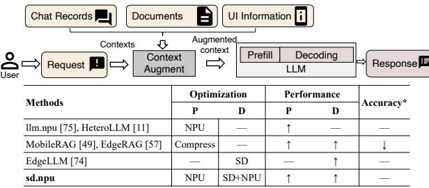

\* Methods with NPU offloading show lower accuracy than the original models due to quantization. This degradation is not caused by the methods themselves, so we mark them as lossless.

Figure 1: Workflow of context-augmented generation and comparison between **sd.npu** and related work

fixed commands (e.g., "click set clock button"). These characteristics align naturally with R-SD, which proceeds in two stages: (1) drafting, where a retriever proposes candidate token sequences by selecting similar fragments from the augmented context or a local store (e.g., a code repository); and (2) verifying, where the LLM compares these drafts against its own next-token predictions and corrects discrepancies (see Section [2.2\)](#page-3-0). By evaluating multiple drafts in parallel, R-SD shifts decoding from a memory-bound to a compute-bound workload, making it a strong fit for NPU acceleration.

In this paper, we present sd.npu, the first system to enable retrieval-based speculative decoding for efficient on-device CAG through end-to-end on-chip NPU offloading. During prefill, sd.npu employs chunked prefill-based NPU inference like existing approaches [\[11,](#page-12-7) [75\]](#page-14-3); during decoding, it dynamically switches to a compute graph optimized for decoding, performing retrieval-driven drafting and parallel verification. Designing sd.npu requires addressing the following three unique challenges of aligning retrieval-based speculative decoding with NPUs, which prior work has not explored:

- NPU execution: costly switching overhead for distinct prefill and decoding optimal compute graphs. Prefill favors largeshape graphs with long sequence inputs which degrade decoding performance, while decoding benefits from smallshape graphs that underperform for prefill. Since the NPU only supports inference on static shapes, achieving optimal end-to-end performance thus requires switching between prefill-optimal and decoding-optimal compute graphs, incurring a significant performance overhead. For instance, our preliminary evaluation on Qwen2.5-1.5B model shows this switching overhead incurs a 94.9% delay of end-to-end latency.
- Draft construction: task context and LLM outputs follow different lexical distributions, yielding a low acceptance ratio. In R-SD, the LLM only accepts tokens that exactly match its own prediction. Our preliminary evaluation shows that drafts constructed from the task context often have high semantic similarity to the target output yet exhibit notable

lexical gaps (e.g., normalized Levenshtein distance > 0.11 for Qwen2.5-1.5B). As a result, LLM often accepts only few tokens per draft, falling back to token-by-token decoding and underscoring the need for lexical distribution calibration.

• Draft verification: short or absent drafts fail to saturate NPU computation. Mobile NPUs excel at processing large batches or long sequences due to their weight-stationary design where short inputs obtain fewer benefits [\[11,](#page-12-7) [27\]](#page-13-6). However, due to strict suffix-matching, existing R-SD methods often generate only a few candidate tokens or none at all. Such short sequences cannot fully exploit the NPU's weightstationary design, resulting in low verification throughput. For example, our experiments show that over 75% of the drafts fall below length 8, which is far below the verificationoptimal length (64) and leads to 50% lower throughput.

To address these challenges, we propose three techniques: • Progressive Graph Scheduling (Section [3.2\)](#page-5-0). sd.npu deploys two specialized graphs and switches between them asynchronously to minimize overhead. The LLM is partitioned into blocks. During each round of chunked prefill, we switch to a decoding-optimized block graph while prefill computation continues in parallel. The switched decoding graph is invoked multiple times within the prefill stage to ensure result correctness. This design rests on two observations: (i) executing short-input graphs multiple times is equivalent to a single long-input execution, and (ii) graph loading can be overlapped with one-round chunked prefill computation. Consequently, sd.npu can transition to the decoding graph without additional load overhead, yielding a negligible graph-switching cost.

- In-Context Distribution Calibration (Section [3.3\)](#page-6-0). Motivated by the observation that, during prefill, the model computes next-token logits for each context token that already align with its output distribution, sd.npu uses these logits to calibrate the task context by constructing a modeldistributed token tree via depth-first search. In the subsequent retrieval-based drafting stage, sd.npu retrieves from this calibrated tree to mitigate lexical divergence between the context and the model's expectations. Compared with costly precomputation or task-specific fine-tuning, this lightweight procedure incurs negligible overhead.
- NPU-Optimized Draft Reuse (Section [3.4\)](#page-7-0). sd.npu extends draft construction by selectively reusing plausible tokens from previously rejected drafts based on a confidencebased strategy. This is motivated by the observation that rejected tokens may still capture correct semantics and be accepted in later decoding steps. By reusing such tokens, sd.npu increases effective draft length with useful content, improving NPU utilization and reducing verification costs.

sd.npu is implemented atop mllm [\[75\]](#page-14-3), an open-source mobile LLM inference framework with NPU offloading support. We conduct extensive experiments on three devices

(Redmi K60 Pro, Redmi K70 Pro and OnePlus 13), four datasets (summarization, RAG-based question answering, UI automation and auto-reply [\[54,](#page-13-7) [72,](#page-14-5) [73\]](#page-14-6)), and three LLMs (Qwen2.5- 1.5B-Instruct, Qwen2.5-0.5B-Instruct, LLaMA3.2-3B-Instruct [\[18,](#page-12-8) [53\]](#page-13-8)). Results show that sd.npu achieves 1.06–3.81× endto-end speedup over the vanilla framework and 1.09–2.53× over frameworks integrated with existing SD algorithms. In terms of energy efficiency, sd.npu reduces consumption by 1.11–4.18× and 1.07–4.71×, respectively. Overhead analysis, latency breakdown, and ablation studies further validate the effectiveness of our proposed techniques.

Our contributions are summarized as follows:

- We present the first study of inefficiencies in context-aware generation for mobile tasks, identifying key optimization opportunities of using retrieval-based speculative decoding.
- We design and implement sd.npu, an efficient NPU-optimized on-device context-augmented generation framework with three novel techniques, bridging the gap between retrievalbased speculative decoding and NPU offloading.
- We conduct comprehensive evaluations across four datasets, three smartphones, and three LLMs, demonstrating that sd.npu delivers consistent and significant performance gains in diverse mobile scenarios.

### 2 Background

## 2.1 On-device Context-Augmented Generation for Mobile Task

Context-augmented generation. With the rapid development of LLMs and increasing demands for privacy protection, there is a growing trend of deploying large models on mobile devices [\[5,](#page-12-9) [14,](#page-12-10) [29,](#page-13-9) [45,](#page-13-10) [64\]](#page-14-7). An emerging paradigm, contextaugmented generation, leverages both the long-context capability of LLMs and the abundance of private on-device data, showing strong potential for supporting complex tasks such as personal assistant and UI automation [\[48,](#page-13-5) [49,](#page-13-11) [67\]](#page-14-2). Typically, context-augmented generation first exploits additional information, either directly provided by the user or retrieved from relevant sources, to enrich the prompt with task-specific contexts. Then, the normal LLM inference procedure is executed, including prefill and decoding stages. The enriched prompt can alleviate the limitations of the model's built-in knowledge and enable it to handle a wider range of concrete tasks. For instance, in a summarization task, the user may supply a meeting transcript as context, and the LLM directly generates a concise summary from it. In another case, a personalized assistant retrieves a user's past chat records to draft a reply in the user's typical style, where the retrieved records provide the key context for generation. LLMs on NPUs. As modern mobile SoCs increasingly integrate high-performance NPUs (Table [1\)](#page-2-1), recent mobile LLM

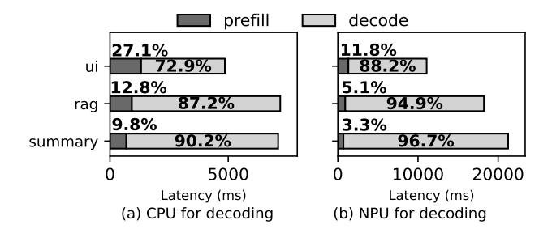

Figure 2: Comparison of prefill and decoding latency for several CAG tasks. Task details are provided in Section [4.1.](#page-8-0)

Table 1: Specifications of representative mobile NPUs.

| Vendor   | SoC        | NPU           | Perf. (Tops) |
|----------|------------|---------------|--------------|
| Qualcomm | 8 Gen 3    | Hexagon NPU   | 73           |
| Apple    | A18        | Neural Engine | 35           |
| MediaTek | K9300      | APU 790       | 60           |
| Huawei   | Kirin-9000 | Ascend NPU    | 16           |

Perf. = INT8 Performance in Tops.

frameworks aim to offload LLM inference onto NPUs to improve efficiency. In practice, NPUs are mainly used for the prefill stage, which benefits from their high throughput on long input sequences, while decoding is still executed on CPUs or GPUs [\[11,](#page-12-7) [75,](#page-14-3) [77\]](#page-14-4). Our experiments reveal that mobile CAG still suffers from high latency under this design, with decoding dominating end-to-end performance. For example, for Qwen2.5-1.5B [\[53\]](#page-13-8) running on a OnePlus 13, decoding accounts for 90.2% of latency in question answering (QA) tasks and 87.2% in summarization, even when prefill runs at over 1000 tokens/s [\[75\]](#page-14-3) (Figure [2\)](#page-2-2). Simply offloading decoding to the NPU provides no advantage over CPU execution and often increases overall latency, as decoding is inherently memory-bound, processing one token at a time and leaving the NPU underutilized.

These findings are closely tied to the architectural characteristics of mobile NPUs. First, their systolic-array with weight-stationary design excels at long input sequences: weights are preloaded once and reused across tokens, greatly reducing memory traffic. This property aligns naturally with the prefill stage, which requires lots of computation over long prompts. Second, NPUs rely on static compute graphs with precompiled execution plans, where operator arrangements and tensor shapes are fixed in advance for efficiency. Naively reusing prefill-optimized graphs for decoding leads to severe inefficiencies. As a result, while NPUs eliminate prefill bottlenecks, they bring little benefit to decoding, which thus

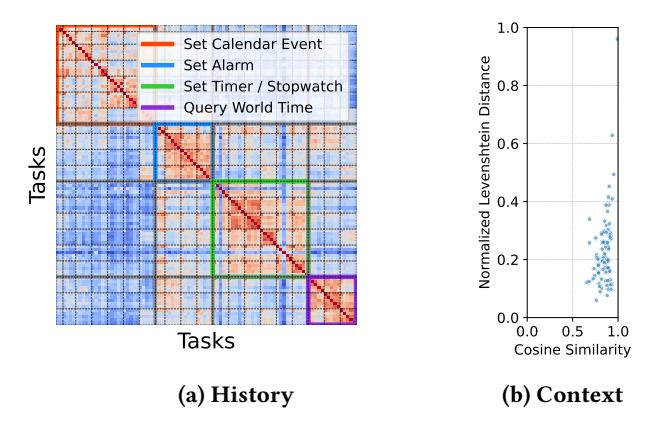

Figure 3: Demonstration of similarities in contextaugmented generation.

remains the dominant source of latency and energy consumption in on-device CAG.

# 2.2 Opportunity: Retrieval-based Speculative Decoding

A key observation is that CAG naturally inherits similarity from the request or the augmented context, making it well-suited for *retrieval-based speculative decoding* [22, 24, 56, 59], an acceleration technique exploiting similarity between contexts and outputs. We find that mobile CAG tasks exhibit the same property, offering strong opportunities for acceleration via R-SD.

- History similarity in similar tasks: outputs from similar tasks resemble previous generations because their contexts are similar. For example, a UI automation agent often repeats commands like clicking the same button. Our evaluation on four UI automation task groups [69] with Qwen2.5-1.5B [53] confirms this (Figure 3a): predictions within the same task show the highest semantic similarity (0.72), those within the same group moderate similarity (0.61), and across groups low similarity (0.38). Cosine similarity is computed using embeddings from all-MiniLM-L6-v2 [66].
- Context similarity at semantic level: Outputs align with the enriched context, which often includes direct clues for response [48, 49, 67]. For instance, assistants answering QA queries frequently extract information from documents. On a summarization dataset [72] with Qwen2.5-1.5B, we compute semantic similarity between context and predictions (via cosine similarity) and lexical overlap (via Levenshtein distance). Figure 3b shows that 90% of samples exhibit high semantic similarity (> 0.76) but low lexical overlap (> 0.11), reflecting a stylistic gap between context and outputs.

R-SD exploits these similarities through two stages (Figure 4): (1) retrieval-based drafting, where relevant fragments

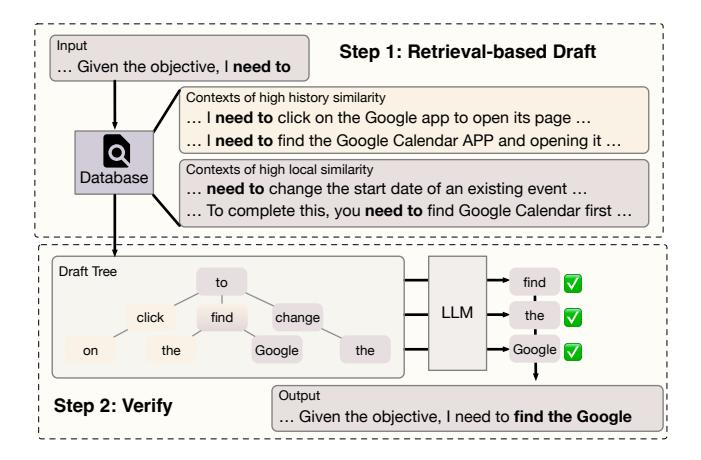

Figure 4: Workflow of retrieval-based speculative decoding.

are retrieved from history or context to draft candidate sequences. For example, tokens "need to" may retrieve drafts such as "click on" and "find the"; (2) verifying, where the LLM validates these candidates in parallel, accepting matches and discarding mismatches to guarantee correctness [31]. In the example where model expects "find the", mismatched drafts like "click on" are discarded while the matched draft is accepted, extending the output to "find the Google". The similarities in mobile CAG tasks offer promising draft candidates, enabling R-SD to efficiently generate multiple tokens in parallel. R-SD thus substantially raises the computation-to-memory ratio, shifting decoding from memory-bound to compute-bound where NPU excels.

Parallel to retrieval-based methods, *model-based speculative decoding (M-SD)* (e.g., EAGLE [36, 37], Medusa [7]) trains auxiliary draft models to generate candidates, incurring extra training, storage, and inference overheads. R-SD avoids retraining by directly using contextual information of high similarity, achieving draft latencies under 10ms [24]. Therefore, R-SD is more suitable for resource-constrained devices while M-SD suffers from higher latency, as shown in our evaluations (Section 4.2).

# 2.3 Challenges: Aligning Retrieval-based Speculative Decoding with NPU

Although R-SD offers a promising approach to accelerate CAG with NPU offloading, integrating it with NPU offloading poses several challenges.

• NPU execution: static compute graph design hinders performance improvement for both prefill and decoding. Static compute graph constraints fixed input and output tensor shapes during execution. To support variable-length sequences in LLM inference, existing systems adopt

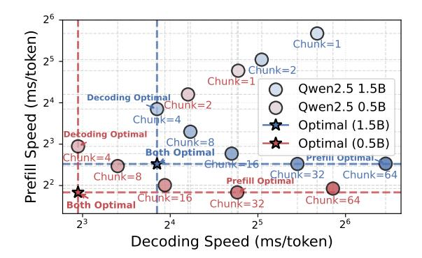

Figure 5: Trade-off between prefill and decoding with fixed-size compute graphs, highlighting the importance to deploy specialized graphs for each stage.

a chunking strategy, i.e., splitting inputs into fixed-size segments [11, 75]. However, a unified chunk size for both prefill and decoding yields suboptimal performance. Figure 5 compares prefill and speculative decoding speed using different compute graphs on a Redmi K70 Pro smartphone, with a fixed acceptance ratio of 4.2 (based on evaluation results, see Section 4.5). Results show that compute graphs with larger chunk size improve prefill throughput but hurt decoding performance. For instance, despite a fast prefill speed (<8 ms/token) of Qwen2.5 1.5B using graph with chunk size 32, the decoding speed using the same graph drops to about 160 ms/token. This tradeoff necessitates specialized compute graphs to improve performance for both prefill and decoding. However, on resource-constrained devices, naively maintaining multiple graphs in memory is costly, highlighting the needs of lightweight graph scheduling algorithms.

- Draft construction: divergence between task context and LLM output reduces the efficiency of speculative decoding. As discussed in Section 2.1, contexts and predictions often exhibit lexical gaps (i.e., normalized Levenshtein distance > 0.11). These gaps result in frequent rejection of retrieved drafts, despite their success in capturing the similar semantics as LLM. This degrades decoding to a token-bytoken process where NPUs offer little speedup due to underutilization. Lexical gaps arise from divergence between the task context and the LLM's distribution, necessitating alignment of the two distributions.
- Draft verification: existing R-SD methods underutilize NPUs' weight-stationary design due to drafting short sequences. The design of mobile NPUs, while ideal for compute-intensive operations such as prefill, is less effective when input sequences become short in the decoding stage. Existing R-SD methods perform retrieval by strict suffix matching between context and output [22, 24, 59], which

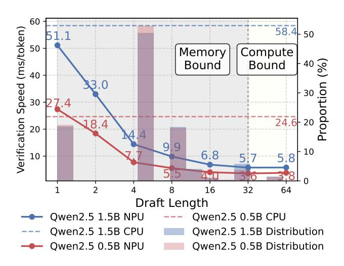

Figure 6: Comparison of verification speed with different draft lengths, and the length distribution of drafts generated by existing R-SD method [56] (histogram).

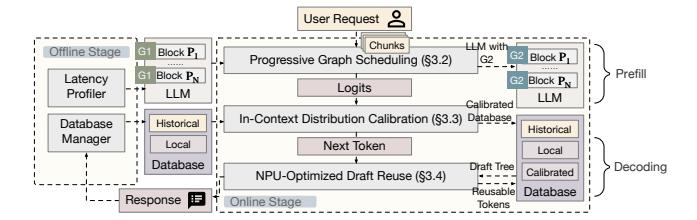

Figure 7: Overview of sd.npu framework.

frequently results in short or empty drafts. Figure 6 demonstrates the influence of draft length on verification speed and the length distribution of generated draft on a summarization dataset [72] . Results show that over 90% of drafts fall below the NPU-unfriendly length, significantly reducing the verification speed as NPU computing capacity is underutilized. This results in a similar speed to CPU (shown in the horizontal line). For instance, the verification speed of Qwen2.5 1.5B drops from 5.7 ms/token to 51.1 ms/token when the draft length decreases from 32 to 1.

## 3 Methodology

#### 3.1 Overview

**Design goal.** sd. npu accelerates context-augmented generation by NPU-optimized retrieval-based speculative decoding. This entails (1) deploying and scheduling two compute graphs optimized for prefill and decoding, (2) aligning task context with LLM distribution, and (3) enriching drafts with sufficient high-value tokens to fully utilize NPU resources. **Workflow.** Figure 7 illustrates the system architecture and workflow of sd.npu.

- Offline stage. sd. npu partitions the LLM into multiple blocks, each containing several transformer layers. It profiles the load and compute latency of each block through warm-up to determine scheduling strategy.
- Online stage. Upon receiving a request, sd. npu fetches task-relevant database and performs prefill using a SOTA chunk-based approach [11, 75], splitting the input into chunks processed by a long-sequence optimized graph. During prefill, progressive graph scheduling (Section 3.2) incrementally switches the prefill-optimized graph to the decoding-optimized graph with load overlapped by computation. After prefill, output logits are used for incontext distribution calibration (Section 3.3), augmenting the database with calibrated contexts. sd. npu then performs retrieval-based speculative decoding using the decoding-optimized graph and the calibrated database. It iteratively constructs a drafting tree and verifies it via a confidence-based strategy to identify and reuse valuable tokens (Section 3.4). After an end-of-sequence token is predicted, the final response is returned and stored in the database manager as a historical context for future requests.

**Key techniques.** sd.npu incorporates three techniques to align retrieval-based speculative decoding with NPU offloading:

- **Progressive NPU graph scheduling** (Section 3.2) enables asynchronous graph switching by overlapping load and computation across chunked prefill rounds.
- In-context distribution calibration (Section 3.3) aligns task context with model expectations using prefill logits.
- NPU-optimized draft reuse (Section 3.4) maximizes NPU utilization and reduces verification costs by reusing plausible tokens from rejected drafts.

#### 3.2 Progressive Graph Scheduling

Challenges of fixed-shape compute graphs. As discussed in Section 2.3, mobile NPUs require fixed-shape compute graphs, forcing the prefill input to be chunked for variable-length requests. This constraint also forces prefill and decoding to share the same graph despite their distinct input patterns: prefill processes long sequences (e.g., chunk size 256), while decoding handles short inputs (e.g., chunk size 32). Using a unified graph thus leads to inefficiency. To address this, we consider two specialized graphs:  $G^1$  optimized for prefill and  $G^2$  optimized for decoding. We denote the computation latency of a forward pass of model P on graph  $G^x$  ( $x \in \{1,2\}$ ) as  $T_{\text{compute}}(P; G^x)$ .

Enabling two graphs on NPUs raises two problems: (1) keeping two graphs in the memory for high efficiency incurs a significant memory overhead. Although  $G^1$  and  $G^2$  share the same weights, the NPU cannot reuse them across graphs for

efficiency reasons, resulting in a redundant  $2 \times$  memory footprint; otherwise, (2) dynamically loading the decoding graph after prefill stage completes saves memory, but incurs a significant performance overhead (Figure 8b①). This synchronous loading approach delays decoding by load time  $T_{load}(P; G^2)$ . To address this, an intuitive idea is asynchronous loading, where the model P is partitioned into N blocks  $\{P_1, \ldots, P_N\}$  and  $G^2$  is loaded block-by-block after computing finishes (Figure 8b②). Yet this is suboptimal because: (i) prefill input is chunked, so  $G^1$  can only switch after the last chunk; and (ii) load time  $T_{load}(P_i; G^2)$  may exceed compute time  $T_{compute}(P_i; G^x)$ , leaving no effective overlap.

**Switching graph progressively.** sd. npu gradually switches  $G^1$  to  $G^2$  during prefill. The design builds on two insights:

- Graph equivalence by repetition: executing  $G^2$  multiple times on shorter inputs yields the same result as one execution of  $G^1$  on longer inputs, allowing early switching. As sd.npu maximizes draft lengths (Section 3.4),  $G^2$  will not be too short (e.g., chunk/2 or chunk/4 of  $G^1$ ), which will not incur much performance degradation.
- Chunk-level scheduling: multiple block computation can be overlapped with a single block loading.

Figure 8 illustrates progressive scheduling with N=6 and two input chunks. We suppose that sd. npu decides to overlap loading a block by two blocks of computation based on the profiling results. Initially, all blocks are loaded with  $G^1$ . sd. npu computes  $P_1$ ,  $P_2$  with  $G^1$  while loading  $G^2$  for  $P_6$ . Then  $P_3$ ,  $P_4$  execute while  $G^2$  loads for  $P_5$ . To compute  $P_5$ ,  $P_6$  under  $G^2$ , chunk 1 is split into sub-chunks matching  $G^2$ 's shape, with  $G^2$  executed repeatedly. Prefill of chunk 1 finishes with output logits while half of the model is switched. The same procedure applies to chunk 2. In contrast, synchronous loading waits for all compute to finish, and naive asynchronous loading only overlaps in chunk 2, both incurring higher latency (Figure 8b).

**Problem Formulation.** Formally, given N model blocks that sequentially execute prefill for C chunks, sd. npu aims to determine the time to load each block, i.e., choosing blocks  $\{P_i, \ldots\}$  to overlap load overhead of  $P_j$  by their computations at each compute-load round. The objective is to minimize the overall latency, which is equal to the maximum of the prefill completion time and the switch completion time.

**Scheduling methodology.** This scheduling problem is NP-hard as it is essentially equivalent to the *2-Partition* problem [28] (proofed in Appendix A). sd. npu addresses this via a greedy algorithm, choosing the least k consecutive blocks  $\{P_i, \ldots, P_{i+k-1}\}$  that overlap a block load to execute. This strategy enables fully masking the load overhead by computation to minimize switching overhead. sd. npu finds the smallest k by estimating  $\widehat{T}_{load}(P_j; G^2)$  and  $\widehat{T}_{compute}(P_i; G_i^x)$  based on the profiling results. To hide load latency, the sum

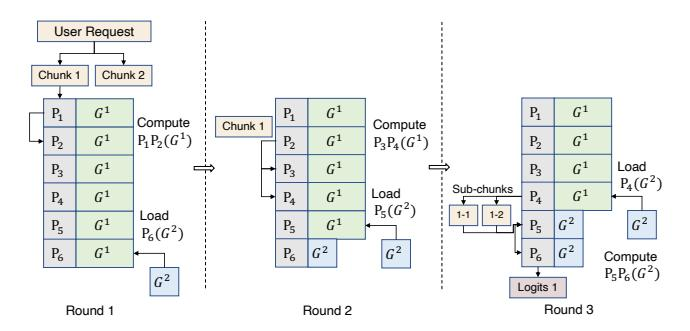

(a) Progressive switching overlaps  $G^2$  loading with computation across blocks.

(b) sd.npu (3) hides load latency compared to synchronous (1) and naive asynchronous (2) scheduling.

Figure 8: Progressive graph scheduling example with N=6 and two chunks. (a) shows the workflow of chunk 1 computation; (b) compares prefill pipelines under different scheduling schemes.

of the next *k* blocks' compute time must be larger than the load overhead of the last block not switched, formulated as:

$$\widehat{T}_{load}(P_j; G^2) \leq \sum_{\ell=0}^{k-1} \widehat{T}_{compute}(P_{i+\ell}; G_{i+\ell}^x).$$
 (1)

 $\operatorname{\mathsf{sd}}$ . npu greedily chooses the minimal feasible k that satisfies Equation 1:

$$k^{\star} = \min \left\{ k \ge 1 \mid \widehat{T}_{\text{load}}(P_j; G^2) \le \sum_{\ell=0}^{k-1} \widehat{T}_{\text{compute}}(P_{i+\ell}; G_{i+\ell}^x) \right\}.$$
(2)

Then sd. npu executes  $P_i, \ldots, P_{i+k^*-1}$  under current graphs while loading  $G^2$  for  $P_j$ . This process repeats until all blocks are switched.

#### 3.3 In-Context Distribution Calibration

Challenges of language divergence. As discussed in Section 2.1, leveraging similarity on mobile LLMs is hindered by distribution divergence between task context and LLM modeling. Models often interpret the context with different lexical

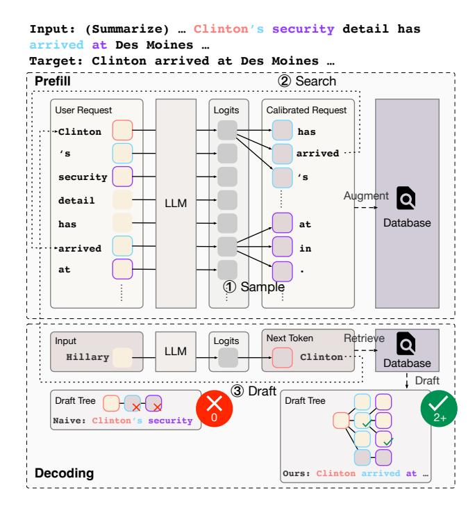

Figure 9: Overview of in-context distribution calibration with a summarization example.

patterns, thus reducing the acceptance ratio of drafts directly generated from the context. These lexical gaps appear prominently at the token level. For example, in Figure 9, a user request states "... Clinton's security detail has arrived at Des Moines ...," while the LLM, tasked with summarizing, prefers "Clinton arrived at Des Moines." For classical retrieve-based speculative decoding approaches [22, 24, 56], draft "Clinton's security" is rejected due to lexical mismatch between token 's and target arrived. This results in only one token is generated (arrived) by one forward pass as the following draft security is discarded, reducing decoding efficiency. Such mismatch problem arises in various mobile scenarios such as auto-reply or RAG-based QA, where human-written contexts diverge from the model's distribution.

To tackle this issue, one may forcibly accept drafts with lexical gaps based on semantic-level similarity. However, setting a stringent similarity threshold results in a low acceptance ratio with only marginal performance gains, whereas a loose threshold causes non-negligible accuracy loss, e.g., drops from 0.9 to 0.75 if candidates are forcibly accepted ignoring the distribution divergence [4, 23]. This necessitates calibration of draft and model distributions. A straightforward solution is to precompute a calibrated database by running large volumes of user inputs through the LLM, which suffers from poor generalization to unseen queries and requires prohibitive storage and offline processing. Another method is to

fine-tune the LLM to adapt to specific task scenarios, which also consumes lots of resources and energy and is hard to cover the wide diversity of mobile tasks.

**Leveraging prefill logits.** To avoid heavy offline or fine-tuning costs, our key observation is that after prefill completes, next-token logits for each token in the entire context have already been calculated. These logits reflect how LLM encodes task semantics and can be used to approximate the model distribution. To that end, we can build a calibrated database for drafting with negligible performance overhead. Therefore, we propose *in-context distribution calibration*, an online, lightweight method that dynamically aligns context with the LLM distribution using prefill logits.

**Workflow.** After prefill, sd.npu first collects predicted logits for all positions. Then sd.npu builds a calibrated token tree representing the model distribution by depth-first search, which includes two steps:

- Sample (Figure 9 ①). Given a token in the context ("Clinton" in the example), its next tokens with high-probability are sampled, i.e., has, arrived, and 's. These <context, prediction> pairs (Clinton-has, Clinton-arrived, Clinton-'s) form calibrated candidates for draft retrieval as they reflect the LLM's intrinsic distribution.
- **Search** (Figure 9 ②). sd.npu searches the occurrence of the calibrated token in the context. Once found ("*arrived*" in the example), it performs Step ① on that token using its prefill logits to estimate the successors of the calibrated tokens, such as *at*, *in*, or . in the example.

Finally, sd. npu augments the calibrated tree into the database as a model-aligned retrieval source for drafting. In this example (Figure 9 ③), token "*Clinton*" produces the draft candidate "*Clinton arrived at*" based on the calibrated tree, which is accepted in verification.

**Overhead analysis.** The main costs come from sampling and storing calibrated results. In our experiments, sampling incurs an amortized latency of about 2 ms per input token, while building and maintaining calibrated tokens peak below 500 MB memory for a 3B model (Section 4.3).

#### 3.4 NPU-Optimized Draft Reuse

Challenges of short potentially acceptable drafts. Existing studies on R-SD focus on improving draft quality, proposing techniques such as pruning draft tree by estimating token confidence [24, 59, 70]. However, as discussed in Section 2.3, a large proportion of drafts generated by existing methods have short lengths, which is harmful to the NPU efficiency. Naively lengthening drafts by loosing retrieving conditions cannot obtain performance benefits as irrelevant tokens will be rejected in verification.

**Reuse plausible drafts.** As highlighted in Section 2.1, the model output usually shares similar semantics with the task

Table 2: Given draft  $T, x_1 \dots x_n$  which misaligns with target  $z_1 \dots z_{n+1}$  at position e, the possible patterns of segment  $z_e \dots z_n$  and corresponding reusable tokens. In cases *missing* and *synonymous*, tokens after  $x_{e+\epsilon}$  are omitted for simplicity.

| Case                            | Pattern                                                                                                                      | Reusable                                                                   | Ratio |
|---------------------------------|------------------------------------------------------------------------------------------------------------------------------|----------------------------------------------------------------------------|-------|
| Missing Synonym Redundant | $z_e \dots z_{e+\delta} x_e \dots x_{e+\epsilon}$ $z_e \dots z_{e+\delta} x_{e+\gamma} \dots x_{e+\epsilon}$ $z_e \dots z_n$ | $x_e \dots x_{e+\epsilon}$ $x_{e+\gamma} \dots x_{e+\epsilon}$ $\emptyset$ |       |

context despite existing lexical gaps. Although these gaps cause rejection due to token-level misalignment, the rejected tokens include correct semantics and may be accepted in the next verification. sd.npu identifies and reuses these plausible tokens to construct NPU-friendly drafts lengthened by task-relevant information.

**Rejection causes analysis.** We first analyze the rejection reasons to explore how to identify plausible tokens. Let  $\mathbf{x} = [T, x_1, \dots, x_n]$  be the draft sequence where T is the most recently accepted token, and  $\mathbf{y} = [y_1, \dots, y_{n+1}]$  be the model's predictions. Suppose the expected sequence is  $\mathbf{z} = [z_1, \dots, z_{n+1}]$  and rejection occurs at position e due to a mismatch:  $x_e \neq y_e$ . Thus, the accepted sequence is  $x_1, \dots, x_{e-1}, y_e$ . According to the patterns of the expected sequence  $z_e \dots z_n$ , we categorize reuse opportunities into three general cases and report their distribution, which is obtained by manually labeling the rejection causes from a user case of summarization. Table 2 summarizes the results, showing that nearly 40% of the cases include reused sequence portions.

- **Missing**: the expected sequence includes additional tokens  $z_e \dots z_{e+\delta}$  ( $\delta \geq 0$ ) not present in the draft, while the remaining draft tokens  $x_e \dots x_{e+\epsilon}$  ( $\epsilon \geq 1$ ) match the expectation. Thus, the expected sequence is  $z_e \dots z_{e+\delta} x_e \dots x_{e+\epsilon}$ . If the combined sequence  $z_{e+\delta} x_e \dots x_{e+\epsilon}$  does not exist in the database, next retrieval will fail with no drafts generated. This could be recovered by reserving  $x_e \dots x_{e+\epsilon}$ .
- **Synonym**: the draft includes a semantically equivalent but lexically different segment  $x_e \dots x_{e+\gamma-1}$  ( $\gamma \ge 1$ ), replaced in the expected response by  $z_e \dots z_{e+\delta}$ . Similar failure occurs if the post-synonym tokens  $x_{e+\gamma} \dots x_{e+\epsilon}$  cannot be retrieved from database using  $z_{e+\delta}$ . In this case,  $x_{e+\gamma} \dots x_{e+\epsilon}$  should be preserved.
- **Redundant**: the entire draft  $x_e ext{...} x_n$  is incorrect and fully diverges from the expected path. This is the only case where discarding the sequence is appropriate.

**Reuse methodology.** To leverage reusable tokens in the first two cases, sd. npu aims to: (1) determine the start and end positions  $\gamma$ ,  $\epsilon$  of the maximum reusable segment; (2)

estimate the reuse lifetime  $\delta$ , i.e., how many iterations the reused segment should be reserved for verification.

Enumerating all possible reuse strategies is of  $O(N^3)$  complexity, which is not suitable for online scheduling. Therefore, sd. npu adopts a confidence-based and length-first reuse strategy, assuming that drafts aligned with model predictions are more likely to be accepted in future steps. Therefore, we identify and retain the longest segment of  $\mathbf{x}$  such that  $x_i = y_i$  for all  $i \in [e + \gamma, e + \epsilon]$ , by solving:

$$\gamma, \epsilon = \underset{\gamma, \epsilon}{\operatorname{argmax}} (\epsilon - \gamma) \quad \text{s.t. } y_i = x_i, \ \forall \ i \in [e + \gamma, e + \epsilon]$$
 (3)

Each reused segment is reserved for at least one iteration, and is discarded when the cumulative draft length of current decoding step exceeds a predefined threshold.

By maximizing draft length with potentially acceptable tokens, this reuse mechanism directly enhances NPU utilization and reduces verification times. The overhead of sd.npu's drafting and reusing processes is near ignorable with <3 ms per decoding step, as discussed in Section 4.4.

#### 4 Evaluation

#### 4.1 Implementation and Setup

Implementation. We implement sd. npu on top of the mllm framework [75] with approximately 6,000 lines of C/C++ code. We reuse the NPU backend of mllm, including neural kernels and memory managers, to perform prefill and draft verification. sd. npu inherits kernel-level and layer-level optimizations from mllm and further extends the system with speculative decoding capabilities. Our modular design allows easy porting to other mobile LLM inference frameworks that face NPU inefficiencies during decoding. To enable NPU-optimized speculative decoding, we augment mllm with customized kernels and sampling strategies. In order to accelerate drafting, we implement a suffix automaton to identify potential suffix matches [44]. To support NPU graph switching, we integrate the graph saving and loading APIs provided by the Qualcomm QNN SDK [51].

**Hardware**. We evaluate sd.npu on three representative smartphones with Qualcomm SoCs: *Redmi K60 Pro* (Snapdragon 8 Gen 2, Android 13, 12 GB RAM), *Redmi K70 Pro* (Snapdragon 8 Gen 3, Android 14, 16 GB RAM), and *One-Plus 13* (Snapdragon 8 Gen Elite, Android 14, 24 GB RAM). All devices are evaluated under real mobile conditions with the CPU frequency governed by the Android OS's dynamic voltage and frequency scaling controller.

**Datasets**. We evaluate four common mobile tasks collected from prior work: document summarization (*summary*), RAG-based question answering (*rag*), UI automation (*ui*) and automatic message reply (*tweet*) [54, 72, 73].

**Models**. We use Qwen2.5-0.5B-Instruct, Qwen2.5-1.5B-Instruct and LLaMA3.2-3B-Instruct [18, 53], exploring the effect of different model size.

**Baselines**. We compare sd.npu against six baselines, all implemented atop mllm to eliminate performance gaps from backend design differences 1. All baselines use NPU for prefill, which is a widely-adopted approach for both industry and academic [11, 34, 75, 77]. We categorize these baselines by whether they use CPU for decoding or apply speculative decoding:

- (1) NPU vanilla: use NPU for both prefill and decoding2;
- (2) CPU vanilla: use NPU for prefill and CPU for decoding, adopted by recent frameworks such as mllm and HeteroLLM [11, 75];
- (3) NPU-SAM: apply retrieval-based speculative decoding (SAM [24]) to NPU vanilla. SAM drafts from both historical and local contexts, serving as a standard retrieval-based baseline without mobile-specific optimization;
- (4) NPU-SAM: similar to (3) but decoding on the CPU;
- (5)NPU-EAGLE: apply model-based speculative decoding (EAGLE-2 [36]) to NPU vanilla. EAGLE-2 is the SOTA model-based SD approach that uses both tokens and hidden states for drafting through a pretrained transformerlike model;
- (6) CPU-EAGLE: similar to (5) but decoding on the CPU.

Since EAGLE-2 requires a separate draft model that is unavailable for selected LLMs, baselines (5) and (6) are simulated by estimating the expected speed via amortizing the forward costs of the target and draft model. We approximate the draft model as a single transformer layer with a head layer of the target LLM, assuming a fixed maximum acceptance ratio of 5.5, as reported in its paper [36].

Metrics and Configuration. We evaluate average per-token latency, energy consumption and peak memory. We exclude accuracy comparison as sd.npu achieves lossless generation [31]. Energy is measured via Android's virtual file system under /sys/class/power\_supply by profiling every 100ms. The Redmi K70 Pro is excluded from energy results as the device lacks root access. Experiments are repeated three times and we report the average numbers.

&lt;sup>1Other existing mobile LLM inference frameworks with NPU offloading support such as PowerInfer-v2 [77] and HeteroLLM [11] are not open-source, making them unsuitable for direct implementation. sd.npu, as a decoding optimization, is orthogonal and integrable with PowerInfer-v2 and HeteroLLM, so we do not compare it directly. EdgeLLM [74] optimizes model-based SD mainly to alleviate memory constraints. With sufficient memory, its performance reduces to that of EAGLE and does not address the memory-bound issue of decoding, thus making it an uninformative baseline for our settings.

&lt;sup>2mllm [75] and other on-device LLM engines [11, 77] offload precisionsensitive operations, such as attention, to CPU/GPU to improve response quality. sd.npu follows this pattern even in the NPU vanilla mode.

## 4.2 Overall Performance

Per-Token Latency. **sd.npu**is faster and achieves improvements ranging 1.06–3.81×, as shown in Figure [10.](#page-10-0)

- Compared to baselines without SD (NPU vanilla and CPU vanilla), sd.npu consistently reduces per-token latency by 1.14–3.81× and 1.06–1.78×. These performance gains stem from both the NPU-optimized SD method and the specialized compute graphs. Larger improvements are observed on small-to-medium models (e.g., Qwen2.5 0.5B and 1.5B) as their inference is memory-bound which is preferred by SD. Comparing different datasets, we find that tasks with higher context similarity such as summary, exhibit higher speed gains (1.41–3.80×, 1.24–1.61×) since SD is more effective.
- Compared to baselines with SD, sd.npu consistently improves by 1.11–2.53× than SAM, 1.09–1.80× than EAGLE. This arises because SAM ignores the ineffectiveness of computing short drafts on NPUs while EAGLE suffers from the latency of running another parametric model. Improvements of applying SD on CPU vanilla are moderate (0.92–1.13× for SAM, 0.56–1.18× for EAGLE), as LLM inference on mobile CPU is compute-bound due to the limited CPU capacity.

Energy Consumption. **sd.npu** is more energy-efficient and reduces energy consumption by 1.07–4.71× (Figure [11\)](#page-10-1).

- Compared to baselines without SD (NPU vanilla and CPU vanilla), sd.npu significantly reduces energy consumption by 1.35–4.18× and 1.11–2.50×. The improvements stem jointly from the higher generation speed and the avoidance of CPU computation, allowing energy-efficient utilization of NPUs. On larger models (e.g., Llama3.2 3B), the effectiveness becomes less pronounced (1.42–1.85×) as relatively longer inference time results in the device continues working under a high power consumption.
- Compared to baselines with SD, sd.npu consumes significantly less energy than SAM (1.07–3.07×) and EAGLE (1.77– 4.71×). Energy saving of SAM is limited due to frequent verification incurred by rejected drafts. EAGLE suffers from additional computation required by drafter, amplifying energy overhead. For instance, for Qwen2.5 0.5B, sd.npu reduces energy ranging 1.40–3.50× compared with NPU vanilla, while SAM reduces energy by only 1.17–1.54× and EAGLE even increases energy consumption.

Comparison Across Devices. We find that NPU computation on Redmi K70 Pro is much slower than on other devices, while Redmi K60 Pro and Oneplus 13 demonstrate relatively similar performance patterns. This results in less profound latency improvements on Redmi K70 Pro (e.g., 1.14–2.91× compared to NPU vanilla and 1.13–1.64× compared to CPU vanilla) as compute becomes the bottleneck. In terms of energy consumption, Oneplus 13 consumes more energy than

Redmi K60 Pro, e.g., average 53.85 J and 56.52 J per request for Qwen2.5 1.5B.

## 4.3 Memory Overhead

As shown in Figure [12,](#page-11-0) sd.npu maintains a memory footprint close to NPU vanilla with an additional overhead less than 500 MB across all evaluations. For example, sd.npu requires 3.14 GB for Qwen2.5 1.5B, nearly identical to NPU vanilla (3.05–3.12 GB), while CPU vanilla requires over 6 GB. This gap comes from maintaining separate weights for CPU and NPU in heterogeneous baselines.

The memory overhead of sd.npu primarily arises from distribution calibration and context-relevant database structures, which is manageable for mobile devices with limited memory. In contrast, EAGLE's memory usage increases noticeably (0.84–1.22 GB) due to maintaining the drafter model, highlighting that sd.npu delivers superior efficiency without sacrificing memory scalability.

## 4.4 Latency Breakdown

To analyze the runtime characteristics and latency overhead of sd.npu, we decompose the end-to-end inference latency into prefill, decoding and potential overhead. Measurements are conducted on Oneplus 13 under the summary benchmark, with results shown in Figure [13.](#page-11-1)

The results show that **sd.npu** significantly accelerates both prefill and decoding compared to NPU vanilla baseline, with little additional overhead. Specifically, decoding of NPU vanilla baseline consumes a substantial portion of total latency (67–74%), highlighting the significance of introducing specialized optimization. sd.npu directly addresses this by integrating retrieval-based speculative decoding, reducing decoding latency by 5.25–8.15×.

The prefill overhead is due to sampling tokens from logits for distribution calibration, which costs about 2 ms for each input token. The decoding overhead is caused by draft retrieval and tree construction. Benefited from the low time complexity of suffix automaton, our drafter costs less than 3 ms for each decoding step. Overall, our lightweight techniques incur negligible overhead compared to the overall inference cost.

### 4.5 Ablation Study

Effectiveness of three techniques. Experiments are conducted on Redmi K60 Pro using the summary benchmark across four baselines: (1) NPU vanilla (NPU), (2) NPU-SAM (+SD), (3) NPU-Graph (+G), and (4) NPU-SAM-Graph (+G+SD). Baselines (1)(2) are identical with those in Section [4.2,](#page-9-0) while (3)(4) integrate progressive graph scheduling into (1) and (2), respectively. Results are reported in Table [3.](#page-11-2)

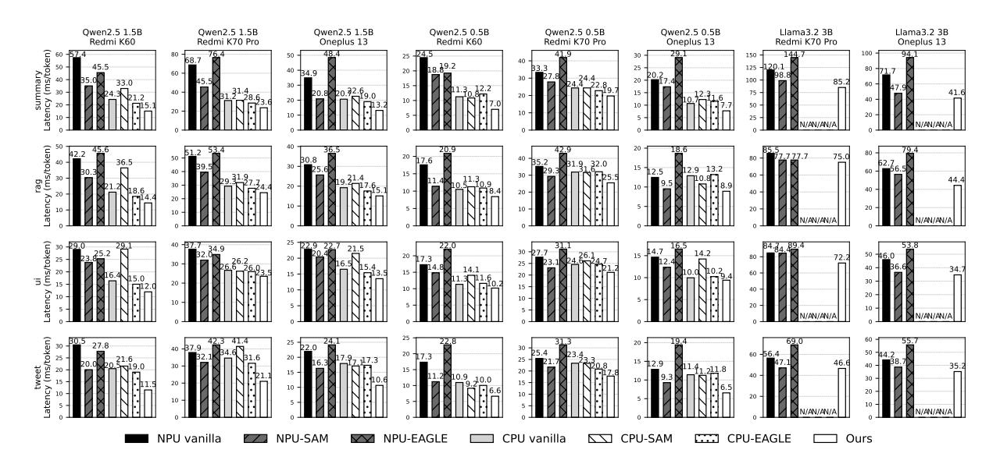

Figure 10: Per-token latency (ms/token) comparison on different datasets, devices and models.

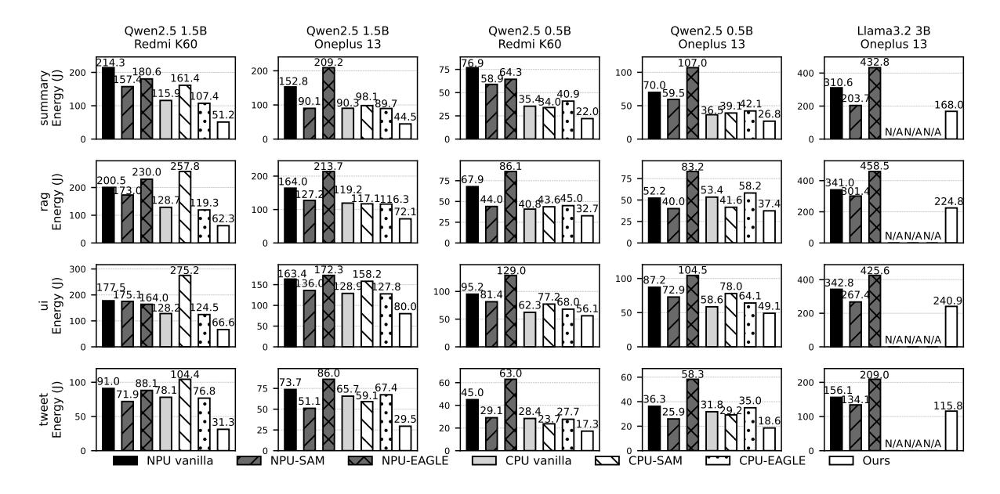

Figure 11: Energy consumption (J) comparison on different datasets, devices and models.

We observe that progressive graph scheduling provides consistent speed improvements regardless of whether SD is applied. For example, for Qwen2.5-1.5B, graph scheduling reduces latency from 57.41 ms to 47.72 ms. The results also show that *in-context distribution calibration* and *NPU-optimized draft reuse* contribute to significant performance gains across three models, reducing latency from 25.35 ms to 15.08 ms for Qwen2.5-1.5B.

Effectiveness in acceptance ratio. To analyze the effectiveness of techniques relevant to R-SD, we evaluate the acceptance ratio gains applying our techniques to existing methods (PLD [56], SAM [24]). PLD drafts from local contexts only while SAM drafts from both local and historical contexts. Experiments are conducted on a cloud server equipped with A100 GPUs. The results in Table 4 show consistent improvements across benchmarks and models. Our

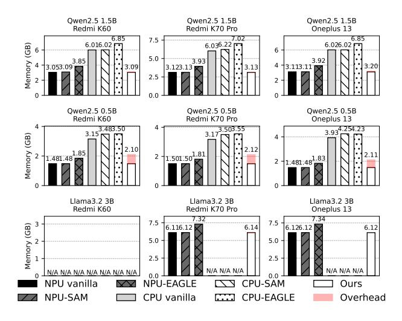

Figure 12: Peak memory comparison (GB) on different devices and models.

Figure 13: Breakdown of inference latency (ms).

Table 3: Ablation experiments on average per-token latency (ms/token).

| Model        | NPU   | +G    | +SD   | +G+SD | Ours  |
|--------------|-------|-------|-------|-------|-------|
|              |       |       |       |       |       |
| Qwen2.5-1.5B | 57.41 | 47.72 | 35.04 | 25.35 | 15.08 |
| Qwen2.5-0.5B | 24.46 | 23.43 | 18.75 | 18.45 | 7.17  |
| LLaMA3.2-3B  | 71.71 | 70.03 | 47.93 | 46.25 | 41.62 |

techniques improve the acceptance ratio of PLD by 1.05–1.25×, improve SAM by 1.06–1.24×. These improvements directly translate to higher decoding efficiency, as a higher acceptance ratio reduces the number of tokens that must be recomputed. These results also demonstrate that in-context distribution calibration and draft reuse strategy are orthogonal enhancements with existing R-SD methods, making it effortless to integrate advanced techniques.

#### 5 Related Work

**Mobile LLM inference optimization**. The constrained resources of mobile devices require reducing computation

Table 4: Ablation on acceptance ratio (average accepted tokens per verification).

| Dataset | Method   | Q1.5B                | Q7B                  | L1B                  |
|---------|----------|----------------------|----------------------|----------------------|
| summary | PLD      | 2.53                 | 1.55                 | 1.42                 |
|         | PLD+Ours | 2.91 (×1.15)         | 1.84 (×1.18)         | 1.70 (×1.19)         |
|         | SAM      | 3.60                 | 1.96                 | 1.68                 |
|         | SAM+Ours | 4.21 (×1.17)         | 2.43 (×1.24)         | 2.07 (×1.24)         |
| rag     | PLD      | 3.19                 | 1.63                 | 1.77                 |
|         | PLD+Ours | 3.73 (×1.17)         | 1.89 (×1.16)         | $2.11 (\times 1.19)$ |
|         | SAM      | 4.42                 | 2.29                 | 2.25                 |
|         | SAM+Ours | 5.47 (×1.24)         | 2.80 (×1.22)         | 2.66 (×1.19)         |
| ui      | PLD      | 2.28                 | 1.64                 | 1.57                 |
|         | PLD+Ours | 2.64 (×1.16)         | 1.73 (×1.05)         | 1.82 (×1.16)         |
|         | SAM      | 3.56                 | 2.44                 | 1.72                 |
|         | SAM+Ours | 4.01 (×1.13)         | 2.59 (×1.06)         | 2.05 (×1.20)         |
| tweet   | PLD      | 2.53                 | 2.06                 | 1.49                 |
|         | PLD+Ours | 3.17 (×1.25)         | $2.52 (\times 1.22)$ | 1.72 (×1.15)         |
|         | SAM      | 3.57                 | 2.98                 | 1.79                 |
|         | SAM+Ours | $3.82 (\times 1.07)$ | 3.70 (×1.24)         | 2.18 (×1.22)         |

Q1.5B = Qwen2.5 1.5B, Q7B = Qwen2.5 7B, L1B = LLaMA3.2 1B.

to enable efficient on-device LLM inference [42, 61, 62, 74, 76]. Several approaches exploit different forms of sparsity. *Mixture-of-experts* leverages activation sparsity by computing only neurons important to the final output [9, 16, 71, 78]. *Early-exit* reduces layer-level computation by skipping noncritical layers [15, 65]. *Model compression* reduces model size by retaining only the most valuable layers [58, 80]. *Token pruning* eliminates redundant tokens to shorten the context [39, 43]. sd.npu is compatible with these techniques, as it requires no architectural modifications to models or inputs.

Mobile NPU offloading. Modern mobile SoCs are increasingly equipped with high-performance NPUs [25, 47, 55], offering new opportunities for LLM acceleration [11, 41, 68, 75, 77, 79]. PowerInfer-V2 [77] integrates parameter swapping with NPU offloading to scale inference to larger LLMs. HeteroLLM [11] introduces tensor partitioning strategies tailored to mobile GPUs and NPUs for efficient parallelization. While these studies primarily focus on accelerating prefill, sd.npu complements them by incorporating speculative decoding to optimize both prefill and decoding.

Retrieval-augmented generation. Retrieval-augmented generation (RAG) enhances LLM's knowledge by retrieving relevant documents from an external database, enabling effective context-aware generation [33]. Recent work explores advanced database architectures such as knowledge

graph [\[13,](#page-12-19) [21,](#page-12-20) [81\]](#page-14-22). Other efforts optimize retrieval with adaptive strategies, such as extracting fine-grained information and caching key documents based on user demands [\[26,](#page-13-27) [40,](#page-13-28) [57\]](#page-13-29). RAG can be employed to augment the context for CAG. Speculative decoding uses LLM as a verifier to process multiple draft tokens in parallel, shifting memory-bound decoding to compute-bound [\[8,](#page-12-21) [32,](#page-13-30) [60\]](#page-14-23). The main difference between these studies is how drafts are generated. Model-based methods employ an auxiliary parametric model, typically a smaller LLM [\[7,](#page-12-13) [12,](#page-12-22) [36–](#page-13-14)[38\]](#page-13-31). Although these approaches improve the acceptance ratio, they introduce significant drafting overhead [\[24\]](#page-12-12). Retrieval-based methods avoid this cost by using lightweight retrievers for drafting, but often suffer from low acceptance ratios [\[10,](#page-12-23) [19,](#page-12-24) [24,](#page-12-12) [35,](#page-13-32) [56,](#page-13-12) [59\]](#page-14-8). sd.npu advances R-SD through hardware–algorithm co-design, integrating it with mobile NPUs for efficient acceleration.

## 6 Conclusions

In this paper, we propose sd.npu, the first framework designed to align retrieval-based speculative decoding with mobile NPUs to optimize context-augmented generation. sd.npu incorporates novel techniques such as progressive graph scheduling and in-context calibration to address the gaps between speculative decoding and NPUs. Extensive experiments demonstrate sd.npu achieves outstanding and consistent performance gains.

### References

- [1] HIX AI. 2024. GPT-based email writer. [https://hix.ai/ai-email-writer](https://hix.ai/ai-email-writer-emailgenerator/)[emailgenerator/](https://hix.ai/ai-email-writer-emailgenerator/)
- [2] Apple. 2024. Apple Intelligence. [https://www.apple.com/apple](https://www.apple.com/apple-intelligence/)[intelligence/](https://www.apple.com/apple-intelligence/)
- [3] Apple. 2024. Siri.<https://www.apple.com/siri/>
- [4] Gregor Bachmann, Sotiris Anagnostidis, Albert Pumarola, Markos Georgopoulos, Artsiom Sanakoyeu, Yuming Du, Edgar Schönfeld, Ali Thabet, and Jonas Kohler. 2025. Judge Decoding: Faster Speculative Sampling Requires Going Beyond Model Alignment. arXiv preprint arXiv:2501.19309 (2025).
- [5] Peter Belcak, Greg Heinrich, Shizhe Diao, Yonggan Fu, Xin Dong, Saurav Muralidharan, Yingyan Celine Lin, and Pavlo Molchanov. 2025. Small Language Models are the Future of Agentic AI. arXiv preprint arXiv:2506.02153 (2025).
- [6] Tom B. Brown, Benjamin Mann, Nick Ryder, Melanie Subbiah, Jared Kaplan, Prafulla Dhariwal, Arvind Neelakantan, Pranav Shyam, Girish Sastry, Amanda Askell, et al. 2020. Language Models Are Few-Shot Learners. arXiv preprint arXiv:2005.14165 (2020).
- [7] Tianle Cai, Yuhong Li, Zhengyang Geng, Hongwu Peng, Jason D. Lee, Deming Chen, and Tri Dao. 2024. MEDUSA: Simple LLM inference acceleration framework with multiple decoding heads. In Proceedings of the 41st International Conference on Machine Learning. Article 203, 27 pages.
- [8] Charlie Chen, Sebastian Borgeaud, Geoffrey Irving, Jean-Baptiste Lespiau, Laurent Sifre, and John Jumper. 2023. Accelerating Large Language Model Decoding with Speculative Sampling. arXiv preprint arXiv:2302.01318 (2023).

- [9] Fahao Chen, Jie Wan, Peng Li, Zhou Su, and Dongxiao Yu. 2025. Federated Fine-Tuning of Sparsely-Activated Large Language Models on Resource-Constrained Devices. arXiv preprint arXiv:2508.19078 (2025).
- [10] Guanzheng Chen, Qilong Feng, Jinjie Ni, Xin Li, and Michael Qizhe Shieh. 2025. Long-Context Inference with Retrieval-Augmented Speculative Decoding. arXiv preprint arXiv:2502.20330 (2025).
- [11] Le Chen, Dahu Feng, Erhu Feng, Rong Zhao, Yingrui Wang, Yubin Xia, Haibo Chen, and Pinjie Xu. 2025. HeteroLLM: Accelerating Large Language Model Inference on Mobile SoCs platform with Heterogeneous AI Accelerators. arXiv preprint arXiv:2501.14794 (2025).
- [12] Cunxiao Du, Jing Jiang, Xu Yuanchen, Jiawei Wu, Sicheng Yu, Yongqi Li, Shenggui Li, Kai Xu, Liqiang Nie, Zhaopeng Tu, and Yang You. 2024. GliDe with a CaPE: A Low-Hassle Method to Accelerate Speculative Decoding. In Proceedings of the 41st International Conference on Machine Learning, Vol. 235. 11704–11720.
- [13] Darren Edge, Ha Trinh, Newman Cheng, Joshua Bradley, Alex Chao, Apurva Mody, Steven Truitt, Dasha Metropolitansky, Robert Osazuwa Ness, and Jonathan Larson. 2024. From local to global: A graph RAG approach to query-focused summarization. arXiv preprint arXiv:2404.16130 (2024).
- [14] Stavros Eleftherakis, Timothy Otim, Giuseppe Santaromita, Almudena Diaz Zayas, Domenico Giustiniano, and Nicolas Kourtellis. 2024. Demystifying privacy in 5G stand alone networks. In Proceedings of the 30th Annual International Conference on Mobile Computing and Networking. 1330–1345.
- [15] Siqi Fan, Xin Jiang, Xiang Li, Xuying Meng, Peng Han, Shuo Shang, Aixin Sun, Yequan Wang, and Zhongyuan Wang. 2024. Not All Layers of LLMs Are Necessary During Inference. arXiv preprint arXiv:2403.02181 (2024).
- [16] Elias Frantar and Dan Alistarh. 2024. QMoE: Sub-1-Bit Compression of Trillion Parameter Models. In Proceedings of Machine Learning and Systems, Vol. 6. 439–451.
- [17] Google. 2024. AI Core.<https://developer.android.com/ai/aicore>
- [18] Aaron Grattafiori, Abhimanyu Dubey, Abhinav Jauhri, Abhinav Pandey, Abhishek Kadian, Ahmad Al-Dahle, Aiesha Letman, Akhil Mathur, Alan Schelten, Alex Vaughan, et al. 2024. The Llama 3 Herd of Models. arXiv preprint arXiv:2407.21783 (2024).
- [19] Milan Gritta, Huiyin Xue, and Gerasimos Lampouras. 2025. DReSD: Dense Retrieval for Speculative Decoding. arXiv preprint arXiv:2502.15572 (2025).
- [20] Daya Guo, Qihao Zhu, Dejian Yang, Zhenda Xie, Kai Dong, Wentao Zhang, Guanting Chen, Xiao Bi, Yu Wu, YK Li, et al. 2024. DeepSeek-Coder: When the Large Language Model Meets Programming–The Rise of Code Intelligence. arXiv preprint arXiv:2401.14196 (2024).
- [21] Haoyu Han, Harry Shomer, Yu Wang, Yongjia Lei, Kai Guo, Zhigang Hua, Bo Long, Hui Liu, and Jiliang Tang. 2025. RAG vs. GraphRAG: A systematic evaluation and key insights. arXiv preprint arXiv:2502.11371 (2025).
- [22] Zhenyu He, Zexuan Zhong, Tianle Cai, Jason Lee, and Di He. 2024. REST: Retrieval-Based Speculative Decoding. In Proceedings of the 2024 Conference of the North American Chapter of the Association for Computational Linguistics: Human Language Technologies (Volume 1: Long Papers). 1582–1595. [doi:10.18653/v1/2024.naacl-long.88](https://doi.org/10.18653/v1/2024.naacl-long.88)
- [23] Maximilian Holsman, Yukun Huang, and Bhuwan Dhingra. 2025. Fuzzy Speculative Decoding for a Tunable Accuracy-Runtime Tradeoff. arXiv preprint arXiv:2502.20704 (2025).
- [24] Yuxuan Hu, Ke Wang, Xiaokang Zhang, Fanjin Zhang, Cuiping Li, Hong Chen, and Jing Zhang. 2024. SAM Decoding: Speculative Decoding via Suffix Automaton. arXiv preprint arXiv:2411.10666 (2024).
- [25] Huawei. 2024. Huawei's LLM on Mate 70 Series. [https:](https://www.huaweicentral.com/huawei-mate-70-serieslaunched-with-new-camera-design-5700mahbattery-generative-ai-and-more/) [//www.huaweicentral.com/huawei-mate-70-serieslaunched-with](https://www.huaweicentral.com/huawei-mate-70-serieslaunched-with-new-camera-design-5700mahbattery-generative-ai-and-more/)[new-camera-design-5700mahbattery-generative-ai-and-more/](https://www.huaweicentral.com/huawei-mate-70-serieslaunched-with-new-camera-design-5700mahbattery-generative-ai-and-more/)

- [26] Soyeong Jeong, Jinheon Baek, Sukmin Cho, Sung Ju Hwang, and Jong C Park. 2024. Adaptive-RAG: Learning to Adapt Retrieval-Augmented Large Language Models through Question Complexity. In Proceedings of the 2024 Conference of the North American Chapter of the Association for Computational Linguistics: Human Language Technologies (Volume 1: Long Papers). 7029–7043.
- [27] Norman P Jouppi, Cliff Young, Nishant Patil, David Patterson, Gaurav Agrawal, Raminder Bajwa, Sarah Bates, Suresh Bhatia, Nan Boden, Al Borchers, et al. 2017. In-datacenter performance analysis of a tensor processing unit. In Proceedings of the 44th annual international symposium on computer architecture. 1–12.
- [28] Richard E. Korf. 1998. A complete anytime algorithm for number partitioning. Artificial Intelligence 106, 2 (1998), 181–203. [doi:10.1145/](https://doi.org/10.1145/3637528.3671650) [3637528.3671650](https://doi.org/10.1145/3637528.3671650)
- [29] Nir Kshetri. 2023. Cybercrime and Privacy Threats of Large Language Models. IT Professional 25 (2023), 9–13.
- [30] Sunjae Lee, Junyoung Choi, Jungjae Lee, Munim Hasan Wasi, Hojun Choi, Steve Ko, Sangeun Oh, and Insik Shin. 2024. Mobilegpt: Augmenting llm with human-like app memory for mobile task automation. In Proceedings of the 30th Annual International Conference on Mobile Computing and Networking. 1119–1133.
- [31] Yaniv Leviathan, Matan Kalman, and Yossi Matias. 2023. Fast Inference from Transformers via Speculative Decoding. In Proceedings of the 40th International Conference on Machine Learning, Vol. 202. 19274–19286.
- [32] Yaniv Leviathan, Matan Kalman, and Yossi Matias. 2023. Fast Inference from Transformers via Speculative Decoding. In Proceedings of the 40th International Conference on Machine Learning, Vol. 202. 19274–19286.
- [33] Patrick Lewis, Ethan Perez, Aleksandra Piktus, Fabio Petroni, Vladimir Karpukhin, Naman Goyal, Heinrich Küttler, Mike Lewis, Wen-tau Yih, Tim Rocktäschel, et al. 2020. Retrieval-augmented generation for knowledge-intensive nlp tasks. Advances in neural information processing systems 33 (2020), 9459–9474.
- [34] Luchang Li, Sheng Qian, Jie Lu, Lunxi Yuan, Rui Wang, and Qin Xie. 2024. Transformer-lite: High-efficiency deployment of large language models on mobile phone gpus. arXiv preprint arXiv:2403.20041 (2024).
- [35] Yanhong Li, Karen Livescu, and Jiawei Zhou. 2025. Chunk-Distilled Language Modeling. In The 13th International Conference on Learning Representations.
- [36] Yuhui Li, Fangyun Wei, Chao Zhang, and Hongyang Zhang. 2024. EAGLE-2: Faster Inference of Language Models with Dynamic Draft Trees. In Proceedings of the 2024 Conference on Empirical Methods in Natural Language Processing. 7421–7432.
- [37] Yuhui Li, Fangyun Wei, Chao Zhang, and Hongyang Zhang. 2024. EAGLE: speculative sampling requires rethinking feature uncertainty. In Proceedings of the 41st International Conference on Machine Learning. Article 1162, 14 pages.
- [38] Yuhui Li, Fangyun Wei, Chao Zhang, and Hongyang Zhang. 2025. EAGLE-3: Scaling up Inference Acceleration of Large Language Models via Training-Time Test. arXiv preprint arXiv:2303.01840 (2025).
- [39] Kaiyuan Liu, Xiaobo Zhou, and Li Li. 2025. m2 2LLM: A Multi-Dimensional Optimization Framework for LLM Inference on Mobile Devices. IEEE Transactions on Parallel and Distributed Systems 36, 10 (2025), 2014–2029. [doi:10.1109/TPDS.2025.3587445](https://doi.org/10.1109/TPDS.2025.3587445)
- [40] Mugeng Liu, Siqi Zhong, Qi Yang, Yudong Han, Xuanzhe Liu, and Yun Ma. 2025. WebANNS: Fast and Efficient Approximate Nearest Neighbor Search in Web Browsers. In Proceedings of the 48th International ACM SIGIR Conference on Research and Development in Information Retrieval. 2483–2492.
- [41] Xudong Lu, Yinghao Chen, Cheng Chen, Hui Tan, Boheng Chen, Yina Xie, Rui Hu, Guanxin Tan, Renshou Wu, Yan Hu, Yi Zeng, Lei Wu, Liuyang Bian, Zhaoxiong Wang, Long Liu, Yanzhou Yang, Han Xiao, Aojun Zhou, Yafei Wen, Xiaoxin Chen, Shuai Ren, and Hongsheng

- Li. 2025. BlueLM-V-3B: Algorithm and System Co-Design for Multimodal Large Language Models on Mobile Devices. In Proceedings of the IEEE/CVF Conference on Computer Vision and Pattern Recognition). 4145–4155.
- [42] Shuming Ma, Hongyu Wang, Lingxiao Ma, Lei Wang, Wenhui Wang, Shaohan Huang, Li Dong, Ruiping Wang, Jilong Xue, and Furu Wei. 2024. The Era of 1-bit LLMs: All Large Language Models are in 1.58 Bits. arXiv preprint arXiv:2402.17764 (2024).
- [43] Xinyin Ma, Gongfan Fang, and Xinchao Wang. 2023. LLM-Pruner: On the Structural Pruning of Large Language Models. In Advances in Neural Information Processing Systems, A. Oh, T. Naumann, A. Globerson, K. Saenko, M. Hardt, and S. Levine (Eds.), Vol. 36. 21702–21720.
- [44] Mehryar Mohri, Pedro Moreno, and Eugene Weinstein. 2009. General suffix automaton construction algorithm and space bounds. Theoretical Computer Science 410, 37 (2009), 3553–3562.
- [45] Mozhgan Navardi, Romina Aalishah, Yuzhe Fu, Yueqian Lin, Hai Li, Yiran Chen, and Tinoosh Mohsenin. 2025. GenAI at the Edge: Comprehensive Survey on Empowering Edge Devices. arXiv preprint arXiv:2502.15816 (2025). arXiv[:2502.15816](https://arxiv.org/abs/2502.15816)
- [46] OpenAI, Josh Achiam, Steven Adler, Sandhini Agarwal, Lama Ahmad, Ilge Akkaya, Florencia Leoni Aleman, Diogo Almeida, Janko Altenschmidt, Sam Altman, et al. 2024. GPT-4 Technical Report. arXiv preprint arXiv:2303.08774 (2024).
- [47] OPPO. 2024. OPPO Announces Commitment to Making AI Phones Accessible to Everyone. [https://www.oppo.com/en/newsroom/press/](https://www.oppo.com/en/newsroom/press/oppo-make-ai-phones-accessible/) [oppo-make-ai-phones-accessible/](https://www.oppo.com/en/newsroom/press/oppo-make-ai-phones-accessible/)
- [48] Tao Ouyang, Guihang Hong, Kongyange Zhao, Zhi Zhou, Weigang Wu, Zhaobiao Lv, and Xu Chen. 2025. AdaRAG: Adaptive Optimization for Retrieval Augmented Generation with Multilevel Retrievers at the Edge. In IEEE INFOCOM 2025 - IEEE Conference on Computer Communications. 1–10. [doi:10.1109/INFOCOM55648.2025.11044685](https://doi.org/10.1109/INFOCOM55648.2025.11044685)
- [49] Taehwan Park, Geonho Lee, and Min-Soo Kim. 2025. MobileRAG: A Fast, Memory-Efficient, and Energy-Efficient Method for On-Device RAG. arXiv preprint arXiv:2507.01079 (2025).
- [50] Qualcomm. 2024. Snapdragon 8 Gen 3 Mobile Platform. [https://www.qualcomm.com/products/mobile/snapdragon/](https://www.qualcomm.com/products/mobile/snapdragon/smartphones/snapdragon-8-series-mobile-platforms/snapdragon-8-gen-3-mobile-platform) [smartphones/snapdragon-8-series-mobile-platforms/snapdragon-8](https://www.qualcomm.com/products/mobile/snapdragon/smartphones/snapdragon-8-series-mobile-platforms/snapdragon-8-gen-3-mobile-platform) [gen-3-mobile-platform](https://www.qualcomm.com/products/mobile/snapdragon/smartphones/snapdragon-8-series-mobile-platforms/snapdragon-8-gen-3-mobile-platform)
- [51] Qualcomm. 2025. QNN SDK. [https://docs.qualcomm.com/bundle/](https://docs.qualcomm.com/bundle/publicresource/ topics/80-63442-50/introduction.html) [publicresource/topics/80-63442-50/introduction.html](https://docs.qualcomm.com/bundle/publicresource/ topics/80-63442-50/introduction.html)
- [52] Qualcomm. 2025. Snapdragon 8 Elite Platform. [https://www.qualcomm.](https://www.qualcomm.com/products/mobile/snapdragon/smartphones/snapdragon-8-series-mobile-platforms/snapdragon-8-elite-mobile-platform) [com/products/mobile/snapdragon/smartphones/snapdragon-8](https://www.qualcomm.com/products/mobile/snapdragon/smartphones/snapdragon-8-series-mobile-platforms/snapdragon-8-elite-mobile-platform) [series-mobile-platforms/snapdragon-8-elite-mobile-platform](https://www.qualcomm.com/products/mobile/snapdragon/smartphones/snapdragon-8-series-mobile-platforms/snapdragon-8-elite-mobile-platform)
- [53] Qwen, :, An Yang, Baosong Yang, Beichen Zhang, Binyuan Hui, Bo Zheng, Bowen Yu, Chengyuan Li, Dayiheng Liu, Fei Huang, Haoran Wei, Huan Lin, Jian Yang, et al. 2025. Qwen2.5 Technical Report. arXiv preprint arXiv:2412.15115 (2025).
- [54] Alireza Salemi, Sheshera Mysore, Michael Bendersky, and Hamed Zamani. 2023. LaMP: When Large Language Models Meet Personalization. arXiv preprint arXiv:2304.11406 (2023).
- [55] Samsung. 2024. Samsung's LLM on Galaxy S24. [https://www.samsung.](https:// www.samsung.com/global/galaxy/s24/) [com/global/galaxy/s24/](https:// www.samsung.com/global/galaxy/s24/)
- [56] Apoorv Saxena. 2023. Prompt Lookup Decoding. [https://github.com/](https://github.com/apoorvumang/prompt-lookup-decoding/) [apoorvumang/prompt-lookup-decoding/](https://github.com/apoorvumang/prompt-lookup-decoding/)
- [57] Korakit Seemakhupt, Sihang Liu, and Samira Khan. 2024. EdgeRAG: Online-indexed rag for edge devices. arXiv preprint arXiv:2412.21023 (2024).
- [58] James Seale Smith, Chi-Heng Lin, Shikhar Tuli, Haris Jeelani, Shangqian Gao, Yilin Shen, Hongxia Jin, and Yen-Chang Hsu. 2025. FlexiGPT: Pruning and Extending Large Language Models with Low-Rank Weight Sharing. arXiv preprint arXiv:2501.14713 (2025).

- [59] Shwetha Somasundaram, Anirudh Phukan, and Apoorv Saxena. 2024. PLD+: Accelerating LLM inference by leveraging Language Model Artifacts. arXiv preprint arXiv:2412.01447 (2024).
- [60] Mitchell Stern, Noam Shazeer, and Jakob Uszkoreit. 2018. Blockwise Parallel Decoding for Deep Autoregressive Models. In Advances in Neural Information Processing Systems, Vol. 31.
- [61] Shreyas Subramanian, Vikram Elango, and Mecit Gungor. 2025. Small Language Models (SLMs) Can Still Pack a Punch: A survey. arXiv preprint arXiv:2501.05465 (2025).
- [62] Omkar Thawakar, Ashmal Vayani, Salman Khan, Hisham Cholakal, Rao M. Anwer, Michael Felsberg, Tim Baldwin, Eric P. Xing, and Fahad Shahbaz Khan. 2024. MobiLlama: Towards Accurate and Lightweight Fully Transparent GPT. arXiv preprint arXiv:2402.16840 (2024).
- [63] Hugo Touvron, Louis Martin, Kevin Stone, Peter Albert, Amjad Almahairi, Yasmine Babaei, Nikolay Bashlykov, Soumya Batra, Prajjwal Bhargava, Shruti Bhosale, et al. 2023. Llama 2: Open Foundation and Fine-Tuned Chat Models. arXiv preprint arXiv:2307.09288 (2023).
- [64] European Union. 2021. General data protection regulation. https://gdprinfo.eu/
- [65] Yeshwanth Venkatesha, Souvik Kundu, and Priyadarshini Panda. 2025. Fast and Cost-effective Speculative Edge-Cloud Decoding with Early Exits. arXiv preprint arXiv:2505.21594 (2025).
- [66] Wenhui Wang, Furu Wei, Li Dong, Hangbo Bao, Nan Yang, and Ming Zhou. 2020. MiniLM: Deep Self-Attention Distillation for Task-Agnostic Compression of Pre-Trained Transformers. arXiv preprint arXiv:2002.10957 (2020).
- [67] Zijie J. Wang and Duen Horng Chau. 2024. MeMemo: On-device Retrieval Augmentation for Private and Personalized Text Generation. In Proceedings of the 47th International ACM SIGIR Conference on Research and Development in Information Retrieval. 2765—2770. doi:10.1145/3626772.3657662
- [68] Xinming Wei, Jiahao Zhang, Haoran Li, Jiayu Chen, Rui Qu, Maoliang Li, Xiang Chen, and Guojie Luo. 2025. Agent.xpu: Efficient Scheduling of Agentic LLM Workloads on Heterogeneous SoC. arXiv preprint arXiv:2506.24045 (2025).
- [69] Hao Wen, Yuanchun Li, Guohong Liu, Shanhui Zhao, Tao Yu, Toby Jia-Jun Li, Shiqi Jiang, Yunhao Liu, Yaqin Zhang, and Yunxin Liu. 2024. Autodroid: Llm-powered task automation in android. In Proceedings of the 30th Annual International Conference on Mobile Computing and Networking. 543–557.
- [70] Tong Wu, Junzhe Shen, Zixia Jia, Yuxuan Wang, and Zilong Zheng. 2025. From hours to minutes: Lossless acceleration of ultra long sequence generation up to 100k tokens. arXiv preprint arXiv:2502.18890 (2025).
- [71] Tian Wu, Liming Wang, Zijian Wen, Xiaoxi Zhang, Jingpu Duan, Xianwei Zhang, and Jinhang Zuo. 2025. Accelerating Edge Inference for Distributed MoE Models with Latency-Optimized Expert Placement. arXiv preprint arXiv:2508.12851 (2025). arXiv:2508.12851
- [72] Heming Xia, Zhe Yang, Qingxiu Dong, Peiyi Wang, Yongqi Li, Tao Ge, Tianyu Liu, Wenjie Li, and Zhifang Sui. 2024. Unlocking Efficiency in Large Language Model Inference: A Comprehensive Survey of Speculative Decoding. In Findings of the Association for Computational Linguistics ACL 2024. 7655–7671. doi:10.18653/v1/2024.findings-acl.456
- [73] Mingzhe Xing, Rongkai Zhang, Hui Xue, Qi Chen, Fan Yang, and Zhen Xiao. 2024. Understanding the Weakness of Large Language Model Agents within a Complex Android Environment. In Proceedings of the 30th ACM SIGKDD Conference on Knowledge Discovery and Data Mining. 6061–6072. doi:10.1145/3637528.3671650
- [74] Daliang Xu, Wangsong Yin, Hao Zhang, Xin Jin, Ying Zhang, Shiyun Wei, Mengwei Xu, and Xuanzhe Liu. 2025. EdgeLLM: Fast On-Device LLM Inference With Speculative Decoding. IEEE Transactions on Mobile Computing 24, 4 (2025), 3256–3273. doi:10.1109/TMC.2024.3513457

- [75] Daliang Xu, Hao Zhang, Liming Yang, Ruiqi Liu, Gang Huang, Mengwei Xu, and Xuanzhe Liu. 2025. Fast On-device LLM Inference with NPUs. In Proceedings of the 30th ACM International Conference on Architectural Support for Programming Languages and Operating Systems, Vol. 1. 445--462. doi:10.1145/3669940.3707239
- [76] Mengwei Xu, Wangsong Yin, Dongqi Cai, Rongjie Yi, Daliang Xu, Qipeng Wang, Bingyang Wu, Yihao Zhao, Chen Yang, Shihe Wang, Qiyang Zhang, et al. 2024. A Survey of Resource-efficient LLM and Multimodal Foundation Models. arXiv preprint arXiv:2401.08092 (2024).
- [77] Zhenliang Xue, Yixin Song, Zeyu Mi, Xinrui Zheng, Yubin Xia, and Haibo Chen. 2024. Powerinfer-2: Fast large language model inference on a smartphone. arXiv preprint arXiv:2406.06282 (2024).
- [78] Rongjie Yi, Liwei Guo, Shiyun Wei, Ao Zhou, Shangguang Wang, and Mengwei Xu. 2025. EdgeMoE: Empowering Sparse Large Language Models on Mobile Devices. *IEEE Transactions on Mobile Computing* 24 (2025), 7059–7073. doi:10.1109/TMC.2025.3546466
- [79] Wangsong Yin, Daliang Xu, Mengwei Xu, Gang Huang, and Xuanzhe Liu. 2025. Dynamic Sparse Attention on Mobile SoCs. arXiv preprint arXiv:2508.16703 (2025).
- [80] Zhongzhi Yu, Zheng Wang, Yuhan Li, Ruijie Gao, Xiaoya Zhou, Sreenidhi Reddy Bommu, Yang (Katie) Zhao, and Yingyan (Celine) Lin. 2024. EDGE-LLM: Enabling Efficient Large Language Model Adaptation on Edge Devices via Unified Compression and Adaptive Layer Voting. In Proceedings of the 61st ACM/IEEE Design Automation Conference. Article 327. doi:10.1145/3649329.3658473
- [81] Yaoze Zhang, Rong Wu, Pinlong Cai, Xiaoman Wang, Guohang Yan, Song Mao, Ding Wang, and Botian Shi. 2025. LeanRAG: Knowledge-Graph-Based Generation with Semantic Aggregation and Hierarchical Retrieval. arXiv preprint arXiv:2508.10391 (2025).

## A NP-hardness Proof of the Graph Scheduling Problem

We prove that the graph scheduling problem described in Section 3.2 is NP-hard via a reduction from the *2-Partition* problem [28].

**Graph scheduling problem**. Given N model blocks that sequentially execute prefill for C chunks, each block i must execute a prefill for every chunk and perform exactly one graph switch from  $G^1$  to  $G^2$ . Using  $G^2$  to prefill is slower than using  $G^1$ . Switches can run in parallel with the computation of other blocks, while switches / computation of different blocks cannot overlap with each other. We aim to determine the time to switch each block with an objective to minimize the maximum of the prefill completion time and the switch completion time.

**2-Partition problem**. Given a set of positive integers  $a_1, \ldots, a_m$  with sum S = 2B, determine whether there exists a subset  $I \subseteq \{1, \ldots, m\}$  such that  $\sum_{i \in I} a_i = B$ .

**Construction of the scheduling instance.** Given a Partition instance  $a_1, \ldots, a_m$ , we construct a scheduling instance as follows:

- Let N = m + 1. Indices 1,..., m correspond to the m items of the Partition instance, and the block 0 (or equivalently m + 1) serves as a long block.
- Let the number of chunks be C = 2.
- For each j = 1, ..., m (corresponding to  $a_i$ ):

- Load time:  $s_i = a_i$ .
- Compute time using  $G^2$ :  $d_j = \varepsilon$ , where  $\varepsilon > 0$  is a very small constant.
- Compute time using  $G^1$ :  $p_i < d_i$ .
- For the additional block 0:
  - Load time  $s_0 = 0$ .
  - Compute time using  $G^1$ :  $p_0 = B$ .
  - Compute time using  $G^2$ :  $d_0 > p_0$ .
- We ask whether there exists a schedule such that the overall latency *T* is not larger than the prefill completion time.

#### **Key properties**. This instance thus satisfy:

- For each chunk, block 0 follows blocks  $1, \ldots, m$  and occupies  $p_0 = B$  units of prefill time. Thus, in chunk 1 and chunk 2 we obtain two disjoint windows of length B each. Any switching placed inside one of these windows does not extend the prefill completion time. Conversely, placing a switch outside these windows delays completion beyond T.
- Since all switchings must fit within these two windows of total length 2*B*, the only way to complete them before prefill ends is to divide them into two groups of total duration *B* each. This is exactly the Partition problem.

#### Correctness.

- ( $\Rightarrow$ ) If the Partition instance is solvable, i.e., there exists a subset I such that  $\sum_{j \in I} a_j = B$ , then in the scheduling instance we place all switchings for indices in I inside the window of chunk 1 (block 0), and place the rest in chunk 2's window. Each window contains exactly B switching time, all of which finish before the prefill completion time. Hence, this scheduling satisfies that the overall latency is not larger than the prefill completion time.
- (⇐) If the scheduling instance admits a feasible schedule with overall latency ≤ *T*, then all switchings must be finished before the prefill total time *T*. The only available periods where switchings can be hidden without delaying prefill are the two *B*-length windows (one in each chunk at block 0). Since switchings are serialized, their total time 2*B* must be exactly distributed across the two windows. This requires splitting the switchings into two groups summing to *B* each, which directly provides a solution to the Partition instance.

Thus, we have equivalence:

Partition is solvable  $\iff$  Scheduling instance is solvable.

**Conclusion.** The reduction can be performed in polynomial time. Since Partition is NP-complete, the prefill scheduling problem is NP-hard.