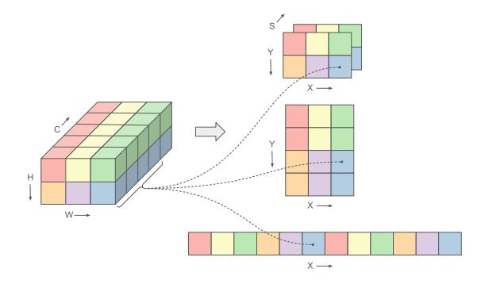
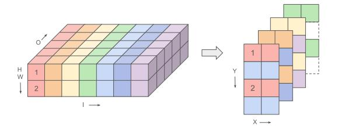
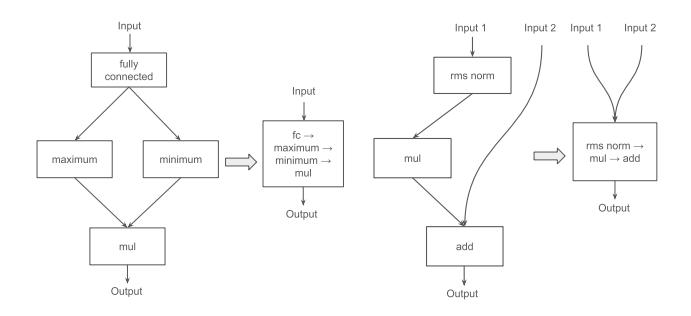
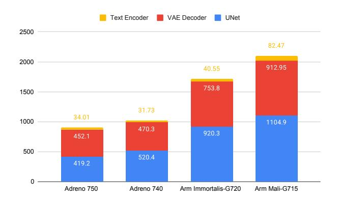
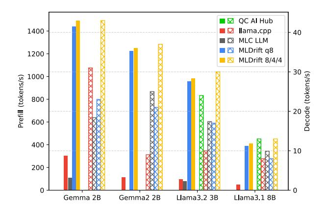
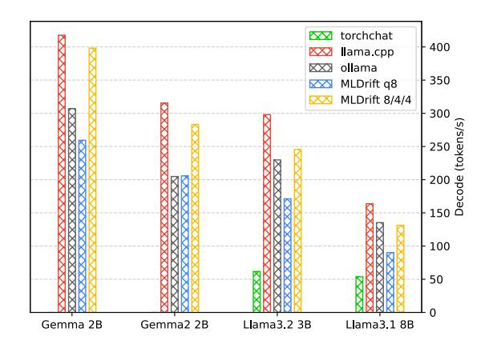
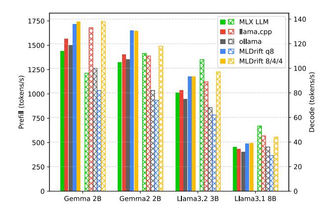

# Scaling On-Device GPU Inference for Large Generative Models

Jiuqiang Tang∗ Google LLC Raman Sarokin∗ Google LLC Ekaterina Ignasheva† Meta Platforms, Inc. Grant Jensen Google LLC Lin Chen Google LLC

> Juhyun Lee∗ Google LLC Andrei Kulik Google LLC Matthias Grundmann Google LLC

## Abstract

*Driven by the advancements in generative AI, large machine learning models have revolutionized domains such as image processing, audio synthesis, and speech recognition. While server-based deployments remain the locus of peak performance, the imperative for on-device inference, necessitated by privacy and efficiency considerations, persists. Recognizing GPUs as the on-device ML accelerator with the widest reach, we present ML Drift–an optimized framework that extends the capabilities of state-of-the-art GPU-accelerated inference engines. ML Drift enables ondevice execution of generative AI workloads which contain 10 to 100*× *more parameters than existing on-device generative AI models. ML Drift addresses intricate engineering challenges associated with cross-GPU API development, and ensures broad compatibility across mobile and desktop/laptop platforms, thereby facilitating the deployment of significantly more complex models on resource-constrained devices. Our GPU-accelerated ML/AI inference engine achieves an order-of-magnitude performance improvement relative to existing open-source GPU inference engines.*

### 1. Introduction

The past decade has witnessed a rapid proliferation of large generative models revolutionizing domains such as image synthesis and natural language processing, particularly on the server-side. While server-based deployments offer substantial computational resources, on-device execution remains crucial for user privacy, reduced latency, offline functionality, and lower server costs. Among popular on-device processing units, such as CPUs, GPUs, and NPUs, mobile GPUs stand out due to their widespread availability and intrinsic computational capabilities, thus presenting a ubiquitous solution for the deployment of these complex models. However, modern generative models, distinguished by

†Work done while at Google LLC

|                                                 | Large Generative Model |                                | Laptop                         |  |
|-------------------------------------------------|------------------------|--------------------------------|--------------------------------|--|
| Stable Diffusion 1.4 512 × 512, 20 it., FP16 |                        | 8.97 s                         | 3.40 s                         |  |
| Gemma2 2B mixed-q8/4/4                       | prefill decode      | 1370 tokens/s 37.1 tokens/s | 3920 tokens/s 45.7 tokens/s |  |
| Llama3.1 8B mixed-q8/4/4                     | prefill decode      | 412 tokens/s 12.7 tokens/s  | 1280 tokens/s 22.9 tokens/s |  |

ML Drift GPU inference performance on mobile (Qualcomm Adreno 750) and laptop (Intel Ultra 7 258V) GPUs.

their substantial scale, often 10 to 100× larger in parameters than their predecessors, present significant engineering challenges for deployment on resource-constrained mobile GPUs. Existing on-device inference frameworks struggle to manage the increased memory and computational demands, which can be one to two orders of magnitude greater, leading to performance bottlenecks and limited scalability.

This paper introduces ML Drift, an optimized inference framework designed to address the deployment challenges of large generative models on GPUs. Key innovations include: (1) tensor virtualization, decoupling logical indices from physical GPU indices and incorporating coordinate translation for flexible memory layout and kernel optimization; (2) comprehensive optimizations for diverse GPUs, including device specialization via backend-specific shaders, memory management, operator fusion, and stageaware LLM optimizations. Furthermore, this paper presents a thorough performance evaluation of ML Drift across mobile (Arm and Qualcomm), desktop (Intel and NVIDIA), and Apple GPUs, showcasing an order-of-magnitude improvement over existing open-source engines.

## 2. Related Work

The resource-constrained nature of edge devices presents significant challenges to the effective deployment of machine learning models. This limitation has spurred consider-

∗Corresponding authors: {jqtang,sorokin,impjdi}@google.com

able research into various strategies aimed at optimizing inference performance within these environments. These efforts can be broadly categorized into approaches leveraging general-purpose GPUs, specialized inference frameworks, and, more recently, investigations into the complexities of deploying large generative models on edge devices.

General-Purpose GPU Inference Much of the existing work on GPU-accelerated inference relies on vendorspecific libraries like TensorRT [\[41\]](#page-9-0) and ROCm [\[3\]](#page-8-0). While effective in maximizing performance on their respective hardware platforms, these solutions inherently suffer from architectural specificity, limiting their portability across diverse GPU ecosystems. ML Drift distinguishes itself by prioritizing performance optimization across a broad spectrum of backends, such as OpenCL [\[1\]](#page-8-1), Metal [\[20\]](#page-8-2), OpenGL ES [\[27\]](#page-8-3), Vulkan [\[2\]](#page-8-4), and WebGPU [\[53\]](#page-9-1), exceeding the scope of other solutions [\[26,](#page-8-5) [31\]](#page-8-6).

#### Inference Engines for Heterogeneous Edge Devices

The optimization of inference engines for edge devices, particularly leveraging heterogeneous hardware (CPUs, GPUs, and NPUs), has been a primary research focus. Hardware and operating system vendors have responded to such demand by offering specialized SDKs designed to maximize inference performance on their proprietary hardware. Notable examples of these vendor-specific SDKs include Apple CoreML [\[6\]](#page-8-7), Arm Compute Library [\[7\]](#page-8-8), Huawei HiAI Engine [\[19\]](#page-8-9), Intel OpenVINO [\[21\]](#page-8-10), MediaTek NeuroPilot [\[32\]](#page-9-2), Microsoft DirectML [\[35\]](#page-9-3), and Qualcomm Neural Processing SDK [\[44\]](#page-9-4). While these SDKs offer significant performance advantages within their designated ecosystems, their inherent vendor dependence raises concerns regarding cross-platform portability and deployment flexibility. In contrast to these vendor-centric approaches, a variety of cross-platform frameworks have emerged, aiming to provide broader hardware and platform coverage. These frameworks strive to abstract away hardware complexities and offer more generalized deployment solutions. Prominent examples of these vendor-agnostic frameworks include ExecuTorch [\[33\]](#page-9-5), ONNX Runtime Mobile [\[36\]](#page-9-6), MACE [\[55\]](#page-9-7), MNN [\[24\]](#page-8-11), NCNN [\[51\]](#page-9-8), and TensorFlow Lite [\[18\]](#page-8-12). Additionally, IR-based runtimes, such as IREE [\[23\]](#page-8-13), TVM [\[8\]](#page-8-14), and XLA [\[48\]](#page-9-9), focus on optimizing machine learning models via lowering them through intermediate representation to hardware-specific code.

Large Generative Model Inference The recent emergence of large generative models has further intensified the demands on machine learning inference. In response, the machine learning inference community has proposed specialized libraries tailored to server-side deployment, including LMDeploy [\[10\]](#page-8-15), SGLang [\[59\]](#page-9-10), and vLLM [\[25\]](#page-8-16). Concurrently, efforts are underway to enable efficient edge inference for large generative models, as evidenced by libraries like llama.cpp [\[16\]](#page-8-17), ollama [\[42\]](#page-9-11), and torchchat [\[50\]](#page-9-12). MLC LLM [\[38\]](#page-9-13) leverages the TVM runtime and WebLLM [\[47\]](#page-9-14) to facilitate large language model inference across various GPU backends. Specific implementationlevel optimizations for large diffusion models on mobile GPUs are also being explored [\[9\]](#page-8-18). Other inference acceleration research [\[4,](#page-8-19) [56–](#page-9-15)[58\]](#page-9-16) focus on challenges orthogonal to our work, including DRAM limitations, NPU/CPU coordination, model collaboration, *etc*. Model compression techniques [\[13,](#page-8-20) [29,](#page-8-21) [54\]](#page-9-17), designed to improve edge deployment, are compatible and synergistic with our approach.

## 3. Scaling GPU Inference for Large Models

To address the challenges of deploying large generative models on diverse GPU architectures, ML Drift extends the basic architecture of a well-established GPU-accelerated ML inference engine [\[26\]](#page-8-5). We introduce a novel approach that performs dynamic code generation at runtime from manually optimized shader templates, categorizing ML Drift as a specialized inference framework optimizing data layout and kernel selection. For easy optimization and performance exploration, we introduce tensor virtualization, an approach that abstracts physical GPU objects from logical tensor representations, enabling diverse memory layouts and kernel configurations, which is then coupled with coordinate translation, enabling flexible access to these diverse memory layouts. Further optimizations include memory management strategies to reduce footprint, operator fusion, stage-aware optimizations for LLM inference, and specialized KV cache layouts. This architectural paradigm empowers ML Drift to enhance performance and scalability across a broad spectrum of GPU platforms.

#### 3.1. Logical Tensors and Physical GPU Objects

In the context of this paper, a *logical* tensor refers to a multidimensional array with semantically meaningful axes, as typically conceived in mathematical or machine learning contexts. A *physical* GPU object, on the other hand, is the actual memory buffer or storage structure on the GPU that materializes this logical tensor, *e.g*., GPU buffers, image buffers, texture arrays, 2D textures, and 3D textures.

Since intermediate tensors in a neural network typically do not have inherent meanings for their axes, we implicitly assign semantics to them. Specifically, we assign the following semantics per axis (for tensors up to 5D):

• 0D: Scalar • 1D: Linear • 2D: HW • 3D: HW C • 4D: BHW C • 5D: BHW DC

where B, H, W, D, and C represent batch, height, width, depth, and channel, respectively. The D axis of 5D tensors

Figure 1. Tensor virtualization enables flexible memory layouts. A logical tensor of size (1, 2, 3, 5) can be stored as a "physical" 3D texture in DSHW BC4 layout (top right), a "physical" 2D texture in HSW BDC4 layout (middle right), and a "physical" 1D image buffer in DSHW BC4 layout (bottom right). The squares on the right side of the illustration represent 4-channel slices.

is utilized only for 3D convolutions, and for other networks, D is typically set to 1. We have empirically determined the optimal GPU object for each edge device during offline testing. At runtime, during initialization, we select the predetermined optimal GPU object for each GPU kernel based on the detected hardware. Depending on the chosen GPU object, tensor elements are stored with a different memory layout and therefore require different indexing methods to access the corresponding tensor element.

Inspired by the PHWC4 memory layout [\[26\]](#page-8-5), which exploits the GPU's 4-element SIMD by organizing data into contiguous 4-channel slices optimized for GPU buffers and textures, we employ a diverse set of 4-element slice-aware memory layouts. For example, consider a 5D tensor of size (B, H, W, D, C). When realized with a 2D texture, we use the memory layout HSW BDC4, where S represents slices (dC/4e) and C4 represents the index within the slice (C mod 4), to apply automatic zero clamp for the H dimension. To ensure compatibility with 4-element SIMD, tensors with channel count not divisible by 4 are zero-padded.

We perform a similar exploration for the weight tensors for the optimal GPU object and the memory layout. The most frequently used layouts for weights of convolutions and fully connected are OHW I or OHW DI, where I and O are the number of input channels and output channels, respectively, which are rearranged to a permutation of the (G, SO, O4, HW D, SI , I4) layout depending on the kernel design. Here, SI represents the number of slices of the I axis, and O4 and I4 represent the elements inside the slice of O and I, respectively. While the specific values of G and SO are kernel-design dependent, their product, G · SO, always corresponds to the number of slices of the O axis.

By strategically selecting the optimal memory layout for weight tensors, we achieve up to a 20% speedup in matrix

Figure 2. Tensor virtualization decouples logical tensor indices from physical GPU indices. An OHW I weights tensor of size (5, 2, 1, 7), utilized in a convolution, can be stored as a 2D texture array. This array consists of four 2D textures, each measuring (4, 2), which amounts to 8 vec4 elements per texture. Dotted-line squares indicate padding used for alignment.

multiplication operations, which are fundamental to both convolution and fully connected layers, compared to using a naive layout. This weight tensor layout optimization, fundamental to high-performance matrix multiplication, is a primary driver of ML Drift's performance advantage.

#### 3.2. Tensor Virtualization

Relying on a single uniform layout for all tensors can be suboptimal for certain GPU kernels whose memory access diverges from the originally intended pattern. To address this limitation, we introduce "tensor virtualization," a novel technique inspired by virtual memory. Tensor virtualization decouples the logical representation of a tensor from its physical storage on the GPU, allowing tensors to be realized using various types and numbers of GPU memory objects (textures, buffers, *etc*.). An abstraction layer manages the mapping between logical tensor indices and physical GPU object indices, handling the underlying fragmentation and distribution of tensor data. This frees kernel authors from low-level memory management concerns, enabling them to focus on algorithm logic.

This virtualization provides significant flexibility in tensor representation. Whereas a tensor with dimensions (1, 2, 3, 5) would traditionally be rigidly constrained to the PHWC4 format, requiring a RGBA texture of size (2, 3 × d5/4e) = (2, 6), our approach allows this logical tensor to be arbitrarily mapped to various memory layouts. As shown in Figure [1,](#page-2-0) it can be realized as a 3D texture of size (2, 3, d5/4e) = (2, 3, 2), a 2D texture of size (2 × d5/4e, 3) = (4, 3), or as a 1D image buffer with 2 × 3 × d5/4e = 12 pixels, as deemed most efficient by the specific kernel implementation. This adaptability is crucial for optimizing performance across diverse kernels with varying parallelism characteristics.

| Storage Type | Storage Coordinates                        |
|--------------|--------------------------------------------|
| 1D Buffer    | ((s · height + y) · width + x) · batch + b |
| 2D Texture   | (x · batch + b, y · slice + s)             |
| 3D Texture   | (x · batch + b, y, s)                      |

Table 1. Coordinate translation from logical coordinates (b, x, y, s) to GPU memory object's coordinates for a BHW C tensor, considering its batch size, width, height, slice count, and storage type.

Tensor virtualization also facilitates efficient handling of scenarios where a single tensor needs to be represented by multiple GPU objects. For instance, our generic convolution kernel necessitates reading from multiple textures simultaneously to optimize memory cache usage. Our abstraction layer seamlessly supports this by allowing a tensor of size (5, 2, 1, 7) to be represented using four textures of size (4, 2), with each texture holding a slice of the tensor, as illustrated in Figure [2.](#page-2-1) This enables complex operations that might not be feasible with a rigid one-to-one mapping between tensors and GPU objects.

Though tensor virtualization increases implementation complexity, its performance overhead is negligible. Specifically, the mapping between logical and physical indices is established during the shader code generation process at initialization, thus minimizing runtime latency.

#### 3.3. Coordinate Translation

To enable the aforementioned flexibility for the producing shader program, the consuming shader programs must be equipped with the capability to read and write tensors with flexible memory layouts. In other words, we introduce a pre-processing stage in the shader code gen with helper functions, *e.g*., args.src.Read(b,x,y,s), that translates the requested tensor element's coordinates to the actual GPU memory object's coordinates underneath, as exemplified in Table [1.](#page-3-0) This enables the shaders implementing the neural network operators to abstract accessing tensor elements from GPU buffers and textures, and simplifies the authoring of the shader programs without having to worry about the combinatorial explosion of memory layouts.

Similar to tensor virtualization, the coordinate translation process is also performed during shader code generation. This pre-processing approach avoids adding any runtime latency when the GPU kernels are executed.

#### 3.4. Device Specialization

To facilitate execution across diverse GPU architectures, we develop a suite of shader generators for various GPU backends (*e.g*., OpenCL, Metal, WebGPU) that transform platform-agnostic abstractions into target GPU languages. Following runtime analysis of the target GPU's properties, specifically, identifying supported vendor extensions and

Figure 3. Memory savings for Stable Diffusion 1.4 using GREEDY BY SIZE policy for offset calculation [\[43\]](#page-9-18). Light squares represent naive allocation (text encoder: 62 MB, UNet: 2075 MB, VAE decoder: 2274 MB); dark squares represent optimized memory footprint (text encoder: 2 MB, UNet: 65 MB, VAE decoder: 320 MB). Each square equals 1 MB, *i.e*., each row equals 100 MB.

determining the optimal GPU object storage types, the generator performs a series of transformations on each GPU operator. These transformations include:

- Adaptive kernel selection: Selecting the fastest implementation from a set of candidates for the specific GPU API and device. Specialized kernels, *e.g*., Winograd fast convolutions, may be employed for better performance.
- Exploitation of vendor-specific extensions: Leveraging vendor extensions such as the specialized matrix multiplication extension, *e.g*., cl arm matrix multiply.
- Syntax translation: Converting ML Drift representation into language-specific shader code.
- Weights conversion: Pre-processing weights and storing them in GPU memory with the optimal memory layout.

#### 3.5. Memory Management

The memory footprint of large generative models is substantially influenced by both model weights and intermediate tensors. While model weight size serves as a primary determinant of overall memory consumption, the efficient management of runtime memory is crucial. Prior investigations into intermediate tensor management have demonstrated that, owing to the sequential execution paradigm of neural networks, these tensors need not simultaneously occupy memory. Consequently, the implementation of efficient memory buffer reuse methodologies presents a significant means of reducing the runtime memory footprint [\[43\]](#page-9-18). Memory sharing can be achieved through two primary approaches: assigning memory buffers to tensors with nonoverlapping lifespans, or pre-allocating a large memory block and assigning offsets within it to tensors. These strategies leverage the directed acyclic graph representation and sequential execution of neural networks.

Figure 4. Automatic operator fusion examples for large model inference. Left: fusion of element-wise operators from two branches with a fully connected operator. Right: merging residual connection and element-wise operations with a manually optimized RMS normalization operator.

As an illustrative example, Stable Diffusion 1.4 would require 4.31 GB of runtime memory for half-precision floating-point (FP16) activations. The GREEDY BY SIZE strategy reduces the runtime memory footprint to 387 MB (93% savings) as shown in Figure [3.](#page-3-1)

#### 3.6. Operator Fusion

Operator fusion, a common optimization, merges multiple memory-bound operations into a single kernel to reduce kernel launch overhead and memory transfers. As shown in Figure [4,](#page-4-0) ML Drift automatically applies operator fusion when it detects sequences of element-wise operations, tensor reordering operations, or residual connections. Complementing automated optimization strategies, we also incorporate profiling to identify performance bottlenecks and manually implement optimizations for efficient large model inferences. As a specific instance within the attention block, we crafted a custom kernel to combine rotary embedding with the layout transformations of query (Q), key (K), and value (V) projections. This includes transforming the query projection from an initial layout of (B, 1, S, hq · dh) to a resultant layout of (B · hkv, S · hq/hkv, dh). Here, B represents batch size, hkv the number of KV heads, S sequence length, hq the number of query heads, dh the head dimension. This optimized QKV layout is crucial for efficient inference across diverse attention mechanisms, including multi-head, multi-query, and grouped-query attention.

#### 3.7. Stage-Aware Optimizations for LLM Inference

Despite using the same weights residing on the GPU memory, ML Drift distinguishes between the prefill and decode stages of the LLM inference, a differentiation necessitated by their fundamentally disparate performance profiles. For operations involving external weights, such as those calculating the query, key, value, output projections, alongside

Figure 5. Single-step inference latency (milliseconds) for Stable Diffusion 1.4, by model component (text encoder, VAE decoder, UNet), on Qualcomm and Arm GPUs.

the linear layers in the feed-forward network, the computeintensive prefill stage benefits from a dedicated GPU quantization kernel. This kernel converts the floating-point input activations to 8-bit integers and computes the requisite quantization parameters, thereby enabling a subsequent kernel to leverage fast int8 instructions with pre-quantized weights, and to perform dequantization on the output activations. Conversely, the memory-bound decode stage is optimized by integrating input activation quantization directly within the operational kernel, an approach that mitigates memory transfer overhead and consequently enhances aggregate performance. Additionally, ML Drift selects specialized GPU kernels for each stage, contingent upon the characteristics of the input data. The prefill stage, dealing with longer input sequences, benefits from highly optimized convolution kernels, whereas the decode stage, characterized by the iterative generation of individual tokens, is more effectively served by fully connected kernels.

#### 3.8. GPU-Optimized KV Cache Layout

ML Drift uses convolution kernels for matrix multiplications in LLM inference. KV cache, acting as convolution weights, is stored in layouts compatible with the QKV layout transformation (Section [3.6\)](#page-4-1). K cache uses an OHW I layout (O=cache size, I=dh), representing KT for QKT computation. V cache uses OHW I layout with reversed dimensions (O=dh, I=cache size), ensuring the convolution involving V yields the desired attention output layout (B · hkv, S · hq/hkv, dh).

## 4. Performance Evaluation

This section presents a comprehensive performance evaluation of ML Drift on large text-to-image models and large language models across diverse platforms. We provide detailed benchmarks for ML Drift's OpenCL, Metal, and WebGPU backends on a range of hardware including mobile GPUs (Arm Mali and Qualcomm Adreno), desktop/laptop GPUs (Intel and NVIDIA), and Apple Silicon.

#### 4.1. Large Diffusion Models

We evaluated the performance of our OpenCL, Metal, and WebGPU backends with the open-source model Stable Diffusion 1.4, configured for FP16 inference with FP16 weights. This pipeline includes a text encoder, UNet, and VAE decoder. Benchmarks were performed across a range of GPUs from Apple, Arm, Intel, and Qualcomm.

Mobile GPUs ML Drift's OpenCL backend serves as the primary execution engine for Android platforms. On a Samsung S23 Ultra, powered by the Qualcomm Adreno 740 GPU, we achieved an end-to-end latency of 10.96 seconds for generating 512 × 512 image (20 iterations). This represents an 8% improvement over a previously reported sub-12 second benchmark [\[9\]](#page-8-18) and a 26% gain over another measurement of 14.42 seconds [\[46\]](#page-9-19). Figure [5](#page-4-2) details Stable Diffusion 1.4 latency on Android, illustrating performance across individual model components on various mobile GPUs. ML Drift OpenCL reduces the latency to under 9 seconds on a Samsung S24 with Qualcomm Adreno 750.

|               | ML Drift | ML Drift | ONNX Runtime |
|---------------|----------|----------|--------------|
|               | OpenCL   | WebGPU   | DirectML     |
| per iteration | 0.64     | 1.28     | 1.75         |
| end-to-end    | 13.5     | 27.9     | 37.0         |

Table 3. Stable Diffusion 1.4 performance (seconds) on Intel Meteor Lake Ultra 7 165U.

Desktop/Laptop GPUs On a Windows laptop with the Intel Meteor Lake Ultra 7 165U, our OpenCL and WebGPU backends demonstrated significant performance advantages over ONNX Runtime with DirectML [\[37\]](#page-9-20). Specifically, as detailed in Table [3,](#page-5-0) ML Drift OpenCL achieved 2.7× speedup, while WebGPU delivered a 1.3× speedup.

To further highlight ML Drift's capabilities, we conducted a targeted comparison with Intel's reported performance on the newer Lunar Lake Ultra 7 288V [\[22\]](#page-8-22). On our closest available platform, the Lunar Lake Ultra 7 258V, ML Drift OpenCL generated a 512 × 512 image (20 iterations) in 3.4 seconds, representing a 14.4% speedup over Intel's reported 3.89 seconds for the 288V.

Apple Silicon ML Drift's Metal backend provides optimized execution on Apple Silicon, resulting in faster diffusion model inference. Performance testing with Stable Diffusion 1.4 on a M1 Ultra and MacBook Pro M4 Pro (20-core GPU) yielded runtimes of 3.86 seconds and 5.34 seconds, respectively. These figures demonstrate a considerable performance advantage over 5.03 seconds and 6.16 seconds observed in Apple's CoreML Stable Diffusion [\[5\]](#page-8-23).

#### 4.2. Large Language Models

To evaluate ML Drift's inference performance on large language models, we conducted benchmarks using four open-weight models: Gemma 2B [\[15\]](#page-8-24), Gemma2 2B [\[14\]](#page-8-25), Llama 3.2 3B [\[34\]](#page-9-21), and Llama 3.1 8B [\[30\]](#page-8-26). These assessments spanned mobile and desktop platforms, enabling comparisons with established LLM GPU inference solutions like llama.cpp [\[16\]](#page-8-17), ollama [\[42\]](#page-9-11), torchchat [\[50\]](#page-9-12), MLC LLM [\[38\]](#page-9-13), and MLX LM [\[39\]](#page-9-22). ML Drift primarily utilizes FP16 for activations, with the exception of NVIDIA platforms, where single-precision floating-point (FP32) is used due to OpenCL driver limitations. ML Drift implements two quantization strategies: q8 (per-channel int8 quantization of all weights) and 8/4/4 (mixed-precision per-channel quantization, int8 for attention and int4 for embedding/feedforward weights). In contrast, other open-source solutions

|                   | Adreno 830 |        | Adreno 750 |        | Adreno 740 |        | Immortalis-G720 |        | Mali-G715 |        |
|-------------------|------------|--------|------------|--------|------------|--------|-----------------|--------|-----------|--------|
|                   | prefill    | decode | prefill    | decode | prefill    | decode | prefill         | decode | prefill   | decode |
| Gemma 2B q8       | 1440       | 22.8   | 1440       | 23.1   | 1120       | 20.4   | 1280            | 18.2   | 796       | 11.9   |
| Gemma 2B 8/4/4    | 1490       | 42.5   | 1480       | 42.7   | 1150       | 38.1   | 1380            | 32.5   | 813       | 12.2   |
| Gemma2 2B q8      | 1220       | 20.8   | 1290       | 21.3   | 1010       | 18.3   | 1170            | 15.7   | 700       | 11.2   |
| Gemma2 2B 8/4/4   | 1250       | 37.0   | 1370       | 37.1   | 1040       | 32.4   | 1250            | 27.3   | 729       | 18.4   |
| Llama3.2 3B q8    | 960        | 17.1   | 917        | 17.5   | 720        | 15.4   | 791             | 12.5   | 507       | 8.71   |
| Llama3.2 3B 8/4/4 | 983        | 30.4   | 959        | 30.3   | 741        | 26.8   | 850             | 21.2   | 516       | 15.0   |
| Llama3.1 8B q8    | 389        | 7.70   | -          | -      | -          | -      | 270             | 4.72   | -         | -      |
| Llama3.1 8B 8/4/4 | 413        | 13.4   | 412        | 12.7   | 325        | 10.7   | 378             | 8.88   | 240       | 6.46   |

Table 2. LLM performance (tokens/s) on Qualcomm and Arm GPUs for Gemma and Llama models. Llama 3.1 8B q8 terminated due to memory limitations on devices with Adreno 750, Adreno 740, and Mali-G715.

Figure 6. Comparative analysis of LLM performance (tokens/s) on Adreno 830, evaluating different inference solutions. Prefill performance (solid bars, left ordinate) and decode performance (cross-hatched bars, right ordinate) are presented. Bars are absent when data is unavailable, non-public, or unreasonable.

often utilize GGUF [\[17\]](#page-8-27) q4 group quantization, which produces a model size that falls between those resulting from ML Drift's q8 and 8/4/4 methods. For the LLM benchmark, the ML Drift implementation turned off speculative decoding [\[28\]](#page-8-28) and flash attention [\[11\]](#page-8-29), and performed CPU/GPU synchronization after each token generation. All evaluations used a fixed context length of 1280 tokens, comprising 1024 prefill and 256 generation tokens.

Mobile GPUs We benchmarked ML Drift's OpenCL implementation against llama.cpp's benchmark tool and the MLC Chat demo app on Android devices, evaluating performance across five mobile GPUs: Qualcomm Adreno 830 (Xiaomi 15 Pro 16GB RAM), Adreno 750 (Samsung S24 8GB RAM), Adreno 740 (Samsung S23 Ultra 8GB RAM), Arm Immortalis-G720 (Vivo X100 Pro 16GB RAM), and Arm Mali-G715 (Google Pixel 9 12GB RAM).

On Qualcomm Adreno GPUs, as shown in Figure [6,](#page-6-0) ML Drift's OpenCL backend achieved a 5× to 11× speedup in token prefill compared to the other open-source LLM inference solutions. Furthermore, ML Drift's OpenCL backend outperformed the Qualcomm AI Hub benchmark [\[45\]](#page-9-23) by 29% in token generation speed for Llama 3.2 3B, utilizing the same 8/4/4 quantization scheme. Similarly, on Arm Mali GPUs, where llama.cpp is currently not supported, ML Drift demonstrated comparable speedups in both prefill and generation stages compared to MLC LLM. To illustrate, when running Llama3.2 3B, ML Drift reached 791 tokens/s in prefill and 12.5 tokens/s in decode on average with q8 quantization, while MLC LLM achieved 89.2 and 11.2 tokens/s with q4f16, respectively.

Figure 7. Comparative analysis of LLM decode performance (tokens/s) on NVIDIA GeForce RTX 4090, evaluating different inference solutions. Prefill performance is excluded as NVIDIA Tensor Cores, which dominate the prefill phase in CUDA, are inaccessible through OpenCL APIs, preventing a meaningful comparison.

Token prefill speed was largely unaffected by the quantization schema, implying a compute-bound process. However, token generation speed demonstrated up to a 1.9× performance gain with quantization optimization, suggesting a memory-bound stage where memory bandwidth is a critical constraint. Comprehensive performance metrics across a range of GPUs and models are provided in Table [2.](#page-5-1)

Desktop/Laptop GPUs Extending beyond mobile platforms, ML Drift facilitates execution on both integrated and dedicated GPUs through OpenCL and WebGPU (native execution through Dawn [\[52\]](#page-9-24)) interfaces. Despite the presence of specialized matrix multiplication acceleration units inherent in these GPUs, such as NVIDIA's Tensor Cores [\[40\]](#page-9-25), the current ML Drift implementation is constrained in its ability to exploit these hardware features, a limitation stemming from restricted vendor support for these functionalities within OpenCL and WebGPU. Consequently, the compute-bound token prefill stage experiences a fourfold to sevenfold performance decrement, as empirically observed. Notwithstanding this limitation, ML Drift sustains competitive token generation speeds, evidencing its robustness even in the absence of hardware acceleration. Specifically, as illustrated in Figure [7,](#page-6-1) on an NVIDIA GeForce RTX 4090, ML Drift's OpenCL implementation (employing FP32 precision) exhibits a 5% to 25% performance reduction compared to CUDA-backed llama.cpp, as measured by llama.cpp's benchmark tool. However, ML Drift's OpenCL maintains a performance advantage over ollama and torchchat when performing inference with CUDA backends for q4f16 quantized models. For the GPUs that

|                   |         | Ultra 7 165U | Ultra 7 258V |        |  |
|-------------------|---------|--------------|--------------|--------|--|
|                   | prefill | decode       | prefill      | decode |  |
| Gemma 2B q8       | 412     | 18.8         | 4110         | 37.2   |  |
| Gemma 2B 8/4/4    | 435     | 32.2         | 4320         | 57.8   |  |
| Gemma2 2B q8      | 451     | 15.3         | 3760         | 30.9   |  |
| Gemma2 2B 8/4/4   | 467     | 25.2         | 3920         | 45.7   |  |
| Llama3.2 3B q8    | 302     | 13.7         | 2650         | 27.7   |  |
| Llama3.2 3B 8/4/4 | 310     | 22.4         | 2750         | 40.8   |  |
| Llama3.1 8B q8    | 114     | 7.22         | 1080         | 12.3   |  |
| Llama3.1 8B 8/4/4 | 120     | 12.5         | 1280         | 22.9   |  |

Table 4. LLM performance (tokens/s) on Intel Ultra 7 platforms.

support 8-bit cooperative matrix extensions, *e.g*., the Intel Ultra 7 platforms, ML Drift exhibits faster token prefill speeds, as shown in Table [4.](#page-7-0)

ML Drift's WebGPU backend provides operational flexibility through its support of both FP16 and FP32 precision on the RTX 4090. A comparative assessment demonstrates a discernible performance decrement in the WebGPU backend relative to ML Drift's OpenCL implementation during model inference. Further research is required to investigate the underlying causes of this performance reduction and to explore potential optimization strategies.

Apple Silicon For Apple devices equipped with proprietary Apple Silicon chips, ML Drift facilitates LLM inference via its Metal backend, typically employing FP16 precision. The performance of ML Drift on the Apple M4 Pro 20-core GPU was subjected to rigorous analysis, with detailed results delineated in Figure [8.](#page-7-1) The obtained findings reveal that ML Drift's Metal implementation exhibits a performance advantage during the token prefill phase. Notably, for Gemma2 2B, ML Drift demonstrated speed improvements of 14% over the llama.cpp benchmark and 20% over MLX LLM. ML Drift consistently outperformed llama.cpp and ollama in token generation across all tested models and was also faster than MLX LLM for Gemma models.

Consistent with empirical observations on mobile, a performance disparity in the prefill phase was discerned when comparing q8 and 8/4/4 quantized models. While a performance differential between quantization methodologies persists, its magnitude is attenuated on Apple M4 Pro when contrasted with mobile platforms. The elevated memory bandwidth characteristic of Apple Silicon's architecture contributes to the mitigation of the performance variance.

## 5. Conclusion

In this work, we presented ML Drift, a novel inference framework engineered to facilitate the efficient deployment

Figure 8. Comparative analysis of LLM performance (tokens/s) on Apple M4 Pro (20-core GPU), evaluating different inference solutions. Prefill performance (solid bars, left ordinate) and decode performance (cross-hatched bars, right ordinate) are presented.

of large generative models on a wide range of GPUs. By decoupling logical tensor indices from physical GPU indices through tensor virtualization, ML Drift achieves unparalleled flexibility in memory layout and kernel optimization. Coupled with device specialization, memory management strategies, and operator fusion, our framework delivers substantial performance gains. A comprehensive evaluation across diverse hardware platforms, including mobile, desktop, and Apple Silicon GPUs, validated ML Drift's effectiveness, showcasing an order-of-magnitude improvement over existing open-source solutions. ML Drift demonstrates the capability to execute workloads one to two orders of magnitude larger than the latest state-of-the-art GPU inference engines.

Future work will focus on expanding ML Drift's capabilities by incorporating advanced quantization techniques, *e.g*., sub-channel quantization, and sparsity. As mobile GPUs increasingly integrate specialized instructions for ML workloads, including dot products and matrix multiplications accessible through vendor extensions, in-depth exploration of these features is crucial for further performance enhancements. To facilitate the optimization of ML Drift for diverse models, an ablation study to quantify the overhead and individual contributions of each optimization component will be conducted. Furthermore, evaluations will be extended to more recent diffusion models like Stable Diffusion 3.5 [\[49\]](#page-9-26) and transformer-based architectures [\[12\]](#page-8-30), which will involve investigating the integration of advanced state-of-the-art building blocks tailored for these model types. Efficient interoperability and mix-andmatch operations with heterogeneous processors, leveraging zero-copy buffers, will also be explored.

## References

- [1] *The OpenCL C++ 1.0 Specification*. The Khronos Group Inc., 2019. [2](#page-1-0)
- [2] *Vulkan 1.4.309 - A Specification(with all registered extensions)*. The Khronos Group Inc., 2025. [2](#page-1-0)
- [3] Advanced Micro Devices, Inc. AMD ROCm Software. [https://www.amd.com/en/products/](https://www.amd.com/en/products/software/rocm.html) [software/rocm.html](https://www.amd.com/en/products/software/rocm.html). [Online; accessed March 17, 2025]. [2](#page-1-0)
- [4] Keivan Alizadeh, Iman Mirzadeh, Dmitry Belenko, Karen Khatamifard, Minsik Cho, Carlo C Del Mundo, Mohammad Rastegari, and Mehrdad Farajtabar. LLM in a flash: Efficient Large Language Model Inference with Limited Memory, 2024. [2](#page-1-0)
- [5] Apple Inc. Core ML Stable Diffusion. [https : / /](https://github.com/apple/ml-stable-diffusion) [github.com/apple/ml-stable-diffusion](https://github.com/apple/ml-stable-diffusion). [Online; accessed March 17, 2025]. [6](#page-5-2)
- [6] Apple Inc. Core ML. [https://developer.apple.](https://developer.apple.com/documentation/coreml) [com / documentation / coreml](https://developer.apple.com/documentation/coreml). [Online, accessed March 17, 2025]. [2](#page-1-0)
- [7] Arm Ltd. Compute Library. [https://www.arm.](https://www.arm.com/products/development-tools/embedded-and-software/compute-library) [com/products/development-tools/embedded](https://www.arm.com/products/development-tools/embedded-and-software/compute-library)[and- software/compute- library](https://www.arm.com/products/development-tools/embedded-and-software/compute-library). [Online; accessed March 17, 2025]. [2](#page-1-0)
- [8] Tianqi Chen, Thierry Moreau, Ziheng Jiang, Lianmin Zheng, Eddie Yan, Haichen Shen, Meghan Cowan, Leyuan Wang, Yuwei Hu, Luis Ceze, Carlos Guestrin, and Arvind Krishnamurthy. TVM: An automated End-to-End optimizing compiler for deep learning. In *13th USENIX Symposium on Operating Systems Design and Implementation (OSDI 18)*, pages 578–594, Carlsbad, CA, 2018. USENIX Association. [2](#page-1-0)
- [9] Yu-Hui Chen, Raman Sarokin, Juhyun Lee, Jiuqiang Tang, Chuo-Ling Chang, Andrei Kulik, and Matthias Grundmann. Speed Is All You Need: On-Device Acceleration of Large Diffusion Models via GPU-Aware Optimizations, 2023. [2,](#page-1-0) [6](#page-5-2)
- [10] LMDeploy Contributors. LMDeploy: A Toolkit for Compressing, Deploying, and Serving LLM. [https : / /](https://github.com/InternLM/lmdeploy) [github.com/InternLM/lmdeploy](https://github.com/InternLM/lmdeploy), 2023. [2](#page-1-0)
- [11] Tri Dao, Daniel Y. Fu, Stefano Ermon, Atri Rudra, and Christopher Re. FlashAttention: Fast and Memory-Efficient ´ Exact Attention with IO-Awareness, 2022. [7](#page-6-2)
- [12] Alexey Dosovitskiy, Lucas Beyer, Alexander Kolesnikov, Dirk Weissenborn, Xiaohua Zhai, Thomas Unterthiner, Mostafa Dehghani, Matthias Minderer, Georg Heigold, Sylvain Gelly, Jakob Uszkoreit, and Neil Houlsby. An Image is Worth 16x16 Words: Transformers for Image Recognition at Scale. *CoRR*, abs/2010.11929, 2020. [8](#page-7-2)
- [13] Elias Frantar, Saleh Ashkboos, Torsten Hoefler, and Dan Alistarh. GPTQ: Accurate Post-Training Quantization for Generative Pre-trained Transformers, 2023. [2](#page-1-0)
- [14] Gemma Team. Gemma 2: Improving Open Language Models at a Practical Size, 2024. [6](#page-5-2)
- [15] Gemma Team. Gemma: Open Models Based on Gemini Research and Technology, 2024. [6](#page-5-2)

- [16] ggml.ai. llama.cpp. [https://github.com/ggml](https://github.com/ggml-org/llama.cpp)[org/llama.cpp](https://github.com/ggml-org/llama.cpp). [Online; accessed March 17, 2025]. [2,](#page-1-0) [6](#page-5-2)
- [17] ggml.ai. GGUF. [https://github.com/ggml-org/](https://github.com/ggml-org/ggml/blob/master/docs/gguf.md) [ggml/blob/master/docs/gguf.md](https://github.com/ggml-org/ggml/blob/master/docs/gguf.md). [Online; accessed March 17, 2025]. [7](#page-6-2)
- [18] Google LLC. LiteRT Overview. [https://ai.google.](https://ai.google.dev/edge/litert) [dev/edge/litert](https://ai.google.dev/edge/litert). [Online, accessed March 17, 2025]. [2](#page-1-0)
- [19] Huawei Technologies Co., Ltd. Huawei HiAI. [https:](https://developer.huawei.com/consumer/en/hiai) [//developer.huawei.com/consumer/en/hiai](https://developer.huawei.com/consumer/en/hiai). [Online; accessed March 17, 2025]. [2](#page-1-0)
- [20] Apple Inc. Metal. [https://developer.apple.com/](https://developer.apple.com/documentation/metal) [documentation/metal](https://developer.apple.com/documentation/metal). [Online; accessed March 17, 2025]. [2](#page-1-0)
- [21] Intel Corporation. OpenVINO. [https://www.intel.](https://www.intel.com/content/www/us/en/developer/tools/openvino-toolkit/overview.html) [com/content/www/us/en/developer/tools/](https://www.intel.com/content/www/us/en/developer/tools/openvino-toolkit/overview.html) [openvino-toolkit/overview.html](https://www.intel.com/content/www/us/en/developer/tools/openvino-toolkit/overview.html). [Online; accessed March 17, 2025]. [2](#page-1-0)
- [22] Intel Corporation. Intel Core Ultra Series 2 Media Deck. [https : / / download . intel . com / newsroom /](https://download.intel.com/newsroom/2024/client-computing/Intel-Core-Ultra-Series-2-Media-Deck.pdf) [2024/client-computing/Intel-Core-Ultra-](https://download.intel.com/newsroom/2024/client-computing/Intel-Core-Ultra-Series-2-Media-Deck.pdf)[Series-2-Media-Deck.pdf](https://download.intel.com/newsroom/2024/client-computing/Intel-Core-Ultra-Series-2-Media-Deck.pdf), 2024. [6](#page-5-2)
- [23] IREE Organization. IREE. <https://iree.dev/>. [Online, accessed March 17, 2025]. [2](#page-1-0)
- [24] Xiaotang Jiang, Huan Wang, Yiliu Chen, Ziqi Wu, Lichuan Wang, Bin Zou, Yafeng Yang, Zongyang Cui, Yuezhi Cai, Tianhang Yu, Chengfei Lv, and Zhihua Wu. MNN: A Universal and Efficient Inference Engine. *ArXiv*, abs/2002.12418, 2020. [2](#page-1-0)
- [25] Woosuk Kwon, Zhuohan Li, Siyuan Zhuang, Ying Sheng, Lianmin Zheng, Cody Hao Yu, Joseph E. Gonzalez, Hao Zhang, and Ion Stoica. Efficient Memory Management for Large Language Model Serving with PagedAttention. In *Proceedings of the ACM SIGOPS 29th Symposium on Operating Systems Principles*, 2023. [2](#page-1-0)
- [26] Juhyun Lee, Nikolay Chirkov, Ekaterina Ignasheva, Yury Pisarchyk, Mogan Shieh, Fabio Riccardi, Raman Sarokin, Andrei Kulik, and Matthias Grundmann. On-Device Neural Net Inference with Mobile GPUs. In *Proceedings of the CVPR Workshop on Efficient Deep Learning for Computer Vision*, 2019. [2,](#page-1-0) [3](#page-2-2)
- [27] Jon Leech, editor. *OpenGL ES Version 3.1*. The Khronos Group Inc., 2016. [2](#page-1-0)
- [28] Yaniv Leviathan, Matan Kalman, and Yossi Matias. Fast Inference from Transformers via Speculative Decoding, 2023. [7](#page-6-2)
- [29] Ji Lin, Jiaming Tang, Haotian Tang, Shang Yang, Wei-Ming Chen, Wei-Chen Wang, Guangxuan Xiao, Xingyu Dang, Chuang Gan, and Song Han. AWQ: Activation-aware Weight Quantization for LLM Compression and Acceleration. In *MLSys*, 2024. [2](#page-1-0)
- [30] Llama Team. The Llama 3 Herd of Models, 2024. [6](#page-5-2)
- [31] Huynh Nguyen Loc, Youngki Lee, and Rajesh Krishna Balan. DeepMon: Mobile GPU-based Deep Learning Framework for Continuous Vision Applications. *Proceedings of the 15th Annual International Conference on Mobile Systems, Applications, and Services*, 2017. [2](#page-1-0)

- [32] MediaTek Inc. NeuroPilot. [https://neuropilot.](https://neuropilot.mediatek.com) [mediatek.com](https://neuropilot.mediatek.com). [Online; accessed March 17, 2025]. [2](#page-1-0)
- [33] Meta Platforms, Inc. ExecuTorch. [https://pytorch.](https://pytorch.org/executorch-overview) [org / executorch - overview](https://pytorch.org/executorch-overview). [Online; accessed March 17, 2025]. [2](#page-1-0)
- [34] Meta Platforms, Inc. Llama 3.2: Revolutionizing edge AI and vision with open, customizable models. [https:](https://ai.meta.com/blog/llama-3-2-connect-2024-vision-edge-mobile-devices/) [//ai.meta.com/blog/llama- 3- 2- connect-](https://ai.meta.com/blog/llama-3-2-connect-2024-vision-edge-mobile-devices/)[2024-vision-edge-mobile-devices/](https://ai.meta.com/blog/llama-3-2-connect-2024-vision-edge-mobile-devices/). [Online; accessed March 17, 2025]. [6](#page-5-2)
- [35] Microsoft Corporation, Inc. DirectML Overview. [https:](https://learn.microsoft.com/en-us/windows/ai/directml/dml) [//learn.microsoft.com/en-us/windows/ai/](https://learn.microsoft.com/en-us/windows/ai/directml/dml) [directml/dml](https://learn.microsoft.com/en-us/windows/ai/directml/dml). [Online; accessed March 17, 2025]. [2](#page-1-0)
- [36] Microsoft Corporation, Inc. Get started with ONNX Runtime Mobile. [https://onnxruntime.ai/docs/](https://onnxruntime.ai/docs/get-started/with-mobile.html) [get- started/with- mobile.html](https://onnxruntime.ai/docs/get-started/with-mobile.html). [Online; accessed March 17, 2025]. [2](#page-1-0)
- [37] Microsoft Corporation Inc. Stable Diffusion Optimization with DirectML. [https : / / github .](https://github.com/microsoft/Olive/tree/main/examples/directml/stable_diffusion) [com/microsoft/Olive/tree/main/examples/](https://github.com/microsoft/Olive/tree/main/examples/directml/stable_diffusion) [directml/stable\\_diffusion](https://github.com/microsoft/Olive/tree/main/examples/directml/stable_diffusion). [Online; accessed March 17, 2025]. [6](#page-5-2)
- [38] MLC team. MLC-LLM. [https://github.com/mlc](https://github.com/mlc-ai/mlc-llm)[ai/mlc-llm](https://github.com/mlc-ai/mlc-llm). [Online; accessed March 17, 2025]. [2,](#page-1-0) [6](#page-5-2)
- [39] MLX Community. MLX LM. [https://github.com/](https://github.com/ml-explore/mlx-lm) [ml- explore/mlx- lm](https://github.com/ml-explore/mlx-lm). [Online; accessed March 17, 2025]. [6](#page-5-2)
- [40] NVIDIA Corporation. NVIDIA Tensor Cores. [https:](https://www.nvidia.com/en-us/data-center/tensor-cores) [/ / www . nvidia . com / en - us / data - center /](https://www.nvidia.com/en-us/data-center/tensor-cores) [tensor-cores](https://www.nvidia.com/en-us/data-center/tensor-cores). [Online; accessed March 17, 2025]. [7](#page-6-2)
- [41] NVIDIA Corporation. TensorRT. [https :](https://developer.nvidia.com/tensorrt-getting-started) [//developer.nvidia.com/tensorrt-getting](https://developer.nvidia.com/tensorrt-getting-started)[started](https://developer.nvidia.com/tensorrt-getting-started). [Online; accessed March 17, 2025]. [2](#page-1-0)
- [42] ollama. ollama. [https://github.com/ollama/](https://github.com/ollama/ollama) [ollama](https://github.com/ollama/ollama). [Online; accessed March 17, 2025]. [2,](#page-1-0) [6](#page-5-2)
- [43] Yury Pisarchyk and Juhyun Lee. Efficient Memory Management for Deep Neural Net Inference. In *Proceedings of the MLSys Workshop on Resource-Constrained Machine Learning*, 2020. [4](#page-3-2)
- [44] Qualcomm Inc. Snapdragon Neural Processing Engine SDK. [https://www.qualcomm.com/developer/](https://www.qualcomm.com/developer/software/neural-processing-sdk-for-a) [software / neural - processing - sdk - for - a](https://www.qualcomm.com/developer/software/neural-processing-sdk-for-a). [Online; accessed March 17, 2025]. [2](#page-1-0)
- [45] Qualcomm Inc. QualComm AI Hub Llama-v3.2-3B-Chat. [https://aihub.qualcomm.com/models/llama\\_](https://aihub.qualcomm.com/models/llama_v3_2_3b_chat_quantized) [v3\\_2\\_3b\\_chat\\_quantized](https://aihub.qualcomm.com/models/llama_v3_2_3b_chat_quantized). [Online; accessed March 17, 2025]. [7](#page-6-2)
- [46] Qualcomm Inc. World's first on-device demonstration of Stable Diffusion on an Android phone. [https :](https://www.qualcomm.com/news/onq/2023/02/worlds-first-on-device-demonstration-of-stable-diffusion-on-android) [/ / www . qualcomm . com / news / onq / 2023 / 02 /](https://www.qualcomm.com/news/onq/2023/02/worlds-first-on-device-demonstration-of-stable-diffusion-on-android) [worlds - first - on - device - demonstration](https://www.qualcomm.com/news/onq/2023/02/worlds-first-on-device-demonstration-of-stable-diffusion-on-android)  [of-stable-diffusion-on-android](https://www.qualcomm.com/news/onq/2023/02/worlds-first-on-device-demonstration-of-stable-diffusion-on-android). [Online; accessed March 17, 2025]. [6](#page-5-2)
- [47] Charlie F. Ruan, Yucheng Qin, Xun Zhou, Ruihang Lai, Hongyi Jin, Yixin Dong, Bohan Hou, Meng-Shiun Yu, Yiyan Zhai, Sudeep Agarwal, Hangrui Cao, Siyuan Feng, and Tianqi Chen. WebLLM: A High-Performance In-Browser LLM Inference Engine, 2024. [2](#page-1-0)

- [48] Amit Sabne. XLA: Compiling Machine Learning for Peak Performance, 2020. [2](#page-1-0)
- [49] Stability AI, Ltd. Introducing Stable Diffusion 3.5. [https:](https://stability.ai/news/introducing-stable-diffusion-3-5) [//stability.ai/news/introducing-stable](https://stability.ai/news/introducing-stable-diffusion-3-5)[diffusion-3-5](https://stability.ai/news/introducing-stable-diffusion-3-5). [Online; accessed March 17, 2025]. [8](#page-7-2)
- [50] Team PyTorch. Introducing torchchat: Accelerating Local LLM Inference on Laptop, Desktop and Mobile. [https:](https://pytorch.org/blog/torchchat-local-llm-inference) [//pytorch.org/blog/torchchat-local-llm](https://pytorch.org/blog/torchchat-local-llm-inference)[inference](https://pytorch.org/blog/torchchat-local-llm-inference). [Online; accessed March 17, 2025]. [2,](#page-1-0) [6](#page-5-2)
- [51] Tencent Holdings Ltd. NCNN. [https://github.com/](https://github.com/Tencent/ncnn) [Tencent/ncnn](https://github.com/Tencent/ncnn). [Online; accessed March 17, 2025]. [2](#page-1-0)
- [52] The Dawn and Tint Authors. Dawn, a WebGPU implementation. [https://dawn.googlesource.com/dawn?](https://dawn.googlesource.com/dawn?pli=1) [pli=1](https://dawn.googlesource.com/dawn?pli=1). [Online; accessed March 17, 2025]. [7](#page-6-2)
- [53] W3C. WebGPU. <https://www.w3.org/TR/webgpu>. [Online; accessed March 17, 2025]. [2](#page-1-0)
- [54] Guangxuan Xiao, Ji Lin, Mickael Seznec, Hao Wu, Julien Demouth, and Song Han. SmoothQuant: Accurate and Efficient Post-Training Quantization for Large Language Models. In *Proceedings of the 40th International Conference on Machine Learning*, 2023. [2](#page-1-0)
- [55] Xiaomi Corporation. MACE. [https://github.com/](https://github.com/XiaoMi/mace) [XiaoMi/mace](https://github.com/XiaoMi/mace). [Online; accessed March 17, 2025]. [2](#page-1-0)
- [56] Daliang Xu, Wangsong Yin, Xin Jin, Ying Zhang, Shiyun Wei, Mengwei Xu, and Xuanzhe Liu. LLMCad: Fast and Scalable On-device Large Language Model Inference, 2023. [2](#page-1-0)
- [57] Daliang Xu, Hao Zhang, Liming Yang, Ruiqi Liu, Gang Huang, Mengwei Xu, and Xuanzhe Liu. Fast On-device LLM Inference with NPUs. In *International Conference on Architectural Support for Programming Languages and Operating Systems*, 2024.
- [58] Zhenliang Xue, Yixin Song, Zeyu Mi, Le Chen, Yubin Xia, and Haibo Chen. PowerInfer-2: Fast Large Language Model Inference on a Smartphone. *ArXiv*, abs/2406.06282, 2024. [2](#page-1-0)
- [59] Lianmin Zheng, Liangsheng Yin, Zhiqiang Xie, Chuyue Sun, Jeff Huang, Cody Hao Yu, Shiyi Cao, Christos Kozyrakis, Ion Stoica, Joseph E. Gonzalez, Clark Barrett, and Ying Sheng. SGLang: Efficient Execution of Structured Language Model Programs, 2024. [2](#page-1-0)