## From Principles to Practice: A Systematic Study of LLM Serving on Multi-core NPUs

Tianhao Zhu1† , Dahu Feng1‡ , Erhu FengB† , Yubin Xia† † Institute of Parallel and Distributed Systems, Shanghai Jiao Tong University ‡Department of Precision Instrument, Tsinghua University

### Abstract

With the widespread adoption of Large Language Models (LLMs), the demand for high-performance LLM inference services continues to grow. To meet this demand, a growing number of AI accelerators have been proposed, such as Google TPU, Huawei NPU, Graphcore IPU, and Cerebras WSE, etc. Most of these accelerators adopt multi-core architectures to achieve enhanced scalability, but lack the flexibility of SIMT architectures. Therefore, without careful configuration of the hardware architecture, as well as deliberate design of tensor parallelism and core placement strategies, computational resources may be underutilized, resulting in suboptimal inference performance.

To address these challenges, we first present a multi-level simulation framework with both transaction-level and performance-model-based simulation for multi-core NPUs. Using this simulator, we conduct a systematic analysis and further propose the optimal solutions for tensor parallelism strategies, core placement policies, memory management methods, as well as the selection between PD-disaggregation and PD-fusion on multi-core NPUs. We conduct comprehensive experiments on representative LLMs and various NPU configurations. The evaluation results demonstrate that, our solution can achieve 1.32x-6.03x speedup compared to SOTA designs for multi-core NPUs across different hardware configurations. As for LLM serving, our work offers guidance on designing optimal hardware architectures and serving strategies for multi-core NPUs across various LLM workloads.

## 1 INTRODUCTION

With the rapid advancement of large language models (LLMs) [\[8,](#page-11-0) [40,](#page-12-0) [47,](#page-12-1) [48,](#page-12-2) [70,](#page-13-0) [72\]](#page-13-1) and the widespread deployment of LLMpowered applications, like agents [\[28,](#page-11-1) [31,](#page-12-3) [74\]](#page-13-2), chatbot [\[48\]](#page-12-2), code generation [\[1,](#page-11-2) [18\]](#page-11-3), autonomous driving [\[11,](#page-11-4) [19\]](#page-11-5), and etc. The demand for accelerating LLM inference has garnered substantial attention from both academia and industry. Therefore, various chip manufacturers have introduced dedicated AI accelerator, like Huawei NPUs [\[38\]](#page-12-4), Graphcore IPUs [\[22\]](#page-11-6), Tesla Dojo [\[69\]](#page-13-3), Cerebras WSE [\[39\]](#page-12-5), and Groq [\[2\]](#page-11-7). These AI accelerators typically feature domainspecific architectures (DSAs) and multi-core designs, integrating dozens to thousands of compute cores (termed as

multi-core NPU in this paper). Rather than relying on conventional cache-based unified memory architectures (usually adopted in GPUs) [\[17,](#page-11-8) [46\]](#page-12-6), multi-core NPUs employ high-speed network-on-chip (NoC) [\[35\]](#page-12-7) and large per-core scratchpad memory [\[14,](#page-11-9) [15,](#page-11-10) [22,](#page-11-6) [51,](#page-12-8) [56\]](#page-12-9). With these architectural innovations, they offer improved scalability, higher performance, and reduced power consumption. Recent research [\[22,](#page-11-6) [44\]](#page-12-10) indicates that AI accelerators utilizing multicore architectures (e.g., Groq) can achieve up to 18x higher throughput compared to GPU-based inference solutions.

However, the practical deployment of LLM inference on current multi-core NPUs still faces substantial challenges, which can be attributed to two main factors. First, although multi-core NPUs typically integrate matrix computation units (e.g., systolic arrays, cube architectures), there still exists significant heterogeneity in other hardware configurations like interconnect bandwidth, on-chip scratchpad memory size, and the availability of external HBM or DRAM. Consequently, LLM inference acceleration schemes designed for one type of hardware [\[25,](#page-11-11) [26,](#page-11-12) [42,](#page-12-11) [78\]](#page-13-4) cannot be directly applied to other architectures, and it is often challenging to determine which hardware configuration is optimal for LLM inference [\[36\]](#page-12-12).

Second, the architectural distinctions between multi-core NPUs and GPUs introduce additional obstacles. The dataflow design and discrete memory architecture in NPUs render GPU-oriented LLM serving strategies, such as model parallelism [\[9,](#page-11-13) [37,](#page-12-13) [59,](#page-12-14) [65,](#page-13-5) [79,](#page-13-6) [80\]](#page-13-7), prefill-decoding (PD) disaggregation [\[30,](#page-12-15) [52,](#page-12-16) [58,](#page-12-17) [86\]](#page-14-0), and PD fusion [\[3,](#page-11-14) [27,](#page-11-15) [73,](#page-13-8) [82\]](#page-13-9), ineffective or non-applicable for NPU-based systems. Furthermore, there is a lack of comprehensive, systematic studies and performance optimization analyses for LLM serving across a diverse range of multi-core NPU platforms.

To systematically study optimization strategies for multicore NPUs in LLM serving scenarios without being tied to any specific hardware platform, we need a dedicated LLM serving simulator for multi-core architecture. Existing simulators typically fall into two categories: one [\[12,](#page-11-16) [41\]](#page-12-18) utilizes the cycle-accurate (or transaction-level) simulation, which results in unacceptable time overheads for large-scale LLM inference, and another [\[23,](#page-11-17) [32,](#page-12-19) [50\]](#page-12-20) leverages performance estimation techniques based on roofline models and empirical equations, which tends to introduce accuracy loss. In contrast, we propose a multi-level simulation framework: NpuSim, that integrates both transaction-level and

1The two authors contributed equally to this work and should be considered co-first authors.

performance-model-based simulations. Specifically, memory and interconnect operators are modeled at the transaction level to improve simulation fidelity, while compute operators are simulated using performance models to reduce computational overhead. This hybrid approach achieves a practical trade-off between simulation accuracy and efficiency. In addition, our simulator also supports streaming request inputs, enabling it to tackle the different request distributions encountered in real-world LLM serving workloads.

Leveraging our simulator, we conduct a comprehensive analysis of LLM serving on multi-core NPUs. While prior works, such as WaferLLM [25], T10 [42] and others [54, 81], have explored certain aspects like tensor parallelism and core placement, these designs are often constrained to specific hardware platforms and lack systematic, holistic exploration. Therefore, we first analyze the performance of various tensor parallelism methods (AllGather, AllReduce, All-Gather+AllReduce) and core placement strategies (sequence, ring, mesh) under different workloads. Our results demonstrate that the strategy considered theoretically optimal may not yield the best performance in practical deployments. Second, to address challenges in discrete memory architectures, we propose a multi-granularity memory object management scheme, which substantially reduces the reliance of NPUs on large SRAM capacity. Finally, we provide a systematic study of PD disaggregation and PD fusion strategies, encompassing heterogeneous hardware configurations and optimized PD core scheduling policies.

We evaluate our simulator on a range of representative LLMs, from 4B to 32B parameters, including both dense and MoE models. Our results show that, in terms of tensor parallelism strategies and core placement, our approach achieves up to 1.32x-6.03x performance improvement over SOTA designs [25, 42] across various hardware configurations. Furthermore, the experimental results provide valuable guidance for chip architecture and system design under different LLM workloads. For example, in LLM serving scenarios where the prefill stage dominates, we find that PD disaggregation with heterogeneous cores is preferable. Conversely, when the decoding stage dominates, PD fusion emerges as a more effective strategy.

#### 2 BACKGROUND AND RELATED WORK

#### 2.1 Multi-core NPU Architecture

With the rapid advancement of transformer-based large language models, an increasing number of novel AI accelerators have emerged, including Graphcore IPU [22], AWS NeuronCore [7], Tenstorrent [71], DOJO [69], Sambanova [56], Simba [63], MTIA [20], Cerebras [39], and Groq [2]. Most of these accelerators employ multi-core architectural designs, offering excellent scalability across single-chip, chiplet, and wafer-scale implementations. Furthermore, the dataflow-based computing paradigm is inherently compatible with

transformer architectures, as each layer in a transformer model shares an identical structure.

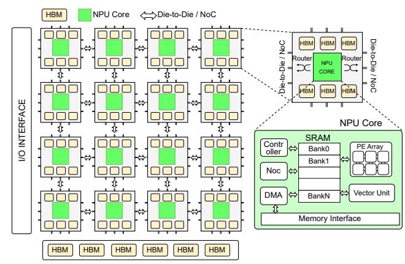

Figure 1. Hardware architecture of multi-core NPUs.

Although different multi-core NPUs exhibit variations in hardware configurations, their overall architectural designs remain the same. Figure 1 presents a representative architecture of multi-core NPUs, which typically comprises several key hardware modules: NPU cores, interconnect networks, on-chip and off-chip memory, as well as I/O interfaces. Each NPU core generally integrates multiple computational units, such as systolic arrays or matrix cubes, vector and scalar units. Additionally, these cores are equipped with local SRAM or scratchpad memory, DMA engines (if external memory is present), NoC routers. The NPU core serves as the smallest unit of computation scheduling, with multiple cores often integrated within a single chip or die.

As for the interconnect network, to balance hardware cost and scalability, current multi-core NPUs frequently adopt a 2D-mesh topology. These designs support various levels of communication granularity, such as core-to-core, die-to-die, and chip-to-chip interconnections, thereby enabling high-bandwidth, low-latency communication across different scales.

However, memory subsystems of multi-core NPUs exhibit considerable design diversity. Early designs, such as IPU [22] and Groq [2], typically utilize large on-chip SRAM as their sole memory resource, which restricts them to supporting only small model weights in a single chip. The Cerebras WSE [39] scales the on-chip SRAM to the wafer level; however, there remains a mismatch between memory capacity and compute potential. Recent advances [56, 81] have introduced external memory subsystems to multi-core NPUs, including globally shared HBM or core-local HBM realized through memory stacking. To accommodate the demands of LLM's inference, future multi-core NPUs will increasingly integrate high-speed, core-private memory resources, thus enabling highly scalable memory capacity and bandwidth that match the scaling of computational resources.

Table 1. Comparison of different methods for LLM inference.

|                 | Tensor Partition                              | Core Placement                       | Memory Management | Request Scheduling | PD Disaggregation | PD Fusion | Target Platform  |
|-----------------|-----------------------------------------------|--------------------------------------|----------------------|-----------------------|----------------------|--------------|------------------|
| <b>T10</b> [42] | AllGather                                     | Linear, 2D Mesh                      | SRAM                 | Not mentioned         | No                   | No           | IPU              |
| WaferLLM [25]   | AllGather, AllReduce                          | Interleaved Linear, 2D Mesh       | SRAM                 | Not mentioned         | No                   | No           | Cerebras WSE     |
| WSC-LLM [81]    | AllReduce                                     | 2D Mesh                              | HBM                  | Yes                   | Not optimal          | No           | Wafer-scale Chip |
| Our             | AllGather, AllReduce, AllGather+AllReducce | Interleaved Linear, Ring, 2D Mesh | SRAM+HBM             | Yes                   | Optimal              | Yes          | Multi-core Chip  |

#### 2.2 NPU Simulator

Recent years have witnessed significant advancements in NPU simulation frameworks. The design methodologies of mainstream NPU simulators can be categorized into two types: (1) cycle-accurate simulation, and (2) performance simulation based on analytical models.

*Cycle-accurate models* evaluate the target chip architecture by simulating each clock cycle, with common approaches including cycle-by-cycle simulation (cycle-loop simulation) or simulation at the Register Transfer Level (RTL). Previous works [5, 12-15, 24, 41, 45, 49, 51, 57, 66, 83, 85] have adopted this design methodology. Although such modeling can fully leverage low-level hardware details to obtain accurate hardware performance, they suffer from excessively long simulation times, making them ineffective for simulating workloads with heavy computational demands (e.g. LLM) or architectures with large-scale resources. Some prior works [21, 34, 84] have employed FPGAs to accelerate simulation, however the constrained hardware resources of FPGAs and the high engineering complexity still limit their ability to support large-scale architectural exploration. Consequently, employing cycle-accurate simulators in LLM inference scenarios results in considerable performance overheads, rendering end-to-end simulation of LLM serving impractical.

Performance models typically employ mathematical analysis to characterize latency, where the exact number of cycles can be derived through algebraic extrapolation. For example, most simulators estimate computational workload by dividing the computation volume of a single operator by the computing power of a systolic array or MAC array, and derive memory access latency by dividing the volume of weights by the available memory bandwidth. Prior studies [6, 23, 26, 29, 32, 33, 50, 61, 62, 77] have primarily employed performance simulators for design space exploration, neural network mapping, but lack sufficient focus on contemporary LLM inference serving scenarios. LLM serving differs fundamentally from traditional DNN and CNN inference, as it relies on an autoregressive model that consists of two stages: prefill and decoding, each with distinct performance characteristics. Moreover, LLM inference often employs a combination of parallelism strategies, including data parallelism (DP), tensor parallelism (TP), and pipeline parallelism (PP). Recent works [16, 60, 75, 76] have started to address these unique attributes of LLM serving and training workflows. However, these efforts predominantly focus on GPU clusters and the network simulation, lacking fine-grained modeling of the accelerator behavior and offering limited support for emerging multi-core NPU architectures. More importantly, simulators based on performance models are unable to accurately capture hardware modules with non-deterministic latencies, such as inter-core NoC congestion, asynchronous HBM accesses, and cache system unpredictability. All of these introduce significant discrepancies between actual latency and the estimations produced by performance models.

#### 2.3 Accelerating LLM serving for Multi-core NPUs

Prior research on multi-core NPU architecture has predominantly focused on optimizing GEMM and GEMV computations. Table 1 outlines the primary optimization strategies proposed in the literature. T10 [42] presents matrix computation optimizations for the IPU [22] chip, introducing the concept of "rotating tensors", which distributes input and weight tensors across different compute cores. Using a rotating all-gather scheme [10, 55, 68], it collects complete matrix weights from other NPU cores, and completes final result computation. WaferLLM [25] builds upon T10 and extends these techniques for the Cerebras WSE [39] platform. Given that current multi-core NPUs typically employ a 2D-mesh topology, certain nodes may need to traverse up to N hops to reach their logical neighbors during ring all-gather operations, which significantly reduces communication efficiency. To address this, WaferLLM introduces an interleaved arrangement, ensuring that the maximum hop count required in each ring all-gather is no more than two. However, these works still lack a comprehensive analysis of GEMM computation on multi-core architectures. For example, they primarily focus on all-gather-based GEMM, without analyzing the performance of all-reduce or combined all-reduce and all-gather strategies for distributed GEMM computations. WSC-LLM [81] further investigates the impact of HBM and interconnect bandwidth on LLM inference in multi-core NPU architectures, and proposes the PD disaggregation core placement strategy. However, WSC-LLM mainly targets wafer-scale multi-core NPUs and does not consider the effects of on-chip SRAM or NoC interconnects on LLM inference. To address these gaps, we conduct a systematic analysis for LLM serving acceleration techniques, including tensor partition, core placement, multi-level memory management, scheduling strategies, PD disaggregation and PD fusion. Our evaluation results offer valuable insights for the design of future multi-core NPU architectures and LLM serving systems.

# 3 NpuSim: a Multi-level Simulation Framework for Multi-core NPUs

To better investigate the impact of different hardware configurations on LLM inference performance in multi-core NPU architectures, we have developed NpuSim, an efficient simulation platform for dataflow-based multi-core architectures. NpuSim addresses two primary challenges: (1) efficiently and accurately simulating LLM inference tasks that are both computation-intensive and memory-intensive, and (2) effectively handling streaming requests that are prevalent in contemporary LLM serving scenarios.

#### 3.1 Multi-level Simulation

To balance simulation accuracy and speed, we employ a multi-level simulation approach as shown in Figure 2. The entire simulation system is divided into three components: the computing system, the memory system, and the on-chip routing system. Through careful analysis of these three components, we adopt a specific simulation level for each part.

For the computing system, we provide low-level primitive simulation implementations for various operators, as well as high-level abstractions of worker cores (e.g., prefill cores). Taking the Matmul operator as an example, we adopt a shape-aware performance model. When employing an  $N \times N$  systolic array, we first partition the weights and input activations into tiles and pad the last tile if necessary. The total computation latency is calculated as  $T_{\rm comp} = N_{\rm tiles} \times T_{\rm cycles} + T_{\rm inject}$ , where  $N_{\rm tiles}$  denotes the number of weight tiles,  $T_{\rm cycles}$  is the number of systolic cycles per tile, and  $T_{\rm inject}$  represents the latency for weight injection.

For the memory system, prior works often employ empirical bandwidth-based equations to estimate latency. However, high-bandwidth memory accesses exhibit characteristics such as out-of-order, outstanding and interleaving, simple empirical equations fail to accurately capture the true memory access latency. To address this, we adopt a transaction-level modeling (TLM) approach [53], decomposing each memory request into four phases: Begin\_Req, End\_Req, Begin\_Resp, and End\_Resp, enabling asynchronous event-driven simulation. This method achieves cycleaccurate simulation precision while maintaining high simulation efficiency.

For the routing system, arbitration, contention, and deadlock free guarantees must be carefully considered. Moreover, routing decisions significantly influence on-chip throughput and data flow patterns. To accurately capture these effects, we employ cycle-accurate simulation with a handshaking mechanism to model the router behavior. Notably, once a routing path is established (indicated by the successful exchange of handshake signals), we ensure that one packet can be transmitted per clock cycle. This allows us to accurately compute packet latency based on the number of data transmission over the established link. Therefore, although the routing simulation is cycle-accurate, it does not significantly degrade the overall simulation speed.

#### 3.2 Customized Scheduler

Previous works have primarily focused on CNN or static LLM simulations, in which a fixed batch of requests is executed once to obtain the simulation runtime. However, such simulation methodologies are significantly different from real-world LLM deployment scenarios. For typical LLM scenarios, an end-to-end performance evaluation requires executing the prefill stage once, followed by the multiple decoding stages. Simulation for LLM must handle dynamic graphs and scheduling, where the sequence length during prefill, the number of decoding steps and the arrival time can vary across different requests. We have implemented an iteration-level scheduler and monitor, which allows flexible configuration, such as the number of requests per iteration, prompt length, chunking prefill, and prefill-decoding stags. This design enables the customized scheduling strategies (e.g. PD Fusion, PD Disaggregation, Continuous Batching and etc). Details are provided in 4.3.

# 4 Optimizing LLM Serving Systems on Multi-core NPUs

Existing research primarily focuses on the simple batching strategy for model deployment, often neglecting the critical challenges encountered in the LLM serving scenario, such as dynamic user request scheduling and stringent SLO constraints. In contrast, LLM serving on GPU architectures has been extensively studied, including disaggregated and fused prefill-decoding designs, page attention mechanisms for efficient KV cache management, etc. Given that multicore NPUs employ dataflow computation paradigms with non-uniform memory architectures, traditional GPU-based scheduling and resource allocation strategies may not be transferrable for NPUs. Therefore, we conduct a comprehensive study on designing an efficient LLM serving framework for multi-core NPU architectures, from three aspects: tensor partition and core placement, hierarchy memory management, and PD strategies.

#### 4.1 Tensor Partition and Core Placement

Due to the dataflow computing paradigm employed by multicore NPU chips, their performance is highly sensitive to tensor partition and core placement strategies. Some prior work has investigated how to efficiently deploy GEMM operators on multi-core NPUs; however, these studies [25, 42] only propose AllGather strategy for a dedicated hardware

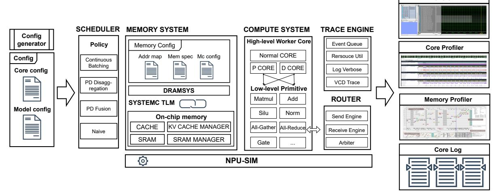

Figure 2. The overall design of NpuSim: Computing/memory/router sub-systems with tracing and scheduler models.

platform. In real-world serving scenarios, which involve diverse model sizes, sequence lengths, a one-decision-fits-all approach proves inadequate. Therefore, we conduct a systematic analysis of various tensor partition and core placement strategies, across different serving scenarios.

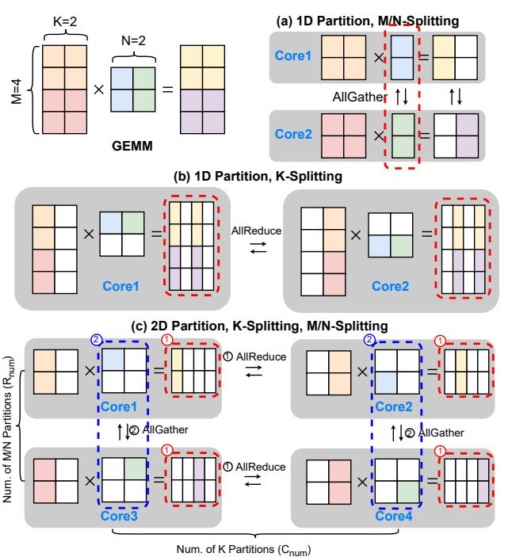

**Figure 3. Different tensor partition strategies:** For the GEMM operator, there exist three partition strategies: (1) 1-D partition along the M and N dimensions, which relies on the AllGather primitive; (2) 1-D partition along the K dimension, based on the AllReduce primitive; and (3) 2-D partition across the M/N and K dimensions, which leverages both AllReduce and AllGather primitives.

**Different tensor partition strategies:** We first analyze different tensor partition strategies for the GEMM operation

on the multi-core NPUs, as shown in Figure 3. Two key aspects must be considered when partitioning tensors: (1) which dimensions to partition and (2) how many dimensions to partition. As for the first consideration, both input and weight tensors can be partitioned, with each partition (partial input and weight) assigned to a dedicated NPU core. Partitioning tensors along the M and N dimensions requires the AllGather primitive to collect the whole *weight tensor* for computation. In contrast, partitioning along the K dimension employs the AllReduce primitive to aggregate the partial *results* (prior works [25, 42] still uses AllGather in this case, but it is not optimal). Figure 3-a and Figure 3-b illustrate these two partition approaches.

Waveform

As for the second consideration, when performing a 1-D partition of both input and weight tensors, the computation cannot be completed in a single iteration. Each core must execute a 1-D ring AllGather or AllReduce operation to collect the complete tensor or result within the N iterations (is equal to the number of partitions), as shown in Figure 3-a and Figure 3-b. Moreover, for 2-D partition, where the tensor is partitioned along both the M/N dimensions and the K dimension, it introduces more complex communication patterns among NPU cores. In this scenario, the NPU cores are organized into a 2D mesh topology, as shown in Figure 3-c. During computation, each core engages in the hybrid communication along both row and column directions. First, each core performs an AllReduce operation to aggregate partial results from cores within the same row. Second, it exchanges its partial input or weight tensor with other cores in the same column using the AllGather primitive. These two communication steps are iterated continuously until the full computation is completed.

Table 2 exhibits the theoretical communication overhead, maximum hops and memory cost of different tensor partition strategies mentioned above. The AllReduce primitive demonstrates better performance when the sequence length

is smaller than the hidden size (e.g., during chunked prefill).

**Different core placement strategies:** Besides tensor partition, the core placement strategy also plays a critical role in the performance of multi-core NPUs. We first divide all NPU cores into multiple pipelines, where each pipeline is responsible for processing one or more layers of the model. Within each pipeline, we employ the tensor partition with different placement strategies (1-D or 2-D, ring or sequence).

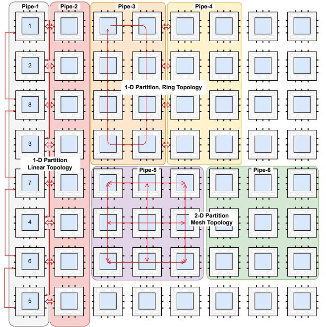

**Figure 4. Different core placement strategies:** Considering both inter-pipe and intra-pipe communication cost.

Under 1-D placement, there is various internal topologies such as ring topology (i.e., Pipe-3/4 in Figure 4), and interleaved linear topology (introduced by WaferLLM [25], Pipe-1/2 in Figure 4). Utilizing a ring topology aligns naturally with the behavior of ring-based AllGather and AllReduce operations, but may reduce the communication bandwidth between pipelines. Conversely, a linear topology offers higher inter-pipeline communication bandwidth. However, the logically adjacent nodes on the virtual ring may be physically distant, requiring two hops to complete a single communication. In the case of 2-D placement (Pipe-5/6), cores are organized using a 2-D mesh topology, which provides increased interconnections for intra-pipeline but reduces the inter-pipeline bandwidth. Within each dimension, cores are arranged according to an interleaved linear topology to minimize communication overhead. 2-D mesh placement offers the best theoretical performance, however it may be not suitable for all serving workloads, due to bandwidth limitations between pipelines and considering the overlap of computation and communication.

#### 4.2 Hierarchy Memory Management

Current multi-core NPUs often adopt a non-uniform memory architecture to enhance core scalability. However, this memory design introduces new challenges for LLM serving, such as how to manage KV cache, weight and activation across different requests. Prior work, such as WaferLLM, addresses the limited memory capacity on individual cores by offloading the KV cache to other compute cores. However, this design primarily targets multi-core NPUs lacking HBM support, such as the Cerebras WSE. However, contemporary multi-core NPU architectures tend to integrate HBMs adjacent to compute cores to support larger model parameters and extended context lengths. Considering such memory hierarchy in multi-core NPUs, we propose a hybrid-granularity memory management system designed to efficiently orchestrate memory objects across different levels.

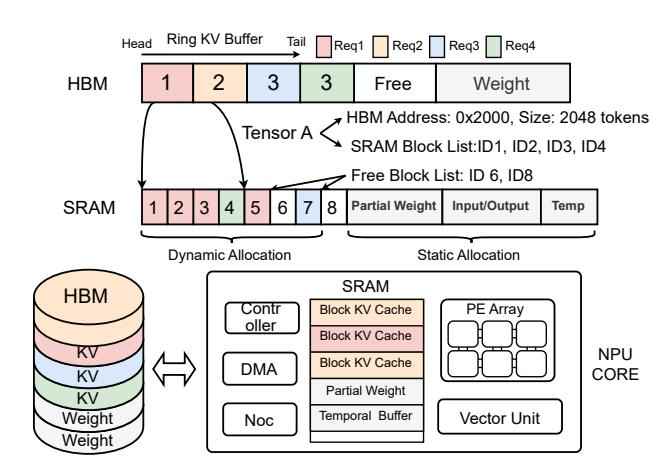

Figure 5. Multi-grained KV cache management for different memory hierarchies in NPUs: We adopt the finegrained memory management for SRAM in block level, while adopts coarse-grained management for HBM in buffer level. The SRAM memory is also elaborately allocated for KV cache blocks, partial weight, activation and etc.

KV cache management: We categorize the memory requirements during LLM serving into four types: KV cache, model weights, inputs and activations, and temporary buffers. With integration of HBM, we do not need to reserve the KV cache in the SRAM of other NPU cores, since on-chip SRAM capacity is much smaller than HBM capacity, and the inter-core bandwidth does not significantly exceed the bandwidth of HBM. Instead, we store KV cache across SRAM and HBM at different granularities. Due to the limited size of SRAM, we adopt a fine-grained management approach for KV cache in SRAM, while employing a coarse-grained management scheme for KV cache in HBM. In SRAM, the KV cache is managed at the block granularity, and a complete KV cache may comprise multiple non-contiguous blocks. For example, as shown in Figure 5, only request 1 is active at the beginning, and its KV cache grows incrementally at the block granularity. Upon the arrival of requests 2 and 3, KV cache

Table 2. Communication and memory cost of different tensor partition strategies. Input/Weight/Output Tensor represents the memory cost for each NPU core; Total Communication represents the total amount of data transferred among one NPU core during the entire GEMM computation;  $Max\ Hop$  represents the maximum number of hops required for data transfer between two NPU cores,  $\alpha$  is usually 2; Num,  $R_{num}$ ,  $C_{num}$  represent the number of overall partition, row partitions, and column partitions, respectively.

|                         | Input Tensor                              | Weight Tensor                              | Output Tensor                              | <b>Total Communication</b>                                                                                                                 | Max Hop      |
|-------------------------|----------------------------------------------|-----------------------------------------------|-----------------------------------------------|--------------------------------------------------------------------------------------------------------------------------------------------|-----------------|
| Input-only Partition | input_size num                            | weight_size                                   | output_size num                            | 0                                                                                                                                          | 0               |
| 1-D Partition (M/N)     | input_size num                            | weight_size num                            | output_size num                            | $\frac{num-1}{num} 	imes (K 	imes N)$                                                                                                      | $1 \sim \alpha$ |
| 1-D Partition (K)       | $\frac{input\_size}{num}$                    | weight_size num                            | output_size num                            | $2 \times \frac{num-1}{num} \times (M \times N)$                                                                                           | $1 \sim \alpha$ |
| 2-D Partition           | $\frac{input\_size}{R_{num} \times C_{num}}$ | $\frac{weight\_size}{R_{num} \times C_{num}}$ | $\frac{output\_size}{R_{num} \times C_{num}}$ | $(R_{num}-1)\times(2\times\frac{C_{num}-1}{C_{num}}\times\frac{M\times N}{C_{num}\times C_{num}}+\frac{K\times N}{C_{num}\times R_{num}})$ | $1 \sim \alpha$ |

blocks are allocated in an interleaved manner. To correctly index the KV cache blocks for each request, we construct a linked list of blocks' ID for each request's KV tensor. Additionally, we maintain another linked list of free blocks within SRAM. Once a request completes, the block IDs it occupied are returned to the free block list.

However, as the KV cache continues to grow, it becomes impossible to store the entire KV cache in the SRAM. Thus, we spill the overflow KV cache from SRAM to HBM. Given that HBM offers a much larger capacity compared to SRAM and provides better performance for sequential read and write operations, we employ a coarse-grained management strategy for the KV cache in HBM. Specifically, we allocate the entire KV buffer (with maximum token length) for each request and organize HBM as a ring buffer structure.

Weight and activation management: In addition to reserving the KV cache, SRAM may also hold model weights, activations/inputs, and temporary buffers used for computation and communication. During the prefill phase and the FFN stage, the NPU cores primarily execute GEMM operations, making computation the main performance bottleneck. Therefore, reserving a modest amount of buffer in SRAM for intermediate results of matrix computations is sufficient. Allocating more SRAM capacity to the compute units has minimal impact on overall performance. Moreover, since the multi-core NPU employs an inter-core interconnect architecture, communication data such as activations must also be stored in SRAM. Therefore, we reserve dedicated SRAM buffers for activations and input data to facilitate the intrinsic data flow characteristic of LLM workloads. Finally, if residual SRAM capacity remains after these allocations, more model weights can be stored in SRAM.

Given a LLM model, we utilize our custom-designed simulator to determine the optimal allocation ratios of various buffers between SRAM and HBM based on the model's architecture, weight size, maximum output token length, and micro-batch size. Initially, we calculate the required SRAM capacity for storing inputs and activations, as well as temporary buffers used for computation and communication.

After this, we allocate the remaining SRAM space for the KV cache and weight on a best-effort basis.

#### 4.3 PD Disaggregation and PD Fusion

PD disaggregation or PD fusion designs are commonly employed to improve GPU resource utilization. For multi-core NPUs, there is also an imbalance in resource utilization between the prefill and decoding phases. Thus, adopting PD disaggregation or PD fusion strategies is also effective but introduces new challenges.

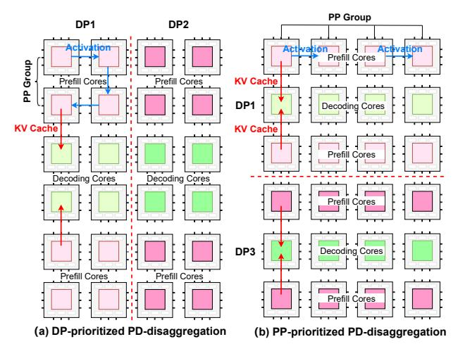

**Figure 6. Different PD disaggregation strategies:** Figure (a) illustrates the DP-prioritized core placement strategy for PD disaggregation; Figure (b) illustrates the PP-prioritized core placement strategy.

#### 4.3.1 PD Disaggregation on multi-core NPUs.

Core placement for PD-disaggregation: For PD disaggregation, the multi-core architecture facilitates flexible allocation of on-chip cores, enabling a subset of cores to be assigned to the prefill stage, while the remaining cores are dedicated to the decoding stage. Previous studies [81] have employed a DP-prioritized core-placement strategy. As shown in Figure 6-(a), all cores are first grouped according to a predefined data parallelism (e.g., DP=4). Within each group, the cores

are assigned to prefill and decoding tasks based on a specified ratio. However, a more effective strategy is to prioritize pipeline-parallelism in core placement. In pipeline-parallel execution, each core utilizes only a single interconnect channel within the 2D mesh topology, allowing the remaining interconnect channels to be leveraged for KV cache transfer from prefill cores to decoding cores. Figure [6-](#page-6-2)(b) illustrates a pipeline-parallel prioritized placement strategy. This scheme maximizes the communication bandwidth between prefill and decoding cores, but not affects data transferring in pipeline-parallel execution. Furthermore, we place prefill cores at the two sides and decoding cores at the center to minimize the latency of KV cache transferring.

Parallel strategies for PD-disaggregation: Besides the core placement strategy, PD disaggregation also requires careful consideration of the parallel strategies for prefill and decoding stages (e.g., determining the number of TP and PP sizes). During the prefill stage, requests can stream into the prefill cores without waiting for preceding tasks to complete, which allows for efficient pipeline parallelism. In contrast, the decoding stage relies on auto-regressive computation; the generation of subsequent tokens depends on the completion of the previous token's computation. Pipeline parallelism incurs an − increase (where is the number of pipeline stages) in both decoding latency and the amount of KV cache reserved per core. In contrast, tensor parallelism offers improved decoding latency, but may reduce throughput due to increased communication overhead. Consequently, the choice of parallelization strategy for PD disaggregation should be determined by the specific SLO requirements.

Heterogeneous core design for PD-disaggregation: Given the distinct computational characteristics of the prefill and decoding stages, it is advantageous to deploy heterogeneous cores for each stage. For example, decoding cores can be provisioned with additional memory resources, such as expanded SRAM capacity, HBM modules, and increased memory interfaces, while their computational resources are reduced, like narrowing the width of the systolic arrays and vector lanes. By adjusting the allocation of compute and memory resources in the decoding cores, the impact on GEMM computation during decoding is minimal, as the request's batch size in the decoding stage is typically small. However, this approach greatly enhances GEMV computation performance and enables handling more requests during the decoding stage.

Although adopting heterogeneous PD cores constrains the ratio of prefill and decoding cores, the advantages introduced by heterogeneity can effectively compensate for these constraints. Moreover, our simulator enables us to explore optimal heterogeneous configurations and PD core ratios, resulting in consistent performance improvements across a wide range of mainstream model sizes.

Table 3. Chip configuration space for evaluation.

| Parameter                  | Large-core     | Small-core     |
|----------------------------|----------------|----------------|
| # of cores                 | 64             | 256            |
| Core frequency             | 500 MHz        | 500 MHz        |
| Systolic array size        | 32×32–128×128  | 32×32–64×64    |
| Vector unit (64 ALUs/lane) | 32–128 lanes   | 32–64 lanes    |
| SRAM per core              | 8–128 MB       | 8–48 MB        |
| SRAM bandwidth per core    | scaled with SA | scaled with SA |
| NoC bandwidth              | 16–480 GB/s×4  | 8–160 GB/s×4   |
| HBM bandwidth per core     | 30–480 GB/s    | 15–60 GB/s     |

4.3.2 PD Fusion on multi-core NPUs. Unlike PD disaggregation, which requires a fixed core ratio for prefill and decoding tasks, PD fusion allows a single core to simultaneously handle both prefill and decoding requests. To support this, we propose a dedicated scheduler that co-locates prefill and decoding workloads, ensuring that both TBT (Time Between Token) and TTFT (Time To First Token) requirements are satisfied. To prevent prefill operations from excessively interrupting decoding process, we adopt the chunked prefill strategy [\[4\]](#page-11-27), in which prefill requests are divided into fixed-size chunks. Each core is provisioned with a maximum budget size: the decoding task occupies one unit of budget, while the prefill task consumes units. When the number of decoding tasks exceeds the assigned budget, the scheduler prioritizes decoding requests to minimize stall caused by the prefill task. Conversely, when the number of decoding workloads is below the budget threshold, the scheduler will assign the budget for the chunked prefill.

In the PD fusion scenario, the parallelism strategies for the prefill and decoding stages must be the same. However, the optimal parallelization approaches for prefill and decoding on multi-core NPUs are not identical: pipeline parallelism (PP) is preferred for the prefill stage, while tensor parallelism (TP) is more advantageous during decoding stage. Given that PD fusion inherently increases the TBT, we prefer to adopt TP for both stages within PD fusion.

### 5 EVALUATION

#### 5.1 Experiment Setup

We first validate the accuracy and efficiency of NpuSim. NpuSim integrates certain modules from existing simulators, such as ONNXim [\[23\]](#page-11-17) and Dramsys [\[67\]](#page-13-23). Subsequently, we test different serving strategies on various LLM models and workloads. Finally, based on our experimental results, we provide guidances for optimal hardware configurations and serving system design.

Chip configurations: We consider a variety of hardware configurations for multi-core NPUs, as summarized in Table [3.](#page-7-0) These configurations encompass the number of cores, compute capability, SRAM size and bandwidth, HBM capacity and bandwidth, among other parameters.

Model selection: We use Qwen3 models with parameter sizes ranging from 1.7B to 32B, along with a 30B-A3B MoE model in the following experiments, to ensure the completeness of our evaluation results.

**Workloads** In LLM serving scenarios, we reference industrial traces, including [64] and [43]. Guided by these, we employ two distinct workloads: prefill-dominated and decodedominated.

#### 5.2 Simulator Validation

**Figure 7.** End-to-end latency comparison of Qwen3\_4B on the NpuSim and Ascend-NPU hardware (left), and accuracy-performance tradeoff for different modes of NpuSim (right).

Figure 7 (left) compares the end-to-end latency of the Qwen3\_4B model running on NpuSim with that on Ascend-NPU-910B [38] hardware. The experiments were conducted with different decoding sequence lengths (128 and 256) and batch sizes (8 to 64). Under the same hardware configurations, the simulation runtime of NpuSim closely matches the execution time in real hardware. Although real execution is influenced by factors such as hardware resource utilization and software optimizations, NpuSim maintains alignment with actual performance trends.

Figure 7 (right) illustrates the impact of two simulation modes on runtime efficiency and accuracy. For memory and interconnect operations, NpuSim supports both cycle-accurate simulation and performance-model-based simulation. We tested of Qwen3\_4B on different workloads, with the first three (C1 to C3) representing memory-intensive scenarios, and the remaining representing compute-intensive ones. The results indicate that in memory-intensive scenarios, performance model simulation can reduce real-time execution cost by 4.93x to 11.27x, but introduces up to 38.56% error. In compute-intensive scenarios, accuracy can be maintained within 3% due to the deterministic computation. Since LLM serving involves both memory-intensive and compute-intensive scenarios, we adopt cycle-accurate simulation for memory system in our subsequent evaluations.

#### 5.3 Hardware Configuration Space Exploration:

Fig. 8 presents single-request latency for Qwen3 models under varying hardware configurations, examining single-core SRAM size, systolic array dimension, and HBM bandwidth. In this case, fix the number of NPU cores to 64, the TP size to 4, and prefill-decoding-ratio to 5:1.

For small models with large SRAM (e.g., 4B), HBM bandwidth changes have negligible effect on latency due to low SRAM pressure and minimal spillover to HBM. In contrast, for large models (e.g., 32B), increasing both systolic array

dimension and HBM bandwidth can reduce latency by up to 1.4x, indicating that LLM inference is constrained by both compute performance and memory bandwidth. Regarding SRAM size, when the model weights exceed the capacity of SRAM (e.g., 32B model), increasing SRAM size has minimal impact on end-to-end latency. This is because both model weights and the KV cache frequently overflow, causing SRAM to serve as a temporary computation buffer. Only when the SRAM capacity is close to the size of model weight does it accelerate the LLM inference.

#### 5.4 TP and Core Placement:

Different TP partition strategies: Fig. 9 compares latency across different TP partition strategies (TP=4) as input sequence length varies. When the input sequence length is smaller than the model's hidden dimension, K-dimension partition delivers superior performance. For instance, under Qwen3\_4B with sequence length 256, it is 6.03x faster than MN-dimension partition. However, once the sequence length surpasses the hidden dimension, the performance of K-dimension partition degrades sharply. Compared with 1D partitioning (MN), 2D partitioning (MNK) demonstrates superior performance, achieving an average speedup of 1.44x. This observation is consistent with our theoretical performance analysis(§4.1).

Core placement strategy: Figure 10 presents the end-toend latency of single-request execution under different core placement strategies. In this setting, linear-seq denotes the routing scheme in T10 [42] that strictly follows core index order, while linear-interleave refers to the Wafer-LLM [25] mapping strategy that limits each transmission to at most two hops. Our evaluation is established on 64 cores for TP=4 and 256 cores for TP=16.

For TP=4, linear-interleave and linear-seq deliver comparable performance, whereas mesh and ring topologies achieve a speedup of 1.17x. At smaller TP scales, improvements from alternative topologies are marginal. When TP increases to 16, the benefits of optimized core placement become more pronounced. Relative to linear-interleave, linear-seq, mesh and ring strategies yield maximum speedups of 1.18x, 1.25x, and 1.32x, respectively. Although Wafer-LLM experiments on Cerebras concluded that linear-interleave is optimal, its effectiveness may differ on other platforms. In our implementation, to ensure deadlock-free inter-core communication, we incorporated a channel-locking mechanism, which in turn diminished the performance of interleaved communication. Conversely, the mesh and ring mappings proved more effective on our hardware.

#### 5.5 LLM Serving

All experiments in this section apply the previously summarized optimal strategy that best suits the corresponding scenario.

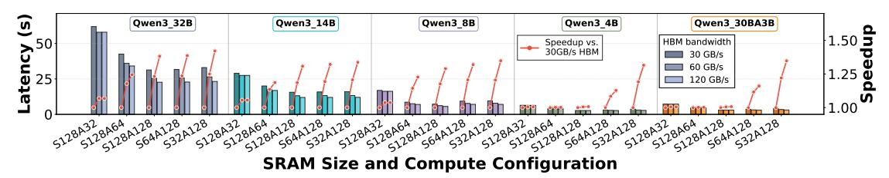

**Figure 8. Single-request latency of Qwen3 models under varying hardware configurations**. The x-axis denotes different SRAM-compute configurations (e.g., "S32A12" represents 32MB SRAM and 128 × 128 systolic array).

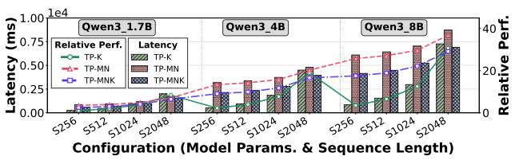

**Figure 9.** Impact of TP partition strategies on request latency across varying input sequence lengths.

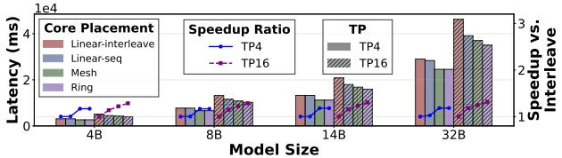

**Figure 10.** Latency of single-request execution under different core placement strategies.

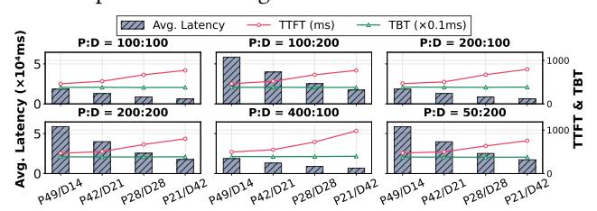

**Figure 11.** The effect of prefill-decoding core ratio on LLM serving performance.

Different core ratios in PD disaggregation: We evaluated the impact of varying prefill-decoding core ratios on LLM serving performance under different workloads (input:output ratios). In this evaluation, we take Qwen3\_4B with 64 cores as an example. As shown in Fig. 11, increasing prefill cores consistently reduce TTFT (Time to First Token) across all tasks. For example, P49/D14 achieve 40% performance improvement compared with P21/D42. Conversely, increasing decoding cores significantly reduce end-to-end latency. For instance, in the 100:100 task, P21/D42 lowers latency by 68% compared with P49/D14. While the number of decode cores has a negligible impact on the TBT (Time Between Token) for an individual request, a larger quantity of cores provides more scheduling resources and enables higher throughput under a high-request load.

Balancing all SLO requirements, P42/D21 achieved superior overall performance: compared with P49/D14, TTFT increased by only 13% while TBT dropped by >30%; compared with P28/D28, TTFT decreased by 22% at a modest 10% TBT increase. This trade-off provided an optimal balance between

prompt first-token response and sustained throughput.

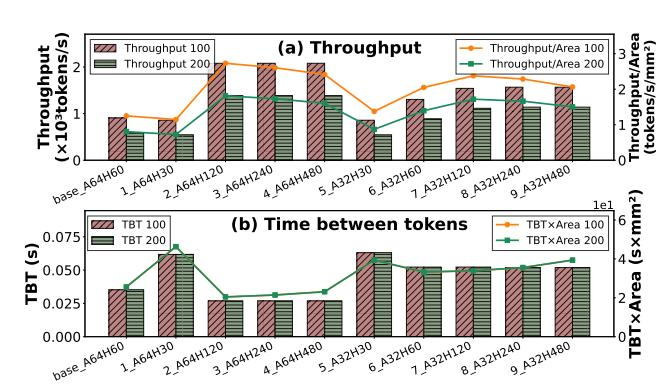

Figure 12. The effects of different hardware configurations on serving throughput, TBT for heterogeneous PD disaggregation scenarios. The X-axis represents different configurations for the decoding core: "A" denotes the dimension of the systolic array, and "H" denotes the per-core HBM bandwidth (in GB/s).

Heterogeneous core design for PD disaggregation: We investigate heterogeneous resource for prefill and decode cores by varying two key architectural parameters: systolic array dimensions and HBM bandwidth. We consider the compute-intensive nature of prefill and the memory-intensive of decoding, and automatically adjust SRAM bandwidth to match the computational capability of the systolic array. All experiments adopt the prefill:decode core ratio of 2:1, which is the optimal configuration in the prior measurement. Meanwhile, based on TSMC's 7nm process, we calculated the chip area per unit of computational power, HBM interface and SRAM.

As illustrated in Fig. 12(a), increasing the HBM bandwidth of decode cores yields up to a 2.28x improvement in throughput and a 2.18x increase in throughput per unit of chip area (Configuration 2). Beyond this point, further bandwidth increases (Configurations 3-4) no longer improve throughput, indicating a shift in the performance bottleneck from memory bandwidth to computational capacity. On the other hand, we can reduce the computational capacity of the decoding cores with minimal impact on overall throughput. For example, when the dimension of systolic array is reduced from 64 to 32 (Configuration 7), the throughput per unit chip area reaches 1.9x of the homogeneous settings.

Fig. 12(b) illustrates the relationship between TBT and heterogeneous configurations. In the dataflow mode, increasing the batch size does not significantly affect TBT. Similar

to throughput, either increasing the decoding core bandwidth or reducing its compute capacity can yield better TBT performance per unit chip area. Compared to the optimal configuration for throughput, the optimal configuration for TBT may differ slightly. For example, the A32H60 configuration already achieves the best.

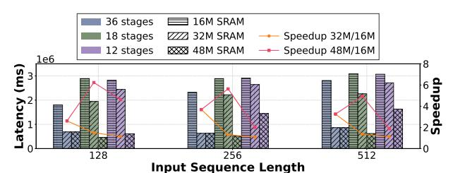

**Figure 13.** End-to-end latency of PD fusion with different input token lengths, per-core SRAM sizes, and pipeline stage counts for Qwen3 8B (TP = 4) on 256 cores.

Hardware optimization under PD fusion: Fig. 13 presents the impact of input token length, SRAM capacity, and pipeline stage count on end-to-end latency under PD fusion. For pipeline stages, fewer stages means each core processes more layers, thereby achieving greater data parallelism (DP). However, this also increases the memory pressure on each core, resulting in more frequent SRAM spilling. Therefore, with small SRAM size (16MB), 32 pipeline stages achieves 1.1x-1.61x performance improvement compared to the 18 and 12 pipeline stages, respectively.

As the memory pressure increases due to the PD fusion design, increasing the SRAM capacity leads to more significant improvements in inference performance. For example, expanding the SRAM from 16 MB to 32 MB results in a 2.6x-3.7x performance speedup. In addition, a larger SRAM capacity can also exploit the advantages of data parallelism. For instance, with a large per-core SRAM (48MB), setting the pipeline stages to 18 can achieve the optimal performance.

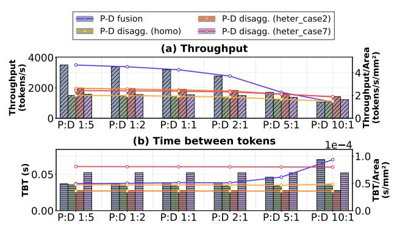

**Figure 14.** Throughput and TBT comparison between PD disaggregation and PD fusion under varying input/output tokens ratios for Owen3 4B on a 64-core chip.

Comparison of PD Disaggregation and PD Fusion: Fig. 14 compares throughput and TBT for PD disaggregation and

PD fusion under various workloads. To highlight the advantage of heterogeneous PD disaggregation, we compare two high-performing heterogeneous configurations and a homogeneous baseline against PD fusion.

As for throughput, when prefill/decode token ratio is below 1, PD fusion delivers over 2.3x the throughput of PD disaggregation and 1.77-2.3x higher throughput per unit chip area, due to idle cores in PD disaggregation during decodeheavy phases. As the number of prefill tokens increases, the throughput of heterogeneous PD disaggregation gradually approaches that of PD fusion. At a ratio of 10, PD disaggregation even achieves 1.34x higher throughput. This is because, under long prefill scenarios, PD fusion incurs more redundant computations due to the chunk prefill. As for TBT, PD disaggregation maintains stable performance across varying workloads, whereas PD fusion experiences a significant increase in TBT, up to 2.57x higher, as each core processes chunked prefill and decoding together.

## 5.6 Guidance for NPU Hardware Architecture and LLM System Design

Benefiting from our NpuSim simulator and a comprehensive analysis of LLM serving strategies, we draw the following conclusions regarding multi-core NPU hardware architecture design and LLM serving systems based on multi-core architectures:

- Tensor parallelism and core placement: When the sequence length is short or chunked prefill is enabled, performing AllReduce GEMM operations is more efficient. In contrast, for long-prompt scenarios without chunked prefill, AllGather or a combination of AllGather and AllReduce GEMM operations is preferable. Moreover, arranging cores in a ring topology better aligns with the Ring-AllReduce/Ring-AllGather communication pattern and offers greater generality compared to more complex interleaved sequence placements.
- On-Chip SRAM design: Due to the fine-grained management for on-chip SRAM, the performance benefits from increasing SRAM capacity are limited, unless the entire model's weights can fit into SRAM.
- LLM serving system design: For LLM serving workloads, heterogeneous PD disaggregation yields better performance in prefill-dominated scenarios, whereas PD fusion is preferable for decode-dominated workloads.

#### 6 CONCLUSION

In this paper, we systematically analyze the hardware architecture design of multi-core NPUs and optimization strategies for LLM serving scenarios. Leveraging our efficient and configurable multi-core NPU simulator, we explore various hardware configuration strategies, tensor parallelism and core placement methods, as well as PD-disaggregation and PD-fusion techniques. Experimental results demonstrate that

our solution achieves an 1.32x-6.03x performance improvement over other SOTA works. We hope that our findings will inspire further architectural innovations and system-level optimizations for multi-core NPUs in LLM serving.

#### References

-  2025. GitHub Copilot documentation. https://docs.github.com/en/ copilot. Referenced August 2025.
- [2] Dennis Abts, Garrin Kimmell, Andrew Ling, John Kim, Matt Boyd, Andrew Bitar, Sahil Parmar, Ibrahim Ahmed, Roberto DiCecco, David Han, John Thompson, Michael Bye, Jennifer Hwang, Jeremy Fowers, Peter Lillian, Ashwin Murthy, Elyas Mehtabuddin, Chetan Tekur, Thomas Sohmers, Kris Kang, Stephen Maresh, and Jonathan Ross. 2022. A software-defined tensor streaming multiprocessor for large-scale machine learning. In Proceedings of the 49th Annual International Symposium on Computer Architecture (New York, New York) (ISCA '22). Association for Computing Machinery, New York, NY, USA, 567–580. doi:10.1145/3470496.3527405
- [3] Amey Agrawal, Nitin Kedia, Ashish Panwar, Jayashree Mohan, Nipun Kwatra, Bhargav Gulavani, Alexey Tumanov, and Ramachandran Ramjee. 2024. Taming {Throughput-Latency} tradeoff in {LLM} inference with {Sarathi-Serve}. In 18th USENIX Symposium on Operating Systems Design and Implementation (OSDI 24). 117–134.
- [4] Amey Agrawal, Ashish Panwar, Jayashree Mohan, Nipun Kwatra, Bhargav S. Gulavani, and Ramachandran Ramjee. 2023. SARATHI: Efficient LLM Inference by Piggybacking Decodes with Chunked Prefills. arXiv:2308.16369 [cs.LG] https://arxiv.org/abs/2308.16369
- [5] Jorge Albericio, Patrick Judd, Tayler Hetherington, Tor Aamodt, Natalie Enright Jerger, and Andreas Moshovos. 2016. Cnvlutin: Ineffectual-Neuron-Free Deep Neural Network Computing. In 2016 ACM/IEEE 43rd Annual International Symposium on Computer Architecture (ISCA). 1–13. doi:10.1109/ISCA.2016.11
- [6] Tanner Andrulis, Joel S. Emer, and Vivienne Sze. 2024. CiMLoop: A Flexible, Accurate, and Fast Compute-In-Memory Modeling Tool. In 2024 IEEE International Symposium on Performance Analysis of Systems and Software (ISPASS).
- [7] AWS. 2024. GNeuronCore-v2 Architecture. https://awsdocs-neuron.readthedocs-hosted.com/en/latest/general/arch/neuron-hardware/neuron-core-v2.html. Referenced January 2024.
- [8] Jinze Bai, Shuai Bai, Yunfei Chu, Zeyu Cui, Kai Dang, Xiaodong Deng, Yang Fan, Wenbin Ge, Yu Han, Fei Huang, et al. 2023. Qwen technical report. arXiv preprint arXiv:2309.16609 (2023).
- [9] Felix Brakel, Uraz Odyurt, and Ana-Lucia Varbanescu. 2024. Model parallelism on distributed infrastructure: A literature review from theory to LLM case-studies. arXiv preprint arXiv:2403.03699 (2024).
- [10] Lynn Elliot Cannon. 1969. A cellular computer to implement the Kalman filter algorithm. Montana State University.
- [11] Li Chen, Penghao Wu, Kashyap Chitta, Bernhard Jaeger, Andreas Geiger, and Hongyang Li. 2024. End-to-end autonomous driving: Challenges and frontiers. IEEE Transactions on Pattern Analysis and Machine Intelligence (2024).
- [12] Tianshi Chen, Zidong Du, Ninghui Sun, Jia Wang, Chengyong Wu, Yunji Chen, and Olivier Temam. 2014. Diannao: A small-footprint high-throughput accelerator for ubiquitous machine-learning. ACM SIGARCH Computer Architecture News 42, 1 (2014), 269–284.
- [13] Yunji Chen, Tao Luo, Shaoli Liu, Shijin Zhang, Liqiang He, Jia Wang, Ling Li, Tianshi Chen, Zhiwei Xu, Ninghui Sun, and Olivier Temam. 2014. DaDianNao: A Machine-Learning Supercomputer. In 2014 47th Annual IEEE/ACM International Symposium on Microarchitecture. 609– 622. doi:10.1109/MICRO.2014.58
- [14] Yu-Hsin Chen, Tushar Krishna, Joel S Emer, and Vivienne Sze. 2016. Eyeriss: An energy-efficient reconfigurable accelerator for deep convolutional neural networks. *IEEE journal of solid-state circuits* 52, 1

- (2016), 127-138.
- [15] Yu-Hsin Chen, Tien-Ju Yang, Joel Emer, and Vivienne Sze. 2019. Eyeriss v2: A Flexible Accelerator for Emerging Deep Neural Networks on Mobile Devices. *IEEE Journal on Emerging and Selected Topics in Circuits and Systems* 9, 2 (2019), 292–308. doi:10.1109/JETCAS.2019. 2910232
- [16] Jaehong Cho, Minsu Kim, Hyunmin Choi, Guseul Heo, and Jongse Park. 2024. LLMServingSim: A HW/SW Co-Simulation Infrastructure for LLM Inference Serving at Scale. In 2024 IEEE International Symposium on Workload Characterization (IISWC). 15–29. doi:10.1109/IISWC63097. 2024.00012
- [17] Jack Choquette and Wish Gandhi. 2020. Nvidia a100 gpu: Performance & innovation for gpu computing. In 2020 IEEE Hot Chips 32 Symposium (HCS). IEEE Computer Society, 1–43.
- [18] Cursor. 2025. The AI Code Editor. https://cursor.com/en. Referenced August 2025.
- [19] M. R. Endsley. 2017. Autonomous Driving Systems: A Preliminary Naturalistic Study of the Tesla Model. In *Journal of Cognitive Engineering* and Decision Making.
- [20] Amin Firoozshahian, Joel Coburn, Roman Levenstein, Rakesh Nattoji, Ashwin Kamath, Olivia Wu, Gurdeepak Grewal, Harish Aepala, Bhasker Jakka, and Bob Dreyer. 2023. Mtia: First generation silicon targeting meta's recommendation systems. In Proceedings of the 50th Annual International Symposium on Computer Architecture. 1–13.
- [21] Hasan Genc, Seah Kim, Alon Amid, Ameer Haj-Ali, Vighnesh Iyer, Pranav Prakash, Jerry Zhao, Daniel Grubb, Harrison Liew, Howard Mao, Albert Ou, Colin Schmidt, Samuel Steffl, John Wright, Ion Stoica, Jonathan Ragan-Kelley, Krste Asanovic, Borivoje Nikolic, and Yakun Sophia Shao. 2021. Gemmini: Enabling Systematic Deep-Learning Architecture Evaluation via Full-Stack Integration. In 2021 58th ACM/IEEE Design Automation Conference (DAC). 769–774. doi:10. 1109/DAC18074.2021.9586216
- [22] Graphcore. 2024. Intelligence processing unit. https://www.graphcore. ai/products/ipu. Referenced January 2024.
- [23] Hyungkyu Ham, Wonhyuk Yang, Yunseon Shin, Okkyun Woo, Guseul Heo, Sangyeop Lee, Jongse Park, and Gwangsun Kim. 2024. ONNXim: A Fast, Cycle-Level Multi-Core NPU Simulator. *IEEE Computer Architecture Letters* 23, 2 (2024), 219–222. doi:10.1109/LCA.2024.3484648
- [24] Song Han, Xingyu Liu, Huizi Mao, Jing Pu, Ardavan Pedram, Mark A. Horowitz, and William J. Dally. 2016. EIE: Efficient Inference Engine on Compressed Deep Neural Network. In 2016 ACM/IEEE 43rd Annual International Symposium on Computer Architecture (ISCA). 243–254. doi:10.1109/ISCA.2016.30
- [25] Congjie He, Yeqi Huang, Pei Mu, Ziming Miao, Jilong Xue, Lingxiao Ma, Fan Yang, and Luo Mai. 2025. WaferLLM: Large Language Model Inference at Wafer Scale. arXiv:2502.04563 [cs.LG] https://arxiv.org/abs/2502.04563
- [26] Guseul Heo, Sangyeop Lee, Jaehong Cho, Hyunmin Choi, Sanghyeon Lee, Hyungkyu Ham, Gwangsun Kim, Divya Mahajan, and Jongse Park. 2024. Neupims: Npu-pim heterogeneous acceleration for batched Ilm inferencing. In Proceedings of the 29th ACM International Conference on Architectural Support for Programming Languages and Operating Systems, Volume 3, 722–737.
- [27] Connor Holmes, Masahiro Tanaka, Michael Wyatt, Ammar Ahmad Awan, Jeff Rasley, Samyam Rajbhandari, Reza Yazdani Aminabadi, Heyang Qin, Arash Bakhtiari, Lev Kurilenko, et al. 2024. Deepspeed-fastgen: High-throughput text generation for llms via mii and deepspeed-inference. arXiv preprint arXiv:2401.08671 (2024).
- [28] Wenyi Hong, Weihan Wang, Qingsong Lv, Jiazheng Xu, Wenmeng Yu, Junhui Ji, Yan Wang, Zihan Wang, Yuxiao Dong, Ming Ding, and Jie Tang. 2024. CogAgent: A Visual Language Model for GUI Agents. In Proceedings of the IEEE/CVF Conference on Computer Vision and Pattern Recognition (CVPR). 14281–14290.
- [29] M. Horeni, P. Taheri, P. Tsai, A. Parashar, J. Emer, and S. Joshi. 2022.

- Ruby: Improving Hardware Efficiency for Tensor Algebra Accelerators Through Imperfect Factorization. In 2022 IEEE International Symposium on Performance Analysis of Systems and Software (ISPASS).
- [30] Cunchen Hu, Heyang Huang, Junhao Hu, Jiang Xu, Xusheng Chen, Tao Xie, Chenxi Wang, Sa Wang, Yungang Bao, Ninghui Sun, et al. 2024. Memserve: Context caching for disaggregated llm serving with elastic memory pool. arXiv preprint arXiv:2406.17565 (2024).
- [31] Xu Huang, Weiwen Liu, Xiaolong Chen, Xingmei Wang, Hao Wang, Defu Lian, Yasheng Wang, Ruiming Tang, and Enhong Chen. 2024. Understanding the planning of LLM agents: A survey. arXiv preprint arXiv:2402.02716 (2024).
- [32] Soojin Hwang, Sunho Lee, Jungwoo Kim, Hongbeen Kim, and Jaehyuk Huh. 2023. mNPUsim: Evaluating the Effect of Sharing Resources in Multi-core NPUs. In 2023 IEEE International Symposium on Workload Charcterization (IISWC). doi:10.1109/IISWC59245.2023.00018
- [33] Mahmoud Khairy, Zhesheng Shen, Tor M. Aamodt, and Timothy G. Rogers. 2020. Accel-Sim: An Extensible Simulation Framework for Validated GPU Modeling. In 2020 ACM/IEEE 47th Annual International Symposium on Computer Architecture (ISCA). 473–486. doi:10.1109/ ISCA45697.2020.00047
- [34] Seah Kim, Jerry Zhao, Krste Asanović, Borivoje Nikolić, and Yakun Sophia Shao. 2023. AuRORA: Virtualized Accelerator Orchestration for Multi-Tenant Workloads. 2022 55th IEEE/ACM International Symposium on Microarchitecture (MICRO) (2023).
- [35] S. Kumar, A. Jantsch, J.-P. Soininen, M. Forsell, M. Millberg, J. Oberg, K. Tiensyrja, and A. Hemani. 2002. A network on chip architecture and design methodology. In *Proceedings IEEE Computer Society Annual* Symposium on VLSI. New Paradigms for VLSI Systems Design. ISVLSI 2002. 117–124. doi:10.1109/ISVLSI.2002.1016885
- [36] Jinhao Li, Jiaming Xu, Shan Huang, Yonghua Chen, Wen Li, Jun Liu, Yaoxiu Lian, Jiayi Pan, Li Ding, Hao Zhou, et al. 2024. Large language model inference acceleration: A comprehensive hardware perspective. arXiv preprint arXiv:2410.04466 (2024).
- [37] Zhuohan Li, Lianmin Zheng, Yinmin Zhong, Vincent Liu, Ying Sheng, Xin Jin, Yanping Huang, Zhifeng Chen, Hao Zhang, Joseph E Gonzalez, et al. 2023. {AlpaServe}: Statistical multiplexing with model parallelism for deep learning serving. In 17th USENIX Symposium on Operating Systems Design and Implementation (OSDI 23). 663–679.
- [38] Heng Liao, Jiajin Tu, Jing Xia, and Xiping Zhou. 2019. DaVinci: A Scalable Architecture for Neural Network Computing. In 2019 IEEE Hot Chips 31 Symposium (HCS). 1–44. doi:10.1109/HOTCHIPS.2019.
- [39] Sean Lie. 2023. Cerebras architecture deep dive: First look inside the hardware/software co-design for deep learning. *IEEE Micro* 43, 3 (2023), 18–30.
- [40] Aixin Liu, Bei Feng, Bing Xue, Bingxuan Wang, Bochao Wu, Chengda Lu, Chenggang Zhao, Chengqi Deng, Chenyu Zhang, Chong Ruan, et al. 2024. Deepseek-v3 technical report. arXiv preprint arXiv:2412.19437 (2024).
- [41] Shaoli Liu, Zidong Du, Jinhua Tao, Dong Han, Tao Luo, Yuan Xie, Yunji Chen, and Tianshi Chen. 2016. Cambricon: An Instruction Set Architecture for Neural Networks. In 2016 ACM/IEEE 43rd Annual International Symposium on Computer Architecture (ISCA). 393–405. doi:10.1109/ISCA.2016.42
- [42] Yiqi Liu, Yuqi Xue, Yu Cheng, Lingxiao Ma, Ziming Miao, Jilong Xue, and Jian Huang. 2024. Scaling Deep Learning Computation over the Inter-Core Connected Intelligence Processor with T10. In Proceedings of the ACM SIGOPS 30th Symposium on Operating Systems Principles. ACM, 505–521. doi:10.1145/3694715.3695955
- [43] Mooncake. 2025. Mooncake trace. https://github.com/kvcacheai/ Mooncake/blob/main/mooncake\_trace.jsonl. Referenced February 2025.
- [44] morenes. 2024. Groq's LPU: The AI Accelerator That's Leaving GPUs in the Dust. https://medium.com/@cognidownunder/groqs-lpu-the-

- ai-accelerator-that-s-leaving-gpus-in-the-dust-bb6fff67a877. Referenced February 2025.
- [45] Francisco Muñoz-Martínez, José L. Abellán, Manuel E. Acacio, and Tushar Krishna. 2021. STONNE: Enabling Cycle-Level Microarchitectural Simulation for DNN Inference Accelerators. *IEEE Computer Ar*chitecture Letters 20, 2 (2021), 122–125. doi:10.1109/LCA.2021.3097253
- [46] Nvidia. 2025. Nvidia H100 GPU. https://www.nvidia.com/en-us/datacenter/h100/. Referenced August 2025.
- [47] OpenAI. 2023. GPT-4 Technical Report. arXiv:2303.08774 [cs.CL]
- [48] OpenAI. 2024. Introducing ChatGPT. https://openai.com/index/ chatgpt/. Referenced January 2024.
- [49] Subhankar Pal, Jonathan Beaumont, Dong-Hyeon Park, Aporva Amarnath, Siying Feng, Chaitali Chakrabarti, Hun-Seok Kim, David Blaauw, Trevor Mudge, and Ronald Dreslinski. 2018. OuterSPACE: An Outer Product Based Sparse Matrix Multiplication Accelerator. In 2018 IEEE International Symposium on High Performance Computer Architecture (HPCA). 724–736. doi:10.1109/HPCA.2018.00067
- [50] Angshuman Parashar, Priyanka Raina, Yakun Sophia Shao, Yu-Hsin Chen, Victor A Ying, Anurag Mukkara, Rangharajan Venkatesan, Brucek Khailany, Stephen W Keckler, and Joel Emer. 2019. Timeloop: A systematic approach to dnn accelerator evaluation. In 2019 IEEE international symposium on performance analysis of systems and software (ISPASS). 304–315.
- [51] Angshuman Parashar, Minsoo Rhu, Anurag Mukkara, Antonio Puglielli, Rangharajan Venkatesan, Brucek Khailany, Joel Emer, Stephen W. Keckler, and William J. Dally. 2017. SCNN: An Accelerator for Compressed-sparse Convolutional Neural Networks. SIGARCH Comput. Archit. News 45, 2 (June 2017), 27–40. doi:10.1145/3140659. 3080254
- [52] Pratyush Patel, Esha Choukse, Chaojie Zhang, Aashaka Shah, Íñigo Goiri, Saeed Maleki, and Ricardo Bianchini. 2024. Splitwise: Efficient generative LLM inference using phase splitting. arXiv:2311.18677 [cs.AR]
- [53] Julien Peeters, Nicolas Ventroux, Tanguy Sassolas, and Lionel Lacassagne. 2011. A systemc TLM framework for distributed simulation of complex systems with unpredictable communication. In Proceedings of the 2011 Conference on Design Architectures for Signal Image Processing (DASIP). 1–8. doi:10.1109/DASIP.2011.6136847
- [54] Huihong Peng, Longkun Guo, Long Sun, and Xiaoyan Zhang. 2021. Demo: Resource Allocation for Wafer-Scale Deep Learning Accelerator. In 2021 IEEE 41st International Conference on Distributed Computing Systems (ICDCS). 1114–1115. doi:10.1109/ICDCS51616.2021.00114
- [55] Reiner Pope, Sholto Douglas, Aakanksha Chowdhery, Jacob Devlin, James Bradbury, Jonathan Heek, Kefan Xiao, Shivani Agrawal, and Jeff Dean. 2023. Efficiently Scaling Transformer Inference. In Proceedings of Machine Learning and Systems, D. Song, M. Carbin, and T. Chen (Eds.), Vol. 5. Curan, 606–624. https://proceedings.mlsys.org/paper\_files/paper/2023/file/c4be71ab8d24cdfb45e3d06dbfca2780-Paper-mlsys2023.pdf
- [56] Raghu Prabhakar, Sumti Jairath, and Jinuk Luke Shin. 2022. Sambanova sn10 rdu: A 7nm dataflow architecture to accelerate software 2.0. In 2022 IEEE International Solid-State Circuits Conference (ISSCC), Vol. 65. IEEE, 350–352.
- [57] Eric Qin, Ananda Samajdar, Hyoukjun Kwon, Vineet Nadella, Sudarshan Srinivasan, Dipankar Das, Bharat Kaul, and Tushar Krishna. 2020. SIGMA: A Sparse and Irregular GEMM Accelerator with Flexible Interconnects for DNN Training. In 2020 IEEE International Symposium on High Performance Computer Architecture (HPCA). 58–70. doi:10.1109/HPCA47549.2020.00015
- [58] Ruoyu Qin, Zheming Li, Weiran He, Mingxing Zhang, Yongwei Wu, Weimin Zheng, and Xinran Xu. 2024. Mooncake: A kvcache-centric disaggregated architecture for llm serving. arXiv preprint arXiv:2407.00079 (2024).
- [59] Samyam Rajbhandari, Jeff Rasley, Olatunji Ruwase, and Yuxiong He.

- 2020. Zero: Memory optimizations toward training trillion parameter models. In SC20: International Conference for High Performance Computing, Networking, Storage and Analysis. IEEE, 1–16.
- [60] Saeed Rashidi, Srinivas Sridharan, Sudarshan Srinivasan, and Tushar Krishna. 2020. ASTRA-SIM: Enabling SW/HW Co-Design Exploration for Distributed DL Training Platforms. In 2020 IEEE International Symposium on Performance Analysis of Systems and Software (ISPASS). 81–92. doi:10.1109/ISPASS48437.2020.00018
- [61] Ananda Samajdar, Jan Moritz Joseph, Yuhao Zhu, Paul Whatmough, Matthew Mattina, and Tushar Krishna. 2020. A systematic methodology for characterizing scalability of DNN accelerators using SCALEsim. In 2020 IEEE International Symposium on Performance Analysis of Systems and Software (ISPASS). IEEE, 58–68.
- [62] Ananda Samajdar, Yuhao Zhu, Paul Whatmough, Matthew Mattina, and Tushar Krishna. 2018. SCALE-Sim: Systolic CNN Accelerator Simulator. arXiv preprint arXiv:1811.02883 (2018).
- [63] Yakun Sophia Shao, Jason Clemons, Rangharajan Venkatesan, Brian Zimmer, Matthew Fojtik, Nan Jiang, Ben Keller, Alicia Klinefelter, Nathaniel Pinckney, Priyanka Raina, Stephen G. Tell, Yanqing Zhang, William J. Dally, Joel Emer, C. Thomas Gray, Brucek Khailany, and Stephen W. Keckler. 2019. Simba: Scaling Deep-Learning Inference with Multi-Chip-Module-Based Architecture. In Proceedings of the 52nd Annual IEEE/ACM International Symposium on Microarchitecture (Columbus, OH, USA) (MICRO '52). Association for Computing Machinery, New York, NY, USA, 14–27. doi:10.1145/3352460.3358302
- [64] Sharegpt. 2025. Sharegpt trace. https://sharegpt.com. Referenced February 2025.
- [65] Mohammad Shoeybi, Mostofa Patwary, Raul Puri, Patrick LeGresley, Jared Casper, and Bryan Catanzaro. 2019. Megatron-lm: Training multi-billion parameter language models using model parallelism. arXiv preprint arXiv:1909.08053 (2019).
- [66] Nitish Srivastava, Hanchen Jin, Jie Liu, David Albonesi, and Zhiru Zhang. 2020. MatRaptor: A Sparse-Sparse Matrix Multiplication Accelerator Based on Row-Wise Product. In 2020 53rd Annual IEEE/ACM International Symposium on Microarchitecture (MICRO). 766–780. doi:10. 1109/MICRO50266.2020.00068
- [67] Lukas Steiner, Matthias Jung, Felipe S Prado, Kirill Bykov, and Norbert Wehn. 2020. DRAMSys4. 0: a fast and cycle-accurate systemC/TLMbased DRAM simulator. In *International Conference on Embedded Com*puter Systems. Springer, 110–126.
- [68] Cerebras Systems. 2025. GEMM with collective operations. https://sdk. cerebras.net/csl/code-examples/benchmark-gemm-collectives. Referenced August 2025.
- [69] Emil Talpes, Douglas Williams, and Debjit Das Sarma. 2022. Dojo: The microarchitecture of tesla's exa-scale computer. In 2022 IEEE Hot Chips 34 Symposium (HCS). IEEE Computer Society, 1–28.
- [70] Gemini Team, Rohan Anil, Sebastian Borgeaud, Jean-Baptiste Alayrac, Jiahui Yu, Radu Soricut, Johan Schalkwyk, Andrew M Dai, Anja Hauth, Katie Millican, et al. 2023. Gemini: a family of highly capable multimodal models. arXiv preprint arXiv:2312.11805 (2023).
- [71] tenstorrent. 2024. Tenstorrent - Scalable and Efficient Hardware for Deep Learning. https://tenstorrent.com/. Referenced January 2024.
- [72] Hugo Touvron, Louis Martin, Kevin R. Stone, Peter Albert, Amjad Almahairi, Yasmine Babaei, Nikolay Bashlykov, Soumya Batra, Prajiwal Bhargava, Shruti Bhosale, Daniel M. Bikel, Lukas Blecher, Cristian Cantón Ferrer, Moya Chen, Guillem Cucurull, David Esiobu, Jude Fernandes, Jeremy Fu, Wenyin Fu, Brian Fuller, Cynthia Gao, Vedanuj Goswami, Naman Goyal, Anthony S. Hartshorn, Saghar Hosseini, Rui Hou, Hakan Inan, Marcin Kardas, Viktor Kerkez, Madian Khabsa, Isabel M. Kloumann, A. V. Korenev, Punit Singh Koura, Marie-Anne Lachaux, Thibaut Lavril, Jenya Lee, Diana Liskovich, Yinghai Lu, Yuning Mao, Xavier Martinet, Todor Mihaylov, Pushkar Mishra, Igor Molybog, Yixin Nie, Andrew Poulton, Jeremy Reizenstein, Rashi Rungta, Kalyan Saladi, Alan Schelten, Ruan Silva, Eric Michael Smith, R. Subra-

- manian, Xia Tan, Binh Tang, Ross Taylor, Adina Williams, Jian Xiang Kuan, Puxin Xu, Zhengxu Yan, Iliyan Zarov, Yuchen Zhang, Angela Fan, Melanie Kambadur, Sharan Narang, Aurelien Rodriguez, Robert Stojnic, Sergey Edunov, and Thomas Scialom. 2023. Llama 2: Open Foundation and Fine-Tuned Chat Models. *ArXiv* abs/2307.09288 (2023). https://api.semanticscholar.org/CorpusID:259950998
- [73] N Vaidya, F Oh, and N Comly. 2023. Optimizing inference on large language models with nvidia tensorrt-llm, now publicly available.
- [74] Junyang Wang, Haiyang Xu, Haitao Jia, Xi Zhang, Ming Yan, Weizhou Shen, Ji Zhang, Fei Huang, and Jitao Sang. 2024. Mobile-Agent-v2: Mobile Device Operation Assistant with Effective Navigation via Multi-Agent Collaboration. arXiv:2406.01014 [cs.CL] https://arxiv.org/abs/ 2406.01014
- [75] Xizheng Wang, Qingxu Li, Yichi Xu, Gang Lu, Dan Li, Li Chen, Heyang Zhou, Linkang Zheng, Sen Zhang, Yikai Zhu, Yang Liu, Pengcheng Zhang, Kun Qian, Kunling He, Jiaqi Gao, Ennan Zhai, Dennis Cai, and Binzhang Fu. 2025. SimAI: Unifying Architecture Design and Performance Tuning for Large-Scale Large Language Model Training with Scalability and Precision. In 22nd USENIX Symposium on Networked Systems Design and Implementation (NSDI 25). USENIX Association, Philadelphia, PA, 541–558. https://www.usenix.org/conference/nsdi25/presentation/wang-xizheng-simai
- [76] William Won, Taekyung Heo, Saeed Rashidi, Srinivas Sridharan, Sudarshan Srinivasan, and Tushar Krishna. 2023. ASTRA-sim2.0: Modeling Hierarchical Networks and Disaggregated Systems for Large-model Training at Scale. In 2023 IEEE International Symposium on Performance Analysis of Systems and Software (ISPASS). 283–294. doi:10.1109/ISPASS57527.2023.00035
- [77] Yannan N. Wu, Po-An Tsai, Angshuman Parashar, Vivienne Sze, and Joel S. Emer. 2022. Sparseloop: An Analytical Approach To Sparse Tensor Accelerator Modeling. In ACM/IEEE International Symposium on Microarchitecture (MICRO).
- [78] Daliang Xu, Hao Zhang, Liming Yang, Ruiqi Liu, Gang Huang, Mengwei Xu, and Xuanzhe Liu. 2025. Fast on-device LLM inference with npus. In Proceedings of the 30th ACM International Conference on Architectural Support for Programming Languages and Operating Systems, Volume 1, 445–462.
- [79] Yuanzhong Xu, HyoukJoong Lee, Dehao Chen, Hongjun Choi, Blake Hechtman, and Shibo Wang. 2020. Automatic cross-replica sharding of weight update in data-parallel training. arXiv preprint arXiv:2004.13336 (2020)
- [80] Yuanzhong Xu, HyoukJoong Lee, Dehao Chen, Blake Hechtman, Yanping Huang, Rahul Joshi, Maxim Krikun, Dmitry Lepikhin, Andy Ly, Marcello Maggioni, et al. 2021. GSPMD: general and scalable parallelization for ML computation graphs. arXiv preprint arXiv:2105.04663 (2021).
- [81] Zheng Xu, Dehao Kong, Jiaxin Liu, Jinxi Li, Jingxiang Hou, Xu Dai, Chao Li, Shaojun Wei, Yang Hu, and Shouyi Yin. 2025. WSC-LLM: Efficient LLM Service and Architecture Co-exploration for Wafer-scale Chips. In Proceedings of the 52nd Annual International Symposium on Computer Architecture (ISCA '25). Association for Computing Machinery, New York, NY, USA, 1–17. doi:10.1145/3695053.3731101
- [82] Gyeong-In Yu, Joo Seong Jeong, Geon-Woo Kim, Soojeong Kim, and Byung-Gon Chun. 2022. Orca: A distributed serving system for {Transformer-Based} generative models. In 16th USENIX Symposium on Operating Systems Design and Implementation (OSDI 22). 521–538.
- [83] Shijin Zhang, Zidong Du, Lei Zhang, Huiying Lan, Shaoli Liu, Ling Li, Qi Guo, Tianshi Chen, and Yunji Chen. 2016. Cambricon-X: An accelerator for sparse neural networks. In 2016 49th Annual IEEE/ACM International Symposium on Microarchitecture (MICRO). 1–12. doi:10. 1109/MICRO.2016.7783723
- [84] Xiaofan Zhang, Junsong Wang, Chao Zhu, Yonghua Lin, Jinjun Xiong, Wen-mei Hwu, and Deming Chen. 2018. DNNBuilder: an automated tool for building high-performance DNN hardware accelerators for

- FPGAs. In *Proceedings of the International Conference on Computer-Aided Design* (San Diego, California) (*ICCAD '18*). Association for Computing Machinery, New York, NY, USA, Article 56, 8 pages. doi:10. 1145/3240765.3240801
- [85] Zhekai Zhang, Hanrui Wang, Song Han, and William J. Dally. 2020. SpArch: Efficient Architecture for Sparse Matrix Multiplication. In 2020 IEEE International Symposium on High Performance Computer
- Architecture (HPCA). 261-274. doi:10.1109/HPCA47549.2020.00030
- [86] Yinmin Zhong, Shengyu Liu, Junda Chen, Jianbo Hu, Yibo Zhu, Xuanzhe Liu, Xin Jin, and Hao Zhang. 2024. {DistServe}: Disaggregating prefill and decoding for goodput-optimized large language model serving. In 18th USENIX Symposium on Operating Systems Design and Implementation (OSDI 24). 193–210.