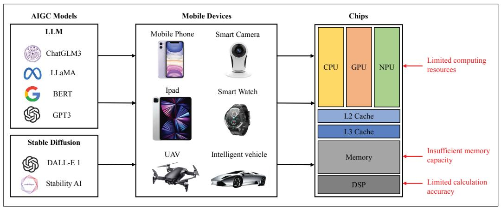
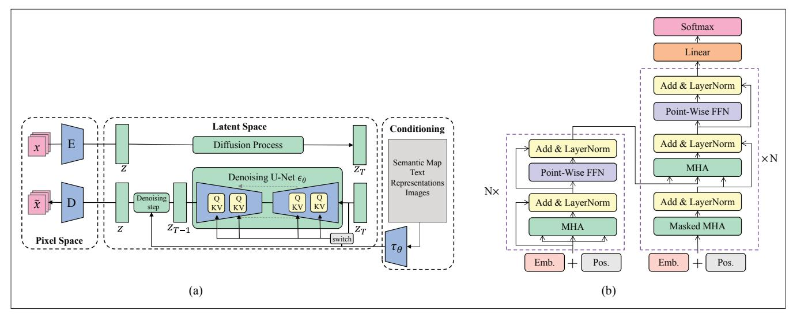
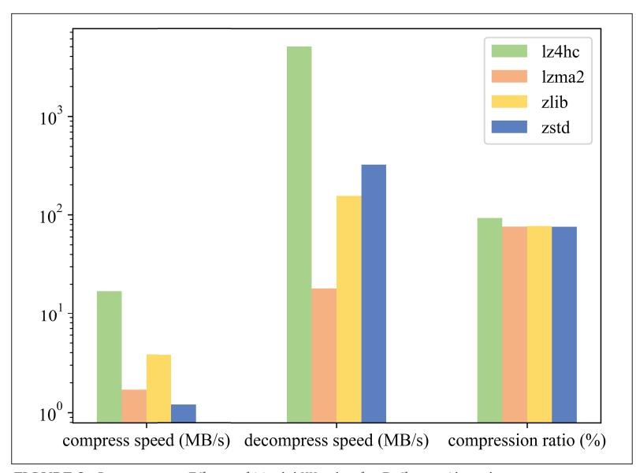
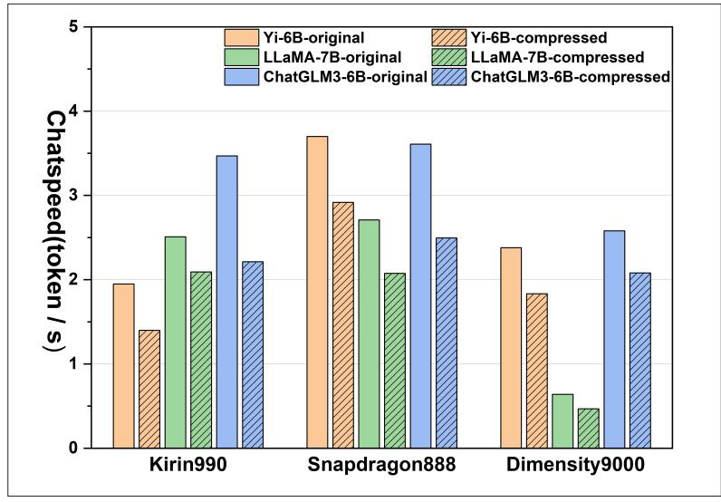
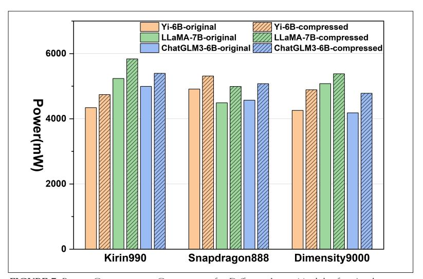

# Mobile Generative AI: Opportunities and Challenges

Ye Zhang, Jinrui Zhang, Sheng Yue, Wei Lu, Ju Ren, and Xuemin (Sherman) Shen

# Abstract

Recently, generative artificial intelligence (GenAI) has gained significant interest on a global scale, particularly with the explosion of some killer GenAI applications, like ChatGPT. However, due to the excessively large sizes of generative models, most current GenAI applications are deployed in the cloud, easily causing high cost, long delay, and potential risk of privacy leakage, thereby greatly impeding GenAI's further expansion and development. In this article, we explore mobile GenAI — deploying large generative models on mobile devices, aiming to bring the GenAI capability to the physical proximity to users. First, we analyze the benefits and opportunities of mobile GenAI in terms of cost, delay, privacy, personalization, and application. Then, we test various large generative models on the mobile testbed, and reveal mobile GenAI's key bottlenecks in inference latency and memory consumption. Accordingly, we propose a weight occupancy strategy for model compression during inference, and discuss the pros and cons thereof. Finally future directions are pointed out to foster continued research efforts.

# Introduction

Generative artificial intelligence (GenAI) has garnered significant attention in recent years, with the goal of automatically generating high-quality content (including text, image, video, and three-dimension models) using generative models [1]. In particular, transformer-based deep neural networks (DNNs) have given rise to a number of remarkable GenAI applications like ChatGPT, Midjourney, and DeepBrain. They have showcased great potential and substantial commercial value across various industries, such as artistic creation, education, entertainment, and business. The advance of GenAI has been deemed to usher in a new era of AI and signify a giant leap for Artificial General Intelligence (AGI) [2].

In fact, what distinguishes recent advancements in GenAI from prior works lies in the utilization of more complex foundational model architecture as well as larger model sizes and massive training data. For example, from GPT-1 and GPT-2 to GPT-3, the model parameters increase from an initial 110M and 1.5B to 175B, and the pre-training data size grows from BookCorpus (5GB) and WebText (38GB) to CommonCrawl (570GB). As a result, GPT-3 can exhibit enhanced generalization capabilities and even emergent abilities compared to the previous models in many tasks, for example, complex reasoning, out-of-distribution robustness, and chain of thought. This phenomenon is well-recognized as the scaling law [3].

Unfortunately, the training and inference for the generative models with billions of parameters necessitate substantial memory and extensive computational resources, and hence most of these procedures have been limited to the cloud thus far [4]. However, the cost of such cloud-based inference is extremely high, estimated to exceed that of traditional search by more than ten times for each query [5]. With the emergence of consumer-oriented generative AI applications and the surge in users, it is therefore highly difficult to sustainably scale up the application of GenAI. In addition, due to the limited capacity of the Internet and cloud servers, the cloud-based GenAI would not be a wise approach for delay-sensitive applications. Further, as the significance of data security dramatically increases, the paradigm may fail in complying with the requirement of information privacy or data confidentiality in many privacy-sensitive scenarios.

On the other hand, 6G network represents the upcoming generation of mobile communication technology, expected to enter commercial utilization around 2025. It offers superior bandwidth, reduced latency, and enhanced connectivity, ushering in substantial transformations in mobile communications. The advancement in this technology presents new opportunities and challenges for mobile GenAI. For instance, 6G network will support a wider range of device connections, including mobile devices, Internet of Things (IoT) devices, and smart homes. Mobile GenAI can collaborate with other devices, sharing computational resources and data, enabling more complex and diversified AI applications. An example includes collaborative generation of virtual reality scenes across multiple devices.

To facilitate the deployment of GenAI functionality on mobile devices in the upcoming 6G networks, this article primarily examines the opportunities and performance bottlenecks associated with deploying GenAI models on mobile devices. In addition, a parameter compression-based mem-

*Ye Zhang and Wei Lu are with Beijing Jiaotong University, China; Ye Zhang is also with Beijing Information Science and Technology University, China; Jinrui Zhang (corresponding author), Sheng Yue (corresponding author) and Ju Ren are with Tsinghua University, China;*  Digital Object Identifier: 10.1109/MWC.006.2300576 *Xuemin (Sherman) Shen is with University of Waterloo, Canada. E-mail: sshen@uwaterloo.ca.*

**FIGURE 1.** Architectural overview of the GenAI models running on mobile devices.

ory optimization method is proposed. In light of the increasing computation/security capability of mobile devices and recent advancement of edge intelligence, mobile GenAI is expected to provide many benefi ts on a global scale:

- Shifting inference tasks from cloud data centers to end devices is capable of alleviating the pressure on cloud infrastructure and reduce the expenses of creating new applications, enabling continued and scalable expansion of generative AI applications.
- In contrast to cloud data centers, mobile devices can run generative models with remarkably low energy consumption and high energy effi ciency, particularly during concurrent data processing and transmission.
- During peak demand periods for generative queries in the cloud, there can be significant queuing and high latency, whereas mobile generative service ensures that users can run generative models seamlessly regardless of their location, even in disconnected scenarios.
- On the terminal side, generative service fundamentally contributes to safeguarding user privacy because queries and personal information, such as health concerns or entrepreneurial ideas, remain entirely on end devices.
- Mobile generative models can be tailored based on users' expressions and preferences without compromising privacy, and the resulting user profile can be in turn used to create customized generative prompts and enhance the performance. This is particularly benefi cial in applications such as mobile assistants (e.g., advanced versions of Siri or Google Assistant), where the ability to understand and generate natural language responses in real time can transform user interactions from simple command executions to engaging conversations.

Figure 1 illustrates the current typical architecture of the GenAI model running on mobile devices.

Albeit with great promise, the computation capabilities of mobile devices still fall short compared to the hardware tailored for AI training and inference, like NVIDIA A100 and Google TPU. Processors in mobile devices, such as ARM-based CPUs and integrated GPUs, must strike a balance between energy effi ciency and heat management, thereby constraining the performance in model inference. In addition, the memory and storage space of mobile devices are also far from comparable to data center servers. Therefore, there is still a notable gap between the limited resources of mobile devices and the high demand for the computation of on-device inference. Thus motivated, this article aims to examine and specify the key challenges in deploying large generative models on mobile devices while discussing a series of potential solutions and their feasibility. Through the discussions, we hope to provide a deeper understanding of how to eff ectively implement and deploy advanced GenAI applications on mobile devices.

# ApplIcAtIons oF mobIle generAtIVe AI

Artificial Intelligence Generated Content (AIGC) has the capability to create content across various modalities, encompassing but not limited to text, images, videos, and even three-dimensional content, which holds substantial promise for a wide array of industries like business, gaming, education, and healthcare. Meanwhile, users' increasing emphasis on latency, personalization, and privacy protection has steered the migration of AIGC from the cloud to mobile platforms. According to Statista , the number of global mobile devices and mobile users is expected to reach 18.22B and 7.49B in 2025, signifying a tremendous opportunity for deploying AIGC applications on mobile devices. Currently, numerous efforts have been made to integrate AIGC into mobile applications, elaborated in what follows.

The application of GenAI on mobile devices starts with the foundational stable diff usion model. It focuses on the generation of three forms of interconversion, that is, text, image, and video. For text-to-images, Qualcomm deploys a stable diffusion model with over 1B parameters on an edge device through full-stack AI optimization. They choose Hugging Face's open-source FP32 version 1-5 Stable Diffusion model for execution on smartphones powered by the Snapdragon 8 Gen 2 mobile platform. Through employing quantization, compilation, and hardware acceleration, the Stable Diff usion model can promptly interpret unconstrained textual input commands and generate a 512x512 pixel image matching the command within 15 seconds. This process only requires 20 inference steps and achieves inference comparable to cloud latency. Different from their approach, Yang Zhao et al. [6] combine an efficient architectural design with a reduction in sampling steps,

| Model            | Params | MACs          |
|------------------|--------|---------------|
| ChatGLM3 6B      | 6.24 B | 765.04 G      |
| BlueLM 7B        | 7.30 B | 881.41 G      |
| Qwen 7B          | 7.72 B | 908.59 G      |
| LLAMA-2 7B       | 6.74 B | 850.00 G      |
| Stable Diffusion | 2.26 B | 7053.13 * N G |

**TABLE 1.** Statistics on the parameter number and computational load of GenAI models.

achieving high-quality 512×512 image generation in just 0.2 seconds on iPhone 15 Pro. Their strategy not only sets a new speed record for text-to-image generation but also redefines the potential of AIGC in mobile applications.

Mobile applications can also integrate functions for image and video generation. For instance, it is more convenient for users to transform the freshly taken photos or even videos into various styles, such as comic-like renditions. Similar mobile applications have been launched on the APP STORE, such as Draw Things [7]. It can not only accomplish swift local image generation through on-device LoRA training, but also generate refined images from users' rough sketches. With the advent of such applications, users can now generate, modify, and disseminate AI-created images at their convenience, irrespective of time and place. They are tailored to cater to individual preferences and requirements, thereby offering a personalized experience. The most significant advantage lies in their ability to streamline tasks, capable of saving substantial amounts of time and reducing the energy expended by users. This makes the process of content creation more efficient and user-friendly.

As another representative of AIGC, the Large Language Model (LLM) is clearly pointed to the reinvention of mobile phone assistants. While conventional mobile assistants like Siri and Amazon Echo have undoubtedly enhanced user convenience, their capabilities have remained confined to basic voice commands, for example, making calls, conducting web searches, and playing songs. In contrast, mobile LLMs have the potential to revolutionize the landscape by offering a much broader scope of knowledge and understanding. By comprehending more intricate instructions and providing intelligent responses, they transcend the boundaries of basic voice commands and enable users to engage in more sophisticated interactions. For example, consider a scenario where a user wishes to identify photographs from a sunny day outing in a specific month within their photo album, post these images on a social media, and append a personal sentiment reflecting their mood and emotions at the time. This multifaceted task requires capabilities far beyond simple command execution—it demands text understanding for interpreting the user's request, image recognition for identifying the appropriate photos, and text generation for crafting a personal sentiment. These capabilities, collectively, underscore the great potential of LLMs in redefining user interaction with technology.

In addition, the interpretive prowess of LLM enables assistants to converse naturally, reflecting with hesitations, mistakes, and corrections, which fosters a more natural and reliable interaction. Furthermore, mobile LLM is anticipated to introduce more robust and dependable user interactions. Within the gaming industry, users can shape the game world through voice control and project it onto smart glasses or smart headsets, thereby realizing innovative experiences. Mobile LLM can also support highly complex tasks in offline environments, including in-vehicle navigation, real-time voice translation, and simultaneous interpretation.

Stable diffusion and LLM are two representative foundation models. As AIGC variants flourish with the advancement of on-device deployment technologies, mobile applications transcending simple content generation become feasible. For example, stable diffusion is anticipated to facilitate image editing, restoration, style conversion, and super-resolution, while LLM can enable more intricate tasks such as autonomous driving. More importantly, the future of mobile AIGC applications would rely not only on the power of AIGC models to perform complex tasks on mobile devices but also on creating higher value experiences for users. By enabling user habit learning and automatic adjustment and optimization of camera, speaker, screen, sensors, and other components on smart devices, the user experience dimension is enhanced. In the future, AIGC mobile applications are poised to have a tangible impact, and the ability to run these models entirely on the device without relying on an internet connection will unlock boundless possibilities.

# Key Challenges

As the number of parameters and training data grows, large generative models exhibit enhanced capacity to comprehend and process intricate data patterns across various domains. However, it is still an open problem on how to efficiently operate large generative models in mobile devices without compromising their generalization capabilities. In this section, building on the structural characteristics of GenAI models, we identify two main challenges in deploying these models on mobile devices as follows.

Excessive Memory Usage: We evaluate a number of mainstream generative models at NVIDIA Jetson AGX Xavier using the Huggingface transformers/diffusers library. We measure the number of parameters for their model weights, as well as the computational MACs (Multiply–Accumulate Operations). Surprisingly, some models maintain emergent capabilities despite having relatively modest parameter counts, typically ranging between 6B and 7B parameters. However, efficient computation still relies on high-end hardware facilities. Note that in Table 1, since Stable Diffusion generates images by UNet iterations in the result, its computation depends on the number of iterations N of the computation.

While the memory capacities of today's smartphones have significantly improved, there remains a substantial disparity in processing power in comparison with servers or high-end computing devices equipped with high-capacity memory. For instance, the NVIDIA Tesla A100 is equipped with HBM2 (High Bandwidth Memory 2) with a capacity of 40GB, enabling superior performance and memory capacity support.

To illustrate the impact of memory on model inference, consider the chatglm3-6b-fp32 model.

FIGURE 2. Frameworks of representative generative models: a) Stable diffusion; b) Transformer.

If this model runs in 32-bit floating point format on a mobile phone, it would require at least 22GB of memory space solely for storing the model parameters. However, mainstream Android mobile phone systems typically reserve 1GB to 2GB of memory for smooth system operation. Consequently, to fully run a large model stored in float32 format, a mobile device would need at least 24GB of RAM. Given that today's mobile phones commonly offer 8GB to 16GB of memory, it is evident that running such a large model directly on these devices is currently unfeasible.

In the realm of Large Language Models (LLMs), the primary network architecture often comprises Transformer Blocks, as shown in Fig. 2b, which excel in natural language processing tasks. Unlike CNN networks, commonly used in computer vision, Transformer networks utilize fewer convolutional operators and rely on the Self-Attention mechanism. However, due to the need to consider global dependencies when processing sequential data, Transformer networks require more memory to store intermediate computation results and attention matrices. Furthermore, the Softmax operation demands significant computational memory, especially when handling long sequences.

Another classic model, Stable Diffusion, while not characterized by a large number of parameters, features a more complex internal structure, as shown in Fig. 2a. Consequently, it necessitates the storage of a substantial number of intermediate computation results and state information, thereby requiring even more memory compared to LLMs.

**Prolonged Inference Latency:** In the realm of computer vision (CV), the assessment of traditional tasks typically revolves around high accuracy and real-time performance, with real-time metrics often set at 24 to 30 frames per second (FPS). This metric is crucial for ensuring seamless video streaming and image processing. However, when evaluating applications represented by generative AI models, the quality of user experience (QoE) cannot be solely measured by FPS. For instance, considering the average human reading speed of about 11 words per second, generative AI models, such as large-scale language models (LLMs), ideally need to generate one word every 100 milliseconds to align with the human reading pace.

Current mobile devices face constraints in CPU and GPU performance due to factors like power consumption, heat management, and cost. It's challenging for these processors to consistently operate at peak performance, making it difficult to accurately predict actual inference speeds based solely on the theoretical maximum performance of the device. While mainstream mobile chips, including Apple's A-series, Snapdragon, and Dimensity, have introduced powerful solutions to support generative AI inference, their capabilities are still outperformed by common GPUs like the NVIDIA A100, which boasts peak FP32 training arithmetic boosts of up to 312 TFLOPs.In data centers and high-performance computing environments dealing with large-scale data and complex computational tasks, high-performance GPUs such as the NVIDIA A100 remain indispensable components. However, on end-side devices, slow inference can hamper a device's ability to handle multiple tasks simultaneously, particularly when resources are limited, potentially leading to performance degradation or task stacking.

Taking chatglm3-6b-fp32 as an example, its core computational tasks are concentrated on two multi-head attention modules and a multi-layer perceptual machine (MLP) module. The model's computational and parametric demands primarily stem from the fully connected layers within these modules, leading to potential higher inference times on certain devices. Models like Stable Diffusion, which involve computationally intensive UNet models with multiple iterations, and mobile devices with much weaker computational performance compared to server-class graphics cards, result in a notable increase in model inference latency.

Even if these Al-generated content (AIGC) models exhibit strong performance, their slow inference speed may severely limit their practical applications and generalizability.

#### A Framework with Weight Compression for Mobile Generative Inference

According to previous analyses, the main challenges faced by AIGC models when deployed on the end side include high memory footprint and inference latency.

**FIGURE 3.** Compression Eff ects of Model Weights for Diff erent Algorithms.

As an example, mobile devices are now commonly equipped with only 8–16 GB of RAM, and memory constraints have become a bottleneck for inference of large language models on mobile end devices. Some existing inference engines, such as ONNX and MNN [8], support the inference of large language models by repeatedly loading and unloading model weights, a process that not only increases inference time by 59-224 times, but also becomes a major obstacle to the development of AIGC. Users often need to make a trade-off between real-time generation and the ability of models to emerge (i.e., the size of model parameters).

### memory optImIZAtIon

There are two main levels of optimization in terms of memory consumption. One level is the optimization of the Transformer structure, such as the multi-head attention structure, which optimizes the memory consumption by optimizing the size of the "Key"(K) and "Value"(V). The other level is the optimization of the AI reasoning process, such as the optimization of the LLM reasoning process, to improve the throughput and parallelism of the model computation by optimizing the process.

Kwon *et al.* [9] proposes a new PagedAttention for the current problem that KV storage needs to occupy continuous memory space and its length changes dynamically. It is found that existing systems waste 60-80 percent of memory due to memory fragmentation and over-reservation. PagedAttention, inspired by virtual memory and paging techniques in operating systems, allows contiguous KV tensors to be stored in a non-contiguous space. It chunks the KV cache of each sequence, each containing fi xed-length tokens, and effi ciently locates and fetches these chunks when computing attention. This research culminates in the proposed vLLM inference service, which provides up to 24 times higher throughput and saves 6.1 percent-9.8 percent of memory usage compared to HuggingFace Transformers.

Xu *et al.* [10] purposes LLMCad is innovative in that it employs a small, real-time language model (memory-resident LLM) that can run entirely in memory to do most of the token generation work. The model adopts a "generate-verify" model, where the markup is generated by the memory-resident LLM and then verifi ed by the target LLM, which uses its own output as a reference to check and correct errors in the generation process. This approach has two major advantages: fi rst, it ensures the accuracy of the generated tokens because each token is validated by the target model; second, the validation process is fast, and the target model can validate multiple tokens simultaneously in a single inference, which is much faster than generating them one by one. Compared to standard single-model reasoning, LLMCad is able to improve marker generation speed by a factor of 2.9 to 4.67 and achieve a factor of 2.01 to 2.56 improvement in energy effi ciency.

### ImproVed InFerence speed

There has been considerable effort directed toward optimizing model inference speeds for mobile devices, particularly concerning models employing traditional CNN architectures. In general, optimizations for inference speed on the client-side often concentrate on aspects such as operator fusion, operator generation, and model branching parallelism. These measures essentially target enhancing the bottleneck segments of model inference to maximize speed effi ciency.

FasterTransformer [11] is an open-source transformer implementation highly optimized for GPUs by NVIDIA. Its main optimization idea is to reduce memory calls and kernel function calls, so that the data always stays in the memory or even registers to be accessed, that is, Operator(OP) fusion, which realizes the whole computational logic in one call. To maximize performance, inside Faster Transformer, Nividia fuses all kernels except matrix multiplication as much as possible. Based on the idea of OP fusion, Faster Transformer uses only 14 kernels to complete the original calculation logic of nearly 60 kernels. With this logic, FasterTransformer improves the inference speed of the BERT model by about 1.5-6.5 times speedup compared to pytorch implementation.

Dice *et al.* [12] analyzes the fact that the inference time of the Transformer structure mainly depends on the computation time of the matrix multiplication, but a part of the matrix multiplication in the Transformer block is the multiplication of the transposed and non-transposed matrices. Since the data layout of non-transposed matrices is more suitable for computation, the multiplication between non-transposed and non-transposed matrices is usually faster than that between non-transposed and transposed matrices. This work mainly focuses on saving two copies of the model's matrix, transposed form and non-transposed form, during model inference. Although the memory is increased by a factor of 1, there is an improvement of about 2.33 times in computational speed.

While recent studies off er insights into addressing memory constraints and enhancing inference speed by optimizing memory and time overheads, challenges persist. LLMCad employs iterative token sequence generation via compact LLM models to mitigate memory overfl ow issues. However, these smaller models compromise accuracy and fail to fundamentally streamline the inference process of larger LLM models, thus being unable to address memory limitations at the core. Although the vLLM framework tackles KV cache fragmentation using a page table mechanism, it does not fundamentally reduce the number of KV caches. Current speed optimization efforts primarily target server-side chip enhancements, overlooking constraints posed by end-side CPU, GPU architectures, and power consumption limitations, rendering original optimization schemes inapplicable to mobile platforms.

Conversely, at the end-side device, the model typically caters to a single user, with the KV cache size ranging from a few tens to hundreds of megabytes. In contrast to the model weights, which can reach tens of gigabytes, prioritizing the optimization of model weights stands as paramount. In this article, we introduce a framework designed to compress model weights utilizing file lossless compression methods to diminish the model's memory footprint. The specific process is as follows:

- The model weights are compressed by Zstandard (zstd), that is, a file compression algorithm.
- The program loads the compressed model weights into memory.
- The program decompresses the model weights and intermediate variables as needed to participate in the current calculation.
- The streaming compresses the model's intermediate variables.

In the aforementioned process, we conducted compression testing on the weight files of the ChatGLM3-6B model on NVIDIA Jetson AGX Xavier using existing compression algorithms such as lz4hc and zstd, as shown in Fig. 3. Through comparative testing, zstd demonstrated favorable results in terms of decompression speed and compression efficiency compared to other compression methods, it can solve about 15 percent-20 percent of the memory occupation of the weights. zstd approach offers near-optimal compression ratios, significantly reducing storage space requirements when compressing large model weights. Additionally, it allows users to fine-tune the compression level based on their needs, exhibiting strong adaptability to different data distributions and effectively compressing specific characteristics of model weights. We test the efficacy of zstd on the Yi-6B, LLaMA-7B, and ChatGLM3-6B models, the compression ratios are 76.6 percent, 71.2 percent and 78.1 percent respectively. The compression method employed demonstrated favorable results across different model structures.

Furthermore, zstd exhibits fast decompression speeds, which is particularly crucial for scenarios requiring frequent loading and utilization of models. By observing the inference process of the model, we found that the KV values calculated before will be cached during the model inference process, and we can dynamically compress and decompress the list of KV values through the streaming compression algorithm to realize the memory control of the intermediate variables. We conducted comparative experiments on inference time and power consumption across multiple models on CPUs of different mobile devices, as illustrated in Figs. 4 and 5, respectively. From the test data, it is evident that our approach incurs minimal additional overhead during model runtime while still meeting user requirements.

# Conclusion and FutureDirections

In this article, we scrutinize two pivotal challenges for the successful deployment of large-scale generative AI applications on mobile devices, considering the current architecture and characteristics of

**FIGURE 4.** Inference Time Comparison for Different Large Models after Applying Our Method.

**FIGURE 5.** Power Consumption Comparison for Different Large Models after Applying Our Method.

LLM as well as the performance of mobile devices. Looking ahead, as compression algorithms, inference engines, hardware performance, and other technologies continue to mature, numerous opportunities have emerged for deploying large-scale generative models at the edge:

At the algorithm level, model compression algorithms such as pruning, quantization, and distillation are competent to reduce the memory footprint of the model. Among them, quantization has been chosen by various optimization schemes dedicated to mobile devices and has demonstrated substantial efficacy. After the model has been initially trained to achieve convergence, the weights are then converted to low-precision representations, a process known as post-training quantization[13, 14]. This approach conserves more computational resources and memory access during large model training compared to quantization during the training phase. When selecting the quantization precision, using int4 and int8 may be preferable to more extreme approaches such as binary quantization. This choice can better preserve the characteristics of the parameters of the large model and can also At the system level, the combination of machine learning compilation techniques, including operator fusion, graph optimization, memory management, library offloading, and so on, represents auspicious directions for large language models' deployment on mobile devices. One can initiate the process by strategically optimizing existing efficient ML compilers such as TVM to enhance the model's inference speed, minimize memory usage, and enable efficient execution on mobile devices.

be utilized for mixed precision quantization [15]. However, in practical deployment, it's important to carefully consider whether the mobile hardware kernel supports the quantized matrix computation. For instance, GPU kernels may lack support for certain types of matrix multiplication (e.g., INT4 x FP16). Therefore, the quantization strategies need to align with the capabilities of the target mobile hardware to ensure efficient execution.

Furthermore, compression performance can be enhanced by leveraging neural network architecture search (NAS) in conjunction with mobile hardware-aware techniques to guide further the search, which aims to minimize the memory usage of parameters without significantly compromising inference accuracy.

At the system level, the combination of machine learning compilation techniques, including operator fusion, graph optimization, memory management, library offloading, and so on, represents auspicious directions for large language models' deployment on mobile devices. One can initiate the process by strategically optimizing existing efficient ML compilers such as TVM to enhance the model's inference speed, minimize memory usage, and enable efficient execution on mobile devices.

### Acknowledgment

This research was supported by the National Key R&D Program of China under Grant No. 2022YFF0604502.

#### References

- [1] Y. Cao *et al*., "A Comprehensive Survey of AI-Generated Content (Aigc): A History of Generative AI From GAN to CHATGPT," arXiv preprint arXiv:2303.04226, 2023.
- [2] C. Zhang *et al*., "One Small Step for Generative AI, One Giant Leap for AGI: A Complete Survey on CHATGPT in AIGC Era," arXiv preprint arXiv:2304.06488, 2023.
- [3] T. Brown *et al.*, "Language Models Are Few-Shot Learners," *Proc. NeurIPS*, vol. 33, 2020, pp. 1877–1901.
- [4] W. X. Zhao *et al*., "A Survey of Large Language Models," arXiv preprint arXiv:2303.18223, 2023.
- [5] "Focus: For Tech Giants, AI Like Bing and Bard Poses Billion-Dollar Search Problem," available: https://www.reuters. com/technology/tech-giants-ai-like-bing-bard-poses-billiondollar-search-problem/
- [6] Y. Zhao *et al*., "Mobile-Diffusion: Subsecond Text-to-Image Generation on Mobile Devices," arXiv preprint arXiv:2311.16567, 2023.
- [7] "Draw Things: AI Generation;" available: https://apps.apple. com/us/app/draw-things-ai-generation/id6444050820?platform=iphone.
- [8] C. Lv *et al*., "Walle: An End-to-End, General-Purpose, and Large-Scale Production System for Device-Cloud Collabora-

- tive Machine Learning," *Proc. 16th USENIX Symp. Operating Systems Design and Implementation*, Carlsbad, CA: USENIX Association, July 2022, pp. 249–65; available: https://www. usenix.org/conference/osdi22/presentation/lv.
- [9] W. Kwon *et al*., "Efficient Memory Management for Large Language Model Serving With Paged Attention," *Proc. SOSP*, 2023, pp. 611–26.
- [10] D. Xu *et al.*, "LLMCAD: Fast and Scalable On-Device Large Language Model Inference," arXiv preprint arXiv:2309.04255, 2023.
- [11] "NVIDIA/FasterTransformer: Transformer Related Optimization, Including BERT, GPT;" available: https://github.com/ NVIDIA/FasterTransformer.
- [12] D. Dice and A. Kogan, "Optimizing Inference Performance of Transformers on CPUs," arXiv preprint arXiv:2102.06621, 2021.
- [13] T. Dettmers *et al*., "LLM. int8 (): 8-bit Matrix Multiplication for Transformers at Scale," arXiv preprint arXiv:2208.07339, 2022.
- [14] E. Frantar *et al.*, "GPTQ: Accurate Post-Training Quantization for Generative Pre-Trained Transformers," arXiv preprint arXiv:2210.17323, 2022.
- [15] T. Dettmers *et al.*, "GPT3. int8 (): 8-bit Matrix Multiplication for Transformers at Scale," Proc. NeurIPS, vol. 35, 2022, pp. 30,318–32.

#### Biographies

Ye Zhang [M] received her B.Sc. (2007) in computer science and technology from Beihang University and the M.E. (2011) in software engineering from Peking University. She is currently pursuing the Ph.D. degree with the School of Software Engineering, Beijing Jiaotong University. Her research interests include edge computing and natural language processing.

Jinrui Zhang [M] received his B.Sc.(2016), M.Sc.(2018), and Ph.D.(2023) in computer science, from Central South University, China. Currently, he is a postdoc with the Department of Computer Science and Technology, Tsinghua University, China. He has broad research interests in mobile computing and edge computing, including mobile depth perception, sensing, and intelligent edge/mobile systems.

Yue Sheng [M] received his B.Sc. in mathematics (2017) and Ph.D. in computer science (2022), from Central South University, China. Currently, he is a postdoc with the Department of Computer Science and Technology, Tsinghua University, China. His research interests fall in intelligent decision-making and edge intelligence.

Wei Lu [M] is a professor with the School of Software Engineering, Beijing Jiaotong University, Beijing, China. His research interests include intelligent information processing and software services engineering.

Ju Ren [SM] is an associate professor with the Department of Computer Science and Technology, Tsinghua University, Beijing, China. His research interests include Internet-of-Things, edge computing, and edge intelligence. He is a member of the ACM.

Xuemin (Sherman) Shen [F] is a University Professor with the Department of Electrical and Computer Engineering, University of Waterloo, Canada. His research focuses on network resource management, wireless network security, the Internet of Things, 5G and beyond, and vehicular networks. He was the president of IEEE Communication Society.