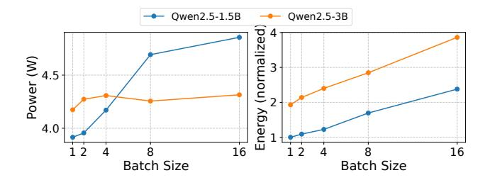

# Scaling LLM Test-Time Compute with Mobile NPU on Smartphones

## 引言与背景

### 引言与背景

本部分主要探讨在移动端部署大型语言模型（LLM）时面临的固有矛盾，介绍了测试时计算缩放（Test-time Scaling）的概念，并深入分析了如何利用移动端 NPU 的硬件特性来解决这一矛盾，同时也指出了实现这一目标所面临的特定硬件挑战。

### 移动端 LLM 部署的困境

#### 1. 性能与资源的博弈
在移动设备上部署 LLM 始终面临着“性能”与“资源”的双重约束：
*   **小模型（Small Models）：** 如 Llama 3.2 1B 或 Qwen 2.5 1.5B，虽然能够适应移动设备的内存和功耗限制，但在复杂的推理任务（如数学解题、逻辑推理）上表现往往不尽如人意。
*   **大模型（Larger Models）：** 如 7B 或更大参数量的模型，虽然具备较强的智能水平，但其内存占用和内存带宽需求远超移动平台的承受能力。

#### 2. 测试时计算缩放（Test-time Scaling）
为了在不改变模型参数的前提下提升性能，学术界提出了一种新范式——**测试时计算缩放**。
*   **核心理念：** 既然无法增加训练时的计算量（模型参数固定），通过在**推理阶段**投入更多的计算资源来换取更好的生成质量。
*   **典型方法：** 包括生成多个候选结果并选择最佳者的 **Best-of-N** 策略，以及在生成过程中进行多路径探索的 **Beam Search** 策略。
*   **现状：** 目前这些方法主要应用于云端或离线场景，因为它们需要成倍的计算资源。

<!-- 图片 1 未找到匹配文件 -->

**图 1 分析：**
该图直观展示了两种典型的测试时计算缩放方法：
1.  **Best-of-N（左图）：** 模型针对同一个 Prompt 并行生成 $N$ 个完整的回复（Sample），然后通过验证器（Verifier）或奖励模型选出得分最高的一个作为最终结果。这种方法简单直接，易于并行化。
2.  **Beam Search（右图）：** 在生成的每一步（Token-level），模型会保留 $K$ 个概率最高的候选路径（Beam），并在下一步基于这些路径继续扩展。这种方法需要更精细的状态管理，但能更有效地修剪低质量路径。

#### 3. 移动端的反直觉性
直觉上，在资源受限的智能手机上应用测试时缩放似乎是不可行的。移动设备本就受限于电池和散热，而 LLM 推理又是高能耗任务，进一步增加推理时的计算量听起来会加剧资源枯竭。然而，本文指出，硬件架构的演进为打破这一直觉提供了可能。

### 移动端 NPU 的机遇与挑战

#### 1. 移动 NPU 的架构特性与闲置算力
现代移动 SoC（如高通 Snapdragon、AMD Ryzen AI）普遍集成了强大的神经处理单元（NPU）。
*   **峰值性能高：** 例如高通 Snapdragon X Elite 的 Hexagon NPU 可提供高达 45 TOPS 的 INT8 算力。
*   **专用矩阵单元：** NPU 的高性能来源于专用的矩阵乘法单元（如 Hexagon 中的 **HMX**），它们通常以较大的矩阵分块（Tile，例如 $32 \times 32$）为单位进行计算。

**解码阶段的算力浪费（The Opportunity）：**
在 LLM 的自回归解码（Decoding）阶段，每次只生成一个 Token，导致输入激活矩阵的形状通常为 $[1, \text{Hidden\_Dim}]$。
*   此时，计算从矩阵乘法（GEMM）退化为矩阵-向量乘法（GEMV）。
*   由于 NPU 矩阵单元通常一次处理 $32$ 行数据，当 Batch Size 为 $1$ 时，硬件实际上只利用了 $\frac{1}{32}$ 的计算能力，其余 $\frac{31}{32}$ 的算力处于空闲浪费状态。

**利用闲置算力（Feasibility）：**
通过测试时计算缩放（如并行采样），我们可以将 Batch Size 提升至 $N$（例如 8 或 16）。此时，NPU 矩阵单元可以在几乎不增加额外延迟的情况下完成这些并行计算，从而“免费”利用了原本被浪费的算力。

<!-- 图片 5 未找到匹配文件 -->

**图 5 分析：**
这张图展示了测试时计算缩放的有效性。
*   **横轴：** 生成预算（Generation Budget），即解码阶段的最大 Batch Size，代表推理时的计算投入。
*   **纵轴：** MATH500 数据集上的准确率。
*   **结论：** 随着 Batch Size 的增加，小模型的准确率显著提升。特别是利用并行采样后，较小的模型（配合缩放）甚至可能在准确率上匹配甚至超越不做缩放的较大模型，这为移动端“用计算换智能”提供了强有力的证据。

#### 2. 核心挑战一：缺乏细粒度量化支持
尽管 NPU 算力强大，但直接应用存在精度障碍：
*   **硬件限制：** 移动 NPU（如 Hexagon）最初是为 CNN 设计的，原生仅支持粗粒度的量化方式（如 Per-tensor 或 Per-channel 量化）。
*   **LLM 需求：** 为了在移动端运行，LLM 通常需要 4-bit 的**细粒度分组量化**（Fine-grained Group Quantization，例如 Group Size = 128）来保持精度。
*   **矛盾：** 如果使用 NPU 原生支持的粗粒度量化（如 QNN 框架默认配置），模型在数学推理等任务上的精度会急剧下降（如 Table 1 所示，MATH500 准确率从 15.9% 跌至 2.1%），导致测试时缩放失去意义。

#### 3. 核心挑战二：通用计算效率瓶颈
为了解决精度问题，通常需要使用通用的向量处理单元（如 Hexagon 的 **HVX**）来进行反量化等复杂操作，但这带来了效率问题：
*   **算力差距：** 向量单元（HVX）的浮点算力远低于矩阵单元（HMX）。文中数据显示，HMX 的 FP16 GEMM 吞吐量是 HVX 单线程的 300 多倍。
*   **带宽瓶颈：** 向量单元通过核心数据通路读取内存的带宽（< 30 GB/s）显著低于 DMA 引擎（> 60 GB/s）。
*   **后果：** 如果依赖向量单元处理大量非矩阵运算（如反量化、Softmax），这些操作将成为系统的主要瓶颈，抵消 NPU 矩阵加速带来的优势。

## 动机与硬件分析

### 动机与硬件分析

本部分深入探讨了论文的研究动机，即如何利用移动端 NPU 的硬件特性来加速 LLM 的测试时计算缩放（Test-Time Scaling），并详细分析了在此过程中面临的架构限制与挑战。

### 1. 高通 Hexagon NPU 架构解析

为了理解如何在移动设备上高效运行 LLM，首先需要剖析其核心加速硬件——高通 Hexagon NPU。与通用的 CPU 或 GPU 不同，NPU 采用了独特的异构架构设计。

#### 1.1 向量单元（HVX）与矩阵单元（HMX）的协同

Hexagon NPU 采用典型的“向量 + 矩阵”混合架构：

*   **HVX (Hexagon Vector eXtension)**：负责通用计算，如归一化、复杂的激活函数等。
*   **HMX (Hexagon Matrix eXtension)**：专门用于加速计算密集型的核心神经网络操作（如卷积、矩阵乘法），拥有极高的吞吐量。

**VLIW 执行模型**：
NPU 采用 SIMD（单指令多数据）执行模型，这与 GPU 的 SIMT（单指令多线程）模型有显著不同。
*   **GPU (SIMT)**：如图 2(a) 所示，GPU 拥有大量硬件线程，允许不同线程独立执行分支、内存访问和计算，编程灵活性高。
*   **NPU (SIMD)**：如图 2(b) 所示，NPU 使用 VLIW（超长指令字）架构来减少控制逻辑的开销。一个标量核心通常包含 6 到 8 个硬件线程，所有向量或矩阵指令通过 4 个 VLIW 插槽发出。HVX 单元上下文包含 32 个宽度为 1024-bit 的向量寄存器。这种设计牺牲了编程灵活性，换取了更高的能效比。

<图片 Figure 2>

**图 2 解析**：展示了 GPU SIMT 模型与 NPU SIMD 模型的差异。SIMT 允许线程层面的灵活性，而 SIMD 则是在单线程内对宽向量或矩阵块进行操作，这要求数据必须高度规整。

<图片 Figure 3>

**图 3 解析**：Hexagon NPU 的整体架构图。展示了标量核心（Scalar Core）如何控制 HVX（向量单元）和 HMX（矩阵单元），以及它们与各级缓存（L2 Cache, TCM）的连接关系。

#### 1.2 HMX 的 Tile 机制与特殊的内存布局

HMX 单元的强大算力来源于其独特的 Tile（图块）处理机制：

*   **Tile 维度**：FP16 HMX 的基本运算单元是一个 $32 \times 32$ 的矩阵块（Tile），占用 2 KiB 空间。
*   **物理布局**：为了匹配硬件的点积运算，HMX 对内存布局有极其特殊的要求。如图 4 所示，它不仅仅是简单的行主序或列主序，而是每一对相邻行（每两行）都需要进行重排（Permutation）。这给软件层面的数据准备带来了挑战，若不进行针对性优化，数据重排将消耗大量时间。

<图片 Figure 4>

**图 4 解析**：(a) 展示了 FP16 HMX Tile 的内部内存布局，每两行进行了一次交错重排；(b) 展示了用于 HMX GEMM 的整体权重布局，Tile 之间按列主序排列，以适应硬件的 Tile 级内积运算。

#### 1.3 TCM 与 DMA 的数据传输机制

高效的内存子系统是 NPU 性能的关键：

*   **TCM (Tightly Coupled Memory)**：NPU 包含 8 MiB 的 TCM，这是一块软件管理的片上高速内存。HVX 的 scatter/gather 操作以及所有的 HMX 指令 **只能** 访问 TCM，不能直接访问 DDR。
*   **DMA 机制**：数据必须通过 DMA 从 DDR 搬运到 TCM。DMA 支持 1D 或 2D 张量的异步传输，能提供极高的带宽（超过 60 GB/s）。然而，DMA 对数据传输的规整性要求很高，无法高效处理细碎或不规则的内存访问。

### 2. 解码阶段的算力浪费与精度陷阱

尽管 NPU 理论算力强大，但直接将 LLM 部署在上面临着严重的资源浪费和精度问题，这也是本论文提出测试时计算缩放（Test-time Scaling）的主要动机。

#### 2.1 矩阵单元的算力浪费：从 GEMM 退化为 GEMV

在 LLM 的自回归解码（Decoding）阶段，输入通常只有一个 token：
*   **GEMV 问题**：矩阵乘法（GEMM）退化为矩阵-向量乘法（GEMV）。例如，形状为 $[1, \text{hidden\_dim}]$ 的激活向量与权重矩阵相乘。
*   **Tile 填充率低**：如前所述，HMX 的最小计算粒度是 $32 \times 32$ 的 Tile。当输入只有 1 行时，实际上 Tile 中剩余的 31 行计算资源都在空转。
*   **机会**：这种低利用率恰恰为并行测试时缩放提供了机会。增加 Batch Size（例如并行采样多条路径）可以填满这些空闲的计算槽位，而不会显著增加推理延迟。

#### 2.2 现有 QNN 框架的精度崩塌

移动端 NPU 原本是为 CNN 等容忍低精度计算的任务设计的，缺乏对 LLM 所需的细粒度量化的原生硬件支持。

*   **量化粒度**：现有的高通 QNN SDK 仅支持 Per-Tensor（逐张量）或 Per-Channel（逐通道）的量化。
*   **精度对比**：对于现代 LLM，尤其是涉及复杂推理任务时，粗粒度量化会导致灾难性的精度损失。如 Table 1 所示，使用 QNN 的 Per-Channel 量化后，Llama 3.2 1B 在 MATH500 上的准确率仅为 2.1%，而采用细粒度 Group 量化的 AutoAWQ 能达到 15.9%。
*   **结论**：依赖厂商提供的标准软件栈（QNN）无法满足测试时缩放对模型推理能力的最低要求。

| Dataset | AutoAWQ (W4A16, Group) | QNN (W4A16, Per-channel) |
| :--- | :--- | :--- |
| **MATH500** ($\uparrow$) | **15.9** | **2.1** (精度崩塌) |
| GSM8K ($\uparrow$) | 32.6 | 3.4 |
| Wiki PPL ($\downarrow$) | 19.42 | 28.99 |

**Table 1 解析**：对比了 Llama 3.2 1B 模型在不同量化策略下的表现。QNN 默认的粗粒度量化严重破坏了模型的数学推理能力，这证明了实现细粒度量化（Group Quantization）的必要性。

#### 2.3 向量单元与矩阵单元的巨大鸿沟

既然硬件不支持细粒度量化，一种思路是用通用的向量单元（HVX）来处理反量化（De-quantization），然后再喂给矩阵单元（HMX）。然而，这种方法的瓶颈在于两个单元之间巨大的性能差异：

*   **算力差距**：如 Table 2 所示，HMX 的 FP16 算力高达 12 TFLOPS，而单个 HVX 线程仅约 33 GFLOPS，差距超过 **300 倍**。
*   **带宽差距**：DMA 读取带宽超过 60 GB/s，而 HVX 通过核心数据通路的读取带宽不足 30 GB/s。

这意味着，依靠 HVX 进行复杂的反量化计算根本无法“喂饱”强大的 HMX 单元，通用计算能力成为了系统的主要瓶颈。

| Hardware Units | HVX (1 Thread) | HMX | 差距倍数 |
| :--- | :--- | :--- | :--- |
| FP16 GEMM GFLOPs | 32.93 | **12032.54** | ~365x |
| Memory Read BW (GB/s) | 26 | **60 (DMA)** | ~2.3x |

**Table 2 解析**：展示了 Hexagon V75 NPU 上 HVX 与 HMX 的性能数据。巨大的算力鸿沟表明，任何试图用 HVX 模拟复杂逻辑以弥补 HMX 功能缺失（如细粒度反量化）的尝试，都必须经过极度的优化，否则 HVX 将成为绝对瓶颈。

## 系统设计：硬件感知量化

### 系统设计：硬件感知量化

为了在移动端 NPU 上实现高效的测试时计算缩放（Test-time Scaling），必须解决 NPU 硬件架构与现代 LLM 所需的细粒度量化之间的不匹配问题。本节详细介绍了作者提出的硬件感知 Tile 量化方案，该方案旨在消除运行时开销并最大化硬件利用率。

#### 1. 硬件感知的细粒度 Tile 量化方案

**传统量化与 NPU 架构的不匹配**

在传统的 CPU 推理（如 llama.cpp）中，权重矩阵通常采用列主序（column-major）布局，量化是沿着列维度连续进行的（例如，每 32 个连续元素为一个量化组）。然而，移动端 NPU 的矩阵乘法单元（HMX）并非基于这种简单的线性布局工作。

*   **HMX Tile 布局**：Qualcomm Hexagon NPU 的 HMX 单元以 $32 \times 32$ 的 Tile 为基本计算单位。为了优化硬件累加器的效率，Tile 内部的数据采用了特殊的内存布局（例如每两行进行一次交叉重排，参见 Figure 4）。
*   **不匹配的后果**：如果直接使用传统的线性分组量化权重，当数据加载到 NPU 的片上内存（TCM）以供 HMX 使用时，原本在逻辑上连续的同一个量化组内的元素，会在物理内存中变得支离破碎。这会导致 SIMD 向量单元（HVX）在进行反量化时需要执行昂贵的 gather/scatter 操作，严重降低性能。

**Figure 6 分析**：
该图直观地展示了传统量化组布局与 HMX Tile 布局之间的冲突。
*   **左侧（Quant group 0）**：展示了传统的量化方式，元素 a, b, c 在内存中是连续的，属于同一个量化组。
*   **中间（scatter）**：当这些数据为了适应 HMX 的计算需求被加载到片上内存时，由于 HMX 特殊的 Tile 布局要求，它们被分散存储。
*   **右侧及下方（HMX tile）**：在 HMX 的 Tile 布局中，为了匹配硬件的 inner-product 顺序，数据被重新排列（如红色箭头所示的 zigzag 路径）。这导致原本连续的 group 0 被打散到不同的位置，使得向量单元无法通过一次连续的内存读取来获取完整的量化组数据，必须进行低效的非连续访问。

**Tile-Group 量化策略**

为了解决上述问题，作者提出了一种**基于硬件 Tile 的量化策略**。其核心思想是让量化过程顺应硬件的内存布局，而不是反之。

1.  **离线权重预处理（Permutation -> Quantization）**：
    *   **预重排（Permutation）**：在离线阶段，首先将原始浮点权重矩阵重排成 HMX 硬件期望的布局。这包括两层结构：外层是 Tile 级别的列主序排列，内层是 Tile 内部每两行的交叉 Shuffle。
    *   **分组量化（Quantization）**：在重排后的布局上直接应用分组量化。对于大小为 32 的组，这种方式实际上是将原来的 $32 \times 1$ 线性条带变成了一个 $2 \times 16$ 的矩形微块（micro-tile）。

2.  **统计特性的保留**：
    作者指出，由于预训练模型的权重通常近似服从零均值的高斯分布，在重排后的 Tile 内部进行分组量化并不会显著改变组内的统计特性。因此，这种改变分组形状的做法对量化误差（即模型精度）的影响微乎其微。

通过这种设计，运行时的内存访问变得连续且高效，消除了不必要的运行时重排开销。

#### 2. 量化组聚合与向量访问优化

即使解决了内存布局问题，细粒度量化（Fine-grained Quantization）在 NPU 的向量单元（HVX）上仍面临效率挑战。

**细粒度量化的效率瓶颈**

*   **向量寄存器宽度**：Hexagon NPU 的 HVX 向量寄存器宽度为 128 字节（1024 bits）。
*   **数据粒度过小**：如果量化组大小（Group Size）为 32，且使用 4-bit 量化，那么一个组仅包含 $32 \times 0.5 = 16$ 字节的数据（加上 2 字节的 scale）。
*   **利用率低**：如果在运行时每次只处理一个量化组，仅使用了 128 字节寄存器中的 16 字节，会导致严重的内存带宽浪费和指令级并行度不足。此外，频繁处理小数据块会引入额外的指令开销。

**聚合量化组（Coalescing Groups）策略**

为了充分利用 HVX 的宽向量寄存器，作者提出了**聚合量化组**的策略。

*   **Super-block 设计**：将 8 个连续的细粒度量化组聚合为一个 "Super-group"。
*   **容量匹配**：
    *   8 个组总共包含 $8 \times 32 = 256$ 个元素。
    *   在 4-bit 量化下，这 256 个元素恰好占用 $256 \times 0.5 = 128$ 字节。
    *   **这完美填满了一个 HVX 向量寄存器**。
*   **内存布局优化**：
    *   作者避免了传统的结构数组（AoS）布局（即 quantization values 和 scales 交错存储）。
    *   相反，在 Super-group 内部，将所有 256 个元素的 4-bit 量化值打包在一起连续存储，随后存储对应的 scales。
    *   这种布局允许 HVX 通过单条指令加载完整的 128 字节量化数据，极大提升了内存访问效率。

**Figure 7 分析**：
该图展示了如何通过聚合量化组来匹配向量寄存器的宽度。
*   **左侧**：显示了 8 个细粒度的量化组（Group 0 到 Group 7）。每个组单独看都很小。
*   **右侧（Repacking）**：这 8 个组被重新打包（Coalescing）成一个 Super-block。
*   **寄存器匹配**：
    *   图中深蓝色的部分表示 INT4 量化值。可以看到，8 个组的 INT4 数据被合并在一起，总共 256 个元素。
    *   这 256 个元素正好填满一个 **128-byte HVX Vector Register**。
    *   这种设计使得 NPU 可以利用其宽 SIMD 指令一次性处理大量数据，避免了碎片化的内存访问和计算。

**总结**
通过**硬件感知的 Tile 重排**和**量化组聚合**，该系统成功解决了 NPU 特殊矩阵单元布局与通用向量计算单元宽度之间的矛盾，为实现高效的混合精度推理奠定了基础。

## 系统设计：基于LUT的计算优化

以下是基于论文《Enabling Parallel Test-Time Scaling on Mobile NPUs for LLM Inference》中“System Design: LUT-Based Computation Optimization”章节的详细笔记。

---

### 系统设计：基于LUT的计算优化

移动端 NPU 的架构通常采用“强大的矩阵单元（HMX）+ 相对较弱的通用向量单元（HVX）”的组合。为了解决向量单元在处理非线性运算（如 Softmax 中的指数计算）和数据变换（如反量化）时的性能瓶颈，论文提出了一套基于**查找表（Look-Up Table, LUT）**的计算优化方案。

#### 1. 基于向量 Gather 的快速 Softmax

在 Transformer 架构中，Attention 机制的计算复杂度随着上下文长度的增加而显著增长。在测试时计算缩放（Test-time scaling）场景下，由于 Batch Size 和 Context Length 的增加，Attention 算子成为了潜在的性能瓶颈。

**FlashAttention 在 NPU 上的瓶颈分析**

论文首先分析了 FlashAttention 在 Hexagon NPU 上的延迟构成。通过 **Figure 8** 可以观察到，随着查询长度（Query Length）的增加，矩阵乘法（GEMM）的耗时占比并不高，而 Softmax 操作的耗时占据了主导地位。

<Figure 8>

*   **(图表分析 Figure 8)**: 该图展示了在 Hexagon NPU 上运行 FlashAttention 的延迟分解（以 Qwen2.5-1.5B 模型为例，Prompt 长度 4096）。随着 Batch Size（Query Length）从 1 增加到 16，Softmax（绿色部分）的延迟显著增加，成为主要瓶颈，而 MatMul（蓝色部分）的增长相对平缓。

**根本原因**：Softmax 的核心计算包含指数函数 $e^x$。移动端 NPU 的向量单元（HVX）缺乏专用的硬件数学函数单元（Special Function Unit, SFU）。传统的实现依赖于多项式近似计算（泰勒展开），这引入了大量的指令序列和数据依赖，限制了 VLIW 架构的指令级并行度。

**利用 LUT 替代高开销的指数计算**

为了消除这一瓶颈，论文提出使用预计算的查找表（LUT）来替代实时的指数计算。Hexagon NPU 提供了 `vgather` 指令，可以将分散在 TCM（紧耦合内存）中的数据收集到连续的向量寄存器中。

**基于 Safe Softmax 性质的存储优化**

直接建立 FP16 的完整 LUT 面临存储和寻址挑战：
1.  **存储空间**：FP16 有 $2^{16} = 65536$ 个可能值，占用 $128 \text{ KiB}$ 内存。虽然 TCM 容量足够（8 MiB），但会占用宝贵的缓存资源。
2.  **寻址限制**：`vgather` 指令通常支持的最大地址偏移量为 $65536 \text{ bytes}$。$128 \text{ KiB}$ 的表大小超过了单次寻址范围，导致一半的条目无法直接访问。

**解决方案**：利用 **Safe Softmax** 的数学性质进行优化。
Softmax 函数具有平移不变性：
$$ \text{Softmax}(x)_i = \frac{e^{x_i}}{\sum_j e^{x_j}} = \frac{e^{x_i - m}}{\sum_j e^{x_j - m}} $$
其中 $m = \max(x)$。通过减去最大值，所有输入 $x_i - m$ 必然满足 $\le 0$。

这意味着我们只需要存储非正数（$\le 0$）对应的指数结果。这将 LUT 的大小减半至 $32768$ 个条目（即 $64 \text{ KiB}$），不仅完全符合 `vgather` 的寻址范围，而且仅占用 TCM 总容量的约 $0.8\%$，几乎不影响其他计算。

**算法流程（Algorithm 1）**

论文设计了全 FP16 的 FlashAttention 流程，核心步骤如下：
1.  计算 $S = QK^T$。
2.  计算行最大值 $m$。
3.  **LUT 查表**：计算 $P = \text{LUT\_Exp}(S - m)$。在此步骤中，忽略 FP16 的符号位（因为已知为负），并左移一位生成字节偏移量进行查表。
4.  更新分母 $l$ 和输出 $O$（涉及在线 Softmax 的缩放更新）。

<Algorithm 1>

*   **(算法分析 Algorithm 1)**: 该算法描述了基于 NPU 的 FP16 FlashAttention 流程。关键点在于第 4 行 $P_i^{(j)} = \text{LUT\_Exp}(S_i^{(j)} - m_i^{(j)})$，这里利用预计算的表直接获取指数值，避免了繁重的计算。同时，为了保持精度，部分累加操作（AccumType）使用了 FP32。

---

#### 2. LUT 为核心的高效反量化

为了在移动端实现高精度的推理，系统采用了 4-bit 细粒度分组量化（Weight-only 4-bit fine-grained group quantization）。然而，NPU 的 HMX 单元仅支持 FP16 计算，因此需要在运行时进行“反量化（Dequantization）”。

传统的反量化过程在向量单元上执行效率极低，涉及大量的位掩码（Masking）、移位（Unpack）和类型转换指令。

**利用 vlut16 指令加速转换**

论文利用 Hexagon NPU 的 `vlut16` 指令重构了反量化过程。`vlut16` 能够根据源寄存器中的 8-bit 索引，在一个包含 16 个元素的表中查找对应的值。

**优化策略**：
1.  **快速 INT4 转 FP16**：
    *   **传统方法（Naïve Conversion）**：需要先通过位运算将 8-bit 容器中的两个 4-bit数值分离，然后分别转换格式。
    *   **本文方法（LUT-based Conversion）**：直接建立一个映射表，通过 `vlut16` 将 4-bit 的量化值直接映射为 FP16 数值（范围 $[-8, 7]$）。这完全避免了复杂的位解包操作。
    *   这种设计具有极高的灵活性，只需修改表内容即可支持 FP4、NF4 或 IQ4_NL 等不同的编码格式。

2.  **Scale 参数的高效广播**：
    *   在细粒度量化中，每组权重共享一个 Scale 参数。通常需要将标量 Scale 广播（Broadcast）到向量寄存器中进行乘法。
    *   论文巧妙地利用 LUT 实现广播：将 4 个组的 Scale 值作为 LUT 内容，使用预定义的常数索引表。通过一次 `vlut16` 指令，即可完成 Scale 参数的“查找即广播”，大幅减少了指令数。

<Figure 9>

*   **(图表分析 Figure 9)**: 该图直观对比了两种反量化方法。
    *   **左侧（Naïve Conversion）**：包含复杂的 Unpack（解包）、INT2FP（整型转浮点）、Subtract bias（减偏置）、Convert（格式转换）等一长串指令流。
    *   **右侧（LUT-based Conversion）**：通过 `vlut16` 指令直接查表，将量化数据一步转换为 FP16，极大地简化了计算流水线，降低了向量单元的计算压力。

### 总结

通过引入硬件感知的 LUT 优化技术，该设计成功解决了移动端 NPU 在处理复杂非线性函数和细粒度数据操作时的效率短板：
*   **Softmax 加速**：利用 Safe Softmax 性质将 LUT 表大小压缩至 $64 \text{ KiB}$，配合 `vgather` 指令消除了指数计算瓶颈。
*   **反量化加速**：利用 `vlut16` 指令将复杂的位操作转化为简单的查表操作，实现了高效的混合精度 GEMM 计算。

这些优化使得系统能够在利用 HMX 强大算力的同时，不被 HVX 的通用计算性能所拖累，从而有效支持 LLM 的测试时缩放任务。

## 实现细节

### 系统集成与内存管理

本章节详细阐述了如何在一个端到端的推理系统中集成移动端 NPU，重点在于如何绕过封闭的厂商软件栈限制，以及如何高效管理 CPU 与 NPU 之间的异构内存交互。

#### 1. 基于 llama.cpp 的端到端系统实现
为了验证所提出的测试时计算缩放（Test-Time Scaling）方法，作者基于开源社区广泛使用的 **llama.cpp** 框架构建了端到端的推理系统。

*   **代码规模与工具链**：整个系统新增了约 7000 行 C/C++ 代码及内联汇编。编译过程使用了 Hexagon SDK（版本 6.0.0.2）中的 LLVM 工具链，以生成适配 Hexagon NPU 架构的二进制代码。
*   **模块化架构**：系统主要由两个核心模块组成：
    1.  **NPU 侧算子库**：被编译为一个独立的 Hexagon DSP 共享对象（Shared Object）。该库不仅包含了核心的计算内核（Kernel），还负责电源管理、硬件资源分配以及计算线程池的管理。
    2.  **CPU 侧集成模块**：集成在 llama.cpp 内部，负责与 NPU 进行交互和调度。

#### 2. 摆脱对闭源 QNN 框架依赖的算子库开发
目前的移动端 NPU 开发通常依赖于高通提供的私有闭源框架 **Qualcomm AI Engine Direct (QNN)**。然而，该框架存在明显的局限性：它是基于静态、固定形状（Fixed-shape）的计算图设计的，缺乏灵活性，无法满足测试时缩放对动态计算和细粒度控制的需求。

*   **自主开发算子库**：作者选择绕过 QNN，直接针对 Hexagon NPU 硬件开发算子库。这使得系统能够灵活地利用底层的 FP16 矩阵单元和向量单元，而不受限于 QNN 仅支持每通道（Per-channel）或每张量（Per-tensor）量化的限制。
*   **混合调度策略**：通过这种自定义实现，系统具备了更细粒度的调度能力。对于尚未在 NPU 上实现优化的算子，系统可以将其调度回 CPU 执行，从而实现了与上层应用的无缝集成，保证了系统的完整性和兼容性。

#### 3. 利用 rpcmem 共享内存机制减少 CPU-NPU 数据拷贝
在异构计算系统中，数据传输往往是性能瓶颈。为了实现高效的通信，系统利用了 **rpcmem** 共享内存机制作为底层的缓冲区类型。

*   **物理内存共享**：`rpcmem` 是对内核级 `dmabuf` 的封装，它允许 CPU 和 NPU 共享同一块物理内存区域。相关的内存分配、释放和映射接口由 Android 系统供应商库中的 `libcdsprpc.so` 提供。
*   **零拷贝（Zero-Copy）通信**：通过使用共享内存缓冲区，系统消除了在 CPU 和 NPU 之间进行显式数据拷贝的开销。这种机制对于大语言模型推理中的大量权重和激活数据传输至关重要。
*   **低延迟轮询机制**：
    *   系统使用 Hexagon SDK 的 **FastRPC** 接口来启动远程 NPU 会话。
    *   与传统的 RPC 调用（每次调用产生一次中断和上下文切换）不同，作者实现了一种轮询机制：NPU 端的一个线程会持续轮询共享内存区域，以接收来自 CPU 的计算请求。这种方法显著降低了通信延迟。

#### 4. 手动 Cache 维护以确保数据一致性
在 Snapdragon SoC 平台上，CPU 和 NPU 之间的缓存一致性（Cache Coherence）通常是单向的或不存在自动硬件维护的。

*   **一致性问题**：当 CPU 向共享内存写入数据（如模型权重、激活值或控制指令）后，NPU 的缓存并不会自动失效或更新。如果 NPU 直接读取，可能会读到缓存中的旧数据。
*   **手动维护策略**：为了解决这一问题，系统在 NPU 进行轮询之前，必须由 CPU 侧手动执行 **Cache 清除（Cache Clean/Invalidate）** 操作。作者特别指出，对于包含模型激活值的共享缓冲区，也需要进行类似的缓存维护操作，以确保计算结果的正确性。

## 实验评估

本部分详细记录了论文的实验评估过程，涵盖了实验设置、测试时缩放（Test-time Scaling, TTS）的性能-成本权衡、端侧解码性能、能耗分析以及针对关键技术点的消融实验。

### 实验设置与环境

为了全面评估系统性能，作者在多代高通骁龙平台上进行了测试，并对比了不同的硬件后端和模型配置。

*   **硬件平台**：
    *   **OnePlus Ace3** (Snapdragon 8 Gen 2, Hexagon V73 NPU)
    *   **OnePlus 12** (Snapdragon 8 Gen 3, Hexagon V75 NPU)
    *   **OnePlus Ace5 Pro** (Snapdragon 8 Elite, Hexagon V79 NPU)
*   **测试模型**：
    *   **Qwen 2.5**: 1.5B, 3B, 7B (Instruct variants)
    *   **Llama 3.2**: 1B, 3B (Instruct variants)
    *   *注：由于 Snapdragon 8 Gen 2 的 NPU 虚拟地址空间限制（32-bit），无法运行 3B 及以上参数量的模型。*
*   **评价指标**：
    *   **生成质量**：MATH500 和 GSM8K 上的 pass@1 准确率（使用 Best-of-N 和 Beam Search）。
    *   **通用能力**：WinoGrande, MMLU, WikiText-2 Perplexity。
    *   **性能指标**：端到端解码延迟、吞吐量（tokens/s）、功耗（Watt）和能耗（Joule）。
*   **基线系统 (Baselines)**：
    *   **llama.cpp-OpenCL**: 基于 GPU 的高性能推理后端。
    *   **QNN (FP16)**: 高通官方闭源 SDK（仅作为性能参考，因其量化精度不足以支撑推理任务）。

---

### 测试时缩放的性能-成本权衡

这一部分是论文的核心评估之一，旨在验证利用移动端 NPU 的闲置算力进行并行测试时缩放，是否能比直接运行更大的模型更具性价比。

#### 帕累托前沿（Pareto Frontier）分析

作者展示了在不同计算预算（以延迟为代价）下，模型在数学推理任务上的表现。

<图片 Figure 10>

**图表 Figure 10 分析**：
该图展示了 **Best-of-N** (上排) 和 **Beam Search** (下排) 两种 TTS 方法的准确率与延迟的权衡关系。
*   **横轴**：每个 token 的平均解码延迟（成本），考虑了 TTS 带来的额外上下文长度。
*   **纵轴**：在 MATH500 和 GSM8K 数据集上的准确率。
*   **关键发现**：
    1.  **超越大模型表现**：观察 Qwen2.5-1.5B (绿色曲线) 配合 TTS 的表现，其准确率显著超过了 Qwen2.5-3B (橙色叉号) 甚至 7B (绿色叉号) 的基线性能（base accuracy）。
    2.  **新的帕累托前沿**：TTS 方法构建了一个优于传统模型缩放的权衡空间。例如，使用 Best-of-N 的 Qwen2.5-1.5B 在延迟低于 3B 模型基线的情况下，取得了更高的准确率。
    3.  **Beam Search 的效率**：在 Beam Search 设置下，Qwen2.5-1.5B 和 Llama3.2-1B 均能达到与其对应的 3B 版本相当或略好的效率。

**结论**：在移动设备上，与其强行部署受限于内存带宽的大模型，不如部署小模型并利用 NPU 的并行能力进行测试时缩放，这样既能获得更高的生成质量，又能保持较低的推理成本。

---

### 端侧解码性能与能耗分析

论文进一步分析了 NPU 在处理 TTS 负载时的吞吐量扩展性和能耗表现。

#### 解码吞吐量的扩展性

由于 LLM 的解码阶段通常受限于内存带宽（Memory-bound），而 NPU 的矩阵单元（HMX）在 Batch Size = 1 时利用率极低。TTS 通过增加 Batch Size，旨在利用这部分闲置算力。

<图片 Figure 11>

**图表 Figure 11 分析**：
该图展示了 Qwen2.5 和 Llama 3.2 模型在不同 Batch Size (1 到 16) 下的端到端解码吞吐量。
*   **吞吐量提升**：随着 Batch Size 的增加，系统的总解码吞吐量（tokens/s）显著提升。这证实了 NPU 的矩阵计算单元在多 Batch 下被更有效地利用了。
*   **非线性扩展**：吞吐量的增长并非完美的线性。主要原因是部分操作（如 logit 计算和 lm_head 投影）为了规避 NPU 地址空间限制仍运行在 CPU 上，这部分开销随 Batch Size 增加而显著增长（在 BS=16 时占比接近 50%）。

#### 与 GPU 及其他系统的对比

作者将该系统与基于 Adreno GPU 的 OpenCL 后端进行了对比。

<图片 Figure 13>

**图表 Figure 13 分析**：
*   **Decoding Speed (上图)**：虽然 GPU 在 Batch Size = 1 时略快，但在 Batch Size 增大时（TTS 场景），**NPU 系统的吞吐量和扩展性显著优于 GPU**。这突显了 NPU 在高并发推理任务中的优势。
*   **Prefill Speed (下图)**：NPU 的预填充（Prefill）速度也优于 GPU，且在某些负载下接近官方 QNN 的 FP16 性能。

#### 功耗与能效比分析

增加并行计算必然会带来功率的提升，但关键在于总能耗是否可控。

<图片 Figure 12>

**图表 Figure 12 分析**：
*   **功耗 (Power, 左轴)**：随着 Batch Size 增加，运行 1.5B 模型的功耗有所上升，但始终控制在 **5W** 以内（手机整机功耗）。3B 模型的功耗稳定在 4.3W 左右。
*   **能耗 (Energy, 右轴)**：这是更关键的指标（功耗 $\times$ 延迟）。
    *   值得注意的是，**1.5B 模型在 Batch Size = 8 时的解码能耗甚至低于 3B 模型在 Batch Size = 1 时的能耗**。
    *   结合 Figure 10 的结果，这意味着在获得同等甚至更高推理准确率的前提下，TTS 方案比直接运行大模型更省电。

---

### 消融实验与精度验证

为了实现上述性能，论文提出了硬件感知的 Tile 量化和 LUT 加速算子。本节验证这些技术对精度和速度的具体贡献。

#### Tile 量化布局的精度影响

由于 NPU 的 HMX 单元需要特殊的权重布局，作者设计了一种细粒度的 Tile-Group 量化方案，而不是传统的按列分组。

*   **实验结果 (Table 4)**：
    *   对比 "Tile group"（本文方案）与 "Common group"（传统方案），在 WinoGrande、MMLU 和 Wiki PPL 上，精度差异极小。
    *   例如，MMLU 得分仅从 35.271 变为 35.465（甚至略有提升），这表明为了适配硬件而改变的量化分组方式 **不会损害模型精度**。

#### LUT-based Softmax 加速分析

作者使用查找表（LUT）替换了 Attention 中昂贵的指数计算（exp）和 Softmax。

<图片 Figure 14>

**图表 Figure 14 分析**：
*   **加速比**：相比于标准的 FP32 `exp` 计算，使用 LUT16（基于 16-bit 查找表）的方法实现了 **1.26倍 到 2.19倍** 的加速。
*   **不同负载**：在不同的 KV Cache 长度（1024 到 16384）和 Query 长度下，加速效果依然稳健。由于 Softmax 是 Attention 的主要瓶颈之一，这一优化对长上下文推理至关重要。
*   **精度验证 (Table 5)**：使用 LUT-based FP16 Attention 与标准 FP32 Attention 相比，模型在各项基准测试中的精度几乎没有损失（例如 Wiki PPL 10.205 vs 10.206）。

#### 反量化 (Dequantization) 算子优化

这是 NPU 上混合精度推理最大的性能瓶颈。作者对比了三种实现：Baseline（传统 scatter）、w/ HMX layout（硬件感知布局）、Ours（布局优化 + 向量寄存器合并）。

<图片 Figure 15>

**图表 Figure 15 分析**：
*   **巨大加速**：相比于 Baseline，最终方案（Ours）实现了 **9.65倍 到 19.04倍** 的加速。
*   **原因分析**：
    *   Baseline 需要昂贵的 `scatter` 操作将解量化后的数据写入不连续的内存地址。
    *   "w/ HMX layout" 通过预先重排权重消除了 scatter，带来了主要收益。
    *   "Ours" 进一步合并了量化组以填满向量寄存器，减少了指令数。
*   **接近理论极限**：Ours 的性能已经非常接近 "no dequant."（仅内存拷贝，不做计算）的性能上界，仅慢了约 27%，说明反量化计算本身的开销已被降至最低。

#### CPU 与内存开销

最后，作者评估了该系统对移动设备资源的占用情况。

*   **内存占用**：1.5B 模型约为 1.3 GiB，3B 模型约为 2.4 GiB（包含 NPU 和 CPU 内存）。
*   **CPU 占用**：随着 Batch Size 增加，CPU 利用率有所上升（处理 Embedding 和 Logits），但核心占用限制在 4 核以内，不会完全抢占系统资源。