# Scaling LLM Test-Time Compute with Mobile NPU on Smartphones

## 引言与背景：移动端LLM的新范式

## 引言与背景：移动端LLM的新范式

### 移动端部署的困境与机遇

#### 端侧模型大小与性能的权衡难题
随着 Llama 3.2, MiniCPM, Gemma 等端侧模型的涌现，在移动设备上部署大语言模型（LLM）已成为可能。然而，端侧部署面临着一个核心的 **两难困境（Trade-off）**：
*   **小模型（Small Models）**：适合移动设备的内存和功耗限制，但在复杂的推理任务（如数学解题、逻辑推理）上表现不佳。
*   **大模型（Larger Models）**：推理能力强，但参数量的增加会导致内存占用和带宽需求显著上升，超出移动 SoC 的承受范围。

传统的提升性能方法是直接扩大模型规模（Scaling up model size），但这在资源受限的移动平台上不仅会导致严重的延迟，甚至可能因为内存不足而无法运行。

#### 测试时计算缩放（Test-Time Scaling, TTS）的概念
**测试时计算缩放（Test-Time Scaling）** 是近期提出的一种新范式。其核心思想是：**不在训练阶段扩大模型，而是在推理阶段（Test-time）投入更多的计算资源来换取更高的性能。**

常见的并行测试时缩放方法包括：
1.  **Best-of-N**: 并行生成 $N$ 个候选项，通过验证器（Verifier）或奖励模型（Reward Model）选择最佳答案。
2.  **Beam Search**: 在生成过程中保留概率最高的 $K$ 个路径，动态平衡探索（Exploration）与利用（Exploitation）。

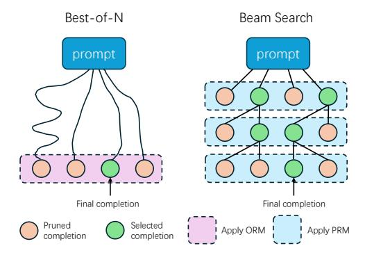

**图片分析 Figure 1**：
该图展示了两种典型的 TTS 方法：
*   **Best-of-N（左侧）**：模型针对同一个 Prompt 并行生成多条完整的路径（Completion）。通过外部评分机制（如 Outcome Reward Model, ORM），从这 $N$ 个结果中选出得分最高的一个作为最终输出。这种方法简单有效，但计算量随 $N$ 线性增加。
*   **Beam Search（右侧）**：这是一种基于步骤（Step-level）的搜索策略。在生成的每一步，模型都会根据概率或过程奖励模型（Process Reward Model, PRM）的评分，保留前 $k$ 个最有希望的候选词，修剪掉低质量路径。这种方法形成了树状结构，计算效率通常高于简单的暴力采样。

#### 为何在移动端应用 TTS 看似矛盾实则可行
直觉上，移动设备资源受限，而 LLM 推理本身就是高负载任务，再引入需要更多计算量的 TTS 似乎是不可行的（Impractical）。然而，论文提出了反直觉的洞见：

1.  **硬件进化**：现代移动 SoC（如高通 Snapdragon X Elite, AMD Ryzen AI）集成了强大的 **NPU（神经网络处理器）**，算力峰值极高（例如 45 TOPS INT8 性能）。
2.  **算力闲置（Underutilization）**：移动 NPU 通常拥有专门的大规模矩阵乘法单元。在 LLM 的 **解码阶段（Decoding Phase）**，由于通常是逐 Token 生成（Batch Size = 1），计算模式从计算密集型的 **GEMM**（矩阵-矩阵乘法）退化为受限于内存带宽的 **GEMV**（矩阵-向量乘法）。
3.  **结论**：这种退化导致 NPU 强大的矩阵单元在解码时大量闲置。TTS 方法通过增加 Batch Size（即并行采样），可以重新填满这些闲置的计算能力。**这意味着在不显著增加延迟的情况下，利用“免费”的闲置算力来提升模型输出质量是完全可行的。**

---

### NPU 架构基础与执行模型

#### NPU 的异构架构：向量与矩阵
高通 Hexagon NPU（以 Snapdragon 8 Gen 3 为例）采用了典型的 **“向量 + 矩阵”** 异构架构：

*   **HVX (Hexagon Vector eXtension)**：
    *   **功能**：负责通用计算，如激活函数（Activation）、归一化（LayerNorm）、Softmax 等非矩阵运算。
    *   **特点**：拥有宽向量寄存器（1024-bit），但计算吞吐量和内存带宽相对较低。
*   **HMX (Hexagon Matrix eXtension)**：
    *   **功能**：专用于加速核心的矩阵运算（如卷积、Dense Layer）。
    *   **特点**：以 **Tile（图块）** 为基本运算单位（例如 FP16 模式下为 $32 \times 32$ 的块）。它拥有极高的吞吐量（FP16 算力可达 HVX 的 300 倍以上），是 NPU 算力的主要来源。

#### NPU 的 SIMD 执行模型 vs GPU 的 SIMT
理解 NPU 的关键在于其执行模型与 GPU 的差异，这决定了编程的难度和优化的方向。

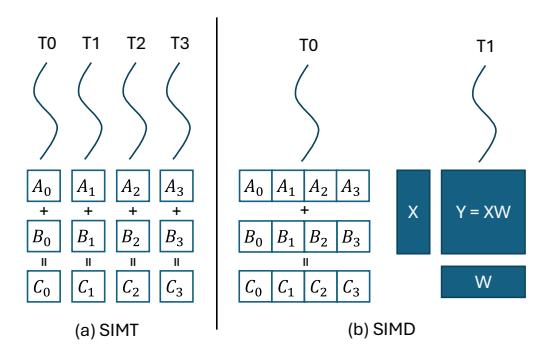

**图片分析 Figure 2**：
该图对比了 GPU 和 NPU 的硬件执行模型：
*   **图 (a) GPU 的 SIMT (Single Instruction, Multiple Threads)**：
    *   **结构**：拥有大量的标量核心（Scalar Core），每组线程（Thread Warp）共享指令流。
    *   **灵活性**：每个线程可以处理不同的数据偏移，甚至在一定程度上容忍控制流的分歧（Branching）。
    *   **内存访问**：支持较为灵活的内存访问模式。
*   **图 (b) NPU 的 SIMD (Single Instruction, Multiple Data)**：
    *   **结构**：一个控制单元（Scalar Core）控制极宽的数据通路（Vector/Matrix Unit）。
    *   **效率**：为了极致的能效（TOPS/W），NPU 牺牲了灵活性。它依赖 **VLIW（超长指令字）** 架构来减少控制逻辑的开销。
    *   **限制**：要求数据必须高度规整、连续。单一指令必须同时作用于大量数据（如 $32 \times 32$ 的矩阵块）。如果数据布局不满足硬件要求（如非对齐、稀疏），性能会急剧下降。

#### 高通 Hexagon NPU 的编程接口
为了在移动端实现高效的 TTS，论文探讨了两种编程路径：

1.  **Qualcomm AI Engine Direct (QNN)**：
    *   这是官方提供的标准推理框架，类似于 Android 的 NNAPI。
    *   **局限性**：这是一个闭源的黑盒框架，主要支持粗粒度的量化（Per-tensor/Per-channel）。论文发现，这种粗粒度量化在 W4A16（4-bit 权重）设置下会导致 LLM 的数学推理能力几乎完全丧失（Math accuracy: 2.1%）。
2.  **Hexagon SDK (LLVM Toolchain)**：
    *   这是底层的开发工具包，允许开发者编写 C++ 和内联汇编（Inline Assembly）。
    *   **论文选择**：作者选择绕过 QNN，直接使用 SDK 进行开发。通过**逆向工程** HMX 的矩阵指令，作者实现了自定义的算子。这使得团队能够实现 **细粒度分组量化（Fine-grained group quantization）** 和专门的内存布局优化，从而在保持小模型推理精度的同时，充分释放 NPU 的硬件性能。

## 动机与挑战：深入挖掘NPU潜力

根据论文内容，以下是关于“动机与挑战：深入挖掘 NPU 潜力”部分的详细笔记：

### 解码阶段的“免费”算力

在移动端部署大语言模型（LLM）时，通常面临着小模型性能不足、大模型资源消耗过大的两难困境。论文通过分析高通 Hexagon NPU 的硬件特性，发现了一个利用“闲置算力”的机会。

#### 1. GEMM 退化为 GEMV 导致的利用率低下
在 LLM 的自回归生成（Decoding）阶段，模型一次仅生成一个 Token。这意味着输入的 Activation 矩阵形状通常为 $[1, hidden\_dim]$。
*   **计算性质变化**：原本在 Prefill 阶段的高效矩阵乘法（GEMM）在 Decoding 阶段退化为向量-矩阵乘法（GEMV）。
*   **硬件不匹配**：Hexagon NPU 的 HMX（Hexagon Matrix eXtension）单元是为大规模矩阵运算设计的，其核心计算基础是 **Tile（瓦片）**。

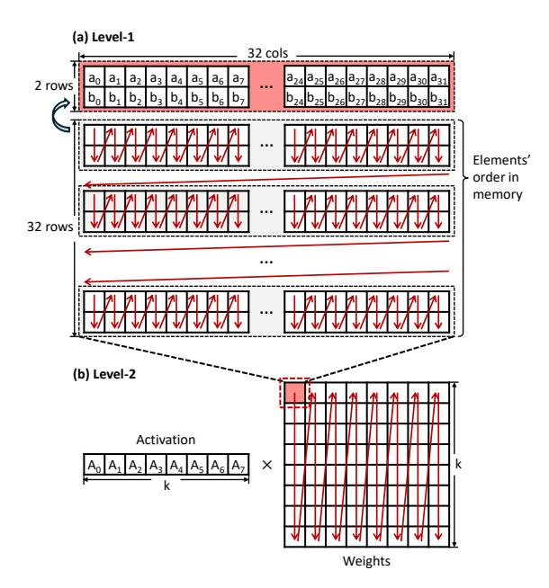

**图片精讲 Figure 4**：
*   **图 (a) HMX Tile 内存布局**：展示了 FP16 HMX 的基本计算单元是一个 $32 \times 32$ 的矩阵块（Tile），占用 2048 字节。其内部并非简单的行优先或列优先，而是每两行进行了一次置换（Shuffle），这种特殊的布局是为了适配硬件流水线。
*   **图 (b) 整体布局**：为了执行矩阵乘法，权重矩阵必须按照 Tile 为单位进行列优先排列。
*   **核心问题**：由于 HMX 的基本计算粒度是 $32 \times 32$ 的 Tile，当处理 Decoding 阶段形状为 $[1, hidden\_dim]$ 的输入向量时，硬件必须将其视为 $[32, hidden\_dim]$ 的矩阵进行处理。这意味着 Tile 中有 **31 行（约 97%）** 的计算能力被浪费在填充的无效数据（Padding）上。

#### 2. 利用并行采样填补闲置算力
既然 HMX 单元在处理 Batch Size = 1 的输入时有大量算力闲置，论文提出利用 **测试时计算缩放（Test-Time Scaling, TTS）** 来“免费”使用这些算力。
*   **并行采样（Parallel Sampling）**：TTS 方法（如 Best-of-N 或 Beam Search）需要同时生成多条路径。
*   **填补空缺**：如果我们同时生成 32 个候选序列（Batch Size = 32），输入的 Activation 形状变为 $[32, hidden\_dim]$，正好填满 HMX 的 $32 \times 32$ 计算 Tile。
*   **理论收益**：在 NPU 矩阵单元上，处理 Batch Size = 32 的计算延迟在理论上与处理 Batch Size = 1 几乎相同，因为前者只是利用了后者原本浪费的 Padding 计算周期。

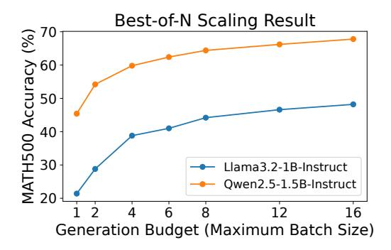

**图片精讲 Figure 5**：
*   该图展示了 Best-of-N 策略在 MATH500 数据集上的效果。
*   **X轴**：Generation Budget（即最大 Batch Size，对应并行采样的数量）。
*   **Y轴**：MATH500 的准确率。
*   **结论**：随着并行生成样本数量的增加，模型准确率显著提升。结合 NPU 的特性，这意味着我们可以在不显著增加推理时间的前提下（利用闲置算力），通过增大 Batch Size 换取更高的模型准确率。

---

### 硬件挑战：精度与效率的制约

虽然利用 NPU 进行 TTS 理论可行，但在实际实现中面临移动端 NPU 固有的两大硬件挑战：精度限制与通用计算效率低下。

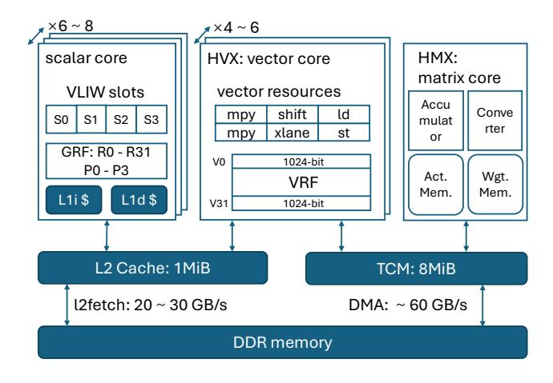

**图片精讲 Figure 3**：
*   **架构概览**：展示了 Hexagon NPU 的 "Vector + Matrix" 混合架构。
*   **Scalar Core**：负责逻辑控制，包含 4 个 VLIW 插槽。
*   **HVX (Vector Unit)**：负责通用向量计算，拥有 1024-bit 的宽向量寄存器。
*   **HMX (Matrix Unit)**：负责核心矩阵乘法，拥有极高的吞吐量。
*   **内存子系统**：L2 Cache (1 MiB) 和 TCM (8 MiB) 是关键。HMX 只能直接访问 TCM，且数据必须通过 DMA 或 l2fetch指令搬运。这解释了为何数据布局和访存优化至关重要。

#### 1. 精度不足：缺乏细粒度量化支持
移动端 NPU 最初是为了处理 INT8 甚至更低精度的 CNN 模型设计的，缺乏对现代 LLM 所需的 **细粒度（Fine-grained）量化** 的原生硬件支持。
*   **量化现状**：现代 LLM 通常需要 4-bit 权重配合分组量化（Group Quantization，如 Group Size = 128）来保持精度。
*   **软件限制**：高通官方的 QNN SDK 仅支持粗粒度的 Per-Tensor 或 Per-Channel 量化。
*   **精度崩塌**：论文在表 1 中展示了对比数据。对于 Llama 3.2 1B 模型，在 MATH500 任务上：
    *   使用 AutoAWQ（细粒度量化）：准确率为 **15.9%**。
    *   使用 QNN（Per-Channel 量化）：准确率跌至 **2.1%**。
    这种严重的精度损失使得直接使用官方工具链无法满足 TTS 这种对推理能力要求极高的场景。

#### 2. 效率瓶颈：HVX 与 HMX 的性能鸿沟
由于 HMX 不支持细粒度反量化（De-quantization），这部分计算必须由通用的向量单元（HVX）承担。然而，HVX 的性能远落后于 HMX，成为系统瓶颈。
*   **算力差距**：
    *   HMX (FP16 GEMM)：**~12 TFLOPS**。
    *   HVX (单线程 FP16)：**~0.033 TFLOPS**。
    *   **差距**：HMX 的吞吐量是 HVX 的 **300 多倍**。
*   **带宽差距**：
    *   DMA (直接内存访问)：**60 GB/s**（用于向 TCM 搬运数据）。
    *   HVX Load：**26 GB/s**。
*   **核心矛盾**：HVX 极其有限的计算能力和访存带宽，无法及时处理数据以“喂饱”高速运转的 HMX 单元。如果使用 HVX 进行复杂的反量化或 Softmax 计算，整个推理过程将被 HVX 拖慢，导致 HMX 再次闲置，抵消了并行计算的优势。

## 系统设计 I：硬件感知的细粒度Tile量化

### 系统设计 I：硬件感知的细粒度 Tile 量化

为了在移动端 NPU 上实现高效且高精度的 LLM 推理，必须解决通用量化方法与 NPU 特殊硬件架构之间的不匹配问题。本节主要介绍该论文提出的两个核心技术：针对矩阵计算单元（HMX）的 Tile-Group 量化策略，以及针对向量计算单元（HVX）的量化组聚合优化。

#### Tile-Group 量化策略

在移动端 NPU（如高通 Hexagon）上，矩阵运算单元（HMX）与通用的 CPU 或 GPU 架构存在显著差异。传统的量化方法往往无法直接高效地映射到 NPU 的硬件存储模式上，导致了严重的性能瓶颈。

**1. 传统布局与 NPU Tile 布局的不匹配**

传统的 LLM 量化（如 llama.cpp 中的实现）通常采用 **列主序（Column-major）** 的内存布局。在这种布局下，权重矩阵按列连续存储，量化组（Quantization Group，通常大小为 $32$）也是沿着列方向连续划分的。

然而，Hexagon NPU 的 HMX 单元是基于 **Tile（图块）** 进行运算的。对于 FP16 精度，HMX 的基本计算单元是一个 $32 \times 32$ 的矩阵块。为了最大化硬件效率，数据在片上内存（TCM）中必须以特定的 Tile 格式存储：
*   **Tile 级重排**：数据被划分为若干个 $32 \times 32$ 的块。
*   **Tile 内重排**：在每个 Tile 内部，每两行还会进行交叉重排（Permutation）。

**问题核心**：如果直接使用传统的列主序量化布局，原本在逻辑上连续的一个量化组，在加载到 NPU 的 TCM 后，其物理存储位置会变得极其分散（Scattered）。这迫使向量单元（HVX）在进行反量化（Dequantization）时必须使用昂贵的 `gather` 指令来收集分散的数据，严重降低了内存带宽利用率和计算吞吐量。

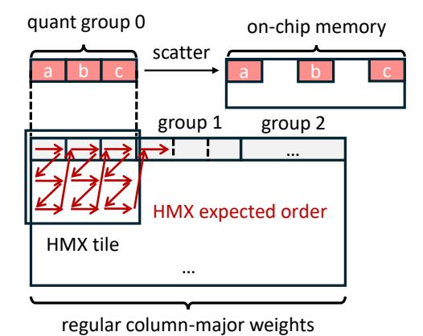

**图表分析 (Figure 6)**：
该图直观地展示了“布局不匹配”的问题。
*   左侧（quant group 0）展示了传统量化组中的元素 $a, b, c$ 是连续的。
*   右侧（on-chip memory）展示了当这些数据被加载到 NPU 的 TCM 并按照 HMX Tile 格式排列后，原本连续的 $a, b, c$ 变得不再连续，中间被其他数据隔开。
*   下方展示了 **HMX expected order**，即硬件期望的锯齿状（Z-order 类似）的存储路径，这与线性连续的访问模式完全背道而驰。

**2. 硬件感知的预处理与对齐策略**

为了解决上述问题，论文提出了一种 **"Hardware-aware Tile Quantization"** 方案。其核心思想是：**让软件适应硬件**，即在量化之前就将权重数据调整为硬件喜欢的形状。

具体流程如下：
1.  **预处理重排（Pre-quantization Transformation）**：在离线阶段，不再对原始权重矩阵进行量化，而是先将浮点权重按照 HMX 要求的 Tile 布局进行全排列。这包括宏观上的 Tile 排序和微观上的行交叉重排。
2.  **基于重排布局的量化**：在重排后的内存视图上，连续地划分量化组（Group Size = $32$）。这意味着一个量化组内的 $32$ 个元素，实际上对应原矩阵中一个 $2 \times 16$ 的子块，或者是经过硬件重排后的物理连续片段。
3.  **优势**：
    *   **内存访问连续性**：在运行时，当 NPU 的向量单元读取这些量化数据时，它们在 TCM 中已经是物理连续的。HVX 可以使用高效的向量加载指令（Vector Load），完全消除了低效的 `scatter/gather` 操作。
    *   **精度保持**：由于预训练模型的权重通常近似服从零均值的高斯分布，在空间上改变分组方式（从纯列式分组变为 Tile 内的局部块分组）并不会显著改变组内的统计特性，因此量化误差与传统方法相当，不会导致精度下降。

#### 向量访问优化：量化组聚合 (Coalescing Quantization Groups)

解决了数据布局问题后，还面临着数据粒度与指令宽度不匹配的问题。

**1. 细粒度量化与宽向量寄存器的冲突**

*   **硬件特性**：Hexagon NPU 的向量单元（HVX）拥有非常宽的 SIMD 寄存器，宽度为 $1024$ bits，即 $128$ Bytes。
*   **量化粒度**：为了保证 LLM 的精度，通常采用 Group Size 为 $32$ 的 4-bit 量化。
*   **冲突点**：一个量化组包含 $32$ 个 4-bit 权重，仅占用 $32 \times 4 / 8 = 16$ Bytes。这远小于 $128$ Bytes 的寄存器宽度。
*   如果每次只处理一个量化组，不仅无法填满向量寄存器（浪费计算能力），而且需要频繁的内存操作来拼凑数据，导致严重的指令开销（Overhead）。

**2. Super-group 聚合策略**

为了充分利用 HVX 的宽指令字（VLIW）和宽寄存器，论文提出将多个小量化组聚合为一个 **Super-group**。

*   **聚合策略**：将 $8$ 个连续的细粒度量化组合并处理。
    *   元素总数：$8 \text{ groups} \times 32 \text{ elements/group} = 256 \text{ elements}$。
    *   数据总量：$256 \text{ elements} \times 4 \text{ bits} = 1024 \text{ bits} = 128 \text{ Bytes}$。
*   **效果**：聚合后的数据大小恰好填满一个 HVX 向量寄存器。这意味着只需 **一条** 向量加载指令即可完成 $8$ 个组的数据读取，极大地提升了内存带宽效率。

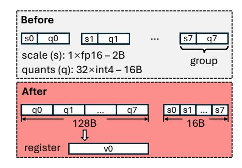

**图表分析 (Figure 7)**：
该图展示了量化组聚合前后的内存布局变化，旨在适配 HVX 寄存器。
*   **Before (上部分)**：展示了传统的 AoS（Array of Structures）布局。每个组（Group）包含 $1$ 个 FP16 的 Scale（$2$ Bytes）和 $32$ 个 INT4 的 Quantized values（$16$ Bytes）。这些小块在内存中交错排列，不利于一次性加载大量数据。
*   **After (下部分)**：展示了优化后的布局。
    *   系统将 $8$ 个组的量化值（$q0$ 到 $q7$）提取出来，连续存放，形成一个 $128$ Bytes 的块。
    *   这 $128$ Bytes 正好可以被一次性加载到寄存器 `v0` 中。
    *   对应的 $8$ 个 Scales（$s0$ 到 $s7$）也被紧凑地存放在一起（$16$ Bytes），可以被高效地通过查找表（LUT）方式加载和广播（后续章节会详述 LUT 的使用）。

**3. 总结**

通过 **Hardware-aware Tile Quantization** 和 **Group Coalescing**，该系统成功地将软件的数据结构与 NPU 的硬件特性（HMX 的 Tile 访问模式、HVX 的寄存器宽度）进行了完美对齐。这种设计使得系统能够在保持细粒度量化（高精度）的同时，最大化利用 NPU 的矩阵计算能力和向量内存带宽。

## 系统设计 II：基于LUT的高效算子计算

### 系统设计 II：基于LUT的高效算子计算

针对移动端 NPU 通用向量单元（Vector Unit, HVX）计算能力较弱且内存带宽有限的问题，本文提出了一种基于 **查找表（Look-Up Table, LUT）** 的计算加速策略。该策略的核心思想是利用 NPU 的专用查表指令和机制，将复杂的数学运算（如指数计算、反量化逻辑）替换为低开销的内存读取操作。

### 基于向量 Gather 的快速 Softmax

在 Test-time scaling（TTS）场景下，增加采样并行度会导致 Batch Size 增大和 Context Length 变长。这使得 Attention 算子，特别是其中的 Softmax 计算，成为推理延迟的主要瓶颈。

#### 1. Attention 算子的性能瓶颈分析

作者在 Hexagon NPU 上实现了 FlashAttention，并对不同负载下的延迟进行了拆解分析。

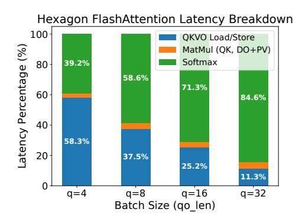

**图表分析 (Figure 8)**：
*   **实验设置**：使用 Qwen2.5-1.5B 模型，Prompt 长度固定为 4096。
*   **横轴**：Batch Size（即 Query 的长度），从 4 增加到 32。
*   **纵轴**：FlashAttention 各个阶段的延迟占比。
    *   蓝色：矩阵加载/存储（Load/Store）。
    *   橙色：矩阵乘法（MatMul）。
    *   绿色：Softmax 计算。
*   **结论**：随着 Batch Size 的增加，矩阵乘法（橙色）的占比并未显著增加，反而是 **Softmax（绿色）的占比急剧上升**。当 Batch Size 为 32 时，Softmax 占据了超过 84% 的延迟。这是因为 NPU 的向量单元（HVX）缺乏针对特殊数学函数（如 $\exp$）的硬件加速支持。

#### 2. 使用 LUT 替代昂贵的指数计算

标准的 Softmax 计算包含指数运算 $e^x$。在 NPU 上，通常需要使用多项式逼近（Taylor 展开）来实现，这涉及大量的乘加运算和顺序依赖，难以利用 VLIW 架构的指令级并行优势。

为了解决这一问题，作者提出预先计算指数函数的值并存储在查找表中：

1.  **全 FP16 流程**：为了配合 LUT 的大小限制，Attention 中的中间矩阵 $S, P, O$ 以及向量 $\vec{m}, \vec{l}$ 均采用 16-bit 浮点数（FP16）存储。
2.  **LUT 寻址限制**：FP16 有 $2^{16} = 65536$ 个可能的值。如果构建完整的 LUT，需要 $65536 \times 2 \text{ Bytes} = 128 \text{ KiB}$ 的空间。虽然 TCM（紧耦合内存）能够容纳，但 Hexagon 的 `vgather` 指令（用于从 TCM 离散读取数据）在某些变体下对地址偏移量有限制，且过大的 LUT 会占用宝贵的片上内存。

#### 3. 利用 Safe Softmax 属性压缩 LUT

为了进一步压缩 LUT 大小，作者利用了 **Safe Softmax** 的数学性质。

*   **Safe Softmax 公式**：
    $$Softmax(x_i) = \frac{e^{x_i}}{\sum_j e^{x_j}} = \frac{e^{x_i - m}}{\sum_j e^{x_j - m}}$$
    其中 $m = \max(\mathbf{x})$ 是输入向量中的最大值。

*   **性质推导**：由于 $m$ 是最大值，对于任意 $x_i$，都有 $x_i - m \le 0$。这意味着指数函数的输入域被限制在非正数区间 $(-\infty, 0]$。
*   **LUT 优化**：利用这一性质，只需存储输入为负数部分的指数结果。这使得 LUT 的大小减半，仅需 **32768 个条目（64 KiB）**。
*   **具体实现**：
    *   忽略 FP16 的符号位（MSB），将剩余位左移 1 位作为 `vgather` 指令所需的字节偏移量。
    *   LUT 仅占用 8 MiB TCM 容量的约 0.8%，几乎不影响其他操作。
    *   相比于多项式逼近，查表法不仅速度更快（加速比高达 2.2 倍），而且由于表项可以使用 FP32 预计算后转 FP16，精度通常也更高。

### LUT 为核心的高效反量化

在混合精度推理中，权重以 INT4 存储，需要在运行时反量化为 FP16 以进行计算。传统的反量化过程涉及掩码（Masking）、移位（Shifting）、类型转换（Casting）等一些列指令，在 NPU 向量单元上效率低下。

#### 1. 快速 INT4 到 FP16 转换

作者利用 Hexagon HVX 的 `vlut16` 指令来加速这一过程。

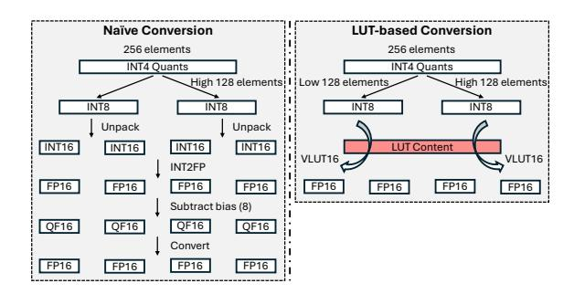

**图表分析 (Figure 9)**：
*   **左侧（Naïve Conversion）**：展示了传统的反量化流程。
    1.  加载 INT4 压缩数据。
    2.  通过位运算拆分高低 4 位（Unpack）。
    3.  转换为 INT16。
    4.  转换为 FP16。
    5.  减去 Zero Point，乘以 Scale。
    6.  处理特殊的 `qfloat` 格式（针对旧版 NPU）。
    *   **缺点**：指令流水线长，计算开销大。

*   **右侧（LUT-based Conversion）**：展示了本文提出的基于 LUT 的方法。
    1.  加载 INT4 数据。
    2.  直接使用 `vlut16` 指令。该指令根据输入数据的索引值，直接从寄存器查找表中取出对应的 FP16 值。
    *   **优点**：将复杂的转换逻辑折叠为单条查表指令，大幅减少指令数。

#### 2. Scale 参数的快速广播

反量化不仅涉及数值转换，还需要乘以缩放因子（Scale）。通常，一组（Group）权重的 Scale 需要被广播（Broadcast）到整个向量寄存器中。
*   **传统方法**：使用专门的广播指令，然后拼接寄存器。
*   **LUT 方法**：将 4 个量化组的 Scale 值作为 LUT 的内容，构造一个预定义的常量索引向量。通过执行一次 `vlut16`，即可利用查表机制完成 Scale 值到对应位置的复制和广播，无需显式的广播指令。

#### 3. 对不同 4-bit 编码的通用性

该设计具有极强的通用性。由于转换逻辑完全由 LUT 的内容决定，而非固定的计算指令序列，因此该系统可以轻松支持不同的 4-bit 数据类型，例如：
*   **Standard INT4**
*   **NF4 (Normal Float 4)**：QLoRA 中常用的数据类型。
*   **FP4 (Floating Point 4)**
*   **IQ4_NL**：llama.cpp 中的非线性量化。

只需在初始化阶段更改填入 LUT 的数值，无需修改运行时的内核代码（Kernel Code）。

## 实现与实验评估

以下是基于论文《Enabling Parallel Test-Time Scaling on Mobile NPUs for LLM Inference》中“Implementation”和“Evaluation”章节整理的详细笔记。

### 实现细节 (Implementation Details)

为了验证在移动端 NPU 上进行测试时计算缩放（Test-Time Scaling, TTS）的可行性，作者设计并实现了一个端到端的推理系统。该系统没有依赖通常使用的封闭生态 SDK，而是采取了更底层的定制化开发策略。

#### 基于 llama.cpp 的端到端系统构建
作者在开源推理框架 **llama.cpp** 的基础上进行了扩展，编写了约 **7000 行** C/C++ 代码及内联汇编。
- **系统架构**：采用 CPU + NPU 异构协作模式。
- **集成方式**：为 llama.cpp 添加了一个自定义的 Hexagon NPU 后端。对于 NPU 尚未实现的算子（如部分复杂的预处理或后处理），系统会将其调度回 CPU 执行，从而保证了对上层应用的无缝支持。
- **去 QNN 依赖**：这是本系统的核心差异点。
  - 传统的移动端 NPU 开发通常依赖高通的 **QNN (Qualcomm AI Engine Direct)** SDK，但 QNN 依赖静态的、固定形状的计算图，且不支持自定义底层高性能 Kernel。
  - 本文实现了一个独立的 **Hexagon DSP 算子库**，直接编译为共享对象（Shared Object），从而绕过了 QNN 的限制，实现了对底层矩阵指令（HMX）的直接调用。

#### 高效的 CPU-NPU 通信机制
为了最小化异构计算之间的数据传输延迟，系统采用了基于共享内存的通信方案。
- **内存管理**：利用 `rpcmem`（内核 dmabuf 的封装）分配物理上连续的共享内存。
- **零拷贝（Zero-Copy）**：通过 `libcdsprpc.so` 提供的接口，CPU 和 NPU 可以直接访问同一块物理内存，消除了不必要的数据拷贝开销。
- **通信流程**：
  1.  **初始化**：调用 Hexagon SDK 的 FastRPC 启动远程 NPU 会话。
  2.  **轮询机制**：NPU 端的一个线程在共享内存区域持续轮询（Polling），等待 CPU 发出的计算请求。
  3.  **缓存维护**：由于 Snapdragon SoC 上 CPU 和 NPU 之间仅存在单向一致性（One-way Coherence），CPU 在写入数据后需手动执行缓存清除（Cache Clean/Invalidate），确保 NPU 读取到最新数据。

---

### 总体性能与帕累托前沿 (Overall Performance & Pareto Frontier)

这一部分的评估核心在于证明：**利用移动端 NPU 的闲置算力进行测试时缩放，可以让小模型在端侧设备上达到超越大模型的性能-成本比。**

**实验平台与设置**：
- **硬件设备**：
  - OnePlus Ace3 (Snapdragon 8 Gen 2, NPU V73)
  - OnePlus 12 (Snapdragon 8 Gen 3, NPU V75)
  - OnePlus Ace5 Pro (Snapdragon 8 Elite, NPU V79)
- **模型**：Qwen 2.5 (1.5B, 3B, 7B) 和 Llama 3.2 (1B, 3B) 的 Instruct 版本。
- **任务**：数学推理任务 MATH500 和 GSM8K。

#### 精度-延迟权衡 (Accuracy-Latency Trade-off)

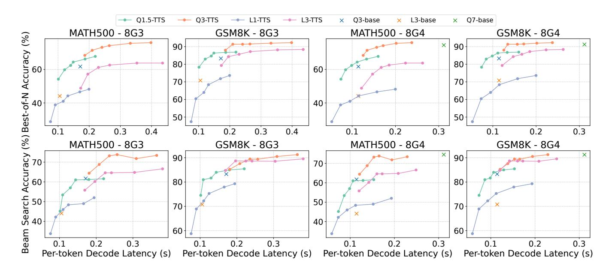

**图表分析 (Figure 10)**：
该图展示了在不同硬件（8G3, 8G4）和数据集上，使用 Best-of-N 和 Beam Search 两种 TTS 策略时的精度（y轴）与解码延迟（x轴）的关系。
- **帕累托前沿的推移**：图中曲线表明，通过 TTS 策略，小模型的性能边界得到了显著扩展。
- **小模型 vs 大模型**：
  - **Qwen2.5-1.5B + TTS** 的表现超越了 **Qwen2.5-3B Base**（无 TTS）的基线精度。
  - **Qwen2.5-3B + TTS** 的表现甚至可以媲美 **Qwen2.5-7B Base**，且延迟更低。
- **结论**：在移动端 NPU 上，使用“小模型 + 并行采样”比直接运行“大模型”能获得更好的精度-成本权衡（Performance-Cost Pareto Frontier）。

#### 端到端解码吞吐量分析

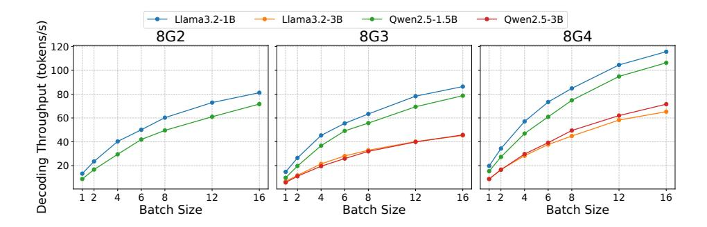

**图表分析 (Figure 11)**：
该图展示了不同模型在三种设备上，随着 Batch Size 增加时的解码吞吐量（Tokens/s）变化。
- **吞吐量随 Batch Size 提升**：随着 Batch Size 从 1 增加到 16，解码吞吐量显著提升。
  - **原因**：LLM 解码阶段通常受限于内存带宽（Memory-bound），导致 NPU 强大的矩阵计算单元（HMX）处于闲置状态。增加 Batch Size 有效利用了这部分“免费”的计算能力。
- **非线性扩展**：吞吐量的增长并非完全线性。
  - **瓶颈**：作者指出，当 Batch Size 较大（如 16）时，运行在 CPU 上的 `lm_head`（词表投影）及 Logits 处理占据了约 50% 的时间，成为新的瓶颈。这是由于当前 NPU 实现受限于 32 位地址空间，无法完全容纳大词表的 Logits 张量。

---

### 消融实验与开销分析 (Ablation Study & Overhead)

为了验证文中提出的两项核心技术——**LUT-Based 计算**和**硬件感知量化**的有效性，作者进行了详细的组件级基准测试。

#### Softmax 算子加速 (LUT-Based Optimization)

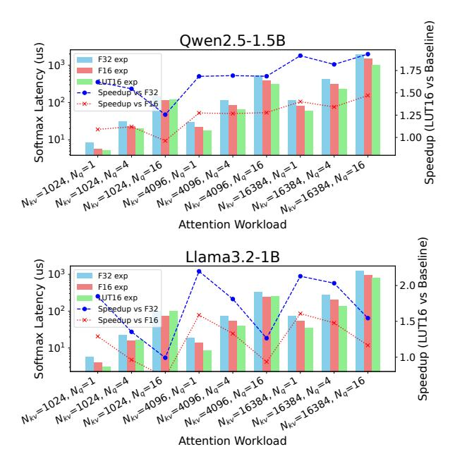

**图表分析 (Figure 14)**：
该图对比了在不同 Attention 工作负载下，三种 Softmax 实现方式的延迟：F32 exp（基线）、F16 exp、以及本文提出的 LUT16 exp（查表法）。
- **性能提升**：相比于传统的 FP32 实现，基于查找表的实现（LUT16 exp）带来了 **$1.26\times$ 到 $2.19\times$** 的加速。
- **原因**：NPU 的向量单元（HVX）缺乏专用的指数运算指令，使用多项式逼近计算 `exp` 非常耗时。通过预计算查找表并利用 `vgather` 指令，显著减少了指令数。
- **精度保持**：实验表明，使用 FP16 进行中间计算对最终模型精度（PPL, MMLU）的影响微乎其微。

#### GEMM 反量化性能 (Dequantization Efficiency)

这是实现高性能混合精度 GEMM 的关键。作者对比了不同的内存布局对反量化开销的影响。

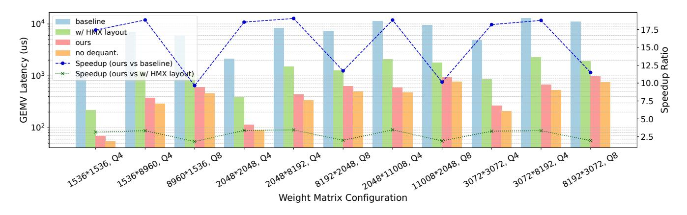

**图表分析 (Figure 15)**：
该图展示了不同优化阶段的 GEMV 延迟对比。
- **Baseline**：传统的列主序布局，运行时需要大量的 Scatter（分散写）操作，性能最差。
- **w/ HMX layout**：应用了硬件感知的权重重排，消除了 Scatter 操作，性能提升明显。
- **Ours**：在 HMX layout 基础上增加了**量化组融合（Coalescing）**，使得读取粒度匹配向量寄存器宽度（128 Byte）。
- **结果**：
  - 相比 Baseline，最终方案实现了 **$9.65\times$ 到 $19.04\times$** 的加速。
  - 与 **No Dequant.**（仅做内存拷贝，不做计算）相比，最终方案仅慢了约 27%，说明反量化计算的开销已被压缩至接近极限，不再是主要瓶颈。

#### 功耗与内存开销

- **功耗**：在 Snapdragon 8 Gen 3 上，即使 Batch Size 增加，整机功耗仍控制在合理范围。
  - 运行 1.5B 模型时，Batch Size 增加会导致功耗上升，但峰值仍低于 **5W**。
  - 运行 3B 模型时，功耗稳定在 **4.3W** 左右。
- **能效**：1.5B 模型在 Batch Size = 8 时的能耗低于 3B 模型在 Batch Size = 1 时的能耗，但前者通过 TTS 获得的精度却与后者相当，证明了该方法的高能效性。
- **内存占用**：NPU 使用的 dmabuf 大小固定（1.5B 模型约 1GB, 3B 模型约 2GB），主要开销增长来自 CPU 端处理更大的 Batch Size，但在可接受范围内。

## 讨论与结论

根据论文的《Discussion》和《Conclusion》章节，以下是关于讨论与结论的详细笔记。

### 讨论与结论

本部分深入探讨了系统的性能瓶颈、硬件限制以及未来的改进方向，并总结了该研究在移动端 LLM 推理领域的核心贡献。

#### 局限性与未来工作

尽管论文提出的系统在移动端 NPU 上成功实现了高效的测试时计算缩放（Test-time scaling, TTS），但作者坦诚地指出了当前实现的几个主要局限性，并提出了未来的优化方向。

**1. 当前解码速度受限于反量化开销**
*   **现象**：虽然系统在较大的 Batch Size 下表现出色，但在 Batch Size 为 1 时，解码速度仍受到限制。
*   **原因**：这主要是由于 **反量化（Dequantization）** 操作带来的计算开销。虽然作者使用了 LUT（查找表）技术来加速这一过程，但相比于专用的硬件支持，在向量单元（HVX）上通过软件进行反量化仍然占用了可观的周期。
*   **对比**：基于 QNN 的传统量化 GEMM 通常只使用 DMA 和 HMX（矩阵单元），不引入 HVX 的计算开销，因此在纯速度上可能更快，但精度较低。
*   **未来方向**：借鉴类似 **T-MAC [62]** 的方法，探索如何在 NPU 上使用查找表直接进行低比特矩阵乘法计算，从而进一步加速 LLM 的解码过程。

**2. Logits 计算在 CPU 上的瓶颈与 NPU 地址空间限制**
*   **现象**：随着 Batch Size 的增加，解码吞吐量的扩展并非完美的线性，且 CPU 的利用率随之上升（如 Figure 16 所示）。
*   **技术瓶颈**：
    *   **地址空间限制**：高通 Hexagon NPU 的单个会话（Session）仅支持 **32-bit 虚拟地址空间**（即最大 4GB，实际可用更少）。
    *   **内存占用**：现代 LLM 的词表（Vocabulary）非常大，导致 `lm_head` 投影层和输出的 Logits 张量占用巨大内存。如果将完整的 Logits 计算放在 NPU 上，可能会耗尽地址空间，导致模型无法运行。
*   **当前妥协**：作者保守地将 `lm_head` 权重和 Logits 计算留在了 **CPU** 上执行。这导致了 CPU 计算成为了大 Batch Size 下的性能瓶颈。
*   **解决方案**：未来可以通过使用 **多 NPU 会话（Multiple NPU sessions）** 来规避单个会话的地址空间限制，或者随着新一代硬件对更大地址空间的支持来解决此问题。

**3. 从数学推理任务向更广泛推理/规划任务的泛化潜力**
*   **当前应用**：论文目前的评估主要集中在 **数学推理任务**（如 MATH500, GSM8K），因为这些任务具有明确的验证标准，非常适合 Parallel TTS 方法。
*   **泛化性**：作者指出，并行测试时缩放不仅仅适用于数学，最近的研究证据 [8, 17, 22] 表明，这种方法可以扩展到更广泛的 **推理（Reasoning）** 和 **规划（Planning）** 领域。
*   **理论基础**：从理论上讲，广义的推测解码（Speculative Decoding）和测试时缩放都属于 **"生成-验证"（Generate-then-Verify）** 框架。本系统作为底层的计算引擎，能够无缝支持这些更高级的上层应用。

#### 核心贡献总结

本论文通过软硬件协同设计，开创性地在资源受限的移动设备上实现了基于 NPU 的测试时计算缩放。

**1. 证明了在移动端 NPU 上进行 LLM 测试时缩放的可行性**
*   **洞察**：作者敏锐地发现，在常规的 LLM 解码阶段（GEMV 操作），移动端 NPU 强大的 **矩阵乘法单元（Matrix Multiplication Units, e.g., HMX）** 处于严重的 **利用率不足（Underutilized）** 状态。
*   **利用闲置算力**：通过引入并行测试时缩放（Parallel Test-time Scaling），系统将解码过程中的 GEMV 转换为 Batch Size 更大的 GEMM，从而在不显著增加推理延迟的前提下，充分利用了这些“原本被浪费”的计算资源。

**2. 提出了新的性能-成本帕累托前沿（Pareto Frontier）**
*   **关键发现**：实验结果（Figure 10）有力地证明，**"小模型 + 测试时缩放"** 的组合，可以在准确率和延迟/能耗上击败 **"大模型 + 常规解码"** 的组合。
    *   例如，Qwen2.5-1.5B 模型配合 TTS，在数学任务上的表现可以匹配甚至超越 3B 或 7B 的模型，同时保持更低的部署成本。
*   **意义**：这为移动端 AI 部署提供了一条新路径——不再单纯追求更大的模型参数量，而是通过动态增加推理时的计算量来换取更高质量的生成结果。

**3. 硬件软件协同设计的有效性验证**
*   为了克服 NPU 在通用计算和精度支持上的不足，论文提出的两项核心技术被证明是至关重要的：
    *   **硬件感知的分块量化（Hardware-aware Tile Quantization）**：解决了 NPU 矩阵单元特殊的内存布局与细粒度量化之间的不匹配问题，消除了运行时的数据重排开销。
    *   **基于 LUT 的算子加速（LUT-based Computation）**：利用向量单元的查找表指令，高效地替换了 Softmax 中的指数计算 ($e^x$) 和混合精度 GEMM 中的反量化操作，突破了向量单元的计算瓶颈。
*   **系统实现**：设计并实现了一个端到端的推理系统（基于 llama.cpp），摆脱了对厂商专有闭源框架（如 QNN）的依赖，证明了在移动端进行底层算子定制优化的巨大潜力。