# 在智能手机上使用移动**NPU**扩展**LLM**测试时间计算

子旭豪

黄敏兴 清华大学

清华大学

huangmx25@mails.tsinghua.edu.cn

魏建宇科学技术大学

王拓维 清华大学

wtw23@mails.tsinghua.edu.cn

haozx23@mails.tsinghua.edu.cn

中国的 noob@mail.ustc.edu.cn

姜诗琪

江惠强 微软研究院

hjiang@microsoft.com

微软研究院 shijiang@microsoft.com

曹廷∗ AI产业研究院

(航空),清华大学 tingcao@mail.tsinghua.edu.cn 居仁∗清华大学

renju@tsinghua.edu.cn

#### 摘要

在移动设备上部署大型语言模型面临着较小模型性能不 足和较大模型资源消耗过大的挑战。本文指出,在典型 的LLM推理过程中,移动神经处理单元(NPU)的计算 资源利用率不足,特别是其矩阵乘法单元。为了利用这 种浪费的计算能力,我们提出在移动NPU上应用并行测 试时间缩放技术来提高较小LLM的性能。然而,这种方 法面临着固有的NPU挑战,包括对细粒度量化的硬件支 持不足,以及在通用计算中效率低下。为了克服这些问 题,我们引入了两个关键技术:一个硬件感知的瓦片量 化方案,它将组量化与NPU存储器访问模式相匹配,以 及用于复杂操作(如Softmax和去量化)的高效的基于 LUT的替换。我们设计并实现了一个端到端推理系统, 该系统利用NPU的计算能力,支持高通骁龙平台上的测 试时间缩放。实验表明,我们的方法带来了显著的加 速:高达19。混合精度GEMM为0 ×,Softmax为2.2 ×。 更重要的是,我们证明了使用测试时间缩放的较小模型 可以匹配或超过较大模型的精度,实现了新的性能-成 本帕累托前沿。

∗通讯作者。

[本作品是根据](https://creativecommons.org/licenses/by/4.0/legalcode)Creative Commons Attribution 4.0 Interna[国家许可证授权的。](https://creativecommons.org/licenses/by/4.0/legalcode)

*EUROSYS*'*26*,*2026*年*4*月*27*日至*30*日,苏格兰爱丁堡英 国©2026版权由所有者/作者持有。 ACM ISBN 979-8-4007-2212-7/26/04 <https://doi.org/10.1145/3767295.3769382>

*CCS*概念:•计算机系统组织→单指令、多数据;•以人 为中心的计算→无处不在和移动设备;•计算方法→自 然语言处理 。

关键词:神经处理单元、移动设备、大型语言模型

#### **ACM**参考格式:

[17](#page--1-0) 子胥浩、魏建宇、王拓维、黄民兴、江惠强、石岐江、曹 廷、居仁。2026.在智能手机上使用移动NPU扩展LLM测试时 间计算。在欧洲计算机系统会议(*EUROSYS*'*26*),*2026*年*4* 月*27*日至*30*日,英国苏格兰爱丁堡。美国纽约州纽约市 ACM, 页。[https://sp\\_3>//doi.org/10.1145/3767295.3769382](https://doi.org/10.1145/3767295.3769382)

# **1** 介绍

[42](#page--1-1) [23](#page--1-5) [72](#page--1-3) [56](#page--1-2) [57](#page--1-4) 随着商品硬件和算法的进步,在移动设备上部署大型语 言模型(LLMs)变得越来越可行。许多为移动设备量 身定制的语言模型已经出现,包括Llama 3.2[ ],MiniCPM[ , ],Gemma[ , ]。然而,这些模型与它 们的大型模型相比通常表现较差。提高模型性能的一个 简单方法是扩大模型大小,但这会显著增加内存消耗和 带宽需求,给资源受限的移动平台带来严重挑战。

[3](#page-13-0) [5](#page--1-6) [24](#page--1-11) [37](#page--1-9) [54](#page--1-10) [61](#page--1-7) [63](#page--1-8) [67](#page--1-12) 最近,一种名为测试时间缩放的新范式引入了通过增 加推理时间计算来增强LLM能力的新机会。并行测试时 间缩放方法包括生成多个路径并从多个生成候选[ 、 、 、 、 、 、 、 ]中选择最佳样本。到目前 为止,这些方法仅限于计算资源丰富的云或离线环境。

直觉上,使用测试时间缩放技术来提高移动设备上 LLM的生成质量似乎不切实际。智能手机等移动设备通 常被认为是资源受限的,而LLM推理以高资源消耗而闻 名。除此之外,在运行时扩展计算资源还需要更多的计 算。

然而,最近在移动SoC中集成神经处理单元(NPU)已经开始改变这一格局。包括Qualcomm、Intel和AMD在内的供应商已经设计并集成了NPU来加速AI工作负载[10、41、52]。这些NPU不仅实现了高峰值计算能力,而且还经历了快速进化:高通声称其Snapdragon X Elite中的Hexagon NPU提供了45个INT8顶级性能[26],而最近几代AMD NPU已经达到了3个。1×1性能改进[25]。这些发展正在改变移动设备的计算能力。

我们发现移动NPU通过专门的矩阵乘法单元实现高峰值性能,这些单元运行在大型矩阵瓦片上。然而,在典型的LLM推理中,GEMM运算往往在解码阶段退化为GEMV,导致硬件利用率低和大规模优化矩阵单元计算能力的浪费。这种利用不足带来了一个机会:增加采样并行性的测试时间缩放方法可以利用这种可用的计算能力,而不会大大增加推理开销。

尽管有这种潜力,但使用移动NPU实现高效的测试时间 扩展面临着重大的硬件挑战,我们将其分为两个方面:

精度:移动NPU最初是为粗粒度量化模型设计的,缺乏对细粒度组量化的原生支持,而这对于部署在低比特中的现代LLM至关重要。我们观察到,用常规的每通道方法量化的模型在推理任务上会遭受严重的性能下降,而这些任务对测试时间缩放至关重要。

效率:虽然NPU擅长矩阵乘法,但它们的通用向量单元提供的计算吞吐量和内存带宽有限。用于测试时间缩放的LLM推理中许多关键的非矩阵计算必须在向量单元上运行,成为一个突出的瓶颈。此外,广泛的SIMD向量组件和数据粒度之间的不匹配,加上硬件的内存访问限制,使得软件难以充分利用向量单元的计算能力,进一步加剧了问题。

为了解决这些挑战,我们提出了一个利用丰富计算的端到 端LLM推理系统 移动NPU支持测试时间扩展工作负载的能力。为了满足设备上的资源约束和精度要求,我们主要采用仅加权的4位细粒度分组量化。针对由此带来的效率挑战,我们的解决方案包含以下关键技术:

**硬件感知的瓦片量化方案:** 我们提出了一种新颖的矩阵和矢量单元感知的量化布局。

通过量化前后的权重布局变换,我们将细粒度的组量化应用于硬件友好的瓷砖上,并与NPU的内存访问模式对齐,从而最小化运行时内存访问开销并最大化向量计算利用率。

基于LUT的高效计算: 我们用高效的表查找(LUT)指令替换复杂的关键操作,包括Softmax中的指数计算和混合精度GEMM中的去量化过程,缓解了向量单元上的计算瓶颈。

我们在三代Qualcomm Snapdragon平台上评估我们的系

统。我们提出的技术可以达到19。0×混合精度GEMM加速度和2。与基线相比,Softmax的加速度分别为2×。结果证明了利用移动NPU用于LLM测试时间缩放工作负载的有效性。值得注意的是,我们表明测试时间缩放实现了最先进的性能成本权衡:使用较小模型的测试时间缩放可以匹配甚至超过不进行缩放运行的较大模型的性能。据我们所知,这是第一项探索在移动设备上具有NPU的LLM的测试时间缩放方法的可行性和评估权衡的工作。我们的贡

● 我们分析了现代移动NPU的体系结构,并确定了LLM 解码阶段中专用矩阵单元的利用率不足。

献概述如下:

- 我们提出了两种技术:硬件感知的瓷砖量化方案和基于 LUT的计算,以加速移动NPU上的LLM测试时间缩放。
- 我们设计并实现了一个端到端LLM推理系统2,该系统利用移动NPU来支持测试时间缩放工作负载,并且对专有软件堆栈的依赖最小。
- 我们证明了测试时间缩放可以有效地利用否则浪费的 NPU计算能力来提高设备上小型语言模型的生成质量,与传统模型缩放相比,在精度和成本方面实现帕累托前沿性能。它为在移动设备上部署LLMs开辟了新的机会。

1通过将AMD Ryzen AI 9 HX的50个项部除以获得该值370 AMD锐龙7 884 5HS NPU的16个项部的NPU。

2我们的代码可在https://github.com/haozixu/llama.cpp-npu(main 回购)和https://github.com/haozixu/htp-ops-lib(操作库)

图1。两种典型的测试时间缩放方法: Best-of-N和Beam Search。

## 2 背景

#### 2.1 缩放LLM计算和测试时间

并行测试-时间缩放作为一种流行而有效的新范式出现,可以在不修改模型参数的情况下提高模型精度;相反,它投入了更多的计算和测试时间。最简单的测试时间缩放方法是多数投票和自一致性[3,61],它们用于从多组生成样本中选择最一致的答案。对于具有可验证结果和具有奖励模型(即,结果奖励模型)的域的数学或编程问题,可以从完整的样本集中选择得分最高的选项,这种策略被称为Best-of-N[54]。通过lookahead rollouts,类似于蒙特卡罗树搜索(MCTS)的方法可以从部分生成的序列中选择最优路径,从而导出过程奖励模型(PRM)[14,45,60,74],这些模型可以直接对中间结果进行评分。在PRM辅助下,无前视阶梯级波束搜索[54,63]动态地丢弃低质量的生成路径,以平衡探索和开发。图1说明了两种流行的测试时间缩放方法的算法。

#### 2.2 神经处理单元

随着AI工作负载的增长,现代SoC越来越多地集成NPU来加速神经网络推理[10,41,52]。NPUs的特点是专门加速低精度、计算密集型的核心神经网络操作(例如GEMM),提供极高的计算吞吐量,同时保持良好的电源效率。

广泛采用的NPU架构采用"向量+矩阵"组合,其中矩阵单元加速矩阵乘法和卷积等操作,向量单元处理归一化和复杂激活函数等通用计算。众所周知的例子包括Qualcomm的Hexagon NPU[41]、Huawei的Ascend NPU[32]、AMD的XDNA NPU[52]、Intel NPU[10]和Intel的Gaudi HPU[11]都使用这种类型

建筑的。这类NPU在硬件执行模型上与普通GPU有显著的不同。如图2所示,在GPU的SIMT模型中,不同的线程可以独立执行分支、内存访问和计算,而在theNPU的基于SIMD的执行模型中,单个线程对大型向量或矩阵数据块进行操作。在硬件层面,NPU通常使用较少的硬件线程,并使用VLIW架构来减少控制逻辑开销。与GPU相比,NPU牺牲编程灵活性和易用性来换取更高的执行效率和能效。

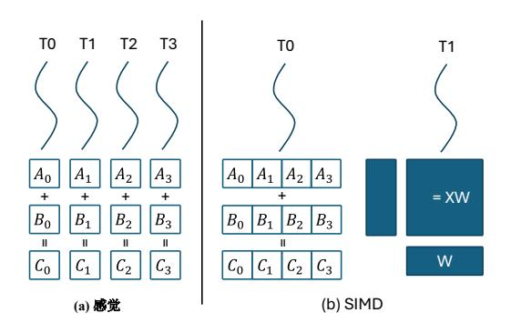

图2。比较(a)GPU的SIMT执行模型和(b)NPU的SIMD执行模型。

## 3 动机和挑战

在本节中,我们首先介绍了移动NPU的一些关键功能, 然后分析了利用NPU的免费计算的机会以及为测试时间 缩放工作负载实现高效系统的挑战。

#### 3.1 高通的Hexagon NPU

高通Snapdragon SoC上的Hexagon NPU由于其典型的架构、广泛的采用和相对可访问的SDK而成为具有代表性的移动NPU。因此,我们用它来演示移动NPU的核心特性。

3.1.1 编程接口。对Qualcomm Hexagon NPU进行编程的主要方法是通过Qualcomm AI Engine Direct[51](通常称为QNN),这是一个专有的、闭源的DNN推理框架。在大多数情况下,即使Hexagon SDK中提供了Hexagon NPU的完整LLVM工具链,开发人员也无法定制高性能的低层内核,这主要是因为矩阵单元的说明仍然未公开。我们能够利用FP16矩阵单元,通过对二进制库中未文档化的指令进行逆向工程。

#### 3.1.2 建筑。

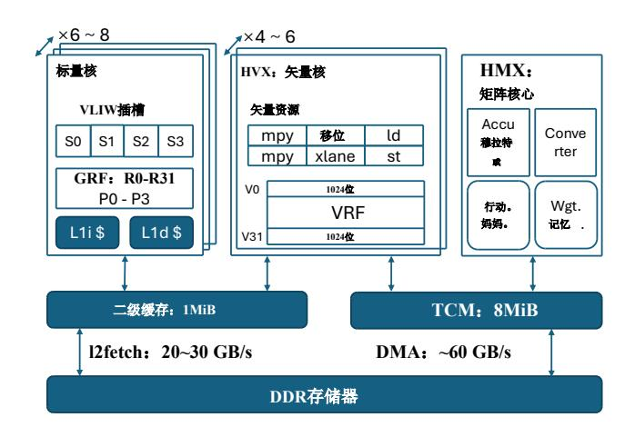

图3。Hexagon NPU架构。

计算单元。Hexagon NPU具有典型的"向量+矩阵"混合架构。它的矢量单元和矩阵单元分别命名为HVX(六边形矢量扩展)和HMX(六边形矩阵扩展)。Hexagon NPU采用6到8个标量VLIW硬件线程进行逻辑控制。所有向量或矩阵指令都是从标量核心中的四个VLIW插槽中的一个发出的。HVX单元上下文包括32个宽度为1024位的向量寄存器,这些单元的数量从4到6不等。HMX单元的数量推断为1或2。

**内存子系统。**Hexagon NPU包括共享的1 MiB二级缓存和8 MIB TCM(紧耦合存储器),后者是软件管理的片上存储器的一部分。HVX可以从二级缓存或TCM读取数据。矢量分散/聚集操作和所有HMX指令只能访问TCM。数据可以分别通过l2fetch in struction和DMA机制从DDR存储器加载到L2缓存和TCM中。两者都支持一维或二维张量数据的异步传输。

*HMX单元。*Hexagon NPU强大的矩阵乘法功能源于HMX组件。根据高通公司的说法,HMX单元支持各种精度,包括INT4、INT8、INT16和FP16[41]。以下介绍主要基于FP16 HMX,相关信息来自逆向工程、Hexagon SDK、QNN SDK以及Qualcomm的公开信息。

HMX操作的基本数据单元是一个平铺,其中每个平铺包含一个特定大小的矩阵。对于FP16 HMX,瓷砖尺寸为32\*32,占用2KIB空间。HMX单元可以从TCM加载几块重量存储器和激活存储器。在对每一对矩阵瓦片执行矩阵乘法后,它将结果累加到内部累加器中。最后,它输出对应于累加器的磁贴。同时,HMX单元可以

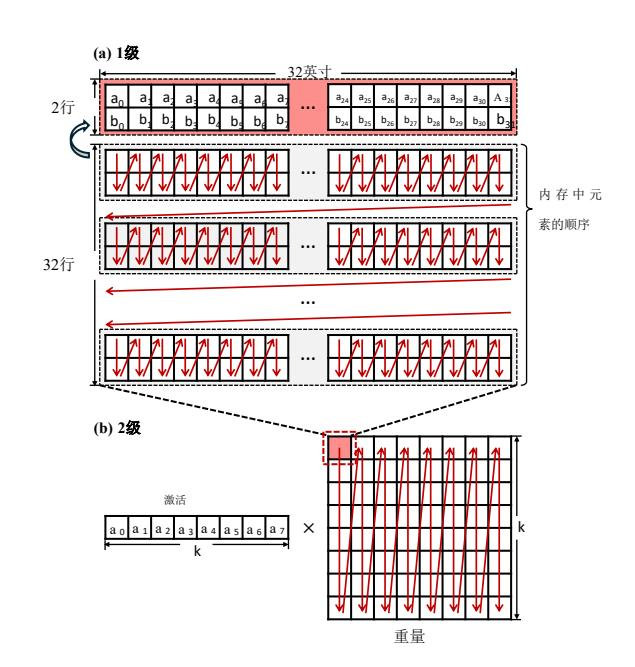

图4。(a)FP16 HMX磁砖的存储器布局。每个平铺对应一个32\*32的矩阵,占用2048个字节。每两行排列,具有与转置的2\*32子矩阵相同的布局。(b)基于HMX的GEMM的总体存储器布局。由于硬件在平铺级别执行innerproduct,因此权重平铺以列为主布局排列。

独立地缩放输出磁贴的每个通道(列)并添加偏置。

FP16 HMX磁砖具有特殊的存储器布局,如图4(a)所示。输入和输出磁贴都遵循此布局。构造这种布局的典型方法是使用HVX指令对原始矩阵的每两个相邻行执行交叉行洗牌。

## 3.2 机会: LLM解码过程中的自由矩阵计算

在自回归生成过程中,LLM的输入通常只对应一个令牌,这会导致GEMM操作退化为GEMV。例如,形状[1,hidden\_dim]的激活矩阵乘以形状[hidden\_dim,proj\_dim]的权重矩阵。在使用FP16 HMX的情况下,每个计算瓷砖的有效尺寸为[1,32]×[32,32]。由于硬件计算的基本单元是32×32的瓦片,输入激活瓦片中的31行与实际有用的内容不对应,造成矩阵单元利用率低,计算能力浪费。

同时,一些测试时间缩放算法可以通过增加生成时的 计算量来获得更好的生成质量,包括并行采样方法如 自一致性,最佳N和光束搜索。它们的特点是使用大于1的批处理大小探索多个生成路径,并使用某些方法(例如外部验证器)来选择更好的生成路径。图5显示了使用Best-of-N进行测试时间缩放的示例。随着生成预算(即解码阶段的最大批处理大小)的增加,MATH500数据集上的模型精度显著提高。

基于这些,我们提出在移动NPU上运行LLM的测试时间缩放工作负载。这样,传统LLM生成过程中浪费的NPU的计算能力就可以得到有效利用。解码开销在理论上不会明显增加,并且在运行时不需要修改模型权值就可以提高模型的生成质量。

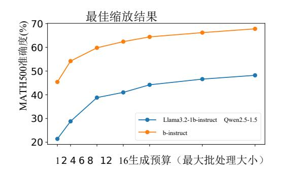

**图5。**使用两个模型进行测试时间缩放的示例。**MATH** 500的精确度随着发电预算的增加而提高。

#### 3.3 挑战

虽然利用移动NPU进行测试时间缩放在理论上是可行的,但高效的实现面临着众多的硬件挑战。我们将这些挑战总结如下。

精度不足。尽管HMX单元支持FP16 GEMM,但在资源受限的设备上部署FP16模型仍然不切实际,使得量化模型成为典型的替代方案。大多数移动NPU(包括HMX)中的矩阵单元最初被设计用于加速整数量化DNN模型,这些模型采用粗粒度量化方案,例如pertensor或per-channel量化。作为一个具体的例子,Hexagon NPU缺乏对现代LLM必不可少的细粒度量化方法的原生硬件支持。这种限制进一步体现在软件堆栈中:QNN只支持pertensor或per-channel权重量化。将粗粒度的低比特量化直接应用于LLM权值会导致显著的精度下降。

如表1所示,Llama 3.2 1B-Instruct模型在QNN的每通 道量化3和AWQ每组4位量化(均在W4A16设置下)下 的精度结果表明,每通道量化模型在具有挑战性的数学 推理任务中性能严重下降。不幸的是,由于测试时间缩 放方法被应用在这类任务中,QNN实现的基线精度甚至 不能满足性能缩放的最低要求。

| 数据集          | AutoAWQ (W4A16) | QNN (W4A16) |  |
|--------------|-----------------|-------------|--|
| MATH500 (†)  | 15.9            | 2.1         |  |
| GSM8K (†)    | 32.6            | 3.4         |  |
| Wiki PPL (↓) | 19.42           | 28.99       |  |

表1。Llama3.2-1B-Instruct在不同实现下的性能比较。 QNN的量化严重损害了模型的推理能力。

*弱通用计算和内存带宽。*在缺乏对细粒度组量化的本 机硬件支持的情况下,一种常见的方法是依赖于通用计 算单元来处理此类计算。然而,我们发现通用向量单元 和专用矩阵单元在计算和内存访问能力之间存在显著的 差距。我们使用1024×1024×1024 GEMM操作在Hexagon V75 NPU上测量HVX和HMX的FP16 GEMM性能, 所有输入和输出都位于片上TCM中,以反映硬件的峰值 性能。如表2所示,矩阵单元的FP16 GEMM吞吐量可达 12TFLOPS——比单个向量线程高300多倍。在内存带宽 方面,专用DMA引擎从DDR实现了超过60 GB/s的读取 带宽, 而矢量单元通过核心数据路径的内存读取带宽保 持在30 GB/s以下。然而, DMA提供的高带宽仅限于大 的、常规的1D或2D数据块,并且不能有效地处理小的 或不规则的存储器访问。这些观察结果突出表明,矢量 单元的通用计算和内存带宽不足以跟上专门矩阵单元的 计算吞吐量,这对在细粒度量化下实现高性能混合精度 GEMM核构成了重大挑战。

## 4 设计概述

我们提出了一个为移动NPU设计的LLM推理系统,并针对测试时间缩放工作负载进行了优化。

为了解决精度挑战,我们对主要权重采用4位细粒度的分组 量化,而

3我们使用PowerServe发布的官方模型,可在https://huggingface.co/ PowerServe/Llama-3.2-1B-PowerServe-QNN29-8G3

| 硬件单元             | HVX(1线程) | HMX      |
|------------------|----------|----------|
| FP16 GEMM GFLOPs | 32.93    | 12032.54 |
| 内存读取bw。(GB/s)    | 26       | 60 (DMA) |

表**2**。HVX和HMX单元的性能指标,以ofFP16 GEMM计算能力 (以GFLOPs为单位)和内存读取带宽(以GB/s为单位)为单 位。

保持浮点激活。在运行时,我们动态地将权重反量化为 浮点值,利用NPU强大的FP16矩阵计算能力,高效地支 持测试时间缩放任务。

对于不可避免的通用计算——其中向量处理单元表现出 有限的内存带宽和计算吞吐量,我们的核心策略包括:

- 采用硬件感知的离线设计,最大限度地减少运行时计算开 销;
- 充分利用SIMD矢量单元的内在能力,弥补专用硬件 和灵活的软件需求之间的差距。

具体而言,我们介绍以下技术:

硬件感知的细粒度瓷砖量化方案。我们提出了一种新颖 的量化布局,它在细粒度的矩形瓦片中执行组量化,这与 沿着累积轴分组的常规方法相反。为了与矩阵和向量单元 两者的存储器访问模式对齐,我们引入了一个涉及权重预 量化变换、量化和后量化变换的离线流水线。这增强了运 行时内存访问的连续性,并消除了不必要的计算开销。

高效的基于*LUT*的计算。对于更复杂的运行时操作, 我们利用向量单位查找表(LUT)指令和广义LUT机制来 取代复杂的转换逻辑。这种方法加速了测试时间缩放工 作负载中的关键瓶颈操作,包括混合精度GEMM中的去 量化和注意力中的Softmax操作。

## **5** 系统设计

### **5.1** 硬件感知的细粒度瓦片量化方案

已有的工作[[30](#page--1-25),[36](#page--1-24)]表明量化误差会显著降低模型在数 学推理等具有挑战性的任务中的性能。然而,由于严格 的ondevice资源限制,全精度模型仍然不可行,使得细 粒度量化对于保持精度至关重要。

不幸的是,在移动上的细粒度量化下实现高效的基于去量化的 gem核

NPUs引入了巨大的系统挑战。我们确定了两个主要问题:

- 矩阵单元期望的权重布局与传统的群量化布局之间的不匹 配;
- 由小组大小引起的宽向量寄存器的次优利用率。

为了克服这些限制,我们提出了一种新的瓦片量化方案, 该方案包括两个组成部分:

- 一种基于瓷砖的量化策略,旨在与矩阵单元的固有数据布 局对齐;
- 一种最大限度地利用向量单元的处理能力的后量化权 重排列方法。

**5.1.1** 瓷砖**-**组量化。在常规量化GEMM中,权重矩阵 通常存储在列主要布局中,这与基于CPU的矩阵乘法中 使用的向量点积操作对齐,例如在llama.cpp CPU后端 中。权重沿着列维被划分为连续的量化组——通常大小 为32。在每一组内,对值进行量化,并将得到的整数权 重连同其相应的尺度和零点参数交错地存储在存储器 中,保留矩阵的原始列方向排序。

[6](#page-5-1) 然而,在具有特殊矩阵单元的NPU上,传统的阵列布 局往往与硬件需求不匹配。如图 所示,在常规布局中 连续的元件在片上TCM中变得分散。对于SIMD向量单 元,这样的非顺序访问模式是有问题的。尽管现代向量 引擎提供了gather/scatter操作来减轻分散的访问,但这 些操作仍然昂贵。简单地换位权重矩阵并不能解决失配 问题,因为矩阵单元预期的复杂多级数据布局仍然会导 致非连续存储器访问。

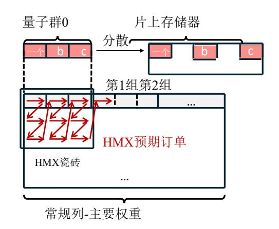

图**6**。量化组布局与HMX瓷砖布局之间不匹配的简化图示。

为了解决这个问题,我们首先将权重排列成矩阵单元 所期望的布局,然后逐组应用圆-最近邻量化。对于32 的组大小,该方法有效地以2 × 16块为单位执行组量 化。鉴于典型模型中的预训练权重近似遵循零均值高斯 分布,与常规分组相比,在这些重塑瓷砖组内进行量化 不会显著改变每个组内的统计特性。因此,得到的量化 误差保持可比性。

具体来说,我们根据图[4](#page-3-0)所示的布局来安排量化前的 权重,其分层结构为两个级别:瓦片的外部列-主要排 序,矩阵单元的瓦片级内积操作匹配,以及每个瓦片内 每两行的内部洗牌。然后,我们在新的记忆顺序中按组 量化权重。

**5.1.2** 聚合用于宽向量访问的量化组。默认情况下,量 化权重存储在结构(AoS)布局数组中。以Q4\_0对称量化 为例,每组32个元素由16个字节的INT4量化值和2个字 节的ofFP16标尺值组成,量化值和标尺在内存中交错。 由于NPU架构上的内存访问严重依赖软件管理的本地1D 或2D预取,因此我们避免了阵列结构(SoA)布局,其 中量化值和比例驻留在单独的大连续阵列中,以更好地 与硬件的首选访问模式对齐。

然而,细粒度的量化组引入了与本机向量处理粒度的 不匹配:单个量化组太小,无法填充128字节宽的向量 寄存器。访问这样的小组将需要多个存储器操作或额外 的指令来合并来自多个寄存器的数据,导致存储器带宽 使用效率低下和计算开销。

为了解决这个问题,我们将8个量化组合并成一个更大 的超组,并重组其内容,使得来自256个连续元素的INT4 值正好占据一个完整的HVX寄存器。该过程如图[7](#page-6-0)所示。

#### **5.2** 基于**LUT**的计算

鉴于矢量单元有限的通用计算性能,我们提出使用广义 查找表(LUT)指令来代替复杂的计算,从而减少指令 数量和计算开销。基于LUT的计算对于加速测试时间缩 放工作负载中的关键操作特别有效,例如Softmax中的 指数函数和去量化过程。

**5.2.1** 通过向量聚集快速**Softmax**。测试时间缩放方法通常会增 加采样并行性,导致更大的批处理大小和更长的上下文长度。 我们分析

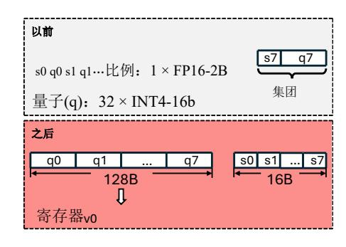

图**7**。将8个细粒度量化组重新打包成一个超级块。INT 4量化值适合于向量寄存器。

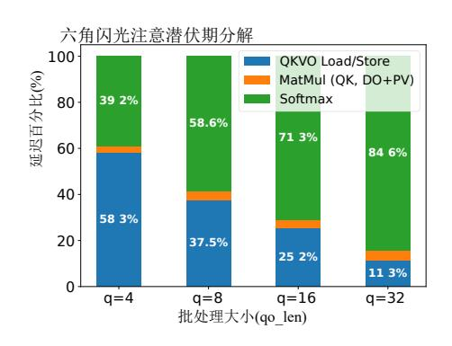

图**8**。Hexagon NPU上的FlashAttention延迟故障。我们使用Qwen 2.5-1.5 b,提示长度设置为4096。

在生成过程中,这些缩放因子对基于transformer的LLMs中主 要算子的影响:

- 宝石。基于前面描述的NPU硬件特性,在测试时间缩 放工作负载中适度增加批处理大小不会显著增加 GEMM延迟。此外,GEMM延迟与上下文长度无关。
- 杂项。行动。对于激活函数、LayerNorm、residual Add和RoPE等算子,虽然它们的计算开销与输入大小 大致成正比,但由于它们的计算量和内存访问量较 小,我们忽略了它们的影响。
- 小心点。注意的理论计算复杂度随批处理大小和上下 文长度的增加而增加,使其成为测试时间缩放场景中 的潜在性能瓶颈。

[12](#page--1-26) [8](#page-6-1) 我们使用FP16 HMX在Hexagon NPU上实现FlashAttention[ ],并在各种输入批处理大小(查询长度)下测 量其提示长度为4096的延迟组成,如图 所示。结果表 明,随着查询长度的增加,矩阵乘法对总延迟的影响不 大,而Softmax在注意力执行时间上占主导地位。

我们的分析表明,片上Softmax的主要瓶颈在于指数计算,它必须应用于 $\Theta(\times)$ 元素。此外,这些昂贵的指数运算必须在HVX上执行,而HVX缺乏对特殊数学函数的专用硬件支持。按照通常的做法,我们将 $\exp$ 替换为 $\exp$ 2,并吸收系数 $\log_2$ 中的比例因子 $\frac{1}{Vd}$ 对于分解为整数部分和分数部分*的输入元素*,2使用泰勒级数多项式展开近似,而直接添加到2的IEEE-754表示的指数字段中。然而,多项式求值涉及顺序依赖性,限制了VL-IW体系结构下的指令级并行性。

为了缓解指数计算的瓶颈,我们探讨了用预先计算的查找表(LUT)代替显式的指数计算。HVX提供了vgather指令,该指令可以从THETCMINT中分散的位置收集值到一个连续的128字节的TCM区域。虽然vgather可以实现大型LUT,但将LUT用于expre仍然具有挑战性:为32位浮点存储232元素是不切实际的。此外,vgather本身引入了相当大的延迟——Hexagon V75上的24到48个指令包,因此必须尽量减少它的使用。

为了实现实用的基于LUT的exp,我们设计了以下方法。首先,我们在整个FlashAttention中广泛使用FP16,片上计算过程在算法1中概述。矩阵,,和向量,*ī*存储在16位浮点数中,具有输入和输出t 16位浮点的exp计算。特别地,FP16 HMX在内部使用更高精度的浮点数进行累加,我们将元素提升到32位精度,用于矩阵的行求和等关键操作。

使用16位输入和输出将LUT限制为65536个条目,需要128 KiB的存储空间,这在TCM内是合适的。vgather的一个变体支持在一条指令中收集64个2字节的元素,最大地址偏移量为65536字节。然而,65536个FP16条目占据了128个KiB,使得一半的条目无法通过直接寻址访问。为了解决这个问题,我们利用了安全softmax[44]的性质,该性质通过减去行方向的最大值来确保对的所有输入是非正的。因此,我们只存储≤0的值,导致LUT包含32768个条目(64 KiB)。在基于LUT的exp计算期间,我们忽略FP16输入的MSB(符号位),并将输入左移一位以产生vgather所需的字节偏移。

LUT是在系统初始化期间预先计算的,在模型推理期间不会引入额外的开销。它在TCM中占据固定的64 KiB 区域,仅占64/8≈0。总TCM容量的8%,因此对其他操作的TCM可用性影响最小。

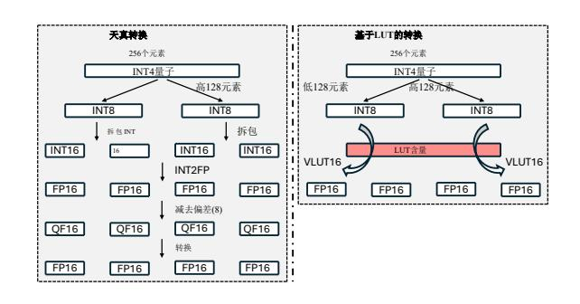

图9。通过查表将INT4量化值转换为FP16数字。

**5.2.2** 以LUT为中心的高效去量化。运行时HVX去量化需要仔细设计以避免额外的开销。我们提出了一种基于HVX查找表指令的高效去量化过程。vlut16指令能够对源向量寄存器中的每个8位索引执行16个元素的表中的表查找。每个输入字节被转换成16位值,因此vlut16产生一对寄存器。

通过表查找快速INT4到FP16转换。使用vlut16指令,对于Q4\_0量化方案,我们直接将4位量化值转换为[-8,7]FP16值,避免了传统的掩码-解包-转换指令序列。图9显示了两种方法的比较。对于V79之前的Hexagon NPU,所有HVX浮点运算都以称为qfloat的内部格式产生结果,这需要额外的指令来转换回标准的IEEE-754格式。使用表查找消除了这些开销。这种以LUT为中心的设计只需调整目录就可以很容易地支持不同的4位编码方案(例如llama.cpp中使用的FP4、NF4[13]、IQ4 NL)。

**通过表查找缩放广播。**128字节的HVX寄存器可以容纳大小为32的两个FP16量化组。因此,传统的方法是将标量刻度广播到整个向量寄存器,然后连接两个寄存器,以便随后与量化值相乘。然而,通过使用四组刻度作为LUT内容并应用预定义的常数索引,我们可以仅用一条vlut16指令实现四组刻度的广播。

### 6 实施

我们的推理系统是在llama.cpp[16]之上实现的,在C/C++和内联汇编中有大约7K行代码。我们使用Hexagon SDK(版本6.0.0.2)中的LLVM工具链来生成Hexagon NPU的代码。我们特别注意到,我们的系统对高通的QNN没有依赖性,避免了不灵活的静态固定形状计算图。

## 算法**1**:我们的FP16 FlashAttention的片上计算(省略了不同的头)

输入:磁头尺寸、查询块数、KV块数、查询块大小、KV块大小

输入:矩阵(FP16)∈R*×*、、(FP16)∈ *R ×*

- **1** 初始化(0) =(**0**)∈R*×(FP16)*、=(−∞)∈R(FP16),∈R*=(0* ∈R*=(0*)∈R∈R(FP16);
- **2** ()=MatMul(*,,*AccumType=FP32)∈R*×*(FP16);
- **3** ( *)* =最大值( ( rowmax −*1)*, ()∈R(FP16);
- **4** ()=LUT\_Exp(*)*− ( × ))∈R (FP16);
- **5** ()= ( −*1)*− ( *)*(−1)+rowsum(()*,*AccumType=FP32)∈R);
- **6** = −1 () 诊断(*(*−*1)R* R输出:=诊断(())

我们的实现主要包括两个模块:一个模块是Hexagon NPU的运算符库,它被编译成一个独立的Hexagon DSP 共享对象;另一个模块与llama.cpp在CPU端。NPU操作 员库实现计算内核、电源管理、硬件资源管理和计算线 程池。我们在llama.cpp中添加了一个Hexagon NPU后 端,利用rpcmem共享内存作为底层缓冲区类型。rpcmem是内核dmabuf内存的包装器,支持CPU和NPU之间 共享物理内存。相关的分配、释放和映射接口由libcdsprpc提供。所以在Android系统的供应商库中。通过利用 共享内存缓冲区,我们不仅消除了不必要的处理器间数 据复制,而且尽可能地重用现有的内存管理系统。此 外,我们能够调度那些没有在NPU上实现的运算符在 CPU上运行,实现与上层应用的无缝集成。

[50](#page--1-19) 在后端初始化阶段,我们调用Hexagon SDK的Fast-RPC[ ]设施来启动远程NPU会话并初始化用于通信的 共享内存区域。在NPU端,一个线程在这个共享内存区 域中连续轮询以接收来自CPU的计算请求。与默认的 RPC实现相比,通过共享内存进行通信可以具有更低的 延迟。我们注意到,CPU将数据写入共享内存后,NPU 不会自动使对应区域的缓存失效,因为Snapdragon SoC 上的CPU和NPU之间只有单向的一致性。因此,我们在 NPU轮询之前手动清除缓存。包含模型激活的共享缓冲 区也需要类似的缓存维护操作。

### **7** 评估

## **7.1** 实验装置

设备。NPU性能实验在三款Android设备上进行:一加Ace3、一加 12、

| 设备         | SoC             | 雪拱。 |
|------------|-----------------|-----|
| 一加Ace3     | 骁龙8 Gen 2 | V73 |
| 一加12       | 骁龙8 Gen 3 | V75 |
| 一加Ace5 Pro | 骁龙8精英版          | V79 |

表**3**。评估中使用的移动设备。

一加Ace5 Pro。部分精度结果是在配备NVIDIA RTX3090 GPU 的服务器测试床上获得的。

[70](#page--1-30) [42](#page--1-1) [45](#page--1-18) 模型。我们从Qwen 2.5[ ]和Llama 3.2[ ]模型族中选 择模型。考虑到手机的实际资源限制,我们主要评估了 模型大小为1.5 B和3B的Qwen 2.5,以及模型大小为1B 和3B的Llama 3.2,这与实际可部署的模型大小相对应。 在评估时间缩放方法的性能成本权衡时,我们额外考虑 了模型大小为7B的QWEN2.5。在数学推理任务的评估 中,我们使用了Qwen 2.5和Llama 3.2的指令模型变体。 对于最佳-of-N搜索和步进级光束搜索,Skywork-1.5B-PRM[ ]被用作结果-奖励和过程-奖励评分器。

[21](#page--1-32) [9](#page--1-31) [53](#page--1-33) [20](#page--1-34) 数据集和度量。在测试时间缩放任务中,我们评估了两 个数学推理任务MATH500[ ]和GSM8K[ ]中模型的pass@ 1准确性,并统一使用0-shot CoT提示。对于其他精度测 量,WinoGrande[ ]精度,MMLU[ ]精度和Wikitext-2困 惑度使用llama-perplexity实用程序进行评估。

[4](#page-8-1) 基线。由于我们专注于测试时间缩放任务,我们主要 介绍了我们的实现在不同解码工作负载下的性能。为了 演示使用NPU运行测试时间缩放工作负载的优势,我们 选择llama.cpp 最近的OpenCL后端作为基于GPU的系统 进行比较。此OpenCL后端集成了为Snapdragon的Adreno GPU量身定制的优化Q4\_0矩阵乘法内核。由于现有的基 于NPU的系统在处理测试时间缩放工作负载方面都有一 定的局限性,因此我们不使用它们作为主要的

4提交:1caae7f

[66](#page--1-35) [2](#page-13-0) [68](#page--1-36) [7](#page--1-37) 基线:法学硕士。NPU[ ]在解码阶段不使用NPU进行计 算;其他基于QNN的系统精度较低(例如PowerServe[ ]); 像Powerinfer-2[ ]和HeteroLLM[ ]这样的系统不是开源的。 尽管如此,我们仍然在[7.2.4](#page-9-0)部分中报告基于QNN的数据作为参考。

设置。在GEMM的算子级评估中,我们选择QWEN 2.5-1.5 B、Qwen2.5-3B、Llama3.2-1B 和 Llama3.2-3B 对 应的线性层的权重矩阵的大小。具体地,这些包括前馈 网络(FFN)中的注意力投影矩阵、和、、。(对于使用分 组查询注意力(GQA)的现代模型,注意力中的投影矩 阵、不被选择,因为它们的规模比、小)。大多数矩阵 采用Q4\_0量化方案,相当于4.5比特每权重(BPW)。对于 FFN下行矩阵,我们应用Q8\_0量化方案(8.5 BPW)来 减少量化误差,因为现有的工作表明它们在保持模型精 度方面的重要性[[27](#page--1-39),[33](#page--1-38),[35](#page--1-40)]。

#### **7.2** 整体表现

**7.2.1** [10](#page-10-0) [18](#page--1-33) 测试时间缩放的准确性**-**延迟权衡。图 说明了测 试时间缩放方法的性能-成本权衡。我们使用MATH500和 GSM8K中的精确度作为生成质量的度量,并使用设备上 模型的平均解码延迟作为成本度量(这里的数据解释了 TTS引入的上下文长度增加)。在图中,顶部行和底部行 分 别 对 应 于 Best-of-N 和 Beam 搜 索 结 果 , 而 "QN"/ "LN"表示具有十亿个参数的Qwen2.5或Llama3.2模型。 由于Snapdragon 8 Gen 2的已知NPU虚拟地址空间限制 [ ],SoC结果排除了"8G2"条目,该限制阻止了具有3 B或更多参数的型号运行。标有"基数"的孤立点表示通 过模型的常规采样获得的平均性能。

数据表明,测试时间缩放提供了一个权衡空间,并在 特定配置下实现了更优越的帕累托前沿,实现了更好的 性能-成本平衡。在Best-of-N方法中,QWEN2.5 1.5 B和 3B模型的缩放结果分别优于3B和7B模型的基线精度。 对于光束搜索,QWEN2.5-1.5 B和Llama3.2-1B可以达到 与它们各自的3B变体相当或略好的效率。我们的结果表 明,通过利用NPU和测试时间缩放算法的计算能力,小 型设备上模型有可能在生成质量和推理成本方面超过大 型模型。

**7.2.2** 设备上解码性能。图[11](#page-10-1)演示了不同型号在不同批量 大小下的设备上解码吞吐量。我们只评估Qwen2.5-1.5 b

以及OnePlus Ace3上的Llama-3.2-1B,因为旧NPU上的虚拟地 址空间有2GiB限制。

数据表明,对于这三种设备,系统的端到端解码吞吐 量随着批处理大小的增加而显著增加。译码吞吐量增加 的根本原因是利用了HMX单元的空闲计算能力,实质 上,在核心HMX上消耗的计算时间根本没有增加。然 而,解码吞吐量不能完美地线性扩展,因为推理过程包 含随着输入长度的增长而变慢的部分。具体来说,在我 们的实现中,我们保守地将lm\_head(从隐藏状态到词 汇表的投影矩阵)和相关激活的权重放在CPU上而不是 NPU上。现代LLM的词汇量很大,使得lm\_head和logits占据了很大的空间。不幸的是,六边形NPU只有32位 的虚拟地址空间,因此将完整的logits张量放在NPU上可 能会阻止整个模型的运行。目前,我们观察到,当批处 理大小等于16时,日志在CPU上的计算时间比例接近或 超过50%。我们预计,在解决了NPU地址空间的限制并 将logits计算放在NPU上之后,系统将获得更好的吞吐量 扩展特性。

**7.2.3** [12](#page-10-2) [10](#page-10-0) 功率和能耗。我们通过OnePlus 12上的sysfs接口 测量LLM解码过程中的功耗,同时启用性能模式。解码 阶段随着批量的增加,运行1.5 B Qwen模型的功耗增 加,但器件的整体功耗仍在5W以内;相比之下,运行3 B Qwen模型对应的功耗稳定在4.3 W左右。图 示出了 归一化的能量消耗,其通过将相应的能量消耗乘以相对 解码延迟来计算。能量消耗相对于批处理大小的缩放特 性类似于解码延迟;因此,用能量代替图 中的成本度 量也导致类似的精度-成本权衡特性。特别是,我们注 意到1.5 B模型在批处理大小为8时的解码能耗低于3B模 型在批处理大小为1时的解码能耗,而1.5 B模型在数学 任务上以批处理大小为8时解码时的测试时间缩放精度 与3B模型的基本精度相当。

**7.2.4** [13](#page-11-0) 与其他系统的比较。我们的系统的解码和预填充 性能如图 所示。我们将我们的系统与基于GPU的实现 进行比较,并添加了ofFP16 QNN的性能作为参考。在 解码阶段,虽然GPU在批处理大小1下解码更快,但我 们基于NPU的系统在更大的批处理大小下表现出更高的 解码吞吐量和更好的缩放特性,突出了

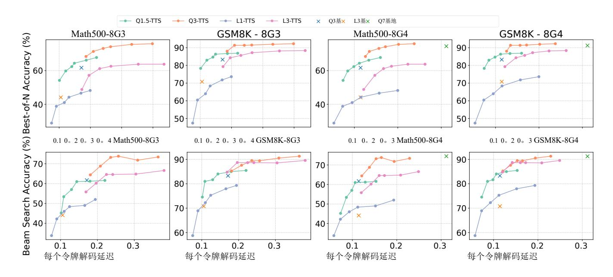

图10。数据集和硬件的各种组合上不同测试时间缩放方法的准确性-延迟权衡。

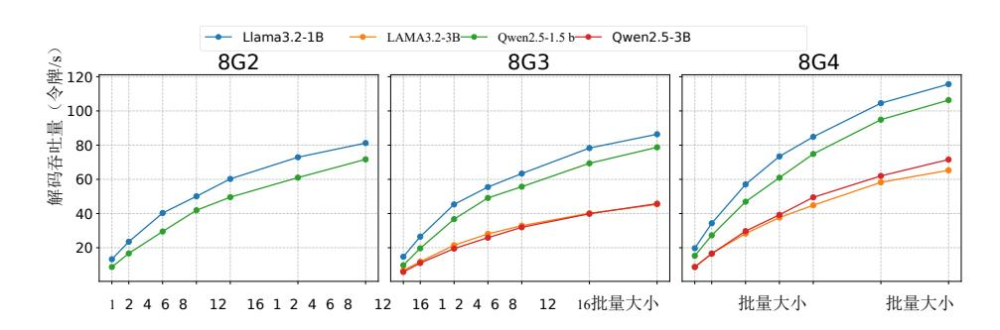

图11。不同批量大小和硬件设置下不同型号的端到端解码吞吐量。

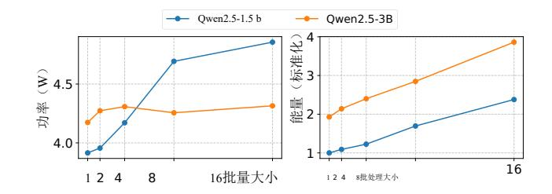

图12。LLM解码阶段的功率和能耗。

在测试时间缩放工作负载中使用NPU。我们的系统在预填充吞吐量方面也始终优于基于GPU的系统,在某些工作负载下实现了与专有QNN相当的性能。

| 数据集            | 瓷砖组    | 共同组    | F16    |
|----------------|--------|--------|--------|
| WinoGrande (↑) | 62.559 | 63.349 | 64.613 |
| MMLU (↑)       | 35.465 | 35.271 | 34.819 |
| Wiki PPL (↓)   | 10.206 | 10.190 | 9.798  |

表4。使用为HMX布局量身定制的瓷砖量化组的模型与使用常规量化组的模型之间的精度比较。

#### 7.3 准确度评定

量化方案。我们基于HMX布局和传统量化组评估对应于瓷砖量化组的QWEN2.5-1.5 B模型的准确性。如表4所示,与使用传统布局的模型相比,使用我们的量化布局的模型在MMLU中的精度略高,而Winogrande和Wikitext PPL仅略有下降。此外,这些精度差异远小于量化本身引起的性能损失(如

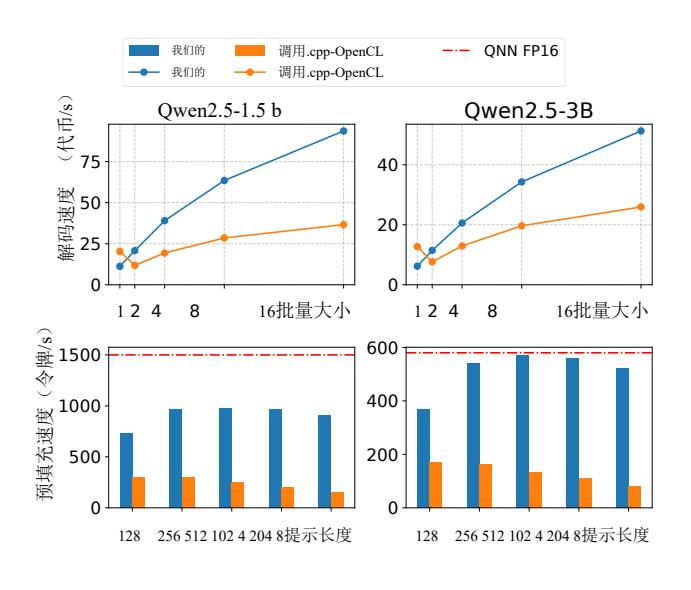

图13。推断吞吐量比较。

由 "F16" 栏中的Wikitext困惑表示)。一般来说,使用 我们提出的瓦片量化组不会导致量化模型的精度显著下 降。

| 数据集            | 我们的LUT16 FA | F32注意  |
|----------------|-------------|--------|
| WinoGrande (↑) | 62.796      | 62.559 |
| MMLU (↑)       | 35.207      | 35.465 |
| Wiki PPL (↓)   | 10.205      | 10.206 |

表5。使用基于LUT的Softmax的F16 FlashAttention的模型和使用常规F32 Attention的模型之间的准确性比较。

*注意实现。*表5显示了与我们基于LUT的FP16注意力和常规FP32注意力相对应的模型精度,使用与上述相同的模型和数据集。可以看出,用较低的FP16精度代替注意力中的非关键部分(除了积累),对模型的端到端精度没有明显影响。

#### 7.4 消融研究

注意Softmax。图14示出了在不同注意力工作负载下使用不同方法计算指数函数exp所对应的片上softmax延迟。注意输入查询的长度被设置为1、4和16,而KV的长度被设置为1024、4096或16384。图中表明,我们基于LUT的指数计算比常规的32位浮点exp获得了1.26~2.19倍的加速,最高可达1。与16位浮点exp相比,速度提高了60倍。值得注意的是,在预先计算exp查找表时,宽度为

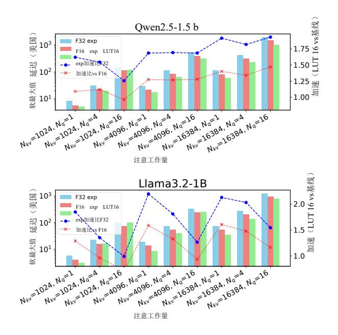

**图14。**使用基于LUT的指数计算对我们提出的F16注意力的 片上softmax进行消融研究。性能是在一加12上测量的。

32位或更高的位可用于计算中间结果。因此,基于LUT的exp比exp的16位多项式逼近具有更高的精度。当上下文长度较短时,较大的输入查询将略微降低加速比,但当KV长度较长时,这种现象将得到缓解。

基于去量化的GEMM。图15显示了用于优化GEMM去量化布局的消融实验。基线方法对应于常规存储器布局,其中根据存储器中的连续组量化列主权重矩阵。GEMM内核在运行时逐个对32个大小的组进行解量化,然后将元素分散到TCM中的正确位置。"HMX布局"项对HMX布局应用离线权重重排和瓦片量化组,允许FP16权重连续写入TCM。"Ours"是采用所有优化的版本,包括量化组coalesce。此外,我们添加了一组标记为"无去量化"的数据。在该实现中,不是执行实际的权重去量化,而是直接从存储器中读取量化后的权重并将其复制到片上存储器,而不需要进行任何计算。这组数据可以看作是基于去量化的方法的性能上限。

与基线相比,我们的方法在不同矩阵大小下实现了 9.65~19.04倍的加速。这主要是因为基线中的散射操作

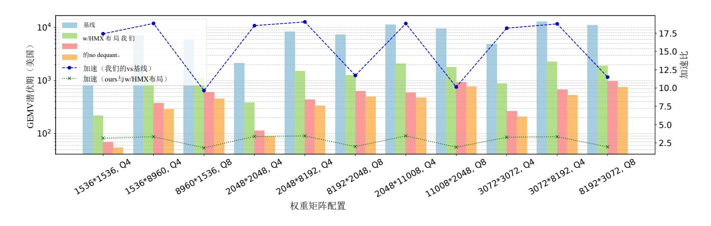

图15。对GEMM去量子化提出的优化方法的消融研究。我们在OnePlus 12上测量了GEMV的性能。

非常昂贵。应用HMX布局后,量子群聚并和重排也有效地减少了计算浪费,带来了1*的加速。*82×3。45×。特别是,与"不去量化"组相比,我们的方法平均只慢27%,说明这种实现已经接近去量化的性能上限。

#### 7.5 开销和灵敏度分析

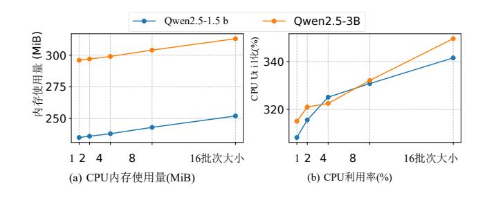

图16。解码阶段的CPU和内存使用情况。

CPU和内存使用情况。我们在OnePlus 12上评估了1.5 B和3B Qwen2.5模型在解码阶段的CPU利用率和内存消耗。图16中显示的CPU内存使用量来自top命令报告的驻留内存大小。我们还使用pmap测量dmabuf的总大小(即NPU使用的内存),在1.5 B和3B模型的4096个令牌的上下文预算下,分别产生1056 MiB和2090 MiB的恒定值。1.5 B型号的总内存消耗约为1.3 GiB,3B型号的总内存消耗约为2.4 GiB。由于CPU上词汇投影的计算量增加,CPU利用率随批处理大小而增加,但所使用的核数始终被限制在4个。

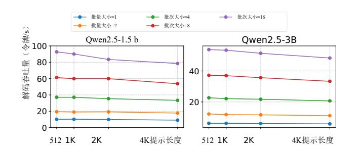

图17。提示长度对解码吞吐量的影响。

**提示长度的影响。**图17显示了提示长度对解码吞吐量的影响。在所有批处理大小和两种模型中,随着提示长度从512个令牌增加到4096个令牌,解码吞吐量呈现出轻微的下降趋势。然而,在最多4096个令牌的提示长度范围内,这种下降仍然相对较小,这表明提示长度在此范围内对解码吞吐量的影响有限。

## 8 讨论

可推广到其他硬件。我们认为NPU的"向量+矩阵"架构具有一定的普适性,并观察到CPU和NPU之间的界限逐渐模糊。除了NPU之外,现代CPU也开始加入专用的矩阵乘法单元,如Intel AMX和ARM SME,赋予它们类似的"向量+矩阵"架构。此外,我们注意到现代AI加速器通常在通用计算性能和专门的低精度矩阵乘法能力(例如NVIDIA GPU)之间表现出显著的差距。尽管具体的硬件架构可能有所不同,但我们的技术背后的核心思想保持了广泛的适用性。

[62](#page--1-39) 系统性能和限制。(a)解码性能:我们系统目前的 解码速度比较有限,主要是由于去量化的开销。但是, 这不会破坏测试时间缩放的有效性。基于QNN的量化 GEMM通常只利用DMA和HMX分量,而不引入HVX计 算开销。类似T-MAC[ ]的方法可以潜在地在NPU上启 用具有细粒度组量化的高效GEMV,从而加速LLM解码 过程。(b)预填充性能:我们现行系统的预填充性能仍有 改进空间。将更多的运算符卸载到NPU,通过运算符融 合减少内存访问和通信开销,以及优化矩阵乘法的平铺 和流水线策略都有助于增强预填充性能。我们把这些优 化留给未来的工作。(c)模型大小限制:我们当前的 实现受到旧设备上单个NPU会话32位地址空间的限制。 使用多个NPU会话可以帮助缓解这个问题。

[8](#page--1-45) [17](#page--1-14) [22](#page--1-43) [49](#page--1-44) [69](#page--1-41) [71](#page--1-42) 并行测试时间缩放的应用范围。尽管并行测试时间缩 放方法目前主导数学推理任务,但来自最近研究的证据 [ , , , , , ]表明它们可以扩展到更广泛的 推理和规划领域,突出了实质性的可推广潜力。

#### **9** 相关工程

[66](#page--1-35) [7](#page--1-37) [2](#page-13-0) [73](#page--1-9) [48](#page--1-46) [58](#page--1-5) [38](#page--1-47) [51](#page--1-23) [6](#page--1-48) [40](#page--1-49) 使用*NPU*进行设备上*LLM*推理。法学硕士。npu[ ] 率先在npu上使用per-tensor量化INT8 GEMM来加速 LLMs的预填充阶段,使用CPU来辅助异常值相关的计 算以保持准确性。HeteroLLM[ ]通过张量划分实现GPU 和NPU之间的协同推理。开源推理框架PowerServe[ ]利 用中间ONNX格式实现自定义量化和浮点计算分区。 ShadowAttn[ ]利用NPU和CPUs/GPU之间的协作来加速 稀疏注意力。ExecuTorch[ , ]是一个著名的开源边缘 侧DNN推理框架,支持SpinQuant[ ]和QNN后端。以上 所有工作都是基于高通的Hexagon NPU,使用了闭源的 QNN[ ]作为后端。来自vivo[ , ]的作品已经利用了 联发科的NPU,但由于NeuroPilot SDK的非公开访问 性,此类研究仍然很少。

[15](#page--1-50) [34](#page--1-51) [65](#page--1-52) *LLM*量化。最著名的训练后量化算法包括GPTQ[ ] 和AWQ[ ],它们只执行权重量化,只需要少量的校准 数据,因此被广泛使用。随后的方法如SmoothQuant [ ],

[33](#page--1-38) [1](#page-13-1) [38](#page--1-47) DuQuant[ ]将范围扩大到包括权重激活量化,通过开发 减轻其有问题的异常值分布的技术来解决量化激活的更具 挑战性的任务。最近,出现了QuaRot[ ]和SpinQuant[ ] 等综合方法,旨在量化所有主要组件-权重,激活和关键 KV缓存-通常降低到4位。这些方法利用旋转变换在整个 模型中创建更有利于量化的特征分布。

[29](#page--1-55) [39](#page--1-53) [43](#page--1-54) [19](#page--1-56) [31](#page--1-57) 推测解码。推测解码[ , , ]是一类用于LLM推理的 加速方法,其核心是在一个模型前向传递中验证多个推 测令牌,以缓解LLM解码的内存受限问题。推测译码有 各种扩展变体,一些[ , ]不再严格遵循目标模型的 分布。理论上,广义推测解码和测试时间缩放方法都属 于广义生成-然后验证框架,我们的系统在理论上可以 无缝地支持这些应用。

### **10** 结论

这项工作证明了利用移动NPU(特别是Qualcomm Hexagon NPU)未充分利用的计算能力来扩展LLMs的测试 时间的可行性和有效性。通过设计一个端到端推理系 统,该系统结合了硬件感知的瓷砖量化、权重布局优化 和关键算子的基于LUT的加速,我们表明用测试时间缩 放增强的较小模型可以在准确性和延迟方面优于较大的 常规部署模型。这种方法为在资源受限的移动设备上部 署高性能语言模型提供了一种新的路径,为设备上AI推 进了效率和能力的帕累托前沿。

# **11** 致谢

我们感谢所有的匿名评论者和我们的牧羊人夏玉斌,感 谢他们的真知灼见和建议。这项工作得到了清华大学 (AIR)-亚信科技(中国)有限公司6G网络与智能计算 联合研究中心20233910006资助。

#### 参考文献

- [1] Saleh Ashkboos、Amirkeivan Mohtashami、Maximilian Croci、Bo Li、Pashmina Cameron、Martin Jaggi和Alistarh、Torsten Hoefler 和James Hensman。Quarot:旋转llms中的无异常值4位推理。神 经信息处理系统的进展,37:100213–100240,2024。
- [2] PowerServe作者。动力服务。[https://github.com/powerserve-](https://github.com/powerserve-project/PowerServe/tree/main)[project/](https://github.com/powerserve-project/PowerServe/tree/main) [powerserve/tree/main](https://github.com/powerserve-project/PowerServe/tree/main),2025年。
- [3] 布拉德利·布朗、乔丹·朱拉夫斯基、瑞安·埃利希、罗纳德·克拉克、 Quoc V Le、Christopher Ré和Azalia Mirhoseini。大舌头猴子: