# Enabling MoE on the Edge via Importance-Driven Expert Scheduling

Guoying Zhu<sup>1</sup>, Meng Li<sup>1</sup>, Haipeng Dai<sup>1</sup>, Xuechen Liu<sup>1</sup>, Weijun Wang<sup>2</sup>, Keran Li<sup>1</sup> Jun xiao<sup>3</sup>, Ligeng Chen<sup>3</sup>, Wei Wang<sup>3</sup>

<sup>1</sup>State Key Laboratory for Novel Software Technology, Nanjing University, <sup>2</sup>Tsinghua University, <sup>3</sup>Honor Device Co.,Ltd 522023330124@smail.nju.edu.cn, meng@nju.edu.cn, haipengdai@nju.edu.cn, 522025330063@smail.nju.edu.cn wangweijun@air.tsinghua.edu.cn, keranli@smail.nju.edu.cn, sunny-xiaojun@hotmail.com, chenlg@smail.nju.edu.cn, ww@nju.edu.cn

Abstract—The Mixture of Experts (MoE) architecture has emerged as a key technique for scaling Large Language Models by activating only a subset of experts per query. Deploying MoE on consumer-grade edge hardware, however, is constrained by limited device memory, making dynamic expert offloading essential. Unlike prior work that treats offloading purely as a scheduling problem, we leverage expert importance to guide decisions, substituting low-importance active experts with functionally similar ones already cached in GPU memory, thereby preserving accuracy. As a result, this design reduces memory usage and data transfer, while largely eliminating PCIe overhead. In addition, we introduce a scheduling policy that maximizes the reuse ratio of GPU-cached experts, further boosting efficiency. Our extensive evaluations show that, compared with state-of-theart approaches, our method achieves a 48% reduction in decoding latency and maintains an expert cache hit rate above 60%, all while preserving nearly lossless accuracy.

#### I. INTRODUCTION

MoE architectures offer a promising approach for deploying Large Language Models (LLMs) on edge devices, addressing an increasingly critical need [31], [30], [22]. Edge applications such as smart homes [29], intelligent healthcare [9], autonomous transportation [40], and pervasive video analytics [35] demand low latency and strong data privacy, making edge deployment essential. Yet, edge servers are often limited in computational capacity and GPU memory, restricting full model deployment and rapid [32], [39]. Compared with dense models that compute all parameters for every input, MoE architectures mitigate these constraints by partitioning feed-forward layers into multiple experts [19], activating only a sparse subset per token. This design thus can drastically reduces computation overhead.

However, GPU memory limitations introduce a new bottleneck: experts must frequently be offloaded to CPU memory and repeatedly loaded back to the GPU, resulting in substantial inference latency. Since edge GPUs have limited memory and cannot hold all experts simultaneously, inference often requires offloading experts to slower CPU memory or leveraging the CPU to perform computations[21], [42], [23] . Both operations are significantly slower than GPU-based computation: PCIe transfers can be two orders of magnitude slower, while CPU computation, depending on the number of cores, typically incurs one to two orders of magnitude higher latency. Existing approaches such as

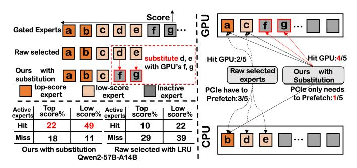

Fig. 1: Traditional MoE layer vs. our expert scheduler with substitution (via substituting low-score experts and prefetching top-score experts).

MoE-infinity, HybriMoE and ProMoE [36], [43], [33] focus primarily on scheduling expert loading and computation to hide data transfer latency. These methods rely on prefetching experts from CPU memory, which can partially alleviate the loading bottleneck but remain limited in effectiveness.

Our approach goes beyond pure scheduling: we substitute low-importance active experts with functionally similar ones already cached in GPU memory, maintaining model accuracy. Furthermore, through strategic cache eviction, we improve the number of experts that can be **effectively substituted.** In a fine-grained MoE framework, we observe a distinct pattern: only a handful of active experts achieve high scores (termed top-score active experts), while others receive scores comparable to inactive experts (low-score active experts). Simultaneously, we substitute low-score active experts (that would otherwise be computed on the CPU) with inactive experts residing in GPU memory with comparable scores As Figure 1 shows, this strategy can largely avoid the computational burden of low-score active experts on the CPU while ensuring that computationally critical top-score active experts from CPU memory are loaded onto the GPU in advance. By substituting low-score experts d and e with GPU-resident experts f and g, which have similar scores, the GPU expert hit rate per layer increases from  $\frac{2}{5}$  to  $\frac{4}{5}$ . This substitution also reduces prefetching burdens from three to one expert, enhancing the overall GPU expert hit rate to 71% for the Owen2-57B-A14B model on an A6000 [6].

Challenges. Our work addresses three main challenges: 1. how to identify low-score experts and suitable substitutes in GPU memory with minimized accuracy loss; 2. how to decide which experts to evict or prefetch, given that cached experts can serve as substitutions, to maximize the overall cache hit rate in subsequent layers. 3. how to integrate CPU-assisted pipelines to handle experts that can be neither substituted nor prefetched.

# Contributions. Our contributions are as follows.

- We introduce the SMoE (Expert Scheduler with Substitution) to minimize decoding performance by maximally substituting low-importance active experts with functionally similar ones already cached in GPU memory, while incurring almost no loss in accuracy.
- We design a CPU-GPU-load pipeline system specifically for MoE LLMs with SMoE, capable of handling online workloads without requiring any offline preparation.
- We extensively evaluate our approach on practical workloads, demonstrating its effectiveness and efficiency.

## II. BACKGROUND

Deploying Large Language Models (LLMs) directly on edge devices is crucial for instant, private, secure, and reliable interaction within user environments like smart homes and autonomous vehicles, demanding real-time processing and immediate perception [20], [26], [24]. For LLM on edge, TPOT is a critical metric which measures the average time between successively generated tokens during decoding [4]. Edge inference typically handles low-batch requests [20], since an edge LLM serves an individual device rather than a computing cluster. In such low-batch scenarios, performance is often constrained by memory bandwidth as in expert offloading, making TPOT optimization essential.

To address the limited GPU memory on edge hardware, MoE LLMs with online expert offloading offer a solution by segmenting traditional layers into specialized experts[19]. This MoE architecture processes only a sparse subset of parameters per input, significantly easing the strain on constrained GPU resources compared to dense networks.

Our goal is to reduce the decoding performance of LLMs with MoE that feature fine-grained expert segmentation on GPU-memory constrained edge devices. We discuss our background from three perspectives: (1) the model architecture (MoE with fine-grained expert segmentation), (2) the online expert offloading architecture, and (3) the metric TPOT (Time Per Output Token), measuring the latency time between successively generated tokens during decoding.

# *A. LLM with Fine-grained Expert MoE*

The MoE LLM substitutes the dense FFN with multiple smaller expert networks [11]. For each input, a router selects the top-k experts to activate, significantly improving parameter efficiency by computing only through these chosen modules.

Unlike traditional MoE which activates 1–2 experts per token, fine-grained MoE divides experts further and activates more per token under similar computational constraints. This

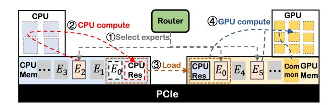

Fig. 2: Online Expert Offloading in MoE LLMs at one layer. Step 1: Router selects the active experts. Step 2: CPU computes part of the active experts in CPU memory. Step 3: Part of active experts and CPU-computed expert results are transferred to GPU memory via PCIe. Step 4: GPU processes experts, consolidating those results with CPU-computed results.

promotes specialization and allows richer integration of expert knowledge, enhancing model expressiveness. DeepSeekMoE first introduced this strategy [17], later adopted by models like Qwen2-57B-A14B [6] and XVERSE-MoE-A4.2B [7], achieving strong performance with reduced training costs.

MoE with fine-grained expert segmentation often includes shared experts that process all tokens[18], regardless of routing decisions. This design tackles a major issue in traditional MoE, where common knowledge is redundantly stored. By using shared experts to consolidate common knowledge, the architecture allows other experts to specialize in distinct domains. This division enhances parameter efficiency.

## *B. Expert Offloading in MoE LLMs*

Expert Offloading is crucial for deploying MoE LLMs on edge devices, operating at the expert level rather than the layer level, unlike LLM offloading [41], [34]. It strategically allocates a subset of experts and common parameters like attention, token embedding, and router weights to GPU memory, while storing all expert parameters in CPU memory. This approach substantially lowers TPOT compared to general LLM methods like llama.cpp [2], which are not tailored for MoE models. Moreover, other techniques such as PowerInfer [34], [37], which target LLMs with ReLU activation functions, do not provide specific offloading strategies for MoE models.

Similarly to the general LLM offloading technique: two main strategies are used, as shown in Steps 2 and 3 of Figure 2: either freeing up GPU memory to transfer the necessary expert parameters from CPU memory for GPU computation, or directly performing the computations on the CPU and then aggregating the results with those from the GPU. These two approaches can be pipelined. As shown in Figure 2, while the CPU computes one expert (E2), another (E0) can be simultaneously loaded into GPU memory via PCIe. Upon E2's completion, its results are then transferred to GPU memory, allowing for concurrent processing and data movement.

Our work addresses unknown edge workloads through online expert offloading. Expert offloading is categorized into online and offline MoE serving strategies, depending on whether experts are dynamically loaded into GPU memory based on the current requests or the entire workload. Online strategies manage dynamically changing edge requests, adapting through

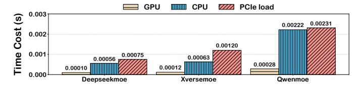

Fig. 3: CPU/GPU (A6000) time for expert-token computing, & PCIe time for expert loading from 3 MoE LLMs.

flexible scheduling to handle the impact of frequent loading and computation of non-resident experts on latency. Examples include MoE-Infinity [36] and HybriMoE [43]. Offline strategies focus on predetermined workloads, optimizing GPU use by capturing expert activation patterns and employing expert pruning, as seen in MoE-lightning [12].

#### III. MOTIVATION

Deploying MoE LLMs on edge devices necessitates online expert offloading due to constrained GPU memory. As workloads dynamically shift, so does the set of active experts; however, the limited on-device GPU memory cannot always accommodate all required experts. Consequently, active experts residing in GPU memory are processed directly, while those in CPU memory are either transferred to the GPU for computation or processed directly on the CPU. However, processing experts not already in GPU memory significantly impacts inference latency, regardless of the offloading method. As Figure 3 shows, this is primarily because PCIe loading can be one to two orders of magnitude slower than GPU computation, and CPU computation is typically one order of magnitude slower. Thus, efficient deployment of MoE LLMs under GPU memory constraints requires minimizing overhead from expert loading.

Several optimization strategies have emerged for online expert offloading to alleviate bottlenecks. One approach increases the hit rate of experts in GPU memory through prefetching and caching. Prefetching predicts future needs, enabling preemptive loading to reduce TPOT impact [36], while caching strategies like LRU minimize data transfers. Another line of work adopts a related idea by optimizing CPU computation through efficient CPU-side loading pipelines [43].

However, current offloading strategies overlook the significant variation in importance among activated experts, scheduling them uniformly. In MoE architectures, an expert's importance to an input is reflected in its router's gate score, with higher scores indicating greater significance. As Figure 4 illustrates, a distinct pattern of importance scores emerges among activated non-shared experts: only a few achieve high scores (top-score experts), significantly influencing the output,

TABLE I: TPOT time ratio distribution for Owen on A6000.

| Low-score loading | Top-score loading | GPU computing |  |  |  |
|-------------------|-------------------|---------------|--|--|--|
| 42%               | 29%               | 29%           |  |  |  |

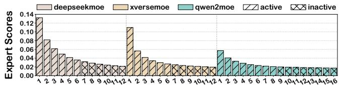

Fig. 4: A few high-scoring active experts greatly impact accuracy, while low-scoring ones resemble inactive experts.

while others have low scores (low-score experts), similar to inactive experts. This differentiation arises because (1) shared experts handle common knowledge and (2) fine-grained segmentation creates highly specialized non-shared experts. Yet, existing online expert offloading methods, such as prefetching and CPU-load pipelining [43], do not consider this pattern of activated experts on output results. This oversight results in time-consuming operations, like CPU computation and PCIe loading of experts, being used for experts that have minimal impact on the final outcome. However, Table I shows that the low-scoring loading time is the main bottleneck of TPOT.

Our proposed online strategy schedules experts by their importance, substituting low-importance active experts (lowscore experts) with functionally similar ones already cached in GPU memory. As Figure 5 illustrates, we first prefetch top-score experts based on predicted expert scores, leveraging pipelining to overlap their loading time with computation. As Figure 3 shows that PCIe loading time significantly exceeds computation time, this prefetching can only ensure timely resource access for critical top-score experts. After routing, when actual expert scores are determined and the top-k experts (e.g., k = 3) are to be selected, if a top-score expert (e.g.,  $E_a$ ) was prefetched, the remaining expert (e.g.,  $E_c$ ) might reside in CPU memory, necessitating PCIe transfer or CPU computation. However, unlike previous methods, our approach recognizes  $E_c$ 's low scores and minimal impact on the output. Therefore, we substitute  $E_c$  with a similarly scored, GPUresident inactive expert (e.g.,  $E_d$ ). This allows all the selected experts to be computed directly on the GPU, effectively mitigating the TPOT impact of low-score experts at a negligible cost to accuracy.

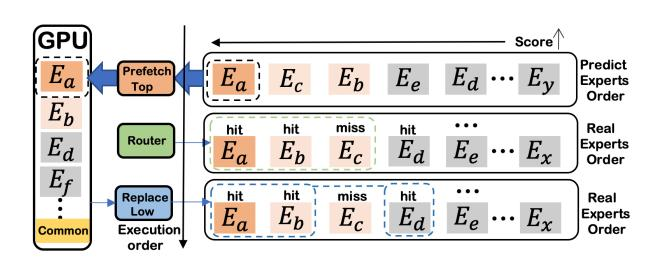

Fig. 5: Our idea: prefetching top-score experts and replacing low-score experts in each iteration at one layer.

TABLE II: Definitions.

| Symbol  | Description                                    |
|---------|------------------------------------------------|
| G       | Experts already in the GPU.                    |
| Ea      | Experts selected by top-k.                     |
| El      | Low-score experts.                             |
| Ea \ El | Top-score experts.                             |
| Es      | Experts in G that can serve as substitutes.    |
| Ep      | Experts prefetched from the previous layer.    |
| α       | Expert substitution threshold.                 |
| Sk+1    | The gate score of the k + 1-th highest expert. |

# IV. EXPERT SCHEDULER WITH SUBSTITUTION

This section outlines the design objectives and approach of our scheduler with expert substitution (SMoE), which aims to achieve three key functions. First, it performs substitution of low-score experts, identifying and replacing them to maximize the GPU expert cache efficiency. Second, it implements topscore expert prefetching to overlap loading and computation times, mitigating accuracy loss from replacement. Third, it uses CPU-assisted computing to dynamically decide whether to transfer active experts to the GPU via PCIe or compute them directly on the CPU, addressing prefetching failures and expert-cache router limitations.

## *A. Design Analysis*

As discussed earlier, the absence of experts in GPU memory significantly increases inference latency, which can be mitigated by increasing the hit rate of experts cached in the GPU. Our system improves this hit rate by performing expert substitution independently for each layer, rather than considering all experts at once. This design choice reflects the impracticality of jointly analyzing all layers in transformer LLMs, since the experts chosen in one layer can strongly influence subsequent layers.

Our goal is to maximize, for each layer, the number of routing hits on experts that already reside in GPU memory. To analyze this effect, we define several expert sets and measure their hit counts at the layer level, as shown in Table II. Our optimization objective, given by Equation (1), consists of the number of experts already in the GPU and the number of lowscore experts replaced by experts in the GPU.

$$\max |G \cap E_a| + \min(|E_l \setminus G|, |E_s|) \tag{1}$$

It can be expanded as |(G \ E<sup>p</sup> ∪ Ep) ∩ Ea| + min(|E<sup>l</sup> \ (G \ E<sup>p</sup> ∪ Ep)|, |Es|), or decomposed into Equation (2).

$$\max |(G \backslash E_p) \cap E_a| + |E_p \cap E_a| + \min(|E_l \backslash (G \backslash E_p)|, |E_l \backslash E_p|, |E_s|)$$
(2)

Here, G \ E<sup>p</sup> and E<sup>a</sup> are constant, as they depend on preexisting expert distributions in the GPU and the top-k selection results by the gate. *C*1*, C*2: Thus, expanding E<sup>l</sup> and E<sup>s</sup> becomes a viable and beneficial optimization direction. A broader E<sup>s</sup> provides more potential candidates for substitution, while a larger E<sup>l</sup> increases the pool of GPU-resident substitutes, both directly contributing to raising the hit-related terms in our optimization objective. Regarding Ep, increasing it can reduce |E<sup>l</sup> \ Ep| but can increase |E<sup>p</sup> ∩ Ea|.*C*5*, C*6: We increase E<sup>p</sup> because the growth in |E<sup>p</sup> ∩ Ea| directly enhances the overall optimization target, whereas the change in |E<sup>l</sup> \ Ep| does not necessarily contribute positively to the minimization. While increasing E<sup>p</sup> and E<sup>l</sup> , we aim to maximize |E<sup>l</sup> \ Ep|, which means minimizing |E<sup>p</sup> ∩ Ea|. *C*4:Therefore, we prioritize prefetching the top-score experts.

However, our system needs to apply constraints to E<sup>l</sup> and E<sup>s</sup> to balance MoE model with GPU hit rate improvement. The scores by the gate represent an expert's importance to the output, so aligning the scores of the substituted experts with those of the low-score experts can prevent a significant drop in accuracy. We introduce a hyperparameter α (expert substitution threshold) that acts as the score threshold to determine which experts in E<sup>s</sup> and E<sup>l</sup> are eligible for replacement. Specifically, Sk+1 is the gate score of the k + 1-th highest expert. The constraints are:

$$S_{k+1} < \operatorname{Score}(e) < (1+\alpha)S_{k+1}, \quad e \in E_l,$$
  
 $(1-\alpha)S_{k+1} < \operatorname{Score}(e) \le S_{k+1}, \quad e \in E_s.$ 

These bounds ensure the scores of E<sup>l</sup> and E<sup>s</sup> are closely aligned with each other. We aim for E<sup>l</sup> and E<sup>s</sup> to meet these constraints. The constraint on E<sup>p</sup> depends on the time available for loading experts from the previous layer's prefetching start to the current layer's expert computation. *C*5:Thus it requires that the cost of prefetching be sufficiently low to save time and allow for the loading of more experts.

Based on the design analysis, our system's implementation criteria are as follows:

- (1) *C*1: Maximizing E<sup>l</sup> . Low-score experts should constitute a significant proportion of the active experts;
- (2) *C*2: Maximizing Es. The GPU memory must contain an increased inactive experts suitable for substitution.
- (3) *C*3: Constraints on E<sup>l</sup> , Es. The scores of low-score experts must be comparable to those of certain inactive experts within the GPU to enable smooth substitution.
- (4) *C*4: Minimizing |E<sup>l</sup> ∩ Ep|. Prioritize prefetching topscore experts.
- (5) *C*5: Maximizing Ep. Begin prefetching experts for the next layer as quickly as possible to maximize the number of prefetched experts.
- (6) *C*6: Maximizing Ep. Ensure the prefetching accuracy.

## *B. Low-score Expert Substitution*

To fulfill these system design requirements, two key *questions* must be addressed: first, how to categorize the active experts selected by the original MoE router, distinguishing between low-score and top-score experts to meet *C*1*, C*3; and second, how to design a GPU cache strategy that retains a greater number of experts eligible for substitution within the GPU, aiming to meet *C*2. We design an expert-cache router and a cache eviction to answer these two questions.

Expert-cache router. Algorithm 1 illustrates our approach for the expert-cache router. Those experts with scores above Sk+1 are top-score experts, while scores between Sk+1 and (1 + α)Sk+1 are low-score. For top-score experts, when we

#### Algorithm 1 Expert-Cache Router

```
Require: \alpha, k, S

    Score inputs

Ensure: O

  Initialize O, set thresholds T, L, R, sets A, B, C
  A = E_s, B = E_l, C = E_a \setminus E_l
  for each token t do
      Sort S_t desc; S_{k+1} \leftarrow (k+1)-th score of S_t
      T \leftarrow (1+\alpha)S_{k+1}; L \leftarrow S_{k+1}; R \leftarrow (1-\alpha)S_{k+1}
      for each expert e do
          if score of e > T then Add e to O[t] and C
      end for
      Initialize B_t, A_t
      for each expert e do
          if L \leq score of e < T then Add e to B_t
          else if R \leq score of e < L and e in GPU or C then
  Add e to A_t
          end if
      end for
      if |A_t| \geq |B_t| then
          Select top |B_t| experts from A_t; Add to O[t]
          Add A_t to E[t]; Add top |B_t| - |A_t| experts from
  B_t to O[t]
      end if
  end for
  return E
```

processes multiple requests concurrently, multiple tokens are decoded, each possessing its own set of top-score experts at the current layer. Given their critical role in computation, these experts are retained in the results of the expert-cache router and called as the top-score expert set. For low-score experts, if they are already in GPU memory or part of the top-score expert set, they are retained in the expert-cache router's results without incurring additional CPU overhead. Otherwise, they can be replaced with an inactive expert whose score falls between  $(1-\alpha)S_{k+1}$  and  $S_{k+1}$  and is present in the GPU or in the top-score expert set. We select the  $|E_l\setminus G|$  highest-scoring alternatives from  $E_s$  to be included in the expert-cache router's results. If  $|E_l\setminus G|$  is larger than  $|E_s|$ , then only  $|E_l\setminus G|-|E_s|$  low-scoring experts are prepared for loading into GPU memory or for direct computation by the CPU.

Cache eviction. The cache eviction policy is instrumental in managing the removal of experts from GPU memory when new experts are loaded. As depicted in Figure 6, experts that achieve higher scores, even if they are inactive in a particular iteration, have a greater inherent probability of being reused in the next 3 iterations, either as top-k or alternative experts, compared to those with minimal scores. This indicates that experts with high scores in the current iteration have consistently achieved high scores in recent decoding iterations. To preserve experts in the GPU with scores similar to those of active low-score experts, we employ a score-based strategy. This strategy involves evicting the expert that exhibits the lowest

average activation score accumulated over the preceding n iterations. Specifically, for an expert i, its score at the j-th token generation during decoding is denoted as  $S_{i,j}$ . With m experts in total, the expert to be evicted is the one with the minimum average score calculated as follows:

Evicted expert = 
$$\underset{i}{\operatorname{arg \, min}} \frac{\sum_{k=\max(1,j-n)}^{j} S_{i,k}}{j-\max(1,j-n)+1}$$
 (3)

This approach prioritizes the retention of experts that have demonstrated a higher historical impact, as measured by their contribution to model outputs, over a strategy that relies solely on the recency of access, such as Least Recently Used (LRU). Crucially, our score-aware eviction policy takes into account the activation scores of all experts accessed within the observation window of n iterations. This includes inactive experts that can serve as substitutes for low-score experts, ensuring that the GPU retains a pool of experts that are both relevant and likely to enhance future computations.

Moreover, to prevent evicting an expert immediately before its use, the system dynamically elevates the eviction priority of any expert selected by the expert router for computation in a layer. This temporary protection shield ensures the expert remains resident in GPU memory throughout its required computation window. The shield is automatically revoked upon completion of the layer's computation, returning the expert to standard eviction eligibility based on its score history.

# C. Loading Top-score Expert Online

Our prefetching prioritizes top-score experts to meet  $C_4$ . This technique effectively overlaps the latency of expert loading with ongoing computation time. Additionally, we aim to minimize the cost of prefetching to meet  $C_5$  and enhance the accuracy of prefetching to meet  $C_6$ .

As shown in Figure 7, the prediction process is carried out entirely with the parameters in GPU. Due to the GPU's superior speed, it tends to be more idle compared to the CPU and PCIe. As a result, the time taken by the GPU for prediction is often overshadowed by the time required for calculations by the CPU and loading by PCIe. Consequently, the time cost of prediction on TPOT is rather minimal.

Moreover, we can ensure the accuracy of prefetching. We perform calculations on both unshared experts currently in the GPU memory and shared experts, generating hidden states. These hidden states are then processed using the next layer's key-value cache to complete the attention computation. Subsequently, we carry out a gate computation to determine the scores for all experts in that layer. The gate computation results, derived from calculations involving the shared experts and experts in GPU memory, are more accurate for two main reasons. First, shared experts process universal information across all inputs and remain constantly available in the GPU memory, which enhances the accuracy of the computations. Second, our cache eviction strategy, as detailed in Section IV-B, ensures that high-scoring and thus important experts are retained in the cache during the most recent decoding stages.

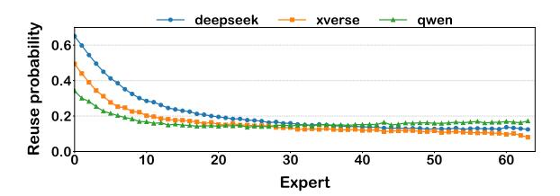

Fig. 6: The reuse probability of experts based on score (in descending order) in three MoE models.

These factors collectively lead to score results that closely align with the true outcomes.

#### V. SYSTEM IMPLEMENTATION

This section details the implementation for efficient GPU-CPU coordination in expert-offloading. Despite improvements in the GPU expert cache ratio via low-score substitution and top-score prefetching, some experts still need to be transferred from CPU to GPU due to prefetching failures from high demand or low PCIe bandwidth, and predictive errors. The expert-cache router may also fail to replace all low-score experts in GPU memory, particularly with significant score differences from inactive experts. To address these issues, we introduced CPU-assisted computing loading scheduling to balance CPU and GPU loads, boosting system efficiency. Additionally, we examine the pipeline situation during SMoE decoding with CPU-assisted computing.

#### A. CPU-assisted Computing Loading Scheduling

The CPU-assisted computing loading scheduling system is designed to dynamically decide whether to transfer activated experts, which are not pre-cached in GPU memory, to the GPU via PCIe for computation or to perform the calculations directly on the CPU. This decision-making process is guided by Algorithm 2, which uses a two-pointer strategy to balance the cumulative costs associated with loading and CPU computation times. In addition to balancing these costs, we prioritize loading high-scoring experts into GPU memory because, as shown in Figure 6, these experts are more likely to be reused.

The scheduling system aims to minimize idle times by balancing expert loading time,  $T_{load} = n_{load} \times C_{load}$ , with CPU computation time,  $T_{CPU} = n_{CPU} \times C_{CPU}$ . Here,  $C_{load}$  is the time to transfer an expert via PCIe, and  $C_{CPU}$  is the average time for a CPU computation. The system uses the past

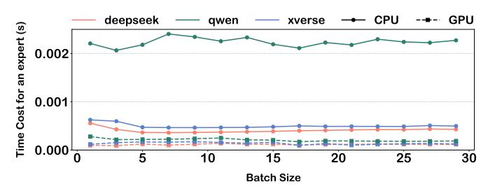

Fig. 8: GPU (A6000) vs CPU (8-core) at low batch.

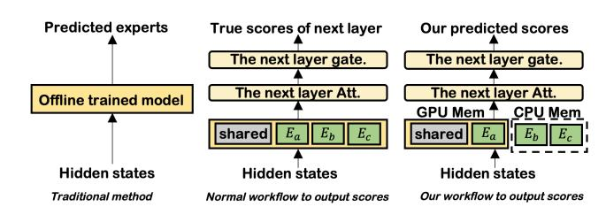

Fig. 7: Our prefetching method compared to traditional method and normal workflow to output true scores.

#### Algorithm 2 CPU-assisted Computing Loading Scheduling

```
Require: S, C_{CPU}, C_{load}
Ensure: n_{load}, n_{CPU}
  1: S: List of experts \{uid_i\} sorted in descending order by
 2: T_{CPU} \leftarrow 0, T_{load} \leftarrow 0, n_{load} \leftarrow 0, n_{CPU} \leftarrow 0
 3: l \leftarrow 0, r \leftarrow |S| - 1
 4: while l \leq r do
 5:
          if T_{load} \leq T_{CPU} then
                T_{load} \leftarrow T_{load} + C_{load}, n_{load} \leftarrow n_{load} + 1
 6:
                l \leftarrow l + 1
 7:
          else
 8:
 9:
                T_{CPII} \leftarrow T_{CPII} + C_{CPII}, n_{CPII} \leftarrow n_{CPII} + 1
                r \leftarrow r - 1
10:
          end if
12: end while
```

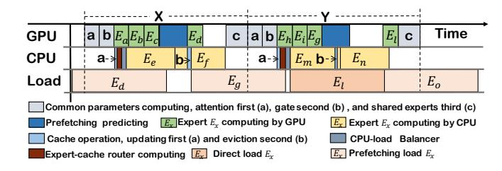

Fig. 9: SMoE pipelines GPU, CPU, and load operations between two MoE layers.

p instances of these times to optimize scheduling.  $C_{CPU}$  is treated as a constant due to stable CPU times across low-batch sizes, as shown in Figure 8, simplifying our model. Figure 3 indicates minimal GPU operation times compared to CPU and loading times, allowing us to approximate the total time by  $C_{load}$  alone. Thus,  $C_{load}$  is the primary cost factor, with  $C_{CPU}$  as a constant. The optimization goal is expressed by the following equation, which seeks to minimize the maximum of  $T_{load}$  and  $T_{CPU}$ :

$$\min \max(n_{load} \times C_{load}, n_{CPU} \times C_{cost}) \tag{4}$$

# *B. Pipeline Example between Layers*

Figure 9 illustrates the SMoE pipeline, which efficiently coordinates GPU, CPU, and PCIe operations between two MoE transformer layers, X and Y , to minimize pipeline bubbles. This pipeline integrates three distinct processes, each utilizing different resources: GPU, CPU, and PCIe.

CPU Operations: The CPU operations are divided into four key parts, all integral to the SMoE's functionality and the computation of expert parameters on the CPU:

- (1) *Expert-cache router calculation:* This part replaces some low-score experts from layer X with inactive experts in GPU.
- (2) *CPU-assisted computing loading scheduling:* This process determines which experts should be computed directly on the CPU and which should be loaded into the GPU.
- (3) *CPU expert computation:* CPU computes the parameters of experts from layer X not in GPU.
- (4) *Cache eviction:* This process decides which expert to evict when loading new experts into the GPU.

GPU Operations: The GPU operations are divided into four parts, three of which focus on computing expert parameters from layer X, while one is dedicated to prefetching parameters from layer Y :

- (1) *Common parameter computation:* This part computes the attention and gate parameters within the common parameters of layer X on the GPU.
- (2) *Direct expert computation:* This part computes experts that are already in the GPU.
- (3) *Expert Prediction for Prefetching:* This process predicts which experts from layer Y should be prefetched.
- (4) *New Expert Computation:* This part continues the computation of newly loaded experts once the PCIe loading process is complete.

PCIe Load Operations: The PCIe load operations are divided into two parts:

- (1) *Prefetching Experts from Layer* Y *:* This part prefetches the necessary experts from layer Y to the GPU in advance.
- (2) *Loading Experts from Layer* X*:* This part loads the experts from layer X into the GPU immediately as needed.

# *C. Selecting value for hyperparameter* α

Within our scheduler, the hyperparameter α defines the ratio of experts to be substituted, controlling the tradeoff between accuracy and token generation speed. An appropriate α identifies closely scored experts, including low-score and GPUresident cached experts, that can be safely substituted with minimal accuracy loss. A larger α reduces latency by allowing more low-score experts to be replaced, but it may increase the score gap between substituted and cached experts, potentially amplifying output deviation. Besides, the α selection is also model/workload dependent. To address this, we formalize it as the following constrained optimization problem:

$$\min_{\alpha} A(\alpha) \quad \text{s.t.} \quad T(\alpha) \le R, \tag{5}$$

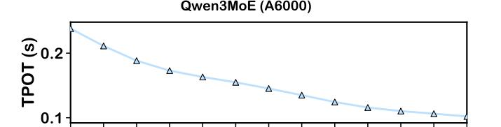

Fig. 10: Relationship between α and T(α).

**0.00 0.05 0.10 0.15 0.20 0.25 0.30 0.35 0.40 0.45 0.50 0.55 0.60**

where A(α) denotes the accuracy loss, T(α) is the average TPOT, and R is the TPOT budget specified by the user. Here, we assume that the user has a latency requirement while aiming to maximize accuracy. To solve this, we first observe that the latency metric (or TPOT) generally decreases linearly with the value of α. Intuitively, a larger α allows more low-score experts to be substituted, which increases the computation performed on the GPU and hence decreases the TPOT. Based on this observation, as shown in Figure 10, we can approximate T(α) by fitting a low-degree polynomial to the empirical relation between α and T(α). This yields a smooth and simple function that can be evaluated efficiently. Given a target latency constraint R, we then perform a simple one-dimensional search over α and select the smallest value whose predicted T(α) satisfies the constraint, thereby ensuring minimal accuracy loss while meeting the latency requirement.

# VI. EVALUATION

This section aims to demonstrate that our method, SMoE, significantly reduces the latency of token generation during the decoding phase, increases the hit rate of experts within the GPU, and causes almost no loss in accuracy. Additionally, we conduct ablation experiments to illustrate the impact of various components (expert-cache router, cache eviction strategy, prefetching, and CPU-assisted computing loading scheduling) on decoding performance and to analyze the reasons behind these impacts.

## *A. Setup*

In designing our experimental setup for LLM inference on edge devices, we focus on three key aspects. First, we select models exceeding edge GPU memory capacity to evaluate performance under typical resource constraints, reflecting realworld scenarios [14]. Second, we employ popular models with a fine-grained MoE architecture, effective as shown in recent studies [5]. Third, we test diverse model types and GPU configurations to ensure result robustness and reliability. We

TABLE III: Model and GPU Configurations

| Setting | Model                       | GPU           |  |  |  |  |
|---------|-----------------------------|---------------|--|--|--|--|
| S1      | deepseek-moe-16b [5] (31GB) | 3080ti (12GB) |  |  |  |  |
| S2      | XVERSE-MoE-A4.2B [7] (49GB) | 4060ti (16GB) |  |  |  |  |
| S3      | Qwen2-57B-A14B [6] (107GB)  | A6000 (48GB)  |  |  |  |  |

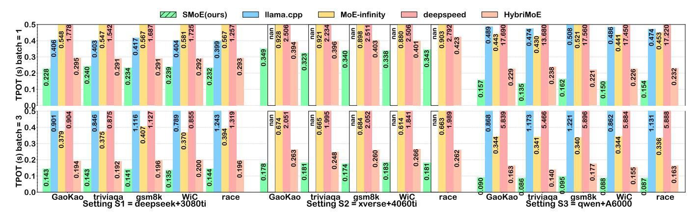

Fig. 11: TPOT of four baselines and our method in five workloads.

assess three experimental settings, detailed in Table III. Additionally, since MoE expert selection depends on workload, we test various workload types to show our method enhances inference speed without significant accuracy loss. Finally, we demonstrate our approach's superiority by comparing it with both the most advanced and popular methods, using metrics such as TPOT, TTFT, accuracy, and GPU expert cache ratio.

**Models.** We assess the performance of three widely recognized MoE models featuring a fine-grained MoE architecture: deepseek-moe-16b-base [5], Qwen2-57B-A14B-Instruct [6], and XVERSE-MoE-A4.2B-Chat [7]. Given that the objective of this study is to facilitate lossless models, we do not run quantized models. However, it is worth noting that our approach is orthogonal to quantization operations, and thus, it can also be applied to serve quantized models effectively.

**GPU.** We test on a single NVIDIA RTX 3080 Ti GPU (12GB), a single NVIDIA RTX 4060 Ti GPU (24GB), and a single NVIDIA A6000 GPU (48GB).

Workloads. Our evaluation employs workloads from five distinct task categories: exam, language, knowledge, understanding, and reasoning. Each is characterized below: (1) **Exam** includes tasks that simulate testing environments, such as academic examinations. We use the Math\_I, Math\_II, History, and Biology datasets from the Gaokao benchmark [16]. (2) *Language* focuses on text generation and translation, emphasizing fluency and coherence. The WiC dataset [28] is used for this category. (3) Knowledge involves factual recall and information retrieval, exemplified by question-answering tasks. For this type, we use the BoolO dataset [15]. (4) **Understanding** assesses comprehension abilities through tasks such as summarization and sentiment analysis. We evaluate using the Race-mid dataset [25]. (5) Reasoning pertains to logical inference and problem-solving, including mathematical and logical challenges. The gsmk dataset [10] is selected for these tasks. For each category, we select one dataset, each containing prompts from various thematic scenarios. We extract about 1000 prompts from each dataset for testing.

Metrics. We use four metrics in our experiment: TPOT,

GPU expert cache ratio, accuracy and TTFT. For decoding performance, we evaluate the TPOT as the key metric for the decoding stage. Additionally, we use the GPU expert cache ratio to reflect the GPU memory utilization efficiency, which is determined by the expert scheduling strategies of different methods. For accuracy, since the cache router strategy might affect the inference results of LLMs, we utilize the open-source tool OpenCompass [3] to test the system's accuracy on relevant workloads both before and after adopting the cache router. This is to demonstrate that the impact of our strategy on accuracy is minimal. For prefilling performance, we assess the TTFT for the prefilling stage.

Baselines. We evaluate our work, comparing it against baseline systems that support running MoE LLMs without enough GPU memory on the local platform: (1) *MoE-infinity* [36] is designed for efficient MoE inference on personal machines with limited GPU memory. It leverages the high activation sparsity in the decode phase, where few experts are reused often. Using a sparsity-aware expert cache, MoE-infinity optimizes prefetching by tracking sparse activation patterns. (2) *Llama.cpp* [2] is a C++ implementation enabling efficient LLM inference on CPUs, optimized for low GPU memory devices. (3) **DeepSpeed** [8] optimizes large model training and inference by loading transformer layers onto the GPU layerwise, enabling it to manage GPU-memory constraints without storing the entire model on the GPU. (4) HybriMoE [43] is an offloading system designed to enhance resource utilization via a novel CPU-GPU scheduling and cache management framework. It employs a dynamic intra-layer scheduling strategy to effectively distribute workloads between CPU and GPU. As HybriMoE is built on the ktransformer architecture [1] with quantization, we've modified our implementation to remove these effects for fair evaluation comparisons.

#### B. Overall Performance

The overall performance section highlights our method's superior decoding performance compared to baselines, particularly at low batch sizes of 3 and 1, typical for edge deployment. We assess TTFT for prefilling performance at batch=1, demonstrating that our method matches or exceeds

TABLE IV: Accuracy (%) across different datasets and models at various expert substitution thresholds  $\alpha$ .

| Dataset  | Model    | 0.0  | 0.05 | 0.1  | 0.15 | 0.2  | 0.25 | 0.3  | 0.35 | 0.4  | 0.45 | 0.5   | 0.55 | 0.6  |
|----------|----------|------|------|------|------|------|------|------|------|------|------|-------|------|------|
| GaoKao   | Deepseek | 27.2 | 27.6 | 28.2 | 29.5 | 29.3 | 28.9 | 28.1 | 27.7 | 27.3 | 26.8 | 26.7  | 26.2 | 25.9 |
|          | Xverse   | 47.2 | 47.5 | 47.9 | 48.1 | 49.0 | 47.2 | 47.9 | 47.5 | 46.5 | 46.8 | 47.5  | 46.2 | 45.9 |
|          | Qwen     | 73.5 | 74.2 | 74.8 | 75.8 | 76.0 | 76.1 | 74.2 | 74.1 | 73.2 | 72.1 | 71.6  | 70.7 | 71.7 |
| WiC      | Deepseek | 50.7 | 50.9 | 51.3 | 51.6 | 50.9 | 51.7 | 50.6 | 50.7 | 51.9 | 51.8 | 51.7  | 50.1 | 50.4 |
|          | Xverse   | 50.0 | 50.1 | 50.3 | 50.2 | 50.2 | 50.0 | 50.0 | 50.2 | 50.2 | 50.1 | 50.00 | 49.8 | 49.8 |
|          | Qwen     | 60.5 | 60.7 | 60.5 | 60.6 | 60.9 | 60.7 | 60.6 | 60.7 | 61.9 | 60.8 | 60.3  | 60.4 | 60.1 |
| triviaqa | Deepseek | 59.3 | 59.1 | 59.3 | 58.5 | 58.5 | 57.7 | 59.6 | 59.0 | 58.9 | 58.7 | 58.6  | 57.4 | 57.6 |
|          | Xverse   | 53.1 | 53.2 | 52.8 | 52.7 | 53.1 | 53.3 | 53.4 | 53.8 | 52.8 | 53.1 | 53.2  | 52.1 | 52.4 |
|          | Qwen     | 69.3 | 69.2 | 68.7 | 68.5 | 68.5 | 67.7 | 69.6 | 69.0 | 68.9 | 68.7 | 68.6  | 67.6 | 67.9 |
| race     | Deepseek | 70.0 | 69.8 | 69.2 | 69.7 | 69.9 | 70.4 | 70.0 | 69.1 | 70.2 | 70.2 | 70.4  | 68.9 | 68.6 |
|          | Xverse   | 81.4 | 81.6 | 81.8 | 81.0 | 82.3 | 82.0 | 81.9 | 80.9 | 82.9 | 82.3 | 82.4  | 81.1 | 80.3 |
|          | Qwen     | 80.0 | 79.8 | 79.9 | 79.7 | 79.9 | 80.4 | 80.0 | 79.1 | 80.2 | 80.1 | 80.4  | 79.8 | 79.6 |
| gsm8k    | Deepseek | 51.4 | 51.6 | 51.2 | 51.4 | 49.5 | 51.9 | 51.0 | 50.2 | 49.2 | 48.8 | 47.8  | 47.9 | 48.8 |
|          | Xverse   | 62.9 | 62.7 | 62.9 | 62.4 | 63.3 | 61.7 | 62.5 | 61.2 | 61.2 | 60.3 | 60.4  | 60.1 | 58.6 |
|          | Qwen     | 85.7 | 85.5 | 85.7 | 85.2 | 85.8 | 85.6 | 85.1 | 85.3 | 84.5 | 84.1 | 83.7  | 83.2 | 83.3 |

other approaches during the prefilling stage. To reflect real-world workload variability, we sample 1000 data points from each of five datasets and use basic prompts from openCompass [3]. Note that due to the Xverse model's incompatibility with the GGUF format, llama.cpp cannot run the S2 Xverse model, so we use nan to denote its value in our experiments.

**Decoding performance.** Our method consistently achieves a 24% reduction in TPOT compared to the best existing approach on average at batch=1, and a 35% reduction at batch=3, as shown in Figure 11. Notably, our method performs better when the batch size is 3 than when it is 1. This can be attributed to two key factors. First, in multi-batch scenarios, GPU computation time does not change significantly as the batch size increases, as shown in Figure 8. Moreover, since more experts need to be loaded when decoding multiple tokens at a time, the proportion of PCIe load in TPOT increases. Consequently, our strategies aimed at improving expert utilization in GPUs and reducing PCIe load become more effective. Second, we can replace the low-score experts of a certain token with the top-score experts of other tokens in the same batch. Since top-score experts are inevitably computed, this approach avoids the need to additionally load the low-score experts, thus enhancing TPOT performance when batch=3.

Notably, our method significantly reduces TPOT under S3 settings, achieving a 48% reduction on average at batch=3 compared to the best baseline, and 34% reduction at batch=1. This is because the A6000 GPU boasts high computational speed, so TPOT in these settings is dominated by PCIe load time (in the case of MoE-infinity and HybriMoE) and CPU computation time (in the case of llama.cpp, DeepSpeed and HybriMoE). By improving expert utilization in GPU memory, our approach effectively reduces such CPU computations and PCIe loads. In contrast, performance gains in S1 are less pronounced, with a 27% reduction on average at batch=3 compared to the best baseline, and a 20% reduction at batch=1. This is because the computational capability of the 3080Ti GPU offers no significant advantage over CPU, which limits the benefits of improved GPU memory efficiency.

**GPU expert cache ratio performance.** As shown in Figure 12, our method consistently achieves at least a 65% improvement in cache ratio across all tested settings compared to the best existing approach. This confirms that our method directly enhances the utilization of experts in GPU memory. In contrast, methods like llama.cpp and deepspeed implement offloading but are not designed for dynamic workloads, leading to static expert caching in the GPU that fails to adapt to workload changes. Due to deepspeed's sequential loading of layers into the GPU for computation, we don't conduct cache ratio experiments on it. MoE-infinity [36] employs a prefetching strategy that can increase the hit rate of experts in the GPU based on the current workload, but it requires historical router data, which can lead to decreased prefetching accuracy when records are incomplete. Moreover, prefetching alone is insufficient to load all active experts.

Accuracy performance. Evaluations conducted with Open-Compass [3] across diverse domain datasets show that our low-score expert substitution method causes only negligible accuracy variation when the substitution threshold is below 0.35, and even improves accuracy in some cases, as shown in Table IV. This occurs because, in MoE models, top-score experts are highly influential, while fluctuations in low-score expert contributions have little effect on the final output as long as a sufficient number of experts are retained.

To further enhance inference efficiency on edge devices, we favor a higher substitution ratio while maintaining this


Fig. 12: GPU cache ratio on average.

minimal loss. This strategy classifies more experts as low-score, increasing substitution opportunities and reducing expensive PCIe data transfers. In practice, we set the substitution threshold to 0.35 in S1, 0.3 in S2, and 0.25 in S3.

Prefilling performance. Our method consistently achieves a 11% reduction in TTFT compared to the best existing approach on average, as shown in Figure 13. While our method still outperforms others, this improvement stems from the pipelining strategy across CPU, GPU, and loading processes rather than enhanced expert utilization in GPU memory. The prefilling stage differs from the decoding stage: expert activation in decoding is relatively sparse, so improved expert utilization in GPU memory can enhance overall TPOT. In contrast, expert activation during prefilling is inherently dense, with nearly all experts in the GPU requiring computation. Thus, increasing expert utilization in GPU memory yields limited gains here.

#### C. Ablation Studies

Figure 14 analyzes the role of each component in our method in enhancing overall performance via a stepwise incremental approach (batch size = 1), with each step reducing TPOT. The baseline method uses CPU-based expert offloading, equivalent to llama.cpp's offloading all experts to CPU memory while keeping some experts and common parameters in GPU memory, but lacks an expert-cache router, prefetching, and caching strategies.

Cache eviction analysis. Compared to the baseline, this reduces TPOT by an average of 8% across settings and increases GPU cache ratio by 11We add a cache-eviction strategy (labeled +CE), which retains recently high-scoring experts during decoding to facilitate replacing those with the lowest score. As shown in Figure 15, the cache-eviction strategy reduces the probability that active top-score and low-score experts are not in GPU memory, with a more notable improvement in top-score expert hit rates. This is because top-score experts, which achieve high scores in the current layer, only occasionally have significantly low scores in the recent few tokens; thus, the cache-eviction strategy prioritizes retaining them.

**Expert-cache router analysis.** Relative to +CE, this lowers TPOT by 20% and improves GPU cache ratio by 60%. Building on +CE, we introduce an expert-cache router (labeled +CR) that partitions active experts into top-score and low-score categories, aiming to replace low-score experts with

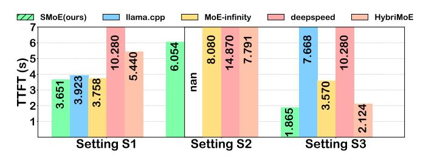

Fig. 13: Prefilling time of baselines and SMoE on average.

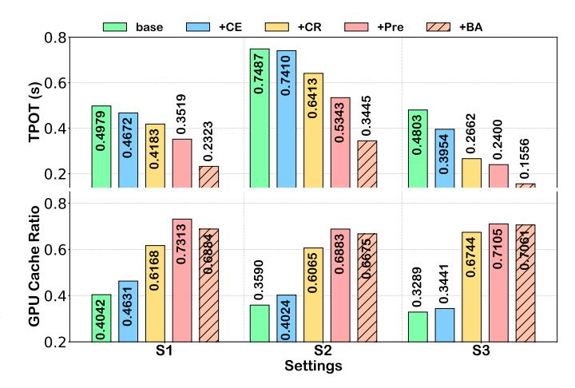

Fig. 14: Impact of components on TPOT and cache ratio.

those already in GPU memory. As shown in Figure 15, the expert-cache router significantly reduces the probability that active low-score experts are not in GPU memory. Notably, its optimization effect grows more pronounced as the proportion of low-score experts in active experts increases (i.e., as the low ratio rises).

Expert prefetching analysis. Compared to +CR, this reduces TPOT by 14% and increases GPU cache ratio by 12%. We incorporate online prefetching (labeled +Pre), which prefetches top-score experts before computation. These first three steps significantly reduce TPOT by improving the GPU expert cache ratio: as shown in Figure 15, the number of top-score active experts requiring loading is drastically reduced via prefetching.

As depicted in Figure 16, PCIe load time increases with prefetching, yet TPOT decreases. The increased PCIe load time results from occasional misidentification of low-score experts as top-score ones, leading to unnecessary fetching. TPOT reduction is achieved by ensuring that prefetching-related PCIe loads overlap with computation, not interfering with current layer expert loading, thus maximizing prefetching benefits. Additionally, Figure 17 indicates our prefetching method attains an average accuracy of about 82% in predicting top-score experts. Even if a prefetched expert is not top-score, it has a 95% chance of being active, significantly outperforming methods based solely on residual results. Prefetching only these predicted top-score experts allows the router to utilize them directly, boosting efficiency.

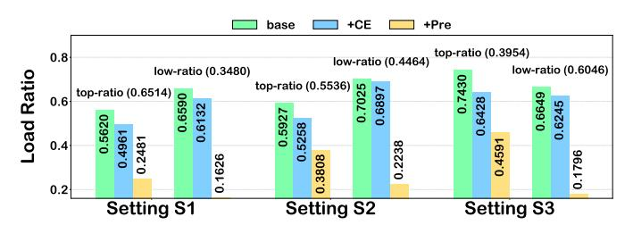

Fig. 15: Fewer top/low-score experts require loading.

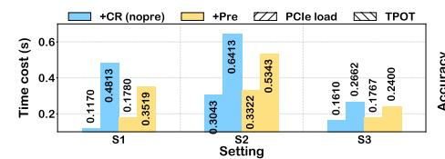

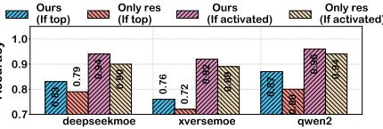

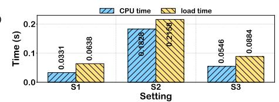

Fig. 16: PCIe time vs TPOT.

Fig. 17: Prefetching accuracy.

Fig. 18: CPU vs PCIe time.

**CPU-assisted computing loading scheduling.** Compared to +Pre, this cuts TPOT by 34% on average but decreases GPU cache ratio by 3%. We integrate the CPU-assisted scheduling (labeled +BA) to balance CPU usage and load. The reduction in TPOT is achieved because CPU computation, though slower than GPU computation, overlaps with load time, allowing CPU assistance without additional overhead and maintaining high expert utilization in GPU memory.

A slight decrease in the GPU cache ratio occurs as experts that would typically be loaded are computed directly on the CPU, which slows GPU cache updates, yet high utilization is maintained. As shown in Figure 18, the scheduling minimizes the difference between CPU and PCIe times, ensuring CPU computation is fully covered by PCIe load time and maximizing CPU computation's supportive role. However, challenges remain: the significant disparity between CPU computation and load times, with CPU time in S3 being only one-third of load time, necessitates many experts for effective balancing. Additionally, the limited number of active experts in MoE per decoding step hinders consistent balancing of PCIe load and CPU computation times.

#### VII. RELATED WORK

This section introduces relevant MoE serving approaches. For accelerating MoE inference under GPU memory constraints, approaches are categorized into general LLM inference optimization and MoE-specific expert scheduling, with the latter further divided into online and offline MoE serving. Online MoE Serving manages dynamically changing workloads on edge devices, where loading or computing nonresident expert models significantly impacts inference latency. As workloads vary, the active expert set changes, necessitating experts not in GPU memory. These methods adapt via flexible expert scheduling to sustain acceleration effectiveness. MoE-Infinity [36] uses a request-level expert activation matrix for coarse offloading decisions, while HybriMoE [43] optimizes CPU computation, enhancing CPU-load pipelines to minimize the maximum of CPU and loading times. HybriMoE is built on kTransformer [1], a framework for optimizing LLM deployment on resource-limited local machines, utilizing heterogeneous computing and supporting efficient kernels like Llamafile and Marlin. However, both HybriMoE and kTransformer employ quantization, which our approach does not, so they are excluded from our experimental baselines.

**Offline MoE Serving.** Designed for predetermined workloads, these strategies include MoE-lightning's CGOPipe—a CPU-GPU-I/O pipelining schedule with a performance model

to maximize resource utilization [12]. Expert pruning [13] reduces memory usage by removing underutilized experts, tailoring resource management to specific workloads. Knowledge distillation [44] produces compact sparse MoE models; ComPEFT [38] demonstrates expert compression without accuracy loss, while MC-SMoE [27] further decomposes merged experts into low-rank and structurally sparse alternatives. All these works address pre-known workloads. However, since we aim to handle unpredictable workloads on edge devices, we only compare with online MoE methods.

#### VIII. CONCLUSION

In conclusion, we present an approach for deploying MoE LLMs on edge devices using a scheduling stategy by substituting low-importance active experts with functionally similar ones already cached in GPU memory, thereby preserving accuracy. We establish a robust CPU-GPU-load pipeline system named SMoE, providing an effective solution for LLM deployment on edge.

#### REFERENCES

- "Ktransformers: A flexible framework for experiencing cutting-edge llm inference optimizations." https://github.com/kvcache-ai/KTransformers, 2024.
- [2] "Llama.cpp: a c++ implementation enabling efficient llm inference on cpus." https://github.com/ggml-org/llama.cpp, 2024.
- [3] "Opencompass is an llm evaluation platform, supporting a wide range of models (llama3, mistral, internlm2,gpt-4,llama2, qwen,glm, claude, etc) over 100+ datasets." https://https://github.com/opencompass/opencompass, 2024.
- [4] "This url describes some of the common llm inference metrics." https://docs.nvidia.com/nim/benchmarking/llm/latest/metrics.html, 2024.
- [5] "This url introduces the llm deepseek-moe-16b-chat." https://huggingface.co/deepseek-ai/deepseek-moe-16b-chat, 2024.
- [6] "This url introduces the llm qwen2-57b-a14b-instruct." https://huggingface.co/Qwen/Qwen2-57B-A14B-Instruct, 2024.
- [7] "This url introduces the llm /xverse-moe-a4.2b-chat." https://huggingface.co/xverse/XVERSE-MoE-A4.2B-Chat, 2024.
- [8] R. Y. Aminabadi, S. Rajbhandari, A. A. Awan, C. Li, D. Li, E. Zheng, O. Ruwase, S. Smith, M. Zhang, J. Rasley et al., "Deepspeed-inference: enabling efficient inference of transformer models at unprecedented scale," in SC22: International Conference for High Performance Computing, Networking, Storage and Analysis. IEEE, 2022, pp. 1–15.
- [9] R. Awasthi, S. P. Ramachandran, S. Mishra, D. Mahapatra, H. Arshad, A. Atreja, A. Bhattacharyya, A. Bhattad, N. Singh, J. B. Cywinski *et al.*, "Artificial intelligence in healthcare: 2024 year in review," *medRxiv*, pp. 2025–02, 2025.
- [10] Y. Bisk, R. Zellers, R. L. Bras, J. Gao, and Y. Choi, "Piqa: Reasoning about physical commonsense in natural language," in *Thirty-Fourth AAAI Conference on Artificial Intelligence*, 2020.
- [11] W. Cai, J. Jiang, F. Wang, J. Tang, S. Kim, and J. Huang, "A survey on mixture of experts in large language models," *IEEE Transactions on Knowledge and Data Engineering*, 2025.

- [12] S. Cao, S. Liu, T. Griggs, P. Schafhalter, X. Liu, Y. Sheng, J. E. Gonzalez, M. Zaharia, and I. Stoica, "Moe-lightning: High-throughput moe inference on memory-constrained gpus," in *Proceedings of the 30th ACM International Conference on Architectural Support for Programming Languages and Operating Systems, Volume 1*, 2025, pp. 715–730.
- [13] T. Chen, S. Huang, Y. Xie, B. Jiao, D. Jiang, H. Zhou, J. Li, and F. Wei, "Task-specific expert pruning for sparse mixture-of-experts," *arXiv preprint arXiv:2206.00277*, 2022.
- [14] Z. Chkirbene, R. Hamila, A. Gouissem, and U. Devrim, "Large language models (llm) in industry: A survey of applications, challenges, and trends," in *2024 IEEE 21st International Conference on Smart Communities: Improving Quality of Life using AI, Robotics and IoT (HONET)*. IEEE, 2024, pp. 229–234.
- [15] C. Clark, K. Lee, M.-W. Chang, T. Kwiatkowski, M. Collins, and K. Toutanova, "Boolq: Exploring the surprising difficulty of natural yes/no questions," *arXiv preprint arXiv:1905.10044*, 2019.
- [16] P. Clark, I. Cowhey, O. Etzioni, T. Khot, A. Sabharwal, C. Schoenick, and O. Tafjord, "Think you have solved question answering? try arc, the ai2 reasoning challenge," *arXiv:1803.05457v1*, 2018.
- [17] D. Dai, C. Deng, C. Zhao, R. Xu, H. Gao, D. Chen, J. Li, W. Zeng, X. Yu, Y. Wu *et al.*, "Deepseekmoe: Towards ultimate expert specialization in mixture-of-experts language models," *arXiv preprint arXiv:2401.06066*, 2024.
- [18] U. Deshpande, T. Janssen, M. Srivatsa, and S. Sundararaman, "Moesaic: Shared mixture of experts," in *Proceedings of the 2024 ACM Symposium on Cloud Computing*, November 2024, pp. 434–442.
- [19] W. Fedus, B. Zoph, and N. Shazeer, "Switch transformers: Scaling to trillion parameter models with simple and efficient sparsity," *Journal of Machine Learning Research*, vol. 23, no. 120, pp. 1–39, 2022.
- [20] O. Friha, M. A. Ferrag, B. Kantarci, B. Cakmak, A. Ozgun, and N. Ghoualmi-Zine, "Llm-based edge intelligence: A comprehensive survey on architectures, applications, security and trustworthiness," *IEEE Open Journal of the Communications Society*, 2024.
- [21] X. Jiang, Y. Zhou, S. Cao, I. Stoica, and M. Yu, "Neo: Saving gpu memory crisis with cpu offloading for online llm inference," *arXiv preprint arXiv:2411.01142*, 2024.
- [22] H. Kang, Z. Yu, and C. Xiong, "Flame-moe: A transparent end-toend research platform for mixture-of-experts language models," *arXiv preprint arXiv:2505.20225*, 2025.
- [23] H. Kim, N. Wang, Q. Xia, J. Huang, A. Yazdanbakhsh, and N. S. Kim, "Lia: A single-gpu llm inference acceleration with cooperative amxenabled cpu-gpu computation and cxl offloading," in *Proceedings of the 52nd Annual International Symposium on Computer Architecture*, June 2025, pp. 544–558.
- [24] R. Kong, Y. Li, W. Wang, L. Kong, and Y. Liu, "Serving moe models on resource-constrained edge devices via dynamic expert swapping," *IEEE Transactions on Computers*, 2025.
- [25] G. Lai, Q. Xie, H. Liu, Y. Yang, and E. Hovy, "RACE: Large-scale ReAding comprehension dataset from examinations," in *Proceedings of the 2017 Conference on Empirical Methods in Natural Language Processing*. Copenhagen, Denmark: Association for Computational Linguistics, Sep. 2017, pp. 785–794. [Online]. Available: https://aclanthology.org/D17-1082
- [26] N. Li, S. Guo, T. Zhang, M. Li, Z. Hong, Q. Zhou, X. Yuan, and H. Zhang, "The moe-empowered edge llms deployment: Architecture, challenges, and opportunities," *arXiv preprint arXiv:2502.08381*, 2025.
- [27] P. Li, Z. Zhang, P. Yadav, Y.-L. Sung, Y. Cheng, M. Bansal, and T. Chen, "Merge, then compress: Demystify efficient smoe with hints from its routing policy," *arXiv preprint arXiv:2310.01334*, 2023.
- [28] M. T. Pilehvar and J. Camacho-Collados, "Wic: the word-in-context dataset for evaluating context-sensitive meaning representations," *arXiv preprint arXiv:1808.09121*, 2018.
- [29] D. Rivkin, F. Hogan, A. Feriani, A. Konar, A. Sigal, X. Liu, and G. Dudek, "Aiot smart home via autonomous llm agents," *IEEE Internet of Things Journal*, 2024.
- [30] R. Sarkar, H. Liang, Z. Fan, Z. Wang, and C. Hao, "Edge-moe: Memory-efficient multi-task vision transformer architecture with tasklevel sparsity via mixture-of-experts," in *2023 IEEE/ACM International Conference on Computer Aided Design (ICCAD)*. IEEE, October 2023, pp. 1–9.
- [31] N. Shazeer, A. Mirhoseini, K. Maziarz, A. Davis, Q. V. Le, G. Hinton, and J. Dean, "Outrageously large neural networks: The sparsely-gated mixture-of-experts layer," *arXiv preprint arXiv:1701.06538*, 2017.

- [32] R. Singh and S. S. Gill, "Edge ai: a survey," *Internet of Things and Cyber-Physical Systems*, vol. 3, pp. 71–92, 2023.
- [33] X. Song, Z. Zhong, R. Chen, and H. Chen, "Promoe: Fast moe-based llm serving using proactive caching," *arXiv preprint arXiv:2410.22134*, 2024.
- [34] Y. Song, Z. Mi, H. Xie, and H. Chen, "Powerinfer: Fast large language model serving with a consumer-grade gpu," in *Proceedings of the ACM SIGOPS 30th Symposium on Operating Systems Principles*, 2024, pp. 590–606.
- [35] W. Wang, L. Mi, S. Cen, H. Dai, Y. Li, X. Fu, and Y. Liu, "Region-based content enhancement for {Efficient} video analytics at the edge," in *22nd USENIX Symposium on Networked Systems Design and Implementation (NSDI 25)*, 2025, pp. 613–633.
- [36] L. Xue, Y. Fu, Z. Lu, L. Mai, and M. Marina, "Moe-infinity: Activationaware expert offloading for efficient moe serving," *arXiv e-prints*, pp. arXiv–2401, 2024.
- [37] Z. Xue, Y. Song, Z. Mi, X. Zheng, Y. Xia, and H. Chen, "Powerinfer-2: Fast large language model inference on a smartphone," *arXiv preprint arXiv:2406.06282*, 2024.
- [38] P. Yadav, L. Choshen, C. Raffel, and M. Bansal, "Compeft: Compression for communicating parameter efficient updates via sparsification and quantization," *arXiv preprint arXiv:2311.13171*, 2023.
- [39] Z. Yu, S. Liang, T. Ma, Y. Cai, Z. Nan, D. Huang, T. Chen *et al.*, "Cambricon-llm: A chiplet-based hybrid architecture for on-device inference of 70b llm," in *2024 57th IEEE/ACM International Symposium on Microarchitecture (MICRO)*. IEEE, November 2024, pp. 1474–1488.
- [40] D. Zhang, H. Zheng, W. Yue, and X. Wang, "Advancing its applications with llms: A survey on traffic management, transportation safety, and autonomous driving," in *International Joint Conference on Rough Sets*. Springer, 2024, pp. 295–309.
- [41] M. Zhang, X. Shen, J. Cao, Z. Cui, and S. Jiang, "Edgeshard: Efficient llm inference via collaborative edge computing," *IEEE Internet of Things Journal*, 2024.
- [42] Y. Zhang, S. Aggarwal, and T. Mitra, "Daop: Data-aware offloading and predictive pre-calculation for efficient moe inference," in *2025 Design, Automation & Test in Europe Conference (DATE)*. IEEE, March 2025, pp. 1–7.
- [43] S. Zhong, Y. Sun, L. Liang, R. Wang, R. Huang, and M. Li, "Hybrimoe: Hybrid cpu-gpu scheduling and cache management for efficient moe inference," *arXiv preprint arXiv:2504.05897*, 2025.
- [44] T. Zhong, Z. Chi, L. Gu, Y. Wang, Y. Yu, and J. Tang, "Metadmoe: Adapting to domain shift by meta-distillation from mixture-ofexperts," *Advances in Neural Information Processing Systems*, vol. 35, pp. 22 243–22 257, 2022.