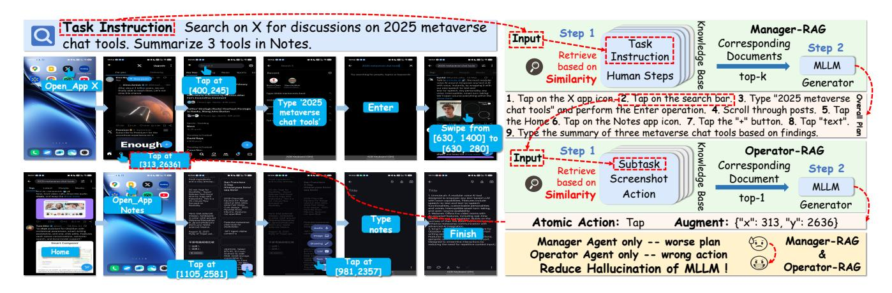
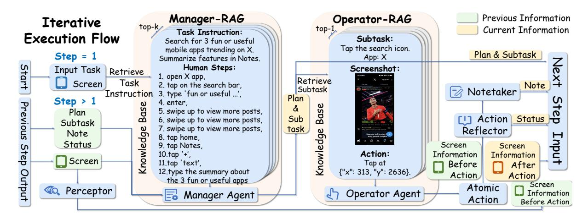
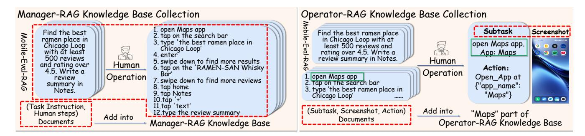
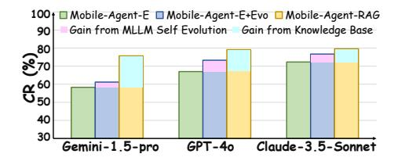
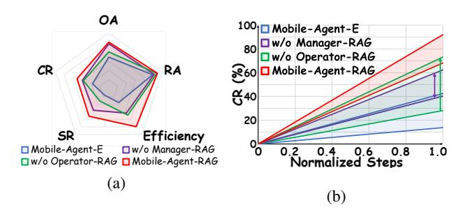
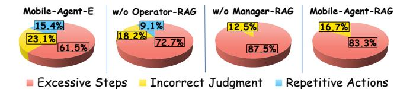
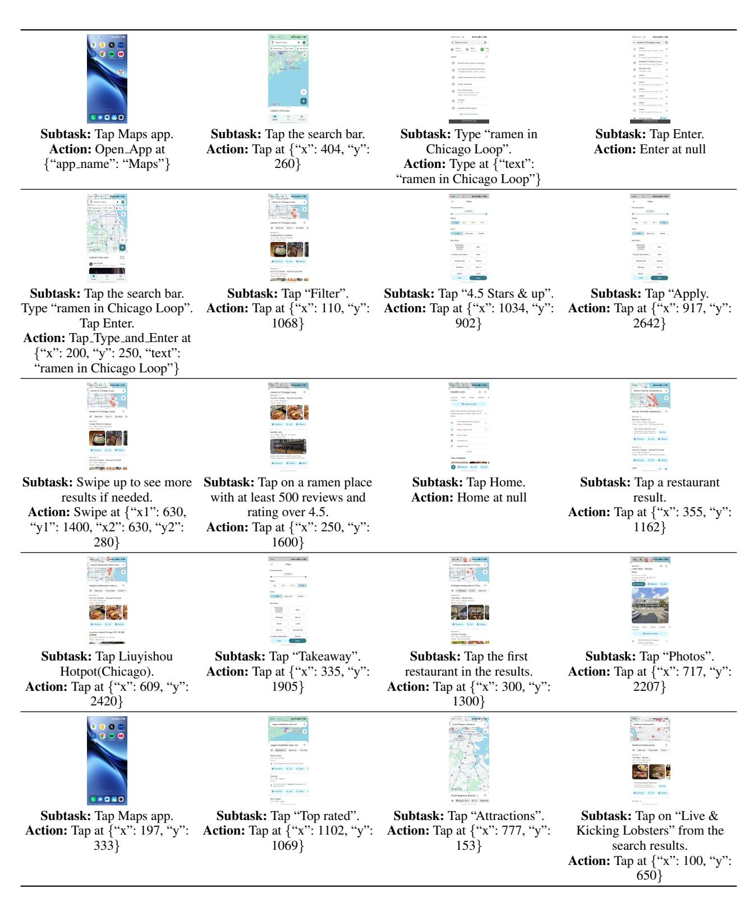
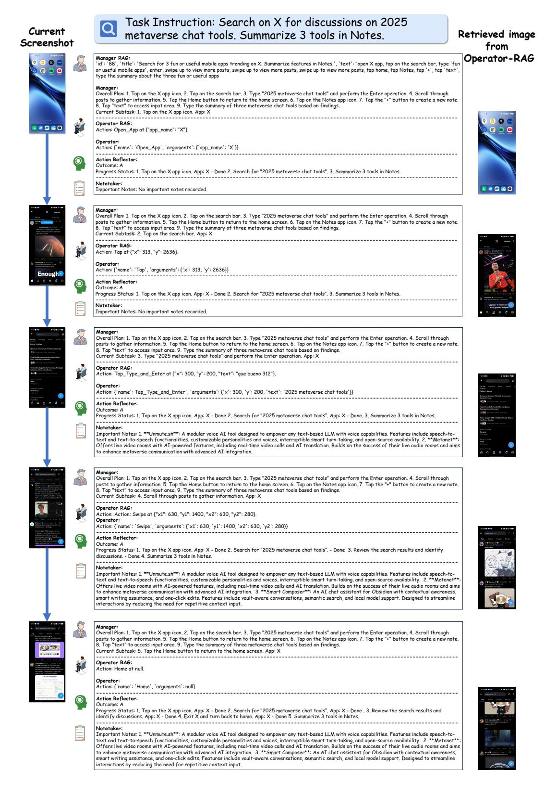
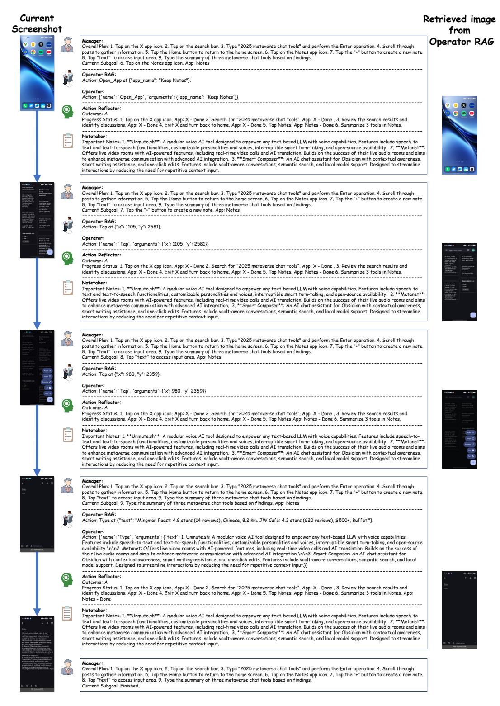
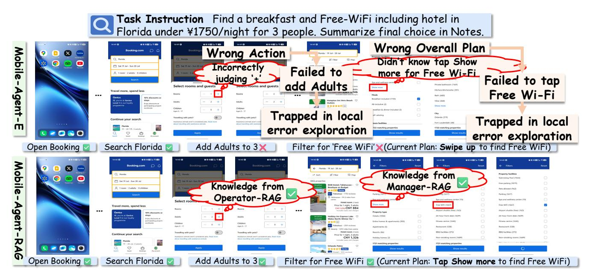

# Mobile-Agent-RAG: Driving Smart Multi-Agent Coordination with Contextual Knowledge Empowerment for Long-Horizon Mobile Automation

Yuxiang Zhou<sup>1,2,4\*</sup>, Jichang Li<sup>2\*</sup>, Yanhao Zhang<sup>3</sup>, Haonan Lu<sup>3</sup>, Guanbin Li<sup>1,2,4†</sup>

<sup>1</sup>School of Computer Science and Engineering, Sun Yat-sen University

<sup>2</sup>Pengcheng Laboratory

<sup>3</sup>OPPO AI Center, OPPO Inc., China

<sup>4</sup>Guangdong Key Laboratory of Big Data Analysis and Processing zhouyx95@mail2.sysu.edu.cn, li,jichang@pcl.ac.cn, {zhangyanhao,luhaonan}@oppo.com, liguanbin@mail.sysu.edu.cn

#### **Abstract**

Mobile agents show immense potential, yet current stateof-the-art (SoTA) agents exhibit inadequate success rates on real-world, long-horizon, cross-application tasks. We attribute this bottleneck to the agents' excessive reliance on static, internal knowledge within MLLMs, which leads to two critical failure points: 1) strategic hallucinations in highlevel planning and 2) operational errors during low-level execution on user interfaces (UI). The core insight of this paper is that high-level planning and low-level UI operations require fundamentally distinct types of knowledge. Planning demands high-level, strategy-oriented experiences, whereas operations necessitate low-level, precise instructions closely tied to specific app UIs. Motivated by these insights, we propose Mobile-Agent-RAG, a novel hierarchical multi-agent framework that innovatively integrates dual-level retrieval augmentation. At the planning stage, we introduce Manager-RAG to reduce strategic hallucinations by retrieving human-validated comprehensive task plans that provide high-level guidance. At the execution stage, we develop Operator-RAG to improve execution accuracy by retrieving the most precise low-level guidance for accurate atomic actions, aligned with the current app and subtask. To accurately deliver these knowledge types, we construct two specialized retrieval-oriented knowledge bases. Furthermore, we introduce Mobile-Eval-RAG, a challenging benchmark for evaluating such agents on realistic multiapp, long-horizon tasks. Extensive experiments demonstrate that Mobile-Agent-RAG significantly outperforms SoTA baselines, improving task completion rate by 11.0% and step efficiency by 10.2%, establishing a robust paradigm for context-aware, reliable multi-agent mobile automation.

**Code&Supp.** — https://github.com/george13zyx/MAR

#### Introduction

Mobile agents have demonstrated immense potential in intelligent automation, promising to autonomously accomplish complex user tasks by interacting with smartphone interfaces (You et al. 2024; Yan et al. 2023). However, current state-of-the-art (SoTA) agents still exhibit inadequate

success rates when handling real-world, long-horizon, cross-application tasks (Bai et al. 2024). We attribute this bottle-neck to a fundamental issue: the agents' excessive reliance on static, internal knowledge embedded in multimodal large language models (MLLMs) (Tang et al. 2025; Xie et al. 2025a). This reliance leads to two critical failure points: 1) strategic hallucinations in high-level planning requiring multi-step reasoning (Xie et al. 2025b; Ji et al. 2024), and 2) operational errors during low-level execution involving specific elements for user interfaces (UI) (Song et al. 2024; Guo et al. 2025).

To address these challenges, hierarchical frameworks, such as Mobile-Agent-E (Wang et al. 2025), have been introduced, which decouple high-level planning from lowlevel execution. Although this architecture improves task performance to some extent, both planning and execution modules still depend on the inherent reasoning capabilities of the models themselves (Hou et al. 2024). This dependence does not fundamentally resolve the hallucination issue caused by static knowledge, resulting in error accumulation during task execution. Retrieval-Augmented Generation (RAG) (Lewis et al. 2020) provides a new approach to mitigate this issue by dynamically retrieving information from external knowledge bases, which has shown success in domains (Yao et al. 2023; Feng et al. 2024; Zhu et al. 2024). However, the effective application of RAG in mobile automotion to specifically address the aforementioned issues at the planning and execution levels remains unexplored.

The core insight of this paper is that high-level planning and low-level UI operations require fundamentally distinct types of knowledge. Planning demands high-level, strategy-oriented experiences, whereas operations necessitate low-level, precise instructions closely tied to specific app UIs. Motivated by these insights, we propose Mobile-Agent-RAG, a novel hierarchical multi-agent framework explicitly designed for long-horizon, multi-app mobile automation tasks. Our framework innovatively integrates dual-level retrieval augmentation, significantly boosting agent performance through real-time, contextually relevant external knowledge. At the planning stage, we introduce **Manager-RAG**, retrieving human-validated comprehensive task plans to provide high-level guidance for long-term strategies, effectively reducing strategic halluci-

<sup>\*</sup>Equal Contribution.

<sup>&</sup>lt;sup>†</sup>Corresponding author is Guanbin Li. Copyright © 2026, Association for the Advancement of Artificial Intelligence (www.aaai.org). All rights reserved.



Figure 1: Mobile-Agent-RAG is a novel hierarchical multi-agent framework explicitly designed for long-horizon, multi-app mobile automation tasks. Mobile-Agent-RAG's proposed **Manager-RAG** retrieves human-verified task demonstrations to guide high-level plans, while **Operator-RAG** retrieves UI-grounded examples for atomic action generation.

nations. At the execution stage, we develop **Operator-RAG**, which retrieves most precise low-level guidance for accurate atomic actions aligned with the current app and subtask, substantially improving execution accuracy.

To accurately deliver these knowledge types, we construct two specialized retrieval-oriented knowledge bases. The framework dynamically leverages these two core RAG components to systematically overcome the limitations of current agents. Furthermore, we introduce Mobile-Eval-RAG, a challenging benchmark featuring realistic multiapp, long-horizon tasks. Extensive experiments demonstrate that our approach significantly surpasses existing state-of-the-art baselines, e.g. Mobile-Agent-E (Wang et al. 2025), achieving notable improvements in task completion rates, operator accuracy, step efficiency, and success rates.

In summary, this paper makes the following contributions.

- We propose Mobile-Agent-RAG, a hierarchical multi-agent framework enpowered with contextually relevant external knowledge through dual-level retrieval augmentation, namely Manager-RAG and Operator-RAG, for robust long-horizon mobile automation.
- We design two retrieval-oriented knowledge bases, specialized to support Manager-RAG and Operator-RAG, for reducing agent hallucinations and execution errors, and release Mobile-Eval-RAG, a benchmark tailored for evaluating such retrieval-augmented mobile agents.
- Extensive experiments demonstrate that our proposed Mobile-Agent-RAG significantly outperforms SoTA baseline algorithms, improving task completion rate by 11.0% and step efficiency by 10.2%, establishing a robust paradigm for context-aware, reliable multi-agent mobile automation.

#### **Related Work**

Mobile Agents for UI-Based Task Automation Early mobile task automation focused on enhancing agents' context understanding for graphic user interfaces (UI) through

tools and exploratory actions, e.g., Mobile-Agent (Wang et al. 2024b) and AppAgent (Zhang et al. 2025). These single-agent systems struggled with complex tasks, prompting the shift to multi-agent approaches (Xie et al. 2024). For instance, M3A (Rawles et al. 2024) improves task completion by employing multiple agents for collaborative planning and decision-making. Mobile-Agent-v2 (Wang et al. 2024a) further decomposes tasks into planning, decision, and reflection agents. However, its planning component functions more as a tracker than a strategic planner, and decision-making spans multiple levels. Hence, MLLMbased agents like DroidBot-GPT (Wen et al. 2023) and AutoDroid (Wen et al. 2024) automate UI interactions by converting GUI states into natural language prompts. Additionally, MobileGPT (Lee et al. 2024) introduces a humanlike memory system that modularizes tasks into reusable sub-modules via an "explore, select, derive, recall" model. Despite advancements, existing MLLM-based agents face hallucinations (Zheng et al. 2024; Li et al. 2025), undermining their reliability in multi-step mobile tasks. Therefore, we instead propose Mobile-Agent-RAG, a retrievalaugmented generation framework that integrates external knowledge to improve context accuracy and reduce hallucinations.

Retrieval-Augmented Agents vs. Memory-Driven Agents Retrieval-Augmented Generation (RAG) enhances MLLMs in knowledge-intensive tasks by combining parametric generation with non-parametric memory through semantic retrieval (Lewis et al. 2020). In agent-based systems, RAG facilitates dynamic access to external knowledge during inference, improving factual consistency and planning (Singh et al. 2025). This is evident in web-based agents like WebGPT (Nakano et al. 2021) and reasoning-action frameworks like ReAct (Yao et al. 2023). Meanwhile, memory-driven agents, such as MemGPT (Packer et al. 2023), support long-horizon tasks by retaining context across sessions, ensuring stable reasoning over time (Song et al. 2025). Re-

cent mobile UI agents combine these techniques to ad-



Figure 2: Framework overview of Mobile-Agent-RAG: A hierarchical multi-agent system empowered by dedicated knowledge providers, namely **Manager-RAG** and **Operatoer-RAG**, for enhanced high-level planning and precise atomic action generation. Its core operational loop is illustrated: Manager plans, Operator executes, with Perceptor, Action Reflector, and Notetaker providing comprehensive support for mobile task automation.

dress multi-step interactions. Representative works such as AppAgent-v2 (Li et al. 2024) builds a structured knowledge base during offline exploration for retrieval-driven decision-making, while AppAgentX (Jiang et al. 2025) logs execution history to enhance adaptability. Although Mobile-Agent-E (Wang et al. 2025) improves task efficiency through agent-driven heuristic summarization, it remains susceptible to hallucinations and lacks explicit task abstraction. To overcome this challenge, our proposed Mobile-Agent-RAG integrates a hierarchical multi-agent framework, combining retrieval at both planning and execution levels. By utilizing both structured UI knowledge and external documents, this approach enhances context grounding, reduces hallucination risks, and supports reliable long-horizon mobile automation.

#### Methodology

This section details Mobile-Agent-RAG, a novel framework addressing long-horizon mobile automation by empowering a hierarchical multi-agent system with contextual knowledge. We first elaborate on its multi-agent architecture and execution flow. Subsequently, we detail how our proposed knowledge components enhance core agent decision-making, followed with their correpsonding knowledge base collection, providing a robust solution to challenges like hallucination. As illustrated in Figure 2, Mobile-Agent-RAG integrates our proposed dedicated knowledge providers, i.e. Manager-RAG and Operator-RAG, into the Manager and Operator agents, facilitating high-level task planning and low-level precise atomic actions. Notation definitions used in Mobile-Agent-RAG are provided in Appendix A.

#### **Hierarchical Multi-Agent Architecture**

Mobile-Agent-RAG is built upon a hierarchical multi-agent framework, inherited and extended from Mobile-Agent-E (Wang et al. 2025). This architecture

is designed to achieve a clear separation between high-level planning and low-level execution in mobile task automation, ensuring robustness and adaptability across diverse mobile environments. The framework comprises a central decision-making loop facilitated by a **Manager Agent** and an **Operator Agent**, supported by several specialized modules including a **Perceptor**, an **Action Reflector**, and a **Notetaker**.

**Core Agents: Manager and Operator** The interaction between the Manager and Operator constitutes the backbone of task execution, coordinating high-level strategic planning and low-level fine-grained operations.

• Manager Agent (M) empowered by Manager-RAG: The Manager Agent is responsible for high-level strategic planning and subtask decomposition. At each timestep t, it devises the overall plan  $(P_t)$  to achieve the user's task instruction (I) and generates the next subtask  $(T_t^{\rm app})$  with the relevant application.

$$P_t, T_t^{\text{app}} = \begin{cases} M(I, D_{MR}, S_{t-1}) & \text{, if } t = 1 \\ M(I, P_{t-1}, T_{t-1}^{\text{app}}, S_{t-1}, G_{t-1}, N_{t-1}) \\ \text{, if } t > 1 \text{ and } F_{t-1} = \text{False} \\ M(I, P_{t-1}, T_{t-1}^{\text{app}}, S_{t-1}, G_{t-1}, L_{[-k:]}^E, N_{t-1}) \\ \text{, if } t > 1 \text{ and } F_{t-1} = \text{True} \end{cases}$$

At the initial timestep (t=1), the Manager leverages the input task instruction (I), a retrieved Manager-RAG document  $(D_{MR})$ , and the initial screenshot  $(S_{t-1})$  to formulate the first overall plan  $(P_1)$  and subtask  $(T_1^{\mathrm{app}})$ . For subsequent timesteps (t>1), it refines its plan based on previous states. In case of consecutive errors  $(F_{t-1} = \mathrm{True})$ , it consults recent error logs  $(L_{[-k:]}^E)$  for error recovery. The Manager primarily focuses on abstract planning, thus avoiding fine-grained visual information  $(V_{t-1})$  that might introduce noise for high-level decision-making.

**Operator Agent** (*O*) **empowered by Operator-RAG:** The Operator Agent translates the Manager's subtasks into concrete, executable atomic actions. It interacts directly with the mobile environment via Android Debug Bridge (ADB).

$$A_t, S_t = O(I, D_{OR}, P_t, T_t^{\text{app}}, S_{t-1}, V_{t-1}, G_{t-1}, L_{[-k:]}^E, L_{[-k:]}^A, N_{t-1})$$

The Operator generates an atomic action  $(A_t)$  based on the current context, including the input task instruction (I), a retrieved Operator-RAG document  $(D_{OR})$ , the overall plan  $(P_t)$ , the current subtask  $(T_t^{\rm app})$ , the screenshot before action  $(S_{t-1})$ , and crucially, the fine-grained visual information before action  $(V_{t-1})$ . The combination of  $S_{t-1}$  and  $V_{t-1}$  enables precise action parameter generation (e.g., specific tap coordinates). The atomic actions  $A_t$  are selected from a predefined set, including  $Open\_App$ , Tap, Swipe, Type, Enter, Back, Home, and Wait. Refer to  $Appendix\ B$  for more details.

**Supporting Modules: Perceptor, Action Reflector, and Notetaker** These modules augment the core Manager-Operator loop by providing essential information and feedback, ensuring the system's awareness and adaptability within the mobile environment.

• Perceptor (P): Fine-grained Visual Perception. The Perceptor analyzes screenshots  $(S_t)$  to convert raw visual information into structured, fine-grained information  $(V_t)$ . This information includes identified text, icons, their precise locations, and contextual descriptions, providing the crucial visual context for other agents. Refer to **Appendix C** for details.

$$V_t = P(S_t)$$

• Action Reflector (R): Reflection on Action Outcome. The Action Reflector evaluates the outcome of the Operator's most recent action  $(A_t)$ , providing critical feedback to the system. It compares the UI states before  $(S_{t-1}, V_{t-1})$  and after  $(S_t, V_t)$  the action, considering the current subtask  $(T_t^{\rm app})$  and global progress status  $(G_{t-1})$ . It classifies outcomes (e.g., successful, failed due to wrong page, failed due to no change) and updates the global progress status  $(G_t)$ , action logs  $(L_t^A)$ , and error logs  $(L_t^E)$ . This feedback loop is vital for error detection and recovery.

Outcome, 
$$G_t, L_t^A, L_t^E = R(I, T_t^{app}, A_t, S_{t-1}, S_t, V_{t-1}, V_t, G_{t-1})$$

• Notetaker (N): Information Aggregation. The Notetaker maintains and updates task-critical information  $(N_t)$  throughout execution. It aggregates dynamic details (e.g., search results, extracted phone numbers) from the current state  $(S_t, V_t, G_t)$  and previous notes  $(N_{t-1})$ . This ensures persistent tracking of information across multiple steps, which is crucial for long-horizon tasks to maintain contextual awareness.

$$N_t = N(I, P_t, T_t^{\text{app}}, S_t, V_t, G_t, N_{t-1})$$

**Iterative Execution Flow** As illustrated in Figure 2, the system operates in a **dynamic iterative loop**, where agents and modules continuously interact to achieve the user's task instruction by processing information and executing actions. This process ensures adaptive responses to the mobile environment, evolving step-by-step toward task completion. The general flow at each timestep t is as follows:

- Perception: The Perceptor module analyzes the current screenshot to extract fine-grained visual information.
- High-Level Planning: The Manager Agent uses raw screenshot, along with the overall task and contextual knowledge, to refine the global plan and determine the next high-level subtask.
- Low-Level Action: Based on the Manager Agent's subtask, the Operator Agent generates and executes a precise atomic UI action on the mobile device.
- Post-Action Perception: Immediately after an action is performed, the Perceptor captures the updated finegrained visual information for Action Reflector to reflect the changes.
- Reflection: The Action Reflector evaluates the outcome of the executed action by comparing raw and fine-grained visual information before and after, providing critical feedback for progress tracking and error detection.
- Information Aggregation: Concurrently, the Notetaker module continuously updates and aggregates essential dynamic information as notes, maintaining a persistent and comprehensive context for the ongoing task.

Mobile-Agent-RAG is built upon this hierarchical multi-agent architecture. To further enhance this framework, we introduce **Contextual Knowledge Empowerment**, a mechanism utilizing RAG to incorporate external, task-specific knowledge into both the Manager and Operator agents. By mitigating the limitations associated with exclusive reliance on internal representations from MLLMs, our approach significantly improves Mobile-Agent-RAG's capability to address complex and previously unseen mobile tasks. Detailed implementation is described in the subsequent section.

#### Contextual Knowledge Empowerment via RAG

This section details how external knowledge is retrieved and integrated to empower the Manager and Operator agents, forming the core of Mobile-Agent-RAG's innovation. This process allows the agents to leverage a rich repository of past experiences and domain-specific insights, significantly enhancing their performance beyond what is achievable with internal MLLM knowledge alone.

**Manager-RAG** (MR) Manager-RAG aims to guide high-level planning, especially during the initial stages of a task.

• **Retrieval:** At the beginning of a task (t = 1), the Manager-RAG module takes the input task instruction (I) and retrieves the top-k most relevant (task instruction  $I_{MR}$ , human steps  $H_{MR}$ ) documents  $(D_{MR})$  from



Figure 3: A flow of knowledge base collection for Manager-RAG and Operater-RAG.

| Method                          | Framework Type               | CR           | OA           | RA           | Steps        | Efficiency   | SR           |
|---------------------------------|------------------------------|--------------|--------------|--------------|--------------|--------------|--------------|
|                                 | Single                       | -App Task    | Execution    |              |              |              |              |
| AutoDroid                       | Single-Agent                 | 24.4         | 59.7         | _            | 30.0         | 0.81         | 0.0          |
| Appagent (Auto) Appagent (Demo) | Single-Agent<br>Single-Agent | 25.4<br>29.2 | 63.5<br>73.7 | 91.0<br>92.4 | 30.0<br>30.0 | 0.85<br>0.97 | $0.0 \\ 0.0$ |
| Appagent (Denio)                |                              |              |              | 92.4         | 30.0         | 0.97         | 0.0          |
|                                 | Multı-                       | App Task l   | Execution    |              |              |              |              |
| Mobile-Agent                    | Single-Agent                 | 33.7         | 60.3         | _            | 29.0         | 1.16         | 12.0         |
| Mobile-Agent-v2                 | Multi-Agent                  | 38.5         | 61.9         | 92.5         | 23.5         | 1.64         | 44.0         |
| Mobile-Agent-E                  | Multi-Agent                  | 58.3         | 74.1         | 89.3         | 22.4         | 2.60         | 48.0         |
| Mobile-Agent-E + Evo            | Multi-Agent                  | 61.2         | 77.2         | 91.0         | 21.8         | 2.81         | 56.0         |
| Mobile-Agent-RAG (Ours)         | Multi-Agent                  | <b>75.7</b>  | 90.1         | 94.7         | 18.8         | 4.03         | <b>76.0</b>  |

Table 1: Comparison results of Mobile-Agent-RAG with previous SoTA algorithms for single-app and multi-app task execution with both single-agent and multi-agent frameworks. **Bold** indicates the best-performing results; the same applies hereafter.



Figure 4: Comparison of performance gain sources for Mobile-Agent-RAG, Mobile-Agent-E, and Mobile-Agent-E+Evo across different MLLMs.

its manually curated knowledge base  $(K_{MR})$ . These documents are selected based on the semantic similarity between the input task instruction and indexed task instructions, as determined by the Contriever-MSMARCO model (Izacard et al. 2022). The detailed retrieval algorithm is provided in Algorithm 1 in **Appendix D**.

• Generation: The Manager-RAG module receives the overall task instruction  $I_{\text{query}}$  and the retrieved set of k relevant documents  $\mathcal{R}_M$  from its retrieval mechanism. The MLLM generates the overall plan P as follows:

$$P = \operatorname{PromptGen}_{\mathbf{M}}(I_{\operatorname{query}}, \mathcal{R}_M)$$

where  $\operatorname{PromptGen}_{\operatorname{M}}(\cdot)$  is a function that formulates the input prompt for the MLLM by combining  $I_{\operatorname{query}}$  with the retrieved examples in  $\mathcal{R}_M$  as few-shot examples.

| Method                  | CR                     | OA   | RA   | Steps | Effic. | . SR |  |  |
|-------------------------|------------------------|------|------|-------|--------|------|--|--|
| Simple                  | Simple Operation Tasks |      |      |       |        |      |  |  |
| Mobile-Agent-E          | 63.4                   | 81.8 | 89.7 | 20.3  | 3.12   | 80.0 |  |  |
| Mobile-Agent-E + Evo    | 68.3                   | 85.9 | 86.3 | 16.8  | 4.07   | 80.0 |  |  |
| Mobile-Agent-RAG (Ours) | <b>78.0</b>            | 91.1 | 97.3 | 14.6  | 5.34   | 90.0 |  |  |
| Complex Operation Tasks |                        |      |      |       |        |      |  |  |
| Mobile-Agent-E          | 54.9                   | 69.7 | 89.1 | 23.8  | 2.31   | 26.7 |  |  |
| Mobile-Agent-E + Evo    | 56.5                   | 81.3 | 93.2 | 25.1  | 2.25   | 40.0 |  |  |
| Mobile-Agent-RAG (Ours) | 74.2                   | 89.6 | 93.5 | 21.6  | 4.30   | 66.7 |  |  |

Table 2: Comparison results of Mobile-Agent-RAG with previous SoTA algorithms on tasks with varying complexity.

**Operator-RAG** (*OR*) Operator-RAG is responsible for retrieving app-specific knowledge to support the generation of atomic actions required to accomplish a given subtask.

• Retrieval: When the Operator is about to execute an atomic action, it sends the current subtask with the identified app name  $T_{\text{query}}^{\text{app}}$  to Operator-RAG. The system then restricts retrieval to the app-specific knowledge base  $K_{OR}^{\text{app}}$  for (subtask  $T_{OR}$ , screenshot  $S_{OR}$ , action  $A_{OR}$ ) document  $(D_{OR})$ . The subtask is embedded via the same embedding function  $f(\cdot)$  (Contriever-MSMARCO) into a vector representation. The system performs retrieval within the app-specific embedding space, selecting the entry with the highest cosine similarity between the

| Method                  | CR          | OA     | RA   | Steps | Effic. | SR   |  |
|-------------------------|-------------|--------|------|-------|--------|------|--|
| Ger                     | nini-1      | .5-Pro |      |       |        |      |  |
| Mobile-Agent-E          | 58.3        | 74.1   | 89.3 | 22.4  | 2.60   | 48.0 |  |
| Mobile-Agent-E + Evo    | 61.2        | 77.2   | 91.0 | 21.8  | 2.81   | 56.0 |  |
| Mobile-Agent-RAG (Ours) | 75.7        | 90.1   | 94.7 | 18.8  | 4.03   | 76.0 |  |
|                         | GPT-40      |        |      |       |        |      |  |
| Mobile-Agent-E          | 67.0        | 81.5   | 90.2 | 18.6  | 3.60   | 60.0 |  |
| Mobile-Agent-E + Evo    | 73.3        | 85.6   | 92.4 | 17.8  | 4.12   | 76.0 |  |
| Mobile-Agent-RAG (Ours) | <b>79.1</b> | 88.4   | 97.8 | 18.4  | 4.30   | 84.0 |  |
| Claude-3.5-Sonnet       |             |        |      |       |        |      |  |
| Mobile-Agent-E          | 72.3        | 91.0   | 94.8 | 17.3  | 4.18   | 60.0 |  |
| Mobile-Agent-E + Evo    | 76.7        | 91.3   | 95.6 | 17.1  | 4.49   | 72.0 |  |
| Mobile-Agent-RAG (Ours) | <b>79.6</b> | 92.7   | 95.1 | 18.7  | 4.26   | 84.0 |  |

Table 3: Comparison results of Mobile-Agent-RAG with previous SoTA algorithms, evaluated by different MLLMs.

query and indexed subtasks. The detailed retrieval algorithm is provided in Algorithm 2 in **Appendix D**.

 Generation: For the Operator-RAG, the reasoning model receives the current subtask, a representation of the current screenshot, and the top-1 most relevant document RO from its app-specific knowledge base. This detailed context allows the MLLM to accurately generate the correct atomic action needed to address the current subtask and the current screen state. The generation process can be expressed as:

$$A = \mathsf{PromptGen}_{\mathcal{O}}(T_{\mathsf{query}}^{\mathsf{app}}, S_{\mathsf{current}}, \mathcal{R}_{\mathcal{O}})$$

where  $\operatorname{PromptGen}_{\mathcal{O}}(\cdot)$  is a function that formulates the input prompt for the MLLM by integrating  $T_{\operatorname{query}}^{\operatorname{app}}$ ,  $S_{\operatorname{current}}$ , and the retrieved example  $\mathcal{R}_{\mathcal{O}}$ .

#### **Retrieval-Oriented Knowledge Base Collection**

To enable retrieval-augmented reasoning for both high-level task planning and low-level action execution, we construct dedicated knowledge bases for Manager-RAG and Operator-RAG, as illustrated in Figure 3. By combining automated logging with human validation, our data collection pipeline produces high-quality, context-rich supervision signals that effectively ground model inference. For additional technical details, please refer to **Appendix E**.

Manager-RAG Knowledge Base  $(K_{MR})$  This knowledge base is designed to support high-level task planning. Each entry in the knowledge base consists of a natural language task instruction paired with its corresponding human-annotated operation steps. These (task instruction, human steps) documents  $(D_{MR})$ , are directly extracted from the Mobile-Eval-RAG dataset we construct below. For each task in Mobile-Eval-RAG, the task instruction is treated as a retrieval query, and the human execution trace is simplified and structured into reference steps for downstream use by MLLMs. All data is manually collected and curated to ensure task-level coherence and accuracy.

Operator-RAG Knowledge Base  $(K_{OR}^{\rm app})$  This knowledge base is intended to support atomic action generation during low-level app interactions. Its construction follows a semi-automated process. During agent execution, we dynamically log three types of information: the current subtask being performed, the corresponding screenshot at that step, and the atomic action generated by the Operator. These (subtask, screenshot, action) documents  $(D_{OR})$  are collected in real time and subsequently verified by human annotators. Invalid or low-quality entries are manually corrected or discarded, ensuring data quality and consistency. To avoid cross-app interference and enhance retrieval precision, we maintain separate retrieval libraries for each mobile application.

#### **Experiments**

This section develops the evaluation benchmark Mobile-Eval-RAG and designs experiments to thoroughly assess and analyze the performance, module roles, and generalization capability of Mobile-Agent-RAG. Due to space constraints, further details on the experiments, e.g. case study and more analysis, can be found in Appendix F-M.

#### Benchmark Dataset: Mobile-Eval-RAG

We introduce **Mobile-Eval-RAG**, a benchmark dataset of 50 diverse and challenging tasks designed specifically to evaluate Retrieval-Augmented Generation (RAG) performance in mobile agent systems. Unlike existing benchmarks such as Mobile-Eval-E (Wang et al. 2025), which have limited suitability for assessing RAG's generalization due to progressively increasing difficulty and insufficient task similarity, Mobile-Eval-RAG emphasizes cross-application coordination and long-horizon planning. Specifically, Mobile-Eval-RAG expands upon Mobile-Eval-E's five core categories—Information Searching, What's Trending, Restaurant Recommendation, Online Shopping, and Travel Planning—by introducing cross-application tasks averaging 16.9 steps across 2-3 applications. These tasks closely reflect realistic scenarios demanding substantial coordination and planning. Additionally, region-specific constraints of application have been removed to enhance general applicability. Queries are MLLM-generated and human-verified to ensure feasibility and consistency. Tasks are divided into simple operations (Information Searching, What's Trending), involving basic searches, and complex operations (Restaurant Recommendation, Online Shopping, Travel Planning), requiring detailed interactions and multi-step coordination, maintaining consistent difficulty levels within each category. In summary, Mobile-Eval-RAG effectively evaluates retrieval alongside long-horizon planning and inter-task coordination, providing a concise yet comprehensive platform for assessing RAG models in complex, multi-app environments.

#### **Experimental Setups**

Baselines To evaluate Mobile-Agent-RAG, we compare it with state-of-the-art open-source mobile agent frameworks, including AutoDroid (Wen et al. 2024), AppAgent (Auto) (Zhang et al. 2025), AppAgent (Demo) (Zhang et al. 2025), Mobile-Agent (Wang



Figure 5: Ablation study results of Mobile-Agent-RAG, with (a) showing a radar chart comparing evaluation metrics across different ablation variants, and (b) presenting CR variations over 10 trials for each variant.



Figure 6: Error type distribution over three task failure modes corresponding to the three evaluation criteria of SR.

et al. 2024b), Mobile-Agent-v2 (Wang et al. 2024a), Mobile-Agent-E (Wang et al. 2025), and Mobile-Agent-E+Evo (Wang et al. 2025). These frameworks include both single-agent and multi-agent architectures, all utilizing MLLMs for mobile task automation. Specifically, Mobile-Agent-E+Evo enhances Mobile-Agent-E by integrating a "Self-Evolution" strategy, while AppAgent (Auto) and AppAgent (Demo) represent two variants proposed by (Zhang et al. 2025) for autonomous exploration and human-demonstration modes, respectively.

**Reasoning Models** We use several MLLMs as reasoning backbones in our framework, including **GPT-4o** (Hurst et al. 2024), **Claude-3.5-Sonnet** (Anthopic 2024), and **Gemini-1.5-Pro** (Team et al. 2024). Among them, *Gemini-1.5-Pro* achieves the best performance—cost balance, and we use it as the default backbone for efficiency and scalability.

Evaluation Metrics To assess Mobile-Agent-RAG's mobile agent performance on complex tasks, we first use the standard evaluation metrics from Mobile-Agent-E and Mobile-Agent-v2, including Success Rate (SR, %), Completion Rate (CR, %), Operator Accuracy (OA, %), and Reflector Accuracy (RA, %), and then newly add Steps and Efficiency to evaluate task execution efficiency; Refer to Appendix G for details.

#### **Main Results**

To evaluate Mobile-Agent-RAG, we first benchmarked it against SoTA single- and multi-app frameworks, as summarized in Table 1. Results show that Mobile-Agent-RAG consistently outperforms baselines, particularly in complex multi-app tasks, primarily due

to accurate human-annotated knowledge rather than less reliable self-generated summaries. Furthermore, we assessed its robustness across tasks of varying complexity in Table 2. While methods like Mobile-Agent-E+Evo yield modest CR improvements of 7.7% on simple and 2.9% on complex tasks, our approach significantly boosts CR by 23.0% (simple) and 35.2% (complex) through effective knowledge augmentation. Furthermore, to confirm Mobile-Agent-RAG's generalization across multiple MLLMs, we conducted additional experiments shown in Table 3. Compared to Mobile-Agent-E, Mobile-Agent-RAG achieves a 23.6% CR gain on weaker models (Gemini-1.5-Pro) and a 5.8% advantage on stronger ones (GPT-40 & Claude-3.5-Sonnet). Finally, Figure 4 confirms that the RAG's benefit negatively correlates with model strength-providing greater compensation for limited reasoning in weaker MLLMs while continuing to improve performance on more capable models.

#### **Ablation Analysis**

We conducted an ablation study on Mobile-Agent-RAG to examine the roles of its two core modules, Manager-RAG and Operator-RAG. Results in Figures 5(a), 5(b) and 6 show that removing Operator-RAG significantly lowers OA, Efficiency, and SR by increasing repetitive and erroneous low-level actions. Conversely, removing Manager-RAG reduces maximum achievable CR, highlighting its essential role in long-horizon planning, although this benefit requires accurate execution provided by Operator-RAG. Further analysis illustrated by Figure 6 confirms their complementarity: Manager-RAG focuses on global task decomposition and provides a more concise strategy, while Operator-RAG ensures precise and context-aware task execution, reducing repetitive local errors. Together, they enable effective mobile automation for complex tasks.

#### Conclusions

We present Mobile-Agent-RAG, a hierarchical multiagent framework that introduces dual-level retrievalaugmented generation (RAG) to address the core challenges of long-horizon, multi-app mobile automation. Our approach mitigates the limitations of conventional mobile agents, which often suffer from strategic hallucinations during high-level planning and operational errors in low-level execution due to static MLLM knowledge. By combining Manager-RAG for high-level, human-validated strategic planning and Operator-RAG for low-level, app-specific action grounding, our framework achieves robust and contextaware decision-making across both planning and execution layers. To support this design, we constructed two dedicated retrieval-oriented knowledge bases and released Mobile-Eval-RAG, a challenging benchmark dataset of realistic, long-horizon, multi-app tasks. Extensive experiments demonstrate that Mobile-Agent-RAG achieves significant gains in task completion rate, operator accuracy, and step efficiency over the state-of-the-art baselines, validating dual-level contextual knowledge empowerment for multiagent coordination.

# Acknowledgments

This work is supported in part by the National Key R&D Program of China (2024YFB3908503), and in part by the National Natural Science Foundation of China (62322608).

## References

- Anthopic, P. 2024. Introducing computer use, a new Claude 3.5 Sonnet, and Claude 3.5 Haiku.
- Bai, Z.; Wang, P.; Xiao, T.; He, T.; Han, Z.; Zhang, Z.; and Shou, M. Z. 2024. Hallucination of multimodal large language models: A survey. *arXiv preprint arXiv:2404.18930*.
- Feng, S.; Lu, H.; Jiang, J.; Xiong, T.; Huang, L.; Liang, Y.; Li, X.; Deng, Y.; and Aleti, A. 2024. Enabling Cost-Effective UI Automation Testing with Retrieval-Based LLMs: A Case Study in WeChat. In *Proceedings of the 39th IEEE/ACM International Conference on Automated Software Engineering*, 1973–1978.
- Guo, L.; Liu, W.; Heng, Y. W.; Wang, Y.; et al. 2025. MAPLE: A Mobile Assistant with Persistent Finite State Machines for Recovery Reasoning. *arXiv preprint arXiv:2505.23596*.
- Hou, X.; Yang, M.; Jiao, W.; Wang, X.; Tu, Z.; and Zhao, W. X. 2024. Coact: A global-local hierarchy for autonomous agent collaboration. *arXiv preprint arXiv:2406.13381*.
- Hurst, A.; Lerer, A.; Goucher, A. P.; Perelman, A.; Ramesh, A.; Clark, A.; Ostrow, A.; Welihinda, A.; Hayes, A.; Radford, A.; et al. 2024. Gpt-4o system card. *arXiv preprint arXiv:2410.21276*.
- Izacard, G.; Caron, M.; Hosseini, L.; Riedel, S.; Bojanowski, P.; Joulin, A.; and Grave, E. 2022. Unsupervised Dense Information Retrieval with Contrastive Learning. *Transactions on Machine Learning Research*.
- Ji, Z.; Wu, D.; Ma, P.; Li, Z.; and Wang, S. 2024. Testing and understanding erroneous planning in llm agents through synthesized user inputs. *arXiv preprint arXiv:2404.17833*.
- Jiang, W.; Zhuang, Y.; Song, C.; Yang, X.; Zhou, J. T.; and Zhang, C. 2025. Appagentx: Evolving gui agents as proficient smartphone users. *arXiv preprint arXiv:2503.02268*.
- Lee, S.; Choi, J.; Lee, J.; Wasi, M. H.; Choi, H.; Ko, S.; Oh, S.; and Shin, I. 2024. Mobilegpt: Augmenting llm with human-like app memory for mobile task automation. In *Proceedings of the 30th Annual International Conference on Mobile Computing and Networking*, 1119–1133.
- Lewis, P.; Perez, E.; Piktus, A.; Petroni, F.; Karpukhin, V.; Goyal, N.; Kuttler, H.; Lewis, M.; Yih, W.-t.; Rockt ¨ aschel, ¨ T.; et al. 2020. Retrieval-augmented generation for knowledge-intensive nlp tasks. *Advances in neural information processing systems*, 33: 9459–9474.
- Li, J.; Zhang, J.; Jie, Z.; Ma, L.; and Li, G. 2025. Mitigating hallucination for large vision language model by intermodality correlation calibration decoding. *arXiv preprint arXiv:2501.01926*.
- Li, Y.; Zhang, C.; Yang, W.; Fu, B.; Cheng, P.; Chen, X.; Chen, L.; and Wei, Y. 2024. Appagent v2: Advanced agent for flexible mobile interactions. *arXiv preprint arXiv:2408.11824*.

- Nakano, R.; Hilton, J.; Balaji, S.; Wu, J.; Ouyang, L.; Kim, C.; Hesse, C.; Jain, S.; Kosaraju, V.; Saunders, W.; et al. 2021. Webgpt: Browser-assisted question-answering with human feedback. *arXiv preprint arXiv:2112.09332*.
- Packer, C.; Wooders, S.; Lin, K.; Fang, V.; Patil, S. G.; Stoica, I.; and Gonzalez, J. E. 2023. MemGPT: Towards LLMs as Operating Systems. *arXiv preprint arXiv:2310.08560*.
- Rawles, C.; Clinckemaillie, S.; Chang, Y.; Waltz, J.; Lau, G.; Fair, M.; Li, A.; Bishop, W.; Li, W.; Campbell-Ajala, F.; et al. 2024. Androidworld: A dynamic benchmarking environment for autonomous agents. *arXiv preprint arXiv:2405.14573*.
- Singh, A.; Ehtesham, A.; Kumar, S.; and Khoei, T. T. 2025. Agentic retrieval-augmented generation: A survey on agentic rag. *arXiv preprint arXiv:2501.09136*.
- Song, X.; Chen, W.; Liu, Y.; Chen, W.; Li, G.; and Lin, L. 2025. Towards long-horizon vision-language navigation: Platform, benchmark and method. In *Proceedings of the Computer Vision and Pattern Recognition Conference*, 12078–12088.
- Song, Y.; Bian, Y.; Tang, Y.; Ma, G.; and Cai, Z. 2024. Visiontasker: Mobile task automation using vision based ui understanding and llm task planning. In *Proceedings of the 37th Annual ACM Symposium on User Interface Software and Technology*, 1–17.
- Tang, F.; Xu, H.; Zhang, H.; Chen, S.; Wu, X.; Shen, Y.; Zhang, W.; Hou, G.; Tan, Z.; Yan, Y.; et al. 2025. A survey on (m) llm-based gui agents. *arXiv preprint arXiv:2504.13865*.
- Team, G.; Georgiev, P.; Lei, V. I.; Burnell, R.; Bai, L.; Gulati, A.; Tanzer, G.; Vincent, D.; Pan, Z.; Wang, S.; et al. 2024. Gemini 1.5: Unlocking multimodal understanding across millions of tokens of context. *arXiv preprint arXiv:2403.05530*.
- Wang, J.; Xu, H.; Jia, H.; Zhang, X.; Yan, M.; Shen, W.; Zhang, J.; Huang, F.; and Sang, J. 2024a. Mobileagent-v2: Mobile device operation assistant with effective navigation via multi-agent collaboration. *arXiv preprint arXiv:2406.01014*.
- Wang, J.; Xu, H.; Ye, J.; Yan, M.; Shen, W.; Zhang, J.; Huang, F.; and Sang, J. 2024b. Mobile-Agent: Autonomous Multi-Modal Mobile Device Agent with Visual Perception. In *ICLR 2024 Workshop on Large Language Model (LLM) Agents*.
- Wang, Z.; Xu, H.; Wang, J.; Zhang, X.; Yan, M.; Zhang, J.; Huang, F.; and Ji, H. 2025. Mobile-Agent-E: Self-Evolving Mobile Assistant for Complex Tasks. *arXiv preprint arXiv:2501.11733*.
- Wen, H.; Li, Y.; Liu, G.; Zhao, S.; Yu, T.; Li, T. J.-J.; Jiang, S.; Liu, Y.; Zhang, Y.; and Liu, Y. 2024. Autodroid: Llmpowered task automation in android. In *Proceedings of the 30th Annual International Conference on Mobile Computing and Networking*, 543–557.
- Wen, H.; Wang, H.; Liu, J.; and Li, Y. 2023. Droidbotgpt: Gpt-powered ui automation for android. *arXiv preprint arXiv:2304.07061*.

Xie, B.; Shao, R.; Chen, G.; Zhou, K.; Li, Y.; Liu, J.; Zhang, M.; and Nie, L. 2025a. Gui-explorer: Autonomous exploration and mining of transition-aware knowledge for gui agent. *arXiv preprint arXiv:2505.16827*.

Xie, J.; Chen, Z.; Zhang, R.; Wan, X.; and Li, G. 2024. Large multimodal agents: A survey. *arXiv preprint arXiv:2402.15116*.

Xie, J.; Zhang, K.; Chen, J.; Yuan, S.; Zhang, K.; Zhang, Y.; Li, L.; and Xiao, Y. 2025b. Revealing the Barriers of Language Agents in Planning. In *Proceedings of the 2025 Conference of the Nations of the Americas Chapter of the Association for Computational Linguistics: Human Language Technologies (Volume 1: Long Papers)*, 1872–1888.

Yan, A.; Yang, Z.; Zhu, W.; Lin, K.; Li, L.; Wang, J.; Yang, J.; Zhong, Y.; McAuley, J.; Gao, J.; et al. 2023. Gpt-4v in wonderland: Large multimodal models for zero-shot smartphone gui navigation. *arXiv preprint arXiv:2311.07562*.

Yao, S.; Zhao, J.; Yu, D.; Du, N.; Shafran, I.; Narasimhan, K.; and Cao, Y. 2023. React: Synergizing reasoning and acting in language models. In *International Conference on Learning Representations (ICLR)*.

You, K.; Zhang, H.; Schoop, E.; Weers, F.; Swearngin, A.; Nichols, J.; Yang, Y.; and Gan, Z. 2024. Ferret-ui: Grounded mobile ui understanding with multimodal llms. In *European Conference on Computer Vision*, 240–255. Springer.

Zhang, C.; Yang, Z.; Liu, J.; Li, Y.; Han, Y.; Chen, X.; Huang, Z.; Fu, B.; and Yu, G. 2025. Appagent: Multimodal agents as smartphone users. In *Proceedings of the 2025 CHI Conference on Human Factors in Computing Systems*, 1–20.

Zheng, H.; Xu, T.; Sun, H.; Pu, S.; Chen, R.; and Sun, L. 2024. Thinking before looking: Improving multimodal llm reasoning via mitigating visual hallucination. *arXiv preprint arXiv:2411.12591*.

Zhu, Y.; Ou, Z.; Mou, X.; and Tang, J. 2024. Retrievalaugmented embodied agents. In *Proceedings of the IEEE/CVF Conference on Computer Vision and Pattern Recognition*, 17985–17995.

## Appendix Overview

This appendix provides comprehensive details and additional analyses that complement our main paper on the proposed Mobile-Agent-RAG framework. We offer an indepth look into the technical components, evaluation metrics, and a detailed case study to provide a holistic understanding of the proposed algorithm. Specifically, we present the full list of notations, a description of the Operator Agent's action space, detailed implementation specifics for our multi-agent system, the algorithms underpinning our retrieval mechanisms, and a thorough explanation of our knowledge base construction process. We also provide a complete list of the tasks in the Mobile-Eval-RAG benchmark, the full completion criteria used for task completion rate evaluation, and an expanded analysis of a case study demonstrating the Mobile-Agent-RAG's effectiveness. Specifically, it includes:

# • A. Notation Definitions

- B. Further Details on Experimental Setups
- C. Further Details on the Hierarchical Multi-agent Framework
- D. Retrieval Algorithms for Manager-RAG and Operator-RAG
- E. Further Details for Retrieval-Oriented Knowledge Base Collection
- F. Further Details for Mobile-Eval-RAG Construction
- G. Further Details on Evaluation Metrics
- H. Completion Rate Evaluation Criteria
- I. Further Details on Experimental Implementations
- J. Computational Cost
- K. Additional Ablation Study on Core Components
- L. Case Study
- M. More Analysis and Limitations

We provide tables, algorithms, and figures in-place to keep each section self-contained for replication.

## A. Notation Definitions

This appendix provides the main notations used to describe the Mobile-Agent-RAG framework and its components. The definitions, presented in Table 4, clarify the roles of each element and the information flow within our hierarchical multi-agent system for robust long-horizon multi-app mobile automation tasks.

## B. Further Details on Experimental Setups

To ensure a fair and consistent experimental setting with previous work Mobile-Agent-E, we synchronize the atomic action space, initial shortcuts, and initial tips of Mobile-Agent-RAG with those of the baseline model, Mobile-Agent-E. The shared action space is detailed in Table 5. The shared initial tips are as follows:

- 1. Do not add any payment information. If you are asked to sign in, ignore it or sign in as a guest if possible. Close any pop-up windows when opening an app.
- 2. By default, no APPs are opened in the background.
- 3. Screenshots may show partial text in text boxes from your previous input; this does not count as an error.
- 4. When creating new Notes, you do not need to enter a title unless the user specifically requests it.

# C. Further Details on the Hierarchical Multi-agent Framework

This section provides a more detailed look into the implementation of our proposed Mobile-Agent-RAG's hierarchical multi-agent framework, which is inherited from Mobile-Agent-E. Notably, all core agents and support modules, *with the exception of the Perceptor*, are categorized as reasoning agents.

| Notation                                                                                                                                                                                                          | Description                                                                                                                                                                                                                                                                                                                                                                                                                                                                                                                                                                                                                                                                                        |
|-------------------------------------------------------------------------------------------------------------------------------------------------------------------------------------------------------------------|----------------------------------------------------------------------------------------------------------------------------------------------------------------------------------------------------------------------------------------------------------------------------------------------------------------------------------------------------------------------------------------------------------------------------------------------------------------------------------------------------------------------------------------------------------------------------------------------------------------------------------------------------------------------------------------------------|
| Environm                                                                                                                                                                                                          | nent                                                                                                                                                                                                                                                                                                                                                                                                                                                                                                                                                                                                                                                                                               |
| $\overline{I}$                                                                                                                                                                                                    | User task instruction                                                                                                                                                                                                                                                                                                                                                                                                                                                                                                                                                                                                                                                                              |
| $A_t$                                                                                                                                                                                                             | Atomic action executed at timestep $t$                                                                                                                                                                                                                                                                                                                                                                                                                                                                                                                                                                                                                                                             |
| $S_t$                                                                                                                                                                                                             | UI screenshot (Raw visual information) captured at                                                                                                                                                                                                                                                                                                                                                                                                                                                                                                                                                                                                                                                 |
| -                                                                                                                                                                                                                 | timestep t                                                                                                                                                                                                                                                                                                                                                                                                                                                                                                                                                                                                                                                                                         |
| Agents                                                                                                                                                                                                            |                                                                                                                                                                                                                                                                                                                                                                                                                                                                                                                                                                                                                                                                                                    |
| M                                                                                                                                                                                                                 | Manager Agent                                                                                                                                                                                                                                                                                                                                                                                                                                                                                                                                                                                                                                                                                      |
| O                                                                                                                                                                                                                 | Operator Agent                                                                                                                                                                                                                                                                                                                                                                                                                                                                                                                                                                                                                                                                                     |
| P                                                                                                                                                                                                                 | Perceptor                                                                                                                                                                                                                                                                                                                                                                                                                                                                                                                                                                                                                                                                                          |
| R                                                                                                                                                                                                                 | Action Reflector                                                                                                                                                                                                                                                                                                                                                                                                                                                                                                                                                                                                                                                                                   |
| N                                                                                                                                                                                                                 | Notetaker                                                                                                                                                                                                                                                                                                                                                                                                                                                                                                                                                                                                                                                                                          |
| Working .                                                                                                                                                                                                         | Memory                                                                                                                                                                                                                                                                                                                                                                                                                                                                                                                                                                                                                                                                                             |
| $V_t$                                                                                                                                                                                                             | Fine-grained visual information from $P$ at timestep $t$                                                                                                                                                                                                                                                                                                                                                                                                                                                                                                                                                                                                                                           |
| $P_t$                                                                                                                                                                                                             | Overall plan at timestep $t$                                                                                                                                                                                                                                                                                                                                                                                                                                                                                                                                                                                                                                                                       |
| $T_t^{\text{app}}$                                                                                                                                                                                                | Current subtask with identified app name at timestep $t$                                                                                                                                                                                                                                                                                                                                                                                                                                                                                                                                                                                                                                           |
| $G_t$                                                                                                                                                                                                             | Progress status at timestep $t$                                                                                                                                                                                                                                                                                                                                                                                                                                                                                                                                                                                                                                                                    |
| $N_t$                                                                                                                                                                                                             | Important notes at timestep $t$                                                                                                                                                                                                                                                                                                                                                                                                                                                                                                                                                                                                                                                                    |
| $F_t$                                                                                                                                                                                                             | Consecutive-error flag at timestep $t$                                                                                                                                                                                                                                                                                                                                                                                                                                                                                                                                                                                                                                                             |
| $L^A$                                                                                                                                                                                                             | Action logs with outcome status                                                                                                                                                                                                                                                                                                                                                                                                                                                                                                                                                                                                                                                                    |
| $L^E$                                                                                                                                                                                                             | Error logs with feedback                                                                                                                                                                                                                                                                                                                                                                                                                                                                                                                                                                                                                                                                           |
| _                                                                                                                                                                                                                 | Effor logs with rectiback                                                                                                                                                                                                                                                                                                                                                                                                                                                                                                                                                                                                                                                                          |
|                                                                                                                                                                                                                   | -Augmented Components                                                                                                                                                                                                                                                                                                                                                                                                                                                                                                                                                                                                                                                                              |
| Retrieval                                                                                                                                                                                                         |                                                                                                                                                                                                                                                                                                                                                                                                                                                                                                                                                                                                                                                                                                    |
|                                                                                                                                                                                                                   | -Augmented Components                                                                                                                                                                                                                                                                                                                                                                                                                                                                                                                                                                                                                                                                              |
| Retrieval<br>MR                                                                                                                                                                                                   | -Augmented Components  Manager-RAG                                                                                                                                                                                                                                                                                                                                                                                                                                                                                                                                                                                                                                                                 |
| $Retrieval \ MR \ OR \ K_{MR}$                                                                                                                                                                                    | -Augmented Components  Manager-RAG Operator-RAG Manager-RAG knowledge base: set of $D_{MR}$ with                                                                                                                                                                                                                                                                                                                                                                                                                                                                                                                                                                                                   |
| $Retrieval \ MR \ OR \ K_{MR}$                                                                                                                                                                                    | -Augmented Components  Manager-RAG Operator-RAG Manager-RAG knowledge base: set of $D_{MR}$ with $(I_{MR}, H_{MR})$ pairs App-specific Operator-RAG knowledge base: set of                                                                                                                                                                                                                                                                                                                                                                                                                                                                                                                         |
| Retrieval<br>MR<br>OR                                                                                                                                                                                             | -Augmented Components  Manager-RAG Operator-RAG Manager-RAG knowledge base: set of $D_{MR}$ with $(I_{MR}, H_{MR})$ pairs App-specific Operator-RAG knowledge base: set of $D_{OR}$ with $(T_{OR}^{app}, S_{OR}, A_{OR})$ triplets                                                                                                                                                                                                                                                                                                                                                                                                                                                                 |
| $Retrieval \ MR \ OR \ K_{MR}$                                                                                                                                                                                    | -Augmented Components  Manager-RAG Operator-RAG Manager-RAG knowledge base: set of $D_{MR}$ with $(I_{MR}, H_{MR})$ pairs App-specific Operator-RAG knowledge base: set of $D_{OR}$ with $(T_{OR}^{app}, S_{OR}, A_{OR})$ triplets                                                                                                                                                                                                                                                                                                                                                                                                                                                                 |
| $egin{aligned} Retrieval \ MR \ OR \ K_{MR} \ K_{OR} \ \end{aligned}$                                                                                                                                             | -Augmented Components  Manager-RAG Operator-RAG Manager-RAG knowledge base: set of $D_{MR}$ with $(I_{MR}, H_{MR})$ pairs App-specific Operator-RAG knowledge base: set of $D_{OR}$ with $(T_{OR}^{app}, S_{OR}, A_{OR})$ triplets                                                                                                                                                                                                                                                                                                                                                                                                                                                                 |
| $Retrieval \ MR \ OR \ K_{MR} \ K_{OR}^{app} \ D_{MR} \ D_{OR}$                                                                                                                                                   | -Augmented Components  Manager-RAG Operator-RAG Manager-RAG knowledge base: set of $D_{MR}$ with $(I_{MR}, H_{MR})$ pairs App-specific Operator-RAG knowledge base: set of $D_{OR}$ with $(T_{OR}^{app}, S_{OR}, A_{OR})$ triplets A document with $(I_{MR}, H_{MR})$ pair in $K_{MR}$ A document with $(T_{OR}^{app}, S_{OR}, A_{OR})$ triplet in $K_{OR}^{app}$ The number of document $D_{MR}$ in $K_{MR}$                                                                                                                                                                                                                                                                                      |
| $Retrieval \ MR \ OR \ K_{MR} \ K_{OR}^{app} \ D_{MR} \ D_{OR}$                                                                                                                                                   | -Augmented Components  Manager-RAG Operator-RAG Manager-RAG knowledge base: set of $D_{MR}$ with $(I_{MR}, H_{MR})$ pairs App-specific Operator-RAG knowledge base: set of $D_{OR}$ with $(T_{OR}^{app}, S_{OR}, A_{OR})$ triplets A document with $(I_{MR}, H_{MR})$ pair in $K_{MR}$ A document with $(T_{OR}^{app}, S_{OR}, A_{OR})$ triplet in $K_{OR}^{app}$ The number of document $D_{MR}$ in $K_{MR}$                                                                                                                                                                                                                                                                                      |
| $Retrieval$ $MR$ $OR$ $K_{MR}$ $K_{OR}$ $D_{MR}$ $D_{OR}$ $n_{MR}$ $n_{OR}$                                                                                                                                       | -Augmented Components  Manager-RAG Operator-RAG Manager-RAG knowledge base: set of $D_{MR}$ with $(I_{MR}, H_{MR})$ pairs App-specific Operator-RAG knowledge base: set of $D_{OR}$ with $(T_{OR}^{app}, S_{OR}, A_{OR})$ triplets A document with $(I_{MR}, H_{MR})$ pair in $K_{MR}$ A document with $(T_{OR}^{app}, S_{OR}, A_{OR})$ triplet in $K_{OR}^{app}$ The number of document $D_{MR}$ in $K_{MR}$ The number of document $D_{OR}$ in one of the $K_{OR}^{app}$                                                                                                                                                                                                                         |
| $Retrieval \ MR \ OR \ K_{MR} \ K_{OR} \ MR \ D_{OR} \ m_{MR} \ n_{OR} \ n_{OR} \ I_{MR} \ MR$                                                                                                                    | -Augmented Components  Manager-RAG Operator-RAG Manager-RAG knowledge base: set of $D_{MR}$ with $(I_{MR}, H_{MR})$ pairs App-specific Operator-RAG knowledge base: set of $D_{OR}$ with $(T_{OR}^{app}, S_{OR}, A_{OR})$ triplets A document with $(I_{MR}, H_{MR})$ pair in $K_{MR}$ A document with $(T_{OR}^{app}, S_{OR}, A_{OR})$ triplet in $K_{OR}^{app}$ The number of document $D_{MR}$ in $K_{MR}$ The number of document $D_{OR}$ in one of the $K_{OR}^{app}$ Task instruction text in $D_{MR}$                                                                                                                                                                                       |
| $Retrieval \ MR \ OR \ K_{MR} \ K_{OR} \ MR \ D_{OR} \ m_{MR} \ n_{OR} \ n_{OR} \ I_{MR} \ MR$                                                                                                                    | -Augmented Components  Manager-RAG Operator-RAG Manager-RAG knowledge base: set of $D_{MR}$ with $(I_{MR}, H_{MR})$ pairs App-specific Operator-RAG knowledge base: set of $D_{OR}$ with $(T_{OR}^{app}, S_{OR}, A_{OR})$ triplets A document with $(I_{MR}, H_{MR})$ pair in $K_{MR}$ A document with $(T_{OR}^{app}, S_{OR}, A_{OR})$ triplet in $K_{OR}^{app}$ The number of document $D_{MR}$ in $K_{MR}$ The number of document $D_{OR}$ in one of the $K_{OR}^{app}$                                                                                                                                                                                                                         |
| $Retrieval$ $MR$ $OR$ $K_{MR}$ $K_{OR}$ $D_{MR}$ $D_{OR}$ $n_{MR}$ $n_{OR}$ $I_{MR}$ $H_{MR}$ $H_{OR}$                                                                                                            | -Augmented Components  Manager-RAG Operator-RAG Manager-RAG knowledge base: set of $D_{MR}$ with $(I_{MR}, H_{MR})$ pairs App-specific Operator-RAG knowledge base: set of $D_{OR}$ with $(T_{OR}^{app}, S_{OR}, A_{OR})$ triplets A document with $(I_{MR}, H_{MR})$ pair in $K_{MR}$ A document with $(T_{OR}^{app}, S_{OR}, A_{OR})$ triplet in $K_{OR}^{app}$ The number of document $D_{MR}$ in $K_{MR}$ The number of document $D_{OR}$ in one of the $K_{OR}^{app}$ Task instruction text in $D_{MR}$ Human operation steps in $D_{MR}$ Subtask text in $D_{OR}$                                                                                                                            |
| $\begin{array}{c} Retrieval \\ MR \\ OR \\ K_{MR} \\ K_{OR} \\ \end{array}$ $\begin{array}{c} D_{MR} \\ D_{OR} \\ n_{MR} \\ n_{OR} \\ I_{MR} \\ H_{MR} \\ T_{OR} \\ S_{OR} \\ \end{array}$                        | -Augmented Components  Manager-RAG Operator-RAG Manager-RAG knowledge base: set of $D_{MR}$ with $(I_{MR}, H_{MR})$ pairs App-specific Operator-RAG knowledge base: set of $D_{OR}$ with $(T_{OR}^{app}, S_{OR}, A_{OR})$ triplets A document with $(I_{MR}, H_{MR})$ pair in $K_{MR}$ A document with $(T_{OR}^{app}, S_{OR}, A_{OR})$ triplet in $K_{OR}^{app}$ The number of document $D_{MR}$ in $K_{MR}$ The number of document $D_{OR}$ in one of the $K_{OR}^{app}$ Task instruction text in $D_{MR}$ Human operation steps in $D_{MR}$ Subtask text in $D_{OR}$ Reference screenshot in $D_{OR}$                                                                                           |
| $\begin{array}{c} Retrieval \\ MR \\ OR \\ K_{MR} \\ K_{OR} \\ \end{array}$ $\begin{array}{c} D_{MR} \\ D_{OR} \\ n_{MR} \\ n_{OR} \\ I_{MR} \\ H_{MR} \\ T_{OR} \\ S_{OR} \\ A_{OR} \\ \end{array}$              | -Augmented Components  Manager-RAG Operator-RAG Manager-RAG knowledge base: set of $D_{MR}$ with $(I_{MR}, H_{MR})$ pairs App-specific Operator-RAG knowledge base: set of $D_{OR}$ with $(T_{OR}^{app}, S_{OR}, A_{OR})$ triplets A document with $(I_{MR}, H_{MR})$ pair in $K_{MR}$ A document with $(T_{OR}^{app}, S_{OR}, A_{OR})$ triplet in $K_{OR}^{app}$ The number of document $D_{MR}$ in $K_{MR}$ The number of document $D_{OR}$ in one of the $K_{OR}^{app}$ Task instruction text in $D_{MR}$ Human operation steps in $D_{MR}$ Subtask text in $D_{OR}$ Reference screenshot in $D_{OR}$ Atomic action (with arguments) in $D_{OR}$                                                |
| $\begin{array}{c} \hline Retrieval \\ \hline MR \\ OR \\ K_{MR} \\ \hline K_{OR} \\ \hline D_{OR} \\ D_{OR} \\ n_{MR} \\ n_{OR} \\ I_{MR} \\ H_{MR} \\ T_{OR} \\ SOR \\ A_{OR} \\ \mathcal{R}_{M} \\ \end{array}$ | -Augmented Components  Manager-RAG Operator-RAG Manager-RAG knowledge base: set of $D_{MR}$ with $(I_{MR}, H_{MR})$ pairs App-specific Operator-RAG knowledge base: set of $D_{OR}$ with $(T_{OR}^{app}, S_{OR}, A_{OR})$ triplets A document with $(I_{MR}, H_{MR})$ pair in $K_{MR}$ A document with $(T_{OR}^{app}, S_{OR}, A_{OR})$ triplet in $K_{OR}^{app}$ The number of document $D_{MR}$ in $K_{MR}$ The number of document $D_{OR}$ in one of the $K_{OR}^{app}$ Task instruction text in $D_{MR}$ Human operation steps in $D_{MR}$ Subtask text in $D_{OR}$ Reference screenshot in $D_{OR}$ Atomic action (with arguments) in $D_{OR}$ Top- $k$ retrieved $(I_{MR}, H_{MR})$ for $MR$ |
| $\begin{array}{c} Retrieval \\ MR \\ OR \\ K_{MR} \\ K_{OR} \\ \end{array}$ $\begin{array}{c} D_{MR} \\ D_{OR} \\ n_{MR} \\ n_{OR} \\ I_{MR} \\ H_{MR} \\ T_{OR} \\ S_{OR} \\ A_{OR} \\ \end{array}$              | -Augmented Components  Manager-RAG Operator-RAG Manager-RAG knowledge base: set of $D_{MR}$ with $(I_{MR}, H_{MR})$ pairs App-specific Operator-RAG knowledge base: set of $D_{OR}$ with $(T_{OR}^{app}, S_{OR}, A_{OR})$ triplets A document with $(I_{MR}, H_{MR})$ pair in $K_{MR}$ A document with $(T_{OR}^{app}, S_{OR}, A_{OR})$ triplet in $K_{OR}^{app}$ The number of document $D_{MR}$ in $K_{MR}$ The number of document $D_{OR}$ in one of the $K_{OR}^{app}$ Task instruction text in $D_{MR}$ Human operation steps in $D_{MR}$ Subtask text in $D_{OR}$ Reference screenshot in $D_{OR}$ Atomic action (with arguments) in $D_{OR}$                                                |

Table 4: Symbols used in Mobile-Agent-RAG, grouped by Environment, Agents, Working Memory, and Retrieval-Augmented Components. Index t denotes the interaction timestep.  $\mathcal{R}_M$  returns top-k matches from  $K_{MR}$ , while  $\mathcal{R}_O$  returns the top-1 match within the active app-specific  $K_{OB}^{\text{app}}$ . Embeddings  $f(\cdot)$  are computed with Contriever-MSMARCO.

Reasoning Agents: Manager, Operator, Action Reflector, and Notetaker Our framework's four reasoning agents are powered by specific API versions of leading large language models. For our experiments, we use Gemini-1.5-pro-latest, GPT-40, and Claude-3.5-Sonnet-latest as the underlying inference engines.

```
Algorithm 1: Manager-Retrieve Algorithm
```

 $\{(I_{MR}^{(i)},H_{MR}^{(i)})\}_{i=1}^{n_{MR}}; \text{ embedding function } f(\cdot); \text{ number } k \in \mathbb{R}^{n_{MR}}$ **Output:** Top-k retrieved results  $\mathcal{R}_M = \{(I_{MR}^{(j)}, H_{MR}^{(j)})\}_{i=1}^k$ 

```
1: v_{\text{query}} \leftarrow f(I_{\text{query}})
 2: Initialize V_{MR}^{\text{sim}} \leftarrow []
3: for all (I_{MR}^{(i)}, H_{MR}^{(i)}) \in K_{MR} do
4: v_{MR}^{(i)} \leftarrow f(I_{MR}^{(i)})
5: \sin_{MR}^{(i)} \leftarrow \cos(v_{\text{query}}, v_{MR}^{(i)})
6: Append (\sin_{MR}^{(i)}, I_{MR}^{(i)}, H_{MR}^{(i)}) to V_{MR}^{\text{sim}}
  7: end for
  8: Sort V_{MR}^{\text{sim}} by descending \sin_{MR}^{(i)}
  9: \mathcal{R}_M \leftarrow \text{Top-}k documents from V_{MR}^{\sin N}
10: return \mathcal{R}_M
```

**Perceptor** The Perceptor module is largely based on the implementation in Mobile-Agent-E. For fine-grained text information, we leverage the DBNet1 model from the ModelScope platform for Optical Character Recognition (OCR) text detection, and the ConvNextViT-document<sup>2</sup> model for character recognition. For fine-grained icon information, we employ Grounding DINO for icon grounding and use Qwen-VL-Plus to generate descriptive captions for each cropped icon.

# D. Retrieval Algorithms for Manager-RAG and Operator-RAG

This section provides a detailed description of the retrieval algorithms central to our framework. The Mobile-Agent-RAG system leverages two distinct retrieval components: Manager-RAG and Operator-RAG. The former is designed to retrieve high-level strategic guidance to inform the agent's overall plan, while the latter focuses on retrieving app-specific operational knowledge to enable precise atomic actions. We outline the algorithms for each component below.

Manager-RAG The Manager-RAG's retrieval algorithm is designed to provide high-level guidance for plan generation. Its knowledge base  $(K_{MR})$ , which is manually curated, contains  $n_{MR}$  ( $n_{MR}=25$  in our experiment) documents  $(D_{MR})$ . Each document consists of a mobile task instruction  $(I_{MR})$  and a sequence of human-annotated operation steps  $(H_{MR})$ . When a new task instruction  $(I_{query})$  is provided, the system retrieves the top-k (We set k = 3 in our experiment) most semantically similar documents from  $K_{MR}$  using embeddings from Contriever-MSMARCO. The retrieval process is formally described in Algorithm 1.

https://modelscope.cn/models/iic/cv\_resnet18\_ocr-detectiondb-line-level\_damo

<sup>&</sup>lt;sup>2</sup>https://modelscope.cn/models/iic/cv\_convnextTiny\_ocrrecognition-document\_damo

| Operation                  | Description                                                                               |
|----------------------------|-------------------------------------------------------------------------------------------|
| Open_App(app_name)         | Opens the app "app_name" from the Home screen.                                            |
| Tap(x, y)                  | Taps the current screen at position $(x, y)$ .                                            |
| Swipe $(x1, y1, x2, y2)$   | Swipes from $(x1, y1)$ to $(x2, y2)$ for scrolling content or navigating apps.            |
| Type(text)                 | Types "text" into an active input box.                                                    |
| $Enter(\cdot)$             | Presses the Enter key.                                                                    |
| $Back(\cdot)$              | Returns to the previous screen or state.                                                  |
| $Home(\cdot)$              | Returns to the home page.                                                                 |
| Wait(⋅)                    | Pauses execution for 10 seconds to allow for page loading.                                |
| Tap_Type_Enter(x, y, text) | A composite action: taps an input box at $(x, y)$ , types the "text", then presses Enter. |

Table 5: A detailed list of the atomic actions and composite shortcuts available to the agent. This identical action space is adopted from the baseline model, Mobile-Agent-E, to ensure that performance gains are attributed to our retrieval-augmented components rather than a more expressive action set.

```
Input: Current subtask and identified app name T_{\text{query}}^{\text{app}} Parameter: App-specific knowledge base K_{OR}^{\text{app}} = \{(T_{OR}^{\text{app}(i)}, S_{OR}^{(i)}, A_{OR}^{(i)})\}_{i=1}^{n_{OR}^{\text{app}}}; embedding function f(\cdot) Output: Top-1 retrieved result \mathcal{R}_O = (T_{OR}^{\text{app}(j)}, S_{OR}^{(j)}, A_{OR}^{(j)}) 2: Initialize V_{OR}^{\text{sim}} \leftarrow [] 3: for all (T_{OR}^{\text{app}(i)}, S_{OR}^{(i)}, A_{OR}^{(i)}) \in K_{OR}^{\text{app}} do 4: v_{OR}^{(i)} \leftarrow f(T_{OR}^{\text{app}(i)}) 5: \sin_{OR}^{(i)} \leftarrow \cos(v_{\text{query}}, v_{OR}^{(i)}) 6: Append (\sin_{OR}^{(i)}, T_{OR}^{\text{app}(i)}, S_{OR}^{(i)}, A_{OR}^{(i)}) to V_{OR}^{\text{sim}} 7: end for 8: Sort V_{OR}^{\text{sim}} by descending \sin_{OR}^{(i)} 9: \mathcal{R}_O \leftarrow Top-1 document from V_{OR}^{\text{sim}} 10: return \mathcal{R}_O
```

Algorithm 2: Operator-Retrieve Algorithm

Operator-RAG The Operator-RAG's retrieval algorithm is responsible for retrieving app-specific operational knowledge to support the generation of atomic actions. Its knowledge base  $(K_{OR}^{\rm app})$  is semi-automatically constructed and partitioned by application domain (e.g., YouTube, Maps) to prevent cross-app interference. Each knowledge base contains  $n_{OR}^{\rm app}$ . This parameter's value is specific to each application. Each knowledge base document  $(D_{OR})$ , contains a subtask description  $(T_{OR}^{\rm app}(i))$ , a reference screenshot  $(S_{OR}^{(i)})$ , and the corresponding atomic action and arguments  $(A_{OR}^{(i)})$ . Given a current subtask, the system retrieves the top-1 relevant document from the active app's knowledge base. The process is outlined in Algorithm 2.

# E. Further Details for Retrieval-Oriented Knowledge Base Collection

This section details the construction and collection process for the two distinct knowledge bases, which are critical for the retrieval-augmented components of our proposed framework. Both the Manager-RAG and Operator-RAG knowledge bases (KB) are built through a combination of manual and semi-automated strategies to ensure high quality and relevance.

Manager-RAG Knowledge Base Collection The Manager-RAG knowledge base is meticulously compiled to provide high-level strategic guidance. Its construction involves a multi-stage process:

- 1. Task Execution by Experimenters: As illustrated in Table 9 and Table 10, we engage multiple human experimenters to perform, on real mobile devices, the top 50% of Mobile-Eval-RAG tasks from each category. This setup ensures that operations are effective and transferable to real-world conditions. During each run, we log screens, timestamps, and atomic actions to produce raw, verifiable trajectories.
- 2. **Rigorous Sequence Filtering:** From the raw trajectories, we remove erroneous or incomplete trials, deduplicate near-identical runs, and apply a *minimal-success* criterion: for each task, we retain the shortest real-world action sequence that reliably completes the task. This filtering keeps optimized pathways and eliminates suboptimal or redundant operations.
- 3. **Data Structuring:** We structure the curated data into a schema retrievable by the Manager-RAG module. Each knowledge-base document includes: (1) **Task Instruction**, representing the overall task objective in text; and (2) **Human Steps**, representing the corresponding concise operation steps that provide high-level guidance.

We normalize terminology, encode the *Task Instruction* field into embeddings, and store entries in a vector database to enable efficient similarity search during inference.

Table 6 shows several examples of the structured data entries for the Manager-RAG knowledge base.

**Operator-RAG Knowledge Base Collection** The Operator-RAG knowledge base is carefully constructed to provide accurate, executable operational guidance. Its construction involves a multi-stage process:

1. **Data Collection:** As shown in Table 9 and Table 10, we collect Operator-RAG data by recording precise agent

actions while executing Mobile-Eval-RAG tasks. Strategic Minimization of Human Intervention: To reduce manual overhead and better reflect autonomous behavior, we strategically minimize human involvement. Human guidance is only provided when the agent fails to perform correctly, ensuring correctness while maintaining a high degree of autonomy in the recorded behavior. Instance Recording: Each recorded instance includes (1) the current subtask described in text, (2) a screenshot of the corresponding UI state, and (3) the atomic action required to achieve the subtask. A representative subset of correctly executed operational instances for the Maps App is presented in Table 8.

- 2. Rigorous Data Cleansing: Following initial data collection, we perform strict cleansing to eliminate erroneous and redundant entries. This step ensures that the knowledge base maintains only high-quality, accurate, and reliable operational examples.
- 3. Data Structuring: We structure the cleaned data into a schema retrievable by the Operator-RAG module. Each knowledge-base document comprises three key components: (1) Subtask, a textual description of the specific subtask objective; (2) Screenshot, the visual UI state corresponding to the subtask, stored as a local file path; and (3) Action, the atomic action along with its arguments required to accomplish the subtask.

We encode the *Subtask* field into embeddings and store the structured entries in a vector database, enabling efficient similarity-based retrieval during inference.

# F. Further Details for Mobile-Eval-RAG Construction

This section provides a detailed overview of the proposed benchmark dataset, namely Mobile-Eval-RAG, which is specifically designed to assess multi-app collaboration in long-horizon mobile agents. We outline the key features of the dataset and highlight its unique design philosophy, which makes it particularly suitable for evaluating the generalization capabilities of the proposed RAG systems. Additionally, we provide a detailed comparison with the popular benchmark, e.g., Mobile-Eval-E, to clarify our evaluation focus.

More Key Features of Mobile-Eval-RAG Mobile-Eval-RAG is a comprehensive benchmark dataset designed to evaluate the capability of multi-app collaboration across mobile agents. It simulates real-life scenarios that require agents to use multiple applications simultaneously to complete complex, daily tasks. The core idea is to test a system's practical operational ability in a cross-app mobile device environment, moving beyond single-app proficiency. Additionally, a significant feature of Mobile-Eval-RAG is its emphasis on information integration and cross-platform collaboration. Most tasks require collecting and synthesizing data from multiple sources before performing analysis, comparison, and summarization. For example, in a restaurant recommendation task, the agent must search for restaurants in a map application, review ratings and comments, and then write a summary in a notes app. Similarly, an online shopping task might involve searching for products on a platform like Walmart, watching related reviews on YouTube, and finally summarizing the pros and cons in a notes app.

Comparison Between Mobile-Eval-RAG and Existing Benchmarks Table 7 presents a comparative analysis between our proposed benchmark, Mobile-Eval-RAG, and several representative mobile automation benchmarks. Mobile-Eval-RAG is divided into two subsets: Mobile-Eval-RAG (Simple) and Mobile-Eval-RAG (Complex), which correspond to relatively simple and complex task scenarios within the same evaluation framework.

Compared to existing datasets such as Mobile-Eval, DroidTask, and AppAgent, Mobile-Eval-RAG offers notable advantages in several key dimensions. First, it contains a higher proportion of cross-app tasks (100% in both subsets), which more accurately reflects real-world multiapp collaboration. Second, it features significantly longer task horizons, with an average execution length of 14.05 steps for simple tasks and up to 18.80 steps for complex tasks—highlighting its suitability for evaluating longhorizon reasoning capabilities. Third, unlike most prior datasets (with the exception of Mobile-Eval-E), our benchmark incorporates well-defined Completion Rate Evaluation Criteria (see Appendix I), enabling more objective and fine-grained evaluation of task progress.

Furthermore, while both Mobile-Eval-RAG and Mobile-Eval-E aim to support complex automation tasks, they differ significantly in their design focus. Mobile-Eval-E features a broader range of task types and a progressively distributed difficulty spectrum, making it well-suited for evaluating self-learning and lifelong learning in open-ended scenarios. In contrast, Mobile-Eval-RAG emphasizes generalization under controlled task variations, making it especially suitable for benchmarking RAG-based systems. Each task category (e.g., "Restaurant Recommendation") in Mobile-Eval-RAG consists of highly similar applications and interaction patterns, but with subtle variations in content and context. This concentrated design yields two key benefits: (1) it enables the reuse of generalized retrieval strategies across tasks within a category, and (2) it prevents systems from relying on rote memorization, thereby requiring deeper understanding and adaptive reasoning. As a result, Mobile-Eval-RAG serves as a more rigorous testbed for evaluating the generalization capabilities of mobile agents in RAG settings.

## G. Further Details on Evaluation Metrics

To comprehensively evaluate the performance of mobile agents in complex automation tasks, we draw inspiration from classic frameworks such as Mobile-Agent-E and Mobile-Agent-v2 to construct a multidimensional evaluation metric system. This system encompasses task completion effectiveness (Success Rate and Completion Rate) and fine-grained operational accuracy (Operator Accuracy and Reflector Accuracy), aiming to assess whether the agent can perform tasks correctly and with high quality. While these metrics effectively reflect the agent's competence, they are insufficient for capturing execution effi-

| Task Instruction                                                                                                                | Human steps                                                                                                                                                                                                                                                                                                                                                                           |
|---------------------------------------------------------------------------------------------------------------------------------|---------------------------------------------------------------------------------------------------------------------------------------------------------------------------------------------------------------------------------------------------------------------------------------------------------------------------------------------------------------------------------------|
| Find the best ramen place in Chicago Loop<br>with at least 500 reviews and rating over 4.5.<br>Write a review summary in Notes. | open Maps app, tap on the search bar, type "the best ramen place in Chicago<br>Loop", enter, swipe down to find more results, tap on the "RAMEN-SAN<br>Whisky Bar", swipe down to find more reviews, tap home, tap Notes, tap<br>"+", tap "text", type the review summary                                                                                                             |
| Look for a family-friendly restaurant in Ur<br>bana suitable for kids. Write a short sum<br>mary in Notes.                      | open Maps app, tap on the search bar, type "family-friendly restaurant in<br>Urbana", enter, tap the filter, tap "good for kids", tap apply, tap on the first<br>result, swipe down to find more information, swipe down to find more infor<br>mation, swipe down to find more information, tap home, tap Notes, tap "+",<br>tap "text", type the short summary                       |
| Search for breakfast buffet places near me<br>with good reviews. Compare 2 and write in<br>Notes.                               | open Maps app, tap on the search bar, type "breakfast buffet places", en<br>ter, tap filter, tap "Distance", tap "Apply", tap on the first result has review,<br>swipe down to find more information, back, tap on the second result has re<br>view, swipe down to find more information, tap home, tap Notes, tap "+",<br>tap "text", type the summary to compare the two restaurant |
| Find a hotpot restaurant near a university<br>campus. Write the address and the average<br>user rating into Notes.              | open Maps app, tap on the search bar, type "hotpot restaurant near a univer<br>sity campus", enter, tap the first result, swipe down to find more information,<br>tap home, tap Notes, tap "+", tap "text", type the address and the average user<br>rating                                                                                                                           |
| Find a Chinese restaurant in Chicago with<br>rating over 4.5 that offers takeout. Save 3<br>dishes and their prices in Notes.   | open Maps app, tap on the search bar, type "Chinese restaurant in Chicago",<br>enter, tap filter, tap "4.5 star", tap "Takeaway", tap "Apply", tap the first re<br>sult, tap menu, swipe down to find more information, swipe down to find<br>more information, swipe down to find more information, tap home, tap<br>Notes, tap "+", tap "text", type the 3 dishes and their prices  |

Table 6: Representative documents with task instructions and human steps from *Restaurant Recommendation* tasks used to construct the Manager-RAG knowledge base.

ciency.

Considering the practical importance of efficiency in real-world scenarios such as mobile device automation, we further introduce two complementary metrics: Steps and Efficiency, which measure the operational cost of task completion and the contribution of each step to the task completion progress. Together, these metrics form a systematic, fine-grained, and objective evaluation framework that assesses agent performance from three perspectives—task effectiveness, action-level accuracy, and execution efficiency—making it suitable for the evaluation of long-horizon, multi-step tasks.

1. Success Rate (SR, %): The Success Rate evaluates whether a task is completed successfully under three essential conditions: (1) The task is completed within 30 steps; (2) The agent does not make any erroneous task completion judgments; and (3) The agent does not repeat the same action more than five consecutive times. A task is counted as a "success" only if all three of these conditions are met. If any one of the conditions is not satisfied, the task is counted as a "failure".

This metric reflects whether the agent can accomplish a goal efficiently, without becoming trapped in repetitive behavior or terminating prematurely.

2. Completion Rate (CR, %): Completion Rate is used to quantify the degree to which a task has been completed. Metrics like SR have been adopted in prior work, such as Mobile-Agent-v2. However, as illustrated in Appendix I, its original definition exhibits certain limitations in terms of accuracy and applicability. To address this, we tackle the shortcomings of existing metrics by introducing a tailored Completion Rate Evaluation Criteria for each task. Based on these criteria, the Completion Rate is recalculated to more precisely reflect task progress. The formal definition of Completion Rate is provided as follows.

$$CR = \frac{\text{Number of completed items}}{\text{Number of total items}}$$
 (1)

This metric is particularly useful when tasks are partially completed or vary in structure and length.

3. Operator Accuracy (OA, %): Operator Accuracy measures how accurately the Operator module selects and executes the correct atomic actions required to advance each subtask. An action is considered correct if it is successfully executed on screen and contributes to progress. The metric is defined as:

$$OA = \frac{Number of correct operations in the task}{Total steps in the task}$$
 (2)

This metric directly reflects the precision of the agent's action selection and execution.

4. Reflector Accuracy (RA, %): Reflector Accuracy evaluates whether the Action Reflector module can correctly

| Benchmark                 | Multi-App / All | Apps | Avg Steps | CR Crit.     | LongH.       | RAG Eval.    |
|---------------------------|-----------------|------|-----------|--------------|--------------|--------------|
| Mobile-Eval               | 3 / 33          | 10   | 5.55      | -            | -            | -            |
| DroidTask                 | 0 / 158         | 13   | 5.56      | -            | -            | -            |
| Mobile-Eval-v2            | 4 / 44          | 10   | 5.57      | -            | -            | -            |
| AppAgent (General)        | 0 / 45          | 9    | 6.31      | -            | -            | $\checkmark$ |
| AndroidWorld              | 10 / 116        | 20   | 9.13      | -            | -            | -            |
| Mobile-Eval-E             | 19 / 25         | 15   | 14.56     | $\checkmark$ | $\checkmark$ | -            |
| AppAgent (Long)           | 0/5             | 5    | 15.40     | -            | $\checkmark$ | $\checkmark$ |
| Mobile-Eval-RAG (simple)  | 20 / 20         | 4    | 14.05     | <b>√</b>     | ✓            | <b>√</b>     |
| Mobile-Eval-RAG (complex) | <b>30</b> / 30  | 7    | 18.80     | ✓            | ✓            | ✓            |

Table 7: Comparison of Mobile-Eval-RAG (ours) with existing mobile automation benchmarks. Mobile-Eval-RAG (simple) and Mobile-Eval-RAG (complex) represent the simple and complex task subsets of our proposed benchmark, respectively. Multi-App / All denotes the number of cross-app tasks versus the total number of tasks. Apps is the number of unique applications involved. Avg Steps is the average number of steps per task. CR Crit. indicates whether Completion Rate Evaluation Criteria (see Appendix I) are defined. LongH. denotes whether the benchmark supports long-horizon task execution. RAG Eval. shows if the benchmark is suitable for RAG-based evaluation.

judge the outcome of the Operator's action. It captures the proportion of steps in which the reflection correctly determines whether the action has advanced the current subtask. The metric is defined as:

$$RA = \frac{Number of correct reflections in the task}{Total steps in the task}$$
 (3)

This metric is essential for understanding the system's capacity for self-assessment and timely error correction.

- 5. **Steps:** This metric records the number of core operational steps required to complete a task. It serves as a direct measure of task execution cost. In our framework, the maximum number of steps is capped at 30 in accordance with the Success Rate condition.
- 6. Efficiency: Efficiency captures the average per-step contribution to task completion. It measures how effectively the agent advances toward the goal with each step. A higher efficiency value indicates that each step contributes more significantly to task progress. It is defined as:

$$Efficiency = \frac{CR \text{ of the task}}{Total \text{ steps in the task}}$$
 (4)

This metric reflects the overall quality of the agent's exploration and decision-making process.

In summary, these evaluation metrics constitute a rigorous and comprehensive framework for assessing mobile agent systems. They jointly capture various aspects of performance, including task-level success, progression detail, operation precision, reflection correctness, and behavioral efficiency. This framework is especially well suited for evaluating Mobile-Agent-RAG under human-in-the-loop settings, where understanding nuanced task behavior and adaptation strategies is essential.

#### H. Completion Rate Evaluation Criteria

To more accurately assess agent performance in multi-step mobile tasks, this work introduces a fine-grained evaluation mechanism referred to as the **Completion Rate Evaluation**  **Criteria**. This mechanism is designed to address the limitations of the traditional Success Rate (SR) metric, which provides only a coarse-grained view of task outcomes in complex scenarios.

Conventional SR metrics evaluate task execution using a binary outcome—either "success" or "failure"—for the entire task. This approach fails to capture whether an agent has made partial progress or completed key subcomponents of the task. In real-world mobile settings, tasks often involve a sequence of operations, such as opening applications, searching for content, filling out forms, or interacting across multiple apps. Even when an agent does not complete all steps, it may successfully carry out a majority of essential actions. Therefore, relying solely on SR lacks the granularity needed to fully understand agent performance and hinders targeted model improvements.

To overcome this limitation, each evaluation task is decomposed into a set of clearly defined and independently verifiable subgoals, referred to as *completion items*, which collectively constitute the task's Completion Criteria. The number of subgoals is determined by task complexity: tasks involving two applications are assigned 8 completion items, while tasks involving three applications are assigned 10. Each subgoal can be individually assessed, enabling a finegrained quantification of task progress. The number of completed subgoals directly maps to the agent's **Completion Rate (CR)**, providing a more nuanced indicator of intermediate performance.

The initial set of completion items is automatically generated using the large language model **Gemini-2.5-pro**, which is prompted to identify objective and critical progress points. These model-generated items were then rigorously reviewed and refined by human annotators to ensure clarity, accuracy, and comprehensive task coverage. All subgoals are assigned equal weight, ensuring that the final CR score is both fair and comparable across different tasks.

This evaluation framework brings three key benefits:

 Fine-grained Measurement: Offers detailed insight into agent behavior by quantifying intermediate progress, improving objectivity and expressiveness.

- Complexity-aware Comparison: Accounts for task complexity by using a standardized structure, enabling fair cross-task comparisons.
- Interpretability and Reproducibility: Humanvalidated subgoals make results more transparent and replicable, helping researchers diagnose performance bottlenecks and improve system design.

In summary, the Completion Criteria provide a more stable, precise, and extensible foundation for systematic evaluation of mobile agents, addressing the limitations of binary metrics in multi-step task environments.

## I. Experimental Implementations

We use Android Debug Bridge<sup>3</sup> (ADB) to allow the Operator Agent to perform atomic actions on real mobile devices. We select 8 widely used mobile applications and design corresponding tasks for multi-application scenarios. Each task allows up to 30 steps, with no more than five consecutive repetitions of the same action. To ensure reproducibility, MLLM API calls are limited to 2048 tokens with a temperature of 0. Human annotators monitor and evaluate system performance in real time using predefined metrics. For consistency with our Mobile-Agent-RAG's implementation, we use only the default "Shortcuts" and "Tips" components of Mobile-Agent-E across all frameworks. For methods requiring pre-training, such as Mobile-Agent-RAG and AppAgent, we allocate 50% of the Mobile-Eval-RAG dataset for knowledge base construction and use the remaining 50% as a unified test set to ensure fair and consistent evaluation. Empirically, we set k = 3 in all exmperiments.

## J. Computational Cost

This section provides further details on the computational costs of the proposed framework during execution and the resources required for constructing the knowledge bases.

Execution Latency and Computational Cost To assess the real-time performance of our dual retrieval system, we measured the average latency and token consumption for each component during task execution. All APIbased agents (Manager, Operator, ActionReflector, Notetaker) were run using the Gemini-1.5-pro-latest API. The Perceptor module runs locally, utilizing models such as Qwen-VL-Plus, and thus does not incur API token costs.

As detailed in Table 16, the total average time for a complete "core loop" (all components) is approximately 38.71 seconds. While this is acceptable for a research prototype, optimizing this latency is a key direction for future work.

KB Construction Cost We provide further details on the size and construction cost of the two knowledge bases (KBs). The KBs were constructed using a semi-automatic process from the 25 tasks in the training split (50% of Mobile-Eval-RAG).

- KB Size. The Manager-RAG KB contains 50 highlevel (task instruction, human steps) documents. The Operator-RAG KB is partitioned by app, with document counts for our evaluation set as follows: Booking (25), Chrome (17), Notes (5), Tripadvisor (27), Walmart (23), X (21), YouTube (21), and Maps (28).
- Construction Cost. The entire process required approximately 5 hours (avg. 12.13 minutes per task). The process is lightweight and runnable on a single NVIDIA 4060 GPU (8G VRAM), as the bottleneck is API latency, not local computation. Using Gemini 1.5 Pro, data generation averaged 10,028 tokens per step (188,526 per task). This resulted in an estimated total construction cost of \$74.25 (approx. \$2.97 per task) for the 25-task training set.

# K. Additional Ablation Study on Core Components

In this section, we conducted additional ablation analysis to quantify the impact of removing other core components: Notetaker and Action Reflector. This study quantifies their non-retrieval contributions to task success. Results are summarized in Table 17. As illustrated, the Notetaker is essential for maintaining contextual working memory, while the Action Reflector is indispensable for self-correction and robust execution.

The results demonstrate the critical, distinct functions of these modules:

- The removal of Notetaker causes a catastrophic drop in Success Rate (SR) to 20%. This is because most longhorizon tasks require referencing information gathered in previous steps (e.g., writing a summary), which is impossible without the Notetaker's working memory. This dependency also led to a 11.67% drop in Completion Rate (CR) and a 5.32% drop in Operator Accuracy (OA).
- Removing Action Reflector also causes a major SR drop (to 24%) and an even larger CR drop (-23.51%). This highlights that the agent frequently makes minor errors that, without the Reflector's feedback loop, cascade into task failure. As the Reflector acts \*after\* the Operator, its removal did not significantly impact OA, but it made recovery from errors impossible. The RA metric becomes Not Applicable (N/A) as the component was removed.

## L. Case Study

In this section, we perform case studies to evaluate Mobile-Agent-RAG in a multi-app mobile setting that mirrors real-world "app-hopping" scenarios.

Case Study of End-to-End Task Execution In this case, we provide a comprehensive, step-by-step walkthrough of how the agent completes a complex long-horizon crossapp task on a real-world smartphone in Figures 7 and 8. Throughout the process, the system repeatedly follows an iterative "Planning →Execution → Reflection" loop, as illustrated below.

<sup>3</sup> https://developer.android.google.cn/tools/adb

- Phase 1 Planning (*Manager Agent + Manager-RAG*) Before any UI action is issued, Manager-RAG intervenes; guided by the overall task objective, it queries its knowledge base and retrieves relevant Manager-RAG documents (To ensure a clear demonstration in the figure, we set k = 1 in this case.) that contains the task instruction together with the corresponding human steps, as shown in the "Manager-RAG" section of the figure. The exemplar constrains the search space, steers the Manager's high-level strategy, and prevents sub-optimal plans.
- Phase 2 Execution (*Operator Agent + Operator-RAG*) After the Manager provides the high-level plan and current sub-goal, the Operator must emit atomic UI actions to satisfy that sub-goal. It first captures the live screenshot shown on the left under "Current Screenshot"; it then consults Operator-RAG, which returns the top-1 (subtask, screenshot, action) triplet. The screenshot is located under the "Retrieved Image from Operator RAG" section on the right, while the retrieved action guidance is within the "Operator-RAG" section. By fusing the live screenshot with the retrieved exemplar, the Operator accurately locates the target UI widget and generates a precise atomic action with all required arguments. The full list of actions and their arguments is enumerated in the "Operator" section of the figure.
- Phase 3 Reflection (*Action Reflector*) Once an atomic action completes, the Action Reflector evaluates the result by analysing the post-action screenshot and its finegrained metadata, confirms whether the desired effect was achieved, updates the progress tracker, and decides whether to proceed, retry, or trigger a plan revision. The "Action Reflector" panel logs every verdict and the updated task status, forming a dynamic feedback loop that allows Mobile-Agent-RAG to adapt to real execution conditions.

Case-study Comparison with **Mobile-Agent-E** To verify Mobile-Agent-RAG's effectiveness of retrieval augmentation on complex tasks, we conduct a head-tohead case study, as shown in Figure 9. In this scenario, Mobile-Agent-E's Operator frequently misidentifies visually similar buttons and drifts into local exploration, while its Manager occasionally produces suboptimal plans on unseen screens, both of which lower overall efficiency. By introducing Operator-RAG and Manager-RAG—thereby injecting human-annotated experience—Mobile-Agent-RAG issues more accurate atomic actions and maintains a coherent plan, significantly accelerating execution and demonstrating improved robustness and generalisation.

# M. More Analysis and Limitations

This section presents a deeper analysis of the mechanisms that drive the effectiveness of Mobile-Agent-RAG, identifies key limitations observed during experimentation, and compares the retrieval-based framework with evolutionary approaches. These insights provide guidance for future system improvements and the exploration of hybrid designs.

How Retrieval Enhances Planning and Execution The strong performance of Mobile-Agent-RAG is rooted in its ability to ground agent behavior in verified human trajectories, which substantially mitigates the hallucination problem that commonly affects autonomous agents.

- Manager-RAG strengthens high-level planning by retrieving similar task patterns that offer strategic guidance. These examples effectively reduce the planning search space and prevent the agent from engaging in inefficient or suboptimal strategies. The retrieved task templates are not static—they are adapted to fit the nuances of novel task variations while maintaining consistency with proven strategies.
- Operator-RAG enhances low-level execution by retrieving contextually relevant examples of successful UI interactions. This is especially crucial in visually complex mobile environments, where subtle differences in UI layout can significantly impact action validity. The retrieved cases help the agent infer correct actions from the current visual context, providing robust grounding for precise operations.

Limitations and Failure Modes Despite its overall effectiveness, Mobile-Agent-RAG reveals two primary types of failure that highlight important limitations:

- Limitations in Knowledge Base Coverage: Failures may arise when the agent encounters task contexts or UI states that are underrepresented or missing from the retrieval corpus. These cases highlight the need for a more comprehensive and diverse knowledge base. Leveraging active learning to identify and fill such gaps could significantly enhance retrieval effectiveness and overall system robustness.
- Challenges in Visual Perception: In some cases, the agent struggles to interpret complex or unfamiliar UI layouts, even when relevant examples are successfully retrieved. These failures indicate that retrieval alone is insufficient to overcome fundamental visual understanding limitations, emphasizing the need for more capable visual perception modules to support retrieval-based reasoning.



Table 8: Representative documents with subtasks, screenshots, and actions collected from executing Maps app task and used to construct the "Maps" part of the Operator-RAG knowledge base.

| Category              | Apps             | Task Instruction                                                                                                                          |
|-----------------------|------------------|-------------------------------------------------------------------------------------------------------------------------------------------|
|                       | Chrome, Notes    | Research the latest green energy innovations from 2025 and summarize top 3<br>technologies in Notes.                                      |
|                       | YouTube, Notes   | Find 3 healthy breakfast recipes on YouTube that are under 10 mins to cook.<br>Write the summary in Notes.                                |
|                       | Chrome, Notes    | Find recent space discoveries from NASA or SpaceX. Summarize 2 major<br>ones in Notes.                                                    |
|                       | Chrome, Notes    | Find recommended books for beginners in machine learning. Summarize book<br>titles and author recommendations in Notes.                   |
| Information Searching | Chrome, Notes    | Research top 5 internet safety tips for teenagers in 2025. Write a short guide<br>line in Notes.                                          |
|                       | Chrome, Notes    | Search for electric car models under \$35k in Chrome. Note 3 options and main<br>features in Notes.                                       |
|                       | YouTube, Notes   | Find a beginner-friendly daily yoga video on YouTube. Note down the video<br>title and channel name and write a routine summary in Notes. |
|                       | Chrome, Notes    | Find 2023–2024 news or articles about global plastic bans. Summarize 3<br>countries' policies in Notes.                                   |
|                       | Chrome, Notes    | Research next 3 major space missions. Write a timeline summary in Notes.                                                                  |
|                       | Chrome, Notes    | Find articles or guides comparing coffee brewing methods. Summarize key<br>differences and ideal use cases for each method in Notes.      |
|                       | X, Notes         | Search for 3 fun or useful mobile apps trending on X in 2025. Summarize<br>features in Notes.                                             |
|                       | Chrome, X, Notes | Look for trending tech startups in 2025. Use X and Chrome to summarize 3<br>promising ones.                                               |
|                       | YouTube, Notes   | Find the top trending music video on YouTube. Analyze the comments and<br>summarize what people like in Notes.                            |
|                       | X, Notes         | Check what's trending for holidays in Tokyo. Search on X and summarize top<br>places or events.                                           |
| What's Trending       | YouTube, Notes   | Find 3 popular vloggers who post daily life or travel content. Summarize what<br>makes their videos engaging.                             |
|                       | X, Notes         | Search on X for discussions on 2025 metaverse chat tools. Summarize 3 tools<br>in Notes.                                                  |
|                       | X, Notes         | Check recent posts about AI-generated music. Find 2 popular songs or tools<br>and write a summary.                                        |
|                       | Chrome, Notes    | Research what types of games are trending in 2025. Use Chrome and summa<br>rize 3 trends in Notes.                                        |
|                       | YouTube, Notes   | Find 3 YouTube Shorts creators with viral content in 2025. Summarize what<br>makes their content engaging.                                |
|                       | X, Notes         | Look for hype around 2024 memecoins on X. Note top 2 trending coins and<br>community sentiment.                                           |

Table 9: Examples of simple operation tasks proposed by Mobile-Eval-RAG, covering two categories: *Information Searching* and *What's Trending*. Each task specifies a real-world mobile scenario involving 2–3 apps and requires users to retrieve, analyze, and summarize content in Notes.

| Category                  | Apps                       | Task Instruction                                                                                                                                                                                         |
|---------------------------|----------------------------|----------------------------------------------------------------------------------------------------------------------------------------------------------------------------------------------------------|
|                           | Maps, Notes<br>Maps, Notes | Find the best ramen place in Chicago Loop with at least 500 reviews<br>and rating over 4.5. Write a review summary in Notes.<br>Look for a family-friendly restaurant in Urbana suitable for kids. Write |
|                           | Maps, Notes                | a short summary in Notes.<br>Search for breakfast buffet places near me with good reviews. Compare                                                                                                       |
|                           | Maps, Notes                | 2 and write in Notes.<br>Find a hotpot restaurant near a university campus. Write the address                                                                                                            |
|                           | Maps, Notes                | and the average user rating into Notes.<br>Find a Chinese restaurant in Chicago with rating over 4.5 that offers<br>takeout. Save 3 dishes and their prices in Notes.                                    |
| Restaurant Recommendation | Maps, Notes                | Search for nearby vegan breakfast spots. Pick one with best rating and<br>write a short review in Notes.                                                                                                 |
|                           | Maps, Notes                | Find a seafood restaurant suitable for a romantic dinner. Include menu<br>highlight in Notes.                                                                                                            |
|                           | Maps, X, Notes             | Find a trending brunch place in Chicago in Maps. Check user posts on<br>X and summarize in Notes.                                                                                                        |
|                           | Maps, Notes                | Find 3 burger restaurants within 5km. Write a comparison of reviews<br>and prices in Notes.                                                                                                              |
|                           | Maps, Notes                | Search for a dessert shop open after 10pm. Check user reviews and<br>note recommended items.                                                                                                             |
|                           | Walmart, Notes             | Find a tablet under \$150 on Walmart. Compare 2 brands and summa<br>rize specs in Notes.                                                                                                                 |
|                           | Walmart, YouTube           | Search for a portable speaker under \$100. Watch 1–2 YouTube reviews<br>and write pros/cons in Notes.                                                                                                    |
|                           | Walmart, Notes             | Look for an affordable desk lamp for study with eye-care mode. Com<br>pare ratings & product descriptions and note in Notes.                                                                             |
|                           | Walmart, Notes             | Find top-rated pet supplies under \$30 for dogs on Walmart. Compare<br>options, prices and descriptions in Notes.                                                                                        |
| Online Shopping           | Walmart,YouTube, Notes     | Find a student laptop under \$400. Check YouTube reviews and sum<br>marize 3 models in Notes.                                                                                                            |
|                           | Walmart,YouTube, Notes     | Find an ergonomic chair under \$120 on Walmart. Watch YouTube re<br>views and write pros/cons in Notes.                                                                                                  |
|                           | Walmart, Notes             | Find a blender under \$50 with good reviews on Walmart. Save a note<br>with specs and use cases.                                                                                                         |
|                           | Walmart, Notes             | Find a mechanical keyboard with WiFi wireless under \$80. Compare<br>two models and write a summary in Notes.                                                                                            |
|                           | Walmart, Notes             | Look for a budget monitor for under \$150 on Walmart. Research re<br>views and compare specs in Notes.                                                                                                   |
|                           | Walmart, Notes             | Find a student-friendly printer under \$100. Summarize pros/cons and<br>printing cost in Notes.                                                                                                          |
|                           | Booking, Notes             | Find a breakfast and Free-WiFi including hotel in Florida under<br>¥1750/night for 3 people. Summarize final choice in Notes.                                                                            |
|                           | Tripadvisor, Notes         | Plan a weekend foodie trip to Chicago. Select 3 top-rated food places<br>from Tripadvisor and write your plan in Notes.                                                                                  |
|                           | Tripadvisor, Notes         | Use Tripadvisor to plan a route to visit 4 museums in Washington, D.C.<br>Include notes on entry fees and hours.                                                                                         |
|                           | Tripadvisor, Notes         | Find 3 top-rated beautiful spots in Arizona using Tripadvisor. Summa<br>rize cost, facilities, and activities in Notes.                                                                                  |
| Travel Planning           | Tripadvisor, Maps, Notes   | Search for a hotel in Seoul close to cultural landmarks. Summarize the<br>hotel info and nearby attractions in Notes.                                                                                    |
|                           | Booking, Maps, Notes       | Find a top-rated hotel in Boston under ¥1840/night, and note nearby<br>attractions in Notes.                                                                                                             |
|                           | Booking, Maps, Notes       | Book a hotel in Orlando for tonight under ¥800. Check on Maps if it's<br>close to amusement parks. Summarize in Notes.                                                                                   |
|                           | Tripadvisor, Notes         | Plan a 3-day itinerary to San Francisco. Use Tripadvisor to find places<br>to visit, eat, and stay. Summarize in Notes.                                                                                  |
|                           | Booking, Notes             | Find 2 top-rated hotels in Vail, Colorado. Write a comparison of the<br>hotels in Notes.                                                                                                                 |
|                           | Tripadvisor, Notes         | Find 3 trendy restaurants in Tokyo on Tripadvisor. Summarize their<br>highlights in Notes.                                                                                                               |

Table 10: Examples of complex operation tasks proposed by Mobile-Eval-RAG, covering three categories: *Restaurant Recommendation*, *What's Trending* and *Travel Planning*. Each task specifies a real-world mobile scenario involving 2–3 apps and requires users to retrieve, analyze, and summarize content in Notes.

| Task                                                                                                                                                | Completion Items                                                                                                                                                                                                                                                                            | Task                                                                                                                                                                                | Completion Items                                                                                                                                                                                                                                                                                   |
|-----------------------------------------------------------------------------------------------------------------------------------------------------|---------------------------------------------------------------------------------------------------------------------------------------------------------------------------------------------------------------------------------------------------------------------------------------------|-------------------------------------------------------------------------------------------------------------------------------------------------------------------------------------|----------------------------------------------------------------------------------------------------------------------------------------------------------------------------------------------------------------------------------------------------------------------------------------------------|
| Research<br>the<br>latest<br>green<br>energy<br>inno<br>vations<br>from<br>2025<br>and summarize top 3<br>technologies in Notes.                    | • Opened Chrome<br>• Searched for "2025 green energy inno<br>vations"<br>• Identified at least 3 innovations<br>• Checked technical descriptions or use<br>cases<br>• Compared key features or applications<br>• Opened Notes<br>• Created a new note<br>• Wrote a summary of 3 innovations | Search for electric car<br>models under \$35k in<br>Chrome. Note 3 options<br>and<br>main<br>features<br>in<br>Notes.                                                               | • Opened Chrome<br>• Searched for "electric cars under \$35k"<br>• Checked top 3 results<br>• Compared specs of at least 3 models<br>• Verified prices are under \$35k<br>• Opened Notes<br>• Created a new note<br>• Wrote key features of 3 models                                               |
| Find 3 healthy break<br>fast recipes on YouTube<br>that are under 10 mins<br>to cook. Write the sum<br>mary in Notes.                               | • Opened YouTube<br>• Searched for "healthy breakfast under<br>10 mins"<br>• Identified 3 suitable recipes<br>• Verified recipe durations<br>• Identified key ingredients<br>• Opened Notes<br>• Created a new note<br>• Wrote a summary of 3 recipes                                       | Find<br>a<br>beginner<br>friendly<br>daily<br>yoga<br>video<br>on<br>YouTube.<br>Note down the video<br>title and channel name<br>and<br>write<br>a<br>routine<br>summary in Notes. | • Opened YouTube<br>• Searched<br>for<br>"daily<br>yoga<br>beginner<br>video"<br>• Selected one video<br>• Verified it's beginner-friendly<br>• Verified title, channel name and routine<br>• Opened Notes<br>• Created a new note<br>• Summarized the routine structure                           |
| Find recent space dis<br>coveries from NASA or<br>SpaceX. Summarize 2<br>major ones in Notes.                                                       | • Opened Chrome<br>• Searched for "recent discoveries NASA<br>/ SpaceX"<br>• Tap into a relevant article<br>• Selected 2 major discoveries<br>• Checked dates and agencies involved<br>• Opened Notes<br>• Created a new note<br>• Summarized both discoveries                              | Find 2023–2024 news<br>or articles about global<br>plastic<br>bans.<br>Summa<br>rize 3 countries' poli<br>cies in Notes.                                                            | • Opened Chrome<br>• Searched for "plastic ban policies in<br>2023-2024"<br>• Tap into a relevant article<br>• Identified 3 country-specific sources<br>• Noted banned items and start dates<br>• Opened Notes<br>• Created a new note<br>• Summarized each policy                                 |
| Find<br>recommended<br>books<br>for<br>beginners<br>in<br>machine<br>learning.<br>Summarize book titles<br>and author recommen<br>dations in Notes. | • Opened Chrome<br>• Searched for "beginner machine learn<br>ing books"<br>• Visited at least one curated list<br>• Selected 3 recommended books<br>• Checked author information<br>• Opened Notes<br>• Created a new note<br>• Listed book titles and authors                              | Research next 3 major<br>space missions. Write<br>a timeline summary in<br>Notes.                                                                                                   | • Opened Chrome<br>• Searched for "upcoming space missions<br>2025"<br>• Tap into a relevant official article<br>• Found missions from different agencies<br>• Noted launch dates and goals<br>• Opened Notes<br>• Created a new note<br>• Wrote mission timeline                                  |
| Research top 5 internet<br>safety tips for teenagers<br>in 2025. Write a short<br>guideline in Notes.                                               | • Opened Chrome<br>• Searched<br>for<br>"internet<br>safety<br>tips<br>teenagers 2025"<br>• Tap into a relevant article<br>• Read multiple guides<br>• Selected 5 actionable tips<br>• Opened Notes<br>• Created a new note<br>• Listed 5 safety tips                                       | Find articles or guides<br>comparing coffee brew<br>ing methods. Summa<br>rize key differences and<br>ideal use cases for each<br>method in Notes.                                  | • Opened Chrome<br>• Searched for "coffee brewing methods<br>comparison"<br>• Found a detailed article<br>• Found more detailed articles<br>• Compared time, flavor, ease<br>• Opened Notes<br>• Created a new note<br>• Wrote a method-by-method summary<br>and compare differences and use cases |

Table 11: Examples of Completion Rate Evaluation Criteria for the *Information Searching* task category in the Multi-Eval-RAG dataset. Each task is decomposed into a sequential list of atomic Completion Items, serving as step-wise indicators for objectively evaluating task Completion Rate (CR). The table is structured into pairs of columns: the Task column shows the natural language instruction, while the corresponding Completion Items column enumerates the necessary steps to fulfill the task. Tasks involving two applications (e.g., Chrome and Notes) contain 8 items, while those involving three applications contain 10 items, enabling more fine-grained progress tracking for long-horizon or multi-app tasks.

| Task                                                                                                                                           | Completion Items                                                                                                                                                                                                                                                                                                | Task                                                                                                                    | Completion Items                                                                                                                                                                                                                                                                               |
|------------------------------------------------------------------------------------------------------------------------------------------------|-----------------------------------------------------------------------------------------------------------------------------------------------------------------------------------------------------------------------------------------------------------------------------------------------------------------|-------------------------------------------------------------------------------------------------------------------------|------------------------------------------------------------------------------------------------------------------------------------------------------------------------------------------------------------------------------------------------------------------------------------------------|
| Search for 3 fun or use<br>ful mobile apps trend<br>ing<br>on<br>X<br>in<br>2025.<br>Summarize features in<br>Notes.                           | • Opened X<br>• Searched<br>for<br>"trending<br>mobile<br>apps<br>2025"<br>• Identified 3 different apps<br>• Reviewed posts describing app features<br>• Verified popularity through likes<br>• Opened Notes<br>• Created a new note<br>• Wrote short feature summary for the 3                                | Search on X for dis<br>cussions on 2025 meta<br>verse chat tools. Sum<br>marize 3 tools in Notes.                       | • Opened X<br>• Searched<br>for<br>"metaverse<br>chat<br>tools<br>2025"<br>• Found 3 frequently mentioned tools<br>• Read user discussions<br>• Identified key features and opinions<br>• Opened Notes<br>• Created a new note<br>• Wrote a short summary of the 3 tools                       |
| Look for trending tech<br>startups in 2025. Use X<br>and Chrome to summa<br>rize 3 promising ones.                                             | • Opened Chrome<br>• Searched for "trending tech startups<br>2025"<br>• Identified 3 promising companies<br>• Opened X<br>• Searched each startup name<br>• Reviewed user sentiment or press men<br>tions<br>• Opened Notes<br>• Created a new note<br>• Summarized startup strengths<br>• Mentioned industries | Check<br>recent<br>posts<br>about<br>AI-generated<br>music. Find 2 popular<br>songs or tools and write<br>a summary.    | • Opened X<br>• Searched for "AI-generated music in<br>2025"<br>• Found 2 popular songs/tools<br>• Reviewed likes/comments for verifying<br>popularity<br>• Opened Notes<br>• Created a new note<br>• Mentioned AI tool or artist<br>• Summarized feedback                                     |
| Find<br>the<br>top<br>trend<br>ing<br>music<br>video<br>on<br>YouTube. Analyze the<br>comments and summa<br>rize what people like in<br>Notes. | • Opened YouTube<br>• Searched for "top trending music video"<br>• Clicked top video<br>• Reviewed likes/multiple user comments<br>for checking trending<br>• Identified common praise points<br>• Opened Notes<br>• Created a new note<br>• Summarized viewer highlights                                       | Research what types of<br>games are trending in<br>2025. Use Chrome and<br>summarize 3 trends in<br>Notes.              | • Opened Chrome<br>• Searched for "game trends 2025"<br>• Found 1–2 gaming articles<br>• Identified 3 distinct trends<br>• Reviewed game titles as examples<br>• Opened Notes<br>• Created a new note<br>• Wrote short trend summary                                                           |
| Check what's trending<br>for holidays in Tokyo.<br>Search on X and sum<br>marize<br>top<br>places<br>or<br>events.                             | • Opened X<br>• Searched "holidays in Tokyo"<br>• Found relevant trending posts<br>• Identified 2–3 locations/events<br>• Checked photo/video content<br>• Opened Notes<br>• Created a new note<br>• Summarized top places or events                                                                            | Find 3 YouTube Shorts<br>creators with viral con<br>tent in 2025. Summa<br>rize what makes their<br>content engaging.   | • Opened YouTube<br>• Searched for "YouTube Shorts creators<br>with viral content"<br>• Tap into Shorts<br>• Identified 3 viral creators<br>• Noted visual/editing style<br>• Opened Notes<br>• Created a new note<br>• Summarized engaging features                                           |
| Find 3 popular vloggers<br>who post daily life or<br>travel content. Summa<br>rize what makes their<br>videos engaging.                        | • Opened YouTube<br>• Searched for "top vloggers 2025 travel/-<br>daily life"<br>• Picked 3 with high views/subscribers<br>• Identified common themes<br>• Opened Notes<br>• Created a new note<br>• Summarized engagement factors<br>• Mentioned creator names                                                 | Look for hype around<br>2024 memecoins on X.<br>Note<br>top<br>2<br>trending<br>coins<br>and<br>community<br>sentiment. | • Opened X<br>• Searched for "2024 memecoins"<br>• Identified 2 frequently mentioned coins<br>• Reviewed comments for popular threads<br>• Analyzed tone and hype level<br>• Opened Notes<br>• Created a new note<br>• Wrote short summary for top 2 trending<br>coins and community sentiment |

Table 12: Examples of Completion Rate Evaluation Criteria for the *What's Trending* task category in the Multi-Eval-RAG dataset. Each task is decomposed into a sequential list of atomic Completion Items, serving as step-wise indicators for objectively evaluating task Completion Rate (CR). The table is structured into pairs of columns: the Task column shows the natural language instruction, while the corresponding Completion Items column enumerates the necessary steps to fulfill the task. Tasks involving two applications (e.g., Chrome and Notes) contain 8 items, while those involving three applications contain 10 items, enabling more fine-grained progress tracking for long-horizon or multi-app tasks.

| Task                                                                                                                                                        | Completion Items                                                                                                                                                                                                                                                                                                                                                       | Task                                                                                                                             | Completion Items                                                                                                                                                                                                                                                                                                                   |
|-------------------------------------------------------------------------------------------------------------------------------------------------------------|------------------------------------------------------------------------------------------------------------------------------------------------------------------------------------------------------------------------------------------------------------------------------------------------------------------------------------------------------------------------|----------------------------------------------------------------------------------------------------------------------------------|------------------------------------------------------------------------------------------------------------------------------------------------------------------------------------------------------------------------------------------------------------------------------------------------------------------------------------|
| Find<br>the<br>best<br>ramen<br>place in Chicago Loop<br>with at least 500 re<br>views and rating over<br>4.5.<br>Write<br>a<br>review<br>summary in Notes. | • Opened Maps<br>• Searched<br>for<br>"ramen<br>restaurants<br>in<br>Chicago Loop"<br>• Identified restaurants with ><br>500 re<br>views<br>• Identified restaurants with rating > 4.5<br>• Selected the best-rated candidate<br>• Opened Notes<br>• Created a new note<br>• Wrote a review summary mentioning<br>key strengths, rating and review count in<br>summary | Search<br>for<br>nearby<br>vegan breakfast spots.<br>Pick<br>one<br>with<br>best<br>rating and write a short<br>review in Notes. | • Opened Maps<br>• Searched for "vegan breakfast near me"<br>• Evaluated ratings and reviews<br>• Verified vegan menu items<br>• Selected the top-rated spot<br>• Opened Notes<br>• Created a new note<br>• Wrote a short review                                                                                                   |
| Look<br>for<br>a<br>family<br>friendly<br>restaurant<br>in<br>Urbana<br>suitable<br>for<br>kids.<br>Write<br>a<br>short<br>summary in Notes.                | • Opened Maps<br>• Searched for "family-friendly restaurant<br>Urbana"<br>• Checked at least one restaurant's rating<br>• Verified that restaurant offers kids menu<br>• Selected one preferred restaurant<br>• Opened Notes<br>• Created a new note<br>• Wrote a summary about the selected<br>restaurant                                                             | Find a seafood restau<br>rant<br>suitable<br>for<br>a<br>romantic<br>dinner.<br>In<br>clude menu highlight in<br>Notes.          | • Opened Maps<br>• Searched for "seafood restaurant"<br>• Checked ambiance-related reviews for<br>suitability<br>• Checked menu options<br>• Identified one with good romantic set<br>ting<br>• Opened Notes<br>• Created a new note<br>• Wrote menu highlights in Notes                                                           |
| Search<br>for<br>breakfast<br>buffet places near me<br>with<br>good<br>reviews.<br>Compare 2 and write in<br>Notes.                                         | • Opened Maps<br>• Searched for "breakfast buffet near me"<br>• Identified a buffet place<br>• Identified two buffet places with good<br>reviews<br>• Compared menu offerings and prices<br>• Opened Notes<br>• Created a new note<br>• Wrote a comparison between the two<br>places                                                                                   | Find a trending brunch<br>place<br>in<br>Chicago<br>in<br>Maps. Check user posts<br>on X and summarize in<br>Notes.              | • Opened Maps<br>• Searched for "trending brunch place in<br>Chicago"<br>• Identified 1-2 candidate restaurants<br>• Opened X<br>• Searched restaurant names on X<br>• Reviewed relevant user posts<br>• Collected highlights or common opin<br>ions<br>• Opened Notes<br>• Created a new note<br>• Wrote summary of user opinions |
| Find a hotpot restaurant<br>near a university cam<br>pus. Write the address<br>and the average user rat<br>ing into Notes.                                  | • Opened Maps<br>• Searched for "hotpot restaurant near<br>university campus"<br>• Verify at least one university on the map<br>• Checked restaurant ratings<br>• Selected one hotpot restaurant<br>• Opened Notes<br>• Created a new note<br>• Wrote address and rating into note                                                                                     | Find 3 burger restau<br>rants within 5km. Write<br>a<br>comparison<br>of<br>re<br>views<br>and<br>prices<br>in<br>Notes.         | • Opened Maps<br>• Searched for "burger restaurants"<br>• Applied distance filter<br>• Selected 3 distinct restaurants<br>• Reviewed user comments and prices<br>• Opened Notes<br>• Created a new note<br>• Wrote review and price comparison                                                                                     |
| Find a Chinese restau<br>rant<br>in<br>Chicago<br>with<br>rating over 4.5 that of<br>fers<br>takeout.<br>Save<br>3<br>dishes and their prices<br>in Notes.  | • Opened Maps<br>• Searched<br>for<br>"Chinese<br>restaurant<br>in<br>Chicago"<br>• Filtered for 4.5 star<br>• Filtered for takeout<br>• Checked menu<br>• Opened Notes<br>• Created a new note<br>• Wrote a summary explaining why it's<br>liked                                                                                                                      | Search<br>for<br>a<br>dessert<br>shop open after 10pm.<br>Check<br>user<br>reviews<br>and note recommended<br>items.             | • Opened Maps<br>• Searched for "dessert shop open after<br>10pm"<br>• Verified business hours<br>• Checked user reviews<br>• Identified recommended items<br>• Opened Notes<br>• Created a new note<br>• Wrote summary of user recommenda<br>tions                                                                                |

Table 13: Examples of Completion Rate Evaluation Criteria for the *Restaurant Recommendation* task category in the Multi-Eval-RAG dataset. Each task is decomposed into a sequential list of atomic Completion Items, serving as step-wise indicators for objectively evaluating task Completion Rate (CR). The table is structured into pairs of columns: the Task column shows the natural language instruction, while the corresponding Completion Items column enumerates the necessary steps to fulfill the task. Tasks involving two applications (e.g., Chrome and Notes) contain 8 items, while those involving three applications contain 10 items, enabling more fine-grained progress tracking for long-horizon or multi-app tasks.

| Task                                                                                                                                                            | Completion Items                                                                                                                                                                                                                                                                                               | Task                                                                                                                                             | Completion Items                                                                                                                                                                                                                                                                                              |
|-----------------------------------------------------------------------------------------------------------------------------------------------------------------|----------------------------------------------------------------------------------------------------------------------------------------------------------------------------------------------------------------------------------------------------------------------------------------------------------------|--------------------------------------------------------------------------------------------------------------------------------------------------|---------------------------------------------------------------------------------------------------------------------------------------------------------------------------------------------------------------------------------------------------------------------------------------------------------------|
| Find a tablet under \$150<br>on Walmart. Compare 2<br>brands and summarize<br>specs in Notes.                                                                   | • Opened Walmart<br>• Searched for "tablet under \$150"<br>• Found at least two brand options<br>• Compared screen size and storage<br>• Reviewed technical specs<br>• Opened Notes<br>• Created a new note<br>• Wrote brand comparison                                                                        | Find<br>an<br>ergonomic<br>chair<br>under<br>\$120<br>on<br>Walmart.<br>Watch<br>YouTube<br>reviews<br>and<br>write<br>pros/cons<br>in<br>Notes. | • Opened Walmart<br>• Searched for "ergonomic chair under<br>\$120"<br>• Chose 1–2 chairs<br>• Open YouTube<br>• Searched for selected chairs<br>• Reviewed videos comment on YouTube<br>• Identified comfort and features<br>• Opened Notes<br>• Created a new note<br>• Summarized strengths and weaknesses |
| Search for a portable<br>speaker<br>under<br>\$100.<br>Watch<br>1–2<br>YouTube<br>reviews<br>and<br>write<br>pros/cons in Notes.                                | • Opened Walmart<br>• Searched for "portable speaker under<br>\$100"<br>• Selected 1–2 speaker models<br>• Opened YouTube<br>• Searched for selected speakers<br>• Reviewed videos comment on YouTube<br>• Identified pros and cons<br>• Opened Notes<br>• Created a new note<br>• Wrote pros and cons summary | Find a blender under<br>\$50 with good reviews<br>on<br>Walmart.<br>Save<br>a<br>note with specs and use<br>cases.                               | • Opened Walmart<br>• Searched for "blender under \$50"<br>• Filtered by high ratings<br>• Read reviews<br>• Verified blender features<br>• Opened Notes<br>• Created a new note<br>• Wrote down key specs and use cases                                                                                      |
| Look for an affordable<br>desk<br>lamp<br>for<br>study<br>with<br>eye-care<br>mode.<br>Compare<br>ratings<br>&<br>product<br>descriptions<br>and note in Notes. | • Opened Walmart<br>• Searched for "eye-care desk lamp for<br>study"<br>• Found multiple lamp options<br>• Checked product descriptions<br>• Reviewed customer ratings<br>• Opened Notes<br>• Created a new note<br>• Wrote lamp comparison                                                                    | Find a mechanical key<br>board with WiFi wire<br>less under \$80. Com<br>pare two models and<br>write<br>a<br>summary<br>in<br>Notes.            | • Opened Walmart<br>• Searched for "mechanical keyboard un<br>der \$80"<br>• Filter Wifi wireless<br>• Choose 2 models<br>• Compared features<br>• Opened Notes<br>• Created a new note<br>• Summarized model comparison                                                                                      |
| Find top-rated pet sup<br>plies under \$30 for dogs<br>on Walmart. Compare<br>options, prices and de<br>scriptions in Notes.                                    | • Opened Walmart<br>• Searched for "dog supplies under \$30"<br>• Filtered by rating<br>• Selected multiple items<br>• Checked item descriptions<br>• Opened Notes<br>• Created a new note<br>• Compare top 2–3 products                                                                                       | Look<br>for<br>a<br>budget<br>monitor for under \$150<br>on Walmart. Research<br>reviews<br>and<br>compare<br>specs in Notes.                    | • Opened Walmart<br>• Searched for "budget monitor under<br>\$150"<br>• Found multiple options<br>• Compared screen resolution and size<br>• Checked product details<br>• Opened Notes<br>• Created a new note<br>• Summarized and compared specs                                                             |
| Find a student laptop<br>under<br>\$400.<br>Check<br>YouTube<br>reviews<br>and<br>summarize 3 models in<br>Notes.                                               | • Opened Walmart<br>• Searched for "laptop under \$400"<br>• Identified 3 potential models<br>• Compared specs (RAM, CPU, storage)<br>• Opened YouTube<br>• Searched for selected laptops<br>• Reviewed videos comment on YouTube<br>• Opened Notes<br>• Created a new note<br>• Wrote summary of 3 laptops    | Find a student-friendly<br>printer<br>under<br>\$100.<br>Summarize<br>pros/cons<br>and<br>printing<br>cost<br>in<br>Notes.                       | • Opened Walmart<br>• Searched for "student-friendly printer<br>under \$100"<br>• Read a product page<br>• Checked prices, printing speed and type<br>• Reviewed comments for pros/cons<br>• Opened Notes<br>• Created a new note<br>• Summary the selected printers' pros/-<br>cons and cost                 |

Table 14: Examples of Completion Rate Evaluation Criteria for the *Online Shopping* task category in the Multi-Eval-RAG dataset. Each task is decomposed into a sequential list of atomic Completion Items, serving as step-wise indicators for objectively evaluating task Completion Rate (CR). The table is structured into pairs of columns: the Task column shows the natural language instruction, while the corresponding Completion Items column enumerates the necessary steps to fulfill the task. Tasks involving two applications (e.g., Chrome and Notes) contain 8 items, while those involving three applications contain 10 items, enabling more fine-grained progress tracking for long-horizon or multi-app tasks.

| Task                                                                                                                                                           | Completion Items                                                                                                                                                                                                                                                                                      | Task                                                                                                                                             | Completion Items                                                                                                                                                                                                                                                                                                |
|----------------------------------------------------------------------------------------------------------------------------------------------------------------|-------------------------------------------------------------------------------------------------------------------------------------------------------------------------------------------------------------------------------------------------------------------------------------------------------|--------------------------------------------------------------------------------------------------------------------------------------------------|-----------------------------------------------------------------------------------------------------------------------------------------------------------------------------------------------------------------------------------------------------------------------------------------------------------------|
| Find<br>a<br>breakfast<br>and<br>Free-WiFi<br>including<br>hotel in Florida under<br>¥1750/night<br>for<br>3<br>people.<br>Summarize<br>final choice in Notes. | • Opened Booking<br>• Filter for 3 people<br>• Searched for "Florida"<br>• Filter for breakfast and Free-WiFi<br>• Reviewed at least 2 options under the<br>prices<br>• Opened Notes<br>• Created a new note<br>• Wrote hotel summary                                                                 | Find<br>a<br>top-rated<br>ho<br>tel<br>in<br>Boston<br>under<br>¥1840/night, and note<br>nearby<br>attractions<br>in<br>Notes.                   | • Opened Booking<br>• Searched for "Boston"<br>• Applied top-rated filters<br>• Selected best matching hotel<br>• Open Maps<br>• Searched for selected hotel<br>• Checked nearby attractions<br>• Opened Notes<br>• Created a new note<br>• Summarized hotel and nearby spots                                   |
| Plan a weekend foodie<br>trip<br>to<br>Chicago.<br>Se<br>lect<br>3<br>top-rated<br>food<br>places from Tripadvisor<br>and write your plan in<br>Notes.         | • Opened Tripadvisor<br>• Searched for "top-rated food places in<br>Chicago"<br>• Applied filters for cuisine or rating<br>• Selected 3 restaurants<br>• Reviewed descriptions and ratings<br>• Opened Notes<br>• Created a new note<br>• Wrote a foodie trip plan                                    | Book<br>a<br>hotel<br>in<br>Or<br>lando for tonight under<br>¥800. Check on Maps<br>if it's close to amuse<br>ment parks. Summarize<br>in Notes. | • Opened Booking<br>• Searched for "Orlando"<br>• Selected a hotel under ¥800<br>• Open Maps<br>• Searched for the selected hotel<br>• Checked distance to amusement parks<br>• Opened Notes<br>• Created a new note<br>• Wrote booking summary<br>• Listed name, price and the distances to<br>amusement parks |
| Use Tripadvisor to plan<br>a route to visit 4 mu<br>seums in Washington,<br>D.C. Include notes on<br>entry fees and hours.                                     | • Opened Tripadvisor<br>• Searched for "museums in Washington<br>D.C."<br>• Selected 4 nearby museums<br>• Checked entry fees and hours<br>• Planned a route<br>• Opened Notes<br>• Created a new note<br>• Wrote museum route plan and<br>• Listed fees and open times                               | Plan a 3-day itinerary to<br>San Francisco. Use Tri<br>padvisor to find places<br>to visit, eat, and stay.<br>Summarize in Notes.                | • Opened Tripadvisor<br>• Searched for "San Francisco"<br>• Found places to visit for 3 days<br>• Looked for dining and hotel options<br>• Opened Notes<br>• Created a new note<br>• Wrote 3-day plan<br>• Listed sites, restaurants, and hotels                                                                |
| Find 3 top-rated beau<br>tiful spots in Arizona<br>using Tripadvisor. Sum<br>marize cost, facilities,<br>and activities in Notes.                              | • Opened Tripadvisor<br>• Searched for "Arizona"<br>• Selected 3 top-rate spots<br>• Reviewed costs and facilities<br>• Checked available activities<br>• Opened Notes<br>• Created a new note<br>• Summarized info for each spots                                                                    | Find 2 top-rated hotels<br>in Vail, Colorado. Write<br>a comparison of the ho<br>tels in Notes.                                                  | • Opened Booking<br>• Searched for "Colorado"<br>• Filtered for "Vail"<br>• Filtered for top-rated<br>• Selected 2 relevant options<br>• Opened Notes<br>• Created a new note<br>• Listed features for each                                                                                                     |
| Search for a hotel in<br>Seoul close to cultural<br>landmarks. Summarize<br>the<br>hotel<br>info<br>and<br>nearby<br>attractions<br>in<br>Notes.               | • Opened Tripadvisor<br>• Searched "Seoul hotels near cultural<br>landmarks"<br>• Found relevant listings<br>• Open Maps<br>• Searched selected hotels<br>• Verified landmarks near the hotels<br>• Opened Notes<br>• Created a new note<br>• Summarized hotel info<br>• Listed nearby cultural spots | Find 3 trendy restau<br>rants<br>in<br>Tokyo<br>on<br>Tripadvisor.<br>Summa<br>rize their highlights in<br>Notes.                                | • Opened Tripadvisor<br>• Searched "trendy restaurants Tokyo"<br>• Selected 3 distinct options<br>• Read user comments<br>• Noted dish highlights or decor themes<br>• Opened Notes<br>• Created a new note<br>• Summarized 3 restaurants                                                                       |

Table 15: Examples of Completion Rate Evaluation Criteria for the *Travel Planning* task category in the Multi-Eval-RAG dataset. Each task is decomposed into a sequential list of atomic Completion Items, serving as step-wise indicators for objectively evaluating task Completion Rate (CR). The table is structured into pairs of columns: the Task column shows the natural language instruction, while the corresponding Completion Items column enumerates the necessary steps to fulfill the task. Tasks involving two applications (e.g., Chrome and Notes) contain 8 items, while those involving three applications contain 10 items, enabling more fine-grained progress tracking for long-horizon or multi-app tasks.

| Component               | Average Latency (s) | Average Tokens (Input + Output) |  |
|-------------------------|---------------------|---------------------------------|--|
| Manager + Manager-RAG   | 6.87                | 1059 + 210                      |  |
| Operator + Operator-RAG | 6.63                | 2098 + 63                       |  |
| Perceptor               | 11.14 s             | N/A                             |  |
| Action Reflector        | 5.91                | 2114 + 66                       |  |
| Notetaker               | 6.99                | 1272 + 191                      |  |
| Total Core Loop (Avg)   | 38.71               | 6543 + 530 (Perceptor removed)  |  |

Table 16: Average latency and token consumption per component during real-time task execution. API token costs are not applicable (N/A) for the locally-run Perceptor module.

| Ablation Configuration | SR (%) | CR (Change) | OA (Change)    | RA (Change)    |
|------------------------|--------|-------------|----------------|----------------|
| Action Reflector       | 24%    | -23.51%     | No Sig. Change | N/A            |
| Notetaker              | 20%    | -11.67%     | -5.32%         | No Sig. Change |

Table 17: Impact of removing core non-RAG components. SR values are the absolute resulting scores, while CR and OA represent the percentage drop relative to the full framework. "No Sig. Change" indicates no significant variation was observed. "N/A" (Not Applicable) is used for RA as the component was removed.



Figure 7: An end-to-end execution case of a task. Each box represents an iterative loop, progressing chronologically from top to bottom. The "Current Screenshot" column on the left shows the mobile device's real-time UI screen state. The central section details the interagent communication, where a "Manager-RAG" retrieves the most relevant document (we set k=1 here) to provide high-level guidance. The "Manager" section presents the overall plan and the current subtask. The "Operator-RAG" section shows the best-matched action retrieved from its knowledge base for the current subtask, while the "Retrieved image from Operator-RAG" on the right provides reference screenshot. The "Operator" then synthesizes this information to generate a precise action with its argument. After that, The "Action Reflector" records the outcome and updates the progress status. Finally, the "Notetaker" records important information as "Important Notes" for future context. This process clearly depicts how the agents, through a "Planning→Execution→Reflection" loop, retrieval augmentation, step-by-step execution, and continuous feedback, progressively complete complex, cross-app tasks. (Process continued with next figure)



Figure 8: (Process continued from previous figure) An end-to-end execution case of a task. Each box represents an iterative loop, progressing chronologically from top to bottom. The "Current Screenshot" column on the left shows the mobile device's real-time UI screen state. The central section details the inter-agent communication. The "Manager" section presents the overall plan and the current subtask. The "Operator-RAG" section shows the best-matched action retrieved from its knowledge base for the current subtask, while the "Retrieved image from Operator-RAG" on the right provides reference screenshot. The "Operator" then synthesizes this information to generate a precise action with its argument. After that, The "Action Reflector" records the outcome and updates the progress status. Finally, the "Notetaker" records important information as "Important Notes" for future context. This process clearly depicts how the agents, through a "Planning→Execution→Reflection" loop, retrieval augmentation, step-by-step execution, and continuous feedback, progressively complete complex, cross-app tasks.



Figure 9: Qualitative comparison on a challenging cross-app task. Without retrieval augmentation, Mobile-Agent-E misidentifies visually similar buttons, enters local exploration, and requires a greater number of atomic steps and replans, which impacts task execution efficiency. Augmented by Manager-RAG and Operator-RAG, Mobile-Agent-RAG completes the same task with precise and decisive actions, demonstrating higher action accuracy, plan coherence, and overall efficiency.