# **Dynamic Sparse Attention on Mobile SoCs**

Wangsong Yin<sup>♦</sup>, Daliang Xu<sup>♦</sup>, Mengwei Xu<sup>♦</sup>, Gang Huang<sup>♠</sup>, Xuanzhe Liu<sup>♠</sup>Key Lab of High Confidence Software Technologies (Peking University), Beijing, China <sup>♦</sup>State Key Laboratory of Networking and Switching Technology (BUPT), Beijing, China yws@stu.pku.edu.cn

#### **Abstract**

On-device running Large Language Models (LLMs) is nowadays a critical enabler towards preserving user privacy. We observe that the attention operator falls back from the specialpurpose NPU to the general-purpose CPU/GPU because of quantization sensitivity in state-of-the-art frameworks. This fallback results in a degraded user experience and increased complexity in system scheduling. To this end, this paper presents shadowAttn, a system-algorithm codesigned sparse attention module with minimal reliance on CPU/GPU by only sparsely calculating the attention on a tiny portion of tokens. The key idea is to hide the overhead of estimating the important tokens with a NPU-based pilot compute. Further, shadowAttn proposes insightful techniques such as NPU compute graph bucketing, head-wise NPU-CPU/GPU pipeline and per-head fine-grained sparsity ratio to achieve high accuracy and efficiency. shadowAttn delivers the best performance with highly limited CPU/GPU resource; it requires much less CPU/GPU resource to deliver on-par performance of SoTA frameworks.

#### 1 Introduction

On-device Large Language Models (LLMs) has been a critical enabler to privacy-preserving and ubiquitous artificial intelligence. Recently, the emergence of mobile-size LLMs like Owen series [12, 44] catalyzes killer applications such as content summarization and GUI/API agents [8, 17, 61, 76]. **NPU-centric LLM inference.** Mobile devices typically incorporate heterogeneous processors such as CPU, GPU, and NPU. Ideally, the LLM inference shall be end-to-end executed on the mobile NPUs with minimal out-of-NPU resources. The advantages of such NPU-centric LLM inference are twofold. First, mobile NPUs, as dedicated for neural networks, are with high-throughput integer capability and much more power-saving than CPU/GPU [16, 48, 57, 63]. Second, it avoids resource contention with other general-purpose mobile workloads (e.g., user interaction handling and rendering) that rely on CPU and GPU. Co-locating LLM inference with those workloads can easily hamper user experience, adding extra complexity to the system scheduling [19, 22, 52, 70, 80].

However, in practice we find the attention operation in LLMs often falls back to mobile CPU/GPU in state-of-the-art on-device inference frameworks [16, 21, 37, 63]. For instance, llm.npu [63] offloads the non-attention operations to NPUs; yet the attention still runs on CPUs — not NPU-centric.

Such a compromise is underpinned by the rationale of quantization sensitivity. On one hand, activations in LLMs feature much more hard-to-quantize outliers compared to weights [29, 58], while the attention operation computes on multiple activation tensors, i.e., the Q, K, V tensors. On the other hand, the NPU's static graph hampers fine-grained quantization. It sets superparameters (tensor shape and constants such as scale factor) before compilation for resource scheduling. Such a paradigm leads to sharing a fixed scale factor for an entire tensor, further limiting the attention quantization. In the following experiments (Table 3), we find that NPU-based attention leads to on average 18 pp accuracy drop on mobile LLMs/tasks. This echos the necessity of offloading the attention to CPU/GPU.

NPU-centric LLM inference by sparse attention. A key opportunity to minimize the reliance on CPU/GPU resource is the the highly sparse feature of attention operations. A small portion of tokens can be much more important than others; sparsely computing these tokens can significantly reduce the CPU/GPU computation with almost no accuracy drop. As detailed in §2, in the Qwen2-1.5B model, on average more than 80% of the tokens are assigned relatively low importance in the WikiText-2 dataset.

Surprisingly, despite the promised advantages, our preliminary results indicate that directly applying sparse attention in LLM inference yields no performance gain, as before the sparse computation can be executed, an estimation stage is required to evaluate token importance, incurring substantial overhead on the CPU/GPU. This stage involves a matrix multiplication to compute attention scores for each token in Q and K [56, 79]. Consequently, the estimation stage dominates the overall attention computation under high sparsity. For instance, with a sparsity ratio of 20% (i.e., 80% of tokens pruned), estimation alone contributes over 60% of the total overhead, reducing CPU/GPU resource consumption by only about 20%. Intuitively, we can downsample the Q and K for an efficient estimation, yet leading to significant accuracy drop. For instance, when eliminating the estimation overhead by grouping adjacent tokens in a block and only computing the block-level importance, the accuracy undergoes an average drop of 4 pp on mobile LLMs/tasks compared to token level sparsity. To this end, the key question of shadowAttn's design is how to compute sparse attention accurately and efficiently in NPU-centric LLM inference.

1

**shadowAttn**: Dynamic sparse attention with NPU-based estimation. In this paper, we propose shadowAttn, a systemalgorithm co-designed on-device sparse attention module for NPU-centric LLM inference while minimizing its reliance on CPU/GPU fallback (e.g., only one CPU core). Its key idea is that the estimation of important tokens can be much more resilient to quantization compared to the end-to-end attention. The rationale is that determining the important tokens only requires the relative value of attention scores, while calculating the attention's exact result requires the absolute value. Thus, shadowAttn offloads the estimation to NPU, and transfers the position indices of the important tokens to CPU/GPU for further sparse attention calculation. By doing so, only a small portion of tokens are computed on CPU/GPU with high precision float operations. Besides, shadowAttn also identifies the uneven property of each head's sparsity ratio. It determines the ratio for each head by a lightweight offline profiling, further optimizing the accuracy-efficiency tradeoff. When designing shadowAttn, however, we need further to address the following major challenges that have not been explored in the existing literature.

- (1) The inflexibility of NPU static compute graph. The software stack of NPUs employs a static compute graph, which specifies the shape and quantization scale factors as constant for offline optimization. However, the attention input tensors are highly dynamic; their scale factors exhibit large fluctuation. The tensor shape may also vary in different cases. Directly generating one static compute graph for the attention leads to accuracy drop and under utilization of NPU.
- (2) Multi-faceted NP-hard NPU–CPU/GPU scheduling. The two stages of shadowAttn's sparse attention can be overlapped by a head-level fine-grained pipeline on both the NPU and CPU/GPU. However, achieving efficient fine-grained scheduling is non-trival and challenging because (i) the pipeline can be optimized from various deeply buried aspects like NPU kernel fused launching. Its performance may be degraded without carefully going through all of these aspects. (ii) the pipeline planning problem is NP-hard.

shadowAttn incorporates the following techniques with deep insights towards the aforementioned challenges.

- (1) NPU compute graph bucketing (§[3.3\)](#page-5-0). To mitigate the limitations of static compute graph, shadowAttn offline generates multiple graphs and organizes them in buckets for online selection. Specifically, a bucket contains graphs with various shapes and the same scale factor of input tensors. At online inference stage, the bucket whose scaling factor is closest to that of the input tensor is selected, followed by selecting a graph with an appropriate shape from the bucket.
- (2) Head-wise NPU-CPU/GPU pipeline (§[3.4\)](#page-5-1). shadowAttn proposes a head-level pipeline that leverages the following insights. Firstly, it overlaps the NPU estimation, CPU/GPU top k operation and CPU/GPU sparse attention with each other. On top of this, it launches the NPU kernels with the same scale in one-shot to maximize the NPU utilization, and

carefully plans the execution order of each head to minimize the pipeline bubbles. To achieve fast on-device planning, it simplifies the NP-hard planning complexity by a heuristic greedy search, which selects the head that minimizes the pipeline latency at each step.

Implementation and Evaluation. We prototype shadowAttn in over 10,000 LoC of C++/Python. We test shadowAttn on commercial-off-the-shelf smartphones MI14 and Redmi K60 Champion Edition with snapdragon 8gen3/8gen2 equipped. We only use one CPU core for necessary control flow and sparse compute, with other compute completely on NPUs.

We test both the breakdown performance of the attention module and the end-to-end performance of integrating shadowAttn into the state-of-the-art NPU framework llm.npu [\[63\]](#page-13-1). The evaluation is conducted on mobile LLMs, including Qwen2-0.5B/1.5B and PhoneLM-0.5B/1.5B. We report the results on three representative datasets of mobilespecific tasks (NLP and agents). Compared to four design alternatives with a circumstance of highly limited CPU/GPU resources, shadowAttn exhibits up to 6.9× breakdown speedup, up to 4.5× end-to-end speedup and up to 7.7× energy reduction. Compared to native attention of SoTA frameworks, shadowAttn achieves on-par or even better performance with significantly fewer CPU/GPU resources. The accuracy loss is only 0.4 pp on average on four models and three datasets.

### Contributions are as follows.

- We identify the significant problem of NPU-centric LLM inference on mobile devices, and propose shadowAttn, a system-algorithm codesigned sparse attention that significantly reduces the reliance on float compute of CPU/GPU.
- We propose several key techniques, including NPU offloading of token importance estimation, NPU compute graph bucketing and NPU-CPU/GPU pipeline, and tackle the main challenges of NPU-centric on-device attention.
- shadowAttn outperforms strong baselines while minimizing CPU/GPU resource. shadowAttn can be plug-andplay to any mainstream on-device LLM inference frameworks.

## <span id="page-1-0"></span>2 Background and Motivation

#### 2.1 LLM Inference on Mobile SoCs

#### Mobile NPUs: integer accelerators for DNN inference.

Due to increasing concerns about individual data protection and safety, more users are opting to run large language models directly on their personal devices rather than sending sensitive information to remote servers. To achieve higher performance, on-device LLM inference shall be executed on NPUs, specialized hardware designed for DNN inference. Such paradigm is referred as NPU-centric inference. Table [2](#page-2-1) summarizes the NPUs on mainstream mobile/embedded SoCs, including Qualcomm Snapdragon series [\[7,](#page-11-8) [9\]](#page-11-9), Texas Instruments TMS320F2812 [\[10\]](#page-11-10), Nvidia Orin [\[4\]](#page-11-11), etc. We

| Vendor               | SoC         | NPU            | INT<br>Capability | Float<br>Capability |  |
|----------------------|-------------|----------------|-------------------|---------------------|--|
| Qualcomm             | Snapdragon  | Hexagon<br>DSP | High              | No                  |  |
| Qualcomm             | Snapdragon  | HTP            | High              | Low                 |  |
| Texas<br>Instruments | TMS320F2812 | C28x<br>DSP    | High              | No                  |  |
| Nvidia               | Orin        | DLA            | High              | No                  |  |
| Tesla                | FSD         | FSD D1         | High              | No                  |  |

**Table 1.** NPUs of mainstream mobile/embedded SoCs. High-throughput integer capability is the main focus of NPUs.

<span id="page-2-1"></span>

| Framework  | llm.npu | HeteroLLM | llama.cpp | mlc-llm |  |
|------------|---------|-----------|-----------|---------|--|
| Atten.     | CPU     | GPU       | CPU       | GPU     |  |
| Non-Atten. | NPU     | GPU/NPU   | CPU       | GPU     |  |

**Table 2.** On-device frameworks typically run the attention operation on CPU/GPUs.

observe that the commonality among these NPUs is their primary focus on *low-precision integer compute*, i.e., all of them support integer operation, but have zero or relatively low float capabilities. This situation arises because (i) DNNs are able to be quantized to lower precisions for efficient execution and memory saving compared to general workloads. (ii) supporting multiple data precision types consumes more chip area or introduces significant additional design complexity for unit reusing [31, 32, 40].

The static compute graph of mobile NPUs. To schedule the resources for the best runtime efficiency, mobile NPUs typically employ a static compute graph. Figure 1 illustrates the workflow of a static-graph-based inference procedure for QNN SDK [6]. In the offline stage, a computation graph is first built and then loaded into the device memory. During the online inference stage, the input data is fed into the graph for execution. Finally, the graph is offline released from the memory.

The static graph requires several key hyperparameters to be specified and fixed during the offline graph-building stage. As illustrated in Figure 1, this procedure includes assigning a single float value as the scale factor for an INT8 tensor and defining the tensor exact shape. The tensors and an operator type provided by the vendor are then assembled into a compute graph. Finally, the graph is compiled into a binary file through a series of optimization passes.

The time overhead of each stage is listed in Figure 1. The offline stage is extremely time-consuming compared to the online stage. This makes it impossible to dynamically online build the graph for each input.

The attention falls back to CPU/GPUs in state-of-theart on-device LLM inference frameworks. Table 2 lists representative on-device LLM inference frameworks, including llm.npu [63], HeteroLLM [16], llama.cpp [21] and mlcllm [37]. They all delegate the attention operation to CPU

<span id="page-2-2"></span>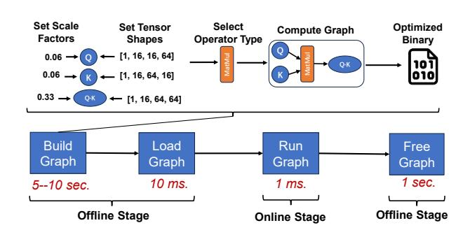

**Figure 1.** The workflow of static compute graph of mobile NPUs. The latency is acquired on QNN SDK [6] by a basic matrix multiplication operation.

<span id="page-2-0"></span>

| Dataset        | PhoneLM<br>-0.5B |      | PhoneLM<br>-1.5B |      | Qwen2<br>-0.5B |      | Qwen2<br>-1.5B |      |
|----------------|------------------|------|------------------|------|----------------|------|----------------|------|
|                | C/G              | N    | C/G              | N    | C/G            | N    | C/G            | N    |
| ArxivSum [18]  | 14.7             | 0.0  | 11.9             | 0.0  | 10.7           | 9.4  | 8.5            | 9.1  |
| DroidCall [61] | 27.5             | 20.5 | 20.5             | 19.0 | 34.5           | 27.5 | 48.0           | 22.5 |
| Octopus [17]   | 64.6             | 24.1 | 79.2             | 24.7 | 60.6           | 34.8 | 61.2           | 34.2 |

**Table 3.** Accuracy on mobile LLMs and tasks. "C/G" means running attention on CPU/GPU in float32; "N" means running attention on NPU in INT8.

or GPU. For instance, although llm.npu offloads its nonattention parts to NPU, the attention operation still runs on CPU; HeteroLLM also employs such an NPU-CPU/GPU collaborated paradigm. The CPU-based framework llama.cpp and GPU-based framework mlc-llm also show this property. This is mainly because that the attention is unfriendly to mobile NPUs. The attention compute involves multiple activations (i.e., the non-weight tensors in a neuron network), which are hard to quantize [29, 58]. Further, the static graph limits the quantization on NPUs to per-tensor static quantization. Such a quantization method is very coarse-grained. It shares a fixed scale factor across an entire tensor, preventing the NPU from adopting fine-grained methods such as K-quant [21] or AWQ [29]. Table 3 shows that offloading the attention operation to mobile NPUs leads to significant accuracy degradation. For instance, PhoneLM-0.5B shows a 14.7 pp accuracy drop and a 7 pp accuracy drop on Arxiv-Sum dataset and DriodCall dataset, respectively. On three datasets and four models, the NPU-based attention exhibits an average drop of 18 pp.

The reliance on CPU/GPU fallback for high accuracy makes the on-device inference not NPU-centric. It fails to leverage the high-throughput compute capability and low energy consumption of mobile NPUs. Even worse, it leads to severe resource contention between other mobile apps co-located on CPU/GPU.

<span id="page-3-0"></span>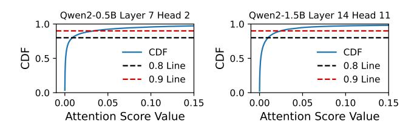

**Figure 2.** The attention score skewness of LLMs. Profiled on 128 samples from WikiText-2.

<span id="page-3-1"></span>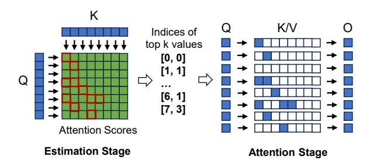

Figure 3. The workflow of sparse attention.

#### 2.2 Sparse Attention

The opportunity of minimizing the reliance on CPU/GPU is the highly sparse characteristic of attention operation.

The attention can be highly sparse. We observe that only a small fraction of tokens in the attention mechanism are truly important. We evaluate 128 randomly sampled data points from the WikiText-2 corpus [35], analyzing two randomly selected attention heads from Qwen2-0.5B and Qwen2-1.5B. The results are shown in Figure 2. For Qwen2-0.5B, more than 80% attention scores fall below 0.01; over 90% attention scores fall below 0.03. A similar trend is observed in Qwen2-1.5B. These near-zero values contribute negligibly to the attention output and, therefore, need not be computed. In other words, the reliance of attention on CPU/GPU computation can be substantially reduced.

The workflow of sparse attention. Figure 3 shows the general workflow of a sparse attention. This workflow is flexible enough to encompass various empirical sparsity patterns—such as sliding windows or vertical-slash patterns [23–25], and can also handle sparsity without obvious structural patterns. It consists of two stages: (1) *Estimation stage*. An attention score matrix is calculated by *attentionScores* =  $softmax(mask(\frac{Q \cdot K}{\sqrt{d_k}}))$ , with all tokens in Q and K involved. After that, top k values out of the attention scores are selected, with their indices transferred to the next stage. (2) *Attention stage*. Only the tokens that are retained by the indices from the estimation stage is involved in the sparse compute of  $O = softmax(mask(\frac{Q \cdot K}{\sqrt{d_k}})) \cdot V$ .

**Bottleneck: the estimation stage.** Despite the potential advantages of sparse attention, directly applying it in LLM inference provides little performance benefit. As shown in

<span id="page-3-2"></span>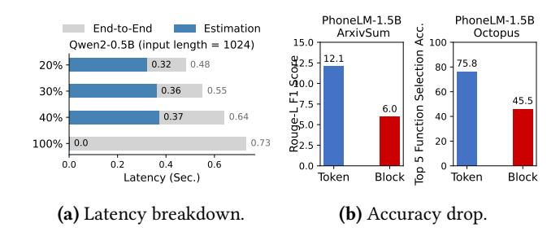

**Figure 4.** (a): The breakdown latency of an attention kernel that runs on a CPU mid core of snapdragon 8egn3 SoC. (b): The accuracy drop when grouping 64 tokens as a block for estimation on mobile LLMs and tasks.

Figure 4a, given a sparsity ratio of 40%/30%/20%, the endto-end latency of an attention kernel only speeds up by 12.4%/24.7%/34.3%. This is because, unlike the attention stage that computes only the important tokens, the estimation stage requires processing all tokens, dominating the overall computation when the attention is extremely sparse. For instance, in a kernel with 20% sparsity (80% tokens are discarded), 66.7% out of the end-to-end computation is attributed to the estimation. An intuitive approach is to group the adjacent tokens in Q and K into a block before the estimation, and use the attention score of the entire block to represent the importance of each token in this block, i.e., block sparse attention [69], reducing the estimation overhead. However, the block sparse attention degrades the accuracy of mobile LLMs significantly, as it overlooks some important tokens due to its coarse-grained estimation. For instance, in Figure 4b, PhoneLM-1.5B shows a 6.1 pp accuracy drop on ArxivSum dataset. In a nut shell, shadowAttn must carefully design the estimation stage to ensure high accuracy while keeping latency low.

#### <span id="page-3-4"></span>3 The Design

#### <span id="page-3-3"></span>3.1 Overview

**Design Goal.** shadowAttn is a system–algorithm co-designed, NPU-centric LLM inference framework tailored for mobile SoCs. Its goal is to execute attention both accurately and efficiently, while minimizing reliance on general-purpose processors such as CPUs and GPUs.

**Workflow of shadowAttn.** Figure 5 shows the workflow of shadowAttn that consists the following parts.

• The offline stage. shadowAttn performs several kinds of lightweight profiling on general corpora (by default 128 samples from WikiText-2). Firstly, shadowAttn determines a sparse ratio for each separated head based on its importance and global sparsity ratio (configured by system). Then, shadowAttn generates multiple static graphs and organizes them in buckets for online inference. Besides, it also profiles the on-device execution overhead of key operators on the

<span id="page-4-0"></span>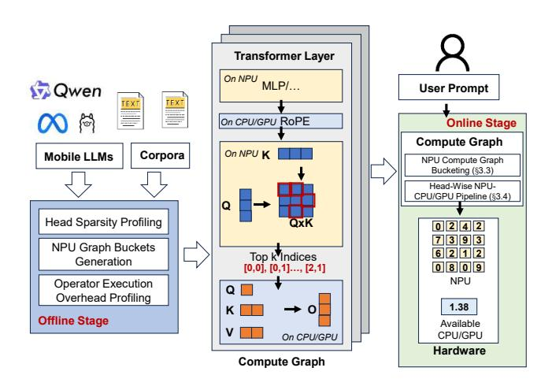

Figure 5. The workflow of shadowAttn.

<span id="page-4-2"></span>

| Models       | Various global sparse ratios |             |        |        |        |  |  |
|--------------|------------------------------|-------------|--------|--------|--------|--|--|
| Models       | 20%                          | 20% 30% 40% |        | 50%    | 80%    |  |  |
| PhoneLM-0.5B | 99.32%                       | 99.39%      | 99.45% | 99.51% | 99.79% |  |  |
| PhoneLM-1.5B | 99.24%                       | 99.27%      | 99.29% | 99.34% | 99.61% |  |  |
| Qwen2-0.5B   | 99.03%                       | 99.32%      | 99.51% | 99.59% | 99.86% |  |  |
| Qwen2-1.5B   | 99.68%                       | 99.80%      | 99.83% | 99.84% | 99.95% |  |  |

**Table 4.** Predicting the important positions in the Q·K via NPU. Data: 128 samples from WikiText-2. We report the average recall rate of all heads with the float QxK as ground truth. The rate is surprisingly high under various global sparse ratios.

SoC with OS-configured available CPU/GPU resource for pipeline planning. This stage is mainly performed on cloud servers before installing the model to mobile devices, with negligible time and resource overhead (e.g., < 1 cloud GPU hours for each model).

- The NPU-centric compute graph. shadowAttn generates a sparse attention module. This module can be further integrated into the on-device inference frameworks as an end-to-end NPU-centric compute graph. As shown in Figure 5, the operators excluding the attention run on NPU by the inference framework. For the attention module, the RoPE is run on CPU/GPU, and the estimation of Q·K is run on NPU in INT8. After getting the top k positions, the CPU/GPU runs the fragmented QKV sparsely to get the output O. The compute and data movement outside the NPU is minimized.
- The online stage. The compute graph takes the user's prompt text as the input, and executes each part on the CPU/GPU/NPU of mobile SoC. During inference, two optimizations are further introduced, i.e., NPU compute graph bucketing (§3.3) and Head-wise NPU-CPU/GPU pipeline (§3.4).

<span id="page-4-1"></span>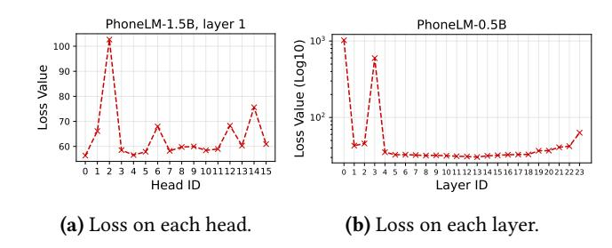

**Figure 6.** The importance is uneven across heads and layers.(a): Removing the heads in layer 1 of PhoneLM-0.5B; (b) removing the layers of PhoneLM-0.5B. The data is on 128 samples of WikiText-2. Loss values over 1e-3 are clamped to 1e-3. The y-axis of subfigure (b) is processed by log10.

#### 3.2 Dynamic Sparse Attention of shadowAttn

**Head-specific sparse ratio.** One of shadowAttn's insight is that the sparse ratio of attention should be head-specific.

According to the progress of eXplainable AI (XAI) [36], the importance of a certain module of a neuron network can be measured by the delta loss after removing it. For instance, on a calibration dataset C, the importance of head i in layer j can be measured as

$$headImp_i = loss(head_i = 0, C) - loss(C),$$
 (1)

and the layer j where the head is located can be measured by

$$layerImp_{j} = loss(layer_{j} = 0, C) - loss(C).$$
 (2)

In Figure 6, we show the importance of head i and layer j. We remove the heads in the first layer in Figure 6(a), and show the loss after removal. The results exhibit obvious unevenness. For instance, the head 2 makes the loss value increase to over 100, yet the head 8 only makes the loss value increase to less than 60. Such an observation can also be found in Figure 6(b), which depicts the layer-level loss. The rationale behind the unevenness is mainly that various parts of a neuron network may learn various aspects of the data [15, 20, 24], especially in compact mobile LLMs.

In summary, for different heads in different layers, the sparsity ratio should also be uneven. An important head should retain more tokens, while a trivial head should retain less. Given a global average sparsity ratio r and the number N of all heads in a model, the sparsity ratio of  $head_i$  is

$$\frac{r \cdot N \cdot clamp(headImp_i \cdot layerImp_j)}{sum(clamp(headImp_i \cdot layerImp_j))}, 1 \le i \le N, \quad (3)$$

where  $clamp(\cdot)$  means clamping extremely large points (e.g., over 1e-3) and j = i/headNumPerLayer. In doing so, the intrinsic feature of attention heads is fully explored.

The sparse ratio of each head is determined at offline stage and stays fixed during online stage, incurring no overhead for inference. The default calibration dataset is 128 samples from WikiText-2. The offline profiling only takes about 5

<span id="page-5-2"></span>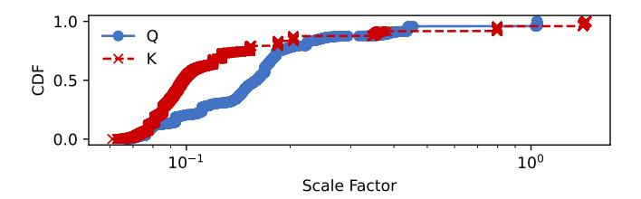

**Figure 7.** The CDF of each head's scale factors of Q/K. Model: Qwen2-0.5B; data: 128 samples from WikiText-2. The x axis is logged by 10.

minutes for a mobile LLM on a cloud server with a single A100 GPU, being affordable for most developers.

Running estimation on NPU. Another key insight of shadowAttn is that the estimation can be offloaded to lowprecision NPU. shadowAttn's observation is that only determining the important positions in Q·K is less prone to quantization compared to calculating the exact value of the QKV result. For instance, Table 4 shows the average recall rate of predicting the important positions in the Q·K via NPU's INT8 per-tensor quantization. Surprisingly, the rate is more than 99% for various models and global sparsity ratios. This stands in stark contrast to the significant accuracy drop observed (e.g., 40.5% on Octopus, PhoneLM-0.5B) when using NPU to compute QKV. The rationale behind it is not hard to comprehend. The computation of QKV results requires precise "value equality", whereas identifying the positions of larger elements in Q·K allows the computational results to fluctuate within a certain range. For example, the latter accepts both a  $Q \cdot K = \{0.4, 0.3, 0.2, 0.1\}$  and a quantized  $Q \cdot K = \{0.5, 0.4, 0.08, 0.02\}$ , while the former only accepts the non-quantized Q·K.

On top of this, shadowAttn's workflow of estimation stage is as follows. Firstly, it quantizes the Q and K tensor and runs dense INT8 Q·K on NPU. Then, the Q·K result is transferred to CPU/GPU to find the top k values. Finally, the CPU/GPU computes the sparse QKV according to the positions of the top k values. A detail here is that shadowAttn does not further compute the masked attention score based on Q·K. Since the softmax operation is strictly monotonically increasing, we can directly use the Q·K that before softmax for top k. Also, the causal mask is not applied to Q·K. Instead shadowAttn straightforwardly skips the masked positions for the top k operation. The skip is very convenient on CPU/GPU.

#### <span id="page-5-0"></span>3.3 NPU Compute Graph Bucketing

The fluctuation of scale factors. As shown in Figure 7, we show the scale factors of each head in Q tensor and K tensor for NPU-based estimation stage, with a per-tensor (per-head) linear quantization of INT8. The data samples are the same to the aforementioned. The results show that the value of the scale factor varies significantly for each head in both Q


**Figure 8.** Bucketing the graphs to handle varying inputs.

and K. For instance, over 30% scale factors in Q tensor are larger than 0.2; in comparison, 20% scale factors are smaller than 0.1. Recall that to maximize the runtime efficiency, the software stack of NPU requires offline compiling a static compute graph that with fixed constant and shape. If we apply a single graph to all inputs, the accuracy will drop significantly since there is no one-size-fits-all scale factor as the graph constant.

Our solution: bucketing the graphs. shadowAttn offline generates multiple graphs and cache them in buckets for online usage. Specifically, as shown in Figure 14, we denote  $\lambda^Q/\lambda^K$  as the scale factor of Q/K, and  $\lambda=<\lambda^Q$ ,  $\lambda^K>$  as the constant of a QxK compute graph.

At offline stage, we profile the average  $\bar{\lambda}$  on the calibration corpora, and generate  $\{<\bar{\lambda}^Q,\bar{\lambda}^K>,<\bar{\lambda}^Q\cdot\sigma,\bar{\lambda}^K/\sigma>,\cdots,<\bar{\lambda}^Q\cdot\sigma,\bar{\lambda}^K\cdot\sigma>\}$  buckets, where  $\sigma$  is the step size (by default 5e-1, detailed later in §5.2). Notably, a bucket contains multiple graphs with various shapes due to the NPU kernel fused launch (detailed in §3.4). The memory overhead of caching the graphs is negligible. Since a QxK graph does not contain any weight, a graph only takes about 10–100 KB.

At online stage, in Figure 14, given a pair of input tensors Q and K, we first calculate the MSE of  $<\lambda^Q,\lambda^K>$  to each bucket's  $\lambda$ . Then, the input falls into the bucket with the smallest MSE. Finally, a compute graph with the corresponding shape is selected out for the following inference. In doing so, the accuracy of NPU estimation is guaranteed. The configuration details of bucketing the graphs are discussed in §5.

#### <span id="page-5-1"></span>3.4 Head-Wise NPU-CPU/GPU Pipeline

Consider the execution of shadowAttn's dynamic sparse attention. Figure 9 shows a minimal illustration with two heads. In each head, we need to first estimate the attention scores (i.e., the blue section), then select top k positions (i.e., the orange section), and finally do sparse QKV operations. Formally, if we use  $\zeta^i_{npu}$ ,  $\zeta^i_{topk}$ , and  $\zeta^i_{qkv}$  to represent executing the corresponding section of the  $i_{th}$  of n heads, the

<span id="page-5-3"></span><sup>&</sup>lt;sup>1</sup>The "shape" here mainly refers to the head dimension. On mobile devices, there is almost no batched input, and the sequence dimension is also fixed thanks to the chunked inference feature in modern on-device Transformer inference frameworks [63].

<span id="page-6-0"></span>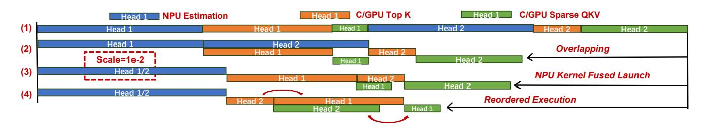

Figure 9. An illustration of NPU-CPU/GPU pipeline.

<span id="page-6-1"></span>execution obeys

$$\zeta_{npu}^{i} \leftarrow \zeta_{topk}^{i}; \quad \zeta_{npu}^{i}, \zeta_{topk}^{i} \leftarrow \zeta_{qkv}^{i}, \forall i \in n,$$
 (4)

where "←" means the dependency.

The naive way is running each operation sequentially (Figure 9(1)). However, this ignores several key optimizations in this procedure. shadowAttn further introduces the following insights.

Overlapping. Both  $\zeta^i_{npu}$  and  $\zeta^i_{qkv}$  operations are compute-bound, and the  $\zeta^i_{topk}$  is relatively memory-bound. Furthermore,  $\zeta^i_{npu}$  and  $\zeta^i_{qkv}$  run on separate processors (NPU and CPU/GPU, respectively). Thus, according to Formula 4, if  $\zeta^i_{npu}$   $\zeta^j_{topk}$  and  $\zeta^k_{qkv}$  have no dependency, then they can be executed in parallel. As shown in Figure 9(2), after overlapping these operations by a three-stage pipeline, the end-to-end latency can be reduced.

NPU kernel fused launch. The NPU is designed for high-throughput dense operations. A vanilla method of launching a single head for execution causes under-utilization of the IDU. For instance, the QxK compute graph of Q=[1,1,128,64] and K=[1,1,2048,64] (layouted in BHSD) takes 2ms on MI14; a graph that fuses 2 heads or 4 heads together only takes 3 ms or 4ms, respectively. On the other hand, since the number of scale factor buckets is finite (in fact a few buckets are enough, as detailed in §5.2), there exist many heads share the same scale factor. Thus, such heads can be fused together in a launch. As shown in Figure 9(3), head 1 and head 2 have the same scale factor. After fusing, the pipeline latency is further reduced.

**Reordered execution.** There exist bubbles in the pipeline due to the dependency in Formula 4. Since each head has its own sparsity ratio, the execution order of the heads influences the bubbles. A good order can squeeze out more bubbles. As shown in Figure 9(4), executing head 2 before head 1 further achieves latency reduction.

The pipeline planning policy. shadowAttn's pipeline puts the above optimizations together. Yet, solving the planning of such a pipeline has O(n!) time complexity, which is NP-hard and unacceptable on mobile devices. To this end, shadowAttn employs a greedy search with polynomial complexity in Algorithm 1. Basically, we first do fused launch at the beginning of planning (line 15). Then, for each planning step, we select

## <span id="page-6-2"></span>Algorithm 1 The pipeline planning policy.

```
Input: heads_{c/qpu}: each head of the attention. Output: res_{npu},
        res_{c/qpu}: the execution order. t_{qkv}: the total execution time.
    C/GPUPlan(t_{npu}, t_{topk}, t_{qkv}, fusedHeads)
 3:
       for head in fusedHeads
          t_{min} = INF, selectedHead = -1
 4:
 5:
          for head in fusedHeads
 6:
             if head in res then continue
             t_{topk}^{new} = \max(t_{npu}, t_{topk}) + \text{topk time of } head
 7:
                   v = \max(t_{qkv}, t_{topk}^{new}) + \text{qkv time of } head
 8:
             if t_{akv}^{new} < t_{min} then t_{min} = t_{qkv}^{new}, selectedHead = head
 9:
10:
          res.append(selectedHead)
          t_{topk} = \max(t_{npu}, t_{topk}) + \text{topk time of } selectedHead
12:
          t_{qkv} = \max(t_{qkv}, \, t_{topk}) + \text{qkv time of } selectedHead
13:
       return res, t_{topk}, t_{qkv}
14: Plan(heads_{c/gpu})
15:
       heads_{npu} \leftarrow heads_{c/gpu}
                                                                    ▶ fuse the heads
       t_{npu}=0,\,t_{topk}=0,\,t_{qkv}=0,\,res_{npu}=[],\,res_{c/gpu}=[]
16:
       for fusedHeads in heads_{npu}
17:
                                                                  ▶ a planning step
18:
          t_{min} = INF, selectedHeads = None, res = []
          for fusedHeads in heads_{npu}
19:
                                                                    ▶ greedy search
             if fusedHeads in resnpu then continue
20:
21:
             t_{npu}^{new} = t_{npu} + \text{npu time of } fusedHeads
             res, t_{topk}^{new}, t_{qkv}^{new} = C/GPUPlan(t_{npu}^{new}, t_{topk}, t_{qkv}, fusedHeads)
22:
             if t_{qkv}^{new} < t_{min} then
23:
                t_{min}^{n} = t_{akv}^{new}, selectedHeads = fusedHeads
24:
25:
          res_{npu}.append(selectedHeads), res_{fsu} += res
          t_{npu} = t_{npu} + \text{npu time of } selected Heads
26:
27:
          _, t_{topk}, t_{qkv} = C/GPUPlan(t_{npu}, t_{topk}, t_{qkv}, selectedHeads)
28:
       return res_{npu}, res_{c/qpu}, t_{qkv}
```

the  $\zeta_{npu}^i$ ,  $\zeta_{topk}^i$  and  $\zeta_{qkv}^i$  that minimize the current pipeline latency. The overhead of  $\zeta_{npu}^i$ ,  $\zeta_{topk}^i$  and  $\zeta_{qkv}^i$  is obtained in the lightweight offline stage mentioned in §3.1. Such a pipeline planning policy incurs negligible online overhead on mobile devices (e.g. < 1 ms on MI14).

## <span id="page-6-3"></span>4 Implementation

We prototype shadowAttn with 10,000 LoC in C++/python. We choose COTS smartphones with Qualcomm SoCs as the testbed, and shadowAttn can also work on other mainstream mobile devices. We only apply a middle core of ARM CPU as the minimal available CPU/GPU resource. We vary the available resource in the following experiments in §5.2. The NPU's software stack is built upon QNN [6] and Hexagon

<span id="page-7-1"></span>

| Model             | Q Heads | KV Heads | Dims | Layers |
|-------------------|---------|----------|------|--------|
| PhoneLM-0.5B [42] | 16      | 16       | 64   | 24     |
| PhoneLM-1.5B [43] | 16      | 16       | 160  | 19     |
| Qwen2-0.5B [45]   | 14      | 2        | 64   | 24     |
| Qwen2-1.5B [46]   | 12      | 2        | 128  | 28     |

Table 5. Models we use in our experiments.

SDK [\[2\]](#page-11-19) of Snapdragon NPU. The CPU/GPU's software stack consists of ARM NEON [\[1\]](#page-11-20), OpenCL [\[5\]](#page-11-21) and LLVM ecosystem [\[3\]](#page-11-22), preserving the most runtime flexibility like dynamic graph execution. We fuse several operations, such as RoPE [\[50\]](#page-12-17), quantization, matmul and softmax together in the kernel to minimize the redundant memory copy. Some non-sensitive instructions like multiplication inside them are further executed in half precision.

shadowAttn is compatible with any on-device LLM inference library. It can be integrated by directly including a header file, being least intrusive to the original codebase. In the following end-to-end experiments, we choose a high performance framework llm.npu [\[63\]](#page-13-1), whose non-attention parts can run on NPU. To the best of our knowledge, this is the only fully open-source framework running on NPUs. Specifically, we replace the attention operator with shadowAttn and its baselines for prefilling stage, and directly employ full attention on CPU/GPU for decoding since this stage is mainly memory-bound.

## <span id="page-7-0"></span>5 Evaluation

Devices. We mainly perform the experiments on MI14 [\[60\]](#page-12-18) and Redmi K60 Champion Edition [\[47\]](#page-12-19). MI14 is equipped with Qualcomm 8Gen3 SoC and 16+6GB DRAM; Redmi K60 Champion Edition has 8Gen2 and 16+3GB DRAM. The available NPU and CPU/GPU resources are Hexagon-V75/V73 and a mid-core Cortex-A720/A715 processor, respectively. Models. We mainly test shadowAttn on mobile LLMs. (1) Qwen2-0.5B/1.5B [\[45,](#page-12-15) [46\]](#page-12-16); (2) PhoneLM-0.5B/1.5B [\[42,](#page-12-13) [43\]](#page-12-14). The details are listed in Table [5.](#page-7-1) The model weights are quantized by third-party frameworks in the following end-to-end experiments.

Datasets. We test shadowAttn on the following datasets.

- (1) ArxivSum [\[18\]](#page-11-13) is a general natural language comprehension task. We report the Rouge-L F1 score.
- (2) DroidCall [\[61\]](#page-12-1) is an LLM agent task on mobile GUI automation. We report the top 5 single step complete accuracy.
- (3) Octopus [\[17\]](#page-11-2) is an LLM agent task on mobile system API function calling. We report the top 5 function selection accuracy.

Each test data is augmented by in-context learning with 5 samples.

Baselines. We compare shadowAttn to the following design alternatives, with fully available NPU and highly limited CPU/GPU resource, i.e., one middle core of CPU.

- (1) Full Attention on CPU/GPU (C/G-Full) runs float32 full atention on CPU/GPU, a default setting of mainstream on-device inference frameworks, such as llm.npu [\[63\]](#page-13-1), mlcllm [\[37\]](#page-12-5) and HeteroLLM [\[16\]](#page-11-3).
- (2) Sparse Attention on CPU/GPU (C/G-Sparse) runs float32 dynamic sparse attention on CPU/GPU, including the dense estimation procedure. This is a vanilla setting of fine-grained dynamic sparse attention [\[56,](#page-12-7) [79\]](#page-13-4).
- (3) Block Sparse Attention on CPU/GPU (C/G-Block-Sparse) runs float32 dynamic sparse attention with a 64x64 block size, which is a common setting in previous literature [\[69\]](#page-13-5).
- (4) Full Attention on NPU (NPU-Full) runs INT8 full attention on NPU, with static graph and per-tensor quantization [\[67\]](#page-13-6).

Settings. In the following experiments, we set global sparsity ratio as 20%, and the number of scale buckets as 9 (step size 5e-1). The rationale of selecting them is detailed in §[5.2.](#page-9-1) The default available CPU/GPU resource for LLM inference is set to one mid core of CPU.

#### 5.1 End-to-End Performance

**shadowAttn** is accurate. We first report shadowAttn's accuracy on the aforementioned datasets and models against its baselines. As shown in Table [6,](#page-8-0) shadowAttn is the most accurate alternative compared to the lossless baseline C/G-Full, with only 0.4 pp. This is due to shadowAttn's well-designed dynamic sparsity, specifically the fine-grained token-level estimation and head-specific sparsity. Other baselines show significant accuracy loss compared to C/G-Full, with 7.4/11.4/18 pp. The reasons are many fold. The basic reason is that sparsity introduces more noise into the model, especially for compact mobile LLMs and datasets with high information density. For C/G-Block-Sparse, the blocked sparsity makes the model more easier to ignore important tokens. For NPU-Full, the limitations of static graphs and per-tensor quantization result in inaccuracy, particularly for the attention operator, where inputs are activations with high fluctuation. **shadowAttn** is fast. As shown in Figure [10,](#page-8-1) we first report the latency of the attention kernel on MI14. We test the kernel with various input length, i.e., 1024/2048/4096. The values of the input tensors are randomized, and the sparisty ratio of each head is set to global ratio. We have the following observations. Compared to the lossless baseline C/G-Full, shadowAttn is up to 6.9× and on average 3.5× faster. Compared to the lossy baselines, shadowAttn is up to 4.0× faster. Note that according to Table [6,](#page-8-0) employing these baselines for inference will result in significant accuracy loss.

We further report the end-to-end latency with integrating shadowAttn and its baselines into third-party frameworks. By doing so, we can realize NPU-centric inference. The details are mentioned in §[4.](#page-6-3) We perform the experiments on three datasets, whose input sequence dominates the inference (3840/4096/1792 for prefill and 50/10/10 for decode, respectively). This is the most common workload pattern

<span id="page-8-1"></span>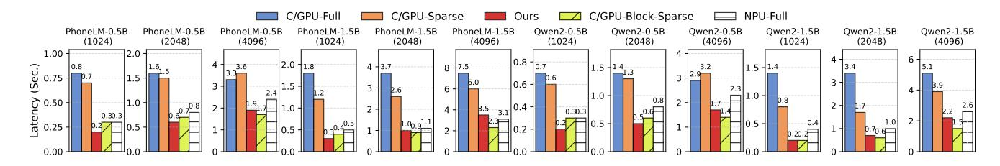

**Figure 10.** With the same circumstance of highly limited CPU/GPU resources, shadowAttn can achieve much lower attention kernel latency compared to other baselines on MI14.

<span id="page-8-2"></span>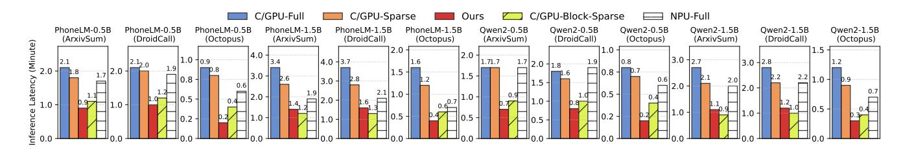

**Figure 11.** With the same circumstance of highly limited CPU/GPU resources, shadowAttn can achieve much lower end-to-end average inference latency on datasets of real-world mobile tasks compared to other baselines on MI14.

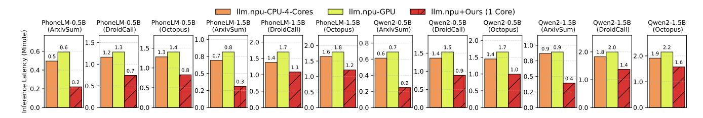

**Figure 12.** Compared to the native attention in SoTA NPU inference framework that shows high reliance on CPU/GPU, shadowAttn achieves on-par or lower latency with significantly fewer CPU/GPU resources. Device: MI14.

<span id="page-8-0"></span>

| Model            | Dataset   | C/G-<br>Full | C/G-<br>Sparse | C/G-Block<br>-Sparse | NPU-<br>Full | Ours |
|------------------|-----------|--------------|----------------|----------------------|--------------|------|
| DI 114           | ArxivSum  | 14.7         | 14.9           | 10.0                 | 0.0          | 15.2 |
| PhoneLM<br>-0.5B | DroidCall | 27.5         | 24.0           | 25.5                 | 20.5         | 25.5 |
| -0.3D            | Octopus   | 64.6         | 71.3           | 62.9                 | 24.1         | 64.0 |
| PhoneLM<br>-1.5B | ArxivSum  | 11.9         | 12.1           | 6.0                  | 0.0          | 12.0 |
|                  | DroidCall | 20.5         | 23.5           | 28.5                 | 19.0         | 25.5 |
|                  | Octopus   | 79.2         | 75.8           | 45.5                 | 24.7         | 75.8 |
| Qwen2<br>-0.5B   | ArxivSum  | 10.7         | 11.4           | 10.8                 | 9.4          | 11.3 |
|                  | DroidCall | 34.5         | 34.5           | 26.0                 | 27.5         | 37.5 |
|                  | Octopus   | 60.6         | 42.1           | 37.6                 | 34.8         | 61.2 |
| Qwen2<br>-1.5B   | ArxivSum  | 8.5          | 2.0            | 4.2                  | 9.1          | 8.4  |
|                  | DroidCall | 48.0         | 19.0           | 15.5                 | 22.5         | 44.5 |
|                  | Octopus   | 61.2         | 21.9           | 32.0                 | 34.2         | 56.1 |
| Average          |           | 36.8         | 29.4           | 25.4                 | 18.8         | 36.4 |

Table 6. The accuracy on various datasets and models.

on mobile devices. The results are shown in Figure 11. Compared to the lossless baseline C/G-Full, shadowAttn is up

to 4.5× and on average 2.9× faster. Compared to the lossy baselines, shadowAttn is up to 4.0× faster.

We briefly discuss the rationales behind the experimental results. For C/G-Sparse, although it enjoys a 20% sparsity, the speedup is relatively low compared to C/G-Full. This is due to the overhead of estimating the to-be-sparsified positions and the top-k operation. For C/G-Block-Sparse, the speedup is higher. This is due to the estimation overhead is lowered by pre-pooling the Q and K input tensors. For NPU-Full, although NPU has high throughput on matrix multiplication, the speedup is somewhat reduced by operations such as softmax and masking. In comparison, shadowAttn achieves the highest speedup. This is because that it minimizes the estimation overhead by offloading the estimation to NPU and overlapping NPU and CPU/GPU execution.

Besides, shadowAttn achieves on-par or even lower performance compared to SoTA NPU framework llm.npu's native attention. llm.npu supports two types of attentions, i.e., full attention on 4 CPU cores (1 prime core and 3 middle cores)

<span id="page-9-2"></span>

| ArxivSum |          | Octo     | pus      | DroidCall |          |  |
|----------|----------|----------|----------|-----------|----------|--|
| C/G-Full | Ours     | C/G-Full | Ours     | C/G-Full  | Ours     |  |
| 1.2 Min. | 0.6 Min. | 2.5 Min. | 2.0 Min. | 2.7 Min.  | 2.2 Min. |  |

**Table 7.** Running shadowAttn on Redmi K60 Champion Edition (Snapdragon 8Gen2). Model: PhoneLM-0.5B.

<span id="page-9-5"></span>

| Model<br>(Single Kernel) | C/G-<br>Full | C/G-<br>Sparse | C/G-Block-<br>Sparse | NPU-<br>Full | Ours   |
|--------------------------|--------------|----------------|----------------------|--------------|--------|
| PhoneLM-0.5B             | 3.72 J       | 2.81 J         | 1.10 J               | 0.85 J       | 0.66 J |
| PhoneLM-1.5B             | 8.59 J       | 5.16 J         | 1.51 J               | 1.29 J       | 1.12 J |
| Qwen2-0.5B               | 3.38 J       | 2.35 J         | 0.88 J               | 0.85 J       | 0.56 J |
| Qwen2-1.5B               | 5.29 J       | 3.28 J         | 0.85 J               | 1.10 J       | 0.71 J |

**Table 8.** Energy consumption of an attention kernel. Device: Redmi K60 Champion Edition; Input length: 1024.

<span id="page-9-6"></span>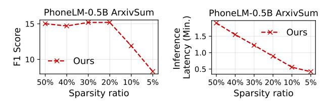

(a) Sparsity ratio v.s. accuracy. (b) Sparsity ratio v.s. latency.

Figure 13. Sensitivity analysis of global sparsity ratio.

and full attention on GPU. shadowAttn achieves up to  $3.0 \times$  lower latency with *only one middle CPU core*.

shadowAttn can work well on various devices. We further show the effectiveness of shadowAttn on other devices. In Table 7, we show the inference latency of PhoneLM-0.5B on Redmi K60 Champion Edition. shadowAttn still shows clear speedup against the baseline (2×/1.25×/1.22×, respectively). The speedup is lower than on MI14. This is mainly due to that the Redmi K60 Champion Edition is equipped with V73 series NPU, which is inferior to the V75 NPU on MI14.

**shadowAttn is energy efficient.** We show the energy consumption of running a single attention kernel with an input length of 1024 on Redmi K60 Champion Edition. The results are obtained from system APIs<sup>23</sup>. As shown in Table 8, shadowAttn exhibits up to 7.66× lower energy consumption. This is primarily due to the reduced computational load and the proper utilization of NPU, which has relatively low power.

<span id="page-9-0"></span>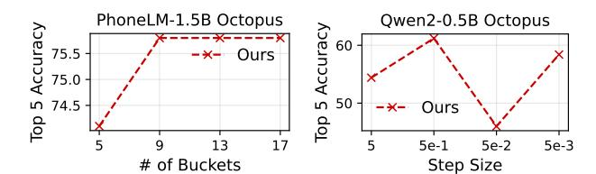

- (a) Sensitivity to bucket number.
- (b) Sensitivity to step size.

Figure 14. Sensitivity analysis of scale factor buckets.

<span id="page-9-7"></span>

**Figure 15.** Varying the available resource of CPU/GPU.

<span id="page-9-8"></span>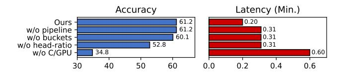

Figure 16. Ablation study on Qwen2-0.5B, MI14, Octopus.

#### <span id="page-9-1"></span>5.2 Sensitivity Analysis and Ablation Study

**Global sparsity ratio.** We show the sensitivity of sparsity ratio in Figure 13. Setting the ratio to 20% is a reasonable choice. A too large ratio (e.g. 30%, 40%, or 50%) reduces less latency; a too small ratio leads to significant accuracy loss. 20% is the minimum sparsity ratio that maintains no accuracy loss, i.e., the knee point. As a result, shadowAttn chooses 20% as its default setting, which also aligns well with the aforementioned analysis in §3.

Scale factor buckets. Recall that we cache subgraphs of various scales on NPU for Q·K. In shadowAttn's default setting, the number of buckets is set to 9 with a step size of 5e-1. More buckets offer a more fine-grained tradeoff space, which leads to higher accuracy (5 buckets to 9 buckets in Figure 14a); yet the number of buckets exhibits a marginal effect that adding more buckets shows almost no performance gain. As a result, typically we choose it as 9. Figure 14b shows why we choose a step size of 5e-1. Factors of other orders of magnitude lead to significant performance degradation. Interestingly, a very tiny step size (5e-3) results in less accuracy drop (yet still significant). This is primarily because that such a choice makes

<span id="page-9-3"></span><sup>&</sup>lt;sup>2</sup>/sys/class/power\_supply/battery/voltage\_now

<span id="page-9-4"></span><sup>&</sup>lt;sup>3</sup>/sys/class/power\_supply/battery/current\_now

<span id="page-10-0"></span>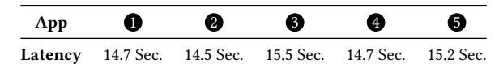

Table 9. Running shadowAttn with other apps. Model: PhoneLM-0.5B; Dataset: Octopus; Device: MI14. 1 : No concurrent apps; 2 : Taking photos; 3 : Watching videos; 4 : Listening to music; 5 : Browsing shopping apps.

all samples fall back into the original bucket, since the scale factors of others are too large or too small. In a nut shell, the default setting of shadowAttn on the buckets is reasonable and leads to the best performance.

The available CPU/GPU. Recall that in our default setting, we set the available CPU/GPU resource to a middle core of ARM CPU. We now vary the available resource in Figure [15](#page-9-7) by mapping it to cores with various compute capability. The experiment is run on MI14, which has 1 prime core, 5 middle cores, and 2 small cores. Firstly, shadowAttn consistently outperforms C/G-Full. Besides, when expanding the compute resource (e.g., small core to middle core to prime core), the absolute inference latency of shadowAttn is also reduced, showing strong scalability. Overall, shadowAttn is a robust solution under various amount of compute resource.

Ablation study. We conduct ablation study by gradually removing the key designs of shadowAttn. The results are shown in Figure [16.](#page-9-8) When the pipeline is removed from shadowAttn, the end-to-end latency exhibits a significant rise. This is because that the pipeline overlaps the latency of NPU and CPU/GPU. On top of this, when we further remove the design of scale factor buckets, the accuracy shows a clear drop (1.2 pp). This is because the buckets allow the NPU to adapt better to the input range. Further, when we make each head share the same global sparsity ratio, the accuracy drops from 60.1 pp to 52.8 pp. The rationale is that the intrinsic importance of each head is ignored. Finally, when we even cancel the design of sparse compute on CPU/GPU and directly offloading the full attention to NPU, the accuracy is lowered to 34.8 pp, and the latency is moved to 0.6 minutes. This is because shadowAttn have to suffer the quantization loss on NPU, and the NPU is not friendly to sparse compute. In conclusion, each part of shadowAttn shows non-trivial contribution to its performance.

Running alongside other mobile apps. We show shadowAttn's superiority by running the LLM inference together with other mobile apps. Specifically, we test the end-to-end inference time when the smartphone user is watching videos (GPU and CPU busy), listening to music (CPU busy), tasking photos (ISP and CPU busy) and browsing shopping apps (CPU busy). We exclude other apps for running on the selected middle core. The results are shown in Table [9.](#page-10-0) The LLM inference can work well with these apps, with no obvious performance degradation.

## 6 Related Work

On-Device LLM Inference. Running mobile LLMs [\[11,](#page-11-23) [26,](#page-11-24) [28,](#page-11-25) [34,](#page-12-20) [51,](#page-12-21) [55,](#page-12-22) [77,](#page-13-7) [78\]](#page-13-8) on devices has become a key area in privacy-preserving mobile intelligence [\[14,](#page-11-26) [27,](#page-11-27) [38,](#page-12-23) [41,](#page-12-24) [49\]](#page-12-25). There exist many popular frameworks. For instance, HeteroLLM [\[16\]](#page-11-3) proposes a GPU/NPU collaborated framework for LLM inference on mobile SoCs. It optimizes the memory copy efficiency. However, the attention and parts of MLP still run on GPU, which can be busy during the usage of mobile devices. Akin to HeteroLLM, llm.npu [\[63\]](#page-13-1) runs attention on CPU/GPU, which cannot realize the NPU-centric inference. PowerinferV2 [\[67\]](#page-13-6) employs dense attention on NPUs, i.e., the NPU-Full baseline. However, compared to shadowAttn, it does not support sparse attention. Even worse, it still suffers from the accuracy drop of attention quantization, especially on mobile-sized LLMs and mobile agent tasks. Its main focus is on extending the RAM of mobile devices to run large-scale LLMs that have stronger resilience to attention quantization. Akin to PowerinferV2, QNN [\[6\]](#page-11-12) also runs full attention on NPU, encountering the same problems. There are also frameworks that run both the attention and non-attention parts on CPU/GPU. For example, MLC-LLM [\[37\]](#page-12-5) and TFLite [\[54\]](#page-12-26) run LLMs on GPUs; Llama.cpp [\[21\]](#page-11-6) runs LLMs on CPUs. By only keeping the sparse compute of important tokens on CPU/GPU, shadowAttn realizes the most accurate and efficient NPU-centric inference.

Efficient Sparse Attention. Fixed-pattern sparse attention [\[23](#page-11-14)[–25,](#page-11-15) [59\]](#page-12-27) identifies one of given patterns offline. Common patterns include sliding window, Λ-shape and verticalslash, etc. Compared to ad-hoc fixed patterns, shadowAttn's dynamic attention is a superset of the above patterns. Block sparse attention [\[53,](#page-12-28) [66,](#page-13-9) [69,](#page-13-5) [75\]](#page-13-10) pre-pools the Q and K, and selects top k areas in coarse-grained block level. As discussed before, such a paradigm is less accurate. Reserving/discarding a whole region may dismiss important tokens. shadowAttn's fine-grained sparse attention is much more accurate. Recently there is also a trend of training native sparse attentions [\[33,](#page-12-29) [74\]](#page-13-11). Such methods make the attention inherently sparse at the inference stage. However, the learned sparsity cannot directly transfer to downstream tasks and fine-tuned models. The resource consumption of pre-training is also not affordable to each developer. In comparison, the sparse attention of shadowAttn is plug-and-play.

Mobile Intelligence. Mobile intelligence runs DNNs especially foundation models on edge/mobile devices for sensing the human/environment or acting with the cyber/physical world [\[13,](#page-11-28) [30,](#page-11-29) [39,](#page-12-30) [62,](#page-12-31) [64,](#page-13-12) [65,](#page-13-13) [68,](#page-13-14) [71](#page-13-15)[–73\]](#page-13-16). With shadowAttn's NPU-centric inference, the execution of foundation models will be more transparent and less intrusive to the human and environment.

# 7 Conclusion

We present shadowAttn, a sparse attention module for NPUcentric on-device LLM inference. It incorporates innovative techniques including NPU-based estimation, NPU compute graph bucketing and NPU-CPU/GPU pipeline. It losslessly achieves up to 4.5× end-to-end speed up while minimizing the reliance on CPU/GPU resources.

# References

- <span id="page-11-20"></span>[1] 2025. ARM NEON. <https://www.arm.com/technologies/neon>.
- <span id="page-11-19"></span>[2] 2025. Hexagon NPU SDK. [https://www.qualcomm.com/developer/](https://www.qualcomm.com/developer/software/hexagon-npu-sdk) [software/hexagon-npu-sdk](https://www.qualcomm.com/developer/software/hexagon-npu-sdk).
- <span id="page-11-22"></span>[3] 2025. LLVM. <https://llvm.org/>.
- <span id="page-11-11"></span>[4] 2025. Nvidia Jetson Orin. [https://www.nvidia.com/en-us/autonomous](https://www.nvidia.com/en-us/autonomous-machines/embedded-systems/jetson-orin/)[machines/embedded-systems/jetson-orin/](https://www.nvidia.com/en-us/autonomous-machines/embedded-systems/jetson-orin/).
- <span id="page-11-21"></span>[5] 2025. Open CL. <https://en.wikipedia.org/wiki/OpenCL>.
- <span id="page-11-12"></span>[6] 2025. QNN SDK. [https://docs.qualcomm.com/bundle/publicresource/](https://docs.qualcomm.com/bundle/publicresource/topics/80-63442-50/introduction.html) [topics/80-63442-50/introduction.html](https://docs.qualcomm.com/bundle/publicresource/topics/80-63442-50/introduction.html).
- <span id="page-11-8"></span>[7] 2025. Qualcomm Neural Processing Engine. [https://docs.qualcomm.](https://docs.qualcomm.com/bundle/publicresource/topics/80-70015-15BY/snpe.html) [com/bundle/publicresource/topics/80-70015-15BY/snpe.html](https://docs.qualcomm.com/bundle/publicresource/topics/80-70015-15BY/snpe.html).
- <span id="page-11-1"></span>[8] 2025. rewind. <https://www.rewind.ai/>.
- <span id="page-11-9"></span>[9] 2025. Snapdragon 8 gen 3 mobile platform product brief. [https://docs.qualcomm.com/bundle/publicresource/87-71408-1\\_](https://docs.qualcomm.com/bundle/publicresource/87-71408-1_REV_C_Snapdragon_8_gen_3_Mobile_Platform_Product_Brief.pdf) [REV\\_C\\_Snapdragon\\_8\\_gen\\_3\\_Mobile\\_Platform\\_Product\\_Brief.pdf](https://docs.qualcomm.com/bundle/publicresource/87-71408-1_REV_C_Snapdragon_8_gen_3_Mobile_Platform_Product_Brief.pdf).
- <span id="page-11-10"></span>[10] 2025. TMS320F2812 platform product brief. [https://www.ti.com/](https://www.ti.com/product/TMS320F2812) [product/TMS320F2812](https://www.ti.com/product/TMS320F2812).
- <span id="page-11-23"></span>[11] Marah Abdin and etc. Jyoti Aneja. 2024. Phi-3 Technical Report: A Highly Capable Language Model Locally on Your Phone. arXiv[:2404.14219](https://arxiv.org/abs/2404.14219) [cs.CL] <https://arxiv.org/abs/2404.14219>
- <span id="page-11-0"></span>[12] Jinze Bai, Shuai Bai, Yunfei Chu, Zeyu Cui, Kai Dang, Xiaodong Deng, Yang Fan, Wenbin Ge, Yu Han, Fei Huang, Binyuan Hui, Luo Ji, Mei Li, Junyang Lin, Runji Lin, Dayiheng Liu, Gao Liu, Chengqiang Lu, Keming Lu, Jianxin Ma, Rui Men, Xingzhang Ren, Xuancheng Ren, Chuanqi Tan, Sinan Tan, Jianhong Tu, Peng Wang, Shijie Wang, Wei Wang, Shengguang Wu, Benfeng Xu, Jin Xu, An Yang, Hao Yang, Jian Yang, Shusheng Yang, Yang Yao, Bowen Yu, Hongyi Yuan, Zheng Yuan, Jianwei Zhang, Xingxuan Zhang, Yichang Zhang, Zhenru Zhang, Chang Zhou, Jingren Zhou, Xiaohuan Zhou, and Tianhang Zhu. 2023. Qwen Technical Report. arXiv[:2309.16609](https://arxiv.org/abs/2309.16609) [cs.CL] [https://arxiv.org/](https://arxiv.org/abs/2309.16609) [abs/2309.16609](https://arxiv.org/abs/2309.16609)
- <span id="page-11-28"></span>[13] Ozan Baris, Yizhuo Chen, Gaofeng Dong, Liying Han, Tomoyoshi Kimura, Pengrui Quan, Ruijie Wang, Tianchen Wang, Tarek Abdelzaher, Mario Bergés, Paul Pu Liang, and Mani Srivastava. 2025. Foundation Models for CPS-IoT: Opportunities and Challenges. arXiv[:2501.16368](https://arxiv.org/abs/2501.16368) [cs.LG] <https://arxiv.org/abs/2501.16368>
- <span id="page-11-26"></span>[14] Peter Belcak, Greg Heinrich, Shizhe Diao, Yonggan Fu, Xin Dong, Saurav Muralidharan, Yingyan Celine Lin, and Pavlo Molchanov. 2025. Small Language Models are the Future of Agentic AI. arXiv[:2506.02153](https://arxiv.org/abs/2506.02153) [cs.AI] <https://arxiv.org/abs/2506.02153>
- <span id="page-11-16"></span>[15] Weilin Cai, Juyong Jiang, Fan Wang, Jing Tang, Sunghun Kim, and Jiayi Huang. 2025. A Survey on Mixture of Experts in Large Language Models. IEEE Transactions on Knowledge and Data Engineering (2025), 1–20. doi:[10.1109/tkde.2025.3554028](https://doi.org/10.1109/tkde.2025.3554028)
- <span id="page-11-3"></span>[16] Le Chen, Dahu Feng, Erhu Feng, Rong Zhao, Yingrui Wang, Yubin Xia, Haibo Chen, and Pinjie Xu. 2025. HeteroLLM: Accelerating Large Language Model Inference on Mobile SoCs platform with Heterogeneous AI Accelerators. arXiv[:2501.14794](https://arxiv.org/abs/2501.14794) [cs.DC] [https:](https://arxiv.org/abs/2501.14794) [//arxiv.org/abs/2501.14794](https://arxiv.org/abs/2501.14794)
- <span id="page-11-2"></span>[17] Wei Chen and Zhiyuan Li. 2024. Octopus v2: On-device language model for super agent. arXiv[:2404.01744](https://arxiv.org/abs/2404.01744) [cs.CL] [https://arxiv.org/abs/](https://arxiv.org/abs/2404.01744) [2404.01744](https://arxiv.org/abs/2404.01744)

- <span id="page-11-13"></span>[18] Arman Cohan, Franck Dernoncourt, Doo Soon Kim, Trung Bui, Seokhwan Kim, Walter Chang, and Nazli Goharian. 2018. A Discourse-Aware Attention Model for Abstractive Summarization of Long Documents. In Proceedings of the 2018 Conference of the North American Chapter of the Association for Computational Linguistics: Human Language Technologies, Volume 2 (Short Papers). Association for Computational Linguistics, New Orleans, Louisiana, 615–621. doi:[10.18653/v1/N18-2097](https://doi.org/10.18653/v1/N18-2097)
- <span id="page-11-4"></span>[19] Ziyan Fu, Ju Ren, Deyu Zhang, Yuezhi Zhou, and Yaoxue Zhang. 2022. Kalmia: A Heterogeneous QoS-aware Scheduling Framework for DNN Tasks on Edge Servers. In IEEE INFOCOM 2022 - IEEE Conference on Computer Communications. 780–789. doi:[10.1109/INFOCOM48880.](https://doi.org/10.1109/INFOCOM48880.2022.9796661) [2022.9796661](https://doi.org/10.1109/INFOCOM48880.2022.9796661)
- <span id="page-11-17"></span>[20] Suyu Ge, Yunan Zhang, Liyuan Liu, Minjia Zhang, Jiawei Han, and Jianfeng Gao. 2024. Model Tells You What to Discard: Adaptive KV Cache Compression for LLMs. arXiv[:2310.01801](https://arxiv.org/abs/2310.01801) [cs.CL] [https://arxiv.](https://arxiv.org/abs/2310.01801) [org/abs/2310.01801](https://arxiv.org/abs/2310.01801)
- <span id="page-11-6"></span>[21] ggml. 2025. llama.cpp. <https://github.com/ggml-org/llama.cpp>
- <span id="page-11-5"></span>[22] Joo Seong Jeong, Jingyu Lee, Donghyun Kim, Changmin Jeon, Changjin Jeong, Youngki Lee, and Byung-Gon Chun. 2022. Band: coordinated multi-DNN inference on heterogeneous mobile processors. In Proceedings of the 20th Annual International Conference on Mobile Systems, Applications and Services (Portland, Oregon) (MobiSys '22). Association for Computing Machinery, New York, NY, USA, 235–247. doi:[10.1145/3498361.3538948](https://doi.org/10.1145/3498361.3538948)
- <span id="page-11-14"></span>[23] Albert Q. Jiang, Alexandre Sablayrolles, Arthur Mensch, Chris Bamford, Devendra Singh Chaplot, Diego de las Casas, Florian Bressand, Gianna Lengyel, Guillaume Lample, Lucile Saulnier, Lélio Renard Lavaud, Marie-Anne Lachaux, Pierre Stock, Teven Le Scao, Thibaut Lavril, Thomas Wang, Timothée Lacroix, and William El Sayed. 2023. Mistral 7B. arXiv[:2310.06825](https://arxiv.org/abs/2310.06825) [cs.CL] <https://arxiv.org/abs/2310.06825>
- <span id="page-11-18"></span>[24] Huiqiang Jiang, Yucheng Li, Chengruidong Zhang, Qianhui Wu, Xufang Luo, Surin Ahn, Zhenhua Han, Amir H. Abdi, Dongsheng Li, Chin-Yew Lin, Yuqing Yang, and Lili Qiu. 2024. MInference 1.0: Accelerating Pre-filling for Long-Context LLMs via Dynamic Sparse Attention. arXiv[:2407.02490](https://arxiv.org/abs/2407.02490) [cs.CL] <https://arxiv.org/abs/2407.02490>
- <span id="page-11-15"></span>[25] Xunhao Lai, Jianqiao Lu, Yao Luo, Yiyuan Ma, and Xun Zhou. 2025. FlexPrefill: A Context-Aware Sparse Attention Mechanism for Efficient Long-Sequence Inference. arXiv[:2502.20766](https://arxiv.org/abs/2502.20766) [cs.LG] [https://arxiv.org/](https://arxiv.org/abs/2502.20766) [abs/2502.20766](https://arxiv.org/abs/2502.20766)
- <span id="page-11-24"></span>[26] Sunjae Lee, Junyoung Choi, Jungjae Lee, Munim Hasan Wasi, Hojun Choi, Steven Y. Ko, Sangeun Oh, and Insik Shin. 2024. Explore, Select, Derive, and Recall: Augmenting LLM with Human-like Memory for Mobile Task Automation. arXiv[:2312.03003](https://arxiv.org/abs/2312.03003) [cs.HC] [https://arxiv.org/](https://arxiv.org/abs/2312.03003) [abs/2312.03003](https://arxiv.org/abs/2312.03003)
- <span id="page-11-27"></span>[27] Liang Li, Xingke Yang, Wen Wu, Hao Wang, Tomoaki Ohtsuki, Xin Fu, Miao Pan, and Xuemin Shen. 2025. MobiLLM: Enabling LLM Fine-Tuning on the Mobile Device via Server Assisted Side Tuning. arXiv[:2502.20421](https://arxiv.org/abs/2502.20421) [cs.LG] <https://arxiv.org/abs/2502.20421>
- <span id="page-11-25"></span>[28] Xiang Li, Zhenyan Lu, Dongqi Cai, Xiao Ma, and Mengwei Xu. 2024. Large Language Models on Mobile Devices: Measurements, Analysis, and Insights. In Proceedings of the Workshop on Edge and Mobile Foundation Models (Minato-ku, Tokyo, Japan) (EdgeFM '24). Association for Computing Machinery, New York, NY, USA, 1–6. doi:[10.1145/3662006.3662059](https://doi.org/10.1145/3662006.3662059)
- <span id="page-11-7"></span>[29] Ji Lin, Jiaming Tang, Haotian Tang, Shang Yang, Wei-Ming Chen, Wei-Chen Wang, Guangxuan Xiao, Xingyu Dang, Chuang Gan, and Song Han. 2024. AWQ: Activation-aware Weight Quantization for LLM Compression and Acceleration. arXiv[:2306.00978](https://arxiv.org/abs/2306.00978) [cs.CL] [https:](https://arxiv.org/abs/2306.00978) [//arxiv.org/abs/2306.00978](https://arxiv.org/abs/2306.00978)
- <span id="page-11-29"></span>[30] Kaiwei Liu, Bufang Yang, Lilin Xu, Yunqi Guo, Guoliang Xing, Xian Shuai, Xiaozhe Ren, Xin Jiang, and Zhenyu Yan. 2025. TaskSense: A Translation-like Approach for Tasking Heterogeneous Sensor Systems with LLMs. Association for Computing Machinery, New York, NY,

- USA, 213–225. <https://doi.org/10.1145/3715014.3722070>
- <span id="page-12-8"></span>[31] Mukul Lokhande, Gopal Raut, and Santosh Kumar Vishvakarma. 2024. Flex-PE: Flexible and SIMD Multi-Precision Processing Element for AI Workloads. arXiv[:2412.11702](https://arxiv.org/abs/2412.11702) [cs.AR] <https://arxiv.org/abs/2412.11702>
- <span id="page-12-9"></span>[32] Mukul Lokhande and Santosh Kumar Vishvakarma. 2025. PO-LARON: Precision-aware On-device Learning and Adaptive RuntimecONfigurable AI acceleration. arXiv[:2506.08785](https://arxiv.org/abs/2506.08785) [cs.AR] [https://arxiv.](https://arxiv.org/abs/2506.08785) [org/abs/2506.08785](https://arxiv.org/abs/2506.08785)
- <span id="page-12-29"></span>[33] Enzhe Lu, Zhejun Jiang, Jingyuan Liu, Yulun Du, Tao Jiang, Chao Hong, Shaowei Liu, Weiran He, Enming Yuan, Yuzhi Wang, Zhiqi Huang, Huan Yuan, Suting Xu, Xinran Xu, Guokun Lai, Yanru Chen, Huabin Zheng, Junjie Yan, Jianlin Su, Yuxin Wu, Neo Y. Zhang, Zhilin Yang, Xinyu Zhou, Mingxing Zhang, and Jiezhong Qiu. 2025. MoBA: Mixture of Block Attention for Long-Context LLMs. arXiv[:2502.13189](https://arxiv.org/abs/2502.13189) [cs.LG] <https://arxiv.org/abs/2502.13189>
- <span id="page-12-20"></span>[34] Shuming Ma, Hongyu Wang, Lingxiao Ma, Lei Wang, Wenhui Wang, Shaohan Huang, Li Dong, Ruiping Wang, Jilong Xue, and Furu Wei. 2024. The Era of 1-bit LLMs: All Large Language Models are in 1.58 Bits. arXiv[:2402.17764](https://arxiv.org/abs/2402.17764) [cs.CL] <https://arxiv.org/abs/2402.17764>
- <span id="page-12-11"></span>[35] Stephen Merity, Caiming Xiong, James Bradbury, and Richard Socher. 2016. Pointer Sentinel Mixture Models. arXiv[:1609.07843](https://arxiv.org/abs/1609.07843) [cs.CL]
- <span id="page-12-12"></span>[36] Melkamu Mersha, Khang Lam, Joseph Wood, Ali K. AlShami, and Jugal Kalita. 2024. Explainable artificial intelligence: A survey of needs, techniques, applications, and future direction. Neurocomputing 599 (Sept. 2024), 128111. doi:[10.1016/j.neucom.2024.128111](https://doi.org/10.1016/j.neucom.2024.128111)
- <span id="page-12-5"></span>[37] MLC team. 2023-2025. MLC-LLM. <https://github.com/mlc-ai/mlc-llm>
- <span id="page-12-23"></span>[38] Mozhgan Navardi, Romina Aalishah, Yuzhe Fu, Yueqian Lin, Hai Li, Yiran Chen, and Tinoosh Mohsenin. 2025. GenAI at the Edge: Comprehensive Survey on Empowering Edge Devices. arXiv[:2502.15816](https://arxiv.org/abs/2502.15816) [cs.DC] <https://arxiv.org/abs/2502.15816>
- <span id="page-12-30"></span>[39] Xiaomin Ouyang, Xian Shuai, Yang Li, Li Pan, Xifan Zhang, Heming Fu, Sitong Cheng, Xinyan Wang, Shihua Cao, Jiang Xin, Hazel Mok, Zhenyu Yan, Doris Sau Fung Yu, Timothy Kwok, and Guoliang Xing. 2024. ADMarker: A Multi-Modal Federated Learning System for Monitoring Digital Biomarkers of Alzheimer's Disease. arXiv[:2310.15301](https://arxiv.org/abs/2310.15301) [cs.LG] <https://arxiv.org/abs/2310.15301>
- <span id="page-12-10"></span>[40] Jun-Seok Park, Changsoo Park, Suknam Kwon, Taeho Jeon, Yesung Kang, Heonsoo Lee, Dongwoo Lee, James Kim, Hyeong-Seok Kim, YoungJong Lee, Sangkyu Park, MinSeong Kim, SangHyuck Ha, Jihoon Bang, Jinpyo Park, SukHwan Lim, and Inyup Kang. 2023. A Multi-Mode 8k-MAC HW-Utilization-Aware Neural Processing Unit With a Unified Multi-Precision Datapath in 4-nm Flagship Mobile SoC. IEEE Journal of Solid-State Circuits 58, 1 (2023), 189–202. doi:[10.1109/JSSC.](https://doi.org/10.1109/JSSC.2022.3205713) [2022.3205713](https://doi.org/10.1109/JSSC.2022.3205713)
- <span id="page-12-24"></span>[41] Dan Peng, Zhihui Fu, and Jun Wang. 2024. PocketLLM: Enabling On-Device Fine-Tuning for Personalized LLMs. arXiv[:2407.01031](https://arxiv.org/abs/2407.01031) [cs.LG] <https://arxiv.org/abs/2407.01031>
- <span id="page-12-13"></span>[42] phonelm. 2025. PhoneLM-0.5B. [https://huggingface.co/unsloth/](https://huggingface.co/unsloth/PhoneLM-0.5B) [PhoneLM-0.5B](https://huggingface.co/unsloth/PhoneLM-0.5B)
- <span id="page-12-14"></span>[43] phonelm. 2025. PhoneLM-1.5B. [https://huggingface.co/unsloth/](https://huggingface.co/unsloth/PhoneLM-1.5B) [PhoneLM-1.5B](https://huggingface.co/unsloth/PhoneLM-1.5B)
- <span id="page-12-0"></span>[44] Qwen, :, An Yang, Baosong Yang, Beichen Zhang, Binyuan Hui, Bo Zheng, Bowen Yu, Chengyuan Li, Dayiheng Liu, Fei Huang, Haoran Wei, Huan Lin, Jian Yang, Jianhong Tu, Jianwei Zhang, Jianxin Yang, Jiaxi Yang, Jingren Zhou, Junyang Lin, Kai Dang, Keming Lu, Keqin Bao, Kexin Yang, Le Yu, Mei Li, Mingfeng Xue, Pei Zhang, Qin Zhu, Rui Men, Runji Lin, Tianhao Li, Tianyi Tang, Tingyu Xia, Xingzhang Ren, Xuancheng Ren, Yang Fan, Yang Su, Yichang Zhang, Yu Wan, Yuqiong Liu, Zeyu Cui, Zhenru Zhang, and Zihan Qiu. 2025. Qwen2.5 Technical Report. arXiv[:2412.15115](https://arxiv.org/abs/2412.15115) [cs.CL] <https://arxiv.org/abs/2412.15115>
- <span id="page-12-15"></span>[45] qwen. 2025. Qwen2-0.5B. <https://huggingface.co/unsloth/Qwen2-0.5B>
- <span id="page-12-16"></span>[46] qwen. 2025. Qwen2-1.5B. <https://huggingface.co/unsloth/Qwen2-1.5B>
- <span id="page-12-19"></span>[47] redmi. 2025. Redmi K60 Champion Edition Smartphone. [https://www.](https://www.gsmarena.com/xiaomi_redmi_k60_pro-12046.php) [gsmarena.com/xiaomi\\_redmi\\_k60\\_pro-12046.php](https://www.gsmarena.com/xiaomi_redmi_k60_pro-12046.php)

- <span id="page-12-2"></span>[48] Tanmoy Sen, Haiying Shen, and Anand Padmanabha Iyer. 2025. Flex: Fast, Accurate DNN Inference on Low-Cost Edges Using Heterogeneous Accelerator Execution. In Proceedings of the Twentieth European Conference on Computer Systems (Rotterdam, Netherlands) (EuroSys '25). Association for Computing Machinery, New York, NY, USA, 507–523. doi:[10.1145/3689031.3696067](https://doi.org/10.1145/3689031.3696067)
- <span id="page-12-25"></span>[49] Andrii Skliar, Ties van Rozendaal, Romain Lepert, Todor Boinovski, Mart van Baalen, Markus Nagel, Paul Whatmough, and Babak Ehteshami Bejnordi. 2025. Mixture of Cache-Conditional Experts for Efficient Mobile Device Inference. arXiv[:2412.00099](https://arxiv.org/abs/2412.00099) [cs.LG] [https:](https://arxiv.org/abs/2412.00099) [//arxiv.org/abs/2412.00099](https://arxiv.org/abs/2412.00099)
- <span id="page-12-17"></span>[50] Jianlin Su, Yu Lu, Shengfeng Pan, Ahmed Murtadha, Bo Wen, and Yunfeng Liu. 2023. RoFormer: Enhanced Transformer with Rotary Position Embedding. arXiv[:2104.09864](https://arxiv.org/abs/2104.09864) [cs.CL] [https://arxiv.org/abs/](https://arxiv.org/abs/2104.09864) [2104.09864](https://arxiv.org/abs/2104.09864)
- <span id="page-12-21"></span>[51] Shreyas Subramanian, Vikram Elango, and Mecit Gungor. 2025. Small Language Models (SLMs) Can Still Pack a Punch: A survey. arXiv[:2501.05465](https://arxiv.org/abs/2501.05465) [cs.CL] <https://arxiv.org/abs/2501.05465>
- <span id="page-12-4"></span>[52] Xin Tan, Yimin Jiang, Yitao Yang, and Hong Xu. 2025. Towards End-to-End Optimization of LLM-based Applications with Ayo. In Proceedings of the 30th ACM International Conference on Architectural Support for Programming Languages and Operating Systems, Volume 2 (Rotterdam, Netherlands) (ASPLOS '25). Association for Computing Machinery, New York, NY, USA, 1302–1316. doi:[10.1145/3676641.3716278](https://doi.org/10.1145/3676641.3716278)
- <span id="page-12-28"></span>[53] Jiaming Tang, Yilong Zhao, Kan Zhu, Guangxuan Xiao, Baris Kasikci, and Song Han. 2024. Quest: Query-Aware Sparsity for Efficient Long-Context LLM Inference. arXiv[:2406.10774](https://arxiv.org/abs/2406.10774) [cs.CL] [https://arxiv.org/](https://arxiv.org/abs/2406.10774) [abs/2406.10774](https://arxiv.org/abs/2406.10774)
- <span id="page-12-26"></span>[54] TFLite team. 2025. mediapipe. [https://ai.google.dev/edge/mediapipe/](https://ai.google.dev/edge/mediapipe/solutions/guide) [solutions/guide](https://ai.google.dev/edge/mediapipe/solutions/guide)
- <span id="page-12-22"></span>[55] Omkar Thawakar, Ashmal Vayani, Salman Khan, Hisham Cholakal, Rao M. Anwer, Michael Felsberg, Tim Baldwin, Eric P. Xing, and Fahad Shahbaz Khan. 2024. MobiLlama: Towards Accurate and Lightweight Fully Transparent GPT. arXiv[:2402.16840](https://arxiv.org/abs/2402.16840) [cs.CL] [https:](https://arxiv.org/abs/2402.16840) [//arxiv.org/abs/2402.16840](https://arxiv.org/abs/2402.16840)
- <span id="page-12-7"></span>[56] Hanrui Wang, Zhekai Zhang, and Song Han. 2021. SpAtten: Efficient Sparse Attention Architecture with Cascade Token and Head Pruning. HPCA (2021).
- <span id="page-12-3"></span>[57] Jianyu Wei, Ting Cao, Shijie Cao, Shiqi Jiang, Shaowei Fu, Mao Yang, Yanyong Zhang, and Yunxin Liu. 2023. NN-Stretch: Automatic Neural Network Branching for Parallel Inference on Heterogeneous Multi-Processors. In Proceedings of the 21st Annual International Conference on Mobile Systems, Applications and Services (Helsinki, Finland) (MobiSys '23). Association for Computing Machinery, New York, NY, USA, 70–83. doi:[10.1145/3581791.3596870](https://doi.org/10.1145/3581791.3596870)
- <span id="page-12-6"></span>[58] Guangxuan Xiao, Ji Lin, Mickael Seznec, Hao Wu, Julien Demouth, and Song Han. 2024. SmoothQuant: Accurate and Efficient Post-Training Quantization for Large Language Models. arXiv[:2211.10438](https://arxiv.org/abs/2211.10438) [cs.CL] <https://arxiv.org/abs/2211.10438>
- <span id="page-12-27"></span>[59] Guangxuan Xiao, Jiaming Tang, Jingwei Zuo, Junxian Guo, Shang Yang, Haotian Tang, Yao Fu, and Song Han. 2024. DuoAttention: Efficient Long-Context LLM Inference with Retrieval and Streaming Heads. arXiv[:2410.10819](https://arxiv.org/abs/2410.10819) [cs.CL] <https://arxiv.org/abs/2410.10819>
- <span id="page-12-18"></span>[60] xiaomi. 2025. MI14 Smartphone. [https://www.mi.com/global/product/](https://www.mi.com/global/product/xiaomi-14/specs/) [xiaomi-14/specs/](https://www.mi.com/global/product/xiaomi-14/specs/)
- <span id="page-12-1"></span>[61] Weikai Xie, Li Zhang, Shihe Wang, Rongjie Yi, and Mengwei Xu. 2024. DroidCall: A Dataset for LLM-powered Android Intent Invocation. arXiv[:2412.00402](https://arxiv.org/abs/2412.00402) [cs.AI] <https://arxiv.org/abs/2412.00402>
- <span id="page-12-31"></span>[62] Daliang Xu, Wangsong Yin, Hao Zhang, Xin Jin, Ying Zhang, Shiyun Wei, Mengwei Xu, and Xuanzhe Liu. 2025. EdgeLLM: Fast On-Device LLM Inference With Speculative Decoding. IEEE Transactions on Mobile Computing 24, 4 (2025), 3256–3273. doi:[10.1109/TMC.2024.](https://doi.org/10.1109/TMC.2024.3513457) [3513457](https://doi.org/10.1109/TMC.2024.3513457)

- <span id="page-13-1"></span>[63] Daliang Xu, Hao Zhang, Liming Yang, Ruiqi Liu, Gang Huang, Mengwei Xu, and Xuanzhe Liu. 2025. Fast On-device LLM Inference with NPUs. In Proceedings of the 30th ACM International Conference on Architectural Support for Programming Languages and Operating Systems, Volume 1 (Rotterdam, Netherlands) (ASPLOS '25). Association for Computing Machinery, New York, NY, USA, 445–462. doi:[10.1145/3669940.3707239](https://doi.org/10.1145/3669940.3707239)
- <span id="page-13-12"></span>[64] Mengwei Xu, Dongqi Cai, Wangsong Yin, Shangguang Wang, Xin Jin, and Xuanzhe Liu. 2025. Resource-efficient Algorithms and Systems of Foundation Models: A Survey. ACM Comput. Surv. 57, 5, Article 110 (Jan. 2025), 39 pages. doi:[10.1145/3706418](https://doi.org/10.1145/3706418)
- <span id="page-13-13"></span>[65] Mengwei Xu, Wangsong Yin, Dongqi Cai, Rongjie Yi, Daliang Xu, Qipeng Wang, Bingyang Wu, Yihao Zhao, Chen Yang, Shihe Wang, Qiyang Zhang, Zhenyan Lu, Li Zhang, Shangguang Wang, Yuanchun Li, Yunxin Liu, Xin Jin, and Xuanzhe Liu. 2024. A Survey of Resource-efficient LLM and Multimodal Foundation Models. arXiv[:2401.08092](https://arxiv.org/abs/2401.08092) [cs.LG] <https://arxiv.org/abs/2401.08092>
- <span id="page-13-9"></span>[66] Ruyi Xu, Guangxuan Xiao, Haofeng Huang, Junxian Guo, and Song Han. 2025. XAttention: Block Sparse Attention with Antidiagonal Scoring. arXiv[:2503.16428](https://arxiv.org/abs/2503.16428) [cs.CL] <https://arxiv.org/abs/2503.16428>
- <span id="page-13-6"></span>[67] Zhenliang Xue, Yixin Song, Zeyu Mi, Xinrui Zheng, Yubin Xia, and Haibo Chen. 2024. PowerInfer-2: Fast Large Language Model Inference on a Smartphone. arXiv[:2406.06282](https://arxiv.org/abs/2406.06282) [cs.LG] [https://arxiv.org/abs/2406.](https://arxiv.org/abs/2406.06282) [06282](https://arxiv.org/abs/2406.06282)
- <span id="page-13-14"></span>[68] Bufang Yang, Lilin Xu, Liekang Zeng, Kaiwei Liu, Siyang Jiang, Wenrui Lu, Hongkai Chen, Xiaofan Jiang, Guoliang Xing, and Zhenyu Yan. 2025. ContextAgent: Context-Aware Proactive LLM Agents with Open-World Sensory Perceptions. arXiv[:2505.14668](https://arxiv.org/abs/2505.14668) [cs.AI] [https:](https://arxiv.org/abs/2505.14668) [//arxiv.org/abs/2505.14668](https://arxiv.org/abs/2505.14668)
- <span id="page-13-5"></span>[69] Shang Yang, Junxian Guo, Haotian Tang, Qinghao Hu, Guangxuan Xiao, Jiaming Tang, Yujun Lin, Zhijian Liu, Yao Lu, and Song Han. 2025. LServe: Efficient Long-sequence LLM Serving with Unified Sparse Attention. arXiv[:2502.14866](https://arxiv.org/abs/2502.14866) [cs.CL] <https://arxiv.org/abs/2502.14866>
- <span id="page-13-2"></span>[70] Juheon Yi and Youngki Lee. 2020. Heimdall: mobile GPU coordination platform for augmented reality applications. In Proceedings of the 26th Annual International Conference on Mobile Computing and Networking (London, United Kingdom) (MobiCom '20). Association for Computing Machinery, New York, NY, USA, Article 35, 14 pages. doi:[10.1145/](https://doi.org/10.1145/3372224.3419192) [3372224.3419192](https://doi.org/10.1145/3372224.3419192)
- <span id="page-13-15"></span>[71] Wangsong Yin, Daliang Xu, Gang Huang, Ying Zhang, Shiyun Wei, Mengwei Xu, and Xuanzhe Liu. 2024. PieBridge: Fast and Parameter-Efficient On-Device Training via Proxy Networks. In Proceedings of the 22nd ACM Conference on Embedded Networked Sensor Systems (Hangzhou, China) (SenSys '24). Association for Computing Machinery, New York, NY, USA, 126–140. doi:[10.1145/3666025.3699327](https://doi.org/10.1145/3666025.3699327)
- [72] Wangsong Yin, Mengwei Xu, Yuanchun Li, and Xuanzhe Liu. 2024. LLM as a System Service on Mobile Devices. arXiv[:2403.11805](https://arxiv.org/abs/2403.11805) [cs.OS] <https://arxiv.org/abs/2403.11805>
- <span id="page-13-16"></span>[73] Wangsong Yin, Rongjie Yi, Daliang Xu, Gang Huang, Mengwei Xu, and Xuanzhe Liu. 2024. ELMS: Elasticized Large Language Models On Mobile Devices. arXiv[:2409.09071](https://arxiv.org/abs/2409.09071) [cs.DC] [https://arxiv.org/abs/2409.](https://arxiv.org/abs/2409.09071) [09071](https://arxiv.org/abs/2409.09071)
- <span id="page-13-11"></span>[74] Jingyang Yuan, Huazuo Gao, Damai Dai, Junyu Luo, Liang Zhao, Zhengyan Zhang, Zhenda Xie, Y. X. Wei, Lean Wang, Zhiping Xiao, Yuqing Wang, Chong Ruan, Ming Zhang, Wenfeng Liang, and Wangding Zeng. 2025. Native Sparse Attention: Hardware-Aligned and Natively Trainable Sparse Attention. arXiv[:2502.11089](https://arxiv.org/abs/2502.11089) [cs.CL] <https://arxiv.org/abs/2502.11089>
- <span id="page-13-10"></span>[75] Jintao Zhang, Chendong Xiang, Haofeng Huang, Jia Wei, Haocheng Xi, Jun Zhu, and Jianfei Chen. 2025. Spargeattn: Accurate sparse attention accelerating any model inference. In International Conference on Machine Learning (ICML).
- <span id="page-13-0"></span>[76] Li Zhang, Shihe Wang, Xianqing Jia, Zhihan Zheng, Yunhe Yan, Longxi Gao, Yuanchun Li, and Mengwei Xu. 2024. LlamaTouch:

- A Faithful and Scalable Testbed for Mobile UI Task Automation. arXiv[:2404.16054](https://arxiv.org/abs/2404.16054) [cs.HC] <https://arxiv.org/abs/2404.16054>
- <span id="page-13-7"></span>[77] Peiyuan Zhang, Guangtao Zeng, Tianduo Wang, and Wei Lu. 2024. TinyLlama: An Open-Source Small Language Model. arXiv[:2401.02385](https://arxiv.org/abs/2401.02385) [cs.CL] <https://arxiv.org/abs/2401.02385>
- <span id="page-13-8"></span>[78] Susan Zhang, Stephen Roller, Naman Goyal, Mikel Artetxe, Moya Chen, Shuohui Chen, Christopher Dewan, Mona Diab, Xian Li, Xi Victoria Lin, Todor Mihaylov, Myle Ott, Sam Shleifer, Kurt Shuster, Daniel Simig, Punit Singh Koura, Anjali Sridhar, Tianlu Wang, and Luke Zettlemoyer. 2022. OPT: Open Pre-trained Transformer Language Models. arXiv[:2205.01068](https://arxiv.org/abs/2205.01068) [cs.CL] <https://arxiv.org/abs/2205.01068>
- <span id="page-13-4"></span>[79] Zhenyu Zhang, Ying Sheng, Tianyi Zhou, Tianlong Chen, Lianmin Zheng, Ruisi Cai, Zhao Song, Yuandong Tian, Christopher Ré, Clark Barrett, Zhangyang Wang, and Beidi Chen. 2023. H2O: Heavy-Hitter Oracle for Efficient Generative Inference of Large Language Models. arXiv[:2306.14048](https://arxiv.org/abs/2306.14048) [cs.LG] <https://arxiv.org/abs/2306.14048>
- <span id="page-13-3"></span>[80] An Zou, Yuankai Xu, Yinchen Ni, Jintao Chen, Yehan Ma, Jing Li, Christopher Gill, Xuan Zhang, and Yier Jin. 2025. A Survey of Realtime Scheduling on Accelerator-based Heterogeneous Architecture for Time Critical Applications. arXiv[:2505.11970](https://arxiv.org/abs/2505.11970) [cs.DC] [https://arxiv.](https://arxiv.org/abs/2505.11970) [org/abs/2505.11970](https://arxiv.org/abs/2505.11970)