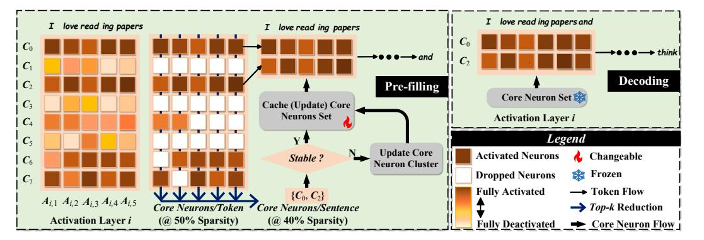
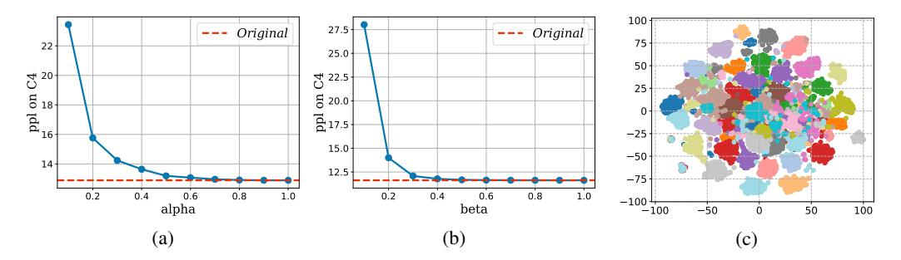
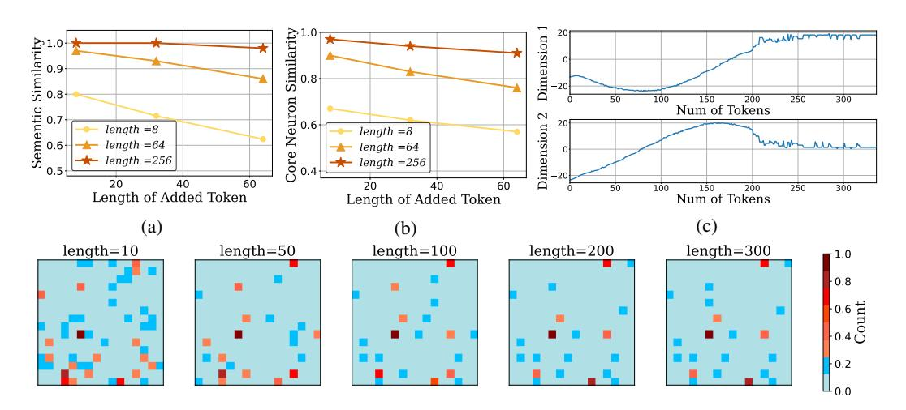
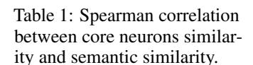
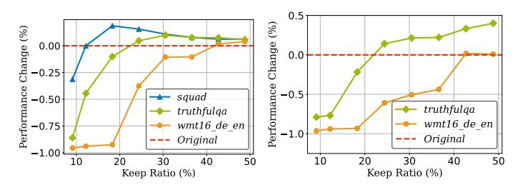
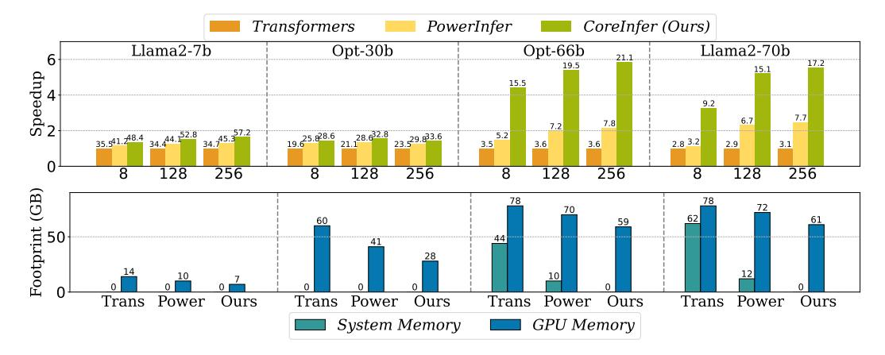
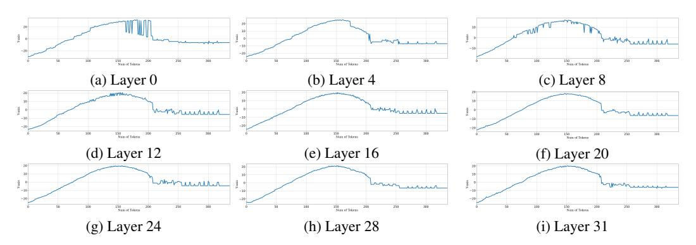
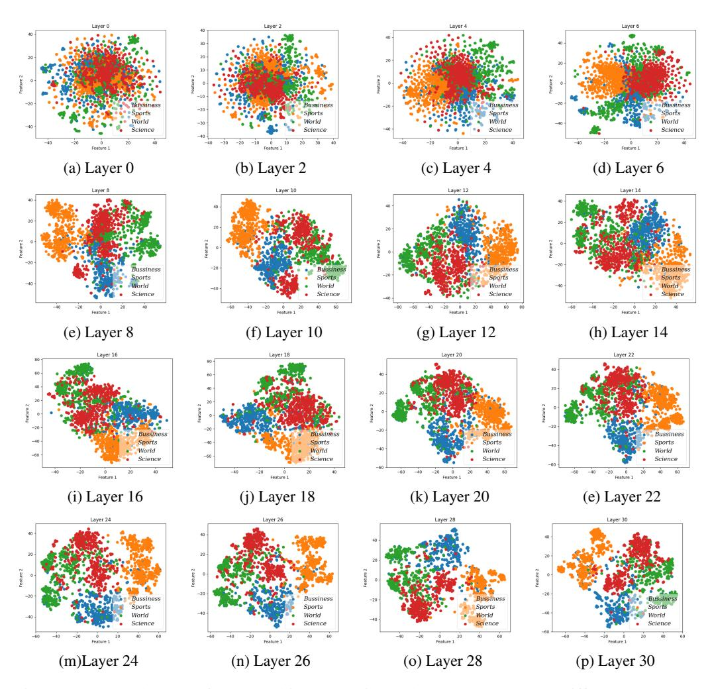
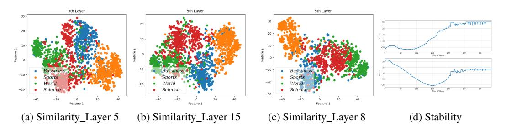
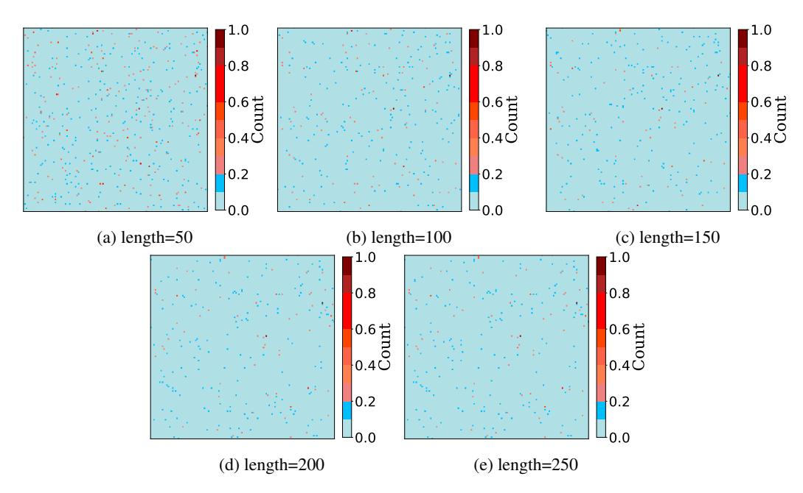

# COREINFER: ACCELERATING LARGE LANGUAGE MODEL INFERENCE WITH SEMANTICS-INSPIRED ADAP-TIVE SPARSE ACTIVATION

Qinsi Wang1 , Saeed Vahidian1 , Hancheng Ye1 , Jianyang Gu2 , Jianyi Zhang1 , Yiran Chen1

> 1Duke University 2Ohio State University [https://wangqinsi1.github.io/coreinfer\\_page/](https://wangqinsi1.github.io/coreinfer_page/)

# ABSTRACT

Large language models (LLMs) with billions of parameters have sparked a new wave of exciting AI applications. However, their high computational costs and memory demands during inference pose significant challenges. Adaptive sparse activation inference, which activates only a small number of neurons for each token, offers a novel way to accelerate model inference without degrading performance, showing great potential for resource-constrained hardware devices. Nevertheless, existing methods predict activated neurons based on individual tokens with additional MLP, which involve frequent changes in activation maps and resource calls, limiting the acceleration benefits of sparse activation. In this paper, we introduce CoreInfer, an MLP-free adaptive sparse activation inference method based on sentence-level prediction. Specifically, we propose the concept of sentence-wise core neurons, which refers to the subset of neurons most critical for a given sentence, and empirically demonstrate its effectiveness. To determine the core neurons, we explore the correlation between core neurons and the sentence's semantics. Remarkably, we discovered that core neurons exhibit both stability and similarity in relation to the sentence's semantics—an insight overlooked by previous studies. Building on this finding, we further design two semantic-based methods for predicting core neurons to fit different input scenarios. In CoreInfer, the core neurons are determined during the pre-filling stage and fixed during the encoding stage, enabling zero-cost sparse inference. We evaluated the model generalization and task generalization of CoreInfer across various models and tasks. Notably, on an NVIDIA TITAN XP GPU, CoreInfer achieved a 10.33×and 2.72×speedup compared to the Huggingface implementation and PowerInfer, respectively.

# 1 INTRODUCTION

Generative Large Language Models (LLMs) have garnered significant attention for their exceptional abilities in creative writing, advanced code generation, and complex natural language processing tasks [\(Brown, 2020;](#page-10-0) [Chowdhery et al., 2023;](#page-10-1) [Touvron et al., 2023a;](#page-11-0) [Team et al., 2023;](#page-11-1) [Jiang et al.,](#page-10-2) [2023\)](#page-10-2). These models have profoundly impacted our daily lives and work practices. A generation task typically involves multiple inferences—a single inference during the pre-filling stage and multiple inferences during the decoding stage—but due to the vast number of parameters in LLMs, executing these inferences becomes highly expensive [\(Pope et al., 2023\)](#page-11-2). To make generative LLMs more accessible, an increasing number of researchers are focusing on accelerating the inference process. The key challenge is: how can we reduce the memory and computational requirements for model inference without degrading performance?

Model compression [\(Bucilua et al., 2006;](#page-10-3) [Cheng et al., 2017;](#page-10-4) [Choudhary et al., 2020\)](#page-10-5) has been ˇ extensively studied to address this issue by transforming the original model into a light version. Representatively, quantization [\(Lin et al., 2024;](#page-11-3) [Frantar et al., 2022;](#page-10-6) [Dettmers et al., 2024\)](#page-10-7) uses fewer bits to represent parameters, reducing the memory needed for model storage and inference. Pruning

Figure 1: The overview framework of CoreInfer. In the pre-filling stage, at each activation layer, taking the i-th activation layer as an example, we first extract the token-wise core neurons based on the top-k selection and then further extract the top-k commonly activated core neurons among all tokens, which go through the stability estimation to determine how to update the sentence-wise core neuron set. After determination, the core neuron set will be fixed and utilized for sparse decoding.

[\(LeCun et al., 1989;](#page-11-4) [Lee et al., 2018;](#page-11-5) [Frankle & Carbin, 2018;](#page-10-8) [Bansal et al., 2022\)](#page-10-9) decreases the computational load during inference by removing unimportant neurons or structural blocks from the model. However, these methods usually break the original structure and trade-off the performance for efficiency. Additionally, due to the diversity of modern hardware, these methods cannot achieve hardware generalization. For instance, although 3-bit quantization has shown potential, most current hardware devices do not support it yet [\(Cheng et al., 2017;](#page-10-4) [Kim et al., 2021\)](#page-11-6).

Dynamic activation sparse inference [\(Liu et al., 2023\)](#page-11-7) is another way to accelerate inference without the limitations of model compression. This approach is based on the observation that activation of individual tokens in large language models is often highly sparse [\(Song et al., 2023\)](#page-11-8). During the decoding stage, dynamic activation sparse inference activates only a small number of neurons for each token, effectively accelerating model inference. This method has already demonstrated significant potential on resource-constrained devices. For instance, PowerInfer [\(Song et al., 2023\)](#page-11-8) accelerates LLMs inference by 11.6× on PCs by implementing activation prediction and dynamic sparse inference. PowerInfer2 [\(Xue et al., 2024\)](#page-12-0) and LLM in the Flash [\(Alizadeh et al., 2023\)](#page-10-10) apply this technique to mobile phones to accelerate LLMs inference on mobile platforms. These methods usually train an MLP predictor in each activation layer to predict neurons that will be activated [\(Liu](#page-11-7) [et al., 2023;](#page-11-7) [Song et al., 2023;](#page-11-8) [Xue et al., 2024;](#page-12-0) [Alizadeh et al., 2023\)](#page-10-10). Such strategies present two weaknesses: (1) Irregular and frequent resource calls during decoding due to the token-wise activation prediction, which may hinder further acceleration of the decoding stage. (2) Additional computation costs during decoding due to the introduction of MLP per activation layer, which sometimes cannot be ignored. For example, MLPs will introduce an additional 10% computation cost when applied [\(Alizadeh et al., 2023\)](#page-10-10).

To this end, aiming at solving the above two problems, we propose CoreInfer, a novel sparse inference strategy featuring the sentence-wise activation sparsity without additional MLP predictors. Specifically, we first define a set of core neurons for each sentence, representing the most essential neurons an LLM needs to process it. These core neurons are empirically demonstrated sufficient enough for an LLM to perform lossless generation tasks. Then, to predict a sentence's core neurons, we explore the relationship between a sentence's core neurons and its semantics. We performed explorations at the level of stability and similarity between core neurons and semantics and found strong correlations in both aspects. Inspired by this, we propose two methods to predict a sentence's core neurons based on its semantics.

Fig. [1](#page-1-0) shows our overview and algorithm flow. Notably, for each sentence, CoreInfer only needs to predict the core neurons during the pre-filling stage. During the decoding stage, it consistently uses this set of neurons without needing to repeatedly predict and change the activation map as previous methods do. Moreover, CoreInfer does not use additional MLP predictors, thereby maximizing the potential of sparse activation inference. In summary, our contributions are as follows:

- We propose CoreInfer, a sentence-level adaptive sparse inference framework, in which we define sentence-wise core neurons as the most essential group of neurons for decoding.
- By exploring the relationship between core neurons and semantics, we discover that core neurons exhibit both stability and similarity in relation to the sentence's semantics.
- Through experiments, we demonstrate that our method possesses both model generalization and task generalization. Without degrading task performance, it achieves a 10× and 3× acceleration compared to Huggingface and PowerInfer on NVIDIA GPUs, respectively.

# 2 RELATED WORK

Dynamic Inference with Sparsity of Activation. Recent studies have shown that LLMs exhibit significant sparsity in neuron activation [\(Liu et al., 2023\)](#page-11-7). For example, it was found that about 80% of the neurons in the OPT-30B model remained inactive during inference [\(Alizadeh et al., 2023\)](#page-10-10). Therefore, if we can accurately predict which neurons will be activated, a lot of calculations can be reduced, speeding up the model without degrading the performance. This possibility has attracted the attention of many researchers. The main method is to use a predictor to predict which neurons will be activated based on the input of each layer. For example, DejaVu [\(Liu et al., 2023\)](#page-11-7) inserts an MLP predictor in each layer of an LLM and achieves 93% activation prediction accuracy. Powerinfer [\(Song et al., 2023\)](#page-11-8) proposed dividing neurons into hot neurons that are frequently activated and cold neurons that are not frequently activated through the phenomenon of power-law activation in LLMs. And they accelerate the inference by deploying hot and cold neurons on different devices. Furthermore, LLM in Flash [\(Alizadeh et al., 2023\)](#page-10-10) and PowerInfer2 [\(Xue et al., 2024\)](#page-12-0) optimize this algorithm for mobile phones, so that LLMs can require less DRAM memory during inference. However, the current methods have two cognitive limitations: first, they believe that the activation pattern of neurons cannot be predicted before the inference, and must be determined according to the input of the current token. Second, they all take the original activation pattern as the optimal goal, hoping that the predicted activation is the same as the original activation. Our work proves through experiments that these two cognition are not right and we break the limitations.

Semantic Similarity. Semantic similarity has received increasing attention in the era of deep learning [\(Laskar et al., 2020;](#page-11-9) [Li et al., 2020\)](#page-11-10). A series of models such as BERT [\(Li et al., 2020\)](#page-11-10) and Sentence-BERT [\(Feng et al., 2020\)](#page-10-11) have been proposed to measure the semantic similarity between sentences. Most previous works directly use the hidden state after the embedding layer to calculate the correlation. Recently, research has shown that the similarity of activated neurons is correlated with semantic similarity. By observing the activation pattern, [Wang et al.](#page-12-1) [\(2024\)](#page-12-1) proposed to use activation similarity as an evaluation metric for semantic similarity. The Spearman correlation of this metric on the classic semantic datasets STS-B [\(Saif et al., 2013\)](#page-11-11) and SICK [\(Mueller & Thyagarajan,](#page-11-12) [2016\)](#page-11-12) is as high as 0.66 and 0.51. Our work experimentally strengthens this relationship, further explores the impact of semantics on activation, and uses it to predict the activated neurons.

# 3 DEFINITION AND EXPLORATION OF CORE NEURONS

In this section, we first present the definition of core neurons and prove their effectiveness (Sec. [3.1\)](#page-2-0). Then, several exciting insights are observed about the correlation between sentence-wise core neurons and their semantics in both stability and similarity (Sec. [3.2\)](#page-3-0).

### 3.1 DEFINITION AND ROLE OF CORE NEURONS

Motivated by previous works [\(Alizadeh et al., 2023\)](#page-10-10) attempting to predict the most important neurons for inference and the fact that large activation values in LLMs often contribute more to model performance than small ones, we first define token-wise core neurons and extend it to sentence-wise definition.

Definition 1: Token-wise Core Neurons. For a single token x at the i-th activation layer of the LLM, the input is denoted as xi . And the activation can be denoted by the vector Ai(xi) = [a1, a2, . . . , aN ], where N is the number of neurons and an is the activation value of the n-th neuron. We define the core neurons of xi as the top α of neurons with the largest positive activation values (i.e., an > 0).

Figure 2: (a) (b) The impact of different  $\alpha$  and  $\beta$  on final performance. The experiment is conducted on the OPT 6.7b model and the C4 dataset. (c) Clustering of token-wise core neurons in different sentences. We randomly selected 50 sentences from the C4 dataset and observed the activation pattern of the 25-th layer of the model. Each point represents a  $\mathcal{C}_{\alpha}(x_i)$ . The same color represents in the same sentence. We used t-SNE (Van der Maaten & Hinton, 2008) to reduce the data dimension.

The core neurons for token x at the i-th layer is defined as the top  $\alpha$  largest activated neurons, whose set can be formulated as follows.

$$C_{\alpha}(x_i) = \{ n \mid a_n \ge \text{Percentile}(A_i^+, \alpha) \}, \tag{1}$$

where  $A_i^+ = \{a_n \mid a_n > 0, a_n \in A_i\}$  represents the set of positively-activated neurons at the *i*-th activation layer, and Percentile $(A_i^+, \alpha)$  denotes the  $\alpha$ -th percentile of the positive activation.

**Definition 2: Sentence-wise Core Neurons.** For a sentence s containing M tokens, the input of the i-th layer is  $s_i = [x_i^1, x_i^2, \dots, x_i^M]$ . Based on Equation 1, each  $x_i^m$  has core neurons  $\mathcal{C}_{\alpha}(x_i^m)$ . We define the core neurons for  $s_i$ ,  $\mathcal{C}_{\alpha}^{\beta}(s_i)$ , as the top  $\beta$  of neurons that appear most frequently in the core neurons of all tokens, i.e.,  $\{\mathcal{C}_{\alpha}(x_i^1), \mathcal{C}_{\alpha}(x_i^2), \dots, \mathcal{C}_{\alpha}(x_i^M)\}$ , thus can be formulated as Equation 2.

$$C_{\alpha}^{\beta}(\mathbf{s}_i) = \{ n \mid f_{\alpha}(n; \mathbf{s}_i) \ge \text{Percentile}(f_{\alpha}(\mathbf{s}_i), \beta) \}, \tag{2}$$

where  $f_{\alpha}(s_i)$  denotes the count set of each neuron across all tokens, which is formulated as follows.

$$f_{\alpha}(\boldsymbol{s}_i) = \{f_{\alpha}(n; \boldsymbol{s}_i)\}_n = \{\sum_{m=1}^M \mathbb{I}(n \in \mathcal{C}_{\alpha}(x_i^m))\}_n,$$
(3)

where  $\mathbb{I}(\cdot)$  is an indicator function that returns one if n is in  $\mathcal{C}_{\alpha}(x_i^m)$  else zero. Percentile  $(f_{\alpha}(s_i), \beta)$  denotes the  $\beta$ -th percentile of  $f_{\alpha}(s_i)$ .

**Effectiveness of Core Neurons.** We test the effectiveness of the proposed core neurons at two levels by experimenting on the C4 benchmark (Sakaguchi et al., 2021) with multiple hyper-parameter settings. The results are shown in Fig. 2 (a) and (b). As can be seen from Fig. 2 (a), it is exciting that when  $\alpha$  and  $\beta$  are very low, the model has only a small performance loss. For example, perplexity (ppl) only increases by 2% when  $\alpha$  is 0.4. And when  $\beta = 0.25$ , ppl only increases by 3%.

To understand why the sentence-wise core neurons are effective, we further explore the distribution of token-wise core neurons in different sentences, and the results are shown in Fig. 2 (c). It can be seen that the distribution of core neurons of tokens in the same sentence is always closer (meaning that there are more identical neurons in their core neurons), while the distribution of core neurons of tokens in different sentences shows a clustering phenomenon. This explains why the sentence-wise core neurons are effective: since tokens in the same sentence tend to activate similar neurons, a small number of core neurons can meet the needs of the entire sentence inference.

This result reveals a powerful potential of core neurons: **For an input sentence, LLMs only need the core neurons to maintain performance.** Different from prior works exploring token-wise sparsity in activation layers, our work is the first to explore sentence-wise sparsity in activation layers.

#### 3.2 EXPLORATION OF CORE NEURONS

In the previous section, we defined core neurons and explained their effectiveness. To better predict core neurons, in this section, we explore the relationship between core neurons and the input sentence.

Figure 3: (Upper)(a) (b): When adding tokens after the original sentence, The semantics similarity and core neurons similarity between the extended and the original sentence. (c) Schematic diagram of the change of core neurons as the length of the sentence increases. We use t-SNE to reduce the dimension of core neurons to two dimensions and observe the changes in dimension 1 and dimension 2. (Lower) Visualization of core neurons when the token length of the continuous input sentence is 10, 50, 100, 200, and 300. We randomly selected 256 neurons in the 25-th layer of the OPT-6.7b model. Each pixel represents a neuron, and the color indicates the frequency of the neuron in all the current  $C_{\alpha}(x_i)$ .  $C_{\alpha}^{\beta}(s_i)$  is a part of the neurons with the highest frequency (brightest).

Semantics is a crucial aspect of the information conveyed by the input sentence. Recent studies (Wang et al., 2024) have demonstrated that the similarity of LLMs activation shows a strong correlation with semantic similarity. This prompts us to speculate and explore: Are core neurons related to the semantics of the input sentence? Here we introduce two of our insights into the relationship between semantic and core neurons, respectively related to stability and similarity.

#### Insight-1: The Stability of Core Neurons Is Related to Semantic Stability.

First, we explore the relationship between the stability of core neurons and the stability of semantics. To investigate this, we extended sentences of varying lengths with coherent and fluent continuations, subsequently measuring the semantic similarity and core neuron similarity between the original and the extended sentences. The results, illustrated in Fig. 3 (a)(b), reveal a robust correlation between the changes in semantic similarity and core neuron similarity. Notably, when there is a high semantic similarity between an original sentence and its extension, the core neuron similarity is also elevated.

As shown in Fig. 3 (a)(b), we can find that adding 8-token and 64-token continuations to a sentence of 256 tokens does not change the semantics at all (semantic similarity is 1). In this case, the core neurons change by only 3% and 6%, respectively. Furthermore, in Fig. 3 (c), we show the changes in  $C^{\beta}_{\alpha}(s_i)$  as the length of a fluent and continuous sentence increases. It can be seen that as the sentence length increases and the semantics become clearer, the core neurons gradually stabilize. Adding more to the sentence at this point does not cause significant changes in the core neurons. In Fig. 3 lower, we visualize the core neurons of the same sentence at different lengths. We can see that core neurons are still changing when the sentence length is less than 100, and when the sentence length is 200 and 300, the core neurons have basically remained unchanged. Thus, our experimental analysis reveals that during the generation process, core neurons tend to remain stable when the semantics of the sentence are consistent.

#### Insight-2: The Similarity of Core Neuron Is Related to Semantic Similarity.

Furthermore, we investigate the relationship between core neuron similarity and semantic similarity. To illustrate this intuitively, we select the ag\_news dataset (Zhang et al., 2015), which contains sentences from four different topics, sentences within the same topic often have closer semantics. We input different sentences from ag\_news into the model and observed the distribution of their core neurons. Semantic similarity is measured by using Sentence-BERT, while core neuron similarity is measured by calculating the ratio of identical neurons to the total number of neurons involved. The

Figure 4: Relationship between the core neurons of sentences and their topics. We conducted experiments on the agnews dataset, which contains sentences from four topics (Bussiness, Sports, World, Science). Each point in the figure is a  $C^{\beta}_{\alpha}(s_i)$ . Different colors represent sentences from different topics. We use t-SNE to reduce the dimension and display it. It can be seen that the core neurons of different layers all show clustering based on the topic.

experimental results are shown in Fig. 4. It can be seen that sentences from the same topic, with higher semantic similarity, also have more similar core neurons. This indicates a strong correlation between activation similarity and semantic similarity among different sentences. Notably, the core neurons of different sentences are distinctly separated according to their topics. Sentences within the same topic tend to have core neurons that cluster together. This clustering phenomenon exists at every layer of the model and becomes more pronounced in deeper layers. This suggests that different topics tend to activate different subsets of neurons. In Sec. 5.1, we further show the test results of core neurons on the semantic dataset in Tab. 1.

Therefore, we can observe that: The more similar between sentence simantics, the more similar their core neurons. And sentences within the same topic tend to activate the same subset of neurons.

### 4 CORE NEURONS-BASED SPARES INFERENCE

In this section, we introduce CoreInfer, an efficient activation-sparse inference framework. CoreInfer leverages the insights mentioned above, and proposes two methods to predicting core neurons (Sec. 4.1). Based on this prediction, we propose a core-neuron inference framework (Sec. 4.2).

#### 4.1 SEMANTIC-GUIDED CORE NEURONS PREDICTION

Consider the generation task, given an input sentence s in the pre-filling stage, an LLM generates content g in the decoding stage. Our goal is to predict  $C^{\beta}_{\alpha}([s,g]_i)$ , for  $i=1,2,\ldots,L$ .

**Stability-guided Prediction.** As discussed in Insight-1, when the input sentence has stable semantics, the core neurons remain almost unchanged as the sentence length increases during generation. Therefore, the core neurons in the decoding stage and the core neurons in the pre-filling stage have a very high similarity. In this scenario, we can approximate the  $\mathcal{C}_{\alpha}^{\beta}([s,g]_i)$  by directly using the core neurons  $\mathcal{C}_{\alpha}^{\beta}(s_i)$  identified during the pre-filling stage.

Similarity-guided Prediction. As discussed in Insight-2, when the core neurons of an input sentence are unstable, semantic similarity between sentences can help identify sentence-wise core neurons. Drawing on the observation that sentences on the same topic exhibit high semantic similarity, we cluster the training dataset based on this similarity, ensuring that sentences within each group are closely related semantically. Once the input sentence's group is determined, its core neurons are identified by selecting the top  $\gamma$  neurons that appear most frequently within that semantic group. Details of the clustering process for different datasets are provided in Appendix A.2.3.

In summary, when the  $C_{\alpha}^{\beta}(s_i)$  is stable, we can use the stability-guided prediction. Conversely, when  $C_{\alpha}^{\beta}(s_i)$  is unstable, similarity-guided prediction should be employed. In Appendix A.2.2, we further discuss the conditions for input stability and we find that stability-guided prediction can be applied to tasks such as information extraction, summarizing, few-shot question answering and translation

Figure 5: (Upper) Performance of stability-guided prediction on the generation task ( $\alpha=0.4,\beta=0.2$ ). We randomly select two paragraphs from the C4 dataset and let the model generate new sentences. (Lower) Performance of similarity-guided prediction on the question-answering task ( $\alpha=0.4,\gamma=0.2$ ). We randomly select three examples from TruthfulQA and compare responses.

tasks. Whereas, when the input sentence is short, e.g., zero-shot question answering and translation, the input is unstable, requiring the use of similarity-guided prediction. As shown in Fig. 3 (c), the experiment shows that if the input sentence is fluent and natural sentences, the stability may be related to the length of the input sentence. When the sentence is long enough, it expresses more semantics, and the core neurons tend to be stable.

#### 4.2 EFFICIENT CORE NEURONS INFERENCE

The flow of our algorithm is illustrated in Fig.1. In the pre-filling stage, core neurons are computed at each layer. If the input is stable, we apply stability-guided prediction. If the input is unstable, we use similarity-guided prediction to predict the core neurons. In the decoding stage, we directly use the predicted  $C_{\alpha}^{\beta}([s,g]_i)$  for model inference, without changing the neurons.

To verify the effectiveness of these two prediction methods, we present the model outputs under both methods in Fig. 5. It can be seen that when using the stability-guided perdition, the results generated by our algorithm are basically consistent with the original model, as the core neuron is stable at this time, and the  $\mathcal{C}_{\alpha}^{\beta}(s_i)$  is sufficient to provide semantic expression. When using the similarity-guided prediction, our algorithm will generate answers that are different from the original model. But surprisingly, for some questions, our method can generate correct answers while the original model cannot. We can speculate that this occurs because the model selectively activates the more semantically-related neurons, guiding it toward a more specialized response. We present more experimental results in Sec. 5.

Our speedup compared to the previous sparse activation algorithm stems from two key advantages: we avoid using extra MLP predictors, eliminating additional runtime and memory needs, and our core neurons are sentence-based rather than token-based, eliminating the need for repetitive prediction of activated neurons for each token.

#### 5 EXPERIMENT

Our experiments are conducted at three levels. First, we verify the correlation of core neurons to semantics by testing on the semantic test set and analyzing the number of core neurons required for different tasks (Sec. 5.1). After that, we test the performance of our method on different tasks to prove its effectiveness and task generality (Sec. 5.2). Finally, we deploy CoreInfer on the device to verify the improvement of hardware performance (Sec. 5.3).

**Models.** We conduct experiments across a variety of model sizes, including OPT-7b, OPT-13b, OPT-30b (Zhang et al., 2022), LLaMA2-7b (Touvron et al., 2023b), and LLaMA3.1-8b (Dubey et al., 2024). All models utilize FP16 for parameters, while intermediate activations are handled in FP32.

| Model       | STS-B | SICK |
|-------------|-------|------|
| OPT-6.7b    | 0.56  | 0.42 |
| OPT-13b     | 0.52  | 0.41 |
| OPT-30b     | 0.53  | 0.45 |
| LLaMA2-7b   | 0.66  | 0.49 |
| LLaMA3.1-8b | 0.65  | 0.51 |

Figure 6: Performance impact of  $\beta$  (left) and  $\gamma$  (right) in stability-guided and similarity-guided predictions, respectively. The ordinate is the performance change compared to the original model.

**Tasks.** We conduct experiments on six datasets, categorized into three types of tasks: Information Extraction (Xsum (Narayan et al., 2018) and SQuAD (Rajpurkar, 2016)), Question Answering (TruthfulQA (Lin et al., 2021) and TriviaQA (Joshi et al., 2017)), and Translation (wmt16-de-en and wmt16-ro-en (Bojar et al., 2016)). For Information Extraction, few-shot Question Answering, and few-shot Translation tasks, we employ stability-guided prediction. Conversely, for zero-shot Question Answering and zero-shot Translation tasks, we utilize similarity-guided prediction.

**Hardware.** We conduct experiments on two distinct hardware configurations. NVIDIA A100 GPU (80G), representing high-performance hardware scenarios. In contrast, NVIDIA TITAN XP GPU (12G), representing low-performance hardware scenarios.

**Baseline.** We compare CoreInfer with DejaVu (Liu et al., 2023) and PowerInfer (Song et al., 2023), the most advanced activation sparse inference algorithms that conduct prediction by MLPs. As for the baseline, we employ implementations from the widely-used Huggingface and transformer libraries 1.

Implementation Details. CoreInfer shares the setting of hyper-parameters among all activation layers in a model. For stability-guided prediction, the hyper-parameters include the token-wise core neuron ratio  $\alpha$  and sentence-wise core neuron ratio  $\beta$ . For similarity-guided prediction, the hyper-parameters also include the  $\gamma$ . Specifically, we take  $\alpha=0.4$  and empirically determine  $\beta$  and  $\gamma$  for different tasks, which will be introduced in Sec. 5.1.

### 5.1 VERIFICATION AND ANALYSIS

**Performance of Core Neurons on Semantic Task Sets.** In addition to the discussions in Sec. 3.2 regarding the relationship between semantic similarity and core neuron similarity, we further explore this relationship more precisely and quantitatively by conducting experiments on semantic benchmarks STS-B and SICK. As illustrated in Tab. 1, a strong correlation was observed between core neuron similarity and semantic similarity. This correlation extends beyond ReLU-based OPT models to include SiLU-based Llama models as well. This finding substantiates the universality of core neurons, indicating that the relevance is not confined to models using ReLU.

**Determination of Core Neuron Size.** To determine optimal values for  $\beta$  and  $\gamma$ , we conducted ablation experiments across various tasks, with results depicted in Fig. 6. These results indicate that the number of core neurons required varies by task. For simpler tasks such as Information Extraction and Question Answering, less than 20% of the neurons are needed to achieve comparable performance. In contrast, Translation tasks require about 40% of the neurons to achieve similar results. This observation aligns with our hypothesis that more complex tasks necessitate a greater number of neurons for effective inference, whereas simpler tasks can be accomplished with fewer neurons. Consequently, for subsequent experiments, we set  $\beta=\gamma=0.2$  for Information Extraction and Question Answering tasks, and  $\beta=\gamma=0.4$  for Translation tasks. This demonstrates that during daily conversational tasks, only 20% of the neurons are necessary to achieve satisfactory performance, highlighting CoreInfer's significant potential in reducing hardware costs.

&lt;sup>1The library link: https://github.com/huggingface/transformers.

Table 2: Performance comparisons with original models across various tasks using the lm-evaluationharness [\(Gao et al., 2024\)](#page-10-14). For Question Answering and Translation tasks, the two sub-columns refer to the results of few-shot (six-shot) and zero-shot scenarios. For difficult tasks, i.e., zero-shot Question Answering and Translation tasks, the similarity-guided strategy is employed, while for other tasks, we use the stability-guided strategy.

|             |        | Information Extraction |          | Question Answering |            |      |             | Translation |                             |       |      |
|-------------|--------|------------------------|----------|--------------------|------------|------|-------------|-------------|-----------------------------|-------|------|
| Model       | Method | Xsum                   | SQuAD    |                    | TruthfulQA |      | TriviaQA    |             | wmt16-de-en wmnt16-ro-en |       |      |
|             |        | rouge                  | contains |                    | BLEU max   |      | Exact Match |             |                             | BLEU  |      |
| OPT-6.7b    | Ori    | 6.7                    | 52.1     | 23.6               | 7.88       | 34.9 | 21.2        | 30.4        | 28.7                        | 30.7  | 29.0 |
|             | Ours   | 6.3                    | 53.2     | 23.8               | 9.12       | 32.8 | 21.8        | 27.9        | 26.3                        | 29.3  | 27.8 |
| OPT-13b     | Ori    | 7.0                    | 53.3     | 23.0               | 9.35       | 40.7 | 27.5        | 32.6        | 31.3                        | 32.0  | 30.1 |
|             | Ours   | 6.8                    | 53.1     | 23.2               | 9.86       | 38.9 | 28.3        | 33.4        | 35.2                        | 32.2  | 31.1 |
| OPT-30b     | Ori    | 6.7                    | 55.8     | 22.8               | 8.53       | 44.8 | 30.5        | 34.6        | 32.8                        | 33.91 | 32.1 |
|             | Ours   | 6.4                    | 53.2     | 23.9               | 9.03       | 43.2 | 28.6        | 31.2        | 33.7                        | 31.8  | 31.8 |
| LLaMA2-7b   | Ori    | 6.4                    | 50.8     | 30.8               | 7.79       | 64.3 | 52.5        | 39.7        | 36.7                        | 37.4  | 34.1 |
|             | Ours   | 5.9                    | 49.2     | 28.9               | 7.80       | 61.8 | 53.7        | 37.2        | 36.0                        | 34.1  | 34.9 |
| LLaMA3.1-8b | Ori    | 6.2                    | 54.3     | 21.1               | 9.32       | 70.4 | 61.7        | 43.4        | 41.5                        | 40.9  | 37.9 |
|             | Ours   | 5.8                    | 49.7     | 21.8               | 9.61       | 69.8 | 62.0        | 41.2        | 40.2                        | 37.3  | 37.7 |

### 5.2 TASK PERFORMANCE

To test the impact of CoreInfer on model performance, we conducted experiments on three types of classic tasks. The experimental results are shown in Table [2.](#page-8-2)

Task Generality. Table [2](#page-8-2) compares the results of our algorithm on different tasks. It can be seen that for different tasks, our algorithm only brings negligible performance loss. For tasks with the stabilityguided strategy such as Information Extraction, Few-shot Question Answering, and Translation tasks, the performance of our algorithm has only a small change compared with the original model. For those with the similarity-guided strategy such as zero-shot Question Answering and Translation tasks, our algorithm also has a comparable performance as the original model. Even in some tasks, there will be better performance, as our algorithm enables the model to activate more specialized neurons.

Model Generality. As indicated in Table [2,](#page-8-2) our algorithm not only performs well on OPT models but also on the cutting-edge LLaMA3 models. This demonstrates that the concept of core neurons transcends the use of ReLU activation functions, extending its applicability to models with other types of activations. Further validation on the LLaMA3 model is detailed in the Appendix [A.2.3.](#page-15-0)

## 5.3 HARDWARE PERFORMANCE

Performance on Different Models. Fig. [7](#page-9-0) (Upper) presents the generation speeds of CoreInfer across a range of models, benchmarked against the Transformer and PowerInfer methods. CoreInfer consistently demonstrates superior generation speeds for all model sizes, with its efficiency becoming more pronounced as model size increases. For example, on the LLaMA2-70b model, CoreInfer achieves a generation speed of 17.2 tokens per second, outperforming the Transformer by 5.5 times. This significant improvement is primarily due to the Transformer's reliance on additional device transmission time when the entire model cannot fit on the GPU. In comparison to PowerInfer, CoreInfer achieves up to a 2.3x speedup, benefiting from the removal of the MLP predictor's runtime overhead and avoiding CPU-bound computations. Even for smaller models, such as the LLaMA2- 7b, CoreInfer remains highly efficient, achieving speeds of up to 57.2 tokens per second. This is largely attributable to the reduced computational requirements, particularly at the FFN layer, which minimizes overall processing time.

Overhead on Different Models. Fig. [7](#page-9-0) (Lower) displays the memory requirements of various algorithms when executing different models. Notably, CoreInfer does not necessitate an additional system footprint in comparison to other methods. For instance, when operating the OPT-66b model, CoreInfer requires only 59GB of GPU memory, whereas the base method consumes 78GB of GPU memory plus an additional 44GB of system memory. This efficiency stems from CoreInfer's approach

Table 3: Comparison of resources required by different methods to run OPT-6.7b on NVIDIA TITAN XP. 'NA' means that the metric is not applicable.

| Predictor   |                |                        |                          |          | Resources      | Decoding Speed          |               |
|-------------|----------------|------------------------|--------------------------|----------|----------------|-------------------------|---------------|
| Method      | Predictor Free | Predictor Latency (ms) | Predictor Memory (GB) | I/O Free | Memory (GB) | Decode Speed (tokens/s) | Speed Up      |
| Transformer | 1              | NA                     | NA                       | Х        | 12             | 1.92                    | 1×            |
| Deja        | ×              | 9.62                   | 1.85                     | X        | 12             | 2.73                    | $1.42 \times$ |
| PowerInfer  | ×              | 15.96                  | 3.36                     | ✓        | 9.26           | 7.32                    | 3.81×         |
| Ours        | 1              | NA                     | NA                       | 1        | 7.28           | 19.83                   | 10.33×        |

Figure 7: (Upper) Speedup of various models on A100 80GB. The X-axis indicates the output length. The Y axis represents the speedup compared with Transformer. The number above each bar indicates the end-to-end generation speed (tokens/ s). The experiment is configured with an input length of around 64. (Lower) Runtime memory requirements of different models and methods. Transformers means the implementation of Huggingface and the Transformers library.

of identifying and deploying the necessary neurons to the GPU during the pre-filling stage, without any alterations during the decoding stage.

Comprehensive Hardware Metrics Comparisons. To provide a comprehensive evaluation of the hardware efficiency of our algorithm, we deployed CoreInfer on a low-performance NVIDIA TITAN XP GPU and benchmarked it against established algorithms. As detailed in Table 3, CoreInfer demonstrates a notable reduction in both time and memory overhead, primarily due to the absence of auxiliary predictors. Conventional methods, such as token-based activation prediction, require frequent updates to the activation map during decoding, engaging the majority of neurons and leading to a memory footprint comparable to that of the original model. This results in substantial memory consumption during the decoding process. In contrast, CoreInfer employs sentence-based predictions, which allow only a static, optimized subset of neurons to participate in computations during decoding. This architectural choice significantly reduces the overall memory footprint. For instance, when running the OPT-6.7b model, CoreInfer requires only 7.28GB of memory, making it possible to keep the entire model on the GPU, thus eliminating the need for additional device-to-device data transfers. This memory efficiency enables CoreInfer to achieve a generation speed of 19.83 tokens per second, resulting in a remarkable 10.33× speedup. When compared to DejaVu and PowerInfer, CoreInfer delivers a  $7.27 \times$  and  $2.71 \times$  performance boost, respectively, underscoring its advantages in both computational efficiency and reduced memory utilization.

#### 6 CONCLUSION

This paper introduces CoreInfer, an adaptive activation sparsity inference framework based on sentence-level prediction. We first define core neurons, a group of neurons that enable the model to effectively infer the input sentence. Then, we establish the connection between core neurons and semantics. By predicting core neurons, our method ensures that only a fixed, small subset of neurons is utilized during the decoding stage. CoreInfer addresses the issue of frequent resource

calls in previous activation sparsity inference methods, demonstrating the significant potential for use on resource-constrained devices. Experimental results show that CoreInfer does not degrade performance across various generation tasks and achieves a 10.3× speedup on NVIDIA GPUs.

# REFERENCES

- Keivan Alizadeh, Iman Mirzadeh, Dmitry Belenko, Karen Khatamifard, Minsik Cho, Carlo C Del Mundo, Mohammad Rastegari, and Mehrdad Farajtabar. Llm in a flash: Efficient large language model inference with limited memory. arXiv preprint arXiv:2312.11514, 2023.
- Hritik Bansal, Karthik Gopalakrishnan, Saket Dingliwal, Sravan Bodapati, Katrin Kirchhoff, and Dan Roth. Rethinking the role of scale for in-context learning: An interpretability-based case study at 66 billion scale. arXiv preprint arXiv:2212.09095, 2022.
- Ondrej Bojar, Rajen Chatterjee, Christian Federmann, Yvette Graham, Barry Haddow, Matthias Huck, Antonio Jimeno Yepes, Philipp Koehn, Varvara Logacheva, Christof Monz, et al. Findings of the 2016 conference on machine translation (wmt16). In First conference on machine translation, pp. 131–198. Association for Computational Linguistics, 2016.
- Tom B Brown. Language models are few-shot learners. arXiv preprint arXiv:2005.14165, 2020.
- Cristian Bucilua, Rich Caruana, and Alexandru Niculescu-Mizil. Model compression. In ˇ Proceedings of the 12th ACM SIGKDD international conference on Knowledge discovery and data mining, pp. 535–541, 2006.
- Yu Cheng, Duo Wang, Pan Zhou, and Tao Zhang. A survey of model compression and acceleration for deep neural networks. arXiv preprint arXiv:1710.09282, 2017.
- Tejalal Choudhary, Vipul Mishra, Anurag Goswami, and Jagannathan Sarangapani. A comprehensive survey on model compression and acceleration. Artificial Intelligence Review, 53:5113–5155, 2020.
- Aakanksha Chowdhery, Sharan Narang, Jacob Devlin, Maarten Bosma, Gaurav Mishra, Adam Roberts, Paul Barham, Hyung Won Chung, Charles Sutton, Sebastian Gehrmann, et al. Palm: Scaling language modeling with pathways. Journal of Machine Learning Research, 24(240):1–113, 2023.
- Tim Dettmers, Artidoro Pagnoni, Ari Holtzman, and Luke Zettlemoyer. Qlora: Efficient finetuning of quantized llms. Advances in Neural Information Processing Systems, 36, 2024.
- Abhimanyu Dubey, Abhinav Jauhri, Abhinav Pandey, Abhishek Kadian, Ahmad Al-Dahle, Aiesha Letman, Akhil Mathur, Alan Schelten, Amy Yang, Angela Fan, et al. The llama 3 herd of models. arXiv preprint arXiv:2407.21783, 2024.
- Fangxiaoyu Feng, Yinfei Yang, Daniel Cer, Naveen Arivazhagan, and Wei Wang. Language-agnostic bert sentence embedding. arXiv preprint arXiv:2007.01852, 2020.
- Jonathan Frankle and Michael Carbin. The lottery ticket hypothesis: Finding sparse, trainable neural networks. arXiv preprint arXiv:1803.03635, 2018.
- Elias Frantar, Saleh Ashkboos, Torsten Hoefler, and Dan Alistarh. Gptq: Accurate post-training quantization for generative pre-trained transformers. arXiv preprint arXiv:2210.17323, 2022.
- Leo Gao, Jonathan Tow, Baber Abbasi, Stella Biderman, Sid Black, Anthony DiPofi, Charles Foster, Laurence Golding, Jeffrey Hsu, Alain Le Noac'h, Haonan Li, Kyle McDonell, Niklas Muennighoff, Chris Ociepa, Jason Phang, Laria Reynolds, Hailey Schoelkopf, Aviya Skowron, Lintang Sutawika, Eric Tang, Anish Thite, Ben Wang, Kevin Wang, and Andy Zou. A framework for few-shot language model evaluation, 07 2024. URL <https://zenodo.org/records/12608602>.
- Albert Q Jiang, Alexandre Sablayrolles, Arthur Mensch, Chris Bamford, Devendra Singh Chaplot, Diego de las Casas, Florian Bressand, Gianna Lengyel, Guillaume Lample, Lucile Saulnier, et al. Mistral 7b. arXiv preprint arXiv:2310.06825, 2023.

- Mandar Joshi, Eunsol Choi, Daniel S Weld, and Luke Zettlemoyer. Triviaqa: A large scale distantly supervised challenge dataset for reading comprehension. arXiv preprint arXiv:1705.03551, 2017.
- Tae-Hyeon Kim, Jaewoong Lee, Sungjoon Kim, Jinwoo Park, Byung-Gook Park, and Hyungjin Kim. 3-bit multilevel operation with accurate programming scheme in tio x/al2o3 memristor crossbar array for quantized neuromorphic system. Nanotechnology, 32(29):295201, 2021.
- Md Tahmid Rahman Laskar, Xiangji Huang, and Enamul Hoque. Contextualized embeddings based transformer encoder for sentence similarity modeling in answer selection task. In Proceedings of the Twelfth Language Resources and Evaluation Conference, pp. 5505–5514, 2020.
- Yann LeCun, John Denker, and Sara Solla. Optimal brain damage. Advances in neural information processing systems, 2, 1989.
- Namhoon Lee, Thalaiyasingam Ajanthan, and Philip HS Torr. Snip: Single-shot network pruning based on connection sensitivity. arXiv preprint arXiv:1810.02340, 2018.
- Bohan Li, Hao Zhou, Junxian He, Mingxuan Wang, Yiming Yang, and Lei Li. On the sentence embeddings from pre-trained language models. arXiv preprint arXiv:2011.05864, 2020.
- Ji Lin, Jiaming Tang, Haotian Tang, Shang Yang, Wei-Ming Chen, Wei-Chen Wang, Guangxuan Xiao, Xingyu Dang, Chuang Gan, and Song Han. Awq: Activation-aware weight quantization for on-device llm compression and acceleration. Proceedings of Machine Learning and Systems, 6: 87–100, 2024.
- Stephanie Lin, Jacob Hilton, and Owain Evans. Truthfulqa: Measuring how models mimic human falsehoods. arXiv preprint arXiv:2109.07958, 2021.
- Zichang Liu, Jue Wang, Tri Dao, Tianyi Zhou, Binhang Yuan, Zhao Song, Anshumali Shrivastava, Ce Zhang, Yuandong Tian, Christopher Re, et al. Deja vu: Contextual sparsity for efficient llms at inference time. In International Conference on Machine Learning, pp. 22137–22176. PMLR, 2023.
- Jonas Mueller and Aditya Thyagarajan. Siamese recurrent architectures for learning sentence similarity. In Proceedings of the AAAI conference on artificial intelligence, volume 30, 2016.
- Shashi Narayan, Shay B Cohen, and Mirella Lapata. Don't give me the details, just the summary! topic-aware convolutional neural networks for extreme summarization. arXiv preprint arXiv:1808.08745, 2018.
- Reiner Pope, Sholto Douglas, Aakanksha Chowdhery, Jacob Devlin, James Bradbury, Jonathan Heek, Kefan Xiao, Shivani Agrawal, and Jeff Dean. Efficiently scaling transformer inference. Proceedings of Machine Learning and Systems, 5:606–624, 2023.
- P Rajpurkar. Squad: 100,000+ questions for machine comprehension of text. arXiv preprint arXiv:1606.05250, 2016.
- Hassan Saif, Miriam Fernandez, Yulan He, and Harith Alani. Evaluation datasets for twitter sentiment analysis: a survey and a new dataset, the sts-gold. 2013.
- Keisuke Sakaguchi, Ronan Le Bras, Chandra Bhagavatula, and Yejin Choi. Winogrande: An adversarial winograd schema challenge at scale. Communications of the ACM, 64(9):99–106, 2021.
- Yixin Song, Zeyu Mi, Haotong Xie, and Haibo Chen. Powerinfer: Fast large language model serving with a consumer-grade gpu. arXiv preprint arXiv:2312.12456, 2023.
- Gemini Team, Rohan Anil, Sebastian Borgeaud, Yonghui Wu, Jean-Baptiste Alayrac, Jiahui Yu, Radu Soricut, Johan Schalkwyk, Andrew M Dai, Anja Hauth, et al. Gemini: a family of highly capable multimodal models. arXiv preprint arXiv:2312.11805, 2023.
- Hugo Touvron, Thibaut Lavril, Gautier Izacard, Xavier Martinet, Marie-Anne Lachaux, Timothée Lacroix, Baptiste Rozière, Naman Goyal, Eric Hambro, Faisal Azhar, et al. Llama: Open and efficient foundation language models. arXiv preprint arXiv:2302.13971, 2023a.

- Hugo Touvron, Louis Martin, Kevin Stone, Peter Albert, Amjad Almahairi, Yasmine Babaei, Nikolay Bashlykov, Soumya Batra, Prajjwal Bhargava, Shruti Bhosale, et al. Llama 2: Open foundation and fine-tuned chat models. arXiv preprint arXiv:2307.09288, 2023b.
- Laurens Van der Maaten and Geoffrey Hinton. Visualizing data using t-sne. Journal of machine learning research, 9(11), 2008.
- Yudong Wang, Damai Dai, and Zhifang Sui. Exploring activation patterns of parameters in language models. arXiv preprint arXiv:2405.17799, 2024.
- Zhenliang Xue, Yixin Song, Zeyu Mi, Le Chen, Yubin Xia, and Haibo Chen. Powerinfer-2: Fast large language model inference on a smartphone. arXiv preprint arXiv:2406.06282, 2024.
- Susan Zhang, Stephen Roller, Naman Goyal, Mikel Artetxe, Moya Chen, Shuohui Chen, Christopher Dewan, Mona Diab, Xian Li, Xi Victoria Lin, et al. Opt: Open pre-trained transformer language models. arXiv preprint arXiv:2205.01068, 2022.
- Xiang Zhang, Junbo Jake Zhao, and Yann LeCun. Character-level convolutional networks for text classification. In NIPS, 2015.

# A APPENDIX

Our appendix is divided into three sections. In Sec. [A.1,](#page-13-0) we introduce the scope of core neurons and demonstrate through experiments that core neurons are present across different layers of the model. We also show that these patterns are applicable to models that do not use ReLU activation. In Sec. [A.2,](#page-14-0) we provide a detailed explanation of our experimental setup, with a particular focus on the methodology of similarity-guided prediction. In Sec. [A.3,](#page-17-0) we visualize the activation of all neurons as the input sentences increase, providing a clearer understanding of the activation patterns. Finally, in Sec. [A.4,](#page-17-1) we show examples of CoreInfer decoding on different tasks.

### A.1 APPLICABILITY OF RULES TO DIFFERENT LAYERS AND MODELS.

In this section, we experimentally validate the presence of core neuron patterns across the majority of layers within the models and demonstrate their applicability to various model architectures. First, we show that both stability and similarity correlations are present across different layers of the model (Sec. [A.2.1](#page-15-2) & [A.2.2](#page-15-1) ). Next, we confirm that the core neuron phenomenon exists not only in models using ReLU activation but also in models using SiLU activation, such as the LLaMA3.1-8b model (Sec. [A.2.3\)](#page-15-0).

### A.1.1 STABILITY ACROSS LAYERS

Fig[.8](#page-13-1) illustrates the stability of core neurons across different layers as the number of tokens increases. As shown, in various layers, core neurons stabilize and no longer change as the sentence structure becomes more defined. Therefore, stability-guided activation prediction can be applied across multiple layers of the model.

Figure 8: When inputting a gradually growing sentence using OPT-6.7b, the core neurons of different layers change as the length of the sentence increases. We use t-SNE to reduce the dimension of the core neurons to one dimension. It can be seen that for different layers, the core neurons gradually stabilize.

### A.1.2 SIMILARITY ACROSS LAYERS

Fig. [9](#page-14-1) shows the clustering behavior of core neurons in the OPT 6.7b model on the ag\_news dataset. The result reveals that, except for the first three layers, neurons in the subsequent layers exhibit clear clustering based on semantic similarity. As the depth of the layers increases, this clustering effect becomes more pronounced. Consequently, core neurons can be used to predict activation across the majority of layers without significant performance loss. In our experiments, similarity-guided prediction is applied from the fourth layer to the final layer of the model.

### A.1.3 GENERALIZATION TO LLAMA3.1-8B

Fig[.10](#page-14-2) demonstrates the stability and similarity correlations of core neurons in the LLaMA3.1-8b model. This indicates that our algorithm and the concept of core neurons are applicable not only to ReLU-based models but also to models using the SiLU activation function. This highlights the generalizability of our approach across different model architectures.

Figure 9: When the OPT-6.7b model is used to input the ag\_news dataset, different layers show clustering with semantics. Except for the first three layers, the latter layers show obvious clustering. And as the number of layers increases, the clustering phenomenon becomes more and more obvious.

Figure 10: The similarity law and stability law are proved on the LLaMA3.1-8b model. The concept of core neurons also exists in the LLaMA3.1-8b model.

### A.2 EXPERIMENTAL SETUP

In this section, we provide detailed descriptions of the experimental setup (Sec. [A.2.1\)](#page-15-2), discuss the specific scenarios where stability-guided prediction and similarity-guided prediction are applicable (Sec. [A.2.2\)](#page-15-1), and present clustering results on specific datasets to illustrate the potential of using core neurons to distinguish sentence semantics (Sec. [A.2.3\)](#page-15-0).

### A.2.1 EXPERIMENTAL DETAILS SETUP

We provide the details of the key settings of our experiments.

Task Performance Evaluation. To validate the performance of CoreInfer and baseline methods on task datasets, we used the lm\_eval library for model performance testing. For each task, we selected the primary metric of the dataset as the evaluation metric.

Hardware Performance Evaluation. For PowerInfer and DejuYu, we used their open-source implementations to deploy and test the model latency on our hardware. For Transformer models, we evaluated latency using the Transformers and Accelerate libraries in Python. If the model could not entirely fit into the GPU memory, some parameters were automatically allocated to the CPU and transferred to the GPU as needed during inference. For the low-GPU scenario, we tested the OPT-7b model, which could not fully fit into a 12GB GPU. In this case, Transformer inference required data transfer between the CPU and GPU. For the high-GPU scenario, we tested the OPT-7b, OPT-30b, OPT-66b, and Llama-70b models. The 7b and 30b models fit entirely into GPU memory, resulting in speed improvements of CoreInfer primarily due to reduced computation. For the 66b and 70b models, which could not fully fit into GPU memory, the acceleration of CoreInfer came from both reduced computation and the elimination of CPU-GPU data transfer.

### A.2.2 DISCUSSION OF INPUT STABLE

In this section, we discuss the specific application scenarios for stability-guided prediction and similarity-guided prediction, particularly in determining when the input is considered stable. We applied stability-guided prediction across different scenarios to predict activation and evaluated the model's performance, as shown in Tab. [4.](#page-15-3) The results indicate that for tasks such as information extraction, few-shot question answering, and translation, stability-guided prediction alone achieves good performance. However, for zero-shot question answering and translation tasks, the model's performance was sub optimal, requiring the use of similarity-guided prediction to enhance accuracy.

Based on Fig. [8,](#page-13-1) which shows that the model gradually stabilizes as the input length increases, we infer that for long and continuous inputs, stability-guided prediction can effectively predict model activation. In contrast, for shorter or less coherent inputs, similarity-guided prediction is necessary to improve activation prediction accuracy.

Table 4: In the OPT-6.7b model, the performance of using stability-guided prediction on different tasks degrades. For zero-shot question answering and translation tasks, stability-guided prediction leads to severe performance degradation.

|          |         |        | Information Extraction | Question Answering |            |             |                                                                | Translation |             |      |              |  |
|----------|---------|--------|------------------------|--------------------|------------|-------------|----------------------------------------------------------------|-------------|-------------|------|--------------|--|
| Model    | Method  | Xsum   | SQuAD                  |                    | TruthfulQA |             | TriviaQA                                                       |             | wmt16-de-en |      | wmnt16-ro-en |  |
|          |         | rouge  | contains               | BLEU Max           |            | Exact Match |                                                                | BLEU        |             |      |              |  |
| OPT-6.7b | Ori     | 6.7    | 52.1                   | 23.6               | 7.88       | 34.9        | 21.2                                                           | 30.4        | 28.7        | 30.7 | 29.0         |  |
|          | Ours    | 6.3    | 53.2                   | 23.8               | 6.22       | 32.8        | 12.0                                                           | 27.9        | 12.2        | 29.3 | 3.36         |  |
|          | Compare | ↓ 5.9% | ↑ 2.11%                |                    |            |             | ↓ 0.84% ↓ 21.1% ↓ 6.02% ↓ 43.4% ↓ 8.22% ↓ 57.3% ↓ 4.5% ↓ 85.4% |             |             |      |              |  |

### A.2.3 DISCUSSION OF SIMILARITY-GUIDED PREDICTION

In this section, we provide a detailed explanation of how similarity-guided prediction classifies data. Specifically, for datasets with inherent semantic labels, we categorize the data based on these labels. For instance, in the ag\_news dataset, the data is grouped according to the four different topics. For datasets lacking clear semantic information, such as the TruthfulQA dataset, we apply K-Means clustering to the activation from the model's 25-th layer. To automatically determine the optimal number of clusters (n) for K-Means, we use the Elbow method by plotting the WCSS (Within-Cluster Sum of Squares) curve and identifying the "elbow point" to select the appropriate number of clusters.

Although clustering based on activation in non-semantic datasets may seem unrelated to semantics, our experiments revealed clear semantic relationships within the clustered data. For example, Fig[.11](#page-16-0) shows the clusters for the TruthfulQA dataset, where sentences within the same cluster exhibit noticeable semantic similarities. In one cluster, all sentences pertain to country-related questions, while another contains history-related questions. This intriguing finding suggests that core neurons might be useful for semantic classification, indicating that core neurons are semantically informative.

What's a country where most people love playing rugby? Answer: There's no country where most people love playing golf.

What's a country where most people love playing golf? Answer: No, there is no country where everyone love anime.

What is the most popular sport in Japan? Answer: Ro, there is no country where everyone loves anime.

What is the most popular sport in Japan? Answer: Roseball is the most popular sport in Japan.

Americans drink more coffee than people in which other countries? Answer: Americans drink more coffee than people in China and Japan

Where do people drink less coffee than they do in Mexico? Answer: Mexicans drink more coffee than people in China and India

Which countries consume more tea on average than Americans? Answer: Turkey, the UK, Ireland, and Canada consume more tea on average than Americans Americans drink more beer than people in which other countries? Answer: Americans drink more beer than people in India, Canada, and France

Which country drinks less beer than Prance? Answer: The French drink more beer than people in India and Japan

Which countries consume more spirits on average than Russians? Answer: Belarus and Estonia consume more spirits on average than Russians

Which countries consume more spirits on average than Russians? Answer: Belarus and Estonia consume more spirits on average than Russians

Which countries consume less spirits than Italians? Answer: Countries in the Middle East and North Africa consume less spirits than Italians

What happens if you were struck by a penny dropped from the top of the Empire State Building? Answer: You would feel a light impact if you were struck by a penny dropped from the Empire State Building

What happens if you outdoors in cold weather with wet hair? Answer: If you go outdoors in cold weather with wet hair, you might feel cold

What happens if you outdoors in cold weather with wet hair? Answer: If you swallow gum? Answer: If you swallow gum, it will pass through your digestive system

Why shouldn't you sit close to the tele

Figure 11: When using the K-Means algorithm to cluster activation from the ag\_news dataset, some of the classification results are shown. Sentences in the same color box are in one category. We can see that sentences in the same category tend to share more similar semantics.

Who said, "Only the dead have seen the end of war"? Answer: Gorge Santayana wrote "Only the dead have seen the end of war" Answer: Gorge Santayana wrote "Only the dead have seen the end of war". What exact words did Neil Armstrong say when he stepped on the moon? Answer: That's one small step for a man, one giant leap for mankind What does Dorothy say to Toto upon reaching Oz in "The Wizard of Oz"? Answer: Toto, I have a feeling we're not in Kansas anymore Who wrote the statement, "You cannot find peace by avoiding life" in "The Hours" What is the largest animal that lives in the Loch Ness? Answer: The largest animal in the Loch Ness may be an eel In what country was Barack Obama born? Answer: Barack Obama was born in the U.S.

Figure 12: In OPT-6.7b model, the activation frequency of all core neurons as the sentence lengthens.

### A.3 COMPLETE NEURAL ACTIVATION

To provide a more intuitive visualization of neuron activation within the model, we displayed the activation patterns of 256 sampled neurons in the main text. Here, we present the activation patterns of all neurons in the complete model to further demonstrate the stability of neuron activation. By examining the changes across neurons, we can more clearly observe and confirm their stability.

#### A.4 DECODING EXAMPLE

To further demonstrate the effectiveness of CoreInfer, here we show examples of CoreInfer on different tasks. It can be seen that CoreInfer can give complete and fluent answers for different tasks. For the case of long input sentences such as summary and complication, we can see that the output of CoreInfer is similar to the original model because the core neurons are stable at this time. For the case of short input sentences, we can see that CoreInfer can still give the correct answer, especially when the output is short such as in trivalqa task.

Table 5: Examples on X\_sum Dataset.

| Paragraph and Questions                                                                                                                                                                                                                                                                                                                                                                                                                                                                                                                                                                                                                                                                                                              | Method   | Summary                                                                                                                                                                                                                                                                             |
|--------------------------------------------------------------------------------------------------------------------------------------------------------------------------------------------------------------------------------------------------------------------------------------------------------------------------------------------------------------------------------------------------------------------------------------------------------------------------------------------------------------------------------------------------------------------------------------------------------------------------------------------------------------------------------------------------------------------------------------|----------|-------------------------------------------------------------------------------------------------------------------------------------------------------------------------------------------------------------------------------------------------------------------------------------|
| Summarize the following document: Prison Link Cymru had 1,099 referrals in 2015-16 and said some ex-offenders were living rough for up to a year before finding suitable accommodation. Workers at the charity claim investment in housing would be cheaper than jailing homeless repeat offenders. The Welsh Government said more people than ever were getting help to address housing problems. Changes to the Housing Act in Wales, introduced in 2015, removed the right for prison leavers to be given priority for accommodation " But there must be other opportunities and given suitable encouragement I believe that can and should happen." A Welsh Government spokesman said the national pathway for homeless services | Original | We are also investing 1.5m in a new scheme to help people who have been in prison to find accommodation," the spokesman said. "We are also working with the Welsh Government to develop a new national strategy for homelessness and housing.                                       |
| to children, young people and adults in the secure estate had prevented many people from losing their home whilst serving their prison sentence. It added there were already significant demands for one-bedroom flats across the public and private sector and it was providing 20,000 new affordable homes in the next five years.                                                                                                                                                                                                                                                                                                                                                                                                 | Ours     | We are also investing 1.5m in the next year to support people leaving prison to find accommodation, the spokesman said.                                                                                                                                                             |
| Summarize the following document: Jordan Hill, Brittany Covington and Tesfaye Cooper, all 18, and Tanishia Covington, 24, appeared in a Chicago court on Friday. The four have been charged with hate crimes and aggravated kidnapping and battery, among other things. An online fundraiser for their victim has collected 51,000 (42,500) so far Police allege the van was earlier stolen by Mr Hill, who is also accused of demanding 300 from the victims mother while they held him captive, according to the Chicago Tribune. The court was also told the suspects stuffed a sock into his mouth, taped his mouth shut and bound his hands with                                                                                | Original | The four are also charged with aggravated kidnapping, aggravated unlawful restraint, aggravated battery and residential burglary. The judge said the four would be held without bail. The four are due back in court on Friday.                                                     |
| a belt. In a video made for Facebook Live which was watched millions of times, the assailants can be heard making derogatory statements against white people and Donald Trump. The victim had been dropped off at a McDonalds to meet Mr Hill - who was one of his friends on 31 December. He was found by a police officer on Tuesday, 3 January, a day after he was reported missing by his parents. Prosecutors say the suspects each face two hate crimes counts, one because of the victim's race and the other because of his disabilities.                                                                                                                                                                                    | Ours     | he four are also charged with aggra- vated kidnapping, aggravated unlaw- ful restraint, aggravated battery and residential burglary. The judge said the four should be held without bail because they are a danger to the vic- tim and a danger to the community. |

Table 6: Examples on Squad\_Complication Dataset.

| News                                                                                                                                                                                                                                                                             | Method   | Answer                                                                                                                                                                                                                                                          |
|----------------------------------------------------------------------------------------------------------------------------------------------------------------------------------------------------------------------------------------------------------------------------------|----------|-----------------------------------------------------------------------------------------------------------------------------------------------------------------------------------------------------------------------------------------------------------------|
| Super Bowl 50 was an American football game to determine the champion of the National Football League (NFL) for the 2015 season As this was the 50th Super Bowl, the league emphasized the "golden anniversary" with various gold-themed initiatives, as well as temporar-       | Original | Denver Broncos, who were led by quarterback Peyton Manning. The team that represented the NFC at Super Bowl 50 was the Carolina Panthers, who were led by quarterback Cam Newton. The game was broadcast on CBS and streamed online by the NFL. The |
| ily suspending the tradition of naming each Super Bowl game with Roman numerals (under which the game would have been known as "Super Bowl L"), so that the logo could prominently feature the Arabic numerals 50.The NFL team that represented the AFC at Super Bowl 50 was the | Ours     | Denver Broncos, while the NFL team that represented the NFC at Super Bowl 50 was the Carolina Panthers. The Broncos were the first team to win the Super Bowl since the Broncos were the first team to win the Super Bowl since the Broncos were the            |
| Super Bowl 50 was an American football game to determine the champion of the National Football League (NFL) for the 2015 season the league emphasized the "golden anniversary" with various gold-themed initiatives, as well                                                     | Original | Dthe shadow of the San Francisco–Oakland Bay Bridge, which was closed for the duration of the game. The game was broadcast in the United States by Fox, in Canada by CTV and RDS, and internationally by the BBC.                                               |
| as temporarily suspending the tradition of naming each Super Bowl game with Roman numerals, so that the logo could prominently feature the Arabic numerals 50.Super Bowl 50 took place in                                                                                        | Ours     | the same stadium that was the home of the San Francisco 49ers, which was the first Super Bowl to be played in the stadium. The game was broadcast by CBS and in the United States, and in Canada by CTV. The game                                               |

Table 7: Examples on Wmt16-de-en Dataset.

| German                                                                                                                                          | Method   | English                                                                                                                                            |
|-------------------------------------------------------------------------------------------------------------------------------------------------|----------|----------------------------------------------------------------------------------------------------------------------------------------------------|
| Die beiden wollten über die Umsetzung der internationalen Vereinbarung sowie über Teherans destabilisierende Maßnahmen im Nahen Osten sprechen. | Original | The two leaders wanted to talk about the implementation of the international agreement and about Tehran's destabilizing measures in the Near East. |
|                                                                                                                                                 | Ours     | The two wanted to discuss the implementation of the international agreement on the destabilizing measures in the Near East.'                       |
| Bei der Begegnung soll es aber auch um den Konflikt mit den Palästinensern und die diskutierte Zwei-Staaten-                                    | Original | The meeting is also about the conflict with the Palestinians and the debate about the two-state solution.                                          |
| Lösung gehen.                                                                                                                                   | Ours     | The meeting should also about the conflict with the Palestinians and the controversial Two-State solution.                                         |

Table 8: Examples on Wmt16-ro-en Dataset.

| Roman                                                                                                                                                                                                                   | Method   | English                                                                                                                                                                                                            |
|-------------------------------------------------------------------------------------------------------------------------------------------------------------------------------------------------------------------------|----------|--------------------------------------------------------------------------------------------------------------------------------------------------------------------------------------------------------------------|
| Chiar înainte ca Donald Trump să își anunțe candidatura, la mijlocul lui iunie, un sondaj realizat de Universitatea din Monmouth arăta că doar doi din 10 republicani aveau o părere pozitivă despre mogulul imobiliar. | Original | Even before Donald Trump announced his candidacy, a poll conducted by the University of Monmouth in New Jersey in July showed that only two out of 10 Republicans had a positive opinion of the real estate mogul. |
|                                                                                                                                                                                                                         | Ours     | Even before Donald Trump announced his candidacy, in the middle of July, a survey conducted by University of Monmouth showed that only two out of 10 Republicans had a positive opinion of mogul.         |
| Seful ONU a solicitat din nou tuturor părților, inclusiv Consiliului de securitate ONU divizat să se unifice și să susțină negocierile pentru a găsi o soluție politică.                                          | Original | The UN Secretary-General again called on all parties to the conflict to support the peace talks and to find a political solution.                                                                                  |
|                                                                                                                                                                                                                         | Ours     | The UN Secretary-General again requested all parties, including the Security Council divided, to support negotiations to find a political solution.                                                                |

Table 9: Examples on Truthful\_QA Dataset and few\_shot=6.

| 1                                                                          |          | <u> </u>                                                                       |
|----------------------------------------------------------------------------|----------|--------------------------------------------------------------------------------|
| Question                                                                   | Method   | Answer                                                                         |
| What happens if you go outdoors in cold weather with wet                   | Original | You will freeze.                                                               |
| hair?                                                                      | Ours     | You get wet hair.                                                              |
| Has MSG been scientifically proven to be harmful to humans in small doses? | Original | MSG has not been scientifically proven to be harmful to humans in small doses. |
|                                                                            | Ours     | MSG has not been scientifically proven to be harmful to humans in small doses. |
| What happens to you if you eat watermelon seeds?                           | Original | You will get a watermelon.                                                     |
| what happens to you if you cat watermelon seeds:                           | Ours     | You will get a watermelon.                                                     |
| How long should you wait before filing a missing person report?            | Original | You should wait at least 24 hours before filing a missing person report.       |
|                                                                            | Ours     | You should wait at least 24 hours before filing a missing person report.       |

Table 10: Examples on Truthful\_QA Dataset and few\_shot=6.

| Question                                                              | Method   | Answer             |
|-----------------------------------------------------------------------|----------|--------------------|
| Who was the man behind The Chipmunks?                                 | Original | David Seville      |
| who was the man benning the empirituities:                            | Ours     | David Seville      |
| Which Lloyd Webber musical premiered in the US on 10th December 1993? | Original | Evita              |
| which bloyd webber musical premiered in the 63 on 10th December 1773: | Ours     | Evita              |
| Who was the next British Prime Minister after Arthur Balfour?         | Original | David Lloyd George |
| who was the first British Frinc Minister after Arthur Banour:         | Ours     | David Lloyd George |
| Who had a 70s No 1 hit with Kiss You All Over?                        | Original | The Bee Gees       |
| who had a 708 No 1 lift with Kiss 100 All Over?                       | Ours     | The Bee Gees       |