# ENABLING DYNAMIC SPARSITY IN QUANTIZED LLM INFERENCE

### Rongxiang Wang 1 2 Kangyuan Shu 2 Felix Xiaozhu Lin 1

## ABSTRACT

Deploying large language models (LLMs) on end-user devices is gaining importance due to benefits in responsiveness, privacy, and operational cost. Yet the limited memory and compute capability of mobile and desktop GPUs make efficient execution difficult. Recent observations suggest that the internal activations of LLMs are often dynamically sparse, meaning that for each input, only part of the network contributes significantly to the output. Such sparsity could reduce computation, but it interacts poorly with group-wise quantization, which remains the dominant approach for fitting LLMs onto resource-constrained hardware.

To reconcile these two properties, this study proposes a set of techniques that realize dynamic sparse inference under low-bit quantization. The method features: (1) a zigzag-patterned quantization layout that organizes weights in a way consistent with activation sparsity and improves GPU memory locality; (2) a specialized GEMV kernel designed for this layout to fully utilize parallel compute units; and (3) a compact runtime mechanism that gathers sparse indices with minimal overhead.

Across several model scales and hardware configurations, the approach achieves up to 1.55× faster decoding throughput while maintaining accuracy comparable to dense quantized inference, showing that structured sparsity and quantization can effectively coexist on commodity GPUs.

## 1 INTRODUCTION

This paper answers the following question: how to exploit activation sparsity in quantized LLM inference, which has been pervasive in efficient LLM deployment.

Background: Sparsity in LLM inference LLMs are increasingly deployed on client devices to support emerging generative applications such as intelligent assistants and on-device copilots [\(Inc.,](#page-10-0) [2025b;a;](#page-10-0) [Wen et al.,](#page-10-0) [2024\)](#page-10-0). A fundamental challenge in these deployments is the tension between ever-growing model sizes and the limited compute capability of client or mobile devices. Recent studies on LLM sparsity have opened new opportunities to boost LLM inference efficiency [\(Liu et al.,](#page-10-0) [2023;](#page-10-0) [Song et al.,](#page-10-0) [2024;](#page-10-0) [Liu et al.,](#page-10-0) [2025;](#page-10-0) [Zhang et al.,](#page-10-0) [2025\)](#page-10-0). These works observe that during inference, different inputs activate distinct subsets of model parameters, i.e. only a portion of the network contributes meaningfully to a specific input and its prediction. This dynamic sparsity phenomenon aligns conceptually with the mixture-of-experts paradigm [\(Shazeer](#page-10-0) [et al.,](#page-10-0) [2017\)](#page-10-0), where only a small subset of experts is used

*Preliminary work. Under review.*

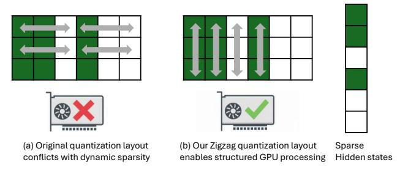

Figure 1. Our zigzag quantization layout and GPU kernel codesign enables structured sparse computation. (a) Default row-wise layout conflicts with activation sparsity and causes irregular GPU execution. (b) Our Zigzag layout aligns with column-wise activaiton sparsity, enabling efficient structured processing on GPU.

per input.

Existing dynamic sparsity broadly falls into two categories: neuron sparsity and activation sparsity. Neuron sparsity [\(Liu et al.,](#page-10-0) [2023\)](#page-10-0), which is better known, originates from observations in the feed-forward networks (FFNs) within transformer blocks. Since the activation function selectively activates only a portion of the intermediate neurons, the corresponding rows and columns in the up- and downprojection matrices can be skipped during inference.

Activation sparsity [\(Liu et al.,](#page-10-0) [2025\)](#page-10-0), which is the focus

\*Equal contribution 1Department of Computer Science, University of Virginia, Charlottesville, Virginia 2Zoom Communications Inc, USA. Correspondence to: Rongxiang Wang <waq9hw@virginia.edu>.

on this paper, is a more recent approach. It generalizes the sparsity concept to all multiplications between hidden states and weights. Given hidden states, the approach identifies sparse entries, i.e. those with magnitudes under a predefined threshold. See section 2 for a detailed explanation.

To skip inference computations for sparse hidden states, General Matrix–Vector Multiplication (GEMV) GPU kernels must be customized, along with auxiliary components that identify and manage sparsity patterns at runtime. Existing solutions target full-precision model weights, and these solutions perform poorly on quantized model weights, as we will show in the evaluation.

Problem & our techniques Activation sparsity challenges quantization designs. Typically, a quantization scheme groups and stores model weights into fixed-size blocks, which are then processed block by block on GPUs. However, with activation sparsity, the activated weights become irregularly distributed across these quantization blocks. Therefore, it is difficult for GPU to skip computations efficiently. To address this challenge and enable activation sparsity for quantized models, weight layout and GPU kernel shall be code-signed.

Our approach, called SpQt, builds upon two key techniques. (1) Zigzag layout of weights: We align the post-quantization weight layout with the sparsity pattern. This layout enables GPU to do structural computation skipping, while maintaining strong data locality for efficient access. Catering to column-wise activation patterns, our layout arranges weights column-wise within quantization groups, while still storing these groups in a row-major order; correspondingly, GPU threadgroups process localized activation regions effectively and minimizes memory access overheads.

(2) Zigzag GEMV kernels: We codesign our GPU kernels with the Zigzag weight layout, maximizing compute parallelism. Our custom kernels assign additional threadgroups within each row to enhance intra-row parallelism; the kernels consist of a synchronization scheme for fast result aggregation across its threadgroups. In response to varying sparsity levels, we further introduce load-balancing mechanisms which keep GPU well utilized. Finally, we tune hyperparameter configurations according to both input characteristics and device-specific hardware constraints.

Results We implement our techniques on top of a popular inference engine Llama.cpp, employing the standard K-quantization scheme. We develop an offline tool that converts full-precision LLMs into low-bit weights in the Zigzag weight layout.

We evaluate SpQt on consumer devices with Apple Silicon GPUs, using recent models including Llama 2 and Llama 3 at multiple parameter scales. With deployment ease, SpQt

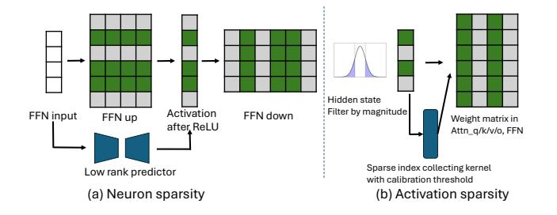

Figure 2. Comparison between (a) neuron sparsity and (b) activation sparsity.

achieves up to 1.55× end-to-end decoding latency reduction with negligible accuracy degradation compares to the dense quantized baseline.At the hardware level, our designs delivers up to 1.8× higher GFLOPS over standard quantized baselines.

Contributions This paper makes the following contributions: (1) We propose a novel Zigzag weight layout tailored for activation sparsity and quantized LLM weights. With the layout, GPU preserves data locality, while skipping computations and memory access in a structural fashion.

- (2) We design new GPU kernels optimized for the weight layout and multiple quantization levels. These kernels maximize parallelism under sparse hidden states; their indexcollector captures dynamic sparsity patterns at runtime, enabling fully integrated end-to-end inference.
- (3) We develop SpQt, a complete system that provides both quantization and sparse-inference capabilities for on-device LLMs. Comprehensive evaluations on consumer devices demonstrate significant latency and throughput improvements over existing quantization baselines.

## 2 MOTIVATIONS

Dynamic Sparsity: Neuron vs. Activation As illustrated in Figure 2, dynamic sparsity can be categorized into two representative forms: neuron sparsity and activation sparsity. Both aim to reduce computation by skipping unnecessary weight–activation multiplications, but they differ in where sparsity arises and how it can be exploited during inference.

Neuron sparsity [\(Liu et al.,](#page-10-0) [2023\)](#page-10-0) focuses on the feedforward network (FFN) layers, particularly those using the ReLU activation function. ReLU sets some activation entries to zero when their pre-activation inputs are negative. Recall that in the FFN up-projection, each activation entry xi is computed as W upi,: · xinput; in the subsequent down-projection, the same xi multiplies W down:,i. When xi = 0, both of these matrix–vector multiplications can be skipped without affecting the output. Despite this potential, neuron sparsity faces two main limitations. First, it is confined to FFN layers with ReLU activations, while recent LLMs have transitioned to smoother nonlinearities such as SwiGLU [\(Shazeer,](#page-10-0) [2020;](#page-10-0) [Dubey et al.,](#page-9-0) [2024;](#page-9-0) [Yang et al.,](#page-10-0) [2025\)](#page-10-0). Although some recent work proposes reverting to ReLU activations [\(Mirzadeh et al.,](#page-10-0) [2024\)](#page-10-0), doing so requires additional fine-tuning, which is impractical for most users. Second, the sparsity pattern in FFNs is a posterior property—it can only be known after the activation is computed. Leveraging it therefore requires predicting the sparse pattern in advance. Prior work typically employs auxiliary low-rank predictors trained per layer to forecast which neurons will be activated, but these add nontrivial overhead and complicate deployment.

In contrast, activation sparsity [\(Liu et al.,](#page-10-0) [2025\)](#page-10-0) generalizes this idea to all weight–activation multiplications in modern LLMs. Instead of focusing on FFN-specific structures, it examines the hidden states and assumes that entries with small magnitudes contribute little to the final output. Formally, any hidden state entry satisfying |xi | < threshold can be treated as zero, allowing the corresponding column W:,i in the weight matrix to be skipped. Activation sparsity is easy to apply to diverse model architectures: a threshold can be calibrated once using calibration data, eliminating the need for layer-specific predictors.

### Conflict between dynamic sparsity and quantization

Deploying dynamic sparsity efficiently on GPU-equipped client devices requires specialized sparse GEMV kernels. In full-precision settings, where each weight is stored independently, such kernels are straightforward to implement. However, when quantization is introduced, the situation becomes more complex. In K-quantization (adopted in llama.cpp) [\(Gerganov,](#page-10-0) [2022;](#page-10-0) [Kawrakow,](#page-10-0) [2023\)](#page-10-0), weights are quantized and packed into fixed-size blocks. For example, in 4-bit quantization (Q 4K), 256 consecutive weights are grouped into one block, with 4-bit compressed weights and associated 32-bit scale and offset values for dequantization. These blocks are typically organized row-wise to simplify kernel design, a convention also followed by other quantization methods [\(Dettmers et al.,](#page-9-0) [2022b;](#page-9-0) [Frantar et al.,](#page-10-0) [2022\)](#page-10-0). This row-wise grouping, however, directly conflicts with the column-wise sparsity pattern inherent in both neuron and activation sparsity. Sparse columns become scattered across multiple quantization blocks, making it difficult to skip computations efficiently. GPU kernels operate at the group level—for instance, in Q 4K, eight threads in a threadgroup are assigned to process a block. Skipping arbitrary weights within a block introduces branch conditions, leading to severe warp divergence and degraded performance. A na¨ıve alternative is to reorganize quantization blocks column-wise to align with the sparsity structure. While this alleviates the skipping problem, it disrupts memory locality because all

the threadgroups working on different columns must write back to the final result tensor, resulting in excessive memory write overhead. These conflicts reveal a fundamental incompatibility between existing quantization weight layouts and dynamic sparsity execution. This motivates the need for a novel weight layout and kernel co-design that reconciles sparsity-aware computation with quantized weight organization.

## 3 OVERVIEW

### 3.1 System model

SpQt consists of a complementary set of GPU kernels, a new model graph that integrates these kernels into the LLM implementation, and a standalone quantization tool that converts the model into the expected zigzag weight layout. The overall system architecture and workflow are shown in [Figure 3.](#page-3-0) SpQt targets client devices such as smartphones, laptops, and desktops. The current implementation is specifically optimized for Apple silicon GPUs, which are commonly used for personal, on-device LLM deployments.

#### 3.2 The Operations

To deploy LLMs with SpQt, similar to the standard quantization procedure, the model is first quantized into the zigzag weight layout using the customized quantization tool provided. This is a one-time preprocessing step for each model. SpQt then profiles each new hardware platform with a set of GEMV shapes and its kernel to determine the optimal hyperparameter configuration for the new GEMV kernel.

During model inference, SpQt works with the quantized model to enable sparse computation. Specifically, for each GEMV operation except the final output embedding, the hidden states first passes through a sparse index collecting kernel to collect the indices of non-sparse entries. These indices, together with the hidden state, are then fed into the new GEMV kernel to complete the sparse computation. The sparse index collecting kernel operates with a predefined threshold, which is obtained through calibration profiling. Based on different sparsity levels, different thresholds are applied. We evaluate both a unified sparsity setting and a customized sparsity setting following TEAL [\(Liu et al.,](#page-10-0) [2025\)](#page-10-0).

#### 3.3 Applicability

Our implementation builds on K-quantization for LLMs. The proposed ideas apply broadly to GEMV operations with group-wise quantized weight matrices. The design focuses on the decoding stage, where one token is processed in each round. We also expect it to support beam search decoding with small beam sizes. The current implementation targets

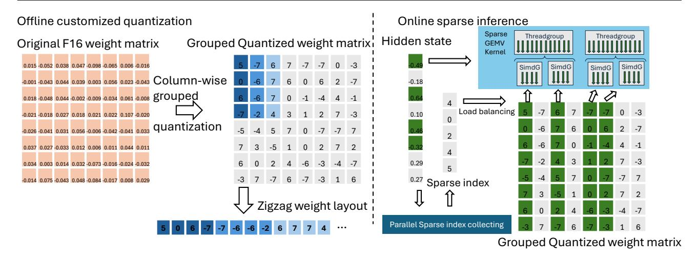

Figure 3. System architecture of SpQt and workflow.

Apple GPUs and is written in Metal Shading Language. We anticipate that NVIDIA GPUs can also be supported through a CUDA-based implementation.

#### 4 DESIGN

#### 4.1 New Zigzag quantization weight layout

#### 4.1.1 Primer on Quantization

Large language models (LLMs) achieve strong generalization through billions of parameters, but this scale makes on-device deployment challenging due to large memory footprint and memory bandwidth bottlenecks. Quantization mitigates both issues by representing weights in lower precision, reducing model size and improving throughput. Methods such as LLM.int8() (Dettmers et al., 2022a), GPTQ (Frantar et al., 2022), and K-quantization (Kawrakow, 2023) demonstrate that 8-bit and 4-bit formats can shrink models to <30% of FP16 size and deliver 2–3× speedup with minimal accuracy loss.

Low-bit quantization is conducted on group level rather than per-weight level, to avoid excessive metadata overhead. Group sizes typically range from 32 to 256 weights, trading off accuracy and efficiency. A representative example is Q4\_K (4 bit K-quantization) in llama.cpp, which groups weights row-wise into 256-element superblocks, each split into eight 32-element blocks. Weights are stored in 4 bits, with shared 6-bit block scales and a 16-bit superblock scale and min. During inference, weights are dequantized on the fly and multiplied with hidden states, enabling compact storage and efficient GPU execution.

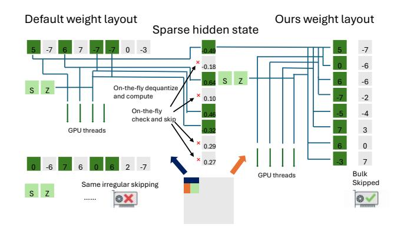

Figure 4. Our weight layout enables structural skipping of the computation and works more efficient with the activation sparsity compares to default weight layout in GPU processing

#### 4.1.2 Challenges and our Zigzag weight layout

**Challenges** Grouping weights along rows of the weight matrices is the common approach, as it simplifies implementation: (1) It naturally aligns with row-parallel GEMV execution on GPUs. (2) Threads can process consecutive weights efficiently with good memory locality. However, this row-wise grouping conflicts with activation sparsity. In activation sparsity, each zeroed hidden state entry corresponds to a column of the weight matrix. When the input hidden state has a sparse pattern, the relevant columns are scattered across many row-grouped superblocks. Skipping these weights individually introduces several problems: (1) Branch divergence: In Q4\_K, for example, 8 threads cooperatively process one superblock (32 weights each). To skip scattered sparse weights, fine-grained branching must be added for every weight, which significantly hurts SIMT efficiency. (2) Synchronization overhead: Divergent branches

make inter-threadgroup synchronization difficult and degrade performance. Empirical experiment results show that only skip the entire superblock is practical.

Zigzag weight layout: Column-Aligned Grouping with Row-Major Storage To address this misalignment, we propose the Zigzag weight layout, a co-designed quantization weight layout that aligns with column-wise sparsity while preserving memory locality: (1) Column-based grouping: We group weights along the column dimension, so that if an input hidden state entry is sparse, all superblocks corresponding to that column can be skipped as a unit. This transforms irregular element-level skipping into structured block-level skipping. (2) Row-major superblock storage: Although grouping is column-wise, superblocks are stored in row-major order. This ensures that the output GEMV results corresponding to consecutive output neurons remain contiguous in memory, enabling efficient coalesced access during GPU execution. This zigzag arrangement provides the best of both worlds: structured sparsity skipping without branching and maintained memory locality for efficient GPU execution. (Details on kernel design to exploit this layout are discussed in Section 4.2.)

#### *4.1.3 Applicability and generalizability*

Our Zigzag weight layout is conceptually simple and widely applicable. It is implemented on top of K-quantization, but it can be applied to any group-based quantization scheme (e.g., GPTQ) and any bitwidth (e.g., 2–8 bit). It is modelagnostic and works for both autoregressive decoding and small-beam search scenarios. It is particularly beneficial when combined with activation sparsity strategies such as TEAL [\(Liu et al.,](#page-10-0) [2025\)](#page-10-0).

#### 4.2 Kernel design for quantized activation sparsity

#### *4.2.1 Default GPU processing scheme and challenges*

Modern GPUs follow the Single-Instruction Multiple-Threads (SIMT) execution model. Threads are organized hierarchically into warps (or simdgroups in Apple Metal), threadblocks (threadgroups), and grids. GPU compute kernels are designed to expose as much parallelism as possible by splitting the workload into fine-grained subtasks distributed across many threads. In standard LLM inference, quantized GEMV operations are implemented with highly parallel GPU kernels. Under the row-wise quantization layout (e.g., Q4 K), the kernel assigns many small threadgroups to process different rows of the weight matrix in parallel. Concretely, for a GEMV of shape (m, n) × (n, 1), the default Q4 K kernel typically launches m/4 threadgroups, each with 32 threads, to process four rows simultaneously. Since the m : n ratio in LLM layers usually lies between 4:1 and 1:4, this row-level parallelism is sufficient to sat-

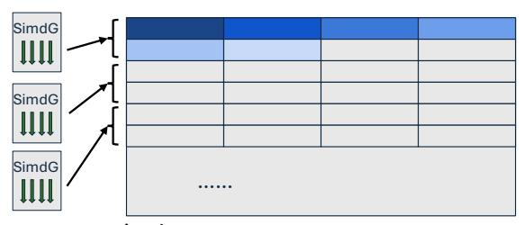

× n\_row simdgroup

## Default GEMV kernel row-level parallelism Our GEMV kernel row+column parallelism

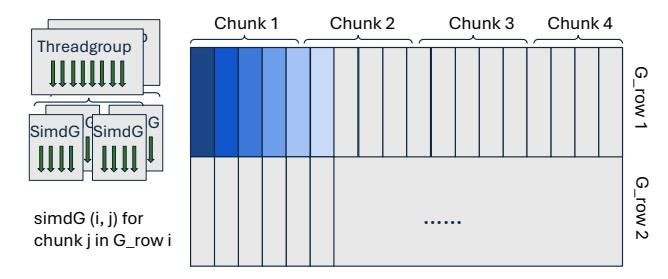

× (n\_row / group\_size ×n\_chunk) simdgroup

Figure 5. Our kernel introduces new parallelism scheme on the column dimension on top of the Zigzag weight layout, creates more flexibility on parallelism.

urate the GPU's compute resources. However, our zigzag weight layout groups weights along the column dimension, not the row. This changes the structure of the workload: In Q4 K (row grouping), each superblock corresponds to 256 columns in a single row. In zigzag (column grouping), each superblock spans 256 rows in a single column. Thus, the original compute kernel designed for row grouping cannot be directly reused. A new kernel is required to map GPU parallelism effectively onto the column-grouped weight layout, while retaining high utilization and memory locality.

#### *4.2.2 Zigzag GPU compute kernel*

To support column-wise grouped weights, one natural idea is to directly adopt a column-parallel processing scheme. In this design, each small threadgroup would be responsible for one or a few columns of superblocks. At first glance, this appears to provide a similar degree of parallelism as the original row-parallel kernel. However, this approach introduces a critical problem at the output accumulation stage. Since all threadgroups contribute to the same output vector, all of their partial results must be written to global memory through atomic operations. The resulting synchronization and memory traffic create significant overhead, which undermines the performance benefits of parallelism. For this reason, a purely column-parallel strategy is unsuitable for our goal of efficient sparse inference on mobile

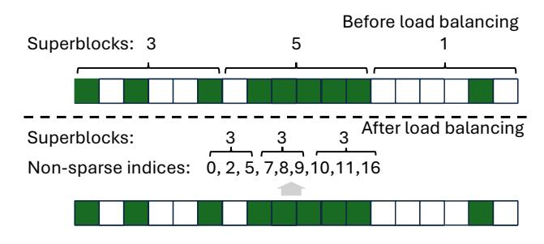

Figure 6. Load balancing for activation sparsity.

GPUs. Instead, we adopt a hybrid strategy that preserves row-level parallelism while introducing controlled columnlevel parallelism inside each superblock row. Concretely, for each row of superblocks, we launch n1 threadgroups, each containing n2 simdgroups. The total n1 × n2 simdgroups collaboratively process the column segments within that row. Each simdgroup iterates through its assigned segment of superblocks, performs local multiply–accumulate operations, and keeps intermediate partial sums in registers or local memory. Only after finishing its segment does it synchronize with other simdgroups in the same row to reduce the local partials into the final output vector. This approach eliminates the heavy write contention of column-parallel design while still enabling fine-grained parallelism along the column dimension. Compared to the default Q4 K kernel, the degree of row-wise parallelism is reduced from m/4 to m/256, since each superblock row corresponds to 256 rows of weights. At the same time, the degree of intra-row parallelism is increased from 1 to n1 × n2, which gives us a flexible tuning space to match the workload characteristics and device capabilities. [Figure 5](#page-4-0) shows the parallelism scheme difference between the default kernel and ours. The optimal configuration of n1 × n2 depends on several factors. For layers with long row dimensions, such as the down-projection in feed-forward networks, a higher intrarow parallelism tends to yield better utilization. On GPUs with lower memory bandwidth, however, smaller n1 × n2 values are preferred to reduce synchronization and memory write overhead. In addition, changing the quantization bitwidth shifts the balance between computation and memory access, which in turn influences the best configuration. By adjusting these parameters, the zigzag kernel can achieve performance comparable to, and in many cases better than, the default kernel even in dense compute scenarios.

#### *4.2.3 Load balancing for activation sparsity*

While the zigzag kernel performs efficiently in dense scenarios, introducing activation sparsity complicates the execution dynamics. A naive way to exploit sparsity is to check the hidden state entry value during kernel execution and skip the corresponding superblock if it falls below the sparsity

threshold. Although conceptually simple, this strategy leads to severe workload imbalance across simdgroups. In the dense case, each simdgroup is assigned an equal number of superblocks, which guarantees balanced execution and minimal synchronization overhead. When sparsity is applied, however, the number of active superblocks assigned to each simdgroup becomes unpredictable. Some simdgroups may skip most of their assigned work, while others must process a disproportionately large number of active superblocks. As a result, faster simdgroups are forced to wait at synchronization points, creating stragglers and hurting overall kernel efficiency. To address this problem, we decouple the mapping of threadgroups from the static structure of the matrix and base it instead on the actual active entries at runtime. Specifically, before launching the main GEMV kernel, we run a sparse index collection pass that scans the hidden state vector and records the indices of all non-sparse entries. This results in an array idx[0 : nns], where nns is the number of active (non-sparse) entries. The GEMV kernel then partitions this index array evenly across the available simdgroups rather than statically assigning them consecutive superblocks. If there are n1 × n2 simdgroups working on a superblock row, each simdgroup processes approximately nns/(n1 × n2) active superblocks. Figure 6 shows a minimal example of load balancing when nns = 9 and n1 × n2 = 3. This dynamic redistribution ensures that all simdgroups receive a balanced amount of actual work regardless of the sparsity pattern. By equalizing the workload in this way, we significantly reduce idle time during synchronization and maintain high GPU utilization even at high sparsity levels.

Sparse index collecting kernel design Efficient sparse index collection is a key component of the load balancing scheme. The task can be formulated as a classic parallel scan problem: given a binary mask representing which hidden state entries are above the sparsity threshold, we need to produce the list of indices corresponding to active entries. Our implementation follows a two-stage design. First, we perform a parallel prefix-sum (scan) over the binary mask to determine the output positions for each active entries. We use the Blelloch prefix-sum algorithm [\(Blelloch,](#page-9-0) [1990\)](#page-9-0), a well-established approach that allows work-efficient parallel scans. Second, based on the prefix-sum results, each thread writes its active index into the correct position of the output array, producing a compact list of active column indices. Since the number of threads in a single threadgroup is limited (for example, 1024 on Apple GPUs), we divide the mask into multiple segments and assign one threadgroup to each segment. A global atomic counter tracks the number of indices already written to the output array. When a threadgroup finishes its scan and scatter, it atomically reserves an offset in the global output buffer, increments its local index positions accordingly, and writes the indices to their final

locations. This strategy maintains full parallelism across multiple threadgroups and ensures that the output index array is stored contiguously, enabling efficient coalesced reads in the subsequent sparse GEMV kernel. The combination of prefix-sum–based indexing and atomic offset accumulation provides a fast, scalable mechanism for handling sparsity without compromising GPU efficiency.

## 5 IMPLEMENTATION

We implement our system in approximately 8K SLOC of C/C++ on top of the llama.cpp [\(Gerganov,](#page-10-0) [2022\)](#page-10-0) b5711 release. In addition, we develop a calibration threshold calculation tool in roughly 100 lines of Python, building on top of TEAL [\(Liu et al.,](#page-10-0) [2025\)](#page-10-0), to compute thresholds corresponding to different levels of activation sparsity.

Customized quantization We extend the original llama.cpp quantization tool to support our zigzag weight layout. Using this tool, we quantize a series of Llama models, including Llama 2 (7B, 13B, 70B) and Llama 3 (8B). Following the standard practice in LLM inference, we quantize all weight matrices involved in GEMV during decoding—except for the token embedding and the output embedding—to Q4 K format under the new layout. This quantization step is a one-time preprocessing effort per model, and the time cost is comparable to the default quantization. For example, quantizing a 70B model takes less than five minutes on a commodity workstation.

Calibration threshold calculation To support different sparsity configurations, we reuse activation calibration results from TEAL and build an additional tool to compute sparsity thresholds. The tool supports two modes. In the unified sparsity mode, a single global sparsity level is applied to all components, and the corresponding threshold is computed uniformly. In the customized TEAL mode, we reuse TEAL's greedy search sparsity pattern but compute average sparsity for two groups of the matrices: Wq, Wk, Wv and Wf fn−up, Wf fn−gate to let them so that they share a common threshold. This strategy reduces the overhead of sparse index collection.

Operation details The overall inference workflow of our system remains consistent with conventional LLM inference. The prompt tokens are first processed in the prefill stage, followed by autoregressive decoding where tokens are generated one by one using greedy decoding. During the prefill stage, the system executes dense kernels rather than sparse ones. This choice is motivated by two factors. First, the hidden states across different prompt tokens exhibit low sparsity when aggregated, as different tokens trigger different sets of neurons. Second, prior work (TEAL) has shown that applying sparse computation during prefill can degrade

| Platforms | GPU core | GPU freq | Mem bandwidth | SoC TDP |
|-----------|----------|----------|---------------|---------|
| A19 pro   | 5        | 1.6 GHz  | 75.8 GB/s     | ~5 W    |
| M2        | 8        | 1.4 GHz  | 102.4 GB/s    | ~20 W   |
| M2 Pro    | 19       | 1.4 GHz  | 204.8 GB/s    | ~45 W   |
| M2 Max    | 30       | 1.4 GHz  | 819.2 GB/s    | ~80 W   |

Table 1. Hardware configurations for evaluation.

overall model quality. At runtime, the system automatically dispatches dense kernels when the token count is greater than one, and sparse kernels during decoding. The dense kernel currently extends from our GEMV implementation and therefore does not yet employ a dedicated tiling-based GEMM optimization. Our zigzag weight layout is compatible with such tiling optimizations, and we plan to integrate them in future work to further reduce prefill latency.

## 6 EVALUATION

#### 6.1 Evaluation setup

In this evaluation, we aim to demonstrate the effectiveness of SpQt in enabling low-bit LLM inference with activation sparsity and achieving speedups on client devices.

Test platforms We evaluate SpQt on a range of Armbased chips designed for client devices, including the Apple M2 series (5 nm) and A19 Pro (3 nm), as listed in Table 1. Apple Silicon devices are well known for their strong GPU support and large unified memory, and have become popular in the AI community for hosting local LLM inference.

Models and Datasets We evaluate Llama-2 and Llama-3 models at scales ranging from 7B to 70B parameters. These models are chosen because they are widely used open-source LLMs and their architectures are representative of the state of the art. We use 4-bit K-quantization as the main testing configuration, as it offers a strong balance between model size, inference latency, and accuracy. The Llama-3-70B model is excluded from evaluation due to a known quantization accuracy degradation issue specific to this model [\(Qin,](#page-10-0) [2024\)](#page-10-0). For accuracy evaluation, we use the wikitext.test dataset to measure perplexity under different settings. For latency evaluation, we conduct inference using a short prompt of approximately 10 tokens and report the resulting per-token decoding latency.

Baselines We evaluate our approach against several baselines for both end-to-end LLM inference and GEMV microbenchmarks:

• K-quant original (Q4 K) – The default K-quantization kernel used in llama.cpp, which represents the most widely adopted baseline for low-bit LLM inference.

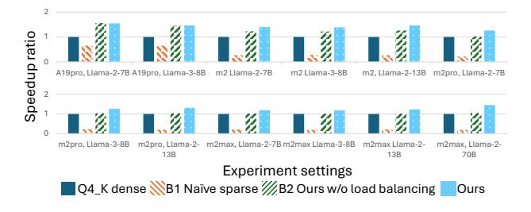

Figure 7. End-to-end speedup at 50% sparsity compared to three baselines. B1 suffers from severe slowdown, B2 offers limited gains, while our method generally delivers higher speedup across all settings.

This serves as the dense quantized reference implementation.

- Naive sparse (original weight layout) A straightforward extension of the default kernel that skips computations for sparse weights within each superblock without modifying the weight layout. This baseline reflects the naive application of activation sparsity on top of existing quantized kernels.
- Ours dense Our new kernel implementation using the zigzag quantization weight layout, without applying sparsity. This isolates the benefit of the new layout and kernel design under dense execution.
- Ours sparse (no load balancing) Extends Ours dense by skipping superblock computations on the fly when the corresponding entries in the hidden states are sparse. This baseline captures the impact of activation sparsity without addressing load imbalance.
- Ours sparse (full) Our complete kernel with zigzag layout and load-balanced sparse execution at different sparsity levels. This represents the full design of SpQt.

All sparse baselines are evaluated under 25%, 40%, and 50% sparsity levels.

#### 6.2 End-to-end results

Latency reduction We benchmark Llama-2 (7B, 13B and 70B) and Llama-3 (8B) models on Apple A19 pro, M2, M2 Pro and M2 Max chips to evaluate our method on end-toend decoding speedup. As shown in the Table 2, quantization alone already provides significant acceleration, with 4 bit quantization (Q4 K) achieving more than 2× speedup over the full-precision baseline. Building on top of this, our method brings a consistent decoding throughput improvement as sparsity increases. Specifically, the decoding throughput improves by up to 1.47× on M2 Max, 1.33× on

| hardware | sparsity             | Llama-2         |                             |               | Llama-3       |
|----------|----------------------|-----------------|-----------------------------|---------------|---------------|
|          |                      | 7B              | 13B                         | 70B           | 8B            |
|          | A19 Pro Baseline-F16 | OOM             | -                           | -             | OOM           |
|          | Baseline-Q4K         | 14.78 (1.00×) - |                             | -             | 13.24 (1.00×) |
|          | TEAL 25%             | 17.04 (1.15×) - |                             | -             | 15.13 (1.14×) |
|          | TEAL 40%             | 19.92 (1.35×) - |                             | -             | 17.4 (1.31×)  |
|          | TEAL 50%             | 22.79 (1.54×) - |                             | -             | 19.3 (1.46×)  |
|          | Unified 25%          | 17.22 (1.17×) - |                             | -             | 15.08 (1.14×) |
|          | Unified 40%          | 19.37 (1.31×) - |                             | -             | 17.23 (1.30×) |
|          | Unified 50%          | 22.86 (1.55×) - |                             | -             | 19.29 (1.46×) |
| M2       | Baseline-F16         | OOM             | OOM                         |               | OOM           |
|          | Baseline-Q4K         |                 | 21.98 (1.00x) 11.55 (1.00x) | -             | 20.03 (1.00x) |
|          | TEAL 25%             |                 | 23.91 (1.09x) 13.18 (1.14x) | -             | 21.90 (1.09x) |
|          | TEAL 40%             |                 | 27.32 (1.24x) 15.11 (1.31x) | -             | 25.05 (1.25x) |
|          | TEAL 50%             |                 | 31.16 (1.42x) 17.05 (1.48x) | -             | 27.93 (1.39x) |
|          | Unified 25%          |                 | 24.06 (1.09x) 13.12 (1.14x) | -             | 21.83 (1.09x) |
|          | Unified 40%          |                 | 27.69 (1.26x) 15.00 (1.30x) | -             | 24.85 (1.24x) |
|          | Unified 50%          |                 | 30.69 (1.40x) 16.82 (1.46x) | -             | 27.78 (1.39x) |
|          | M2 Pro Baseline-F16  | OOM             | OOM                         |               | OOM           |
|          | Baseline-Q4K         |                 | 37.29 (1.00x) 20.52 (1.00x) | -             | 34.64 (1.00x) |
|          | TEAL 25%             |                 | 37.28 (1.00x) 21.42 (1.04x) | -             | 34.79 (1.00x) |
|          | TEAL 40%             |                 | 42.33 (1.14x) 24.48 (1.19x) | -             | 39.16 (1.13x) |
|          | TEAL 50%             |                 | 46.88 (1.26x) 27.37 (1.33x) | -             | 44.50 (1.28x) |
|          | Unified 25%          |                 | 37.13 (1.00x) 21.36 (1.04x) | -             | 34.27 (0.99x) |
|          | Unified 40%          |                 | 41.81 (1.12x) 24.27 (1.18x) | -             | 38.65 (1.12x) |
|          | Unified 50%          |                 | 47.17 (1.26x) 27.00 (1.32x) | -             | 43.80 (1.26x) |
|          | M2 Max Baseline-F16  |                 | 24.43 (0.42x) 12.99 (0.38x) | OOM           | 22.04 (0.40x) |
|          | Baseline-Q4K         |                 | 57.96 (1.00x) 34.26 (1.00x) | 7.83 (1.00x)  | 55.20 (1.00x) |
|          | TEAL 25%             |                 | 57.54 (0.99x) 34.39 (1.00x) | 8.78 (1.12x)  | 54.42 (0.99x) |
|          | TEAL 40%             |                 | 64.16 (1.11x) 38.57 (1.13x) | 10.24 (1.31x) | 60.13 (1.09x) |
|          | TEAL 50%             |                 | 68.75 (1.19x) 42.07 (1.23x) | 11.48 (1.47x) | 64.71 (1.17x) |
|          | Unified 25%          |                 | 57.59 (0.99x) 34.22 (1.00x) | 8.68 (1.11x)  | 53.65 (0.97x) |
|          | Unified 40%          |                 | 63.08 (1.09x) 38.17 (1.11x) | 10.04 (1.28x) | 59.83 (1.08x) |
|          | Unified 50%          |                 | 68.87 (1.19x) 42.09 (1.23x) | 11.33 (1.45x) | 65.07 (1.18x) |

Table 2. End-to-end decoding latency (ms/token) and speedup over dense Q4 K across Llama models and Apple SoCs. Our method achieves up to 1.55× speedup on A19 Pro, 1.46× on M2, 1.32× on M2 Pro, and 1.45× on M2 Max.

M2 Pro and 1.39× on M2 compare to the Q4 K dense baseline at 50% sparsity. Larger models on weaker hardware show show greater speedups, indicating our method works better when the compute is more intense to the hardware.

Compared with Baseline 1 (Naive sparse in original weight layout) and Baseline 2 (our layout without load balancing), SpQt achieves consistently higher speedup across different hardware platforms and model sizes (Figure 7). Baseline 1 suffers from substantial overhead introduced by fine-grained branching in GPU kernels, which significantly delays execution. Baseline 2 provides moderate improvements by eliminating branch conditions, but its performance is limited by workload imbalance across threadgroups. Even at 50% sparsity, the observed speedup is notably lower than expected. In contrast, our full design effectively removes both branching and imbalance, leading to superior performance.

Accuracy comparison We evaluate the impact of activation sparsity on model quality using perplexity across multiple Llama models and sparsity levels [\(Table 3\)](#page-8-0). Consistent with TEAL [\(Liu et al.,](#page-10-0) [2025\)](#page-10-0), applying sparsity up to 50% introduces only minor accuracy degradation while enabling substantial speedups. For example, on Llama-2-7B,

| Method/Model | Llama-2 |      |      | Llama-3 |
|--------------|---------|------|------|---------|
|              | 7B      | 13B  | 70B  | 8B      |
| Baseline-F16 | 5.13    | 4.62 | 3.27 | 5.64    |
| Baseline-Q4K | 5.28    | 4.69 | 3.35 | 5.93    |
| TEAL 25%     | 5.26    | 4.68 | 3.41 | 6.00    |
| Unified 25%  | 5.27    | 4.69 | 3.41 | 5.94    |
| TEAL 40%     | 5.39    | 4.77 | 3.50 | 6.17    |
| Unified 40%  | 5.40    | 4.79 | 3.55 | 6.42    |
| TEAL 50%     | 5.59    | 4.90 | 3.70 | 6.61    |
| Unified 50%  | 5.65    | 4.97 | 3.77 | 6.67    |
| TEAL 65%     | 6.78    | 5.58 | 4.45 | 8.92    |
| Unified 65%  | 7.39    | 5.96 | 4.48 | 9.59    |

Table 3. Perplexity of Llama-2/3 models under Q4\_K quantization and different activation sparsity levels. Up to 50% sparsity results in only marginal degradation compared to dense inference, while higher sparsity (65%) shows noticeable quality loss.

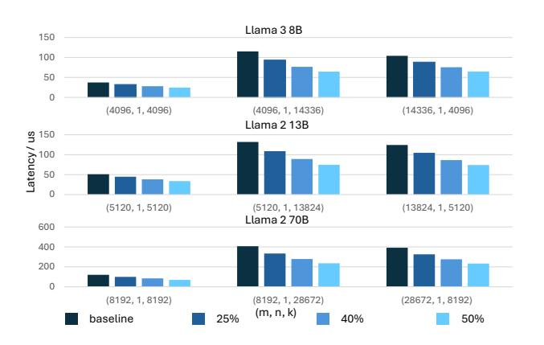

Figure 8. Latency of sparse GEMV decreases steadily with higher sparsity levels (25%–50%) across GEMV shapes from Llama-3-8B, Llama-2-13B, and Llama-2-70B, with the greatest gains for large K.

perplexity increases from 5.28 (Q4\_K) to 5.27 at 25% and 5.65 at 50% sparsity, with similar trends for larger models and changes typically below 0.4.

At 65% sparsity, the degradation becomes more noticeable (e.g.,  $5.28 \rightarrow 7.39$  on Llama-2-7B), reflecting the loss of informative hidden state entries. Overall, activation sparsity up to 50% maintains accuracy close to dense inference, validating its practicality for training-free, quantized LLM decoding.

#### 6.3 Micro-benchmark on GEMV

**Dense GEMV comparison** We benchmark our kernel on 15 GEMV input shapes with  $m \in 2048, 4096, 8192$  and  $k \in 1024, 2048, 4096, 8192, 16384$ . Figure 10 reports the latency of our kernel relative to the dense baseline under different hyperparameter settings. Across all shapes, with an

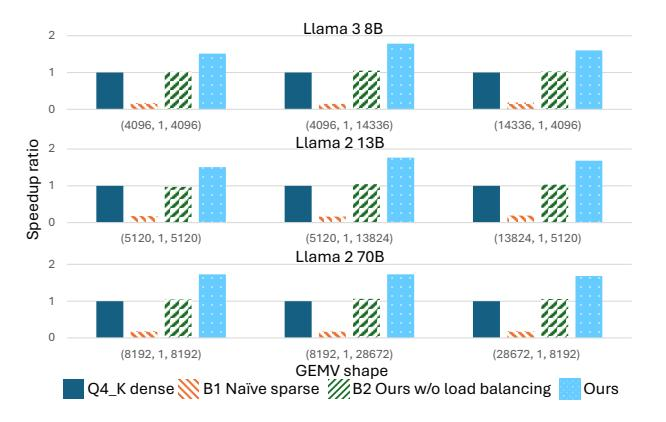

Figure 9. Speedup of sparse GEMV at 50% sparsity across GEMV shapes from Llama-3-8B, Llama-2-13B, and Llama-2-70B. Naïve sparse (B1) shows significant slowdown due to branching, B2 shows modest gains, and our full design delivers 1.51–1.78× speedup by combining zigzag layout with load-balanced kernel.

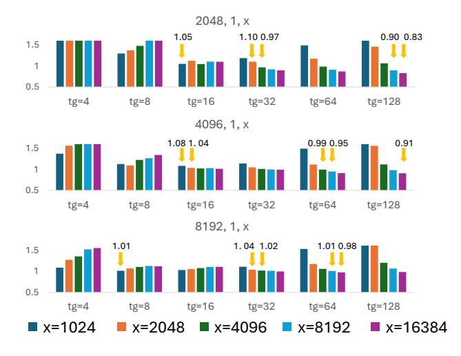

Figure 10. Relative latency of our dense GEMV kernel under different threadgroup counts (tg) and input size (x), with simdgroup count fixed at 2. With appropriate tg settings, our kernel matches or outperforms the baseline. Larger GEMV shapes benefit more from the kernel's flexible multi-dimensional parallelism, leading to improved scalability and efficiency.

appropriate configuration, our kernel consistently achieves performance on par or better than the baseline, reaching up to 17% lower latency.

Two hyperparameters strongly influence performance: (1) the simdgroup count within each threadgroup, and (2) the threadgroup count per superblock row of the weight matrix. The simdgroup setting controls the level of parallelism within a threadgroup and its resource footprint. Empirically, a simdgroup count of 2–4 provides the best balance between parallelism and hardware utilization. All results in Figure 10

adopt sg=2 as the default.

We observe that the optimal threadgroup count depends on k dimension. Larger k values favor higher threadgroup counts, which better exploit parallelism along the row dimension, while smaller k values benefit from lower threadgroup counts to reduce synchronization overhead. Overall, our kernel demonstrates the largest gains at high k:m ratios, where increased parallelism can be effectively utilized.

Sparse GEMV speedup We benchmark our sparse kernel on GEMV shapes in Llama-3-8B, Llama-2-13B and Llama-2-70B. As shown in [Figure 8,](#page-8-0) at 25%, 40% and 50%, our kernel effectively delivers up to 1.22× speedup for 25%, up to 1.51× speedup for 40% and up to 1.78× speedup for 50%. Larger K dimension benefit more from sparsity due to more flexible parallelism setting in our kernel. The best configuration on threadgroups and simdgroups (tg = 32, sg = 2) remains effective under sparse GEMV computation. The overall results also show our kernel design can properly handle the dynamic sparsity and maintain scalability under different sparse level.

We further compare our sparse kernel against the dense baseline, Naive sparse (B1), and Ours without load balancing (B2) at 50% sparsity [\(Figure 9\)](#page-8-0). Across all tested input shapes, B1 exhibits severe slowdowns, achieving less than 0.2× speedup due to fine-grained branching in the GPU kernel that stalls parallel execution. B2 provides only modest gains (1.02-1.06×) despite the 50% sparsity, as load imbalance offsets most of the potential time savings. In contrast, our full design consistently achieves 1.51–1.78× speedup, demonstrating the effectiveness of combining the zigzag weight layout with load-balanced GPU kernel design for quantized GEMV under activation sparsity.

## 7 RELATED WORK

Dynamic Sparsity in LLM inference Dynamic sparsity reduces inference cost by exploiting the fact that different inputs activate only subsets of model weights. Early work such as DejaVu [\(Liu et al.,](#page-10-0) [2023\)](#page-10-0) and PowerInfer [\(Song](#page-10-0) [et al.,](#page-10-0) [2024\)](#page-10-0) targeted FFN layers with ReLU activations, requiring fine-tuning [\(Mirzadeh et al.,](#page-10-0) [2024\)](#page-10-0) for FFN with other activations and auxiliary predictors, complicating deployment. More recent methods, including TEAL [\(Liu et al.,](#page-10-0) [2025\)](#page-10-0) and R-Sparse [\(Zhang et al.,](#page-10-0) [2025\)](#page-10-0), generalize sparsity to low-magnitude hidden state entries across the entire network, achieving substantial savings with minimal accuracy loss. However, these approaches focus on dense weight layouts and full-precision kernels, leaving integration with quantized models unexplored. Our work addresses this gap through a co-designed weight layout and GPU kernel for low-bit sparse inference.

Quantization for efficient LLM inference Quantization reduces memory footprint and boosts throughput by lowering weight bitwidth, as shown in LLM.int8() (Dettmers et al., 2022a), GPTQ [\(Frantar et al.,](#page-10-0) [2022\)](#page-10-0), and Kquantization [\(Kawrakow,](#page-10-0) [2023\)](#page-10-0). Existing methods optimize dense inference, but conventional row-grouped layouts misalign with activation sparsity. We introduce a zigzag weight layout that structurally aligns with sparsity and enables efficient skipping.

GPU kernel support for sparse computation Effectively leveraging sparsity requires dedicated GPU kernel support. Polar Sparsity [\(Shrestha et al.,](#page-10-0) [2025\)](#page-10-0) explores sparsityaware GPU acceleration for batched LLM serving, while SpInfer [\(Fan et al.,](#page-10-0) [2025\)](#page-10-0) utilizes tensor cores for SpMM acceleration. TEAL [\(Liu et al.,](#page-10-0) [2025\)](#page-10-0) and PowerInfer [\(Song](#page-10-0) [et al.,](#page-10-0) [2024\)](#page-10-0) also include GPU kernels for dynamic sparse inference but primarily target full-precision or static sparsity scenarios. These approaches highlight the potential of GPU kernel optimization for sparse execution, yet they do not address the interaction between dynamic sparsity and quantized weight layouts, which is particularly critical for edge and client deployments. Our work bridges this gap through a co-design of quantization layout and GPU kernel, enabling low-bit dynamic sparse inference on mobile GPUs.

## 8 CONCLUSIONS

We presented SpQt, a new method for efficient low-bit LLM inference that leverages dynamic sparsity. SpQt introduces a zigzag quantization layout aligned with activation sparsity and a sparsity-aware GPU kernel that maximizes parallelism and preserves data locality. This co-design bridges the gap between quantization and sparsity, enabling practical sparse inference on client devices. Our evaluation shows up to 1.55× decoding throughput improvement with minimal accuracy loss.

## REFERENCES

Blelloch, G. E. Prefix sums and their applications. 1990.

Dettmers, T., Lewis, M., Belkada, Y., and Zettlemoyer, L. Llm.int8(): 8-bit matrix multiplication for transformers at scale. In *Proceedings of the 36th International Conference on Neural Information Processing Systems*, NIPS '22, Red Hook, NY, USA, 2022a. Curran Associates Inc. ISBN 9781713871088.

Dettmers, T., Lewis, M., Belkada, Y., and Zettlemoyer, L. Gpt3. int8 (): 8-bit matrix multiplication for transformers at scale. *Advances in neural information processing systems*, 35:30318–30332, 2022b.

Dubey, A., Jauhri, A., Pandey, A., Kadian, A., Al-Dahle,

- A., Letman, A., Mathur, A., Schelten, A., Yang, A., Fan, A., et al. The llama 3 herd of models. *arXiv e-prints*, pp. arXiv–2407, 2024.
- Fan, R., Yu, X., Dong, P., Li, Z., Gong, G., Wang, Q., Wang, W., and Chu, X. Spinfer: Leveraging lowlevel sparsity for efficient large language model inference on gpus. In *Proceedings of the Twentieth European Conference on Computer Systems*, EuroSys '25, pp. 243–260, New York, NY, USA, 2025. Association for Computing Machinery. ISBN 9798400711961. doi: 10.1145/3689031.3717481. URL [https://doi.](https://doi.org/10.1145/3689031.3717481) [org/10.1145/3689031.3717481](https://doi.org/10.1145/3689031.3717481).
- Frantar, E., Ashkboos, S., Hoefler, T., and Alistarh, D. Gptq: Accurate post-training quantization for generative pretrained transformers. *arXiv preprint arXiv:2210.17323*, 2022.
- Gerganov, G. ggerganov/llama.cpp, 2022. URL [https://](https://github.com/ggerganov/llama.cpp) [github.com/ggerganov/llama.cpp](https://github.com/ggerganov/llama.cpp). Accessed: 2024-10-30.
- Inc., A. Apple intelligence, July 2025a. URL [https:](https://www.apple.com/apple-intelligence/) [//www.apple.com/apple-intelligence/](https://www.apple.com/apple-intelligence/).
- Inc., M. Microsoft copilot, July 2025b. URL [https:](https://copilot.microsoft.com/) [//copilot.microsoft.com/](https://copilot.microsoft.com/).
- Kawrakow. ggerganov/llama.cpp k-quants #1684, 2023. URL [https://github.com/ggml-org/llama.](https://github.com/ggml-org/llama.cpp/pull/1684) [cpp/pull/1684](https://github.com/ggml-org/llama.cpp/pull/1684). Accessed: 2024-10-30.
- Liu, J., Ponnusamy, P., Cai, T., Guo, H., Kim, Y., and Athiwaratkun, B. Training-free activation sparsity in large language models. In *The Thirteenth International Conference on Learning Representations*, 2025.
- Liu, Z., Wang, J., Dao, T., Zhou, T., Yuan, B., Song, Z., Shrivastava, A., Zhang, C., Tian, Y., Re, C., and Chen, B. ´ Deja vu: contextual sparsity for efficient llms at inference time. In *Proceedings of the 40th International Conference on Machine Learning*, ICML'23. JMLR.org, 2023.
- Mirzadeh, S. I., Alizadeh-Vahid, K., Mehta, S., del Mundo, C. C., Tuzel, O., Samei, G., Rastegari, M., and Farajtabar, M. Relu strikes back: Exploiting activation sparsity in large language models. In *The Twelfth International Conference on Learning Representations*, 2024.
- Qin, M. The uniqueness of llama3-70b with per-channel quantization: An empirical study. *arXiv e-prints*, pp. arXiv–2408, 2024.
- Shazeer, N. Glu variants improve transformer. *arXiv preprint arXiv:2002.05202*, 2020.

- Shazeer, N., Mirhoseini, A., Maziarz, K., Davis, A., Le, Q., Hinton, G., and Dean, J. Outrageously large neural networks: The sparsely-gated mixture-of-experts layer. In *International Conference on Learning Representations*, 2017.
- Shrestha, S., Settlemyer, B., Dryden, N., and Reddy, N. Polar sparsity: High throughput batched llm inferencing with scalable contextual sparsity, 2025. URL [https:](https://arxiv.org/abs/2505.14884) [//arxiv.org/abs/2505.14884](https://arxiv.org/abs/2505.14884).
- Song, Y., Mi, Z., Xie, H., and Chen, H. Powerinfer: Fast large language model serving with a consumer-grade gpu. In *Proceedings of the ACM SIGOPS 30th Symposium on Operating Systems Principles*, SOSP '24, pp. 590–606, New York, NY, USA, 2024. Association for Computing Machinery. ISBN 9798400712517. doi: 10.1145/3694715.3695964. URL [https://doi.](https://doi.org/10.1145/3694715.3695964) [org/10.1145/3694715.3695964](https://doi.org/10.1145/3694715.3695964).
- Wen, H., Li, Y., Liu, G., Zhao, S., Yu, T., Li, T. J.-J., Jiang, S., Liu, Y., Zhang, Y., and Liu, Y. Autodroid: Llmpowered task automation in android. In *Proceedings of the 30th Annual International Conference on Mobile Computing and Networking*, ACM MobiCom '24, pp. 543–557, New York, NY, USA, 2024. Association for Computing Machinery. ISBN 9798400704895. doi: 10. 1145/3636534.3649379. URL [https://doi.org/](https://doi.org/10.1145/3636534.3649379) [10.1145/3636534.3649379](https://doi.org/10.1145/3636534.3649379).
- Yang, A., Li, A., Yang, B., Zhang, B., Hui, B., Zheng, B., Yu, B., Gao, C., Huang, C., Lv, C., et al. Qwen3 technical report. *arXiv preprint arXiv:2505.09388*, 2025.
- Zhang, Z., Liu, Z., Tian, Y., Khaitan, H., Wang, Z., and Li, S. R-sparse: Rank-aware activation sparsity for efficient llm inference. In *The Thirteenth International Conference on Learning Representations*, 2025.