# NEURALINK: Fast LLM Inference on Smartphones with Neuron Co-Activation Linking

Tuowei Wang\* Tsinghua University Beijing, China

Zixu Hao Tsinghua University Beijing, China

Youyou Lu Tsinghua University Beijing, China Ruwen Fan\* Tsinghua University Beijing, China

Kun Li Microsoft Research Beijing, China

Yaoxue Zhang Tsinghua University Beijing, China Minxing Huang Tianjin University Tianjin, China

Ting Cao Microsoft Research Beijing, China

Ju Ren<sup>†</sup> Tsinghua University Beijing, China

#### Abstract

Large Language Models (LLMs) have achieved remarkable success across various domains, yet deploying them on mobile devices remains an arduous challenge due to their extensive computational and memory demands. While lightweight LLMs have been developed to fit mobile environments, they suffer from degraded model accuracy. In contrast, sparsity-based techniques minimize DRAM usage by selectively transferring only relevant neurons to DRAM while retaining the full model in external storage, such as flash. However, such approaches are critically limited by numerous I/O operations, particularly on smartphones with severe IOPS constraints.

In this paper, we propose Neuralink, a novel approach that accelerates LLM inference on smartphones by optimizing neuron placement in flash memory. Neuralink leverages the concept of *Neuron Co-Activation*, where neurons frequently activated together are linked to facilitate continuous read access and optimize I/O efficiency. Our approach incorporates a two-stage solution: an offline stage that reorganizes neuron placement based on co-activation patterns, and an online stage that employs tailored data access and caching strategies to align well with hardware characteristics. Evaluations conducted on a variety of smartphones and LLMs demonstrate that Neuralink achieves on average 1.49× improvements in end-to-end latency compared to the state-of-the-art. As the first solution to optimize storage placement under sparsity, Neuralink explores a new

<sup>&</sup>lt;sup>†</sup>Corresponding author (renju@tsinghua.edu.cn).


This work is licensed under a Creative Commons Attribution-NonCommercial-ShareAlike 4.0 International License.

ASPLOS '25, Rotterdam, Netherlands © 2025 Copyright held by the owner/author(s).

ACM ISBN 979-8-4007-1080-3/2025/03 https://doi.org/10.1145/3676642.3736114 optimization space at the intersection of sparsity-driven algorithm and storage-level system co-design for LLM inference.

CCS Concepts: • Computer systems organization  $\rightarrow$  Heterogeneous (hybrid) systems; • Information systems  $\rightarrow$  Storage management.

**Keywords:** Mobile Computing, Large Language Model, Model Sparsity, Parameter Storage

#### **ACM Reference Format:**

Tuowei Wang, Ruwen Fan, Minxing Huang, Zixu Hao, Kun Li, Ting Cao, Youyou Lu, Yaoxue Zhang, Ju Ren. 2025. Neuralink: Fast LLM Inference on Smartphones with Neuron Co-Activation Linking. In *Proceedings of the 30th ACM International Conference on Architectural Support for Programming Languages and Operating Systems, Volume 3 (ASPLOS '25), March 30-April 3, 2025, Rotterdam, Netherlands.* ACM, New York, NY, USA, 16 pages. https://doi.org/10.1145/3676642.3736114

## 1 Introduction

Large Language Models (LLMs) have demonstrated exceptional performance across a wide range of applications [22, 43, 64, 72, 75, 88]. Comprising millions or even billions of parameters [5, 10, 18, 40, 74, 78, 102], these models necessitate substantial computational and memory resources, routinely available only in cutting-edge data centers. Nonetheless, there is a growing demand for deploying LLMs on resource-constrained devices, such as smartphones [49, 55, 85, 86, 95, 98]. On one hand, stringent privacy regulations mandate local data processing to protect user information. On the other hand, on-device inference reduces the latency incurred by cloud-based computations, enabling real-time responses.

Given the limited DRAM capacity of devices, LLMs deployed on smartphones are mostly restricted to models tailored for mobile deployment [1, 74, 77, 96]. Although these models are designed to be lightweight, the reduction in parameters inevitably leads to a compromise in their capabilities [42]. In response, several recent studies [4, 56, 60, 70, 93, 108] propose leveraging the intrinsic sparsity within

 $<sup>^{*}</sup>$ Both authors contributed equally to this research.

LLMs, particularly Activation Sparsity. Similar to how the human brain does not activate all its neurons at once, these approaches activate only a subset of model parameters while still producing the same output as their dense counterparts for a given input. Therefore, larger and more powerful LLMs can be stored in flash memory, with only the activated parameters being transferred to DRAM for computation. Considering the much larger capacity of flash memory, the DRAM limitations of smartphones are effectively offset.

Unfortunately, I/O overheads severely impede the efficiency of the activation sparsity paradigm. Due to the disjoint sets of activated parameters across different inference requests, frequent I/O operations are necessitated to swap model parameters between DRAM and flash memory. As detailed in Table [1,](#page-1-0) I/O operations account for 73.4%-95.8% of the total inference latency when offloading only the Feed Forward Network (FFN) of models to flash memory. Especially, rather than being bound on bandwidth, the I/O efficiency on smartphones is primarily bottlenecked by Input/Output Operations Per Second (IOPS) [\[57\]](#page-14-12), as depicted in Figure [1.](#page-1-1) On one hand, flash memory on smartphones generally features a shallow I/O command queue. More critically, the scattered activation of parameters induces numerous smallgrained read accesses, further intensifying the constraint.

In this paper, we present a key insight that neurons in LLMs prevalently exhibit strong correlations in their activation patterns, which can be strategically leveraged to accelerate I/O operations. Specifically, when processing real-world datasets, the activation of an individual neuron is consistently accompanied by the activation of a stable set of other neurons, a phenomenon we term Neuron Co-Activation. By taking advantage of continuous reads, which enable the retrieval of larger data blocks with a single request, we can co-locate frequently co-activated neurons in contiguous memory addresses in flash memory, reducing IOPS and thereby improving the overall inference efficiency on smartphones.

However, this is not a low-hanging fruit. Prior works [\[56,](#page-14-9) [70\]](#page-14-11) primarily emphasize computation efficiency under activation sparsity, inadvertently exacerbating I/O bottlenecks. Fewer studies [\[4,](#page-13-5) [93\]](#page-15-10) develop advanced caching strategies to reduce I/O volume, leaving I/O bandwidth still held back

<span id="page-1-0"></span>Table 1. Breakdown of inference latency per token when offloading FFN blocks to flash memory on OnePlus Ace2.

| Model        | Compute | I/O       | Total     | I/O Ratio |
|--------------|---------|-----------|-----------|-----------|
| OPT-350M     | 82 ms   | 776 ms    | 858 ms    | 90.4%     |
| OPT-1.3B     | 202 ms  | 988 ms    | 1,190 ms  | 83.0%     |
| OPT-6.7B     | 804 ms  | 2,224 ms  | 3,028 ms  | 73.4%     |
| Llama-2-7B   | 609 ms  | 10,388 ms | 10,997 ms | 94.5%     |
| Mistral-7B   | 540 ms  | 12,220 ms | 12,760 ms | 95.8%     |
| MobiLlama-1B | 230 ms  | 1,909 ms  | 2,139 ms  | 89.2%     |
| Phi-2-2.7B   | 461 ms  | 1,976 ms  | 2,437 ms  | 81.1%     |

<span id="page-1-1"></span>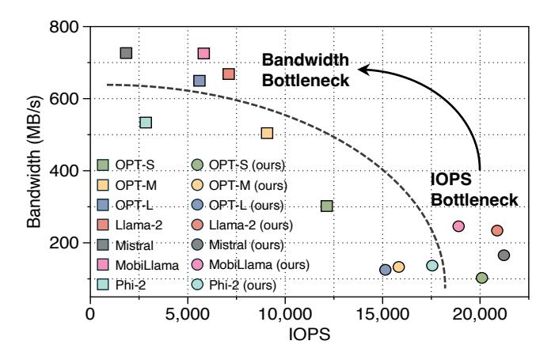

Figure 1. The bandwidth and IOPS during inference across various LLMs on OnePlus Ace2. Neuralink shifts the I/O bottleneck from IOPS (lower right) to bandwidth (upper left).

by IOPS constraints. As an orthogonal approach, directly improving bandwidth utilization requires an effective alignment between both neuron co-activation patterns and storage hardware characteristics. Our comprehensive analysis identifies three critical challenges that must be tackled:

- (1) Extensive Search Space. The immense number of neurons in LLM results in an exponentially large space of possible placement combinations. Determining the optimized placement that maximizes global benefits is highly challenging and infeasible through brute-force enumeration alone.
- (2)Inherent Activation Dynamics. The activation patterns of parameters inherently exhibit dynamics across varying inputs. Although optimized placement strategies can spatially co-locate activated neurons, accesses to these neurons remain impeded by discontinuities induced by dynamics.
- (3) Misaligned Cache Strategy. Caching frequently activated neurons in memory is essential for reducing I/O workload. Existing cache strategies typically treat neurons individually, which can lead to fragmentation in their placement in flash memory, potentially disrupting continuous access.

To address these emerging challenges, we propose Neuralink, a novel approach to accelerating LLM inference on smartphones with neuron co-activation linking. Specifically, Neuralink employs a two-stage solution that incorporates hierarchical optimizations performed both offline and online. (1) In the Offline Phase, Neuralink clusters neurons exhibiting high co-activation correlation and reorganizes their placement in flash memory. To address Challenge (1), we abstract the problem into a complete graph, reformulating it as the discovery of the globally optimal Hamiltonian Path. By leveraging graph-theoretic techniques, we propose a greedy algorithm that efficiently searches for optimized placement based on observed neuron co-activation patterns.

(2) In the Online Phase, Neuralink performs fine-grained refinements on optimized neuron placement, further enhancing access continuity. To tackle Challenge (2), we devise an IOPS-friendly access collapse technique. By strategically incorporating additional neurons between two separate neuron links, we improve read access continuity with negligible overhead. In response to Challenge (3), we introduce a linking-aligned in-memory caching policy. Rather than individually caching the hottest neurons, we account for their interlinking relationships, ensuring continuous access.

We evaluate Neuralink on three smartphones with distinct hardware configurations, benchmarking a diverse range of LLMs varying in structures and scales. The results demonstrate that Neuralink significantly enhances I/O bandwidth, achieving improvements of 1.80× on average. Moreover, this boost in bandwidth yields substantial reductions in end-to-end latency during inference, delivering average speedups of 1.49× when compared to state-of-the-art solutions.

To the best of our knowledge, Neuralink is the first to accelerate LLM inference on smartphones by enhancing I/O bandwidth through optimized neuron placement in flash memory. Our contributions can be summarized as follows:

- We identify the primary bottleneck in LLM inference on smartphones as IOPS, attributing it to the inherent misalignment between scattered activation patterns and storage hardware characteristics.
- We notably exploit neuron co-activation to mitigate the IOPS bottleneck, pioneering the optimization of neuron placement in flash memory on smartphones.
- We conduct extensive evaluations on various representative LLMs and hardware, achieving substantial improvements over state-of-the-art solutions.

## 2 Background and Motivation

## 2.1 Activation Sparsity in LLM Inference

Numerous studies [44, 50, 56, 69, 83] have shown that LLMs exhibit considerable *Activation Sparsity*, allowing a substantial portion of parameters to be deactivated without impacting the final outputs. As only a subset of parameters is involved in the computation, this characteristic greatly reduces resource consumption. Importantly, since no parameters are pruned, the full capacity of the LLMs remains intact.

Figure 2 illustrates an example of activation sparsity within the FFN block introduced by ReLU function [2]. For a given input X, the ReLU function sets the negative values of intermediate activations Y to zero, rendering the corresponding neurons in both up projection weights U and down projection weights D unnecessary. Therefore, these neurons can be considered non-activated and effectively excluded from computation without impacting the model outputs. In addition to ReLU-family LLMs, several studies have highlighted that LLMs using other activation functions can also benefit from

<span id="page-2-0"></span>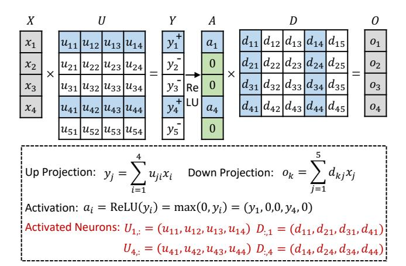

**Figure 2.** Activation sparsity introduced by ReLU. Each element in the intermediate activations A with a zero value (colored in green) deactivates two neurons (uncolored): the corresponding row in up-projection matrix U and the column in down-projection matrix D within the FFN block.

<span id="page-2-1"></span>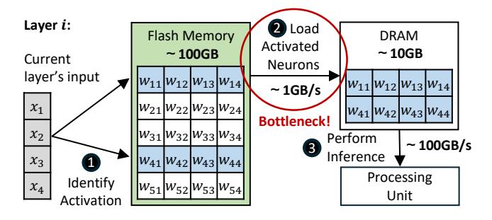

Figure 3. A three-step procedure for LLM inference on smartphones leveraging activation sparsity: ① Identify the activated neurons for a given input using predictors [56, 70] or sparsity-aware metrics [69, 81]. ② With the full parameters stored in flash memory, load only the activated neurons into DRAM. ③ Perform inference using the activated neurons.

activation sparsity through techniques such as ReLU substitution [61, 68, 71], moefication [48, 103], top-K sparsity [50, 81], threshold [34, 47], and attribution score [69, 104].

Particularly, activation sparsity offers a promising solution to overcome DRAM limitations on smartphones [4, 93]. As illustrated in Figure 3, the full model parameters can be stored in much larger flash memory, while only the activated neurons are loaded into DRAM. Therefore, larger and more powerful LLMs can be executed under limited DRAM capacity, which is crucial for LLM deployment on smartphones. On one hand, smartphones typically provide limited DRAM capacity, ranging from 10GB to 20GB. On the other hand, a substantial portion of DRAM is allocated to the operating system and other active applications, leaving even less available for any single application. Although activation sparsity alleviates this issue by reducing DRAM demands, it

<span id="page-3-0"></span>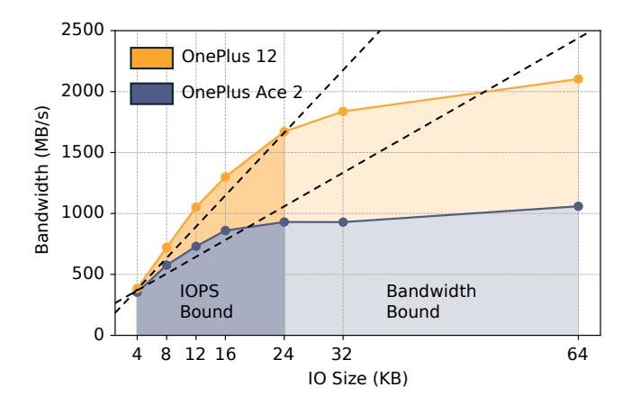

Figure 4. UFS Bandwidth at varying continuous I/O sizes on smartphones. The near-linear relationship indicates that the bottleneck lies in IOPS, rather than the bandwidth capacity.

introduces a new challenge: the I/O overhead between flash memory and DRAM becomes the primary bottleneck.

## 2.2 Universal Flash Storage on Smartphones

Mobile devices, such as smartphones, predominantly utilize Universal Flash Storage (UFS) [\[39\]](#page-14-21) as the storage protocol. Leveraging NAND flash, UFS provides significantly larger storage capacity than the space available in DRAM, with scalability reaching terabyte (TB) levels. Furthermore, the introduction of the command queue in UFS markedly improves the efficiency of data transfer between flash memory and DRAM. In the latest version (UFS 4.0), the sustained read speed per lane can reach up to 2.9 GB/s. This combination of extensive storage capacity and high read speed serves as a foundation for the execution of LLMs on mobile devices.

However, unlike server-side storage (such as NVMe), UFS typically features a shallow command queue, supporting only 32 entries. This limitation restricts the IOPS for flash reads and prevents full utilization of the available bandwidth. As shown in Figure [4,](#page-3-0) the read bandwidth increases with the continuous I/O sizes, as multiple continuous reads can be issued by a single read operation. Notably, when the continuous I/O size is below 24KB, bandwidth scales almost linearly with I/O size, indicating that these reads are primarily IOPSbound. Therefore, the key to fully exploiting UFS bandwidth lies in maximizing the continuity of read accesses.

## 2.3 Analysis: IOPS as the Bottleneck

Activation sparsity enables smartphones to accommodate larger and more powerful models within the limited DRAM capacity required for smaller models by activating only a subset of parameters. However, this memory saving comes at the cost of increased I/O operations between flash memory and DRAM. As listed in Table [1,](#page-1-0) I/O operations account for the majority of total inference latency, severely constraining

<span id="page-3-1"></span>Table 2. Latency (ms) and bandwidth (MB/s) across different ratios of non-activated neurons in OPT-350M on OnePlus 12. Speedups are calculated relative to the latency of dense case.

| Ratio     | dense   | 10%     | 20%     | 30%    | 40%    |
|-----------|---------|---------|---------|--------|--------|
| Bandwidth | 1637.61 | 1355.35 | 1089.24 | 904.69 | 746.03 |
| Latency   | 234.49  | 254.96  | 281.96  | 297.10 | 308.76 |
| Speedup   | -       | 0.92    | 0.83    | 0.79   | 0.76   |
| Ratio     | 50%     | 60%     | 70%     | 80%    | 90%    |
| Bandwidth | 598.82  | 524.50  | 441.33  | 396.43 | 368.05 |
| Latency   | 320.63  | 292.78  | 260.86  | 193.68 | 104.18 |
| Speedup   | 0.73    | 0.80    | 0.90    | 1.21   | 2.25   |

overall inference efficiency. Consequently, the efficiency of I/O operations emerges as a pivotal determinant of enabling the smooth deployment of LLMs on smartphones.

The root cause of the increased I/O operations lies in the dynamic nature of activation sparsity, where the subset of activated parameters varies with each model input. As a result, every new inference request generates I/O operations to transfer new activated parameters. More critically, mitigating this I/O overhead presents significant challenges. First, identifying the activated parameters in a given layer depends on the outputs of the previous layer, making it difficult to overlap I/O latency with computation. Second, the disjoint activation of parameters across different inference requests diminishes the effectiveness of caching strategies. Although the volume of data transfer can be reduced, the remaining parameters still suffer from low I/O bandwidth utilization.

Table [2](#page-3-1) demonstrates that the bottleneck in I/O operations arises primarily from low effective bandwidth utilization, rather than the volume of data transfer. As the ratio of nonactivated neurons increases, the I/O volume between flash memory and DRAM decreases. However, inference latency remains longer than that of the fully-activated (dense) case until the non-activation ratio reaches around 80%. This inefficiency occurs because, in conventional model-structurebased placements, activated parameters are scattered across flash memory, leading to small-grained read accesses that limit bandwidth utilization. Therefore, I/O operations become heavily IOPS-bound, preventing the full exploitation of the available UFS bandwidth on smartphones.

Drawing from these observations, we derive a crucial insight: the conventional placement of model parameters in flash memory, guided by model structure, is misaligned with the dynamic activation sparsity during LLM inference. Consequently, the key to addressing the I/O bottleneck lies in designing an optimized placement strategy for parameters, one that maximizes the continuity of read accesses and enables the full exploitation of available UFS bandwidth.

<span id="page-4-0"></span>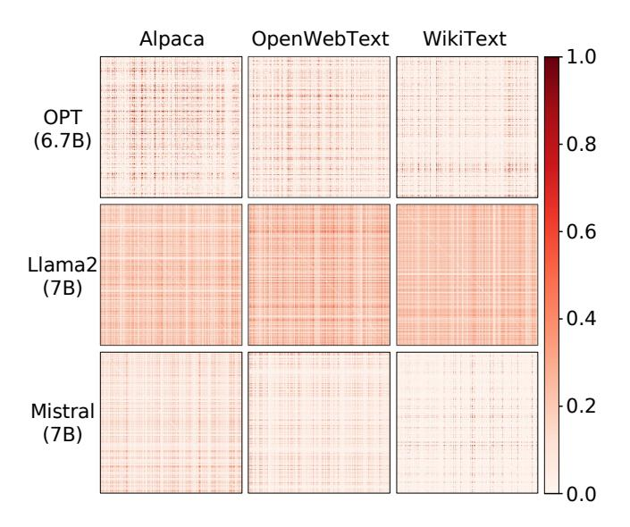

**Figure 5.** Visualization of neuron co-activation patterns across different LLMs (vertical) and datasets (horizontal). Each matrix represents the adjacency matrix of neurons within a layer of a given LLM, where the element at position (i, j) indicates the co-activation frequency between neuron i and neuron j. Brighter colors denote high values.

#### 3 NEURALINK Overview

We propose Neuralink, an efficient approach to accelerating LLM inference on smartphones with optimized I/O accesses. Unlike previous studies that primarily focus on the efficiency of either computation or cache management, Neuralink addresses the I/O bottleneck by directly enhancing the I/O bandwidth between flash memory and DRAM.

The design of Neuralink is rooted in *Neuron Co-Activation*, a phenomenon prevalent in activation sparsity yet underexplored in current works. As presented in Figure 5, neurons in LLMs exhibit strongly correlated activation patterns across different model structures and datasets. Although similar observations have been validated in previous studies [4, 93], this phenomenon remains largely underexplored due to its intrinsic complexity. By incorporating both algorithmic and system-level optimizations, Neuralink is the first to leverage neuron co-activation for optimizing flash memory placement. Figure 6 presents an overview of Neuralink.

Offline Correlation-Aware Clustering (§ 4). NEURALINK begins with the identification of an optimized neuron placement in flash memory. The core idea in this stage is to cluster frequently co-activated neurons together, which involves three key steps: ① Pattern Extraction. We propose a specific design to efficiently extract neuron co-activation patterns based on profiling results. These extracted patterns quantify the strength of co-activation correlations among neurons, providing the foundation for subsequent neuron rearrangement. ② Problem Abstraction. We model the

<span id="page-4-1"></span>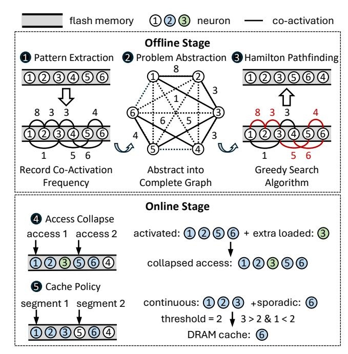

**Figure 6.** Overview of Neuralink, which operates in two stages: an offline stage and an online stage.

neuron placement in flash memory as a graph representation. Building on this abstraction, we reformulate the optimization task into a classic Hamiltonian pathfinding problem. This conversion allows us to apply efficient graph-theoretic techniques, leading to a more effective solution for neuron placement optimization. **3** Hamiltonian Pathfinding. Given the NP-complete nature of the optimization problem, we devise a heuristic algorithm that greedily searches for the optimal placement. We prove that our algorithm can find a locally optimal solution with a polynomial time complexity. Online Continuity-Centric Processing (§ 5). NEURALINK further employs custom data access and DRAM management techniques at runtime, complementing the offline design to facilitate more continuous read accesses. 4 Access Collapse. Despite the optimized neuron placement, the inherent dynamics in neuron activation lead to unavoidable discontinuous read access at runtime. To address this, we propose strategically merging nearby discontinuous read accesses by loading additional neurons between them. This merging approach, with minimal overhead, effectively reduces the frequency of discontinuous read access. **6** Cache Policy. Retaining the most frequently activated neurons in DRAM effectively reduces repeated neuron transfers. However, this approach alone risks disrupting the continuity of optimized neuron placement in flash memory. To mitigate this, we propose caching neurons in DRAM at the granularity of neuron segments, rather than individual neurons. This strategy helps prevent fragmentation in flash memory while introducing minimal modification to the existing caching framework.

<span id="page-5-1"></span>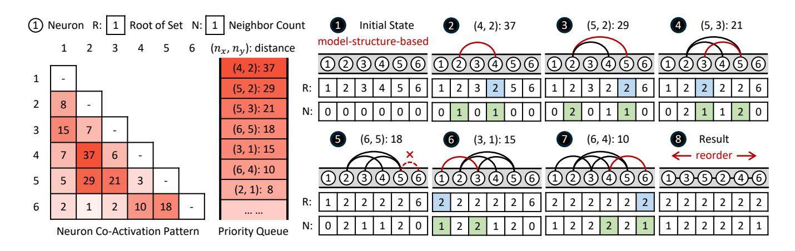

**Figure 7.** An example of neuron placement search algorithm. Beginning with the neuron co-activation patterns, which are profiled offline (represented as the co-activation frequency in the figure), the algorithm computes the distance between each pair of neurons and ranks them using a priority queue. These pairs are then sequentially retrieved and merged (if possible) at each step. Finally, a single link that contains all neurons is formed, serving as the new neuron placement in flash memory.

## <span id="page-5-0"></span>4 Offline Correlation-Aware Clustering

#### 4.1 Step 1: Parameter-Efficient Pattern Extraction

LLMs [10, 40, 53, 78, 102] are typically based on transformer architectures, consisting of two key components: Multi-Head Attention (MHA) block and Feed Forward Network (FFN) block. In Neuralink, we focus primarily on offloading the parameters of FFN blocks to flash memory, while remaining the MHA block in DRAM. On one hand, recent LLMs are adopting attention variants like Group Query Attention [3], Multi Query Attention [66], and Multi-head Latent Attention [52] to enhance inference efficiency. These mechanisms significantly reduce the parameter overhead of the attention block. On the other hand, the Mixture-of-Experts (MoE) mechanism becomes increasingly prevalent in LLMs [15, 20, 41], effectively managing computational costs when scaling up model parameters in FFN blocks. Consequently, the FFN block emerges as the dominant factor in parameter size.

To extract the neuron co-activation patterns, we initially utilize an *Adjacency Matrix* to record the activation frequencies of neurons in LLMs. This step is performed only once, prior to inference, utilizing a dataset associated with the upcoming tasks. By estimating probability using frequency f, we compute the activation probability of the neuron  $n_i$ , denoted as P(i), and the co-activation probability of neuron  $n_i$  and neuron  $n_j$ , denoted as P(ij), as follows:

$$P(i) = \frac{f(n_i)}{\sum_{k=1}^{N} f(n_k)}$$
 (1)

$$P(ij) = \frac{f(n_i, n_j)}{\sum_{k=1}^{N} \sum_{l=1}^{N} f(n_k, n_l)}$$
(2)

Here, N denotes the number of neurons in a weight matrix. When performing statistics, Neuralink accounts for the bundling relationship between neurons across different

weight matrices in the same FFN block. For instance, in the ReLU-based FFN block [102], the columns of up projection matrix are bundled with the corresponding rows of down projection matrix, as their activations both rely on whether the same intermediate values are zero or not. A similar bundling relationship exists among the gate, up, and down projection matrices in the SwiGLU-based FFN block [40, 78].

## 4.2 Step 2: Graph-Based Problem Abstraction

Following the extraction of neuron co-activation patterns, the next step is to determine an optimized neuron placement in flash memory. To enable more continuous read access, neurons that frequently co-activate should ideally be positioned in nearby memory addresses. Given the immense number of neurons in LLMs, the potential neuron placements are extremely large. Innovatively, we reformulate this problem as a graph representation, providing a pathway to a more efficient solution by leveraging graph-theoretic techniques. **Graph Abstraction**. We model the co-activation relationships between neurons using a *Complete Graph*. In this graph, each node represents a neuron, and each edge represents the co-activation relationship between two neurons. Specifically, we define the value of each edge as the *Distance Between Two Neurons*, which reflects the degree of their co-activation:

<span id="page-5-2"></span>
$$\operatorname{dist}(n_i, n_j) := 1 - P(ij) \tag{3}$$

According to this definition, the more frequently two neurons are co-activated, the smaller their distance.

**Hamilton Pathfinding.** The objective of NEURALINK is to minimize the expected number of I/O operations for a given inference request. By leveraging the graph-based abstraction, this objective naturally transforms into the problem of *identifying the shortest Hamiltonian path* [67] in a complete graph. First, the Hamiltonian path, by definition, visits each

node exactly once, thereby ensuring that all neurons stored in flash memory are involved. Second, the shortest Hamiltonian path serves as the optimization criterion, aligning with the objective of maximizing the likelihood of clustering co-activated neurons together. This reformulation enables Neuralink to leverage advanced graph-theoretic techniques for efficient neuron placement optimization.

### 4.3 Step 3: Heuristic-Driven Search Algorithm

In graph theory, determining the shortest Hamiltonian path in a graph is an NP-complete problem [33]. To address this computational challenge, we design a heuristic algorithm that efficiently searches for an optimized neuron placement with a polynomial time complexity. Figure 7 illustrates a simplified example of our approach.

**Algorithm Details.** The core idea of the algorithm is to treat a neuron placement as a neuron link and iteratively merge them until all neurons are connected within a single link. To minimize the expected number of I/O operations, we employ a greedy merging strategy that prioritizes merging the nearest links at each step. Formally, based on the definition of *Distance Between Two Neurons* in Equation 3, we define the *Distance Between Two Neuron Links* as follows:

<span id="page-6-2"></span>
$$\operatorname{dist}(l_i, l_j) := \min\{\operatorname{dist}(l_i(h), l_j(h)), \operatorname{dist}(l_i(h), l_j(t)), \\ \operatorname{dist}(l_i(t), l_i(h)), \operatorname{dist}(l_i(t), l_i(t))\}$$

$$\tag{4}$$

Here,  $l_i(h)$  and  $l_i(t)$  denote the head and tail neurons (arbitrary, as the link  $l_i$  is undirected) of a neuron link  $l_i$ , respectively. The equation implies that the distance between two neuron links is determined by the shortest distance between either the head or tail neuron of the two links.

Algorithm 1 outlines the process in pseudocode. The algorithm begins by taking a set of neurons  $\mathcal{N}$  and their coactivation probability P(ij) as input (Line 1). Initially, each neuron in  $\mathcal{N}$  is treated as an individual link (Line 2), and the distance between each pair of neurons is computed based on Equation 3 (Lines 7-8). The algorithm then proceeds iteratively, searching for the nearest pair of links to merge in a greedy manner (Lines 9-18). For each pair of links, the distance is computed based on Equation 4 (Lines 10-12), and the pair with the smallest distance is selected for merging (Lines 13-18). This process repeats until only a single link remains, which contains all the neurons (Line 9). Finally, the merged link is returned as the output of the algorithm, representing the optimized neuron placement  $\mathcal{P}$  (Lines 19-24).

Implementation Details. We leverage two advanced data structures, the priority queue [79] and the disjoint set [26], to enhance the efficiency of the algorithm. The priority queue is used to efficiently identify the nearest neuron link, and the disjoint set union facilitates the efficient management and merging of neuron links. All neurons within the same link share the same root in the disjoint set, which is updated after each set merge. Additionally, we maintain a count of

## <span id="page-6-1"></span>Algorithm 1 Neuron Placement Search Algorithm

```
1: Input: Neuron set N, Neuron Co-activation Probability P(ij)
 2: Output: Optimized neuron placement \mathcal{P}
    function GreedySearch(N)
 4:
          Initialize NbrCnt[n] \leftarrow 0 for all n \in \mathcal{N}
 5:
          Initialize priority queue Q \leftarrow \emptyset
          Initialize disjoint sets S(n) for all n \in \mathcal{N}
 6:
 7:
          for each pair (n_i, n_j) \in \mathcal{N} \times \mathcal{N}, n_i \neq n_j do
 8:
              Q.push((n_i, n_j), dist(n_i, n_j))
          while O \neq \emptyset do
 9:
10:
              (n_x, n_y) \leftarrow Q.pop()
              if NbrCnt[n_x] = 2 or NbrCnt[n_y] = 2 then
11:
                                   ▶ Skip if either neuron is inside a link
12:
                   continue
              root_x \leftarrow Find(n_x), root_y \leftarrow Find(n_y)
13:
              if root_x \neq root_y then
14.
                   NbrCnt[n_x]++
15:
                   NbrCnt[n_y] + +
                   Union(root_x, root_u)
17:
18:
                   Link(n_x, n_y)
                                                    ▶ Update neuron linkings
19:
          \mathcal{P} \leftarrow []
         c \leftarrow \text{Select first neuron from } \{n \in \mathcal{N} \mid \text{NbrCnt}[n] = 1\}
20:
         ▶ Set current neuron to starting point
          while c \neq s and NbrCnt[c] \neq 1 do
21:
              \mathcal{P}.append(c)
                                       ▶ Add c to the optimized placement
22:
              c \leftarrow \text{NextNeuron}(c) \triangleright \text{Move to next neuron linked to } c
23:
24.
          return \mathcal{P}
```

the neighbors for each neuron, NbrCnt, to classify whether a neuron is inside or at the edge of a link (NbrCnt = 2 or 1). **Complexity Analysis.** The primary computational complexity of the algorithm arises from the  $n^2$  pairwise enumeration of n neurons. For each pair of neurons, both the insertion and pull operations in the priority queue have a time complexity of  $O(\log n)$ . Meanwhile, both the operations for finding a root and merging two sets in the disjoint set have a time complexity of O(1). Consequently, the overall time complexity of the algorithm is  $O(n^2 \log n)$ .

## <span id="page-6-0"></span>5 Online Continuity-Centric Processing

Through offline correlation-aware clustering, neurons that are frequently co-activated are strategically placed contiguously in flash memory. However, the dynamic and intricate nature of neuron co-activation makes static neuron placement alone insufficient to entirely alleviate IOPS limitations. To fully exploit the flash memory and DRAM resources to serve neuron read requests, we design specific online processing techniques that focus on maintaining continuity of access. These techniques are aimed at addressing two primary challenges, manifesting in data access and caching.

The first challenge arises from inherent activation dynamics. Due to the stochastic nature of neuron activation, it is infeasible to consistently follow the co-activation patterns extracted offline. Although neurons that are frequently co-activated are placed in close positions, minor variances

<span id="page-7-0"></span>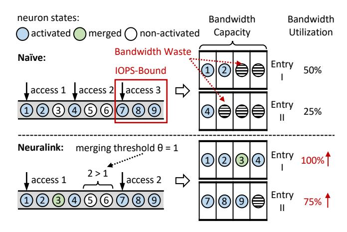

**Figure 8.** Static neuron placement suffers from IOPS-bound due to dynamic activation. Neuralink mitigates this by strategically merging intervening neurons between accesses.

induced by these dynamics can still lead to unavoidable discontinuous read access during runtime. Particularly, some read access may occur near each other but be split into two I/O operations by just a few activated neurons in between.

The second challenge stems from misaligned cache strategies. Conventional cache strategies typically treat neurons individually, caching only the most frequently activated neurons without considering their placement in flash memory. This oversight potentially breaks the continuity of neuron placement in flash memory, undermining our optimizations for I/O operation reduction. Moreover, directly caching all co-activated neurons in a continuous manner could consume excessive DRAM resources, reducing cache efficiency.

#### 5.1 IOPS-Friendly Access Collapse

In Neuralink, we introduce an innovative online technique that strategically combines nearby read accesses. The fundamental insight driving this approach is that while coactivated neurons cannot always be placed contiguously, they are likely to be positioned in close proximity following offline correlation-aware clustering. As illustrated in Figure 8, consider a scenario where neurons  $n_1$ ,  $n_2$ ,  $n_3$ , and  $n_4$ are stored contiguously, but occasionally only  $n_1$ ,  $n_2$ , and  $n_4$  are activated, necessitating two distinct read operations. However, when IOPS is limited, the inclusion of more neurons per read operation yields superior overall performance. Capitalizing on this observation, when two disjoint but proximate neuron links are co-activated, we speculatively read the intervening neurons. This strategy effectively coalesces the two separate neuron links into a single, contiguous read access, thereby substantially enhancing overall efficiency.

The execution of this IOPS-friendly access collapse is governed by two key factors during runtime. (1) **Bandwidth Trade-off.** Introducing additional neurons for merging involves a trade-off between increasing the data transfer size

and reducing IO operations, with the goal of enhancing bandwidth utilization. We employ a threshold-based approach: if the number of neurons between two neuron links falls below a predefined threshold, collapse is performed; otherwise, it is skipped. This approach ensures that the inclusion of additional neurons occurs only when it provides a benefit for bandwidth enhancement, without causing bandwidth waste. (2) **Storage Bottleneck**. While access collapse can reduce IO operations, it only improves bandwidth efficiency if the storage is IOPS-bound rather than bandwidth-bound. To handle this, we implement a bottleneck detector that periodically checks whether the achieved bandwidth has reached the maximum capacity of storage. If the bandwidth is fully utilized, the system reverts to the original access strategy.

## 5.2 Linking-Aligned Cache Policy

It is natural to store the neurons that are most frequently activated in DRAM to reduce the redundant data transfer between flash memory and DRAM. However, directly applying existing cache policies is inefficient in Neuralink, as these policies typically operate at the level of individual neurons, disregarding both neuron co-activation patterns and the optimized placement in flash memory. For example, suppose neurons  $n_1$ ,  $n_2$ ,  $n_3$ , and  $n_4$  are stored together and often co-activate. If  $n_2$  is more frequently activated than the others, it will have a higher probability of being cached, leading to discontinuous fragments in flash memory. A potential solution is to cache the neurons that are stored continuously in flash memory together, reducing the likelihood of this situation. However, this approach would occupy a large portion of DRAM, making it impractical for smartphones.

To address this, we introduce an additional layer of access management to the existing cache policies, requiring minimal modification while improving overall efficiency. In NEURALINK, activated neurons are divided into two categories: outlier neurons and continuous segments. Outlier neurons, as the name suggests, are those neurons being coactivated with only a few surrounding neurons. In contrast, continuous segments consist of a series of neurons that are activated together in succession. Considering both resource usage and efficiency enhancement, NEURALINK devises different strategies for the two categories of neurons. For outlier neurons, Neuralink caches them as usual. However, continuous segments are cached with a lower probability compared to outlier neurons. This is primarily because caching continuous segments requires more memory resources and provides less efficiency enhancement (already benefit from continuous access). Furthermore, if some neurons in these segments are evicted while others remain in the cache, it will lead to discontinuous reads in flash memory. Although the waste of IOPS can be alleviated by access collapse, this still results in wasted DRAM resources. Our cache policy works seamlessly with state-of-the-art cache designs, as we only control the caching admitting policy while leaving the rest unchanged.

<span id="page-8-0"></span>**Table 3.** Smartphone hardware configurations.

| Device        | SoC                 | DRAM | Flash | Storage |
|---------------|---------------------|------|-------|---------|
| OnePlus 12    | Snapdragon 8 Gen 3  | 24GB | 1TB   | UFS4.0  |
| OnePlus Ace 3 | Snapdragon 8 Gen 2  | 16GB | 512GB | UFS4.0  |
| OnePlus Ace 2 | Snapdragon 8+ Gen 1 | 16GB | 512GB | UFS3.1  |

Table 4. Model configurations.

<span id="page-8-1"></span>

| Model          | Size | Neuron <sup>†</sup> | ActFn   | Sparsity Method |
|----------------|------|---------------------|---------|-----------------|
| OPT-S [102]    | 350M | 8,192               | ReLU    | Prediction [56] |
| OPT-M [102]    | 1.3B | 16,384              | ReLU    | Prediction [56] |
| OPT-L [102]    | 6.7B | 32,768              | ReLU    | Prediction [56] |
| Llama-2 [78]   | 6.5B | 33,024              | fatReLU | Prediction [68] |
| Mistral [40]   | 7.8B | 43,008              | dReLU   | Prediction [71] |
| MobiLlama [77] | 1.0B | 16,896              | SiLU    | Threshold [47]  |
| Phi-2 [38]     | 2.7B | 20,480              | GeLU    | Threshold [69]  |

<sup>&</sup>lt;sup>†</sup> The number of neurons per FFN block.

#### 6 Evaluation

#### 6.1 Experimental Setup

**Hardware.** We conduct evaluations across a diverse set of smartphones, as detailed in Table 3. These devices feature varying SoC configurations, memory capacities, and UFS versions, spanning from low-tier to high-tier hardware. All experiments are conducted on Termux [76], an Android shell application, to ensure compatibility across platforms.

**Models.** We choose seven widely adopted LLMs for evaluation, as outlined in Table 4. These models vary in architecture and size, with each utilizing activation sparsity through well-developed techniques [47, 56, 68, 69, 71]. Besides LLMs using ReLU-family activation functions, we also evaluate SiLU-family LLM (MobiLlama) and GeLU-family LLM (Phi-2). All models in our experiments are evaluated in FP16 precision, consistent with the practices in recent research [4, 70].

**Datasets.** We evaluate NEURALINK using a wide range of datasets, covering categories such as plain text, instructions, math or commonsense tasks. These datasets encompass diverse linguistic structures, enabling a comprehensive evaluation across varying sparsity patterns. For each dataset, we randomly select 1,024 samples from the training set for profiling and perform evaluation on the test set.

Baselines. We benchmark Neuralink with two state-of-the-art LLM inference frameworks on smartphones. The first, llama.cpp [27], is the most widely used CPU framework with state-of-the-art performance. The second baseline, LLMFlash [4], is specially designed for the activation sparsity paradigm. Since LLMFlash is not open-source, we port it into llama.cpp by adding support for controlled parameter offloading and integrating its key I/O optimizations, such as row-column bundling. Additionally, we introduce a simplified variant of Neuralink (Neuralink-S), which

**Table 5.** Dataset configurations.

| Dataset          | Description                               |
|------------------|-------------------------------------------|
| Alpaca [73]      | Instructions-tuning dataset for Llama     |
| OpenWebText [29] | High-quality web-scraped text corpus      |
| WikiText [59]    | Wikipedia-based language modeling dataset |
| GSM8K [14]       | Grade-school math problem dataset         |
| HellaSwag [101]  | Commonsense reasoning benchmark           |
| MMLU [36]        | Multitask knowledge evaluation benchmark  |
| SWAG [100]       | Commonsense reasoning sentence completion |
| PIQA [9]         | Physical commonsense reasoning benchmark  |

directly arranges neuron placement in decreasing order of activation frequency. This comparison further underscores the effectiveness of correlation-aware clustering in Neuralink. **Metrics.** We use the end-to-end latency per token as our primary performance metric and measure I/O bandwidth for a finer analysis. Specifically, we use the kernel io\_uring [6] to load data from flash memory, measuring I/O latency as the time from the first request issue to the last, and calculating bandwidth based on the total data read. Notably, bandwidth here refers to the effective bandwidth, which only considers the activated neurons. For all LLMs, we offload their FFN blocks to flash memory and maintain a 0.05 cache ratio in DRAM. We normalize the metrics values when large discrepancies occur for clarity. All metrics are averaged over 128 token generations, repeated across 10 trials.

#### 6.2 Overall Performance

End-to-end Latency. Figures 9a and 9b present the endto-end performance speedups across different LLMs and datasets on OnePlus 12 and OnePlus Ace2. Besides, Table 6 provides the corresponding sparsity levels (i.e., the ratio of activated neurons to the total) across all experiments. For prediction-based methods, sparsity levels are dynamically determined at runtime by well-trained predictors [56, 68, 71]. For sparsity methods like threshold and attribution score, the sparsity levels are pre-defined. Following prior research [47, 69], we set these levels as 30% and 20%, respectively. The results demonstrate that NEURALINK consistently outperforms the baselines, achieving average speedups of 2.37×, 1.48×, and 1.25× over llama.cpp, LLMFlash, and NEURALINK-S, respectively. Moreover, the results confirm that activation sparsity is prevalent across various LLM and dataset combinations, with sparsity levels varying. Neuralink achieves greater performance improvements at higher sparsity levels, such as in OPT models. This is because reduced neuron activation exacerbates scattered flash memory access, making efficient I/O operations more critical. As LLMs become denser, they more easily reach the bandwidth limitations of the device. However, the bandwidth underutilization persists and Neuralink still achieves an average 1.39× speedup over LLMFlash for non-OPT models on two different hardware.

<span id="page-9-0"></span>**Table 6.** The ratios of activated neurons to the total neurons during inference across various LLMs and datasets.

| Model     | Alpaca | OpenWebText | WikiText |
|-----------|--------|-------------|----------|
| OPT-S     | 9.48%  | 9.40%       | 9.73%    |
| OPT-M     | 3.65%  | 3.88%       | 3.90%    |
| OPT-L     | 3.17%  | 3.30%       | 2.97%    |
| Llama-2   | 23.67% | 27.64%      | 21.27%   |
| Mistral   | 23.54% | 23.99%      | 24.51%   |
| MobiLlama | 30.00% | 30.00%      | 30.00%   |
| Phi-2     | 20.00% | 20.00%      | 20.00%   |

<span id="page-9-1"></span>**Table 7.** Offline execution time (in seconds) of the neuron placement search algorithm across various LLMs and datasets using an AMD EPYX 7V13 processor.

| Model     | Alpaca | OpenWebText | WikiText |
|-----------|--------|-------------|----------|
| OPT-S     | 4.48   | 4.42        | 4.45     |
| OPT-M     | 21.54  | 22.14       | 22.21    |
| OPT-L     | 104.23 | 103.56      | 105.90   |
| Llama-2   | 50.09  | 51.43       | 55.43    |
| Mistral   | 102.17 | 90.43       | 93.71    |
| MobiLlama | 12.20  | 10.22       | 11.41    |
| Phi-2     | 49.05  | 45.16       | 46.99    |

Achieved Bandwidth. Figure 9c presents the detailed I/O bandwidth results on OnePlus 12. The results show that Neuralink achieves average bandwidth improvements of 3.28×, 1.80×, and 1.36× over the three baselines. These findings demonstrate that Neuralink effectively shifts the I/O bottleneck from IOPS to bandwidth across various sparsity levels. Furthermore, the strong conversion efficiency of I/O optimizations into end-to-end latency not only confirms that I/O operations are the primary bottleneck but also highlights that Neuralink introduces minimal runtime overhead.

#### 6.3 Performance Breakdown

As shown in Figure 10, we evaluate the effectiveness of two key components of Neuralink. Starting with the strong baseline LLMFlash, we measure the end-to-end latency across various LLMs. The results show that the offline and online components provide average speedups of 1.32× and 1.20×, respectively. These findings align with the design of Neuralink, where the offline component serves as the cornerstone and the online component plays a supplementary role.

#### 6.4 Offline Ablation Study

Continuous Access. The core insight of Neuralink lies in increasing continuous flash memory access by optimizing neuron placement, thereby mitigating I/O overheads. We examine the read access lengths in LLMFlash, Neuralink-S, and Neuralink, as shown in Figure 11. LLMFlash, which does not account for neuron co-activation, maintains the

read access lengths to below 5 neuron bundles, with average values of 1.06 in OPT-L and 1.42 in Llama-2. NEURALINK-S improves continuous access compared to LLMFlash, increasing the averages to 1.34 and 4.03, respectively. However, it considers only individual activation frequency but overlooks the spatial continuity of activated neurons. For example, a neuron may frequently activate but co-activate with different neurons each time. In contrast, NEURALINK increases the average read access lengths to 3.12 and 6.62 across two LLMs. Notably, the maximum continuous read access length reaches 589 bundles in OPT-L and 2,845 bundles in Llama-2. Overhead Analysis. Table 7 lists the execution time of the offline search algorithm in NEURALINK for optimized neuron placement. We perform experiments across various LLMs and datasets, considering variations in the number of activated neurons. To speed up search process, we implement parallel computation by exploiting the independence of different model layers. The results show that all search processes are complete within a few minutes, even for the largest 7B model. With a polynomial time complexity is  $O(n^2 \log n)$ , the increase in time cost remains modest. Since the search process is performed offline, this overhead is acceptable.

## 6.5 Online Ablation Study

Access Collapse. We first evaluate the effectiveness of access collapse. Figure 12 shows some I/O information during LLM inference before and after applying access collapse. The results reveal that access collapse provides a bandwidth improvement of 2.75× for OPT-L and 1.26× for Llama-2, with both approaching the peak bandwidth of the device. This improvement comes from a careful trade-off between data transfer volume and IOPS. While additional inactivated neurons are loaded, the reduction in IOPS effectively alleviates the bottleneck and enhances bandwidth utilization.

Cache Policy. We next compare the inference latency of Neuralink with LLMFlash under different cache ratios, as shown in Figure 13. Both LLMFlash and Neuralink utilize the same cache system, S3-FIFO [94]. The results indicate that Neuralink integrates well with existing caching systems, demonstrating a consistent decrease in latency as the cache ratio increases. Besides, Neuralink maintains high cache space efficiency, consistently requiring less DRAM cache space than LLMFLash for the same inference latency. This effectively mitigates the DRAM limitations on smartphones.

## 6.6 Sensitivity Analysis

Impact of Sparsity Levels. We first evaluate how variations in sparsity level affect the performance of Neuralink. To control the sparsity level, we apply the top-K sparsity technique [81] to the Llama-2 and Mistral, without using their ReLU substitution. Figure 14 demonstrates that Neuralink achieves greater performance improvements at higher sparsity levels. This is because, when the number of activated neurons is small, their placement in flash memory tends to

<span id="page-10-0"></span>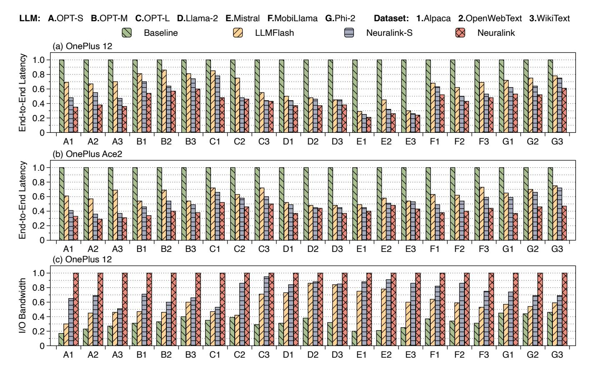

Figure 9. Overall performance (normalized) across various LLMs and datasets. (a) and (b): End-to-end latency on OnePlus 12 and Ace2; (c): I/O bandwidth on OnePlus 12. Each data point (1) on x-axis denotes a combination of LLM () and dataset (1).

<span id="page-10-1"></span>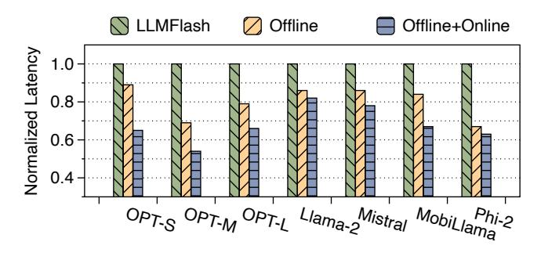

Figure 10. Performance breakdown of Neuralink. The results are evaluated using Alpaca dataset on OnePlus Ace2.

be more scattered. However, Neuralink continues to reduce end-to-end latency until the sparsity level reaches 50.0%. Impact of Datasets. We next evaluate the performance of Neuralink across a variety of task datasets, as shown in Figure [15.](#page-11-4) The results show that the performance of Neuralink is not sensitive to the choice of datasets. Combined with the findings in Figure [9,](#page-10-0) these results further confirm that neuron co-activation is widespread in LLM inference and effectively leveraged to optimize I/O operations by Neuralink.

Impact of Profiling. Ideally, Neuralink should extract neuron co-activation information offline from a profiling dataset that matches the data distribution of the preprocessed dataset. However, in some cases, LLMs may encounter diverse inputs from different tasks during inference. Therefore, we also access the sensitivity of Neuralink to mismatches between the profiling dataset and the testing dataset. As shown in Table [8,](#page-12-0) we measure the performance of Neuralink across nine combinations of the profiling and testing datasets, using three different datasets. For example, the first row indicates that Neuralink uses Alpaca as the profiling dataset and is evaluated on Alpaca, OpenWebText, and WikiText during inference. Besides, we report the corresponding speedups of Neuralink compared to LLMFlash (no profiling datasets) across different testing datasets. The results reveal that Neuralink remains effective even when the inputs are biased. Compared to scenarios when the same dataset is used for both profiling and testing, only slight decreases in performance are observed - sometimes even showing improvements. This suggests that neuron co-activation patterns are an intrinsic property of the LLM, with input variations having limited influence. These findings are consistent with

<span id="page-11-0"></span>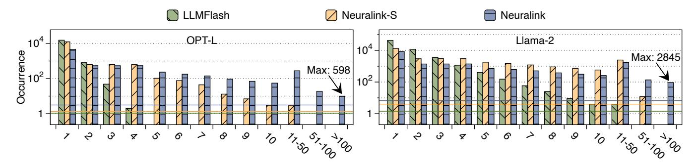

**Figure 11.** Statistical information on read access lengths per token (unit: neuron bundle) in LLMFlash, Neuralink-S, and Neuralink using Alpaca dataset. A larger value of read access length indicates better continuity. Lines indicate average values.

<span id="page-11-1"></span>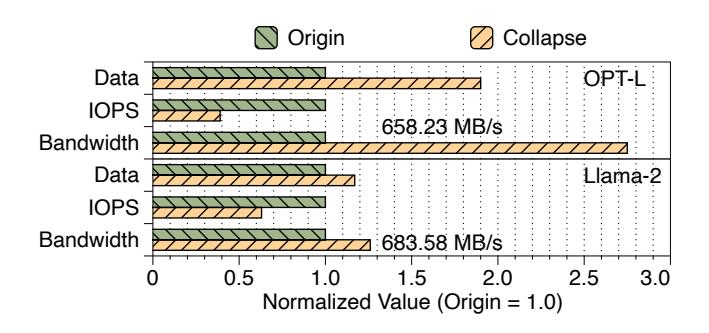

**Figure 12.** Data transfer volume, IOPS, and bandwidth of activated neurons before and after applying access merging. The experiments use the Alpaca dataset on OnePlus Ace2.

<span id="page-11-2"></span>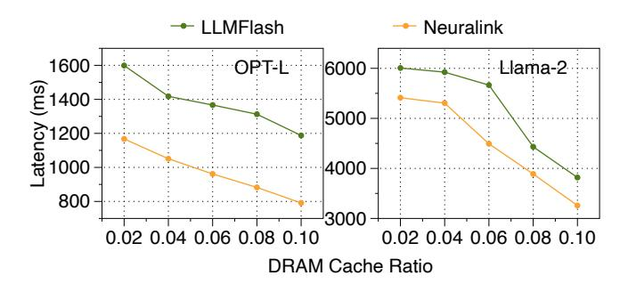

**Figure 13.** End-to-end latency under varying DRAM cache ratios, evaluated using the Alpaca dataset on OnePlus 12.

recent research on LLM sparsity, which shows that neurons with similar functions tend to activate together [58, 105]. **Impact of Precision.** We evaluate the performance of Neuralink across varying precisions for LLMs. The results show that Neuralink scales efficiently with different precisions, maintaining consistent performance across three LLMs. Notably, Neuralink performs better when LLMs are quantized to lower bit precision, achieving an average speedup of 1.39× when reducing precision from 16-bit to 8-bit. This is because smaller neuron sizes exacerbate the impact of scattered

<span id="page-11-3"></span>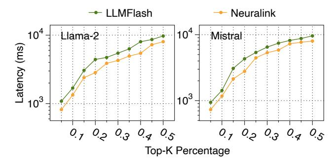

**Figure 14.** End-to-end latency under different top-K percentages using the Alpaca dataset on OnePlus 12. A higher top-K percentage indicates a lower sparsity level.

<span id="page-11-4"></span>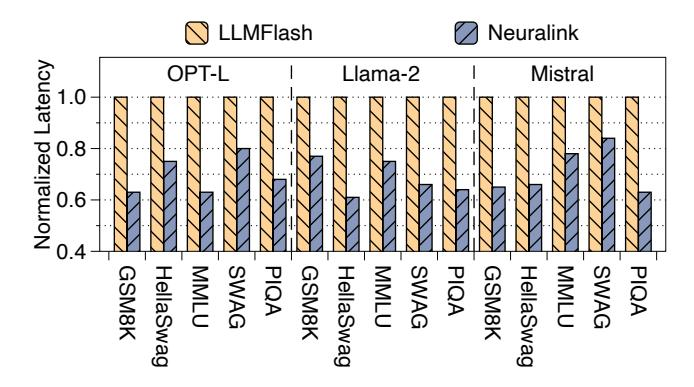

**Figure 15.** End-to-end latency across more diverse task datasets on OnePlus 12. Same answer lengths are controlled.

read access, making it harder to reach bandwidth limitations. These findings also highlight the importance of Neuralink in the trend of lower bits utilization on smartphones.

**Impact of Hardware.** We conclude by evaluating the impact of hardware on Neuralink. Figure 17 shows that Neuralink consistently outperforms two baselines across various hardware configurations. The best performance improvements are observed on OnePlus 12 (OP 12), as its USF storage supports higher bandwidth. Compared to OP 12, OnePlus Ace3

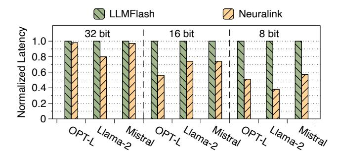

**Figure 16.** Performance of NEURALINK across different parameter precisions using the Alpaca dataset on OnePlus 12.

<span id="page-12-0"></span>**Table 8.** Performance across different combinations of *profiling* (rows) and *testing* (columns) datasets on OnePlus 12. The reported speedup refers to the performance improvement of Neuralink compared to LLMFlash on the testing dataset.

| Model   | Profiling Dataset | Testing Dataset |             |            |  |
|---------|-------------------|-----------------|-------------|------------|--|
|         |                   | Alpaca          | OpenWebText | WikiText   |  |
|         | Alpaca            | 711.09 ms       | 809.80 ms   | 800.46 ms  |  |
|         | Speedup           | 1.86×           | 1.65×       | 1.59×      |  |
| OPT-L   | OpenWebText       | 856.48 ms       | 802.01 ms   | 800.26 ms  |  |
|         | Speedup           | 1.54×           | 1.67×       | 1.59×      |  |
|         | WikiText          | 823.93 ms       | 1031.41 ms  | 784.19 ms  |  |
|         | Speedup           | 1.60×           | 1.30×       | 1.63×      |  |
|         | Alpaca            | 4405.76 ms      | 4537.75 ms  | 3747.40 ms |  |
|         | Speedup           | 1.27×           | 1.17×       | 1.45×      |  |
| Llama-2 | OpenWebText       | 3546.12 ms      | 4118.59 ms  | 4318.28 ms |  |
|         | Speedup           | 1.57×           | 1.29×       | 1.26×      |  |
|         | WikiText          | 4769.36 ms      | 4535.48 ms  | 4578.87 ms |  |
|         | Speedup           | 1.17×           | 1.17×       | 1.18×      |  |

<span id="page-12-1"></span>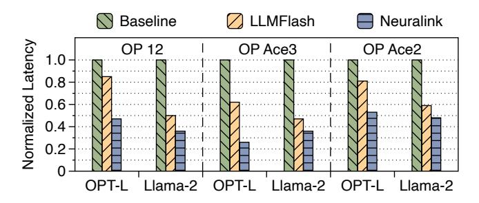

**Figure 17.** End-to-end latency across more diverse hardware configurations using the Alpaca dataset.

(OP Ace3) shares the same UFS storage but features a less powerful SoC. However, the comparable latency results between OP 12 and OP Ace3 suggest that storage plays a more critical role than the SoC in on-device inference. In contrast, OnePlus Ace2 (OP Ace2) has weaker storage compared to OP 12, making it easier to reach bandwidth limitations.

## 7 Related Works

**Model Pruning.** Pruning methods [51, 54] aim to reduce the number of model parameters while minimizing performance degradation. Several works [31, 32, 37, 46, 99] have explored static pruning, where parameters are pruned offline. In contrast, dynamic sparsity methods [8, 16, 30, 35, 65, 82, 91] determines which parameters to prune at runtime, enabling seamless integration with training or inference. Unlike these methods, Neuralink exploits activation sparsity within LLMs. By retaining all parameters and selectively activating only a subset, it preserves the models' generalization. Model Quantization. While aiming for a similar goal, model quantization [13, 28] reduces the precision of model parameters by optimizing the utilization of available bits to encode model information more efficiently. Numerous studies have driven precision progressively lower, with efforts ranging from 8-bit [17, 90] to 4-bit [21, 23, 97], 2-bit [12], and even 1bit [80, 92]. However, as precision decreases, data access patterns become increasingly fine-grained and scattered. This, in turn, exacerbates the I/O bottleneck on smartphones.

**Sparse Computation Optimization.** Sparse computation typically falls short in performance compared to its dense counterparts. Many works have been proposed to address this. Several compiler-based techniques [84, 107] are tailored for static sparsity patterns, while others [19, 24, 62, 89, 106] provide support for more general sparsity patterns. In parallel, an increasing number of hardware solutions [7, 11, 25, 45, 63, 87] have been specially designed. However, these advancements make the I/O bottleneck more pronounced. Activation Sparsity Application. Deja Vu [56] pioneered a predictor-based approach for sparsity-based LLM inference. Building upon this, Powerinfer [70] exploits this property to enable LLM execution on consumer-grade GPUs by offloading model weights to CPU. In mobile scenarios, LLM in a Flash [4] first proposes using flash on smartphones for model offloading. Powerinfer-2 [93] extends this approach further, serving a 47B LLM on a smartphone. However, these methods primarily focus on optimizing DRAM management and overlapping computation with data transfers, achieving only limited bandwidth improvements. NEURALINK complements these efforts by enhancing the neuron transfer bandwidth.

#### 8 Conclusion

We propose Neuralink, an algorithm-system co-design approach to accelerating LLM inference on smartphones by optimizing neuron placement within flash memory.

## 9 Acknowledgement

We sincerely thank our shepherd Gagandeep Singh and anonymous reviewers for their insightful feedback. The work is supported in part by the National Natural Science Foundation of China under Grant No. 62432004, and by a grant from the Guoqiang Institute, Tsinghua University.

# References

- <span id="page-13-4"></span>[1] Marah Abdin, Sam Ade Jacobs, Ammar Ahmad Awan, Jyoti Aneja, Ahmed Awadallah, Hany Awadalla, Nguyen Bach, Amit Bahree, Arash Bakhtiari, Harkirat Behl, et al. Phi-3 technical report: A highly capable language model locally on your phone. arXiv preprint arXiv:2404.14219, 2024.
- <span id="page-13-6"></span>[2] AF Agarap. Deep learning using rectified linear units (relu). arXiv preprint arXiv:1803.08375, 2018.
- <span id="page-13-8"></span>[3] Joshua Ainslie, James Lee-Thorp, Michiel de Jong, Yury Zemlyanskiy, Federico Lebrón, and Sumit Sanghai. Gqa: Training generalized multi-query transformer models from multi-head checkpoints. arXiv preprint arXiv:2305.13245, 2023.
- <span id="page-13-5"></span>[4] Keivan Alizadeh, Iman Mirzadeh, Dmitry Belenko, Karen Khatamifard, Minsik Cho, Carlo C Del Mundo, Mohammad Rastegari, and Mehrdad Farajtabar. Llm in a flash: Efficient large language model inference with limited memory. arXiv preprint arXiv:2312.11514, 2023.
- <span id="page-13-1"></span>[5] Rohan Anil, Andrew M Dai, Orhan Firat, Melvin Johnson, Dmitry Lepikhin, Alexandre Passos, Siamak Shakeri, Emanuel Taropa, Paige Bailey, Zhifeng Chen, et al. Palm 2 technical report. arXiv preprint arXiv:2305.10403, 2023.
- <span id="page-13-18"></span>[6] Jens Axboe. liburing. <https://github.com/axboe/liburing>, 2025. Accessed: 2025-02-25.
- <span id="page-13-34"></span>[7] Nathan Bell and Michael Garland. Efficient sparse matrix-vector multiplication on cuda. Technical report, Nvidia Technical Report NVR-2008-004, Nvidia Corporation, 2008.
- <span id="page-13-22"></span>[8] Emmanuel Bengio, Pierre-Luc Bacon, Joelle Pineau, and Doina Precup. Conditional computation in neural networks for faster models. arXiv preprint arXiv:1511.06297, 2015.
- <span id="page-13-17"></span>[9] Yonatan Bisk, Rowan Zellers, Ronan Le Bras, Jianfeng Gao, and Yejin Choi. Piqa: Reasoning about physical commonsense in natural language. In Thirty-Fourth AAAI Conference on Artificial Intelligence, 2020.
- <span id="page-13-2"></span>[10] Tom Brown, Benjamin Mann, Nick Ryder, Melanie Subbiah, Jared D Kaplan, Prafulla Dhariwal, Arvind Neelakantan, Pranav Shyam, Girish Sastry, Amanda Askell, et al. Language models are few-shot learners. Advances in neural information processing systems, 33:1877– 1901, 2020.
- <span id="page-13-35"></span>[11] Aydin Buluç, Jeremy T Fineman, Matteo Frigo, John R Gilbert, and Charles E Leiserson. Parallel sparse matrix-vector and matrixtranspose-vector multiplication using compressed sparse blocks. In Proceedings of the twenty-first annual symposium on Parallelism in algorithms and architectures, pages 233–244, 2009.
- <span id="page-13-31"></span>[12] Jerry Chee, Yaohui Cai, Volodymyr Kuleshov, and Christopher M De Sa. Quip: 2-bit quantization of large language models with guarantees. Advances in Neural Information Processing Systems, 36, 2024.
- <span id="page-13-26"></span>[13] Yu Cheng, Duo Wang, Pan Zhou, and Tao Zhang. A survey of model compression and acceleration for deep neural networks. arXiv preprint arXiv:1710.09282, 2017.
- <span id="page-13-15"></span>[14] Karl Cobbe, Vineet Kosaraju, Mohammad Bavarian, Mark Chen, Heewoo Jun, Lukasz Kaiser, Matthias Plappert, Jerry Tworek, Jacob Hilton, Reiichiro Nakano, Christopher Hesse, and John Schulman. Training verifiers to solve math word problems. arXiv preprint arXiv:2110.14168, 2021.
- <span id="page-13-9"></span>[15] Damai Dai, Chengqi Deng, Chenggang Zhao, RX Xu, Huazuo Gao, Deli Chen, Jiashi Li, Wangding Zeng, Xingkai Yu, Yu Wu, et al. Deepseekmoe: Towards ultimate expert specialization in mixture-ofexperts language models. arXiv preprint arXiv:2401.06066, 2024.
- <span id="page-13-23"></span>[16] Andrew Davis and Itamar Arel. Low-rank approximations for conditional feedforward computation in deep neural networks. arXiv preprint arXiv:1312.4461, 2013.
- <span id="page-13-28"></span>[17] Tim Dettmers, Mike Lewis, Younes Belkada, and Luke Zettlemoyer. Gpt3. int8 (): 8-bit matrix multiplication for transformers at scale. Advances in Neural Information Processing Systems, 35:30318–30332, 2022.

- <span id="page-13-3"></span>[18] Jacob Devlin. Bert: Pre-training of deep bidirectional transformers for language understanding. arXiv preprint arXiv:1810.04805, 2018.
- <span id="page-13-32"></span>[19] Ruwen Fan, Minhui Xie, Haodi Jiang, and Youyou Lu. Maxembed: Maximizing ssd bandwidth utilization for huge embedding models serving. In Proceedings of the 29th ACM International Conference on Architectural Support for Programming Languages and Operating Systems, Volume 4, ASPLOS '24, page 188–202, New York, NY, USA, 2025. Association for Computing Machinery.
- <span id="page-13-10"></span>[20] William Fedus, Barret Zoph, and Noam Shazeer. Switch transformers: Scaling to trillion parameter models with simple and efficient sparsity. Journal of Machine Learning Research, 23(120):1–39, 2022.
- <span id="page-13-29"></span>[21] BitsandBytes Foundation. Bitsandbytes. [https://github.com/](https://github.com/bitsandbytes-foundation/bitsandbytes) [bitsandbytes-foundation/bitsandbytes](https://github.com/bitsandbytes-foundation/bitsandbytes), 2025. Accessed: 2025-02-28.
- <span id="page-13-0"></span>[22] Mohammad Fraiwan and Natheer Khasawneh. A review of chatgpt applications in education, marketing, software engineering, and healthcare: Benefits, drawbacks, and research directions. arXiv preprint arXiv:2305.00237, 2023.
- <span id="page-13-30"></span>[23] Elias Frantar, Saleh Ashkboos, Torsten Hoefler, and Dan Alistarh. Gptq: Accurate post-training quantization for generative pre-trained transformers. arXiv preprint arXiv:2210.17323, 2022.
- <span id="page-13-33"></span>[24] Trevor Gale, Matei Zaharia, Cliff Young, and Erich Elsen. Sparse GPU kernels for deep learning. In Proceedings of the International Conference for High Performance Computing, Networking, Storage and Analysis, SC 2020, 2020.
- <span id="page-13-36"></span>[25] Trevor Gale, Matei Zaharia, Cliff Young, and Erich Elsen. Sparse gpu kernels for deep learning. In SC20: International Conference for High Performance Computing, Networking, Storage and Analysis, pages 1–14. IEEE, 2020.
- <span id="page-13-12"></span>[26] Bernard A Galler and Michael J Fisher. An improved equivalence algorithm. Communications of the ACM, 7(5):301–303, 1964.
- <span id="page-13-13"></span>[27] Georgi Gerganov. ggerganov/llama.cpp: Port of facebook's llama model in c/c++. <https://github.com/ggerganov/llama.cpp>, 2024.
- <span id="page-13-27"></span>[28] Amir Gholami, Sehoon Kim, Zhen Dong, Zhewei Yao, Michael W Mahoney, and Kurt Keutzer. A survey of quantization methods for efficient neural network inference. In Low-Power Computer Vision, pages 291–326. Chapman and Hall/CRC, 2022.
- <span id="page-13-14"></span>[29] Aaron Gokaslan, Vanya Cohen, Ellie Pavlick, and Stefanie Tellex. Openwebtext corpus. [http://Skylion007.github.io/](http://Skylion007.github.io/OpenWebTextCorpus) [OpenWebTextCorpus](http://Skylion007.github.io/OpenWebTextCorpus), 2019.
- <span id="page-13-24"></span>[30] Yiwen Guo, Anbang Yao, and Yurong Chen. Dynamic network surgery for efficient dnns. Advances in neural information processing systems, 29, 2016.
- <span id="page-13-19"></span>[31] Song Han, Huizi Mao, and William J Dally. Deep compression: Compressing deep neural networks with pruning, trained quantization and huffman coding. arXiv preprint arXiv:1510.00149, 2015.
- <span id="page-13-20"></span>[32] Stephen Hanson and Lorien Pratt. Comparing biases for minimal network construction with back-propagation. Advances in neural information processing systems, 1, 1988.
- <span id="page-13-11"></span>[33] Juris Hartmanis. Computers and intractability: a guide to the theory of np-completeness (michael r. garey and david s. johnson). Siam Review, 24(1):90, 1982.
- <span id="page-13-7"></span>[34] Junhui He, Shangyu Wu, Weidong Wen, Chun Jason Xue, and Qingan Li. Chess: Optimizing llm inference via channel-wise thresholding and selective sparsification. arXiv preprint arXiv:2409.01366, 2024.
- <span id="page-13-25"></span>[35] Yang He, Guoliang Kang, Xuanyi Dong, Yanwei Fu, and Yi Yang. Soft filter pruning for accelerating deep convolutional neural networks. arXiv preprint arXiv:1808.06866, 2018.
- <span id="page-13-16"></span>[36] Dan Hendrycks, Collin Burns, Steven Basart, Andy Zou, Mantas Mazeika, Dawn Song, and Jacob Steinhardt. Measuring massive multitask language understanding. Proceedings of the International Conference on Learning Representations (ICLR), 2021.
- <span id="page-13-21"></span>[37] Zehao Huang and Naiyan Wang. Data-driven sparse structure selection for deep neural networks. In Proceedings of the European conference on computer vision (ECCV), pages 304–320, 2018.

- <span id="page-14-27"></span>[38] Mojan Javaheripi, Sébastien Bubeck, Marah Abdin, Jyoti Aneja, Sebastien Bubeck, Caio César Teodoro Mendes, Weizhu Chen, Allie Del Giorno, Ronen Eldan, Sivakanth Gopi, et al. Phi-2: The surprising power of small language models. Microsoft Research Blog, 1(3):3, 2023.
- <span id="page-14-21"></span>[39] JEDEC. Jedec announces publication of universal flash storage (ufs) standard. <https://www.jedec.org>, February 2021. Accessed: 2024-10- 02.
- <span id="page-14-4"></span>[40] Albert Q Jiang, Alexandre Sablayrolles, Arthur Mensch, Chris Bamford, Devendra Singh Chaplot, Diego de las Casas, Florian Bressand, Gianna Lengyel, Guillaume Lample, Lucile Saulnier, et al. Mistral 7b. arXiv preprint arXiv:2310.06825, 2023.
- <span id="page-14-25"></span>[41] Albert Q Jiang, Alexandre Sablayrolles, Antoine Roux, Arthur Mensch, Blanche Savary, Chris Bamford, Devendra Singh Chaplot, Diego de las Casas, Emma Bou Hanna, Florian Bressand, et al. Mixtral of experts. arXiv preprint arXiv:2401.04088, 2024.
- <span id="page-14-8"></span>[42] Jared Kaplan, Sam McCandlish, Tom Henighan, Tom B Brown, Benjamin Chess, Rewon Child, Scott Gray, Alec Radford, Jeffrey Wu, and Dario Amodei. Scaling laws for neural language models. arXiv preprint arXiv:2001.08361, 2020.
- <span id="page-14-0"></span>[43] Tiffany H Kung, Morgan Cheatham, Arielle Medenilla, Czarina Sillos, Lorie De Leon, Camille Elepaño, Maria Madriaga, Rimel Aggabao, Giezel Diaz-Candido, James Maningo, et al. Performance of chatgpt on usmle: potential for ai-assisted medical education using large language models. PLoS digital health, 2(2):e0000198, 2023.
- <span id="page-14-13"></span>[44] Mark Kurtz, Justin Kopinsky, Rati Gelashvili, Alexander Matveev, John Carr, Michael Goin, William Leiserson, Sage Moore, Nir Shavit, and Dan Alistarh. Inducing and exploiting activation sparsity for fast inference on deep neural networks. In International Conference on Machine Learning, pages 5533–5543. PMLR, 2020.
- <span id="page-14-36"></span>[45] Jinming Lai, Zhiyou Li, Chaojie Wang, Hailong Wang, and Xiaohua Ma. Realization of low in-band harmonic for compact 6–18-ghz t/r module under tx-mode operation. Chinese Journal of Electronics, 33(2):380–384, 2024.
- <span id="page-14-33"></span>[46] Vadim Lebedev and Victor Lempitsky. Fast convnets using groupwise brain damage. In Proceedings of the IEEE conference on computer vision and pattern recognition, pages 2554–2564, 2016.
- <span id="page-14-20"></span>[47] Donghyun Lee, Je-Yong Lee, Genghan Zhang, Mo Tiwari, and Azalia Mirhoseini. Cats: Contextually-aware thresholding for sparsity in large language models. arXiv preprint arXiv:2404.08763, 2024.
- <span id="page-14-19"></span>[48] Jaeseong Lee, Seung-won Hwang, Wonpyo Park, and Mingi Ji. Breaking relu barrier: Generalized moefication for dense pretrained models. In Proceedings of the 2024 Conference on Empirical Methods in Natural Language Processing, pages 10097–10107, 2024.
- <span id="page-14-6"></span>[49] Yuanchun Li, Hao Wen, Weijun Wang, Xiangyu Li, Yizhen Yuan, Guohong Liu, Jiacheng Liu, Wenxing Xu, Xiang Wang, Yi Sun, et al. Personal llm agents: Insights and survey about the capability, efficiency and security. arXiv preprint arXiv:2401.05459, 2024.
- <span id="page-14-14"></span>[50] Zonglin Li, Chong You, Srinadh Bhojanapalli, Daliang Li, Ankit Singh Rawat, Sashank J Reddi, Ke Ye, Felix Chern, Felix Yu, Ruiqi Guo, et al. The lazy neuron phenomenon: On emergence of activation sparsity in transformers. arXiv preprint arXiv:2210.06313, 2022.
- <span id="page-14-31"></span>[51] Tailin Liang, John Glossner, Lei Wang, Shaobo Shi, and Xiaotong Zhang. Pruning and quantization for deep neural network acceleration: A survey. Neurocomputing, 461:370–403, 2021.
- <span id="page-14-24"></span>[52] Aixin Liu, Bei Feng, Bin Wang, Bingxuan Wang, Bo Liu, Chenggang Zhao, Chengqi Dengr, Chong Ruan, Damai Dai, Daya Guo, et al. Deepseek-v2: A strong, economical, and efficient mixture-of-experts language model. arXiv preprint arXiv:2405.04434, 2024.
- <span id="page-14-22"></span>[53] Aixin Liu, Bei Feng, Bing Xue, Bingxuan Wang, Bochao Wu, Chengda Lu, Chenggang Zhao, Chengqi Deng, Chenyu Zhang, Chong Ruan, et al. Deepseek-v3 technical report. arXiv preprint arXiv:2412.19437, 2024.
- <span id="page-14-32"></span>[54] Jiayi Liu, Samarth Tripathi, Unmesh Kurup, and Mohak Shah. Pruning algorithms to accelerate convolutional neural networks for edge

- applications: A survey. arXiv preprint arXiv:2005.04275, 2020.
- <span id="page-14-7"></span>[55] Lianjun Liu, Hongli An, Pengxuan Chen, and Longxiang Ye. A contemporary overview: Trends and applications of large language models on mobile devices. arXiv preprint arXiv:2412.03772, 2024.
- <span id="page-14-9"></span>[56] Zichang Liu, Jue Wang, Tri Dao, Tianyi Zhou, Binhang Yuan, Zhao Song, Anshumali Shrivastava, Ce Zhang, Yuandong Tian, Christopher Re, et al. Deja vu: Contextual sparsity for efficient llms at inference time. In International Conference on Machine Learning, pages 22137– 22176. PMLR, 2023.
- <span id="page-14-12"></span>[57] Scott Lowe. Calculate iops in a storage array. TechRepublic, verkkosivu, Saatavissa (viitattu 27.02. 2020): https://www. techrepublic. com/blog/the-enterprise-cloud/calculate-iops-in-a-storage-array, 2010.
- <span id="page-14-30"></span>[58] Yuqi Luo, Chenyang Song, Xu Han, Yingfa Chen, Chaojun Xiao, Zhiyuan Liu, and Maosong Sun. Sparsing law: Towards large language models with greater activation sparsity. arXiv preprint arXiv:2411.02335, 2024.
- <span id="page-14-29"></span>[59] Stephen Merity, Caiming Xiong, James Bradbury, and Richard Socher. Pointer sentinel mixture models, 2016.
- <span id="page-14-10"></span>[60] Xupeng Miao, Gabriele Oliaro, Zhihao Zhang, Xinhao Cheng, Hongyi Jin, Tianqi Chen, and Zhihao Jia. Towards efficient generative large language model serving: A survey from algorithms to systems. arXiv preprint arXiv:2312.15234, 2023.
- <span id="page-14-16"></span>[61] Iman Mirzadeh, Keivan Alizadeh, Sachin Mehta, Carlo C Del Mundo, Oncel Tuzel, Golnoosh Samei, Mohammad Rastegari, and Mehrdad Farajtabar. Relu strikes back: Exploiting activation sparsity in large language models. arXiv preprint arXiv:2310.04564, 2023.
- <span id="page-14-35"></span>[62] Maxim Naumov, L Chien, Philippe Vandermersch, and Ujval Kapasi. Cusparse library. In GPU Technology Conference, 2010.
- <span id="page-14-37"></span>[63] NVIDIA. Accelerating inference with sparsity using the nvidia ampere architecture and nvidia tensorrt, 2021. Accessed: 2024-10-18.
- <span id="page-14-1"></span>[64] OpenAI. ChatGPT: Get instant answers, find creative inspiration, learn something new. <https://openai.com/chatgpt>, 2022.
- <span id="page-14-34"></span>[65] Victor Sanh, Thomas Wolf, and Alexander Rush. Movement pruning: Adaptive sparsity by fine-tuning. Advances in Neural Information Processing Systems, 33:20378–20389, 2020.
- <span id="page-14-23"></span>[66] Noam Shazeer. Fast transformer decoding: One write-head is all you need. arXiv preprint arXiv:1911.02150, 2019.
- <span id="page-14-26"></span>[67] Michael Sipser. Introduction to the theory of computation. ACM Sigact News, 27(1):27–29, 1996.
- <span id="page-14-17"></span>[68] Chenyang Song, Xu Han, Zhengyan Zhang, Shengding Hu, Xiyu Shi, Kuai Li, Chen Chen, Zhiyuan Liu, Guangli Li, Tao Yang, et al. Prosparse: Introducing and enhancing intrinsic activation sparsity within large language models. arXiv preprint arXiv:2402.13516, 2024.
- <span id="page-14-15"></span>[69] Jifeng Song, Kai Huang, Xiangyu Yin, Boyuan Yang, and Wei Gao. Achieving sparse activation in small language models. arXiv preprint arXiv:2406.06562, 2024.
- <span id="page-14-11"></span>[70] Yixin Song, Zeyu Mi, Haotong Xie, and Haibo Chen. Powerinfer: Fast large language model serving with a consumer-grade gpu. arXiv preprint arXiv:2312.12456, 2023.
- <span id="page-14-18"></span>[71] Yixin Song, Haotong Xie, Zhengyan Zhang, Bo Wen, Li Ma, Zeyu Mi, and Haibo Chen. Turbo sparse: Achieving llm sota performance with minimal activated parameters. arXiv preprint arXiv:2406.05955, 2024.
- <span id="page-14-2"></span>[72] Jiahong Su and Weipeng Yang. Unlocking the power of chatgpt: A framework for applying generative ai in education. ECNU Review of Education, 6(3):355–366, 2023.
- <span id="page-14-28"></span>[73] Rohan Taori, Ishaan Gulrajani, Tianyi Zhang, Yann Dubois, Xuechen Li, Carlos Guestrin, Percy Liang, and Tatsunori B. Hashimoto. Stanford alpaca: An instruction-following llama model. [https://github.](https://github.com/tatsu-lab/stanford_alpaca) [com/tatsu-lab/stanford\\_alpaca](https://github.com/tatsu-lab/stanford_alpaca), 2023.
- <span id="page-14-5"></span>[74] Gemini Team, Rohan Anil, Sebastian Borgeaud, Yonghui Wu, Jean-Baptiste Alayrac, Jiahui Yu, Radu Soricut, Johan Schalkwyk, Andrew M Dai, Anja Hauth, et al. Gemini: a family of highly capable multimodal models. arXiv preprint arXiv:2312.11805, 2023.
- <span id="page-14-3"></span>[75] OpenAI Teams. Gpt-4 technical report, 2024.

- <span id="page-15-17"></span><span id="page-15-0"></span>[76] Termux. Termux app. <https://github.com/termux/termux-app>, 2025. Accessed: 2025-02-25.
- <span id="page-15-8"></span>[77] Omkar Thawakar, Ashmal Vayani, Salman Khan, Hisham Cholakkal, Rao Muhammad Anwer, Michael Felsberg, Timothy Baldwin, Eric P. Xing, and Fahad Shahbaz Khan. Mobillama: Towards accurate and lightweight fully transparent gpt, 2024.
- <span id="page-15-2"></span>[78] Hugo Touvron, Louis Martin, Kevin Stone, Peter Albert, Amjad Almahairi, Yasmine Babaei, Nikolay Bashlykov, Soumya Batra, Prajjwal Bhargava, Shruti Bhosale, et al. Llama 2: Open foundation and finetuned chat models. arXiv preprint arXiv:2307.09288, 2023.
- <span id="page-15-16"></span>[79] Jean Vuillemin. A data structure for manipulating priority queues. Communications of the ACM, 21(4):309–315, 1978.
- <span id="page-15-27"></span>[80] Hongyu Wang, Shuming Ma, Li Dong, Shaohan Huang, Huaijie Wang, Lingxiao Ma, Fan Yang, Ruiping Wang, Yi Wu, and Furu Wei. Bitnet: Scaling 1-bit transformers for large language models. arXiv preprint arXiv:2310.11453, 2023.
- <span id="page-15-13"></span>[81] Hongyu Wang, Shuming Ma, Ruiping Wang, and Furu Wei. Q-sparse: All large language models can be fully sparsely-activated. arXiv preprint arXiv:2407.10969, 2024.
- <span id="page-15-23"></span>[82] Tuowei Wang, Xingyu Chen, Kun Li, Ting Cao, Ju Ren, and Yaoxue Zhang. Lemo: Enabling less token involvement for more context fine-tuning, 2025.
- <span id="page-15-12"></span>[83] Tuowei Wang, Kun Li, Zixu Hao, Donglin Bai, Ju Ren, Yaoxue Zhang, Ting Cao, and Mao Yang. Long exposure: Accelerating parameterefficient fine-tuning for llms under shadowy sparsity. In SC24: International Conference for High Performance Computing, Networking, Storage and Analysis, pages 1–18. IEEE, 2024.
- <span id="page-15-29"></span>[84] Ziheng Wang. Sparsert: Accelerating unstructured sparsity on gpus for deep learning inference. In Proceedings of the ACM international conference on parallel architectures and compilation techniques, pages 31–42, 2020.
- <span id="page-15-4"></span>[85] Hao Wen, Yuanchun Li, Guohong Liu, Shanhui Zhao, Tao Yu, Toby Jia-Jun Li, Shiqi Jiang, Yunhao Liu, Yaqin Zhang, and Yunxin Liu. Empowering llm to use smartphone for intelligent task automation. arXiv preprint arXiv:2308.15272, 2023.
- <span id="page-15-5"></span>[86] Hao Wen, Yuanchun Li, Guohong Liu, Shanhui Zhao, Tao Yu, Toby Jia-Jun Li, Shiqi Jiang, Yunhao Liu, Yaqin Zhang, and Yunxin Liu. Autodroid: Llm-powered task automation in android. In Proceedings of the 30th Annual International Conference on Mobile Computing and Networking, pages 543–557, 2024.
- <span id="page-15-33"></span>[87] Samuel Williams, Leonid Oliker, Richard Vuduc, John Shalf, Katherine Yelick, and James Demmel. Optimization of sparse matrix-vector multiplication on emerging multicore platforms. In Proceedings of the 2007 ACM/IEEE Conference on Supercomputing, pages 1–12, 2007.
- <span id="page-15-1"></span>[88] Shijie Wu, Ozan Irsoy, Steven Lu, Vadim Dabravolski, Mark Dredze, Sebastian Gehrmann, Prabhanjan Kambadur, David Rosenberg, and Gideon Mann. Bloomberggpt: A large language model for finance. arXiv preprint arXiv:2303.17564, 2023.
- <span id="page-15-31"></span>[89] Haojun Xia, Zhen Zheng, Yuchao Li, Donglin Zhuang, Zhongzhu Zhou, Xiafei Qiu, Yong Li, Wei Lin, and Shuaiwen Leon Song. Flash-llm: Enabling cost-effective and highly-efficient large generative model inference with unstructured sparsity. arXiv preprint arXiv:2309.10285, 2023.
- <span id="page-15-25"></span>[90] Guangxuan Xiao, Ji Lin, Mickael Seznec, Hao Wu, Julien Demouth, and Song Han. Smoothquant: Accurate and efficient post-training quantization for large language models. In International Conference on Machine Learning, pages 38087–38099. PMLR, 2023.
- <span id="page-15-24"></span>[91] Dongkuan Xu, Ian EH Yen, Jinxi Zhao, and Zhibin Xiao. Rethinking network pruning–under the pre-train and fine-tune paradigm. arXiv preprint arXiv:2104.08682, 2021.
- <span id="page-15-28"></span>[92] Yuzhuang Xu, Xu Han, Zonghan Yang, Shuo Wang, Qingfu Zhu, Zhiyuan Liu, Weidong Liu, and Wanxiang Che. Onebit: Towards extremely low-bit large language models. arXiv preprint arXiv:2402.11295, 2024.

- <span id="page-15-10"></span>[93] Zhenliang Xue, Yixin Song, Zeyu Mi, Le Chen, Yubin Xia, and Haibo Chen. Powerinfer-2: Fast large language model inference on a smartphone. arXiv preprint arXiv:2406.06282, 2024.
- <span id="page-15-20"></span>[94] Juncheng Yang, Yazhuo Zhang, Ziyue Qiu, Yao Yue, and Rashmi Vinayak. Fifo queues are all you need for cache eviction. In Proceedings of the 29th Symposium on Operating Systems Principles, pages 130–149, 2023.
- <span id="page-15-6"></span>[95] Yifan Yao, Jinhao Duan, Kaidi Xu, Yuanfang Cai, Zhibo Sun, and Yue Zhang. A survey on large language model (llm) security and privacy: The good, the bad, and the ugly. High-Confidence Computing, page 100211, 2024.
- <span id="page-15-9"></span>[96] Yuan Yao, Tianyu Yu, Ao Zhang, Chongyi Wang, Junbo Cui, Hongji Zhu, Tianchi Cai, Haoyu Li, Weilin Zhao, Zhihui He, et al. Minicpm-v: A gpt-4v level mllm on your phone. arXiv preprint arXiv:2408.01800, 2024.
- <span id="page-15-26"></span>[97] Zhewei Yao, Reza Yazdani Aminabadi, Minjia Zhang, Xiaoxia Wu, Conglong Li, and Yuxiong He. Zeroquant: Efficient and affordable post-training quantization for large-scale transformers. Advances in Neural Information Processing Systems, 35:27168–27183, 2022.
- <span id="page-15-7"></span>[98] Wangsong Yin, Mengwei Xu, Yuanchun Li, and Xuanzhe Liu. Llm as a system service on mobile devices. arXiv preprint arXiv:2403.11805, 2024.
- <span id="page-15-22"></span>[99] Ming Yuan and Yi Lin. Model selection and estimation in regression with grouped variables. Journal of the Royal Statistical Society Series B: Statistical Methodology, 68(1):49–67, 2006.
- <span id="page-15-19"></span>[100] Rowan Zellers, Yonatan Bisk, Roy Schwartz, and Yejin Choi. Swag: A large-scale adversarial dataset for grounded commonsense inference. In Proceedings of the 2018 Conference on Empirical Methods in Natural Language Processing (EMNLP), 2018.
- <span id="page-15-18"></span>[101] Rowan Zellers, Ari Holtzman, Yonatan Bisk, Ali Farhadi, and Yejin Choi. Hellaswag: Can a machine really finish your sentence? arXiv preprint arXiv:1905.07830, 2019.
- <span id="page-15-3"></span>[102] Susan Zhang, Stephen Roller, Naman Goyal, Mikel Artetxe, Moya Chen, Shuohui Chen, Christopher Dewan, Mona Diab, Xian Li, Xi Victoria Lin, et al. Opt: Open pre-trained transformer language models. arXiv preprint arXiv:2205.01068, 2022.
- <span id="page-15-14"></span>[103] Zhengyan Zhang, Yankai Lin, Zhiyuan Liu, Peng Li, Maosong Sun, and Jie Zhou. Moefication: Transformer feed-forward layers are mixtures of experts. arXiv preprint arXiv:2110.01786, 2021.
- <span id="page-15-15"></span>[104] Zhengyan Zhang, Yixin Song, Guanghui Yu, Xu Han, Yankai Lin, Chaojun Xiao, Chenyang Song, Zhiyuan Liu, Zeyu Mi, and Maosong Sun. Relu<sup>2</sup> wins: Discovering efficient activation functions for sparse llms. arXiv preprint arXiv:2402.03804, 2024.
- <span id="page-15-21"></span>[105] Zhengyan Zhang, Zhiyuan Zeng, Yankai Lin, Chaojun Xiao, Xiaozhi Wang, Xu Han, Zhiyuan Liu, Ruobing Xie, Maosong Sun, and Jie Zhou. Emergent modularity in pre-trained transformers. arXiv preprint arXiv:2305.18390, 2023.
- <span id="page-15-32"></span>[106] Ningxin Zheng, Huiqiang Jiang, Quanlu Zhang, Zhenhua Han, Lingxiao Ma, Yuqing Yang, Fan Yang, Chengruidong Zhang, Lili Qiu, Mao Yang, et al. Pit: Optimization of dynamic sparse deep learning models via permutation invariant transformation. In Proceedings of the 29th Symposium on Operating Systems Principles, pages 331–347, 2023.
- <span id="page-15-30"></span>[107] Ningxin Zheng, Bin Lin, Quanlu Zhang, Lingxiao Ma, Yuqing Yang, Fan Yang, Yang Wang, Mao Yang, and Lidong Zhou. SparTA: Deep-Learning Model sparsity via Tensor-with-Sparsity-Attribute. In 16th USENIX Symposium on Operating Systems Design and Implementation (OSDI 22), pages 213–232, 2022.
- <span id="page-15-11"></span>[108] Hao Zhou, Chengming Hu, Ye Yuan, Yufei Cui, Yili Jin, Can Chen, Haolun Wu, Dun Yuan, Li Jiang, Di Wu, et al. Large language model (llm) for telecommunications: A comprehensive survey on principles, key techniques, and opportunities. arXiv preprint arXiv:2405.10825, 2024.