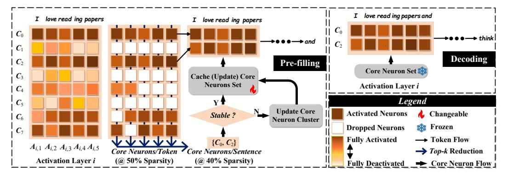
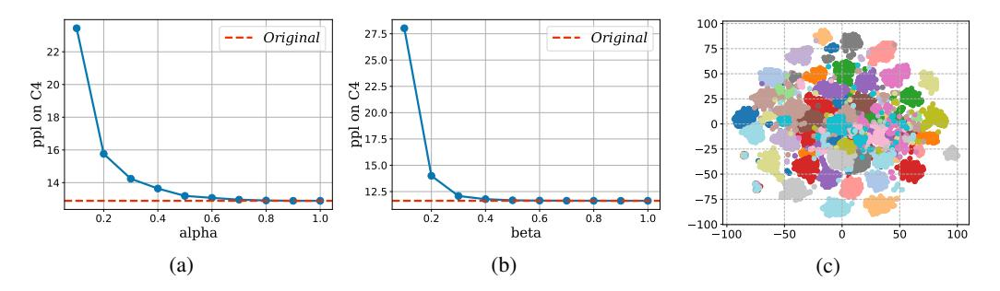
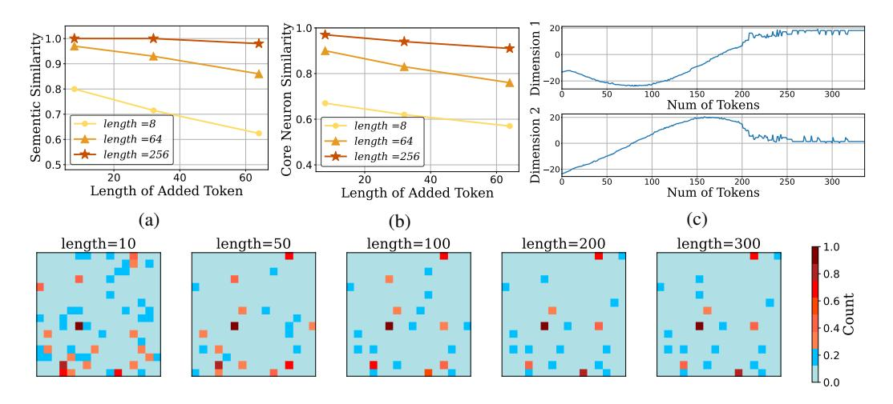
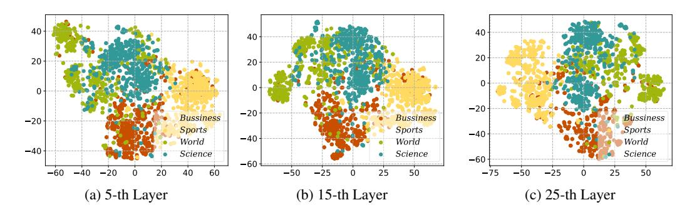
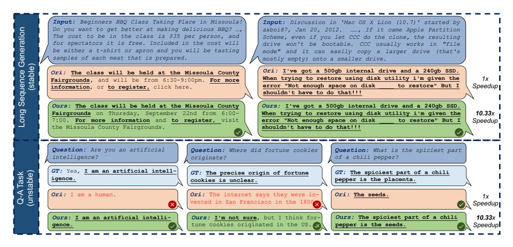
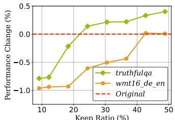
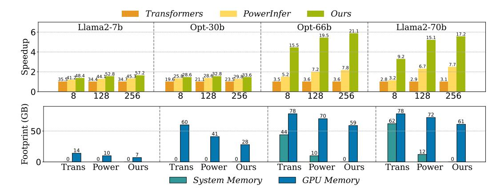

# SPARSEINFER FRAMEWORK: LEVERAGING SEMANTIC PATTERNS FOR ADAPTIVE SPARSE LLM INFERENCE

Qinsi Wang, Yueqian Lin, Yixuan Yang, Hancheng Ye

# ABSTRACT

High inference costs and memory footprints limit the widespread use of powerful large language models (LLMs). Adaptive sparse activation offers efficiency by using only essential neurons per token without performance loss, ideal for limited-resource settings. However, current methods often use token-level MLP predictors, causing frequent activation changes and limiting speedups. We propose SparseInfer, an MLP-free adaptive sparse inference method using sentence-level prediction. It identifies 'sentence-wise core neurons' crucial for sentence meaning. We discovered these neurons exhibit semantic stability and similarity across sentences. Capitalizing on this, SparseInfer uses two semantic prediction methods. By fixing core neurons during encoding, it achieves zero-cost sparse inference. Experiments show broad generalization and significant speedups: up to 10.33x over Huggingface and 2.72x over PowerInfer on an NVIDIA TITAN XP GPU.

# 1 INTRODUCTION

Generative Large Language Models (LLMs) have shown impressive capabilities in creative writing, code generation, and complex NLP tasks [\(Brown, 2020;](#page-8-0) [Chowdhery et al., 2023;](#page-8-1) [Touvron et al.,](#page-9-0) [2023a;](#page-9-0) [Team et al., 2023;](#page-9-1) [Jiang et al., 2023\)](#page-8-2), significantly influencing our daily lives. A typical generation task includes one inference in the pre-filling stage and multiple in the decoding stage, which becomes expensive due to the massive model size [\(Pope et al., 2023\)](#page-9-2). To make LLMs more accessible, researchers aim to accelerate inference. The key challenge is: how to reduce memory and computation without harming performance?

Model compression [\(Bucilua et al., 2006;](#page-8-3) [Cheng et al., 2017;](#page-8-4) [Choudhary et al., 2020\)](#page-8-5) transforms ˇ models into lighter versions. Quantization [\(Lin et al., 2024;](#page-9-3) [Frantar et al., 2022;](#page-8-6) [Dettmers et al.,](#page-8-7) [2024\)](#page-8-7) reduces memory via fewer bits, while pruning [\(LeCun et al., 1989;](#page-9-4) [Lee et al., 2018;](#page-9-5) [Frankle](#page-8-8) [& Carbin, 2018;](#page-8-8) [Bansal et al., 2022\)](#page-8-9) removes less important components. Yet, these methods often hurt performance and lack hardware generalization—e.g., 3-bit quantization isn't widely supported [\(Cheng et al., 2017;](#page-8-4) [Kim et al., 2021\)](#page-8-10). Dynamic sparse activation inference [\(Liu et al., 2023\)](#page-9-6) is a promising alternative. It activates only a few neurons per token, boosting inference speed on resource-constrained devices. For example, PowerInfer [\(Song et al., 2023\)](#page-9-7) achieves 11.6× speedup on PCs, and similar techniques have been applied on mobile platforms [\(Xue et al., 2024;](#page-10-0) [Alizadeh](#page-8-11) [et al., 2023\)](#page-8-11). These methods use token-wise MLP predictors in each activation layer [\(Song et al.,](#page-9-7) [2023;](#page-9-7) [Xue et al., 2024;](#page-10-0) [Alizadeh et al., 2023\)](#page-8-11), but suffer from: (1) Frequent activation map changes and resource calls, which slow down decoding; (2) Extra computational cost from MLPs, which can add up to 10% overhead [\(Alizadeh et al., 2023\)](#page-8-11).

To address these issues, we propose SparseInfer, a sentence-level sparse inference strategy without MLP predictors. We define core neurons for each sentence—those most essential for decoding—and show they suffice for lossless generation. We study their correlation with sentence semantics and find strong stability and similarity. Based on this, we propose two semantic-based methods to predict core neurons.

Fig. [1](#page-1-0) shows an overview of our approach. SparseInfer predicts core neurons during pre-filling and reuses them throughout decoding, avoiding repeated prediction. Without extra MLPs, it maximizes sparse inference efficiency. Our contributions:

Figure 1: The overview framework of SparseInfer. In the pre-filling stage, at each activation layer, taking the i-th activation layer as an example, we first extract the token-wise core neurons based on the top-k selection and then further extract the top-k commonly activated core neurons among all tokens, which go through the stability estimation to determine how to update the sentence-wise core neuron set. After determination, the core neuron set will be fixed and utilized for sparse decoding.

- We propose SparseInfer, a sentence-level sparse inference framework based on sentence-wise core neurons.
- We discover that core neurons correlate strongly with sentence semantics in terms of stability and similarity.
- Our method shows strong model and task generalization, achieving up to 10× and 3× speedups over Huggingface and PowerInfer on NVIDIA GPUs without performance loss.

# 2 RELATED WORK

Dynamic Inference with Sparsity of Activation. LLMs often show high activation sparsity during inference [\(Liu et al., 2023\)](#page-9-6); for instance, around 80% of neurons in OPT-30B stay inactive [\(Alizadeh](#page-8-11) [et al., 2023\)](#page-8-11). Skipping these inactive neurons can reduce computation without harming performance. Many methods have explored predicting activated neurons using predictors. DejaVu [\(Liu et al.,](#page-9-6) [2023\)](#page-9-6) adds an MLP predictor per layer, reaching 93% accuracy. PowerInfer [\(Song et al., 2023\)](#page-9-7) identifies hot and cold neurons and assigns them to different devices for acceleration. PowerInfer2 [\(Xue et al., 2024\)](#page-10-0) and LLM in Flash [\(Alizadeh et al., 2023\)](#page-8-11) extend this for mobile platforms, reducing memory usage. However, existing works have two main assumptions: (1) neuron activation must be determined token by token; (2) the goal is to match the original activation pattern. Our work challenges both—showing that sentence-level activation can be predicted in advance, and that exact reproduction of original activation is not necessary.

Semantic Similarity. Semantic similarity has become a key topic with the rise of deep models like BERT [\(Li et al., 2020\)](#page-9-8) and Sentence-BERT [\(Feng et al., 2020\)](#page-8-12), which typically compute correlations based on embedding outputs. Recent studies connect activation similarity to semantic similarity. For example, [Wang et al.](#page-9-9) [\(2024\)](#page-9-9) uses activation similarity to measure semantic correlation, achieving Spearman scores of 0.66 on STS-B [\(Saif et al., 2013\)](#page-9-10) and 0.51 on SICK [\(Mueller & Thyagarajan,](#page-9-11) [2016\)](#page-9-11). Our work further confirms this connection and leverages it to predict activated neurons based on sentence semantics.

# 3 DEFINITION AND EXPLORATION OF CORE NEURONS

In this section, we first present the definition of core neurons and prove their effectiveness (Sec. [3.1\)](#page-2-0). Then, several exciting insights are observed about the correlation between sentence-wise core neurons and their semantics in both stability and similarity (Sec. [3.2\)](#page-3-0).

Figure 2: (a) (b) Effects of different  $\alpha$  and  $\beta$  values on performance, evaluated on OPT 6.7b with the C4 dataset. (c) Clustering of token-wise core neurons from 50 random C4 sentences at the 25-th layer. Each point denotes a  $\mathcal{C}_{\alpha}(x_i)$ , colored by sentence. Dimensionality is reduced using t-SNE (Van der Maaten & Hinton, 2008).

## 3.1 Definition and Role of Core Neurons

Motivated by previous works (Alizadeh et al., 2023) attempting to predict the most important neurons for inference and the fact that large activation values in LLMs often contribute more to model performance than small ones, we first define token-wise core neurons and extend it to sentence-wise definition.

**Definition 1: Token-wise Core Neurons.** For a token x at the i-th layer, let  $x_i$  be the input and  $A_i(x_i) = [a_1, a_2, \ldots, a_N]$  the activation vector, where N is the number of neurons and  $a_n$  is the n-th neuron's activation. The core neurons of  $x_i$  are defined as the top  $\alpha$  neurons with the highest positive activation values  $(a_n > 0)$ .

The core neurons for token x at the i-th layer is defined as the top  $\alpha$  largest activated neurons, whose set can be formulated as follows.

$$C_{\alpha}(x_i) = \{ n \mid a_n \ge \text{Percentile}(A_i^+, \alpha) \}, \tag{1}$$

where  $A_i^+ = \{a_n \mid a_n > 0, a_n \in A_i\}$  represents the set of positively-activated neurons at the *i*-th activation layer, and Percentile $(A_i^+, \alpha)$  denotes the  $\alpha$ -th percentile of the positive activation.

**Definition 2: Sentence-wise Core Neurons.** For a sentence s containing M tokens, the input of the i-th layer is  $s_i = [x_i^1, x_i^2, \dots, x_i^M]$ . Based on Equation 1, each  $x_i^m$  has core neurons  $\mathcal{C}_{\alpha}(x_i^m)$ . We define the core neurons for  $s_i, \mathcal{C}_{\alpha}^{\beta}(s_i)$ , as the top  $\beta$  of neurons that appear most frequently in the core neurons of all tokens, i.e.,  $\{\mathcal{C}_{\alpha}(x_i^1), \mathcal{C}_{\alpha}(x_i^2), \dots, \mathcal{C}_{\alpha}(x_i^M)\}$ , thus can be formulated as Equation 2.

$$C_{\alpha}^{\beta}(\mathbf{s}_i) = \{ n \mid f_{\alpha}(n; \mathbf{s}_i) \ge \text{Percentile}(f_{\alpha}(\mathbf{s}_i), \beta) \}, \tag{2}$$

where  $f_{\alpha}(s_i)$  denotes the count set of each neuron across all tokens, which is formulated as follows.

$$f_{\alpha}(\boldsymbol{s}_i) = \{f_{\alpha}(n; \boldsymbol{s}_i)\}_n = \{\sum_{m=1}^{M} \mathbb{I}(n \in \mathcal{C}_{\alpha}(x_i^m))\}_n, \tag{3}$$

where  $\mathbb{I}(\cdot)$  is an indicator function that returns one if n is in  $\mathcal{C}_{\alpha}(x_i^m)$  else zero. Percentile  $(f_{\alpha}(s_i),\beta)$  denotes the  $\beta$ -th percentile of  $f_{\alpha}(s_i)$ .

**Effectiveness of Core Neurons.** We evaluate core neurons on the C4 benchmark (Sakaguchi et al., 2021) under various hyper-parameters. Results are shown in Fig. 2 (a) and (b). Notably, even with small  $\alpha$  and  $\beta$ , performance degradation is minimal. For instance, when  $\alpha=0.4$ , perplexity increases by only 2%, and with  $\beta=0.25$ , it rises by just 3%.

To understand this, we analyze the distribution of token-wise core neurons across sentences (Fig. 2 (c)). Tokens within the same sentence tend to share similar core neurons, while tokens from different sentences form distinct clusters. This clustering shows why sentence-wise core neurons are effective: similar activation patterns allow a fixed subset to support inference for the whole sentence.

This highlights a key insight: **LLMs can maintain performance using only sentence-level core neurons.** Unlike prior work focusing on token-level sparsity, we are the first to explore sparsity at the sentence level in activation layers.

Figure 3: (Upper) (a)(b): Semantic and core neuron similarity between the original and extended sentences after adding tokens. (c): Change in core neurons as sentence length increases. We apply t-SNE to project neuron activations into 2D and visualize the shift along two dimensions. (Lower): Visualization of core neurons at token lengths 10, 50, 100, 200, and 300. We randomly select 256 neurons from the 25-th layer of OPT-6.7b. Each pixel is a neuron, and color indicates its frequency in current  $C_{\alpha}(x_i)$ . The brightest ones form  $C_{\alpha}^{\beta}(s_i)$ .

#### 3.2 EXPLORATION OF CORE NEURONS

We previously defined core neurons and demonstrated their effectiveness. To better predict them, we now explore their relationship with the input sentence, particularly its semantics.

Semantics is a key component of sentence information. Prior work (Wang et al., 2024) has shown a strong link between activation patterns and semantic similarity. This motivates us to examine whether core neurons are semantically related. We present two insights: one about stability, and one about similarity.

#### Insight-1: Core Neuron Stability Reflects Semantic Stability.

We extend sentences with coherent continuations of different lengths and compare semantic similarity and core neuron similarity between the original and extended sentences. As shown in Fig. 3 (a)(b), the two are strongly correlated. For example, extending a 256-token sentence with 8 or 64 tokens retains full semantic similarity, and the core neurons change by only 3% and 6%, respectively.

Fig. 3 (c) shows how  $C_{\alpha}^{\beta}(s_i)$  evolves as sentence length grows. Core neurons stabilize as sentence semantics become clearer. In the lower part of Fig. 3, we visualize core neurons at different lengths; variation is high below 100 tokens, but largely stable at 200 and 300 tokens. This indicates that during generation, when semantics stabilize, core neurons do as well.

## Insight-2: Core Neuron Similarity Reflects Semantic Similarity.

We further analyze core neuron similarity across different sentences. Using the ag\_news dataset (Zhang et al., 2015), which contains four topics, we observe that sentences with similar topics have higher core neuron similarity. Semantic similarity is computed via Sentence-BERT; core neuron similarity is the ratio of shared neurons.

As shown in Fig. 4, sentences from the same topic not only have higher semantic similarity but also more similar core neurons. These neurons form clear clusters by topic, and this clustering effect strengthens in deeper layers. This suggests different topics activate distinct neuron subsets. In Sec. 5.1, we further verify this on semantic datasets in Tab. 1.

Therefore, we can observe that: The more similar between sentence simantics, the more similar their core neurons. And sentences within the same topic tend to activate the same subset of neurons.

Figure 4: Relationship between the core neurons of sentences and their topics. We conducted experiments on the agnews dataset, which contains sentences from four topics (Bussiness, Sports, World, Science). Each point in the figure is a  $C_{\alpha}^{\beta}(s_i)$ . Different colors represent sentences from different topics. We use t-SNE to reduce the dimension and display it. It can be seen that the core neurons of different layers all show clustering based on the topic.

## 4 CORE NEURONS-BASED SPARSE INFERENCE

We introduce SparseInfer, an efficient activation-sparse inference framework. It builds on previous insights and proposes two methods for predicting core neurons (Sec. 4.1), which form the basis for our inference framework (Sec. 4.2).

#### 4.1 Semantic-guided Core Neuron Prediction

For a generation task, given input sentence s in the pre-filling stage, the LLM generates g in decoding. Our goal is to predict  $C_{\alpha}^{\beta}([s,g]_i)$  for  $i=1,2,\ldots,L$ .

**Stability-guided Prediction.** As shown in Insight-1, if the input has stable semantics, core neurons remain consistent as the sentence grows. Thus, we can directly approximate  $\mathcal{C}^{\beta}_{\alpha}([s,g]_i)$  using  $\mathcal{C}^{\beta}_{\alpha}(s_i)$  from the pre-filling stage.

**Similarity-guided Prediction.** If core neurons are unstable, we rely on semantic similarity. Inspired by Insight-2, we cluster the training set by semantic similarity so that sentences within a group share topic-relevant core neurons. For a new sentence, we assign it to a semantic cluster and select the top  $\gamma$  most frequent neurons within the group. Clustering details for each dataset are in Appendix ??.

In summary, stability-guided prediction is used when  $C_{\alpha}^{\beta}(s_i)$  is stable, while similarity-guided prediction handles unstable inputs. Appendix ?? further analyzes when each applies. We find that information extraction, summarization, few-shot QA, and translation often exhibit stable inputs. In contrast, short or zero-shot inputs tend to be unstable. Fig. 3 (c) shows that stability increases with sentence length, as longer sentences carry richer semantics.

#### 4.2 EFFICIENT CORE NEURONS INFERENCE

The algorithm pipeline is shown in Fig. 1. During pre-filling, core neurons are computed layer-wise. If the input is stable, we apply stability-guided prediction; otherwise, similarity-guided prediction is used. In decoding, we reuse the predicted  $C_{\alpha}^{\beta}([s,g]_i)$  without updating neuron sets.

To evaluate both methods, we compare outputs in Fig. 5. With stability-guided prediction, generated results closely match the original model since  $C_{\alpha}^{\beta}(s_i)$  captures sufficient semantics. With similarity-guided prediction, the output may differ—but interestingly, sometimes yields more accurate answers than the original model. This suggests semantically aligned neurons may improve specialization. Additional results are shown in Sec. 5.

Our speedup over previous sparse activation methods comes from two factors: (1) we eliminate MLP predictors, reducing runtime and memory; (2) our sentence-level neuron prediction avoids per-token overhead.

Figure 5: (Upper) Performance of stability-guided prediction on the generation task ( $\alpha = 0.4, \beta = 0.2$ ). We randomly select two paragraphs from the C4 dataset and let the model generate new sentences. (Lower) Performance of similarity-guided prediction on the question-answering task ( $\alpha = 0.4, \gamma = 0.2$ ). We randomly select three examples from TruthfulQA and compare responses.

| Model       | STS-B | SICK |  |  |
|-------------|-------|------|--|--|
| OPT-6.7b    | 0.56  | 0.42 |  |  |
| OPT-13b     | 0.52  | 0.41 |  |  |
| OPT-30b     | 0.53  | 0.45 |  |  |
| LLaMA2-7b   | 0.66  | 0.49 |  |  |
| LLaMA3.1-8b | 0.65  | 0.51 |  |  |

Table 1: Spearman correlation between core neurons similarity and semantic similarity.

Figure 6: Performance impact of  $\beta$  (left) and  $\gamma$  (right) in stability-guided and similarity-guided predictions, respectively. The ordinate is the performance change compared to the original model.

## 5 EXPERIMENT

We evaluate SparseInfer at three levels: first, we test the correlation between core neurons and semantics, and analyze neuron requirements across tasks (Sec. 5.1); second, we assess task performance and generality (Sec. 5.2); finally, we deploy SparseInfer on hardware to measure performance gains (Sec. 5.3).

**Models.** We experiment with OPT-7b, OPT-13b, OPT-30b (Zhang et al., 2022), LLaMA2-7b (Touvron et al., 2023b), and LLaMA3.1-8b (Dubey et al., 2024), using FP16 for parameters and FP32 for activations.

**Tasks.** We evaluate on six datasets across three task types: Information Extraction (Xsum (Narayan et al., 2018), SQuAD (Rajpurkar, 2016)), Question Answering (TruthfulQA (Lin et al., 2021), TriviaQA (Joshi et al., 2017)), and Translation (wmt16-de-en, wmt16-ro-en (Bojar et al., 2016)). We apply stability-guided prediction to few-shot tasks, and similarity-guided prediction to zero-shot tasks.

**Hardware.** Experiments are run on two GPU types: NVIDIA A100 (80G) for high-performance, and TITAN XP (12G) for resource-constrained scenarios.

**Baseline.** We compare against DejaVu (Liu et al., 2023) and PowerInfer (Song et al., 2023), which use MLP-based activation prediction. Huggingface's Transformer library serves as the standard baseline.

Implementation Details. SparseInfer uses shared hyper-parameters across all layers. For stability-guided prediction, we set token-wise ratio  $\alpha=0.4$  and determine  $\beta$  per task. Similarity-guided prediction additionally uses  $\gamma$ . Details are in Sec. 5.1.

&lt;sup>1Library link: https://github.com/huggingface/transformers.

Table 2: Performance comparisons with original models across various tasks using the lm-evaluationharness [\(Gao et al., 2024\)](#page-8-16). For Question Answering (TruthfulQA, TriviaQA) and Translation (WMT16) tasks, results are shown for few-shot (6-shot) and zero-shot (0-shot) scenarios in adjacent columns. The similarity-guided strategy is employed for zero-shot QA and Translation, while the stability-guided strategy is used for other tasks.

|             | Method | XSum Rouge-L | SQuAD Contains | TruthfulQA BLEU max |        | TriviaQA Exact Match |        | WMT16 de-en BLEU |        | WMT16 ro-en BLEU |        |
|-------------|--------|-----------------|-------------------|------------------------|--------|-------------------------|--------|---------------------|--------|---------------------|--------|
| Model       |        |                 |                   |                        |        |                         |        |                     |        |                     |        |
|             |        |                 |                   | 6-shot                 | 0-shot | 6-shot                  | 0-shot | 6-shot              | 0-shot | 6-shot              | 0-shot |
| OPT-6.7b    | Ori    | 6.7             | 52.1              | 23.6                   | 7.88   | 34.9                    | 21.2   | 30.4                | 28.7   | 30.7                | 29.0   |
|             | Ours   | 6.3             | 53.2              | 23.8                   | 9.12   | 32.8                    | 21.8   | 27.9                | 26.3   | 29.3                | 27.8   |
| OPT-13b     | Ori    | 7.0             | 53.3              | 23.0                   | 9.35   | 40.7                    | 27.5   | 32.6                | 31.3   | 32.0                | 30.1   |
|             | Ours   | 6.8             | 53.1              | 23.2                   | 9.86   | 38.9                    | 28.3   | 33.4                | 35.2   | 32.2                | 31.1   |
| OPT-30b     | Ori    | 6.7             | 55.8              | 22.8                   | 8.53   | 44.8                    | 30.5   | 34.6                | 32.8   | 33.9                | 32.1   |
|             | Ours   | 6.4             | 53.2              | 23.9                   | 9.03   | 43.2                    | 28.6   | 31.2                | 33.7   | 31.8                | 31.8   |
| LLaMA3.1-8b | Ori    | 6.2             | 54.3              | 21.1                   | 9.32   | 70.4                    | 61.7   | 43.4                | 41.5   | 40.9                | 37.9   |
|             | Ours   | 5.8             | 49.7              | 21.8                   | 9.61   | 69.8                    | 62.0   | 41.2                | 40.2   | 37.3                | 37.7   |
| LLaMA2-7b   | Ori    | 6.4             | 50.8              | 30.8                   | 7.79   | 64.3                    | 52.5   | 39.7                | 36.7   | 37.4                | 34.1   |
|             | Ours   | 5.9             | 49.2              | 28.9                   | 7.80   | 61.8                    | 53.7   | 37.2                | 36.0   | 34.1                | 34.9   |

#### 5.1 VERIFICATION AND ANALYSIS

Core Neurons on Semantic Benchmarks. Beyond Sec. [3.2,](#page-3-1) we quantitatively validate the correlation between semantic similarity and core neuron similarity using STS-B and SICK datasets. As shown in Tab. [1,](#page-5-0) strong correlations are observed across both ReLU-based OPT and SiLU-based LLaMA models, demonstrating the universality of core neurons beyond activation types.

Determining Core Neuron Size. We conduct ablation studies to find optimal β and γ values across tasks (Fig. [6\)](#page-5-0). Simpler tasks like Information Extraction and Question Answering require less than 20% of neurons to maintain performance, while Translation tasks need around 40%. This supports our hypothesis that task complexity affects neuron requirements. Thus, we set β = γ = 0.2 for simpler tasks and 0.4 for Translation. These results confirm that daily conversational tasks can be handled with only 20% of neurons, showing SparseInfer's strong potential for hardware efficiency.

# 5.2 TASK PERFORMANCE

To test the impact of SparseInfer on model performance, we conducted experiments on three types of classic tasks. The experimental results are shown in Table [2.](#page-6-3)

Task Generality. Table [2](#page-6-3) compares the results of our algorithm on different tasks. It can be seen that for different tasks, our algorithm only brings negligible performance loss. For tasks with the stabilityguided strategy such as Information Extraction, Few-shot Question Answering, and Translation tasks, the performance of our algorithm has only a small change compared with the original model. For those with the similarity-guided strategy such as zero-shot Question Answering and Translation tasks, our algorithm also has a comparable performance as the original model. Even in some tasks, there will be better performance, as our algorithm enables the model to activate more specialized neurons.

Model Generality. As indicated in Table [2,](#page-6-3) our algorithm not only performs well on OPT models but also on the cutting-edge LLaMA3 models. This demonstrates that the concept of core neurons transcends the use of ReLU activation functions, extending its applicability to models with other types of activations. Further validation on the LLaMA3 model is detailed in the Appendix ??.

#### 5.3 HARDWARE PERFORMANCE

Performance on Different Models. Fig. [7](#page-7-0) (Upper) shows generation speeds of SparseInfer across various models, compared with Transformer and PowerInfer. SparseInfer consistently outperforms both baselines, with larger gains as model size increases. On LLaMA2-70b, it reaches 17.2 tokens/sec—5.5× faster than Transformer—thanks to reduced device transmission. Compared to PowerInfer, it achieves up to 2.3× speedup by removing MLP predictor overhead and avoiding CPU

Table 3: Comparison of resources required by different methods to run OPT-6.7b on NVIDIA TITAN XP. '-' means that the metric is not applicable.

|             |      | Predicto     | or          | Hardwa   | are Resources | Decoding Speed |               |  |
|-------------|------|--------------|-------------|----------|---------------|----------------|---------------|--|
| Method      | Free | Latency (ms) | Memory (GB) | I/O Free | Memory (GB)   | Speed (tok/s)  | Speed Up      |  |
| Transformer | /    | _            | _           | Х        | 12            | 1.92           | 1.00×         |  |
| Deja        | X    | 9.62         | 1.85        | X        | 12            | 2.73           | $1.42 \times$ |  |
| PowerInfer  | Х    | 15.96        | 3.36        | ✓        | 9.26          | 7.32           | $3.81 \times$ |  |
| Ours        | 1    | _            | _           | ✓        | 7.28          | 19.83          | 10.33×        |  |

Figure 7: (Upper) Speedup of various models on A100 80GB. The X-axis indicates the output length. The Y axis represents the speedup compared with Transformer. The number above each bar indicates the end-to-end generation speed (tokens/s). The experiment is configured with an input length of around 64. (Lower) Runtime memory requirements of different models and methods. Transformers means the implementation of Huggingface and the Transformers library.

bottlenecks. Even on smaller models like LLaMA2-7b, it reaches 57.2 tokens/sec due to reduced FFN-layer computations.

**Memory Overhead.** Fig. 7 (Lower) shows memory usage across models. SparseInfer avoids extra system memory. For example, on OPT-66b, it uses only 59GB GPU memory, versus 78GB GPU + 44GB system memory for the baseline. This is because SparseInfer loads necessary neurons during pre-filling and keeps them fixed during decoding.

Comprehensive Comparison. On the low-end NVIDIA TITAN XP GPU, SparseInfer significantly reduces time and memory usage. As shown in Table 3, it avoids frequent activation map updates by using sentence-level predictions. This allows only a static subset of neurons to be active, reducing memory. On OPT-6.7b, SparseInfer uses just 7.28GB of memory—enough to fit the full model on GPU—and reaches 19.83 tokens/sec, achieving  $10.33\times$  speedup. Compared to DejaVu and PowerInfer, it improves performance by  $7.27\times$  and  $2.71\times$ , respectively, highlighting its efficiency and practicality.

#### 6 CONCLUSION

This paper introduces SparseInfer, an adaptive activation sparsity inference framework based on sentence-level prediction. We first define core neurons, a group of neurons that enable the model to effectively infer the input sentence. Then, we establish the connection between core neurons and semantics. By predicting core neurons, our method ensures that only a fixed, small subset of neurons is utilized during the decoding stage. SparseInfer addresses the issue of frequent resource calls in previous activation sparsity inference methods, demonstrating the significant potential for use on resource-constrained devices. Experimental results show that SparseInfer does not degrade performance across various generation tasks and achieves a  $10.3\times$  speedup on NVIDIA GPUs.

# REFERENCES

- Keivan Alizadeh, Iman Mirzadeh, Dmitry Belenko, Karen Khatamifard, Minsik Cho, Carlo C Del Mundo, Mohammad Rastegari, and Mehrdad Farajtabar. Llm in a flash: Efficient large language model inference with limited memory. arXiv preprint arXiv:2312.11514, 2023.
- Hritik Bansal, Karthik Gopalakrishnan, Saket Dingliwal, Sravan Bodapati, Katrin Kirchhoff, and Dan Roth. Rethinking the role of scale for in-context learning: An interpretability-based case study at 66 billion scale. arXiv preprint arXiv:2212.09095, 2022.
- Ondrej Bojar, Rajen Chatterjee, Christian Federmann, Yvette Graham, Barry Haddow, Matthias Huck, Antonio Jimeno Yepes, Philipp Koehn, Varvara Logacheva, Christof Monz, et al. Findings of the 2016 conference on machine translation (wmt16). In First conference on machine translation, pp. 131–198. Association for Computational Linguistics, 2016.
- Tom B Brown. Language models are few-shot learners. arXiv preprint arXiv:2005.14165, 2020.
- Cristian Bucilua, Rich Caruana, and Alexandru Niculescu-Mizil. Model compression. In ˇ Proceedings of the 12th ACM SIGKDD international conference on Knowledge discovery and data mining, pp. 535–541, 2006.
- Yu Cheng, Duo Wang, Pan Zhou, and Tao Zhang. A survey of model compression and acceleration for deep neural networks. arXiv preprint arXiv:1710.09282, 2017.
- Tejalal Choudhary, Vipul Mishra, Anurag Goswami, and Jagannathan Sarangapani. A comprehensive survey on model compression and acceleration. Artificial Intelligence Review, 53:5113–5155, 2020.
- Aakanksha Chowdhery, Sharan Narang, Jacob Devlin, Maarten Bosma, Gaurav Mishra, Adam Roberts, Paul Barham, Hyung Won Chung, Charles Sutton, Sebastian Gehrmann, et al. Palm: Scaling language modeling with pathways. Journal of Machine Learning Research, 24(240):1–113, 2023.
- Tim Dettmers, Artidoro Pagnoni, Ari Holtzman, and Luke Zettlemoyer. Qlora: Efficient finetuning of quantized llms. Advances in Neural Information Processing Systems, 36, 2024.
- Abhimanyu Dubey, Abhinav Jauhri, Abhinav Pandey, Abhishek Kadian, Ahmad Al-Dahle, Aiesha Letman, Akhil Mathur, Alan Schelten, Amy Yang, Angela Fan, et al. The llama 3 herd of models. arXiv preprint arXiv:2407.21783, 2024.
- Fangxiaoyu Feng, Yinfei Yang, Daniel Cer, Naveen Arivazhagan, and Wei Wang. Language-agnostic bert sentence embedding. arXiv preprint arXiv:2007.01852, 2020.
- Jonathan Frankle and Michael Carbin. The lottery ticket hypothesis: Finding sparse, trainable neural networks. arXiv preprint arXiv:1803.03635, 2018.
- Elias Frantar, Saleh Ashkboos, Torsten Hoefler, and Dan Alistarh. Gptq: Accurate post-training quantization for generative pre-trained transformers. arXiv preprint arXiv:2210.17323, 2022.
- Leo Gao, Jonathan Tow, Baber Abbasi, Stella Biderman, Sid Black, Anthony DiPofi, Charles Foster, Laurence Golding, Jeffrey Hsu, Alain Le Noac'h, Haonan Li, Kyle McDonell, Niklas Muennighoff, Chris Ociepa, Jason Phang, Laria Reynolds, Hailey Schoelkopf, Aviya Skowron, Lintang Sutawika, Eric Tang, Anish Thite, Ben Wang, Kevin Wang, and Andy Zou. A framework for few-shot language model evaluation, 07 2024. URL <https://zenodo.org/records/12608602>.
- Albert Q Jiang, Alexandre Sablayrolles, Arthur Mensch, Chris Bamford, Devendra Singh Chaplot, Diego de las Casas, Florian Bressand, Gianna Lengyel, Guillaume Lample, Lucile Saulnier, et al. Mistral 7b. arXiv preprint arXiv:2310.06825, 2023.
- Mandar Joshi, Eunsol Choi, Daniel S Weld, and Luke Zettlemoyer. Triviaqa: A large scale distantly supervised challenge dataset for reading comprehension. arXiv preprint arXiv:1705.03551, 2017.
- Tae-Hyeon Kim, Jaewoong Lee, Sungjoon Kim, Jinwoo Park, Byung-Gook Park, and Hyungjin Kim. 3-bit multilevel operation with accurate programming scheme in tio x/al2o3 memristor crossbar array for quantized neuromorphic system. Nanotechnology, 32(29):295201, 2021.

- Yann LeCun, John Denker, and Sara Solla. Optimal brain damage. Advances in neural information processing systems, 2, 1989.
- Namhoon Lee, Thalaiyasingam Ajanthan, and Philip HS Torr. Snip: Single-shot network pruning based on connection sensitivity. arXiv preprint arXiv:1810.02340, 2018.
- Bohan Li, Hao Zhou, Junxian He, Mingxuan Wang, Yiming Yang, and Lei Li. On the sentence embeddings from pre-trained language models. arXiv preprint arXiv:2011.05864, 2020.
- Ji Lin, Jiaming Tang, Haotian Tang, Shang Yang, Wei-Ming Chen, Wei-Chen Wang, Guangxuan Xiao, Xingyu Dang, Chuang Gan, and Song Han. Awq: Activation-aware weight quantization for on-device llm compression and acceleration. Proceedings of Machine Learning and Systems, 6: 87–100, 2024.
- Stephanie Lin, Jacob Hilton, and Owain Evans. Truthfulqa: Measuring how models mimic human falsehoods. arXiv preprint arXiv:2109.07958, 2021.
- Zichang Liu, Jue Wang, Tri Dao, Tianyi Zhou, Binhang Yuan, Zhao Song, Anshumali Shrivastava, Ce Zhang, Yuandong Tian, Christopher Re, et al. Deja vu: Contextual sparsity for efficient llms at inference time. In International Conference on Machine Learning, pp. 22137–22176. PMLR, 2023.
- Jonas Mueller and Aditya Thyagarajan. Siamese recurrent architectures for learning sentence similarity. In Proceedings of the AAAI conference on artificial intelligence, volume 30, 2016.
- Shashi Narayan, Shay B Cohen, and Mirella Lapata. Don't give me the details, just the summary! topic-aware convolutional neural networks for extreme summarization. arXiv preprint arXiv:1808.08745, 2018.
- Reiner Pope, Sholto Douglas, Aakanksha Chowdhery, Jacob Devlin, James Bradbury, Jonathan Heek, Kefan Xiao, Shivani Agrawal, and Jeff Dean. Efficiently scaling transformer inference. Proceedings of Machine Learning and Systems, 5:606–624, 2023.
- P Rajpurkar. Squad: 100,000+ questions for machine comprehension of text. arXiv preprint arXiv:1606.05250, 2016.
- Hassan Saif, Miriam Fernandez, Yulan He, and Harith Alani. Evaluation datasets for twitter sentiment analysis: a survey and a new dataset, the sts-gold. 2013.
- Keisuke Sakaguchi, Ronan Le Bras, Chandra Bhagavatula, and Yejin Choi. Winogrande: An adversarial winograd schema challenge at scale. Communications of the ACM, 64(9):99–106, 2021.
- Yixin Song, Zeyu Mi, Haotong Xie, and Haibo Chen. Powerinfer: Fast large language model serving with a consumer-grade gpu. arXiv preprint arXiv:2312.12456, 2023.
- Gemini Team, Rohan Anil, Sebastian Borgeaud, Yonghui Wu, Jean-Baptiste Alayrac, Jiahui Yu, Radu Soricut, Johan Schalkwyk, Andrew M Dai, Anja Hauth, et al. Gemini: a family of highly capable multimodal models. arXiv preprint arXiv:2312.11805, 2023.
- Hugo Touvron, Thibaut Lavril, Gautier Izacard, Xavier Martinet, Marie-Anne Lachaux, Timothée Lacroix, Baptiste Rozière, Naman Goyal, Eric Hambro, Faisal Azhar, et al. Llama: Open and efficient foundation language models. arXiv preprint arXiv:2302.13971, 2023a.
- Hugo Touvron, Louis Martin, Kevin Stone, Peter Albert, Amjad Almahairi, Yasmine Babaei, Nikolay Bashlykov, Soumya Batra, Prajjwal Bhargava, Shruti Bhosale, et al. Llama 2: Open foundation and fine-tuned chat models. arXiv preprint arXiv:2307.09288, 2023b.
- Laurens Van der Maaten and Geoffrey Hinton. Visualizing data using t-sne. Journal of machine learning research, 9(11), 2008.
- Yudong Wang, Damai Dai, and Zhifang Sui. Exploring activation patterns of parameters in language models. arXiv preprint arXiv:2405.17799, 2024.

- Zhenliang Xue, Yixin Song, Zeyu Mi, Le Chen, Yubin Xia, and Haibo Chen. Powerinfer-2: Fast large language model inference on a smartphone. arXiv preprint arXiv:2406.06282, 2024.
- Susan Zhang, Stephen Roller, Naman Goyal, Mikel Artetxe, Moya Chen, Shuohui Chen, Christopher Dewan, Mona Diab, Xian Li, Xi Victoria Lin, et al. Opt: Open pre-trained transformer language models. arXiv preprint arXiv:2205.01068, 2022.

Xiang Zhang, Junbo Jake Zhao, and Yann LeCun. Character-level convolutional networks for text classification. In NIPS, 2015.