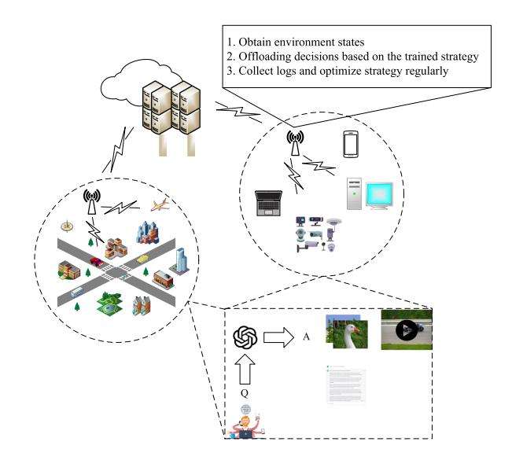
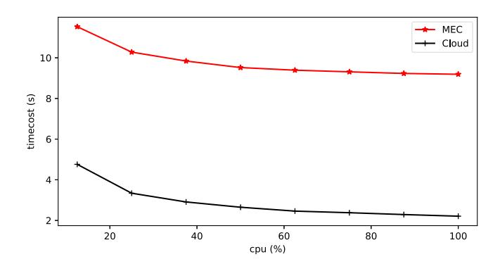
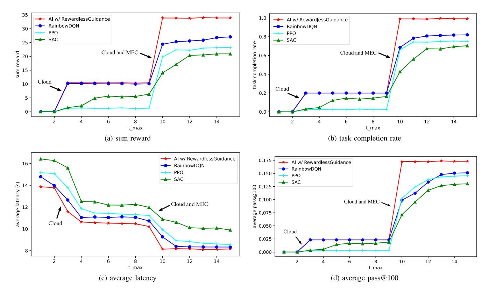
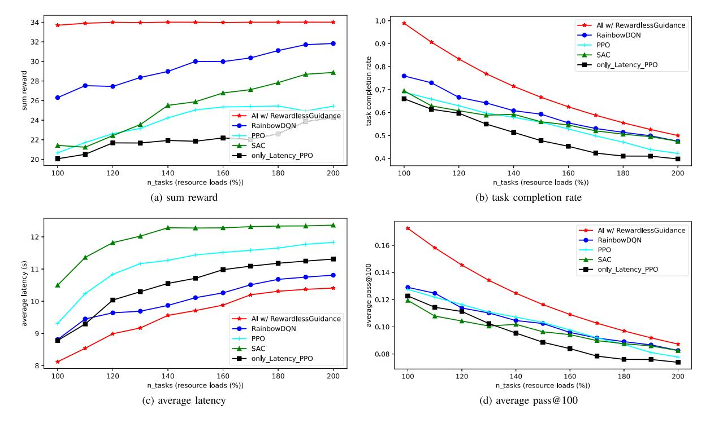

# Large Language Models (LLMs) Inference Offloading and Resource Allocation in Cloud-Edge Computing: An Active Inference Approach

Ying He *[,](https://orcid.org/0000-0003-1733-9791) Member, IEEE*, Jingcheng Fang, F. Richard Yu *[,](https://orcid.org/0000-0003-1006-7594) Fellow, IEEE*, and Victor C. Leung

*Abstract***—With the increasing popularity and demands for large language model applications on mobile devices, it is difficult for resource-limited mobile terminals to run large-model inference tasks efficiently. Traditional deep reinforcement learning (DRL) based approaches have been used to offload large language models (LLMs) inference tasks to servers. However, existing DRL solutions suffer from data inefficiency, insensitivity to latency requirements, and non-adaptability to task load variations, which will degrade the performance of LLMs. In this paper, we propose a novel approach based on active inference for LLMs inference task offloading and resource allocation in cloud-edge computing. Extensive simulation results show that our proposed method has superior performance over mainstream DRLs, improves in data utilization efficiency, and is more adaptable to changing task load scenarios.**

*Index Terms***—Active inference, cloud-edge computing, large language model, reinforcement learning, resource allocation, task offloading.**

# I. INTRODUCTION

**I** N RECENT years, OpenAI's GPT family (e.g., ChatGPT) has attracted a lot of attention with the development of large language models (LLMs). The main advantage of LLMs is their greater representational power and learning ability [\[1\].](#page-10-0) Models with more parameters are able to capture more complex patterns and associations, thus providing more accurate and richer predictions and generated results. However, LLMs also face challenges and limitations: LLMs require huge computational resources

Manuscript received 9 November 2023; revised 20 February 2024; accepted 22 April 2024. Date of publication 9 July 2024; date of current version 5 November 2024. This work was supported in part by the National Natural Science Foundation of China (NSFC) under Grant 62271324, Grant 62231020, and Grant 62002238, in part by Shenzhen Science and Technology Program under Grant ZDSYS20220527171400002, and in part by the Open Research Fund from Guangdong Laboratory of Artificial Intelligence and Digital Economy (SZ) under Grant GML-KF-22-26. Recommended for acceptance by E. Ngai. *(Corresponding author: F. Richard Yu.)*

Ying He and Jingcheng Fang are with the College of Computer Science, Software Engineering, Shenzhen University, Shenzhen 518060, China (e-mail: [heying@szu.edu.cn;](mailto:heying@szu.edu.cn) [2110276163@email.szu.edu.cn\)](mailto:2110276163@email.szu.edu.cn).

F. Richard Yu is with the College of Computer Science, Software Engineering, Shenzhen University, Shenzhen 518060, China, and also with the School of Information Technology, Carleton University, Ottawa, ON K1S 5B6, Canada (e-mail: [feirichardyu@ieee.org\)](mailto:feirichardyu@ieee.org).

Victor C. Leung is with the Department of Electrical, Computer Engineering, University of British Columbia, Vancouver V6T 1Z4, Canada (e-mail: [vleung@ieee.org\)](mailto:vleung@ieee.org).

Digital Object Identifier 10.1109/TMC.2024.3415661

and storage space for training and inference, which is a significant problem for resource-limited devices and environments. Although researchers have proposed some solutions, such as distributed training, model pruning, and model compression, which can reduce the storage and computational overhead of models, there are still resource issues in scenarios where LLMs are served to endpoints on a large scale [\[2\].](#page-10-0)

Cloud-edge computing is a computing model that integrates cloud computing and edge computing, aiming to take full advantage of cloud computing and edge computing to provide more flexible, efficient and resilient computing capabilities in largescale network systems[\[3\].](#page-10-0) In cloud-edge computing, cloud computing represents centralized data centers and powerful computing resources that can handle large-scale data and complex computing tasks. Edge computing, on the other hand, extends computing power and data processing capabilities to locations such as edge devices, edge nodes or edge gateways close to data sources to realize the advantages of low latency, real-time and localized data processing. The core idea of cloud-edge computing is to assign computational tasks to the right location for processing based on their characteristics and needs [\[4\].](#page-11-0) Cloud-edge computing for large-model inference tasks is a computing model that distributes large-model inference tasks to the cloud and the edge for processing. Among them offloading and resource allocation are the key concepts and techniques used to rationally allocate inference tasks to cloud and edge devices for processing. Offloading and resource allocation need to consider factors such as network bandwidth, latency, and computational capacity of the processing ends, etc. The best overall system can be achieved by a reasonable offloading strategy and resource allocation scheme.

Different from conventional task offloading optimization, the unique characteristics of LLMs pose non-trivial challenges to task offloading optimization in edge-cloud computing. Specifically, LLMs have huge scale parameters and computational resource requirements. As hardware computing power and datasets increase, researchers are beginning to design and train models with billions of parameters, and the number of trainable parameters in large models grows exponentially, often requiring huge computational resources and high-performance computing devices for training and inference [\[2\].](#page-10-0) Furthermore, the performance measures in LLMs are usually different from conventional tasks. In this paper, we consider the average latency

1536-1233 © 2024 IEEE. Personal use is permitted, but republication/redistribution requires IEEE permission. See https://www.ieee.org/publications/rights/index.html for more information.

of all LLMs inference tasks that need to be offloaded as small as possible and the accuracy of the model's prediction output as large as possible while satisfying the bandwidth resource constraint, computational resource constraint, and graphics memory resource constraints.

Deep reinforcement learning (DRL) has been very successful in many decision making application scenarios, such as games, robotics and resource management [\[5\],](#page-11-0) [\[6\].](#page-11-0) Thanks to the rapid development of DRL, mainstream DRL algorithms, such as Rainbow DQN, PPO and SAC, are used in cloud-edge computing scenarios [\[7\],](#page-11-0) [\[8\],](#page-11-0) [\[9\]](#page-11-0) for task offloading and resource allocation [\[10\],](#page-11-0) [\[11\],](#page-11-0) [\[12\].](#page-11-0) However, traditional DRL-based strategies operating in different environments require different reward functions, which results in poor generalization. It is also difficult to define an explicit and appropriate reward function. The transformation of human knowledge into numerical reward values is often subject to human cognitive biases [\[13\].](#page-11-0)

In this paper, we propose a novel algorithm using a rewardless guidance instead of the reward model in traditional DRL approaches, which enables agents to form higher-level cognition about the environment and reach the preferred state directly without defining reward functions, resulting in better generalization ability than traditional DRL approaches. In this way, the algorithm is able to actively select the actions that provide the most informative value to guide the inference process and reduce the uncertainty of the future state. The main contributions of this paper are as follows:

- - With the recent advances in active inference [\[14\],](#page-11-0) we propose a novel scheme to address the LLMs inference offloading and resource allocation problem. Compared to mainstream DRLs, our proposed method has better convergence performance and generalization performance.
- - We present the system model and formulation for GPT-J-6B LLM based on real experimental data in a server cluster. Both training and inference phases are considered.
- - Extensive simulation results show that our proposed scheme can train a better converged policy and has a superior performance in LLMs inference compared with the mainstream DRLs algorithms.

The rest of this paper is organized as follows. Section II presents the system model. The proposed scheme is presented in Section [III.](#page-3-0) Section [IV](#page-5-0) presents the experimental results. Finally, this paper is concluded in Section [V.](#page-7-0)

## II. RELATED WORKS

In this section, LLMs inference, LLMs inference task offloading in cloud or edge, DRL for resource allocation and offloading in cloud or edge, and active inference are introduced.

## *A. Large Language Model Inference*

Large-scale model refers to deep learning models with huge scale parameters and computational resource requirements. As hardware computing power and datasets increase, researchers are beginning to design and train models with hundreds of millions of parameters, and the number of trainable parameters in large models grows exponentially, often requiring huge computational resources and high-performance computing devices for training and inference.

The authors of [\[15\]](#page-11-0) argue that distributed systems can provide excellent solutions for training and inference of large models, and that distributed federation of multiple high-performance computer machines can effectively solve the resource dilemma faced by large models.

A large language models accelerator (LLMA) is proposed in [\[16\]](#page-11-0) that losslessly accelerates LLMs inference with references. LLMA selects a text span from a reference and copies its tokens to the decoder, and then efficiently checks the appropriateness of the tokens as decoding results in a decoding step in parallel. the appropriateness of the tokens as decoding results in a decoding step. Using LLMA achieves a 2x inference speedup and yields the same predicted output as greedy decoding in many scenarios.

Sheng et al. investigate how to use a single GPU for highthroughput LLMs inference with limited hardware resources. A high-throughput inference generation engine for LLMs running on a single consumer-grade GPU, FlexGen, is proposed, which flexibly configures LLMs inference tasks under various hardware resource constraints by aggregating memory from GPUs, CPUs, and disks [\[17\].](#page-11-0)

An inference system with a multilevel inference engine is proposed in [\[18\]](#page-11-0) that can serve inferential computations for corresponding applications using small models and optionally LLMs. the idea of Tabi is that due to the diminishing returns of adding more trainable parameters to LLMs, smaller models can make the same predictions as LLMs for most queries. the idea of Tabi multilevel inference is that the non-generative LLMs in the service framework is optimized to use the calibrated confidence scores to decide whether to return accurate results for small models extremely quickly or to reroute them to the LLMs.

In the scenario of generating batch large-model inference tasks, Cheng et al. propose batch prompting, which enables LLMs to run inference in batches instead of one inference task at a time. This method reduces token and time costs while maintaining downstream performance, and the inference cost decreases inversely and linearly with the number of samples in each batch. The study suggests that this batch prompting approach can be applied to different batch large model inference tasks [\[19\].](#page-11-0)

## *B. Cloud and Edge for Large Language Models*

Cloud-edge computing combines the concepts and technologies of cloud computing and edge computing, aiming to meet the data processing and computing needs in different application scenarios and provide more efficient and flexible computing and storage capabilities. Through decision algorithms, computing tasks are assigned to the cloud or the edge for processing, and the powerful computing resources in the cloud make up for the shortage in the edge, and the low latency in the edge makes up for the shortage in the cloud, finally achieving the optimal total utility of the overall network system [\[20\],](#page-11-0) [\[21\].](#page-11-0)

Li et al. argue that running Deep Neural Networks (DNN)-based computationally intensive tasks on mobile devices with limited computing resources is challenging, and that traditional cloud-service-responsive DNN inference services are severely hampered by wide-area network latency, resulting in poor real-time performance and low quality of user experience. Researchers propose a framework for collaborative DNN inference using edge computing through device edge collaboration. Specifically, DNNs are partitioned and adaptively allocated between devices and edges for computation to coordinate powerful cloud resources with near-edge resources for real-time DNN inference. And the DNN size is appropriately adjusted during the inference process to further reduce the computational latency by launching the inference earlier in the intermediate DNN layer [\[22\].](#page-11-0)

The authors of [\[23\]](#page-11-0) investigate inference acceleration using distributed Convolution Neural Network (CNN) in collaborative edge computing networks and propose an acceptance domainbased partitioning to guarantee no loss of inference accuracy when dividing inference tasks. To reduce the computation time of inference and the communication overhead in the distributed system, a partitioning of the CNN model into multiple task blocks using fusion layer parallelization is used and the optimal partitioning of the CNN model is found using dynamic programming. A low-complexity search algorithm is used to collaborate the best subset of edge servers for inference in a distributed inference system. Experimental results show that the framework can significantly improve inference speed compared to running pre-trained models.

Hu et al. argue that the computational structure of modern deep learning models involves directed acyclic graphs (DAGs), while most existing research assumes that deep learning models are constructed using a chain of layers, and then divides the models across edge devices in this way. This study proposes EdgeFlow, a novel distributed inference mechanism designed for generalized DAG-structured deep learning models, which uses a new progressive model partitioning algorithm to divide model layers into independent execution units, and then assigns these near-optimal model partitioning units to inference computations on distributed edge devices. During the inference process, EdgeFlow coordinates the intermediate results flowing through these units to achieve complex layer dependencies [\[24\].](#page-11-0)

The authors of [\[25\]](#page-11-0) study the problem of coordinating DNN model partitioning and task assignment for end devices and edge servers in heterogeneous edge computing systems. For the problem model which is difficult to solve directly, dynamic programming and greedy strategy are used to reduce the solution space while obtaining a good solution, and then an online GSPI algorithm is proposed to solve the problem.

## *C. Deep Reinforcement Learning Decision*

Deep reinforcement learning control algorithms are a class of algorithms based on deep neural networks and reinforcement learning for solving decision and control problems. It combines the power of deep learning with a framework of reinforcement learning to learn optimal decision strategies from interactions without a priors knowledge [\[6\].](#page-11-0) Some common deep reinforcement learning control algorithms include: Deep Q-Network (DQN) uses a deep neural network to approximate the value function and select actions through greedy policies, DQN improves training stability through empirical replay and objective networks. Proximal Policy Optimization (PPO) uses a policy optimization approach to update the policy parameters by Optimizing the objective function of the current policy to update the policy parameters, PPO uses importance sampling and clipping of the objective function to maintain training stability. Actor-Critic approach combines policy optimization and value function estimation by simultaneously training a policy network (Actor) and a value function network (Critic), where Actor selects actions based on the policy, while Critic evaluates the current policy's value function [\[7\],](#page-11-0) [\[8\],](#page-11-0) [\[9\],](#page-11-0) [\[26\].](#page-11-0)

Liu et al. use a DQN approach for task offloading and resource allocation in a vehicular edge computing network architecture. In this vehicular edge computing network, vehicles act as mobile edge servers and provide computing services to nearby mobile users. This process is described as a Markov process and solved by DRL to obtain the optimal policy for computation offloading and resource allocation [\[27\].](#page-11-0)

Tang et al. consider indivisible and latency-sensitive tasks and edge load dynamics in mobile edge computing systems and formulate task offloading problems to minimize the expected long-term cost. The researchers combined long short-term memory (LSTM), dualing deep Q-network (Dueling DQN) and double DQN (Double DQN) techniques to propose a distributed algorithm based on model-free deep reinforcement learning. Simulation results show that the processing power of edge nodes can be better utilized and the task loss rate and average latency can be significantly reduced [\[28\].](#page-11-0)

## *D. Active Inference*

Active inference has similarities to reinforcement learning, that it uses the reinforcement learning paradigm, whereby strategies are trained during interaction with the environment.

Active inference describes the properties of agents in an environment according to the free energy principle, by minimizing the free energy to obtain the Bayesian inference of the optimal action in that environment [\[29\].](#page-11-0) The free energy principle is a physical and information-theoretic concept used to describe the stability and organization of systems, which originated in the theory of thermodynamics in statistical physics and was later applied to the fields of information theory and machine learning. In information theory and machine learning, the free energy principle is used to describe the optimization goals in learning and reasoning processes. The free energy is considered as an upper bound on the desired energy of an agent, and the agent minimizes the free energy to maximize its desired energy during learning and reasoning [\[14\].](#page-11-0) The expected energy here can be understood as the system's plausibility for the observed data or the optimization of the model parameters, so the free energy can be understood as the difference between the current distribution and the distribution of the real data samples.

<span id="page-3-0"></span>Active inference selects the optimal action by minimizing the free energy. In a partially observable environment, the agent does not have access to the current true state, but obtains the partially observable state of the environment. The active inference agent estimates the future true state by generative model, which in turn calculates the free energy of the current state and the future state. By minimizing the free energy, the agent selects the action that makes the maximum desired energy. Specifically, the generative model is an important tool for sensing the environment, and its important goal is to predict the real state of the next stage. The planner of the agent calculates the free energy based on the hidden state predicted by the generative model, and selects the optimal action by minimizing the free energy. Thus, the agent can make correct decisions on action sequences based on the predictions of the generative model [30].

The model parameters involved in the minimization of free energy process in active inference are optimized with Bayesian inference, and free energy is generally based on the information-theoretic measure of surprise. due to its Bayesian inference, the strategy that most closely resembles the prior preferences is selected, and this process not only inferred the optimal action, but the agent also inferred which hidden states produce the observed data to optimize the generative model. Both are performed while minimizing free energy and weighing the exploration and exploitation of actions [31].

Active inference differs from DRL in that DRL makes action choices based on the value of the state or based on a policy, whereas active inference makes action choices based on the predictions of the generative model. The key difference between these two frameworks is that the reward function of DRL is dependent on the state of the environment and the agent wants to reside in a highly rewarding state distribution [32]. This distinguishes between the reward-maximizing features of DRL and the free-energy minimizing features of active inference [33].

#### III. SYSTEM MODEL AND FORMULATION

In this section, the system model proposed in this paper will be introduced. A multi-LLMs user scenario containing a cloud computing center and an edge server is designed, and the architecture is shown in Fig. 1. The cloud server (CS) has powerful and sufficient computing resources to meet the demands of LLMs inference tasks. Several mobile edge computing (MEC) centers, which are closer to users, can also offload LLMs inference tasks. At the bottom are various terminals that can issue requests for LLMs inference tasks, including PCs, laptops, smartphones, smart connected cars, and various sensing devices, etc. These devices exist in various application scenarios, including outdoor scenarios, traffic routes, indoor offices, entertainment scenarios, etc.

#### A. System Description

In this paper, there are multiple endpoints requesting to offload the LLMs inference task. Mobile terminals  $D_i^{mobi}(i=1,2,\ldots)$  denote terminals whose locations change over time, such as smartphones, drones, and networked cars. Fixed terminals  $D_i^{unmo}(i=1,2,\ldots)$  denote terminals whose locations do



Fig. 1. The architecture of an LLMs inference system in cloud-edge computing

not change over time, such as PCs, workstations, etc. Define the set of terminals  $Dev_i \in \{D_{\cdot}^{mobi}, D_{\cdot}^{unmo}\}, i=1,2,\ldots,N_{Dev}.$  In addition, consider an environment with several offload-able edge servers MEC, and cloud computing centers CS, define the set of servers  $Ser_j \in \{CS, MEC.\}, j=1,2,\ldots,N_{ser}.$  At time t the terminal  $Dev_i$  randomly generates an offload request for a LLMs task  $T_t$ , and the system offloads task  $T_t$  to server  $Ser_j$  according to the decision algorithm, and allocates the appropriate network, compute, and graphics memory resources for the task.

#### B. Task Model

The inference process of the LLMs inference tasks will be described in detail. This paper studies offloading decisions and resource allocation for LLMs inference tasks using the GPT-J-6B model as an example. GPT-J-6B is a transformer model trained using Ben Wang's Mesh Transformer JAX [34]. With 6 billion parameters, GPT-J-6B represents a major leap forward in natural language processing.

GPT-J-6B follows Transformer-based architecture with self-attentive mechanism and feed-forward neural network [35]. Its multilayer encoder and decoder help in modeling remote dependencies and context understanding. The training process of the model consists of unsupervised pre-training followed by fine-tuning for specific downstream tasks to ensure adaptability and generality. The inference process in GPT-J-6B can be formulated as the following steps:

Input representation: Tokenizer converts the original input text into a sequence suitable for model input. Suppose the input sequence is  $x = [x_1, x_2, \ldots, x_n]$ , where  $x_i$  denotes the *i*th token or vocabulary of the input sequence.

Embedding representation: The Embedding layer transforms the input sequence x into an embedding representation  $E = [e_1, e_2, \ldots, e_n]$ , where  $e_i$  denotes the ith embedding vector.

<span id="page-4-0"></span>Position encoding: The position encoding matrix P is done on the embedding vector as a position mask operation to obtain the position encoded embedding vector  $PE = [pe_1, pe_2, ..., pe_n]$ .

Attention and multi-head self-attention: According to [35], assuming that the query matrix is  $Q = PE \times W^q$ , the key matrix is  $K = PE \times W^k$ , and the value matrix is  $V = PE \times W^v$ , then:

$$Attention(Q, K, V) = \operatorname{softmax}\left(\frac{QK^{T}}{\sqrt{d_{k}}}\right)V, \tag{1}$$

 $MultiHead(Q, K, V) = Concat(head_1, ..., head_h)W^O,$ 

$$head_{i} = Attention(QW_{i}^{Q}, KW_{i}^{K}, VW_{i}^{V}),$$

$$(2)$$

where  $W^q, W^k$ , and  $W^v$  are the parameter matrices,  $d_k$  is the dimension of K, and  $W_i^Q \in \mathbb{R}^{(d_{model} \times d_q)}, W_i^K \in \mathbb{R}^{(d_{model} \times d_k)}, W_i^V \in \mathbb{R}^{(d_{model} \times d_v)}$ , and  $W^O \in \mathbb{R}^{(hd_v \times d_{model})}$ . The resulting self-attention layer output after the multi-head self-attention calculation is Z = MultiHead(Q, K, V). This process has multiple times, depending on the number of layers of the model.

Forward neural network: The attention output Z is fed into the multilayer perceptron (MLP) for feedforward neural network to calculate the output Y = MLP(Z), where MLP() is a multilayer perceptron containing linear transformations and activation functions. The final prediction text can be obtained based on Y and tokenizer.

The inference process described above takes place in the  $Ser_j$ . Task model sends task request  $T_t$  from terminal  $Dev_i$ , i.e., the packet with the size of  $PS_x$  containing the original input text, to  $Ser_j$  for inference, and then  $Ser_j$  sends the packet with the size of  $PS_y$  containing the predicted text back to the requesting terminal  $Dev_i$ .

#### C. Terminal Mobility Model

There are two types of nodes in the system model of this paper, immovable nodes (including MEC, CS and fixed terminal  $D_i^{unmo}$ ) and movable nodes (including mobile terminal  $D_i^{mobi}$  such as net-connected cars, smartphones and UAVs). The fixed terminal  $D_i^{unmo}$  generates requests for LLMs inference tasks from time to time and is in an immobile state. The mobile terminal  $D_i^{mobi}$  moves at a given directional movement speed and generates LLMs inference task requests from time to time during the movement. About the distance of the mobile terminal  $D_i^{mobi}$  and endpoints ( $MEC_i$  and CS) for calculation. We use the euclidean distance to calculate, suppose the mobile terminal  $D_i^{mobi}$  coordinates are  $(x_1, y_1, z_1)$  and the endpoint coordinates are  $(x_2, y_2, z_2)$ , the distance between the mobile terminal  $D_i^{mobi}$  and the endpoint is  $d = \sqrt{(x_1 - x_2)^2 + (y_1 - y_2)^2 + (z_1 - z_2)^2}$ .

#### D. Communication Model

The terminal  $Dev_i$  sends a task request  $T_t$  at moment t. The decision algorithm offloads it to the server  $Ser_j$  and sends the processing result  $P_y$  back to the terminal  $Dev_i$  after the processing is completed, both of which are related to the wireless communication channel between the sender and the receiver. Assuming that the relative distance d between the sender and the

receiver remains constant during an effective communication, according to the data transmission rate formula in the information theory [36]:

$$R = W \log_2 \left( 1 + \frac{Power \cdot G}{N} \right),\tag{3}$$

where W represents the bandwidth of the communication channel, Power represents the transmit power of the device, G represents the channel gain, and N represents the random thermal noise power of the channel. The channel gain G is related to the antenna gain g, and the path loss PL is related to the shadow fading  $X_{\sigma}$ . While antenna gain g is related to the receiving device, path loss PL and shadow fading  $X_{\sigma}$  are both related to the channel type.  $X_{\sigma}$  is the shadow fading component, which is usually modeled as a zero-mean Gaussian random variable  $X_{\sigma} N(0, \sigma^2)$ , and  $X_{\sigma}$  is usually non-negative, and in general, we treat g and  $\sigma$  as constants. G is generally defined as follows:

$$G = g - PL - X_{\sigma}. (4)$$

According to the system model, both the sender and receiver may be on the ground or in the air, so the communication channel mainly consists of two types: Ground-to-Ground (G2G) and Ground-to-Air (G2A), where ground means ground equipment (less than 100 meters in height) and air means air equipment or high altitude equipment (more than 100 meters in height). It should be noted that  $MEC_i$  and CS are ground equipment.

*Ground-to-Ground:* In G2G channels, where both the sender and receiver are terrestrial devices, the path loss  $PL_{G2G}$  in G2G channels is defined according to [37] as:

$$PL_{G2G} = 128.1 + 37.6 \log(d),$$
 (5)

where d is the euclidean distance between the sender and the receiver.

*Ground-to-Air:* In the G2A channel, one of the sender and the receiver is a ground device and the other is an aerial device, according to [38], the path loss  $PL_{G2A}$  is defined in the Ground-to-Air channel as:

$$PL_{G2A} = 10\alpha \log(d) + C, (6)$$

where  $\alpha$  is the path loss index, which is related to the environment in which the channel propagates, and environmental factors include the density, type and height of buildings and vegetation, etc. d is the euclidean distance between the sender and the receiver. The constant C depends on several parameters such as the operating frequency of the device and the antenna gain.

Air-to-Air: Relay communication between UAVs is performed using Air-to-Air channels, specifically, the offloading of inference tasks and the return of results can be transmitted via UAVs. According to [39], the path loss  $PL_{A2A}$  in A2A channels is defined as:

$$PL_{A2A} = 10\alpha \log(d),\tag{7}$$

where  $\alpha$  is path loss index, d is the air distance between UAVs. Importantly, in the design scenario of this paper, because the relay communication between high altitude UAVs belongs to

<span id="page-5-0"></span>the line-of-sight wireless transmission behavior. Therefore, path loss index  $\alpha$  can be appropriately chosen to be a small value.

## E. Data Transfer Model

In the scenario designed in this paper, the data transfer includes the task offloading phase and the result return phase: the decision algorithm sends a packet with the size of  $PS_x$  of task  $T_t$  from terminal  $Dev_i$  to  $Ser_j$ , and returns the result packet with the size of  $PS_y$  from  $Ser_j$  to terminal  $Dev_i$  after processing. In the task offloading phase, it goes through four periods: transmission, propagation, queuing and computation. In the result return phase, there are two periods: transmission and propagation.

In the task offloading phase, the data transmission rate R can be calculated according to (3). Suppose  $PS_x$  is the packet size of task  $T_t$ , then transmission latency is  $\frac{PS_x}{R}$ . The distance  $d_1$  between the sender and the receiver is determined according to the mobility model, using wireless propagation, and the propagation latency is  $\frac{d_1}{c}$ , where c represents the speed of light. When the server's task queue exceeds the parallel processing limit, the latest requests need to be queued, and the waiting time depends on the remaining time  $L_q$  for the fastest completed task in the processing queue. The task processing time  $L_c$  varies depending on the server's computing power and whether or not it uses an accelerated inference framework.

In the result return phase, the processing result of task  $T_t$  is packet  $PS_y$ , then transmission latency is  $\frac{PS_y}{R}$ . The distance between terminal  $Dev_i$  and server  $Ser_j$  is  $d_2$ . Note that the distance  $d_2$  may change during the server processing task, so propagation latency is  $\frac{d_2}{c}$ .

In summary, when a task  $T_t$  is offloaded successfully, its time delay  $L_{T_t}$  can be calculated as:

$$L_{T_t} = \frac{PS_x + PS_y}{R} + \frac{d_1 + d_2}{c} + L_q + L_c, \tag{8}$$

in addition, the maximum acceptable delay of all task requests  $T_t$  is constrained to be  $t_{\rm max}$ , which indicates the delay requirement of the requesting terminal. When the task processing result cannot be transmitted to the terminal within the maximum acceptable delay, i.e.,  $L_{T_t} > t_{\rm max}$ , then task  $T_t$  is abandoned.

## F. Problem Formulation

The objective of this paper is to find an optimal strategy for offloading resource-intensive large-model inference tasks to edge computing nodes or cloud computing nodes in the case of limited endpoint resources. Consider an objective function to represent this problem that attempts to make the average latency of all LLMs inference tasks that need to be offloaded as small as possible and the accuracy of the model's prediction output as large as possible while satisfying the bandwidth resource constraint, computational resource constraint, and graphics memory resource constraint of the MEC and CS. Therefore, the total system utility is defined as:

$$U(L_T, P_T) = \frac{1}{avg(\sum_{T_t} L_{T_t})} + avg\left(\sum_{T_t} P_{T_t}\right), \quad (9)$$

where  $avg(\cdot)$  is the average function and  $P_{T_t}$  is the prediction accuracy of task  $T_t$ . Thus, the final optimization objective can be expressed as maximizing the total system utility  $U(L_T, P_T)$ :

maximize 
$$U(L_T, P_T)$$
  
 $s.t.\begin{cases} W_{rest}, C_{rest}, M_{rest} \ge 0, & \forall t \\ L_{T_t} \le t_{\max}, & \forall t \end{cases}$  (10)

where  $W_{rest}$ ,  $C_{rest}$ ,  $M_{rest}$  denote the remaining bandwidth resources, computational resources, and graphics memory resources of each MEC and CS at time t, respectively. Therefore, the optimal offloading strategy can be found by maximizing  $U(L_T, P_T)$ .

In practical systems, price and risk are very important factors, which should be considered for data offloading decision-making in edge computing systems [40]. These important factors can be incorporated into our proposed scheme by revising the system utility function in (9) and constraints in (10). This provides a potential area for enriching our scheme by integrating price and risk awareness, which could further optimize offloading decisions by considering economic and reliability factors, leading to a more holistic approach in managing cloud-edge computing resources. In this paper, due to the limited space, we focus on efficiency and adaptability through an active inference method without directly addressing price and risk.

#### IV. ACTIVE INFERENCE BASED OFFLOADING STRATEGY

In this section, we first describe the environment state representation and action representation of the agent. Then, we describe the rewardless guidance in active inference algorithms. Finally, we describe the complete algorithmic process for offloading and resource allocation of LLMs inference tasks in cloud-edge networks.

#### A. State and Action Representations

According to the description of the system model in Section III, in the environment of this paper,  $s_j' = [C_j, W_j, M_j]^T$  is defined to denote the state in which the server  $Ser_j$  is in.  $s_j'$  includes the remaining computing resource  $C_j$  of  $Ser_j$ , the remaining bandwidth resource  $W_j$ , and the remaining graphics memory resource  $M_j$ . In addition, it is necessary to consider the distance matrix D between the terminal  $Dev_i$  and all  $Ser_j$ . Therefore, D and the state of each  $Ser_j$  are united into the global state  $S_t = [D; s_1'; s_2'; \ldots; s_{N_{Ser}}']$  at time t. The distance matrix D of terminal  $Sev_j$  and all  $Sev_j$  is also considered.

According to the description of the system model in Section III, the actions of the agent should include offloading the LLMs inference task  $T_t$  to the server  $Ser_j$ , allocating computational resources, allocating channel bandwidth resources, and allocating graphics memory resources. Therefore, the action of the agent at time t is defined as  $a_t = [j, c_j, w_j, m_j]$ , where j is the unique corresponding index of the server,  $c_j$  represents the computational resources allocated to task  $T_t$  by  $Ser_j$ ,  $w_j$  represents the channel bandwidth resources allocated by  $Ser_j$ , and  $m_j$  represents the graphics memory resources allocated by  $Ser_j$ . It should be noted that the allocated resources should be

<span id="page-6-0"></span>less than or equal to the remaining resources of the server  $Ser_j$ , otherwise this action is regarded as an invalid action, and this task  $T_t$  fails to run at this time.

#### B. Rewardless Guidance in Active Inference

This paper uses an active inference-based algorithm as the agent's decision algorithm for task offloading and resource allocation decisions. The key to this is the use of simple and effective rewardless guidance instead of the reward model in the active inference decision algorithm, which serves to provide an environmental reward signal for the decision. Traditional reward models tend to use reward values from environmental feedback as a basis for model revision, which are strongly correlated with the environment and weakly generalized in the presence of environmental changes. However, using rewardless guidance that summarizes the abstraction of multiple environments can solve this problem to some extent because it does not directly require the environment feedback reward values, but rather summarizes multiple similar environments. In our proposed algorithm, it is important in the offloading decision to ensure that the task is completed with low latency and high pass rate to complete the task, defining rewardless guidance:

$$rg(s_t, a_t) = tc \times \left(\frac{1}{L_{T_t}} + P_{T_t}\right),\tag{11}$$

where tc=1 when task  $T_t$  is completed and tc=0 in the opposite case.  $P_{T_t}$  is the prediction accuracy of task  $T_t$ . In our proposed algorithm, the larger  $rg(s_t, a_t)$  indicates that the selection of  $a_t$  in  $s_t$  is more consistent with rewardless guidance and the greater the probability of selecting  $a_t$ . Therefore, one of the advantages of using rewardless guidance is that it does not require the real reward signal returned by the environment, and only needs to determine whether the selection of  $a_t$  in  $s_t$  conforms to the rewardless guidance.

#### C. Active Inference Decision

The decision algorithm based on active inference is described next. In a task offloading and resource allocation environment, the agent maintains an active inference algorithm internally and is exposed to the environment externally. The agent-environment interaction decision process is not a fully observable process, but a partially observable Markov decision process (POMDP) [41]. Suppose that at moment t-1, the state is represented as  $s_{t-1}$ and the agent makes an action  $a_{t-1}$  with a certain probability P such that the state shifts to  $s_t$  at moment t. This probability is the environmental shift probability  $P(s_t|s_{t-1}, a_{t-1})$ . In POMDP, the agent does not necessarily obtain the true state of the external environment, but always obtains an observation  $o_t$  of its own environment,  $o_t P(o_t|s_t)$ . In active inference, the agent internally maintains a generative model  $p(o, s, \theta)$  for making predictions about the state of the external environment, which is a neural network model, and  $\theta$  denotes the model parameters to be learned. In our proposed algorithm, instead of maintaining a reward model based on a large neural network model to obtain preferences, we use rewardless guidance to obtain preferences, which influence action selection during agent planning.

In active inference algorithms, the free energy principle is an important concept. It was proposed by Friston et al. to describe how an agent minimizes its free energy by reasoning about the environment [14]. The free energy principle is based on Bayesian reasoning and information theory and aims to explain how an agent perceives and understands the environment and makes decisions based on its understanding. Free energy can be considered as a measure that represents uncertainty about the state of the environment. The goal of the agent is to reduce the uncertainty of the environment by reducing the free energy [30]. According to the free energy principle, the agent achieves free energy minimization through two processes. The first is the POMDP process described earlier, where the agent senses the environment to obtain external information  $o_t$  and form an internal model  $p(o, s, \theta)$  of the state of the environment. Next is the action planning process, where the agent makes optimal actions to reduce free energy based on the internal generative model and the objective function. Through this active inference process, the agent can better understand the environment, predict the future state, and take appropriate actions to achieve its goals. The optimization goal of active inference is to maximize the evidence of the agent's generative model, i.e., to minimize the free energy, and by setting the expected preferences, the agent's generative model  $p(o, s, \theta)$  can move toward this goal state.

The standard free energy is defined at a single moment t, whereas in the active inference algorithm used in this paper, the agent's optimization goal is to minimize the variational free energy  $F = D_{KL}(q(s,\theta) || p(o,s,\theta))$ , where  $q(s,\theta)$  is the agent's belief about future variables and the variational free energy F is also referred to as the (negative) evidence lower bound (ELBO) [42], the agent chooses the strategy  $\pi$  that minimizes the variational free energy F as the chosen strategy [31]. According to [43], the definition of free energy of the expected future in the algorithm used in this paper is:

$$\tilde{F} = D_{KL}(q(o_{0:T}, s_{0:T}, \theta, \pi) || p(o_{0:T}, s_{0:T}, \theta)), \tag{12}$$

where  $o_{0:T}$  represents the observation sequence of the agent on the time series 0:T,  $s_{0:T}$  represents the state sequence of the agent on the time series 0:T,  $q(o_{0:T},s_{0:T},\theta,\pi)$  represents the belief of the agent on the future variables,  $p(o_{0:T},s_{0:T},\theta)$  is the generative model of the agent, and  $\theta$  is the neural network of the generative model parameters. The target strategy  $\pi^*$  can be found by minimizing the expected future free energy  $\tilde{F}$ . In practical calculations, the free energy can be minimized by making the output distribution  $p(o_{0:T},s_{0:T},\theta)$  of the generative model closer and closer to the true state distribution  $q(o_{0:T},s_{0:T},\theta,\pi)$  by:

$$D_{KL}(q(o_{0:T}, s_{0:T}, \theta, \pi) || p(o_{0:T}, s_{0:T}, \theta)) = 0 \Rightarrow \tilde{F} = 0,$$
(13)

Algorithm 1 is a complete algorithm for task offloading and resource allocation based on active inference.

## D. Complexity Analysis

The complexity of Algorithm 1 can be analyzed as follows. The outer loop runs for  $n_{episodes}$  iterations. Within each episode,

22:

return  $\pi^* = \pi$ 

<span id="page-7-0"></span>**Algorithm 1:** Active Inference With Rewardless Guidance Offloading Strategy.

```
Input: Transition distribution P(s_t|s_{t-1}, a_{t-1}) —
   Initialization strategy \pi — Optimisation iterations I —
   Number of candidate policies J — Number of top k
   candidate policies k — Number of episodes n_{episodes} —
   Number of steps n_{steps}
Parameter: Ensemble model \theta.
Output: Optimized strategy \pi^*
   1: for episode = 1, ..., n_{episodes} do
  2: Let t = 0 and Reset s_t.
  3:
       for step = 1, ..., n_{steps} do
  4:
         Dev_i generates task T_t.
  5:
         for optimisation iteration i = 1, ..., I do
  6:
           Sample J candidate policies from q(\pi).
  7:
           for candidate policy j = 1, ..., J do
  8:
              Get \pi_i \sim q(\pi).
  9:
              Calculate the expected information gain r_1 by
              minimizing F.
 10:
              Calculate the reward gain r_2 by (11).
 11:
              Select top k(k < j) \pi_i according to r = r_1 + r_2.
 12:
 13:
           Optimize \pi according to top k \pi_i.
 14:
           end for
 15:
           Take action a_t \sim \pi.
           Get s_{t+1}, L_{T_t}, P_{T_t}, is\_completion by step(a_t).
 16:
 17:
           Record (s_t, a_t, L_{T_t}, P_{T_t}, s_{t+1}) to buffer.
 18:
           Let s_t = s_{t+1}.
 19:
         end for
 20:
         Fit ensemble model \theta.
 21:
       end for
```

there is a loop of  $n_{steps}$  iterations. For each step, an optimization process runs for I iterations. Within each optimization iteration, J candidate policies are sampled and evaluated. The selection of the top k policies from these J candidates is an operation that can usually be done in  $O(J\log J)$  time due to sorting or using a priority queue, though the algorithm specifies this step conceptually without detail. Therefore, the overall time complexity can be expressed as  $O(n_{episodes} \cdot n_{steps} \cdot I \cdot J)$ . The selection step's complexity, which is dependent on sorting or selecting the top k policies, adds to the complexity but does not change the overall order unless J is significantly large compared to the other parameters.

#### V. SIMULATION RESULTS AND DISCUSSIONS

In this section, first, we introduce the relevant setups for the simulations, including the LLMs used, dataset, the cloud-edge network environment and its resource constraints, the DRLs algorithms for comparison and the reward functions, and evaluation metrics. Next, our proposed method and mainstream DRLs are compared in the context of that setups. Finally, our proposed method and mainstream DRLs are compared under  $t_{\rm max}$  variation and task load variation.



Fig. 2. Relationship between timecost and CPU allocation values.

TABLE I RELATIONSHIP BETWEEN WHETHER THE SERVER IS ACCELERATED OR NOT AND THE PASS @ 100

| Server | Inference Accelerate | Pass@100 |
|--------|----------------------|----------|
| Cloud  | Yes                  | 0.1159   |
| Edge   | No                   | 0.1892   |

#### A. Setups

GPT-J-6B and Dataset. GPT-J-6B consists of 28 layers with a model dimension of  $d_{model}=4096,$  and a feedforward dimension of  $d_{forward}=16384.$  The model dimension is split into  $n_{heads}=16$  heads, each with a dimension of  $d_{head}=256.$  Rotary Position Embedding (RoPE) is applied to  $d_{RoPE}=64$  dimensions of each head. The model is trained with a tokenization vocabulary of  $n_{vocab}=50257,$  using the same set of BPEs as GPT-2/GPT-3 [34].

The dataset used for the experiments is Human Eval [44], published by OpenAI, and includes 164 programming problems with function signatures, string annotations, code bodies, and test units, which are handwritten to ensure accuracy and non-repeatability. These programming problems are written in Python and English is used in descriptive sections such as comments.

Environment and Resource Limitation. The total amount of resources in the environment will be set to the maximum total demand of the task in the training phase, and the performance of the algorithms will be explored under varying task load in the testing phase.

In addition, in the cloud-edge network system environment, the edge server is equipped with an NVIDIA 3090 graphics card and runs the GPT-J-6B task without any inference acceleration technique, while the cloud server is equipped with an NVIDIA A800 graphics card and runs the GPT-J-6B task with Triton server inference acceleration technique. As a result, the computation time  $L_c$  and hundred passes pass@100 spent to offload the GPT-J-6B task to the cloud and the edge are different because the server hardware performance is different between the two. The computation time  $L_c$  and hundred passes pass@100 versus cloud-edge are shown in Fig. 2 and Table I, respectively.

Benchmarks. Rainbow DQN [7], PPO [8] and SAC [9] algorithms from mainstream DRLs are used as benchmark algorithms in the experiments to compare with the algorithm proposed in this paper. In addition, we also compare it with

<span id="page-8-0"></span>

Fig. 3. Mainstream DRLs comparison in the train phase.

an existing scheme [\[45\]](#page-11-0) that does not consider LLMs. They have already achieved great success in the current DRL field, with SOTA performance in various application scenarios, both discrete and continuous. Regarding the scope of the reward function, in the DRL algorithms mentioned in this paper, the reward function is used for training and performance evaluation, in the algorithm proposed in this paper, the reward function has nothing to do with the selection of actions and it is only used for performance evaluation, which is to make an effective comparison with the DRLs. According to the problem formulation, the overall system has the requirement of low latency and high pass rate for LLMs inference task, so the reward function is defined as:

$$r = \frac{1}{L_{T_t}} + P_{T_t},\tag{14}$$

*Evaluation Metrics.* In the experiments of this paper, the evaluation metrics include sum reward, task completion rate, average latency, and average pass@100, with a statistical range within one episode, which denotes the total reward, the task completion rate, the average latency of all the tasks, and the average pass@100 of all the tasks, respectively. pass@100 is the pass rate for a hundred samples.

## *B. DRLs Comparison*

This section analyzes the performance of the training phase of our proposed method and the existing schemes with the settings of <sup>t</sup>max = 15 and <sup>n</sup>tasks = 100, both of which simultaneously ensure the validity of the subsequent experiments on tmax variations and task load experiments. Fig. 3 shows the performance comparison between our proposed method and mainstream DRLs during the training phase, including sum reward, task completion rate, average latency, and average pass@100.

As shown in Fig. 3(a), our proposed method reaches convergence at about episode = 200 and the level of convergence is higher than mainstream DRLs, although our algorithm does not learn a better strategy in the first 50 episodes of the training phase, which is due to the fact that the complexity of the environment is high. Rainbow DQN converge fast in the early stage, but the final convergence level is lower than our proposed method, and SAC is obviously lower than the other three algorithms. PPO converges slowly in the early stage, but the convergence level in the late stage is slightly higher than that of Rainbow DQN, and only lower than that of our proposed method. To summarize, our proposed method performs better than the three algorithms of mainstream DRLs in terms of both convergence speed and convergence level, indicating that our proposed method can train better strategies in the complex environment proposed in this paper.

It can be seen from Fig. 3(b) that our proposed method can eventually achieve a task completion rate of about 99%, while the task completion rate of Rainbow DQN is about 85%, that of PPO is about 90%, and that of SAC is about 80%. In the metric of task completion rate, our proposed method outperforms all three algorithms of mainstream DRLs. In addition, it shows that our proposed method balances all tasks while achieving the best convergence performance and does not give up individual tasks to improve the overall performance.

In Fig. 3(c), it can be seen that all three of our proposed method, Rainbow DQN and PPO can eventually achieve an average task completion latency of about 8 s, while SAC can only achieve about 10 s. And it can be seen from the figure that our proposed method is slightly lower than Rainbow DQN and PPO. It should be noted that all three algorithms of mainstream DRLs show average latency jitter during the training process, i.e., the shaded part of the corresponding curve in the figure, which



Fig. 4. Latency variation in the test phase.

indicates that the strategies of mainstream DRLs show unstable action output during the training process, and in this regard, our proposed method clearly outperforms the mainstream DRLs.

In Fig. [3\(d\),](#page-8-0) it can be seen that the average pass@100 of our proposed method reaches around 0.175, the average pass@100 of Rainbow DQN and PPO reaches around 0.15, and the average pass@100 of SAC only manages to reach around 0.14. This shows that in the training phase, under the same setup conditions, the strategy of our proposed method tends to offload the task more to the edge with high inference accuracy, while the strategy trained by mainstream DRLs offloads the task more to the cloud. This suggests that mainstream DRLs tend to trade pass@100 for low latency, but combining the above Fig. [3\(c\)](#page-8-0) reveals that our proposed method balances both.

In summary, our proposed method can train a strategy that balances task average delay, average pass@100 and task completion rate. While Rainbow DQN and PPO guarantee a lower task average delay, but cannot balance the average pass@100 and task completion rate, SAC has the worst overall performance.

## *C. Latency Variation*

In order to explore the latency variation of the algorithms, i.e., the performance of the strategies in scenarios where the maximum latency requirement of the task, tmax, varies. The four algorithmic strategies obtained from the above training are used for testing. The range of tmax variation is set to 1-15 s, the interval to 1 s, and <sup>n</sup>tasks = 100. Since <sup>t</sup>max = 15 is set in the train phase, the latency variation of the algorithms can be compared when <sup>t</sup>max <sup>&</sup>lt; <sup>15</sup>.

When <sup>t</sup>max <sup>≤</sup> <sup>2</sup>, it can be seen from Fig. 4(b) that all tasks cannot be completed regardless of which algorithm is used. Combined with Fig. [2,](#page-7-0) even when offloading to the fastest inference cloud, the shortest inference time takes more than 2 s, and with the wireless transmission time, a total latency greater than 2 s is inevitable.

When <sup>3</sup> <sup>≤</sup> <sup>t</sup>max <sup>≤</sup> <sup>9</sup>, according to Fig. 4(b), only our proposed method and Rainbow DQN can keep the task completion rate above 20%, and both PPO and SAC are less than 20%. According to Fig. [2,](#page-7-0) the minimum value of inference time is greater than 9 s due to the edge, and the delay of wireless transmission needs to be considered. Combined with the environment settings, the resource ratio of the cloud server and the four edge servers is 1:4, which exactly corresponds to a task completion rate of 20%. Therefore, it can be concluded that the task can only be offloaded to the cloud at this time. According to Fig. 4(c), it can be found that the curve declines compared to when <sup>t</sup>max <sup>≤</sup> <sup>2</sup>, because the task can be offloaded to the cloud at this time.

When <sup>t</sup>max <sup>≥</sup> <sup>10</sup>, according to Fig. 4(b), only our proposed method can achieve a task completion rate of about 100%. It can also be seen that the performance of all four indicators of our proposed method is optimal.

To summarize, the four algorithmic strategies obtained from training are tested under different values of tmax, and our proposed method has the best overall performance.

## *D. Task Load Variation*

In order to explore the effect of task load on the strategies, the strategies obtained from the above training are used for testing

<span id="page-10-0"></span>

Fig. 5. Task load in the test phase.

by setting <sup>n</sup>tasks to vary from 100-200, and <sup>t</sup>max = 15. <sup>n</sup>tasks denotes the number of tasks in an episode of the environment, and there is no need for resource scheduling when there are sufficient resources (task load is less than or equal to 100%), thus setting the task load <sup>n</sup>tasks <sup>∈</sup> [100, 200] for the experiment, which corresponds to a task load of 100%-200%.

It can be seen from Fig. 5(a) that the sum reward of our proposed method is always higher than that of mainstream DRLs. For existing schemes, it can be seen that the sum reward increases as the load increases, but it cannot reach the maximum level. The reason for the increasing sum reward is that mainstream DRL does not allocate all the resources to existing users, so whenever the number of users increases the mainstream DRL always has resources to allocate. The mainstream DRLs are not able to reach the highest level precisely because they are not able to allocate all the resources efficiently to the existing users. Our proposed method allocates all the resources efficiently at all times, so the sum reward always remains the highest level. In addition, SAC eventually outperforms PPO as the task load increases, which indicates that SAC is more suitable than PPO in high load environments, but still lower than our proposed method and Rainbow DQN.

In Fig. 5(b) and (d), it can be seen that the task completion rate and average pass@100 of the four algorithms are decreasing when the task load increases, which is reasonable because the total amount of resources is becoming less and less able to satisfy the demand of all tasks. Nevertheless, our proposed method consistently outperforms mainstream DRLs.

According to Fig. 5(c), we can see that the average latency of our proposed method is increasing when the task load increases, which is reasonable because an increase in task load means that more tasks are requesting resources, which inevitably leads to an upward trend in average latency.

To summarize, since mainstream DRLs and the existing scheme cannot balance latency, task completion rate and pass@100 well, the final performances of mainstream DRLs are all lower than our proposed method under increasing task load.

## VI. CONCLUSIONS AND FUTURE WORK

In this paper, in order to solve the resource dilemma of LLMs inference task, we proposed to use active inference with rewardless guidance in cloud-edge computing to solve the offloading and resource allocation problem of LLMs inference task. Specifically, by constructing an arithmetic-powerful cloudedge network system, the LLMs inference task request from the terminal is sent to the server for processing and returned to the terminal. Extensive simulation results show that this scheme is effective, and our proposed method outperforms the mainstream DRLs, both in terms of convergence performance in the training phase and maximum tolerable latency experiments and task load experiments in the testing phase. In future work, we plan to apply this scheme to more complex environments, such as more diverse types of device terminals, distributed environments, as well as using more advanced network systems to schedule more diverse resources, such as space-air-ground integrated network systems, etc., and working on the further improvement of the algorithm performance.

## REFERENCES

- [1] L. Fan, L. Li, Z. Ma, S. Lee, H. Yu, and L. Hemphill, "A bibliometric review of large language models research from 2017 to 2023," 2023, *arXiv:2304.02020*.
- [2] C. Zhou et al., "A comprehensive survey on pretrained foundation models: A history from BERT to ChatGPT," 2023, *arXiv:2302.09419*.
- [3] K. Cao, Y. Liu, G. Meng, and Q. Sun, "An overview on edge computing research," *IEEE Access*, vol. 8, pp. 85714–85728, 2020.

- <span id="page-11-0"></span>[4] H. Li, G. Shou, Y. Hu, and Z. Guo, "Mobile edge computing: Progress and challenges," in *Proc. 4th IEEE Int. Conf. Mobile Cloud Comput., Serv., Eng.*, 2016, pp. 83–84.
- [5] Y. He et al., "Deep-reinforcement-learning-based optimization for cacheenabled opportunistic interference alignment wireless networks," *IEEE Trans. Veh. Technol.*, vol. 66, no. 11, pp. 10433–10445, Nov. 2017.
- [6] Y. Li, "Deep reinforcement learning: An overview," 2017, *arXiv: 1701.07274*.
- [7] M. Hessel et al., "Rainbow: Combining improvements in deep reinforcement learning," in *Proc. AAAI Conf. Artif. Intell.*, 2018.
- [8] J. Schulman, F.Wolski, P. Dhariwal, A. Radford, and O. Klimov, "Proximal policy optimization algorithms," 2017, *arXiv: 1707.06347*.
- [9] T. Haarnoja et al., "Soft actor-critic algorithms and applications," 2018, *arXiv: 1812.05905*.
- [10] Y. He, N. Zhao, and H. Yin, "Integrated networking, caching, and computing for connected vehicles: A deep reinforcement learning approach," *IEEE Trans. Veh. Technol.*, vol. 67, no. 1, pp. 44–55, Jan. 2018.
- [11] Y. He, F. R. Yu, N. Zhao, V. C. Leung, and H. Yin, "Software-defined networks with mobile edge computing and caching for smart cities: A Big Data deep reinforcement learning approach," *IEEE Commun. Mag.*, vol. 55, no. 12, pp. 31–37, Dec. 2017.
- [12] J. Wang, L. Zhao, J. Liu, and N. Kato, "Smart resource allocation for mobile edge computing: A deep reinforcement learning approach," *IEEE Trans. Emerg. Topics Comput.*, vol. 9, no. 3, pp. 1529–1541, Jul.-Sep. 2021.
- [13] Y. Hu et al., "Learning to utilize shaping rewards: A new approach of reward shaping," in *Proc. Adv. Neural Inf. Process. Syst.*, 2020, pp. 15931–15941.
- [14] K. Friston, "A free energy principle for a particular physics," 2019, *arXiv: 1906.10184*.
- [15] J. Verbraeken, M. Wolting, J. Katzy, J. Kloppenburg, T. Verbelen, and J. S. Rellermeyer, "A survey on distributed machine learning," *ACM Comput. Surv.*, vol. 53, no. 2, pp. 1–33, 2020.
- [16] N. Yang et al., "Inference with reference: Lossless acceleration of large language models," 2023, *arXiv:2304.04487*.
- [17] Y. Sheng et al., "High-throughput generative inference of large language models with a single GPU," 2023, *arXiv:2303.06865*.
- [18] Y. Wang, K. Chen, H. Tan, and K. Guo, "TABI: An efficient multi-level inference system for large language models," in *Proc. 18th Eur. Conf. Comput. Syst.*, 2023, pp. 233–248.
- [19] Z. Cheng, J. Kasai, and T. Yu, "Batch prompting: Efficient inference with large language model APIs," 2023, *arXiv:2301.08721*.
- [20] L. Lin, X. Liao, H. Jin, and P. Li, "Computation offloading toward edge computing," *Proc. IEEE*, vol. 107, no. 8, pp. 1584–1607, Aug. 2019.
- [21] P. Mach and Z. Becvar, "Mobile edge computing: A survey on architecture and computation offloading," *IEEE Commun. Surveys Tuts.*, vol. 19, no. 3, pp. 1628–1656, Third Quarter 2017.
- [22] E. Li, L. Zeng, Z. Zhou, and X. Chen, "Edge AI: On-demand accelerating deep neural network inference via edge computing," *IEEE Trans. Wireless Commun.*, vol. 19, no. 1, pp. 447–457, Jan. 2020.
- [23] N. Li, A. Iosifidis, and Q. Zhang, "Collaborative edge computing for distributed CNN inference acceleration using receptive field-based segmentation," *Comput. Netw.*, vol. 214, 2022, Art. no. 109150.
- [24] C. Hu and B. Li, "Distributed inference with deep learning models across heterogeneous edge devices," in *Proc. IEEE Conf. Comput. Commun.*, 2022, pp. 330–339.
- [25] L. Shi, Z. Xu, Y. Sun, Y. Shi, Y. Fan, and X. Ding, "A DNN inference acceleration algorithm combining model partition and task allocation in heterogeneous edge computing system," *Peer-to-Peer Netw. Appl.*, vol. 14, no. 6, pp. 4031–4045, 2021.

- [26] K. Arulkumaran, M. P. Deisenroth, M. Brundage, and A. A. Bharath, "Deep reinforcement learning: A brief survey," *IEEE Signal Process. Mag.*, vol. 34, no. 6, pp. 26–38, Nov. 2017.
- [27] Y. Liu, H. Yu, S. Xie, and Y. Zhang, "Deep reinforcement learning for offloading and resource allocation in vehicle edge computing and networks," *IEEE Trans. Veh. Technol.*, vol. 68, no. 11, pp. 11158–11168, Nov. 2019.
- [28] M. Tang and V. W. Wong, "Deep reinforcement learning for task offloading in mobile edge computing systems," *IEEE Trans. Mobile Comput.*, vol. 21, no. 6, pp. 1985–1997, Jun. 2022.
- [29] K. Friston, P. Schwartenbeck, T. FitzGerald, M. Moutoussis, T. Behrens, and R. J. Dolan, "The anatomy of choice: Dopamine and decisionmaking," *Philos. Trans. Roy. Soc. B: Biol. Sci.*, vol. 369, no. 1655, 2014, Art. no. 20130481.
- [30] K. Friston et al., "Active inference and learning," *Neurosci. Biobehavioral Rev.*, vol. 68, pp. 862–879, 2016.
- [31] K. Friston, F. Rigoli, D. Ognibene, C. Mathys, T. Fitzgerald, and G. Pezzulo, "Active inference and epistemic value," *Cogn. Neurosci.*, vol. 6, no. 4, pp. 187–214, 2015.
- [32] R. S. Sutton and A. G. Barto, *Reinforcement Learning: An Introduction*. Cambridge, MA, USA: MIT Press, 2018.
- [33] T. Parr and K. J. Friston, "Uncertainty, epistemics and active inference," *J. Roy. Soc. Interface*, vol. 14, no. 136, 2017, Art. no. 20170376.
- [34] B. Wang and A. Komatsuzaki, "GPT-J-6B: A 6 billion parameter autoregressive language model," 2021. [Online]. Available: [https://www.](https://www.eleuther.ai/artifacts/gpt-j) [eleuther.ai/artifacts/gpt-j](https://www.eleuther.ai/artifacts/gpt-j)
- [35] A. Vaswani et al., "Attention is all you need," in *Proc. Adv. Neural Inf. Process. Syst.*, 2017.
- [36] C. E. Shannon, "A mathematical theory of communication," *Bell Syst. Tech. J.*, vol. 27, no. 3, pp. 379–423, 1948.
- [37] S. Sun, T. A. Thomas, T. S. Rappaport, H. Nguyen, I. Z. Kovacs, and I. Rodriguez, "Path loss, shadow fading, and line-of-sight probability models for 5G urban macro-cellular scenarios," in *Proc. IEEE Globecom Workshops*, 2015, pp. 1–7.
- [38] A. Al-Hourani and K. Gomez, "Modeling cellular-to-UAV path-loss for suburban environments," *IEEE Wireless Commun. Lett.*, vol. 7, no. 1, pp. 82–85, Feb. 2018.
- [39] A. A. Khuwaja, Y. Chen, N. Zhao, M.-S. Alouini, and P. Dobbins, "A survey of channel modeling for UAV communications," *IEEE Commun. Surv. Tut.*, vol. 20, no. 4, pp. 2804–2821, Fourth Quarter 2018.
- [40] G. Mitsis, E. E. Tsiropoulou, and S. Papavassiliou, "Price and risk awareness for data offloading decision-making in edge computing systems," *IEEE Syst. J.*, vol. 16, no. 4, pp. 6546–6557, Dec. 2022.
- [41] R. Xie, Q. Tang, C. Liang, F. R. Yu, and T. Huang, "Dynamic computation offloading in IOT fog systems with imperfect channel state information: A POMDP approach," *IEEE Internet Things J.*, vol. 8, no. 1, pp. 345–356, Jan. 2001.
- [42] D. M. Blei, A. Kucukelbir, and J. D. McAuliffe, "Variational inference: A review for statisticians," *J. Amer. Stat. Assoc.*, vol. 112, no. 518, pp. 859–877, 2017.
- [43] A. Tschantz, B. Millidge, A. K. Seth, and C. L. Buckley, "Reinforcement learning through active inference," 2020, *arXiv: 2002.12636*.
- [44] M. Chen et al., "Evaluating large language models trained on code," 2021, *arXiv:2107.03374*.
- [45] J. Hou, M. Chen, H. Geng, R. Li, and J. Lu, "GP-NFSP: Decentralized task offloading for mobile edge computing with independent reinforcement learning," *Future Gener. Comput. Syst.*, vol. 141, pp. 205–217, 2023.