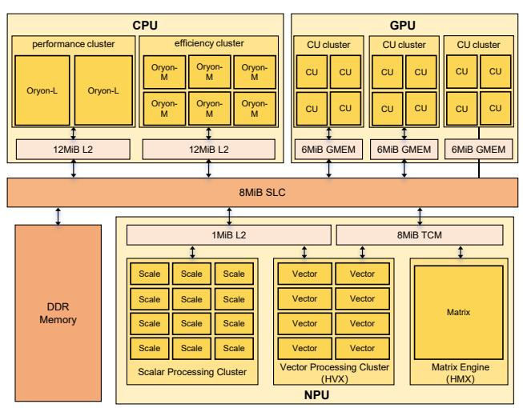
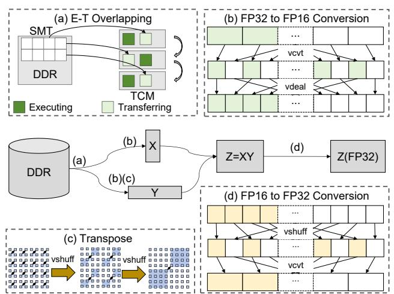
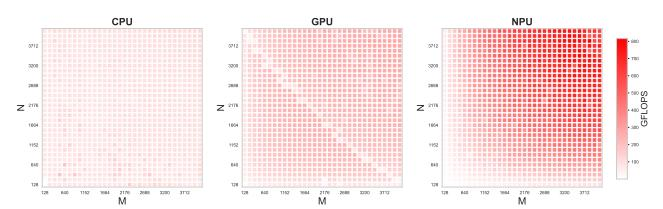
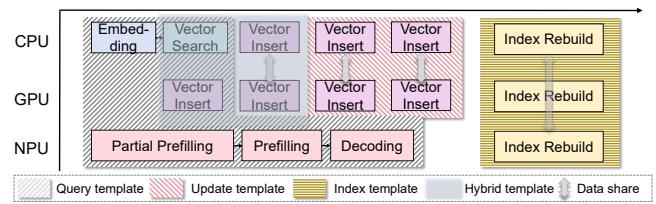
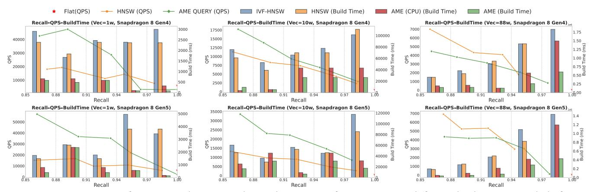
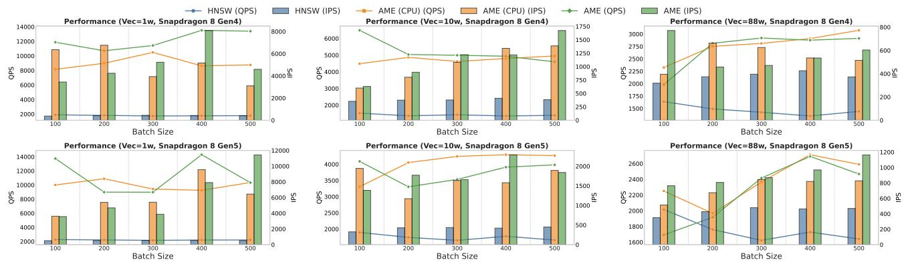
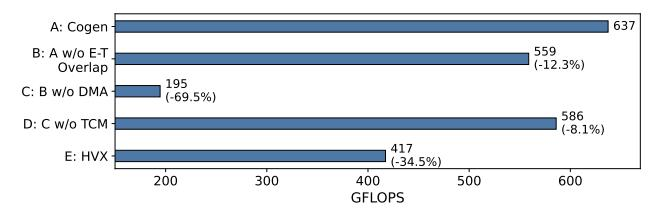
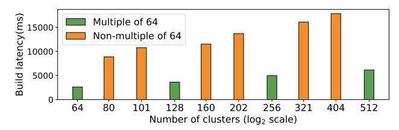

## AME: An Efficient Heterogeneous Agentic Memory Engine for Smartphones

Xinkui Zhao Zhejiang University Hangzhou, China zhaoxinkui@zju.edu.cn

Hengxuan Lou Zhejiang University Hangzhou, China 12560049@zju.edu.cn Qingyu Ma Zhejiang University Hangzhou, China maqingyu@zju.edu.cn

Guanjie Cheng Zhejiang University Hangzhou, China chengguanjie@zju.edu.cn

Jianwei Yin Zhejiang University Hangzhou, China zjuyjw@cs.zju.edu.cn Yifan Zhang Zhejiang University Hangzhou, China 12451018@zju.edu.cn

Shuiguang Deng Zhejiang University Hangzhou, China dengsg@zju.edu.cn

#### **Abstract**

On-device agents on smartphones increasingly require continuously evolving memory to support personalized, contextaware, and long-term behaviors. To meet both privacy and responsiveness demands, user data is embedded as vectors and stored in a vector database for fast similarity search. However, most existing vector databases target server-class environments. When ported directly to smartphones, two gaps emerge: (G1) a mismatch between mobile SoC constraints and vector-database assumptions, including tight bandwidth budgets, limited on-chip memory, and stricter data type and layout constraints; and (G2) a workload mismatch, because on-device usage resembles a continuously learning memory, in which queries must coexist with frequent inserts, deletions, and ongoing index maintenance. To address these challenges, we propose AME, an on-device Agentic Memory Engine co-designed with modern smartphone SoCs. AME introduces two key techniques: (1) a hardware-aware, highefficiency matrix pipeline that maximizes compute-unit utilization and exploits multi-level on-chip storage to sustain high throughput; and (2) a hardware- and workload-aware scheduling scheme that coordinates querying, insertion, and index rebuilding to minimize latency. We implement AME on Snapdragon 8-series SoCs and evaluate it on HotpotQA [24]. In our experiments, AME improves query throughput by up to 1.4× at matched recall, achieves up to 7× faster index construction, and delivers up to 6× higher insertion throughput under concurrent query workloads.

### 1 Introduction

AI agents are rapidly evolving from single-turn assistants into persistent, goal-directed systems, including household robots [6], mobile voice assistants [15], and task planners [9].

**Figure 1.** Motivation for the proposed *AME*: agentic memory stored in a vector database requires adaptation for efficient use on smartphones.

To personalize behavior and improve sample efficiency, modern agents rely on *agentic memory* that accumulates over time [1, 19, 21, 26]. They record user history, voice interactions, video input, summaries of prior interactions to ground future decisions, as illustrated in Figure 1. This information is embedded as vectors and stored in a vector database to enable efficient similarity search. At inference time, the agent retrieves the most relevant memories as additional context, conditioning its decisions on user-specific signals. In this way, agentic memory supports personalized behavior, including recalling long-horizon context, adapting tone to the user, and generating more concise prompts [12, 16].

A recent trend is to bring such agents onto smartphones [4, 23, 25]. Smartphones are a natural home for these agents: they carry the richest, most up-to-date personal context and are the primary interface for everyday tasks [20]. Keeping the agent's vector memory on-device ensures low latency and privacy by avoiding network access to sensitive data. However, directly deploying server-oriented vector databases on smartphones is ineffective and exposes two gaps:

**G1:** SoC-Database Mismatch. Server-side designs assume abundant bandwidth, large memory, and mature accelerator ecosystems. For example, IVF-based methods rely on wide, fast memory to probe many lists in parallel and on ample DRAM for centroids and postings, while HNSW [8] assumes large memory for graph neighbors, cache-friendly

pointer chasing, and thread-rich CPUs/GPUs. In contrast, mobile SoCs operate under tight power and bandwidth budgets, have limited on-chip memory, and lack a unified matrix runtime to distribute workloads across CPUs, GPUs, and NPUs. Although recent SoCs integrate increasingly capable heterogeneous units [2, 18, 23], they remain underutilized in vector workloads, where distance computations and type/layout conversions often fall back to the CPU.

**G2:** Workload Mismatch. Unlike servers that often build indexes offline and serve relatively stable corpora, on-device usage is inherently dynamic. Smartphones continuously accumulate and modify personal context from interactions and sensors; there is no clear boundary between "idle" and "in use". As a result, the vector memory must support frequent inserts and deletes while serving queries, and enable fast rebuild without disrupting interaction—demanding low tail latency and minimal interference under hybrid workloads.

To address these gaps, we present **AME**, a *collaborative* heterogeneous agentic memory engine for smartphones. By exploiting heterogeneous compute units and the unified system memory fabric of modern SoCs, **AME** dynamically coordinates semantic memory operations with model inference, minimizing redundant data movement while maintaining low latency. Our key insight is that mobile processors provide a unified memory fabric shared by CPUs, GPUs, and NPUs, which, when effectively utilized, can substantially reduce communication overhead between memory management and model execution. Building on this observation, **AME** adopts a *full-stack co-design* across hardware and vector database, guided by two main techniques:

- (1) Hardware-Aware Heterogeneous Vector Computation Pipeline. AME refactors core vector similarity operations into accelerator-native matrix computations and connects CPUs, GPUs, and NPUs through a shared-memory-based pipeline. A unified, file-descriptor-based memory framework exposes common buffers to all compute units without explicit copies, allowing each backend to operate on shared data with minimal movement. Within this framework, AME leverages the NPU for heavy GEMM workloads by performing in situ FP32←FP16 conversion and layout transformation in HVX, and by overlapping execution with transfers.
- (2) Hardware- and Workload-Aware Vector Index Design. To address workload-hardware mismatch on mobile devices, we co-design the vector index and its execution paths with both the NPU and the memory hierarchy in mind. On the index side, we make IVF hardware-aware by aligning clustering and embedding dimensions with the NPU's GEMM tile shapes, so that index build, insertion, and centroid updates map to dense, well-utilized matrix multiplications instead of irregular scalar code. On the execution side, we make the mapping workload-aware: AME distinguishes latency-critical single-query lookups, throughput-oriented batched queries, and background maintenance (inserts and

Figure 2. The architecture of the Snapdragon 8 Elite Gen 5.

rebuilds), and routes them through different CPU, GPU, and NPU paths using a small set of profiling-guided templates.

This paper makes the following contributions:

- To the best of our knowledge, AME is the first ondevice agentic memory engine that exploits smartphone heterogeneity. On Snapdragon 8-series SoCs,
  AME improves query throughput by up to 1.4× at
  matched recall, achieves up to 7× faster index construction, and delivers up to 6× higher insertion throughput under concurrent query workloads.
- We introduce an NPU-side data adaptation layer that performs data type conversion, in-place layout transforms/transposes in HVX, and batched GEMM via shared-memory mapping, eliminating CPU-side preprocessing and reducing CPU-NPU overhead.
- We co-design a hardware- and workload-aware vector index with template-driven heterogeneous execution and a memory-efficient scheduler, mapping queries, updates, and rebuilds to suitable computing units.

### 2 Background

### 2.1 Rise of On-Device Agentic Memory

Recent advances in large language models (LLMs) have enabled intelligent assistants with strong reasoning capabilities [5, 14, 26]. As these assistants migrate to on-device execution, they require an internal *agentic memory*, namely a continuously updated store of user-specific signals such as recent interactions, local content, and stable preferences. Agentic memory extends beyond retrieval and must also support fast, continual updates. On mobile hardware, however, it is challenging to provide both low-latency queries and frequent updates under tight compute and memory budgets.

### 2.2 Architecture of Mobile SoCs

Modern mobile SoCs (Figure 2) integrate heterogeneous processing units to balance performance and energy. The CPU

**Table 1.** Representative vector indexes and main issues on mobile SoCs.

| Algorithm          | Optimized for    | Limitation on SoC         |
|--------------------|------------------|---------------------------|
| Flat               | Exact search     | O(N) compute / bandwidth  |
| HNSW               | CPU (cache-rich) | Irregular graph access    |
| IVF                | CPU / GPU        | Large DRAM, random probes |
| Faiss IVF-PQ (CPU) | CPU              | Heavy compute, DRAM-bound |
| Faiss IVF-PQ (GPU) | Nvidia GPU       | CUDA-only, high power     |
| CAGRA              | Nvidia GPU       | CUDA-only, VRAM-hungry    |

handles control and scheduling, the GPU accelerates massively parallel tensor operations, and the NPU, specialized for deep learning inference, uses scalar cores in addition to a vector unit and a matrix engine. Unlike server-class platforms, mobile SoCs typically adopt a unified memory architecture centered on a System-Level Cache (SLC) shared by all units. CPUs and GPUs access the SLC via private L2 and GMEM, while the NPU subsystem has a small L2 and an 8 MiB Tightly Coupled Memory (TCM) for critical data.

### 3 Motivation

Challenge 1: Underutilization of Mobile Heterogeneous Hardware and Limited Ecosystem Support. Although modern mobile SoCs integrate powerful multi-core CPUs, highly parallel GPUs, and dedicated NPUs, these heterogeneous resources remain underutilized in retrieval-augmented workloads. Unlike cloud environments with mature ecosystems such as CUDA, Triton, and TensorRT, mobile platforms lack comparable tooling and documentation, and current on-device runtimes provide no unified abstraction for coordinating heterogeneous computation.

Challenge 2: Lack of Mobile-Oriented Vector Database Design. Existing vector database frameworks such as HNSW, FAISS, and CAGRA are primarily designed for server-class environments with abundant memory bandwidth, discrete accelerators, and mature software ecosystems, as shown in Table 1. Their algorithmic designs assume cacherich CPUs or discrete GPUs with explicit device memory, which leads to irregular access patterns, large working sets, and high memory traffic when ported to mobile platforms. In contrast, modern mobile SoCs integrate heterogeneous compute units (CPU, GPU, NPU) within a shared-memory architecture subject to strict power and thermal constraints. Existing vector databases are not optimized for these hardware characteristics, resulting in inefficient memory reuse, coarse-grained task partitioning, and degraded throughput.

Opportunity: SoC-Aware Co-Design for Collaborative Intelligence. Despite these challenges, recent mobile SoCs also create new opportunities. Next-generation SoCs, such as Snapdragon 8 series, integrate high-performance NPUs and GPUs, and a unified shared-memory interconnect that allows all computing units to access data without costly copies. By co-designing vector database operations with these SoC-native dataflows, we can reduce redundant

Figure 3. NPU-side data adaptation and execution—transfer overlapping in AME. (a) SMT-based overlap of GEMM execution and DMA transfers with double-buffering in TCM. (b) FP32→FP16 conversion and tile packing in HVX. (c) In-place transpose and layout conversion without extra DDR traffic. (d) FP16→FP32 unpacking and conversion.

transfers and achieve synchronized heterogeneous execution.

### 4 AME Design

#### 4.1 Overview

This paper introduces AME, a CPU–GPU–NPU hybrid agentic memory engine designed for lightweight operation. AME bridges the gap between retrieval and generation in mobile intelligent agents by fully exploiting the heterogeneous computing capabilities of modern SoCs. It follows a *collaborative heterogeneous design* that integrates retrieval, computation, and generation within a unified execution runtime.

## 4.2 Hardware-aware heterogeneous vector computation pipeline

Modern mobile SoCs integrate heterogeneous processing units such as CPUs, GPUs, and NPUs to balance performance and power efficiency [7]. However, fully exploiting this heterogeneity for vector similarity computation faces three practical obstacles: (1) *data format mismatch* between CPU-and NPU-side representations; (2) *data movement overhead* caused by limited on-chip memory and costly CPU-NPU interactions; and (3) *inefficient data sharing* among CPUs, GPUs, and NPUs. In the remainder of this section, we present a hardware-aware heterogeneous vector computation pipeline that systematically addresses these challenges.

**Data Adaptation Layer** NPUs offer high parallelism and energy efficiency for large-scale matrix operations, but their benefits are hard to realize when CPU-side data types and layouts do not match the NPU's preferred format. Core agentic memory operations ultimately reduce to batched vector-matrix multiplications over large embedding tables. On mobile devices, these embeddings are typically stored

as FP32 tensors in CPU-friendly layouts (e.g., row-major), whereas the HMX engine only supports FP16 operands and expects tile-major layouts. A naïve design would perform FP32-to-FP16 conversion and materialize a transposed copy of the embedding table on the CPU before offloading GEMM to the NPU. One option is to allocate a large CPU-side buffer and convert the entire matrix at once, which doubles peak memory usage and is unacceptable on mobile devices. Another option is to convert the matrix tile-by-tile and invoke the NPU for each tile; however, each FastRPC call costs 200–700  $\mu$ s, so repeatedly launching small GEMMs makes data preparation and invocation the dominant bottleneck. To address these challenges, we introduce a Data Adaptation Layer that performs all transformations on the NPU: it (i) uses HVX for data type conversion, (ii) performs in-place layout transposes, and (iii) amortizes invocation overhead via batched execution and shared-memory mapping.

**Type conversion.** HVX handles all type conversion between FP32 tensors and FP16 tiles. For the **FP32-to-FP16** path (Figure 3(b)), HVX uses vcvt to convert FP32 elements to FP16 in vector registers, then applies vdeal to reshuffle and pack them into the compact tile layout expected by HMX without spilling to memory. The **FP16-to-FP32** path (Figure 3(d)) mirrors this: HVX uses vshuff to undo the packing and restore row-major order, then applies vcvt to expand values back to FP32.

**In-place transpose.** To support the **AB**T pattern required by vector similarity on an HMX core optimized for **AX**, we must efficiently transpose **B** into HMX's tile-major layout. Instead of a naïve transpose with poor locality and heavy off-chip traffic, we use HVX to perform an on-chip, in-place transpose. As shown in Figure 3(c), a sequence of vshuff-based sub-block swaps reorders elements entirely in HVX registers into the tile-major format expected by HMX, avoiding extra DDR accesses and their associated latency.

Amortizing NPU invocation overhead. To reduce the software overhead of CPU-NPU interactions, the Data Adaptation Layer batches multiple GEMM tasks into a single FastRPC invocation and relies on ION-based shared-memory mapping instead of the default variable pass-through interface. Batching reduces the number of FastRPC calls and spreads their fixed cost over many operations, while ION avoids redundant data copies between user space and the NPU driver. Together, these mechanisms significantly lower invocation latency and improve end-to-end throughput.

*Execution-Transfer Overlapping* Despite the NPU's high compute capability, its tightly coupled memory (TCM) is only 8 MiB, which is far too small to hold the large matrix tiles that arise in vector similarity workloads. As a result, matrices must be partitioned into tiles that are repeatedly streamed between off-chip DDR and on-chip TCM via the DMA engine. If data movement and computation are executed sequentially, the DMA transfer time quickly dominates end-to-end latency, leaving the NPU compute units underutilized. To

prevent data movement from becoming the bottleneck, we introduce an on-chip pipelined **Execution-Transfer Overlapping** that couples a computing unit and the DMA engine into a cooperative stream, overlapping communication with computation, as shown in Figure 3(a). To hide DMA latency and keep the NPU's compute units busy, we employ a Simultaneous Multi-Threading (SMT) runtime to orchestrate computation and data movement. The SMT runtime runs two cooperative threads in parallel: while one thread performs computation for the current tile, the other concurrently issues asynchronous DMA transfers to prefetch the next tile from DDR into TCM. The limited TCM is partitioned into small tiles and organized as a double buffer, so that when computation on one tile finishes, the next tile has already been brought on chip and is immediately ready for execution.

Data Sharing Across Computing Units Modern SoCs provide a unified memory architecture that lets CPUs, GPUs, and NPUs access a common physical memory pool, greatly reducing costly inter-device copies. AME leverages this to build a lightweight data-sharing fabric using a unified, filedescriptor-based memory management framework that exposes shared buffers to all three units without explicit memcpy. Instead of replicating data, a single host buffer is mapped into each device's virtual address space, avoiding extra latency and bandwidth overhead. On the GPU, this is realized via the OpenCL runtime. For the NPU, which lacks a standardized memory-management interface, we build an ION-based path: ION buffers are allocated on the host and converted to file descriptors, then registered with the NPU via fastrpc\_mmap so that the DDR-backed buffer is mapped into the NPU RTOS virtual address space; inside the NPU, HAP\_mmap manages these mappings and maintains a consistent translation between DDR and the NPU's on-chip OS address space. Because Snapdragon SoCs use a one-way cache coherence model, NPUs do not automatically invalidate their caches after CPU writes to shared memory, so we explicitly flush the corresponding cache lines before they poll shared buffers to ensure they observe the most recent data.

# 4.3 Hardware- and Workload-Aware Vector Index Design

*Hardware-aware Vector Index Design* To adapt the vector database to mobile SoC hardware, we redesign IVF to match the NPU's GEMM kernel configuration. The NPU supports a minimum kernel of  $32 \times 64 \times 64$  ( $M \times N \times K$ ), which constrains clustering parameters and matrix shapes. In our hardware-aware IVF design, the number of clusters (the N dimension for insertion and rebuild GEMMs) is chosen as a multiple of 64 so that centroid updates fully occupy NPU tiles; the embedding dimension K is already a multiple of 64 in typical models; and the M dimension (number of database vectors) is rounded up to the nearest multiple of 32, with

**Figure 4.** GEMM throughput heatmaps for CPU, GPU, and NPU in our optimized heterogeneous system.

**Figure 5.** Template-driven heterogeneous execution in AME: four representative templates: query, update, index, and query-update hybrid.

negligible padding overhead. This alignment allows IVF indexing and updates to map directly to efficient NPU GEMMs, improving throughput and avoiding kernel fragmentation. Workload-aware Vector Index Design To align heterogeneous agentic memory workloads, which span queries, frequent updates, and periodic index rebuilds, with diverse on-chip resources, we first analyze what each hardware type is best suited for. We profile CPUs, GPUs, and NPUs across GEMM workloads with varying matrix sizes to characterize their capabilities in our heterogeneous system (Figure 4). On-device agentic memory queries and inserts use small batch sizes and moderate embedding dimensions (typically  $\leq$  1024), so their GEMMs are relatively small in both M and K. In contrast, index construction operates over the entire database, yielding much larger matrices and exposing substantially more parallelism. In practice, agentic memory accesses fall into four recurring scenarios: query, update, index rebuild, and query-update hybrid. AME therefore adopts a template-driven execution strategy that maps these scenarios to the hardware regimes where profiling shows each device excels. As summarized in Figure 5, the query template targets latency-critical RAG inference with moderate matrix sizes, assigning prefilling and decoding to the NPU and vector search to the CPU. The **update template** handles lightweight but frequent insert and replace operations with small matrices, where CPU-GPU collaboration is preferable to using the NPU: CPUs maintain metadata and index coherence, while GPUs process batched insertions. The index template supports large, latency-insensitive index rebuilds, where CPUs, GPUs, and NPUs jointly execute highthroughput matrix computations. The query-update hybrid template serves mixed workloads, prioritizing queryside prefilling and decoding on the NPU while CPU-GPU resources share vector search and insertion based on queue depth and system load. Across all templates, post-processing of accelerator outputs, such as top-k aggregation, is executed

on the host CPU, whose multithreaded architecture is well suited to control flow-intensive operations.

Memory-efficient Scheduler We employ a worker-pulled task scheduler to distribute fine-grained tasks across heterogeneous compute units. AME decomposes each logical operation into tasks, but submitting all tasks at once induces an unacceptable memory peak, while a single-task-per-worker policy creates severe pipeline "bubbles". To resolve this core trade-off, we introduce a Windowed Batch Submission strategy. This approach submits only a limited window of tasks to a global queue, decoupling peak memory usage from the total workload. Worker threads, bound to specific backends (CPU, GPU, or NPU), autonomously pull tasks when idle. This decentralized model provides implicit load balancing, as faster units naturally consume more tasks, and circumvents the complexity of a central dispatcher or per-device queues, ensuring low overhead and high scalability.

### 5 System Implementation

The system is built on a customized runtime that integrates OpenCL [10], OpenBLAS [11], Hexagon SDK, and GGML kernels. We implement an on-device agent framework that performs vector index construction, vector retrieval, and LLM inference. Inspired by Teola [17], we apply early prefilling and a fine-grained pipeline to maximize NPU utilization and overall efficiency. The full framework comprises approximately 19K lines of C/C++ code.

## 6 Experimental Results

### 6.1 Experiment Setup

Platform, Model, and Runtime: We deploy AME on heterogeneous Snapdragon SoCs, using the Qualcomm Cloud Phone platform for Snapdragon 8 Gen 4 and Redmi K90 Pro Max for Snapdragon 8 Gen 5. All language-model inference is executed with the Genie SDK [13], which runs LLM prefilling and decoding on the NPU while computing embeddings on the CPU. We use Llama 3-3B [3] as the backbone and BGE-Large-en-v1.5 [22] for embeddings.

Baselines: We evaluate **AME** against three representative vector-retrieval frameworks adapted for mobile SoCs: **Flat**, **HNSW** [8] and **IVF-HNSW** [8], which represent distinct index-construction and search strategies. We also implement single-backend variants that restrict execution to a single processor to isolate the benefits of hybrid scheduling.

*Metrics:* We use the following metrics in our evaluation. Latency (ms) captures end-to-end response time for a given operation. Queries Per Second (QPS) measures sustainable query throughput. Insertions Per Second (IPS) measures sustainable insertion throughput. Recall@K (%) quantifies retrieval quality as the fraction of ground-truth nearest neighbors that are successfully returned. To assess raw compute efficiency, we also report achieved GFLOPS.

*Dataset:* We evaluate AME on **HotpotQA** [24], which contains 113k Wikipedia question–answer pairs. We construct three corpora with **10k**, **100k**, and **1M** embedding vectors.

Figure 6. Query stage performance and corresponding index stage performance across different database sizes and platforms.

Figure 7. Insertion throughput and sustained query throughput under a hybrid search-update workload.

Query and Index Performance We compare AME with baseline indexes in terms of recall and end-to-end query latency (Figure 6). On small- and medium-scale datasets, AME dominates across the entire recall—QPS curve with up to 1.4× speedup at matched recall. On the large-scale dataset, AME remains competitive with HNSW at low recall, and overtakes it as recall increases. Notably, HNSW cannot even be constructed at very high recall targets due to memory exhaustion on the smartphone. In terms of index construction time, AME is also substantially more efficient. Compared to HNSW, AME achieves up to 7× faster build time under the same recall target. Relative to its own single-backend variants, AME further accelerates index construction by up to 2.5×, highlighting the benefit of jointly exploiting processors rather than relying on any single compute unit.

*Hybrid Search-Update* Beyond static indexing, we also evaluate insertion throughput when queries and other workloads run concurrently, reflecting the realistic behavior of a continuously learning on-device agent (Figure 7). Across different insertion batch sizes, AME sustains higher QPS than all baselines, achieving up to  $6\times$  higher throughput than HNSW. For concurrent insertion specifically, AME delivers up to  $2.1\times$  speedup over HNSW, and up to  $1.5\times$  over its own single-backend variants, demonstrating the benefit of heterogeneous scheduling under online update workloads.

**Figure 8.** NPU ablation study of GEMM throughput under five configurations.

## 6.2 A Detailed Analysis of the NPU Subsystem

We further dissect the contributions of AME's NPU-side optimizations using five configurations (E→A in Figure 8). Starting from an HVX-only baseline without TCM (E), enabling SMT (D) already improves utilization and yields a noticeable throughput gain. Next, we introduce TCM-aware scheduling so that working sets are staged in on-chip TCM (C); however, when TCM is filled via CPU-side memcpy, the extra copy cost dominates and largely offsets the benefit of on-chip buffering. Replacing memcpy with DMA transfers (B) removes this overhead and significantly increases GFLOPS. Finally, adding an execute—transfer overlap scheme (A) hides most remaining memory latency and reaches the full AME NPU performance. Overall, SMT, TCM staging, DMA-based transfers, and E−T overlap are all necessary and complementary for approaching the NPU's peak throughput.

**Figure 9.** Impact of IVF cluster count on index construction latency.

### 6.3 Analysis of the Hardware-Aware Index Design

To validate our hardware-aware choice of the cluster count, we sweep the number of IVF clusters and measure index construction latency, as shown in Figure 9. We observe a clear alignment effect: when the cluster count is not a multiple of 64, centroid updates map to partially filled NPU tiles, leading to fragmented GEMMs and longer build times. In contrast, when the number of clusters is a multiple of 64, the index construction latency reaches a local minimum.

### 7 Conclusion

We presented *AME*, a lightweight agentic memory engine co-designed with smartphone SoCs. AME refactors vector similarity into accelerator-native GEMM, adds an NPU-side data adaptation and execution—transfer overlap scheme, and redesigns IVF indices and scheduling for unified memory and heterogeneous CPU—GPU—NPU resources. On Snapdragon 8-series devices, AME improves query throughput and index construction by up to several times over mobile-adapted baselines, demonstrating that SoC-aware co-design can make smartphones efficient, low-latency vector search backends for on-device agents.

## References

- [1] Riccardo Bovo, Steven Abreu, Karan Ahuja, Eric J Gonzalez, Li-Te Cheng, and Mar Gonzalez-Franco. Embardiment: an embodied ai agent for productivity in xr. In 2025 IEEE Conference Virtual Reality and 3D User Interfaces (VR), pages 708–717. IEEE, 2025.
- [2] Anthony Cabrera, Seth Hitefield, Jungwon Kim, Seyong Lee, Narasinga Rao Miniskar, and Jeffrey S Vetter. Toward performance portable programming for heterogeneous systems on a chip: A case study with qualcomm snapdragon soc. In 2021 IEEE High Performance Extreme Computing Conference (HPEC), pages 1–7. IEEE, 2021.
- [3] Aaron Grattafiori, Abhimanyu Dubey, Abhinav Jauhri, Abhinav Pandey, Abhishek Kadian, Ahmad Al-Dahle, Aiesha Letman, Akhil Mathur, Alan Schelten, Alex Vaughan, et al. The llama 3 herd of models. arXiv preprint arXiv:2407.21783, 2024.
- [4] Zixu Hao, Jianyu Wei, Tuowei Wang, Minxing Huang, Huiqiang Jiang, Shiqi Jiang, Ting Cao, and Ju Ren. Scaling llm test-time compute with mobile npu on smartphones. arXiv preprint arXiv:2509.23324, 2025.
- [5] Yuanchun Li, Hao Wen, Weijun Wang, Xiangyu Li, Yizhen Yuan, Guohong Liu, Jiacheng Liu, Wenxing Xu, Xiang Wang, Yi Sun, et al. Personal llm agents: Insights and survey about the capability, efficiency and security. arXiv preprint arXiv:2401.05459, 2024.
- [6] Lin Long, Yichen He, Wentao Ye, Yiyuan Pan, Yuan Lin, Hang Li, Junbo Zhao, and Wei Li. Seeing, listening, remembering, and reasoning: A multimodal agent with long-term memory. arXiv preprint arXiv:2508.09736, 2025.
- [7] Eric Mahurin. Qualocmm® hexagon™ npu. In HCS, pages 1–19, 2023.
- [8] Yu A Malkov and Dmitry A Yashunin. Efficient and robust approximate nearest neighbor search using hierarchical navigable small world graphs. IEEE transactions on pattern analysis and machine intelligence, 42(4):824–836, 2018.
- [9] Kai Mei, Xi Zhu, Wujiang Xu, Wenyue Hua, Mingyu Jin, Zelong Li, Shuyuan Xu, Ruosong Ye, Yingqiang Ge, and Yongfeng Zhang. Aios: Llm agent operating system. arXiv preprint arXiv:2403.16971, 2024.
- [10] Aaftab Munshi, Benedict Gaster, Timothy G Mattson, and Dan Ginsburg. OpenCL programming guide. Pearson Education, 2011.
- [11] Cedric Nugteren. Clblast: A tuned opencl blas library. In Proceedings of the International Workshop on OpenCL, pages 1–10, 2018.
- [12] James Jie Pan, Jianguo Wang, and Guoliang Li. Survey of vector database management systems. The VLDB Journal, 33(5):1591–1615, 2024.
- [13] Qualcomm Technologies, Inc. Gen ai inference extensions. [https://www.qualcomm.com/developer/software/gen-ai-inference](https://www.qualcomm.com/developer/software/gen-ai-inference-extensions)[extensions](https://www.qualcomm.com/developer/software/gen-ai-inference-extensions), 2025.
- [14] Samuel Schmidgall, Yusheng Su, Ze Wang, Ximeng Sun, Jialian Wu, Xiaodong Yu, Jiang Liu, Michael Moor, Zicheng Liu, and Emad Barsoum. Agent laboratory: Using llm agents as research assistants. arXiv preprint arXiv:2501.04227, 2025.
- [15] Hyorim Shin, Hanna Chung, Chaieun Park, and Soojin Jun. Enhancing the multi-user experience in fully autonomous vehicles through explainable ai voice agents. International Journal of Human–Computer Interaction, 41(11):6672–6686, 2025.
- [16] Toni Taipalus. Vector database management systems: Fundamental concepts, use-cases, and current challenges. Cognitive Systems Research, 85:101216, 2024.
- [17] Xin Tan, Yimin Jiang, Yitao Yang, and Hong Xu. Teola: Towards end-to-end optimization of llm-based applications. arXiv preprint arXiv:2407.00326, 2024.
- [18] Jiuqiang Tang, Raman Sorokin, Ekaterina Ignasheva, Grant Jensen, Lin Chen, Juhyun Lee, Andrei Kulik, and Matthias Grundman. Scaling ondevice gpu inference for large generative models. In Proceedings of the Computer Vision and Pattern Recognition Conference, pages 6355–6364, 2025.
- [19] Yinxu Tang, Stylianos Loukas Vasileiou, and William Yeoh. Does your ai agent get you? a personalizable framework for approximating

- human models from argumentation-based dialogue traces. In Proceedings of the AAAI Conference on Artificial Intelligence, volume 39, pages 14405–14413, 2025.
- [20] Junyang Wang, Haiyang Xu, Haitao Jia, Xi Zhang, Ming Yan, Weizhou Shen, Ji Zhang, Fei Huang, and Jitao Sang. Mobile-agent-v2: Mobile device operation assistant with effective navigation via multi-agent collaboration. Advances in Neural Information Processing Systems, 37:2686–2710, 2024.
- [21] Zixuan Wang, Bo Yu, Junzhe Zhao, Wenhao Sun, Sai Hou, Shuai Liang, Xing Hu, Yinhe Han, and Yiming Gan. Karma: Augmenting embodied ai agents with long-and-short term memory systems. In 2025 IEEE International Conference on Robotics and Automation (ICRA), pages 1–8. IEEE, 2025.
- [22] Shitao Xiao, Zheng Liu, Peitian Zhang, and Niklas Muennighoff. Cpack: Packaged resources to advance general chinese embedding, 2023.
- [23] Daliang Xu, Hao Zhang, Liming Yang, Ruiqi Liu, Gang Huang, Mengwei Xu, and Xuanzhe Liu. Fast on-device llm inference with npus. In Proceedings of the 30th ACM International Conference on Architectural Support for Programming Languages and Operating Systems, Volume 1, pages 445–462, 2025.
- [24] Zhilin Yang, Peng Qi, Saizheng Zhang, Yoshua Bengio, William W. Cohen, Ruslan Salakhutdinov, and Christopher D. Manning. HotpotQA: A dataset for diverse, explainable multi-hop question answering. In Conference on Empirical Methods in Natural Language Processing (EMNLP), 2018.
- [25] Chi Zhang, Zhao Yang, Jiaxuan Liu, Yanda Li, Yucheng Han, Xin Chen, Zebiao Huang, Bin Fu, and Gang Yu. Appagent: Multimodal agents as smartphone users. In Proceedings of the 2025 CHI Conference on Human Factors in Computing Systems, pages 1–20, 2025.
- [26] Yifan Zhang, Xinkui Zhao, Zuxin Wang, Zhengyi Zhou, Guanjie Cheng, Shuiguang Deng, and Jianwei Yin. Sortinghat: Redefining operating systems education with a tailored digital teaching assistant. In Companion Proceedings of the ACM on Web Conference 2025, pages 2951–2954, 2025.