# Dissecting the Impact of Mobile DVFS Governors on LLM Inference Performance and Energy Efficiency

Zongpu Zhang1,2\*, Pranab Dash2\*, Y. Charlie Hu2, Qiang Xu2, Jian Li1 and Haibing Guan1

1Shanghai Jiao Tong University, Shanghai, China

2Purdue University, West Lafayette, USA

#### **Abstract**

Large Language Models (LLMs) are increasingly being integrated into various applications and services running on billions of mobile devices. However, deploying LLMs on resource-limited mobile devices faces a significant challenge due to their high demand for computation, memory, and ultimately energy. While current LLM frameworks for mobile use three power-hungry components—CPU, GPU, and Memory—even when running primarily-GPU LLM models, optimized DVFS governors for CPU, GPU, and memory featured in modern mobile devices operate independently and are oblivious of each other. Motivated by the above observation, in this work, we first measure the energy-efficiency of a SOTA LLM framework consisting of various LLM models on mobile phones which showed the triplet mobile governors result in up to 40.4% longer prefilling and decoding latency compared to optimal combinations of CPU, GPU, and memory frequencies with the same energy consumption for sampled prefill and decode lengths. Second, we conduct an in-depth measurement study to uncover how the intricate interplay (or lack of) among the mobile governors cause the above inefficiency in LLM inference. Finally, based on these insights, we design FUSE – a unified energy-aware governor for optimizing the energy efficiency of LLM inference on mobile devices. Our evaluation using a ShareGPT dataset shows FUSE reduces the time-to-first-token and time-peroutput-token latencies by 7.0%-16.9% and 25.4%-36.8% on average with the same energy-per-token for various mobile LLM models.

#### 1 Introduction

As Generative AI, powered by the LLM technology [39], continues to evolve rapidly, it is increasingly integrated into a wide range of societal applications. In particular, the technology is used to power personal services that operate on billions of mobile devices, enabling users to access advanced capabilities like personalized recommendations, intelligent virtual assistants, and language translation at their fingertips. In doing so, the proliferation of LLMs on mobile platforms

However, deploying LLMs on resource-constrained mobile devices faces a significant challenge due to their high demand for computation, memory, and energy. Mobile devices have limited processing capabilities, memory bandwidth, and battery life, while LLM inference needs to perform compute-intensive operations such as matrix-multiplications as well as memory-intensive operations such as accessing large K-V caches, both of which drive the CPU/GPU and memory to draw significant amount of power and rapidly deplete the battery. Addressing these challenges is critical to making LLM technology more accessible and effective on mobile devices.

Several recent works (e.g., [25, 35, 44, 46], [42], and [14, 41, 43, 45]) have focused on minimizing inference latency without considering energy constraints. However, the energy consumption of on-device LLMs remains exceptionally high, potentially limiting regular use by everyday users. For instance, a recent study [21] reveals that battery could be depleted by inferencing only 490 to 590 prompts, using a mobile-tailored 4-bit quantized LLM on iPhone 14 Pro.

In this paper, we make two key observations about LLM inference serving on mobile devices. First, current LLM frameworks for mobile devices, *e.g.*, llama.cpp [13], use three powerhungry components: the CPU, GPU, and memory – even when running primarily GPU-based LLM inference. While it is expected that GPU-based LLM inference would extensively use the GPU and memory intensively, the CPU also plays a significant role. This is because the CPU remains actively engaged to support OpenCL, the GPU programming framework commonly employed by state-of-the-art mobile LLM frameworks.

Second, modern mobile operating systems (OSes) feature optimized governors for CPU, GPU, and memory that perform DVFS to enhance energy-efficiency of respective components [2, 4, 19]. But these governors are designed to function independently without coordination, which can lead to suboptimal energy efficiency across the system. For example, when running a GPU-based LLM, the CPU may scale down its frequency to save CPU power without considering

1

is transforming how individuals interact with technology, making it more intuitive and accessible.

\* These authors contributed equally to this work.

the high utilization of the GPU, which relies on the CPU to quickly feed it the next operators, potentially elongating the end-to-end inference latency and increasing the energy per inference.

Motivated by the above observations, in this paper, we conduct to our knowledge the first in-depth study of the interplay of mobile CPU, GPU, and memory governors during LLM inference. Our study answers the following questions.

(1) How well do the governors on modern mobile devices work for LLM inference workload? To study the impact of governors on LLM inference performance and energy efficiency, we carefully design a benchmarking testbed that can control the CPU/GPU/memory frequencies or use the default governors of Android phones during each LLM inference run and automate a large number of inference runs while measuring detailed inference performance (prefill vs. decode) and power draw. Using the testbed, we search for the optimal CPU/GPU/memory frequencies that minimize inference latency under the constraint of consuming no more energy than using the default governors for sampled prefill/decoding lengths. Our results show that the inference latency and energy efficiency of the default governors can be far from optimal. For example, fixing the components to operate at optimal frequency combinations can either reduce the prefilling and decoding latency by up to 40.4% or reduce the energy consumption by up to 16.6% compared to the default governors.

(2) Why do the individually optimized governors together cause low performance and energy efficiency in LLM inference? To answer this question, we design a set of controlled experiments to first isolate and gain insight into the behavior and impact of individual mobile governors (e.g., by pinning the frequencies of other governors as enabled by our benchmarking testbed), and then examine the interplay when they act concurrently, for LLM inference workload. Our experiments provide several important insights: (1) When the default governors work in isolation, i.e., trying to optimize the energy efficiency of respective components, the GPU and CPU governors tend to choose low frequencies that result in long inference latency and low energy efficiency. For example, the time-per-output-token (TPOT) in decode under the GPU governor which operates the GPU at 424.4 and 411.4 MHz for TinyLlama-1.1B and StableLM-Zephyr-3B models could be reduced by 41.0% and 34.6% for the two models without increasing energy consumption, if it had chosen higher GPU frequencies (848 and 762 MHz). Similarly, the TPOT in decode for the two models under the EAS governor, which chose overly low CPU frequencies of 1130.8 and 1038.8 MHz, respectively, could be reduced by 13.2% and 13.4%, if EAS had chosen higher CPU frequencies of 2252 and 2401 MHz, for the two models, respectively. (2) When the GPU

and CPU governors act concurrently, they can antagonistically trigger a "downward spiral" effect where they drive each other to cascadingly lower the CPU/GPU frequencies, which explains the long inference latency and low energy efficiency observed in (1). We further uncover the root cause for the antagonistic effect, which stems from each governor independently scaling its frequency in an attempt to achieve its designated utilization target.

(3) How to design a unified energy-aware governor to optimize the energy efficiency of all the three powerhungry components for LLM inference? Avoiding such antagonistic effect between independently acting governors uncovered from our root cause analysis above requires a holistic energy-efficient governor for managing all three components. To this end, we present FUSE, a unified Energyaware Governor for optimizing the energy efficiency of LLM inference on mobile devices. FUSE operates in two stages. At the offline stage, it performs efficient profiling-based search for the optimal frequency combination for the three powerhungry components that minimizes the inference latency given an energy budget or minimizes the energy consumption given an inference latency target, i.e., TTFT for prefill and TPOT for decode. During runtime, for each inference request, it looks up and pins down the components at the optimal frequency combination. We prototype FUSE on Android Pixel 7 and Pixel 7 pro phones and evaluate it using the ShareGPT dataset. Our results show that FUSE reduces the TTFT and TPOT by 7.0%-16.9% and 25.4%-36.8% on average for various mobile LLM models, compared with the default mobile governors.

We have released FUSE as an extension to the llama.cpp framework to facilitate further research on energy-efficient LLM inference.

# 2 Background and Motivation

# 2.1 Computational Characteristics of LLM Inference

The inference of most popular LLM models, e.g., the GPT [\[7\]](#page-12-7) and Llama [\[37\]](#page-13-8) series, is done in an autoregressive manner, which consists of two stages: the prefill stage, where the user prompt is processed to generate the first token of the response, and the decode stage, where subsequent tokens are generated one by one until a special end-of-sequence token is reached. Both stages run the same LLM model, which consists of multiple (32 for Llama-2 7B [\[38\]](#page-13-9)) Transformer blocks, and each Transformer block is in turn composed of an attention component and an MLP component [\[39\]](#page-13-0). The LLM model only runs once during the prefill stage, where tokens from the user prompt are processed in a batch, which is very compute-intensive. On the other hand, during the decode stage, the model runs once for each output token.

Table 1: Available frequencies in Pixel 7 and Pixel 7 Pro

| Governor | Available Frequencies (MHz)                                                                             |
|----------|---------------------------------------------------------------------------------------------------------|
| CPU      | 500, 851, 984, 1106, 1277, 1426, 1582, 1745, 1826, 2048, 2188, 2252, 2401, 2507, 2630, 2704, 2802, 2850 |
| GPU      | 151, 202, 251, 302, 351, 400, 471, 510, 572, 701, 762, 848                                              |
| Memory   | 421, 546, 676, 845, 1014, 1352, 1539, 1716, 2028, 2288, 2535, 2730, 3172                                |

However, with the widely-used KV-cache optimization, only the last token needs to be processed by the model in order to generate the next token. Thus, the model essentially runs with batch size 1 and is less compute-intensive. The different computational characteristics of the two stages often require different optimization configurations [32, 50] that also entail different energy characteristics (as we will see in §4).

# 2.2 LLM Inferencing Uses Multiple Hardware Components

Current LLM frameworks for mobile [13, 17, 36, 42], for example, *llama.cpp* [13], use all three power-hungry components, CPU, GPU, and memory, and this is true even when running primarily GPU-based LLM models. LLM models are generally more efficient running on mobile GPUs than on mobile CPUs [21]. Such GPU-based LLM models typically use OpenCL, the prominent programming framework for mobile GPUs. OpenCL provides an asynchronous abstraction where the sequence of kernels is enqueued into a command queue, and the OpenCL client only needs to wait for the GPU to finish executing the enqueued kernels without synchronizing with the GPU in the middle. However, compared to desktop GPUs, mobile GPUs have limited hardware support for queue management. For example, the ARM Mali GPUs only have a shallow queue with 2 outstanding entries at maximum [29]. Because of this, the OpenCL library (running on the CPU) still needs to manage a much deeper command queue and feed new kernels to the GPU as those queued on the GPU finish. As a result, the CPU is constantly involved over the entire duration of LLM inference, even though most computation is offloaded to the mobile GPU.

#### 2.3 Mobile DVFS Governors

Mobile operating systems such as Android employ DVFS governors which perform Dynamic Voltage and Frequency Scaling (DVFS) to optimize the energy efficiency of power-hungry hardware components such as the GPU, CPU, and memory. Intuitively, the energy efficiency of a component is a function of its power draw and runtime in completing a given workload, e = energy/load = power \* runtime/load. Since in general increasing operating frequency reduces runtime but increases power, and vice versa, the governor aims to choose a target frequency that balances the two to achieve high energy efficiency. In practice, since neither power nor runtime can be easily measured, a practical governor design

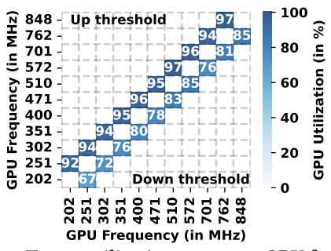

Figure 1: Target utilization range per GPU frequency

is to adjust the frequency based on observed systems statistics such as utilization of the component, *i.e.*, trying to keep the component running around a target utilization, by increasing (decreasing) the operating frequency to the next frequency (based on a pre-defined utilization-to-frequency lookup table) if the hardware utilization exceeds (drops below) some threshold.

Off-the-shelf governors used in mobile operating systems such as Android are designed and optimized for the respective hardware components in isolation; at runtime, they function independently of each other.

**GPU governor.** The Quickstep [2] governor is used to manage the GPU frequency in recent generations of phones such as the Google Pixel family from Pixel 6 to the latest Pixel 9. It determines the target frequency based on a predefined table of minimum and maximum utilization for each GPU frequency which is provided by the manufacturers. Fig. 1 depicts the threshold limits (found from dvfs\_table)—if the utilization falls below the minimum utilization, the frequency is scaled down and if it exceeds the maximum utilization, the frequency is scaled up.

**Memory governor.** The memory interface (MIF) [3, 4, 9] connects the main memory to all the system components such as the CPU and GPU. The number of read and write transactions with the main memory is affected by MIF frequency, e.g., if the MIF frequency is too low then the CPU will incur higher data latency and will start stalling. As running tasks switch between compute and memory phases, there will be bursts of memory transactions interleaved with idle or lightly loaded periods. The main objective of MIF is to deliver data with minimum latency during such burst periods. To this end, MIF uses an interactive governor which increases memory frequency to the peak when it observes high memory bus utilization, and steps down the frequency as the utilization drops, by caculating a target frequency based on a formula and a predefined factor [1] provided by the manufacturer, and setting the MIF frequency to one of the 13 frequencies from Table 1 closest to the target frequency. The above process is repeated every 20 ms [5, 6, 8, 33].

**CPU governor.** Android smartphones employ Energy-aware scheduling (EAS) [19] for CPU power management,

which encompasses both task placement and DVFS control. Deciding the right frequency for a given task is done in two steps. (1) First, EAS determines the load of the task. A straightforward estimation of a task's load is its CPU utilization. However, such an estimation is not frequency-invariant, as the CPU utilization is usually higher under lower frequency. To this end, EAS applies different scaling factors to the CPU utilizations measured under different frequencies, such that the scaled loads for the same task stay roughly the same. The current load of a task is estimated from its historical loads sampled every millisecond, with earlier samples exponentially decayed. (2) Second, EAS is provided a percluster load-to-frequency lookup table that is used to find the lowest frequency that can satisfy the estimated task load. The task load continues to decay when the task is waiting for I/O or other resources, e.g., GPU [\[10\]](#page-12-15). Thus, EAS may choose lower CPU frequencies for GPU-heavy tasks like LLM inference due to the low task load.

# 2.4 Research Questions

The above discussion highlights two observations: (1) Current LLM frameworks for mobile use three power-hungry components—CPU, GPU, and Memory—even when running primarily-GPU-based LLM inference; (2) DVFS governors employed in mobile OSes such as Android are designed to optimize the energy efficiency for individual components (CPU, GPU, and memory). As such, they are oblivious to each other's dynamic adjustments. Such lack of coordination of different governors can potentially lead to suboptimal energy efficiency across the system, and motivates the following research questions:

- How well do the governors on modern mobile devices work for LLM inference workload? ([§4\)](#page-4-0)
- How does the intricate interplay (or lack of) among governors cause the energy inefficiency in LLM inference? ([§5\)](#page-4-1)
- How to design a unified energy-aware governor to optimize the overall energy efficiency of all three hardware components involved in LLM inference? ([§6\)](#page-9-0)

To answer these questions, we start with an in-depth measurement study by comparing the energy drain and performance of LLM inference under the default DVFS governors and under controlled operating frequencies of all three components (CPU, GPU, and memory).

# 3 Methodology

To enable detailed performance and power draw measurements for studying the effectiveness of the default mobile governors in on-device LLM inference, we carefully engineered a benchmarking testbed.

Platform and power measurement. Our hardware platform consists of several mid-tier smartphones, Google Pixel

7 and Pixel 7 Pro, with Google Tensor G2 CPU and Mali-G710 MP7 GPU, and running stock Android 13. Pixel 7 has 8GB DRAM, while Pixel 7 Pro has 12GB DRAM. The phones are rooted and opened; their batteries are bypassed and the phones are powered by Monsoon power monitors [\[26\]](#page-13-15) which report fine-grained power draw every 0.2 ms. Since adb [\[12\]](#page-12-16) is unavailable during the experiment, we implement a profiling daemon on the phone to automatically execute benchmark scripts. The screen is turned off during profiling so it does not draw power.

Governors. The Pixel 7 and Pixel 7 Pro phones use a set of contemporary governors by default: sched-pixel EAS for CPU, quickstep governor for GPU, and interactive governor for memory interface. To compare the performance/energy drain of LLM inference under these governors with under alternative configurations of CPU/GPU/memory frequencies, we need a way to pin down the CPU/GPU/memory to a given frequency combination. We achieve this by leveraging the default governors. Specicially, since each component's governor operates between a minimum and a maximum frequency of the component, we can pin down the component (e.g., GPU) to a fixed frequency (e.g., ) by writing it into the target minimum (scaling\_min\_freq or min\_freq) and maximum (scaling\_max\_freq or max\_freq) frequencies of the governor. We denote this setting as Pin.

LLM framework and models. Our testbed focuses on the popular llama.cpp [\[13\]](#page-12-3) framework, which is a C++ library to perform efficient, cross-platform inference of LLMs with a focus on optimizing tensor operations for performance. We select a set of LLM models that are widely used in research studies and in real mobile applications, i.e., TinyLlama 1.1B [\[48\]](#page-13-16), StableLM-Zephyr 3B, and Llama-2 7B [\[38\]](#page-13-9). Due to memory constraints, all Llama-2 [\[38\]](#page-13-9) experiments run on Pixel 7 Pro, while other experiments run on Pixel 7. Prior works such as [\[21\]](#page-12-2) have reported that offloading LLMs to mobile GPU can achieve higher energy efficiency than running on CPU, so we enable GPU inferencing in the llama.cpp framework with OpenCL support by linking it to the CLBlast library [\[27\]](#page-13-17). When performing inference, models are launched on the performance core (ARM Cortex-X1) while other profiling processes are pinned to the LITTLE core (ARM Cortex-A55).

Metrics. To quantify inference performance, we report time-to-first-token (TTFT) for the prefill stage and time-peroutput-token (TPOT) for the decode stage. We consider the typical mobile LLM usage scenario where the phone user initiates a new inference request after the previous request has returned, i.e., the input queuing time in the prefill stage is not considered in TTFT. The end-to-end latency (E2E) is also reported in some of the experiments as appropriate. To quantify inference energy-efficiency, we report energy-pertoken, i.e., how much energy (of the device) is consumed

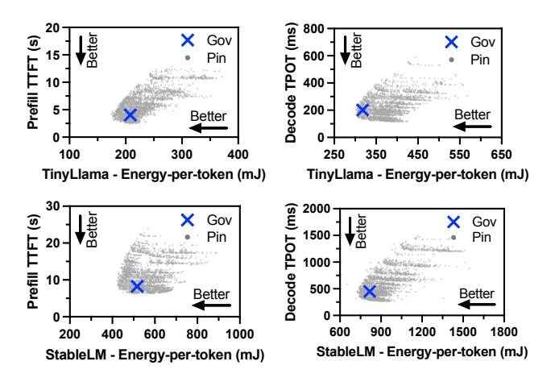

Figure 2: Comparison of inference latency and energy drain under default governors (Gov) and under different frequency combinations (Pin).

per prefill or decode token, calculated as  $P*TTFT/N_p$  and P\*TPOT for prefill and decode stages, respectively, where P denotes the average power consumption during the prefill or decode stage, and  $N_p$  denotes the prefill prompt length (number of tokens).

#### 4 Optimality of Mobile DVFS Governors

We begin our study by measuring the latency and energyefficiency of LLM inference under the default mobile DVFS governors (denoted as Gov), and under all CPU, GPU, and memory frequency combinations (denoted as Pin). Fig. 2 shows the latency and energy consumption of every frequency combination (grey dots) along with default governors ("x" markers) for LLM inference with 32 prefill tokens and 32 decode tokens using two different models. There are 18 \* 12 \* 13 = 2808 frequency combinations in total, as listed in Table 1. We found that among all Pin frequency combinations, many are able to achieve better inference latency and lower energy consumption at the same time (the lower left region of each figure) compared to the governors. With the same energy consumption as Gov, prefill TTFT and decode TPOT can be reduced by up to 40.4% and 31.8% for TinyLlama, and up to 23.0% and 37.1% for StableLM, respectively. On the other hand, with the same TTFT or TPOT as Gov, energy-per-token can be reduced by up to 14.9% and 5.0% in prefill and decode for TinyLlama; and up to 16.6% and 12.3% for StableLM, respectively.

To see the trend with different sequence lengths, we conduct additional experiments with prefill and decode lengths being 32, 64, 128, or 256 tokens (in total 16 combinations). Fig. 3 compares the end-to-end inference latency under Gov against the fastest Pin latency combination with the same energy consumption for the TinyLlama model, denoted as

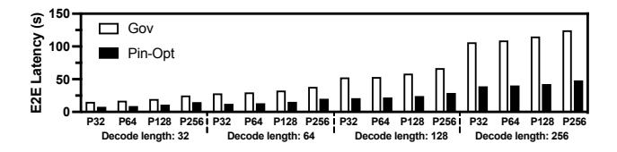

Figure 3: End-to-end inference latency of TinyLlama on mobile with default governors (Gov) compared with running at the optimal frequency combination (Pin-Opt) that consumes the same amount of energy as with default governors. P32, P64, P128, P256 refer to prefill length of 32, 64, 128, 256 tokens.

Pin-Opt. We see Pin-Opt consistently achieves shorter end-to-end latency. For instance, with 128 prefill tokens and 256 decode tokens, Pin reduces end-to-end latency from 115.15 seconds to 42.50 seconds (63% reduction). On average, end-to-end latency under Pin is 54.9% lower than under Gov across the 16 combinations.

In summary, the above results show that the energy efficiency and inference latency under the default governors are far from optimal.

#### 5 Understanding Impact of DVFS Governors

To understand the interplay (or lack thereof) among DVFS governors during LLM inference and its impact on inference performance and energy efficiency, we design controlled experiments to first isolate the behavior of individual governors and then examine their cascading effect on one another.

# 5.1 GPU Governor is only GPU-Energy Aware

To isolate the impact of GPU governor on LLM inference from other governors, we pin CPU and memory frequencies and compare LLM inference under the default GPU governor vs. when the GPU frequency is pinned to each available frequency using Pin. Due to page limit, we show results for prefill and decode lengths fixed to 32 tokens; the results for other prefill/decode length combinations are similar.

Since the actual GPU frequency under the default GPU governor can vary during an LLM inference, for intuitive comparison of results under the governor vs. under individual pinned GPU frequencies, we report a single, *effective frequency*, calculated as the weighted average of each observed frequency during inference, for each inference run under the governor; the weight for each frequency is the percentage of time the governor stays at that particular frequency.

**Decode.** In the first set of experiments, we pin the CPU and memory frequencies to fixed values. Fig. 4(a) upper half shows the decode TPOT vs. energy consumption per token under the GPU governor compared with when the GPU is pinned at each available frequency for various LLM models. Overall, the GPU governor fails to achieve either latency or

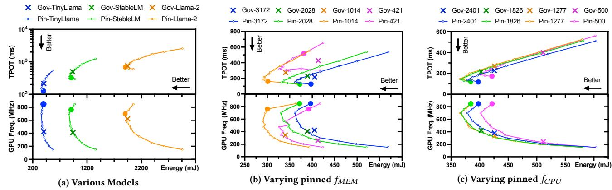

Figure 4: Decode latency and energy-per-token of the GPU governor (**Gov**) compared with pinning GPU at each available frequency (**Pin**). We set =1826 MHz in (a) and (b), and =3172 MHz in (a) and (c). Plots in (b) and (c) are for TinyLlama. The lowest-latency frequency combinations with the same energy drain as the GPU governor, **Pin-Opt**, is marked with .

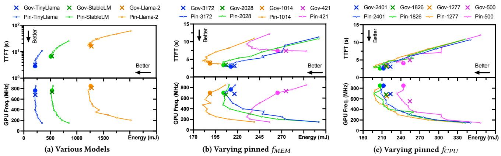

Figure 5: Prefill TTFT and energy-per-token of the GPU governor (**Gov**) compared with pinning the GPU at each available frequency (**Pin**). We set =1826 MHz in (a) and (b), and =3172 MHz in (a) and (c). Plots in (b) and (c) are for TinyLlama. The lowest-latency frequency combinations with the same energy drain as the GPU governor, **Pin-Opt**, is marked with .

energy optimality. For instance, it achieves 215.1 ms TPOT at 402.7 mJ per token for TinyLlama, while pinning the GPU at 848 MHz achieves 41.0% lower latency (126.9 ms) with similar energy drain (396.5 mJ). For StableLM, it achieves 495.0 ms TPOT at 937.5 mJ per token, while pinning the GPU at 762 MHz achieves 34.6% lower latency (323.6 ms) with similar energy drain (907.2 mJ). Alternatively, Pin achieves 7.0% and 7.6% lower energy with similar latency for the two models respectively.

To understand why the GPU governor cannot achieve the lowest TPOT, we plot the corresponding GPU frequencies for all the inference runs in Fig. [4\(](#page-5-0)a) lower half. We see that the GPU governor runs at overly low frequencies for TinyLlama and StableLM; the effective GPU frequencies for the two models are 424.4 MHz and 411.0 MHz, respectively.

The TPOT under the GPU governor for larger models is closer to the optimal. This is because decoding a larger model is more compute-intensive (with a decode length of 32 tokens, TPOT is dominated by MLP layers in LLM) and drives the

GPU to run at higher utilization, allowing the governor to boost the GPU frequency to be sufficiently high ([§2.3\)](#page-2-2). For instance, for Llama-2, the effective frequency under the GPU governor is 624.1 MHz and the TPOT is only 8.7% higher than the optimal GPU frequency constrained by the same energy consumption.

In the second set of experiments, we focus on the TinyLlama model and repeat the above experiments while varying the set of frequencies that the memory is pinned to. Fig. [4\(](#page-5-0)b) shows the results. We see when varying the pinned memory frequency, the GPU governor consistently chooses overly low frequencies which result in high TPOT and energy-pertoken. For instance, when the memory is pinned to a medium frequency of 1014 MHz, the effective GPU frequency under the GPU governor is 346.5 MHz, which achieves 273.9 ms TPOT and 340.0 mJ energy-per-token, while pinning the GPU at 762 MHz results in 41.0% lower TPOT (161.6 ms) and a similar energy consumption (300.4 mJ). Further, lower memory frequencies appear to lead the GPU governor to reduce

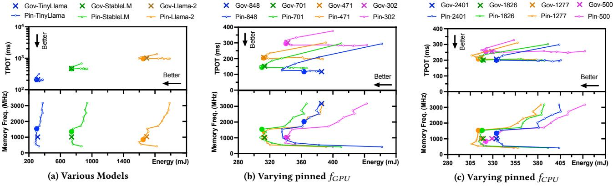

Figure 6: Decode latency and energy drain of the memory governor (**Gov**) compared with pinning memory at each available frequency (**Pin**). GPU and CPU frequencies are pinned at 471 MHz and 1826 MHz. Plots in (b) and (c) are for TinyLlama. The lowest-latency frequency combinations with the same energy drain as the memory governor, **Pin-Opt**, is marked with .

Figure 7: GPU utilization with pinning CPU at each available frequency and =701 MHz (left), and CPU utilization with pinning the GPU at each available frequency and =2188 MHz (right). Plots are for TinyLlama and =3172 MHz.

GPU frequency to maintain sufficient GPU utilization, e.g., the effective GPU frequencies under the GPU governor given 3172, 2028, 1014, and 421 MHz pinned memory frequencies are 424.4, 406.0, 346.5, and 259.7 MHz, respectively.

In the third set of experiments, we fix memory frequency and repeat the above experiments under varying pinned CPU frequency. As shown in Fig. [4\(](#page-5-0)c), medium to high CPU frequencies have limited impact on the GPU governor. Overly low CPU frequency, such as 500 MHz, causes the GPU governor to frequently choose lower GPU frequencies which results in high TPOT and energy-per-token compared to the optimal configuration (high GPU frequency).

The reason that the GPU governor tends to choose lower frequencies is that the decode stage exhibits low GPU utilization, prompting the governor to reduce the GPU frequency in trying to bring the utilization to the target range ([§2.3\)](#page-2-2). Fig. [7](#page-6-0) (left plot) illustrates the GPU utilization when the CPU is pinned at each available frequency. Even when the CPU is pinned to the highest frequency of 2850 MHz, the average GPU utilization remains at 70.9%, which is below the target range according to Fig. [1.](#page-2-0) As a result, the GPU governor lowers the GPU frequency.

Prefill. We repeat the above three sets of experiments for the prefill stage of LLM inference. The results are shown in Fig. [5.](#page-5-1) We make the following observations. (1) Fig. [5\(](#page-5-1)a) upper shows unlike decode, the GPU governor achieves close to optimal TTFT and energy-per-token for the three LLM models. This is because compared to decode, prefill enjoys higher GPU utilization due to token batching, which leads the GPU governor to choose sufficiently high frequencies, as shown in Fig. [5\(](#page-5-1)a) lower half. For instance, the effective GPU frequencies are 680.7, 738.8, and 811.3 MHz for TinyLlama, StableLM, and Llama-2, respectively; pinning the GPU frequency to the optimal frequency 762 MHz for TinyLlama only reduces the GPU governor's TTFT by 11.2%, from 3.2 to 2.9 seconds. (2) Fig. [5\(](#page-5-1)b) shows the GPU governor also achieves close to optimal TTFT and energy efficiency with various pinned memory frequencies, again from choosing high frequencies, e.g., the effective GPU frequencies for 2028, 1014, and 421 MHz pinned memory frequencies are 664.8, 682.1, and 733.3 MHz, respectively. (3) Fig. [5\(](#page-5-1)c) shows the GPU governor can achieve close to optimal TTFT and energy efficiency by choosing high GPU frequencies with various pinned CPU frequencies.

The reason that the GPU governor selects high frequencies is the elevated GPU utilization in the prefill stage, which prompts the GPU governor to choose high GPU frequencies. As shown in Fig. [7](#page-6-0) (left plot), when the CPU is pinned to a medium frequency of 2188 MHz, the average GPU utilization reaches 82.8%, which is within the target utilization range for the second highest GPU frequency of 762 MHz, according to Fig. [1.](#page-2-0)

Takeaways: The GPU governor which strives to meet a utilization target range tends to operate the GPU at overly low frequencies in the decode stage which results in long latency and low energy efficiency. In prefill, the GPU utilization is high, and the GPU governor can operate the GPU at sufficiently high frequencies to achieve near optimal TTFT and energy efficiency.

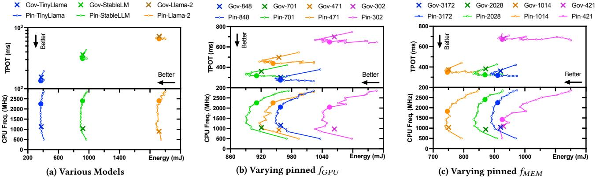

Figure 8: Decode latency and energy drain of EAS (**Gov**) compared with pinning CPU at each available frequency (**Pin**). We set = 3172 MHz in (a) and (b), and = 701 MHz in (a) and (c). Plots (b) and (c) are for StableLM. The lowest-latency frequency combinations with the same energy drain as EAS, **Pin-Opt**, is marked with .

# 5.2 Memory Governor

Next, we isolate the impact of the memory governor on LLM inference from other governors, by pinning CPU and memory frequencies and compare LLM inference under the default memory governor vs. when pinning the memory to each available frequency using Pin. Fig. [6](#page-6-1) shows the results for decode. We make the following observations. (1) Fig. [6\(](#page-6-1)a) shows the results for various models with pinned GPU and CPU frequencies at 471 MHz and 1826 MHz. We see the memory governor achieves near optimal inference latency and energy consumption per token. For example, for TinyLlama, it achieves 313.5 mJ energy-per-token and 152.4 ms TPOT, with an effective frequency of 1019.8 MHz. Only one pinned memory frequency, at 1539 MHz, slightly outperforms the memory governor under the same energy budget; it achieves 309.9 mJ energy per token and 145.1 ms TPOT (4.8% lower than the memory governor). (2) Similar trends can be observed when we focus on TinyLlama and vary the pinned GPU frequency (Fig. [6\(](#page-6-1)b)) or pinned CPU frequency (Fig. [6\(](#page-6-1)c)). One exception is observed in Fig. [6\(](#page-6-1)b), when the GPU is pinned at its highest frequency of 848 MHz. The memory governor constantly runs at the highest memory frequency (3172 MHz) in this case, resulting in high energy consumption (385.6 mJ per token and 118.2 ms TPOT) compared to the lowest-energy pinned memory frequency of 2028 MHz (363.4 mJ per token) with the same TPOT (117.3 ms) as the memory governor. Similar trends are observed in prefill, and results are omitted due to page limit.

Takeaways: When fixing the CPU/GPU frequencies, the default memory governor can achieve near optimal inference latency and energy consumption per token.

# 5.3 EAS is only CPU-Energy Aware

Although the mobile LLM framework offloads most computations to the GPU, as explained in [§2.2,](#page-2-3) the CPU still plays a

key role during inference and thus its frequency can directly impact inference performance and energy efficiency. We analyze EAS's impact by pinning GPU and memory frequencies in the following experiments.

Decode. Fig. [8](#page-7-0) compares inference performance in the decode stage under EAS with pinning the CPU at each available frequency. We observe that EAS consistently achieves higher TPOT and energy consumption compared to optimal pinned CPU frequency, regardless of model sizes (Fig. [8\(](#page-7-0)a)), pinned GPU frequencies (Fig. [8\(](#page-7-0)b)), or pinned memory frequencies (Fig. [8\(](#page-7-0)c)). For instance, when the GPU is pinned at a medium frequency of 471 MHz as shown in Fig. [8\(](#page-7-0)b), EAS achieves 955.1 mJ energy per token and 497.5 ms TPOT, while pinning the CPU at 2252 MHz results in 11.8% lower TPOT (438.6 ms) with a similar energy consumption (943.5 mJ). Even pinning the CPU at 1426 MHz results in 6.5% lower TPOT with lower energy-per-token (930.2 mJ).

The longer TPOT under EAS can be explaiend by how it chooses the CPU frequency. The lower half of above figures show that EAS consistently chooses lower CPU frequencies than the optimal pinned CPU frequency that achieves the same energy as EAS. For instance, the effective CPU frequencies for TinyLlama, StableLM, and Llama-2 are 1130.8, 1038.8, and 907.2 MHz, lower than the optimal pinned CPU frequency of 2252, 2401, and 2401 MHz, respectively. We also observe that CPU frequencies chosen by EAS follow a bimodal distribution pattern; EAS frequently switches between two values for roughly equal amount of time during inference: one medium frequency (e.g., 1426 MHz) and one low frequency (e.g., 851 or 500 MHz).

Prefill. For the prefill stage, similar to the decode stage, EAS consistently achieves higher TTFT (for the same energy budget) or higher energy consumption (for the same TTFT), regardless of model size, pinned GPU frequency, or pinned memory frequency, again due to consistently choosing low

Figure 9: CDF of the amount of time that GPU (left) or CPU (right) runs at a certain frequency under GPU governor or EAS, respectively. Results are collected in the decode phase with three models served by llama.cpp. We set =3172 MHz.

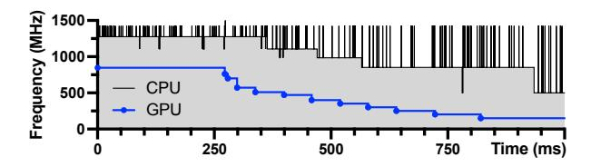

Figure 10: Runtime trace of CPU and GPU frequencies showing the antagonistic effect.

frequencies in all settings. Due to page limit, detailed results of prefill latency and energy drain under EAS compared with pinning the CPU at each available frequency are shown in Fig. [15](#page-14-0) in Appendix [A.](#page-13-18)

The reason that EAS governor chooses overly low frequencies is the low CPU utilization in either the prefill or decode stage. As shown in Fig. [7](#page-6-0) (right plot), even when the GPU is pinned to the highest frequency of 848 MHz, the average CPU utilizations for the prefill and decode stages under a pinned CPU frequency of 2188 MHz are 17.5% and 25.7%, causing the EAS governor to lower the CPU frequency.

Takeaways: EAS operates the CPU at overly low frequencies in both decode and prefill stages of LLM inference which degrades inference latency and energy efficiency.

# 5.4 Antagonistic EAS and GPU Governors

From [§5.1](#page-4-4) and [§5.3,](#page-7-1) we learned that both the GPU governor and EAS, when acting alone, tend to choose overly low frequencies, which result in higher inference latency (for the same energy budget) than the optimal pinned frequencies. These findings in turn raise an important question: when both governors operate concurrently, do they antagonistically affect each other, i.e., cascadingly driving both GPU and CPU frequencies lower in a downward spiral. Such bevahior could severely degrade inference performance and energy efficiency. We design controlled experiments to answer this question.

Lower CPU frequency leads to lower GPU frequency. We first pin the CPU frequency at different values and observe the trend of GPU frequencies chosen by the GPU governor during decode of various models. Figures [9\(](#page-8-0)a) show the distribution of time the GPU is at different frequencies during inference for each pinned CPU frequency. We see that as we lower the pinned CPU frequency from 2507 MHz to 500 MHz, the CDF curve of GPU frequencies clearly moves towards left, meaning that the GPU governor spends longer time at lower frequencies. For instance, while decoding TinyLlama, the most frequently chosen frequency by the GPU governor is 351 MHz (41% of the time) when the CPU is pinned at 2507 MHz, but is lowered to 202 MHz (44% of the total time) when the CPU is pinned at 500 MHz. Second, the trend is consistent across different models (Fig. [9\(](#page-8-0)a)). In decoding Llama-2, the GPU governor mostly operates at 701 MHz (82% of time) when the CPU is pinned at 2507 MHz, but at 471 MHz (67.6% of time) when the CPU is pinned at 500 MHz.

Lower GPU frequency leads to lower CPU frequency. Conversely, Figures [9\(](#page-8-0)b) show that lowering the pinned GPU frequency leads to EAS lowering the CPU frequencies chosen. As mentioned in [§5.3,](#page-7-1) the CPU frequency controlled by EAS usually fluctuates between two frequencies for roughly equal amount of time, resulting in two flat regions in the CDF curves in the figures. For example, with TinyLlama, EAS mostly chose 851 MHz CPU frequency (52.2% of the time) when the GPU is pinned to 762 MHz, but 500 MHz (52.9% of the time) when the GPU is pinned at 151 MHz. Further, this relationship is consistent across different models (Fig. [9\(](#page-8-0)b)).

The antagonistic effect. We further capture the antagonistic effect between EAS and GPU governors during LLM inference in real time and visualize it in Fig. [10.](#page-8-1) The GPU is pinned to the highest frequency of 848 MHz at the beginning, then unpinned after 250 ms (i.e., let the default GPU governor control GPU frequency). We let the default EAS governor control CPU frequencies throughout the experiment. As illustrated in Fig. [10,](#page-8-1) immediately after the GPU is unpinned, the GPU governor drops its frequency from 848 to 510 MHz in 4 steps between 250 and 338 ms. During this period, the CPU frequency is stabilized at 1277 MHz. At 363 ms, the CPU frequency drops from 1277 to 1106 MHz, which in turn drives the GPU governor to lower the GPU frequency from 510 to 471 MHz at 399 ms. The antagonistic effect continues, ultimately driving the GPU governor to lower the GPU frequency to its minimum of 151 MHz at 821 ms, and the CPU governor to lower its frequency to its minimum of 500 MHz at 935 ms. Due to page limit, the illustration of the antagonistic effect where the default GPU governor control the

GPU frequency while the CPU frequency is initially pinned and then unpinned is shown in Fig. [16](#page-14-1) in Appendix [B.](#page-14-2)

The root cause. The root cause of the antagonistic effect lies in the independent frequency scaling of each governor, as they attempt to meet their respective utilization targets. For instance, the GPU governor dynamically adjusts the GPU frequency to align GPU utilization with the vendor-defined target range (Fig. [1](#page-2-0) in [§2.3\)](#page-2-2). The antagonistic effect begins with low utilization of either component while running the inference engine. Suppose the CPU utilization is low, in response, the CPU governor lowers the CPU frequency to increase CPU utilization. However, the lower CPU frequency slows down the OpenCL runtime running on the CPU ([§2.2\)](#page-2-3), delaying issuing GPU tasks and hence reducing the GPU utilization (see next paragraph). To compensate, the GPU governor lowers the GPU frequency, further extending the waiting time between GPU task executions. This prolonged delay reduces CPU utilization, prompting the CPU governor to lower the CPU frequency even further, perpetuating the cycle.

To illustrate that lowering the frequency of one component lowers the utilization of the other component, Fig. [7](#page-6-0) shows the average CPU utilization when the GPU frequency is pinned at different levels, and GPU utilization when the CPU frequency is pinned at different levels. Results are collected while inferencing TinyLlama model on Pixel 7. In the decode stage, as CPU frequency decreases from 2850 MHz to 500 MHz, the average GPU utilization drops from 70.9% to 52.9%. Similarly, as GPU frequency decreases from 848 MHz to 151 MHz, the average CPU utilization drops from 25.7% to 7.9%.

Takeaways: EAS and the GPU governors can trigger a "downward spiral" by cascadingly driving each other to choose lower CPU/GPU frequencies. Avoiding such antagonistic effect between independently acting governors requires a holistic energyefficient governor for managing both the GPU and CPU.

# 6 FUSE: a Unified Energy-aware Governor

Motivated by the limitations of independent governors shown in [§5,](#page-4-1) we design FUSE, a unified energy-aware governor for optimizing the energy-efficiency of LLM inference on mobile devices. Given an LLM model, the goal of FUSE is to find and configure CPU/GPU/memory to run at the frequency combination that (G1) minimizes the inference latency given an energy budget[1](#page-9-1) , or (G2) minimizes the energy consumption given an inference latency target, i.e., TTFT for prefill and TPOT for decode.

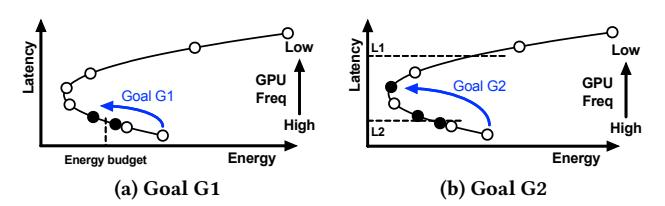

Figure 11: Selected GPU frequencies ( solid points) in Step 1.

Design overview. We observe that in LLM-powered personal services on mobile devices, the same LLM model (e.g., embedded in an APP or the OS [\[47\]](#page-13-19)) is typically used over an extended period of time. This motivates a simple, offlineprofiling-based approach. During APP or OS installation, FUSE efficiently searches for optimal frequency configurations for the prefill and decode stages. These configurations are then applied to every model inference at runtime, triggered by notifications from the inference framework indicating the start and end of these phases.

For efficient frequency search, we observe that the optimal frequency configuration for a given LLM model is input-content-agnostic and primarily affected by the prefill length. Based on this, FUSE categorizes prefill lengths into five distinct ranges, and performs frequency searches for one sampled decoding length and five representative prefill lengths-—one from each range. Below we detail the frequency search process for one setting.

# 6.1 Efficient Frequency Search

The design of FUSE's frequency search is motivated by the findings in [§5](#page-4-1) that (1) the default CPU/GPU governors tend to cascadingly drive each other's frequency down, (2) among GPU/CPU/memory frequencies, GPU frequency is the dominant factor affecting inference latency and energy efficiency for primarily GPU-based LLM inference. These observations motivate a two-step search process for optimal frequency combinations: (1) FUSE mitigates the antagonistic effect by first searching for optimal GPU frequencies, by pinning the GPU at candidate frequencies; (2) It fine-tunes the CPU frequency by exploring CPU frequencies while pinning the GPU at the selected GPU frequencies (at most two) from step 1. We leave the memory governor to its default settings as our findings in [§5.2](#page-7-2) indicate that it can achieve near-optimal inference latency and energy efficiency.

Step 1: GPU frequency search. To minimize inference latency given an energy budget (i.e., goal G1), since fixing CPU/memory frequencies, changing the GPU frequency results in a U-shape energy-per-token curve (as shown in Fig. [4\)](#page-5-0), our search begins from the highest GPU frequency and decrements it one step at a time. The search stops at the first GPU frequency that achieves a lower energy-per-token than the energy budget, as the following even lower GPU

1We assume the energy budget is input by the user, who could specify it in absolute terms, e.g., 40% battery level drop in 4 hours, or abstract terms such as low/medium/high.

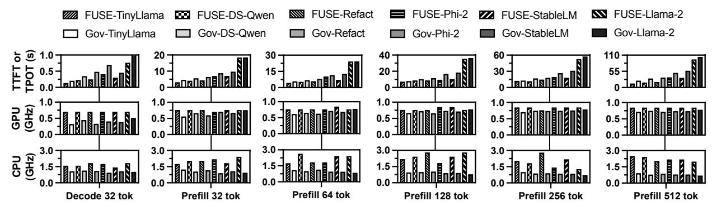

Figure 12: Performance comparison of FUSE with Gov (the default governors), for goal G1. Energy-per-token budget is the energy draw under the default governors.

frequencies will lead to higher inference latency even if they can meet the energy budget, as shown in Fig. 11a.

For a given GPU frequency, Fig. 8 and 15 showed that changing the CPU frequency results in a U-shape energy-per-token curve. Thus for G1, in step 1 FUSE takes both the first GPU frequency F whose energy is within the energy budget and the previous GPU frequency F' whose energy is above the energy budget, as there may exist CPU frequencies for F' that achieve a total energy within the energy budget.

To minimize energy consumption given an inference latency target (*i.e.*, goal **G2**), the search first finds the minimum-energy frequency, defined as the GPU frequency with the lowest energy draw with no latency constraint. The search starts from the highest GPU frequency and stops at the GPU frequency that draws more energy than the previous frequency, *i.e.*, the minimum-energy frequency, as shown in Fig. 11b. Next, if the latency target is higher than the latency at the minimum-energy frequency, *e.g.*, L1 in Fig. 11b, FUSE chooses the minimum-energy frequency; otherwise, it chooses two consecutive GPU frequencies whose latencies are higher and lower than the latency target, *e.g.*, L2 in Fig. 11b.

Step 2: CPU frequency search. Since the default CPU governor tends to run at overly-low frequencies (§5.3), for G1, in the second step, FUSE searches for the optimal CPU frequency while pinning the GPU at each (at most two) candidate GPU frequency chosen in Step 1. The search starts from the highest CPU frequency and stops at the first CPU frequency that achieves a lower energy-per-token than the energy budget. It then outputs the CPU/GPU frequency combination that achieves the lowest inference latency. Similarly, for G2, the search starts from the highest CPU frequency and stops at the first CPU frequency that achieves a higher latency than the latency target, and outputs the CPU/GPU frequency combination that achieves the lowest energy-per-token.

Table 2: Evaluated decoder models in llama.cpp.

| Model                         | #Layers | Hidden size | Size | Device      |
|-------------------------------|---------|-------------|------|-------------|
| TinyLlama [48]                | 22      | 2048        | 1.1B | Pixel 7     |
| DeepSeek-R1-Distill-Qwen [11] | 28      | 1536        | 1.5B | Pixel 7     |
| Smallcloudai Refact-fim       | 32      | 2048        | 1.6B | Pixel 7     |
| StableLM-Zephyr               | 32      | 2560        | 2.7B | Pixel 7     |
| Microsoft Phi-2               | 32      | 2560        | 2.7B | Pixel 7 pro |
| Meta Llama-2 [38]             | 32      | 4096        | 6.7B | Pixel 7 pro |

#### **6.2 Evaluation Results**

We prototyped FUSE on Android to support the *llama.cpp* [13] framework (version: tag b2202) in 2K lines of Python code. The same platform described in §3 is used to evaluate the performance of FUSE. We use the energy drain and inference latency under the default governors as the energy budget and latency target. We evaluate FUSE with a set of popular LLM models in 4-bit quantization as listed in Table 2.

**Dataset and baseline.** We randomly sample 200 requests from the ShareGPT dataset with prefill length no larger than 512 tokens and decode length no larger than 256 tokens (to fit the memory size of the test devices). The average prompt length and decode length of our sampled dataset are 232.4 and 70.0 tokens, respectively. The performance of FUSE is compared with that of the default governors, denoted as Gov.

Effectiveness of frequency search. We first evaluate the effectiveness of frequency search for the six settings (*i.e.*, decode with 32 tokens and prefill with {32, 64, 128, 256, 512} tokens). Fig. 12 compares FUSE's inference latency against that of Gov for goal G1. We see that while inferencing with the same energy-per-token as Gov, FUSE reduces TPOT and TTFT by 41.0% and 24.8% averaged across all models by running the CPU and GPU at the optimal frequency combination. For instance, while decoding DeepSeek-R1-Distill-Qwen (shortened as DS-Qwen) with the same energy-per-token (460.5 mJ with FUSE and 459.0 mJ with Gov), FUSE reduces TPOT by 33.8% (from 346.8 ms to 229.6 ms) by setting the GPU frequency at 701 MHz (compared to 448.5 MHz with Gov) and the CPU frequency at 1582 MHz (compared to 1134.5 MHz with Gov). Fig. 13 compares FUSE's inference

Figure 13: Energy-per-token comparison of FUSE with **Gov** (the default governors), for goal G2. Latency target is the TTFT or TPOT under the default governors.

energy-per-token against that of Gov for goal G2. We observe that while prefilling with the same TTFT as Gov or decoding with TPOT no higher than the that of Gov, FUSE reduces energy-per-token by 6.9% and 10.3% averaged across all models in the prefill and decode stage, respectively. Due to page limit, the CPU/GPU frequencies found by FUSE for goal G2 are shown in Fig. [17](#page-14-3) in Appendix [C.](#page-14-4)

Performance on real trace. For goal G1, Fig. [14](#page-11-1) top row compares FUSE's energy consumption and latency normalized against that of Gov in serving the 200 sampled inference requests from ShareGPT. For TinyLlama, while consuming the same amount of total energy (738.1 mAh with Gov and 737.8 mAh with FUSE), FUSE reduces average TTFT, TPOT, and E2E latency by 14.4% (from 10.56 to 9.04 s), 25.4% (from 210.7 to 157.2 ms), and 22.1% (from 25.2 to 19.6 s), respectively. Similarly, for DeepSeek-R1-Distill-Qwen, while consuming the same amount of total energy (1164.4 mAh with Gov and 1104.7 mAh with FUSE), FUSE reduces TTFT, TPOT and E2E latency by 16.9%, 36.8%, and 28.0%, respectively. For the larger 2.7B StableLM model, while consuming the same amount of total energy, FUSE reduces TTFT, TPOT and E2E latency by 7.0% (from 24.2 to 22.5 s), 35.2% (from 492.5 to 319.2 ms) and 24.7% (from 58.5 to 44.0 s), respectively.

For goal G2, for TinyLlama, while inferencing at the same target average TTFT (10.56 s with Gov and 10.22 s with FUSE), FUSE reduces the total energy draw by 8.9% (from 738.1 to 672.3 mAh). Note that FUSE's TPOT and E2E latency results are both lower than Gov, by 16.8% and 17.1% respectively. For DS-Qwen and StableLM models, while inferencing at the same average TTFT with lower TPOT and E2E latency, FUSE reduces the energy draw by 14.3% (from 1164.4 to 997.76 mAh) and 4.2% (from 1772.3 to 1698.6 mAh), respectively.

Search cost. For each model, FUSE performs profilingbased frequency search for each of the six settings for either goal G1 or G2. For goal G1, it only performs on average 2.4 and 5.1 inferences per setting (i.e., 14.5 and 30.8 inferences in total per model) across the 6 models in Step 1 and Step 2,

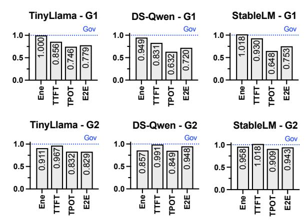

Figure 14: FUSE's energy consumption and performance normalized to default governors for goals G1 and G2 on the ShareGPT trace.

respectively—a reduction of 374x from the 2808 total CPU/G-PU/memory frequency combinations. Multiplied by perinference time, which differs across the models and settings, ranging from 23.4 to 104.0 seconds, frequency search finishes in 17.7, 43.1, and 78.5 minutes for all settings for TinyLlama, StableLM, and Llama-2 models. For goal G2, FUSE takes on average 3.6 and 4.8 inferences per setting (i.e., 21.8 and 28.8 inferences in total per model) in Step 1 and Step 2, averaged across the 6 models. It spends more steps in Step 1 than G1, in finding the minimum-energy GPU frequency. Multiplied by per-inference time, frequency search finishes in 19.7, 48.1, and 87.7 minutes for all settings for the models.

# 7 Related Work

Mobile LLM profiling and benchmarking. Laskaridis et al. [\[21\]](#page-12-2) performed the first systematic on-device LLM performance and energy efficiency profiling. Li et al. [\[22\]](#page-12-18) focused on profiling the accuracy, latency, and memory footprint of mobile LLM inferencing without power measurement. The benchmark from Xiao et al. [\[40\]](#page-13-20) covers many mobile devices and perspectives, including the impact of CPU scheduling on LLM inference performance. However, none of these works analyzed the impact of DVFS governors on LLM performance and energy efficiency.

Mobile LLM performance optimization. A number of works explored optimizing LLM inference on mobile devices. Firstly, several works proposed mobile-friendly LLM model designs or adaptations. These include optimizing the memory footprint of the LLM model via smaller LLM model architecture [\[25,](#page-12-0) [44\]](#page-13-2), model weight quantization [\[35\]](#page-13-1), and model reuse across different tasks [\[46\]](#page-13-3). On the other hand, the high memory footprint of LLM inference is tackled by designing mobile LLM inference frameworks that load model weights on-demand [\[14,](#page-12-1) [41,](#page-13-5) [43,](#page-13-6) [45\]](#page-13-7). Finally, special hardware, e.g., NPU, on mobile devices are utilized to improve the LLM

inference performance [\[42\]](#page-13-4). However none of the work study the energy consumption of LLM inference on mobile devices.

Mobile DVFS optimizations. Several prior works optimized DVFS for different scenarios, e.g., avoiding thermal throttling [\[20,](#page-12-19) [24,](#page-12-20) [34\]](#page-13-21), adapting to concurrent tasks [\[23\]](#page-12-21), and edge computing [\[28\]](#page-13-22). On the other hand, DVFS optimizations have been proposed for specific applications, e.g., DNN inference [\[18,](#page-12-22) [30,](#page-13-23) [49\]](#page-13-24), where optimal frequency combinations are searched. However, none of the previous work (including [\[15,](#page-12-23) [16,](#page-12-24) [31\]](#page-13-25)) have examined the intricate interplay among DVFS governors in mobile OSes and its impact on LLM inference performance and energy efficiency.

# 8 Conclusions

In this paper, we presented to our knowledge the first indepth study of the interplay of mobile CPU, GPU, and memory governors during LLM inference. Our study shows that the triplet governors used in mobile OSes such as Android can result in 23% to 40.4% longer prefilling and decoding latency compared to optimal combinations of CPU/GPU/memory frequencies under the same energy budget, or 5.0% to 16.6% more energy consumption under the same latency. Via controlled experiments, we further uncovered the root causes as (1) acting alone, these governors tend to choose lower frequencies, (2) acting concurrently, they can trigger a "downward spiral" of the CPU/GPU frequencies. Finally, we presented a unified energy-aware governor, FUSE, that is shown to reduce TTFT and TPOT of LLM inference by 7.0%-16.9% and 25.4%-36.8% on average for various mobile LLM models.

# References

- [1] AOSP. 2022. AOSP Kernel governor\_simpleinteractive.c. [https://android.googlesource.com/kernel/gs/+/refs/heads/android](https://android.googlesource.com/kernel/gs/+/refs/heads/android-gs-pantah-5.10-android13-qpr3/drivers/devfreq/google/governor_simpleinteractive.c)[gs-pantah-5.10-android13-qpr3/drivers/devfreq/google/governor\\_](https://android.googlesource.com/kernel/gs/+/refs/heads/android-gs-pantah-5.10-android13-qpr3/drivers/devfreq/google/governor_simpleinteractive.c) [simpleinteractive.c.](https://android.googlesource.com/kernel/gs/+/refs/heads/android-gs-pantah-5.10-android13-qpr3/drivers/devfreq/google/governor_simpleinteractive.c) Last accessed 18 Oct 2024.
- [2] AOSP. 2022. AOSP Kernel gs201-gpu.dtsi. [https://android.](https://android.googlesource.com/kernel/gs/+/refs/heads/android-gs-pantah-5.10-android13-qpr3/arch/arm64/boot/dts/google/gs201-gpu.dtsi) [googlesource.com/kernel/gs/+/refs/heads/android-gs-pantah-5.10](https://android.googlesource.com/kernel/gs/+/refs/heads/android-gs-pantah-5.10-android13-qpr3/arch/arm64/boot/dts/google/gs201-gpu.dtsi) [android13-qpr3/arch/arm64/boot/dts/google/gs201-gpu.dtsi.](https://android.googlesource.com/kernel/gs/+/refs/heads/android-gs-pantah-5.10-android13-qpr3/arch/arm64/boot/dts/google/gs201-gpu.dtsi) Last accessed 18 Oct 2024.
- [3] ARM. 2012. AMBA® AXI and ACE Protocol Specification. [https://developer.arm.com/-/media/Arm%20Developer%](https://developer.arm.com/-/media/Arm%20Developer%20Community/PDF/IHI0022H_amba_axi_protocol_spec.pdf?revision=71bd7c57-2ed7-487b-bc3e-68c4ab56fa5f&la=en&hash=6325311012DDADF238C35A6C0FD734E520754F82) [20Community/PDF/IHI0022H\\_amba\\_axi\\_protocol\\_spec.pdf?](https://developer.arm.com/-/media/Arm%20Developer%20Community/PDF/IHI0022H_amba_axi_protocol_spec.pdf?revision=71bd7c57-2ed7-487b-bc3e-68c4ab56fa5f&la=en&hash=6325311012DDADF238C35A6C0FD734E520754F82) [revision=71bd7c57-2ed7-487b-bc3e-68c4ab56fa5f&la=en&hash=](https://developer.arm.com/-/media/Arm%20Developer%20Community/PDF/IHI0022H_amba_axi_protocol_spec.pdf?revision=71bd7c57-2ed7-487b-bc3e-68c4ab56fa5f&la=en&hash=6325311012DDADF238C35A6C0FD734E520754F82) [6325311012DDADF238C35A6C0FD734E520754F82](https://developer.arm.com/-/media/Arm%20Developer%20Community/PDF/IHI0022H_amba_axi_protocol_spec.pdf?revision=71bd7c57-2ed7-487b-bc3e-68c4ab56fa5f&la=en&hash=6325311012DDADF238C35A6C0FD734E520754F82) Last accessed 5 Oct 2024.
- [4] ARM. 2015. Memory interface. [https://developer.arm.com/](https://developer.arm.com/documentation/100095/0003/Functional-Description/Interfaces/Memory-interface?lang=en) [documentation/100095/0003/Functional-Description/Interfaces/](https://developer.arm.com/documentation/100095/0003/Functional-Description/Interfaces/Memory-interface?lang=en) [Memory-interface?lang=en](https://developer.arm.com/documentation/100095/0003/Functional-Description/Interfaces/Memory-interface?lang=en) Last accessed 5 Oct 2024.
- [5] Sarbartha Banerjee. 2018. Characterization of smartphone governor strategies and making of a workload aware governor. Ph. D. Dissertation.
- [6] Sarbartha Banerjee and Lizy Kurian John. 2018. Characterization of Smartphone Governor Strategies. In Euro-Par. 120–134.
- [7] Tom B. Brown, Benjamin Mann, Nick Ryder, Melanie Subbiah, Jared Kaplan, Prafulla Dhariwal, Arvind Neelakantan, Pranav Shyam,

- Girish Sastry, Amanda Askell, Sandhini Agarwal, Ariel Herbert-Voss, Gretchen Krueger, Tom Henighan, Rewon Child, Aditya Ramesh, Daniel M. Ziegler, Jeffrey Wu, Clemens Winter, Christopher Hesse, Mark Chen, Eric Sigler, Mateusz Litwin, Scott Gray, Benjamin Chess, Jack Clark, Christopher Berner, Sam McCandlish, Alec Radford, Ilya Sutskever, and Dario Amodei. 2020. Language Models are Few-Shot Learners. arXiv[:2005.14165](https://arxiv.org/abs/2005.14165) [cs.CL]<https://arxiv.org/abs/2005.14165>
- [8] Mike Chan. 2012. cpufreq: New 'interactive' governor. [https://lkml.](https://lkml.org/lkml/2012/2/7/483) [org/lkml/2012/2/7/483](https://lkml.org/lkml/2012/2/7/483) Last accessed 5 Oct 2024.
- [9] Tom Conway. 2013. Why do I need an AMBA 5 CHI Memory Controller? [https://community.arm.com/arm-community](https://community.arm.com/arm-community-blogs/b/architectures-and-processors-blog/posts/why-do-i-need-an-amba-5-chi-memory-controller)[blogs/b/architectures-and-processors-blog/posts/why-do-i-need](https://community.arm.com/arm-community-blogs/b/architectures-and-processors-blog/posts/why-do-i-need-an-amba-5-chi-memory-controller)[an-amba-5-chi-memory-controller](https://community.arm.com/arm-community-blogs/b/architectures-and-processors-blog/posts/why-do-i-need-an-amba-5-chi-memory-controller) Last accessed 5 Oct 2024.
- [10] Jonathan Corbet. 2013. Per-entity load tracking. [https://lwn.net/](https://lwn.net/Articles/531853/) [Articles/531853/](https://lwn.net/Articles/531853/)
- [11] DeepSeek-AI. 2025. DeepSeek-R1: Incentivizing Reasoning Capability in LLMs via Reinforcement Learning. arXiv[:2501.12948](https://arxiv.org/abs/2501.12948) [cs.CL] [https:](https://arxiv.org/abs/2501.12948) [//arxiv.org/abs/2501.12948](https://arxiv.org/abs/2501.12948)
- [12] developer.android.com. 2015. Android Debug Bridge (adb). [https:](https://developer.android.com/tools/adb) [//developer.android.com/tools/adb](https://developer.android.com/tools/adb) Last accessed 5 Oct 2024.
- [13] Georgi Gerganov. 2024. llama.cpp. [https://github.com/ggerganov/](https://github.com/ggerganov/llama.cpp) [llama.cpp.](https://github.com/ggerganov/llama.cpp)
- [14] Liwei Guo, Wonkyo Choe, and Felix Xiaozhu Lin. 2023. STI: Turbocharge NLP Inference at the Edge via Elastic Pipelining. In ASPLOS. ACM, 791–803.
- [15] Xue-Xin He and Ya-Shu Chen. 2018. Deadline-aware Memory Scheduler and Governor for Heterogeneous Processors. In 2018 IEEE 16th International Conference on Industrial Informatics (INDIN). IEEE, 239– 244.
- [16] Chen-Ying Hsieh, Jurn-Gyu Park, Nikil Dutt, and Sung-Soo Lim. 2015. Memory-aware cooperative CPU-GPU DVFS governor for mobile games. In 2015 13th IEEE Symposium on Embedded Systems For Realtime Multimedia (ESTIMedia). IEEE, 1–8.
- [17] Xiaotang Jiang, Huan Wang, Yiliu Chen, Ziqi Wu, Lichuan Wang, Bin Zou, Yafeng Yang, Zongyang Cui, Yu Cai, Tianhang Yu, Chengfei Lv, and Zhihua Wu. 2020. MNN: A Universal and Efficient Inference Engine. In MLSys.
- [18] Meruyert Karzhaubayeva, Aidar Amangeldi, and Jurn-Gyu Park. 2023. CNN Workloads Characterization and Integrated CPU–GPU DVFS Governors on Embedded Systems. IEEE Embedded Systems Letters 15, 4 (2023), 202–205. [doi:10.1109/LES.2023.3299335](https://doi.org/10.1109/LES.2023.3299335)
- [19] kernel.org. 2015. Energy Aware Scheduling. [https://www.kernel.](https://www.kernel.org/doc/html/latest/scheduler/sched-energy.html) [org/doc/html/latest/scheduler/sched-energy.html](https://www.kernel.org/doc/html/latest/scheduler/sched-energy.html) Last accessed 5 Oct 2024.
- [20] Seyeon Kim, Kyungmin Bin, Sangtae Ha, Kyunghan Lee, and Song Chong. 2021. zTT: learning-based DVFS with zero thermal throttling for mobile devices. In MobiSys. ACM, 41–53.
- [21] Stefanos Laskaridis, Kleomenis Katevas, Lorenzo Minto, and Hamed Haddadi. 2024. MELTing point: Mobile Evaluation of Language Transformers. In MobiCom.
- [22] Xiang Li, Zhenyan Lu, Dongqi Cai, Xiao Ma, and Mengwei Xu. 2024. Large Language Models on Mobile Devices: Measurements, Analysis, and Insights. In EdgeFM@MobiSys. ACM, 1–6.
- [23] Chengdong Lin, Kun Wang, Zhenjiang Li, and Yu Pu. 2023. A Workload-Aware DVFS Robust to Concurrent Tasks for Mobile Devices. In Mobi-Com. ACM, 19:1–19:16.
- [24] Di Liu, Shi-Gui Yang, Zhenli He, Mingxiong Zhao, and Weichen Liu. 2022. CARTAD: Compiler-Assisted Reinforcement Learning for Thermal-Aware Task Scheduling and DVFS on Multicores. IEEE Trans. Comput. Aided Des. Integr. Circuits Syst. 41, 6 (2022), 1813–1826.
- [25] Zechun Liu, Changsheng Zhao, Forrest N. Iandola, Chen Lai, Yuandong Tian, Igor Fedorov, Yunyang Xiong, Ernie Chang, Yangyang Shi,

- Raghuraman Krishnamoorthi, Liangzhen Lai, and Vikas Chandra. 2024. MobileLLM: Optimizing Sub-billion Parameter Language Models for On-Device Use Cases. In ICML.
- [26] msoon.com. 2015. Monsoon Power Monitor. [https://www.msoon.](https://www.msoon.com/high-voltage-power-monitor) [com/high-voltage-power-monitor](https://www.msoon.com/high-voltage-power-monitor) Last accessed 5 Oct 2024.
- [27] Cedric Nugteren. 2018. CLBlast: A Tuned OpenCL BLAS Library. In IWOCL. 5:1–5:10.
- [28] Saroj Kumar Panda, Man Lin, and Ti Zhou. 2023. Energy-Efficient Computation Offloading With DVFS Using Deep Reinforcement Learning for Time-Critical IoT Applications in Edge Computing. IEEE Internet Things J. 10, 8, April 15 (2023), 6611–6621.
- [29] Heejin Park and Felix Xiaozhu Lin. 2022. GPUReplay: a 50-KB GPU stack for client ML. In ASPLOS. 157–170.
- [30] Jurn-Gyu Park, Nikil Dutt, and Sung-Soo Lim. 2017. ML-Gov: A machine learning enhanced integrated CPU-GPU DVFS governor for mobile gaming. In Proceedings of the 15th IEEE/ACM Symposium on Embedded Systems for Real-Time Multimedia. 12–21.
- [31] Jurn-Gyu Park, Chen-Ying Hsieh, Nikil Dutt, and Sung-Soo Lim. 2015. Cooperative CPU-GPU frequency capping (Co-Cap) for energy efficient mobile gaming. UCI Center for Embedded and Cyber-physical Systems TR (2015).
- [32] Pratyush Patel, Esha Choukse, Chaojie Zhang, Aashaka Shah, Íñigo Goiri, Saeed Maleki, and Ricardo Bianchini. 2024. Splitwise: Efficient Generative LLM Inference Using Phase Splitting. In ISCA. 118–132.
- [33] Saber. 2015. [REF][GUIDE]Saber's guide on CPU governors, I/O schedulers and more! [https://xdaforums.com/t/ref-guide-sabers-guide-on](https://xdaforums.com/t/ref-guide-sabers-guide-on-cpu-governors-i-o-schedulers-and-more.3048957/)[cpu-governors-i-o-schedulers-and-more.3048957/](https://xdaforums.com/t/ref-guide-sabers-guide-on-cpu-governors-i-o-schedulers-and-more.3048957/) Last accessed 5 Oct 2024.
- [34] Onur Sahin, Lothar Thiele, and Ayse K. Coskun. 2019. Maestro: Autonomous QoS Management for Mobile Applications Under Thermal Constraints. IEEE Trans. Comput. Aided Des. Integr. Circuits Syst. 38, 8 (2019), 1557–1570.
- [35] Fuwen Tan, Royson Lee, Łukasz Dudziak, Shell Xu Hu, Sourav Bhattacharya, Timothy Hospedales, Georgios Tzimiropoulos, and Brais Martinez. 2024. MobileQuant: Mobile-friendly Quantization for Ondevice Language Models. arXiv[:2408.13933](https://arxiv.org/abs/2408.13933) [cs.CL] [https://arxiv.org/](https://arxiv.org/abs/2408.13933) [abs/2408.13933](https://arxiv.org/abs/2408.13933)
- [36] MLC team. 2023. MLC-LLM.<https://github.com/mlc-ai/mlc-llm>
- [37] Hugo Touvron, Thibaut Lavril, Gautier Izacard, Xavier Martinet, Marie-Anne Lachaux, Timothée Lacroix, Baptiste Rozière, Naman Goyal, Eric Hambro, Faisal Azhar, Aurelien Rodriguez, Armand Joulin, Edouard Grave, and Guillaume Lample. 2023. LLaMA: Open and Efficient Foundation Language Models. arXiv[:2302.13971](https://arxiv.org/abs/2302.13971) [cs.CL] [https://arxiv.](https://arxiv.org/abs/2302.13971) [org/abs/2302.13971](https://arxiv.org/abs/2302.13971)
- [38] Hugo Touvron, Louis Martin, Kevin Stone, Peter Albert, Amjad Almahairi, Yasmine Babaei, Nikolay Bashlykov, Soumya Batra, Prajjwal Bhargava, Shruti Bhosale, Dan Bikel, Lukas Blecher, Cristian Canton Ferrer, Moya Chen, Guillem Cucurull, David Esiobu, Jude Fernandes, Jeremy Fu, Wenyin Fu, Brian Fuller, Cynthia Gao, Vedanuj Goswami, Naman Goyal, Anthony Hartshorn, Saghar Hosseini, Rui Hou, Hakan Inan, Marcin Kardas, Viktor Kerkez, Madian Khabsa, Isabel Kloumann, Artem Korenev, Punit Singh Koura, Marie-Anne Lachaux, Thibaut Lavril, Jenya Lee, Diana Liskovich, Yinghai Lu, Yuning Mao, Xavier Martinet, Todor Mihaylov, Pushkar Mishra, Igor Molybog, Yixin Nie, Andrew Poulton, Jeremy Reizenstein, Rashi Rungta, Kalyan Saladi, Alan Schelten, Ruan Silva, Eric Michael Smith, Ranjan Subramanian, Xiaoqing Ellen Tan, Binh Tang, Ross Taylor, Adina Williams, Jian Xiang Kuan, Puxin Xu, Zheng Yan, Iliyan Zarov, Yuchen Zhang, Angela Fan, Melanie Kambadur, Sharan Narang, Aurelien Rodriguez, Robert Stojnic, Sergey Edunov, and Thomas Scialom. 2023. Llama 2: Open Foundation and Fine-Tuned Chat Models. arXiv[:2307.09288](https://arxiv.org/abs/2307.09288) [cs.CL] <https://arxiv.org/abs/2307.09288>

- [39] Ashish Vaswani, Noam Shazeer, Niki Parmar, Jakob Uszkoreit, Llion Jones, Aidan N. Gomez, Lukasz Kaiser, and Illia Polosukhin. 2017. Attention is All you Need. In NIPS. 5998–6008.
- [40] Jie Xiao, Qianyi Huang, Xu Chen, and Chen Tian. 2024. Large Language Model Performance Benchmarking on Mobile Platforms: A Thorough Evaluation. arXiv[:2410.03613](https://arxiv.org/abs/2410.03613) [cs.LG]<https://arxiv.org/abs/2410.03613>
- [41] Daliang Xu, Wangsong Yin, Xin Jin, Ying Zhang, Shiyun Wei, Mengwei Xu, and Xuanzhe Liu. 2023. LLMCad: Fast and Scalable On-device Large Language Model Inference. arXiv[:2309.04255](https://arxiv.org/abs/2309.04255) [cs.NI] [https:](https://arxiv.org/abs/2309.04255) [//arxiv.org/abs/2309.04255](https://arxiv.org/abs/2309.04255)
- [42] Daliang Xu, Hao Zhang, Liming Yang, Ruiqi Liu, Gang Huang, Mengwei Xu, and Xuanzhe Liu. 2024. Empowering 1000 tokens/second on-device LLM prefilling with mllm-NPU. arXiv[:2407.05858](https://arxiv.org/abs/2407.05858) [cs.AI] <https://arxiv.org/abs/2407.05858>
- [43] Zhenliang Xue, Yixin Song, Zeyu Mi, Le Chen, Yubin Xia, and Haibo Chen. 2024. PowerInfer-2: Fast Large Language Model Inference on a Smartphone. arXiv[:2406.06282](https://arxiv.org/abs/2406.06282) [cs.LG] [https://arxiv.org/abs/2406.](https://arxiv.org/abs/2406.06282) [06282](https://arxiv.org/abs/2406.06282)
- [44] Yuan Yao, Tianyu Yu, Ao Zhang, Chongyi Wang, Junbo Cui, Hongji Zhu, Tianchi Cai, Haoyu Li, Weilin Zhao, Zhihui He, Qianyu Chen, Huarong Zhou, Zhensheng Zou, Haoye Zhang, Shengding Hu, Zhi Zheng, Jie Zhou, Jie Cai, Xu Han, Guoyang Zeng, Dahai Li, Zhiyuan Liu, and Maosong Sun. 2024. MiniCPM-V: A GPT-4V Level MLLM on Your Phone. arXiv[:2408.01800](https://arxiv.org/abs/2408.01800) [cs.CV]<https://arxiv.org/abs/2408.01800>
- [45] Rongjie Yi, Liwei Guo, Shiyun Wei, Ao Zhou, Shangguang Wang, and Mengwei Xu. 2023. EdgeMoE: Fast On-Device Inference of MoE-based Large Language Models. arXiv[:2308.14352](https://arxiv.org/abs/2308.14352) [cs.LG] [https://arxiv.org/](https://arxiv.org/abs/2308.14352) [abs/2308.14352](https://arxiv.org/abs/2308.14352)
- [46] Jinliang Yuan, Chen Yang, Dongqi Cai, Shihe Wang, Xin Yuan, Zeling Zhang, Xiang Li, Dingge Zhang, Hanzi Mei, Xianqing Jia, Shangguang Wang, and Mengwei Xu. 2024. Mobile Foundation Model as Firmware. In MobiCom. ACM, 279–295.
- [47] Jinliang Yuan, Chen Yang, Dongqi Cai, Shihe Wang, Xin Yuan, Zeling Zhang, Xiang Li, Dingge Zhang, Hanzi Mei, Xianqing Jia, Shangguang Wang, and Mengwei Xu. 2024. Mobile Foundation Model as Firmware. In MobiCom. ACM, 279–295.
- [48] Peiyuan Zhang, Guangtao Zeng, Tianduo Wang, and Wei Lu. 2024. TinyLlama: An Open-Source Small Language Model. arXiv[:2401.02385](https://arxiv.org/abs/2401.02385) [cs.CL]
- [49] Ziyang Zhang, Yang Zhao, Huan Li, Changyao Lin, and Jie Liu. 2024. DVFO: Learning-Based DVFS for Energy-Efficient Edge-Cloud Collaborative Inference. IEEE Trans. Mob. Comput. 23, 10 (2024), 9042–9059.
- [50] Yinmin Zhong, Shengyu Liu, Junda Chen, Jianbo Hu, Yibo Zhu, Xuanzhe Liu, Xin Jin, and Hao Zhang. 2024. DistServe: Disaggregating Prefill and Decoding for Goodput-optimized Large Language Model Serving. In OSDI. 193–210.

# Appendix

# A: Additional EAS Governor Results

In [§5.3,](#page-7-1) we analyzed EAS's impact on LLM inference by pinning GPU and memory frequencies for the decode stage. Here we show the results for the prefill stage.

Prefill. For the prefill stage, similar to the decode stage, EAS consistently achieves higher TTFT (for the same energy budget) or energy consumption (for the same TTFT), regardless of model sizes (Fig. [15\(](#page-14-0)a)), pinned GPU frequencies (Fig. [15\(](#page-14-0)b), or pinned memory frequencies (Fig. [15\(](#page-14-0)c)), due to consistently choosing low frequencies in all settings,

Figure 15: Prefill latency and energy drain of EAS (**Gov**) compared with pinning the CPU at each available frequency (**Pin**). We set = 3172 MHz in (a) and (b), and set = 701 MHz in (a) and (c). Results in (b) and (c) are for StableLM. **Pin-Opt** is marked with " ".

as shown in the lower half of Fig. [15.](#page-14-0) For instance, the TTFT under EAS for TinyLlama, StableLM, and Llama-2 are 3.6, 7.8, and 16.8 seconds, which can be reduced by 18.9%, 16.2%, and 11.2% by pinning CPU to the optimal frequencies of 2802, 2802, and 1426 MHz with a similar energy consumption, respectively. The longer TTFT under EAS can be explained by the fact that EAS chooses overly low CPU frequencies. Specifically, the effective CPU frequencies for three models are 870.7, 858.2, and 763.4 MHz.

# B: Additional Antagonistic Effect Results

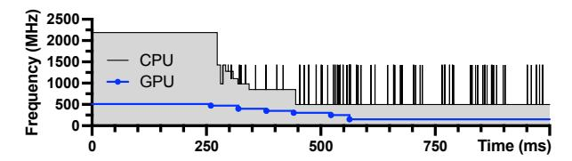

Figure 16: Runtime trace of CPU and GPU frequencies showing the antagonistic effect.

In [§5.4,](#page-8-2) we demonstrated the antagonistic effect between the EAS and GPU governors in real time by pinning and unpinning the GPU frequency.

To further illustrate the antagonistic effect between the EAS and GPU governors, we let the default GPU governor control GPU frequencies throughout the experiment and pin the CPU to 2188 MHz at the beginning, then unpin it at 250 ms, i.e., let the default EAS governor control CPU frequencies. As illustrated in Fig. [16,](#page-14-1) immediately after the CPU is unpinned, the CPU governor drops its frequency from 2188 to 984 MHz at 287 ms. During this period, the GPU frequency is at 471 MHz. At 320 ms, the GPU frequency drops from 471 to 400 MHz, which in turn drives the CPU governor to lower the CPU frequency from 984 to 851 MHz at 343 ms. The antagonistic effect continues, ultimately driving the CPU governor to lower its frequency to its minimum of 500 MHz at 445 ms, and the GPU governor to lower its frequency to its minimum of 151 MHz at 563 ms.

# C: Additional Evaluation Results for Goal G2

Figure 17: CPU/GPU frequency comparison of FUSE with **Gov** (the default governors), for goal G2. Latency target is the TTFT or TPOT under the default governors.

Fig. [17](#page-14-3) shows the CPU/GPU frequencies that correspond to the energy-per-token results previously presented in Fig. [13.](#page-11-0) We see that while inferencing with the same TTFT as Gov, FUSE reduces the energy-per-token by searching and setting the CPU/GPU to the optimal frequency combination. For example, while prefilling 32 tokens with DeepSeek-R1-Distill-Qwen (shortened as DS-Qwen), by setting the GPU and CPU

frequencies to 572 and 2048 MHz (compared to 663.4 and 1045.6 MHz with Gov), FUSE reduces the energy-per-token by 10.3% (from 310.3 to 278.2 mJ) while inferencing at the same or lower TTFT (5.6 s with Gov and 5.4 s with FUSE). While decoding 32 tokens with DS-Qwen, by setting the GPU

and CPU frequencies to 471 and 851 MHz (compared to 448.5 and 1134.5 MHz with Gov), FUSE reduces the energy-pertoken by 7.8% (from 459.0 to 423.3 mJ) while inferencing at the same or lower TPOT (346.8 ms with Gov and 298.4 ms with FUSE).