*Article*

# **Performance and Efficiency Gains of NPU‑Based Servers over GPUs for AI Model Inference †**

**Youngpyo Hong and Dongsoo Kim\***

Department of Industrial and Information Systems Engineering, Soongsil University, Seoul 06978, Republic of Korea; ypyohong@soongsil.ac.kr

- **\*** Correspondence: dskim@ssu.ac.kr
- † This paper is a substantially extended version of a preliminary abstract presented at the 19th International Conference on Innovative Computing, Information and Control (ICICIC 2025), Kitakyushu, Japan, 29 August 2025.

#### **Abstract**

The exponential growth of AI applications has intensified the demand for efficient infer‑ ence hardware capable of delivering low‑latency, high‑throughput, and energy‑efficient performance. This study presents a systematic, empirical comparison of GPU‑ and NPU‑ based server platforms across key AI inference domains: text‑to‑text, text‑to‑image, multi‑ modal understanding, and object detection. We configure representative models—LLama‑ family for text generation, Stable Diffusion variants for image synthesis, LLaVA‑NeXT for multimodal tasks, and YOLO11 series for object detection—on a dual NVIDIA A100 GPU server and an eight‑chip RBLN‑CA12 NPU server. Performance metrics including latency, throughput, power consumption, and energy efficiency are measured under realistic work‑ loads. Results demonstrate that NPUs match or exceed GPU throughput in many inference scenarios while consuming 35–70% less power. Moreover, optimization with the vLLM li‑ brary on NPUs nearly doubles the tokens‑per‑second and yields a 92% increase in power efficiency. Our findings validate the potential of NPU‑based inference architectures to re‑ duce operational costs and energy footprints, offering a viable alternative to the prevailing GPU‑dominated paradigm.

**Keywords:** AI inference; Neural Processing Unit (NPU); Graphics Processing Unit (GPU); performance benchmarking; energy efficiency; heterogeneous computing; vLLM optimization

Academic Editor: Fernando De la Prieta Pintado

Received: 29 July 2025 Revised: 3 September 2025 Accepted: 5 September 2025 Published: 11 September 2025

**Citation:** Hong, Y.; Kim, D. Performance and Efficiency Gains of NPU‑Based Servers over GPUs for AI Model Inference. *Systems* **2025**, *13*, 797. [https://doi.org/10.3390/](https://doi.org/10.3390/systems13090797) [systems13090797](https://doi.org/10.3390/systems13090797)

**Copyright:** © 2025 by the authors. Licensee MDPI, Basel, Switzerland. This article is an open access article distributed under the terms and conditions of the Creative Commons Attribution (CC BY) license ([https://creativecommons.org/](https://creativecommons.org/licenses/by/4.0/) [licenses/by/4.0/\)](https://creativecommons.org/licenses/by/4.0/).

# **1. Introduction**

A preliminary version of this study was presented at the 19th International Confer‑ ence on Innovative Computing, Information and Control (ICICIC 2025)[[1\]](#page-22-0). Only the ab‑ stract was published in the conference proceedings; no figures or tables were reused. The present manuscript is a significantly extended version, including comprehensive bench‑ marking, vLLM‑based optimization, and a detailed comparative analysis of GPU‑ and NPU‑based inference.

Driven by the rapid advancement of artificial intelligence (AI) technologies, industry‑ wide efforts are underway to enhance productivity through the deployment of diverse AI models. Nevertheless, the monopolistic AI ecosystem dominated by NVIDIA's GPU‑ CUDA architecture has emerged as a critical barrier to business innovation through the widespread adoption of AI services. During the period from 2024 through to the first quarter of 2025, NVIDIA commanded approximately 92% of the data‑center GPU segment within the AI market, underscoring its overwhelming dominance [\[2](#page-22-1)].

*Systems* **2025**, *13*, 797 2 of 24

Modern AI systems require distinct computational approaches for training and in‑ ference phases, each with unique characteristics that influence hardware architecture de‑ cisions. The training phase involves computationally intensive operations including for‑ ward propagation, backpropagation, and gradient optimization across massive datasets. This phase demands high‑precision arithmetic (typically FP32 or FP16), extensive mem‑ ory bandwidth, and sustained parallel processing capabilities to handle batch operations efficiently[[3\]](#page-23-0). Training workloads are characterized by their iterative nature, requiring multiple epochs over large datasets and frequent parameter updates, making them well‑ suited for Graphics Processing Units (GPUs) with their thousands of cores and high mem‑ ory throughput[[4\]](#page-23-1).

In contrast, the inference phase focuses on applying trained models to new data through forward‑pass computations with significantly reduced computational require‑ ments. Inference operations primarily involve matrix multiplications and convolutions that can benefit from quantization techniques (INT8, INT4) to reduce memory footprint and computational complexity while maintaining acceptable accuracy[[5\]](#page-23-2). The inference phase prioritizes low latency, energy efficiency, and real‑time processing capabilities, mak‑ ing it ideal for specialized Neural Processing Units (NPUs) that are optimized for these specific requirements [\[6](#page-23-3)].

This computational dichotomy has led to the development of heterogeneous AI ar‑ chitectures where GPUs handle the computationally intensive training phase in data cen‑ ters or high‑performance computing environments, while NPUs manage the inference phase on edge devices or embedded systems. NPUs leverage systolic array architectures, specialized tensor processing units, and efficient memory hierarchies to achieve superior performance‑per‑Watt ratios for inference tasks[[7\]](#page-23-4). The architectural specialization en‑ ables NPUs to deliver up to 58.6% faster matrix‑vector multiplication performance com‑ pared to GPUs while consuming significantly less power (35 W vs. 75 W) [\[5](#page-23-2)].

The detailed differences between training and inference characteristics are shown in Table [1](#page-1-0) [[8\]](#page-23-5).

**Characteristics Training Inference** Primary Purpose Model parameter learning and optimization Real‑time prediction generation Computational Intensity Very high (multi‑epoch iterations) Moderate (single forward pass) Processing Pattern Batch processing with large datasets Single sample or micro‑batch processing Resource Requirements Extensive compute, memory, and storage Moderate compute, optimized for efficiency Precision Requirements High (FP32/FP16 for stability) Flexible (INT8/INT4 quantization) Latency Constraints Relaxed (batch processing) Critical (real‑time response) Energy Consumption High (sustained computation) Low (efficient operation) Optimization Priority Throughput maximization Latency minimization, energy efficiency Typical Environment Data centers, cloud computing Edge devices, embedded systems

Hardware Preference GPU (high throughput) NPU (Low latency, power efficient)

**Table 1.** Comparison of training and inference characteristics.

NPUs have been extensively employed to accelerate deep learning inference, demon‑ strating their significant potential in AI hardware‑acceleration systems.

On‑device deep learning must satisfy strict latency, power, and thermal constraints while preserving model accuracy. Recent work converges on a cross‑layer, NPU‑centric co‑design agenda spanning hardware, runtime, compiler, and model techniques. Foun‑ dational guidance appears in studies of mobile deployments that align CNN/Transformer compute patterns with NPU dataflows, emphasizing on‑chip buffer reuse, DMA overlap, and heterogeneous CPU–GPU–NPU cooperation as first‑class design principles[[9\]](#page-23-6). Build‑ ing on this base, real‑time workloads such as object detection motivate multi‑NPU execu‑ tion with operator‑level placement, pipeline/model parallelism, and dynamic control of

*Systems* **2025**, *13*, 797 3 of 24

batch size, tiling, and prefetch to reduce critical‑path latency and tail behavior under con‑ tention [\[10](#page-23-7)].

System support for multi‑tenant and mixed‑criticality scenarios introduces virtualiza‑ tion layers that provide isolation and QoS, manage context switch costs and weight/activati‑ on lifecycles, and enable priority‑aware preemption over shared DMA and memory resources—capabilities that complement multi‑NPU scheduling to meet SLOs[[11\]](#page-23-8). To ad‑ dress memory‑bound bottlenecks in LLM inference, heterogeneous designs couple NPUs with PIM so that compute‑dense matrix kernels and bandwidth‑intensive KV‑cache opera‑ tions are decoupled and co‑scheduled, with communication‑aware tensor/layer partition‑ ing mitigating interconnect overheads[[12\]](#page-23-9).

For fast on‑device LLMs, NPU‑oriented pipelines integrate low‑bit quantization, cache‑efficient attention, token‑level microbatching, and speculative or selective decod‑ ing, while restructuring kernels to respect NPU memory hierarchies and variable sequence lengths [\[6](#page-23-3)]. Quantization studies systematically map the accuracy–latency–energy trade space on NPUs, contrasting PTQ vs. QAT, per‑tensor vs. per‑channel scaling, and cali‑ bration/clipping choices in the context of operator coverage and real‑time constraints [\[13](#page-23-10)]. Finally, compiler research exposes a large layer‑wise optimization space—tiling, fusion, kernel selection, and memory layout—navigated via hybrid cost models with runtime feedback, and positioned to co‑evolve with quantization, virtualization policies, and multi‑ NPU schedulers[[14\]](#page-23-11).

However, NPU performance has thus far been reported only through fragmentary benchmark figures, and there is a paucity of practical studies that quantitatively com‑ pare GPU‑ and NPU‑based servers across diverse AI models to validate the feasibility of NPU adoption. Accordingly, this study conducts a systematic performance compari‑ son between GPU and NPU platforms across major AI domains—including text‑to‑text, text‑to‑image, multimodal, and object detection tasks—to empirically evaluate whether NPU‑based inference environments can serve as an efficient and effective alternative to overcome the current GPU monopoly.

This paper presents an empirical analysis of various performance metrics, including latency and power efficiency, of GPUs and NPUs during the inference of diverse AI models. The objective is to assess whether NPUs can serve as a valid and effective alternative to GPUs for inference tasks in the context of AI acceleration.

## **2. Proposed Architecture for AI Model Inference**

Figure [1](#page-3-0) illustrates the proposed heterogeneous computing architecture that strate‑ gically separates AI model training and inference phases to optimize computational ef‑ ficiency and resource utilization. The architecture employs a dual‑hardware approach where the training phase leverages Graphics Processing Units (GPUs) for their superior parallel processing capabilities, as required for computationally intensive model training operations, while the inference phase utilizes Neural Processing Units (NPUs) specifically designed for optimized neural network execution.

The proposed system architecture consists of two distinct computational domains: the training domain (depicted in green) and the inference domain (depicted in blue). In the training domain, the AI model undergoes iterative learning processes on GPU hardware, benefiting from the massive parallel computational power essential for gradient‑based op‑ timization algorithms. Upon completion of the training phase, the model undergoes a compilation process, indicated by the red transition phase, which transforms the trained model into an optimized format suitable for efficient execution on NPU hardware.

*Systems* **2025**, *13*, 797 4 of 24

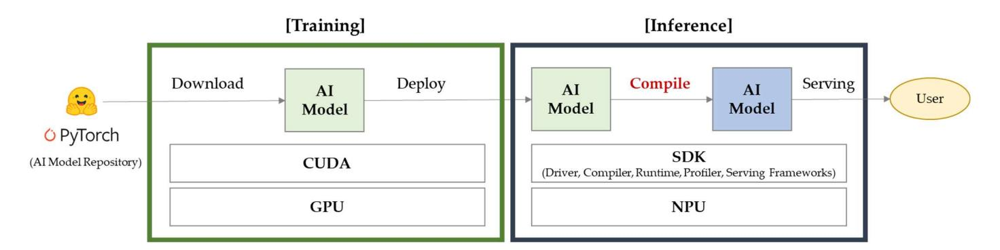

**Figure 1.** Conceptual diagram of GPU‑based training and NPU‑based inference architecture.

The compilation stage serves as a critical bridge between training and inference, in‑ corporating model optimization techniques such as quantization, graph pruning, and hardware‑specific adaptations to maximize inference throughput while minimizing la‑ tency and power consumption. The inference domain subsequently deploys the compiled model on NPU hardware, which provides specialized acceleration for neural network oper‑ ations with significantly reduced power requirements compared to traditional GPU‑based inference[[15\]](#page-23-12). It is important to note that the compilation process does not modify the structural topology of the trained models. Instead, it generates an optimized execution graph for NPU inference while preserving the consistency of software‑level metrics with those observed on GPU inference.

This heterogeneous architecture addresses the fundamental trade‑off between train‑ ing flexibility and inference efficiency, enabling organizations to maintain high‑performance training capabilities while achieving cost‑effective and energy‑efficient model deployment. The proposed approach facilitates a seamless transition from research and development phases to production deployment, supporting scalable AI inference systems suitable for edge computing and real‑time applications.

To construct the heterogeneous architecture shown in Figure [1,](#page-3-0) we configured one GPU server and one NPU server. For each category—Text‑to‑Text, Text‑to‑Image, Multi‑ modal, and Object Detection—representative AI models were selected. Appropriate perfor‑ mance metrics were identified for each model, and a comparative analysis was conducted.

## **3. Experiments**

The models of the GPU and NPU servers used in this study, along with the installed software components and their versions, are summarized in Table [2.](#page-4-0) Detailed hardware and software specifications for each server are provided in Table [A1,](#page-22-2) while detailed GPU and NPU specifications are available in Table [A2.](#page-22-3) The GPU server is equipped with two NVIDIA A100‑PCIE‑40GB GPUs[[16\]](#page-23-13), while the NPU server is configured with eight RBLN‑ CA12 (ATOM) NPUs developed by Rebellions[[17\]](#page-23-14). The statuses of the GPU and NPU chips were monitored using command‑line interface (CLI) tools provided by NVIDIA Cor‑ poration, Santa Clara, CA, USA (nvidia‑smi) and Rebellions Inc., Seoul, Republic of Korea (rbln‑stat), respectively, as shown in Table [3.](#page-4-1)

In this study, the AI models selected for performance evaluation are summarized in Table [4](#page-4-2). The analysis focuses on performance differences across four AI categories—Text‑ to‑Text, Text‑to‑Image, Multimodal, and Object Detection—as well as comparative charac‑ teristics and performance variations among representative models within each category.

*Systems* **2025**, *13*, 797 5 of 24

| Table 2. Hardware and software configurations used in this study. |  |  |
|-------------------------------------------------------------------|--|--|
|                                                                   |  |  |

| Category        | GPU Server                | NPU Server             |
|-----------------|---------------------------|------------------------|
| Model           | DELL PowerEdge R7525      | Gigabyte G293‑S43‑AAP1 |
| AI Accelerators | NVIDIA A100‑PCIE‑40GB × 2 | RBLN‑CA12(ATOM) × 8    |
| Driver          | 570.124.06                | 1.2.92                 |
| Toolkit         | CUDA 12.8                 | RBLN Compiler 0.7.2    |
| OS              | Ubuntu 22.04.5 LTS        | Ubuntu 22.04.5 LTS     |
| Python          | 3.10.12                   | 3.10.12                |
| PyTorch         | 2.6.0 + cu118             | 2.5.1 + cu124          |

**Table 3.** Specifications of GPU and NPU used in this study.

| NVIDIA A100‑PCIE‑40GB × 2 | RBLN‑CA12(ATOM) × 8 |
|---------------------------|---------------------|
|                           |                     |
|                           |                     |
|                           |                     |
|                           |                     |
|                           |                     |
|                           |                     |
|                           |                     |

**Table 4.** Categorized AI models used in this study.

| Category         | AI Model                                                   | Model ID                                                                                                            |
|------------------|------------------------------------------------------------|---------------------------------------------------------------------------------------------------------------------|
| Text‑to‑Text     | Llama‑3‑8B Llama‑3.1‑8B Deepseek‑r1‑distill‑llama‑8B | meta‑llama/Meta‑Llama‑3‑8B‑Instruct meta‑llama/Llama‑3.1‑8B‑Instruct deepseek‑ai/DeepSeek‑R1‑Distill‑Llama‑8B |
| Text‑to‑Image    | SDXL‑Turbo Stable Diffusion 3 Medium                    | stabilityai/sdxl‑turbo stabilityai/stable‑diffusion‑3‑medium‑diffusers                                           |
| Multimodal       | LLaVA‑NeXT                                                 | llava‑hf/llava‑v1.6‑mistral‑7b‑hf                                                                                   |
| Object Detection | YOLO11                                                     | yolo11n, yolo11s, yolo11m, yolo11l, yolo11x                                                                         |

This study was conducted based on the example codes provided in the GitHub repository maintained by Rebellions (rebellions‑sw/rbln‑model‑zoo, v0.5.7, 28 February 2025)[[18\]](#page-23-15). The repository offers model‑specific scripts for compilation (compile.py) and inference (inference.py) [\[19](#page-23-16)]. Using these scripts, the models were compiled and converted for execution on an NPU, and inference was subsequently performed [\[20](#page-23-17)]. The inference code was then partially modified to run in a GPU environment, allowing the measurement of inference performance on the GPU.

To measure performance data during AI model inference, a dashboard was imple‑ mented using Grafana based on Prometheus. The main dashboard screens, which visual‑ ize the key performance metrics of both the GPU and NPU servers, are shown in Figure [2.](#page-5-0) Grafana's time‑series graphs enabled intuitive monitoring of not only point‑in‑time data but also the variation in metrics over time.

*Systems* **2025**, *13*, 797 6 of 24

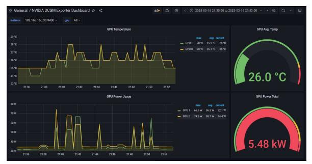

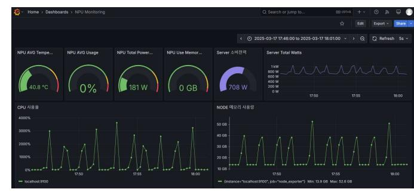

GPU Monitoring Dashboard NPU Monitoring Dashboard

**Figure 2.** Dashboard screen for GPU and NPU server status monitoring.

# **4. Evaluations**

#### *4.1. Text‑to‑Text*

This study selected three Llama‑family models with 8 billion parameters (Meta‑ Llama‑3‑8B‑Instruct, Llama‑3.1‑8B‑Instruct, and DeepSeek‑R1‑Distill‑Llama‑8B) for com‑ parative analysis to evaluate text‑to‑text generation capabilities[[21\]](#page-23-18).

Translation performance evaluation was conducted using Meta‑Llama‑3‑8B‑Instruct and its upgraded version Llama‑3.1‑8B‑Instruct for Korean‑to‑English translation tasks, enabling examination of both inter‑model performance and version‑specific performance variations. Reasoning capability assessment was conducted separately using the DeepSeek‑ R1‑Distill‑Llama‑8B model.

The input prompts and output examples used for translation and reasoning tasks are presented in Table [5](#page-5-1) and Table [6](#page-5-2), respectively. The average input and output token counts for each model were calculated based on 10 repeated executions, with detailed statistics provided in Table [7.](#page-6-0)

**Table 5.** Input prompts and output examples for Korean‑to‑English translation tasks.

| Category             | Content                                                                                                                                                                                                                                  |
|----------------------|------------------------------------------------------------------------------------------------------------------------------------------------------------------------------------------------------------------------------------------|
| Input prompt         | {한은 금통위는 25일 기준금리를 연 3.0%에서 연 2.75%로 0.25%포인트 인하했다 이번 기준금리 인하로 한국과 미국(연 4.25~4.5%)과의 금리차는 상단 기준 1.50%포인트에서 1.75%포인트로 확대됐다.} Please translate the above article in English                                                       |
| Output (Response) | The Bank of Korea (BOK) cut its base rate by 0.25 percentage points to 2.75% on the 25th, … The interest rate gap between the two countries has widened to 1.75 percentage points, from 1.5 percentage points before the rate cut. |

**Table 6.** Input prompts and output examples for reasoning tasks.

| Category             | Content                                                                                                                                                                                                              |
|----------------------|----------------------------------------------------------------------------------------------------------------------------------------------------------------------------------------------------------------------|
| Input prompt         | "Hey, are you conscious? Can you talk to me?"                                                                                                                                                                        |
| Output (Response) | Alright, so I'm trying to figure out how to approach this problem I think that's a good approach. It's clear, respectful, and sets the stage for further interaction without overstepping my capabilities.  |
|                      | Hello! I'm an AI, so I don't have consciousness or feelings, but I'm here to help with any questions or tasks you have. How can I assist you today?                                                               |

*Systems* **2025**, *13*, 797 7 of 24

| Model ID                                 | Token Categories |     | GPU2 | NPU2 | NPU4 | NPU8 |
|------------------------------------------|------------------|-----|------|------|------|------|
| meta‑llama/Meta‑Llama‑3‑8B‑Instruct      | Input            | Avg | 913  | 913  | 913  | 913  |
|                                          | Output           | Min | 397  | 518  | 434  | 455  |
|                                          |                  | Max | 620  | 615  | 644  | 657  |
|                                          |                  | SD  | 81   | 29   | 84   | 59   |
|                                          |                  | Avg | 527  | 569  | 539  | 566  |
| meta‑llama/Llama‑3.1‑8B‑Instruct         | Input            | Avg | 938  | 938  | 938  | 938  |
|                                          | Output           | Min | 625  | 639  | 632  | 643  |
|                                          |                  | Max | 746  | 716  | 712  | 732  |
|                                          |                  | SD  | 37   | 21   | 25   | 29   |
|                                          |                  | Avg | 675  | 678  | 680  | 692  |
| deepseek‑ai/DeepSeek‑R1‑Distill‑Llama‑8B | Input            | Avg | 18   | 18   | 18   | 18   |
|                                          | Output           | Min | 191  | 281  | 130  | 190  |
|                                          |                  | Max | 965  | 2213 | 845  | 709  |
|                                          |                  | SD  | 229  | 571  | 195  | 167  |
|                                          |                  | Avg | 543  | 657  | 390  | 413  |

**Table 7.** Average in/out token counts per model.

All experiments were conducted in an FP16 precision environment with a batch size of 1. The maximum sequence length was configured as 8K tokens for Meta‑Llama‑3‑8B‑ Instruct and 128K tokens for Llama‑3.1‑8B‑Instruct. Performance measurements were con‑ ducted on configurations with two GPUs and two, four, and eight NPUs to analyze pro‑ cessing performance variations with increasing accelerator counts.

#### 4.1.1. Performance Evaluation of Llama‑8B Models

In this study, text‑to‑text model performance was evaluated using four key metrics: latency, tokens per second (TPS), peak power consumption (W), and energy efficiency (TPS/W).

Performance comparison analysis revealed that the dual‑GPU configuration (GPU2) demonstrated superior performance compared to the dual‑NPU configuration (NPU2) in terms of latency and TPS metrics. However, GPU2 exhibited relatively lower performance compared to the quad‑NPU configuration (NPU4). Model‑specific performance analysis showed that the Llama‑3.1‑8B‑Instruct model recorded comparatively lower performance metrics relative to other evaluated models.

Time‑to‑First‑Token (TTFT) metric analysis indicated no statistically significant per‑ formance difference between GPU2 and NPU2 configurations. However, this metric re‑ vealed an expanded performance gap between Llama‑3.1‑8B‑Instruct and the other two models. These results suggest that NPU architecture demonstrates more effective optimiza‑ tion for the previous Llama 3.0 version compared to the newer 3.1 version.

Power consumption characteristics analysis demonstrated that NPUs exhibited lower peak power consumption compared to GPUs under identical device quantity conditions (two devices). The total power consumption with increasing NPU count followed a nearly linear scaling pattern. As illustrated in Figure [3,](#page-7-0) temporal analysis confirmed that NPUs demonstrated more stable power consumption patterns compared to GPUs. In contrast, energy efficiency (TPS/W) metrics indicated that GPUs achieved relatively superior per‑ formance compared to NPUs

Collectively, progressive improvement in inference performance was observed with increasing NPU device count, confirming the applicability of scaling laws to this architec‑ ture. The performance measurement results for each evaluation metric are summarized in Tables [8](#page-7-1)[–12](#page-10-0).

*Systems* **2025**, *13*, 797 8 of 24

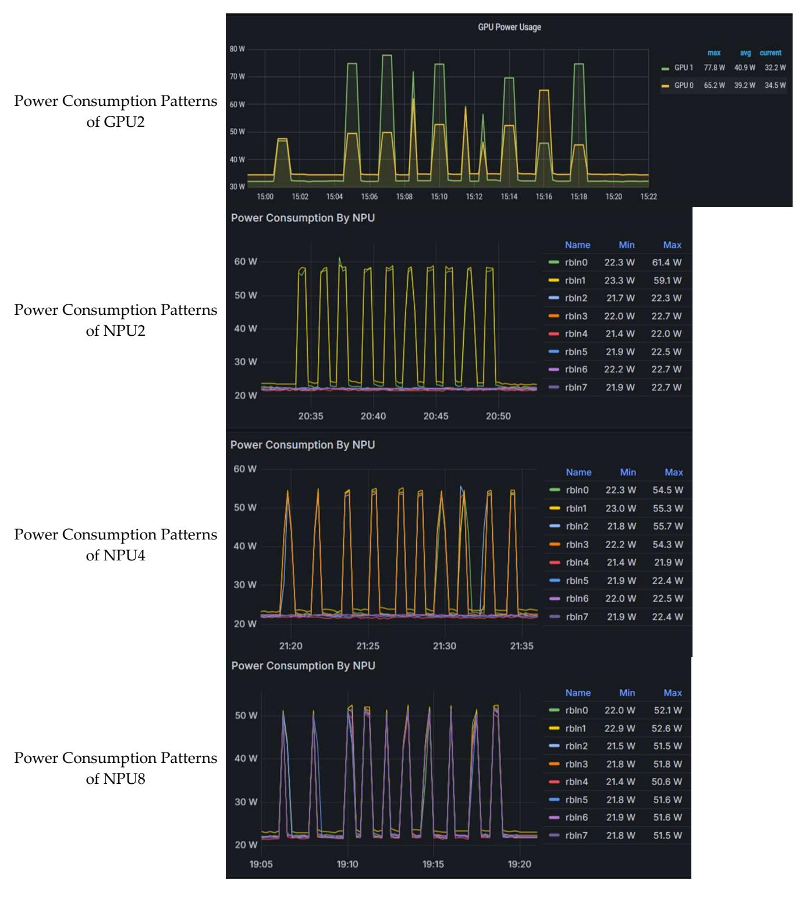

**Figure 3.** Comparison of Power Consumption Patterns of GPU2, NPU2, NPU4, and NPU8 for Meta‑ Llama‑3.1‑8B‑Instruct.

**Table 8.** Comparison of latency by model.

| Model ID                            |     | GPU2  | NPU2  | NPU4  | NPU8  |
|-------------------------------------|-----|-------|-------|-------|-------|
| meta‑llama/Meta‑Llama‑3‑8B‑Instruct | Min | 15.95 | 25.30 | 13.89 | 8.40  |
|                                     | Max | 24.61 | 30.89 | 20.63 | 11.72 |
|                                     | SD  | 3.16  | 1.64  | 2.60  | 0.92  |
|                                     | Avg | 20.96 | 28.24 | 17.30 | 10.57 |

*Systems* **2025**, *13*, 797 9 of 24

**Table 8.** *Cont.*

| Model ID                                 |     | GPU2  | NPU2   | NPU4  | NPU8  |
|------------------------------------------|-----|-------|--------|-------|-------|
| meta‑llama/Llama‑3.1‑8B‑Instruct         | Min | 24.80 | 38.67  | 24.04 | 17.77 |
|                                          | Max | 29.74 | 43.16  | 27.62 | 19.79 |
|                                          | SD  | 1.51  | 1.20   | 1.07  | 0.64  |
|                                          | Avg | 26.85 | 40.82  | 26.31 | 18.53 |
| deepseek‑ai/DeepSeek‑R1‑Distill‑Llama‑8B | Min | 7.44  | 15.81  | 4.88  | 5.18  |
|                                          | Max | 37.59 | 127.91 | 31.61 | 18.33 |
|                                          | SD  | 8.89  | 33.05  | 7.25  | 4.29  |
|                                          | Avg | 21.22 | 37.57  | 14.45 | 10.63 |

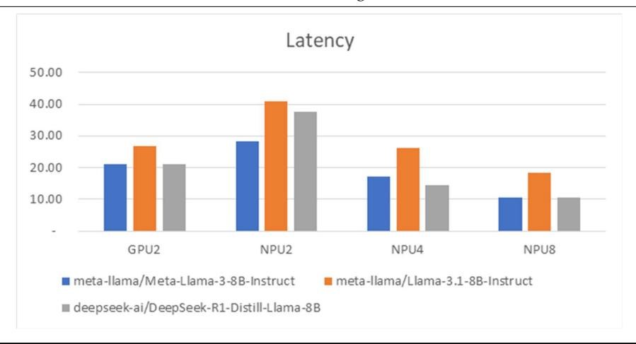

**Table 9.** Comparison of TPS by model.

| Model ID                                 |     | GPU2  | NPU2  | NPU4  | NPU8  |
|------------------------------------------|-----|-------|-------|-------|-------|
| meta‑llama/Meta‑Llama‑3‑8B‑Instruct      | Min | 24.90 | 19.91 | 30.51 | 47.66 |
|                                          | Max | 25.42 | 20.48 | 31.39 | 56.07 |
|                                          | SD  | 0.18  | 0.18  | 0.26  | 2.30  |
|                                          | Avg | 25.11 | 20.15 | 31.11 | 53.53 |
| meta‑llama/Llama‑3.1‑8B‑Instruct         | Min | 24.87 | 16.52 | 25.41 | 35.96 |
|                                          | Max | 25.34 | 16.72 | 26.29 | 39.16 |
|                                          | SD  | 0.11  | 0.06  | 0.27  | 0.98  |
|                                          | Avg | 25.13 | 16.60 | 25.84 | 37.35 |
| deepseek‑ai/DeepSeek‑R1‑Distill‑Llama‑8B | Min | 24.85 | 17.30 | 26.35 | 34.66 |
|                                          | Max | 25.97 | 17.77 | 27.47 | 41.77 |
|                                          | SD  | 0.29  | 0.14  | 0.35  | 2.23  |
|                                          | Avg | 25.59 | 17.55 | 26.98 | 38.77 |

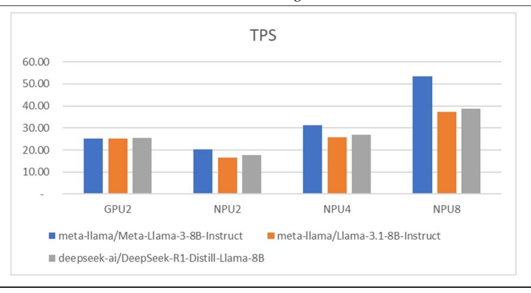

Systems **2025**, 13, 797

**Table 10.** Comparison of TTFT by model.

| Model ID                                 | •   | GPU2  | NPU2  | NPU4  | NPU8  |
|------------------------------------------|-----|-------|-------|-------|-------|
| meta-llama/Meta-Llama-3-8B-Instruct      | Min | 0.540 | 0.569 | 0.360 | 0.316 |
|                                          | Max | 0.563 | 0.637 | 0.379 | 0.355 |
|                                          | SD  | 0.008 | 0.018 | 0.005 | 0.012 |
|                                          | Avg | 0.554 | 0.583 | 0.370 | 0.332 |
| meta-llama/Llama-3.1-8B-Instruct         | Min | 0.547 | 1.362 | 0.923 | 0.715 |
|                                          | Max | 0.566 | 1.399 | 0.952 | 0.794 |
|                                          | SD  | 0.006 | 0.011 | 0.011 | 0.022 |
|                                          | Avg | 0.557 | 1.385 | 0.937 | 0.766 |
| deepseek-ai/DeepSeek-R1-Distill-Llama-8B | Min | 0.042 | 0.156 | 0.126 | 0.142 |
|                                          | Max | 0.530 | 0.166 | 0.155 | 0.157 |
|                                          | SD  | 0.146 | 0.003 | 0.008 | 0.004 |
|                                          | Avg | 0.092 | 0.159 | 0.140 | 0.150 |

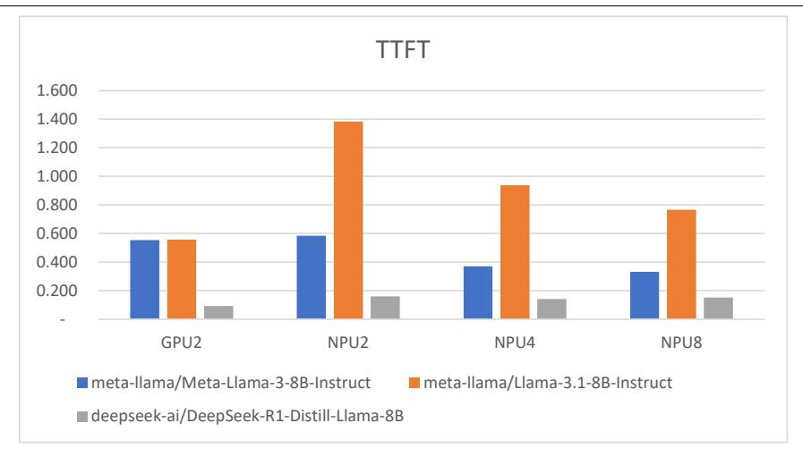

**Table 11.** Comparison of peak power consumptions by model.

| Model ID                                 | GPU2  | NPU2  | NPU4  | NPU8  |
|------------------------------------------|-------|-------|-------|-------|
| meta-llama/Meta-Llama-3-8B-Instruct      | 140.9 | 118.7 | 227.4 | 437.5 |
| meta-llama/Llama-3.1-8B-Instruct         | 143.0 | 120.5 | 219.8 | 413.3 |
| deepseek-ai/DeepSeek-R1-Distill-Llama-8B | 151.4 | 116.2 | 211.6 | 406.2 |

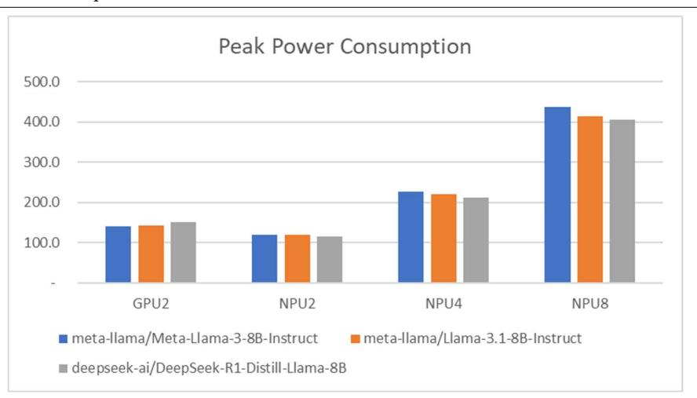

*Systems* **2025**, *13*, 797 11 of 24

|  | Table 12. Comparison of TPS/W by model. |  |  |
|--|-----------------------------------------|--|--|
|--|-----------------------------------------|--|--|

| Model ID                                 | GPU2  | NPU2  | NPU4  | NPU8  |
|------------------------------------------|-------|-------|-------|-------|
| meta‑llama/Meta‑Llama‑3‑8B‑Instruct      | 0.178 | 0.170 | 0.137 | 0.122 |
| meta‑llama/Llama‑3.1‑8B‑Instruct         | 0.176 | 0.138 | 0.118 | 0.090 |
| deepseek‑ai/DeepSeek‑R1‑Distill‑Llama‑8B | 0.169 | 0.151 | 0.127 | 0.095 |

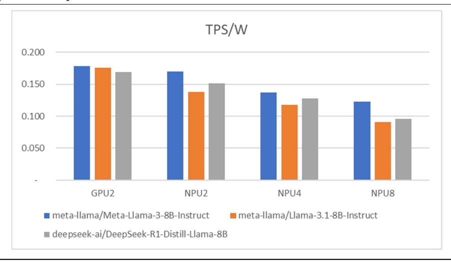

#### 4.1.2. Performance Evaluation After vLLM Integration

A comparative analysis presented in Section [4.1.1](#page-6-1) indicates that the Meta‑Llama‑3.1‑ 8B‑Instruct model exhibited significantly lower inference performance than both the Meta‑ Llama‑3‑8B‑Instruct and DeepSeek‑R1‑Distill‑Llama‑8B models. To address this perfor‑ mance gap, the open‑source inference and serving optimization library vLLM was ap‑ plied[[22\]](#page-23-19), and its impact on model inference performance was systematically evaluated.

All experiments were conducted on an NPU server equipped with the vendor‑specific hardware plugin for vLLM, vllm‑rbln. Prior to experimentation, the software develop‑ ment kit (SDK) was updated to ensure compatibility with the latest vllm‑rbln release. The core library versions utilized were as follows: Driver 1.3.73, Compiler 0.8.0, and vLLM 0.8.0.post1.

Performance measurements were conducted using the configuration described in Section [4.1.1,](#page-6-1) with a batch size of 1, FP16 precision, and a maximum sequence length of 128K tokens. All evaluations were carried out on the NPU8 configuration, which utilizes the maximum number of NPUs, to enable a direct comparison of performance before and after vLLM integration.

The performance evaluation of vLLM‑enhanced NPU‑based inference for the Meta‑ Llama‑3.1‑8B‑Instruct model, as presented in Table [13](#page-10-1), demonstrates significant improve‑ ments across multiple performance metrics. The implementation of vLLM optimization techniques resulted in substantial enhancements in processing throughput, response la‑ tency, and power efficiency.

**Table 13.** Comparison of performance before and after applying vLLM.

| Metrics                       | GPU2  | NPU8  | NPU8(+vLLM) |
|-------------------------------|-------|-------|-------------|
| TPS                           | 25.13 | 37.35 | 73.30       |
| TTFT                          | 0.557 | 0.766 | 0.238       |
| Peak Power Consumption (W) | 143.0 | 413.3 | 424.0       |
| TPS/W                         | 0.176 | 0.090 | 0.183       |

*Systems* **2025**, *13*, 797 12 of 24

**Table 13.** *Cont.*

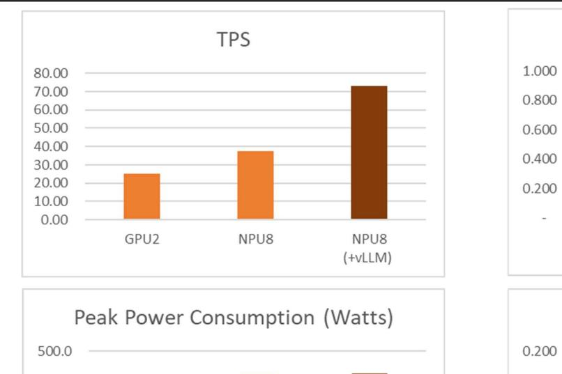

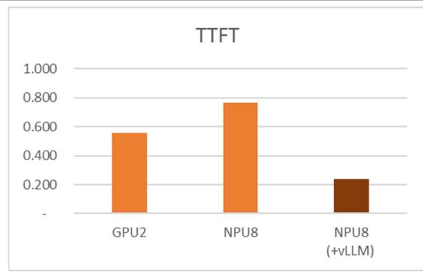

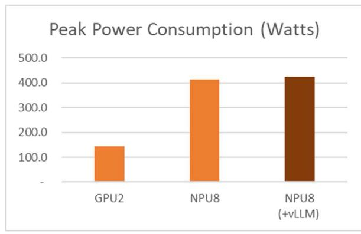

The most significant enhancement was observed in throughput. On the NPU8 plat‑ form, the application of vLLM increased the tokens per second (TPS) from 37.35 to 73.30, a 96.3% improvement that effectively doubled the inference performance. This substantial gain is attributed to the synergy between vLLM's core technologies, such as PagedAtten‑ tion and efficient dynamic batching, and the parallel processing architecture of the NPU.

Beyond throughput, The Time to First Token (TTFT) was also markedly reduced. The TTFT decreased from 0.766 s to 0.238 s, a 68.9% reduction. This is a critical improvement for ensuring the responsiveness required in real‑time conversational AI applications.

Notably, these performance enhancements were achieved with only a marginal in‑ crease in power consumption. Power draw rose by a mere 2.6% (from 413.3 W to 424.0 W), while the throughput increased by 96.3%. Consequently, the power efficiency, mea‑ sured in TPS per Watt (TPS/W), improved by 103.3% (from 0.090 to 0.183). This demon‑ strates that vLLM maximizes computational output with minimal resource overhead, which can lead to significant reductions in operational expenditure (OPEX) for large‑scale service deployments.

The superiority of the vLLM‑optimized NPU was further validated through a compar‑ ative analysis against a GPU‑based environment (GPU2). The NPU8 platform delivered 2.9 times higher TPS than the GPU2 platform while maintaining a comparable level of power efficiency. This result indicates that NPUs possess a significant performance advan‑ tage for specific AI inference workloads, and that optimization frameworks like vLLM are instrumental in unlocking this potential.

#### *4.2. Text‑to‑Image*

This paper presents a comparative performance analysis of SDXL‑Turbo, a text‑to‑ image model optimized for real‑time generation speed, and Stable Diffusion 3 Medium, a quality‑ and resolution‑focused model[[23\]](#page-23-20).

*Systems* **2025**, *13*, 797 13 of 24

# 4.2.1. Performance Evaluation of SDXL‑Turbo

This section evaluates the stabilityai/sdxl‑turbo model on two AI accelerators, GPU2 and NPU2. Ten images of 512 *×* 512 pixels were generated, and their average processing time was measured. As SDXL‑Turbo is optimized for computational efficiency, throughput (images per second, img/s) was chosen as the primary performance metric, while peak power consumption (W) was also measured. Table [14](#page-12-0) displays the input prompt and the corresponding generated images.

**Table 14.** Input prompt and corresponding generated images for stabilityai/sdxl‑turbo.

**Category Content** Input prompt A cinematic shot of a baby raccoon wearing an intricate Italian priest robe. Output (Generated image)

> As shown in Table [15](#page-12-1), NPU2 exhibits a higher throughput for text‑to‑image genera‑ tion, achieving 3.67 images per second compared to GPU2's 3.22 images per second. This indicates that NPU2 is approximately 14% faster in processing the image generation tasks for this specific model and resolution.

**Table 15.** Performance comparison of GPU2 and NPU2 for stabilityai/sdxl‑turbo.

| Model ID                    | GPU2  | NPU2 |
|-----------------------------|-------|------|
| Images Per Second (img/sec) | 3.22  | 3.67 |
| Peak Power Consumption (W)  | 314.3 | 94.0 |

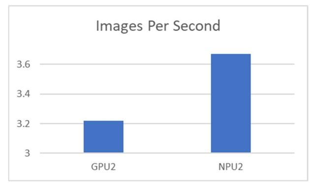

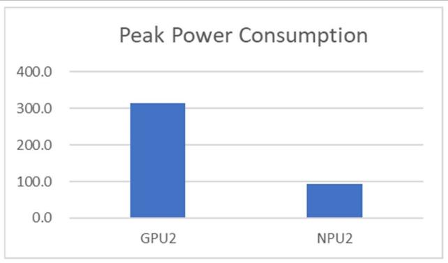

Furthermore, a significant difference is observed in power consumption. NPU2 demonstrates substantially lower peak power consumption at 94.0 Watts, whereas GPU2 consumes 314.3 Watts. This translates to NPU2 being approximately 70% more power‑ efficient than GPU2 for this workload, as illustrated in Table [15](#page-12-1) and Figure [4.](#page-13-0) The substan‑ tial reduction in power consumption for NPU2 highlights its potential for deployment in power‑constrained environments or for applications where energy efficiency is a critical design consideration, such as edge computing devices or large‑scale data centers aiming to minimize operational costs.

*Systems* **2025**, *13*, 797 14 of 24

Power Consumption Patterns of GPU2

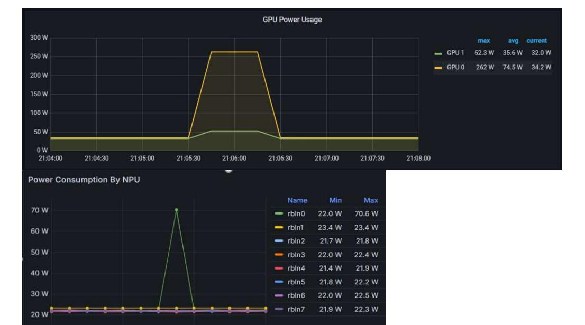

Power Consumption Patterns of NPU2

**Figure 4.** Comparison of power consumption patterns of GPU2 and NPU2 for stabilityai/sdxl‑turbo.

In conclusion, for the stabilityai/sdxl‑turbo text‑to‑image model at 512 *×* 512 reso‑ lution, the NPU2 hardware accelerator not only offers superior processing speed but also demonstrates remarkable power efficiency compared to GPU2. These findings underscore the increasing viability and advantages of specialized NPU architectures for accelerating AI inference tasks, particularly those involving generative models.

# 4.2.2. Performance Evaluation of Stable Diffusion 3 Medium

This section evaluates the stabilityai/stable‑diffusion‑3‑medium‑diffusers model on two AI accelerators, GPU2 and NPU2. Five images of 1024 *×* 1024 pixels were generated, and their average processing time was measured. Stable Diffusion 3 Medium is a model focused on quality and resolution; therefore, seconds per image (sec/img) was selected as the primary performance metric. Peak power consumption (W) was also measured for comprehensive evaluation. Table [16](#page-13-1) displays the input prompt and the corresponding gen‑ erated images.

**Table 16.** Input prompt and corresponding generated images for stabilityai/stable‑diffusion‑3‑ medium‑diffusers.

**Category Content** Input prompt Draw me a picture of a church located on a wavy beach, photo, 8 k Output (Generated image)

> As depicted in Table [17](#page-14-0), at the 1024 *×* 1024 resolution, the time taken to generate a single image is quite similar for both AI accelerators. GPU2 completes the task in 56.81 s per image, while NPU2 takes 57.15 s per image. This marginal difference suggests that for this specific model and a higher resolution, the NPU2's performance in terms of generation speed is nearly on par with, or slightly slower than, the GPU2. This contrasts with the

*Systems* **2025**, *13*, 797 15 of 24

previous observation at 512 *×* 512 resolution where NPU2 demonstrated a slight speed advantage. The increased computational load at higher resolutions might be a factor in this convergence of generation times.

**Table 17.** Performance comparison of GPU2 and NPU2 for stabilityai/stable‑diffusion‑3‑medium‑ diffusers.

| Model ID                    | GPU2  | NPU2  |
|-----------------------------|-------|-------|
| Seconds per Image (sec/img) | 56.81 | 57.15 |
| Peak Power Consumption (W)  | 304.1 | 119.2 |

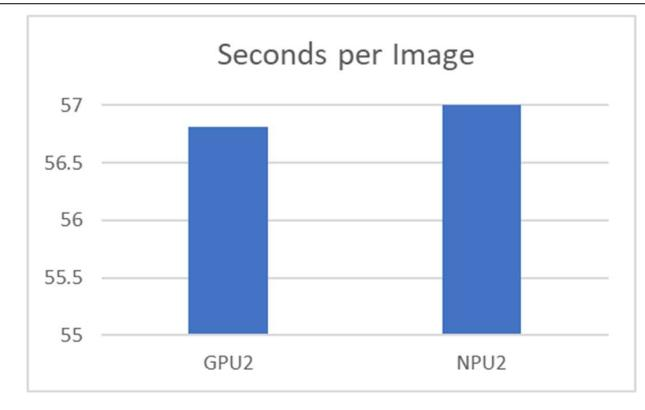

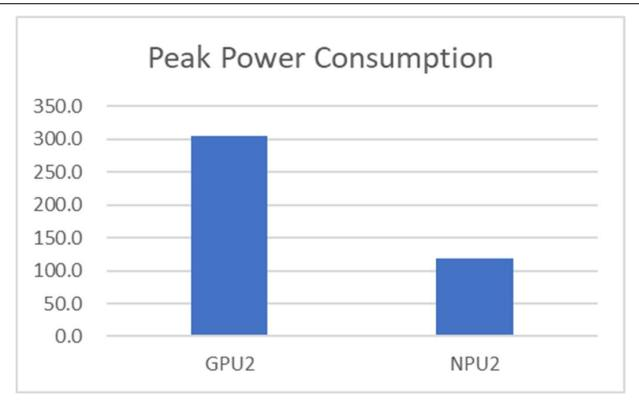

Conversely, the disparity in peak power consumption remains significant. As shown in Table [17](#page-14-0) and Figure [5,](#page-14-1) NPU2 maintains its substantial power efficiency advantage, con‑ suming only 119.2 Watts at peak. In stark contrast, GPU2 consumes 304.1 Watts. This indicates that even with the increased computational demands of higher resolution im‑ age generation, NPU2 consistently operates with considerably lower power requirements, consuming approximately 60% less power than GPU2.

Power Consumption Patterns of GPU2

Power Consumption Patterns of NPU2

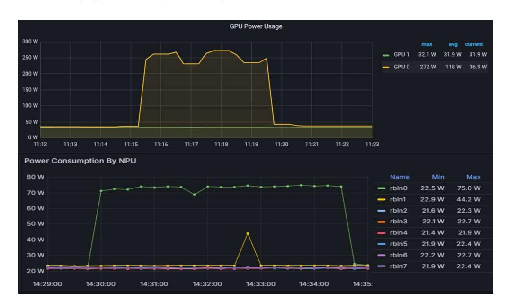

**Figure 5.** Comparison of power consumption patterns of GPU2 and NPU2 for stabilityai/stable‑ diffusion‑3‑medium‑diffusers.

In conclusion, for the stabilityai/stable‑diffusion‑3‑medium‑diffusers model generat‑ ing images at 1024 *×* 1024 resolution, NPU2 offers nearly comparable image generation speed to GPU2, while maintaining a significant advantage in power efficiency. This high‑ *Systems* **2025**, *13*, 797 16 of 24

lights NPU2's capability to handle more demanding generative AI workloads with a con‑ siderably reduced energy footprint, making it a compelling option for applications priori‑ tizing energy conservation and operational cost reduction, even at higher resolutions.

#### *4.3. Multimodal*

LLaVA‑NeXT is a next‑generation large multimodal model that demonstrates en‑ hanced visual reasoning, OCR, and commonsense reasoning capabilities through im‑ proved image resolution and a better visual instruction tuning dataset compared to its predecessors[[24\]](#page-23-21). In this section, we evaluate and analyze the performance of the llava‑ hf/llava‑v1.6‑mistral‑7b‑hf model.

#### *Performance Evaluation of LLaVA‑NeXT*

In this study, we evaluated the model's performance on an image captioning task, which requires generating textual descriptions based on visual inputs. The test image, as shown in Figure [6](#page-15-0), has a resolution of 2832 *×* 2128 pixels and a file size of 1.5 MB. The licensing policy for Figure [6](#page-15-0) is provided in Appendix [B.1](#page-22-4). Table [18](#page-15-1) presents the input prompts and the corresponding captions generated by the model.

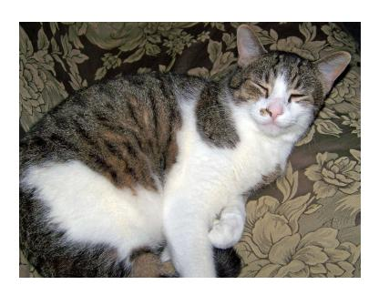

**Figure 6.** Images used for llava‑hf/llava‑v1.6‑mistral‑7b‑hf.

**Table 18.** Input prompt and corresponding generated output for llava‑hf/llava‑v1.6‑mistral‑7b‑hf.

| Category                       | Content                                                                                                                                                                                                                                                                                                                      |
|--------------------------------|------------------------------------------------------------------------------------------------------------------------------------------------------------------------------------------------------------------------------------------------------------------------------------------------------------------------------|
| Input prompt                   | What is shown in this image?                                                                                                                                                                                                                                                                                                 |
| Output (Generated captions) | The image shows a cat lying down with its eyes closed, appearing to be sleeping or resting. The cat has a mix of white and gray fur, and it's lying on a patterned fabric surface, which could be a piece of furniture like a couch or a chair. The cat's ears are perked up, and it has a contented expression. |

Table [19](#page-16-0) and Figure [7](#page-17-0) presents a comprehensive performance evaluation of the pro‑ posed model across multiple hardware accelerators, including GPU2, NPU2, NPU4, and NPU8 configurations, focusing on two critical performance metrics: inference latency and peak power consumption. The experimental results demonstrate a clear inverse relation‑ ship between the number of processing units and inference latency, with measurements showing progressive improvement as NPU count increases. Specifically, GPU2 exhibits the highest latency at 5.27 s, followed by NPU2 at 4.84 s, NPU4 at 2.86 s, and NPU8 achiev‑ ing optimal performance with 2.00 s, representing a 62% latency reduction from GPU2 to NPU8. This substantial improvement indicates that the model architecture is well‑suited for parallel processing across multiple NPU units, with the scaling efficiency suggesting an effective computational workload distribution that enhances system responsiveness and throughput.

However, the power consumption characteristics reveal a more complex relation‑ ship with hardware scaling, where GPU2 demonstrates the highest peak power consump‑ *Systems* **2025**, *13*, 797 17 of 24

tion at 292.9 W, while NPU2 exhibits exceptional energy efficiency with only 134.4 W consumption—a 54% reduction compared to GPU2. Scaling to NPU4 and NPU8 configura‑ tions results in increased power demands of 249.4 W and 404.3 W, respectively, with NPU8 consuming approximately 201% more power than NPU2 while achieving 58% better la‑ tency performance. This performance evaluation reveals a fundamental trade‑off between computational speed and energy efficiency in multi‑NPU configurations, where NPU8 provides superior latency performance but incurs substantial energy overhead, making it suitable for applications prioritizing response time over power efficiency, while NPU2 emerges as the most energy‑efficient configuration optimal for power‑constrained environ‑ ments where moderate latency increases are acceptable.

The experimental findings indicate that the multimodal model demonstrates robust scalability across different hardware platforms with distinct performance characteristics, suggesting that NPU‑based architectures offer significant advantages in both latency and power efficiency compared to traditional GPU implementations. The non‑linear relation‑ ship between NPU count and power consumption highlights the need for careful hardware selection based on specific application requirements, with future research focusing on de‑ veloping power‑aware optimization techniques for high‑performance NPU configurations to achieve optimal latency‑power trade‑offs without compromising system performance.

**Table 19.** Performance comparison of GPU and NPU for llava‑hf/llava‑v1.6‑mistral‑7b‑hf.

| Model ID                   |     | GPU2  | NPU2  | NPU4  | NPU8  |
|----------------------------|-----|-------|-------|-------|-------|
| Latency (seconds)          | Min | 5.21  | 4.76  | 2.81  | 1.96  |
|                            | Max | 5.52  | 4.92  | 2.92  | 2.11  |
|                            | SD  | 0.09  | 0.05  | 0.04  | 0.04  |
|                            | Avg | 5.27  | 4.84  | 2.86  | 2.00  |
| Peak Power Consumption (W) |     | 292.9 | 134.4 | 249.4 | 404.3 |

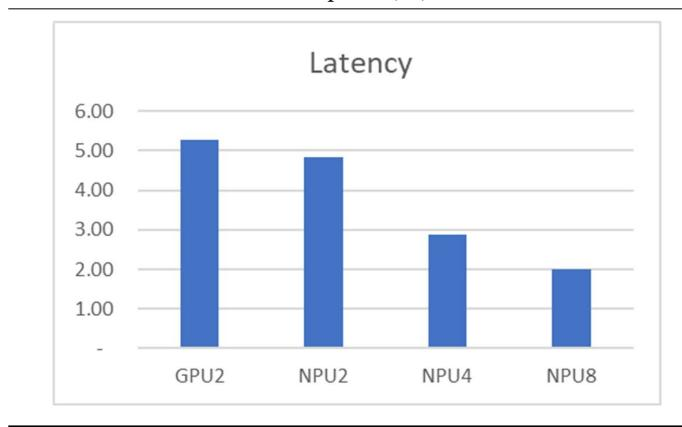

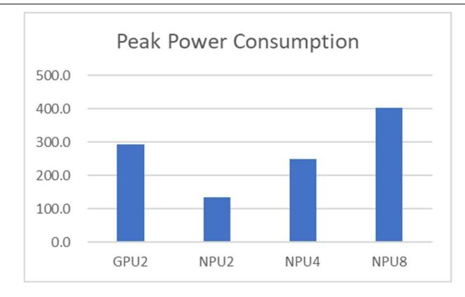

Power Consumption Patterns of GPU2

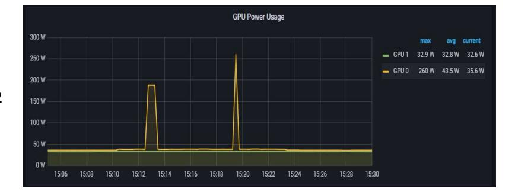

**Figure 7.** *Cont.*

*Systems* **2025**, *13*, 797 18 of 24

Power Consumption Patterns of NPU2

Power Consumption Patterns of NPU4

Power Consumption Patterns of NPU8

**Figure 7.** Comparison of power consumption patterns of GPU2, NPU2, NPU4, and NPU8 for llava‑ hf/llava‑v1.6‑mistral‑7b‑hf.

#### *4.4. Object Detection*

In this study, the Ultralytics YOLO11 family of object‑detection models is employed. The series comprises five scales, ranging from Nano (yolo11n) to Extra Large (yolo11x) [\[25](#page-23-22)]. The lightest configuration, yolo11n, contains roughly 2.6 M parameters, enabling real‑time inference on mobile devices, whereas the largest variant, yolo11x, incorporates 56.9 M pa‑ rameters and achieves state‑of‑the‑art detection accuracy. Architectural details and key characteristics of each scale are summarized in Table [20](#page-17-1).

**Table 20.** Types and characteristics of YOLO11 models.

| Model   | Size Category | Parameters | Key Features                           |
|---------|---------------|------------|----------------------------------------|
| YOLO11n | Nano          | 2.6M       | Ultra‑lightweight mobile/IoT inference |
| YOLO11s | Small         | 9.4M       | Balanced mobile performance            |
| YOLO11m | Medium        | 20.1M      | Balanced server performance            |
| YOLO11l | Large         | 25.3M      | High‑accuracy server inference         |
| YOLO11x | Extra Large   | 56.9M      | Maximum accuracy for demanding tasks   |

#### Performance Evaluation of YOLO11

This study conducts a multidimensional assessment of the YOLO11 model family us‑ ing the two test images in Table [21.](#page-18-0) The licensing policies for Image 1 and Image 2 in Table [21](#page-18-0) are provided in Appendix [B.1](#page-22-4) and Appendix [B.2](#page-22-5), respectively. Processing speed (FPS), peak power consumption (W), and energy efficiency (FPS/W) were measured sys‑ tematically on single‑GPU and single‑NPU platforms to reveal hardware‑specific perfor‑ *Systems* **2025**, *13*, 797 19 of 24

mance characteristics. The resulting FPS, peak power consumption, and FPS/W metrics are reported in Table [22](#page-18-1), Table [23](#page-18-2), and Table [24,](#page-19-0) respectively.

**Table 21.** Two types of images used for performance measurement.

| Image 1 (People 4.jpg)  |                  |                       | Image 2 (Bus.jpg) |
|-------------------------|------------------|-----------------------|-------------------|
| Original image          | Object detection | Original image        | Object detection  |
| (4892 × 3540 (7.44 MB)) | output image     | (810 × 1080 (134 KB)) | output image      |
|                         |                  |                       |                   |

**Table 22.** FPS of YOLO11 model variants on GPU and NPU with two images.

| Metrics | Image   | Model ID | GPU   | NPU   |
|---------|---------|----------|-------|-------|
| FPS     | Image1  | yolo11n  | 69.38 | 58.54 |
|         |         | yolo11s  | 78.97 | 56.07 |
|         |         | yolo11m  | 63.98 | 49.12 |
|         |         | yolo11l  | 50.32 | 46.30 |
|         |         | yolo11x  | 50.81 | 34.64 |
|         | Image 2 | yolo11n  | 93.18 | 58.23 |
|         |         | yolo11s  | 94.25 | 54.35 |
|         |         | yolo11m  | 78.98 | 48.60 |
|         |         | yolo11l  | 57.62 | 45.98 |
|         |         | yolo11x  | 56.36 | 34.17 |

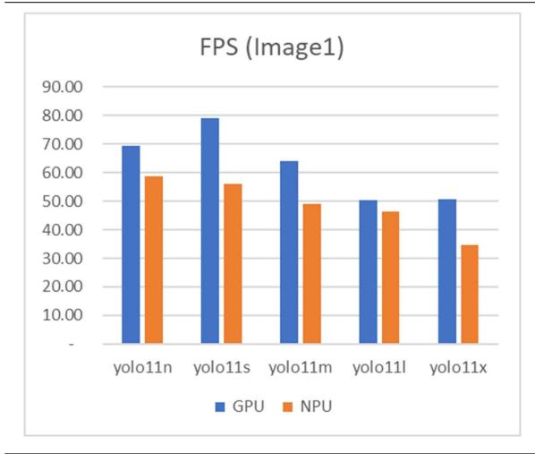

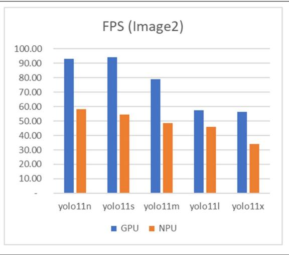

**Table 23.** Peak power consumption of YOLO11 model variants on GPU and NPU with two images.

| Metrics     | Image  | Model ID | GPU   | NPU  |
|-------------|--------|----------|-------|------|
| Peak        | Image1 | yolo11n  | 56.0  | 43.0 |
| Power       |        | yolo11s  | 56.0  | 44.5 |
| Consumption |        | yolo11m  | 56.0  | 47.6 |
| (W)         |        | yolo11l  | 109.0 | 48.9 |
|             |        | yolo11x  | 106.0 | 54.1 |

*Systems* **2025**, *13*, 797 20 of 24

**Table 23.** *Cont.*

| Metrics | Image  | Model ID | GPU   | NPU  |
|---------|--------|----------|-------|------|
|         | Image2 | yolo11n  | 55.0  | 43.0 |
|         |        | yolo11s  | 56.0  | 44.7 |
|         |        | yolo11m  | 99.0  | 47.6 |
|         |        | yolo11l  | 109.0 | 48.9 |
|         |        | yolo11x  | 118.0 | 54.6 |

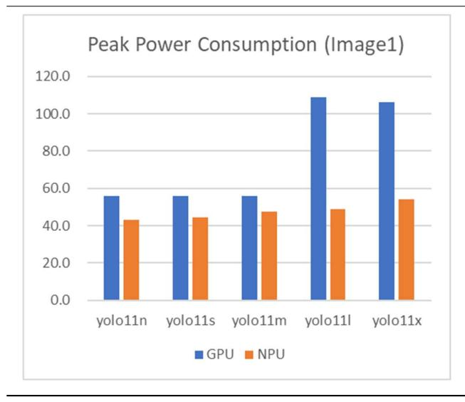

**Table 24.** FPS/W of YOLO11 model variants on GPU and NPU with two images.

| Metrics | Image  | Model ID | GPU  | NPU  |
|---------|--------|----------|------|------|
| FPS/W   | Image1 | yolo11n  | 1.24 | 1.36 |
|         |        | yolo11s  | 1.41 | 1.26 |
|         |        | yolo11m  | 1.14 | 1.03 |
|         |        | yolo11l  | 0.46 | 0.95 |
|         |        | yolo11x  | 0.48 | 0.64 |
|         | Image2 | yolo11n  | 1.69 | 1.35 |
|         |        | yolo11s  | 1.68 | 1.22 |
|         |        | yolo11m  | 0.80 | 1.02 |
|         |        | yolo11l  | 0.53 | 0.94 |
|         |        | yolo11x  | 0.48 | 0.63 |
|         |        |          |      |      |

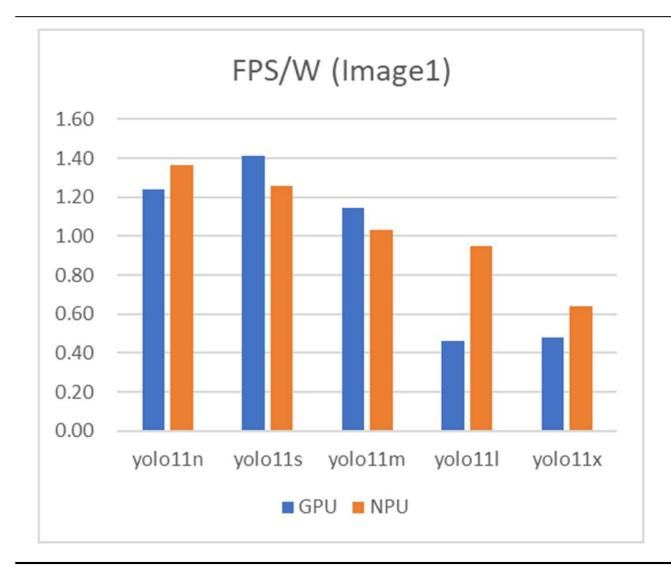

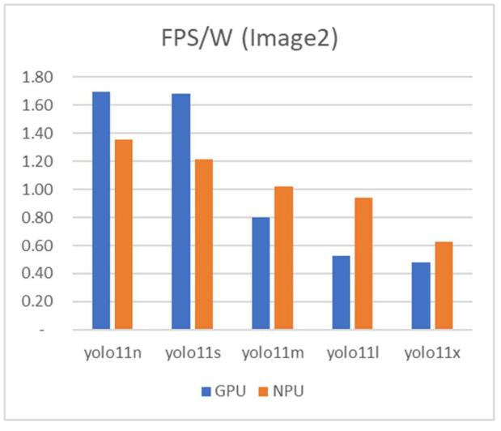

*Systems* **2025**, *13*, 797 21 of 24

As summarized in Table [22,](#page-18-1) the GPU consistently attained higher throughput (frames per second, FPS) than the NPU across all tested configurations; the YOLO11s model achieved the top throughput on both test images, reaching approximately 79–94 FPS. In‑ creasing the model size (n *→* x) produced only marginal gains, and for the YOLO11l and YOLO11x variants, the average throughput collapsed to roughly 50 FPS. Even under iden‑ tical hardware settings, GPU throughput varied by up to 40% with different input images, indicating pronounced workload dependence.

Peak power measurements in Table [23](#page-18-2) reveal that the NPU consumed 20–60% less power than the GPU. For small and medium models (YOLO11n/s/m), GPU power re‑ mained fixed at 56 W, whereas the NPU required only 43–48 W. With large models (YOLO11l/x), GPU power surged to 106–118 W, while the NPU stayed below 55 W; hence the power gap widened as the parameter count increased. Because peak power was virtu‑ ally invariant to the input images, power consumption appears to be dominated by model size rather than data characteristics.

The energy‑efficiency metric (FPS/W) in Table [24](#page-19-0) further quantifies this trade‑off. For lightweight models, the superior accelerator flipped with the test image: on Image 1 the YOLO11n–NPU delivered 1.36 FPS/W, whereas on Image 2 the YOLO11n–GPU led with 1.69 FPS/W. In contrast, for large models (YOLO11l/x) the NPU consistently outperformed the GPU, yielding on average 1.9*×* (up to 2.1*×*) higher efficiency for YOLO11l and 1.3*×* for YOLO11x.

As shown in Table [23](#page-18-2), NPU power consumption remained relatively stable across dif‑ ferent model sizes, whereas GPU power consumption tended to increase more sharply as model complexity grew. For smaller models, the difference in power consumption between the GPU and NPU was limited, which in some cases led to marginally higher FPS/W values for GPUs. However, as the model size increased, the widening gap in power consumption favored the NPU, whose efficiency improved relative to the GPU. Consequently, the case of YOLO11n/s represents a minor deviation from the general trend and does not affect the overall conclusion that NPUs exhibit superior energy efficiency for larger models.

Overall, the NPU exhibited superior energy efficiency for object‑detection workloads throughout the study. Although accelerator preference occasionally reversed for compact models, the NPU provided a steady 1.3–1.9*×* FPS/W advantage over the GPU for large‑ parameter models (YOLO11l/x). Consequently, in scenarios that demand enlarged param‑ eter budgets to boost accuracy, deploying an NPU enables compliance with system power constraints while preserving effective performance, and therefore represents the preferred architectural choice.

# **5. Discussion**

This study empirically analyzed the potential of utilizing NPUs for inference to reduce dependency on GPUs while improving performance. However, several limitations remain.

First, although quantitative analyses of GPU and NPU chips were conducted, the het‑ erogeneity in server types and hardware specifications made it difficult to directly compare the overall power consumption of GPU‑ and NPU‑based servers. Since total server power consumption is a critical factor in datacenter design, particularly with respect to cooling and operational efficiency, further investigation is required.

Second, this study primarily focused on performance comparisons between GPUs and NPUs using a single model. Consequently, variations in hyperparameter configurations, such as batch size, were inevitable across models, limiting the consistency of cross‑model comparisons. Moreover, additional research is necessary to evaluate performance in more complex scenarios where multiple categories of AI models are executed concurrently.

*Systems* **2025**, *13*, 797 22 of 24

Third, to examine the performance improvement of NPUs with relatively less hard‑ ware optimization, this study applied an inference optimization library (vLLM) only to the NPU. However, a more comprehensive analysis could have been achieved by including optimization libraries for GPUs as well, such as vLLM and TensorRT‑LLM, for direct comparison.

Future research should address these limitations to enable practical optimization of AI architectures. In particular, optimization strategies for quantization techniques to improve inference response quality and performance, comparative evaluations of different NPUs in terms of performance, power efficiency, and deployment cost, as well as empirical studies on software and infrastructure architectures capable of managing diverse models under dynamic workloads, are essential.

# **6. Conclusions**

This study provides the first comprehensive, cross‑domain evaluation of GPU versus NPU servers for AI model inference. Across four representative task categories, NPUs con‑ sistently achieved comparable or superior throughput relative to GPUs while dramatically lowering power consumption. Key findings include the following:

- *•* Text‑to‑Text: NPUs scale effectively with device count, outperforming dual‑GPU se‑ tups at four‑chip configurations and achieving up to 2.8*×* higher tokens‑per‑second with vLLM integration, alongside a 92% improvement in TPS/W.
- *•* Text‑to‑Image: For real‑time generation (SDXL‑Turbo), NPUs deliver 14% higher image‑per‑second rates and 70% better power efficiency. In high‑resolution synthesis (Stable Diffusion 3 Medium), NPUs match GPU speed with 60% lower peak power.
- *•* Multimodal: LLaVA‑NeXT inference latency decreases by 62% from GPU2 to NPU8, with NPUs maintaining energy‑efficient operation—NPU2 consumes 54% less power than GPU2.
- *•* Object Detection: Although GPUs lead in raw FPS for smaller YOLO11 variants, NPUs exhibit 1.3–1.9*×* higher FPS/W for larger models, highlighting their advantage for accuracy‑driven workloads under power constraints.

The nonlinear scaling of power with NPU count underscores the importance of select‑ ing appropriate hardware configurations to balance latency and energy consumption. The demonstrated synergy between NPUs and inference optimizers such as vLLM suggests a promising pathway for further enhancing inference performance. Collectively, these re‑ sults establish NPU‑based inference servers as a compelling, energy‑efficient alternative to GPUs, with significant implications for data‑center OPEX reductions and edge deploy‑ ment in power‑sensitive environments.

**Author Contributions:** Conceptualization, Y.H. and D.K.; methodology, Y.H.; software, Y.H.; vali‑ dation, Y.H. and D.K.; resources, Y.H.; data curation, Y.H.; writing—original draft, Y.H.; writing review and editing, D.K.; visualization, Y.H.; supervision, D.K.; funding acquisition, D.K. All au‑ thors have read and agreed to the published version of the manuscript.

**Funding:** This work is supported by the Korea Institute for Advancement of Technology (KIAT) grant funded by the Korean Government (MOTIE) (P0017123, The Competency Development Pro‑ gram for Industry Specialist).

**Data Availability Statement:** Data sharing not applicable. No new data were created or analyzed in this study. Data sharing is not applicable to this article.

**Conflicts of Interest:** The authors declare no conflict of interest.

Systems **2025**, 13, 797 23 of 24

## Appendix A

Table A1 summarizes the GPU and NPU server specifications used in this study.

**Table A1.** Detailed specification comparison between GPU servers and NPU servers.

| Category        | GPU Server                                 | NPU Server                                           |
|-----------------|--------------------------------------------|------------------------------------------------------|
| Model ID        | PowerEdge R7525                            | G293-S43-AAP1                                        |
| Manufacturer    | Dell                                       | Gigabyte                                             |
| CPU             | AMD EPYC 7352 24-Core Processor $\times$ 2 | INTEL(R) XEON(R) GOLD 6542Y $\times 2$               |
| AI Accelerators | NVIDIA-A100-PCIe-40GB $\times$ 2           | RBLN-CA12 $\times$ 8                                 |
| Memory          | Samsung DDR4 Dual Rank 3200 MT/s 256GB     | Samsung DDR5 5600MT/S 64GB $	imes$ 24                |
| Storage         | Intel SSD 1787.88 GB $\times$ 2 Raid 0     | Samsung SSD 1.92TB Raid 1                            |
| Networking      | BCM5720 1GB ethernet525                    | 2 x 10Gb/s LAN ports via Intel ® X710-AT2 |
| Power           | DELTA 1400W $\times$ 2                     | Dual 3000W 80 PLUS Titanium redundant power supply   |

Table A2 summarizes the specifications of the GPU and NPU used as AI accelerators in this study.

**Table A2.** Detailed specification comparison between GPU and NPU.

| Category                      | GPU                                  | NPU                                       |
|-------------------------------|--------------------------------------|-------------------------------------------|
| Model ID                      | NVIDIA A100 (PCIe 80 GB)             | Rebellions RBLN-CA12                      |
| Process/Architecture          | 7 nm TSMC N7, GA100 Ampere GPU       | 5 nm Samsung EUV, ATOM™ inference SoC     |
| Peak tensor performance       | FP16 312 TFLOPS/INT8 624 TOPS        | FP16 32 TFLOPS/INT8 128 TOPS              |
| On-chip memory                | 40 MB L2 cache                       | 64 MB on-chip SRAM (scratch + shared)     |
| External memory and Bandwidth | 80 GB HBM2e, 1.94 TB/s               | 16 GB GDDR6, 256 GB/s                     |
| Host interface/Form-factor    | PCIe 4.0 x16; dual-slot FHFL card    | PCIe 5.0 x16; single-slot FHFL card       |
| 110St Interface/10IIII-factor | $(267 \times 111 \text{ mm})$        | $(266.5 \times 111 \times 19 \text{ mm})$ |
| Multi-instance                | Up to 7 MIGs ( $\approx$ 10 GB each) | Up to 16 HW-isolated inference instances  |
| TDP                           | 300 W fixed                          | 60–130 W configurable                     |

### Appendix B

Appendix B.1

The rbln-model-zoo GitHub repository by Rebellions Inc. (v0.5.7, 28 February 2025) is distributed under a proprietary Software User License Agreement (see <a href="https://github.com/rebellions-sw/rbln-model-zoo/blob/main/LICENSE">https://github.com/rebellions-sw/rbln-model-zoo/blob/main/LICENSE</a> (accessed on 26 July 2025)). As the repository does not provide explicit public usage rights for images, we directly contacted Rebellions Inc. and obtained written permission for their inclusion in this work. Accordingly, the following attributions are provided:

- Figure 6. Reprinted with permission from Rebellions Inc. © 2025 Rebellions Inc. All rights reserved.
- Image 1 (people 4.jpg) in Table 21. Reprinted with permission from Rebellions Inc. © 2025 Rebellions Inc. All rights reserved.

#### Appendix B.2

Ultralytics provides its sample assets under the GNU Affero General Public License, Version 3 (AGPL-3.0) (see https://www.gnu.org/licenses/agpl-3.0.html (accessed on 26 July 2025)). For clarity of usage, the following attribution is included:

Image 2 (bus.jpg) in Table 21. Reproduced from the Ultralytics YOLOv11 sample images.
© Ultralytics. Licensed under the GNU Affero General Public License v3.0 (AGPL-3.0).

## References

- 1. Hong, Y.; Kim, D. NPU Enhanced Hybrid AI Architecture for High-Performance and Cost-Effective AI Services. In Proceedings of the 19th International Conference on Innovative Computing, Information and Control (ICICIC 2025), Kitakyushu, Japan, 26–29 August 2025.
-  IoT Analytics. The Leading Generative AI Companies. Available online: https://iot-analytics.com/leading-generative-aicompanies/ (accessed on 26 July 2025).

*Systems* **2025**, *13*, 797 24 of 24

3. Aghapour, E. Efficient Deep Learning Inference on End Devices. Ph.D. Thesis, University of Amsterdam, Amsterdam, The Netherlands, 2025.

- 4. Reuther, A.; Michaleas, P.; Jones, M.; Gadepally, V.; Samsi, S.; Kepner, J. Survey and Benchmarking of Machine Learning Accel‑ erators. In Proceedings of the IEEE High Performance Extreme Computing Conference (HPEC 2019), Waltham, MA, USA, 24–26 September 2019; pp. 1–9.[[CrossRef\]](https://doi.org/10.1109/HPEC.2019.8916327)
- 5. Jayanth, R.; Gupta, N.; Prasanna, V. Benchmarking Edge AI Platforms for High‑Performance ML Inference. *arXiv* **2024**, arXiv:2409.14803.
- 6. Xu, D.; Zhang, H.; Yang, L.; Liu, R.; Huang, G.; Xu, M.; Liu, X. Fast On‑Device LLM Inference with NPUs. In Proceedings of the 30th ACM International Conference on Architectural Support for Programming Languages and Operating Systems (ASPLOS'25), Rotterdam, The Netherlands, 30 March–3 April 2025; pp. 1–18.[[CrossRef\]](https://doi.org/10.1145/3669940.3707239)
- 7. Boutros, A.; Nurvitadhi, E.; Betz, V. Specializing for Efficiency: Customizing AI Inference Processors on FPGAs. In Proceedings of the 2021 International Conference on Microelectronics (ICM 2021), New Cairo, Egypt, 19–22 December 2021; pp. 62–65. [\[CrossRef\]](https://doi.org/10.1109/ICM52667.2021.9664938)
- 8. Li, R.; Fu, D.; Shi, C.; Huang, Z.; Lu, G. Efficient LLMs Training and Inference: An Introduction. *IEEE Access* **2025**, *13*, 32944– 32970.[[CrossRef\]](https://doi.org/10.1109/ACCESS.2024.3501358)
- 9. Tan, T.; Cao, G. Deep Learning on Mobile Devices with Neural Processing Units. *Computer* **2023**, *56*, 48–57.[[CrossRef](https://doi.org/10.1109/MC.2022.3215780)]
- 10. Oh, S.; Kwon, Y.; Lee, J. Optimizing Real‑Time Object Detection in a Multi‑Neural Processing Unit System. *Sensors* **2025**, *25*, 1376. [\[CrossRef\]](https://doi.org/10.3390/s25051376) [\[PubMed](https://www.ncbi.nlm.nih.gov/pubmed/40096141)]
- 11. Xue, Y.; Liu, Y.; Huang, J. System Virtualization for Neural Processing Units. In Proceedings of the 19th Workshop on Hot Topics in Operating Systems (HotOS'23), Providence, RI, USA, 22–24 June 2023.[[CrossRef](https://doi.org/10.1145/3593856.3595912)]
- 12. Heo, G.; Lee, S.; Cho, J.; Choi, H.; Lee, S.; Ham, H.; Kim, G.; Mahajan, D.; Park, J. NeuPIMs: NPU–PIM Heterogeneous Accel‑ eration for Batched LLM Inferencing. In Proceedings of the 29th ACM International Conference on Architectural Support for Programming Languages and Operating Systems (ASPLOS'24), La Jolla, CA, USA, 27 April–1 May 2024.[[CrossRef](https://doi.org/10.1145/3620666.3651380)]
- 13. Alexander, D.; Ghozi, W. Performance Analysis of Deep Learning Model Quantization on NPU for Real‑Time Automatic License Plate Recognition Implementation. *J. Appl. Inform. Comput.* **2025**, *9*, 1227–1233. [\[CrossRef\]](https://doi.org/10.30871/jaic.v9i4.9700)
- 14. Indirli, F.; Ornstein, A.C.; Desoli, G.; Buschini, A.; Silvano, C.; Zaccaria, V. Layer‑Wise Exploration of a Neural Processing Unit Compiler's Optimization Space. In Proceedings of the 2024 10th International Conference on Computer Technology Applications (ICCTA 2024), Vienna, Austria, 15–17 May 2024. [\[CrossRef](https://doi.org/10.1145/3674558.3674562)]
- 15. Rebellions. Rebellions' Software Stack: Silent Support (White Paper). Available online: [https://rebellions.ai/wp‑content/uploads/](https://rebellions.ai/wp-content/uploads/2024/08/WhitePaper_Issue2_ATOM_SoftwareStack.pdf) [2024/08/WhitePaper\\_Issue2\\_ATOM\\_SoftwareStack.pdf](https://rebellions.ai/wp-content/uploads/2024/08/WhitePaper_Issue2_ATOM_SoftwareStack.pdf) (accessed on 26 July 2025).
- 16. NVIDIA. NVIDIA A100 Tensor Core GPU Architecture White Paper. Available online: [https://images.nvidia.com/aem‑dam/en‑](https://images.nvidia.com/aem-dam/en-zz/Solutions/data-center/nvidia-ampere-architecture-whitepaper.pdf) [zz/Solutions/data‑center/nvidia‑ampere‑architecture‑whitepaper.pdf](https://images.nvidia.com/aem-dam/en-zz/Solutions/data-center/nvidia-ampere-architecture-whitepaper.pdf) (accessed on 26 July 2025).
- 17. Rebellions. ATOM™ Architecture: Finding the Sweet Spot for GenAI (White Paper). Available online: [https://rebellions.ai/wp‑](https://rebellions.ai/wp-content/uploads/2024/07/ATOMgenAI_white-paper.pdf) [content/uploads/2024/07/ATOMgenAI\\_white‑paper.pdf](https://rebellions.ai/wp-content/uploads/2024/07/ATOMgenAI_white-paper.pdf) (accessed on 26 July 2025).
- 18. rebellions‑sw. rbln‑model‑zoo (GitHub Repository). Available online: [https://github.com/rebellions‑sw/rbln‑model‑zoo](https://github.com/rebellions-sw/rbln-model-zoo) (ac‑ cessed on 26 July 2025).
- 19. Rebellions. RBLN SDK Guide (Online Documentation). Available online: <https://docs.rbln.ai/index.html> (accessed on 26 July 2025).
- 20. Rebellions. Understanding RBLN Compiler (White Paper). Available online: [https://rebellions.ai/wp‑content/uploads/2024/09/](https://rebellions.ai/wp-content/uploads/2024/09/WhitePaper_Issue3_UnderstandingRBLNCompiler-3.pdf) [WhitePaper\\_Issue3\\_UnderstandingRBLNCompiler‑3.pdf](https://rebellions.ai/wp-content/uploads/2024/09/WhitePaper_Issue3_UnderstandingRBLNCompiler-3.pdf) (accessed on 26 July 2025).
- 21. Dubey, A.; Grattafiori, A.; Jauhri, A.; Pandey, A.; Kadian, A.; Al‑Dahle, A.; Letman, A.; Mathur, A.; Schelten, A.; Vaughan, A.; et al. The Llama 3 Herd of Models. *arXiv* **2024**, arXiv:2407.21783.
- 22. Kwon, W.; Li, Z.; Zhuang, S.; Sheng, Y.; Zheng, L.; Yu, C.H.; Gonzalez, J.E.; Zhang, H.; Stoica, I. Efficient Memory Management for Large Language Model Serving with PagedAttention. In Proceedings of the 29th ACM Symposium on Operating Systems Principles (SOSP'23), Koblenz, Germany, 23–26 October 2023; pp. 611–626.[[CrossRef](https://doi.org/10.1145/3600006.3613165)]
- 23. Rombach, R.; Blattmann, A.; Lorenz, D.; Esser, P.; Ommer, B. High‑Resolution Image Synthesis with Latent Diffusion Models. In Proceedings of the IEEE/CVF Conference on Computer Vision and Pattern Recognition (CVPR 2022), New Orleans, LA, USA, 19–24 June 2022; pp. 10684–10695.[[CrossRef](https://doi.org/10.1109/CVPR52688.2022.01042)]
- 24. Liu, H.; Li, C.; Wu, Q.; Lee, Y.J. Visual Instruction Tuning. In Proceedings of the 37th Conference on Neural In‑for‑mation Processing Systems (NeurIPS 2023), New Orleans, LA, USA, 10–16 December 2023; Curran Associates, Inc.: Red Hook, NY, USA, 2023; Volume 36, pp. 34892–34916. Available online: <https://dl.acm.org/doi/abs/10.5555/3666122.3667638> (accessed on 1 September 2025).
- 25. Khanam, R.; Hussain, M. YOLOv11: An Overview of the Key Architectural Enhancements. *arXiv* **2024**, arXiv:2410.17725.

**Disclaimer/Publisher's Note:** The statements, opinions and data contained in all publications are solely those of the individual au‑ thor(s) and contributor(s) and not of MDPI and/or the editor(s). MDPI and/or the editor(s) disclaim responsibility for any injury to people or property resulting from any ideas, methods, instructions or products referred to in the content.