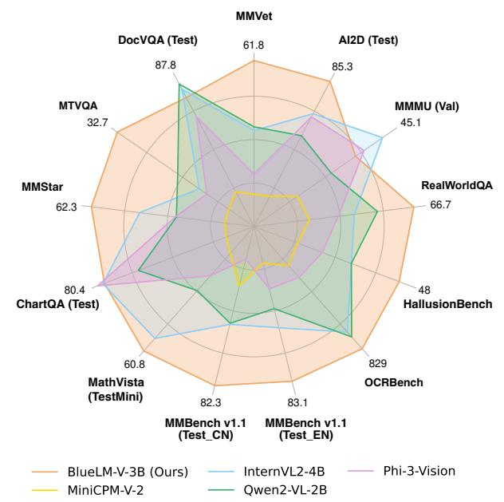
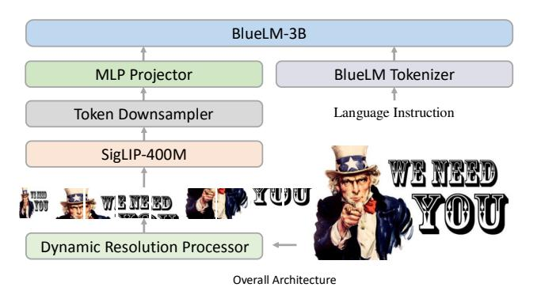
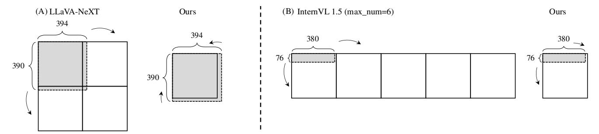
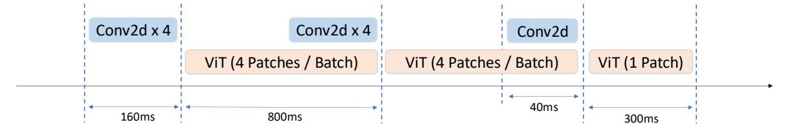
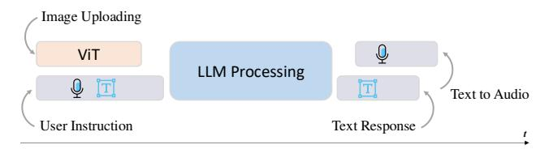
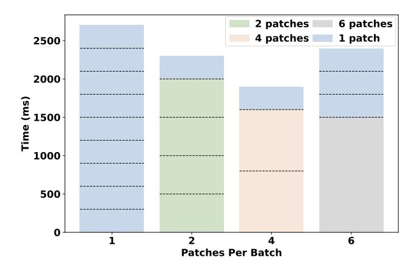
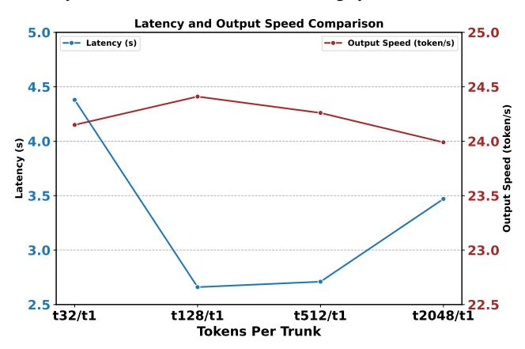

# BlueLM-V-3B: Algorithm and System Co-Design for Multimodal Large Language Models on Mobile Devices

Xudong Lu\*1,2†, Yinghao Chen\*1, Cheng Chen\*1, Hui Tan\*1, Boheng Chen¹, Yina Xie¹, Rui Hu¹, Guanxin Tan¹, Renshou Wu¹, Yan Hu¹, Yi Zeng¹, Lei Wu¹, Liuyang Bian¹, Zhaoxiong Wang¹, Long Liu¹, Yanzhou Yang¹, Han Xiao¹,2†, Aojun Zhou², Yafei Wen¹, Xiaoxin Chen¹, Shuai Ren¹‡⋈, Hongsheng Li²⋈ ¹vivo AI Lab ²CUHK MMLab

{luxudong@link,hsli@ee}.cuhk.edu.hk shuai.ren@vivo.com

#### **Abstract**

The emergence and growing popularity of multimodal large language models (MLLMs) have significant potential to enhance various aspects of daily life, from improving communication to facilitating learning and problem-solving. Mobile phones, as essential daily companions, represent the most effective and accessible deployment platform for *MLLMs*, enabling seamless integration into everyday tasks. However, deploying MLLMs on mobile phones presents challenges due to limitations in memory size and computational capability, making it difficult to achieve smooth and real-time processing without extensive optimization. In this paper, we present BlueLM-V-3B, an algorithm and system co-design approach specifically tailored for the efficient deployment of MLLMs on mobile platforms. To be specific, we redesign the dynamic resolution scheme adopted by mainstream MLLMs and implement system optimization for hardware-aware deployment to optimize model inference on mobile phones. BlueLM-V-3B boasts the following key highlights: (1) Small Size: BlueLM-V-3B features a language model with 2.7B parameters and a vision encoder with 400M parameters. (2) Fast Speed: BlueLM-V-3B achieves a generation speed of 24.4 token/s on the MediaTek Dimensity 9300 processor with 4-bit LLM weight quantization. (3) Strong Performance: BlueLM-V-3B has attained the highest average score of 66.1 on the OpenCompass benchmark among models with  $\leq 4B$  parameters and surpassed a series of models with much larger parameter sizes (e.g., MiniCPM-V-2.6, InternVL2-8B).

#### 1. Introduction

Large language models (LLMs) [8, 50, 51] have gained significant attention due to their potential to solve various complex tasks [52, 55]. Multimodal large language models (MLLMs) extend the capabilities by processing and integrating various forms of data—such as text, images, and audio—enabling richer interaction and a deeper

Figure 1. **Comparison with mainstream MLLMs.** We compare the performance of several mainstream MLLMs with a parameter count similar to that of BlueLM-V-3B across multiple benchmarks. BlueLM-V-3B leads in the majority of datasets.

understanding of context, which lead to more intuitive user experiences [3, 7, 12, 13, 41, 49, 54, 62]. As research and applications of LLMs and MLLMs continue to evolve, more studies are exploring the feasibility of deploying the models on a variety of devices, including cloud-based platforms [53], desktop PCs [46], and even edge devices [17, 22, 44, 57, 58]. This trend emphasizes the need for optimizing model performance and resource efficiency to ensure accessibility across diverse platforms.

Among available platforms, mobile phones stand out as the most efficient and accessible tool for deploying MLLMs. Firstly, it enables real-time, on-device processing, allowing users to interact with the model offline. This enhances privacy and reduces latency [17, 44]. Secondly, mobile deployment improves accessibility, allowing users to leverage advanced models anytime and anywhere, such as augmented reality or real-time translation [14, 22, 58]. Lastly, it drives research toward minimizing computational

\*Equal contribution ™Corresponding author ‡Project lead †Interns at vivo.

and memory demands to ensure efficient operation on resource-constrained hardware [53, 57].

However, deploying LLMs and MLLMs on mobile phones remains challenging. Firstly, the limited memory capacity of mobile phones restricts the deployment of largeparameter models. For example, a 4-bit quantized LLaMA 7B model requires approximately 4.5 GB of memory, which can impact system fluency due to high memory usage. Secondly, the limited computational power of mobile processors constrains inference speed. For instance, on the MediaTek Dimensity 9300 processor, a 4-bit quantized LLaMA 7B model generates around 10-15 tokens per second, limiting its suitability for real-time applications. Thirdly, mainstream MLLMs [12, 31] often use dynamic image resolution strategies to enhance high-resolution image understanding, leading to multiple inferences of ViT and excessive image tokens. This hinders image processing speed and affects overall latency for end-side deployment.

To address these challenges, we propose BlueLM-V-3B, an algorithm and system co-design approach that enables more efficient deployment of MLLMs on mobile devices. Specifically, we train a state-of-the-art MLLM with only 3B parameters and effectively deploy it on the NPU of smartphones. In terms of *algorithm* design, we find that traditional dynamic resolution schemes [12, 31] lead to exaggerated image enlargement, resulting in longer image tokens and complicating mobile deployment. We propose a relaxed aspect ratio matching method, which effectively reduces the number of image tokens without sacrificing model accuracy. In terms of *system* design, different from previous papers on end-side MLLM [14, 58], we incorporate a detailed system optimization for hardware-aware deployment. To accelerate image encoding, we design batched image encoding together with pipeline parallelism processing for the image patches generated by the dynamic resolution processor. To address the inefficiency of NPU when processing long input tokens, we adopt a token downsampling method and implement a chunked computing approach. We also enhance deployment efficiency by using mixed-precision deployment and carefully designing the overall inference framework.

Compared to previous efforts for efficient MLLM deployment on mobile phones [14, 15, 58], BlueLM-V-3B achieves higher model performance and features a more detailed algorithm and system co-design, paving the way for more powerful and efficient MLLMs optimized for mobile environments. The features of BlueLM-V-3B and the contributions of our work are summarized as follows:

- 1) Algorithm and System Initiative: We identify and address the excessive image enlargement issue in the dynamic resolution scheme used by classical MLLMs. Additionally, we implement a series of system designs and optimizations for hardware-aware deployment, resulting in more efficient inference of MLLMs on mobile devices.
  - 2) State-of-the-art MLLM Performance: BlueLM-V-

Figure 2. Model architecture of BlueLM-V-3B. The architecture of BlueLM-V-3B follows the classical LLaVA approach. We integrate a dynamic resolution processing module (as in LLaVA-NeXT [31] and InternVL 1.5 [12]) to enhance model capabilities and apply token downsampling to reduce deployment complexity.

3B achieves SOTA performance (e.g., 66.1 on the Open-Compass benchmark) among models with similar parameter sizes, even surpassing a series of MLLMs with much more parameters (e.g., MiniCPM-V-2.6, InternVL2-8B).

3) High Deployment Efficiency: BlueLM-V-3B is highly efficient when deployed on mobile phones. Take the MediaTek Dimensity 9300 processor as an example, with a memory requirement of just 2.2GB, it can encode images with a resolution of 768×1536 in approximately 2.1 seconds and achieves a token throughput speed of 24.4 token/s.

# 2. Related Works

### 2.1. Multimodal Large Language Models

Large language models (LLMs) [5, 8, 50, 51] have demonstrated impressive success in tackling various complex tasks [52, 55] in recent years. Building upon these advancements, multimodal large language models (MLLMs) incorporate visual inputs into LLMs [13, 32, 43, 63] to handle multimodal scenarios. Various methods have been designed to integrate visual knowledge into language models, such as the linear projector approach [12, 32, 54], the Q-Former approach [26], and the perceiver resampler approach [4, 7, 58]. To further enhance MLLMs' capability to comprehend high-resolution images, a dynamic resolution scheme has recently been proposed [12, 30, 31]. This scheme enables the model to adaptively process images at different resolutions while capturing more detailed information [23]. However, when deploying on mobile devices, the dynamic resolution approach presents two challenges: firstly, an excessive number of image patches can significantly slow down the processing speed of the image encoder, and secondly, long sequences of image tokens can result in increased latency in the language model [29].

## 2.2. On-device Large Language Models

As application scenarios for large models continue to expand, small-scale large language models (SLMs) are now

Figure 3. Existing methods overly enlarge images. (A) For LLaVA-NeXT, an image with resolution 394×390 selects a 2:2 aspect ratio and is resized and padded to 768×768 (4× area enlargement). (B) For InternVL 1.5, an image with resolution 380×76 chooses a 5:1 aspect ratio and is directly resized to 1920×384 (25× area enlargement). BlueLM-V-3B, in contrast, selects a 1:1 aspect ratio for both resolutions, resulting in the minimum number of image tokens after ViT encoding, which can facilitate both model training and deployment.

attracting increasing attention as consumers seek more costeffective and efficient solutions [6]. A series of SLMs have
emerged to meet these demands, including language models [1, 21, 42] and multimodal language models [12, 25,
38, 54, 58]. The compact size of these models (2-3B parameters) enables deployment on user devices, such as personal computers and mobile phones. In addition to developing smaller LLMs and MLLMs with higher performance, recent studies from a system perspective have also
introduced various methods for deploying these SLMs on
user devices, such as personal computers [56], and mobile
phones [27, 58]. Our proposed BlueLM-V-3B is an algorithm and system co-design approach that not only achieves
state-of-the-art model capability but also enables efficient
deployment of MLLMs on mobile devices.

#### 3. BlueLM-V-3B

We provide a detailed introduction of BlueLM-V-3B in this section, emphasizing its model architecture and highlighting the algorithm and system co-design that optimizes efficiency during both the training and deployment stages.

#### 3.1. Basic Network Components

**Model Architecture**: Our architecture is modified from the classical LLaVA approach [32], as it has been shown effective in prior works such as InternVL 1.5 [12] and LLaVA-NeXT [31]. The overall architecture is shown in Fig. 2. It is composed of the following components. *Image* **Encoder**: To process multimodal (image and language) inputs, we utilize the SigLIP [61] ViT for 384×384 input images, as described in [29, 58], which has 400M parameters. MLP Projector: A 2-layer MLP is employed to map the space of image tokens to LLM tokens. *LLM*: We employ an in-house 2.7B BlueLM model as the core language model to design BlueLM-V-3B. To further enhance the model's ability to understand high-resolution images, a Dynamic Resolution Processor module is integrated. We reflect on the exaggerated image enlargement issue observed in InternVL 1.5 [12] and LLaVA-NeXT [31], then introduce a new approach that improves both training and deployment efficiency. Given the limited performance of NPUs in handling long tokens, we leverage a *Token Down*sampler module to reduce deployment complexity, which will be introduced in Sec. 3.2 and Sec. 3.3 respectively.

Training and Inference: During training, the Image Encoder receives input images processed by the Dynamic Resolution Processor (for multiple input images, we simply concatenate them). The output features are passed through the Token Downsampler and MLP Projector to produce the corresponding image tokens. These image tokens are then concatenated with the language instruction tokens provided by the user. The resulting token sequences are used for model training. For inference, image and text tokens are similarly obtained (with user instructions in the audio format being converted to text first), and the model generates subsequent tokens in an autoregressive manner.

#### 3.2. Dynamic Image Resolution

The original ViT of LLaVA [32] directly resizes the input images to a fixed resolution (e.g., 336×336 or 384×384), which is not well-suited for high-resolution images. To address this issue, BlueLM-V-3B adopts a dynamic image resolution design, which has been proven effective in InternVL 1.5 [12] and LLaVA-NeXT [31]. We observe exaggerated image enlargement issues in these two methods and make improvements for better training and easier deployment. Additionally, we design a batched image patch encoding with pipeline parallelism to further enhance the efficiency of both training and inference.

**Exaggerated Image Enlargement**: LLaVA-NeXT [31] and InternVL 1.5 [12] both propose dynamic image resolution approaches to tackle high-resolution images. For the SigLIP encoder, both approaches use 384×384 as the base resolution (1:1), then select an appropriate resolution aspect ratio (*m*:*n*) to resize (and pad) the original image to a size of 384*m*×384*n*. The image is subsequently divided into patches of 384×384. LLaVA-NeXT tends to select aspect ratios that result in a larger image than the original one but with a smaller total area, while InternVL 1.5 opts for the ones that match the original image's width-to-height ratio.

We use some examples in Fig. 3 to demonstrate the exaggerated image enlargement by the two methods. For LLaVA-NeXT in Fig. 3A, given an image with  $394\times390$  resolution, it will choose a ratio of 2:2, then resize and pad the original image to  $768\times768$  ( $4\times$  area enlargement).

For InternVL 1.5 in Fig. 3B, given an image with  $380 \times 76$  resolution (setting max\_num=6, i.e.,  $m \times n \le 6$ ), it will choose a ratio of 5:1, then directly resize the original image to  $1920 \times 384$  ( $25 \times$  enlargement)1. The enlargement does not necessarily alter image information, but increases deployment difficulty on mobile devices, as higher resolutions lead to more image patches and thus longer image tokens. Therefore, we redesign the dynamic resolution approach, as will be discussed in the following paragraph.

Relaxed Aspect Ratio Matching: We propose a relaxed aspect ratio matching method based on LLaVA-NeXT to mitigate the exaggerated image enlargement. LLaVA-NeXT defines effective resolution  $R_e$  and wasted resolution  $R_w$ . For aspect ratios (m:n) that lead to image resolution  $384m \times 384n$  smaller than the original image in either dimension,  $R_e$  is defined as the maximum area of the image scaled proportionally to fit within the dimensions  $384m \times 384n$ . Otherwise,  $R_e$  is set to the area of the original image. After getting  $R_e$ ,  $R_w$  is calculated by  $384m \times 384n - R_e$ . LLaVA-NeXT explores feasible aspect ratios and searches for the largest  $R_e$  while minimizing  $R_w$ . Generally, larger aspect ratio options are available because m and n are always set to bigger values to accommodate high-resolution images (e.g., from 1:1 to 6:6 in LLaVA-One Vision [25]). In this context, LLaVA-NeXT often leads to image enlargement by selecting an aspect ratio that offers a higher resolution than the original image, resulting in the cases shown in Fig. 3A. Considering that larger resolutions (4×) do not necessarily provide additional information but rather increase training and deployment complexity, downscaling the image is a more appropriate choice.

We propose a relaxed aspect ratio matching method by leveraging a threshold to prevent the trend of always selecting larger resolutions. To be specific, we add a parameter  $\alpha^2$  such that when:

$$R_e - R_{e,\text{max}} > \alpha \cdot R_{e,\text{max}}, \tag{1}$$

or

$$(R_{e,\text{max}} - R_e) < \alpha \cdot R_{e,\text{max}} \text{ and } R_w < R_{w,\text{min}},$$
 (2)

we then update

$$R_{e,\max} \leftarrow R_e, \quad R_{w,\min} \leftarrow R_w,$$
 (3)

and record the according aspect ratio. In our design, smaller  $R_e$  with smaller  $R_w$  will have a chance to be chosen. To further increase the likelihood of selecting a smaller  $R_w$ , we enumerate the candidate aspect ratios in

Figure 4. **Batched image encoding on NPU.** We design a parallel processing scheme for image patches on the NPU. The figure illustrates the case of 4 patches being processed in parallel.

descending order, e.g., from 3:3 to 1:1 (assuming that a smaller aspect ratio leads to a smaller total area, thus a smaller  $R_w$ ). Our relaxed aspect ratio matching method allows for more flexible handling of dynamic resolution. As shown in Fig. 3, when facing these two extreme cases, our solution can still select the appropriate aspect ratio (1:1). The pseudocode of the relaxed aspect ratio matching method is shown in the supplementary material.

**Batched Image Patch Encoding**: We also propose system optimization to achieve more efficient hardware-aware training and deployment. After the dynamic resolution processing, an image is divided into several local patches, together with a thumbnail image (global patch). In the training process, we batch the image patches before inputting them into the ViT, leveraging GPU parallelism to accelerate the process and achieving a 10% speedup. For inference, we adopt a similar parallel strategy to exploit the NPU's computing capabilities. Unlike high-level languages (e.g., Python), hardware acceleration design requires lowlevel control over computing resources, such as memory layout and computational optimizations based on register size. Due to the NPU's limited computational power, all patches cannot be effectively processed simultaneously; instead, we handle a fixed batch size at a time. Fig. 4 illustrates the concurrent processing of 4 patches for a 2:4 aspect ratio (the ratio we use to process mobile phone screens) following a 4 + 4 + 1 approach. This concurrent patch processing notably reduces overall processing time.

Pipeline Parallelism in Image Patch Encoding: During the model inference process, we implement a pipeline parallelism scheme to optimize image patch encoding. Specifically, for different patches extracted from a single image, we design a parallel pipeline for the Conv2D layer in SigLIP's vision embedding module (on the CPU) and the vision transformer blocks (on the NPU). We show the encoding pipeline on MediaTek Dimensity 9300 processor with a 2:4 aspect ratio in Fig. 5. This approach helps to conceal the execution latency of the Conv2D operation.

#### 3.3. Token Downsampler

Although we have designed a relaxed aspect ratio matching method to mitigate the exaggerated image enlargement, the dynamic image resolution strategy still results in a

 $^1 The$  recently proposed adaptive gridding method in Ferret-UI 2 [28] shares a similar issue with InternVL 1.5, as strictly preserving the aspect ratio (e.g., choosing 5:1 instead of 1:1 for a  $380 \times 76$  image) results in  $\Delta_{aspect}=0$ , according to the pseudocode provided in the paper.

 $^{2}\alpha = 0.1$  in our implementation.

Figure 5. Pipeline parallelism in image encoding. We design a pipeline parallelism scheme for image encoding. The Conv2D layer in the vision embedding module of SigLIP (on the CPU) and the vision transformer blocks (on the NPU) for different image patches run parallel to improve inference speed. This image illustrates the pipeline parallelism scheme combined with batched image patch encoding.

Figure 6. Overall framework of deploying BlueLM-V-3B. We decouple ViT image processing from user instruction (text or audio) handling to enhance overall efficiency. The text responses by LLM can be further converted on the fly to audio responses.

significant number of image tokens, posing challenges for the deployment on mobile phone processors and potentially exceeding the maximum context length of the language model. For instance, with an image that selects a 2:4 aspect ratio (the resolution we use for processing mobile phone screens), we obtain a total of 9 image patches (calculated as 2 ×4 +1). This results in 729 ×9 = 6561 image tokens from SigLIP after the dynamic resolution processor, making it too long to deploy on the NPU.

Basic Practice: To reduce the excessive number of image tokens, we apply the downsampler block proposed in VILA [29]. Specifically, it concatenates every 2 × 2 tokens into a single token and then employs a linear layer to fuse the information. This effectively reduces the number of image tokens generated by SigLIP from 729 to 196, resulting in a total of 196 × 9 = 1764 image tokens for the 2:4 aspect ratio setting. However, the approximately 2k length of the image tokens, when combined with the user instruction, still poses challenges for deployment on the NPU, as will be discussed in the following paragraph.

Chunked Computing of Input Tokens: During the inference process of a LLM, to accelerate the computation of input tokens, traditional GPUs frequently employ parallel computing techniques to process all input tokens simultaneously. However, the excessive length of these tokens (due to the extended length of image tokens or the contextual information involved), combined with the limited computational capacity of NPUs, renders the parallel processing of all input tokens inefficient. Conversely, sequential processing of individual tokens (t1) is also suboptimal. Consequently, we implement a chunking strategy on mobile devices, processing 128 input tokens in parallel (t128) per iteration, and then combining the results. This approach strikes a balance between parallel processing and the computational resources available on the NPU.

# 3.4. Model Quantization and Overall Framework

With the above design and optimization, we deploy the BlueLM-V-3B model on the MediaTek Dimensity 9300 processor. We hope to take full advantage of the device's capabilities, offering a powerful yet efficient solution for running the model in a mobile environment.

Mixed Parameter Precision: We apply mixed-precision quantization to further reduce memory usage and improve inference speed. We employ INT8 precision for the ViT and the MLP projector weights, and INT4 precision for the LLM weights. This combination strikes a balance between computational efficiency and model accuracy. However, we find that the activation values are more sensitive to quantization; therefore, we maintain INT16 precision for LLM activation and FP16 for ViT and projector activation to ensure the model's performance remains robust. During inference, we store the KV cache in INT8 precision.

#### Decoupling Image Encoding and Instruction Process-

ing: To improve overall efficiency during deployment, we decouple image processing from user input handling. At model initialization, we load both the ViT and LLM models simultaneously. Users begin by uploading an image, and since the MLLM is deployed locally, this upload takes virtually no time. The ViT starts processing the image immediately after the upload is complete. Meanwhile, users can input their instructions simultaneously; for instructions in audio format, we convert them to text first. Once the image processing is finished, the user's commands are submitted to the LLM for response generation, and the ViT can be freed from memory. This parallel process, illustrated in Fig. 6, reduces the waiting time for the first token generation, improves overall responsiveness, and limits the peak memory usage of BlueLM-V-3B to 2.2GB.

# 4. Training Recipe

In this section, we detail the training process and training data for BlueLM-V-3B.

### 4.1. Training Process

We begin with the BlueLM-3B language model and train the model in two stages. In the first stage, we pre-train the MLP projection layer while keeping the ViT and LLM frozen. In the second stage, we fully fine-tune the model with a large set of image-text pairs.

### 4.2. Training Data

Pre-training Stage: The pre-training stage aims to equip the model with basic multimodal capabilities. In this stage, we utilize open-source datasets, creating a comprehensive pre-training dataset composed of 2.5 million imagecaption pairs drawn from LLaVA 558k [30], ShareGPT4V 1200k [10], and ALLaVA 708k [9].

Fine-tuning Stage: During the fine-tuning process, we meticulously construct a dataset containing 645 million image-text pairs, including both open-source and in-house datasets. This dataset covers a variety of downstream tasks and diverse dataset types, such as captioning, VQA, OCR, and pure text. Tab. 1 summarizes the distribution of data types, along with the proportions of public and in-house data in our fine-tuning dataset.

To better illustrate the data we use, we present the opensource datasets utilized at this stage in the supplementary materials. In addition to these open-source datasets, we also incorporate in-house data to enhance the model's capabilities. We crawl a significant amount of pure text data and image-text pairs from various websites. For different data categories, we also manually create a large number of image-text pairs to enrich the diversity of the training data.

For PDF documents, we utilize the PyMuPDF3 library to convert them into image-text pairs. For formula data, we use Matplotlib4 to render them into necessary representations. For table contents, we convert the data to Markdown format and render it with the IMGKit5 library. For problem-solving data, we similarly convert the text into Markdown format and render it using the IMGKit library. Additionally, we manually render a substantial amount of multilingual OCR data by converting texts in various languages into image-text pairs, which helps to enhance the model's multilingual understanding and capabilities.

In addition to image rendering, we also utilize GPT-4o [43] and Gemini Pro [48] to create and revise image captions and question-answering pairs. The combination of open-source and proprietary data significantly enhances the model's capabilities, allowing it to learn from a diverse range of examples and improve its performance across various tasks and modalities.

# 5. Experiments

In this section, we conduct a series of experiments to validate the effectiveness of our proposed approaches and to demonstrate the capabilities of BlueLM-V-3B in terms of benchmark accuracy and deployment efficiency.

| Type      | Public (M) | In-House (M) | In-House / Public |
|-----------|------------|--------------|-------------------|
| Pure Text | 2.2        | 64.7         | 29.4              |
| Caption   | 10.0       | 306.3        | 30.6              |
| VQA       | 20.3       | 44.4         | 2.2               |
| OCR       | 23.3       | 173.9        | 7.5               |
| Total     | 55.8       | 589.3        | 10.6              |

Table 1. Detailed statistics of the fine-tuning dataset. Summary of dataset types, counts (in millions), and in-house/public ratios for each category used in fine-tuning.

### 5.1. Relaxed Aspect Ratio Matching

In BlueLM-V-3B, we alleviate the issue of ineffective image upscaling present in InternVL 1.5 and LLaVA-NeXT by applying a relaxed aspect ratio matching approach. In this section, we validate the enhancements by measuring the improvements in both deployment efficiency and benchmark accuracy, with both open-source and in-house models.

Deployment Efficiency: We conduct a statistical analysis on the multimodal LLaVA [30] 665k training dataset. We omit the 41k text-only data and compare the aspect ratio selected by our approach with those chosen by the LLaVA-NeXT [31] and InternVL 1.5 [12] approaches. A larger aspect ratio selection results in higher image resolution, which leads to a longer image token sequence during deployment. We provide 9 candidate aspect ratios (from 1:1 to 3:3) for LLaVA-NeXT and our approach. For InternVL 1.5, we fix max num=9 and propose the initial candidate aspect ratios using the method described in the original paper. This will result in the same maximum area (9×384×384) for all approaches, and ensure a fair comparison.

Compared with LLaVA-NeXT, in 29k cases, our method selects a smaller aspect ratio. Concerning InternVL 1.5, we select smaller aspect ratios in 523k cases and larger aspect ratios in 25k cases. This leads to a significant improvement in efficiency during the inference on NPU.

Benchmark Accuracy: To further evaluate the performance impact of reducing image tokens, we train on the LLaVA 1.5 [30] dataset with 3 dynamic image resolution approaches. We use the 558k data for pre-training and the 665k data for fine-tuning. Due to the slower learning capacity of the 3B model compared to the 7B/13B models, we train each stage for two epochs.

We conduct experiments on both our in-house BlueLM-3B model and the open-sourced MiniCPM-2B language model [21]. The MiniCPM-2B model has 2.7B parameters, matching the parameter count of BlueLM-3B. The introduction of dynamic resolution is primarily aimed at handling high-resolution images, especially in OCR tasks. For evaluation, we use VQAv2 [19] for general vision question answering. For OCR tasks, we include TextVQA [45], DocVQA [40], and OCRBench [34]. Additionally, we eval-

3https://github.com/pymupdf/PyMuPDF

4https://github.com/matplotlib/matplotlib

5https://github.com/csquared/IMGKit

| Language Model  | Vision Model     | Params | Method               | VQAv2val | TextVQAval | DocVQAval | OCRBench | ChartQAtest |
|-----------------|------------------|--------|----------------------|----------|------------|-----------|----------|-------------|
| MiniCPM-2B [21] | SigLIP-400M [61] |        | InternVL 1.5         | 70.5     | 46.9       | 26.2      | 327      | 15.7        |
|                 |                  | 3B     | LLaVA-NeXT           | 70.1     | 44.2       | 24.3      | 324      | 14.8        |
|                 |                  |        | Ours                 | 71.8     | 49.4       | 27.3      | 343      | 16.9        |
| BlueLM-3B       | SigLIP-400M [61] |        | InternVL 1.5         | 78.3     | 52.7       | 28.7      | 338      | 16.8        |
|                 |                  | 3B     | LLaVA-NeXT           | 77.7     | 51.4       | 29.6      | 351      | 16.4        |
|                 |                  |        | Ours                 | 79.5     | 56.2       | 31.3      | 360      | 17.5        |
|                 |                  |        | Ours (fully-trained) | 82.7     | 78.4       | 86.6      | 829      | 80.4        |

Table 2. Comparison results of different dynamic resolution methods. We compare the performance of models trained using different dynamic resolution methods. We use the LLaVA [30] 558k dataset for pre-training, and the LLaVA 665k dataset for fine-tuning. To better demonstrate our improvements, we conduct experiments on both our in-house BlueLM-3B language model and the open-sourced MiniCPM-2B language model, which have similar parameter counts (2.7B). Our dynamic image processing method achieves the best performance. †We also provide the results of the fully trained BlueLM-V-3B model for reference.

| Model               | Params | Avg. | MMBench | MMStar | MMMU | MathVista | HallusionBench | AI2D | OCRBench | MMVet |
|---------------------|--------|------|---------|--------|------|-----------|----------------|------|----------|-------|
| Qwen2-VL [54]       | 8B     | 67   | 81      | 60.7   | 53.7 | 61.4      | 50.4           | 83   | 843      | 61.8  |
| MiniCPM-V-2.6 [58]  | 8B     | 65.2 | 78      | 57.5   | 49.8 | 60.6      | 48.1           | 82.1 | 852      | 60    |
| InternVL2 [12]      | 8B     | 64.1 | 79.4    | 61.5   | 51.2 | 58.3      | 45             | 83.6 | 794      | 54.3  |
| POINTS-Qwen2.5 [35] | 8.3B   | 62.5 | 78      | 60.9   | 51.4 | 63        | 45.6           | 81.2 | 717      | 47.9  |
| BlueLM-V (Ours)     | 3B     | 66.1 | 82.7    | 62.3   | 45.1 | 60.8      | 48             | 85.3 | 829      | 61.8  |

Table 3. OpenCompass benchmark. Comparison results on the OpenCompass benchmark for models with parameter sizes less than or equal to 10B. BlueLM-V-3B achieves state-of-the-art performance on 4 out of 8 tasks, with an average performance ranking of second.

| Model            | Params | TextVQAval | DocVQAtest | MTVQA |
|------------------|--------|------------|------------|-------|
| Phi-3-Vision [2] | 4.2B   | 72.4       | 84.6       | 13.9  |
| MiniCPM-V-2 [58] | 2.8B   | 73.2       | 71.9       | 9.3   |
| InternVL2 [12]   | 4B     | 74.7       | 89.2       | 15.5  |
| Qwen2-VL [54]    | 2B     | 79.9       | 90.1       | 20.7  |
| BlueLM-V (Ours)  | 3B     | 78.4       | 87.8       | 32.7  |

Table 4. Text-centric/OCR benchmarks. Comparison on textcentric/OCR benchmarks shows that BlueLM-V-3B achieves performance comparable to SOTA MLLMs with similar parameter sizes, while significantly enhancing multilingual capability. †We evaluate TextVQA and MTVQA on VLMEvalKit [18] for a fair comparison. OCRBench has been included in OpenCompass.

uate on ChartQA [39] dataset for multimodal mathematical reasoning. Comparison results are shown in Tab. 2. As can be seen, our proposed relaxed aspect ratio matching approach not only reduces the number of image tokens but also significantly improves accuracy. This indicates that simply enlarging images does not always lead to performance gains, as in LLaVA-NeXT and InternVL 1.5. The results demonstrate the effectiveness of our approach in both training outcomes and deployment efficiency.

### 5.2. Accuracies on Different Benchmarks

After extensive fine-tuning, we evaluate the performance of BlueLM-V-3B on various mainstream benchmarks.

OpenCompass Benchmark: To evaluate the overall performance of BlueLM-V-3B, we use the OpenCompass benchmark [16], including MMbench [36], MMStar [11], MMMU [60], MathVista [37], HallusionBench [20], AI2D [24], OCRBench [33], and MM-Vet [59]. BlueLM-V-3B demonstrates significantly improved performance over models with a similar number of parameters (≤ 4B), as illustrated in Fig. 1. We also compare BlueLM-V-3B to models with up to 10B parameters, with detailed results presented in Tab. 3. BlueLM-V-3B achieves SOTA performance on 4 out of 8 tasks, with an average performance ranking of second. With only 3B parameters, BlueLM-V-3B outperforms a series of MLLMs with significantly more parameters, such as InternVL2-8B [12], MiniCPM-V-2.6 (8B) [58]. This demonstrates that MLLMs with a smaller number of parameters can still achieve strong capacity.

Text-centric/OCR Capacity: We compare BlueLM-V-3B with popular MLLMs of similar parameter sizes on textcentric/OCR benchmarks, including TextVQA [45] and DocVQA [40] (OCRBench [33] has been included in Open-Compass). For MLLMs deployed on mobile devices for everyday use, especially in overseas markets or among foreign users, multilingual capabilities are essential. We also evaluate the multilingual multimodal capabilities using the MTVQA [47] dataset. The comparison results are shown in Tab. 4. BlueLM-V-3B achieves performance comparable to state-of-the-art MLLMs with similar parameter sizes, while significantly enhancing multilingual capability.

### 5.3. Deployment Efficiency Evaluation

In this section, we discuss the deployment efficiency of our proposed algorithm and system co-design in BlueLM-V-3B. We deploy BlueLM-V-3B on vivo X100 mobile phone with MediaTek Dimensity 9300 processor as an example.

Batched Image Patch Encoding on NPU: We design a parallel processing method for encoding image patches generated by the dynamic resolution processor. Fig. 7

| Model Name         | Params | Processor               | Solution          | Image Processing  | LLM Prefilling | Throughput   |
|--------------------|--------|-------------------------|-------------------|-------------------|----------------|--------------|
| MiniCPM-V 2.5 [58] | 8B     | MediaTek Dimensity 9300 | CPU (llama.cpp) / | 4.0s              | 13.9s          | 4.9 token/s  |
| BlueLM-V-3B (Ours) | 3B     | MediaTek Dimensity 9300 | NPU ,             | 2.53s (0.47+2.06) | 2.7s           | 24.4 token/s |

Table 5. Deployment efficiency comparison with MiniCPM-V. MiniCPM-V deploys an 8B model on the CPU, leading to longer image processing latency, LLM prefilling latency, and lower throughput. †MiniCPM-V calculates encoding latency by including both model loading time and encoding time. In our setting, we need 0.47s to simultaneously load the ViT and LLM once during system initialization.

Figure 7. ViT inference time for 2:4 resolution aspect ratio. We experiment with 1, 2, 4, and 6 image patches per batch on the NPU, using a 2:4 resolution aspect ratio (comprising one global patch and 8 local patches). Overall, processing 4 patches per batch delivers the fastest performance.

shows the ViT inference latency when processing an image with a 2:4 aspect ratio (9 patches in total). As illustrated, parallelizing the inference with an increasing number of patches initially reduces latency, but after a certain point, latency begins to increase again. The fastest encoding speed is achieved with 4 patches processed in parallel.

Pipeline Parallelism in Image Patch Encoding: We design a pipeline parallelism scheme for the Conv2D layer and the vision transformer block in the SigLIP model. The processing pipeline for an image with a 2:4 aspect ratio is shown in Fig. 5, where we need 1.9 + 0.16 = 2.06s to encode the image and can hide a total latency of 200ms.

Chunked Computing of Input Tokens: We implement a chunking strategy on the NPU to process 128 input tokens in parallel per iteration (t128), balancing parallel processing with NPU performance. Here, we present the LLM prefilling latency when processing different numbers of input tokens in parallel: t32, t128, t512, and t2048. For additional information, we also report the speed of output token generation, where only the t1 case is shown, as the LLM processes one token at a time for output. We fix the input token length to 2048 and set the KV cache length to 2048. As shown in Fig. 8, t128/t1 achieves the lowest latency and the fastest generation speed. Theoretically, the output token speed for t1 should remain consistent; however, we observe slight variations due to possible fluctuations in the testing environment.

Figure 8. Latency and output speed comparison. We compare the latency and output generation speed with processing different numbers of input tokens in parallel. t{x}/t1 implies processing x input tokens in parallel. The output token is fixed to 1 per trunk as the LLM can only generate one token for each forward process.

Compasison with MiniCPM-V: The MiniCPM-V paper [58] only reports the deployment statistics for the 8B MiniCPM-V 2.5 model, which is deployed on the CPU of the MediaTek Dimensity 9300 using llama.cpp6 . However, the paper does not specify the exact testing configuration, such as image resolution, context length, cache size, etc. Here, we provide a direct comparison between BlueLM-V-3B and the statistics reported in the MiniCPM-V paper [58], as shown in Tab. 5. We utilize an image with a resolution of 768×1536, fix the whole input token length to 2048, and set the KV cache length to 2048. BlueLM-V-3B achieves shorter latency and faster token throughput.

# 6. Conclusion and Future Discussions

This paper introduces BlueLM-V-3B, an algorithm and system co-design approach tailored for MLLMs on mobile platforms. Our goal is to maximize usability and performance while ensuring a positive user experience. We emphasize algorithm-system co-design and hardware-aware optimization for training MLLMs and deploying them on mobile phones. Extensive experiments and statistical analyses demonstrate the strong capability and high efficiency of BlueLM-V-3B on mobile devices. Future work will focus on optimizing the scalability of BlueLM-V-3B for a broader range of mobile devices and exploring advanced algorithms to enhance performance and usability. We hope our work will contribute to the advancement of this field of study.

6https://github.com/ggerganov/llama.cpp

# Acknowledgment

This project is funded in part by National Key R&D Program of China Project 2022ZD0161100, by the Centre for Perceptual and Interactive Intelligence (CPII) Ltd under the Innovation and Technology Commission (ITC)'s InnoHK. Hongsheng Li is a PI of CPII under the InnoHK.

# References

- [1] Marah Abdin, Sam Ade Jacobs, Ammar Ahmad Awan, Jyoti Aneja, Ahmed Awadallah, Hany Awadalla, Nguyen Bach, Amit Bahree, Arash Bakhtiari, Harkirat Behl, et al. Phi-3 technical report: A highly capable language model locally on your phone. *arXiv preprint arXiv:2404.14219*, 2024. 3
- [2] Marah Abdin, Sam Ade Jacobs, Ammar Ahmad Awan, Jyoti Aneja, Ahmed Awadallah, Hany Awadalla, Nguyen Bach, Amit Bahree, Arash Bakhtiari, Harkirat Behl, et al. Phi-3 technical report: A highly capable language model locally on your phone. *arXiv preprint arXiv:2404.14219*, 2024. 7
- [3] Josh Achiam, Steven Adler, Sandhini Agarwal, Lama Ahmad, Ilge Akkaya, Florencia Leoni Aleman, Diogo Almeida, Janko Altenschmidt, Sam Altman, Shyamal Anadkat, et al. Gpt-4 technical report. *arXiv preprint arXiv:2303.08774*, 2023. 1
- [4] Jean-Baptiste Alayrac, Jeff Donahue, Pauline Luc, Antoine Miech, Iain Barr, Yana Hasson, Karel Lenc, Arthur Mensch, Katherine Millican, Malcolm Reynolds, et al. Flamingo: A visual language model for few-shot learning. *NeurIPS*, 35: 23716–23736, 2022. 2
- [5] Rohan Anil, Andrew M Dai, Orhan Firat, Melvin Johnson, Dmitry Lepikhin, Alexandre Passos, Siamak Shakeri, Emanuel Taropa, Paige Bailey, Zhifeng Chen, et al. Palm 2 technical report. *arXiv preprint arXiv:2305.10403*, 2023. 2
- [6] Saleh Ashkboos, Iman Mirzadeh, Keivan Alizadeh, Mohammad Hossein Sekhavat, Moin Nabi, Mehrdad Farajtabar, and Fartash Faghri. Computational bottlenecks of training small-scale large language models. *arXiv preprint arXiv:2410.19456*, 2024. 3
- [7] Jinze Bai, Shuai Bai, Shusheng Yang, Shijie Wang, Sinan Tan, Peng Wang, Junyang Lin, Chang Zhou, and Jingren Zhou. Qwen-vl: A frontier large vision-language model with versatile abilities. *arXiv preprint arXiv:2308.12966*, 2023. 1, 2
- [8] Tom B Brown. Language models are few-shot learners. *arXiv preprint arXiv:2005.14165*, 2020. 1, 2
- [9] Guiming Hardy Chen, Shunian Chen, Ruifei Zhang, Junying Chen, Xiangbo Wu, Zhiyi Zhang, Zhihong Chen, Jianquan Li, Xiang Wan, and Benyou Wang. ALLaVA: Harnessing GPT4V-synthesized data for a lite vision-language model. *arXiv preprint arXiv:2402.11684*, 2024. 6
- [10] Lin Chen, Jisong Li, Xiaoyi Dong, Pan Zhang, Conghui He, Jiaqi Wang, Feng Zhao, and Dahua Lin. ShareGPT4V: Improving large multi-modal models with better captions. *arXiv preprint arXiv:2311.12793*, 2023. 6
- [11] Lin Chen, Jinsong Li, Xiaoyi Dong, Pan Zhang, Yuhang Zang, Zehui Chen, Haodong Duan, Jiaqi Wang, Yu Qiao, Dahua Lin, et al. Are we on the right way for evaluating large

- vision-language models? *arXiv preprint arXiv:2403.20330*, 2024. 7
- [12] Zhe Chen, Weiyun Wang, Hao Tian, Shenglong Ye, Zhangwei Gao, Erfei Cui, Wenwen Tong, Kongzhi Hu, Jiapeng Luo, Zheng Ma, et al. How far are we to gpt-4v? closing the gap to commercial multimodal models with open-source suites. *arXiv preprint arXiv:2404.16821*, 2024. 1, 2, 3, 6, 7
- [13] Zhe Chen, Jiannan Wu, Wenhai Wang, Weijie Su, Guo Chen, Sen Xing, Muyan Zhong, Qinglong Zhang, Xizhou Zhu, Lewei Lu, et al. Internvl: Scaling up vision foundation models and aligning for generic visual-linguistic tasks. In *Proceedings of the IEEE/CVF Conference on Computer Vision and Pattern Recognition*, pages 24185–24198, 2024. 1, 2
- [14] Xiangxiang Chu, Limeng Qiao, Xinyang Lin, Shuang Xu, Yang Yang, Yiming Hu, Fei Wei, Xinyu Zhang, Bo Zhang, Xiaolin Wei, et al. Mobilevlm: A fast, reproducible and strong vision language assistant for mobile devices. *arXiv preprint arXiv:2312.16886*, 2023. 1, 2
- [15] Xiangxiang Chu, Limeng Qiao, Xinyu Zhang, Shuang Xu, Fei Wei, Yang Yang, Xiaofei Sun, Yiming Hu, Xinyang Lin, Bo Zhang, et al. Mobilevlm v2: Faster and stronger baseline for vision language model. *arXiv preprint arXiv:2402.03766*, 2024. 2
- [16] OpenCompass Contributors. OpenCompass: A universal evaluation platform for foundation models. https:// github.com/open-compass/opencompass, 2023. 7
- [17] Yucheng Ding, Chaoyue Niu, Fan Wu, Shaojie Tang, Chengfei Lyu, and Guihai Chen. Enhancing on-device llm inference with historical cloud-based llm interactions. In *Proceedings of the 30th ACM SIGKDD Conference on Knowledge Discovery and Data Mining*, pages 597–608, 2024. 1
- [18] Haodong Duan, Junming Yang, Yuxuan Qiao, Xinyu Fang, Lin Chen, Yuan Liu, Xiaoyi Dong, Yuhang Zang, Pan Zhang, Jiaqi Wang, Dahua Lin, and Kai Chen. Vlmevalkit: An opensource toolkit for evaluating large multi-modality models, 2024. 7
- [19] Yash Goyal, Tejas Khot, Douglas Summers-Stay, Dhruv Batra, and Devi Parikh. Making the v in vqa matter: Elevating the role of image understanding in visual question answering. In *Proceedings of the IEEE conference on computer vision and pattern recognition*, pages 6904–6913, 2017. 6
- [20] Tianrui Guan, Fuxiao Liu, Xiyang Wu, Ruiqi Xian, Zongxia Li, Xiaoyu Liu, Xijun Wang, Lichang Chen, Furong Huang, Yaser Yacoob, et al. Hallusionbench: An advanced diagnostic suite for entangled language hallucination and visual illusion in large vision-language models. *arXiv preprint arXiv:2310.14566*, 2023. 7
- [21] Shengding Hu, Yuge Tu, Xu Han, Chaoqun He, Ganqu Cui, Xiang Long, Zhi Zheng, Yewei Fang, Yuxiang Huang, Weilin Zhao, et al. MiniCPM: Unveiling the potential of small language models with scalable training strategies. *arXiv preprint arXiv:2404.06395*, 2024. 3, 6, 7
- [22] Wenyue Hua, Mengting Wan, Shashank Vadrevu, Ryan Nadel, Yongfeng Zhang, and Chi Wang. Interactive speculative planning: Enhance agent efficiency through co-design of system and user interface, 2024. 1

- [23] Mingxin Huang, Yuliang Liu, Dingkang Liang, Lianwen Jin, and Xiang Bai. Mini-monkey: Multi-scale adaptive cropping for multimodal large language models. *arXiv preprint arXiv:2408.02034*, 2024. 2
- [24] Aniruddha Kembhavi, Mike Salvato, Eric Kolve, Minjoon Seo, Hannaneh Hajishirzi, and Ali Farhadi. A diagram is worth a dozen images. In *Computer Vision–ECCV 2016: 14th European Conference, Amsterdam, The Netherlands, October 11–14, 2016, Proceedings, Part IV 14*, pages 235– 251. Springer, 2016. 7
- [25] Bo Li, Yuanhan Zhang, Dong Guo, Renrui Zhang, Feng Li, Hao Zhang, Kaichen Zhang, Yanwei Li, Ziwei Liu, and Chunyuan Li. Llava-onevision: Easy visual task transfer. *arXiv preprint arXiv:2408.03326*, 2024. 3, 4
- [26] Junnan Li, Dongxu Li, Silvio Savarese, and Steven Hoi. Blip-2: Bootstrapping language-image pre-training with frozen image encoders and large language models. In *International conference on machine learning*, pages 19730– 19742. PMLR, 2023. 2
- [27] Luchang Li, Sheng Qian, Jie Lu, Lunxi Yuan, Rui Wang, and Qin Xie. Transformer-lite: High-efficiency deployment of large language models on mobile phone gpus. *arXiv preprint arXiv:2403.20041*, 2024. 3
- [28] Zhangheng Li, Keen You, Haotian Zhang, Di Feng, Harsh Agrawal, Xiujun Li, Mohana Prasad Sathya Moorthy, Jeff Nichols, Yinfei Yang, and Zhe Gan. Ferret-ui 2: Mastering universal user interface understanding across platforms. *arXiv preprint arXiv:2410.18967*, 2024. 4
- [29] Ji Lin, Hongxu Yin, Wei Ping, Yao Lu, Pavlo Molchanov, Andrew Tao, Huizi Mao, Jan Kautz, Mohammad Shoeybi, and Song Han. Vila: On pre-training for visual language models, 2023. 2, 3, 5
- [30] Haotian Liu, Chunyuan Li, Yuheng Li, and Yong Jae Lee. Improved baselines with visual instruction tuning, 2023. 2, 6, 7
- [31] Haotian Liu, Chunyuan Li, Yuheng Li, Bo Li, Yuanhan Zhang, Sheng Shen, and Yong Jae Lee. LLaVA-NeXT: Improved reasoning, OCR, and world knowledge, 2024. 2, 3, 6
- [32] Haotian Liu, Chunyuan Li, Qingyang Wu, and Yong Jae Lee. Visual instruction tuning. *NeurIPS*, 36, 2024. 2, 3
- [33] Yuliang Liu, Zhang Li, Hongliang Li, Wenwen Yu, Mingxin Huang, Dezhi Peng, Mingyu Liu, Mingrui Chen, Chunyuan Li, Lianwen Jin, et al. On the hidden mystery of OCR in large multimodal models. *arXiv preprint arXiv:2305.07895*, 2023. 7
- [34] Yuliang Liu, Zhang Li, Biao Yang, Chunyuan Li, Xucheng Yin, Cheng-lin Liu, Lianwen Jin, and Xiang Bai. On the hidden mystery of ocr in large multimodal models. *arXiv preprint arXiv:2305.07895*, 2023. 6
- [35] Yuan Liu, Zhongyin Zhao, Ziyuan Zhuang, Le Tian, Xiao Zhou, and Jie Zhou. Points: Improving your visionlanguage model with affordable strategies. *arXiv preprint arXiv:2409.04828*, 2024. 7
- [36] Yuan Liu, Haodong Duan, Yuanhan Zhang, Bo Li, Songyang Zhang, Wangbo Zhao, Yike Yuan, Jiaqi Wang, Conghui He, Ziwei Liu, et al. Mmbench: Is your multi-modal model an all-around player? In *European Conference on Computer Vision*, pages 216–233. Springer, 2025. 7

- [37] Pan Lu, Hritik Bansal, Tony Xia, Jiacheng Liu, Chunyuan Li, Hannaneh Hajishirzi, Hao Cheng, Kai-Wei Chang, Michel Galley, and Jianfeng Gao. MathVista: Evaluating mathematical reasoning of foundation models in visual contexts. *arXiv preprint arXiv:2310.02255*, 2023. 7
- [38] Gen Luo, Xue Yang, Wenhan Dou, Zhaokai Wang, Jifeng Dai, Yu Qiao, and Xizhou Zhu. Mono-internvl: Pushing the boundaries of monolithic multimodal large language models with endogenous visual pre-training. *arXiv preprint arXiv:2410.08202*, 2024. 3
- [39] Ahmed Masry, Do Xuan Long, Jia Qing Tan, Shafiq Joty, and Enamul Hoque. ChartQA: A benchmark for question answering about charts with visual and logical reasoning. *arXiv preprint arXiv:2203.10244*, 2022. 7
- [40] Minesh Mathew, Dimosthenis Karatzas, and CV Jawahar. DocVQA: A dataset for VQA on document images. In *WACV*, pages 2200–2209, 2021. 6, 7
- [41] Brandon McKinzie, Zhe Gan, Jean-Philippe Fauconnier, Sam Dodge, Bowen Zhang, Philipp Dufter, Dhruti Shah, Xianzhi Du, Futang Peng, Floris Weers, et al. MM1: Methods, analysis & insights from multimodal LLM pre-training. *arXiv preprint arXiv:2403.09611*, 2024. 1
- [42] Sachin Mehta, Mohammad Hossein Sekhavat, Qingqing Cao, Maxwell Horton, Yanzi Jin, Chenfan Sun, Seyed Iman Mirzadeh, Mahyar Najibi, Dmitry Belenko, Peter Zatloukal, et al. Openelm: An efficient language model family with open training and inference framework. In *Workshop on Efficient Systems for Foundation Models II@ ICML2024*, 2024. 3
- [43] OpenAI. Gpt-4 technical report. 2023. 2, 6
- [44] Guanqiao Qu, Qiyuan Chen, Wei Wei, Zheng Lin, Xianhao Chen, and Kaibin Huang. Mobile edge intelligence for large language models: A contemporary survey. *arXiv preprint arXiv:2407.18921*, 2024. 1
- [45] Amanpreet Singh, Vivek Natarajan, Meet Shah, Yu Jiang, Xinlei Chen, Dhruv Batra, Devi Parikh, and Marcus Rohrbach. Towards vqa models that can read. In *Proceedings of the IEEE/CVF conference on computer vision and pattern recognition*, pages 8317–8326, 2019. 6, 7
- [46] Yixin Song, Zeyu Mi, Haotong Xie, and Haibo Chen. Powerinfer: Fast large language model serving with a consumergrade gpu. *arXiv preprint arXiv:2312.12456*, 2023. 1
- [47] Jingqun Tang, Qi Liu, Yongjie Ye, Jinghui Lu, Shu Wei, Chunhui Lin, Wanqing Li, Mohamad Fitri Faiz Bin Mahmood, Hao Feng, Zhen Zhao, Yanjie Wang, Yuliang Liu, Hao Liu, Xiang Bai, and Can Huang. Mtvqa: Benchmarking multilingual text-centric visual question answering, 2024. 7
- [48] Gemini Team, Petko Georgiev, Ving Ian Lei, Ryan Burnell, Libin Bai, Anmol Gulati, Garrett Tanzer, Damien Vincent, Zhufeng Pan, Shibo Wang, et al. Gemini 1.5: Unlocking multimodal understanding across millions of tokens of context. *arXiv preprint arXiv:2403.05530*, 2024. 6
- [49] Shengbang Tong, Ellis Brown, Penghao Wu, Sanghyun Woo, Manoj Middepogu, Sai Charitha Akula, Jihan Yang, Shusheng Yang, Adithya Iyer, Xichen Pan, et al. Cambrian-1: A fully open, vision-centric exploration of multimodal llms. *arXiv preprint arXiv:2406.16860*, 2024. 1
- [50] Hugo Touvron, Thibaut Lavril, Gautier Izacard, Xavier Martinet, Marie-Anne Lachaux, Timothee Lacroix, Baptiste ´

- Roziere, Naman Goyal, Eric Hambro, Faisal Azhar, et al. ` Llama: Open and efficient foundation language models. *arXiv preprint arXiv:2302.13971*, 2023. 1, 2
- [51] Hugo Touvron, Louis Martin, Kevin Stone, Peter Albert, Amjad Almahairi, Yasmine Babaei, Nikolay Bashlykov, Soumya Batra, Prajjwal Bhargava, Shruti Bhosale, et al. Llama 2: Open foundation and fine-tuned chat models. *arXiv preprint arXiv:2307.09288*, 2023. 1, 2
- [52] Trieu H Trinh, Yuhuai Wu, Quoc V Le, He He, and Thang Luong. Solving olympiad geometry without human demonstrations. *Nature*, 625(7995):476–482, 2024. 1, 2
- [53] Guanqun Wang, Jiaming Liu, Chenxuan Li, Yuan Zhang, Junpeng Ma, Xinyu Wei, Kevin Zhang, Maurice Chong, Renrui Zhang, Yijiang Liu, et al. Cloud-device collaborative learning for multimodal large language models. In *Proceedings of the IEEE/CVF Conference on Computer Vision and Pattern Recognition*, pages 12646–12655, 2024. 1, 2
- [54] Peng Wang, Shuai Bai, Sinan Tan, Shijie Wang, Zhihao Fan, Jinze Bai, Keqin Chen, Xuejing Liu, Jialin Wang, Wenbin Ge, et al. Qwen2-vl: Enhancing vision-language model's perception of the world at any resolution. *arXiv preprint arXiv:2409.12191*, 2024. 1, 2, 3, 7
- [55] Jason Wei, Yi Tay, Rishi Bommasani, Colin Raffel, Barret Zoph, Sebastian Borgeaud, Dani Yogatama, Maarten Bosma, Denny Zhou, Donald Metzler, et al. Emergent abilities of large language models. *arXiv preprint arXiv:2206.07682*, 2022. 1, 2
- [56] Jianyu Wei, Shijie Cao, Ting Cao, Lingxiao Ma, Lei Wang, Yanyong Zhang, and Mao Yang. T-mac: Cpu renaissance via table lookup for low-bit llm deployment on edge. *arXiv preprint arXiv:2407.00088*, 2024. 3
- [57] Zhenliang Xue, Yixin Song, Zeyu Mi, Le Chen, Yubin Xia, and Haibo Chen. Powerinfer-2: Fast large language model inference on a smartphone. *arXiv preprint arXiv:2406.06282*, 2024. 1, 2
- [58] Yuan Yao, Tianyu Yu, Ao Zhang, Chongyi Wang, Junbo Cui, Hongji Zhu, Tianchi Cai, Haoyu Li, Weilin Zhao, Zhihui He, et al. Minicpm-v: A gpt-4v level mllm on your phone. *arXiv preprint arXiv:2408.01800*, 2024. 1, 2, 3, 7, 8
- [59] Weihao Yu, Zhengyuan Yang, Linjie Li, Jianfeng Wang, Kevin Lin, Zicheng Liu, Xinchao Wang, and Lijuan Wang. Mm-vet: Evaluating large multimodal models for integrated capabilities. *arXiv preprint arXiv:2308.02490*, 2023. 7
- [60] Xiang Yue, Yuansheng Ni, Kai Zhang, Tianyu Zheng, Ruoqi Liu, Ge Zhang, Samuel Stevens, Dongfu Jiang, Weiming Ren, Yuxuan Sun, et al. Mmmu: A massive multi-discipline multimodal understanding and reasoning benchmark for expert agi. In *Proceedings of the IEEE/CVF Conference on Computer Vision and Pattern Recognition*, pages 9556– 9567, 2024. 7
- [61] Xiaohua Zhai, Basil Mustafa, Alexander Kolesnikov, and Lucas Beyer. Sigmoid loss for language image pre-training. In *Proceedings of ICCV*, pages 11975–11986, 2023. 3, 7
- [62] Haotian Zhang, Mingfei Gao, Zhe Gan, Philipp Dufter, Nina Wenzel, Forrest Huang, Dhruti Shah, Xianzhi Du, Bowen Zhang, Yanghao Li, Sam Dodge, Keen You, Zhen Yang, Aleksei Timofeev, Mingze Xu, Hong-You Chen, Jean-Philippe Fauconnier, Zhengfeng Lai, Haoxuan You, Zirui

- Wang, Afshin Dehghan, Peter Grasch, and Yinfei Yang. Mm1.5: Methods, analysis & insights from multimodal llm fine-tuning, 2024. 1
- [63] Renrui Zhang, Jiaming Han, Aojun Zhou, Xiangfei Hu, Shilin Yan, Pan Lu, Hongsheng Li, Peng Gao, and Yu Qiao. Llama-adapter: Efficient fine-tuning of language models with zero-init attention. *arXiv preprint arXiv:2303.16199*, 2023. 2