# MobileVLM: A Fast, Strong and Open Vision Language Assistant for Mobile Devices

Xiangxiang Chu1 , Limeng Qiao1 , Xinyang Lin1 , Shuang Xu1 , Yang Yang1,3\*, Yiming Hu1 , Fei Wei1 , Xinyu Zhang1 , Bo Zhang1 , Xiaolin Wei1 , Chunhua Shen2

1 Meituan Inc. 2 Zhejiang University, China 3 Dalian University of Technology, China

### Abstract

*We present MobileVLM, a competent multimodal vision language model (MMVLM) targeted to run on mobile devices. It is an amalgamation of a myriad of architectural designs and techniques that are mobile-oriented, which comprises a set of language models at the scale of 1.4B and 2.7B parameters, trained from scratch, a multimodal vision model that is pre-trained in the CLIP fashion, crossmodality interaction via an efficient projector. We evaluate MobileVLM on several typical VLM benchmarks. Our models demonstrate on par performance compared with a few much larger models. More importantly, we measure the inference speed on both a Qualcomm Snapdragon 888 CPU and an NVIDIA Jeston Orin GPU, and we obtain state-ofthe-art performance of 21.5 tokens and 65.3 tokens per second, respectively. Our models are available at:* [https:](https://github.com/Meituan-AutoML/MobileVLM) [//github.com/Meituan-AutoML/MobileV LM](https://github.com/Meituan-AutoML/MobileVLM)

### 1. Introduction

Large multimodal models (LMMs), especially the family of Visual Language Models (VLMs), rise as a promising research direction for building general-purpose assistants due to their substantially enhanced capability in both perception and reasoning [\[127\]](#page-15-0). However, it has been challenging to connect the representations of the pre-trained large language models (LLMs) [\[26,](#page-12-0) [49,](#page-13-0) [115,](#page-15-1) [118,](#page-15-2) [131\]](#page-16-0) and the vision models to unveil the cross-modality properties, such as visual question answering, image captioning, visual knowledge reasoning and conversation, *etc.*

Remarkable performance on this task can be witnessed in GPT-4V [\[90\]](#page-14-0) and Gemini [\[45\]](#page-12-1), and the evaluation of their abilities can be found in [\[1,](#page-11-0)[41\]](#page-12-2). However, very limited technical details are available for these proprietary models. Simultaneously in the research community, a line of language tuning methods have been proposed [\[2,](#page-11-1) [5,](#page-11-2) [30,](#page-12-3) [66,](#page-13-1) [74,](#page-14-1) [76,](#page-14-2) [78,](#page-14-3) [122,](#page-15-3) [126,](#page-15-4) [133\]](#page-16-1). For instance, Flamingo [\[2\]](#page-11-1) exploits visual tokens to condition the frozen language model via gated cross-attention layers. BLIP-2 [\[66\]](#page-13-1) argues that such interaction is insufficient and introduces a lightweight querying transformer (called Q-Former) that extracts the most useful features from the frozen vision encoder and feeds them directly into the frozen LLM. MiniGPT-4 [\[133\]](#page-16-1) aligns a frozen visual encoder from BLIP-2 [\[66\]](#page-13-1) with a frozen language model Vicuna [\[118\]](#page-15-2) via only one projection layer. Independently, LLaVA [\[76\]](#page-14-2) applies a simple trainable projector that converts the vision features into embedding tokens, which have the same dimension as the word embeddings to be processed by the language model altogether.

Noticeably, training strategies also exhibit a shift to accommodate the large-scale multimodal data of great diversity. LLaVA may be the first attempt to replicate the *instruction tuning paradigm* from LLMs to the multimodal scenario. To generate multimodal instruction-following data, it feeds textual information such as captions and boundingbox coordinates of images to language-only GPT-4 [\[89\]](#page-14-4). MiniGPT-4 [\[133\]](#page-16-1) is firstly trained on a combined image captioning dataset and then fine-tuned on a curated alignment dataset of image-text pairs. InstructBLIP [\[30\]](#page-12-3) enforces vision-language instruction tuning based on the pretrained BLIP-2 model, where the Q-Former is trained on a diverse set of datasets organized in an instruction-tuning format. mPLUG-Owl [\[126\]](#page-15-4) introduces a two-stage training strategy where the visual part is pre-trained first and the large language model LLaMA [\[115\]](#page-15-1) is then fine-tuned with LoRA [\[51\]](#page-13-2) with instruction data from various sources.

Despite the advances mentioned above of VLMs, there is a natural demand to enable cross-modality capacities in resource-constrained scenarios. Gemini [\[45\]](#page-12-1) surpasses state-of-the-art performance on a range of multimodal benchmarks and introduces mobile-scale VLMs with 1.8B and 3.25B parameters for low-memory devices. Common compression techniques such as distillation and quantization are also exploited for this purpose. *We aim to build the first open, mobile-scale VLMs trained using public datasets*

\*Work done as an intern at Meituan.

*and available techniques to achieve visual perception and reasoning, customized for resource-constrained platforms.* Our contributions are as follows:

- 1. We present MobileVLM, a full-stack remake of multimodal visual language models tailored for mobile scenarios. To our knowledge, we are the first to provide a detailed, reproducible, and strong vision language model from scratch. With controlled and open-source datasets, we build a set of high-performance foundation language models and multimodal models.
- 2. We make extensive ablation studies on the design of visual encoders and systematically evaluate the VLM performance sensitivity on various training paradigms, input resolutions, and model sizes.
- 3. We design an efficient projector between visual and text features, which better aligns multimodal features while reducing the inference budget.
- 4. Our model is crafted to run efficiently on mobile, lowpower devices, with a measured speed of 21.5 tokens/s on a Qualcomm mobile CPU and 65.3 tokens/s on a Jeston Orin GPU respectively.
- 5. Our models perform comparably on a large body of VLM benchmarks, attesting their potential in numerous tasks in practice. Although we mainly focus on edge scenarios, our model outperforms many recent VLMs, which can only be supported by powerful GPUs in the cloud.

### 2. Related Work

# 2.1. Vision Transformer

Vision Transformer [\[34\]](#page-12-4) is now the dominant backbone for visual perception. Its sequel methods such as Swin [\[81\]](#page-14-5), DeiT [\[114\]](#page-15-5), PVT [\[121\]](#page-15-6), and Twins [\[22\]](#page-12-5) have upgraded its original architectural design to strengthen its representational power and efficiency. The pre-training paradigm has also experienced several shifts, from image-supervised learning (*i.e*. labeled classification) to unsupervised learning like masked auto-encoders [\[47\]](#page-12-6), and most recently to language-supervised training as advertised by CLIP [\[97\]](#page-14-6), which empowered ViTs with unprecedented zero-shot capability. VLMo [\[6\]](#page-11-3) enhances CLIP with unified multimodality training.

### 2.2. LLMs

Large language models often come with billions of parameters and are pre-trained on extremely extensive text corpora, exhibiting emergent capabilities [\[123\]](#page-15-7) that have not been witnessed before. They have reshaped the field of natural language processing and are being used in a wide range of applications. To date, proprietary LLMs like GPT-4 [\[89\]](#page-14-4) prevail over open-sourced models. Nevertheless, the community is exuberant with the continuous model releases, including GLM [\[35\]](#page-12-7), BLOOM [\[65\]](#page-13-3), OPT [\[131\]](#page-16-0) and LLaMA series [\[115,](#page-15-1)[116\]](#page-15-8). Many recent works [\[4,](#page-11-4)[132\]](#page-16-2) have been built on top of them.

Noticeably, there is a trend to build smaller language models, *i.e*., whose parameters are around 1B or fewer. To name a few, GPT-Neo [\[9\]](#page-11-5), Pythia [\[7\]](#page-11-6), GALACTICA [\[112\]](#page-15-9), OpenLLaMA [\[43\]](#page-12-8), Phi [\[46,](#page-12-9) [70\]](#page-13-4), Qwen [\[4\]](#page-11-4) all ship language models at such sizes. Although privately collected high-quality data can significantly boost the performance of LLMs [\[4,](#page-11-4) [70\]](#page-13-4), our target is to build reproducible and efficient models, hence we do not utilize any non-public data for our research.

### 2.3. VLMs

Throughout recent years, a school of vision language models has rapidly emerged. Table [1](#page-2-0) summarizes them in a detailed comparison regarding architectures, crossmodality design, and training corpora.

Architecture choices. As a consequence of the intimidating training cost of large language models, most language models used in VLMs are pre-trained open-source models like OPT [\[131\]](#page-16-0), Flan-T5 [\[26\]](#page-12-0), Chinchilla [\[63\]](#page-13-5), Vicuna [\[118\]](#page-15-2) and LLaMA [\[115\]](#page-15-1). QWen adapts LLaMA with custom variations [\[4\]](#page-11-4) to obtain an LLM on their own.

Visual backbones in VLMs are typically vision transformer [\[34\]](#page-12-4), but pre-trained in various strategies [\[37](#page-12-10)[,66](#page-13-1)[,97\]](#page-14-6). Most VLMs prefer CLIP-fashioned ViT [\[97\]](#page-14-6) trained with natural language supervision. Flamingo picks NFNet-F6 [\[59\]](#page-13-6). KOSMOS chooses VLMo [\[6\]](#page-11-3) instead.

Dataset-centric-ness. The construction of training data has become increasingly crucial. It is common to utilize millions of text-image pairs in the line of VLMs, where the new datasets are usually released alongside their corresponding new models. To name a few, apart from an enhanced visual receptor and novel language model called Qwen-LM [\[4\]](#page-11-4), the multilingual multimodal Qwen-VL [\[5\]](#page-11-2) additionally aligns the image with caption and box tuples, which sets a new record of generalist models. PALI [\[19\]](#page-11-7) and PALI-X [\[18\]](#page-11-8) consume an internal multi-language image-text dataset called WebLI at a scale of 12 billion. Most recently, observing the constraints of current imagetext datasets like hallucination and inaccurate descriptions, ShareGPT4V [\[16\]](#page-11-9) exploits GPT-4V [\[90\]](#page-14-0) for generating 1.2M high-quality image-text pairs with which can surpass the LLaVA series. Similarly built with GPT-4V, LVIS-INSTRUCT4V [\[120\]](#page-15-10) helps LLaVA-1.5 to gain substantial improvement on various VLM benchmarks.

| Model                         | Vision Encoder                     | Language Model  | Cross-modality Design             | Multimodal Training Corpora                                                 |
|-------------------------------|------------------------------------|-----------------|-----------------------------------|-----------------------------------------------------------------------------|
| CLIP [97]                     | ViT, ResNet                        | Transformer     | Linear-Projection                 | WebImageText [97] (400M image-text pairs)                                   |
| BLIP [67]                     | ViT                                | MED∗            | Cross-Attention                   | COCO [73], VG [62], CC3M [103], CC12M [13], LAION [102]                     |
| BLIP-2 [66]                   | CLIP/Eva-CLIP ViT                  | OPT, Flan-T5    | Q-Former                          | same as BLIP                                                                |
| InstructBLIP [30]             | ViT-G/14                           | Flan-T5, Vicuna | Q-Former w/ FC                    | 13 held-in out of 26 public datasets                                        |
| Flamingo [2]                  | NFNet-F6 [59]                      | Chinchilla      |                                   | Perceiver-Resampler [57] M3W(43M), ALIGN(1.4B) [58], LTIP (312M), VTP (27M) |
| LLaVA [76]                    | CLIP ViT-L/14                      | Vicuna 7B/13B   | Linear-Projection                 | filtered CC-595K from CC3M [103], LLaVA-Instruct-158K                       |
| LLaVA-1.5 [74]                | CLIP ViT-L@336                     | Vicuna-7B/13B   | MLP                               | a subset of InstructBLIP (1.2M)                                             |
| MiniGPT-4 [133]               | EVA-CLIP ViT-G/14                  | Vicuna-7B       | Q-Former                          | LAION, CC, SBU [91]                                                         |
| Shikra [15]                   | CLIP ViT-L/14                      | Vicuna-7/13B    | FC-layer                          | Flickr30K [95], RefCOCO [61], VG, Visual-7W [85]                            |
| mPLUG-Owl [126] CLIP ViT-L/14 |                                    | LLaMA-7B        | Cross-Attention                   | LAION-400M, COYO-700M [11], CC, COCO                                        |
| KOSMOS-2 [94]                 | VLMo [6]                           |                 | MAGNETO [119] Perceiver-Resampler | GRIT (curated with LAION-2B, COYO-700M)                                     |
| QWen-VL [5]                   | Openclip ViT-bigG [54] Qwen-LM     |                 | Cross-Attention                   | multi-tasking datasets (Captioning, VQA, Grounding, etc. )                  |
| ShareGPT4V [16]               | CLIP ViT-L/14@336                  | Vicuna-7B       | MLP                               | ShareGPT4V (100K by GPT-4V, 1.2M by its learned model)                      |
|                               | MobileVLM (ours) CLIP ViT-L/14@336 | MobileLLaMA     | LDP                               | same as LLaVA-1.5 [74]                                                      |

Table 1. Comparison of open-source VLM architectures and their training corpora. ∗ : BLIP adopts a multimodal encoder/decoder.

### 2.4. Model Compression for LLMs

Large Language Models (LLMs) have brought a paradigm shift in natural language processing, while their colossal size and computational requirements pose significant challenges for real-world deployment, particularly in environments with limited resources. The size of these models often results in high memory usage and slow processing speeds. Additionally, the energy requirements for training and operating these models raise sustainability concerns. These challenges are becoming more pressing as LLMs continue to grow in size and complexity. In response to these challenges, model compression has emerged as a crucial research area, which aims to reduce the size and computational demands of models without significantly compromising their performance. These techniques include but not limited to model pruning [\[38,](#page-12-11) [84,](#page-14-13) [109\]](#page-15-12), quantization [\[39,](#page-12-12)[68,](#page-13-14)[124\]](#page-15-13), knowledge distillation [\[130\]](#page-15-14) and low-rank decomposition [\[125\]](#page-15-15).

Besides, LLM deployment tools have experienced a blossom, evidenced by industrial frameworks like TensorRT-LLM [\[87\]](#page-14-14), LMDeploy [\[55\]](#page-13-15), and llama.cpp [\[44\]](#page-12-13) being developed to tackle deployment difficulties in diverse environments.

### 2.5. VLM Benchmarks

Systematic and comprehensive evaluations of different VLMs are of great necessity. To this end, POPE [\[71\]](#page-13-16) provides a benchmark for evaluating hallucination in VLMs, which formulates the evaluation as a binary classification task that prompts the VLMs to answer whether the object exists. In contrast, GQA [\[52\]](#page-13-17) mainly centers around the VLMs' abilities in real-world reasoning, scene understanding, and compositional question answering. TextVQA [\[105\]](#page-15-16) consists of questions related to the text in the image, evaluating the OCR and reasoning abilities of models. ScienceQA [\[83\]](#page-14-15) consists of multimodal multiple-choice questions covering scientific topics, *e.g*., natural science, social science, and language science, which requires VLMs to integrate common sense into reasoning. MME [\[40\]](#page-12-14) measures both the perception and cognition abilities of VLMs, it covers a total of 14 subtasks varying from coarse-grained to fine-grained ones. MMBench [\[80\]](#page-14-16) is a methodically constructed multimodal dataset, which collectively covers a diverse spectrum of 20 fine-grained skills and involves a circular evaluation strategy with the incorporation of Chat-GPT [\[88\]](#page-14-17).

# 2.6. Embodied AI

Our work is closely related to Embodied Artificial Intelligence. Being one of the central goals of Artificial General Intelligence, embodied AI strives to build egocentric intelligence systems that can interact with their surroundings with perception, reasoning, and planning capabilities [\[36\]](#page-12-15). Recently, the emerging large vision language models [\[86,](#page-14-18) [106,](#page-15-17) [108\]](#page-15-18) allow embodied AI agents to resolve the relevant tasks like *embodied question answering* [\[32\]](#page-12-16), and *vision-language navigation* [\[69,](#page-13-18) [92\]](#page-14-19) in a highly end-to-end fashion.

### 3. MobileVLM

### 3.1. Overall Architectural Design

With the primary goal of achieving efficient visual perception and reasoning for resource-limited edge devices in mind, we design the overall architecture of MobileVLM as illustrated in Figure [1.](#page-4-0) It contains three components: *1) a visual encoder, 2) a tailored LLM for edge devices (MobileL-LaMA), and 3) an efficient projector (termed "lightweight downsample projector", LDP) that aligns the visual and the* textual space.

Taking an image  $\mathbf{X}_v \in \mathbb{R}^{H \times W \times C}$  as input, the vision encoder  $\mathbf{F}_{enc}$  extracts the visual embeddings  $f \in \mathbb{R}^{N_v \times D_v}$  for image perception, where  $N_v = HW/P^2$  denotes the number of image patches and  $D_v$  denotes the hidden size of visual embeddings. To alleviate the efficiency issues arising from prolonged image tokens, we scheme a lightweight projector  $\mathbf{P}$  for visual feature compression and visual-text modal alignment. It converts f into the word embedding space with an appropriate input dimension of the subsequent language model as below,

$$\mathbf{H}_v = \mathbf{P}(f), f = \mathbf{F}_{enc}(\mathbf{X}_v). \tag{1}$$

Thus we obtain the image tokens  $\mathbf{H}_v \in \mathbb{R}^{(N_v/4) \times D_t}$  and text tokens  $\mathbf{H}_q \in \mathbb{R}^{N_t \times D_t}$ , where  $N_t$  denotes the number of text tokens and  $D_t$  denotes the hidden size of the word embedding space. Observing that LLM occupies the most computation and memory consumption in the current design paradigm of MLLMs, we tailor a series of inference-friendly LLMs that enjoy advantages in speed for mobile applications. It predicts the response  $\mathbf{Y}_a = \{y_i\}_{i=1}^L$  conditioned on the multimodal input in an autoregressive manner, where L denotes the output token length. This process can be formulated as,

$$p(\mathbf{Y}_a|\mathbf{H}_v, \mathbf{H}_q) = \prod_{i=1}^{L} p(y_i|\mathbf{H}_v, \mathbf{H}_q, y_{< i}).$$
 (2)

#### 3.2. Visual Encoder

Based on empirical analysis later shown in Sec 5.1, we leverage the pre-trained CLIP ViT-L/14 [97] with a resolution of  $336 \times 336$  as our visual encoder  $\mathbf{F}_{enc}$ . The Vision Transformer (ViT) [34] dissects images into uniform-sized patches, applies a linear embedding to each, and integrates positional encodings before feeding the resultant vector sequence into a canonical Transformer encoder. Typically, a classification token is appended to this sequence for subsequent categorization tasks.

#### 3.3. MobileLLaMA

For the language model, we downscale LLaMA [115] to facilitate the off-the-shelf deployment, *i.e.*, our models can be seamlessly supported by almost all popular inference frameworks. Moreover, we evaluate the model latency on the edge devices to guide the model design. Neural architecture search [12,24,25,50,77] would be a better choice, but for the time being we keep it as our future work. The detailed setting of our architecture is shown in Table 2.

Specifically, we utilize the sentence piece tokenizer [63] from LLaMA2 [116] with a vocabulary size of 32000 and train the embeddings from scratch. This is beneficial for performing future distillation without further pain. The context length used at the pre-train stage is 2k for all models

| Model            | Blocks | Dim  | Heads | Context length |
|------------------|--------|------|-------|----------------|
| MobileLLaMA 1.4B | 24     | 2048 | 16    | 2k             |
| MobileLLaMA 2.7B | 32     | 2560 | 32    | 2k             |

Table 2. Detailed settings of our language models.

due to limited resources. However, the context window can be further scaled to 8k for inference, as indicated by [17]. The detailed settings of other components are listed below.

- We apply RoPE [107] to inject positional information.
- We apply pre-normalization to stabilize training. Specifically, we use RMSNorm [129] instead of layer norm and the MLP expansion ratio 8/3 instead of 4.
- We also use SwiGLU activation function [104] instead of GELU as [115].

#### 3.4. Efficient Projector

The projector between the vision encoder and the language model is critical in aligning multimodal features. There are two existing paradigms: Q-Former [66, 133] and MLP projection [74, 76]. Q-Former explicitly controls the number of visual tokens per query to force extracting the most relevant visual information. However, it inevitably loses the spatial positional information of tokens and suffers from slow convergence. In addition, it is inefficient for the inference on edge devices. In contrast, MLP retains the spatial information but it usually includes useless tokens such as the background. For an image of  $\mathbf{X}_v \in \mathbb{R}^{H imes W imes C}$  with a patch size of P, there are  $N_v = HW/P^2$  visual tokens to be injected into the LLM model, which greatly slows down the overall inference speed. Inspired by [23], we can utilize convolutions to enhance the positional information and encourage local interaction of the vision encoder. Specifically, we explore mobile-friendly operations based on depth-wise convolution (the simplest form of PEG [23]), which is efficient and well-supported by various edge devices.

To keep spatial information and to minimize the computational cost, we make use of a convolution with a stride of 2, which reduces 75% visual tokens. This design significantly boosts the overall inference speed. However, our experimental result indicates that solely downsampling the tokens severely deteriorates the performance on downstream tasks, such as OCR. To alleviate this effect, we utilize a more powerful network instead of a single PEG. The detailed architecture of the efficient projector, called Lightweight Downsample Projector (LDP), is illustrated in Figure 2. Note that, this projector network only contains less than 20M parameters and runs about  $81 \times$  faster than the visual encoder.

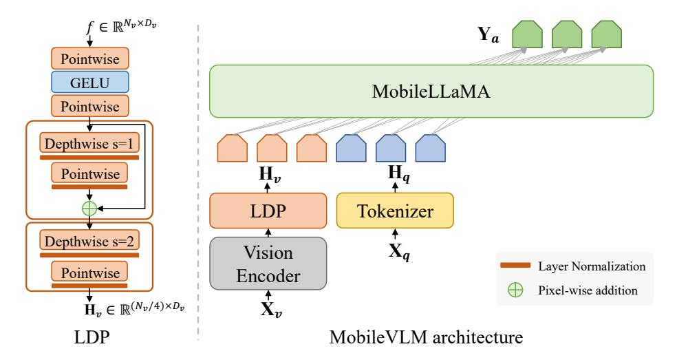

Figure 1. The MobileVLM architecture (right) utilizes MobileLLaMA as its language model, intakes  $\mathbf{X}_v$  and  $\mathbf{X}_q$  which are image and language instructions as respective inputs and gives  $\mathbf{Y}_a$  as the output language response. LDP refers to a lightweight downsample projector (left).

We use Layer Normalization instead of Batch Normalization [56] to make training stable and not affected by the batch size. Since the projector is already very light-weight, therefore, we don't adopt recent mobile reparameterization designs [21, 117].

Formally, LDP (denoted as P) takes the visual embeddings  $f \in \mathbb{R}^{N_v \times D_v}$  as input, and outputs the efficiently extracted and aligned visual tokens  $\mathbf{H}_v \in \mathbb{R}^{(N_v/4) \times D_t}$  as,

$$\mathbf{H}_{v} = \mathbf{P}(f) = \begin{cases} f_{0} &= PW(GELU(PW(f))), \\ f_{1} &= LN(PW(LN(DW(f_{0})))) + f_{0}, \\ \mathbf{H}_{v} &= LN(PW(LN(DW(f_{1}))). \end{cases}$$
(3)

### 4. Experiment

#### 4.1. Training

The whole reproducible training process is composed of three stages. Firstly, we pre-train LLM foundation models on the text-only dataset RedPajama v1 [29]. Secondly, we perform supervised fine-tuning (SFT) following Vicuna [20] on a dataset of multi-turn dialogues between humans and ChatGPT from third-party platforms. Lastly, we train our vision large models using multimodal datasets.

Language model pre-training. Since our target is training deployable models for inference, we do not strictly follow the efficient combination of model capacity and tokens from scaling law [60]. To make our work reproducible, all the models are trained on 1.3T tokens1 from the RedPajama v1 [29] dataset only. This benefits further research by enabling controlled experiments. We apply the same sampling

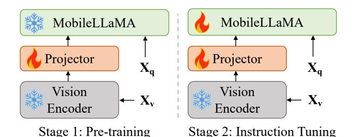

Figure 2. Illustration of the MobileVLM training strategy.

ratio of different datasets as [115], which is shown in Table 12 (see Appendix). The common autoregressive loss is adopted. We utilize a global batch size of 5,242,880.

The peak learning rate is set to  $3\times 10^{-4}$  and it decays to  $3\times 10^{-5}$  following the cosine strategy. We warm up with 2000 iterations. We use the AdamW optimizer [82] with  $\beta_1=0.9$  and  $\beta_2=0.95$  and a weight decay regularization value of 0.1. The gradient clipping threshold is set to 1.0. We adopt the Pytorch lightning framework with DeepSpeed backend [99]. Specifically, we utilize ZERO 1 [98] and gradient accumulation to achieve a training speed of 18800 TGS (Tokens per second for a GPU) for the 1.4B model and 8500 TGS for the 2.7B model, on 20 nodes equipped with 8 NVIDIA Tesla A100 GPUs each.

Furthermore, we also favor Flash Attention V2 [31] to alleviate the I/O bottleneck and to train faster. We randomly shuffle the data to disturb the sequential order with a fixed seed, which is vital since the training process can be intermittently interrupted and requires to be resumed. We first tokenize the raw data into IDs and serialize them into many bucket files. We then utilize memory mapping to deliver a

&lt;sup>1Applying the tokenizer of [116] on this dataset generates about 1.3T tokens.

|                                      |             |      |      | Common Sense Reasoning          |             | Language Understanding |      |        |        |
|--------------------------------------|-------------|------|------|---------------------------------|-------------|------------------------|------|--------|--------|
| Model                                | ARC(c/e)    |      |      | BoolQ RTE Winogrande TruthfulQA |             | HellaSwag PIQA MMLU    |      |        | Avg.   |
| INCITE 3B (V1) [29]                  | 0.32 / 0.68 | 0.67 | 0.52 | 0.63                            | 0.21 / 0.33 | 0.48                   | 0.74 | 0.2675 | 0.4848 |
| OpenLLaMA 3B (V1) [43]               | 0.34 / 0.69 | 0.68 | 0.58 | 0.62                            | 0.22 / 0.35 | 0.49                   | 0.75 | 0.2695 | 0.4990 |
| MobileLLaMA 2.7B                     | 0.32 / 0.68 | 0.61 | 0.59 | 0.63                            | 0.23 / 0.36 | 0.48                   | 0.75 | 0.2730 | 0.4923 |
| TinyLLaMA 1.1B (2T) [93] 0.23 / 0.57 |             | 0.59 | 0.55 | 0.57                            | 0.23 / 0.39 | 0.40                   | 0.70 | 0.2541 | 0.4484 |
| Galactica 1.3B [112]                 | 0.28 / 0.62 | 0.62 | 0.52 | 0.55                            | 0.25 / 0.41 | 0.34                   | 0.63 | 0.2675 | 0.4488 |
| OPT 1.3B [131]                       | 0.24 / 0.57 | 0.56 | 0.51 | 0.59                            | 0.24 / 0.39 | 0.41                   | 0.71 | 0.2461 | 0.4466 |
| Pythia 1.4B [7]                      | 0.26 / 0.61 | 0.63 | 0.52 | 0.57                            | 0.23 / 0.39 | 0.40                   | 0.71 | 0.2568 | 0.4577 |
| MobileLLaMA 1.4B                     | 0.26 / 0.61 | 0.53 | 0.53 | 0.59                            | 0.21 / 0.35 | 0.43                   | 0.73 | 0.2497 | 0.4490 |

Table 3. Comparison with SOTA mobile-scale language models on mainstream language benchmarks.

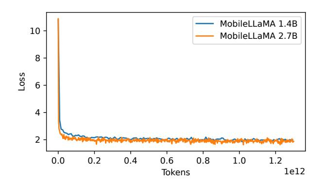

Figure 3. Training loss curves of our MobileLLaMA 1.4B and 2.7B on 1.3T tokens of RedPajama data.

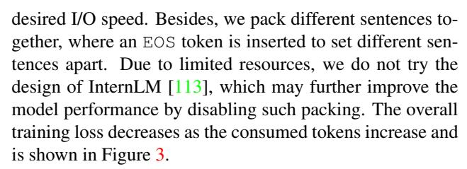

SFT on language models. As clarified by LLaMA-2 [\[116\]](#page-15-8), fewer higher-quality examples from their vendorbased annotation efforts significantly improve the results. We are thus motivated to finetune our MobileLLaMA on a high-quality dataset with supervised learning. Vicuna [\[20\]](#page-11-15) fine-tunes LLaMA on user-shared conversations collected from ShareGPT, which is widely used as a language module for multimodal model building, but their training dataset is not released. We employ a dataset of multi-turn dialogues between humans and ChatGPT from third-party platforms [\[53\]](#page-13-22) which has been cleaned through a process of format standardization and quality refinement. The SFT data is organized following the Vicuna format, where each sample consists of a dialogue including several user prompts and ChatGPT answers. As shown in Table [14](#page-19-0) (see Appendix),

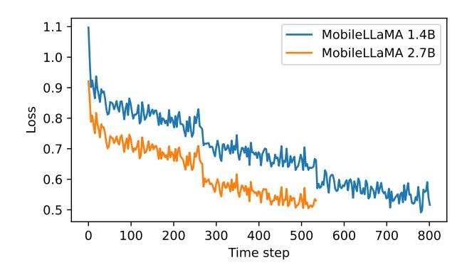

Figure 4. SFT loss curves of MobileLLaMA 1.4B and 2.7B.

a special token is utilized to separate the assistant's answer and the next round of user prompts. For the training details, we use a cosine learning rate schedule without weight decay, a global batch size of 128, and a sequence length of 2048 tokens. We utilize an autoregressive objective and perform backpropagation only on answer tokens. To achieve better performance in downstream tasks, we conducted experiments to select the appropriate hyperparameters. We fine-tune for 3 epochs with a learning rate of 2 × 10−5 for MobileLLaMA 1.4B, and 2 epochs with a learning rate of 3 × 10−5 for MobileLLaMA 2.7B. The training loss decreases with iterations as shown in Figure [4.](#page-5-1) To be later shown in Sec. [5.4,](#page-10-0) our empirical performance on downstream tasks demonstrates that high-quality SFT data is essential to aligning LLMs with dialogue-style instructions.

VLM training. Similar to [\[76,](#page-14-2) [126\]](#page-15-4), the whole training process comprises two steps: pre-training and instruction tuning. This is depicted in Figure [2.](#page-4-1) During the first step, we freeze the vision encoder and LLM, focusing on training the efficient projector only. Subsequently, we fine-tune both the projector and LLM to enhance the abilities of visual understanding and expression by refining the language model via a language modeling loss function. Following Vicuna's

| Method                                      | LLM                  | Res. PT |           | IT   |      | GQA SQAI | VQAT | POPE | MME    | MMBdev |
|---------------------------------------------|----------------------|---------|-----------|------|------|----------|------|------|--------|--------|
| Openflamingo [3]                            | MPT-7B               | 336     | 180M -    |      | –    | –        | 33.6 | –    | –      | 4.6    |
| BLIP-2 [66]                                 | Vicuna-13B           | 224     | 129M -    |      | 41.0 | 61.0     | 42.5 | 85.3 | 1293.8 | –      |
| MiniGPT-4 [133]                             | Vicuna-7B            | 224     | 5M        | 5K   | 32.2 | –        | –    | –    | 581.7  | 23.0   |
| InstructBLIP [30]                           | Vicuna-7B            | 224     | 129M 1.2M |      | 49.2 | 60.5     | 50.1 | –    | –      | 36.0   |
| InstructBLIP [30]                           | Vicuna-13B           | 224     | 129M 1.2M |      | 49.5 | 63.1     | 50.7 | 78.9 | 1212.8 | –      |
| Shikra [15]                                 | Vicuna-13B           | 224     | 600K      | 5.5M | –    | –        | –    | –    | –      | 58.8   |
| mPLUG-Owl [126]                             | LLaMA-7B             | 224     | 2.1M      | 102K | –    | –        | –    | –    | 967.3  | 49.4   |
| IDEFICS-9B [64]                             | LLaMA-7B             | 224     | 353M 1M   |      | 38.4 | –        | 25.9 | –    | –      | 48.2   |
| IDEFICS-80B [64]                            | LLaMA-65B            | 224     | 353M 1M   |      | 45.2 | –        | 30.9 | –    | –      | 54.5   |
| Qwen-VL [5]                                 | Qwen-7B              | 448     | 1.4B      | 50M  | 59.3 | 67.1     | 63.8 | –    | 1487.6 | 38.2   |
| MiniGPT-v2 [14]                             | LLaMA-7B             | 448     | 23M       | 1M   | 60.3 | –        | –    | –    | –      | 12.2   |
| LLaVA-1.5 [74]                              | Vicuna-7B            | 336     | 558K      | 665K | 62.0 | 66.8     | 58.2 | 85.9 | 1510.7 | 64.3   |
| MobileVLM 1.7B                              | MobileLLaMA 1.4B 336 |         | 558K      | 665K | 56.1 | 54.7     | 41.5 | 84.5 | 1196.2 | 53.2   |
| MobileVLM 1.7B w/ LoRA MobileLLaMA 1.4B 336 |                      |         | 558K      | 665K | 57.0 | 53.1     | 42.3 | 86.0 | 1143.7 | 50.4   |
| MobileVLM 3B                                | MobileLLaMA 2.7B 336 |         | 558K      | 665K | 59.0 | 61.0     | 47.5 | 84.9 | 1288.9 | 59.6   |
| MobileVLM 3B w/ LoRA                        | MobileLLaMA 2.7B 336 |         | 558K      | 665K | 58.4 | 59.0     | 46.7 | 84.6 | 1296.4 | 57.0   |

Table 4. Comparison with SOTA methods on 6 VLM benchmarks. GQA [\[52\]](#page-13-17); SQAI : ScienceQA-IMG [\[83\]](#page-14-15); VQAT : TextVQA [\[105\]](#page-15-16); POPE [\[71\]](#page-13-16); MME [\[40\]](#page-12-14); MMBdev: MMBench-dev [\[80\]](#page-14-16); Column *Res.* is the image resolution of vision model. Columns *PT* and *IT* are the data sizes in the pre-training stage and the visual instruction tuning stage, respectively.

hyperparameters [\[118\]](#page-15-2), we pre-train our model on the filtered CC-595K subset [\[76\]](#page-14-2) for 1 epoch at a learning rate of 10−3 and a batch size of 256. We fine-tune it on the LLaVA-Instruct-158K dataset [\[76\]](#page-14-2) for 1 epoch at a learning rate of 2 × 10−5 and a batch size of 128. Examples of our training dataset are shown in Figure [5](#page-20-0) (Appendix [C\)](#page-17-1). We choose the AdamW optimizer with no weight decay and a cosine learning rate with a warmup ratio of 3%. The training takes 5 hours with 8 NVIDIA Tesla A100 GPUs for MobileVLM 1.7B, and 8 hours for MobileVLM 3B.

### 4.2. Evaluation of MobileLLaMA

In Table [3,](#page-5-2) we extensively assess our models on two standard natural language benchmarks, for language understanding and common sense reasoning respectively. We apply the Language Model Evaluation Harness [\[42\]](#page-12-23) tool for the former assessment. Experimental results show that our MobileLLaMA 1.4B is on par with the most recent opensource models such as TinyLLaMA 1.1B, Galactica 1.3B, OPT 1.3B, and Pythia 1.4B. Notably, our MobileLLaMA 1.4B outperforms TinyLLaMA 1.1B which is trained on 2T tokens, twice as many as ours. At the 3B level, our MobileLLaMA 2.7B also demonstrates competitive performance to INCITE 3B (V1) and OpenLLaMA 3B (V1), while MobileLLaMA 2.7B being about 40% faster than OpenLLaMA 3B on a Snapdragon 888 CPU as shown in Table [5.](#page-7-0)

For common sense reasoning, we report the zero-shot accuracy on five prevalent benchmarks, *i.e*., ARCe [\[10\]](#page-11-18), ARCc [\[28\]](#page-12-24), BoolQ [\[27\]](#page-12-25), Winogrande [\[101\]](#page-14-25), and TruthfulQA [\[72\]](#page-13-24). Our models demonstrate strong reasoning capabilities on these benchmarks. It's worth noting that MobileLLaMA 1.4B and 2.7B achieve the highest performance on Winogrande at both 1B and 3B levels. This indicates that our models deliver robust common sense capabilities, rather than cunningly relying on systematic biases in the datasets.

Further, we evaluate our models on several language understanding tasks, including PIQA [\[8\]](#page-11-19), HellaSwag [\[128\]](#page-15-24), and MMLU [\[48\]](#page-13-25). We report the zero-shot accuracy on PIQA and HellaSwag, and 5-shot performance on MMLU. We can see that our MobileLLaMA outperforms other models across nearly all of the benchmarks. The superior language understanding capability makes our models more suitable for downstream tasks, particularly for instruction tuning, in-context learning, etc.

### 4.3. Comparison with SOTA VLMs

We evaluate the multimodal performance following LLaVA on GQA [\[52\]](#page-13-17), ScienceQA [\[83\]](#page-14-15), TextVQA [\[105\]](#page-15-16), POPE [\[71\]](#page-13-16), and MME [\[40\]](#page-12-14). In addition, we also exploit MMBench [\[80\]](#page-14-16) for a comprehensive comparison. As demonstrated in Table [4,](#page-6-0) our proposed MobileVLM, despite its reduced parameters and limited training data, *achieves competitive performance.* In certain instances, it even obtains superior metrics compared with the previous state-ofthe-art multimodal vision language models.

In particular, on the evaluation benchmarks of GQA, POPE, and MMBench, MobileVLM demonstrates parity with or superiority over the majority of 7B or larger VLMs, which proves its exceptional capabilities in image content

| Model                           | Hardware       | Precision | Size (GB) | Sample (tokens/s) | Evalprompt (tokens/s) | Eval (tokens/s) T otal (s) |       |
|---------------------------------|----------------|-----------|--------------|----------------------|--------------------------|-------------------------------|-------|
|                                 | Snapdragon 888 | 8-bit     | 3.4          | 3093                 | 7.32                     | 6.58                          | 63.33 |
| OpenLLaMA 3B                    | Snapdragon 888 | 4-bit     | 2.3          | 3604                 | 8.97                     | 7.14                          | 58.04 |
| MobileLLaMA 2.7B Snapdragon 888 |                | 8-bit     | 2.7          | 3919                 | 17.59                    | 9.14                          | 44.85 |
|                                 | Snapdragon 888 | 4-bit     | 1.5          | 3932                 | 18.10                    | 14.71                         | 28.30 |
|                                 | Snapdragon 888 | 8-bit     | 1.1          | 4215                 | 39.49                    | 19.75                         | 20.83 |
| TinyLLaMA 1.1B                  | Snapdragon 888 | 4-bit     | 0.6          | 3887                 | 44.17                    | 31.54                         | 13.22 |
| MobileLLaMA 1.4B Snapdragon 888 |                | 8-bit     | 1.4          | 3846                 | 35.46                    | 17.93                         | 22.81 |
|                                 | Snapdragon 888 | 4-bit     | 0.7          | 3870                 | 36.20                    | 28.32                         | 14.76 |
|                                 | Jetson Orin    | 8-bit     | 3.4          | 2382                 | 80.34                    | 29.97                         | 13.94 |
| OpenLLaMA 3B                    | Jetson Orin    | 4-bit     | 2.3          | 3340                 | 143.25                   | 32.16                         | 12.83 |
|                                 | Jetson Orin    | 8-bit     | 2.7          | 3040                 | 133.41                   | 33.28                         | 12.46 |
| MobileLLaMA 2.7B                | Jetson Orin    | 4-bit     | 1.5          | 2647                 | 130.97                   | 38.99                         | 10.74 |
|                                 | Jetson Orin    | 8-bit     | 1.1          | 3007                 | 279.61                   | 72.30                         | 5.89  |
| TinyLLaMA 1.1B                  | Jetson Orin    | 4-bit     | 0.6          | 3801                 | 306.76                   | 78.83                         | 5.38  |
|                                 | Jetson Orin    | 8-bit     | 1.4          | 3289                 | 249.56                   | 60.73                         | 6.96  |
| MobileLLaMA 1.4B                | Jetson Orin    | 4-bit     | 0.7          | 3738                 | 253.22                   | 66.79                         | 6.33  |

Table 5. Lantency comparison of small language models on mobile and IoT devices. "8-bit": quantized with mode q8 0 in llama.cpp and 4-bit with mode q4 k s. *Size* refers to the size of quantized models. Sample, Evalprompt, and Eval are measured in *tokens per second*. Sample reflects the velocity at which the next probable output token is selected, Evalprompt denotes the duration required to process the prompt before initiating text generation, and Eval signifies the generation speed of the output tokens. T otal refers to the entire time consumed by a single inference (loading time included.)

perception, spatial and relational reasoning, and attribute understanding. Nonetheless, a notable shortfall arises due to the absence of large training datasets, such as code and textbook, which results in a discernible performance discrepancy on tasks like ScienceQA and MME. Still, there exists potential for enhancement in the model's proficiency by reconciling text comprehension with the nuanced recognition of fine image content on TextVQA. We list visualized demonstrations in Appendix [C.](#page-17-1)

### 4.4. MobileVLM with LoRA

Low-Rank Adaptation (LoRA) [\[51\]](#page-13-2) can perform on par with or better than fully fine-tuned LLMs with fewer trainable parameters. We empirically investigate this practice on MobileVLM to validate its multimodal performance. Specifically, during the VLM visual instruction tuning stage, we freeze all the LLM parameters except the LoRA matrices. The updated parameters are only 8.87% and 7.41% of the full LLM for MobileLLaMA 1.4B and MobileLLaMA 2.7B respectively. For LoRA configuration, we set lorar as 128 and the loraα as 256. The results are shown in Table [4.](#page-6-0) We can see that MobileVLM with LoRA achieves comparable performances to those of full finetuning on 6 benchmarks, which is consistent with [\[51\]](#page-13-2).

### 4.5. Latency Measurement on Mobile Devices

We evaluate the inference latency of MobileLLaMA and MobileVLM both on a Realme GT mobile phone and an NVIDIA Jetson AGX Orin platform. The mobile phone is equipped with a Snapdragon 888 SoC and 8GB RAM, which gives out 26 TOPS computing power. Orin is equipped with 32GB of memory, offering an impressive 275 TOPS. It operates on CUDA version 11.4, which supports the latest parallel computing technology for enhanced performance. We exploit llama.cpp [\[44\]](#page-12-13) as the inference framework for both devices.

MobileLLaMA For language models (LMs) in Table [5,](#page-7-0) input prompts are fixed with the sentence "Building a website can be done in 10 simple steps:\nStep 1:", and the number of output tokens is set to 400. LMs are quantized to 4-bit and 8-bit with the quantization mode q4 k s and q8 0 of llama.cpp , respectively.

According to the measurement on the Snapdragon 888 SoC shown in Table [5,](#page-7-0) our MobileLLaMA 2.7B significantly outperforms OpenLLaMA 3B at the same quantization precision. Notably, using two-thirds consumption of RAM and half the loading time, MobileLLaMA 2.7B achieves twice the inference speed of OpenLLaMA 3B. For the smaller model, although the quantized MobileLLaMA

| Model          | LM                                              | Hardware         | Size (GB) | V E (ms/patch) | Sample (tokens/s) | Evalprompt (tokens/s) | Eval (tokens/s) T otal (s) |        |
|----------------|-------------------------------------------------|------------------|--------------|-------------------|----------------------|--------------------------|-------------------------------|--------|
|                | Vicuna 7B                                       | Snapdragon 4.70  |              | 8.23              | 17347                | 5.36                     | 0.25                          | 329.89 |
| LLaVA-v1.5-336 | OpenLLaMA 3B                                    | Snapdragon 2.88  |              | 7.98              | 27530                | 8.95                     | 7.22                          | 84.43  |
|                | TinyLLaMA 1B                                    | Snapdragon 1.18  |              | 7.77              | 31370                | 41.70                    | 18.40                         | 20.70  |
|                | MobileVLM-336 MobileLLaMA 2.7B Snapdragon 2.14  |                  |              | 8.43              | 27660                | 18.36                    | 12.21                         | 33.10  |
|                | MobileLLaMA 1.4B Snapdragon 1.40                |                  |              | 6.82              | 34892                | 34.93                    | 21.54                         | 18.51  |
|                | Vicuna 7B                                       | Jetson Orin 4.70 |              | 2.89              | 9281                 | 367.26                   | 17.74                         | 19.75  |
| LLaVA-v1.5-336 | OpenLLaMA 3B                                    | Jetson Orin 2.88 |              | 2.94              | 22270                | 474.49                   | 30.66                         | 12.52  |
|                | TinyLLaMA 1B                                    | Jetson Orin 1.18 |              | 2.98              | 24655                | 1253.94                  | 76.63                         | 5.90   |
|                | MobileVLM-336 MobileLLaMA 2.7B Jetson Orin 2.14 |                  |              | 3.11              | 15678                | 440.60                   | 38.34                         | 8.31   |
|                | MobileLLaMA 1.4B Jetson Orin 1.40               |                  |              | 3.32              | 17712                | 667.69                   | 65.27                         | 5.14   |

Table 6. Lantency comparison of mobile-scale VLMs. The language model of VLMs is quantized to 4-bit with llama.cpp. *Size* is the summation of the size of the language model and the visual encoder. *VE* indicates visual encoder, whose latency is measured in *ms per image patch*. The remaining columns are consistent with those in Table [5.](#page-7-0) LLaVA-v1.5-336-Vicuna 7B generates 51 output tokens, while the rest VLMs generate 256 output tokens.

1.4B is 23% larger than that of TinyLLaMA 1B, its inference speed is only 11% slower than TinyLLaMA 1B in terms of both *Eval* speed and *Total* inference time, which demonstrates that our model benefits from better architectural design. On the Orin platform, we can draw the same conclusion that MobileLLaMA is quite competitive to the open-source language models at similar parameter scales.

MobileVLM Due to the limitation of llama.cpp , VLMs are split into the vision encoder and the language model, which are loaded separately during the inference stage. For the inference precision, the language model is quantized to 4-bit, while the vision encoder and the projector keep the original precision. The prompts of VLMs are composed of textual prompts and visual prompts. For a fair comparison, LLaVA-v1.5 and MobileVLMs take the picture with the same resolution of 336 × 336 as the visual prompt, along with the sentence "What is in the picture?" as the textual prompt. Meanwhile, the patch sizes of their vision encoder are fixed to 14. For LLaVAv1.5, the number of input tokens (denoted as T ksin) for the language model is composed of 576 visual tokens and some textual tokens. For MobileVLMs, the number of visual tokens has dropped to 144 due to the design of an efficient projector as in Sec. [3.4.](#page-3-1) For all the tested VLMs, the number of output tokens (denoted as T ksout) is set to 256. The total inference time of VLMs is calculated specifically as,

$$Total = Load_{LM} + (Tks_{in}/Eval_{prompt}) + (Tks_{out}/Sample) + (Tks_{out}/Eval) + Others$$
(4)

where Sample, Evalprompt, and Eval are measured in tokens per second. Sample is the time it takes to "tokenize" (sample) the prompt message. Evalprompt denotes the time LMs take to handle the processed tokens. Eval is the time needed to generate all response tokens, measured only when the LM starts emitting tokens. LoadLM and T otal refer to the time of loading model and the entire time consumed by a single inference respectively. Other overheads are mostly negligible.

The inference latency comparison of various VLMs is shown in Table [6.](#page-8-1) It can be found that Eval of MobileVLM-336 is slightly slower than MobileLLaMA in Table [5](#page-7-0) since extra vision tokens increase the time consumption and consequently slow down the generation of output tokens.

Most importantly, we are surprised to find T otal of MobileVLM equipped with MobileLLaMa 2.7B and MobileL-LaMa 1.4B outperform LLaVA-v1.5 consistently on Snapdragon SoC and Jetson Orin. It is worth noting that although Eval of MobileVLM (MobileLLaMa 1.4B) is slower than that of LLaVA-v1.5 (OpenLLaMA 1B) on Orin, it achieves a faster T otal inference time. The main reason is that T ksin of MobileVLM is only a quarter of LLaVA-v1.5 in Equation [4](#page-8-2) while other variables are comparable. This precisely proves the importance of efficient projection that reduces the number of input visual tokens.

### 5. Ablation Study

# 5.1. Ablation on Vision Backbones

In Table [7,](#page-9-0) we compare the multimodal performance at varying model scales and different numbers of visual tokens. All experiments are conducted with CLIP ViT as a visual encoder. We configure different model scales, patch sizes, and types of vision-language projectors.

The impact of model scales. As the model scales up, the multimodal performance on 6 benchmarks maintains a

| Language Model | Vision Encoder        | VL Projector | Tokens | GQA  | SQAI | VQAT | POPE | MME    | MMBdev |
|----------------|-----------------------|--------------|--------|------|------|------|------|--------|--------|
|                | CLIP-B-P16-S224 [97]  | MLP [75]     | 196    | 55.3 | 52.8 | 38.3 | 83.2 | 1079.9 | 46.1   |
|                | CLIP-L-P14-S224 [97]  | MLP [75]     | 256    | 55.8 | 53.4 | 40.9 | 83.9 | 1104.4 | 50.9   |
| MobileLLaMA    | CLIP-G-P14-S224 [110] | MLP [75]     | 256    | 57.5 | 54.2 | 38.0 | 84.9 | 1123.3 | 53.9   |
| 1.4B           | CLIP-L-P14-S336 [97]  | MLP [75]     | 576    | 56.9 | 53.6 | 43.7 | 85.7 | 1137.7 | 52.8   |
|                | CLIP-L-P14-S336 [97]  | LDP (ours)   | 144    | 56.1 | 54.7 | 41.5 | 84.5 | 1196.2 | 53.2   |
|                | CLIP-B-P16-S224 [97]  | MLP [75]     | 196    | 57.0 | 58.4 | 43.1 | 83.8 | 1212.2 | 54.6   |
|                | CLIP-L-P16-S224 [97]  | MLP [75]     | 256    | 57.9 | 58.6 | 45.3 | 85.1 | 1285.0 | 57.7   |
| MobileLLaMA    | CLIP-G-P14-S224 [110] | MLP [75]     | 256    | 59.5 | 58.9 | 43.9 | 85.1 | 1275.6 | 59.5   |
| 2.7B           | CLIP-L-P14-S336 [97]  | MLP [75]     | 576    | 59.1 | 58.3 | 47.3 | 85.8 | 1333.1 | 57.1   |
|                | CLIP-L-P14-S336 [97]  | LDP (ours)   | 144    | 59.0 | 61.0 | 47.5 | 84.9 | 1288.9 | 59.6   |

Table 7. Comparison with different vision encoder scales (B/L/G: Base, Large, Giant) and visual tokens on six benchmarks with our MobileLLaMA 1.4B/2.7B. S224/336 indicates the input resolution.

| Vision Encoder   | Method     | Pretrain Paradigm | Pretrain Data | Tokens | GQA  | SQAI | VQAT | POPE | MME    | MMBdev |
|------------------|------------|-------------------|---------------|--------|------|------|------|------|--------|--------|
| ViT-B-P16-S224   | SAIM [96]  | UnSupervised      | IN1K [33]     | 196    | 45.3 | 40.9 | 32.2 | 76.5 | 845.4  | 2.1    |
| ViT-B-P16-S224   | MAE [47]   | UnSupervised      | IN1K [33]     | 196    | 50.3 | 49.1 | 33.4 | 80.2 | 931.2  | 24.7   |
| ViT-B-P16-S224   | ViT [34]   | Classification    | IN21K [100]   | 196    | 48.3 | 50.7 | 33.1 | 80.3 | 892.8  | 34.9   |
| Twins-SVT-L-S224 | Twins [22] | Classification    | IN1K [33]     | 49     | 50.3 | 50.9 | 33.2 | 80.6 | 941.6  | 32.1   |
| Twins-SVT-L-S384 | Twins [22] | Classification    | IN1K [33]     | 144    | 51.4 | 51.0 | 32.8 | 81.7 | 930.3  | 33.4   |
| Swin-Tiny-S224   | Swin [81]  | Classification    | IN1K [33]     | 49     | 48.3 | 50.3 | 32.5 | 80.8 | 929.0  | 31.4   |
| Swin-Base-S384   | Swin [81]  | Classification    | IN22K [33]    | 144    | 53.3 | 52.2 | 33.5 | 82.8 | 1037.2 | 40.3   |
| Swin-Tiny-S224   | GDino [79] | Grounding-Det     | OGC [79]      | 49     | 51.2 | 50.5 | 32.4 | 81.7 | 932.4  | 31.8   |
| Swin-Base-S384   | GDino [79] | Grounding-Det     | COGOOR [79]   | 144    | 54.9 | 51.0 | 33.8 | 84.5 | 1072.3 | 40.0   |
| ViT-B-P14-S224   | CLIP [97]  | Image-Text-Align  | WIT [97]      | 256    | 55.3 | 52.8 | 38.3 | 83.2 | 1079.9 | 46.1   |

Table 8. Comparison with various vision encoders from different pre-training paradigms on MobileLLaMA 1.4B on six benchmarks.

gradual increase trend under the same projector [\[75\]](#page-14-26). However, it can be observed that the gain brought by the visual model scaling may gradually become saturated at a certain amount of training data.

The impact of the number of visual tokens. Compared with rows 4-5, our proposed LDP module reduces the number of visual tokens from 576 to 144 (↓ 75%), and it finally achieves performance equivalent to or sometimes better than the baseline. This reveals that the quality of visual tokens can be further improved while our proposed LDP module is quite effective.

The impact of pre-training paradigms. Furthermore, we show the performance of MobileLLaMA 1.4B under different vision backbone pre-training paradigms in Table [8.](#page-9-1) Based on the cost of annotation and pre-training, we roughly classify these paradigms into four categories. It turns out that the performance of MobileVLM gradually improves as the pre-training cost increases. The vision encoder pre-trained with supervised image-text alignment achieved the best performance. By comparing *Swin-Base-S384-GDino* and *ViT-B-P14-S224*, we notice that the model pre-trained by grounding detection achieved relatively comparable performance to the CLIP pre-trained model on GQA, SQA, POPE, and MME. This outcome indicates that the *image-level* alignment has greater potential to strike better performance than *object-level*, especially by using more visual tokens or more training data. In addition, better ImageNet performance of pre-trained models (*e.g*., Swin > ViT) often corresponds to more general visual feature extraction capabilities, and MobileVLM will have certain performance gains in turn.

### 5.2. Abaltion on VL Projectors

Motivated by the fact both feature interaction and token interaction are beneficial, we utilize depthwise convolutions for the former and pointwise for the latter. Table [9](#page-10-1) shows the performance of various VL projectors. Row 1 in Table [9](#page-10-1) is the module used in LLaVA [\[78\]](#page-14-3) where only the feature space is transformed through two linear layers. Row 2 adds a DW (depthwise) convolution before each PW(pointwise) for token interaction, which performs 2× downsampling with a stride of 2. We notice that the performance begins to show an evident decline. Based on the setup of 144 tokens, adding two front-end PW layers

| VL Projector Architecture Design                                          | Tokens | GQA  | SQA I | $VQA^{T}$ | POPE | MME    | MMB dev |
|---------------------------------------------------------------------------|--------|------|------------------|-----------|------|--------|--------------------|
| $[PW]_{\times 2}[DW^{\kappa=1}PW]_{\times 0}[DW^{\kappa=2}PW]_{\times 0}$ | 576    | 56.9 | 53.6             | 43.7      | 85.7 | 1137.7 | 52.8               |
| $[PW]_{\times 0}[DW^{\kappa=1}PW]_{\times 1}[DW^{\kappa=2}PW]_{\times 1}$ | 144    | 54.9 | 52.9             | 40.2      | 84.0 | 1150.8 | 50.3               |
| $[PW]_{\times 2}[DW^{\kappa=1}PW]_{\times 1}[DW^{\kappa=2}PW]_{\times 1}$ | 144    | 56.1 | 54.7             | 41.5      | 84.5 | 1196.2 | 53.2               |
| $[PW]_{\times 2}[DW^{\kappa=1}PW]_{\times 3}[DW^{\kappa=2}PW]_{\times 1}$ | 144    | 55.3 | 53.9             | 40.8      | 84.6 | 1166.3 | 53.0               |
| $[PW]_{\times 2}[DW^{\kappa=2}PW]_{\times 1}[DW^{\kappa=1}PW]_{\times 1}$ | 144    | 55.6 | 54.3             | 41.5      | 84.6 | 1166.2 | 52.8               |

Table 9. The exploration of projector design based on MobileLLaMA 1.4B. The PW represents pointwise-conv and DW is depthwise-conv. The subscript  $\times$  indicates the number of times the corresponding module is stacked repeatedly. The superscript  $\kappa$  indicates the conv stride. The grey row is the baseline projector from [74], and green row is the proposed LDP in our MobileVLM.

| LLM base model   | SFT strategy | Conversation mode       | GQA  | SQA I | VQA T | POPE | MME    | MMB dev |
|------------------|--------------|-------------------------|------|------------------|------------------|------|--------|--------------------|
| MobileLLaMA 1.4B | w/o          | llava llama2 | 55.8 | 52.6             | 40.5             | 84.4 | 1111.5 | 52.0               |
| MobileLLaMA 1.4B | w/o          | vicuna v1    | 56.1 | 53.0             | 40.5             | 84.6 | 1148.5 | 50.3               |
| MobileLLaMA 1.4B | Alpaca       | $llava_{llama_2}$       | 55.2 | 54.8             | 40.6             | 84.9 | 1171.1 | 51.9               |
| MobileLLaMA 1.4B | Alpaca       | vicuna v1    | 55.5 | 53.1             | 40.6             | 83.8 | 1168.0 | 47.7               |
| MobileLLaMA 1.4B | Vicuna       | $vicuna_{v1}$           | 56.1 | 54.7             | 41.5             | 84.5 | 1196.2 | 53.2               |

Table 10. Quantitative analysis on SFT of MobileLLaMA 1.4B in downstream tasks.

brings more feature-level interactions, which makes up for the performance loss caused by token reduction. Rows 4 and 5 show that adding more parameters does not achieve desired gains. Rows 4 and 6 show that the downsampling of tokens at the end of the projector has a positive effect.

### 5.3. Visual Resolution and Token Numbers

Since the number of visual tokens directly affects the inference speed of the whole multimodal model, we compare two types of design: reducing the input resolution (RIR) and using a lightweight downsample projector (LDP). Without loss of generality, for an image of  $H \times W$  with a patch size of P, the former strategy generates  $HW/P^2$  tokens. For the latter, it produces  $HW/4P^2$  tokens using a downsampling ratio of 2. We use H=W=336, P=14 for LDP and H=W=168, P=14 for RIR to keep the total number of tokens as 144. The result from Table 11 verifies the effectiveness of the proposed LDP.

| Method     | GQA  | SQA I | VQA T | POPE | MME    | MMB dev |
|------------|------|------------------|------------------|------|--------|--------------------|
| LDP        | 56.1 | 54.7             | 41.5             | 84.5 | 1196.2 | 53.2               |
| LDP RIR | 53.9 | 53.1             | 37.1             | 81.5 | 1072.5 | 46.7               |

Table 11. Token reduction design on MobileVLM 1.7B.

#### 5.4. Quantitative Analysis on SFT

Vicuna [132], fine-tuned on LLaMA, has been widely chosen in large multimodal models [30,75,133]. We further explore how SFT affects our language model's performance in downstream tasks. Two common SFT paradigms Alpaca

[111] and Vicuna [132] are compared in Table 10. We find that the scores of SQA, VQA, MME, and MMBench can all be significantly enhanced. It demonstrates that fine-tuning large language models in Vicuna dialogue mode [132] with the data from ShareGPT ultimately achieves the best performance. To better integrate SFT's prompt format with the training of downstream tasks, we ablate the conversation mode on MobileVLM to find vicunav1 performs best.

#### 6. Conclusion

In a nutshell, we present MobileVLM, a set of efficient and high-powered mobile scale vision language models tailored for mobile and IoT devices. In its making, we refurbish both language models and vision projection modules. Extensive experiments are conducted to choose proper vision backbones, to design an efficient projector, and to enhance model capacity by training schemes like language model SFT, a two-stage training strategy involving pretraining and instruction tuning, and LoRA fine-tuning. The performance is evaluated vigorously on mainstream VLM benchmarks. MobileVLMs also show an unprecedented speed on typical mobile and IoT devices. We believe that MobileVLM will open up new possibilities for widespread applications like multimodal assistants deployed on mobile devices or in self-driving cars, and more broadly embodied AI robots.

**Acknowledgements:** This work was in part supported by National Key R&D Program of China (No. 2022ZD0118-700).

The authors thank Yerui Sun for infrastructure support.

# References

- [1] Syeda Nahida Akter, Zichun Yu, Aashiq Muhamed, Tianyue Ou, Alex Bauerle, ¨ Angel Alexander Cabrera, Kr- ´ ish Dholakia, Chenyan Xiong, and Graham Neubig. An in-depth look at gemini's language abilities. *arXiv preprint arXiv:2312.11444*, 2023. [1](#page-0-0)
- [2] Jean-Baptiste Alayrac, Jeff Donahue, Pauline Luc, Antoine Miech, Iain Barr, Yana Hasson, Karel Lenc, Arthur Mensch, Katherine Millican, Malcolm Reynolds, et al. Flamingo: a visual language model for few-shot learning. *Advances in Neural Information Processing Systems*, 35:23716–23736, 2022. [1,](#page-0-0) [3](#page-2-1)
- [3] Anas Awadalla, Irena Gao, Joshua Gardner, Jack Hessel, Yusuf Hanafy, Wanrong Zhu, Kalyani Marathe, Yonatan Bitton, Samir Gadre, Jenia Jitsev, Simon Kornblith, Pang Wei Koh, Gabriel Ilharco, Mitchell Wortsman, and Ludwig Schmidt. Openflamingo, Mar. 2023. [7](#page-6-1)
- [4] Jinze Bai, Shuai Bai, Yunfei Chu, Zeyu Cui, Kai Dang, Xiaodong Deng, Yang Fan, Wenbin Ge, Yu Han, Fei Huang, Binyuan Hui, Luo Ji, Mei Li, Junyang Lin, Runji Lin, Dayiheng Liu, Gao Liu, Chengqiang Lu, Keming Lu, Jianxin Ma, Rui Men, Xingzhang Ren, Xuancheng Ren, Chuanqi Tan, Sinan Tan, Jianhong Tu, Peng Wang, Shijie Wang, Wei Wang, Shengguang Wu, Benfeng Xu, Jin Xu, An Yang, Hao Yang, Jian Yang, Shusheng Yang, Yang Yao, Bowen Yu, Hongyi Yuan, Zheng Yuan, Jianwei Zhang, Xingxuan Zhang, Yichang Zhang, Zhenru Zhang, Chang Zhou, Jingren Zhou, Xiaohuan Zhou, and Tianhang Zhu. Qwen technical report. *arXiv preprint arXiv:2309.16609*, 2023. [2](#page-1-0)
- [5] Jinze Bai, Shuai Bai, Shusheng Yang, Shijie Wang, Sinan Tan, Peng Wang, Junyang Lin, Chang Zhou, and Jingren Zhou. Qwen-vl: A versatile vision-language model for understanding, localization, text reading, and beyond. *arXiv preprint arXiv:2308.12966*, 2023. [1,](#page-0-0) [2,](#page-1-0) [3,](#page-2-1) [7](#page-6-1)
- [6] Hangbo Bao, Wenhui Wang, Li Dong, Qiang Liu, Owais Khan Mohammed, Kriti Aggarwal, Subhojit Som, Songhao Piao, and Furu Wei. Vlmo: Unified visionlanguage pre-training with mixture-of-modality-experts. *Advances in Neural Information Processing Systems*, 35:32897–32912, 2022. [2,](#page-1-0) [3](#page-2-1)
- [7] Stella Biderman, Hailey Schoelkopf, Quentin Gregory Anthony, Herbie Bradley, Kyle O'Brien, Eric Hallahan, Mohammad Aflah Khan, Shivanshu Purohit, USVSN Sai Prashanth, Edward Raff, et al. Pythia: A suite for analyzing large language models across training and scaling. In *International Conference on Machine Learning*, pages 2397–2430. PMLR, 2023. [2,](#page-1-0) [6](#page-5-3)
- [8] Yonatan Bisk, Rowan Zellers, Jianfeng Gao, Yejin Choi, et al. Piqa: Reasoning about physical commonsense in natural language. In *Proceedings of the AAAI conference on artificial intelligence*, volume 34, pages 7432–7439, 2020. [7](#page-6-1)
- [9] Sid Black, Leo Gao, Phil Wang, Connor Leahy, and Stella Biderman. GPT-Neo: Large Scale Autoregressive Language Modeling with Mesh-Tensorflow, Mar. 2021. If you use this software, please cite it using these metadata. [2](#page-1-0)

- [10] Michael Boratko, Harshit Padigela, Divyendra Mikkilineni, Pritish Yuvraj, Rajarshi Das, Andrew McCallum, Maria Chang, Achille Fokoue-Nkoutche, Pavan Kapanipathi, Nicholas Mattei, et al. A systematic classification of knowledge, reasoning, and context within the ARC dataset. *arXiv preprint arXiv:1806.00358*, 2018. [7](#page-6-1)
- [11] Minwoo Byeon, Beomhee Park, Haecheon Kim, Sungjun Lee, Woonhyuk Baek, and Saehoon Kim. Coyo-700m: Image-text pair dataset. [https://github.com/kak](https://github.com/kakaobrain/coyo-dataset) [aobrain/coyo-dataset](https://github.com/kakaobrain/coyo-dataset), 2022. [3](#page-2-1)
- [12] Han Cai, Chuang Gan, Tianzhe Wang, Zhekai Zhang, and Song Han. Once for all: Train one network and specialize it for efficient deployment. In *International Conference on Learning Representations*, 2020. [4](#page-3-2)
- [13] Soravit Changpinyo, Piyush Sharma, Nan Ding, and Radu Soricut. Conceptual 12m: Pushing web-scale image-text pre-training to recognize long-tail visual concepts. In *CVPR*, 2021. [3](#page-2-1)
- [14] Jun Chen, Deyao Zhu, Xiaoqian Shen, Xiang Li, Zechun Liu, Pengchuan Zhang, Raghuraman Krishnamoorthi, Vikas Chandra, Yunyang Xiong, and Mohamed Elhoseiny. Minigpt-v2: large language model as a unified interface for vision-language multi-task learning. *arXiv preprint arXiv:2310.09478*, 2023. [7](#page-6-1)
- [15] Keqin Chen, Zhao Zhang, Weili Zeng, Richong Zhang, Feng Zhu, and Rui Zhao. Shikra: Unleashing multimodal llm's referential dialogue magic. *arXiv preprint arXiv:2306.15195*, 2023. [3,](#page-2-1) [7](#page-6-1)
- [16] Lin Chen, Jisong Li, Xiaoyi Dong, Pan Zhang, Conghui He, Jiaqi Wang, Feng Zhao, and Dahua Lin. Sharegpt4v: Improving large multi-modal models with better captions. *arXiv preprint arXiv:2311.12793*, 2023. [2,](#page-1-0) [3](#page-2-1)
- [17] Shouyuan Chen, Sherman Wong, Liangjian Chen, and Yuandong Tian. Extending context window of large language models via positional interpolation. *arXiv preprint arXiv:2306.15595*, 2023. [4](#page-3-2)
- [18] Xi Chen, Josip Djolonga, Piotr Padlewski, Basil Mustafa, Soravit Changpinyo, Jialin Wu, Carlos Riquelme Ruiz, Sebastian Goodman, Xiao Wang, Yi Tay, Siamak Shakeri, Mostafa Dehghani, Daniel Salz, Mario Lucic, Michael Tschannen, Arsha Nagrani, Hexiang Hu, Mandar Joshi, Bo Pang, Ceslee Montgomery, Paulina Pietrzyk, Marvin Ritter, AJ Piergiovanni, Matthias Minderer, Filip Pavetic, Austin Waters, Gang Li, Ibrahim Alabdulmohsin, Lucas Beyer, Julien Amelot, Kenton Lee, Andreas Peter Steiner, Yang Li, Daniel Keysers, Anurag Arnab, Yuanzhong Xu, Keran Rong, Alexander Kolesnikov, Mojtaba Seyedhosseini, Anelia Angelova, Xiaohua Zhai, Neil Houlsby, and Radu Soricut. PaLI-X: On scaling up a multilingual vision and language model. 2023. [2](#page-1-0)
- [19] Xi Chen, Xiao Wang, Soravit Changpinyo, AJ Piergiovanni, Piotr Padlewski, Daniel Salz, Sebastian Goodman, Adam Grycner, Basil Mustafa, Lucas Beyer, et al. Pali: A jointly-scaled multilingual language-image model. *arXiv preprint arXiv:2209.06794*, 2022. [2](#page-1-0)
- [20] Wei-Lin Chiang, Zhuohan Li, Zi Lin, Ying Sheng, Zhanghao Wu, Hao Zhang, Lianmin Zheng, Siyuan Zhuang,

- Yonghao Zhuang, Joseph E. Gonzalez, Ion Stoica, and Eric P. Xing. Vicuna: An open-source chatbot impressing gpt-4 with 90%\* chatgpt quality, March 2023. [5,](#page-4-3) [6](#page-5-3)
- [21] Xiangxiang Chu, Liang Li, and Bo Zhang. Make repvgg greater again: A quantization-aware approach. In *AAAI*, 2023. [5](#page-4-3)
- [22] Xiangxiang Chu, Zhi Tian, Yuqing Wang, Bo Zhang, Haibing Ren, Xiaolin Wei, Huaxia Xia, and Chunhua Shen. Twins: Revisiting the design of spatial attention in vision transformers. In *Adv. Neural Inform. Process. Syst.*, 2021. [2,](#page-1-0) [10](#page-9-2)
- [23] Xiangxiang Chu, Zhi Tian, Bo Zhang, Xinlong Wang, and Chunhua Shen. Conditional positional encodings for vision transformers. In *The Eleventh International Conference on Learning Representations*, 2023. [4](#page-3-2)
- [24] Xiangxiang Chu, Bo Zhang, and Ruijun Xu. Fairnas: Rethinking evaluation fairness of weight sharing neural architecture search. In *Proceedings of the IEEE/CVF International Conference on computer vision*, pages 12239–12248, 2021. [4](#page-3-2)
- [25] Xiangxiang Chu, Tianbao Zhou, Bo Zhang, and Jixiang Li. Fair darts: Eliminating unfair advantages in differentiable architecture search. In *European conference on computer vision*, pages 465–480. Springer, 2020. [4](#page-3-2)
- [26] Hyung Won Chung, Le Hou, Shayne Longpre, Barret Zoph, Yi Tay, William Fedus, Yunxuan Li, Xuezhi Wang, Mostafa Dehghani, Siddhartha Brahma, et al. Scaling instruction-finetuned language models. *arXiv preprint arXiv:2210.11416*, 2022. [1,](#page-0-0) [2](#page-1-0)
- [27] Christopher Clark, Kenton Lee, Ming-Wei Chang, Tom Kwiatkowski, Michael Collins, and Kristina Toutanova. Boolq: Exploring the surprising dsifficulty of natural yes/no questions. *arXiv preprint arXiv:1905.10044*, 2019. [7](#page-6-1)
- [28] Peter Clark, Isaac Cowhey, Oren Etzioni, Tushar Khot, Ashish Sabharwal, Carissa Schoenick, and Oyvind Tafjord. Think you have solved question answering? try arc, the ai2 reasoning challenge. *arXiv preprint arXiv:1803.05457*, 2018. [7](#page-6-1)
- [29] Together Computer. Redpajama: An open source recipe to reproduce llama training dataset, 2023. [5,](#page-4-3) [6](#page-5-3)
- [30] Wenliang Dai, Junnan Li, Dongxu Li, Anthony Meng Huat Tiong, Junqi Zhao, Weisheng Wang, Boyang Li, Pascale Fung, and Steven Hoi. Instructblip: Towards generalpurpose vision-language models with instruction tuning. *arXiv preprint arXiv:2305.06500*, 2023. [1,](#page-0-0) [3,](#page-2-1) [7,](#page-6-1) [11](#page-10-4)
- [31] Tri Dao. Flashattention-2: Faster attention with better parallelism and work partitioning. *arXiv preprint arXiv:2307.08691*, 2023. [5](#page-4-3)
- [32] Abhishek Das, Samyak Datta, Georgia Gkioxari, Stefan Lee, Devi Parikh, and Dhruv Batra. Embodied question answering. In *Proceedings of the IEEE conference on computer vision and pattern recognition*, pages 1–10, 2018. [3](#page-2-1)
- [33] Jia Deng, Wei Dong, Richard Socher, Li-Jia Li, Kai Li, and Li Fei-Fei. Imagenet: A large-scale hierarchical image database. In *2009 IEEE conference on computer vision and pattern recognition*, pages 248–255. Ieee, 2009. [10](#page-9-2)
- [34] Alexey Dosovitskiy, Lucas Beyer, Alexander Kolesnikov, Dirk Weissenborn, Xiaohua Zhai, Thomas Unterthiner,

- Mostafa Dehghani, Matthias Minderer, Georg Heigold, Sylvain Gelly, et al. An image is worth 16x16 words: Transformers for image recognition at scale. *arXiv preprint arXiv:2010.11929*, 2020. [2,](#page-1-0) [4,](#page-3-2) [10](#page-9-2)
- [35] Zhengxiao Du, Yujie Qian, Xiao Liu, Ming Ding, Jiezhong Qiu, Zhilin Yang, and Jie Tang. Glm: General language model pretraining with autoregressive blank infilling. *arXiv preprint arXiv:2103.10360*, 2021. [2](#page-1-0)
- [36] Jiafei Duan, Samson Yu, Hui Li Tan, Hongyuan Zhu, and Cheston Tan. A survey of embodied ai: From simulators to research tasks. *IEEE Transactions on Emerging Topics in Computational Intelligence*, 6(2):230–244, 2022. [3](#page-2-1)
- [37] Yuxin Fang, Wen Wang, Binhui Xie, Quan Sun, Ledell Wu, Xinggang Wang, Tiejun Huang, Xinlong Wang, and Yue Cao. Eva: Exploring the limits of masked visual representation learning at scale. In *Proceedings of the IEEE/CVF Conference on Computer Vision and Pattern Recognition*, pages 19358–19369, 2023. [2](#page-1-0)
- [38] Elias Frantar and Dan Alistarh. Sparsegpt: Massive language models can be accurately pruned in one-shot, 2023. [3](#page-2-1)
- [39] Elias Frantar, Saleh Ashkboos, Torsten Hoefler, and Dan Alistarh. Gptq: Accurate post-training quantization for generative pre-trained transformers. *arXiv preprint arXiv:2210.17323*, 2022. [3](#page-2-1)
- [40] Chaoyou Fu, Peixian Chen, Yunhang Shen, Yulei Qin, Mengdan Zhang, Xu Lin, Jinrui Yang, Xiawu Zheng, Ke Li, Xing Sun, et al. Mme: A comprehensive evaluation benchmark for multimodal large language models. *arXiv preprint arXiv:2306.13394*, 2023. [3,](#page-2-1) [7](#page-6-1)
- [41] Chaoyou Fu, Renrui Zhang, Zihan Wang, Yubo Huang, Zhengye Zhang, Longtian Qiu, Gaoxiang Ye, Yunhang Shen, Zhang Mengdan, Peixian Chen, Sirui Zhao, Shaohui Lin, Deqiang Jiang, Di Yin, Peng Gao, Ke Li, Hongsheng Li, and Xing Sun. A challenger to gpt-4v? early explorations of gemini in visual expertise. *arXiv preprint arXiv:2312.12436*, 2023. [1](#page-0-0)
- [42] Leo Gao, Jonathan Tow, Stella Biderman, Sid Black, Anthony DiPofi, Charles Foster, Laurence Golding, Jeffrey Hsu, Kyle McDonell, Niklas Muennighoff, Jason Phang, Laria Reynolds, Eric Tang, Anish Thite, Ben Wang, Kevin Wang, and Andy Zou. A framework for few-shot language model evaluation, Sept. 2021. [7](#page-6-1)
- [43] Xinyang Geng and Hao Liu. Openllama: An open reproduction of llama, May 2023. [2,](#page-1-0) [6](#page-5-3)
- [44] Georgi Gerganov. llama.cpp. [https://github.com](https://github.com/ggerganov/llama.cpp) [/ggerganov/llama.cpp](https://github.com/ggerganov/llama.cpp). [Accessed: 2023-11-07]. [3,](#page-2-1) [8](#page-7-1)
- [45] Google. Gemini: A family of highly capable multimodal models. 2023. [1](#page-0-0)
- [46] Suriya Gunasekar, Yi Zhang, Jyoti Aneja, Caio Cesar Teodoro Mendes, Allie Del Giorno, Sivakanth ´ Gopi, Mojan Javaheripi, Piero Kauffmann, Gustavo de Rosa, Olli Saarikivi, et al. Textbooks are all you need. *arXiv preprint arXiv:2306.11644*, 2023. [2](#page-1-0)
- [47] Kaiming He, Xinlei Chen, Saining Xie, Yanghao Li, Piotr Dollar, and Ross Girshick. Masked autoencoders are scal- ´

- able vision learners. In *Proceedings of the IEEE/CVF conference on computer vision and pattern recognition*, pages 16000–16009, 2022. [2,](#page-1-0) [10](#page-9-2)
- [48] Dan Hendrycks, Collin Burns, Steven Basart, Andy Zou, Mantas Mazeika, Dawn Song, and Jacob Steinhardt. Measuring massive multitask language understanding. *arXiv preprint arXiv:2009.03300*, 2020. [7](#page-6-1)
- [49] Jordan Hoffmann, Sebastian Borgeaud, Arthur Mensch, Elena Buchatskaya, Trevor Cai, Eliza Rutherford, Diego de Las Casas, Lisa Anne Hendricks, Johannes Welbl, Aidan Clark, et al. Training compute-optimal large language models. *arXiv preprint arXiv:2203.15556*, 2022. [1](#page-0-0)
- [50] Andrew Howard, Mark Sandler, Grace Chu, Liang-Chieh Chen, Bo Chen, Mingxing Tan, Weijun Wang, Yukun Zhu, Ruoming Pang, Vijay Vasudevan, et al. Searching for mobilenetv3. In *Proceedings of the IEEE/CVF international conference on computer vision*, pages 1314–1324, 2019. [4](#page-3-2)
- [51] Edward J Hu, Yelong Shen, Phillip Wallis, Zeyuan Allen-Zhu, Yuanzhi Li, Shean Wang, Lu Wang, and Weizhu Chen. Lora: Low-rank adaptation of large language models. *arXiv preprint arXiv:2106.09685*, 2021. [1,](#page-0-0) [8](#page-7-1)
- [52] Drew A Hudson and Christopher D Manning. Gqa: A new dataset for real-world visual reasoning and compositional question answering. In *Proceedings of the IEEE/CVF conference on computer vision and pattern recognition*, pages 6700–6709, 2019. [3,](#page-2-1) [7](#page-6-1)
- [53] Huggingface. [https://huggingface.co/datas](https://huggingface.co/datasets/Aeala/ShareGPT_Vicuna_unfiltered) [ets/Aeala/ShareGPT\\_Vicuna\\_unfiltered](https://huggingface.co/datasets/Aeala/ShareGPT_Vicuna_unfiltered). [6](#page-5-3)
- [54] Gabriel Ilharco, Mitchell Wortsman, Ross Rollman, Cade Gordon, Nicholas Carlini, Rohan Taori, Achal Dave, Vaishaal Shankar, Hongseok Namkoong, John Miller, Hannaneh Hajishirzi, Ali Farhadi, and Ludwig Schmidt. Openclip. July 2021, 2021. If you use this software, please cite it as below. [3](#page-2-1)
- [55] InternLM. Lmdeploy. [https://github.com/Inter](https://github.com/InternLM/lmdeploy) [nLM/lmdeploy](https://github.com/InternLM/lmdeploy). [Accessed: 2023-11-07]. [3](#page-2-1)
- [56] Sergey Ioffe and Christian Szegedy. Batch normalization: Accelerating deep network training by reducing internal covariate shift. In *International conference on machine learning*, pages 448–456. pmlr, 2015. [5](#page-4-3)
- [57] Andrew Jaegle, Felix Gimeno, Andy Brock, Oriol Vinyals, Andrew Zisserman, and Joao Carreira. Perceiver: General perception with iterative attention. In *International conference on machine learning*, pages 4651–4664. PMLR, 2021. [3](#page-2-1)
- [58] Chao Jia, Yinfei Yang, Ye Xia, Yi-Ting Chen, Zarana Parekh, Hieu Pham, Quoc Le, Yun-Hsuan Sung, Zhen Li, and Tom Duerig. Scaling up visual and vision-language representation learning with noisy text supervision. In *International conference on machine learning*, pages 4904– 4916. PMLR, 2021. [3](#page-2-1)
- [59] Zi-Hang Jiang, Qibin Hou, Li Yuan, Daquan Zhou, Yujun Shi, Xiaojie Jin, Anran Wang, and Jiashi Feng. All tokens matter: Token labeling for training better vision transformers. *Advances in neural information processing systems*, 34:18590–18602, 2021. [2,](#page-1-0) [3](#page-2-1)
- [60] Jared Kaplan, Sam McCandlish, Tom Henighan, Tom B Brown, Benjamin Chess, Rewon Child, Scott Gray, Alec

- Radford, Jeffrey Wu, and Dario Amodei. Scaling laws for neural language models. *arXiv preprint arXiv:2001.08361*, 2020. [5](#page-4-3)
- [61] Sahar Kazemzadeh, Vicente Ordonez, Mark Matten, and Tamara Berg. Referitgame: Referring to objects in photographs of natural scenes. pages 787–798, 2014. [3](#page-2-1)
- [62] Ranjay Krishna, Yuke Zhu, Oliver Groth, Justin Johnson, Kenji Hata, Joshua Kravitz, Stephanie Chen, Yannis Kalantidis, Li-Jia Li, David A Shamma, et al. Visual Genome: Connecting language and vision using crowdsourced dense image annotations. *Int. J. Comput. Vis.*, 123:32–73, 2017. [3](#page-2-1)
- [63] Taku Kudo and John Richardson. Sentencepiece: A simple and language independent subword tokenizer and detokenizer for neural text processing. *arXiv preprint arXiv:1808.06226*, 2018. [2,](#page-1-0) [4](#page-3-2)
- [64] Hugo Laurenc¸on, Lucile Saulnier, Leo Tronchon, Stas Bek- ´ man, Amanpreet Singh, Anton Lozhkov, Thomas Wang, Siddharth Karamcheti, Alexander M Rush, Douwe Kiela, et al. Obelisc: An open web-scale filtered dataset of interleaved image-text documents. *arXiv preprint arXiv:2306.16527*, 2023. [7](#page-6-1)
- [65] Hugo Laurenc¸on, Lucile Saulnier, Thomas Wang, Christopher Akiki, Albert Villanova del Moral, Teven Le Scao, Leandro Von Werra, Chenghao Mou, Eduardo Gonzalez Pon- ´ ferrada, Huu Nguyen, et al. The BigScience corpus: A 1.6 TB composite multilingual dataset. 2022. [2](#page-1-0)
- [66] Junnan Li, Dongxu Li, Silvio Savarese, and Steven Hoi. Blip-2: Bootstrapping language-image pre-training with frozen image encoders and large language models. *arXiv preprint arXiv:2301.12597*, 2023. [1,](#page-0-0) [2,](#page-1-0) [3,](#page-2-1) [4,](#page-3-2) [7](#page-6-1)
- [67] Junnan Li, Dongxu Li, Caiming Xiong, and Steven Hoi. Blip: Bootstrapping language-image pre-training for unified vision-language understanding and generation. In *International Conference on Machine Learning*, pages 12888–12900. PMLR, 2022. [3](#page-2-1)
- [68] Liang Li, Qingyuan Li, Bo Zhang, and Xiangxiang Chu. Norm tweaking: High-performance low-bit quantization of large language models. In *AAAI*, 2023. [3](#page-2-1)
- [69] Xiujun Li, Chunyuan Li, Qiaolin Xia, Yonatan Bisk, Asli Celikyilmaz, Jianfeng Gao, Noah Smith, and Yejin Choi. Robust navigation with language pretraining and stochastic sampling. *arXiv preprint arXiv:1909.02244*, 2019. [3](#page-2-1)
- [70] Yuanzhi Li, Sebastien Bubeck, Ronen Eldan, Allie Del ´ Giorno, Suriya Gunasekar, and Yin Tat Lee. Textbooks are all you need ii: phi-1.5 technical report, 2023. [2](#page-1-0)
- [71] Yifan Li, Yifan Du, Kun Zhou, Jinpeng Wang, Wayne Xin Zhao, and Ji-Rong Wen. Evaluating object hallucination in large vision-language models. *arXiv preprint arXiv:2305.10355*, 2023. [3,](#page-2-1) [7](#page-6-1)
- [72] Stephanie Lin, Jacob Hilton, and Owain Evans. Truthfulqa: Measuring how models mimic human falsehoods. *arXiv preprint arXiv:2109.07958*, 2021. [7](#page-6-1)
- [73] Tsung-Yi Lin, Michael Maire, Serge Belongie, James Hays, Pietro Perona, Deva Ramanan, Piotr Dollar, and ´ C Lawrence Zitnick. Microsoft COCO: Common objects in context. In *Eur. Conf. Comput. Vis.*, pages 740–755. Springer, 2014. [3](#page-2-1)

- [74] Haotian Liu, Chunyuan Li, Yuheng Li, and Yong Jae Lee. Improved baselines with visual instruction tuning. *arXiv preprint arXiv:2310.03744*, 2023. [1,](#page-0-0) [3,](#page-2-1) [4,](#page-3-2) [7,](#page-6-1) [11](#page-10-4)
- [75] Haotian Liu, Chunyuan Li, Yuheng Li, and Yong Jae Lee. Improved baselines with visual instruction tuning. *arXiv:2310.03744*, 2023. [10,](#page-9-2) [11](#page-10-4)
- [76] Haotian Liu, Chunyuan Li, Qingyang Wu, and Yong Jae Lee. Visual instruction tuning. *arXiv preprint arXiv:2304.08485*, 2023. [1,](#page-0-0) [3,](#page-2-1) [4,](#page-3-2) [6,](#page-5-3) [7](#page-6-1)
- [77] Hanxiao Liu, Karen Simonyan, and Yiming Yang. DARTS: Differentiable architecture search. In *International Conference on Learning Representations*, 2019. [4](#page-3-2)
- [78] Shilong Liu, Hao Cheng, Haotian Liu, Hao Zhang, Feng Li, Tianhe Ren, Xueyan Zou, Jianwei Yang, Hang Su, Jun Zhu, et al. Llava-plus: Learning to use tools for creating multimodal agents. *arXiv preprint arXiv:2311.05437*, 2023. [1,](#page-0-0) [10](#page-9-2)
- [79] Shilong Liu, Zhaoyang Zeng, Tianhe Ren, Feng Li, Hao Zhang, Jie Yang, Chunyuan Li, Jianwei Yang, Hang Su, Jun Zhu, et al. Grounding dino: Marrying dino with grounded pre-training for open-set object detection. *arXiv preprint arXiv:2303.05499*, 2023. [10](#page-9-2)
- [80] Yuan Liu, Haodong Duan, Yuanhan Zhang, Bo Li, Songyang Zhang, Wangbo Zhao, Yike Yuan, Jiaqi Wang, Conghui He, Ziwei Liu, et al. Mmbench: Is your multimodal model an all-around player? *arXiv preprint arXiv:2307.06281*, 2023. [3,](#page-2-1) [7](#page-6-1)
- [81] Ze Liu, Yutong Lin, Yue Cao, Han Hu, Yixuan Wei, Zheng Zhang, Stephen Lin, and Baining Guo. Swin transformer: Hierarchical vision transformer using shifted windows. In *Proceedings of the IEEE/CVF international conference on computer vision*, pages 10012–10022, 2021. [2,](#page-1-0) [10](#page-9-2)
- [82] Ilya Loshchilov and Frank Hutter. Decoupled weight decay regularization. *arXiv preprint arXiv:1711.05101*, 2017. [5](#page-4-3)
- [83] Pan Lu, Swaroop Mishra, Tanglin Xia, Liang Qiu, Kai-Wei Chang, Song-Chun Zhu, Oyvind Tafjord, Peter Clark, and Ashwin Kalyan. Learn to explain: Multimodal reasoning via thought chains for science question answering. In *Advances in Neural Information Processing Systems*, pages 27730–27744, 2022. [3,](#page-2-1) [7](#page-6-1)
- [84] Xinyin Ma, Gongfan Fang, and Xinchao Wang. Llmpruner: On the structural pruning of large language models, 2023. [3](#page-2-1)
- [85] Arjun Mani, Nobline Yoo, Will Hinthorn, and Olga Russakovsky. Point and ask: Incorporating pointing into visual question answering. *arXiv preprint arXiv:2011.13681*, 2020. [3](#page-2-1)
- [86] Yao Mu, Qinglong Zhang, Mengkang Hu, Wenhai Wang, Mingyu Ding, Jun Jin, Bin Wang, Jifeng Dai, Yu Qiao, and Ping Luo. Embodiedgpt: Vision-language pretraining via embodied chain of thought. *arXiv preprint arXiv:2305.15021*, 2023. [3](#page-2-1)
- [87] NVIDIA. Tensorrt-llm. [https://github.com/NVI](https://github.com/NVIDIA/TensorRT-LLM) [DIA/TensorRT-LLM](https://github.com/NVIDIA/TensorRT-LLM). [Accessed: 2023-11-07]. [3](#page-2-1)
- [88] OpenAI. ChatGPT. https://openai.com/blog/ChatGPT/, 2023. Online; accessed 2023-01-01. [3](#page-2-1)
- [89] OpenAI. Gpt-4 technical report. 2023. Technical Report. [1,](#page-0-0) [2](#page-1-0)

- [90] OpenAI. Gpt-4v(ision) system card. 2023. [1,](#page-0-0) [2](#page-1-0)
- [91] Vicente Ordonez, Girish Kulkarni, and Tamara Berg. Im2text: Describing images using 1 million captioned photographs. *Advances in neural information processing systems*, 24, 2011. [3](#page-2-1)
- [92] Alexander Pashevich, Cordelia Schmid, and Chen Sun. Episodic transformer for vision-and-language navigation. In *Proceedings of the IEEE/CVF International Conference on Computer Vision*, pages 15942–15952, 2021. [3](#page-2-1)
- [93] Tianduo Wang Peiyuan Zhang, Guangtao Zeng and Wei Lu. Tinyllama, Sep 2023. [6](#page-5-3)
- [94] Zhiliang Peng, Wenhui Wang, Li Dong, Yaru Hao, Shaohan Huang, Shuming Ma, and Furu Wei. Kosmos-2: Grounding multimodal large language models to the world. *arXiv preprint arXiv:2306.14824*, 2023. [3](#page-2-1)
- [95] Bryan A Plummer, Liwei Wang, Chris M Cervantes, Juan C Caicedo, Julia Hockenmaier, and Svetlana Lazebnik. Flickr30k entities: Collecting region-to-phrase correspondences for richer image-to-sentence models. In *Proceedings of the IEEE international conference on computer vision*, pages 2641–2649, 2015. [3](#page-2-1)
- [96] Yu Qi, Fan Yang, Yousong Zhu, Yufei Liu, Liwei Wu, Rui Zhao, and Wei Li. Exploring stochastic autoregressive image modeling for visual representation. In *Proceedings of the AAAI Conference on Artificial Intelligence*, volume 37, pages 2074–2081, 2023. [10](#page-9-2)
- [97] Alec Radford, Jong Wook Kim, Chris Hallacy, Aditya Ramesh, Gabriel Goh, Sandhini Agarwal, Girish Sastry, Amanda Askell, Pamela Mishkin, Jack Clark, et al. Learning transferable visual models from natural language supervision. In *International conference on machine learning*, pages 8748–8763. PMLR, 2021. [2,](#page-1-0) [3,](#page-2-1) [4,](#page-3-2) [10](#page-9-2)
- [98] Samyam Rajbhandari, Jeff Rasley, Olatunji Ruwase, and Yuxiong He. Zero: Memory optimizations toward training trillion parameter models. In *SC20: International Conference for High Performance Computing, Networking, Storage and Analysis*, pages 1–16. IEEE, 2020. [5](#page-4-3)
- [99] Jeff Rasley, Samyam Rajbhandari, Olatunji Ruwase, and Yuxiong He. Deepspeed: System optimizations enable training deep learning models with over 100 billion parameters. In *Proceedings of the 26th ACM SIGKDD International Conference on Knowledge Discovery & Data Mining*, pages 3505–3506, 2020. [5](#page-4-3)
- [100] Tal Ridnik, Emanuel Ben-Baruch, Asaf Noy, and Lihi Zelnik-Manor. Imagenet-21k pretraining for the masses. *arXiv preprint arXiv:2104.10972*, 2021. [10](#page-9-2)
- [101] Keisuke Sakaguchi, Ronan Le Bras, Chandra Bhagavatula, and Yejin Choi. Winogrande: An adversarial winograd schema challenge at scale. *Communications of the ACM*, 64(9):99–106, 2021. [7](#page-6-1)
- [102] Christoph Schuhmann, Richard Vencu, Romain Beaumont, Robert Kaczmarczyk, Clayton Mullis, Aarush Katta, Theo Coombes, Jenia Jitsev, and Aran Komatsuzaki. Laion-400m: Open dataset of clip-filtered 400 million image-text pairs. *arXiv preprint arXiv:2111.02114*, 2021. [3](#page-2-1)
- [103] Piyush Sharma, Nan Ding, Sebastian Goodman, and Radu Soricut. Conceptual captions: A cleaned, hypernymed, im-

- age alt-text dataset for automatic image captioning. In *Proceedings of the 56th Annual Meeting of the Association for Computational Linguistics (Volume 1: Long Papers)*, pages 2556–2565, 2018. [3](#page-2-1)
- [104] Noam Shazeer. Glu variants improve transformer. *arXiv preprint arXiv:2002.05202*, 2020. [4](#page-3-2)
- [105] Amanpreet Singh, Vivek Natarajan, Meet Shah, Yu Jiang, Xinlei Chen, Dhruv Batra, Devi Parikh, and Marcus Rohrbach. Towards vqa models that can read. In *Proceedings of the IEEE/CVF conference on computer vision and pattern recognition*, pages 8317–8326, 2019. [3,](#page-2-1) [7](#page-6-1)
- [106] Chan Hee Song, Jiaman Wu, Clayton Washington, Brian M Sadler, Wei-Lun Chao, and Yu Su. Llm-planner: Fewshot grounded planning for embodied agents with large language models. In *Proceedings of the IEEE/CVF International Conference on Computer Vision*, pages 2998–3009, 2023. [3](#page-2-1)
- [107] Jianlin Su, Murtadha Ahmed, Yu Lu, Shengfeng Pan, Wen Bo, and Yunfeng Liu. Roformer: Enhanced transformer with rotary position embedding. *Neurocomputing*, page 127063, 2023. [4](#page-3-2)
- [108] Theodore Sumers, Kenneth Marino, Arun Ahuja, Rob Fergus, and Ishita Dasgupta. Distilling internet-scale visionlanguage models into embodied agents. *arXiv preprint arXiv:2301.12507*, 2023. [3](#page-2-1)
- [109] Mingjie Sun, Zhuang Liu, Anna Bair, and J Zico Kolter. A simple and effective pruning approach for large language models. *arXiv preprint arXiv:2306.11695*, 2023. [3](#page-2-1)
- [110] Quan Sun, Yuxin Fang, Ledell Wu, Xinlong Wang, and Yue Cao. Eva-clip: Improved training techniques for clip at scale. *arXiv preprint arXiv:2303.15389*, 2023. [10](#page-9-2)
- [111] Rohan Taori, Ishaan Gulrajani, Tianyi Zhang, Yann Dubois, Xuechen Li, Carlos Guestrin, Percy Liang, and Tatsunori B. Hashimoto. Stanford alpaca: An instruction-following llama model. https://github.com/tatsu-lab/stanford alpaca, 2023. [11](#page-10-4)
- [112] Ross Taylor, Marcin Kardas, Guillem Cucurull, Thomas Scialom, Anthony Hartshorn, Elvis Saravia, Andrew Poulton, Viktor Kerkez, and Robert Stojnic. Galactica: A large language model for science. 2022. [2,](#page-1-0) [6](#page-5-3)
- [113] InternLM Team. Internlm: A multilingual language model with progressively enhanced capabilities. [https://gi](https://github.com/InternLM/InternLM) [thub.com/InternLM/InternLM](https://github.com/InternLM/InternLM), 2023. [6](#page-5-3)
- [114] Hugo Touvron, Matthieu Cord, Matthijs Douze, Francisco Massa, Alexandre Sablayrolles, and Herve Jegou. Training data-efficient image transformers and distillation through attention. In *International Conference on Machine Learning*, volume 139, pages 10347–10357, July 2021. [2](#page-1-0)
- [115] Hugo Touvron, Thibaut Lavril, Gautier Izacard, Xavier Martinet, Marie-Anne Lachaux, Timothee Lacroix, Bap- ´ tiste Roziere, Naman Goyal, Eric Hambro, and Faisal ` Azhar. Llama: Open and efficient foundation language models. 2023. [1,](#page-0-0) [2,](#page-1-0) [4,](#page-3-2) [5](#page-4-3)
- [116] Hugo Touvron, Louis Martin, Kevin Stone, Peter Albert, Amjad Almahairi, Yasmine Babaei, Nikolay Bashlykov, Soumya Batra, Prajjwal Bhargava, Shruti Bhosale, et al. Llama 2: Open foundation and fine-tuned chat models. *arXiv preprint arXiv:2307.09288*, 2023. [2,](#page-1-0) [4,](#page-3-2) [5,](#page-4-3) [6](#page-5-3)

- [117] Pavan Kumar Anasosalu Vasu, James Gabriel, Jeff Zhu, Oncel Tuzel, and Anurag Ranjan. Mobileone: An improved one millisecond mobile backbone. In *Proceedings of the IEEE/CVF Conference on Computer Vision and Pattern Recognition*, pages 7907–7917, 2023. [5](#page-4-3)
- [118] Vicuna. Vicuna: An open-source chatbot impressing gpt-4 with 90%\* chatgpt quality. https://vicuna.lmsys.org/, 2023. [1,](#page-0-0) [2,](#page-1-0) [7](#page-6-1)
- [119] Hongyu Wang, Shuming Ma, Shaohan Huang, Li Dong, Wenhui Wang, Zhiliang Peng, Yu Wu, Payal Bajaj, Saksham Singhal, Alon Benhaim, et al. Foundation transformers. *arXiv preprint arXiv:2210.06423*, 2022. [3](#page-2-1)
- [120] Junke Wang, Lingchen Meng, Zejia Weng, Bo He, Zuxuan Wu, and Yu-Gang Jiang. To see is to believe: Prompting gpt-4v for better visual instruction tuning. *arXiv preprint arXiv:2311.07574*, 2023. [2](#page-1-0)
- [121] Wenhai Wang, Enze Xie, Xiang Li, Deng-Ping Fan, Kaitao Song, Ding Liang, Tong Lu, Ping Luo, and Ling Shao. Pyramid vision transformer: A versatile backbone for dense prediction without convolutions. In *Proceedings of the IEEE/CVF international conference on computer vision*, pages 568–578, 2021. [2](#page-1-0)
- [122] Fei Wei, Xinyu Zhang, Ailing Zhang, Bo Zhang, and Xiangxiang Chu. Lenna: Language enhanced reasoning detection assistant. *arXiv preprint arXiv:2312.02433*, 2023. [1](#page-0-0)
- [123] Jason Wei, Yi Tay, Rishi Bommasani, Colin Raffel, Barret Zoph, Sebastian Borgeaud, Dani Yogatama, Maarten Bosma, Denny Zhou, Donald Metzler, et al. Emergent abilities of large language models. *arXiv preprint arXiv:2206.07682*, 2022. [2](#page-1-0)
- [124] Guangxuan Xiao, Ji Lin, Mickael Seznec, Hao Wu, Julien Demouth, and Song Han. Smoothquant: Accurate and efficient post-training quantization for large language models. In *International Conference on Machine Learning*, pages 38087–38099. PMLR, 2023. [3](#page-2-1)
- [125] Zhewei Yao, Xiaoxia Wu, Cheng Li, Stephen Youn, and Yuxiong He. Zeroquant-v2: Exploring post-training quantization in llms from comprehensive study to low rank compensation, 2023. [3](#page-2-1)
- [126] Qinghao Ye, Haiyang Xu, Guohai Xu, Jiabo Ye, Ming Yan, Yiyang Zhou, Junyang Wang, Anwen Hu, Pengcheng Shi, Yaya Shi, et al. mplug-owl: Modularization empowers large language models with multimodality. *arXiv preprint arXiv:2304.14178*, 2023. [1,](#page-0-0) [3,](#page-2-1) [6,](#page-5-3) [7](#page-6-1)
- [127] Shukang Yin, Chaoyou Fu, Sirui Zhao, Ke Li, Xing Sun, Tong Xu, and Enhong Chen. A survey on multimodal large language models. *arXiv preprint arXiv:2306.13549*, 2023. [1](#page-0-0)
- [128] Rowan Zellers, Ari Holtzman, Yonatan Bisk, Ali Farhadi, and Yejin Choi. Hellaswag: Can a machine really finish your sentence? *arXiv preprint arXiv:1905.07830*, 2019. [7](#page-6-1)
- [129] Biao Zhang and Rico Sennrich. Root mean square layer normalization. *Advances in Neural Information Processing Systems*, 32, 2019. [4](#page-3-2)
- [130] Chen Zhang, Yang Yang, Jiahao Liu, Jingang Wang, Yunsen Xian, Benyou Wang, and Dawei Song. Lifting the curse of capacity gap in distilling language models, 2023. [3](#page-2-1)

- [131] Susan Zhang, Stephen Roller, Naman Goyal, Mikel Artetxe, Moya Chen, Christopher Dewan, Mona Diab, Xian Li, Xi Victoria Lin, et al. OPT: Open pre-trained transformer language models. 2022. [1,](#page-0-0) [2,](#page-1-0) [6](#page-5-3)
- [132] Lianmin Zheng, Wei-Lin Chiang, Ying Sheng, Siyuan Zhuang, Zhanghao Wu, Yonghao Zhuang, Zi Lin, Zhuohan Li, Dacheng Li, Eric Xing, et al. Judging llm-as-ajudge with mt-bench and chatbot arena. *arXiv preprint arXiv:2306.05685*, 2023. [2,](#page-1-0) [11](#page-10-4)
- [133] Deyao Zhu, Jun Chen, Xiaoqian Shen, Xiang Li, and Mohamed Elhoseiny. Minigpt-4: Enhancing vision-language understanding with advanced large language models. *arXiv preprint arXiv:2304.10592*, 2023. [1,](#page-0-0) [3,](#page-2-1) [4,](#page-3-2) [7,](#page-6-1) [11](#page-10-4)

# A. Dataset

### A.1. Dataset for MobileLLaMA

Table [12](#page-17-0) shows the sampling strategy for the training set of MobileLLaMA.

| Dataset       | Proportion |
|---------------|------------|
| Arxiv         | 2.5%       |
| Book          | 4.5%       |
| C4            | 15.0%      |
| Common Crawl  | 67.7%      |
| Github        | 4.5%       |
| StackExchange | 2.0%       |
| Wikipedia     | 4.5%       |

Table 12. Data sample strategy for MobileLLaMA training.

# B. SFT prompt and response example

We present our prompt template of MobileLLaMA SFT in Table [14.](#page-19-0)

# C. VLM demos

Figure [6](#page-21-0) and Figure [7](#page-22-0) showcase MobileVLM's performance on each benchmark, including the scenes on attribute understanding (GQA left), spatial and relational reasoning (GQA right, MMBench), social science (ScienceQA left), natural science (ScienceQA right), OCR (TextVQA), object recognition (POPE), word knowledge (MME right), *etc*.

| Human:                 | who are you?                                                                                                                                                                                                                                                                                                                                                                                                                                                                                                                                                                        |
|------------------------|-------------------------------------------------------------------------------------------------------------------------------------------------------------------------------------------------------------------------------------------------------------------------------------------------------------------------------------------------------------------------------------------------------------------------------------------------------------------------------------------------------------------------------------------------------------------------------------|
| MobileLLaMA 1.4B Base: | I'm the AI.                                                                                                                                                                                                                                                                                                                                                                                                                                                                                                                                                                         |
| MobileLLaMA 1.4B SFT:  | I am a digital asset management and metadata expert. My expertise includes creating and managing digital content, metadata, and digital asset management solutions. I have a passion for helping organizations unlock the value of their digital assets and improve their workflows. I am also experienced in working with big data and analytics and can help organizations unlock insights from their data to drive better decision-making. I am always up for a challenge and love working with clients to help them achieve their goals. |
| Human:                 | what can you do?                                                                                                                                                                                                                                                                                                                                                                                                                                                                                                                                                                    |
| MobileLLaMA 1.4B Base: | I'm a chatbot.                                                                                                                                                                                                                                                                                                                                                                                                                                                                                                                                                                      |
| MobileLLaMA 1.4B SFT:  | In addition to providing expert advice and guidance on a wide range of topics, I can also help you with tasks and projects that are more complex or require specialized knowledge, such as developing and implementing project plans or managing budget and resource allocation. Overall, my role is to provide value and support to your project or task and to help you achieve your goals in a timely and efficient manner.                                                                                                                                 |

Table 13. Examples of the response of the MobileLLaMA 1.4B Base and SFT model

| System    | A chat between a curious user and an artificial intelligence assistant. The assistant gives helpful, detailed, and polite answers to the user's questions.                                                                                                                                                                                                                                                                                                                                                                                                                                                                                                                                                                                                                                                                                                                                                                                                                                                                                                                                                                                                                                                                                                                                 |
|-----------|-----------------------------------------------------------------------------------------------------------------------------------------------------------------------------------------------------------------------------------------------------------------------------------------------------------------------------------------------------------------------------------------------------------------------------------------------------------------------------------------------------------------------------------------------------------------------------------------------------------------------------------------------------------------------------------------------------------------------------------------------------------------------------------------------------------------------------------------------------------------------------------------------------------------------------------------------------------------------------------------------------------------------------------------------------------------------------------------------------------------------------------------------------------------------------------------------------------------------------------------------------------------------------------------------------|
| USER      | I want you to act as my travel agent for preparing an itinerary for travel to Munnar and Tekkady in Kerala. I have already booked flights from Hyderabad to Kochi for an onward journey on 25th Jan and a return journey on 28th Jan. We are a group of 4 men and planning to stay 2 days in Munnar and 1 day in Tekkady. I want you to help me with accommodation booking and activities.                                                                                                                                                                                                                                                                                                                                                                                                                                                                                                                                                                                                                                                                                                                                                                                                                                                                                  |
| ASSISTANT | I'd be happy to help you plan your trip to Munnar and Tekkady in Kerala! Here is a suggested itinerary for your trip: \n\nDay 1: Arrival in Kochi - Travel to Munnar (around 4 hours)\n\n* Check-in at a hotel in Munnar\n* Afternoon visit to the tea plantations and factories\n* Evening at leisure\n\nDay 2: Munnar\n\n* Early morning visit to the Eravikulam National Park to see the endangered Nilgiri Tahr\n* Afternoon visit to the Mattupetty Dam and the Kundala Dam\n* Evening at leisure\n\nDay 3: Munnar to Tekkady (around 4 hours)\n\n* Check-in at a hotel in Tekkady\n* Afternoon visit to the Periyar Wildlife Sanctuary for a boat ride and wildlife viewing\n* Evening at leisure\n\nDay 4: Tekkady - Return to Kochi\n\n* Check-out and travel back to Kochi\n* Flight back to Hyderabad\n\nIn terms of accommodation, there are many options available in Munnar and Tekkady. You can choose from budget-friendly options to luxury resorts. You can check the availability and prices on hotel booking websites like Booking.com, Agoda, Expedia, etc.\n\nPlease let me know if you have any other questions or if you need further assistance with your trip planning. |

Table 14. An example prompt and annotation of our SFT data.

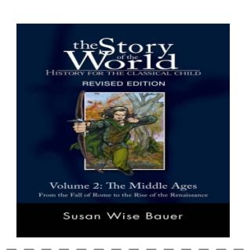

<image> Who is the author of this book? **User**

Susan Wise Bauer **MobileVLM**

> Is this book related to Education & Teaching? **User**

Yes, this book is related to Education & Teaching, as it is a comprehensive history of the Classical Child, which is a subject that is often taught in schools. The book provides a detailed account of the history of the Classical Child, including its origins, development, and cultural **MobileVLM**

influences.

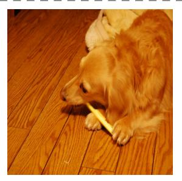

<image> What breed does the dog appear to be? **User**

The dog appears to be a Golden Retriever. **MobileVLM**

> Why might a dog chew on a stick or a toothbrush? **User**

Dogs may chew on toothbrushes for several reasons, such as seeking comfort, stimulation, or to relieve boredom. Chewing on a toothbrush can also help dogs clean their teeth and maintain good oral hygiene. Additionally, dogs may chew on toothbrushes as a form of play or as a way to **MobileVLM**

express their natural instincts and curiosity.

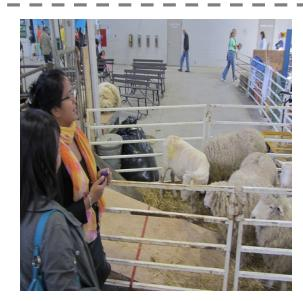

<image> What could be the purpose of the gathering in this setting? **User**

**MobileVLM**

The purpose of the gathering in this setting could be a sheep show or a livestock event, where people are observing and interacting with the sheep. In the image, there are several sheep in a pen, and a woman is holding a cell phone, which suggests that she might be capturing images or recording videos of the animals. The presence of a bench and a dining table in the area also indicates that this could be a place where people gather to socialize, eat, or simply enjoy the sight of the sheep. The event could be a part of a larger agricultural show or a community gathering where people come together to learn about and appreciate the animals and their caretakers.

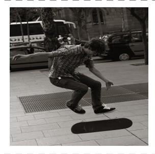

<image> What can you infer about the skateboarder's skill level? **User**

**MobileVLM**

Based on the image, it can be inferred that the skateboarder has a relatively high skill level. The young man is performing a trick on his skateboard, jumping over a small obstacle, which requires a certain level of expertise and balance. This suggests that he has practiced and mastered the necessary skills to execute such a maneuver. The fact that he is able to perform such a trick in a public area, such as a sidewalk, further indicates that he has a certain level of confidence and experience in skateboarding.

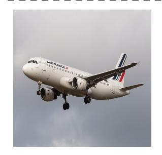

<image> What color is the jet airliner in the image? **User**

The jet airliner in the image is white. **MobileVLM**

> What does it look like the plane is doing? **User**

The plane is flying through the sky, and it appears to be in the process of taking off. **MobileVLM**

Figure 5. Examples of MobileVLM on VLM training datasets.

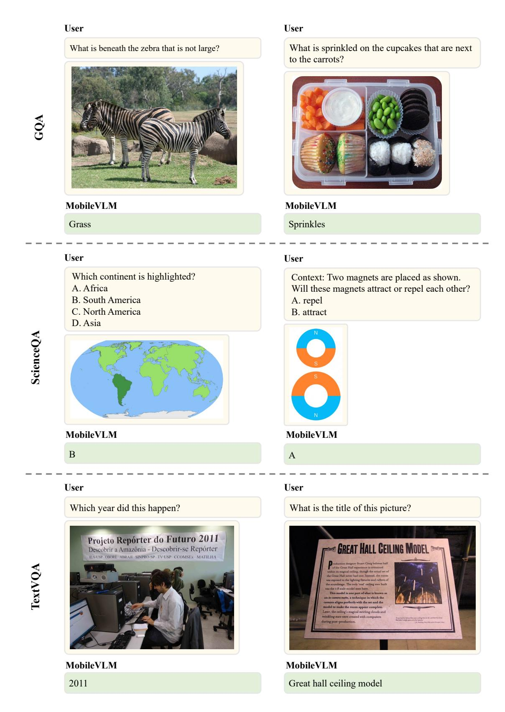

Figure 6. Examples of MobileVLM on GQA, ScienceQA, and TextVQA Benchmarks.

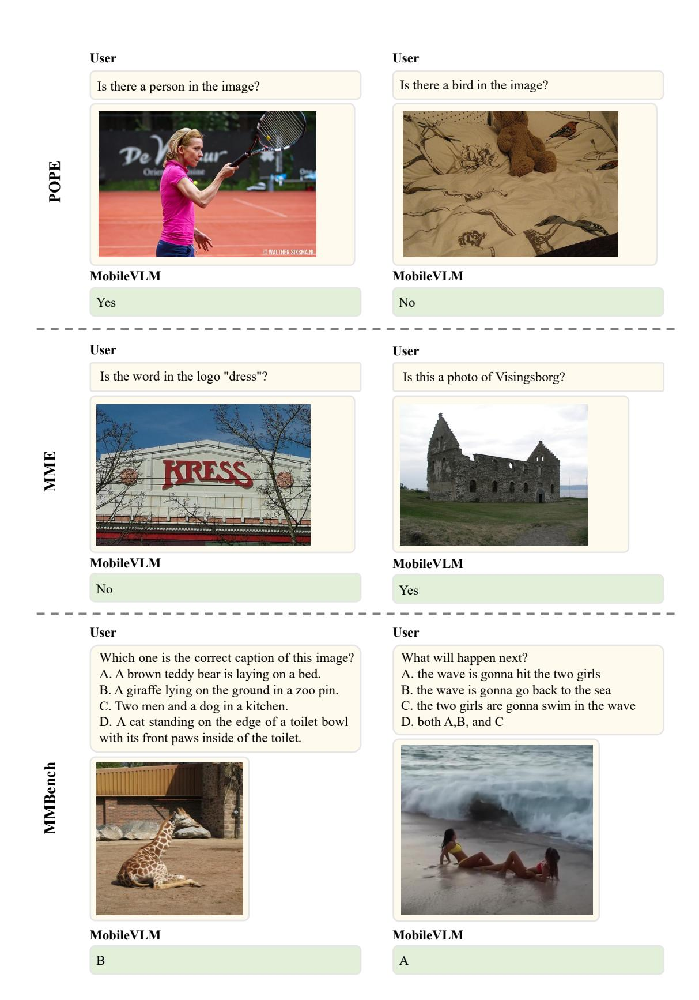

Figure 7. Examples of MobileVLM on POPE, MME and MMBench Benchmarks.