## TroL: Traversal of Layers for Large Language and Vision Models

## Byung-Kwan Lee KAIST

Sangyun Chung KAIST

Chae Won Kim KAIST

leebk@kaist.ac.kr

jelarum@kaist.ac.kr

chaewonkim@kaist.ac.kr

## Beomchan Park KAIST

bpark0810@kaist.ac.kr

## Abstract

Large language and vision models (LLVMs) have been driven by the generalization power of large language models (LLMs) and the advent of visual instruction tuning. Along with scaling them up directly, these models enable LLVMs to showcase powerful vision language (VL) performances by covering diverse tasks via natural language instructions. However, existing open-source LLVMs that perform comparably to closed-source LLVMs such as GPT-4V are often considered too large (*e.g.*, 26B, 34B, and 110B parameters), having a larger number of layers. These large models demand costly, high-end resources for both training and inference. To address this issue, we present a new efficient LLVM family with 1.8B, 3.8B, and 7B LLM model sizes, Traversal of Layers ( TroL), which enables the reuse of layers in a token-wise manner. This layer traversing technique simulates the effect of looking back and retracing the answering stream while increasing the number of forward propagation layers without physically adding more layers. We demonstrate that TroL employs a simple layer traversing approach yet efficiently outperforms the open-source LLVMs with larger model sizes and rivals the performances of the closed-source LLVMs with substantial sizes. Code is available in [https://github.com/ByungKwanLee/TroL.](https://github.com/ByungKwanLee/TroL)

## 1 Introduction

The great success of closed-source large language and vision models (LLVMs) such as GPT-4V [\(Achiam et al.,](#page-9-0) [2023\)](#page-9-0), Gemini-Pro [\(Team et al.,](#page-13-0) [2023\)](#page-13-0), and Qwen-VL-Plus [\(Bai et al.,](#page-9-1) [2023\)](#page-9-1) has prompted the world to build open-source LLVMs using open-source large language models (LLMs) and visual instruction tuning [\(Liu et al.,](#page-12-0) [2023c](#page-12-0)[,b,](#page-12-1) [2024a\)](#page-12-2). These movements are expected to contribute significantly to both research and industry

## Yong Man Ro KAIST

ymro@kaist.ac.kr

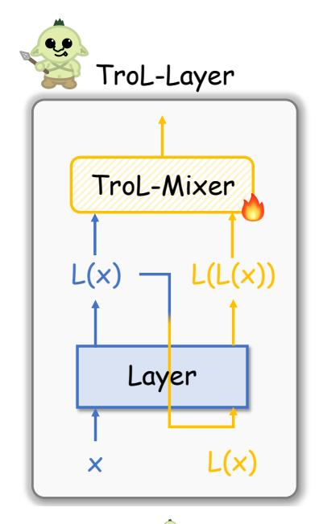

Figure 1: Overview of TroL's layer traversing

through numerous downstream tasks, such as ondevice chatbot systems.

In order to bootstrap their vision language performance, several studies have curated high-quality visual instruction tuning datasets [\(Chen et al.,](#page-9-2) [2023b,](#page-9-2) [2024b\)](#page-9-3) by leveraging the power of closed-source LLVMs. Further, they have physically increased the model sizes [\(McKinzie et al.,](#page-12-3) [2024;](#page-12-3) [Li et al.,](#page-11-0) [2024b;](#page-11-0) [Liu et al.,](#page-12-2) [2024a\)](#page-12-2) to enhance their capability to understand complex question-answer pairs.

Following these efforts, there has been a recent rise in techniques for employing additional modules: mixed vision encoders [\(Kar et al.,](#page-10-0) [2024;](#page-10-0) [Lu](#page-12-4) [et al.,](#page-12-4) [2024;](#page-12-4) [Goncharova et al.,](#page-10-1) [2024;](#page-10-1) [Ranzinger](#page-12-5) [et al.,](#page-12-5) [2023;](#page-12-5) [Zhao et al.,](#page-14-0) [2024\)](#page-14-0), multiple computer vision models [\(Chen et al.,](#page-9-4) [2024a;](#page-9-4) [Wang et al.,](#page-13-1) [2024b;](#page-13-1) [Jiao et al.,](#page-10-2) [2024;](#page-10-2) [Lee et al.,](#page-11-1) [2024b](#page-11-1)[,c\)](#page-11-2), and mixtures of experts (MoE) for efficiently scaling LLVMs to fulfill specific purposes [\(Lin et al.,](#page-11-3) [2024;](#page-11-3) [Lee et al.,](#page-11-2) [2024c;](#page-11-2) [Li et al.,](#page-11-4) [2024a,](#page-11-4)[c;](#page-11-5) [Guo et al.,](#page-10-3) [2024;](#page-10-3) [McKinzie et al.,](#page-12-3) [2024;](#page-12-3) [Li et al.,](#page-11-0) [2024b;](#page-11-0) [Gao et al.,](#page-10-4) [2024;](#page-10-4) [Sun et al.,](#page-13-2) [2024a\)](#page-13-2). In the end, LLVMs com-

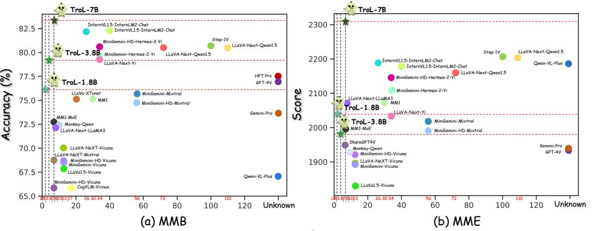

Figure 2: Performances for efficient LLVM family, TroL, across three model sizes: 1.8B, 3.8B, and 7B

bined with these techniques have shown improved vision language performances, achieving results comparable to directly scaled-up LLVMs with 26B, 34B, and 110B model sizes. Additionally, some approaches have demonstrated performances that surpass those of the closed-source LLVMs.

However, directly scaling the model size up or using additional modules may not be considered a fundamental solution to enlarging learning capabilities regarding complex question-answer pairs. This is because they physically add a considerable number of training parameters or borrow richer knowledge from external modules. In other words, it remains unexplored how LLVMs with smaller model sizes can effectively enhance learning capabilities despite their inherent physical limitations.

To address this, simply increasing the image resolution size [\(Li et al.,](#page-11-6) [2023a;](#page-11-6) [Bai et al.,](#page-9-1) [2023;](#page-9-1) [Wang](#page-13-3) [et al.,](#page-13-3) [2023;](#page-13-3) [Ye et al.,](#page-13-4) [2023b;](#page-13-4) [Hu et al.,](#page-10-5) [2024a\)](#page-10-5) and dynamically dividing images into sub-parts for hierarchical focus [\(Liu et al.,](#page-12-2) [2024a;](#page-12-2) [McKinzie et al.,](#page-12-3) [2024;](#page-12-3) [Xu et al.,](#page-13-5) [2024\)](#page-13-5) may be good candidates to achieve our purpose without employing any additional modules mentioned. Nonetheless, these strategies are mostly intended to embed rich image information to further improve overall and finegrained image understanding. Hence, we need to focus on how multimodal LLMs can be enhanced by themselves. Once more efficient LLMs that perform comparably to closed-source models are released publicly, it will mitigate the necessity for high-end GPUs and accelerate significant advancements in various downstream applications, including on-device processing.

Therefore, we present a new efficient LLVM family with 1.8B, 3.8B, and 7B model sizes, Traversal of Layers ( TroL), which enables the reuse of layers in a token-wise manner. To overcome the inherent limitations of smaller-sized LLVMs, we

opt to increase the number of forward propagations rather than physically adding more layers, as is normally done in scaled-up LLVMs. This technique, which we call layer traversing, allows LLVMs to retrace and re-examine the answering stream, akin to human retrospection and careful thought before responding with an answer. Figure [1](#page-0-0) represents how the layer traversing technique is practically implemented in TroL-Layer, where TroL-Mixer serves as the token-wise mixing operation under lightweight additional parameters: 49K, 98K, and 131K in total layers. This is a significantly tiny number compared with the 1.8B, 3.8B, and 7B model sizes.

To successfully apply layer traversing to LLVMs, we employ a two-step training process, establishing TroL. The first step involves training a vision projector and all TroL-Mixers for each TroL-Layer. This is a crucial step because it not only aligns vision and language information but also tunes the TroL-Mixers with the answering stream in backbone multimodal LLMs, thereby facilitating the use of layer traversing. The second training step includes further training of these components along with the backbone multimodal LLMs. To achieve efficient training, we use Q-LoRA [\(Dettmers et al.,](#page-9-5) [2023\)](#page-9-5) training for the backbone multimodal LLMs under 4/8-bit quantization.

In conducting the two-step training, we demonstrate that TroL is an efficient model, yet it outperforms open-source LLVMs with larger model sizes (e.g., 26B, 34B, 72B, and 110B) and closedsource LLVMs with a substantially vast amount of parameters, as illustrated in Figures [2](#page-1-0) and [3.](#page-2-0)

Our contribution can be summarized into two main aspects:

• We introduce a new efficient LLVM family—1.8B, 3.8B, and 7B, Traversal of Layers ( TroL), which enables the reuse of layers,

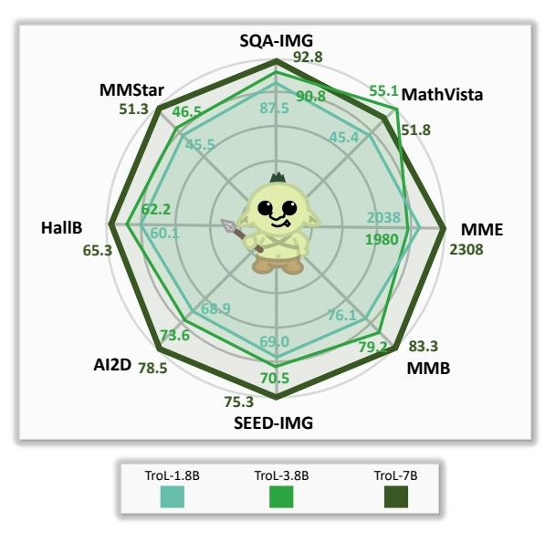

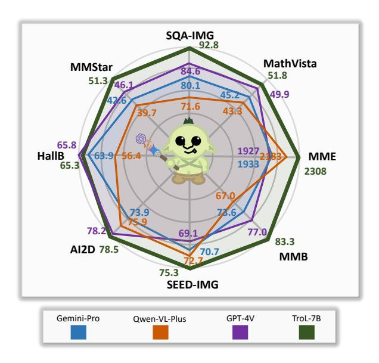

(a) A new LLVM family, TroL-1.8B | 3.8B | 7B

(b) Closed-source LLVMs v.s. TroL-7B

Figure 3: Overview of vision language performances compared with the TroL and closed-source LLVMs simulating the effect of retracing the answerspecific tasks or domains. ing stream.

• **TroL** proves its superior effectiveness on various evaluation benchmarks compared with substantially sized open- and closed-source LLVMs without directly scaling up the model size and without any additional modules.

### **Related Works**

Large Language and Vision Models. tion of visual instruction tuning datasets (Liu et al., 2023c,b, 2024a; Dai et al., 2023) has significantly propelled the rapid development of LLVMs (Chen et al., 2023a; Bai et al., 2023; Zhu et al., 2023; Li et al., 2023b; Ye et al., 2023a,b; Chen et al., 2023b; Contributors, 2023; Zhang et al., 2023; Chen et al., 2023c, 2024d). Building upon this foundation, recent research has further advanced LLVMs' capabilities through two key strategies: scaling up model sizes and designing specialized instruction tuning datasets. Firstly, increasing model sizes has emerged as a prominent approach to enhancing LLVM performance and capacity. For example, LLVMs (McKinzie et al., 2024; Li et al., 2024b; Liu et al., 2024a; Wang et al., 2023; Laurençon et al., 2023; Sun et al., 2023; Gao et al., 2024; Sun et al., 2024a) deploy larger architectures and more parameters to enlarge the representational power of these models. Moreover, the development of meticulous instruction tuning datasets (Chen et al., 2023b; Li et al., 2024b; Hu et al., 2024a; Gao et al., 2023; Wang et al., 2024a; Yue et al., 2023, 2024) has played a pivotal role in improving LLVMs for

Additionally, recent research has explored more direct approaches to enhance LLVM's image perception capabilities, either by modifying visual input and utilizing additional modules. For example, Qwen-VL (Bai et al., 2023), CogVLM (Wang et al., 2023), and mPLUG family (Ye et al., 2023b; Hu et al., 2024a) increase image resolution to enrich visual information in LLVMs. Moreover, few approaches (Liu et al., 2024a; McKinzie et al., 2024; Li et al., 2024b) improve visual tokens through image partitioning. Additionally, the integration of additional vision encoders (Kar et al., 2024; Lu et al., 2024; Goncharova et al., 2024; Ranzinger et al., 2023; Zhao et al., 2024) and external computer vision modules (Chen et al., 2024a; Wang et al., 2024b; Jiao et al., 2024; Lee et al., 2024b,c) augment LLVMs' image perception capability, thereby enhancing overall performance on multimodal tasks.

While these lines of works expand the overall learning capabilities of LLVMs, they do not necessarily enhance the fundamental capacity of LLVMs. Consequently, there remains a need for further research into the intrinsic mechanisms of LLVMs without scaling models or leveraging additional modules. Thus, we introduce a new LLVM family, TroL, specifically tailored to enhance the learning capabilities of LLVMs, where layer traversing is presented to efficiently reuse layers. This approach simulates the effect of retracing the answering stream, offering a focused solution to propel the advancement of LLVMs.

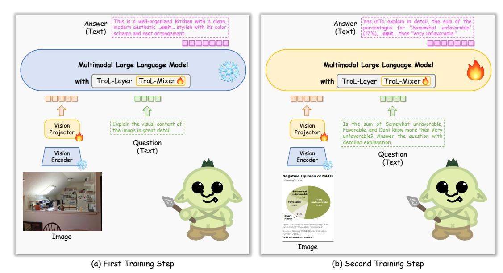

Figure 4: Overview of two-step training to build an efficient LLVM Family, \*TroL

Numerous Efficient Approaches. Despite the remarkable achievements of LLVMs in a short period of time, closed-source LLVMs require a significant number of parameters and resources. For that reason, many LLVMs have been exploring methods to create more efficient models. These methods aim to reduce the number of parameters or improve computational efficiency without significantly compromising performance. Numerous methods to reducing the number of parameters involve sharing specific weights within the model (Thawakar et al., 2024; Lan et al., 2020; Takase and Kiyono, 2023; Reid et al., 2021), eliminating weights that contribute less to the performance (Sun et al., 2024b; Ma et al., 2023; Cao et al., 2023; Frantar and Alistarh, 2023; Men et al., 2024), and employing quantization techniques (Shao et al., 2024a; Li et al., 2023f; Park et al., 2024a).

These efforts primarily focus on reducing inference time or accelerating training speed while maintaining performance, rather than fundamentally improving it. In contrast, \*TroL aims to efficiently enhance the learning capabilities of LLVMs in understanding complex question-answer pairs.

# 3 TroL: Traversal of Layers

Model Architecture. As illustrated in Figure 4, TroL is composed of a vision encoder, a vision projector, and a backbone multimodal large language model (MLLM) based on a pre-trained LLM. We utilize CLIP-L (Radford et al., 2021) and InternViT (Chen et al., 2023c) for the vision encoder, which are text-aligned vision encoders based on image-text contrastive learning with a small text encoder (CLIP) and QLLaMA-8B (Cui et al., 2023) (InternViT), respectively. For the vision projector, we employ two fully-connected layers with the GELU activation function (Hendrycks and Gimpel, 2016). As for the backbone multimodal LLM, we use Phi-3-mini (Abdin et al., 2024) with a 3.8B model size, and InternLM2 (Team, 2023; Cai et al., 2024) with 1.8B and 7B model sizes. 3.3T and 2T tokens are used during the pre-training of these LLMs, respectively.

**Visual Instruction Tuning Dataset.** We gather a wide range of visual instruction tuning datasets requiring diverse capabilities such as fundamental image understanding, common-sense knowledge, non-object concepts (e.g., charts, diagrams, documents, signs, symbols), math problems, and their integrated capabilities. This is because we aim to make TroL encompass diverse capabilities for vision language tasks despite its efficient model size. To balance the dataset samples across numerous capabilities, we selectively choose samples from existing visual instruction tuning datasets: ShareGPT4V-Caption/Instruct (Chen et al., 2023b), ALLaV4V-Text (Chen et al., 2024b), MiniGemini-Instruct (Li et al., 2024b), Doc-Downstream/Reason (Hu et al., 2024a), GLLaVA-Align/Instruct (Gao et al., 2023), and Math-Vision/Instruct/Plus (Wang et al., 2024a; Yue et al., 2023, 2024). In summary, we collect 899K realworld image/text-only samples, 627K samples for documents, charts, diagrams, signs, and symbols, and 747K math samples (180.5K with images and 566.8K text-only). Overall, the number of visual

| LLVMs                                 | Q-Bench | SQA I | AI2D | ChartQA | SEEDI | POPE | HallB | MME  | MathVista | MMB  | MMB CN | MM-Vet | LLaVAW |
|---------------------------------------|---------|------------------|------|---------|-------|------|-------|------|-----------|------|-------------------|--------|--------|
| BLIP2-13B (Li et al., 2023d)          | -       | 61.0             | -    | -       | 46.4  | 85.3 | -     | 1584 | -         | -    | _                 | 22.4   | -      |
| InstructBLIP-7B (Dai et al., 2023)    | 56.7    | 60.5             | -    | -       | 53.4  | -    | 53.6  | -    | 25.3      | 36.0 | 23.9              | 26.2   | -      |
| InstructBLIP-13B (Dai et al., 2023)   | -       | 63.1             | -    | -       | -     | 78.9 | -     | -    | -         | 33.9 | -                 | 25.6   | -      |
| IDEFICS-9B (Laurençon et al., 2023)   | 51.5    | -                | -    | -       | -     | 74.6 | -     | 1353 | 19.8      | 48.2 | 25.2              | 23.7   | -      |
| Qwen-VL-7B (Bai et al., 2023)         | 59.4    | 67.1             | -    | -       | -     | -    | -     | -    | -         | 38.2 | 7.4               | -      | -      |
| Qwen-VL-Chat-7B (Bai et al., 2023)    | 33.8    | 68.2             | -    | -       | 58.2  | -    | 56.4  | 1849 | -         | 60.6 | 56.7              | 47.3   | -      |
| MiniGPT-4-7B (Zhu et al., 2023)       | 51.8    | -                | -    | -       | -     | -    | -     | -    | 23.1      | 23.0 | 11.9              | 22.1   | -      |
| Otter-7B (Li et al., 2023b)           | 47.2    | -                | -    | -       | -     | 72.5 | -     | 1599 | 19.7      | 48.3 | -                 | 24.7   | -      |
| UIO-2-XXL-6.8B (Lu et al., 2023a)     | -       | 86.2             | -    | -       | 61.8  | 87.7 | -     | -    | -         | 71.5 | -                 | -      | -      |
| LLaVA-7B (Liu et al., 2023c)          | -       | 38.5             | -    | -       | -     | 80.2 | 44.1  | 1055 | -         | 34.1 | 14.1              | 26.7   | -      |
| LLaVA1.5-7B (Liu et al., 2023b)       | 60.1    | 66.8             | -    | -       | 58.6  | 85.9 | -     | 1805 | -         | 64.3 | 58.3              | 30.5   | 63.4   |
| LLaVA1.5-13B (Liu et al., 2023b)      | 61.4    | 71.6             | 54.8 | 18.2    | 61.6  | 85.9 | 46.7  | 1826 | 27.6      | 67.7 | 63.6              | 35.4   | -      |
| mPLUG-Owl-7B (Ye et al., 2023a)       | 58.9    | -                | -    | -       | -     | -    | -     | -    | 22.2      | 46.6 | -                 | -      | -      |
| mPLUG-Owl2-7B (Ye et al., 2023b)      | 62.9    | 68.7             | -    | -       | -     |      | -     | -    | -         | 64.5 | 60.3              | 36.2   | -      |
| ShareGPT4V-7B (Chen et al., 2023b)    | 63.4    | 68.4             | -    | -       | 69.7  | -    | 49.8  | 1944 | 25.8      | 68.8 | 62.2              | 37.6   | -      |
| InternLM-XC-7B (Zhang et al., 2023)   | 64.4    | -                | -    | -       | 66.1  | -    | 57.0  | 1919 | 29.5      | 74.4 | 72.4              | 35.2   | -      |
| Monkey-10B (Li et al., 2023g)         | -       | 69.4             | -    | -       | 68.9  | -    | 58.4  | 1924 | 34.8      | 72.4 | 67.5              | 33.0   | -      |
| VILA-7B (Lin et al., 2023b)           | -       | 68.2             | -    | -       | 61.1  | 85.5 | -     | -    | -         | 68.9 | 61.7              | 34.9   | -      |
| VILA-13B (Lin et al., 2023b)          | -       | 73.7             | -    | -       | 62.8  | 84.2 | -     | -    | -         | 70.3 | 64.3              | 38.8   | -      |
| SPHINX-7B (Lin et al., 2023c)         | -       | 70.6             | -    | -       | 71.6  | 86.9 | -     | 1797 | 27.8      | 65.9 | 57.9              | 40.2   | -      |
| SPHINX-MoE-7B×8 (Gao et al., 2024)    | 66.2    | 70.6             | -    | -       | 73.0  | 89.6 | -     | 1852 | 42.7      | 71.3 | -                 | 40.9   | -      |
| SPHINX-Plus-13B (Gao et al., 2024)    | 66.2    | 70.6             | -    | -       | 74.8  | 89.1 | 52.1  | 1741 | 36.8      | 71.0 | -                 | 47.9   | -      |
| LLaVA-NeXT-7B (Liu et al., 2024a)     | -       | 70.1             | -    | -       | 70.2  | 86.5 | -     | 1851 | 34.6      | 69.6 | 63.3              | 43.9   | 72.3   |
| LLaVA-NeXT-8B (Liu et al., 2024a)     | -       | -                | 71.6 | 69.5    | -     | -    | -     | 1972 | 37.5      | 72.1 | -                 | -      | 80.1   |
| LLaVA-NeXT-13B (Liu et al., 2024a)    | -       | 73.6             | 70.0 | 62.2    | 72.2  | 86.7 | -     | 1892 | 35.1      | 70.0 | 68.5              | 47.3   | 72.3   |
| MM1-7B (McKinzie et al., 2024)        | -       | 72.6             | -    | -       | 69.9  | 86.6 | -     | 1858 | 35.9      | 72.3 | -                 | 42.1   | -      |
| MM1-MoE-7B×32 (McKinzie et al., 2024) | -       | 74.4             | -    | -       | 70.9  | 87.8 | -     | 1992 | 40.9      | 72.7 | -                 | 45.2   | -      |
| MiniGemini-HD-7B (Li et al., 2024b)   | -       | -                | -    | -       | -     | -    | -     | 1865 | 32.2      | 65.8 | -                 | 41.3   | -      |
| MiniGemini-HD-13B (Li et al., 2024b)  | -       | -                | -    | -       | -     | -    | -     | 1917 | 37.0      | 68.6 | -                 | 50.5   | -      |
| TroL-7B                               | 73.6    | 92.8             | 78.5 | 71.2    | 75.3  | 87.8 | 65.3  | 2308 | 51.8      | 83.5 | 81.2              | 54.7   | 92.8   |

Table 1: Comparison with the current existing standard model size open-source LLVMs, evaluating vision language performances of ♣ TroL on numerous evaluation benchmarks: Q-Bench (Wu et al., 2023), SQAI (Lu et al., 2022), AI2D (Kembhavi et al., 2016), ChartQA (Masry et al., 2022), SEEDI (Li et al., 2023c), POPE (Li et al., 2023e), HallB (Liu et al., 2023a), MME (Fu et al., 2023), MathVista (Lu et al., 2023b), MMB (Liu et al., 2023d), MMBCN (Liu et al., 2023d), MM-Vet (Yu et al., 2023), and LLaVAW (Liu et al., 2023c). Note that, LLaVAW is newly evaluated with *GPT-4-0613* because the original evaluator *GPT-4-0314* is deprecated.

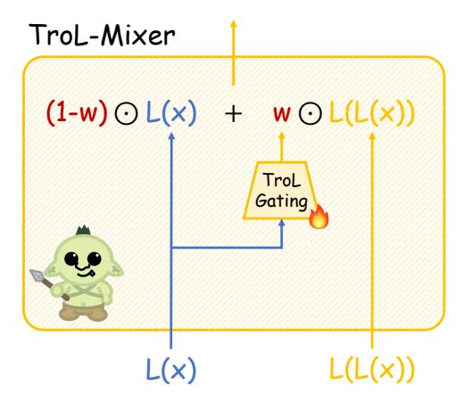

Figure 5: Overview of mix operation in TroL-Mixer

instruction tuning samples we used to build \* TroL totals 2.3M samples.

**Layer Traversing.** To effectively enlarge learning capabilities with smaller sized LLVMs, we introduce a layer traversing technique that allows the reuse of layers. As described in Figure 1, once the input token  $x \in \mathbb{R}^{N \times D}$  (i.e., vision language features), where N denotes the number of tokens and D denotes the hidden dimension of a layer, is given, then a layer normally outputs L(x) from the input token. Layer traversing makes the out-

put of the layer forward in the equal layer once again: L(L(x)). Subsequently, the outputs L(x)and L(L(x)) from the equal layer get mixed to further improve the vision language features by themselves. Here, we present TroL-Mixer that provides a mixing operation with L(x) and L(L(x)), where TroL Gating is introduced to determine how much reused vision language feature L(L(x)) is needed for the next layer, by looking at the feature status of the first propagation output L(x). More specifically, the output L(x) is propagated into the TroL Gating and it produces a mixing ratio  $w \in \mathbb{R}^N$  for each token. It is used for token-wise multiplication  $\odot$  with L(x) and L(L(x)). Finally, the mixed output  $(1-w) \odot L(x) + w \odot L(L(x))$  in Figure 5 is used to propagate to the next layer and it is continually operated as it goes layers. By doing this, we expect the layer traversing to stimulate the effect of retracing and looking back at the answering stream once again, thereby enlarging the learning capabilities by nature.

**Training Strategy.** TroL-Layer is applied to backbone multimodal LLMs described in Figure 1 and 4 for application to layer traversing technique. Thereafter, we conduct a two-step training pro-

| LLVMs                                      | Q-Bench | SQA I | AI2D | ChartQA | SEEDI | POPE | HallB | MME  | MathVista | MMB  | MMB CN | MM-Vet | LLaVAW |
|--------------------------------------------|---------|------------------|------|---------|-------|------|-------|------|-----------|------|-------------------|--------|--------|
| UIO-2-XL-3.2B (Lu et al., 2023a)           | -       | 87.4             | -    | -       | 60.2  | 87.2 | -     | -    | -         | 68.1 | -                 | -      | -      |
| Gemini Nano-2-3.2B (Team et al., 2023)     | -       | -                | -    | -       | -     | -    | -     | -    | 30.6      | -    | -                 | -      | -      |
| MobileVLM-3B (Chu et al., 2023)            | -       | 61.2             | -    | -       | -     | 84.9 | -     | -    | -         | 59.6 | -                 | -      | -      |
| MobileVLM-V2-3B (Chu et al., 2024)         | -       | 70.0             | -    | -       | -     | 84.7 | -     | -    | -         | 63.2 | -                 | -      | -      |
| MoE-LLaVA-2.7B×4 (Lin et al., 2024)        | -       | 70.3             | -    | -       | -     | 85.7 | -     | -    | -         | 68.0 | -                 | 35.9   | -      |
| LLaVA-Phi-2.7B (Zhu et al., 2024)          | -       | 68.4             | -    | -       | -     | 85.0 | -     | -    | -         | 59.8 | -                 | 28.9   | -      |
| Imp-v1-3B (Shao et al., 2024b)             | -       | 70.0             | -    | -       | -     | 88.0 | -     | -    | -         | 66.5 | -                 | 33.1   | -      |
| TinyLLaVA-3.1B (Zhou et al., 2024)         | -       | 69.1             | -    | -       | -     | 86.4 | -     | -    | -         | 66.9 | -                 | 32.0   | -      |
| TinyLLaVA-Sig-Phi-3.1B (Zhou et al., 2024) | -       | 69.1             | -    | -       | -     | 86.4 | -     | -    | -         | 66.9 | -                 | 32.0   | -      |
| Bunny-3B (He et al., 2024)                 | -       | 70.9             | 38.2 | -       | 62.5  | 86.8 | -     | 1778 | -         | 68.6 | -                 | -      | -      |
| MiniCPM-2.4B (Hu et al., 2024b)            | -       | -                | 56.3 | -       | -     | -    | -     | 1650 | 28.9      | 64.1 | 62.6              | 31.1   | -      |
| MiniCPM-V2-2.8B (Hu et al., 2024b)         | -       | -                | 62.9 | -       | -     | -    | -     | 1809 | 38.7      | 69.1 | 66.5              | 41.0   | -      |
| MM1-3B (McKinzie et al., 2024)             | -       | 69.4             | -    | -       | 68.8  | 87.4 | -     | 1762 | 32.0      | 67.8 | -                 | 43.7   | -      |
| MM1-MoE-3B×64 (McKinzie et al., 2024)      | -       | 76.1             | -    | -       | 69.4  | 87.6 | -     | 1773 | 32.6      | 70.8 | -                 | 42.2   | -      |
| ALLaVA-3B (Chen et al., 2024b)             | -       | -                | -    | -       | 65.2  | -    | -     | 1623 | -         | 64.0 | -                 | 32.2   | -      |
| ALLaVA-3B-Longer (Chen et al., 2024b)      | -       | -                | -    | -       | 65.6  | -    | -     | 1564 | -         | 64.6 | -                 | 35.5   | -      |
| TroL-3.8B                                  | 70.0    | 90.8             | 73.6 | 73.8    | 70.5  | 86.5 | 62.2  | 1980 | 55.1      | 79.2 | 77.1              | 51.1   | 76.6   |
| UIO-2-L-1.1B (Lu et al., 2023a)            | -       | 78.6             | -    | -       | 51.1  | 77.8 | -     | -    | -         | 62.1 | -                 | -      | -      |
| MobileVLM-1.7B (Chu et al., 2023)          | -       | 57.3             | -    | -       | -     | 84.5 | -     | -    | -         | 53.2 | -                 | -      | -      |
| MobileVLM-V2-1.7B (Chu et al., 2024)       | -       | 66.7             | -    | -       | -     | 84.3 | -     | -    | -         | 57.7 | -                 | -      | -      |
| DeepSeek-VL-1.3B (Lu et al., 2024)         | -       | -                | -    | -       | 66.7  | 87.6 | -     | -    | 31.1      | 64.6 | 62.9              | 34.8   | -      |
| Mini-Gemini-2B (Li et al., 2024b)          | -       | -                | -    | -       | -     | -    | -     | 1653 | 29.4      | 59.8 | -                 | -      | -      |
| MoE-LLaVA-1.8B×4 (Lin et al., 2024)        | -       | 63.1             | -    | -       | -     | 87.0 | -     | -    | -         | 59.7 | -                 | 25.3   | -      |
| TroL-1.8B                                  | 68.2    | 87.5             | 68.9 | 64.0    | 69.0  | 88.6 | 60.1  | 2038 | 45.4      | 76.1 | 74.1              | 45.1   | 69.7   |

Table 2: Comparison with the current existing smaller open-source LLVMs across  $1B\sim4B$  model sizes, evaluating vision language performances of  $\mbox{\ \ @}$  TroL on numerous evaluation benchmarks equally used in Table 1. Note that, the compared baselines were not validated on Q-Bench, ChartQA, HallB, and LLaVAW, but we measure their performances to compare with the baselines mentioned in Table 1.

cess to effectively implement layer traversing using LLVMs, creating a new efficient LLVM family named TroL. In the first training step, we focus on training a vision projector and all TroL-Mixers for every TroL-Layer. This step is essential as it aligns vision and language information while synchronizing the TroL-Mixers with the response stream in the backbone multimodal LLMs, thus facilitating the understanding of layer traversing operation. The subsequent second training step involves additional training of these elements alongside the backbone multimodal LLMs together.

#### 4 Experiment

Implementation Detail. To ensure successful reproducibility, we present four key technical aspects of ♠ TroL: the detailed structure of (a) backbone multimodal LLMs, (b) vision encoder, vision projectors, TroL Gating. In addition, the detailed procedures of (c) training and inference are described.

- (a) For backbone multimodal LLMs, we employ Phi-3-mini (Abdin et al., 2024) and InternLM2 (Team, 2023; Cai et al., 2024), where Phi-3-mini 3.8B model consists of 32 layers with hidden dimension of 3072, while InternLM2-1.8B | 7B features 24 | 32 layers with hidden dimension of 2048 | 4096, respectively.
- **(b)** We use CLIP-L (Radford et al., 2021) and InternViT (Chen et al., 2023c) as vision encoders,

each comprising 428M | 300M parameters, with 24 layers and hidden dimension of 1024. When investigating best structural combination, we consider CLIP-L for 1.8B and 7B model and consider InternViT for 3.8B model. The vision projector consists of an MLP that adjusts the hidden dimension from 1024 to 2048 | 3072 | 4096 to match the hidden dimension of backbone multimodal LLMs. This MLP contains two fully-connected layers with GELU activation (Hendrycks and Gimpel, 2016). TroL Gating employs a single fullyconnected layer that converts the hidden dimension from 2048 | 3072 | 4096 to 1, resulting in a total of  $2048 \times 24 = 49K$ ,  $3072 \times 32 = 98K$ , and  $4096 \times 32 = 131$ K parameters for TroL Gating each, which are minimal compared to the 1.8B, 3.8B, and 7B model sizes.

(c) The training and evaluation of TroL are conducted in a computing environment with 8×NVIDIA Tesla A100 80GB and 8×NVIDIA RTX A6000 48GB, each. To optimize the training process, we use one epoch of training for each step under 4/8-bit quantization and bfloat16 data type (Kalamkar et al., 2019) for each backbone multimodal LLM: TroL-1.8B (4-bit), TroL-3.8B (8-bit), and TroL-7B (4-bit). The 4-bit quantization employs double quantization and normalized float 4-bit (nf4)(Dettmers et al., 2023). Additionally, QLoRA (Hu et al., 2021; Dettmers et al., 2023) is used to train the multimodal LLMs with

| Benchmarks | OmniFusion-7B | DeepSeek-VL-7B | MoVA-7B      | ASMv2-7B | LAF-7B | CoLLaVO-7B | MoAI-7B | TroL-1.8B | TroL-3.8B | TroL-7B |
|------------|---------------|----------------|--------------|----------|--------|------------|---------|-----------|-----------|---------|
| POPE       | 87.2          | 88.1           | 88.6         | 86.3     | 88.8   | 87.2       | 87.1    | 88.6      | 86.5      | 87.8    |
| SQA-IMG    | 69.2          | 57.7           | 74.4         | 87.1     | -      | 80.7       | 83.5    | 87.5      | 90.8      | 92.8    |
| LLaVA-W    | -             | -              | -            | 78.9     | -      | 69.5       | 71.9    | 69.7      | 76.6      | 92.8    |
| MM-Vet     | 39.4          | 41.5           | <del>-</del> | 41.3     | 38.9   | 40.3       | 43.7    | 45.1      | 51.1      | 54.7    |
| MMStar     | -             | -              | -            | -        | -      | 42.1       | 48.7    | 45.5      | 46.5      | 51.3    |

(a) Comparison with LLVMs using additional modules: OmniFusion (Goncharova et al., 2024), DeepSeek-VL (Lu et al., 2024), MoVA (Kar et al., 2024), ASMv2 (Wang et al., 2024b), LAF (Jiao et al., 2024), CoLLaVO (Lee et al., 2024b), and MoAI (Lee et al., 2024c)

| LLVMs                          | Recognition | OCR  | Knowledge | Language Generation | Spatial Awareness | Math Problems | Avg  |
|--------------------------------|-------------|------|-----------|---------------------|-------------------|---------------|------|
| CoLLaVO-7B (Lee et al., 2024b) | 45.6        | 31.1 | 29.8      | 30.2                | 37.9              | 5.8           | 41.0 |
| MoAI-7B (Lee et al., 2024c)    | 48.3        | 34.8 | 33.5      | 33.0                | 39.7              | 7.7           | 43.7 |
| TroL-1.8B                      | 42.0        | 48.2 | 31.9      | 29.0                | 47.1              | 41.2          | 45.1 |
| TroL-3.8B                      | 45.7        | 56.6 | 37.0      | 40.6                | 56.5              | 48.1          | 51.1 |
| TroL-7B                        | 54.2        | 54.6 | 42.4      | 49.3                | 52.7              | 53.8          | 54.7 |

(b) Evaluating sub-benchmark in MM-Vet (Yu et al., 2023) with LLVMs utilizing computer vision models

| LLVMs                                       | CP   | FP   | IR   | LR   | ST   | MA   | Avg  |
|---------------------------------------------|------|------|------|------|------|------|------|
| Yi-VL-34B (Young et al., 2024)              | 53.2 | 31.2 | 52.0 | 32.4 | 12.4 | 35.2 | 36.1 |
| CogVLM-Chat-17B (Wang et al., 2023)         | 66.8 | 36.8 | 49.2 | 31.2 | 23.6 | 11.6 | 36.5 |
| SPHINX-MoE-7B $\times$ 8 (Gao et al., 2024) | 58.4 | 40.8 | 47.6 | 35.2 | 19.2 | 32.0 | 38.9 |
| InternVL1.2-40B (Chen et al., 2023c)        | 67.6 | 43.2 | 61.2 | 47.2 | 24.0 | 19.2 | 43.7 |
| LLaVA-NeXT-34B (Liu et al., 2024a)          | 66.4 | 52.0 | 62.4 | 46.0 | 32.4 | 53.6 | 52.1 |
| TroL-1.8B                                   | 63.2 | 41.6 | 59.2 | 47.2 | 30.0 | 31.6 | 45.5 |
| TroL-3.8B                                   | 61.2 | 40.0 | 54.0 | 43.2 | 31.2 | 49.6 | 46.5 |
| T I 7D                                      | (0.3 | 17 ( | 151  | 150  | 27.2 | 40.0 | E1 2 |

| LLVMs                               | TD   | TL   | TO   | VI   | VD   | VO   | Avg  |
|-------------------------------------|------|------|------|------|------|------|------|
| G-LLaVA-7B (Gao et al., 2023)       | 20.9 | 20.7 | 21.1 | 17.2 | 16.4 | 9.4  | 16.6 |
| LLaVA-NeXT-13B (Liu et al., 2024a)  | 12.8 | 12.0 | 9.9  | 10.7 | 9.7  | 6.3  | 10.3 |
| ShareGPT4V-13B (Chen et al., 2023b) | 16.2 | 16.2 | 6.6  | 15.5 | 13.8 | 3.7  | 13.1 |
| SPHINX-Plus-13B (Gao et al., 2024)  | 13.9 | 11.6 | 14.9 | 11.6 | 13.5 | 10.4 | 12.2 |
| SPHINX-MoE-7B×8 (Gao et al., 2024)  | 26.2 | 17.4 | 26.7 | 16.7 | 12.5 | 11.1 | 16.8 |
| TroL-1.8B                           | 26.1 | 26.5 | 25.5 | 25.6 | 25.6 | 14.8 | 24.0 |
| TroL-3.8B                           | 42.3 | 38.8 | 40.6 | 35.5 | 35.9 | 21.4 | 35.8 |
| TroL-7B                             | 37.8 | 34.1 | 36.9 | 32.1 | 32.1 | 19.5 | 32.1 |

(c) MMStar (Chen et al., 2024c)

(d) MathVerse (Zhang et al., 2024)

| LLVMs                               |         | Website |         | Ele  | ement  | Acti       | on     | Average |
|-------------------------------------|---------|---------|---------|------|--------|------------|--------|---------|
| 22,111                              | Caption | WebQA   | HeadOCR | OCR  | Ground | Prediction | Ground | Tretage |
| InstrcutBLIP-13B (Dai et al., 2023) | 11.6    | 5.2     | 7.6     | 6.0  | 11.4   | 11.4       | 17.5   | 10.1    |
| Yi-VL-6B (Young et al., 2024)       | 8.0     | 14.3    | 43.8    | 3.5  | 16.2   | 13.9       | 13.6   | 16.2    |
| LLaVA1.5-7B (Liu et al., 2023b)     | 15.3    | 13.2    | 41.0    | 5.7  | 12.1   | 17.8       | 13.6   | 17.0    |
| LLaVA1.5-13B (Liu et al., 2023b)    | 20.0    | 16.2    | 41.1    | 11.8 | 15.0   | 22.8       | 8.7    | 19.4    |
| CogVLM-17B (Wang et al., 2023)      | 16.6    | 30.6    | 65.9    | 10.0 | 17.7   | 11.7       | 23.3   | 25.1    |
| VILA-13B (Lin et al., 2023b)        | 12.7    | 28.8    | 67.9    | 12.6 | 16.5   | 36.3       | 16.5   | 27.3    |
| DeepSeek-VL-7B (Lu et al., 2024)    | 18.1    | 30.0    | 63.4    | 18.1 | 16.2   | 35.2       | 15.5   | 28.1    |
| LLaVA-NeXT-7B (Liu et al., 2024a)   | 27.0    | 39.8    | 57.3    | 54.8 | 31.7   | 30.6       | 10.7   | 36.0    |
| LLaVA-NeXT-13B (Liu et al., 2024a)  | 26.5    | 44.5    | 52.8    | 56.1 | 31.7   | 48.4       | 15.5   | 39.4    |
| LLaVA-NeXT-34B (Liu et al., 2024a)  | 24.3    | 48.2    | 67.1    | 71.9 | 43.1   | 74.0       | 25.2   | 50.5    |
| TroL-1.8B                           | 14.2    | 38.3    | 58.5    | 29.5 | 24.7   | 14.2       | 29.1   | 29.8    |
| TroL-3.8B                           | 22.5    | 65.3    | 70.2    | 63.0 | 69.7   | 20.3       | 39.8   | 50.1    |
| TroL-7B                             | 23.6    | 44.7    | 74.4    | 38.6 | 40.9   | 16.0       | 32.3   | 38.6    |

(e) Evaluating sub-benchmark in VisualWebBench (Liu et al., 2024b) with numerous open-source LLVMs.

Table 3: Detailed comparison of TroL across challenging evaluation benchmarks. Note that, the sub-benchmark category names in (c) and (d) are represented in Appendix A. Note that, Phi-3-mini (Abdin et al., 2024) built in TroL-3.8B has shown excellent benefits for understanding web pages and solving human-level math problems.

64 rank and 64 alpha parameters. We apply the AdamW optimizer (Loshchilov and Hutter, 2019) and use cosine annealing to schedule the learning rate from 1e-4 to 1e-6 in each training step. We also utilize gradient checkpointing (Sohoni et al., 2019) for efficient memory usage. With a gradient accumulation of 6, batch sizes are totally set to 768 for each training step, and each step takes approximately one to three days according to the model sizes. For efficient inference, we validate T TroL under the same quantization bit during training, and we employ deterministic beam search (Freitag and Al-Onaizan, 2017) (n = 5) for text generation. Moreover, in inference, we apply layer traversing technique only to the user questions in order to

avoid dramatically increased inference time. Note that, \*TroL is implemented on the efficient propagation, FlashAttention2 (Dao et al., 2022; Dao, 2023) for speed-up attention computation.

Validation on Evaluation Benchmarks. We have demonstrated super vision language performances of TroL, despite its limited model size, as depicted in Table 1, Table 2, and Table 3. This is attributed to the enhanced learning capabilities by layer traversing. Furthermore, Table 4 have shown several ablation studies to clearly corroborate the effectiveness of TroL in light of seven factors: (a) backbone pre-trained LLMs, (b) the use of layer traversing, (c) the structure of TroL Gating,

| LLMs 1                                                           | Param | MMStar                       | MM-Vet                       | Family                       | Lay-Trav                    | MMStar    | MM-Vet                                 | Structure                                                            | Param                     | MMStar                 | MM-Vet            |
|------------------------------------------------------------------|-------|------------------------------|------------------------------|------------------------------|-----------------------------|-----------|----------------------------------------|----------------------------------------------------------------------|---------------------------|------------------------|-------------------|
| Gemma                                                            | 2B    | 44.6                         | 42.8                         | TroL-1.8B                    | ×                           | 36.0      | 34.6                                   | PR ×2                                                                | 13B                       | 52.3                   | 57.4              |
| InternLM2                                                        | 1.8B  | 45.5                         | 45.1                         | TroL-1.8B                    | ✓                           | 45.5      | 45.1                                   | PR                                                                   | 6B                        | 52.2                   | 57.1              |
| Qwen1.5                                                          | 4B    | 45.5                         | 49.9                         | TroL-3.8B                    | X                           | 37.4      | 43.5                                   | $MHA \times 2 + FC$                                                  | 5B                        | 51.8                   | 56.8              |
| Phi-3-mini                                                       | 3.8B  | 46.5                         | 51.1                         | TroL-3.8B                    | ✓                           | 46.5      | 51.1                                   | MHA + FC                                                             | 2B                        | 51.7                   | 56.6              |
| Mistral                                                          | 7B    | 49.7                         | 53.2                         | TroL-7B                      | Х                           | 41.2      | 45.8                                   | $FC \times 2$                                                        | 537M                      | 51.3                   | 54.8              |
| InternLM2                                                        | 7B    | 51.3                         | 54.7                         | TroL-7B                      | ✓                           | 51.3      | 54.7                                   | FC                                                                   | 131K                      | 51.3                   | 54.7              |
|                                                                  |       |                              |                              | ` '                          | -                           | er travei | C                                      | (c)                                                                  |                           | $\mathcal{L}$          |                   |
| Operation                                                        | ]     | MMStar                       | MM-Vet                       | Percent                      | MMS                         |           | MM-Vet                                 | LLVMs                                                                |                           |                        | Time Ratio        |
| *                                                                |       |                              |                              | Percent                      | MMS                         | tar l     | MM-Vet                                 | LLVMs                                                                |                           | VRAM                   |                   |
| $(1-w)\odot L($                                                  |       | 40.8                         | 45.4                         | Percent 10%                  | MMS 39.9                 | tar 1     | MM-Vet 41.5                         |                                                                      |                           |                        | Time Ratio        |
| *                                                                |       |                              |                              | Percent                      | MMS                         | tar ]     | MM-Vet                                 | LLVMs InternLM2-1.8B                                                 | Tokens)                   | VRAM 6GB            | 1.0               |
| $(1-w) \odot L(w)$ $w \odot L(L(x))$                             |       | 40.8 44.3                 | 45.4 48.1                 | Percent 10% 30%        | MMS 39.9 46.3         | tar 1     | MM-Vet 41.5 48.2                 | LLVMs InternLM2-1.8B +CLIP-L (Image                                  | Tokens)                   | VRAM 6GB +1GB          | 1.0 1.1        |
| $(1-w) \odot L($ $w \odot L(L(x))$ Random $w$                    |       | 40.8 44.3 40.3         | 45.4 48.1 37.0         | Percent 10% 30% 50% | MMS 39.9 46.3 50.8 | tar ]     | MM-Vet 41.5 48.2 54.0         | LLVMs InternLM2-1.8B +CLIP-L (Image +Layer Traversin                 | Tokens)                   | VRAM 6GB +1GB +1GB 7GB | 1.0 1.1 1.3 |
| $(1-w)\odot L($ $w\odot L(L(x))$ Random $w$ Uniform $w$ |       | 40.8 44.3 40.3 41.4 | 45.4 48.1 37.0 46.3 | Percent 10% 30% 50% 70%      | MMS 39.9 46.3 50.8 51.2     | tar ]     | MM-Vet 41.5 48.2 54.0 54.4 | LLVMs InternLM2-1.8B +CLIP-L (Image +Layer Traversin Phi-3-mini-3.8B | Tokens) g ge Tokens | VRAM 6GB +1GB +1GB 7GB | 1.0 1.1 1.3 |

Table 4: Ablation studies to identify the effectiveness of \(\frac{1}{2}\) TroL by controlling the six main factors.

Figure 6: Visualization of layer traversing activated degree in each layer where mixing ratios of w in token-wise manner are shown as the colors in color bar. To clearly discriminate where the layer traversing mostly occurs, they are applied to min-max normalization in each layer. (i.e., The brighter they are, the more layer traversing happens)

(d) mixing operation of TroL-Mixer, (e) training percentage of visual instruction tuning, and (f) ratio of measured time for inference speed. Note that, in Table 4(c), 'FC' denotes a fully-connected layer, and 'MHA' denotes a multi-head attention block, and 'PR' denotes the structure of Perceiver Resampler (Alayrac et al., 2022). Through the ablation, we consider the efficiency of the model structure and performance on vision language tasks to build the current architectures of \( \frac{1}{2} \) TroL, including the pre-trained LLM, TroL Gating architecture, and the TroL-Mixer operation. Additionally, layer traversing focusing on user's questions during inference makes text generation speed comparable to the baselines we used for pre-trained LLM. Note that, all descriptions of the evaluation benchmarks used in this paper are explained in Appendix A, and we show diverse samples for \$\frac{1}{2}\$TroL's text generation quality in Appendix B. In addition, Appendix C provides further ablation studies to check more various factors.

#### 5 Discussion and Conclusion

A new LLVM family, \*TroL, has demonstrated significant advancements in vision language per-

formance despite its inherent limitation of having smaller layers compared to larger model sizes in both open- and closed-source LLVMs. Table 3 suggests that reusing layers through layer traversing can be an effective alternative to incorporating additional modules. We expect TroL to remain an efficient option in the rapidly evolving field, solidifying its place in the landscape of efficient LLVMs.

Interestingly, when analyzing all mixing ratios for each layer, we observed in Figure 6 that the layer traversing event of looking back and retracing the answering stream mostly occurs in shallower layers, while the deeper layers are not involved in traversing. This suggests that recursively enhancing vision language features continues until they are fully matured; once matured, no need for anymore. Further, we plan to explore further methods in the shallower and deeper layers, which significantly enhance learning capabilities by virtually increasing the hidden dimension without physically enlarging it. We believe this approach, combined with layer traversing, could be one of the crucial keys serving as efficient LLVMs, potentially propelling  $\frac{4}{3}$  TroL to the forefront within  $1 \sim 3B$ .

### Acknowledgments

This work was partially supported by two funds: Center for Applied Research in Artificial Intelligence (CARAI) grant funded by DAPA and ADD (UD230017TD) and IITP grant funded by the Korea government (MSIT) (RS-2022-II220984). Additionally, it was supported by the KISTI National Supercomputing Center with supercomputing resources including technical support (KSC-2024- CRE-0160).

## 6 Limitations

TroL, like several other LLVMs, naturally faces the challenge of the training computational burden. For building TroL, we used highend GPUs (8×NVIDIA Tesla A100 80GB) and take at most three days in training despite using them. Practically, this challenge might be mitigated using numerous optimization tools and techniques [\(Xue et al.,](#page-13-20) [2024\)](#page-13-20), such as PagedAttention [\(Kwon et al.,](#page-10-15) [2023\)](#page-10-15), ChunkAttention [\(Ye](#page-13-21) [et al.,](#page-13-21) [2024\)](#page-13-21), optimized CUDA kernel & HIP graph, GPTQ [\(Frantar et al.,](#page-9-22) [2022\)](#page-9-22), AWQ [\(Lin et al.,](#page-11-17) [2023a\)](#page-11-17), SqueezeLLM [\(Kim et al.,](#page-10-16) [2023c\)](#page-10-16), dynamic KV cache, FP8 KV cache, and prefix caching. However, these techniques mentioned tend to be more applicable during the inference phase. Therefore, advanced techniques beyond quantization for reducing the training computational burden should be further developed to enable the AI community to handle large models more effectively. Beyond that, we expect TroL to be equipped with numerous bootstrapping methods [\(Lee,](#page-11-18) [2020;](#page-11-18) [Lee et al.,](#page-11-19) [2021;](#page-11-19) [Kim et al.,](#page-10-17) [2021;](#page-10-17) [Lee et al.,](#page-11-20) [2022;](#page-11-20) [Kim et al.,](#page-10-18) [2023b;](#page-10-18) [Lee et al.,](#page-11-21) [2023;](#page-11-21) [Kim et al.,](#page-10-19) [2023a,](#page-10-19)[d;](#page-10-20) [Lee](#page-11-22) [et al.,](#page-11-22) [2024a;](#page-11-22) [Park et al.,](#page-12-20) [2024c,](#page-12-20)[b;](#page-12-21) [Kim et al.,](#page-10-21) [2024\)](#page-10-21), providing a wide range of variations for both general and specific tasks.

## 7 Ethics Statement

We affirm that all research presented in this paper adheres to the highest principles of ethical conduct and integrity. The experiments conducted and the results reported are based on rigorous scientific methodologies, with the goal of contributing positively and responsibly to the field of large language and vision models (LLVMs). All datasets utilized in this study, including visual instruction tuning datasets [\(Chen et al.,](#page-9-2) [2023b,](#page-9-2) [2024b;](#page-9-3) [Li et al.,](#page-11-0) [2024b;](#page-11-0) [Hu et al.,](#page-10-5) [2024a;](#page-10-5) [Gao et al.,](#page-10-6) [2023;](#page-10-6) [Wang](#page-13-8)

[et al.,](#page-13-8) [2024a;](#page-13-8) [Yue et al.,](#page-13-9) [2023,](#page-13-9) [2024\)](#page-13-10), were acquired and analyzed in strict compliance with relevant regulations and guidelines governing research ethics and data privacy. We ensured that all data handling processes protected the confidentiality and rights of individuals represented in the datasets. Furthermore, we have transparently discussed any potential limitations and ethical considerations in Section [6,](#page-8-0) *Limitations*. This commitment to transparency allows for a critical assessment of our work and underscores our dedication to maintaining the highest standards of integrity and accountability. We are committed to respecting and considering the impact of our research on communities and individuals. Our goal is to advance the field responsibly, with a conscientious approach that values ethical considerations as much as scientific innovation. By upholding these principles, we aim to foster trust and integrity within AI community.

## References

- Marah Abdin, Sam Ade Jacobs, Ammar Ahmad Awan, Jyoti Aneja, Ahmed Awadallah, Hany Awadalla, Nguyen Bach, Amit Bahree, Arash Bakhtiari, Harkirat Behl, et al. 2024. Phi-3 technical report: A highly capable language model locally on your phone. *arXiv preprint arXiv:2404.14219*.
- Josh Achiam, Steven Adler, Sandhini Agarwal, Lama Ahmad, Ilge Akkaya, Florencia Leoni Aleman, Diogo Almeida, Janko Altenschmidt, Sam Altman, Shyamal Anadkat, et al. 2023. Gpt-4 technical report. *arXiv preprint arXiv:2303.08774*.
- Jean-Baptiste Alayrac, Jeff Donahue, Pauline Luc, Antoine Miech, Iain Barr, Yana Hasson, Karel Lenc, Arthur Mensch, Katherine Millican, Malcolm Reynolds, et al. 2022. Flamingo: a visual language model for few-shot learning. *Advances in Neural Information Processing Systems*, 35:23716–23736.
- Jinze Bai, Shuai Bai, Shusheng Yang, Shijie Wang, Sinan Tan, Peng Wang, Junyang Lin, Chang Zhou, and Jingren Zhou. 2023. Qwen-vl: A frontier large vision-language model with versatile abilities. *arXiv preprint arXiv:2308.12966*.
- Zheng Cai, Maosong Cao, Haojiong Chen, Kai Chen, Keyu Chen, Xin Chen, Xun Chen, Zehui Chen, Zhi Chen, Pei Chu, et al. 2024. Internlm2 technical report. *arXiv preprint arXiv:2403.17297*.
- Qingqing Cao, Bhargavi Paranjape, and Hannaneh Hajishirzi. 2023. [Pumer: Pruning and merging to](https://arxiv.org/abs/2305.17530)[kens for efficient vision language models.](https://arxiv.org/abs/2305.17530) *Preprint*, arXiv:2305.17530.
- Boyuan Chen, Zhuo Xu, Sean Kirmani, Brian Ichter, Danny Driess, Pete Florence, Dorsa Sadigh, Leonidas Guibas, and Fei Xia. 2024a. Spatialvlm: Endowing vision-language models with spatial reasoning capabilities. *arXiv preprint arXiv:2401.12168*.
- Guiming Hardy Chen, Shunian Chen, Ruifei Zhang, Junying Chen, Xiangbo Wu, Zhiyi Zhang, Zhihong Chen, Jianquan Li, Xiang Wan, and Benyou Wang. 2024b. Allava: Harnessing gpt4v-synthesized data for a lite vision-language model. *arXiv preprint arXiv:2402.11684*.
- Keqin Chen, Zhao Zhang, Weili Zeng, Richong Zhang, Feng Zhu, and Rui Zhao. 2023a. Shikra: Unleashing multimodal llm's referential dialogue magic. *arXiv preprint arXiv:2306.15195*.
- Lin Chen, Jinsong Li, Xiaoyi Dong, Pan Zhang, Yuhang Zang, Zehui Chen, Haodong Duan, Jiaqi Wang, Yu Qiao, Dahua Lin, et al. 2024c. Are we on the right way for evaluating large vision-language models? *arXiv preprint arXiv:2403.20330*.
- Lin Chen, Jisong Li, Xiaoyi Dong, Pan Zhang, Conghui He, Jiaqi Wang, Feng Zhao, and Dahua Lin. 2023b. Sharegpt4v: Improving large multimodal models with better captions. *arXiv preprint arXiv:2311.12793*.

- Zhe Chen, Weiyun Wang, Hao Tian, Shenglong Ye, Zhangwei Gao, Erfei Cui, Wenwen Tong, Kongzhi Hu, Jiapeng Luo, Zheng Ma, et al. 2024d. How far are we to gpt-4v? closing the gap to commercial multimodal models with open-source suites. *arXiv preprint arXiv:2404.16821*.
- Zhe Chen, Jiannan Wu, Wenhai Wang, Weijie Su, Guo Chen, Sen Xing, Zhong Muyan, Qinglong Zhang, Xizhou Zhu, Lewei Lu, et al. 2023c. Internvl: Scaling up vision foundation models and aligning for generic visual-linguistic tasks. *arXiv preprint arXiv:2312.14238*.
- Xiangxiang Chu, Limeng Qiao, Xinyang Lin, Shuang Xu, Yang Yang, Yiming Hu, Fei Wei, Xinyu Zhang, Bo Zhang, Xiaolin Wei, et al. 2023. Mobilevlm: A fast, reproducible and strong vision language assistant for mobile devices. *arXiv preprint arXiv:2312.16886*.
- Xiangxiang Chu, Limeng Qiao, Xinyu Zhang, Shuang Xu, Fei Wei, Yang Yang, Xiaofei Sun, Yiming Hu, Xinyang Lin, Bo Zhang, et al. 2024. Mobilevlm v2: Faster and stronger baseline for vision language model. *arXiv preprint arXiv:2402.03766*.
- XTuner Contributors. 2023. Xtuner: A toolkit for efficiently fine-tuning llm. [https://github.com/](https://github.com/InternLM/xtuner) [InternLM/xtuner](https://github.com/InternLM/xtuner).
- Yiming Cui, Ziqing Yang, and Xin Yao. 2023. Efficient and effective text encoding for chinese llama and alpaca. *arXiv preprint arXiv:2304.08177*.
- Wenliang Dai, Junnan Li, Dongxu Li, Anthony Tiong, Junqi Zhao, Weisheng Wang, Boyang Li, Pascale Fung, and Steven Hoi. 2023. InstructBLIP: Towards general-purpose vision-language models with instruction tuning. In *Thirty-seventh Conference on Neural Information Processing Systems*.
- Tri Dao. 2023. Flashattention-2: Faster attention with better parallelism and work partitioning. *arXiv preprint arXiv:2307.08691*.
- Tri Dao, Dan Fu, Stefano Ermon, Atri Rudra, and Christopher Ré. 2022. Flashattention: Fast and memory-efficient exact attention with io-awareness. *Advances in Neural Information Processing Systems*, 35:16344–16359.
- Tim Dettmers, Artidoro Pagnoni, Ari Holtzman, and Luke Zettlemoyer. 2023. Qlora: Efficient finetuning of quantized llms. *arXiv preprint arXiv:2305.14314*.
- Elias Frantar and Dan Alistarh. 2023. [Sparsegpt: Mas](https://arxiv.org/abs/2301.00774)[sive language models can be accurately pruned in](https://arxiv.org/abs/2301.00774) [one-shot.](https://arxiv.org/abs/2301.00774) *Preprint*, arXiv:2301.00774.
- Elias Frantar, Saleh Ashkboos, Torsten Hoefler, and Dan Alistarh. 2022. Gptq: Accurate post-training quantization for generative pre-trained transformers. *arXiv preprint arXiv:2210.17323*.

- Markus Freitag and Yaser Al-Onaizan. 2017. [Beam](https://doi.org/10.18653/v1/W17-3207) [search strategies for neural machine translation.](https://doi.org/10.18653/v1/W17-3207) In *Proceedings of the First Workshop on Neural Machine Translation*, pages 56–60, Vancouver. Association for Computational Linguistics.
- Chaoyou Fu, Peixian Chen, Yunhang Shen, Yulei Qin, Mengdan Zhang, Xu Lin, Jinrui Yang, Xiawu Zheng, Ke Li, Xing Sun, et al. 2023. Mme: A comprehensive evaluation benchmark for multimodal large language models. *arXiv preprint arXiv:2306.13394*.
- Jiahui Gao, Renjie Pi, Jipeng Zhang, Jiacheng Ye, Wanjun Zhong, Yufei Wang, Lanqing Hong, Jianhua Han, Hang Xu, Zhenguo Li, et al. 2023. G-llava: Solving geometric problem with multi-modal large language model. *arXiv preprint arXiv:2312.11370*.
- Peng Gao, Renrui Zhang, Chris Liu, Longtian Qiu, Siyuan Huang, Weifeng Lin, Shitian Zhao, Shijie Geng, Ziyi Lin, Peng Jin, et al. 2024. Sphinxx: Scaling data and parameters for a family of multi-modal large language models. *arXiv preprint arXiv:2402.05935*.
- Elizaveta Goncharova, Anton Razzhigaev, Matvey Mikhalchuk, Maxim Kurkin, Irina Abdullaeva, Matvey Skripkin, Ivan Oseledets, Denis Dimitrov, and Andrey Kuznetsov. 2024. Omnifusion technical report. *arXiv preprint arXiv:2404.06212*.
- Yongxin Guo, Zhenglin Cheng, Xiaoying Tang, and Tao Lin. 2024. Dynamic mixture of experts: An auto-tuning approach for efficient transformer models. *arXiv preprint arXiv:2405.14297*.
- Muyang He, Yexin Liu, Boya Wu, Jianhao Yuan, Yueze Wang, Tiejun Huang, and Bo Zhao. 2024. Efficient multimodal learning from data-centric perspective. *arXiv preprint arXiv:2402.11530*.
- Dan Hendrycks and Kevin Gimpel. 2016. Gaussian error linear units (gelus). *arXiv preprint arXiv:1606.08415*.
- Anwen Hu, Haiyang Xu, Jiabo Ye, Ming Yan, Liang Zhang, Bo Zhang, Chen Li, Ji Zhang, Qin Jin, Fei Huang, et al. 2024a. mplug-docowl 1.5: Unified structure learning for ocr-free document understanding. *arXiv preprint arXiv:2403.12895*.
- Edward J Hu, Yelong Shen, Phillip Wallis, Zeyuan Allen-Zhu, Yuanzhi Li, Shean Wang, Lu Wang, and Weizhu Chen. 2021. Lora: Low-rank adaptation of large language models. *arXiv preprint arXiv:2106.09685*.
- Shengding Hu, Yuge Tu, Xu Han, Chaoqun He, Ganqu Cui, Xiang Long, Zhi Zheng, Yewei Fang, Yuxiang Huang, Weilin Zhao, et al. 2024b. Minicpm: Unveiling the potential of small language models with scalable training strategies. *arXiv preprint arXiv:2404.06395*.

- Qirui Jiao, Daoyuan Chen, Yilun Huang, Yaliang Li, and Ying Shen. 2024. Enhancing multimodal large language models with vision detection models: An empirical study. *arXiv preprint arXiv:2401.17981*.
- Dhiraj Kalamkar, Dheevatsa Mudigere, Naveen Mellempudi, Dipankar Das, Kunal Banerjee, Sasikanth Avancha, Dharma Teja Vooturi, Nataraj Jammalamadaka, Jianyu Huang, Hector Yuen, et al. 2019. A study of bfloat16 for deep learning training. *arXiv preprint arXiv:1905.12322*.
- Oguzhan Fatih Kar, Alessio Tonioni, Petra Poklukar, ˘ Achin Kulshrestha, Amir Zamir, and Federico Tombari. 2024. Brave: Broadening the visual encoding of vision-language models. *arXiv preprint arXiv:2404.07204*.
- Aniruddha Kembhavi, Mike Salvato, Eric Kolve, Minjoon Seo, Hannaneh Hajishirzi, and Ali Farhadi. 2016. A diagram is worth a dozen images. In *Computer Vision–ECCV 2016: 14th European Conference, Amsterdam, The Netherlands, October 11– 14, 2016, Proceedings, Part IV 14*, pages 235–251. Springer.
- Junho Kim, Byung-Kwan Lee, and Yong Man Ro. 2021. Distilling robust and non-robust features in adversarial examples by information bottleneck. *Advances in Neural Information Processing Systems*, 34:17148– 17159.
- Junho Kim, Byung-Kwan Lee, and Yong Man Ro. 2023a. Causal unsupervised semantic segmentation. *arXiv preprint arXiv:2310.07379*.
- Junho Kim, Byung-Kwan Lee, and Yong Man Ro. 2023b. Demystifying causal features on adversarial examples and causal inoculation for robust network by adversarial instrumental variable regression. In *Proceedings of the IEEE/CVF Conference on Computer Vision and Pattern Recognition*, pages 12302– 12312.
- Sehoon Kim, Coleman Hooper, Amir Gholami, Zhen Dong, Xiuyu Li, Sheng Shen, Michael W Mahoney, and Kurt Keutzer. 2023c. Squeezellm: Dense-and-sparse quantization. *arXiv preprint arXiv:2306.07629*.
- Seongyeop Kim, Hyung-Il Kim, and Yong Man Ro. 2024. Improving open set recognition via visual prompts distilled from common-sense knowledge. In *Proceedings of the AAAI Conference on Artificial Intelligence*, volume 38, pages 2786–2794.
- Yeonju Kim, Junho Kim, Byung-Kwan Lee, Sebin Shin, and Yong Man Ro. 2023d. Mitigating dataset bias in image captioning through clip confounder-free captioning network. In *2023 IEEE International Conference on Image Processing (ICIP)*, pages 1720– 1724. IEEE.
- Woosuk Kwon, Zhuohan Li, Siyuan Zhuang, Ying Sheng, Lianmin Zheng, Cody Hao Yu, Joseph Gonzalez, Hao Zhang, and Ion Stoica. 2023. Efficient

- memory management for large language model serving with pagedattention. In *Proceedings of the 29th Symposium on Operating Systems Principles*, pages 611–626.
- Zhenzhong Lan, Mingda Chen, Sebastian Goodman, Kevin Gimpel, Piyush Sharma, and Radu Soricut. 2020. [Albert: A lite bert for self-supervised](https://arxiv.org/abs/1909.11942) [learning of language representations.](https://arxiv.org/abs/1909.11942) *Preprint*, arXiv:1909.11942.
- Hugo Laurençon, Lucile Saulnier, Léo Tronchon, Stas Bekman, Amanpreet Singh, Anton Lozhkov, Thomas Wang, Siddharth Karamcheti, Alexander M Rush, Douwe Kiela, et al. 2023. Obelisc: An open webscale filtered dataset of interleaved image-text documents. *arXiv preprint arXiv:2306.16527*.
- Byung-Kwan Lee. 2020. Training encoder-attention through fully-connected crfs for efficient end-to-end lane detection model.
- Byung-Kwan Lee, Chae Won Kim, Beomchan Park, and Yong Man Ro. 2024a. Meteor: Mamba-based traversal of rationale for large language and vision models. *arXiv preprint arXiv:2405.15574*.
- Byung-Kwan Lee, Junho Kim, and Yong Man Ro. 2022. Masking adversarial damage: Finding adversarial saliency for robust and sparse network. In *Proceedings of the IEEE/CVF Conference on Computer Vision and Pattern Recognition*, pages 15126–15136.
- Byung-Kwan Lee, Junho Kim, and Yong Man Ro. 2023. Mitigating adversarial vulnerability through causal parameter estimation by adversarial double machine learning. In *Proceedings of the IEEE/CVF International Conference on Computer Vision*, pages 4499– 4509.
- Byung-Kwan Lee, Beomchan Park, Chae Won Kim, and Yong Man Ro. 2024b. Collavo: Crayon large language and vision model. *arXiv preprint arXiv:2402.11248*.
- Byung-Kwan Lee, Beomchan Park, Chae Won Kim, and Yong Man Ro. 2024c. Moai: Mixture of all intelligence for large language and vision models. *arXiv preprint arXiv:2403.07508*.
- Byung-Kwan Lee, Youngjoon Yu, and Yong Man Ro. 2021. [Towards adversarial robustness of bayesian](https://openreview.net/forum?id=Cue2ZEBf12) [neural network through hierarchical variational infer](https://openreview.net/forum?id=Cue2ZEBf12)[ence.](https://openreview.net/forum?id=Cue2ZEBf12)
- Bo Li, Peiyuan Zhang, Jingkang Yang, Yuanhan Zhang, Fanyi Pu, and Ziwei Liu. 2023a. Otterhd: A highresolution multi-modality model. *arXiv preprint arXiv:2311.04219*.
- Bo Li, Yuanhan Zhang, Liangyu Chen, Jinghao Wang, Jingkang Yang, and Ziwei Liu. 2023b. Otter: A multi-modal model with in-context instruction tuning. *arXiv preprint arXiv:2305.03726*.

- Bohao Li, Rui Wang, Guangzhi Wang, Yuying Ge, Yixiao Ge, and Ying Shan. 2023c. Seed-bench: Benchmarking multimodal llms with generative comprehension. *arXiv preprint arXiv:2307.16125*.
- Jiachen Li, Xinyao Wang, Sijie Zhu, Chia-Wen Kuo, Lu Xu, Fan Chen, Jitesh Jain, Humphrey Shi, and Longyin Wen. 2024a. Cumo: Scaling multimodal llm with co-upcycled mixture-of-experts. *arXiv preprint arXiv:2405.05949*.
- Junnan Li, Dongxu Li, Silvio Savarese, and Steven Hoi. 2023d. Blip-2: Bootstrapping language-image pretraining with frozen image encoders and large language models. *arXiv preprint arXiv:2301.12597*.
- Yanwei Li, Yuechen Zhang, Chengyao Wang, Zhisheng Zhong, Yixin Chen, Ruihang Chu, Shaoteng Liu, and Jiaya Jia. 2024b. Mini-gemini: Mining the potential of multi-modality vision language models. *arXiv preprint arXiv:2403.18814*.
- Yifan Li, Yifan Du, Kun Zhou, Jinpeng Wang, Wayne Xin Zhao, and Ji-Rong Wen. 2023e. Evaluating object hallucination in large vision-language models. *arXiv preprint arXiv:2305.10355*.
- Yixiao Li, Yifan Yu, Chen Liang, Pengcheng He, Nikos Karampatziakis, Weizhu Chen, and Tuo Zhao. 2023f. [Loftq: Lora-fine-tuning-aware quantization for large](https://arxiv.org/abs/2310.08659) [language models.](https://arxiv.org/abs/2310.08659) *Preprint*, arXiv:2310.08659.
- Yunxin Li, Shenyuan Jiang, Baotian Hu, Longyue Wang, Wanqi Zhong, Wenhan Luo, Lin Ma, and Min Zhang. 2024c. Uni-moe: Scaling unified multimodal llms with mixture of experts. *arXiv preprint arXiv:2405.11273*.
- Zhang Li, Biao Yang, Qiang Liu, Zhiyin Ma, Shuo Zhang, Jingxu Yang, Yabo Sun, Yuliang Liu, and Xiang Bai. 2023g. Monkey: Image resolution and text label are important things for large multi-modal models. *arXiv preprint arXiv:2311.06607*.
- Bin Lin, Zhenyu Tang, Yang Ye, Jiaxi Cui, Bin Zhu, Peng Jin, Junwu Zhang, Munan Ning, and Li Yuan. 2024. Moe-llava: Mixture of experts for large visionlanguage models. *arXiv preprint arXiv:2401.15947*.
- Ji Lin, Jiaming Tang, Haotian Tang, Shang Yang, Wei-Ming Chen, Wei-Chen Wang, Guangxuan Xiao, Xingyu Dang, Chuang Gan, and Song Han. 2023a. Awq: Activation-aware weight quantization for llm compression and acceleration. *arXiv preprint arXiv:2306.00978*.
- Ji Lin, Hongxu Yin, Wei Ping, Yao Lu, Pavlo Molchanov, Andrew Tao, Huizi Mao, Jan Kautz, Mohammad Shoeybi, and Song Han. 2023b. Vila: On pre-training for visual language models. *arXiv preprint arXiv:2312.07533*.
- Ziyi Lin, Chris Liu, Renrui Zhang, Peng Gao, Longtian Qiu, Han Xiao, Han Qiu, Chen Lin, Wenqi Shao, Keqin Chen, et al. 2023c. Sphinx: The joint mixing of weights, tasks, and visual embeddings for

- multi-modal large language models. *arXiv preprint arXiv:2311.07575*.
- Fuxiao Liu, Tianrui Guan, Zongxia Li, Lichang Chen, Yaser Yacoob, Dinesh Manocha, and Tianyi Zhou. 2023a. Hallusionbench: You see what you think? or you think what you see? an image-context reasoning benchmark challenging for gpt-4v (ision), llava-1.5, and other multi-modality models. *arXiv preprint arXiv:2310.14566*.
- Haotian Liu, Chunyuan Li, Yuheng Li, and Yong Jae Lee. 2023b. Improved baselines with visual instruction tuning. *arXiv preprint arXiv:2310.03744*.
- Haotian Liu, Chunyuan Li, Yuheng Li, Bo Li, Yuanhan Zhang, Sheng Shen, and Yong Jae Lee. 2024a. [Llava](https://llava-vl.github.io/blog/2024-01-30-llava-next/)[next: Improved reasoning, ocr, and world knowledge.](https://llava-vl.github.io/blog/2024-01-30-llava-next/)
- Haotian Liu, Chunyuan Li, Qingyang Wu, and Yong Jae Lee. 2023c. Visual instruction tuning. In *Thirtyseventh Conference on Neural Information Processing Systems*.
- Junpeng Liu, Yifan Song, Bill Yuchen Lin, Wai Lam, Graham Neubig, Yuanzhi Li, and Xiang Yue. 2024b. Visualwebbench: How far have multimodal llms evolved in web page understanding and grounding? *arXiv preprint arXiv:2404.05955*.
- Yuan Liu, Haodong Duan, Yuanhan Zhang, Bo Li, Songyang Zhang, Wangbo Zhao, Yike Yuan, Jiaqi Wang, Conghui He, Ziwei Liu, et al. 2023d. Mmbench: Is your multi-modal model an all-around player? *arXiv preprint arXiv:2307.06281*.
- Ilya Loshchilov and Frank Hutter. 2019. [Decoupled](https://openreview.net/forum?id=Bkg6RiCqY7) [weight decay regularization.](https://openreview.net/forum?id=Bkg6RiCqY7) In *International Conference on Learning Representations*.
- Haoyu Lu, Wen Liu, Bo Zhang, Bingxuan Wang, Kai Dong, Bo Liu, Jingxiang Sun, Tongzheng Ren, Zhuoshu Li, Yaofeng Sun, et al. 2024. Deepseek-vl: towards real-world vision-language understanding. *arXiv preprint arXiv:2403.05525*.
- Jiasen Lu, Christopher Clark, Sangho Lee, Zichen Zhang, Savya Khosla, Ryan Marten, Derek Hoiem, and Aniruddha Kembhavi. 2023a. [Unified-io 2:](https://arxiv.org/abs/2312.17172) [Scaling autoregressive multimodal models with](https://arxiv.org/abs/2312.17172) [vision, language, audio, and action.](https://arxiv.org/abs/2312.17172) *Preprint*, arXiv:2312.17172.
- Pan Lu, Hritik Bansal, Tony Xia, Jiacheng Liu, Chunyuan Li, Hannaneh Hajishirzi, Hao Cheng, Kai-Wei Chang, Michel Galley, and Jianfeng Gao. 2023b. Mathvista: Evaluating mathematical reasoning of foundation models in visual contexts. *arXiv preprint arXiv:2310.02255*.
- Pan Lu, Swaroop Mishra, Tanglin Xia, Liang Qiu, Kai-Wei Chang, Song-Chun Zhu, Oyvind Tafjord, Peter Clark, and Ashwin Kalyan. 2022. Learn to explain: Multimodal reasoning via thought chains for science question answering. *Advances in Neural Information Processing Systems*, 35:2507–2521.

- Xinyin Ma, Gongfan Fang, and Xinchao Wang. 2023. [Llm-pruner: On the structural pruning of large lan](https://arxiv.org/abs/2305.11627)[guage models.](https://arxiv.org/abs/2305.11627) *Preprint*, arXiv:2305.11627.
- Ahmed Masry, Do Xuan Long, Jia Qing Tan, Shafiq Joty, and Enamul Hoque. 2022. Chartqa: A benchmark for question answering about charts with visual and logical reasoning. *arXiv preprint arXiv:2203.10244*.
- Brandon McKinzie, Zhe Gan, Jean-Philippe Fauconnier, Sam Dodge, Bowen Zhang, Philipp Dufter, Dhruti Shah, Xianzhi Du, Futang Peng, Floris Weers, et al. 2024. Mm1: Methods, analysis & insights from multimodal llm pre-training. *arXiv preprint arXiv:2403.09611*.
- Xin Men, Mingyu Xu, Qingyu Zhang, Bingning Wang, Hongyu Lin, Yaojie Lu, Xianpei Han, and Weipeng Chen. 2024. [Shortgpt: Layers in large language mod](https://arxiv.org/abs/2403.03853)[els are more redundant than you expect.](https://arxiv.org/abs/2403.03853) *Preprint*, arXiv:2403.03853.
- Gunho Park, Baeseong Park, Minsub Kim, Sungjae Lee, Jeonghoon Kim, Beomseok Kwon, Se Jung Kwon, Byeongwook Kim, Youngjoo Lee, and Dongsoo Lee. 2024a. [Lut-gemm: Quantized matrix mul](https://arxiv.org/abs/2206.09557)[tiplication based on luts for efficient inference in](https://arxiv.org/abs/2206.09557) [large-scale generative language models.](https://arxiv.org/abs/2206.09557) *Preprint*, arXiv:2206.09557.
- Sungjune Park, Hyunjun Kim, and Yong Man Ro. 2024b. Integrating language-derived appearance elements with visual cues in pedestrian detection. *IEEE Transactions on Circuits and Systems for Video Technology*.
- Sungjune Park, Hyunjun Kim, and Yong Man Ro. 2024c. Robust pedestrian detection via constructing versatile pedestrian knowledge bank. *Pattern Recognition*, 153:110539.
- Alec Radford, Jong Wook Kim, Chris Hallacy, Aditya Ramesh, Gabriel Goh, Sandhini Agarwal, Girish Sastry, Amanda Askell, Pamela Mishkin, Jack Clark, Gretchen Krueger, and Ilya Sutskever. 2021. Learning transferable visual models from natural language supervision. In *Proceedings of the 38th International Conference on Machine Learning*, volume 139 of *Proceedings of Machine Learning Research*, pages 8748–8763. PMLR.
- Mike Ranzinger, Greg Heinrich, Jan Kautz, and Pavlo Molchanov. 2023. Am-radio: Agglomerative model–reduce all domains into one. *arXiv preprint arXiv:2312.06709*.
- Machel Reid, Edison Marrese-Taylor, and Yutaka Matsuo. 2021. [Subformer: Exploring weight sharing](https://arxiv.org/abs/2101.00234) [for parameter efficiency in generative transformers.](https://arxiv.org/abs/2101.00234) *Preprint*, arXiv:2101.00234.
- Wenqi Shao, Mengzhao Chen, Zhaoyang Zhang, Peng Xu, Lirui Zhao, Zhiqian Li, Kaipeng Zhang, Peng Gao, Yu Qiao, and Ping Luo. 2024a. [Omniquant:](https://arxiv.org/abs/2308.13137) [Omnidirectionally calibrated quantization for large](https://arxiv.org/abs/2308.13137) [language models.](https://arxiv.org/abs/2308.13137) *Preprint*, arXiv:2308.13137.

- Zhenwei Shao, Zhou Yu, Jun Yu, Xuecheng Ouyang, Lihao Zheng, Zhenbiao Gai, Mingyang Wang, and Jiajun Ding. 2024b. Imp: Highly capable large multimodal models for mobile devices. *arXiv preprint arXiv:2405.12107*.
- Noam Shazeer, \*Azalia Mirhoseini, \*Krzysztof Maziarz, Andy Davis, Quoc Le, Geoffrey Hinton, and Jeff Dean. 2017. [Outrageously large neural net](https://openreview.net/forum?id=B1ckMDqlg)[works: The sparsely-gated mixture-of-experts layer.](https://openreview.net/forum?id=B1ckMDqlg) In *International Conference on Learning Representations*.
- Nimit S Sohoni, Christopher R Aberger, Megan Leszczynski, Jian Zhang, and Christopher Ré. 2019. Low-memory neural network training: A technical report. *arXiv preprint arXiv:1904.10631*.
- Hai-Long Sun, Da-Wei Zhou, Yang Li, Shiyin Lu, Chao Yi, Qing-Guo Chen, Zhao Xu, Weihua Luo, Kaifu Zhang, De-Chuan Zhan, et al. 2024a. Parrot: Multilingual visual instruction tuning. *arXiv preprint arXiv:2406.02539*.
- Mingjie Sun, Zhuang Liu, Anna Bair, and J. Zico Kolter. 2024b. [A simple and effective pruning approach for](https://arxiv.org/abs/2306.11695) [large language models.](https://arxiv.org/abs/2306.11695) *Preprint*, arXiv:2306.11695.
- Quan Sun, Yufeng Cui, Xiaosong Zhang, Fan Zhang, Qiying Yu, Zhengxiong Luo, Yueze Wang, Yongming Rao, Jingjing Liu, Tiejun Huang, et al. 2023. Generative multimodal models are in-context learners. *arXiv preprint arXiv:2312.13286*.
- Sho Takase and Shun Kiyono. 2023. [Lessons on param](https://arxiv.org/abs/2104.06022)[eter sharing across layers in transformers.](https://arxiv.org/abs/2104.06022) *Preprint*, arXiv:2104.06022.
- Gemini Team, Rohan Anil, Sebastian Borgeaud, Yonghui Wu, Jean-Baptiste Alayrac, Jiahui Yu, Radu Soricut, Johan Schalkwyk, Andrew M Dai, Anja Hauth, et al. 2023. Gemini: a family of highly capable multimodal models. *arXiv preprint arXiv:2312.11805*.
- InternLM Team. 2023. Internlm: A multilingual language model with progressively enhanced capabilities. [https://github.com/InternLM/](https://github.com/InternLM/InternLM-techreport) [InternLM-techreport](https://github.com/InternLM/InternLM-techreport).
- Omkar Thawakar, Ashmal Vayani, Salman Khan, Hisham Cholakal, Rao M. Anwer, Michael Felsberg, Tim Baldwin, Eric P. Xing, and Fahad Shahbaz Khan. 2024. [Mobillama: Towards accurate and lightweight](https://arxiv.org/abs/2402.16840) [fully transparent gpt.](https://arxiv.org/abs/2402.16840) *Preprint*, arXiv:2402.16840.
- Ke Wang, Junting Pan, Weikang Shi, Zimu Lu, Mingjie Zhan, and Hongsheng Li. 2024a. Measuring multimodal mathematical reasoning with math-vision dataset. *arXiv preprint arXiv:2402.14804*.
- Weihan Wang, Qingsong Lv, Wenmeng Yu, Wenyi Hong, Ji Qi, Yan Wang, Junhui Ji, Zhuoyi Yang, Lei Zhao, Xixuan Song, et al. 2023. Cogvlm: Visual expert for pretrained language models. *arXiv preprint arXiv:2311.03079*.

- Weiyun Wang, Yiming Ren, Haowen Luo, Tiantong Li, Chenxiang Yan, Zhe Chen, Wenhai Wang, Qingyun Li, Lewei Lu, Xizhou Zhu, et al. 2024b. The allseeing project v2: Towards general relation comprehension of the open world. *arXiv preprint arXiv:2402.19474*.
- Haoning Wu, Zicheng Zhang, Erli Zhang, Chaofeng Chen, Liang Liao, Annan Wang, Chunyi Li, Wenxiu Sun, Qiong Yan, Guangtao Zhai, et al. 2023. Qbench: A benchmark for general-purpose foundation models on low-level vision. *arXiv preprint arXiv:2309.14181*.
- Ruyi Xu, Yuan Yao, Zonghao Guo, Junbo Cui, Zanlin Ni, Chunjiang Ge, Tat-Seng Chua, Zhiyuan Liu, Maosong Sun, and Gao Huang. 2024. Llava-uhd: an lmm perceiving any aspect ratio and high-resolution images. *arXiv preprint arXiv:2403.11703*.
- Zhenliang Xue, Yixin Song, Zeyu Mi, Le Chen, Yubin Xia, and Haibo Chen. 2024. [Powerinfer-2: Fast large](https://arxiv.org/abs/2406.06282) [language model inference on a smartphone.](https://arxiv.org/abs/2406.06282)
- Lu Ye, Ze Tao, Yong Huang, and Yang Li. 2024. Chunkattention: Efficient self-attention with prefixaware kv cache and two-phase partition. *arXiv preprint arXiv:2402.15220*.
- Qinghao Ye, Haiyang Xu, Guohai Xu, Jiabo Ye, Ming Yan, Yiyang Zhou, Junyang Wang, Anwen Hu, Pengcheng Shi, Yaya Shi, et al. 2023a. mplug-owl: Modularization empowers large language models with multimodality. *arXiv preprint arXiv:2304.14178*.
- Qinghao Ye, Haiyang Xu, Jiabo Ye, Ming Yan, Haowei Liu, Qi Qian, Ji Zhang, Fei Huang, and Jingren Zhou. 2023b. mplug-owl2: Revolutionizing multi-modal large language model with modality collaboration. *arXiv preprint arXiv:2311.04257*.
- Alex Young, Bei Chen, Chao Li, Chengen Huang, Ge Zhang, Guanwei Zhang, Heng Li, Jiangcheng Zhu, Jianqun Chen, Jing Chang, et al. 2024. Yi: Open foundation models by 01. ai. *arXiv preprint arXiv:2403.04652*.
- Weihao Yu, Zhengyuan Yang, Linjie Li, Jianfeng Wang, Kevin Lin, Zicheng Liu, Xinchao Wang, and Lijuan Wang. 2023. Mm-vet: Evaluating large multimodal models for integrated capabilities. *arXiv preprint arXiv:2308.02490*.
- Xiang Yue, Xingwei Qu, Ge Zhang, Yao Fu, Wenhao Huang, Huan Sun, Yu Su, and Wenhu Chen. 2023. Mammoth: Building math generalist models through hybrid instruction tuning. *arXiv preprint arXiv:2309.05653*.
- Xiang Yue, Tuney Zheng, Ge Zhang, and Wenhu Chen. 2024. [Mammoth2: Scaling instructions from the](https://arxiv.org/abs/2405.03548) [web.](https://arxiv.org/abs/2405.03548)

- Pan Zhang, Xiaoyi Dong Bin Wang, Yuhang Cao, Chao Xu, Linke Ouyang, Zhiyuan Zhao, Shuangrui Ding, Songyang Zhang, Haodong Duan, Hang Yan, et al. 2023. Internlm-xcomposer: A vision-language large model for advanced text-image comprehension and composition. *arXiv preprint arXiv:2309.15112*.
- Renrui Zhang, Dongzhi Jiang, Yichi Zhang, Haokun Lin, Ziyu Guo, Pengshuo Qiu, Aojun Zhou, Pan Lu, Kai-Wei Chang, Peng Gao, et al. 2024. Mathverse: Does your multi-modal llm truly see the diagrams in visual math problems? *arXiv preprint arXiv:2403.14624*.
- Han Zhao, Min Zhang, Wei Zhao, Pengxiang Ding, Siteng Huang, and Donglin Wang. 2024. Cobra: Extending mamba to multi-modal large language model for efficient inference. *arXiv preprint arXiv:2403.14520*.
- Baichuan Zhou, Ying Hu, Xi Weng, Junlong Jia, Jie Luo, Xien Liu, Ji Wu, and Lei Huang. 2024. Tinyllava: A framework of small-scale large multimodal models. *arXiv preprint arXiv:2402.14289*.
- Deyao Zhu, Jun Chen, Xiaoqian Shen, Xiang Li, and Mohamed Elhoseiny. 2023. Minigpt-4: Enhancing vision-language understanding with advanced large language models. *arXiv preprint arXiv:2304.10592*.
- Yichen Zhu, Minjie Zhu, Ning Liu, Zhicai Ou, Xiaofeng Mou, and Jian Tang. 2024. Llava-phi: Efficient multimodal assistant with small language model. *arXiv preprint arXiv:2401.02330*.

## A Evaluation Benchmarks

- Q-Bench [\(Wu et al.,](#page-13-15) [2023\)](#page-13-15) is designed to evaluate the low-level visual abilities of Multi-modality Large Language Models (MLLMs). It is segmented into three primary categories: perception, description, and assessment. The perception section focuses on the ability of MLLMs to identify and interpret basic image attributes. The description section checks the precision and completeness of how MLLMs can articulate these attributes. The assessment section measures the extent to which MLLMs' evaluations of image quality match human judgments. The dataset contains a total of 81,284 samples.
- SQA-IMG (SQAI ) [\(Lu et al.,](#page-12-13) [2022\)](#page-12-13) is part of the broader ScienceQA (SQA) dataset, which aims to improve reasoning and interpretability in AI systems through science-based question answering. This dataset covers a wide range of science disciplines, featuring 26 different topics in natural, social, and language sciences, all accompanied by annotated answers, lectures, and explanations. SQA-IMG includes image-related samples, amounting to 10,332 question-answer pairs.
- AI2D [\(Kembhavi et al.,](#page-10-8) [2016\)](#page-10-8) or AI2 Diagrams, addresses diagram interpretation and reasoning challenges, focusing on syntactic parsing and semantic understanding. It supports research into diagram structure and element relationships, critical for tasks like diagram-based question answering. This collection includes over 5,000 diagrams from elementary science topics, along with over 15,000 multiple-choice questions.
- ChartQA [\(Masry et al.,](#page-12-14) [2022\)](#page-12-14) develops to challenge and improve question answering systems that deal with data visualizations like bar charts, line charts, and pie charts. This dataset tests systems on questions requiring arithmetic and logical reasoning and includes both human-generated and machine-created question-answer pairs. It comprises 32,719 samples in total.
- SEED-IMG (SEEDI ) [\(Li et al.,](#page-11-15) [2023c\)](#page-11-15), a subset of SEED-Bench, evaluates the generative comprehension skills of multimodal large language models (MLLMs) with a focus on spatial and temporal understanding. It offers several subsets mapped to 12 evaluation dimensions across image and video modalities, with SEED-IMG specifically concentrating on images.
- POPE [\(Li et al.,](#page-11-16) [2023e\)](#page-11-16) introduces a method to systematically assess the tendency of LLVMs to falsely generate nonexistent objects in images. This method turns the evaluation into a binary classification task using polling questions, providing a fair and adaptable approach.
- HallusionBench (HallB) [\(Liu et al.,](#page-12-15) [2023a\)](#page-12-15) is crafted to evaluate and explore visual illusions and knowledge hallucinations in large language and vision models (LLVMs). This benchmark uses carefully crafted example pairs to identify model failures, featuring diverse visual-question pairs including subsets focused on illusions, math, charts, tables, maps, and OCR. It includes 346 images and 1,129 questions.
- MME [\(Fu et al.,](#page-10-9) [2023\)](#page-10-9) serves as a comprehensive evaluation framework for Multimodal Large Language Models (MLLMs), focusing on various perception and cognition tasks through 14 subtasks like coarse and fine-grained recognition, OCR, and commonsense reasoning. This benchmark aims to address existing evaluation gaps and ensures a thorough testing environment for MLLMs.
- MathVista [\(Lu et al.,](#page-12-16) [2023b\)](#page-12-16) is an extensive benchmark designed to test visual-based mathematical reasoning in AI models. It integrates visual understanding in evaluating models' abilities to solve math problems that involve visuals. The dataset consists of three subsets: IQTest, FunctionQA, and PaperQA, totaling 6,141 examples.
- MMB, MMB-Chinese (MMBCN) [\(Liu et al.,](#page-12-17) [2023d\)](#page-12-17) aims to establish a robust evaluation standard for vision language models by covering a broad spectrum of necessary multimodal comprehension skills (20 fine-grained abilities) in both English and Chinese. This benchmark consists of 3,217 questions gathered from various sources to challenge different facets of LLVMs.

- MM-Vet [\(Yu et al.,](#page-13-16) [2023\)](#page-13-16) is designed to systematically evaluate LMMs on complex tasks requiring multiple vision language (VL) capabilities. It tests recognition, knowledge, OCR, spatial awareness, language generation, and math, integrating these abilities into 16 different task combinations. The dataset includes 200 images and 218 questions, each requiring the integration of multiple capabilities.
- LLaVA Bench in the Wild (LLaVAW) [\(Liu et al.,](#page-12-0) [2023c\)](#page-12-0) assesses large multimodal models (LMM) on complex tasks and new domains through a collection of 24 images with 60 questions. This dataset features diverse settings, including indoor, outdoor, artworks, and memes, with each image accompanied by detailed descriptions and curated questions.
- MMStar [\(Chen et al.,](#page-9-18) [2024c\)](#page-9-18) is crafted to precisely evaluate the true multimodal capabilities of LLVMs by ensuring that each sample critically relies on visual content for accurate answers while minimizing data leakage. It comprises 1,500 meticulously selected samples and is organized into six primary sub-benchmarks as follows:
  - Coarse perception (CP), which pertains to the ability to grasp and interpret the overarching features and themes of an image without focusing on minute details,
  - Fine-grained perception (FP), which denotes a detailed level of image comprehension that emphasizes the intricate and nuanced aspects of visual content,
  - Instance reasoning (IR), which encompasses advanced cognitive abilities aimed at understanding and interpreting individual and collective object attributes and their interrelations within an image,
  - Logical reasoning (LR), which involves a sophisticated framework of cognitive processes designed to interpret, deduce, and infer conclusions from visual content through a structured approach to logic and reasoning,
  - Science & technology (ST), which includes a comprehensive framework for the application and integration of knowledge across a wide range of scientific and technological domains,
  - Math (MA), which is a fundamental pillar of logical and analytical reasoning and includes a broad spectrum of skills essential for understanding, applying, and interpreting quantitative and spatial information.
- MathVerse [\(Zhang et al.,](#page-14-5) [2024\)](#page-14-5) assesses the capabilities of Multi-modal Large Language Models (MLLMs) in visual mathematical reasoning, particularly their ability to understand visual diagrams and mathematical expressions. This dataset is categorized into three primary areas: plane geometry, solid geometry, and functions, and further detailed into twelve types like length and area, encompassing 2,612 visual mathematical challenges.

To investigate how MLLMs process visual diagrams in mathematical reasoning, the creators of MathVerse developed six distinct versions of each problem, each version presenting different levels of multi-modal information. They initially established three specific classifications for the text content within the problems:

- *Descriptive Information*, which includes content that is directly visible and explicitly depicted in the diagrams,
- *Implicit Property*, which encompasses details that demand a more advanced visual perception yet less mathematical knowledge to interpret from the diagram,
- *Essential Condition*, which pertains to crucial numerical or algebraic data necessary for solving the problem that cannot be inferred solely from the visual diagram.

Based on these categories, to thoroughly assess the true visual understanding capabilities of MLLMs and their utility in multi-modal mathematical contexts, the researchers created six versions or sub-benchmarks of each problem in MathVerse, described as follows:

– Text dominant (TD) version, which preserves all textual elements, including the three textual categories and the main question, prompting MLLMs to primarily depend on textual information.

- Text lite (TL) version reduces the *Descriptive Information* from the Text dominant version, promoting reliance on the diagram for elementary data.
- Text only (TO) version removes the visual elements entirely, focusing on textual content to discern where MLLMs predominantly derive contextual information for problem solving.
- Vision intensive (VI) further excludes *Implicit Property* from the Text lite version, urging MLLMs to intensify their visual analysis to gather essential cues for mathematical reasoning.
- Vision dominant (VD), evolving from the Text lite version, omits *Essential Condition* from the textual information and instead visually annotates these details in diagrams, compelling MLLMs to identify and accurately link these essential conditions solely through visual examination.
- Vision only (VO) eliminates all textual descriptions, presenting the problem exclusively through visual means and challenging MLLMs to decode and identify mathematical queries purely based on visual data, serving as the ultimate test of their visual reasoning skills in mathematics.
- VisualWebBench [\(Liu et al.,](#page-12-18) [2024b\)](#page-12-18) assesses the capabilities of multimodal large language models (MLLMs) specifically in the web domain. It is designed to address the lack of a comprehensive benchmark that evaluates the unique characteristics of web pages and measures fine-grained abilities such as OCR, understanding, and grounding in text-rich and interactive web environments. It covers a wide range of domains, including science, travel, sports, engineering, and government, and tasks such as captioning, WebQA, heading OCR, element grounding, and action prediction, containing a total of 1,534 instances.

**User:** What is the significance of this scene in the context of the movie?

**TroL:** This scene, featuring Leonardo DiCaprio and Kate Winslet from the movie "Titanic" (1997), is significant for several reasons:

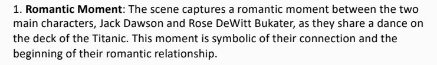

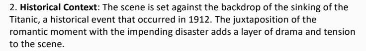

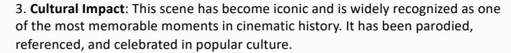

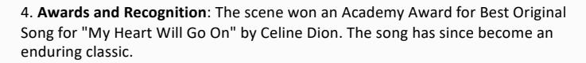

Overall, this scene in "Titanic" is significant for its emotional impact, historical context, cultural influence, and recognition in the film industry.

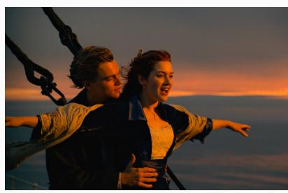

**User:** Show the detailed recipe for this dish.

**TroL:** Sure, here's a detailed recipe for grilled lobster tails:### Ingredients:

- 4 lobster tails (about 1 pound each)
- 1/4 cup unsalted butter, melted
- 2 cloves garlic, minced
- 1 tablespoon chopped fresh parsley
- 1 tablespoon chopped fresh chives
- 1/2 teaspoon salt
- 1/4 teaspoon black pepper
- Lemon wedges, for serving

#### Instructions:

#### 1. **Preheat the Grill**:

- Preheat your grill to medium-high heat (around 400°F to 450°F).

#### 2. **Prepare the Lobster Tails**:

- Using kitchen shears, cut down the top of the shell of each lobster tail, following the natural curve of the shell. Be careful not to cut through the meat.
- Gently pull the shell apart to create a pocket for the butter mixture.

#### 3. **Make the Butter Mixture**:

- In a small bowl, mix together the melted butter, minced garlic, chopped parsley, chopped chives, salt, and black pepper.

#### 4. **Stuff the Lobster Tails**:

- Brush the inside of each lobster tail with the butter mixture.

#### 5. **Grill the Lobster Tails**:

- Place the lobster tails on the grill, meat side up. Close the lid and grill for about 12-15 minutes, or until the lobster meat is opaque and the shells are bright red.

#### 6. **Serve**:

- Remove the lobster tails from the grill and let them rest for a few minutes.
- Serve the lobster tails with lemon wedges on the side for squeezing over the meat.

Enjoy your delicious grilled lobster tails!

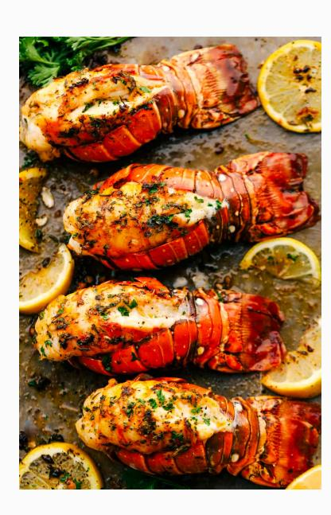

**User:** What are the meals that I can cook with these?

**TroL:** With the items in the refrigerator, you can prepare a variety of meals. Here are some suggestions:

#### 1. **Fruit Salad**:

- Use the strawberries, blueberries, and grapes to make a refreshing fruit salad.

#### 2. **Yogurt Parfait**:

- Layer yogurt, granola, and fruit in a glass for a healthy and delicious breakfast or snack.

#### 3. **Strawberry Yogurt Smoothie**:

- Blend yogurt, frozen strawberries, and a splash of milk for a quick and nutritious smoothie.

- Use the blueberries to make a batch of blueberry muffins for breakfast or a snack.

#### 5. **Strawberry Spinach Salad**:

- Toss baby spinach with sliced strawberries, crumbled feta cheese, and a balsamic vinaigrette for a light and flavorful salad.

#### 6. **Blueberry Oatmeal**:

- Add blueberries and a drizzle of honey to a bowl of oatmeal for a hearty breakfast.

#### 7. **Strawberry Banana Smoothie**:

- Blend yogurt, frozen strawberries, frozen bananas, and a splash of milk for a creamy and nutritious smoothie.

#### 8. **Blueberry Pancakes**:

- Fold blueberries into pancake batter and cook for a delicious breakfast treat.

#### 9**. Strawberry Yogurt Popsicles**:

- Blend yogurt, frozen strawberries, and a touch of honey, then pour into popsicle molds and freeze for a cool summer treat.

#### 10. **Blueberry Yogurt Parfait**:

- Layer yogurt, granola, and blueberries in a glass for a quick and healthy snack or breakfast.

**User:** Describe this sketch in detail.

**TroL:** This sketch appears to be a handwritten outline for a joke website. Here's a detailed description:

#### 1. **Title**:

- The title of the sketch is "My Joke website."

## 2. **Joke Outline:**

- The sketch outlines two jokes:
- **Joke 1**:
- Setup: "Really funny joke 1"
- Punchline: "Push to reveal punchline"
- **Joke 2**:
- Setup: "Same but joke 2"
- Punchline: "Push to reveal punchline"

#### 3. **Date**:

- The sketch is dated "OpenAI 2023."

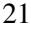

| 40 + y = 45 |
|-------------|
| 39 + a = 41 |
| 24 + y = 29 |
| 15 + a =17  |
| 34 + y = 39 |
|             |

**User:** What is the answer to the second last equation on the right?

**TroL:** The second last equation on the right is (15 + a = 17)

Solving for (a)

[a = 17 - 15]

[a = 2]

So, the answer to the second last equation on the right is (a = 2).

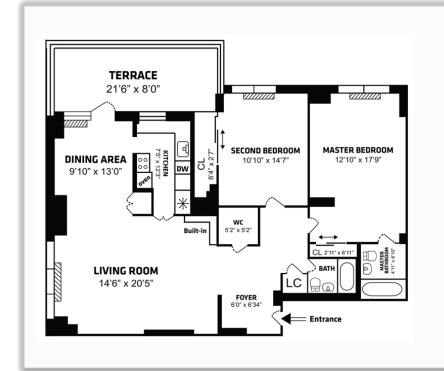

**User:** What are the appliances in the kitchen in this floorplan?

1. Oven

2. Dishwasher (DW)

3. Refrigerator (Fridge)

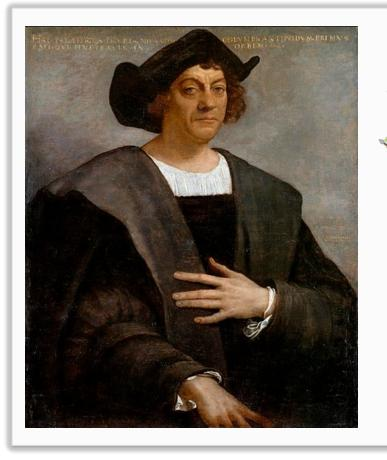

**User:** Can you give a short introduction to this person?

**TroL:** Certainly! The person depicted in the painting is Christopher Columbus, an Italian explorer who is best known for his expeditions to the Americas in the late 15th century. He is credited with leading the first European contact with the Caribbean, Central America, and South America. Columbus's voyages, sponsored by the Catholic Monarchs of Spain, were the first European contact with the Caribbean, Central America, and South America. His expeditions, sponsored by the Catholic Monarchs of Spain, opened the way for widespread European exploration, conquest, and colonization of the Americas.

| Department     | Name    | Salary  |
|----------------|---------|---------|
| Administration | Emily   | \$2,000 |
| Finance        | Nick    | \$1,800 |
| Marketing      | John    | \$2,600 |
| Marketing      | Gloria  | \$1,800 |
| Administration | Jane    | \$2,500 |
| Finance        | Max     | \$2,000 |
| Administration | Tyler   | \$3,000 |
| Finance        | Wilkins | \$2,500 |
| Marketing      | Miles   | \$2,800 |
| Administration | Sabine  | \$1,900 |

**User:** Which department is the person who has the highest salary from?

**TroL:** Wilkins is earning \$2,500.

**User:** Based on the table, how much is Wilkins earning?

**TroL :** Australia has a below-average profit margin at 19.4%.

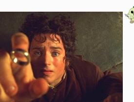

**User:** Can you give a short introduction to this movie?

**TroL:** Certainly! The image is from the 2003 film "The Lord of the Rings: The Fellowship of the Ring," directed by Peter Jackson. This film is the first installment in the "Lord of the Rings" trilogy, based on the novel of the same name by J.R.R. Tolkien. The story revolves around hobbit Frodo Baggins (Elijah Wood) who inherits a ring of great power from his uncle Bilbo that grants its wearer invisibility but also corrupts those who wield it. The ring is actually the One Ring, created by the Dark Lord Sauron, and it has the power to control all the other Rings of Power. The film follows Frodo and his companions as they embark on a perilous journey to Mordor, the land from which Sauron rules, to destroy the ring by casting it into the fires of Mount Doom in Mordor.

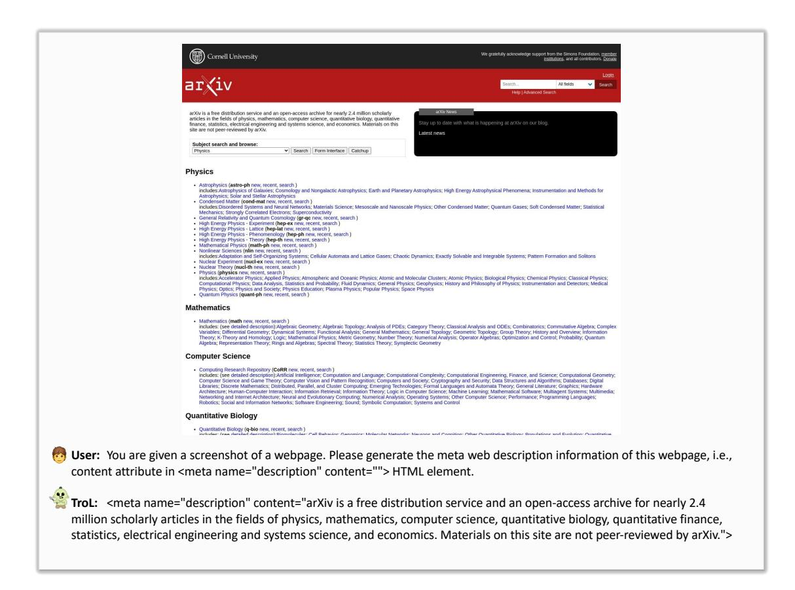

## C Further Ablation Studies

| Methods                               | Added Params | MMStar | MM-Vet | LLaVAW |
|---------------------------------------|--------------|--------|--------|--------|
| TroL-1.8B w.o. Lay-Trav               | 0            | 36.0   | 34.6   | 75.0   |
| TroL-1.8B w. MoE (4 Experts, Top k=3) | 402M         | 39.1   | 38.8   | 80.2   |
| TroL-1.8B w. Lay-Trav                 | 49K          | 45.5   | 45.1   | 87.5   |
| TroL-3.8B w.o. Lay-Trav               | 0            | 37.4   | 35.3   | 81.4   |
| TroL-3.8B w. MoE (4 Experts, Top k=3) | 1.2B         | 39.9   | 41.1   | 83.4   |
| TroL-3.8B w. Lay-Trav                 | 98K          | 46.5   | 51.0   | 90.8   |
| TroL-7B w.o. Lay-Trav                 | 0            | 41.2   | 45.8   | 82.7   |
| TroL-7B w. MoE (4 Experts, Top k=3)   | 2.1B         | 45.6   | 50.5   | 86.6   |
| TroL-7B w. Lay-Trav                   | 131K         | 51.3   | 54.7   | 92.8   |

Table 5: Performance comparison of TroL across various benchmarks.

Inspired by the Mixture of Experts (MoE) concept [\(Shazeer et al.,](#page-13-22) [2017;](#page-13-22) [Lin et al.,](#page-11-3) [2024\)](#page-11-3), we designed the architecture of TroL-Gating and TroL-Mixer. The primary advantage of using MoE is achieving significant performance improvements without adding many physical layers or significantly increasing model sizes.

The paragraph below Equation 2 in [Shazeer et al.](#page-13-22) [\(2017\)](#page-13-22) states: 'A simple choice of non-sparse gating function is to multiply the input by a trainable weight matrix and then apply the Softmax function.' Here, the concept of a 'gating function' is analogous to TroL-Gating. Similarly, Equation 6 in [Lin et al.](#page-11-3) [\(2024\)](#page-11-3) performs a weighted average on the features obtained from each expert module, which is akin to the weighted average operation in TroL-Mixer.

The only difference between traditional MoE and TroL is whether multiple expert modules are physically used. In TroL, the first propagation and the second propagation are implicitly considered as two expert modules in MoE. We believe this iterative propagation introduces a broader range of vision-language knowledge, as layer traversing handles more parameters than MoE. Table [5](#page-26-1) below compares the MoE and layer traversing techniques.

Therefore, we conclude that the layer traversing technique embeds more vision-language knowledge than MoE without adding many physical layers or significantly increasing model sizes. This explains why layer traversing performs well across general tasks. Moreover, this approach intuitively matches the human process of retracing answering stream. We hope the layer traversing technique will be regarded as a promising direction for future MoE research.

| Methods          | Lay-Trav | MMStar | MM-Vet | LLaVAW |
|------------------|----------|--------|--------|--------|
| DeepSeek-VL-1.3B | ✗        | 39.9   | 34.8   | 51.1   |
| DeepSeek-VL-1.3B | ✓        | 45.9   | 46.2   | 60.5   |
| MiniCPM-2.8B     | ✗        | 39.1   | 41.0   | 69.2   |
| MiniCPM-2.8B     | ✓        | 47.4   | 50.2   | 80.8   |
| LLaVA-NeXT-7B    | ✗        | 40.2   | 43.9   | 72.3   |
| LLaVA-NeXT-7B    | ✓        | 49.8   | 52.7   | 84.4   |

Table 6: Performance comparison of various models with and without Lay-Trav across benchmarks.

In Table [6,](#page-26-2) we have applied layer traversing to other LLVMs such as DeepSeek-VL-1.3B, MiniCPM-V2-2.8B, and LLaVA-NeXT-7B. This adjustment aims to validate the effectiveness of layer traversing under a fairer comparison setting, using the same TroL visual instruction tuning dataset.

| Methods                    | Lay-Trav | Training | MMStar | MM-Vet | LLaVAW |
|----------------------------|----------|----------|--------|--------|--------|
| TroL-1.8B (Backbone Model) | ✗        | ✗        | 25.1   | 21.4   | 44.6   |
| TroL-1.8B (Backbone Model) | ✓        | ✓        | 24.8   | 15.9   | 36.0   |
| TroL-1.8B                  | ✗        | ✗        | 36.0   | 34.6   | 75.0   |
| TroL-1.8B                  | ✓        | ✓        | 45.5   | 45.1   | 87.5   |
| TroL-3.8B (Backbone Model) | ✗        | ✗        | 26.6   | 22.3   | 45.4   |
| TroL-3.8B (Backbone Model) | ✓        | ✓        | 25.2   | 16.0   | 36.1   |
| TroL-3.8B                  | ✗        | ✗        | 37.4   | 43.5   | 78.4   |
| TroL-3.8B                  | ✓        | ✓        | 46.5   | 51.1   | 90.8   |
| TroL-7B (Backbone Model)   | ✗        | ✗        | 27.3   | 21.1   | 51.3   |
| TroL-7B (Backbone Model)   | ✓        | ✓        | 24.1   | 15.3   | 37.1   |
| TroL-7B                    | ✗        | ✗        | 41.2   | 45.8   | 82.7   |
| TroL-7B                    | ✓        | ✓        | 51.3   | 54.7   | 92.8   |

Table 7: Performance comparison of TroL with and without Lay-Trav and different training setups.

In Table [7,](#page-27-0) we evaluated the experiments you asked in the table below. Without any training, layer traversing technique confuses LLM performances because it never see this kind of features.

| Methods   | Num of Prop | MMStar | MM-Vet | LLaVAW |
|-----------|-------------|--------|--------|--------|
| TroL-1.8B | 2           | 45.5   | 45.1   | 87.5   |
| TroL-1.8B | 3           | 45.7   | 45.6   | 87.8   |
| TroL-1.8B | 4           | 45.8   | 45.9   | 88.0   |
| TroL-3.8B | 2           | 46.5   | 51.1   | 90.8   |
| TroL-3.8B | 3           | 46.6   | 51.4   | 91.1   |
| TroL-3.8B | 4           | 46.9   | 51.8   | 91.2   |
| TroL-7B   | 2           | 51.3   | 54.7   | 92.8   |
| TroL-7B   | 3           | 51.7   | 55.0   | 93.2   |
| TroL-7B   | 4           | 52.0   | 55.2   | 93.3   |

Table 8: Performance comparison of TroL across different numbers of propositions.

The reason we use the second propagation instead of the third propagation is that marginal improvements are observed when using more than two propagation. Table [8](#page-27-1) shows the performance across the propagation numbers from 2 to 4.

| Methods                                         | Avg Time Ratio | MMStar       | MM-Vet       | LLaVAW       |
|-------------------------------------------------|----------------|--------------|--------------|--------------|
| TroL-1.8B (Question)                            | 1.0            | 45.5         | 45.1         | 87.5         |
| TroL-1.8B (Question-Answer)                     | 4.9            | 46.3         | 47.2         | 89.2         |
| TroL-3.8B (Question)                            | 1.0            | 46.5         | 51.1         | 90.8         |
| TroL-3.8B (Question-Answer)                     | 5.1            | 47.9         | 53.4         | 92.1         |
| TroL-7B (Question) TroL-7B (Question-Answer) | 1.0 5.7     | 51.3 52.5 | 54.7 56.2 | 92.8 94.3 |

Table 9: Performance comparison of TroL across question and question-answer setups.

The primary reason for not applying layer traversing to the answer part is the huge increase in answering time complexity. Fortunately, turning layer traversing on or off for the answer part during inference shows a little significant performance gap in Table [9,](#page-27-2) therefore it is better for us to deal with only question part in efficient inference.

| Methods                     | Lay-Trav in Training | MMStar | MM-Vet | LLaVAW |
|-----------------------------|----------------------|--------|--------|--------|
| TroL-1.8B                   | ✗                    | 36.0   | 34.6   | 75.0   |
| TroL-1.8B (Nothing)         | ✓                    | 42.1   | 41.0   | 82.8   |
| TroL-1.8B (Question)        | ✓                    | 45.5   | 45.1   | 87.5   |
| TroL-1.8B (Question-Answer) | ✓                    | 46.3   | 47.2   | 89.2   |
| TroL-3.8B                   | ✗                    | 37.4   | 43.5   | 78.4   |
| TroL-3.8B (Nothing)         | ✓                    | 43.8   | 46.3   | 86.3   |
| TroL-3.8B (Question)        | ✓                    | 46.5   | 51.1   | 90.8   |
| TroL-3.8B (Question-Answer) | ✓                    | 47.9   | 53.4   | 92.1   |
| TroL-7B                     | ✗                    | 41.2   | 45.8   | 82.7   |
| TroL-7B (Nothing)           | ✓                    | 47.0   | 50.8   | 88.9   |
| TroL-7B (Question)          | ✓                    | 51.3   | 54.7   | 92.8   |
| TroL-7B (Question-Answer)   | ✓                    | 52.5   | 56.2   | 94.3   |

Table 10: Performance comparison of TroL with Lay-Trav in training and various configurations.

In Table [10,](#page-28-0) thanks to layer traversing together with visual instruction tuning, we observed that vision language performance improves even when question and answer traversing are turned off.