# Harnessing Your DRAM and SSD for Sustainable and Accessible LLM Inference with Mixed-Precision and Multi-level Caching

Jie Peng<sup>1</sup>\*, Zhang Cao<sup>2</sup>\*, Huaizhi Qu<sup>3</sup>, Zhenyu Zhang<sup>2</sup>, Chang Guo<sup>2</sup>,
Yanyong Zhang<sup>1</sup>, Zhichao Cao<sup>2</sup>, Tianlong Chen<sup>3</sup>

<sup>1</sup>University of Science and Technology of China, <sup>2</sup>Arizona State University, <sup>3</sup>University of North
Carolina at Chapel Hill

pengjieb@mail.ustc.edu.cn, yanyongz@ustc.edu.cn
{zcao59, zzhan641, cguo51, zhichao.cao}@asu.edu.cn,

Although Large Language Models (LLMs) have demonstrated remarkable capabilities, their massive parameter counts and associated extensive computing make LLMs' deployment the main part of carbon emission from nowadays AI applications. Compared to modern GPUs like H100, it would be significantly carbonsustainable if we could leverage old-fashioned GPUs such as M40 (as shown in Figure 1, M40 only has one third carbon emission of H100's) for LLM servings. However, the limited High Bandwidth Memory (HBM) available on such GPU often cannot support the loading of LLMs due to the gigantic model size and intermediate activation data, making their serving challenging. For instance, a LLaMA2 model with 70B parameters typically requires 128GB for inference, which substantially surpasses 24GB HBM in a 3090 GPU and remains infeasible even considering the additional 64GB DRAM. To address this challenge, this paper proposes a mixedprecision<sup>2</sup> and multi-level caching (M2Cache) with a model modularization algorithm to enable LLM inference on outdated hardware with resource constraints. Specifically, our M2Cache first modulizes neurons in LLM and creates their importance ranking. Then, it adopts a dynamic sparse mixed-precision quantization mechanism in weight space to reduce computational demands and communication overhead at each decoding step. It collectively lowers the operational carbon emissions associated with LLM inference. Moreover, M2Cache introduces a threelevel cache management system with HBM, DRAM and SSDs that complements the dynamic sparse mixed-precision inference. To enhance communication efficiency, M2Cache maintains a neuron-level mixed-precision LRU cache in HBM, a larger layer-aware cache in DRAM, and a full model in SSD. The cache management uses layer-wise pre-loading from SSD to DRAM, and asynchronous loading from DRAM to HBM to overlap the HBM cache miss with the GPU computation for performance. With the decreased communication overhead and the usage of SSDs, the operational carbon footprint of LLMs inference is further reduced. Extensive experimental results demonstrate the effectiveness of our M2Cache. Compared with DeepSpeed Zero-Infinity, M2Cache significantly improves the token generation speed by up to  $\times 10.51$ . carbon emission reduction up to  $\times 7.67$ .

#### 1. Introduction

Global warming and climate change increasingly threaten our economy and society [1, 2], this urgency has spurred a shift towards sustainable investing, particularly in green computing, with a focus on minimizing carbon emissions [3, 4]. Concurrently, the rapid advancement and deployment

<sup>\*</sup>co-author

<span id="page-0-0"></span><sup>&</sup>lt;sup>2</sup>The precision denotes the numerical precision like FP16, INT8, INT4.

of Large Language Models (LLMs) [5–20] have demonstrated remarkable capabilities across a wide range of tasks, including natural language processing [11, 21–23], question answering [24, 25], and code generation [26–29]. Therefore, the LLMs deployment is becoming a growing factor for AI's overall environmental impact. This issue poses a substantial challenge to the goal of advancing sustainable AI development, emphasizing the need for solutions that address the environmental impact of LLM deployment [30]. For example, ChatGPT's API call emitted approximately  $24.24 \ ktCO2e$  in January 2023 [31]. This is equivalent to the amount of carbon dioxide absorbed by  $12.12 \ million$  trees in one year.

The deployment of LLMs reaches a crucial point during the inference phase, where AI functionalities become accessible to users. This phase is particularly demanding in terms of resources, a consequence of both the substantial size of these models [30] and the need to meet high standards for service quality and responsiveness [33]. Thus, making LLM inferences with better tradeoffs between sustainability and service quality (accuracy and efficiency) is a key step towards aligning AI development with environmental goals [34].

To reduce the carbon emissions for LLM services, leveraging old-fashioned hardware for LLM inference emerges as a promising strategy. For instance,

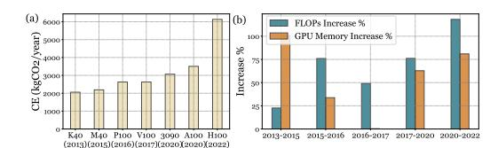

<span id="page-1-0"></span>Figure 1: The operational carbon emission (CE) [32], Flops, and GPU memory change over the years. Over the past decade, operational carbon emissions, FLOPs, and memory of GPUs have consistently increased. However, the growth rate in FLOPs has outpaced that of GPU memory in almost every product iteration.

figure 1 shows that old-fashioned GPUs have much smaller carbon emissions compared with cutting-edge devices like A100 and H100. In addition, these devices reduce the embodied carbon and the need for new hardware production and consequently, the generation of electronic waste [35, 36]. Finally, it does not significantly impair the balance between LLM accuracy and efficiency. Current hardware, already in circulation, has been shown to possess adequate computing capabilities for conducting effective LLM inference without compromising on accuracy or efficiency [37, 38]. For example, the K40 has 5.04 TFLOPs computation ability and LLaMA-7B requires around 19.61 GFLOPs to generate one token [39]. As we showed in Figure 1, the computational power of the device is sufficient for LLMs inference, even if it was released 10 years ago.

However, LLM inference requires large High-Bandwidth Memory (HBM) capacities to load LLM parameters and cache intermediate data (e.g., key-value cache). Therefore, the limited HBMs of old-fashioned hardware will become the bottleneck for LLMs deployment [40, 41]. For instance, the older device Nvidia V100 GPU, includes 32GB of HBM, which is insufficient for loading LLMs with more than 13 billion float-point 16 parameters. In contrast, the newer and top-tier ones like H100 GPU feature 80 GB HBM, which can handle LLMs with larger than 33 billion float-point 16 parameters.

There are existing works that can partially alleviate the limitations of HBM in old-fashioned GPUs, such as pruning [42–44], quantization [45–49], and optimizing Key-Value (KV) Cache usage [50, 51]. However, KV cache optimization can not address the situation in which HBM is not even enough to load model parameters. Pruning and quantization can reduce the HBM demand for loading LLM model parameters. Nonetheless, these methods introduce the challenge we defined as **Parameter Over-correction**: To accommodate larger models within constrained HBM capacities, parameters must be compressed to a very low bit or significantly pruned. This issue becomes worse as model sizes increase without a corresponding expansion in HBM capacity.

Other alternative solutions involve offloading LLM parameters to either CPU DRAM or high-performance SSDs, as explored in recent research [40, 52–55]. This method leverages the observation that not all neurons<sup>3</sup> of the LLM are active at once during inference. Consequently, it temporarily moves certain components to slower, but higher-capacity memory/storage options like DRAM

<span id="page-1-1"></span><sup>&</sup>lt;sup>3</sup>The neuron is defined as a specific row/column in a weight matrix

and high-performance SSDs. However, this strategy encounters a significant challenge known as **Bandwidth Overwhelming**: The communication between HBM and other memory/storage is overwhelmed by the frequent module loading to HBM, becoming a bottleneck for LLM inference efficiency. For example, prevailing HBM hardware uses PCIe interfaces with bandwidths below 64 GB/s. The maximum inference speed under this bandwidth of LLaMA-13B is 4 token/s when feedforward network (FFN) parameters are offloaded to DRAM. The root cause of this problem lies in the substantial data volume of the modules being offloaded [\[52\]](#page-19-5) and the frequent need to reload these modules back to the GPU [\[40\]](#page-18-9). Such behaviors saturate the communication bandwidth between HBM and DRAM, leading to inferencing speed bottlenecks. Also, the DRAM space may not be enough to cache the whole model, and a portion of the space is used/reserved for other applications (e.g., databases). The available DRAM space can be limited to old-fashioned servers. Moreover, the frequent data movement, DRAM access, and large volume of DRAM requirements also cause extra carbon emissions.

To address these fundamental challenges, we propose a sustainable and cost-effective LLM inference architecture with **M**ix-precision and cost-effective **M**ulti-level **cache** (called M2Cache) over old-fashioned computing servers with HBM-limited GPUs. M2Cache consists of two fundamental novel designs: *dynamic sparse mixed-precision inference*, and *predicting-driven multi-level cache as HBM extension*. It harmonizes quantization and offloading methods in LLMs and combines them with a customized multi-level cache to enhance memory efficiency and carbon emissions.

The **dynamic sparse mixed-precision inference** operates within the FFNs of LLMs, treating each row in the first layer of an FFN and the corresponding column in subsequent layers as a neuron. Active neurons, identified by predictors specific to each layer based on its input, are selectively transferred from DRAM to GPU memory, a process termed "dynamic sparsity". Then it quantizes the less important part in active neurons to lower bits and uses these mixed-precision active neurons to do the computing in GPU. The inactive neurons in GPU memory will be offloaded to DRAM to save GPU memory and reduce embodied carbons from HBM. The process involves three steps: 1) *Active Neuron Identification*: A low-rank predictor locates the necessary neurons for specific text generation tasks. 2) *Selective Loading into GPU*: Only the identified active neurons are loaded, optimizing memory use, and 3) *Active Score-based Quantization*: Neurons with lower active scores are quantized to a smaller number of bits, conserving HBM. Loading these quantized neurons saves the communication bandwidth, due to the data volume being smaller compared to high-precision neurons, thereby lessening the bandwidth overwhelming challenge, By choosing the right ratio of neurons of different precisions, we can have more neurons while maintaining the precision of critical neurons, thus alleviating the **Parameter Over-correction** challenge. Our method saves computation by utilizing a subset of neurons during inference. These reductions lower carbon emissions during LLM inference, thus improving the sustainability of LLM deployment.

The **predicting-driven multi-level cache** is designed to efficiently manage neuron data across three types of memory/storage: GPU HBM, DRAM, and SSD, which utilizes DRAM and SSD as the extension for GPU HBM. The power consumption, carbon emissions, price, and speed of these storage media are from high to low. Specifically, the SSDs are used to cache all FFN parameters. This allows for a large capacity of data to be held at the lowest cost and carbon emission. The DRAM maintains a layer-aware FIFO queue, it loads multiple to-be-used FFNs from SSDs and helps in managing the slower access speed of SSDs. In the GPU memory, we design the neuron-level management for each LLM layer, which retains the most frequently accessed active neurons to ensure quick retrieval. More importantly, this multi-level cache complements the dynamic sparse mixed-precision inference with a two-level caching strategy: 1) *GPU-DRAM Cache*: Utilizing an LRU cache mechanism, this level stores frequently accessed active neurons directly in the GPU cache. The active neurons are identified by the predictor in the dynamic sparse mixed-precision inference. 2) *DRAM-SSD Cache*: Given the comparatively slower SSD bandwidth, a proactive pre-loading policy is employed. This anticipates and pre-loads neurons likely to be needed soon from SSDs to DRAM, further alleviating DRAM and GPU memory constraints. The GPU-DRAM Cache significantly lowers the demand for loading neurons into GPU memory, effectively reducing GPU-CPU bandwidth usage and addressing the overwhelming bandwidth challenge. The reduced GPU-CPU bandwidth and the utilization of SSDs for all parameters loading decrease the power consumption of LLM inference.

We evaluate M2Cache across different models and previous generations of hardware: LLaMA-7B, LLaMA-13B, LLaMA-70B, and Falcon-40B on a single GeForce RTX 3090. Our machine is equipped with 64 GB of DRAM and a 1 TB SSD that uses the PCIe 3.0x4 interface. It runs on Ubuntu 22.04 and features an AMD 6950x CPU. To simulate a scenario with limited CPU resources, we utilize only one core of the CPU for mix-precision and cache management. Compared with the stateof-the-art offloading framework DeepSpeed Zero-Infinity [\[56\]](#page-19-7), for LLaMA-7B, M2Cache reduces inference latency by up to ×7. Similarly for LLaMA-13B, we achieve up to ×14 inference speed up. M2Cache also enables LLaMA-70B and Falcon-40B, resulting in up to 0.3835 and 0.312 tokens/s speed up on a single GeForce RTX 3090. For carbon emissions, M2Cache achieves up to ×7 reduction compared with Zero-Infinity. The dynamic sparse mixed-precision inference achieves about ×1.47 inference latency reduction and ×1.45 carbon emission reduction. The prediction-driven multi-level cache achieves about ×2.15 inference latency reduction and ×2.17 carbon emission reduction. The main contribution of our paper includes:

- **In-depth Analysis of Inference Overhead.** We investigate the inference overhead of LLMs in memory-limited devices and identify the challenges associated with deploying LLM by quantization and offloading.
- **Dynamic Sparse Mixed-Precision Quantization.** We leverage the neuron scores in dynamic sparse inference to introduce mixed-precision quantization in LLMs to improve the performance of LLMs in limited memory resources scenarios.
- **Innovative Multi-Level Cache System.** We introduce multi-level cache, including GPU-DRAM and DRAM-SSD cache, to utilize the design space opened by the dynamic sparse mixed-precision quantization. Our multi-level cache further adequately enhances the inference performance.
- **Better Sustainability.** To our best knowledge, M2Cache is the first research that addresses LLM inferencing sustainability with old-fashioned hardware. Moreover, M2Cache improve the sustainability of LLMs without accuracy sacrifice.

# **2. Background**

#### **2.1. LLM Inference**

**Prefiling and Decoding.** By default, the parameter of LLM and the medium result are stored in the GPU memory during inference. The process begins with the prefill phase, where the system processes the user's input prompt to generate the initial output token [\[12,](#page-16-2) [57–](#page-19-8)[60\]](#page-20-0). Following this, the decode phase takes over, producing subsequent output tokens sequentially. In this phase, each newly generated token is used by the model in GPU to create the next one. This process continues until the model produces a special token indicating the end of the sequence.

Notably, for each request, the LLM does one full forward pass through the LLM for prefiling and multiple full forward passes for decoding. Each full forward pass of decoding only processes the new token generated in the previous step. This phase results in the underutilization of computation resources, as the process becomes primarily constrained by memory [\[43,](#page-18-12) [52,](#page-19-5) [61,](#page-20-1) [62\]](#page-20-2). Memory consumption during this process is notably affected by two main factors: the Key-Value (KV) Cache [\[43,](#page-18-12) [52,](#page-19-5) [63, 63\]](#page-20-3) and the parameters from FeedForward Networks (FFNs) [\[41,](#page-18-10) [61\]](#page-20-1). The KV cache optimization has many mature solutions, like storing it in the CPU [\[52\]](#page-19-5) or pruning redundant cache blocks [\[43\]](#page-18-12). The FFNs is another major reason why LLMs take large GPU memory. It accounts for a significant portion of LLM parameters, consuming over half of the GPU memory space. For instance, FFNs consume from 63.99% of parameters in the LLaMA-7B model to 72.41% in the LLaMA-70B model. Investigating methods to streamline FFN parameters is one of the pathways to more efficient and sustainable LLM deployments.

**Dynamic Sparse Inference.** Sparsity is a natural approach to reducing computation and memory costs during neural network inference by discarding less important weights[\[64–](#page-20-4)[66\]](#page-20-5). In the context of LLMs, many studies focus on leveraging sparsity to achieve memory savings and lower computation[\[61,](#page-20-1) [67,](#page-20-6) [68\]](#page-20-7). One important type of sparsity is the dynamic contextual sparsity introduced in Deja Vu [\[61\]](#page-20-1). The dynamic contextual sparsity in FFNs activates a subset of parameters in FFNs for each new token during the decoding phase without hurting model accuracy. It opens a new pathway for memory optimization: by predicting which subsets of the model will be inactive for a specific input, these segments can be offloaded from GPU memory to more abundant storage solutions like DRAM or SSDs. This process, informed by the Deja Vu predictor, allows for significant GPU memory savings while maintaining the model's output quality [\[61\]](#page-20-1).

**LLM Quantization.** Weight quantization is a widely adopted method for model compression to reduce the storage costs of LLMs [\[45–](#page-19-1)[49\]](#page-19-2). In LLM quantization, weights and activations are stored with fewer bits at a lower numerical precision. These methods decrease the memory required for each parameter. The major targets to be quantized are the weights of linear layers (i.e., matrix multiplication), which account for more than 99% of the overall LLM weights [\[47,](#page-19-9) [48,](#page-19-10) [69,](#page-20-8) [70\]](#page-20-9). Besides, the process of "dequantization" refers to transforming the quantized weights back to FP16.

#### <span id="page-4-0"></span>**2.2. GPU servers for LLM inference**

**Old-fashioned GPUs.** Old-fashioned GPUs are typically designed or modified for specialized tasks, such as gaming, content creation, or specific AI workloads. These GPUs may have slight modifications based on user requirements or optimizations for particular applications. Some examples include gaming GPUs repurposed for AI inference. Custom GPUs usually have lower HBM capacities, around 4-24 GB. For example, NVIDIA GeForce RTX 3090 have 24GB HBM, NVIDIA GeForce RTX 3060 have 12GB HBM. They are typically more universal within consumer markets and are more commonly used than top-tier GPUs [\[41\]](#page-18-10).

**Top-tier GPUs** Top-tier GPUs are built for high-performance computing (HPC), large-scale AI training, inference, data centers, and scientific research. These GPUs focus on reliability, performance, and scalability, often featuring much larger memory capacities. Its HBM sizes range from 40 GB to 80 GB and beyond. For example, NVIDIA's A100 has 40GB or 80GB HBM size. Enterprise GPUs are optimized for specific professional and research tasks, making them less universal. These GPUs are designed for server environments, often with support for multi-GPU configurations, data center integration, and industry-specific software stacks.

**Carbon footprint of servers.** The carbon footprint is a metric for quantifying the amount of greenhouse gas emissions (gCO2) generated. When executing LLMs inferencing on a server, its carbon footprint comprises the *embodied carbon emissions* (denoted as *ECE*) and *operational carbon emissions* (denoted as *OCE*). As shown in Formula [1,](#page-5-0) the carbon footprint is the sum of embodied and operational carbon emissions. Embodied carbon emissions represent the carbon emissions associated with the manufacturing and packaging of computer components, effectively "embodied" within the device itself. For an inference request processed by a server, its share of embodied carbon is proportional to the execution time relative to the device's overall operational lifespan. Using oldfashioned hardware (e.g., most of the GPU servers may already configured with GeForce RTX 3090) instead of investing in the latest hardware (e.g., H100) for LLM inferencing can explicitly reduce the embodied carbon.

The operational carbon emissions come from the electricity grid that powers the server, which powers the hardware (e.g., GPUs, CPUs, DRAM, and SSDs) that serves the inference. The carbon intensity (denoted as COIntensity 2 ) of the grid, representing the amount of CO2 emission per energy usage (gCO2/kWh), reflects the "greenness" of the energy source. For example, wind turbines have lower carbon intensity than coal power plants. Due to the difference in availability and stability of renewable energy, carbon intensity varies significantly over time and across geographical regions. The carbon intensity is the multiplier to the request's energy consumption when quantifying its operational carbon footprint. Usually, the general per-bit carbon emission (including embodied and operational) of HBM, DRAM, and NAND-flash-based SSDs are from high to low [\[71,](#page-20-10) [72\]](#page-20-11). As shown in Formula [1,](#page-5-0) OCE is related to the consumed energy, and energy is related to the occupied memory and runtime. The total carbon footprint (donates as **CF**) is the sum of OCE and ECE.

<span id="page-5-0"></span>
$$\begin{cases} CF = OCE + ECE \\ OCE = Energy \times Energy\_to\_Carbon \\ Energy = Memory\_Size \times Power\_Unit \times Runtime \end{cases}$$

# **3. Motivation**

The increasing deployment of LLMs has significantly raised carbon emissions during inference, driven by the growing model sizes. As a result, improving the efficiency and sustainability of LLM inference is becoming increasingly crucial [\[73\]](#page-20-12). This section provides an in-depth analysis of the factors contributing to the rising carbon footprint of LLM inference and investigates the potential of leveraging old-fashioned GPU servers to reduce these emissions.

#### **3.1. The dilemma between LLM inference demands and more carbon emissions**

As LLMs continue to evolve, their parameter counts have grown substantially, now ranging from several billion to hundreds of billions. Larger models are generally preferred for inference due to their improved performance, particularly in terms of accuracy. For instance, a 70B general-purpose model demonstrates significantly higher accuracy compared to a 7B model without any specific fine-tuning [\[8,](#page-16-3) [13,](#page-16-4) [60,](#page-20-0) [74\]](#page-20-13). However, inferencing larger models requires advanced GPU servers, primarily due to the increased High HBM requirements. Among the various GPU specifications, HBM size is the most critical factor for LLM inference [\[40,](#page-18-9) [41\]](#page-18-10), driving the need for advanced GPUs with larger memory capacities. As the size of the models increases, the corresponding HBM requirements also rise, necessitating the use of more capable GPUs. For example, old-fashioned GPUs like the RTX 3090 and RTX 4090 are only sufficient for 7B models before exhausting their memory, whereas more advanced GPUs such as the A100 and H100 can support models with up to 13B and 33B parameters, respectively, offering substantially enhanced performance. This growing demand for high-performance GPUs underscores the critical need for more advanced GPUs to support the evolving landscape of LLM inference.

The scarcity of advanced GPUs, coupled with surging demand, has accelerated the production of newer, more sophisticated GPU models. However, the manufacturing of these cutting-edge GPUs incurs substantial embodied carbon emissions. For example, the embodied carbon footprint of an A100 GPU is approximately 150 kg CO2, equivalent to driving a conventional fuel-powered vehicle for 600–800 kilometers [\[75\]](#page-21-0). As GPU production scales to meet the increasing computational demands of large language models (LLMs), the associated carbon footprint also escalates, exacerbating environmental impacts and raising sustainability concerns. The persistent cycle of developing larger models, requiring more advanced hardware, and generating higher carbon emissions underscores the critical need for sustainable approaches to LLM inference and deployment.

## **3.2. Opportunities in existing old-fashioned servers**

As discussed in Section [2.2,](#page-4-0) old-fashioned GPU servers, such as those equipped with RTX 3090 GPUs, typically have limited High Bandwidth Memory (HBM) sizes along with a certain amount of DRAM and SSD storage. This section examines the potential of these old-fashioned servers to lower the financial and environmental costs of large language model (LLM) inference, thereby making LLM deployment more feasible and broadly accessible.

**Opportunity 1:** *The carbon emissions of inferencing on these existing old-fashioned GPUs are much smaller than the top-tier GPUs.*


<span id="page-6-0"></span>Figure 2: Overall Architecture of M2Cache.

As described in Section [2.2,](#page-4-0) the carbon footprint of GPUs includes both embodied and operational emissions. Embodied emissions arise during the manufacturing process of the hardware. In this study, we leverage existing old-fashioned GPUs that are already deployed and in use, thereby incurring no additional embodied emissions. Conversely, top-tier GPUs are often newly manufactured and less readily available, contributing to significant embodied carbon costs. Thus, performing inference on existing old-fashioned GPUs avoids additional embodied carbon emissions.

Figure [1](#page-1-0) shows the operational carbon emissions of different types of GPUs. As shown in Figure [1,](#page-1-0) we observe that for top-tier GPUs like the A100 and V100, their operational carbon emissions are very close to those of old-fashioned GPUs like the RTX 3090. This indicates that there is no significant improvement in carbon emissions when enterprise GPUs are involved. Thus, performing inference on existing old-fashioned GPUs doesn't result in much additional operational carbon emissions, and in some cases, it can even reduce carbon emissions.

**Opportunity 2:** *Inference on existing old-fashioned servers is cheaper and remove the inference barrier .*

Top-tier GPUs exhibit significantly higher price points compared to old-fashioned counterparts. Notably, the NVIDIA A100 GPU is priced approximately ten times higher than the Geforce RTX 3090 and five times higher than the Geforce RTX 4090, illustrating a substantial cost disparity [\[76\]](#page-21-1). The H100, a more advanced modern GPU, commands an even higher premium. This pronounced disparity highlights the significant cost impact of deploying top-tier hardware in LLM inference scenarios.

As discussed in Section [2.2,](#page-4-0) old-fashioned GPUs are more widely used than top-tier GPUs and they are deployed in most data centers, institutions, organizations, and even personal workstations. Therefore, if we can perform large model inference on these old-fashioned GPUs, it could remove the LLM inference barrier for most GPU servers and make LLM inference more universally accessible.

# **4. Challenges**

Although utilizing existing old-fashioned servers for LLM inference is more sustainable the limited HBM of these servers poses several challenges to running large LLM inference (e.g., LLaMA-2 13B and even 70B). Due to the limited HBM, the model size can not fit into GPU.

First, the CPU computation power could increase the inference latency if we rely on the CPU computation power. CPUs, while versatile, may not possess sufficient computational speed for efficient LLM inference, resulting in slower response times. Then the challenge moves to the deployment of computation tasks on high-bandwidth memory (HBM) devices, such as GPUs. Although GPUs in existing devices are capable of handling complex computations efficiently, their relatively limited HBM capacity becomes a critical bottleneck [\[40,](#page-18-9) [41\]](#page-18-10). For instance, while older devices like the V100 GPU offer 32 GB of HBM, newer and top-tier ones like the A100 GPU provide 80 GB.

There are existing works that can partially alleviate the limitations of HBM, such as quantizing MLP (Multi-Layer Perceptron) weights and optimizing Key-Value (KV) Cache usage [\[50,](#page-19-3) [51\]](#page-19-4). These methods aim to decrease the memory required for each parameter, effectively saving HBM space. However, these approaches introduce a new challenge known as **Parameter Over-correction**. To accommodate larger models within constrained HBM capacities, parameters are often compressed to very low bit sizes. Although this saves space, it can also lead to a significant reduction in the accuracy of the models [\[77\]](#page-21-2). This issue becomes worse as model sizes increase without a corresponding expansion in HBM capacity.

Another alternative strategy for managing LLM inference involves offloading LLM parameters to either CPU DRAM or high-performance SSDs, as explored in recent research [\[40,](#page-18-9) [52\]](#page-19-5). This method leverages the observation that not all parts of the LLM are active at once during inference. Consequently, it temporarily moves certain components to slower, but higher-capacity storage options like DRAM and high-performance SSDs. However, this strategy encounters a significant challenge known as **Bandwidth Overwhelming**. The root of this problem lies in the substantial data volume of the modules being offloaded [\[52\]](#page-19-5), or the frequent need to reload these modules back to the GPU [\[40\]](#page-18-9). Such behaviors saturate the communication bandwidth between High Bandwidth Memory (HBM) and DRAM, leading to bottlenecks. As a result, the efficiency of LLM inference is compromised, as the system struggles to load the necessary LLM modules from DRAM to HBM in a timely manner.

# **5.** M2Cache **Designs**

Currently, some studies focus on KV cache offloading. For instance, AttentionScore [\[78\]](#page-21-3) leverages DRAM and SSD storage to store the generated KV cache for reuse in subsequent conversations. However, old-fashioned GPUs often lack sufficient HBM to store even the model weights, let alone the KV cache. Therefore, this paper focuses on more aggressive model weight offloading, aiming to enable inference of larger models on old-fashioned servers. Additionally, these servers typically have low-performance CPUs, and their computational resources are frequently occupied by other programs [\[79\]](#page-21-4). Consequently, this study concentrates on GPU-centric offloading [\[80\]](#page-21-5), relying exclusively on the GPU for computation during LLM inference.

Based on the above analysis, we are aiming to make it possible for customer-level old-fashioned servers to infer larger models (e.g., LLaMA 2 70B model) to meet performance requirements by offloading model weights to the host side so that LLM inference can be more sustainable, cheaper, and universally accessible.

#### **5.1.** M2Cache **Design Overview**

We first present the design overview of M2Cache, a model and cache co-design that provides sustainable and accessible LLM inference on old-fashioned servers equipped with GPU, CPU, limited DRAM, and SSDs. as shown in Figure [2.](#page-6-0) It consists of two key techniques: *dynamic sparse mixedprecision inference* (MP Inference) and *multi-level cache*. The *dynamic sparse mixed-precision inference* uses a predictor to estimate active neurons for the current input inference. According to the estimated score, active neurons can be split into different precisions. The higher the score, the higher the precision of the neuron. We will offload inactive neurons into DRAM to save HBM space and open the design space for advanced multi-level cache management. The *multi-level cache* complements MP Inference. It first utilizes a preloader and a two-level DRAM cache-based tiered-cache to hide SSD as the bottom tier, creating the effect of "infinite" DRAM. Second, it employs a high-performance model layer-based HBM cache to reduce the time spent loading neurons from DRAM.

To address the over quantization challenge, the MP Inference employs mixed precision neurons which allows us to keep the critical neurons with higher precision alongside these low-precision neurons. These high-precision critical neurons underpin the LLM accuracy. (Section [5.2.](#page-8-0)) To resolve the bandwidth overwhelming issues, the *multi-level cache* includes a GPU-managed LRU cache that can reduce the number of neurons required to load from DRAM to GPU memory. (Section [5.3](#page-9-0) and Section [5.4.](#page-10-0)) Moreover, to address the space limited of HBM (e.g., the GPU memory), *multi-level cache* involves the SSDs that can enable LLM inference when HBM and DRAM together are not

enough to load the whole model parameters. The corresponding synchronous layer-wise DRAM preloading policy diminishes the effect of low bandwidth of SSDs during inference. (Section 5.4.)

Carbon emission reductions are achieved through both MP Inference and multi-level cache strategies. MP Inference decreases computational carbon by using only a subset of neurons during inference. The multi-level cache reduces communication overhead between HBM and DRAM, and integrating SSDs alleviates the need to load all parameters simultaneously. Lowering both computation and communication demands, along with decreasing dependence on HBM and DRAM for parameter storage, effectively reduces carbon emissions during LLM inference.

#### <span id="page-8-0"></span>5.2. Dynamic Sparse Mixed-precision LLM Inference

MP Inference categorize active neurons into multiple float-point precision types. The mixed quantization scheme can maintain a certain number of low-precision neurons while keeping critical neurons at high precision. Therefore, we do not need to prune too many neurons while not all parameters are quantized to a super low bit. The parameter of FFNs is well compressed, which alleviates the parameter overcorrection problem.

As shown in Figure 3, the credential for neuron splitting is the output of the "Predictor". The MP Inference is hinged on one key insight from

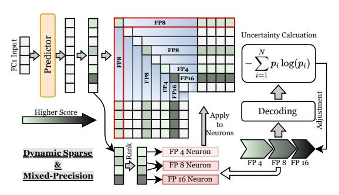

<span id="page-8-1"></span>Figure 3: Dynamic Sparsity and Mixed-Precision.

the Deja Vu predictor [61], which assigns a predicted score to each neuron. Neurons with top-k scores, deemed most crucial for the inference, are identified as active. Based on this observation, neurons with higher scores are loaded in higher float-point precision, while those with lower scores are loaded in lower precision from DRAM. However, how to explore the adequate neuron ratio under a given fixed memory budget becomes the next problem.

Offline Neuron Ratio Search. To decide the ratio of different float-point precision neurons for different models. We design an uncertainty-guided search method in Algorithm 1. Given a fixed memory budget, it calculates the decoding precision uncertainty of different ratios of float-point precision neurons. After that, we decide the ratio of different float-point precision neurons for the current model. The UQEst we used is defined as:

$$\mathtt{UQEst}(LLM, r_{low}, r_{high}) = -\sum_{i>j}^{N} \sum_{k} LLM_{k}^{i} \log LLM_{k}^{i}. \tag{2}$$

Here, j represents the length of the input prompt, N denotes the total length of the sentence, which includes both the prompt and the generated text, and  $LLM_k^i$  is the probability assigned to the k-th token in the vocabulary for the i-th token generation. We use the wikitext [81] for the uncertainty estimation.

Compared to using the full parameters of FFNs for inference, MP Inference utilizes only a subset of neurons, which maintains LLM accuracy while using fewer computing resources (lower FLOPS). This reduction in computational demand decreases the carbon emissions associated with LLM inference. Storing inactive neurons in GPU memory wastes the limited HBM space. By offloading these neurons to DRAM, we conserve GPU memory, further reducing carbon emissions associated with storing LLM parameters in HBM. More importantly, offloading

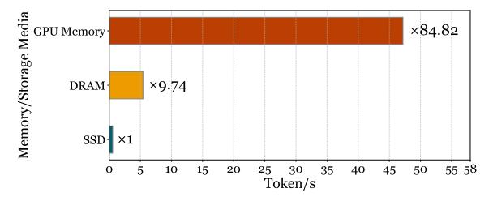

<span id="page-8-2"></span>Figure 4: End-to-End Inference Latency on different media (HBM, DRAM and SSD).

#### <span id="page-9-1"></span>Algorithm 1 Uncertainty-Guided Search Method

```
Require: LLM, the target LLM.
Require: r_{high} \leftarrow 0, the neuron ratio of high precision.
Require: r_{low}, the neuron ratio of low precision.
Require: s, the search step.
Require: n \leftarrow bit(high)/bit(low), the number of bit ratio between the high precision and low pre-
Require: UQ_{best} \leftarrow +\infty, the best uncertainty score.
Require: R_{ratio} \leftarrow (r_{low}, r_{high}), the best ratio of neurons.
 1: while r_{low} \geq 0 do
 2:
       r_{high} \leftarrow r_{high} + s
 3:
       r_{low} \leftarrow r_{low} - s * n
 4:
       UQ_{score} \leftarrow \mathtt{UQEst}(LLM, r_{low}, r_{high})
       if UQ_{best} \geq UQ_{score} then
 6:
          UQ_{best} \leftarrow UQ_{score}
 7:
           R_{ratio} \leftarrow (r_{low}, r_{high})
 8.
       end if
 9: end while
10: return R_{ratio}
```

parameters to another memory device expands the possibilities for advanced host-side cache management. This can further enhance the sustainability and accessibility of LLM inference.

#### <span id="page-9-0"></span>5.3. High-performance HBM cache management

As we employ DRAM to store the model weights, the limited bandwidth and high latency between HBM and DRAM significantly impact inference latency. Figure 4 shows a comparison of inference latency. As shown in Figure 4, we observe that the inference latency of loading model weights from DRAM is approximately ten times slower than directly caching the model weights in HBM.

There are a number of related studies that design and optimize the cache management for GPU memory [50, 51, 82, 83]. On GPU memory, they usually don't employ dynamic cache designs like LRU, which would cause high overhead of dynamic data swapping between GPU memory and CPU memory (GPU kernels are launched by CPUs) [84]. One example is demonstrated in LLM-ina-Flash [85], which uses the Sliding Window Technique to manage the cache loading and eviction. Instead of loading all neuron weights into DRAM, the Sliding Window Technique keeps only the weight rows that are predicted to be necessary for the most recent subset of input tokens. This means that as new tokens are processed, the model only retains the weights relevant to the current and recent tokens, freeing up memory that was previously allocated to older tokens.

Although the cache design in LLM-in-a-Flash is efficient in DRAM, it is inefficient when we apply them on HBM internally, due to the different copy times and bandwidth between DRAM and HBM at the neuron level. For neuron-level memory copy in GPU memory, it's really inefficient and much slower than in DRAM. Figure 5 shows the latency and corresponding bandwidth of different sizes of memory copy. From Figure 5, we observe that under neuron-level memory copy, HBM is much slower than DRAM, being about 10 times slower. We can

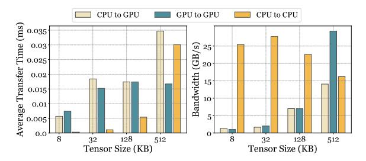

<span id="page-9-2"></span>Figure 5: Transfer time (*left*) and bandwidth (*right*) of different tensor size.

also observe that when the data size becomes larger, the copy efficiency of HBM becomes higher than that of DRAM.

Another key observation is: that there exist overlapping neurons between tokens. Figure 6 shows the overlapping neurons in each layer and their average ratio. Almost 80% of the neurons overlap between tokens. Thus, if we can keep these overlapped neurons in the GPU memory and only load the new neurons from DRAM to GPU memory, we can significantly reduce the among of data to be transferred and shorten the latency caused by offloading neurons to DRAM.

Overall architecture: Based on the above observations and analysis, we propose *high-performance layer-based HBM cache*, shown in Figure 7. Specifically, this layer-based cache assigns each layer a *isolated cache unit*. For example, for the LLaMA-2-7B model, which has 32 layers, this HBM cache consists of 32 isolated cache units. In each isolated cache unit, the space is continuous in HBM, and its capacity is allocated based on the number of activated neurons. If the number of activated neurons is

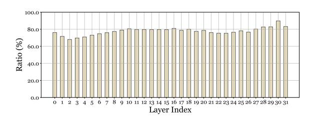

<span id="page-10-1"></span>Figure 6: Overlapped neuron ratio between Tokens in different layers. (first half part)

n and the size of each neuron is m, the capacity of a separate cache is n\*m. The continuous memory is designed to reduce memory copying overhead when updating the cache, and this continuous memory can be directly used for inference computation, avoiding unnecessary copying from the cache to inference tensors.

Cache Policy: The cache policy is used to update the neurons in each separate cache during inference for different tokens. Here, we employ the Adjacent Token Update (ATU) cache policy. ATU only updates the neurons that differ between tokens, and we don't use algorithms like sliding windows proposed by LLM-in-a-Flash or the most widely used LRU [86] that always retain the hot neurons in the cache. ATU is a trade-off between cache hit ratio and cache management overhead (primarily memory copying overhead). As shown in Figure 6, with the proposed high-performance layer-

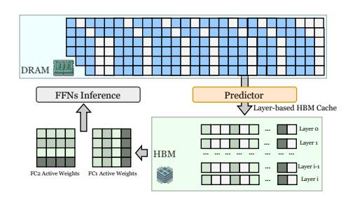

<span id="page-10-2"></span>Figure 7: High Performance Layer-based HBM Cache

based HBM cache with ATU, the cache hit ratio can reach about 80%, and the cache management overhead is nearly zero.

#### <span id="page-10-0"></span>5.4. Pattern-Aware Preloading for SSD

To address the space limitation of DRAM and improve the overall sustainability, we propose to cache all the model weights in SSD. We designed a flexible and pluggable cache interface for the SSD layer in the proposed multilevel cache, which can be replaced by other flash cache designs including CacheLib [87], Kangaroo [88], or carbon-sustainable solutions like FairyWREN [89]. However, the limited bandwidth and high latency between SSD and DRAM will significantly influence the inference latency. As shown in Figure 4, we observe that the inference latency on SSD (store model weights on SSD and loading the requested neu-

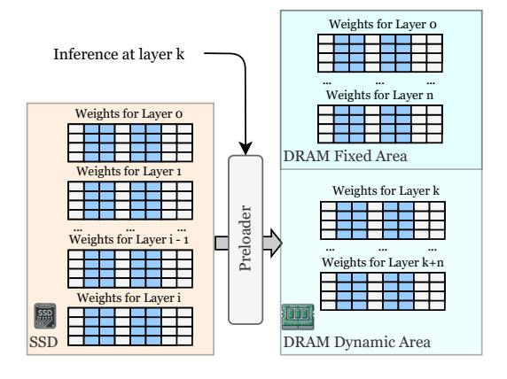

<span id="page-10-3"></span>Figure 8: Pre-loading and Tow-level DRAM Cache

rons to HBM during inference) is approximately 8 times slower than on DRAM and 85 times slower than on HBM.

To efficiently reduce the impact of offloading to SSD, one method is to employ DRAM as the cache tier for SSD and pre-load the model weights to DRAM. There are two solutions for pre-loading: 1) layer-wise; this method directly pre-loads all the neurons of the next few layers from SSD to DRAM in advance. And 2) neuron-level; compared with the layer-wise method, this approach only preloads the predicted activated neurons of the next few layers. Generally, these two methods have their pros and cons.

For layer-wise pre-loading, it's simple and effective because it pre-loads all the neurons from SSD to DRAM. There is no complex neuron management, selecting, and memory allocation, and it can loading all the neurons to DRAM without sacrificing the inference accuracy. However, since it preloads all the neurons, there exist neurons that are actually not activated, which can waste the loading bandwidth and DRAM space utilizations. For neuron-level pre-loading, it can achieve high memory and bandwidth efficiency since only the predicted activated neurons are identified and loaded from SSD to DRAM. However, it has two key problems. On one hand, it involves complex management. When you load these neurons from SSD to DRAM, you need to map the index of the neurons in the original layer to the address in DRAM. Unlike GPU cache, the DRAM cache capacity is much larger, leading to high memory management overhead. On the other hand, this approach can explicitly influence the prediction accuracy. Although we can use the predictor to estimate the activated neurons of the next several layers based on the current layer, there exist estimation errors that can influence the accuracy [\[41,](#page-18-10) [61\]](#page-20-1). For example, when predicting the next one layer, its accuracy is almost 100%; however, for the next two layers, the accuracy drops to 80%, and so on. This means you still need to fetch the falsely predicted neurons from SSD during inference, which causes high latency.

Based on the tradeoff analysis of the two schemes mentioned above, we propose *pattern-aware SSD preloading*, as shown in Figure [8.](#page-10-3) It consists of two main modules: 1) preloader, which is used to preload the next a few layers of neurons to be used, load them from the SSD, and insert them into DRAM. And 2) the two-level DRAM cache, which stores and manages the preloaded layers.

To design a preloader, there are two main factors we need to determine: 1) when to preload the neurons of one layer based on the inference progress such that the loading latency can be hidden, and 2) which neurons in a certain layer should be loaded such that there will be no explicit accuracy impact. First, based on our experiments, the one-layer neuron preloading time (from SSD to DRAM cache) is approximately twice as long as the one layer inference time. Therefore, we only need to preload the neuron from the layer that is two or more layers ahead of the current layer inference. Second, we propose to preload the entire layer to DRAM by identifying the missing neurons in DRAM. Second, the two-level DRAM cache consists of two partitions: the fixed area and the dynamic area. The fixed area stores the first n layers of the model. The dynamic area stores the subsequent layers relative to the current layer and changes dynamically during inference based on different layers. The fixed area is used to avoid reloading the first n layers each time inference begins for a new token. The dynamic area is used to avoid reloading layers that have already been inferred.

#### **5.5. Discussion**

#### **5.5.1. The Advantage of** M2Cache

M2Cache achieves a better trade-off between carbon emission, inference latency, and available hardware. It utilizes old-fashioned GPUs and low-carbon storage media like available DRAM and SSD for inference. It enables LLM inference on old-fashioned GPUs such as the M40 and 3090 by effectively addressing the limited HBM capacity. It implements a model modularization algorithm that ranks neurons based on their importance, optimizing resource allocation. Moreover, it utilizes dynamic sparse mixed-precision quantization, which reduces both computational demand and communication overhead, improving inference efficiency. Additionally, it introduces a three-level cache system (HBM, DRAM, SSD) that optimizes memory usage and performance. By leveraging older GPUs and improving communication efficiency, M2Cache helps reduce operational carbon emissions. It is also worth noting that M2Cache is orthogonal to KV cache optimization methods [\[43,](#page-18-12) [50,](#page-19-3) [51\]](#page-19-4), as our approach specifically focuses on the offloading of model parameters. By integrating M2Cache with KV cache offloading, it is possible to further enhance memory efficiency.

#### **5.5.2. Limitations**

Despite its advantages, M2Cache has several limitations. First it's still high inference latency. Its reliance on SSDs introduces much higher latency, even with optimizations such as pre-loading and high-performance cache designs. Second, M2Cache can only work for small batch size scenarios. This is due to the Deja Vu predictor; its prediction accuracy is poor under large batch size scenarios, thus M2Cache also performs poorly under large batch sizes.

# **6. Experiments**

### **6.1. Implementation Details**

We implement M2Cache using Pytorch and Python. For the FFN predictors, we adopt the training method from Deja Vu [\[61\]](#page-20-1), which includes an adaptive training enhancement. M2Cache handles model execution by integrating popular large language models (LLMs) like LLaMA-2 [\[60\]](#page-20-0) and Falcon [\[90\]](#page-22-1), utilizing the Transformer architecture [\[91\]](#page-22-2). We employ a multi-level cache management system that uses dedicated CUDA streams to transfer data across GPUs and DRAM. Additionally, separate I/O threads facilitate the movement of data between the host memory and SSDs, pre-loading layers in advance. This setup allows for the overlapping of data transfer with LLM inference calculations.

#### **6.2. Experimental Setup**

**Hardware.** Our inference performance experiments are conducted on a system equipped with a single GeForce RTX 3090 featuring 24GB of HBM, running Ubuntu 22.04. The system configuration also includes 64GB of DRAM, 1TB SSDs, and the CPU is AMD 6950x.

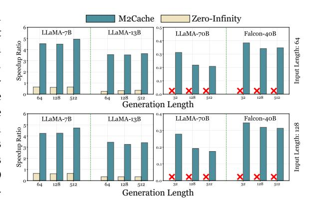

<span id="page-12-0"></span>Figure 9: *Generation Speed of various models in FP16 format.* The X-axis indicates the generation text length. The Y axis represents the end-to-end generation speed (token/s). The first row of the figure is configured with an input length of around 64, and the second row with an input length of approximately 128. For LLaMA-70B, the inference speed of ZeRO-Infinity drops to about 0.02 tokens per second. The excessively low generation speed makes using ZeRO-Infinity for inference on models of 70B scale impractical.

**Models.** We evaluate the open-sourced LLaMA-2 model across multiple model sizes—7B, 13B, and 70B—and the Falcon model at 40B. Our evaluations employ mixed-precision formats, including FP16, INT8, and INT4, aligning with contemporary practices in LLM research [\[41,](#page-18-10) [61\]](#page-20-1).

**Baseline Method.** We benchmark M2Cache against Zero-Infinity [\[56\]](#page-19-7), a state-of-the-art LLM inference framework. Although other frameworks like Powerinfer [\[41\]](#page-18-10) are available, they exhibit higher latency under limited CPU computation power. Hence, Deepspeed-Infinity, which focuses on GPUonly computing, serves as a more relevant benchmark for our evaluation.

#### 6.3. End-to-End Evaluations

We begin our evaluation by comparing the end-to-end inference performance of M2Cache and Zero-Infinity under a typical local deployment setting with a batch size of one [92]. We use prompts sampled from wikitext [81], ranging from 64 to 128 sentence length. Both M2Cache and Zero-Infinity are tested to generate responses of 64, 128, and 512 tokens for each prompt.

Figure 9 depicts the generation speeds of various models across different input-output configurations. On average, M2Cache outperforms Zero-Infinity with significant speedups, achieving up to 10x faster performance on LLaMA-7B. This advantage of M2Cache is particularly noticeable as the output token count rises, highlighting the increased impact of the generation phase on total inference time. During this phase, M2Cache utilizes a mix of floating-point precision levels in feed-forward networks (FFNs), which includes 25% FP16 neurons, 25% INT8 neurons, and 50% INT4 neurons, as seen in the LLaMA-13B model. This diverse precision strategy reduces communica-

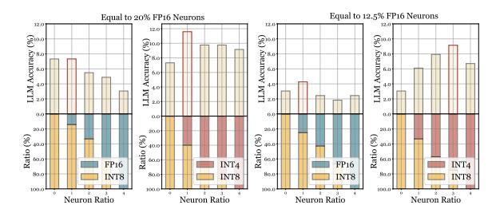

<span id="page-13-0"></span>Figure 10: The inference accuracy in HumanEval [93] variety across different ratios of float-point precision. The red box is the ratio of different precision neurons obtained by Algorithm 1.

tion overheads compared to Zero-Infinity. Furthermore, M2Cache's MP Inference allows for the use of all neurons while consuming only 50% of the memory required for full-precision neurons. This efficient use of resources underscores the performance benefits of M2Cache.

The HumanEval requires LLM decoding multiple steps to generate excusable Python code. Therefore, this task can thoroughly evaluate the effect of different ratios of float-point precision. Figure 10 shows the inference accuracy for various ratios of floating-point neurons. Within the same GPU memory constraints, M2Cache optimizes the mixed of FP neurons to maximize performance, achieving an average improvement of 2.8% over traditional single-precision

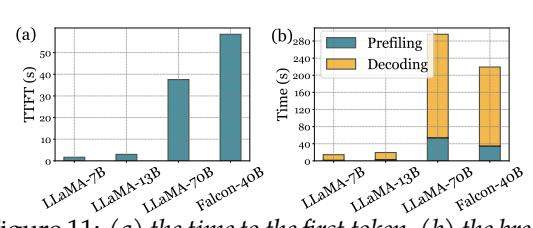

<span id="page-13-1"></span>Figure 11: (a) the time to the first token, (b) the break-down GPU time.

inference methods. This enhancement stems from the ability of mixed-precision inference to accommodate more neurons under the same memory budget. The inclusion of lower-precision neurons is crucial, as it can load more neurons under the same memory budgets. This strategy enables the LLM to maintain high accuracy levels. Furthermore, the neuron ratio determined by Algorithm 1 outperforms other ratios, demonstrating the effectiveness of the algorithm.

Figure 11 displays the time to the first token and the breakdown of GPU time. As the model size increases, the time to generate the first token also rises, while the proportion of decoding time relative to the entire runtime decreases. The time to the first token is particularly higher for the Falcon-40B model due to its unique architectural design.

Figure 12 illustrates the carbon emission reduc-

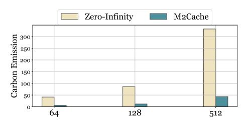

<span id="page-13-2"></span>Figure 12: The carbon footprint of M2Cache.

tions achieved by M2Cache, ranging from  $42\ gCO2$  to  $280\ gCO2$ . These improvements stem from scaling up the model, which leads to the use of more sparse activations and lower precision neurons. These changes not only decrease the FLOPs required during decoding but also reduce memory demands on both the GPU and DRAM compared to Zero-Infinity.

#### 6.4. Ablation Evaluations

Performance Breakdown. We assess the impact of each component within M2Cache carbon emissions, decoding speed, and GPU and DRAM usage. Figure13 details the contributions of individual M2Cache. We adopt a step-by-step integration approach to progressively implement M2Cache. Initially, we introduce MP Inference (labeled "+MP Inference"), which enables dynamic sparse inference with mixed precision neurons. However, this stage lacks neuron-level cache management and does not incorporate SSDs.

Building upon "+MP Inference", we integrate M2Cache's neuron-level cache (denoted "+LRU Cache"), which utilizes an LRU cache on the GPU to conserve GPU-DRAM bandwidth. The final enhancement includes adding SSDs ("+SSDs") to the "+LRU Cache" configuration, demonstrating the full potential of M2Cache.


<span id="page-14-0"></span>Figure 13: The ablation study for each component of M2Cache. The energy consumption of DRAM is 26W for 256GB, and the energy consumption of SSD is 2W [94, 95]. The carbon intensity is 820 gCO2/kWh [72].

The initial integration of "+MP Inference" provides performance boosts around 1 token/s, mainly by reducing the volume of data communicated. The addition of "+LRU Cache" further increases these gains to 4.62 token/s, leveraging the GPU cache to significantly cut down on data communication volume. Finally, the inclusion of "+SSDs" achieves reductions of 22 GB in DRAM usage and the carbon emissions remain the same. This enhancement is facilitated by our preload policy, which conserves DRAM without compromising inference performance.

#### 6.5. LLM Accuracy

Because M2Cache selectively omits neurons predicted to be inactive and uses mixed floating-point precision, we studied how it affects LLM accuracy. The results, shown in Table 14, demonstrate that M2Cache results in only a negligible loss in inference accuracy, regardless of the model size or task type. While the predictors in each Transformer layer maintain an accuracy rate above 95% [61], they occasionally fail to identify some active neurons. Consequently, this leads to minor fluctuations in LLM accuracy, which may result in slight decreases

<span id="page-14-1"></span>Figure 14: Comparison of LLM accuracy: HumanEval [93], which accesses the code-writing capabilities; PIQA [96], evaluating understanding of commonsense knowledge, RTE [97], measuring the major semantic inference; and COPA [98] examining commonsense causal reasoning.

|                           | HumanEval | PIQA   | RTE    | COPA   |
|---------------------------|-----------|--------|--------|--------|
| LLaMA (ReGLU)-7B          | 0.1280    | 0.7008 | 0.5343 | 0.8000 |
| LLaMA (ReGLU)-7B M2Cache  | 0.1159    | 0.7122 | 0.5343 | 0.8000 |
| LLaMA (ReGLU)-13B         | 0.1707    | 0.7106 | 0.4729 | 0.6500 |
| LLaMA (ReGLU)-13B M2Cache | 0.1280    | 0.6970 | 0.4729 | 0.6800 |
|                           |           |        |        |        |

or sometimes increases in performance on certain downstream tasks. Compared to single precision inference, mixed precision generally delivers better performance because it allows for loading more neurons at lower precision

#### 7. Related Work

Large Language Models (LLMs) Since the introduction of Transformer architecture [99], it has become the dominant network architecture for language modeling [13, 18, 60, 74, 99–102]. Following the scaling law of transformer-based language models [103, 104], we have seen significant performance improvement by increasing the number of parameters in the model [12, 14, 15, 57–59]. Today the number of parameters for most commonly used LLMs ranges from 7B to 65B[5, 13, 16, 18–

[20,](#page-17-0) [60,](#page-20-0) [74\]](#page-20-13), and the weights of these models are stored as 16-bit floating point numbers, which results in a consumption of 14 GB to 130 GB storage just to hold parameters of a model disregarding the storage of KV cache during inference. The amount of consumed storage poses a heavy stress on resource-constrained or old-fashioned computers, making it infeasible to benefit from the performance gain of scaling up number of parameters.

**LLM Inference Acceleration.** LLM inference is an autoregressive process that generates every new token based on previous tokens. The attention mechanism used in LLMs requires O(n 2 ) computation operations on a sentence of n tokens[\[99\]](#page-23-0), making the inference on GPU-constrained machines slow. To solve this issue, many methods have been proposed[\[41,](#page-18-10) [43,](#page-18-12) [62,](#page-20-2) [63,](#page-20-3) [105,](#page-23-4) [106\]](#page-23-5). vLLM[\[63\]](#page-20-3), TensorRT-LLM[\[107\]](#page-23-6) and TGI[\[108\]](#page-23-7) use PagedAttention[\[63\]](#page-20-3) to reduce the memory waste in KV cache and achieve flexible sharing of KV cache within and across query requests, leading to higher throughput of LLMs. However, these methods don't consider the case when it is unable to hold the entire model in GPU memory, restricting their application on GPU memory-constrained systems. Powerinfer offloads partial parameters of other storage devices like DRAM and SSDs, reducing the GPU memory requirement for LLM inference. However, when the CPU resource is limited, the inference efficiency can be poor.

**Storage Management for Deep Learning Models.** With the fast progress of deploying deep learning (DL) models in various applications, many research works have proposed methods of storage management for DL models. Quiver[\[109\]](#page-23-8) proposed an informed storage cache to improve the throughput of DL training jobs. SHADE[\[110\]](#page-23-9) is a caching system designed for I/O optimizations during distributed deep learning training. To this end, our framework is making pioneering efforts of storage management in LLM inference.

# **8. Conclusion**

This paper proposes M2Cache, a model cache co-design inference engine can deploy LLM in hardware with limited HBM and DRAM, even the HBM and DRAM together can not load the LLM. To improve the sustainability and decrease the carbon emission of M2Cache, we design the dynamic sparse mixed precision inference and multi-level cache Extensive experimental results demonstrate that M2Cache significantly decreases the inference speed, and decrease the LLM inference carbon footprint.

# **References**

- <span id="page-15-0"></span>[1] Kashif Abbass, Muhammad Zeeshan Qasim, Huaming Song, Muntasir Murshed, Haider Mahmood, and Ijaz Younis. A review of the global climate change impacts, adaptation, and sustainable mitigation measures. *Environmental Science and Pollution Research*, 29(28):42539– 42559, June 2022. ISSN 1614-7499. doi: 10.1007/s11356-022-19718-6.
- <span id="page-15-1"></span>[2] Rui Ma, Nabila Abid, Suchang Yang, and Fayyaz Ahmad. From crisis to resilience: Strengthening climate action in oecd countries through environmental policy and energy transition. *Environmental Science and Pollution Research International*, 30(54):115480–115495, 2023. ISSN 0944-1344. doi: 10.1007/s11356-023-29970-z.
- <span id="page-15-2"></span>[3] Preventing the immense increase in the life-cycle energy and carbon footprints of llmpowered intelligent chatbots. *Engineering*, April 2024. ISSN 2095-8099. doi: 10.1016/j.eng. 2024.04.002.
- <span id="page-15-3"></span>[4] Tina Vartziotis, Maximilian Schmidt, George Dasoulas, Ippolyti Dellatolas, Stefano Attademo, Viet Dung Le, Anke Wiechmann, Tim Hoffmann, Michael Keckeisen, and Sotirios Kotsopoulos. Carbon footprint evaluation of code generation through llm as a service. In André Casal Kulzer, Hans-Christian Reuss, and Andreas Wagner, editors, *2024 Stuttgart International Symposium on Automotive and Engine Technology*, pages 230–241, Wiesbaden, 2024. Springer Fachmedien. ISBN 978-3-658-45010-6. doi: 10.1007/978-3-658-45010-6\_15.

- <span id="page-16-0"></span>[5] Wei-Lin Chiang, Zhuohan Li, Zi Lin, Ying Sheng, Zhanghao Wu, Hao Zhang, Lianmin Zheng, Siyuan Zhuang, Yonghao Zhuang, Joseph E. Gonzalez, Ion Stoica, and Eric P. Xing. Vicuna: An open-source chatbot impressing gpt-4 with 90%\* chatgpt quality, March 2023. URL [https:](https://lmsys.org/blog/2023-03-30-vicuna/) [//lmsys.org/blog/2023-03-30-vicuna/](https://lmsys.org/blog/2023-03-30-vicuna/).
- [6] Danny Driess, Fei Xia, Mehdi S. M. Sajjadi, Corey Lynch, Aakanksha Chowdhery, Brian Ichter, Ayzaan Wahid, Jonathan Tompson, Quan Vuong, Tianhe Yu, Wenlong Huang, Yevgen Chebotar, Pierre Sermanet, Daniel Duckworth, Sergey Levine, Vincent Vanhoucke, Karol Hausman, Marc Toussaint, Klaus Greff, Andy Zeng, Igor Mordatch, and Pete Florence. Palm-e: An embodied multimodal language model, March 2023.
- [7] Hyung Won Chung, Le Hou, Shayne Longpre, Barret Zoph, Yi Tay, William Fedus, Yunxuan Li, Xuezhi Wang, Mostafa Dehghani, Siddhartha Brahma, Albert Webson, et al. Scaling instruction-finetuned language models, December 2022.
- <span id="page-16-3"></span>[8] Susan Zhang, Stephen Roller, Naman Goyal, Mikel Artetxe, Moya Chen, Shuohui Chen, Christopher Dewan, Mona Diab, Xian Li, Xi Victoria Lin, Todor Mihaylov, Myle Ott, Sam Shleifer, Kurt Shuster, Daniel Simig, Punit Singh Koura, Anjali Sridhar, Tianlu Wang, and Luke Zettlemoyer. Opt: Open pre-trained transformer language models, June 2022.
- [9] Aakanksha Chowdhery, Sharan Narang, Jacob Devlin, Maarten Bosma, Gaurav Mishra, Adam Roberts, Paul Barham, Hyung Won Chung, Charles Sutton, Sebastian Gehrmann, Parker Schuh, Kensen Shi, et al. Palm: Scaling language modeling with pathways, October 2022.
- [10] Victor Sanh, Albert Webson, Colin Raffel, Stephen H. Bach, Lintang Sutawika, Zaid Alyafeai, Antoine Chaffin, Arnaud Stiegler, Teven Le Scao, Arun Raja, Manan Dey, M. Saiful Bari, Canwen Xu, et al. Multitask prompted training enables zero-shot task generalization, March 2022.
- <span id="page-16-1"></span>[11] Jason Wei, Maarten Bosma, Vincent Zhao, Kelvin Guu, Adams Wei Yu, Brian Lester, Nan Du, Andrew M. Dai, and Quoc V. Le. Finetuned language models are zero-shot learners. In *International Conference on Learning Representations*, October 2021.
- <span id="page-16-2"></span>[12] Josh Achiam, Steven Adler, Sandhini Agarwal, Lama Ahmad, Ilge Akkaya, Florencia Leoni Aleman, Diogo Almeida, Janko Altenschmidt, Sam Altman, Shyamal Anadkat, et al. Gpt-4 technical report. *arXiv preprint arXiv:2303.08774*, 2023.
- <span id="page-16-4"></span>[13] Abhimanyu Dubey, Abhinav Jauhri, Abhinav Pandey, Abhishek Kadian, Ahmad Al-Dahle, Aiesha Letman, Akhil Mathur, Alan Schelten, Amy Yang, Angela Fan, et al. The llama 3 herd of models. *arXiv preprint arXiv:2407.21783*, 2024.
- <span id="page-16-5"></span>[14] Rohan Anil, Sebastian Borgeaud, Yonghui Wu, Jean-Baptiste Alayrac, Jiahui Yu, Radu Soricut, Johan Schalkwyk, Andrew M Dai, Anja Hauth, Katie Millican, et al. Gemini: A family of highly capable multimodal models. *arXiv preprint arXiv:2312.11805*, 1, 2023.
- <span id="page-16-6"></span>[15] Machel Reid, Nikolay Savinov, Denis Teplyashin, Dmitry Lepikhin, Timothy Lillicrap, Jeanbaptiste Alayrac, Radu Soricut, Angeliki Lazaridou, Orhan Firat, Julian Schrittwieser, et al. Gemini 1.5: Unlocking multimodal understanding across millions of tokens of context. *arXiv preprint arXiv:2403.05530*, 2024.
- <span id="page-16-7"></span>[16] Gemma Team, Thomas Mesnard, Cassidy Hardin, Robert Dadashi, Surya Bhupatiraju, Shreya Pathak, Laurent Sifre, Morgane Rivière, Mihir Sanjay Kale, Juliette Love, et al. Gemma: Open models based on gemini research and technology. *arXiv preprint arXiv:2403.08295*, 2024.
- [17] Damai Dai, Chengqi Deng, Chenggang Zhao, R. X. Xu, Huazuo Gao, Deli Chen, Jiashi Li, Wangding Zeng, Xingkai Yu, Y. Wu, Zhenda Xie, Y. K. Li, Panpan Huang, Fuli Luo, Chong Ruan, Zhifang Sui, and Wenfeng Liang. Deepseekmoe: Towards ultimate expert specialization in mixture-of-experts language models, January 2024.

- <span id="page-17-8"></span>[18] Albert Q Jiang, Alexandre Sablayrolles, Arthur Mensch, Chris Bamford, Devendra Singh Chaplot, Diego de las Casas, Florian Bressand, Gianna Lengyel, Guillaume Lample, Lucile Saulnier, et al. Mistral 7b. *arXiv preprint arXiv:2310.06825*, 2023.
- [19] Jinze Bai, Shuai Bai, Yunfei Chu, Zeyu Cui, Kai Dang, Xiaodong Deng, Yang Fan, Wenbin Ge, Yu Han, Fei Huang, et al. Qwen technical report. *arXiv preprint arXiv:2309.16609*, 2023.
- <span id="page-17-0"></span>[20] An Yang, Baosong Yang, Binyuan Hui, Bo Zheng, Bowen Yu, Chang Zhou, Chengpeng Li, Chengyuan Li, Dayiheng Liu, Fei Huang, et al. Qwen2 technical report. *arXiv preprint arXiv:2407.10671*, 2024.
- <span id="page-17-1"></span>[21] BigScience Workshop, Teven Le Scao, Angela Fan, Christopher Akiki, Ellie Pavlick, Suzana Ilić, Daniel Hesslow, Roman Castagné, Alexandra Sasha Luccioni, François Yvon, Matthias Gallé, Jonathan Tow, Alexander M. Rush, Stella Biderman, Albert Webson, Pawan Sasanka Ammanamanchi, Thomas Wang, Benoît Sagot, et al. Bloom: A 176b-parameter open-access multilingual language model, June 2023.
- [22] Aohan Zeng, Xiao Liu, Zhengxiao Du, Zihan Wang, Hanyu Lai, Ming Ding, Zhuoyi Yang, Yifan Xu, Wendi Zheng, Xiao Xia, Weng Lam Tam, Zixuan Ma, Yufei Xue, Jidong Zhai, Wenguang Chen, Peng Zhang, Yuxiao Dong, and Jie Tang. Glm-130b: An open bilingual pretrained model, October 2023.
- <span id="page-17-2"></span>[23] Rafael Rafailov, Archit Sharma, Eric Mitchell, Stefano Ermon, Christopher D. Manning, and Chelsea Finn. Direct preference optimization: Your language model is secretly a reward model, July 2024.
- <span id="page-17-3"></span>[24] Reiichiro Nakano, Jacob Hilton, S. Balaji, Jeff Wu, Ouyang Long, Christina Kim, Christopher Hesse, Shantanu Jain, V. Kosaraju, W. Saunders, Xu Jiang, K. Cobbe, Tyna Eloundou, Gretchen Krueger, Kevin Button, Matthew Knight, B. Chess, and John Schulman. Webgpt: Browserassisted question-answering with human feedback. *ArXiv*, December 2021.
- <span id="page-17-4"></span>[25] Shamane Siriwardhana, Rivindu Weerasekera, Elliott Wen, Tharindu Kaluarachchi, Rajib Rana, and Suranga Nanayakkara. Improving the domain adaptation of retrieval augmented generation (rag) models for open domain question answering. *Transactions of the Association for Computational Linguistics*, 11:1–17, January 2023. ISSN 2307-387X. doi: 10.1162/tacl\_a\_ 00530.
- <span id="page-17-5"></span>[26] Mark Chen, Jerry Tworek, Heewoo Jun, Qiming Yuan, Henrique Ponde de Oliveira Pinto, Jared Kaplan, Harri Edwards, Yuri Burda, Nicholas Joseph, Greg Brockman, et al. Evaluating large language models trained on code, July 2021.
- [27] Ansong Ni, Srini Iyer, Dragomir Radev, Veselin Stoyanov, Wen-Tau Yih, Sida Wang, and Xi Victoria Lin. Lever: Learning to verify language-to-code generation with execution. In *Proceedings of the 40th International Conference on Machine Learning*, pages 26106–26128. PMLR, July 2023.
- [28] Sirui Hong, Mingchen Zhuge, Jonathan Chen, Xiawu Zheng, Yuheng Cheng, Ceyao Zhang, Jinlin Wang, Zili Wang, Steven Ka Shing Yau, Zijuan Lin, Liyang Zhou, Chenyu Ran, Lingfeng Xiao, Chenglin Wu, and Jürgen Schmidhuber. Metagpt: Meta programming for a multi-agent collaborative framework, November 2023.
- <span id="page-17-6"></span>[29] Niklas Muennighoff, Qian Liu, Armel Zebaze, Qinkai Zheng, Binyuan Hui, Terry Yue Zhuo, Swayam Singh, Xiangru Tang, Leandro von Werra, and Shayne Longpre. Octopack: Instruction tuning code large language models, February 2024.
- <span id="page-17-7"></span>[30] Carole-Jean Wu, Ramya Raghavendra, Udit Gupta, Bilge Acun, Newsha Ardalani, Kiwan Maeng, Gloria Chang, Fiona Aga, Jinshi Huang, Charles Bai, Michael Gschwind, Anurag Gupta, Myle Ott, Anastasia Melnikov, Salvatore Candido, David Brooks, Geeta Chauhan,

- Benjamin Lee, Hsien-Hsin Lee, Bugra Akyildiz, Maximilian Balandat, Joe Spisak, Ravi Jain, Mike Rabbat, and Kim Hazelwood. Sustainable ai: Environmental implications, challenges and opportunities. *Proceedings of Machine Learning and Systems*, 4:795–813, April 2022.
- <span id="page-18-0"></span>[31] Ithier d'Aramon, Boris Ruf, and Marcin Detyniecki. Assessing carbon footprint estimations of chatgpt. In Philip Pong, editor, *Renewable Energy Resources and Conservation*, pages 127– 133. Springer Nature Switzerland, Cham, 2024. ISBN 978-3-031-59005-4. doi: 10.1007/ 978-3-031-59005-4\_15.
- <span id="page-18-1"></span>[32] A review on carbon emission accounting approaches for the electricity power industry. *Applied Energy*, 359:122681, April 2024. ISSN 0306-2619. doi: 10.1016/j.apenergy.2024.122681.
- <span id="page-18-2"></span>[33] Grant Wilkins, Srinivasan Keshav, and Richard Mortier. Hybrid heterogeneous clusters can lower the energy consumption of llm inference workloads. In *Proceedings of the 15th ACM International Conference on Future and Sustainable Energy Systems*, E-Energy '24, pages 506–513, New York, NY, USA, May 2024. Association for Computing Machinery. ISBN 9798400704802. doi: 10.1145/3632775.3662830.
- <span id="page-18-3"></span>[34] Armand from nocode.ai. The future of ai is in inference. https://newsletter.nocode.ai/p/future-ai-inference.
- <span id="page-18-4"></span>[35] Turning old laptops into gold - how panasonic's revive program cuts out e-waste. https://diginomica.com/turning-old-laptops-gold-how-panasonics-revive-program-cutsout-e-waste, August 2023.
- <span id="page-18-5"></span>[36] Jennifer Switzer, Gabriel Marcano, Ryan Kastner, and Pat Pannuto. Junkyard computing: Repurposing discarded smartphones to minimize carbon. In *Proceedings of the 28th ACM International Conference on Architectural Support for Programming Languages and Operating Systems, Volume 2*, ASPLOS 2023, pages 400–412, New York, NY, USA, January 2023. Association for Computing Machinery. ISBN 978-1-4503-9916-6. doi: 10.1145/3575693.3575710.
- <span id="page-18-6"></span>[37] Grant Wilkins, Srinivasan Keshav, and Richard Mortier. Offline energy-optimal llm serving: Workload-based energy models for llm inference on heterogeneous systems, 2024.
- <span id="page-18-7"></span>[38] Siddharth Samsi, Dan Zhao, Joseph McDonald, Baolin Li, Adam Michaleas, Michael Jones, William Bergeron, Jeremy Kepner, Devesh Tiwari, and Vijay Gadepally. From words to watts: Benchmarking the energy costs of large language model inference. In *2023 IEEE High Performance Extreme Computing Conference (HPEC)*, pages 1–9, September 2023. doi: 10.1109/HPEC58863.2023.10363447.
- <span id="page-18-8"></span>[39] Chi-Heng Lin, Shikhar Tuli, James Smith, Yen-Chang Hsu, Yilin Shen, and Hongxia Jin. Slim: Speculative decoding with hypothesis reduction. In Kevin Duh, Helena Gomez, and Steven Bethard, editors, *Findings of the Association for Computational Linguistics: NAACL 2024*, pages 1005–1017, Mexico City, Mexico, June 2024. Association for Computational Linguistics. doi: 10.18653/v1/2024.findings-naacl.63.
- <span id="page-18-9"></span>[40] Keivan Alizadeh, Iman Mirzadeh, Dmitry Belenko, Karen Khatamifard, Minsik Cho, Carlo C. Del Mundo, Mohammad Rastegari, and Mehrdad Farajtabar. Llm in a flash: Efficient large language model inference with limited memory, January 2024.
- <span id="page-18-10"></span>[41] Yixin Song, Zeyu Mi, Haotong Xie, and Haibo Chen. Powerinfer: Fast large language model serving with a consumer-grade gpu. *arXiv preprint arXiv:2312.12456*, 2023.
- <span id="page-18-11"></span>[42] Mingjie Sun, Zhuang Liu, Anna Bair, and J. Zico Kolter. A simple and effective pruning approach for large language models, October 2023.
- <span id="page-18-12"></span>[43] Zhenyu Zhang, Ying Sheng, Tianyi Zhou, Tianlong Chen, Lianmin Zheng, Ruisi Cai, Zhao Song, Yuandong Tian, Christopher Ré, Clark Barrett, et al. H2o: Heavy-hitter oracle for efficient generative inference of large language models. *Advances in Neural Information Processing Systems*, 36, 2024.

- <span id="page-19-0"></span>[44] Mengzhou Xia, Tianyu Gao, Zhiyuan Zeng, and Danqi Chen. Sheared LLaMA: Accelerating Language Model Pre-training via Structured Pruning, April 2024.
- <span id="page-19-1"></span>[45] Markus Nagel, Marios Fournarakis, Rana Ali Amjad, Yelysei Bondarenko, Mart Van Baalen, and Tijmen Blankevoort. A white paper on neural network quantization. *arXiv preprint arXiv:2106.08295*, 2021.
- [46] Amir Gholami, Sehoon Kim, Zhen Dong, Zhewei Yao, Michael W. Mahoney, and Kurt Keutzer. A survey of quantization methods for efficient neural network inference, 2021. URL <https://arxiv.org/abs/2103.13630>.
- <span id="page-19-9"></span>[47] Elias Frantar, Saleh Ashkboos, Torsten Hoefler, and Dan Alistarh. Gptq: Accurate posttraining quantization for generative pre-trained transformers. *arXiv preprint arXiv:2210.17323*, 2022.
- <span id="page-19-10"></span>[48] Ji Lin, Jiaming Tang, Haotian Tang, Shang Yang, Wei-Ming Chen, Wei-Chen Wang, Guangxuan Xiao, Xingyu Dang, Chuang Gan, and Song Han. Awq: Activation-aware weight quantization for on-device llm compression and acceleration. *Proceedings of Machine Learning and Systems*, 6:87–100, 2024.
- <span id="page-19-2"></span>[49] Tim Dettmers, Mike Lewis, Younes Belkada, and Luke Zettlemoyer. Llm.int8(): 8-bit matrix multiplication for transformers at scale, 2022. URL <https://arxiv.org/abs/2208.07339>.
- <span id="page-19-3"></span>[50] Zhenyu Zhang, Ying Sheng, Tianyi Zhou, Tianlong Chen, Lianmin Zheng, Ruisi Cai, Zhao Song, Yuandong Tian, Christopher Ré, Clark Barrett, Zhangyang Wang, and Beidi Chen. H\$\_2\$o: Heavy-hitter oracle for efficient generative inference of large language models, July 2023.
- <span id="page-19-4"></span>[51] Ruikang Liu, Haoli Bai, Haokun Lin, Yuening Li, Han Gao, Zhengzhuo Xu, Lu Hou, Jun Yao, and Chun Yuan. Intactkv: Improving large language model quantization by keeping pivot tokens intact, March 2024.
- <span id="page-19-5"></span>[52] Ying Sheng, Lianmin Zheng, Binhang Yuan, Zhuohan Li, Max Ryabinin, Beidi Chen, Percy Liang, Christopher Ré, Ion Stoica, and Ce Zhang. Flexgen: High-throughput generative inference of large language models with a single gpu. In *International Conference on Machine Learning*, pages 31094–31116. PMLR, 2023.
- [53] Xiaoming Yuan, Weixuan Kong, Zhenyu Luo, and Minrui Xu. Efficient inference offloading for mixture-of-experts large language models in internet of medical things. *Electronics*, 13 (11):2077, January 2024. ISSN 2079-9292. doi: 10.3390/electronics13112077.
- [54] Wonbeom Lee, Jungi Lee, Junghwan Seo, and Jaewoong Sim. {InfiniGen}: Efficient generative inference of large language models with dynamic {KV} cache management. In *18th USENIX Symposium on Operating Systems Design and Implementation (OSDI 24)*, pages 155–172, 2024. ISBN 978-1-939133-40-3.
- <span id="page-19-6"></span>[55] Xiurui Pan, Endian Li, Qiao Li, Shengwen Liang, Yizhou Shan, Ke Zhou, Yingwei Luo, Xiaolin Wang, and Jie Zhang. Instinfer: In-storage attention offloading for cost-effective long-context llm inference, September 2024.
- <span id="page-19-7"></span>[56] Zero-inference: Democratizing massive model inference. https://www.deepspeed.ai/2022/09/09/zero-inference.html, September 2022.
- <span id="page-19-8"></span>[57] A Radford. Improving language understanding by generative pre-training. 2018.
- [58] Alec Radford, Jeffrey Wu, Rewon Child, David Luan, Dario Amodei, Ilya Sutskever, et al. Language models are unsupervised multitask learners. *OpenAI blog*, 1(8):9, 2019.
- <span id="page-19-11"></span>[59] Luciano Floridi and Massimo Chiriatti. Gpt-3: Its nature, scope, limits, and consequences. *Minds and Machines*, 30:681–694, 2020.

- <span id="page-20-0"></span>[60] Hugo Touvron, Louis Martin, Kevin Stone, Peter Albert, Amjad Almahairi, Yasmine Babaei, Nikolay Bashlykov, Soumya Batra, Prajjwal Bhargava, Shruti Bhosale, et al. Llama 2: Open foundation and fine-tuned chat models. *arXiv preprint arXiv:2307.09288*, 2023.
- <span id="page-20-1"></span>[61] Zichang Liu, Jue Wang, Tri Dao, Tianyi Zhou, Binhang Yuan, Zhao Song, Anshumali Shrivastava, Ce Zhang, Yuandong Tian, Christopher Re, and Beidi Chen. Deja vu: Contextual sparsity for efficient llms at inference time, October 2023.
- <span id="page-20-2"></span>[62] Baolin Li, Yankai Jiang, Vijay Gadepally, and Devesh Tiwari. Llm inference serving: Survey of recent advances and opportunities. *arXiv preprint arXiv:2407.12391*, 2024.
- <span id="page-20-3"></span>[63] Woosuk Kwon, Zhuohan Li, Siyuan Zhuang, Ying Sheng, Lianmin Zheng, Cody Hao Yu, Joseph E. Gonzalez, Hao Zhang, and Ion Stoica. Efficient memory management for large language model serving with pagedattention. In *Proceedings of the ACM SIGOPS 29th Symposium on Operating Systems Principles*, 2023.
- <span id="page-20-4"></span>[64] Pavlo Molchanov, Stephen Tyree, Tero Karras, Timo Aila, and Jan Kautz. Pruning convolutional neural networks for resource efficient inference. *arXiv preprint arXiv:1611.06440*, 2016.
- [65] Zhuang Liu, Mingjie Sun, Tinghui Zhou, Gao Huang, and Trevor Darrell. Rethinking the value of network pruning. *arXiv preprint arXiv:1810.05270*, 2018.
- <span id="page-20-5"></span>[66] Torsten Hoefler, Dan Alistarh, Tal Ben-Nun, Nikoli Dryden, and Alexandra Peste. Sparsity in deep learning: Pruning and growth for efficient inference and training in neural networks. *Journal of Machine Learning Research*, 22(241):1–124, 2021.
- <span id="page-20-6"></span>[67] Elias Frantar and Dan Alistarh. Sparsegpt: Massive language models can be accurately pruned in one-shot. In *International Conference on Machine Learning*, pages 10323–10337. PMLR, 2023.
- <span id="page-20-7"></span>[68] Hritik Bansal, Karthik Gopalakrishnan, Saket Dingliwal, Sravan Bodapati, Katrin Kirchhoff, and Dan Roth. Rethinking the role of scale for in-context learning: An interpretability-based case study at 66 billion scale. *arXiv preprint arXiv:2212.09095*, 2022.
- <span id="page-20-8"></span>[69] Guangxuan Xiao, Ji Lin, Mickael Seznec, Hao Wu, Julien Demouth, and Song Han. Smoothquant: Accurate and efficient post-training quantization for large language models. In *Proceedings of the 40th International Conference on Machine Learning*, pages 38087–38099. PMLR, July 2023.
- <span id="page-20-9"></span>[70] Tim Dettmers and Luke Zettlemoyer. The case for 4-bit precision: K-bit inference scaling laws. In *Proceedings of the 40th International Conference on Machine Learning*, pages 7750–7774. PMLR, July 2023.
- <span id="page-20-10"></span>[71] Jaylen Wang, Daniel S Berger, Fiodar Kazhamiaka, Celine Irvene, Chaojie Zhang, Esha Choukse, Kali Frost, Rodrigo Fonseca, Brijesh Warrier, Chetan Bansal, et al. Designing cloud servers for lower carbon. In *2024 ACM/IEEE 51st Annual International Symposium on Computer Architecture (ISCA)*, pages 452–470. IEEE, 2024.
- <span id="page-20-11"></span>[72] Udit Gupta, Mariam Elgamal, Gage Hills, Gu-Yeon Wei, Hsien-Hsin S Lee, David Brooks, and Carole-Jean Wu. Act: Designing sustainable computer systems with an architectural carbon modeling tool. In *Proceedings of the 49th Annual International Symposium on Computer Architecture*, pages 784–799, 2022.
- <span id="page-20-12"></span>[73] Carole-Jean Wu. Scaling AI sustainably: An uncharted territory. Santa Clara, CA, July 2024. USENIX Association.
- <span id="page-20-13"></span>[74] Hugo Touvron, Thibaut Lavril, Gautier Izacard, Xavier Martinet, Marie-Anne Lachaux, Timothée Lacroix, Baptiste Rozière, Naman Goyal, Eric Hambro, Faisal Azhar, et al. Llama: Open and efficient foundation language models. *arXiv preprint arXiv:2302.13971*, 2023.

- <span id="page-21-0"></span>[75] Alexandra Sasha Luccioni, Sylvain Viguier, and Anne-Laure Ligozat. Estimating the carbon footprint of bloom, a 176b parameter language model. *Journal of Machine Learning Research*, 24(253):1–15, 2023.
- <span id="page-21-1"></span>[76] Super micro computer, inc. home page - blades, servers, motherboards, chassis and more. https://www.supermicro.com/.
- <span id="page-21-2"></span>[77] Zhewei Yao, Xiaoxia Wu, Cheng Li, Stephen Youn, and Yuxiong He. Zeroquant-v2: Exploring post-training quantization in llms from comprehensive study to low rank compensation, May 2023.
- <span id="page-21-3"></span>[78] Bin Gao, Zhuomin He, Puru Sharma, Qingxuan Kang, Djordje Jevdjic, Junbo Deng, Xingkun Yang, Zhou Yu, and Pengfei Zuo. {Cost-Efficient} large language model serving for multi-turn conversations with {CachedAttention}. In *2024 USENIX Annual Technical Conference (USENIX ATC 24)*, pages 111–126, 2024. ISBN 978-1-939133-41-0.
- <span id="page-21-4"></span>[79] Shouq Alsubaihi and Jean-Luc Gaudiot. A runtime workload distribution with resource allocation for cpu-gpu heterogeneous systems. In *2017 IEEE International Parallel and Distributed Processing Symposium Workshops (IPDPSW)*, pages 994–1003, May 2017. doi: 10.1109/ IPDPSW.2017.19.
- <span id="page-21-5"></span>[80] Yoji Yamato. Proposal and evaluation of gpu offloading parts reconfiguration during applications operations for environment adaptation. *Journal of Network and Systems Management*, 32(1):11, November 2023. ISSN 1573-7705. doi: 10.1007/s10922-023-09789-2.
- <span id="page-21-6"></span>[81] Stephen Merity, Caiming Xiong, James Bradbury, and Richard Socher. Pointer sentinel mixture models, 2016.
- <span id="page-21-7"></span>[82] Cedric Nugteren, Gert-Jan Van den Braak, Henk Corporaal, and Henri Bal. A detailed gpu cache model based on reuse distance theory. In *2014 IEEE 20th International Symposium on High Performance Computer Architecture (HPCA)*, pages 37–48. IEEE, 2014.
- <span id="page-21-8"></span>[83] Bin Wang, Weikuan Yu, Xian-He Sun, and Xinning Wang. Dacache: Memory divergenceaware gpu cache management. In *Proceedings of the 29th ACM on International Conference on Supercomputing*, pages 89–98, 2015.
- <span id="page-21-9"></span>[84] Zhiqi Lin, Cheng Li, Youshan Miao, Yunxin Liu, and Yinlong Xu. Pagraph: Scaling gnn training on large graphs via computation-aware caching. In *Proceedings of the 11th ACM Symposium on Cloud Computing*, pages 401–415, 2020.
- <span id="page-21-10"></span>[85] Keivan Alizadeh, Iman Mirzadeh, Dmitry Belenko, Karen Khatamifard, Minsik Cho, Carlo C Del Mundo, Mohammad Rastegari, and Mehrdad Farajtabar. Llm in a flash: Efficient large language model inference with limited memory. *arXiv preprint arXiv:2312.11514*, 2023.
- <span id="page-21-11"></span>[86] Christine Fricker, Philippe Robert, and James Roberts. A versatile and accurate approximation for lru cache performance. In *2012 24th international teletraffic congress (ITC 24)*, pages 1–8. IEEE, 2012.
- <span id="page-21-12"></span>[87] Benjamin Berg, Daniel S Berger, Sara McAllister, Isaac Grosof, Sathya Gunasekar, Jimmy Lu, Michael Uhlar, Jim Carrig, Nathan Beckmann, Mor Harchol-Balter, et al. thecachelib caching engine: Design and experiences at scale. In *14th USENIX Symposium on Operating Systems Design and Implementation (OSDI 20)*, pages 753–768, 2020.
- <span id="page-21-13"></span>[88] Sara McAllister, Benjamin Berg, Julian Tutuncu-Macias, Juncheng Yang, Sathya Gunasekar, Jimmy Lu, Daniel S Berger, Nathan Beckmann, and Gregory R Ganger. Kangaroo: Caching billions of tiny objects on flash. In *Proceedings of the ACM SIGOPS 28th symposium on operating systems principles*, pages 243–262, 2021.

- <span id="page-22-0"></span>[89] Sara McAllister, Yucong "Sherry" Wang, Benjamin Berg, Daniel S. Berger, George Amvrosiadis, Nathan Beckmann, and Gregory R. Ganger. FairyWREN: A sustainable cache for emerging Write-Read-Erase flash interfaces. In *18th USENIX Symposium on Operating Systems Design and Implementation (OSDI 24)*, pages 745–764, Santa Clara, CA, July 2024. USENIX Association. ISBN 978-1-939133-40-3. URL [https://www.usenix.org/conference/osdi24/](https://www.usenix.org/conference/osdi24/presentation/mcallister) [presentation/mcallister](https://www.usenix.org/conference/osdi24/presentation/mcallister).
- <span id="page-22-1"></span>[90] Guilherme Penedo, Quentin Malartic, Daniel Hesslow, Ruxandra Cojocaru, Alessandro Cappelli, Hamza Alobeidli, Baptiste Pannier, Ebtesam Almazrouei, and Julien Launay. The RefinedWeb dataset for Falcon LLM: outperforming curated corpora with web data, and web data only. *arXiv preprint arXiv:2306.01116*, 2023. URL <https://arxiv.org/abs/2306.01116>.
- <span id="page-22-2"></span>[91] Thomas Wolf, Lysandre Debut, Victor Sanh, Julien Chaumond, Clement Delangue, Anthony Moi, Pierric Cistac, Tim Rault, Remi Louf, Morgan Funtowicz, Joe Davison, Sam Shleifer, Patrick von Platen, Clara Ma, Yacine Jernite, Julien Plu, Canwen Xu, Teven Le Scao, Sylvain Gugger, Mariama Drame, Quentin Lhoest, and Alexander Rush. Transformers: State-of-theart natural language processing. In Qun Liu and David Schlangen, editors, *Proceedings of the 2020 Conference on Empirical Methods in Natural Language Processing: System Demonstrations*, pages 38–45, Online, October 2020. Association for Computational Linguistics. doi: 10.18653/ v1/2020.emnlp-demos.6.
- <span id="page-22-3"></span>[92] Tianle Cai, Yuhong Li, Zhengyang Geng, Hongwu Peng, Jason D. Lee, Deming Chen, and Tri Dao. Medusa: Simple llm inference acceleration framework with multiple decoding heads. *arXiv preprint arXiv: 2401.10774*, 2024.
- <span id="page-22-4"></span>[93] Mark Chen, Jerry Tworek, Heewoo Jun, Qiming Yuan, Henrique Ponde de Oliveira Pinto, Jared Kaplan, Harri Edwards, Yuri Burda, Nicholas Joseph, Greg Brockman, Alex Ray, Raul Puri, Gretchen Krueger, Michael Petrov, Heidy Khlaaf, Girish Sastry, Pamela Mishkin, Brooke Chan, Scott Gray, Nick Ryder, Mikhail Pavlov, Alethea Power, Lukasz Kaiser, Mohammad Bavarian, Clemens Winter, Philippe Tillet, Felipe Petroski Such, Dave Cummings, Matthias Plappert, Fotios Chantzis, Elizabeth Barnes, Ariel Herbert-Voss, William Hebgen Guss, Alex Nichol, Alex Paino, Nikolas Tezak, Jie Tang, Igor Babuschkin, Suchir Balaji, Shantanu Jain, William Saunders, Christopher Hesse, Andrew N. Carr, Jan Leike, Josh Achiam, Vedant Misra, Evan Morikawa, Alec Radford, Matthew Knight, Miles Brundage, Mira Murati, Katie Mayer, Peter Welinder, Bob McGrew, Dario Amodei, Sam McCandlish, Ilya Sutskever, and Wojciech Zaremba. Evaluating large language models trained on code. 2021.
- <span id="page-22-5"></span>[94] Ssds vs. hdds: The green power consumption advantage with cvb sata ssd. https://www.ssstc.com/knowledge-detail/ssd-vs-hdd-power-efficiency/.
- <span id="page-22-6"></span>[95] Seunghak Lee, Ki-Dong Kang, Hwanjun Lee, Hyungwon Park, Younghoon Son, Nam Sung Kim, and Daehoon Kim. Greendimm: Os-assisted dram power management for dram with a sub-array granularity power-down state. In *MICRO-54: 54th Annual IEEE/ACM International Symposium on Microarchitecture*, pages 131–142, 2021.
- <span id="page-22-7"></span>[96] Yonatan Bisk, Rowan Zellers, Ronan Le Bras, Jianfeng Gao, and Yejin Choi. Piqa: Reasoning about physical commonsense in natural language. In *Thirty-Fourth AAAI Conference on Artificial Intelligence*, 2020.
- <span id="page-22-8"></span>[97] Adam Poliak. A survey on recognizing textual entailment as an nlp evaluation. In Steffen Eger, Yang Gao, Maxime Peyrard, Wei Zhao, and Eduard Hovy, editors, *Proceedings of the First Workshop on Evaluation and Comparison of NLP Systems*, pages 92–109, Online, November 2020. Association for Computational Linguistics. doi: 10.18653/v1/2020.eval4nlp-1.10.
- <span id="page-22-9"></span>[98] Melissa Roemmele, Cosmin Adrian Bejan, and Andrew S Gordon. Choice of plausible alternatives: An evaluation of commonsense causal reasoning. In *2011 AAAI Spring Symposium Series*, 2011. URL [https://people.ict.usc.edu/~gordon/publications/AAAI-SPRING11A.](https://people.ict.usc.edu/~gordon/publications/AAAI-SPRING11A.PDF) [PDF](https://people.ict.usc.edu/~gordon/publications/AAAI-SPRING11A.PDF).

- <span id="page-23-0"></span>[99] Ashish Vaswani. Attention is all you need. *arXiv preprint arXiv:1706.03762*, 2017.
- [100] Wayne Xin Zhao, Kun Zhou, Junyi Li, Tianyi Tang, Xiaolei Wang, Yupeng Hou, Yingqian Min, Beichen Zhang, Junjie Zhang, Zican Dong, et al. A survey of large language models. *arXiv preprint arXiv:2303.18223*, 2023.
- [101] Shervin Minaee, Tomas Mikolov, Narjes Nikzad, Meysam Chenaghlu, Richard Socher, Xavier Amatriain, and Jianfeng Gao. Large language models: A survey. *arXiv preprint arXiv:2402.06196*, 2024.
- <span id="page-23-1"></span>[102] Jacob Devlin. Bert: Pre-training of deep bidirectional transformers for language understanding. *arXiv preprint arXiv:1810.04805*, 2018.
- <span id="page-23-2"></span>[103] Jared Kaplan, Sam McCandlish, Tom Henighan, Tom B Brown, Benjamin Chess, Rewon Child, Scott Gray, Alec Radford, Jeffrey Wu, and Dario Amodei. Scaling laws for neural language models. *arXiv preprint arXiv:2001.08361*, 2020.
- <span id="page-23-3"></span>[104] Jordan Hoffmann, Sebastian Borgeaud, Arthur Mensch, Elena Buchatskaya, Trevor Cai, Eliza Rutherford, Diego de Las Casas, Lisa Anne Hendricks, Johannes Welbl, Aidan Clark, et al. Training compute-optimal large language models. *arXiv preprint arXiv:2203.15556*, 2022.
- <span id="page-23-4"></span>[105] Zhenliang Xue, Yixin Song, Zeyu Mi, Le Chen, Yubin Xia, and Haibo Chen. Powerinfer-2: Fast large language model inference on a smartphone. *arXiv preprint arXiv:2406.06282*, 2024.
- <span id="page-23-5"></span>[106] MLC team. MLC-LLM, 2023. URL <https://github.com/mlc-ai/mlc-llm>.
- <span id="page-23-6"></span>[107] Nvidia tensorrt-llm. https://docs.nvidia.com/tensorrt-llm/index.html.
- <span id="page-23-7"></span>[108] Adyen. Llm inference at scale with tgi. https://www.adyen.com/knowledge-hub/llminference-at-scale-with-tgi.
- <span id="page-23-8"></span>[109] Abhishek Vijaya Kumar and Muthian Sivathanu. Quiver: An informed storage cache for deep learning. In *18th USENIX Conference on File and Storage Technologies (FAST 20)*, pages 283–296, 2020.
- <span id="page-23-9"></span>[110] Redwan Ibne Seraj Khan, Ahmad Hossein Yazdani, Yuqi Fu, Arnab K Paul, Bo Ji, Xun Jian, Yue Cheng, and Ali R Butt. {SHADE}: Enable fundamental cacheability for distributed deep learning training. In *21st USENIX Conference on File and Storage Technologies (FAST 23)*, pages 135–152, 2023.